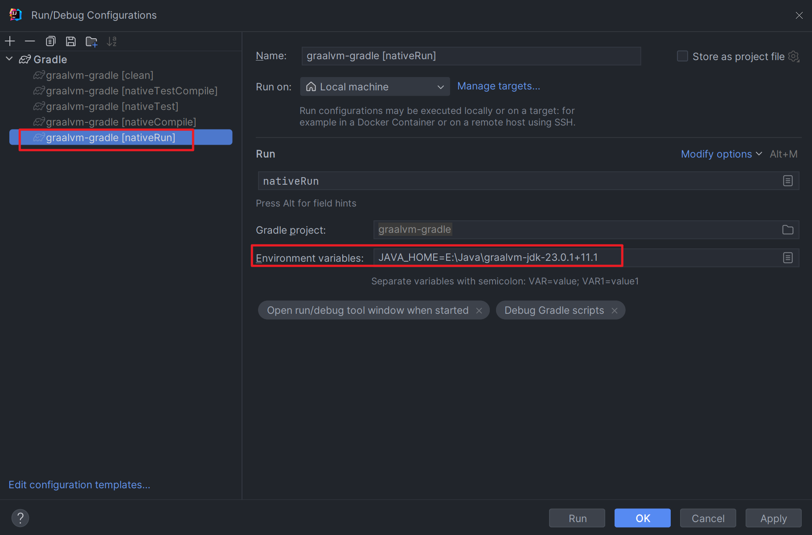

## 安转GraalVM

Linux: https://www.graalvm.org/latest/getting-started/linux/

macOS: https://www.graalvm.org/latest/getting-started/macos/

windows: https://www.graalvm.org/latest/getting-started/windows/


下面简单介绍windows的安装过程, 翻译自https://www.graalvm.org/latest/getting-started/windows/

1. 在如下地址下载graalvm的社区版本https://github.com/graalvm/graalvm-ce-builds/releases

      或者在如下地址下载graalvm的企业版https://www.oracle.com/java/technologies/downloads/#java17

      需要注意的是: 每一个jdk版本都有一个对应的graalvm的对应版本

2. 解压到相关目录

3. 配置对应的目录为`Java_Home`, 并添加`$Java_Home/bin`到Path中

4. 执行如下命

   ~~~cmd
   E:\Java\graalvm-jdk-23_windows-x64_bin\graalvm-jdk-23.0.1+11.1\bin>java --version
   java 23.0.1 2024-10-15
   Java(TM) SE Runtime Environment Oracle GraalVM 23.0.1+11.1 (build 23.0.1+11-jvmci-b01)
   Java HotSpot(TM) 64-Bit Server VM Oracle GraalVM 23.0.1+11.1 (build 23.0.1+11-jvmci-b01, mixed mode, sharing)
   
   E:\Java\graalvm-jdk-23_windows-x64_bin\graalvm-jdk-23.0.1+11.1\bin>native-image.cmd --version
   native-image 23.0.1 2024-10-15
   GraalVM Runtime Environment Oracle GraalVM 23.0.1+11.1 (build 23.0.1+11-jvmci-b01)
   Substrate VM Oracle GraalVM 23.0.1+11.1 (build 23.0.1+11, serial gc, compressed references)
   ~~~

5. 从https://visualstudio.microsoft.com/thank-you-downloading-visual-studio/?sku=BuildTools&rel=16下载vs

6. 安装vs

   

7. 在主窗口中选择**“使用 C++ 进行桌面开发”**复选框。在右侧的“安装详细信息”下，确保选中**“Windows 11 SDK”**和**“MSVC (…) C++ x64/x86 构建工具”**这两个要求。单击**“安装”**继续。

   

8. 如果你已经安转了Visual Studio, 那么你可以通过如下步骤来检查是否已经安装了相关的组件

   1. 打开 Visual Studio 安装程序：

      

   2. 在“已安装”选项卡下，单击**“修改”**并选择**“单个组件”** ：

      

   3. 然后滚动到底部并确认已选中 `Windows 11 SDK` 和 `Visual Studio SDK` 复选框

9. 编写一个java案例

   ~~~java
   public class HelloWorld {
     public static void main(String[] args) {
       System.out.println("Hello, World!");
     }
   }
   ~~~

   ~~~bash
   javac HelloWorld.java
   native-image HelloWorld
   ./helloworld
   Hello, World!
   ~~~


## NativeImage的构建命令

~~~shell
# 从main类构建一个二进制文件, 可以通过-cp <classpath>来指定, 多个jar包在windows上使用冒号分割
native-image [options] <mainclass> [imagename] [options] 
# 从一个jar包中构建二进制文件
native-image [options] -jar jarfile [imagename] [options]
# 从一个Java module中构建二进制文件
native-image [options] -m <module>/<mainClass> [imagename] [options] 
~~~

在构建的时候, 可能会耗时几分钟, 可以通过如下命令在执行完构建的时候, 来通知前台

Linux:

~~~shell
# Ring the terminal bell
native-image -jar App.jar ... ; printf '\a'

# Use libnotify to create a desktop notification
native-image -jar App.jar ... ; notify-send "GraalVM Native Image build completed with exit code $?"

# Use Zenity to open an info dialog box with text
native-image -jar App.jar ... ; zenity --info --text="GraalVM Native Image build completed with exit code $?"
~~~

macOS

~~~shell
# Ring the terminal bell
native-image -jar App.jar ... ; printf '\a'

# Use Speech Synthesis
native-image -jar App.jar ... ; say "GraalVM Native Image build completed"
~~~

windows

~~~shell
# Ring the terminal bell (press Ctrl+G to enter ^G)
native-image.exe -jar App.jar & echo ^G

# Open an info dialog box with text
native-image.exe -jar App.jar & msg "%username%" GraalVM Native Image build completed
~~~


## Native Image

https://www.graalvm.org/latest/reference-manual/native-image/basics/

Native Image是将Java代码编译为本地可执行二进制文件, 二进制文件中仅包含运行时所需要的代码, 即

- 应用程序类
- 标准类库
- 特定语言的runtime
- 来自jdk的静态链接的native代码

Native Image生成的可执行文件有几个重要的优点, 即:

1. 立即提供最佳性能，无需预热
2. 可打包成轻量级容器镜像，实现快速高效部署
3. 减少攻击
4. 运行成本更低


在生成二进制文件的过程中，**Native Image 可以运行用户代码**。最后，Native Image 将编译后的用户代码、Java  Runtime的部分（例如，垃圾收集器、线程支持）以及代码执行结果链接到二进制文件中。

**在Native Image构建期间执行代码被称为build time,  而二进制文件执行时被称为run time**

同时为了生成最小的image, Native Image采用了静态分析的功能


### Build Time和Run Time

**在镜像构建过程中，Native Image 可能会执行用户代码**。这可能会产生副作用，例如对类的静态字段赋值。此时静态字段的值保存在二进制文件的[**image heap**](https://www.graalvm.org/latest/reference-manual/native-image/basics/#native-image-heap)中

对于JVM来说, 类在被import的时候会将其加载到JVM中, 然后触发其静态代码块进行初始化.

**而对于Native Image, 构建时会初始化main类, 并执行static代码块, 创建static属性, 同时在初始化main类的过程中, 每一个使用到的类都会被初始化并执行static代码块, 创建static属性 **

**需要注意的是, 仅仅import类并不一定会初始化它.** 

**如果类在构建时已经初始化过了，则其静态字段将保存在生成的二进制文件的image heap中。在运行时，第一次使用这样的类不会触发类初始化。**


用户可以通过如下方式来让一个类在build time时初始化

- 在调用`native-image`生成二进制文件时, 指定`--initialize-at-build-time=<class>`
- 如果一个类A在构建时初始化的时候, 使用到了B(比如静态代码块), 那么B也会在构建时被初始化

Native Image 将在image构建时初始化常用的 JDK 类，例如`java.lang.String` 、 `java.util.**`等。


以下案例说明了build time和run time之间的区别:

~~~java
public class HelloWorld {
    static class Greeter {
        static {
            new Foo();
            System.out.println("Greeter is getting ready!");
        }
        
        public static void greet() {
          System.out.println("Hello, World!");
        }
    }
    static class Foo {
        static {
            System.out.println("Foo is getting ready!");
        }
    }

  public static void main(String[] args) {
    Greeter.greet();
  }
}
~~~

直接通过jvm执行输出如下:

~~~java
E:\Java\graalvm-jdk-23.0.1+11.1\bin>javac HelloWorld.java

E:\Java\graalvm-jdk-23.0.1+11.1\bin>java HelloWorld
Foo is getting ready!
Greeter is getting ready!
Hello, World!
~~~

下面我们通过`native-image`构建二进制文件, 然后执行他

~~~cmd
E:\Java\graalvm-jdk-23.0.1+11.1\bin>javac HelloWorld.java

E:\Java\graalvm-jdk-23.0.1+11.1\bin>native-image HelloWorld
=======================================================
GraalVM Native Image: Generating 'helloworld' (executable)...
=======================================================
...
Finished generating 'helloworld' in 32.8s.

E:\Java\graalvm-jdk-23.0.1+11.1\bin>helloworld.exe
Foo is getting ready!
Greeter is getting ready!
Hello, World!
~~~

下面我们通过`native-image`构建二进制文件, 并指定在构建时初始化Greeter, 看看会发生什么

~~~cmd
E:\Java\graalvm-jdk-23.0.1+11.1\bin>javac HelloWorld.java

E:\Java\graalvm-jdk-23_windows-x64_bin\graalvm-jdk-23.0.1+11.1\bin>native-image HelloWorld --initialize-at-build-time=HelloWorld$Greeter
==========================================================
GraalVM Native Image: Generating 'helloworld' (executable)...
=============================================================
...
Foo is getting ready!
Greeter is getting ready!
...
Finished generating 'helloworld' in 31.0s.

E:\Java\graalvm-jdk-23_windows-x64_bin\graalvm-jdk-23.0.1+11.1\bin>helloworld.exe
Hello, World!
~~~

我们看到`Foo is getting ready!Greeter is getting ready!`在build time时就已经打印了, 说明Greeter和Foo类是在build time时就被初始化的. 在run time时, Greeter和Foo已经初始化,  所以就不再初始化了. 而build time期间赋值的静态字段, 他们的值就保存在image heap中


### image heap

image heap中主要包含:

- 在build time期间创建的, 并且在run time期间会使用的对象
- run time期间所使用到的所有的Class对象

- 方法中会使用到的常量, 通常是字符串常量

当二进制文件启动时，它会复制image heap。

将对象包含在image heap中的一种方式是在构建时初始化类:

~~~java
class Example {
    private static final String message;
    
    static {
        message = System.getProperty("message");
    }

    public static void main(String[] args) {
        System.out.println("Hello, World! My message is: " + message);
    }
}
~~~

现在我们在 JVM 上编译并运行该应用程序：

~~~cmd
javac Example.java
java -Dmessage=hi Example
Hello, World! My message is: hi
~~~

~~~cmd
java -Dmessage=hello Example 
Hello, World! My message is: hello
~~~

~~~cmd
java Example
Hello, World! My message is: null
~~~

现在我们通过native image来创建二进制文件看看会发生什么

~~~bash
native-image Example --initialize-at-build-time=Example -Dmessage=native
==========================================================
GraalVM Native Image: Generating 'example' (executable)...
===========================================================
...
Finished generating 'example' in 19.0s.

./example 
Hello, World! My message is: native

./example -Dmessage=aNewMessage
Hello, World! My message is: native
~~~

可以看到, 对于编译后的二进制文件, message的值已经固定了, 无法在更改了


### 静态分析

静态分析是确定应用程序使用哪些程序元素（类、方法和字段）的过程。这些元素也称为**reachable code**。静态分析分为两个部分：

- **扫描方法的字节码以确定可以从该方法访问哪些其他元素。**
- **扫描image heap中的根对象（例如static字段）以确定可以从它们访问哪些类。它从应用程序的入口点（ `main`方法）开始。迭代扫描新发现的元素，直到进一步扫描不会对元素的可达性产生额外的变化。**

**只有可达的元素会被包含在最终的二进制文件中, 并且一旦二进制文件生成了, 就无法再run time期间加载新的元素, 比如通过class loading**


## 可达性元数据

https://www.graalvm.org/latest/reference-manual/native-image/metadata/

JVM 的动态语言功能（例如，反射和资源处理）可以在程序运行时动态的访问程序的元素，例如字段、方法或资源 URL。在 HotSpot 上这是可能的，因为所有类文件和资源在运行时都可用，并且可以由Runtime加载。所有可用的类和资源, 已经在运行时加载他们都会带来内存和启动时间的额外开销。

为了使本机二进制文件变小， `native-image`构建器在构建时执行[静态分析](https://www.graalvm.org/latest/reference-manual/native-image/basics/#static-analysis-reachability-and-closed-world-assumption)，以仅确定应用程序所需的必要程序元素。小二进制文件允许快速应用程序启动和低内存占用，但它们是有代价的：**通过静态分析确定动态访问的应用程序元素是不可行的，因为这些元素的可达性取决于在运行时期间的数据。**

为了确保将所有需要的动态访问元素包含到本机二进制文件中， `native-image`构建器需要**可达性元数据**（以下简称*元数据*）。为构建器提供正确且详尽的可达性元数据可以保证应用程序的正确性并确保在运行时与第三方库的兼容性。

`native-image`构建器会通过一下的方式来获取可达的元数据

- 通过[在二进制文件的build time期间](https://www.graalvm.org/latest/reference-manual/native-image/basics/#image-build-time-vs-image-run-time)[通过代码计算元素的可达性](https://www.graalvm.org/latest/reference-manual/native-image/metadata/#computing-metadata-in-code)并将所需元素存储到[二进制文件的image heap中](https://www.graalvm.org/latest/reference-manual/native-image/basics/#native-image-heap)。
- 通过读取类路径上的`META-INF/native-image/<groupId>/<artifactId>/`目录中的[*reachability-metadata.json*文件](https://www.graalvm.org/latest/reference-manual/native-image/metadata/#specifying-metadata-with-json)。有关如何自动收集应用程序元数据的更多信息，请参阅[自动收集元数据](https://www.graalvm.org/latest/reference-manual/native-image/metadata/AutomaticMetadataCollection/)。
- For more advanced use cases, where classpath scanning or build-time initialization is needed, by using the [Native Image Feature API](https://www.graalvm.org/sdk/javadoc/org/graalvm/nativeimage/hosted/Feature.html).
  

### 通过代码收集元数据

有两种方式可以实现通过代码来提供相应的可达性元数据

- **对于动态访问元素的方法, 比如`Class#forName`,  给他们的参数提供常量**

  ~~~java
   class ReflectiveAccess {
       public Class<Foo> fetchFoo() throws ClassNotFoundException {
           return Class.forName("Foo");
       }
   }
  ~~~

  上面代码中, 可以在build time期间就执行`Class.forName("Foo")`并将其返回值保存在image heep中, 如果Foo类不存在, 则对`Class#forName`调用将转换为 `throw ClassNotFoundException("Foo")` 。

  以下情况被认为是常量

  - 字面量, 比如Foo, 1
  - 在build time期间就已经初始化了的static字段
  - 一个final变量
  - 一个长度恒定, 所有值都恒定的数组
  - 上述常量的简单计算, 比如"F" + "oo"

- **在build time期间就执行需要动态访问的代码, 并将其结果存储在image heap中.**

  这种方式通常用来无法使用常量, 或者通过json指定元数据的情况, 比如

  - 用户代码需要生成新的类字节码
  - 用户代码需要遍历classpath来计算动态范围的元素

  比如在以下示例中, 就在build time期间执行了动态访问的代码, 并保存结果在aClass中

  **注意: 如果静态扫描的时候, 通过main类的static代码块, 或者image heap中的root object无法遍历到这个类, 并且也没有通过命令行--initialize-at-build-time=<class>指定该类, 也没有通过, 就不会执行static代码块**

  ~~~java
   class InitializedAtBuildTime {
       private static Class<?> aClass;
       static {
           try {
               aClass = Class.forName(readFile("class.txt"));
           } catch (ClassNotFoundException e) {
               throw RuntimeException(e);
           }
       }
  
       public Class<?> fetchFoo() {
           return aClass;
       }
   }
  ~~~


### 通过JSON指定元数据

可以有多重方式来指定元数据的位置:

1. 可以在classpath的任意包的`META-INF/native-image/<groupId>/<artifactId>/reachability-metadata.json`文件中指定所有元数据

2. 如果`reachability-metadata.json`文件不在上面的目录下,  但是在classpath下, 那么可以通过如下选项来指定

   ~~~shell
   # 必须指定json所在的目录
   native-image -H:ConfigurationFileDirectories=/path/to/config-dir/
   ~~~

3. 如果`reachability-metadata.json`不在classpath下, 那么可以通过如下选项来指定目录

   ~~~shell
   # 必须指定json所在的目录
   native-image -H:ConfigurationResourceRoots=path/to/resources/
   ~~~

该文件的格式可以查看`https://www.graalvm.org/docs/reference-manual/native-image/assets/reachability-metadata-schema-v1.0.0.json`


该json中只有一个大对象, 然后每种类型的元数据对应一个字段, 每个字段都是数组, 数组元素也是对象,用来指定元数据的详细信息

~~~json
{
  "reflection":[{}, {}, {}, {}], // 反射的元数据
  "resources":[{}, {}, {}, {}], 
  "bundles":[{}, {}, {}, {}],
  "serialization":[{}, {}, {}, {}], // 序列化与反序列化的元数据
  "jni":[{}, {}, {}, {}] // java native interface的元数据
}
~~~


#### 反射类型的元数据

我们可以通过反射来动态的加载Class, 主要使用的方法有:

- Class#forName
- Class#arrayType()
- ClassLoader#loadClass()

要为如上动态加载类的调用提供元数据, 可以在`reachability-metadata.json`中指定如下数据

~~~json
{
  "reflection":[{
      "type": "FullyQualifiedReflectivelyAccessedType"
  }] 
}
~~~


而对于代理类，使用`java.lang.reflect.Proxy`上的以下方法获取`java.lang.Class` ：

- `java.lang.Class getProxyClass(java.lang.ClassLoader, java.lang.Class[])`
- `java.lang.Object newProxyInstance(java.lang.ClassLoader, java.lang.Class[], java.lang.reflect.InvocationHandler)`

要为以上的调用指定元数据, 可以通过如下方式:

```json
{
  "reflection":[{
    "proxy": ["FullyQualifiedInterface1", "...", "FullyQualifiedInterfaceN"]
  }] 
}
```


在没有提供元数据的情况下, 如果在run time期间使用了上述的调用, 那么就会抛出`MissingReflectionRegistrationError`, 因为这些类并不在生成后的二进制文件中, 

需要注意的是, 如果类路径中不存在对应的Class, 也会抛出`MissingReflectionRegistrationError`


对于动态加载的类, 要反射调用他的方法或者字段，那么也要指定对应的方法签名和字段名

```json
{
  "reflection":[{
  "type": "TypeWhoseMethodsAreInvoked",
  "methods": [
    {"name": "<methodName1>", "parameterTypes": ["<param-type1>", "<param-typeI>", "<param-typeN>"]},
    {"name": "<methodName2>", "parameterTypes": ["<param-type1>", "<param-typeI>", "<param-typeN>"]}
  ],
    "fields": [{"name": "<fieldName1>"}, {"name": "<fieldNameI>"}, {"name": "<fieldNameN>"}]
}] 
}
```

为了方便起见，可以通过在*reachability-metadata.json*中添加以下内容来允许对一组方法进行方法调用：

```json
{
  "reflection":[{
  "type": "TypeWhoseMethodsAreInvoked",
  "allDeclaredConstructors": true, // 允许调用声明的构造方法
  "allPublicConstructors": true, // 允许调用类型及其所有父类上定义的公共构造方法。
  "allDeclaredMethods": true, // 允许调用声明的普通方法。
  "allPublicMethods": true, // 允许调用类型及其所有父类上定义的公共普通方法。
  "allDeclaredFields": true, // 允许访问给定类型上声明的所有字段
  "allPublicFields": true // 允许访问给定类型及其所有父类的所有公共字段。
}] 
}
```

如果没有指定对应方法和字段的元数据, 那么在run time期间的反射调用抛出 `MissingReflectionRegistrationError` 


如果你通过`sun.misc.Unsafe#allocateInstance(Class<?>)`或者JNI中的`AllocObject(jClass)`来创建对象, 那么还需要指定

~~~java
{
  "reflection":[{
  	"type": "FullyQualifiedUnsafeAllocatedType",
  	"unsafeAllocated": true
  }] 
}
~~~

否则会抛出`MissingReflectionRegistrationError`


#### Java Native Interface类型的元数据

JNI运行native代码访问任意Java类和字段, 所以Native Image无法预测native code调用, 写入, 查找了什么, 要为使用了JNI来访问Java值的应用程序构建二进制文件, 就需要指定JNI元数据

比如以下的c语音代码

~~~c
jclass clazz = FindClass(env, "jni/accessed/Type");
~~~

查找`jni.accessed.Type`类，然后可以使用该类实例化`jni.accessed.Type` 、调用其方法或访问其字段。

所以我应该在`reachability-metadata.json`的jni字段中指定

~~~json
{
  "jni":[{
      "type": "jni.accessed.Type"
    }]
}
~~~


如果上面的jni代码还使用了`jni.accessed.Type`的字段和方法, 那么也需要指明

~~~json
{
  "jni":[{
      "type": "jni.accessed.Type",
      "fields": [{"name": "value"}],
      "methods": [
    {"name": "<methodName1>", "parameterTypes": ["<param-type1>", "<param-typeI>", "<param-typeN>"]},
    {"name": "<methodName2>", "parameterTypes": ["<param-type1>", "<param-typeI>", "<param-typeN>"]}
  ]
    }]
}
~~~

为了方便起见, 你可以通过如下方式来指定一组字段和方法

~~~java
{
  "jni":[{
      "type": "jni.accessed.Type",
      "allDeclaredConstructors": true, // 允许调用声明的构造方法
      "allPublicConstructors": true, // 允许调用类型及其所有父类上定义的公共构造方法。
      "allDeclaredMethods": true, // 允许调用声明的普通方法。
      "allPublicMethods": true, // 允许调用类型及其所有父类上定义的公共普通方法。
      "allDeclaredFields": true, // 允许访问给定类型上声明的所有字段
      "allPublicFields": true // 允许访问给定类型及其所有父类的所有公共字段。
    }]
}
~~~


#### 资源类型的元数据

Java 能够访问应用程序类路径的任何资源。资源元数据指示`native-image`构建器在生成的二进制文件中包含指定的资源和资源包。


如果在调用`java.lang.Class#getResource` and `java.lang.Class#getResourceAsStream`时

- 调用的Class是常量

- 第一个参数name是常量


那么native image会自动检测, 并包含对应的资源文件, 比如如下代码

- 调用getResourceAsStream的Class是Example.class, 是常量
- 第一个参数name是常量

那么plans/v2/conquer_the_world.txt会**自动包含在编译后的二进制文件中**

并且plan对象会在build time期间就准备好. 开箱即用

~~~java
class Example {
 public void conquerTheWorld() {
     InputStream plan = Example.class.getResourceAsStream("plans/v2/conquer_the_world.txt");
 }
}
~~~


当然我们也可以通过`reachability-metadata.json`指定要包含的资源

~~~json
{
  "resources": [
    {
      "glob": "path1/level*/**"
    }
  ]
}
~~~

在指定资源时, 有如下的规则:

- *匹配一个层级上的任意多个字符,  **可以匹配任意层级。要转义星号使用`\*`
- 不能以`/`结尾, 比如`foo/bar/`

- 不能出现两个连续的`**`, 比如`foo/**/**`

- 同一层级使用了`**`就不能使用其他内容了, 比如`foo/**bar/x`

比如有如下结构的目录

~~~txt
app-root
└── src
    └── main
        └── resources
            ├── Resource0.txt
            └── Resource1.txt
~~~

你可以使用`**/Resource*.txt`来指定包含所有资源, 使用`**/Resource0.txt`来指定Resource0.txt


当然你还可以指定要包含的资源的module(jdk9)

~~~go
{
   "resources": [
      {
        "module:": "library.module",
        "glob": "resource-file.txt" 
      }
   ]
}
~~~

上面告诉native image去library.module模块中查找resource-file.txt,  如果其他模块或者classpath中包含resource-file.txt, 不会包含在最终的二进制文件中


你可以通过如下方式来查看有哪些资源被包含在了最终的二进制文件中

1. 在使用`native-image`生成二进制文件的时候, 指定`--emit build-report`选项, 那么就可以在控制台看到所包含的的资源的信息
2. 在使用`native-image`生成二进制文件的时候, 指定`-H:+GenerateEmbeddedResourcesFile`选项生成Embedded-resources.json, 其中列出所有包含的资源

上述两种方式都会列出资源的详细信息, 比如:

- 所属模块（如果没有使用jdk9的模块功能，则为`unnamed` ）
- 名称
- 在系统上的位置
- 类型(文件/ 目录)
- 大小


#### Resource Bundles类型的元数据

Java 本地化支持 ( `java.util.ResourceBundle` ) 允许加载 L10N 资源并显示针对特定*语言环境*本地化的消息。

Native Image 需要了解应用程序使用的资源包，以便它可以将适当的资源和程序元素包含最终的二进制文件中。

~~~json
{
  "bundles": [
    {
      "name": "specific.locales.Bundle",
      "locales": ["en", "de", "sk"] // 如果不指定这个字段, 默认包含所有语言环境下的资源包
    }
  ]
}
~~~

当然你也可以在命令行中指定locales

~~~bash
# 将默认区域设置切换为瑞士, 默认的语言设置德语, 并包括法语和英语
native-image -Duser.country=CH -Duser.language=de -H:IncludeLocales=fr,en
~~~


#### 序列化类型的元数据

Java 可以序列化（或反序列化）任何实现`Serializable`接口的类。 Native Image 通过正确的序列化元数据注册来支持序列化（或反序列化）.


首先, Native Image会自动检测对`ObjectInputFilter.Config#createFilter(String pattern)`和`sun.reflect.ReflectionFactory#newConstructorForSerialization(java.lang.Class, ...)`的调用, 如果参数是常量, 那么指定的类会自动的包含到可执行二进制文件中


其次, 我们可以在`reachability-metadata.json`中指定序列化和反序列化使用到的类

~~~json
{
  "serialization": [
    {
      "type": "serialized.Type"
    }
  ]
}
~~~

如果反序列化出来的类是动态生成的代理类, 那么应该通过如下方式指定代理类的父类和接口

~~~json
{
  "serialization": [
    {
      "type": {
        "proxy": ["FullyQualifiedInterface1", "...", "FullyQualifiedInterfaceN"]
      }
    }
  ]
}
~~~

如果反序列化的过程中, 类没有无参构造函数, 我们也可以指定使用父类的无参构造函数来初始化内存, 然后回复对象的字段属性

~~~json
{
  "serialization": [
    {
      "type": "<fully-qualified-class-name>",
      "customTargetConstructorClass": "<custom-target-constructor-class>"
    }
  ]
}
~~~

#### 指定json元数据的可用条件

对于上面每一个元数据, 都可以指定一定的条件, 来限制他的生效范围, 以减少不必要的内存和二进制文件的大小

其基本格式如下:

~~~json
{
  "serialization": [
    {
      "type": "<fully-qualified-class-name>",
      "condition": {
          "typeReached": "<fully-qualified-class-name>" // 只有这个类或他的子类在二进制文件中可用时, type指定的类才在二进制文件中可用
      },
    }
  ]
}
~~~


## 使用Tracing Agent收集元数据

https://www.graalvm.org/reference-manual/native-image/metadata/AutomaticMetadataCollection/

Tracing Agent可以在程序的运行期间, 自动的收集元数据.  但是有可能对元数据的收集不够完整, 此时还需要手动的在JSON中设置元数据

首先我们使用如下命令来启动agent

~~~shell
# -agentlib必须在 -jar参数前面
$JAVA_HOME/bin/java -agentlib:native-image-agent=config-output-dir=/path/to/config-dir/ ...
~~~

运行时，agent会查找`native-image`工具需要附加信息的类、方法、字段和资源。当应用程序完成且 JVM 退出时，agent会将元数据写入指定输出目录 ( `/path/to/config-dir/` ) 中的 JSON 文件。如果 `/path/to/config-dir/`中已经有了生成的文件, 那么会**覆盖**


由于agent只从执行过的代码中收集元数据, 因此可能需要多次运行程序以提高动态功能的覆盖范围。 **`config-merge-dir`选项可以指定将新捕获的配置合并到指定目录下的现有配置文件中，而不是覆盖它们。**

~~~shell
$JAVA_HOME/bin/java -agentlib:native-image-agent=config-merge-dir=/path/to/config-dir/ ...
~~~

在通过Tracing Agent收集元数据之后, 建议手动检查生成的配置文件以确保正确性

然后将生成的配置文件内容放在`reachability-metadata.json`文件中


如果你对多个进程使用了agent , 那么会产生多组配置文件,  如果你希望合并这些配置文件, 那么可以使用如下命令

~~~shell
# 可以指定任意数量的--input-dir选项
native-image-configure generate --input-dir=/path/to/config-dir-0/ --input-dir=/path/to/config-dir-1/ --output-dir=/path/to/merged-config-dir/
~~~


## 在运行时生成类

Java 支持在运行时从字节码加载新类，这在 Native Image 中是不可能的，因为所有类都必须在构建时已知, 为了解决这个问题，有以下选择：

1. 修改或重新配置您的应用程序（或第三方库），以便它不会在运行时生成类或通过非内置ClassLoader加载它们。

2. 如果必须生成类，请尝试在build time期间在一个类的静态初始化过程中生成它们。生成的 java.lang.Class 对象应存储在类的静态字段中，并通过 `--initialize-at-build-time=<class_name>`来指定这个类

3. 如果以上都不使用, 那么use the [Native Image Agent](https://www.graalvm.org/latest/reference-manual/native-image/metadata/AutomaticMetadataCollection/) to run the application and collect predefined classes with `java -agentlib:native-image-agent=config-output-dir=<config-dir>,experimental-class-define-support <application-arguments>`. At runtime, if there is an attempt to load a class with the same name and bytecode as one of the classes encountered during tracing, the predefined class will be supplied to the application.

   Predefined classes metadata is specified in a *predefined-classes-config.json* file and conform to the JSON schema defined in [predefined-classes-config-schema-v1.0.0.json](https://www.graalvm.org/docs/reference-manual/native-image/assets/predefined-classes-config-schema-v1.0.0.json). The schema also includes further details and explanations how this configuration works. Here is the example of the predefined-classes-config.json:

   ~~~json
   [
     {
       "type": "agent-extracted",
       "classes": [
         {
           "hash": "<class-bytecodes-hash>",
           "nameInfo": "<class-name"
         }
       ]
     }
   ]
   ~~~

   

## 优化与性能

Native Image提供了不同的机制，使用户能够在性能、文件大小、构建时间、可调试性和其他指标方面优化生成的二进制文件。

### native image的优化级别

用户可以使用`-O`选项控制对生成的二进制文件的优化级别。

默认情况下，使用`-O2` ，其目的是在性能、文件大小和构建时间之间取得良好的权衡。

**越高的优化级别会导致更高的build time, 但是在run time期间性能更好**

| Level | Optimizations 优化 | 说明                                                         |
| :---: | :----------------: | :----------------------------------------------------------- |
| `-Ob` |        较少        | 快速构建模式：通过避免耗时的优化来加速开发过程中的构建。有时这也可以减小文件大小。 |
| `-Os` |        较少        | 主要用于优化二进制文件的大小： `-Os`启用所有`-O2`优化，但那些会显着增加代码或图像大小的优化除外。通常会以降低性能为代价创建尽可能小的图像。 |
| `-O0` |        None        | 不进行任何优化, 通常与`-g`一起使用以改善debug体验。          |
| `-O1` |       Basic        | **以性能为代价来减少文件大小和构建时间。** Oracle GraalVM 的`-O1`在某种程度上与 GraalVM 社区版中的`-O2`类似。 |
| `-O2` |      Advanced      | **默认值：**旨在以合理的文件大小获得良好的性能。             |
| `-O3` |        All         | **旨在以更长的构建时间为代价获得最佳性能。** 对于Oracle GraalVM, 如果指定了 `--pgo`那么会自动启用设置选项.  GraalVM 社区版中的`-O3`和`-O2`相同。 |

### Profile-Guided Optimization

考虑使用Profile-Guided Optimization来优化您的应用程序以提高吞吐量。**这些优化允许 Graal 编译器在 AOT 编译应用程序时利用分析信息，类似于它作为 JIT 编译器运行时的情况。**

使用这个优化方式的过程如下:

1. 使用`--pgo-instrument`选项构建您的应用程序。

2. 运行程序, 然后按照日常的吞吐量来调用程序,  二进制文件会自动收集信息并保存到`default.iprof`中

3. 使用`--pgo`选项重新build应用程序, 并通过`--pgo=<your>.iprof`指定使用的iprof文件(如果不指定默认会使用default.oprof)。

   这次build会根据iprof文件来优化生产的二进制文件,  使得在run time期间提供吞吐量

更多信息查看[Basic Usage of Profile-Guided Optimization](https://www.graalvm.org/latest/reference-manual/native-image/optimizations-and-performance/PGO/basic-usage/).


### 其他优化功能

Native Image 提供了额外的功能来进一步优化生成的二进制文件：

- 选择合适的垃圾收集器并定制垃圾收集策略可以减少 GC 时间。请参阅[内存管理](https://www.graalvm.org/latest/reference-manual/native-image/optimizations-and-performance/MemoryManagement/)。
- 
  在映像构建期间加载应用程序配置可以加快应用程序启动速度。请参阅[映像构建时的类初始化](https://www.graalvm.org/latest/reference-manual/native-image/optimizations-and-performance/ClassInitialization/)。
- 构建输出可能会提供一些其他建议，帮助您充分利用 Native Image。请参阅[构建输出：建议](https://www.graalvm.org/latest/reference-manual/native-image/overview/BuildOutput/#recommendations)。


## 调试与诊断二进制文件

https://www.graalvm.org/latest/reference-manual/native-image/debugging-and-diagnostics/


## GraalVM的Gradle插件

https://graalvm.github.io/native-build-tools/latest/gradle-plugin.html

https://graalvm.github.io/native-build-tools/latest/gradle-plugin-quickstart.html


### 导入插件

可以通过如下方式来添加插件

~~~groovy
plugins {
    id 'application' // groovy严重依赖application, java, java-library等插件, 所以必须导入其一
    id 'org.graalvm.buildtools.native' version '0.10.3' // graalvm插件
}
~~~

添加了插件后, 还需要设置main class, 这样`native-image`工具才知道启动类

~~~groovy
application {
    mainClass = 'com.example.HelloWorld' // 指定默认的main class, 或者在插件的配置中也可以指定
}
~~~

在添加了`org.graalvm.buildtools.native`后,  这个插件会在gradle的`build`组中添加如下的task

- nativeCompile

  生成二进制文件保存到`build/native/nativeCompile`, 不包含测试代码, 二进制文件启动后会执行main方法

- nativeRun

  同上, 只不过会直接执行二进制文件

- nativeTestCompile

  生成测试用的二进制文件到`build/native/nativeTestCompile`,  启动该二进制文件后会执行所有的测试代码, 并生成报告

- collectReachabilityMetadata

- metadataCopy

同时还会在`test`组添加如下task

1. nativeTest: 作用与`nativeTestCompile`类似, 只不过会直接执行二进制文件


### 插件使用的native-image

在默认情况下, `org.graalvm.buildtools.native`会使用运行Gradle的JDK中的`native-image`来生成二进制文件, 如果你运行Gradle的JDK不是GraalVM版本的JDK, 那么你通过设置环境变量`JAVA_HOME`或者`GRAALVM_HOME`来指定JDK的位置

如果`org.graalvm.buildtools.native`发现`JAVA_HOME`或者`GRAALVM_HOME`环境变量, 那么会优先使用这两个JDK中的`native-image`来编译

如果你设置的`JAVA_HOME`不是GraalVM版本的JDK, 那么就会导致项目编译失败, 推荐的解决版本是在执行gradle任务的时候来指定环境变量, 覆盖系统环境变量

~~~gradle
JAVA_HOME=E:/Java/graalvm-jdk-23.0.1+11.1 ./gradlew nativeCompile
JAVA_HOME=E:/Java/graalvm-jdk-23.0.1+11.1 ./gradlew nativeRun
~~~

或者在idea中设置环境变量




### 使用案例

项目代码在https://github.com/graalvm/graalvm-demos/tree/master/fortune-demo/fortune-gradle/fortune

1. 创建一个Gradle项目, 并添加如下插件

   ~~~groovy
   plugins {
       id 'application' // 必须是application, 不能是java插件
       id 'org.graalvm.buildtools.native' version '0.10.3' // graalvm插件
   }
   ~~~

2. 添加依赖包

   ~~~groovy
       implementation 'com.fasterxml.jackson.core:jackson-core:2.13.2'
       implementation 'com.fasterxml.jackson.core:jackson-databind:2.13.2.2'
       implementation 'com.fasterxml.jackson.core:jackson-annotations:2.13.2'
   ~~~

3. 创建一个main类, 这个main类会读取资源文件`fortunes.u8`中的行, 并随机打印一句作为幸运语

   ~~~java
   public class Fortune {
   
       private static final String SEPARATOR = "%";
       private static final Random RANDOM = new Random();
       private ArrayList<String> fortunes = new ArrayList<>();
   
       public Fortune(String path) {
           // Scan the file into the array of fortunes
           Scanner s = new Scanner(new BufferedReader(new InputStreamReader(this.getClass().getResourceAsStream(path))));
           s.useDelimiter(SEPARATOR);
           while (s.hasNext()) {
               fortunes.add(s.next());
           }
       }
   
       private void printRandomFortune() throws InterruptedException {
           int r = RANDOM.nextInt(fortunes.size()); //Pick a random number
           String f = fortunes.get(r);  //Use the random number to pick a random fortune
           for (char c: f.toCharArray()) {  // Print out the fortune
               System.out.print(c);
               Thread.sleep(100);
           }
       }
   
       public static void main(String[] args) throws InterruptedException {
           Fortune fortune = new Fortune("/fortunes.u8");
           fortune.printRandomFortune();
       }
   }
   ~~~

4. 在build.gradle中指定main类, **这样`native-image`工具才知道mainClass**

   ~~~groovy
   // 这个配置是application插件提供的
   application {
       mainClass = 'demo.Fortune'
   }
   ~~~

5. 在resource下创建需要读取的资源`fortunes.u8`

   ~~~txt
   A day for firm decisions!!!!!  Or is it?
   %
   A few hours grace before the madness begins again.
   %
   A gift of a flower will soon be made to you.
   %
   A long-forgotten loved one will appear soon.
   %
   ~~~

6. 我们可以通过如下命令来构建二进制文件

   ~~~groovy
   JAVA_HOME=E:/Java/graalvm-jdk-23.0.1+11.1 ./gradlew nativeCompile
   JAVA_HOME=E:/Java/graalvm-jdk-23.0.1+11.1 ./gradlew nativeRun
   ~~~

7. 此时我们虽然可以生成二进制文件, 但是在执行二进制文件的时候, 会报空指针错误

   ~~~shell
   $ ./graalvm-gradle.exe 
   Exception in thread "main" java.lang.NullPointerException
           at java.base@23.0.1/java.io.Reader.<init>(Reader.java:168)
           at java.base@23.0.1/java.io.InputStreamReader.<init>(InputStreamReader.java:89)
           at demo.Fortune.<init>(Fortune.java:27)
           at demo.Fortune.main(Fortune.java:44)
           at java.base@23.0.1/java.lang.invoke.LambdaForm$DMH/sa346b79c.invokeStaticInit(LambdaForm$DMH)
   ~~~

   原因在于我们使用到的`fortunes.u8`并没有包含在二进制文件中, 主要的做法有两种:

   1. 开启资源的自动检测

      https://graalvm.github.io/native-build-tools/latest/gradle-plugin-quickstart.html#build-a-native-executable-with-resources-autodetection

      即在`build.gradle`中添加如下内容

      ~~~groovy
      graalvmNative {
          binaries.all {
              resources.autodetect()
          }
      }
      ~~~

      然后重新编译并执行

      ~~~groovy
      JAVA_HOME=E:/Java/graalvm-jdk-23.0.1+11.1 ./gradlew nativeRun
      ~~~

      此时插件会自动检测到使用了`fortunes.u8`, 会自动将其包含到二进制文件中

   2. 使用agent来收集元数据, 并重新编译

      https://graalvm.github.io/native-build-tools/latest/gradle-plugin-quickstart.html#build-a-native-executable-detecting-resources-with-the-agent

      使用这样办法的方式如下:

      1. 让程序通过传统的方式在jvm上执行, 并设置开启代理

         ~~~shell
         ./gradlew -Pagent run
         ~~~

         此时agent会在程序的运行期收集元数据，并在`${buildDir}/native/agent-output/${taskName}`目录中生成配置文件。

         此时agent就会发现我们的程序使用到了`fortunes.u8`资源

      2. 使用`metadataCopy`任务将配置文件复制到项目的`/META-INF/native-image`目录中：

         ~~~groovy
         JAVA_HOME=E:/Java/graalvm-jdk-23.0.1+11.1 ./gradlew metadataCopy --task run --dir src/main/resources/META-INF/native-image
         ~~~

      3. 使用agent获取的元数据重新构建二进制文件

         ```shell
         JAVA_HOME=E:/Java/graalvm-jdk-23.0.1+11.1 ./gradlew nativeCompile
         ```

      4. 此时生成的二进制文件就可以正常执行了


### Gradle插件对junit的支持

在添加`org.graalvm.buildtools.native`插件后, 插件会在test组添加一个nativeTest的task, 也会在build组添加一个nativeTestCompile的task

- nativeTest:  执行这个任务后, 会在JVM上执行测试, 然后将测试打包到二进制文件中, 然后在二进制文件中执行测试
- nativeTestCompile: 执行这个任务后, 会生成二进制文件, 该二进制文件包含测试代码

我们可以使用如下命令来执行task

~~~shell
JAVA_HOME=E:/Java/graalvm-jdk-23.0.1+11.1 ./gradlew nativeTest
~~~

在某些情况下你可能想要禁用测试支持, 比如:

- You don’t actually want to run your tests in native mode.
- 应用程序没有使用Junit Platform的测试框架
- You need to use the [agent](https://graalvm.github.io/native-build-tools/latest/gradle-plugin.html#agent-support) when running tests on the JVM but do not wish to run those same tests in native mode.

可以添加如下代码在build.gradle中

~~~groovy
graalvmNative {
    testSupport = false // 默认为true
}
~~~


如果你的项目中, 还配置了其他的test source set, 那么你可以通过如下代码, 

~~~groovy
sourceSets {
    // 定义一个新的source set
    integTest {
        java {
            srcDir 'src/integrationTest/java'
        }
        resources {
            srcDir 'src/integrationTest/resources'
        }
    }
}

graalvmNative {
    // registerTestBinary会自动添加两个任务, nativeIntegTestCompile和nativeIntegTest, 前者用于生成测试用的二进制文件, 后者生成并执行
    registerTestBinary("integTest") {
        usingSourceSet(sourceSets.integTest) // 指定使用的source set
        forTestTask(integTest)
    }
}
~~~


### Gradle插件和Tracing Agent

在GraalVM中, 你可以使用[Tracing Agent](#使用Tracing Agent收集元数据)来收集元数据, 而Gradle的插件已经集成了这个功能

任何继承自JavaForkOptions的task(test, run等等),   在执行的时候都可以给他们传递`-Pagent`或者`-Pagent=xxx`参数,  让这些任务在执行的时候启用agent来自动收集元数据

收集到的元数据会被保存到在`${buildDir}/native/agent-output/${taskName}`目录中生成配置文件, 我们可以使用`metadataCopy`任务将元数据复制到项目的`/META-INF/native-image`目录中, 然后重新构建我们的二进制文件,  此时在构建的时候, 就会使用到这些元数据来帮助我们构建二进制文件

比如如下命令

~~~shell
# 执行run任务, 在jvm上启动项目, 并通过agent收集元数据
./gradlew -Pagent run 
./gradlew metadataCopy --task run --dir src/main/resources/META-INF/native-image # 复制收集的元数据到项目目录下
./gradlew nativeCompile # 使用收集到的元数据重新构建二进制文件
~~~


在通过`-Pagent`参数的时候, 你还可以指定不同的模式, 可选项有3中

- Standard:  无条件的收集元数据, 如果您要为打算进一步使用的库创建条件元数据，建议您这样做。
- Conditional: 有条件的收集元数据, 如果您要为打算进一步使用的库创建条件元数据，建议您这样做。
- Direct: 仅适用于高级用户。此模式允许直接控制传递给代理的命令行。

默认使用的agent mode, 可以在build.gradle中配置

~~~groovy
graalvmNative {
    // 用来配置agent相关的配置
    agent {
        defaultMode = "standard" // 如果没有通过-Pagent=mode_name来指定的使用的agent, 那么会使用这个agent作为默认
        enabled = true // 启用agent
        // 定义不同的agent
        modes {
            // The standard agent mode generates metadata without conditions.
            standard { }
            // The conditional agent mode generates metadata with conditions.
            conditional {
                userCodeFilterPath = "path-to-filter.json" // Path to a filter file that determines classes which will be used in the metadata conditions.
                extraFilterPath = "path-to-another-filter.json" // Optional, extra filter used to further filter the collected metadata.
            }
            // The direct agent mode allows users to directly pass options to the agent.
            direct {
                // {output_dir} is a special string expanded by the plugin to where the agent files would usually be output.
                options.add("config-output-dir={output_dir}")
                options.add("experimental-configuration-with-origins")
            }
        }
    }
}
~~~


### 其他配置

~~~groovy

graalvmNative {
    // 用来配置agent相关的配置
    agent {
        defaultMode = "standard" // 如果没有通过-Pagent=mode_name来指定的使用的agent, 那么会使用这个agent作为默认
        enabled = true // 启用agent
        // 定义不同的agent
        modes {
            // The standard agent mode generates metadata without conditions.
            standard { }
            // The conditional agent mode generates metadata with conditions.
            conditional {
                userCodeFilterPath = "path-to-filter.json" // Path to a filter file that determines classes which will be used in the metadata conditions.
                extraFilterPath = "path-to-another-filter.json" // Optional, extra filter used to further filter the collected metadata.
            }
            // The direct agent mode allows users to directly pass options to the agent.
            direct {
                // {output_dir} is a special string expanded by the plugin to where the agent files would usually be output.
                options.add("config-output-dir={output_dir}")
                options.add("experimental-configuration-with-origins")
            }
        }

        callerFilterFiles.from("filter.json")
        accessFilterFiles.from("filter.json")
        builtinCallerFilter = true
        builtinHeuristicFilter = true
        enableExperimentalPredefinedClasses = false
        enableExperimentalUnsafeAllocationTracing = false
        trackReflectionMetadata = true

        // Copies metadata collected from tasks into the specified directories.
        metadataCopy {
            inputTaskNames.add("test") // Tasks previously executed with the agent attached.
            outputDirectories.add("src/main/resources/META-INF/native-image/<groupId>/<artifactId>/") // Replace <groupId> and <artifactId> with GAV coordinates of your project
            mergeWithExisting = true // Instead of copying, merge with existing metadata in the output directories.
        }

        /*
        By default, if `-Pagent` is specified, all tasks that extend JavaForkOptions are instrumented.
        This can be limited to only specific tasks that match this predicate.
         */
        tasksToInstrumentPredicate = t -> true
    }


    binaries {
        // 用来配置生成的二进制文件的配置
        main {
            // Main options
            imageName = 'application' // 生成的二进制文件的名称, 默认为项目名
            mainClass = 'org.test.Main' // main类, 默认为application.mainClass
            debug = true // Determines if debug info should be generated, defaults to false (alternatively add --debug-native to the CLI)
            verbose = true // Add verbose output, defaults to false
            fallback = true // Sets the fallback mode of native-image, defaults to false
            sharedLibrary = false // Determines if image is a shared library, defaults to false if `java-library` plugin isn't included
            quickBuild = false // Determines if image is being built in quick build mode (alternatively use GRAALVM_QUICK_BUILD environment variable, or add --native-quick-build to the CLI)
            richOutput = false // Determines if native-image building should be done with rich output
            requiredVersion = '22.3' // The minimal GraalVM version, can be `MAJOR`, `MAJOR.MINOR` or `MAJOR.MINOR.PATCH`

            systemProperties = [name1: 'value1', name2: 'value2'] // Sets the system properties to use for the native image builder
            configurationFileDirectories.from(file('src/my-config')) // Adds a native image configuration file directory, containing files like reflection configuration
            excludeConfig.put("org.example.test:artifact:version", ["^/META-INF/native-image/.*", "^/config/.*"]) // Excludes configuration that matches one of given regexes from JAR of dependency with said coordinates.
            excludeConfig.put(file("path/to/artifact.jar"), listOf("^/META-INF/native-image/.*", "^/config/.*"))

            // Advanced options
            buildArgs.add('--link-at-build-time') // Passes '--link-at-build-time' to the native image builder options. This can be used to pass parameters which are not directly supported by this extension
            jvmArgs.add('flag') // Passes 'flag' directly to the JVM running the native image builder

            // Runtime options
            runtimeArgs.add('--help') // Passes '--help' to built image, during "nativeRun" task

            useFatJar = true // Instead of passing each jar individually, builds a fat jar
        }

        // 用来配置生成的测试用的二进制文件的配置
        test {
            // 指定构建二进制文件的选项
            buildArgs.add("-O0")
            // buildArgs.addAll('--verbose', '-O0')
        }

        // 同时配置main和test
        configureEach {
            buildArgs.add("--verbose")
        }
    }
}
~~~

其他的一些选项:

1. 当gradle在同时build多个二进制文件的时候, 插件会自动线程能够同时build的二进制文件的个数, 默认为`cpu core / 16`

   可以通过在`gradle.properties`中添加``org.graalvm.buildtools.max.parallel.builds=10`来设置数量

   或者通过`GRAALVM_BUILDTOOLS_MAX_PARALLEL_BUILDS`环境变量

2. 在0.9.10之后,  插件会通过一个文件来给`native-iamge`传递选项,  以防止在windows下classpath太长导致的问题

   如果你使用的`native-image`的版本早于21.3, 那么他是不支持用文件来接收选项的, 你需要通过如下的方式来解决问题

   ~~~groovy
   graalvmNative {
       useArgFile = false // required for older GraalVM releases
       binaries {
           main {
               useFatJar = true
           }
       }
   }
   ~~~

   

### Profile-guided optimizations

在[之前的部分](#Profile-Guided Optimization),  我们讲过如果通过iprof文件来引导`native-image`工具对编译的二进制文件进行优化,  而Gradle插件也集成了这个功能

你可以使用如下命令来生成一个二进制文件

~~~shell
./gradlew nativeCompile --pgo-instrument # 在`build/native/nativeCompile`下生成带有`-instrumented`后缀的二进制文件
cd build/native/nativeCompile/ 
./my-application-instrumented # 运行二进制文件来收集分析数据

# 等效于上面3个命令, 即编译并执行
./gradlew nativeCompile --pgo-instrument nativeRun
~~~

应用程序停止后将生成`default.iprof`文件。然后我们要将生成的iprof拷贝到`src/pgo-profiles/<name of the binary>`目录下, 然后运行

~~~shell
./gradlew nativeCompile
~~~

此时iprof文件会被自动用来优化二进制文件

如果在`src/pgo-profiles/<name of the binary>`目录下有多个iprof文件,  为了防止冲突你可以重命名他们


### 依赖范围

添加了Gradle插件之后, 会自动的添加4个依赖范围

- `nativeImageCompileOnly`:  只在编译可执行的二进制文件时可用,  在传统的JVM执行时不可用
- ```nativeImageTestCompileOnly`: 只在编译测试用的二进制文件时可用, 在传统的JVM执行时不可用
- `nativeImageClasspath`: 定义构建原生镜像时的类路径。这是生成原生镜像过程中必需的依赖集合，主要包括运行时所需的库和应用代码。
- `nativeImageTestClasspath`: 定义在测试环境中生成原生镜像时的类路径，通常会包括测试代码及其依赖。


## GraalVM的Maven插件

https://graalvm.github.io/native-build-tools/latest/maven-plugin.html

https://www.graalvm.org/latest/reference-manual/native-image/#build-a-native-executable-using-maven-or-gradle


### 插件说明

#### 导入插件

可以使用如下代码来导入插件

~~~xml
 <profiles>
     <!-- 定义一个native的profile -->
    <profile>
      <id>native</id>
      <build>
        <plugins>
          <plugin>
              <!-- 导入插件 -->
            <groupId>org.graalvm.buildtools</groupId>
            <artifactId>native-maven-plugin</artifactId>
            <version>${native.maven.plugin.version}</version>
            <extensions>true</extensions>
            <executions>
              <execution>
                <id>build-native</id>
                <goals>
                  <goal>compile-no-fork</goal>
                </goals>
                  <!-- 绑定到package, 这样执行mvn -Pnative package就会自动生成二进制文件-->
                <phase>package</phase>
              </execution>
              <execution>
                <id>test-native</id>
                <goals>
                  <goal>test</goal>
                </goals>
                  <!-- 绑定到test, 这样执行mvn -Pnative test就会自动生成测试用的二进制文件, 并执行-->
                <phase>test</phase>
              </execution>
            </executions>
            <configuration>
              <!-- ... -->
            </configuration>
          </plugin>
        </plugins>
      </build>
    </profile>
  </profiles>
~~~

上面的代码在导入maven插件后, 会自动的引入如下的goal

- native:add-reachability-metadata
- native:build
- native:compile: 生成二进制文件
- native:compile-no-fork
- native:generateResourceConfig: 通过agent生成元数据配置文件
- native:generateTestResourceConfig: 通过agent生成测试用的元数据配置文件
- native:merge-agent-files: 合并多个元数据配置文件
- native:metadata-copy
- native:test: 生成测试用的二进制文件
- native:write-args-file: 生成传递给`native-image`的命令行参数的文件

同时还会

- 将`compile-no-fork`绑定到`package`阶段上,  这样在执行`mvn -Pnative package`的时候就会自动执行`native:compile-no-fork`
- 将`test`绑定到`test`阶段上, 这样在执行`mvn -Pnative  test`的时候就会自动执行`native:test`

导入上面代码之后, 可以使用如下代码来构建二进制文件

~~~shell
mvn -Pnative  package # 执行测试, 并生成二进制文件到target目录下
mvn -Pnative -DskipTests package # 跳过测试, 直接生成二进制文件
mvn -Pnative test # 自动生成测试用的二进制文件, 并执行

# 也可以通过如下代码来直接执行goal
mvn -Pnative native:compile-no-fork
mvn -Pnative native:generateResourceConfig
~~~


#### 指定main class

在导入插件之后, 你还需要指定mian class, 这样在生成二进制文件的时候, 才知道启动类

默认情况下, Maven插件会自动的查找如下的位置来确定main class

- 如果配置了`maven-shade-plugin`插件, 那么会查找他的`<configuration><transformers><transformer><mainClass>`属性
- 如果配置了`maven-assembly-plugin`插件, 那么会查找他的`<configuration><archive> <manifest> <mainClass>`属性
- 如果配置了`maven-jar-plugin`插件, 那么会使用他的`<configuration><archive> <manifest> <mainClass>`属性

如果上面的一个都没有配置, 那么可以通过如下方式来指定main class

~~~xml
		<plugin>
            <groupId>org.graalvm.buildtools</groupId>
            <artifactId>native-maven-plugin</artifactId>
            <version>${native.maven.plugin.version}</version>
            <extensions>true</extensions>
            <executions>
              <execution>
                <id>build-native</id>
                <goals>
                  <goal>compile-no-fork</goal>
                </goals>
                <phase>package</phase>
              </execution>
              <execution>
                <id>test-native</id>
                <goals>
                  <goal>test</goal>
                </goals>
                <phase>test</phase>
              </execution>
            </executions>
            <configuration>
                <!-- 指定main class-->
              	<mainClass>XXXXXXX</mainClass>
            </configuration>
          </plugin>
~~~

#### 插件使用的native-iamge工具

在默认情况下, `org.graalvm.buildtools.native`会使用运行Gradle的JDK中的`native-image`来生成二进制文件, 如果你运行Gradle的JDK不是GraalVM版本的JDK, 那么你通过设置环境变量`JAVA_HOME`或者`GRAALVM_HOME`来指定JDK的位置

如果`org.graalvm.buildtools.native`发现`JAVA_HOME`或者`GRAALVM_HOME`环境变量, 那么会优先使用这两个JDK中的`native-image`来编译

如果你设置的`JAVA_HOME`不是GraalVM版本的JDK, 那么就会导致项目编译失败, 推荐的解决版本是在执行gradle任务的时候来指定环境变量, 覆盖系统环境变量

~~~gradle
JAVA_HOME=E:/Java/graalvm-jdk-23.0.1+11.1 ./gradlew nativeCompile
JAVA_HOME=E:/Java/graalvm-jdk-23.0.1+11.1 ./gradlew nativeRun
~~~

或者在idea中设置环境变量


#### 插件的其他配置

还有一些其他的配置, 可以在`<plugin><configuration>`中配置

1. 指定生成的二进制文件的名称

   ~~~xml
   <!-- 指定生成的二进制的名字, 如果没有指定, 默认使用当前项目的artifactId -->
   <imageName>XXX</imageName> 
   ~~~

2. 指定要直接传递给`native-image`工具的选项

   ~~~xml
   <buildArgs>
   	<buildArg>--argument</buildArg>
   </buildArgs>
   ~~~

   此外`buildArgs`这个参数也可以重用父项目中的配置

   ~~~xml
   <!-- 他会重用父项目中指定的buildArgs-->
   <buildArgs combine.children="append">
   	<buildArg>--argument</buildArg>
   </buildArgs>
   ~~~

3. 生成调试信息

   ~~~xml
   <debug>true</debug>
   ~~~

4. 输出详细的构建信息

   ```xml
   <verbose>true</verbose>
   ```

5. 如果你想将image构建为共享库, 可以指定

   ~~~xml
   <sharedLibrary>true</sharedLibrary>
   ~~~

6. 在给`native-image`传递参数的时候, 可以直接传递参数, 但是有可能会因为太多的classpath导致出现问题

   也可以通过指定一个文件来传递参数选项

   ~~~xml
   <useArgFile>true</useArgFile>
   ~~~

7. 启动快速构建模式,  也可以通过`GRAALVM_QUICK_BUILD`环境变量来指定

   ~~~xml
   <quickBuild>true</quickBuild>
   ~~~

8. 指定在build期间的环境变量

   ~~~xml
   <environment>
       <variable>value</variable>
   </environment>
   ~~~

9. 指定在build期间的system property

   ~~~xml
   <systemPropertyVariables>
       <propertyName>value</propertyName>
   </systemPropertyVariables>
   ~~~

10. 指定在构建的时候的jvm参数

    ~~~xml
    <jvmArgs>
        <arg>argument1</arg>
        <arg>argument2</arg>
    </jvmArgs>
    ~~~

11. 在构建的时候, 插件会自动查找`META-INF/native-image/`路径中的json文件来获取源文件

    当然你也可以自定义这个位置

    ~~~xml
    <configurationFileDirectories>
        <dir>path/to/dir</dir>
    </configurationFileDirectories>
    ~~~

12. 在构建二进制文件的时候, 插件会自动生成所需的classpath来传递给`native-image`, 如果你想要自定义, 也可以配置

    ~~~xml
    <classpath>
        <param>path/to/file.jar</param>
        <param>path/to/classes</param>
    </classpath>
    ~~~


### 使用案例

项目代码在项目代码在https://github.com/graalvm/graalvm-demos/tree/master/fortune-demo/fortune-maven

1. 创建一个maven项目

2. 添加如下依赖

   ~~~xml
       <dependencies>
           <dependency>
               <groupId>org.junit.jupiter</groupId>
               <artifactId>junit-jupiter</artifactId>
               <version>5.9.2</version>
               <scope>test</scope>
           </dependency>
           <dependency>
           	<groupId>com.fasterxml.jackson.core</groupId>
           	<artifactId>jackson-databind</artifactId>
           	<version>2.16.0</version>
       	</dependency>
       </dependencies>
   ~~~

3. 添加main class

   ~~~java
   package demo;
   
   import java.io.BufferedReader;
   import java.io.InputStreamReader;
   import java.util.ArrayList;
   import java.util.Random;
   import java.util.Scanner;
   
   public class Fortune {
   
       private static final String SEPARATOR = "%";
       private static final Random RANDOM = new Random();
       private ArrayList<String> fortunes = new ArrayList<>();
   
       public Fortune(String path) {
           // Scan the file into the array of fortunes
           Scanner s = new Scanner(new BufferedReader(new InputStreamReader(this.getClass().getResourceAsStream(path))));
           s.useDelimiter(SEPARATOR);
           while (s.hasNext()) {
               fortunes.add(s.next());
           }
       }
   
       private void printRandomFortune() throws InterruptedException {
           int r = RANDOM.nextInt(fortunes.size()); //Pick a random number
           String f = fortunes.get(r);  //Use the random number to pick a random fortune
           for (char c: f.toCharArray()) {  // Print out the fortune
               System.out.print(c);
               Thread.sleep(100);
           }
       }
   
       public static void main(String[] args) throws InterruptedException {
           Fortune fortune = new Fortune("/fortunes.u8");
           fortune.printRandomFortune();
       }
   }
   ~~~

4. 添加资源文件到`resources/fortunes.u8`

   ~~~txt
   A day for firm decisions!!!!!  Or is it?
   %
   A few hours grace before the madness begins again.
   %
   A gift of a flower will soon be made to you.
   %
   A long-forgotten loved one will appear soon.
   %
   ~~~

5. 添加常规 Maven 插件，用于构建 Maven 项目并将其组装成可执行 JAR,  这样在执行package的时候就会将我们的项目打包为可执行jar

   ~~~xml
       <build>
           <plugins>
               <plugin>
                   <groupId>org.codehaus.mojo</groupId>
                   <artifactId>exec-maven-plugin</artifactId>
                   <version>3.1.1</version>
                   <executions>
                       <execution>
                           <id>java</id>
                           <goals>
                               <goal>java</goal>
                           </goals>
                           <configuration>
                               <mainClass>${mainClass}</mainClass>
                           </configuration>
                       </execution>
                   </executions>
               </plugin>
   
               <plugin>
                   <groupId>org.apache.maven.plugins</groupId>
                   <artifactId>maven-compiler-plugin</artifactId>
                   <version>3.11.0</version>
                   <configuration>
                       <source>${maven.compiler.source}</source>
                       <target>${maven.compiler.source}</target>
                   </configuration>
               </plugin>
   
               <plugin>
                   <groupId>org.apache.maven.plugins</groupId>
                   <artifactId>maven-jar-plugin</artifactId>
                   <version>3.3.0</version>
                   <configuration>
                       <archive>
                           <manifest>
                               <addClasspath>true</addClasspath>
                               <mainClass>${mainClass}</mainClass>
                           </manifest>
                       </archive>
                   </configuration>
               </plugin>
   
               <plugin>
                   <groupId>org.apache.maven.plugins</groupId>
                   <artifactId>maven-assembly-plugin</artifactId>
                   <version>3.6.0</version>
                   <executions>
                       <execution>
                           <phase>package</phase>
                           <goals>
                               <goal>single</goal>
                           </goals>
                       </execution>
                   </executions>
                   <configuration>
                       <archive>
                           <manifest>
                               <addClasspath>true</addClasspath>
                               <mainClass>${mainClass}</mainClass>
                           </manifest>
                       </archive>
                       <descriptorRefs>
                           <descriptorRef>jar-with-dependencies</descriptorRef>
                       </descriptorRefs>
                   </configuration>
               </plugin>
           </plugins>
       </build>
   ~~~

6. 如下代码在maven中创建了一个名为`native`的profile, 其中引入了`native-maven-plugin`, 用于在执行package的创建可执行的二进制文件

   ~~~xml
       <properties>
           <!-- 指定插件的版本 -->
           <native.maven.plugin.version>0.10.3</native.maven.plugin.version>
           <maven.compiler.source>${java.specification.version}</maven.compiler.source>
           <maven.compiler.target>${java.specification.version}</maven.compiler.target>
           <!-- 指定编译后的image的名字 -->
           <imageName>fortune</imageName>
           <!-- 指定main class, 这样native-iamge才知道-->
           <mainClass>demo.Fortune</mainClass>
       </properties>
   <profiles>
           <profile>
               <!-- 这个 profile 用于构建native image-->
               <id>native</id>
               <build>
                   <plugins>
                       <plugin>
                           <groupId>org.graalvm.buildtools</groupId>
                           <artifactId>native-maven-plugin</artifactId>
                           <version>${native.maven.plugin.version}</version>
                           <executions>
                               <execution>
                                   <id>build-native</id>
                                   <goals>
                                       <goal>compile-no-fork</goal>
                                   </goals>
                                   <phase>package</phase>
                               </execution>
                               <execution>
                                   <id>test-native</id>
                                   <goals>
                                       <goal>test</goal>
                                   </goals>
                                   <phase>test</phase>
                               </execution>
                           </executions>
                           <configuration>
                               <fallback>false</fallback>
                           </configuration>
                       </plugin>
                   </plugins>
               </build>
           </profile>
       </profiles>
   ~~~

7. 这样在执行如下命令的时候, 指定使用`native`profile, 就会将我们的项目打包为可执行的二进制文件到target目录下

   ~~~shell
   JAVA_HOME=E:/Java/graalvm-jdk-23.0.1+11.1 mvn -Pnative package
   ~~~

8. 但是我们执行二进制文件会发现, 出现了空指针, 这是因为在打包的时候没有将资源文件`fortunes.u8`打包进去

   ~~~xml
   $ ./fortune.exe 
   Exception in thread "main" java.lang.NullPointerException
           at java.base@23.0.1/java.io.Reader.<init>(Reader.java:168)
           at java.base@23.0.1/java.io.InputStreamReader.<init>(InputStreamReader.java:89)
           at demo.Fortune.<init>(Fortune.java:19)
           at demo.Fortune.main(Fortune.java:36)
           at java.base@23.0.1/java.lang.invoke.LambdaForm$DMH/sa346b79c.invokeStaticInit(LambdaForm$DMH)
   ~~~

   为了将`fortunes.u8`打包到二进制文件中, 你可以使用Tracing Agent来自动检测使用了哪些元数据, 详细的内容可以查看[Maven插件和Tracing Agent](#Maven插件和Tracing Agent)

   


### Maven插件和Tracing Agent

在之前我们讲过[Tracing Agent](#使用Tracing Agent收集元数据)可以自动的收集元数据, 而Maven插件就支持了Tracing Agent的功能

1. 在插件中启用agent

   ~~~xml
                  <plugins>
                       <plugin>
                           <groupId>org.graalvm.buildtools</groupId>
                           <artifactId>native-maven-plugin</artifactId>
                           <version>${native.maven.plugin.version}</version>
                           <executions>
                               ...
                           </executions>
                           <configuration>
                               <agent>
                                   <!-- 开启agent -->
                                   <enabled>true</enabled>
                               </agent>
                           </configuration>
                       </plugin>
                   </plugins>
   ~~~

   或者也可以在执行maven的时候指定`-Dagent=true`

2. 添加如下插件

   ~~~xml
   <plugin>
       <groupId>org.codehaus.mojo</groupId>
       <artifactId>exec-maven-plugin</artifactId>
       <version>3.1.1</version>
       <executions>
           <execution>
               <id>java-agent</id>
               <goals>
                   <goal>exec</goal>
               </goals>
               <configuration>
                   <executable>java</executable>
                   <workingDirectory>${project.build.directory}</workingDirectory>
                   <arguments>
                       <argument>-classpath</argument>
                       <classpath/>
                       <argument>${mainClass}</argument>
                   </arguments>
               </configuration>
           </execution>
           <execution>
               <id>native</id>
               <goals>
                   <goal>exec</goal>
               </goals>
               <configuration>
                   <executable>${project.build.directory}/${imageName}</executable>
                   <workingDirectory>${project.build.directory}</workingDirectory>
               </configuration>
           </execution>
       </executions>
   </plugin>
   ~~~

3. 在 JVM 上编译项目以创建具有所有依赖项的可运行 JAR

   ~~~shell
   mvn clean package
   ~~~

4. 在启用agent的情况下运行程序

   ~~~shell
   mvn -Pnative -Dagent exec:exec@java-agent
   ~~~

   代理收集元数据并在`target/native/agent-output`的子目录中生成配置文件。

   需要将生成的配置文件, 复制到`resources/META-INF/native-image`下

5. 重新构建二进制文件, 此时插件会自动使用配置文件来构建二进制文件

   ~~~xml
   mvn -DskipTests=true -Pnative -Dagent package
   ~~~

   

### Maven插件的Junit的支持

Native Image的maven插件可以将测试打包为二进制程序, 只要支持这个程序就会执行所有的测试

1. 在插件配置中启用扩展`<extensions>true</extensions>` ：

   ~~~xml
   <plugin>
       <groupId>org.graalvm.buildtools</groupId>
       <artifactId>native-maven-plugin</artifactId>
       <version>${native.maven.plugin.version}</version>
       <extensions>true</extensions>
       ...
   </plugin>
   ~~~

2. 在`native`profile中添加对`junit-platform-launcher`的依赖

   ~~~xml
   <profile>
       <id>native</id>
       <dependencies>
           <dependency>
               <groupId>org.junit.platform</groupId>
               <artifactId>junit-platform-launcher</artifactId>
               <version>1.10.0</version>
               <scope>test</scope>
           </dependency>
       </dependencies>
       ...
   </profile>
   ~~~

3. 创建测试文件`src/test/java/demo/FortuneTest.java`

   ~~~java
   package demo;
   
   import com.fasterxml.jackson.core.JsonProcessingException;
   import org.junit.jupiter.api.DisplayName;
   import org.junit.jupiter.api.Test;
   
   import static org.junit.jupiter.api.Assertions.assertFalse;
   
   class FortuneTest {
       @Test
       @DisplayName("Returns a fortune")
       void testItWorks() throws JsonProcessingException {
           Fortune fortune = new Fortune();
           assertFalse(fortune.randomFortune().isEmpty());
       }
   }
   ~~~

4. 生成二进制文件, 并执行测试

   ~~~shell
   JAVA_HOME=E:/Java/graalvm-jdk-23.0.1+11.1 mvn -Pnative -Dagent test
   ~~~

   