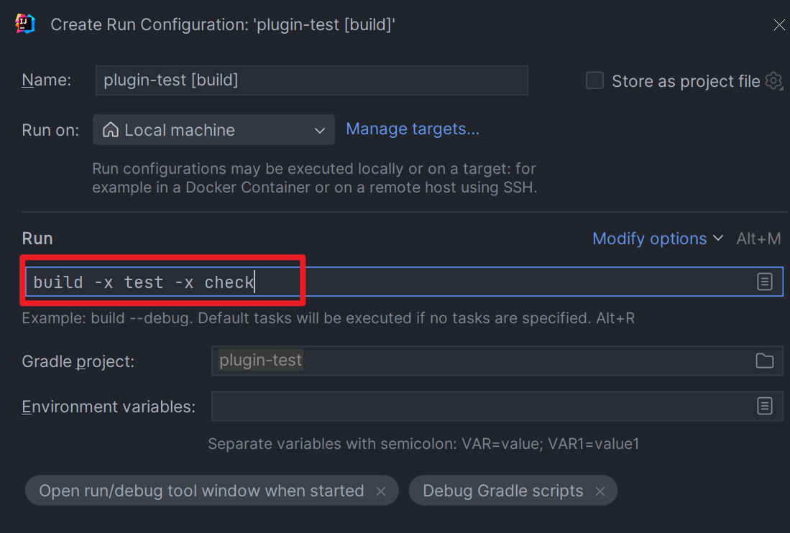

## **gradle**安装

1. 下载gradle安装包并解压
2. 配置环境变量
   1. GRADLE_HOME为解压目录
   
   2. 配置GRADLE_USER_HOME, gradle会将下载到的jar放在这个目录下
   
      否则会下载到`C:\Users\用户名\.gradle\caches\modules-2\files-2.1`
   
   3. 配置M2_HOME为maven安装目录, 方便gradle查找本地maven仓库
3. 在命令行执行`gradle -v`

## Groovy安装

1. 下载groovy安装包
2. 配置环境变量

   1. GROOVY_HOME为解压目录

   2. 配置path环境变量为%GROOVY_HOME%/bin
3. 在命令行执行`groovy -v`


## gradle设置下载源

### 全局设置(init脚本)

gradle会在`构建的最开始按照顺序执行如下地方的的gradle脚本`, 所以可以在这些地方配置maven仓库

1. 在命令行使用选项`-I`或`--init-script`后跟脚本的路径指定初始化文件

   例如：gradle --init-script yourdir/init.gradle -q taskName

   你可以多次输入此命令来指定多个init文件  

2. 把`init.gradle`文件放到 `$GRADLE_USER_HOME/.gradle/` 目录下

3. 把`以.gradle结尾的文件`放到 `$GRADLE_USER_HOME/.gradle/init.d/` 目录下

4. 把以`.gradle结尾的文件`放到 `GRADLE_HOME/init.d/` 目录下  

如果同一目录下有多个gradle文件, 那么会按照a-z的顺序执行

所以我们可以在这些目录下创建一个init.gradle文件, 内容如下

~~~groovy
allprojects {
    // 项目所需要的jar包, 会从这些仓库中查找
    // 查找是按照顺序来执行的, 所以mavenLocal需要配置在最上面
    // 如果这些都没有找到机会报错
    repositories {
        // 指定使用maven本地仓库
        // 先查找USER_HOME/.m2/settings.xml文件来确定本地maven库
        // 否则找 M2_HOME/conf/settings.xml文件来确定, 一般我们习惯配MAVEN_HOME, 所以需要另外配置一个M2_HOME
        // 最后使用 USER_HOME/.m2/repository来作为maven本地库
        mavenLocal()
        // 如果在maven本地库中找不到的jar包, 会通过远程库来下载
        // jar包会下载在GRADLE_USER_HOME\caches\modules-2\files-2.1\下
        maven { 
            name "Alibaba";
            url   "https://maven.aliyun.com/repository/public" 
        }
		// 指定maven中央仓库
        mavenCentral()
} 
    // 主要用来设置build时所需要使用的插件的仓库
    buildscript {
        repositories {
            maven { 
                name "Alibaba";
                url 'https://maven.aliyun.com/repository/public' 
            }
            maven { 
                name "Bstek";
                url 'https://nexus.bsdn.org/content/groups/public/' 
            }
            maven { 
                name "M2";
                url 'https://plugins.gradle.org/m2/' 
            }
        }
    }
}
~~~

### 项目单独设置

在项目的`build.gradle`中配置

~~~groovy
repositories {
    // 先查找USER_HOME/.m2/settings.xml文件来确定本地maven库
    // 否则找 M2_HOME/conf/settings.xml文件来确定, 一般我们习惯配MAVEN_HOME, 所以需要另外配置一个M2_HOME
    // 最后使用 USER_HOME/.m2/repository来作为maven本地库
    mavenLocal()
    // 如果在maven本地库中找不到的jar包, 会通过远程库来下载
    // jar包会下载在GRADLE_USER_HOME\caches\modules-2\files-2.1\下
    maven {
        url('https://maven.aliyun.com/repository/public')
    }
    // 直接使用maven中央仓库
    mavenCentral()
}
~~~


## Gradle Wrapper

**鉴于Gradle每个版本变动比较大, 推荐使用这种方式, 而不是直接使用本地的gradle**


在创建的gradle项目目录下, 有一个`gradle`文件夹和`gradlew.bat`和`gradlew`


gradlew其实就是gradle wrapper, 他是对gradle的一层包装, 用于解决实际开发中可能遇到不同的项目需要的不同版本的gradle的问题

你可以像使用gradle命令一样去使用gradlew文件

当我们调用gradlew文件的时候, 他会读取`gradle/wrapper/gradle.properties`文件中设置的属性, 然后使用`gradle/wrapper/gradle-wrapper.jar`指定的地方调用对应版本的gradle来执行命令


**gradle-wrapper.properties**

`gradle/wrapper/gradle-wrapper.properties`的内容如下:

~~~properties
# 下载的gradle压缩包解压后的存储的主目录, 指定为GRADLE_USER_HOME环境变量
# 如果没有配置环境变量, 那么默认在当前用户家目录的.gradle文件夹下
distributionBase=GRADLE_USER_HOME
# 解压后的gradle压缩包的路径, 相对于distributionBase
distributionPath=wrapper/dists
# gradle压缩包的下载地址
distributionUrl=https\://services.gradle.org/distributions/gradle-5.2.1-bin.zip
# 同distributionBase, 只不过是存放zip压缩包的
zipStoreBase=GRADLE_USER_HOME
# 同distributionPath, 只不过是存放zip压缩包的
zipStorePath=wrapper/dists
~~~

上面我们通过`distributionUrl`指定了使用gradle的版本为`5.2.1`, 并且下载的gradle包只含有bin文件

通过`distributionBase`和`distributionPath`指定了gradle安装包解压后的目录在`GRADLE_USER_HOME/wrapper/dists/`下面


**GradleWrapper的执行流程**

1. 当我们第一次执行` ./gradlew build` 命令的时候，gradlew 会读取 gradle-wrapper.properties 文件的配置信息
2. 准确的将指定版本的 gradle 下载并解压到指定的位置(GRADLE_USER_HOME目录下的wrapper/dists目录中)
3. 并构建本地缓存(GRADLE_USER_HOME目录下的caches目录中),下载再使用相同版本的gradle就不用下载了
4. 之后执行的 ./gradlew 所有命令都是使用指定的 gradle 版本。


**修改GradleWrapper使用的Gradle版本**

1. 可以直接在`gradle-wrapper.properties`中直接修改`distributionUrl`的连接, 这样在build的时候gradlew会自动下载并使用该版本

2. 通过如下命令, 会自动修改`gradle-wrapper.properties`中的`distributionUrl`属性

   ~~~shell
   gradle wrapper --gradle-version 5.2.1
   ~~~


**关联Gradle源码**

在上面的`gradle-wrapper.properties`中, 我们使用`distributionUrl=https\://services.gradle.org/distributions/gradle-5.2.1-bin.zip`来指定gradle的版本和下载链接, 但是该链接下载后只有可执行文件, 并没有gradle源码

我们有两种方式来关联源码:

1. 将bin改为all, 如下, 这样下载的gradle就有源码了

   ~~~properties
   distributionUrl=https\://services.gradle.org/distributions/gradle-5.2.1-all.zip
   ~~~

2. 通过如下命令, 使用该命令后会自动修改`gradle-wrapper.properties`中的`distributionUrl`属性, 将bin修改为all

   ~~~shell
   gradle wrapper --gradle-version 5.2.1 --distribution-type all
   ~~~


## Gradle.properties文件的作用

在创建gradle项目的时候, 默认在项目根目录下是没有这个文件的, 但是我们可以手动创建, 我们可以在该文件中对gradle本身进行一些配置, 常见配置项如下:

~~~properties
# 传递给gradle使用的jvm的参数
org.gradle.jvmargs=-Xmx1536M
# 是否启用缓存, 默认false, 设置为true会重用上次build的task output
org.gradle.caching=true
# 是否并行构建, 默认为false, 设置为true会使用org.gradle.workers.max个worker来构建项目
org.gradle.parallel=true
# gradle中worker的数量, 默认为cpu核数
org.gradle.workers.max=100
~~~

其他参数查看https://docs.gradle.org/current/userguide/build_environment.html#sec:gradle_configuration_properties


## Gradle设置代理

在gradle.properties中设置

~~~groovy
systemProp.http.proxyHost=localhost
systemProp.http.proxyPort=7890
systemProp.https.proxyHost=localhost
systemProp.https.proxyPort=7890

// 不需要代理的网址
systemProp.http.nonProxyHosts=*.nonproxyrepos.com
systemProp.https.nonProxyHosts=*.nonproxyrepos.com
~~~


## 使用IDEA创建普通Gradle项目及目录介绍


gradle的目录结构和maven的并没有什么不同, 只是有`settings.gradle`和`build.gradle`

1. settings.gradle

   - 一个大项目只有一个, 下面的子项目没有settings.gradle文件了

   - 可以在该文件中定义gav和子项目
   - 子项目必须在该文件中显示指定, 否则不会作为子项目

2. build.gradle

   - 每个项目有一个build.gradle文件, 包括子项目
   - 可以在该文件中定义一系列的task, 来指示如何构建当前的项目


## 使用IDEA创建web的Gradle项目

1. 创建项目

   

2. 查看生成的目录

   

3. 在`build.gradle`文件中添加war插件

   

4. 自己创建`webapp/WEB-INF`目录, 并在其下创建`web.xml`文件

   

   ~~~xml
   <web-app xmlns="http://xmlns.jcp.org/xml/ns/javaee" 
   		xmlns:xsi="http://www.w3.org/2001/XMLSchema-instance" 
   		xsi:schemaLocation="http://xmlns.jcp.org/xml/ns/javaee
   		http://xmlns.jcp.org/xml/ns/javaee/web-app_4_0.xsd" id="WebApp_ID" version="4.0">
   
   </web-app>
   ~~~

5. 在build.gradle中添加依赖

   ~~~groovy
   dependencies {
       compileOnly 'javax.servlet:servlet-api:2.5'
   }
   ~~~

6. 创建Servlet

   ~~~java
   public class HelloServlet extends HttpServlet {
       protected void doPost(HttpServletRequest request, HttpServletResponse response) throws ServletException, IOException {
   
           request.setCharacterEncoding("utf-8");
           String msg = request.getParameter("msg");
           System.out.println("获取参数方式1："+msg);
           msg = URLDecoder.decode(request.getParameter("msg"),"utf-8");
           System.out.println("解码之后:"+msg);
           //        jsp页面虽然设置了utf-8编码，但传输的过程中使用的编码是：ISO-8859-1
           String msg2 = new String(request.getParameter("msg").getBytes("ISO-8859-1"),"utf-8");
           System.out.println("获取参数方式2："+msg2);
           //        获取参数方式2：chinese中文字符串乱码测试
   
           response.setCharacterEncoding("utf-8");
   
           response.setContentType("text/html");
           response.setCharacterEncoding("utf-8");
           response.getWriter().println("<h2 style=\"color:orange\">请求成功，显示参数："+msg2+"</h2>");
       }
   
       protected void doGet(HttpServletRequest request, HttpServletResponse response) throws ServletException, IOException {
           doPost(request,response);
       }
   }
   ~~~

7. 添加Servlet映射

   ~~~xml
       <servlet>
           <servlet-name>helloServlet</servlet-name>
           <servlet-class>com.tiger.servlet.HelloServlet</servlet-class>
       </servlet>
       <servlet-mapping>
           <servlet-name>helloServlet</servlet-name>
           <url-pattern>/h</url-pattern>
       </servlet-mapping>
   ~~~

8. 使用tomcat部署


## Gradle生命周期

Gradle的构建过程有着固定的生命周期，分别为：

1. 初始化阶段
2. 配置阶段
3. 执行阶段

### 初始化阶段

初始化阶段主要任务是：创建项目的层次结构，并为每个项目创建一个Project实例对象；

在初始化阶段，

1. 首先执行init脚本文件
2. 执行`setting.gradle`脚本, 读取其中的`include`信息, 进而为每一个模块(`build.gradle`文件）创建一个与之对应的Project对象，最终形成一个项目的层次结构；


### 配置阶段

配置阶段的任务是：

1. **广度递归**执行各个项目下的`build.gradle`脚本,  完成对各个模块的Project对象的配置

   配置阶段执行的代码包括：

   - `build.gradle`中的各种语句, 比如应用外部构建插件`apply plugin: java`等；
   - Task中的配置段语句
   

执行任何Gradle命令，在初始化阶段和配置阶段的代码都会被执行；

Task中除了Action外的代码段都在配置阶段执行；（属性配置，语句打印等都会在配置阶段执行）

2. 构造Task任务的依赖关系图

   就是给所有的Task安排一个执行顺序，在执行阶段，就按照这个顺序执行所有的Task任务；


### 执行阶段

执行阶段就是根据配置阶段构建的Task依赖关系去执行相关的Task；

当我们运行项目的时候，Gradle就会根据Task的依赖关系依次去执行相关的Task，还可以通过Gradle命令去执行指定的Task，例如：`./gradlew shadowJar`


### 声明周期Hook


初始化阶段

1. 在settings.gradle执行完后, 创建了Settings对象后, 会回调Gradle对象的`settingsEvaluated`方法
2. 在根据`include xxx`创建完所有模块的Project对象化, 即初始化阶段完毕后, 会调用Gradle对象的`projectsLoaded  `

Gradle 配置阶段:

1. Gradle 会循环执行每个工程的 `build.gradle` 脚本文件

2. 在执行当前工程 `build.gradle` 前,会回调 Gradle 对象的 `beforeProject` 方法和当前 Project 对象的`beforeEvaluate `方法
   
   虽然 `beforeEvalute` 属于 `project` 的生命周期, 但是此时 project对应的`build.gradle` 尚未被执行, 所以 beforeEvaluate 的设置依然要在 `init.gradle`或 `setting.gradle`中进行,不要在 `build.gradle` 中使用 `project.beforeEvaluate` 方法。
   
   
   
3. 在执行当前工程 `build.gradle` 后,会回调 Gradle 对象的 `afterProject` 方法和当前 Project 对象的 `afterEvaluate` 方法

4. 在所有工程的 `build.gradle` 执行完毕后，会回调 Gradle 对象的 `projectsEvaluated `方法

5. 解析完所有的Task的依赖关系之后执行,也就是配置阶段,会回调 `TaskExecutionGraph` 对象的 `whenReady` 方法, 在这个方法中, 可以在这里决定哪些Task需要执行, 跳过哪些Task

6. 之后会调用`TaskExecutionGraph`的`graphPopulated`方法, 在这个方法中, 已经构建了Task的执行图(DAG)了, 此时无法修改执行图

Gradle 执行阶段:

1. Gradle 会执行 Task 及其依赖的 Task
2. 在每个 Task 执行之前,会回调 `TaskExecutionGraph` 对象的 `beforeTask` 方法
3. 在每个 Task 执行之后,会回调 `TaskExecutionGraph `对象的 `afterTask `方法  

~~~groovy
// setting.gradle

gradle.settingsEvaluated(new Action<Settings>() {
    @Override
    void execute(Settings settings) {
        // 1. 在执行完settings.gradle文件并创建了Settings对象后执行
        println "settingsEvaluated"
    }
})

gradle.projectsLoaded (new Action<Gradle>() {
    @Override
    void execute(Gradle gradle) {
        // 2. 在创建完所有模块的Project对象, 即初始化阶段完毕后执行
        println "projectsLoaded"
    }
})


gradle.addProjectEvaluationListener(new ProjectEvaluationListener() {

    @Override
    void beforeEvaluate(Project project) {
        // 3. 在配置阶段, 执行各个Project的build.gradle之前执行
        println "${project.name} Project beforeEvaluate"
    }

    @Override
    void afterEvaluate(Project project, ProjectState projectState) {
        // 5. 在执行完各个Project的build.gradle文件之后执行
        println "${project.name} Project afterEvaluate"
    }
});
gradle.beforeProject(new Action<Project>() {
    @Override
    void execute(Project project) {
        // 4. 在配置阶段, 执行各个Project的build.gradle之前执行
        println "${project.name} beforeProject..."

    }
})

gradle.afterProject(new Action<Project>() {
    @Override
    void execute(Project project) {
        // 6. 在执行完各个Project的build.gradle文件之后执行
        println "${project.name} afterProject..."
    }
})


def rootProjectName = rootProject.getName()
gradle.projectsEvaluated(new Action<Gradle>() {
    @Override
    void execute(Gradle gradle) {
        // 7. 在配置阶段完成, 所有项目的 build.gradle 执行完毕后执行
        println "${rootProjectName} projectsEvaluated..."
    }
})

gradle.taskGraph.whenReady(new Action<TaskExecutionGraph>() {
    @Override
    void execute(TaskExecutionGraph taskExecutionGraph) {
        // 8. 配置阶段阶段, 解析完所有的Task的依赖关系之后执行
        // 可以在这里决定哪些Task需要执行, 跳过哪些Task
        println "${rootProjectName} taskGraph whenReady..."
    }
})

gradle.taskGraph.addTaskExecutionGraphListener (new TaskExecutionGraphListener() {

    @Override
    void graphPopulated(TaskExecutionGraph graph) {
        // 9. 在配置阶段, 在构建完完整的任务执行图(DAG)后执行
        // 此时不能再修改任务执行图了
        println "${rootProjectName} graphPopulated..."
    }
})

gradle.taskGraph.beforeTask(new Action<Task>() {
    @Override
    void execute(Task task) {
        // 10. 在执行阶段, 执行Task之前执行
        println "this is the task ${task.name} of the project ${task.getProject().name} beforeTask.."
    }
})

gradle.taskGraph.afterTask(new Action<Task>() {
    @Override
    void execute(Task task) {
        // 11. 在执行阶段, 执行Task之后执行
        println "this is the task ${task.name} of the project ${task.getProject().name} afterTask.."
    }
})

gradle.buildFinished(new Action<BuildResult>() {
    @Override
    void execute(BuildResult buildResult) {
        // 12. 在执行阶段, 当所有需要执行的Task都执行完毕之后执行
        println "${rootProjectName} buildFinished..."
    }
})
~~~


### 计算Gradle每个步骤耗时

~~~groovy
// settings.gradle

def projectName = rootProject.getName() //定义项目名
long beginOfSetting = System.currentTimeMillis() //初始化阶段开始时间
def beginOfConfig //配置阶段开始时间
def configHasBegin = false //配置阶段是否开始了，只执行一次
def beginOfProjectConfig = new HashMap() //存放每个 build.gradle 执行之前的时间
def beginOfTaskExecute //执行阶段开始时间
gradle.projectsLoaded { //初始化阶段执行完毕
	println "${projectName}工程 初始化总耗时 ${System.currentTimeMillis() - beginOfSetting} ms"
}


//build.gradle 执行前
gradle.beforeProject { Project project ->
	if (!configHasBegin) {
		configHasBegin = true
		beginOfConfig = System.currentTimeMillis()
	} 
	beginOfProjectConfig.put(project, System.currentTimeMillis())
}
//build.gradle 执行后
gradle.afterProject { Project project ->
	def begin = beginOfProjectConfig.get(project)
	if (project.name == projectName) {
		println "根工程${projectName} 配置阶段耗时：${System.currentTimeMillis() - begin} ms"
	} else {
		println "子工程${project.name} 配置阶段耗时：${System.currentTimeMillis() - begin} ms"
	}
}

//配置阶段完毕
gradle.taskGraph.whenReady {
	println "整个${projectName}项目在配置阶段总耗时：${System.currentTimeMillis() - beginOfConfig} ms"
	beginOfTaskExecute = System.currentTimeMillis()
}

//执行阶段开始
gradle.taskGraph.beforeTask { Task task ->
	task.doFirst {
		task.ext.beginOfTask = System.currentTimeMillis()
	} 
    task.doLast {
		println "${task.name}在执行阶段耗时：${System.currentTimeMillis() - task.ext.beginOfTask} ms"
	}
}
gradle.buildFinished {//执行阶段完毕
	println " 执行阶段总耗时：${System.currentTimeMillis() - beginOfTaskExecute} ms"
	println " 整个构建过程耗时：${System.currentTimeMillis() - beginOfSetting} ms"
}
~~~


## Gradle-Task执行顺序配置

在Gradle中，有三种方式指定Task的执行顺序：

1. dependsOn强依赖方式
2. 通过Task输入输出
3. 通过API指定执行顺序

### 通过`dependsOn`强依赖方式指定

`dependsOn`强依赖的方式可以分为**静态依赖**和**动态依赖**：

- 静态依赖：在创建Task时，就明确知道定义的Task需要依赖的Task是什么，直接通过`dependsOn`参数或者`dependsOn`方法指定所依赖的Task；

  Task提供了`dependsOn`、`finalizedBy`方法来管理Task之间的依赖关系，依赖关系表达的是执行这个Task时所需要依赖的其他Task，也就是说这个Task不能被单独执行，执行这个Task之前或之后执行另外的Task；

- 动态依赖：在创建Task时，不知道需要依赖哪些Task，通过`dependsOn`方法动态依赖符合条件的Task；

```groovy
task taskX {
  doLast{
    println 'taskX'
  }
}

task taskY {
  doLast {
    println 'taskY'
  }
}

// 静态依赖1
task taskZ (dependsOn: taskX) {
  doLast {
    println 'taskZ'
  }
}
// 静态依赖2
taskZ.dependsOn(taskY)

//动态依赖
task taskA {
  dependsOn this.tasks.findAll {
    task -> return task.name.startsWidth('lib')
  }
  doLast{
    println 'taskA'
  }
}
```

### 通过Task输入输出制定

当一个参数作为TaskA的输出参数，同时又作为TaskB的输入参数，那么当执行当执行TaskB的时候要先执行TaskA，即输出的Task要先于输入的Task执行；

```groovy
ext {
  demoFile = file("${this.buildDir}/demo.txt")
} 

task producer {
  outputs.file demoFile
  doLast {
    outputs.getFiles().singleFile.withWriter {
      writer -> writer.append("hello world")
    }
    
    println 'producer Task end.'
  }
}

task consumer {
  inputs.file demoFile
  doLast {
    println "read file: ${inputs.file.singleFile.text}"
    println "consumer Task end." 
  }
}

task demo(dependsOn: [producer,consumer]) {
  doLast {
    println "demo end;"
  }
}
```

demoFile是procuder的输出参数，是consumer的输入参数，所以producer咸鱼consumer执行；

### 通过API制定执行顺序

- mustRunAfter：指定必须在哪个Task执行完成之后在执行，如`taskA.mustRunAfter(taskB)`，即taskA必须在taskB之后执行；
- finalizedBy：在任务结束之后执行指定的Task；如`taskA.finalizedBy(taskB)`，即taskA执行结束之后再执行taskB；


## Gradle打印Task依赖关系

```groovy
plugins {
    // 用于打印task的依赖书
    // 用法: ./gradlew ${project-path}:${taskName} taskTree
    // 比如查看build的依赖树, 可以使用./gradlew build taskTree
    id "com.dorongold.task-tree" version "4.0.0"
}
```


## Project

一个Project代表对一个模块的配置, 每个Project都对应着一个build.gradle文件


### Project的属性和方法查找

当我们在build.gradle中调用Project的属性和方法时, 他会通过如下属性来查找该属性和方法:

1. Project对象自身.   

   ~~~groovy
   // build.gradle
   name = "zhangsan" // 会查找setName属性
   ~~~

2. Project的ext属性.  ext这个属性主要用来存放扩展属性的

   ~~~groovy
   // build.gradle
   ext { hello = "world" }
   println (hello) // 会查找ext属性中的hello
   ~~~

3. Project的extensions属性.  每个应用到Project的插件, 都可以创建其自身的配置, 会保存到Project的extensions中

   ~~~groovy
   // build.gradle
   // 比如插件创建了一个名为greeting的配置, 保存在project的extensions中
   greeting { .... } // 对插件进行配置
   ~~~

4. Project的convention属性. 每个应用到Project的插件, 都可以创建其自身的配置, 配置的默认值会保存到Project的convention中

5. Project中的task.   可以直接在build.gradle中通过任务名来访问这个task

   ~~~groovy
   // build.gradle
   task a { } // 创建一个a的task
   
   a.dependsOn = ["b", "c"] // 查找project中的task
   ~~~


#### 常见的属性和方法


## Task

task实际上是一个actions的列表
执行task的时候会按照顺序执行所有的action


每个Task都有如下的属性:

| 配置项        | 作用                                                         | 默认值      |
| ------------- | ------------------------------------------------------------ | ----------- |
| **type**      | Task的实现类, 必须是DefaultTask和他的子类                    | DefaultTask |
| overwrite     | 如果已存在相同type的task, 是否进行替换                       | false       |
| **dependsOn** | 设置task的依赖                                               | null        |
| **actions**   | task要执行的任务, 是一个列表                                 | null        |
| description   | task的描述                                                   | null        |
| **group**     | task的分组                                                   | null        |
| **enable**    | 当执行task的时候, 如果enable为false那么会跳过task            | true        |
| timeout       | 任务的超时时间, 超时会导致task失败, 停止执行后续task<br>如果不想要影响后续task的执行, 可以在执行task的时候添加 --continue | null        |
| onlyIf        | 当执行task的时候, 如果onlyIf闭包返回一个false, 那么会跳过这个task |             |


### 定义Task

定义Task有多种方式

方式1:

~~~groovy
// task taskName {} 实际上的语法是 task("myTask1", {})
// 这种方式实际上会创建一个DefaultTask
// 然后调用闭包对这个Task进行配置
task myTask1 {
    
    // 在这里设置task的属性, 在配置阶段执行
    group = "myGroup"
    description = "myTask1"

    // 所有在这里的代码都会在配置阶段执行
    println "run in configure phase"

    // 添加一个action到列表尾部
    doLast {
        println("action1") // 所有的action都在executing阶段执行
    }
    // 添加一个action到列表头部
    doFirst {
        println("action2") // 所有的action都在executing阶段执行
    }
    // 添加一个action到列表尾部
    Action<? super Task> action = {
        println("action3") // 所有的action都在executing阶段执行
    }
    actions.add(action)
}
~~~

方式2:

~~~groovy
class MyTask2 extends DefaultTask {

    // todo 需要添加public字段, 不让他变成属性, 否则会报错说没有添加@Input注解
    public String firstName = "zhang"
    public String lastName = "san"

    MyTask2() {
        // 可以在构造函数中对当前这一类MyTask2进行配置
        // 也可以在注册Task的时候通过闭包对单个MyTask2进行配置
        description = "myTask2 description here"
    }

    @TaskAction
    void run() {
        println "firstName: ${firstName}"
    }
}
// 以MyTask2为模板创建一个task, 该Task具有两个属性
// 同时自带一个action
tasks.register("myTask2",MyTask2 ){
    group = "myGroup"

    // 在闭包中对Task进行设置
    
    // 添加一个action到列表尾部
    doLast {
        println("lastName: ${lastName}")
    }
}
~~~

方式3:

~~~groovy
tasks.create('E'){    //使用tasks的create方法
	println "taskE.."
}
~~~

方式4:

~~~groovy
//注：register执行的是延迟创建。也即只有当task被需要使用的时候才会被创建。
tasks.register('f'){ 
	println "taskF...."
}
~~~


### Task的依赖关系

当TaskA依赖TaskB和TaskC的时候, 执行TaskA时, 他会自动的执行TaskB和TaskC, 然后再执行TaskA

至于TaskB和TaskC, 如果他们之间没有依赖关系, 那么他们的执行顺序不固定


有三种方式可以配置Task的依赖关系

~~~groovy
task A {
	doLast {
		println "TaskA.."
	}
} 
task B{
	doLast {
		println "TaskB.."
	}
}
// 方式1
task 'C1'(dependsOn: ['A','B']){
	doLast {
		println "TaskC.."
	}
}
// 方式2
task 'C2' {
	dependsOn= [A,B]
	doLast {
		println "TaskC.."
	}
}
task 'C3' {
	doLast {
		println "TaskC.."
	}
}
// 方式3: 引号可加可不加
C.dependsOn(B,'A')
~~~

除了task对当前project的task进行依赖, task还可以依赖别的项目的task

~~~groovy
// subproject01/build.gradle
task A {
	doLast {
	println "TaskA.."
	}
}

// subproject2/build.gradle
task B{
    //依赖根工程下的subject01中的任务A ： 跨项目依赖。
	dependsOn(":subproject01:A") 
	doLast {
		println "TaskB.."
	}
}
~~~


### 任务的类型

前面我们定义的 task 都是 DefaultTask 类型的,  如果要完成某些具体的操作完全需要我们自己去编写 gradle 脚本，势必有些麻烦，那有没有一些现成的任务类型可以使用呢？

有的，Gradle 官网给出了一些现成的任务类型帮助我们快速完成想要的任务，我们只需要在创建任务的时候，指定当前任务的类型即可，然后即可使用这种类型中的属性和 API 方法了  

| 常见任务类型             | 该类型任务的作用                                             |
| ------------------------ | ------------------------------------------------------------ |
| Delete                   | 删除文件或目录                                               |
| Copy                     | 将文件复制到目标目录中。此任务还可以在复制时重命名和筛选文件。 |
| CreateStartScripts       | 创建启动脚本                                                 |
| Exec                     | 执行命令行进程                                               |
| GenerateMavenPom         | 生成 Maven 模块描述符(POM)文件。                             |
| GradleBuild              | 执行 Gradle 构建                                             |
| Jar                      | 组装 JAR 归档文件                                            |
| JavaCompile              | 编译 Java 源文件                                             |
| Javadoc                  | 为 Java 类生成 HTML API 文档                                 |
| PublishToMavenRepository | 将 MavenPublication 发布到 mavenartifactrepostal。           |
| Tar                      | 组装 TAR 存档文件                                            |
| Test                     | 执行 JUnit (3.8.x、4.x 或 5.x)或 TestNG 测试。               |
| Upload                   | 将 Configuration 的构件上传到一组存储库。                    |
| War                      | 组装 WAR 档案。                                              |
| Zip                      | 组装 ZIP 归档文件。默认是压缩 ZIP 的内容。                   |

如果想看更详细的 gradle 自带 Task 类型，请参考官方文档: https://docs.gradle.org/current/dsl/index.html  


### 查找任务

~~~groovy
task atguigu {
	doLast {
		println "让天下没有难学的技术：尚硅谷"
	}
} 
//根据任务名查找
tasks.findByName("atguigu").doFirst({println "尚硅谷校区1：北京...."})
//根据任务路径查找【相对路径】
tasks.findByPath(":atguigu").doFirst({println "尚硅谷校区3：上海...."})
~~~


### task的rule

当我们执行、依赖一个不存在的任务时，Gradle 会执行失败,报错误信息。那我们能否对其进行改进,当执行一个不存在的任务时，不是报错而是打印提示信息呢？ 

~~~groovy
task hello {
	doLast {
		println 'hello 尚硅谷的粉丝们'
	}
}
tasks.addRule("ruleName"){
    // 当执行不存在的task时, 会将name传递到这个闭包里面
    // 这里根据taskName创建一个task并执行
	String taskName -> task(taskName) {
		doLast {
			println "该${taskName}任务不存在，请查证后再执行"
		}
	}
}
~~~

 此时执行`gradle hello adc`, 不会应为找不到adc任务而保存, 而是打印任务不存在


### task的onlyIf

当执行task的时候, 如果onlyIf闭包返回一个false, 那么会跳过这个task

~~~groovy
task hello {
    onlyIf { 
        // 只有项目具有fensi属性的时候, 才会执行
        !project.hasProperty('fensi') 
    }
	doLast {
		println 'hello 尚硅谷的粉丝们'
	}
} 
~~~

通过`gradle hello -Pfensi`来执行hello任务, -P表示为project添加属性


### 项目的默认task

当在项目下执行`gradlew`的时候, 此时没有指定需要执行的task, 那么他会执行默认的task

~~~groovy
defaultTasks 'myClean', 'myRun' // 指定默认的task
~~~

此时我们执行`gradlew`, 那么会执行myClean和myRun两个task


## 常见的Task

想要执行Task, 可以使用命名`gradle [taskName] [--option-name ...]`

| 分类       | 命令                                                         | 作用                                                         |
| ---------- | ------------------------------------------------------------ | ------------------------------------------------------------ |
| 常见的任务 | gradle builld                                                | 构建项目: 编译, 测试, 打包                                   |
|            | gradle run                                                   | 需要application插件, 运行主类, 需要在build.gradle中配置`mainClassName='com.tiger.xxx'` |
|            | gradle clean                                                 | 清除当前项目的 build 目录, 不清理子项目                      |
|            | gradle init                                                  | 初始化 gradle 项目使用                                       |
|            | gradle wrapper                                               | 生成 wrapper 文件夹的                                        |
|            | **gradle wrapper --gradle-version=4.4**                      | 指定wrapper使用的gradle版本                                  |
|            | **gradle wrapper --gradle-version 5.2.1 --distribution-type all** | 关联源码用                                                   |
| 项目报告   | **gradle projects**                                          | 以Tree结构显示所有项目层次关系                               |
|            | gradle tasks                                                 | 列出当前项目(不包含子项目)所有具有设置了group的task          |
|            | **gradle tasks --all**                                       | 列出当前项目的所有task                                       |
|            | gradle tasks --group 'xxx'                                   | 列出当前项目指定group的task                                  |
|            | gradle help --task taskName                                  | 查看task的详细信息                                           |
|            | **gradle dependencies**                                      | 查看所有模块的依赖关系, 以树结构显示<br>如果某个依赖后面跟了星号*, 那么表示在之前已经解析过了, 此处不再显示他的依赖树 |
|            | **gradle root:dependencies**                                 | 只查看root模块的依赖关系, 子模块可以使用**冒号:**            |
|            | **gradle properties**                                        | 列出当前项目对应的project对象的所有属性, 我们可以根据这个来查看project中有哪些属性, 进而调用 |


## Gradle文件操作

https://docs.gradle.org/current/userguide/working_with_files.html  

### 本地文件

使用 `Project.file(java.lang.Object)`方法，通过指定文件的相对路径或绝对路径来对文件的操作,其中相对路径为相对当前project的目录。其实使用 Project.file(java.lang.Object)方法创建的 File 对象就是 Java 中的 File对象，我们可以使用它就像在 Java 中使用一样。示例代码如下：

~~~groovy
//使用相对路径
File configFile = file('src/conf.xml')
configFile.createNewFile();

// 使用绝对路径
configFile = file('D:\\conf.xml')
println(configFile.createNewFile())

// 使用一个文件对象
configFile = new File('src/config.xml')
println(configFile.exists())
~~~


### 文件集合
文 件 集 合 就 是 一 组 文 件 的 列 表 , 在 Gradle 中 , 文 件 集 合 用 FileCollection 接 口 表 示 。 我 们 可 以 使 用
Project.files(java.lang.Object[])方法来获得一个文件集合对象，如下代码创建一个 FileCollection 实例：
对于文件集合我们可以遍历它；也可以把它转换成 java 类型；同时还能使用+来添加一个集合，或使用-来删除集合。

~~~groovy
def collection = files('src/test1.txt',new File('src/test2.txt'),['src/test3.txt', 'src/test4.txt'])
collection.forEach(){File it ->
	it.createNewFile() //创建该文件
	println it.name //输出文件名
} 
Set set1 = collection.files // 把文件集合转换为java中的Set类型
Set set2 = collection as Set
List list = collection as List// 把文件集合转换为java中的List类型
for (item in list) {
	println item.name
} 
def union = collection + files('src/test5.txt') // 添加或者删除一个集合
def minus = collection - files('src/test3.txt')
union.forEach(){File it ->
	println it.name
}
~~~


### 文件树
文件树是有层级结构的文件集合,一个文件树它可以代表一个目录结构或一 ZIP 压缩包中的内容结构。文件树是从文件集
合继承过来的,所以文件树具有文件集合所有的功能。我们可以使用 Project.fileTree(java.util.Map)方法来创建文件树对象，
还可以使用过虑条件来包含或排除相关文件。示例代码如下：  

~~~groovy
// 第一种方式:使用路径创建文件树对象，同时指定包含的文件
tree = fileTree('src/main').include('**/*.java')

//第二种方式:通过闭包创建文件树:
tree = fileTree('src/main') {
	include '**/*.java'
} 

//第三种方式:通过路径和闭包创建文件树：具名参数给map传值
tree = fileTree(dir: 'src/main', include: '**/*.java') 

tree = fileTree(dir: 'src/main', includes: ['**/*.java', '**/*.xml', '**/*.txt'], exclude: '**/*test*/**')

tree.each {File file -> // 遍历文件树的所有文件
	println file
	println file.name
}
~~~


### 文件拷贝
我们可以使用 Copy 任务来拷贝文件，通过它可以过虑指定拷贝内容，还能对文件进行重命名操作等。

Copy 任务必须指定一组需要拷贝的文件和拷贝到的目录，这里使用 `CopySpec.from(java.lang.Object[])`方法指定原文件；使用`CopySpec.into(java.lang.Object)`方法指定目标目录。示例代码如下

~~~groovy
task copyTask(type: Copy) {
	// 拷贝src/main/webapp目录下所有的文件
	from 'src/main/webapp'
	// 拷贝单独的一个文件
	from 'src/staging/index.html'
	// 从Zip压缩文件中拷贝内容
	from zipTree('src/main/assets.zip')
	// 拷贝到的目标目录
	into 'build/explodedWar'
    
    // 指定包含的文件
    include '**/*.html'
	include '**/*.jsp'
    // 指定排除的文件
    exclude { details -> details.file.name.endsWith('.html') }
    
    // 重命名文件的方式
    rename { String fileName ->
		fileName.replace('-staging-', '')
	}
}
~~~

在上面的例子中我们都是使用 Copy 任务来完成拷贝功能的，那么有没有另外一种方式呢？答案是肯定的，那就是
`Project.copy(org.gradle.api.Action)`方法。下面示例展示了 copy()方法的使用方式：  

~~~groovy
task copyMethod {
	doLast {
		copy {
			from 'src/main/webapp'
			into 'build/explodedWar'
			include '**/*.html'
			include '**/*.jsp'
		}
	}
}
~~~


### 归档文件
通常一个项目会有很多的 Jar 包，我们希望把项目打包成一个 WAR，ZIP 或 TAR 包进行发布，这时我们就可以使用
Zip，Tar，Jar，War 和 Ear 任务来实现，不过它们的用法都一样，所以在这里我只介绍 Zip 任务的示例。
首先，创建一个 Zip 压缩文件,并指定压缩文件名称，如下代码所示：

~~~groovy
apply plugin: 'java'

task myZip(type: Zip) {
    doLast{
        // 将src/main压缩为myGame.zip, 放到build目录下
		from 'src/main' 
		into 'build' 
		baseName = 'myGame'
    }
    doLast {
        // 使用zipTree访问zip
		FileTree zip = zipTree('someFile.zip')
		// 使用tarTree访问tar
		FileTree tar = tarTree('someFile.tar')
    }
}
~~~


## Gradle中的Java Plugin

https://docs.gradle.org/current/userguide/java_plugin.html#java_plugin

Java插件用于构建基于Jvm和Java的项目, 该插件目前已被其他插件取代

你可以使用`java-library`或`application`来实现Java插件的所有功能, 所有Java插件中的功能前面两个插件都有并且配置也一样


通过如下代码引入java插件

```groovy
plugins {
    id 'java'
}
```

#### Task

在引入java插件后, 该插件会在项目中注册一系列的Task, 这些Task和他们的依赖关系如下


1. compileJava

   调用JDK对所有的Java源文件进行编译

2. processResources

   将资源文件复制到输出路径下

3. classes

   依赖 `compileJava`, `processResources`

   不做任何事情, 只是用来触发 `compileJava`, `processResources`这两个任务

4. compileTestJava

   依赖于classes, 调用JDK编译所有Java测试文件

5. processTestResources

   将测试资源赋值到测试输出目录下

6. testClasses

   依赖compileTestJava, processTestResources

   不做任何事情, 只是用来触发compileTestJava, processTestResources

7. jar

   依赖classes

   根据输出目录下的main文件夹, 打包生成jar文件

8. javadoc

   依赖classes

   生成api文档

9. test

   依赖testClasses

   使用Junit或者TestNG执行单元测试

10. uploadArchives

    依赖jar

    用来将jar包上传到指定的位置

11. clean

    删除项目下的build目录

12. clean${TaskName}

    删除指定任务创建的文件, `cleanJar`将删除`jar`任务创建的JAR文件， `cleanTest`将删除`test`任务创建的测试结果。

13. assemble

    依赖jar

    一个聚合任何, 不做任何事情, 只是用来触发一系列的其他task, 比如jar

14. check

    依赖test

    不做任何事情, 只是用来触发验证程序, 比如test

15. build

    依赖check, assemble

    不做任何事情, 只是用来触发check和assemble

上面这些task中, build, check, assemble, testClasses, classes都是不做任何事情, 只是通过dependsOn来触发其他的任务


如果想要我们自定义的task能够在加入到上面的dag中, 可以如下设置

~~~groovy
// 定义一个任务, 用来copy一些资源文件到输出目录中
task copyCertResources(type: Copy){
    from "src/main/cert"
    into "build/resources/main/cert"
}
processTestResources{
    // 定义processTestResources依赖我们的自定义任务copyCertResources
    // 这样在执行processTestResources之前会自动执行copyCertResources任务
    dependesOn copyCertResources
}
~~~


​    

#### Layout

在引入java插件的时候, 会引入一个默认的项目布局:

1. `src/main/java`: 放置Java源文件
2. `src/main/resources`: 放置资源文件

- `src/test/java`: 放置测试的Java源文件
- `src/test/resources`: 放置测试的资源文件

- `src/${sourceSet}/java`: sourceSet可以随便命名, 该目录下的java文件会被自动编译并放在build/classes/${sourceSet}下
- `src/sourceSet/resources`: sourceSet可以随便命名, 即该目录下的资源文件会被自动copy到build/resources/${sourceSet}下

同时你也可以更改这个布局

```groovy
sourceSets {
    main {
        java {
            srcDirs = ['src/java']
        }
        resources {
            srcDirs = ['src/resources']
        }
    }
}
```


 #### 依赖管理

在添加Java插件之后, 会自动添加一些configuration, 类似与maven的scope

1. implementation
2. compileOnly
3. runtimeOnly
4. testImplementation
5. testCompileOnly
6. testRuntimeOnly
7. annotationProcessor


上图中, 灰色的是执行的任务, 蓝色的是执行任务时能够使用的依赖, 绿色的不用看

上图说明: 

1. 在compileJava时, 能够使用的依赖是compileOnly和implementation
2. 在run时, 能够使用的依赖是implementation和runtimeOnly
3. 在compileTestJava时, 能够使用的依赖是testCompileOnly, implementation, testImplementation
4. 在test时, 能够使用的依赖是implementation, testImplementation, runtimeOnly, testRuntimeOnly


## Gradle插件

### 脚本插件

脚本插件的本质就是一个脚本文件，使用脚本插件时通过 `apply from: `将脚本加载进来就可以了，后面的脚本文件可以是本地的也可以是网络上的脚本文件

下面定义一段脚本，我们在 `build.gradle` 文件中使用它，具体如下：

~~~groovy
// version.gradle文件
ext {
	company= "尚硅谷"
	cfgs = [
		compileSdkVersion : JavaVersion.VERSION_1_8
	] 
	spring = [
		version : '5.0.0'
	]
}
~~~

在`build.gradle`文件中使用插件

~~~groovy
//build.gradle文件
//map作为参数
apply from: 'version.gradle'
task taskVersion{
	doLast{
		println "公司名称为：${company},JDK版本是${cfgs.compileSdkVersion},版本号是${spring.version}"
	}
}
~~~

脚本文件模块化的基础，可按功能把我们的脚本进行拆分一个个公用、职责分明的文件，然后在主脚本文件引用，
比如：将很多共有的库版本号一起管理、应用构建版本一起管理等。  


### 二进制插件

- 二进制插件就是实现了 `org.gradle.api.Plugin` 接口的插件

- 每个 Java Gradle 插件都有一个 plugin id  

- 插件的分类:

  1. Gradle内部自带的二进制插件, 也被称为`core plugin`

     在使用内部自带的二进制插进时, **无需指定版本**, 因为是Gradle内部自带的

     gradle自带的插件有哪些可以查看https://docs.gradle.org/current/userguide/plugin_reference.html  

     ~~~groovy
     apply plugin: 'java' // 方式1
     apply plugin: 'java-library'
     
     apply {
         plugin 'java' // 方式2
         plugin 'java-library'
     }
     
     plugin {
         id 'java' // 方式3
         id 'java-library' 
     }
     ~~~

  2. 在项目的buildSrc中, 自定义的二进制插进

     使用项目buildSrc中的自定义二进制插件, **无需指定version**, 因为只有一个版本

     ~~~groovy
     apply plugin: 'java' // 方式1
     apply plugin: 'java-library'
     
     apply {
         plugin 'java' // 方式2
         plugin 'java-library'
     }
     
     plugin {
         id 'java' // 方式3
         id 'java-library' 
     }
     ~~~

  3. 托管在https://plugins.gradle.org/插件中心的第三方二进制插件

     **无法使用apply来加载这种插件**,  **需要指定插件的version**, 因为该网站一个插件具有多个版本

     ~~~groovy
     plugin {
         id 'org.springframework.boot' version '3.3.3' // 方式3
         id 'io.spring.dependency-management' version '1.1.6'
     }
     ~~~

  4. 存放在指定maven仓库的第三方插件

     使用这种插件, 需要配置对应的maven仓库, 插件对应的jar包

     **一个jar包中可能会有多个插件**

     只能通过apply来加载这种插进, 同时apply时无需指定版本, 因为已经指定了jar包的版本了

     ~~~groovy
     buildscript {
         ext{
             springBootVersion = "2.3.3.RELEASE"
         }
         // 指定插件仓库
         repositories {
     		mavenLocal()
     		maven { url 'http://maven.aliyun.com/nexus/content/groups/public' }
     		mavenCentral()
     	}
         // 指定插件对应的jar包
         dependencies {
             classpath "org.springframework.boot:spring-boot-gradle-plugin:${springBootVersion}"
         }
     }
     
     // 通过插件id进行引入插件
     apply plugin: 'org.springframework.boot' 
     ~~~

     

### 自定义二进制插件


#### 二进制插件的加载原理

当我们在`build.gradle`中添加一个插件, 并执行构建的时候

如果使用的是`plugins { id 'xxx' }`的方式来加载插件的:

1. Gradle首先会根据插件id 判断这个插件是不是内部自带的插件

2. 如果不是, 那么他会去`buildSrc/build/resources/mian/META-INF/gradle-plugins`下寻找`${plugin_id}.properties`文件

   该文件中有一个`implementation-class`属性, 他指定实现了Plugin接口的字节码文件, 然后Gradle会去`/buildSrc/classes/  (groovy | java | kotlin) /main`下查找指定的字节码文件, 将其作为插件进行加载

   
   
   比如我们在build.gradle中使用`plugins {id 'com.tiger.hello'}`去加载id为com.tiger.hello的插件
   
   那么Gradle会去`buildSrc/build/resources/main/META-INF/gradle-plugins`下寻找名为`com.tiger.hello.properties`的文件
   
   假如该文件内容为`implementation-class=com.tiger.binary.GroovyPlugin`, 那么Gradle会去`/buildSrc/classes/  (groovy | java | kotlin) /main`下加载`com/tiger/binary/GroovyPlugin`的字节码文件, 作为插件的具体实现类
   
   GroovyPlugin字节码文件应该实现Plugin接口
   
   
   
3. 如果在buildSrc中也没有查找到对应的插件, 那么会去https://plugins.gradle.org/查找指定版本和id的插件
   
4. 如果还是没有找到就报错


如果使用的是apply的方式来加载插件的:

1. 同上面第一步
2. 同上面第二步
3. 查看buildscript的dependencies中指定加载的jar包, 看看jar包中的`/META-INF/gradle-plugins`下有没有`${plugin_id}.properties`文件, 然后按照`implementation-class`去加载指定的class
4. 如果还没有就报错

   


#### 预编译脚本插件

预编译脚本插件的意思是: 

1. 你可以在`buildSrc/src/main/`下的`groovy / kotlin`这两个文件中编写`gradle/gradle.kts`文件来作为插件

2. 所有在`build.gradle`中可以编写的内容都可以在插件中编写

3. gradle会将这些文件编译为Java字节码文件, 并自动实现`org.gradle.api.Plugin`接口, 并保存到`buildSrc/build/classes/java`下

   同时在`buildSrc/build/resources/META-INF/gradle-plugins`下创建`文件名.properties`的文件

   其中的`implementation-class`自动指向编译后的字节码文件

4. 然后我们就可以在项目的`build.gradle`中通过`apply`或者`plugins`来使用这些插件了


这里以groovy为例:

1. 在`buildSrc/build.gradle`添加如下代码

   ~~~groovy
   plugins {
       // 使用groovy开发插件必须
       id 'groovy-gradle-plugin'
   
       // 使用kotlin开发插件需要
       // 该插件托管在插件中心, 必须指定版本, 同时版本需要与gradle适配
       id "org.gradle.kotlin.kotlin-dsl" version "5.1.1"
   }
   ~~~

2. 在`buildSrc/src/main/groovy`中创建`my-plugin.gradle`, 作为我们的插件,  内容如下

   ~~~groovy
   // 可以在这里添加task, 指定依赖, 指定仓库, 指定另外一个插件
   // 所有在build.gradle中能够使用的api都可以在这里使用
   
   tasks.register('hello') {
       print "xxxxxxxxxxxxxxxxxxxxxxx"
   }
   ~~~

3. 执行`./gradlew build`来编译插件

   会在`buildSrc/build/classes/java/main/`下生成MyPluginPlugin字节码文件
   
   同时在`buildSrc/build/resources/main/META-INF/gradle-plugins`下生成`my-plugin.properties`文件
   
   内容如下:
   
   ~~~properties
implementation-class=MyPluginPlugin
   ~~~

4. 在项目的`build.gradle`使用该插件

   ~~~groovy
   plugins {
       // id就是 包名 + 文件名
       // 应用预编译脚本插件的效果类似于将插件中的内容复制到当前build.gradle中
       id('my-plugin') 
   }
   ~~~

   注意: 文档上说id是`包名 + 文件名`, 但是经过试验, 如果将`my-plugin.gradle`放到`com.example`包中, 无法通过`id('com.example.my-plugin')`来引用这个插件

   相反在查看`buildSrc/build/classes/java/main`中发现, MyPluginPlugin作为编译后的类, 并没有放到com.example包中, 同时生成的properties文件的名称也不是`com.example.my-plugin.properties`, 而是`my-plugin.properties`

   所以我们需要直接通过文件名才可以引用这个插件, 即`id('my-plugin')`

   详情查看: https://github.com/gradle/gradle/issues/28851


使用这种方式来编写插件, 只有当前项目可用

<font color=red>**特别注意: 必须先执行`./gradlew build`来编译buildSrc中的脚本并生成properties文件, 才可以apply, 否则会报错找不到插件**</font>


##### 为预编译脚本插件定义配置

上面代码中, 我们自定义的插件只实现了非常简单的功能

如果我们想要为我们的插件添加可以用户自定义的配置, 然后插件根据用户自定义的配置实现特定的功能, 应该怎么做呢?

有三种方式:


方式1: 如果你只想实现简单的功能, 那么你可以使用一个简单的Java Bean来保存配置

1. 创建一个`buildSrc/src/main/groovy/my-plugin-with-config.gradle`作为我们的插件, 内容如下

   ~~~groovy
   import groovy.transform.ToString
   import groovy.transform.TupleConstructor
   
   
   @ToString
   @TupleConstructor
   class Address {
       String city
       String street
   }
   
   @ToString
   class Config {
       String firstName
       String lastName
       Address address
   }
   // extensions是project属性, 类似于一个Map, 所有插件创建的配置都放在extensions中
   // 为当前插件创建一个配置项, 并指定他的名字
   def config = project.extensions.create("config", Config)
   // 设置配置项的默认值
   config.firstName = "zhang"
   config.lastName = 'san'
   config.address = ["hanzhou", "xixi"]
   
   tasks.register("printConfig1") {
       doLast {
           // 这里可以获取到用户设置的配置的值
           println("config: ${config}") // 直接获取config
           println("config: ${project.extensions.findByType(Config)}") // 通过findByType来获取配置
           println("config: ${project.extensions.findByName("Config")}") // 通过findByName来获取配置
       }
   }
   ~~~

2. 上面定义了配置之后,  我们就可以在项目的`build.gradle`中添加我们的配置了

   ~~~groovy
   plugins {
       id 'my-plugin-with-config' //添加自定义的插件
   }
   
   // 方式1: 注意不要添加引号, config就是我们的create的时候指定的名字
   configure( config ) { 
       firstName = "li"
       lastName = "si"
       address = ['beijin', 'chaoyang']
   }
   
   // 方式2
   config { 
       firstName = "li"
       lastName = "si"
       address = ['beijin', 'chaoyang']
   }
   ~~~

   

方式2: 上面我们的方式1其实就是通过设置Java Bean的方式来进行设置配置的, 如果你想实现和Gradle中一样的dsl风格的属性配置的方式, 那么你可以这样

1. 创建一个`buildSrc/src/main/groovy/my-plugin-with-config.gradle`作为我们的插件, 内容如下

   ~~~groovy
   class SiteInfo {
       String url
       String website
   }
   class Config2 {
       SiteInfo siteInfo = new SiteInfo()
   
       // 使用dsl的方式来配置
       def siteInfo(Action<? super SiteInfo> action) {
           action.execute(siteInfo)
       }
   }
   def config2 = project.extensions.create("config2", Config2)
   // 设置配置项的默认值
   config2.siteInfo {
       url = "findUser"
       website = "www.baidu.com"
   }
   
   tasks.register("printConfig1") {
       doLast {
           // 这里可以获取到用户设置的配置的值
           println("config: ${config2}")
       }
   }
   ~~~

2. 上面定义了配置之后,  我们就可以在项目的`build.gradle`中添加我们的配置了

   ~~~groovy
   plugins {
       id 'my-plugin-with-config' //添加自定义的插件
   }
   
   // 方式1: 注意不要添加引号, config就是我们的create的时候指定的名字
   configure( config2 ) { 
       siteInfo {
           url = "/find"
           website = 'baidu'
       }
   }
   
   // 方式2
   config2 { 
     url = "/find"
     website = 'baidu'
   }
   ~~~

3. 这种方式的配置虽然看起来和方式1的差别比较小, 但是当你有大量的配置, 同时希望用户可以调用配置中的方法的时候, 那么可以使用这种方式

   因为这种方式的本质是将闭包委托给对应的属性, 所以在闭包中可以调用属性中的方法, 添加配置等等功能

   使用这种方式较为灵活, 在具有大量配置的时候也更容易编写


方式3: 

1. 如果你想要定制如下风格的配置

   ~~~groovy
   // 配置的名字
   environments {
       // 用户可以自定义任何名字的环境
       dev {
           // 环境下面固定有一个url的属性
           url = 'http://localhost:8080'
       }
   
       staging {
           url = 'http://staging.enterprise.com'
       }
   
       production {
           url = 'http://prod.enterprise.com'
       }
   }
   ~~~

2. 那么你可以按照如下步骤进行

3. 创建一个`buildSrc/src/main/groovy/my-plugin-with-config.gradle`作为我们的插件, 内容如下

   ~~~groovy
   abstract class ServerEnvironment {
       // 固定需要一个name顺序
       private final String name;
       
       // 这里可以设置特定的属性
       String url
   
       // 固定需要一个接受name的构造函数
       @javax.inject.Inject
       public ServerEnvironment(String name) {this.name = name;}
   
       // 固定需要一个getName函数
       String getName() {return name;}
   }
   
   // 创建一个NamedDomainObjectContainer, 他类似与一个Set
   // 会接受用户配置的dev,production等环境, 并通过name -> objects.newInstance(ServerEnvironment.class, name)构造出一个ServerEnvironment保存在其内部
   // 最后将url设置到ServerEnvironment中
   NamedDomainObjectContainer<ServerEnvironment> serverEnvironmentContainer =
           project.getObjects().domainObjectContainer(ServerEnvironment.class, name -> objects.newInstance(ServerEnvironment.class, name));
   
   // 将这个serverEnvironmentContainer添加到Extension中, 并且命名为environments
   project.getExtensions().add("environments", serverEnvironmentContainer);
   
   serverEnvironmentContainer.configureEach(serverEnvironment -> {
       println(serverEnvironment.getName()) // 这里只能获取到name
       println( serverEnvironment.url) // 不能获取到url, url为null
   
       String env = serverEnvironment.getName();
       String capitalizedServerEnv = env.substring(0, 1).toUpperCase() + env.substring(1);
       String taskName = "deployTo" + capitalizedServerEnv;
       
       // 为每一个环境都添加一个task
       project.getTasks().register(taskName){
           doLast {
               // 在task执行的时候可以获取到name和url
               print("get user env: ${serverEnvironment.getName()}, ${serverEnvironment.url}")
           }
       }
   });
   ~~~

4. 上面定义了配置之后,  我们就可以在项目的`build.gradle`中添加我们的配置了

   ~~~groovy
   plugins {
       id 'my-plugin-with-config' //添加自定义的插件
   }
   
   environments {
       dev {
           url = 'http://localhost:8080'
       }
   
       staging {
           url = 'http://staging.enterprise.com'
       }
   
       production {
           url = 'http://prod.enterprise.com'
       }
   }
   ~~~

5. 根据上面的配置, 插件会为我们自动配置`deployToDev`, `deployToStaging`, `deployToProduction`三个task, 并且每个task都会打印自己的name和url


#### 二进制插件

我们也可以在`buildSrc/src/main`的`groovy / kotlin /  java`下分别编写二进制插件


预编译脚本插件与二进制插件的区别在于: 

1. 预编译脚本插件以`gradle/gradle.kts`结尾, 编译后自动实现Plugin

   自动生成对应的properties文件

2. 二进制插件以`java/kts/groovy`结尾, 并且插件必须实现`Plugin`这个接口

   必须手动配置才会生成对应的properties文件


下面我们以Groovy的二进制插件为例

1. 在`buildSrc/build.gradle`添加如下代码

   ~~~groovy
   plugins {
       // 根据需要添加特定语言的支持
       
       // 使用groovy开发插件必须
       id 'groovy-gradle-plugin'
       // 用于帮助开发 Java 插件，会自动应用 Java Library 插件
       // 并在 dependencies 中添加 implementation gradleApi()。
       id 'java-gradle-plugin'
       // 使用kotlin开发插件需要, 由于这个插件不是gradle自带的插件, 所以必须指定版本, 同时版本需要与gradle适配
       id "org.gradle.kotlin.kotlin-dsl" version "5.1.1"
   }
   ~~~

2. 在`buildSrc/src/main/groovy`中创建`com.tiger.binary.GroovyPlugin.groovy`文件, 内容如下

   ~~~groovy
   package com.tiger.binary
   
   import org.gradle.api.Plugin
   import org.gradle.api.Project
   
   class GroovyPlugin implements Plugin<Project>{
       @Override
       void apply(Project target) {
           target.tasks.register('groovy-binary') {
               doLast {
                   println "executing groovy binary plugin"
               }
           }
       }
   }
   ~~~

3. 在`buildSrc/build.gradle`中配置插件

   ~~~groovy
   gradlePlugin {
       plugins {
           groovy { // 随便起名字
               id = 'com.tiger.binary.groovy' // 插件的id, 可以随便起
               implementationClass = 'com.tiger.binary.GroovyPlugin' // 指定插件的实现类, 不需要文件后缀
           }
   }
   ~~~

   如果不配置上述内容,  只会对`com.tiger.binary.GroovyPlugin.groovy`进行编译, 不会生成对应的properties文件

4. 执行`./gradlew build`

   会对`com.tiger.binary.GroovyPlugin.groovy`进行编译, 并生成`buildSrc/build/classes/groovy/main/com/tiger/binary/GroovyPlugin.class`字节码文件

   根据配置生成`buildSrc/build/resources/main/META-INF/gradle-plugins/com.tiger.binary.groovy.properties`文件, 内容如下

   ~~~
   implementation-class=com.tiger.binary.GroovyPlugin
   ~~~

5. 在项目的`build.gradle`中使用插件

   ~~~groovy
   plugins { id 'com.tiger.binary.groovy' }
   ~~~


下面以Java为例来编写二进制插件

1. 在`buildSrc/build.gradle`添加如下代码

   ~~~groovy
   plugins {
       // 根据需要添加特定语言的支持
       
       // 使用groovy开发插件必须
       id 'groovy-gradle-plugin'
       // 用于帮助开发 Java 插件，会自动应用 Java Library 插件
       // 并在 dependencies 中添加 implementation gradleApi()。
       id 'java-gradle-plugin'
       // 使用kotlin开发插件需要, 由于这个插件不是gradle自带的插件, 所以必须指定版本, 同时版本需要与gradle适配
       id "org.gradle.kotlin.kotlin-dsl" version "5.1.1"
   }
   ~~~

2. 在`buildSrc/src/main/java`中创建`com.tiger.binary.JavaPlugin.groovy`文件, 内容如下

   ~~~groovy
   package com.tiger.binary;
   
   import org.gradle.api.Action;
   import org.gradle.api.Plugin;
   import org.gradle.api.Task;
   import org.gradle.api.internal.project.ProjectInternal;
   
   public class JavaPlugin implements Plugin<ProjectInternal> {
       @Override
       public void apply(ProjectInternal target) {
           target.getTasks().register("java-binary", new Action<Task>() {
               @Override
               public void execute(Task task) {
                   System.out.println("java-binary");
               }
           });
   
       }
   }
   ~~~

3. 在`buildSrc/build.gradle`中配置插件

   ~~~groovy
   gradlePlugin {
       plugins {
           java { // 随便起名字
               id = 'com.tiger.binary.java' // 插件的id, 可以随便起
               implementationClass = 'com.tiger.binary.JavaPlugin' // 指定插件的实现类, 不需要文件后缀
           }
   
       }
   }
   ~~~

   如果不配置上述内容,  只会对`com.tiger.binary.JavaPlugin.java`进行编译, 不会生成对应的properties文件

4. 执行`./gradlew build`

   会对`com.tiger.binary.JavaPlugin.java`进行编译, 并生成`buildSrc/build/classes/java/main/com/tiger/binary/JavaPlugin.class`字节码文件

   根据配置生成`buildSrc/build/resources/main/META-INF/gradle-plugins/com.tiger.binary.java.properties`文件, 内容如下

   ~~~
   implementation-class=com.tiger.binary.JavaPlugin
   ~~~

5. 在项目的`build.gradle`中使用插件

   ~~~groovy
   plugins { id 'com.tiger.binary.java' }
   ~~~


使用这种方式来编写插件, 只有当前项目可用

<font color=red>**特别注意: 必须先执行`./gradlew build`来编译buildSrc中的脚本并生成properties文件, 才可以apply, 否则会报错找不到插件**

</font>


##### 为二进制插件定义配置

为二进制插件定义配置的方式可以参考为预编译脚本插件定义配置

代码都是一样的, 只是不同的语言语法不一致而已


#### 可发布的二进制插件

上面我们创建的二进制文件, 是放在当前项目中的, 也就是所无法将其发布出去

如果我们想要将创建的二进制插件发布出去, 就要将上面的二进制插件放到一个独立的项目中去, 然后将其打成jar包, 并上传带maven仓库


1. 创建一个独立的gradle项目

2. 添加如下内容到`build.gradle`中

   ~~~groovy
   plugins {
       // 根据需要添加特定语言的支持
       
       // 使用groovy开发插件必须
       id 'groovy-gradle-plugin'
       // 用于帮助开发 Java 插件，会自动应用 Java Library 插件
       // 并在 dependencies 中添加 implementation gradleApi()。
       id 'java-gradle-plugin'
       // 使用kotlin开发插件需要, 由于这个插件不是gradle自带的插件, 所以必须指定版本, 同时版本需要与gradle适配
       id "org.gradle.kotlin.kotlin-dsl" version "5.1.1"
       
       id 'maven-publish' // 用于发布jar包到maven仓库
   }
   
   dependencies {
   	implementation gradleApi()  //我们需要实现gradle的Plugin<T>接口，来做自定义插件，因此依赖gradle api
   	implementation localGroovy() //依赖gradle提供的groovy sdk，在编写自定义插件的时候，用groovy更快。
   }
   ~~~

3. 在`src/main/java`中创建`com.tiger.binary.JavaPlugin`

   ~~~java
   package com.tiger.binary;
   
   import org.gradle.api.Action;
   import org.gradle.api.Plugin;
   import org.gradle.api.Task;
   import org.gradle.api.internal.project.ProjectInternal;
   
   public class JavaPlugin implements Plugin<ProjectInternal> {
       @Override
       public void apply(ProjectInternal target) {
           target.getTasks().register("java-binary", new Action<Task>() {
               @Override
               public void execute(Task task) {
                   System.out.println("java-binary");
               }
           });
   
       }
   }
   ~~~

   在`src/main/groovy`中创建`com.tiger.binary.GroovyPlugin`

   ~~~groovy
   package com.tiger.binary
   
   import org.gradle.api.Plugin
   import org.gradle.api.Project
   
   class GroovyPlugin implements Plugin<Project>{
       @Override
       void apply(Project target) {
           target.tasks.register('groovy-binary') {
               doLast {
                   println "executing groovy binary plugin"
               }
           }
       }
   }
   ~~~

4. 在build.gradle中添加如下代码

   ~~~groovy
   gradlePlugin {
       plugins {
           groovy { // 随便起名字
               id = 'com.tiger.binary.groovy' // 插件的id, 可以随便起
               implementationClass = 'com.tiger.binary.GroovyPlugin' // 指定插件的实现类, 不需要文件后缀
           }
           java { // 随便起名字
               id = 'com.tiger.binary.java' // 插件的id, 可以随便起
               implementationClass = 'com.tiger.binary.JavaPlugin' // 指定插件的实现类, 不需要文件后缀
           }
   
       }
   }
   publishing {
       // 指定需要发布的maven仓库
       repositories {
           maven {
               name = "localRepo"
               // 发布到当前项目根目录下的/build/repo/文件夹下
               url = layout.buildDirectory.dir("repo")
           }
           // 发布到网络上
           maven {
               name = "nexus"
               // 用户口令
               credentials {
                   username 'your-username'
                   password 'your-password'
               }
               def releasesRepoUrl = "https://www.your-domain.com/repository/maven-releases/" // release仓库地址
               def snapshotsRepoUrl = "https://www.your-domain.com/repository/maven-snapshots/" // snapshots仓库地址
               // 根据版本信息动态判断发布到snapshots还是release仓库
               url = version.endsWith('SNAPSHOT') ? snapshotsRepoUrl : releasesRepoUrl
           }
       }
       publications {    // 配置发布的产出包，一个项目也有可能有多个产出，但大部分时候只有一个
   
           // 指定一个产出包, myJar为名字
           myJar(MavenPublication) {
               // 指定gav
               groupId = "com.tiger"
               artifactId = "demo1"
               version = "1.0-SNAPSHOT"
   
               // 指定为jar包
               from components.java
           }
       }
   }
   ~~~

5. 在配置了`publishing`之后, 项目会多出几个任务

   `generatePomFileFor${PubName}Publication`: 生成 pom 文件
   `publish${PubName}PublicationTo${RepoName}Repository`:发布项目到指定仓库,如果没有仓库名，默认为 maven
   `publish${PubName}PublicationToMavenLocal`: 将 PubName 发布复制到本地 Maven 仓库中包括 POM 文件和其他元数据。
   `publish`: 发布到 repositories 中指定的仓库(为比如 Maven 私服)
   `publishToMavenLocal`: 执行所有发布任务中的操作发布到本地 maven 仓库【默认在用户家目录下的.m2/repository  

6. 执行 `./gradlew publishMyJarPublictionToNexusRepository`任务,  将jar包发布到maven私服中

7. 在别的项目的`build.gradle`中添加如下代码, 来加载插件

   ~~~groovy
   buildscript {
       repositories {
       	maven { url = 'https://www.your-domain.com/repository/maven-snapshots/' }
       	maven { url = 'https://www.your-domain.com/repository/maven-releases/' }
   	}
       dependencies { classpath "com.tiger:demo1:1.0-SNAPSHOT" }
   }
   
   apply plugin: 'com.tiger.binary.java' 
   apply plugin: 'com.tiger.binary.groovy' 
   ~~~

   


## Gradle中的测试

gradle执行JUnit和TestNG测试, 在执行`gradle test`的时候, gradle会自动执行所有测试类中添加了@Test注解的方法, 并在`build/reports/tests`目录下生成测试报告

**Junit 使用**
Gradle 对于 Junit4.x 支持

~~~groovy
dependencies {
    testImplementation group: 'junit' ,name: 'junit', version: '4.12'
} 
test {
    useJUnit()
}
~~~

Gradle 对于 Junit5.x 版本支持

~~~groovy
dependencies {
    testImplementation 'org.junit.jupiter:junit-jupiter-api:5.8.1'
    testRuntimeOnly 'org.junit.jupiter:junit-jupiter-engine:5.8.1'
} 
test {
    useJUnitPlatform()
}
~~~

测试的其他配置

~~~groovy
test {
    useJUnit() // 指定使用junit4测试
    useJUnitPlatform() // 指定使用junit5
    
    enabled = false // 关闭测试

    include("com/tiger/**") // 指定要执行测试的包
    exclude("com/haix/**") // 不要执行测试的包

    // 指定执行测试的时候的系统属性, 在测试代码中可以使用System.getProperty("hadoop_home")来获取
    systemProperties(["hadoop_home":"D:\\hadoop-3.3.4", "hadoop_conf":"D:\\hadoop-3.3.4\\etc\\hadoop"])

    // 指定执行测试时, jvm的启动参数
    jvmArgs("-Xmx1024m", "-Xms1024m", "-Dspring.profiles.active=test")

    minHeapSize = "128m" // 最小堆大小
    maxHeapSize = "1024m" // 最大堆大小
}
~~~

  

如果要在执行build任务的时候, 不执行test任务, 那么可以在idea中设置

跳过test, 跳过check(代码格式检查)




## Gradle中的依赖

### maven中的scope

|          | compile | test | runtime | 例子        | 依赖传递                              |
| :------: | :-----: | :--: | :-----: | ----------- | ------------------------------------- |
| compile  |    √    |  √   |    √    | spring-core | 是                                    |
| provided |    √    |  √   |         | servlet-api | 否                                    |
|  system  |    √    |  √   |         |             | 是(必须通过systemPath显示指定jar路径) |
|   test   |         |  √   |         | junit       | 否                                    |
| runtime  |         |  √   |    √    | JDBC驱动    | 是                                    |


### Gradle中的configuration

需要注意的是, maven中的scope在gradle中被叫做configuration, 想要配置一个依赖项, 可以使用如下的格式

~~~groovy
dependencies {
    // Configuration Name + Dependency Notation - GroupID : ArtifactID (Name) : Version
    configuration('<group>:<name>:<version>')
}
~~~


依赖的类型主要由三种

~~~groovy
dependencies {
    implementation 'org.codehaus.groovy:groovy:3.0.5' // 依赖maven仓库中的某个jar
    implementation project(':utils') // 依赖当前项目中的utils模块
    
    implementation files('libs/a.jar', 'libs/b.jar') // 依赖当前文件系统中的某个jar
    implementation fileTree('libs') { include '*.jar' }
}
~~~


### configuration的类别

| Configuration Name    | Description                                                  |
| :-------------------- | :----------------------------------------------------------- |
| `implementation`      | 编译和运行时所需的依赖项。                                   |
| `api`                 | 编译和运行时所需的依赖项，并包含在已发布的 API 中。由java-library提供 |
| `runtimeOnly`         | 仅在运行时需要, 比如mysql                                    |
| `compileOnly`         | 仅编译时需要                                                 |
| `compileOnlyApi`      | Dependencies needed only for compilation, but included in the published API. 仅编译所需的依赖项，但包含在已发布的 API 中。 |
| `testImplementation`  | 编译和运行测试时需要                                         |
| `testCompileOnly`     | 仅编译测试代码时需要                                         |
| `testRuntimeOnly`     | 仅运行测试时需要                                             |
| `annotationProcessor` | 在编译时使用的注解处理器                                     |


上图中, 灰色的是执行的任务, 蓝色的是执行任务时能够使用的依赖, 绿色的不用看

上图说明: 

1. 在compileJava时, 能够使用的依赖是compileOnly和implementation
2. 在run时, 能够使用的依赖是implementation和runtimeOnly
3. 在compileTestJava时, 能够使用的依赖是testCompileOnly, implementation, testImplementation
4. 在test时, 能够使用的依赖是implementation, testImplementation, runtimeOnly, testRuntimeOnly


### api和implement的区别


总结就是

1. a implementation b, 和a api b, b在编译, 运行时都有效

2. 不同的点在于, 当a被c引用时

   a implementation b这种方式不会把b暴露给c, 所以c不能使用b

   a api b这种方式会把b暴露给c, 所以c可以直接使用b
   


### 查看依赖项

~~~shell
./gradlew dependencies # 查看当前项目所有模块的依赖项
./gradlew :app:dependencies # 查看当前项目的子模块app的依赖项
~~~


### 声明依赖仓库

~~~groovy
repositories {
    mavenCentral()  // maven中央仓库
    maven {         
        url = uri("https://company/com/maven2") // 特定的maven仓库
    }
    mavenLocal()    // maven的本地仓库
    flatDir {       
        dirs "libs" // 文件系统
    }
}
~~~


### 管理依赖的版本

在gradle中也提供了类似于Maven中dependenciesManager的功能, 用来几种管理项目的依赖版本, 主要有两种方式:

方式1: 

1. 在项目中创建一个模块`platform(名字可以随便)`, 专门用来控制依赖的版本

   ~~~groovy
   // platform/build.gradle
   plugins {
       // 不要引入java插件, 会报错
       id("java-platform")
   }
   dependencies {
       constraints {
           // 类似于maven的dependenciesManagement, 指定一般的版本
           api("org.apache.commons:commons-lang3:3.12.0")
           api("com.google.guava:guava:30.1.1-jre")
           api("org.slf4j:slf4j-api:1.7.30")
       }
   }
   ~~~

2. 在别的需要依赖管理的模块中

   ~~~groovy
   // build.gradle
   plugins {
       id("java-library")
   }
   dependencies {
       implementation(platform(project(":platform"))) // 引入依赖管理的模块
       implementation("org.apache.commons:commons-lang3") // 指定当前模块的依赖, 不需要版本
   }
   ~~~


通过这种方式, 你可以直接使用springboot的依赖管理

   ~~~groovy
   dependencies {
       // import a BOM
       implementation platform('org.springframework.boot:spring-boot-dependencies:1.5.8.RELEASE')
       // define dependencies without versions
       implementation 'com.google.code.gson:gson'
       implementation 'dom4j:dom4j'
   }
   ~~~


方式2: 在当前项目中通过如下代码定义

~~~groovy
dependencies {
    constraints {
        // 指定依赖的版本, 但是不引入
        implementation("org.apache.commons:commons-lang3:3.12.0")
    }
    // 使用依赖
     implementation("org.apache.commons:commons-lang3")
}
~~~


方式2: 不常用, 查看https://docs.gradle.org/current/userguide/centralizing_dependencies.html#using_a_version_catalog


### 依赖冲突

当我们的项目依赖`com.google.guava:guava:20.0`和`com.google.inject:guice:4.2.2`

而`com.google.inject:guice:4.2.2`又依赖了`com.google.guava:guava:25.1-android`, 此时就会产生依赖冲突


gradle的默认解决方式是使用**最新的版本**, 而不是像maven一样根据层级来选择

当然你也可以通过如下代码来指定你想要使用的版本

~~~groovy
dependencies {
    constraints {
        // 指定依赖的版本, 但是不引入
        // 这样尝试依赖冲突时, 强制使用这个版本
        implementation("org.apache.commons:commons-lang3:3.12.0")
    }
    // 使用依赖
     implementation("org.apache.commons:commons-lang3")
}
~~~


## Gradle 打包发布到Maven仓库

~~~groovy
plugins {
	// 如果发布war包， 需要war插件
	// java-library支持带源码、 文档发布
	id 'java-library' 
	// 添加发布插件
	id 'maven-publish' 
}

// 在打包的时候, 如果要把源码和javadoc打包进去, 需要引入java-library
javadoc.options.encoding("UTF-8")
java {
    withJavadocJar()
    withSourcesJar()
}
publishing {
    // 发布的仓库，有多个可选择
    // 不需要指定本地的maven仓库, gradle会找到${M2_HOME}下的settings.xml文件中指定的仓库位置
    repositories {

        maven {
            name = "localRepo"
            // 发布到当前项目根目录下的/build/repo/文件夹下
            url = layout.buildDirectory.dir("repo")
        }
        // 发布到网络上
        maven {
            name = "nexus"
            // 用户口令
            credentials {
                username 'your-username'
                password 'your-password'
            }

            // release仓库地址
            def releasesRepoUrl = "https://www.your-domain.com/repository/maven-releases/"
            // snapshots仓库地址
            def snapshotsRepoUrl = "https://www.your-domain.com/repository/maven-snapshots/"
            // 根据版本信息动态判断发布到snapshots还是release仓库
            url = version.endsWith('SNAPSHOT') ? snapshotsRepoUrl : releasesRepoUrl
            // 禁用使用非安全协议通信(比如http)
            allowInsecureProtocol false
        }
    }
    publications {    // 配置发布的产出包，一个项目也有可能有多个产出，但大部分时候只有一个

        // 指定一个产出包, myJar为名字
        myJar(MavenPublication) {
            // 指定gav
            groupId = "com.example"
            artifactId = "projectc"
            version = "1.0-SNAPSHOT"

            // 指定为jar包
            // 如果发布为war包, 那么需要引入war插件, 然后使用 from components.web
            from components.java

            // 给pom文件添加内容
            pom {
                licenses {
                    license {
                        name = 'The Apache License, Version 2.0'
                        url = 'http://www.apache.org/licenses/LICENSE-2.0.txt'
                    }
                }
                developers {
                    developer {
                        id = 'hengyumo'
                        name = 'hengyumo'
                        email = 'le@hengyumo.cn'
                    }
                }
            }
            
            // 修改pom文件中的配置
            pom.withXml {
                asNode()
                        .dependencies
                        .dependency
                        .findAll { dependency ->
                            (dependency.groupId.text() == 'com.example' &&
                             dependency.artifactId.text() == 'projectc' &&
                             dependency.scope.text() == 'runtime' )

                        }
                        .each { dependency ->
                            // 设置scope范围为compile
                            // *表示对scope数组下的所有节点进行操作
                            dependency.scope*.value = "compile"
                        }
            }
        }
    }
}
~~~

在配置了上面的配置之后, 在idea的task中, 会出现如下一个`publishing`组


里面的任务可以分为三类:

1. publish:  发布所有发布包到所有参考???? 可能吧, 不确定
2. generateMetadataFileForXXXXPublication:   为XXXX发布包生成metadata文件
3. generatePomFileForXXXX:   为XXXX发布包生成pom.xml, 生成的pom文件的位置在`build/publications/<publicationName>/pom-default.xml`
4. publishXXXXPublicationToBBBBB:  发布XXXX发布包到BBBBB仓库
5. publicXXXXPublicationToMavenLocal: 发布XXXX发布包到本地仓库
6. publishAllPublicationsToBBBBB:  发布所有的发布包到BBBBB仓库
7. publishToMavenLocal: 发布所有发布包到BBBBB仓库


需要注意的是, 在生成pom.xml文件中, **所有`test`类型的依赖都不会包含在pom.xml文件中, 并且所有其他范围的依赖都是`runtime`类型的, 而不是`compile`类型的**, 这就会导致我们在使用该依赖包的时候, 非常容易报`ClassNotFound`的异常, 这个时候我们就需要使用上面的`pom.withXml()`方法来修改我们的scope


## Toolchains

在Gradle构建项目的时候, 会使用javac作为编译器,  在测试和执行任务的时候, 会使用java命令来执行命令, 使用javadoc命令来生成文件

**在默认情况下, Gradle会使用运行Gradle的JDK中的java, javac, javadoc来执行,  这些工具被成为toolchain**

但是有时候我们可能需要运行Gradle使用一个jdk,  编译和执行任务使用另外一个jdk

**Gradle支持在项目和task级别上定义使用的toolchains**

~~~groovy
// Gradle会自动检测本地安装的jdk和他们的版本
// 如果自动检测不到特定的jdk, 那么也可以手动指定jdk的位置
// 如果也没有指定, 那么gradle会在线下载对应的jdk版本到$gradle_user_home/jdk/中
java {
    toolchain {
        languageVersion = JavaLanguageVersion.of(17) // 指定使用JDK17的版本来编译项目
    }
}
~~~

当然, 你也可以指定toolchains的供应商

或者如果你需要使用graalvm将代码编译为native code, 那么也可以指定使用的jdk必须是graalvm

~~~groovy
java {
    toolchain {
        languageVersion = JavaLanguageVersion.of(11)
        vendor = JvmVendorSpec.ORACLE // 指定toolchains的供应商
        // vendor = JvmVendorSpec.matching("customString") // 通过字符串匹配来指定供应商
        
        nativeImageCapable = true // 指定使用graalvm的jdk
    }
}
~~~

对于task级别的toolchains, 只有3中类型的Task可以指定

- 对于JavaCompile类型的task, 可以指定编译时使用的toolchians

  ~~~groovy
  // 指定使用JDK8来执行所有JavaCompile类型的任务
  tasks.withType(JavaCompile).configureEach {
      javaCompiler = javaToolchains.compilerFor {
          languageVersion = JavaLanguageVersion.of(8)
      }
  }
  ~~~

- 对于JavaExec, Test类型的task, 可以指定执行代码时的toolchains

  ~~~groovy
  // 创建一个新的task, 名字为testsOn17, 任务类型为Test
  task('testsOn17', type: Test) {
      // 指定使用jdk17来执行测试代码
      javaLauncher = javaToolchains.launcherFor {
          languageVersion = JavaLanguageVersion.of(17)
      }
  }
  ~~~

- 对于Javadoc类型的task, 可以指定`javadoc`命令行的toolchains

  ~~~groovy
  // 定义一个新的task, 类型为Javadoc, 使用jdk17中的javadoc工具来生成文档
  task('docOn17', type: Javadoc) {
      javadocTool = javaToolchains.javadocToolFor {
          languageVersion = JavaLanguageVersion.of(17)
      }
  }
  ~~~

  

默认情况下, Gradle会自动检测本地所拥有的jdk, 看看有没有符合条件的, 以下是检测的位置

- 特定操作系统上的一些特定的位置
- 包管理器： [Asdf-vm](https://asdf-vm.com/#/) 、 [Jabba](https://github.com/shyiko/jabba) 、 [SDKMAN！](https://sdkman.io/)
- [Maven Toolchain](https://maven.apache.org/guides/mini/guide-using-toolchains.html) specifications
- [IntelliJ IDEA](https://www.jetbrains.com/help/idea/sdk.html#jdk-from-ide) installations

你可以通过如下命令来显示自动检测到的所有toolchains

~~~groovy
./gradlew -q javaToolchains                               

 + Options
     | Auto-detection:     Enabled
     | Auto-download:      Enabled

 + BellSoft Liberica JDK 17.0.12+10-LTS
     | Location:           E:\Gradle\gradle-user-home\jdks\bellsoft-17-amd64-windows.2
     | Language Version:   17
     | Vendor:             BellSoft Liberica
     | Architecture:       amd64
     | Is JDK:             true
     | Detected by:        Auto-provisioned by Gradle

 + Eclipse Temurin JDK 21.0.4+7-LTS
     | Location:           E:\Gradle\gradle-user-home\jdks\eclipse_adoptium-21-amd64-windows.2
     | Language Version:   21
     | Vendor:             Eclipse Temurin
     | Architecture:       amd64
     | Is JDK:             true
     | Detected by:        Auto-provisioned by Gradle

 + Oracle JDK 1.8.0_251-b08
     | Location:           E:\Java\jdk1.8.0_251
     | Language Version:   8
     | Vendor:             Oracle
     | Architecture:       amd64
     | Is JDK:             true
     | Detected by:        Windows Registry

 + Oracle JDK 11.0.7+8-LTS
     | Location:           E:\Java\jdk-11.0.7
     | Language Version:   11
     | Vendor:             Oracle
     | Architecture:       amd64
     | Is JDK:             true
     | Detected by:        Current JVM

 + Oracle JDK 20.0.2+9-78
     | Location:           E:\Java\jdk-20
     | Language Version:   20
     | Vendor:             Oracle
     | Architecture:       amd64
     | Is JDK:             true
     | Detected by:        Windows Registry
~~~

如果有一些本地的jdk没有找到, 那么你也可以直接在gradle.properties文件中直接指定

~~~properties
# 从JDK8, JRE17这些指定的环境变量中读取位置
org.gradle.java.installations.fromEnv=JDK8,JRE17 
# 直接指定位置
org.gradle.java.installations.paths=/custom/path/jdk1.8,/custom/path/jdk11
~~~


如果没有自动检测到符合版本的JDK, 也没有指定符合版本的JDK的位置, 那么Gradle会自动下载一个到`$gradle_user_home/jdks/`中, 并且后续的自动检测也会检测到他, 前提是你配置了下载仓库

想要能够自动下载, 需要配置如下的插件在**settings.gradle文件的开始**,  之后他会在访问`https://api.foojay.io/disco/v3.0/`来获取符合条件的jdk

~~~groovy
plugins {
    id 'org.gradle.toolchains.foojay-resolver-convention' version '0.8.0'
}
~~~

如果有多个符合的JDK版本, 那么下载的优先级会根据如下规则来执行: https://docs.gradle.org/current/userguide/toolchains.html#sec:precedence


除了指定编译, 撤销, 运行项目使用的jdk版本, 你也可以指定编译的时候,  Java 编译器生成与特定 Java 版本兼容的字节码

~~~gradle
java {
    toolchain {
        languageVersion = JavaLanguageVersion.of(17) // 指定使用JDK17的版本来编译项目
    }
    sourceCompatibility = JavaVersion.VERSION_1_8
    targetCompatibility = JavaVersion.VERSION_1_8
}
~~~


## Groovy和Java混合编译

1. 创建一个java项目

   

2. 创建完成之后, 这个项目就是可以正常编译java的,  之后我们就需要添加对`Groovy` 的支持了

3. 在`build.gradle`文件中添加插件, 这样gradle就支持编译groovy了

   ~~~groovy
   plugins {
   	id "groovy"
   }
   ~~~

   

4. 添加groovy sdk,  用于编译groovy, 他可以是本机上的groovy, 也可以直接以maven依赖包的形式添加进来

   ~~~groovy
   dependencies {
   	// 用以编译groovy, 使用maven依赖包
       implementation 'org.codehaus.groovy:groovy-all:3.0.11'
       
       // 导入本机上的groovy sdk来编译groovy
       // 假如groovy_home为E:/groovy-3.0.9, 那么可以使用如下形式
       implementation fileTree('E:/groovy-3.0.9/lib') {
           include '*.jar'
           include '*/*.jar'
       }
   }
   ~~~

5. 在项目中创建存放`groovy`的文件夹

   