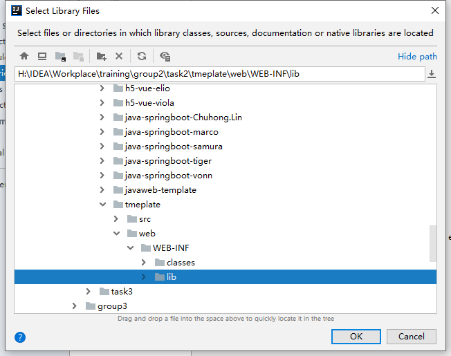
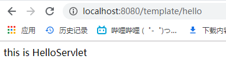
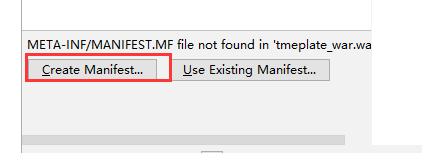
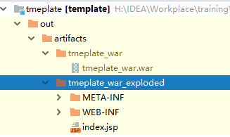

https://www.gulixueyuan.com/goods/show/97?targetId=193&preview=0

#### 基于maven的javaweb项目的创建和部署

1. 创建项目


2. 添加依赖

   ~~~xml
   <properties>
       <project.build.sourceEncoding>UTF-8</project.build.sourceEncoding>
       <maven.compiler.source>1.8</maven.compiler.source>
       <maven.compiler.target>1.8</maven.compiler.target>
       <!--tomcat版本-->
       <vtomcat>7.0.47</vtomcat>
   
     </properties>
     <dependencies>
       <dependency>
         <groupId>junit</groupId>
         <artifactId>junit</artifactId>
         <version>3.8.1</version>
         <scope>test</scope>
       </dependency>
   
       <dependency>
         <groupId>org.apache.tomcat</groupId>
         <artifactId>tomcat-jsp-api</artifactId>
         <version>${vtomcat}</version>
         <scope>provided</scope>
       </dependency>
       <!--HttpServlet支持-->
       <dependency>
         <groupId>org.apache.tomcat</groupId>
         <artifactId>tomcat-servlet-api</artifactId>
         <version>${vtomcat}</version>
         <scope>provided</scope>
       </dependency>
       <!--用于支持-HttpServlet注解-->
       <dependency>
         <groupId>javax.servlet</groupId>
         <artifactId>javax.servlet-api</artifactId>
         <version>3.1.0</version>
         <scope>provided</scope>
       </dependency>
     </dependencies>
   ~~~

   

3. 编写Servlet

   ~~~java
   //@WebServlet("/hello")
   //请求映射必须是以"/"开头，下面与上等价
   //@WebServlet(name="HelloServlet",value="/hello")
   @WebServlet(urlPatterns = "/hello",name="xxx")
   public class HelloServlet extends HttpServlet {
       protected void doPost(HttpServletRequest request, HttpServletResponse response) throws ServletException, IOException {
   
           request.setCharacterEncoding("utf-8");
           String msg = request.getParameter("msg");
           System.out.println("获取参数方式1："+msg);
           msg = URLDecoder.decode(request.getParameter("msg"),"utf-8");
           System.out.println("解码之后:"+msg);
   //        jsp页面虽然设置了utf-8编码，但传输的过程中使用的编码是：ISO-8859-1
           String msg2 = new String(request.getParameter("msg").getBytes("ISO-8859-1"),"utf-8");
           System.out.println("获取参数方式2："+msg2);
   //        获取参数方式2：chinese中文字符串乱码测试
   
           response.setCharacterEncoding("utf-8");
   
           response.setContentType("text/html");
           response.setCharacterEncoding("utf-8");
           response.getWriter().println("<h2 style=\"color:orange\">请求成功，显示参数："+msg2+"</h2>");
       }
   
       protected void doGet(HttpServletRequest request, HttpServletResponse response) throws ServletException, IOException {
           doPost(request,response);
       }
   }
   ~~~

4. 添加tomcat

   

   

   

   

5. 启动tomcat, 并访问页面


#### Javaweb项目的创建, 部署

>  创建项目


在web-inf目录下新建两个文件夹


设置classs为编译后得产出路径


设置lib为jar包路径





在src中编写创建com.tiger.HelloServlet

```java
@WebServlet(urlPatterns = {"/hello"}, name = "helloServlet")
public class HelloServlet extends HttpServlet {

    public HelloServlet() {
        super();
    }
    @Override
    public void doGet(HttpServletRequest request, HttpServletResponse response) throws ServletException, IOException {
        response.setContentType("text/html;charset=UTF-8");
        PrintWriter out = response.getWriter();
        out.println("this is HelloServlet");
        out.flush();
        out.close();
    }
    @Override
    public void doPost(HttpServletRequest request, HttpServletResponse response) throws ServletException, IOException {
        // TODO Auto-generated method stub
    }

}
```

修改index.jsp

```jsp
<%@ page contentType="text/html;charset=UTF-8" language="java" %>
<html>
  <head>
    <title>$Title$</title>
  </head>
  <body>
  hello world
  </body>
</html>
```

>  在IDEA中运行

设置tomcat的路径


设置项目路径


运行项目

在浏览器中访问localhost:8080/template即可访问到index.jsp页面(我这里项目名写错了, 并不妨碍访问, 跟随自己的项目路径就好了)


访问localhost:8080/template/hello即可访问到HelloServlet



>  将项目打包成war包, 并部署在外部tomcat中

创建一个archive artifacts, **exploded和archive的区别是, archive打包的是一个整体的war包, tomcat运行的时候需要将该war包展开(解压缩), 而exploded是展开的, 将相当于打包成一个文件夹**


项目没有meta-inf目录, 选择新建一个, 


将项目打包


我这里将两个artifacts都打包了, **在项目的out文件夹下, 可以看出archive类型的是一个完整的war包, 而exploded类型的是展开的, 尽管两个都可以使用**



将template_war.war复制到tomcat路径下的webapp里面, 或者将tmeplate_war_exploded文件夹复制到webapp里面, 看你是使用archive还是exploded类型的, 我这里选择archive类型的

在tomcat路径下的bin目录中执行startup.bat(windows)/startup.sh(linux)


分别访问localhost:8080/tmeplate_war和localhost:8080/tmeplate_war/hello


项目默认的项目名时localhost:8080/war包名

你也可以修改tomcat的端口,和项目的访问路径

- 修改tomcat端口, 在tomcat/conf/server.xml中找到Connector, 修改port

  ```xml
  <Connector port="8080" protocol="HTTP/1.1"
                 connectionTimeout="20000"
                 redirectPort="8443" />
  ```

- 修改项目路径, 在tomcat/conf/server.xml中找到Host, 添加一个Context, docBase表示的是项目的路径, 可以使用相对路径(相对于tomcat路径下的webapps)和绝对路径, path表示项目的url路径, 修改之后可以使用localhost:8080/javaweb去访问项目了

  ```xml
  <Host name="localhost"  appBase="webapps"
              unpackWARs="true" autoDeploy="true">
  
          <!-- SingleSignOn valve, share authentication between web applications
               Documentation at: /docs/config/valve.html -->
          <!--
          <Valve className="org.apache.catalina.authenticator.SingleSignOn" />
          -->
  		
  		<Context path="javaweb" docBase="tmeplate_war" reloadable="true" />
  		
          <!-- Access log processes all example.
               Documentation at: /docs/config/valve.html
               Note: The pattern used is equivalent to using pattern="common" -->
          <Valve className="org.apache.catalina.valves.AccessLogValve" directory="logs"
                 prefix="localhost_access_log" suffix=".txt"
                 pattern="%h %l %u %t &quot;%r&quot; %s %b" />
  ```

  


#### Servlet的HelloWorld

创建一个Servlet接口的实现类,只要实现了这个接口就是Servlet

````java
// 实现Servlet接口并实现其方法
public class HelloServlet implements Servlet {

    @Override
    public void init(ServletConfig servletConfig) throws ServletException {
        System.out.println("init");
    }

    @Override
    public ServletConfig getServletConfig() {
        System.out.println("getServletConfig");
        return null;
    }

    @Override
    public void service(ServletRequest servletRequest, ServletResponse servletResponse) throws ServletException, IOException {
        System.out.println("service");
    }

    @Override
    public String getServletInfo() {
        System.out.println("getServletInfo");
        return null;
    }

    @Override
    public void destroy() {
        System.out.println("destory");
    }
}
````

在web.xml中配置和映射这个Servlet

````xml
<servlet>
        <servlet-name>HelloServlet</servlet-name>
        <servlet-class>com.javaweb.HelloServlet</servlet-class>
</servlet>
<!-- 一个Servlet可以有多个servlet-mapping为其进行映射 -->
<servlet-mapping>
        <servlet-name>HelloServlet</servlet-name>
        <url-pattern>/hello</url-pattern>
</servlet-mapping>
<servlet-mapping>
        <servlet-name>HelloServlet</servlet-name>
        <url-pattern>/hello2</url-pattern>
</servlet-mapping>
````

#### Servlet生命周期

Servlet生命周期的方法:

 * 构造器: 只有第一次请求Servlet时, 创建Servlet的实例, 调用构造器, 这说明Servlet是**单例**的.

 * init方法:在创建好实例后立即被调用,  用于初始化当前的Servlet. 只被调用一次.

 * Service方法: 被多次调用, 每次请求都会调用service()方法, 实际用于响应请求的.

 * destroy方法: 只被调用一次, 在当前Servlet所在的WEB应用被卸载前调用, 用于释放当前Servlet所占用的资源.

使用load-on-startup指定Servlet被创建的时机:

- 若为负数, 则在第一次请求时Servlet被创建
- 若为0或正数, 着在当前web应用被Servlet容器加载的时候创建实例, 切数字越小越早被创建.

````xml
<servlet>
        <servlet-name>HelloServlet</servlet-name>
        <servlet-class>com.javaweb.HelloServlet</servlet-class>
        <load-on-startup>1</load-on-startup>
</servlet>
````

#### Servlet容器响应客户请求的过程

1. Servlet引擎检测是否已经创建并加载该Servlet的实例, 如果是着执行第四步, 否则执行第二部
2. 创建一个Servlet的对象: 调用该Servlet的构造方法
3. 调用Servlet实例对象的init()方法
4. 创建一个用于请求的ServletRequest对象和一个代表响应消息的ServletResponse对象, 然后调用service()方法, 并将请求和响应对象作为参数传递进去.
5. web应用程序被停止或重启之前, Servlet引擎将卸载Servlet,并在卸载之前调用Servlet的destroy()方法

#### ServletConfig

这是一个接口. 有四个方法:

 	1. String getInitParameter(String name)
 	2. Enumeration getInitParameteNames()
 	3. ServeltContext getServletContext()
 	4. String getServletName()

配置Servlet的初始化参数:

````xml
<servlet>
    <servlet-name>HelloServlet</servlet-name>
    <servlet-class>com.javaweb.HelloServlet</servlet-class>
    <!-- 这里配置了两个初始化参数 -->
    <init-param>
        <param-name>user</param-name>
        <param-value>root</param-value>
    </init-param>
    <init-param>
        <param-name>password</param-name>
        <param-value>123456</param-value>
    </init-param>
    <load-on-startup>1</load-on-startup>
</servlet>
````

获取初始化参数:

````java
public void init(ServletConfig servletConfig) throws ServletException {
        System.out.println("init");

        //通过servlet的初始化参数名称获取值
        String user = servletConfig.getInitParameter("user");
        System.out.println("user: " + user);

        //获取servlet的所有参数名称, 并根据名称获取值
        Enumeration<String> paramNames = servletConfig.getInitParameterNames();
        while (paramNames.hasMoreElements()){
            String paramName = paramNames.nextElement();
            System.out.println("name: " + paramName);
            System.out.println("value: " + 	servletConfig.getInitParameter(paramName));
        }
        //获取servlet的名字, 这个名字在<servlet-name>中声明
        String servletName = servletConfig.getServletName();
        System.out.println(servletName);
    }
````


#### ServletContext

1. 可以从ServletConfig获取
2. 该对象代表当前web应用: 可以认为ServletContext是当前web应用的一个大管家, 可以从中获取web应用的各个方面的信息
3. 设置当前web应用的初始化参数
````xml
    <context-param>
            <param-name>driver</param-name>
            <param-value>com.mysql.jdbc.Driver</param-value>
    </context-param>
    <context-param>
        <param-name>jdbcUrl</param-name>
        <param-value>jdbc:mysql://atguigu</param-value>
    </context-param>
````
4. 获取当前web应用的初始化参数
````java
public void init(ServletConfig servletConfig) throws ServletException {
        //获取ServletContext
        ServletContext servletContext = servletConfig.getServletContext();
        //获取当前web应用该的初始化参数
        //获取初始化参数的名字集合
        Enumeration<String> contextParamNames = servletContext.getInitParameterNames();
        while(contextParamNames.hasMoreElements()){
            String paramName = contextParamNames.nextElement();
            //根据名字获取参数
            String paramValue = servletContext.getInitParameter(paramName);
            System.out.println("paramName: " + paramName);
            System.out.println("paramValue: " + paramValue);
        }
    }
````


5. 获取当前应用在tomcat服务器中的路径

   ````java
   String contextPath = servletContext.getContextPath();
   System.out.println(contextPath);
   ````

   

   这个路径在tomcat中可以设置

   

#### Servlet的service()方法

```java
public void service(ServletRequest servletRequest, ServletResponse servletResponse) throws ServletException, IOException {
		
}
```

- service()方法用于回答请求, 因此每次请求都会调动service()方法

- ServletRequest: 封装了请求信息, 可以从中获取到任何请求信息

- ServletResponse: 封装了响应信息, 如果想给用户什么响应, 具体可以使用该接口的方法实现.
- 这两个接口的实现类都是服务器实现的, 并在服务器调用service方法时传入

#### ServletRequest相关方法

- 获取请求参数

````java
/* string getParameter(String name)根据参数名返回参数值 */
String user = servletRequest.getParameter("user");
String password = servletRequest.getParameter("password");
System.out.println("user: "+ user + " password: " + password);

/* String[] getParameterValues(String name) 根据请求名, 返回请求参数对应的字符串数组, 适用于多选按钮 */
String[] stars = servletRequest.getParameterValues("stars");
for (String star: stars){
    System.out.println("** " + star);
}

/* Enumeration getParameterNames() 返回参数名对应的Enumeration对象*/
Enumeration<String> parameterNames = servletRequest.getParameterNames();
        while (parameterNames.hasMoreElements()){
            System.out.println(parameterNames.nextElement());
        }
/* Map getParameterMap()  返回请求参数的键值对,  key: 参数名, value: String[]类型的参数值 */
Map<String, String[]> parameterMap = servletRequest.getParameterMap();
for (Map.Entry<String, String[]> entry: parameterMap.entrySet()){
    System.out.println(entry.getKey() + ": " + Arrays.asList(entry.getValue()));
}
````

  

- 获取请求的url

  想要获取uri和请求方式, 必须将servletRequest强转成HttpServletRequest,这是ServletRequest的一个子接口,针对HTTP请求所定义, 里面包含了大量http请求相关的方法.

````java
//获取请求的uri
HttpServletRequest httpServletRequest = (HttpServletRequest)servletRequest;
String requestURI = httpServletRequest.getRequestURI();
System.out.println(requestURI);
````

- 获取请求的方式

````java
//获取请求的方式(post, get)
HttpServletRequest httpServletRequest = (HttpServletRequest)servletRequest;
String method =  httpServletRequest.getMethod();
System.out.println(method);
````


- 获取查询字符串和servletPath

````java
String servletPath = httpServletRequest.getServletPath();
System.out.println(servletPath);

//queryString必须是get方式下才有的,就是?后面的请求参数
String queryString = httpServletRequest.getQueryString();
System.out.println(queryString);
````


**RequestURL: http://localhost:8080/HelloServletapp/hello**

**RequestURI: /HelloServletapp/hello**

**ContextPath: /HelloServletapp**

**ServletPath:/hello**  这个就是URI去掉ContextPath

#### ServletResponse相关方法

- PrintWriter getWriter() , 打印字符串在页面上

  ````java
  PrintWriter printer =  servletResponse.getWriter();
  printer.println("helloworld.....");
  ````

  

- void setContentType(String), 设置响应内容的类型, 这个函数的参数在tomcat/conf/web.xml的<mime-mapping>标签中,不同扩展名的文件对于不同的参数

  

  ````java
  //application/msword相当于返回的是doc文件
  servletResponse.setContentType("application/msword");
  PrintWriter printer =  servletResponse.getWriter();
  printer.println("helloworld.....");
  ````

  

#### GenericServlet


1. GenericServlet是Servlet接口和ServletConfig接口的实现类, 但是是一个抽象类, 其中service()为抽象方法.
2. 我们每次写servlet时都要实现Servlet接口, 并且实现其中的方法, 但是我们一般只使用service()方法来处理业务
3. 所以新建的Servlet程序直接继承GenericServlet会使得开发更简洁
4. 具体实现:
   - 在GenericServlet中声明了一个ServletConfig类型的成员变量, 在init(ServletConfig)方法中对象进行初始化
   - 利用servletConfg成员变量的方法实现了ServletConfig接口的方法
   - 还定义了一个不带参数的init()方法, 在init(ServletConfig)方法中进行对其进行调用, 子类可以直接覆盖init()方法, 在其中实现对Servlet的初始化
   - **不建议直接覆盖init(ServletConfig), 这样会造成了GenericServlet中的servletConfig为空,除非使用其他方式将servletConfig赋值,如super.init(servletConfig)**
   - **新建的init()并非Servlet的声明周期方法, 而init(ServletConfig)是相关的**

#### HttpServlet

1. HttpServlet继承了GenericServlet, 针对HTTP协议定制

2. 在service()方法中直接把ServletRequest和ServletResponse强转为HttpServletRequest和HttpServletResponse,并调用了重载的service(HttpServletRequest, HttpServletResponse)方法

3. 在service(HttpServletRequest, HttpServletResponse)方法中获取请求方式:request.getMethod(), 并根据请求方式调用doXXX()方法(doGet, doPost)

4. 实际开发中, 直接继承HttpServlet, 并根据请求方式复写doXXX()方法接口.

   

#### JSP

1. 运行原理:
   - web容器接收到以.jsp为扩展名的url访问请求时, 他将这个访问请求交给jsp引擎处理
   - 每个jsp页面第一次被访问时, jsp引擎将它翻译成一个Servlet源程序, 接着再把这Servlet源程序编译成Servlet的class文件, 然后再由web容器像调用普通Servlet一样的方式转载和解释执行这个由jsp页面翻译成的Servlet程序
   - 可以在web应用程序正式发布之前, 将所有的jsp页面预先编译成Servlet程序

2. jsp本质上是一个servlet, 因为将jsp被翻译成源文件之后, 这个类会继承HttpJspBase类, 而HttpJspBase类又继承了HttpServlet类

   

3. jsp可以放置在web应用程序中的除了WEB-IF及其子目录外的其他任何目录中, jsp页面的访问路径与普通HTML页面的访问路径形式也完全一样.  WEB-INF中方的是当前应用的一些隐私文件

   

#### JSP页面的九个隐藏内置对象

   ```java
//这个方法就如同HttpServlet中的Service()方法一样, 因为是继承而来的
public void _jspService(HttpServletRequest request, HttpServletResponse response) throws java.io.IOException, javax.servlet.ServletException {

    final javax.servlet.jsp.PageContext pageContext;
    javax.servlet.http.HttpSession session = null;
    final javax.servlet.ServletContext application;
    final javax.servlet.ServletConfig config;
    javax.servlet.jsp.JspWriter out = null;
    final java.lang.Object page = this; 
    //使用<% %>先写的代码在这个位置, 可以用到request, reponse,pageContext, session
    //application, config, out, page这八个隐含对象(实际上还可以使用一个exception的隐含对象
   ```

- **request**:  就是函数的参数, 也就是调用Servlet中service(ServletRequest, ServletResponse)传过来的参数, 实际上是HttpServletRequest

- **pageContext**:  页面的上下文, 可以从该对象中获取到当前页面的几乎一切信息,  包含其他八个隐含对象(学习自定义标签时使用)

- **session**:  代表浏览器和服务器的一次会话, 是HttpSession的一个对象.

- **application**:   代表当前web应用.  是ServletContext对象 

- **out**:  JspWriter对象.  调用out.println()可以直接把字符串打印到浏览器上

- config:  当前jsp对应的Servlet的ServletConfig对象(开发中几乎不用)

- response:  也是函数的参数(在jsp页面中几乎不会调用response的任何方法)

- page:  指向当前Jsp对应的Servlet对象应用,  如上面的代码, 但是是object类型, 只能调用object类的方法(开发几乎不使用)

- exception: 在声明了page指令的isErrorPage="true"时,才可以使用

  ```jsp
  <% page isErrorPage = "true" %>
  ```

以上八个参数可以类比Servlet中的对象,:

request-->servletRequest

response-->servletResponse

application-->servletContext

config-->servletConfig

page-->this

out-->printWriter

#### jsp语法

1. jsp表达式:  将一个java变量或表达式的计算结果直接输出到客户端的简化方式

   ```jsp
   current time: <%= new Date() %>
   ```

   ```java
   //被翻译后java中代码, 可以看出<%= %>中的内容会被out.print()输出
   out.write("current time:");
   out.print( new Date());
   ```

2. jsp脚本片段

   ```jsp
   <% String ageStr = request.getParameter("age");
   	Integer age = Integer.parseInt(ageStr);  %>
   <!-- 这样会实现if判断, 因为这段代码翻译后就是完整的if判断 -->
   <% if(age >= 18){ %>
      <br> 成人
   <% }else{ %>
      <br> 未成年
   <%  }  %>
   ```

   ```java
    if(age >= 18){ 
         out.write("\r\n");
         out.write("<br>成人\r\n");
    }else{ 
         out.write("\r\n");
         out.write("<br>未成年\r\n");
     }  
   ```

   

   

3. jsp注释

   ```jsp
   <%-- 这是jsp注释 --%>
   <!-- 这是html注释 -->
   //html的注释被原样输出, 而jsp注释在翻译后的代码不会出现
   out.write("<!-- 这是html注释 -->\r\n");
   ```
   ```java
   //下面这段代码依旧会运行
   <!--
       <% System.out.println("打印信息")%>
    -->
    //下面这段代码不会生效
    <%--
       <% System.out.println("打印信息")%>
    --%>
   ```

4. jsp声明

   ```jsp
   <!-- 我们知道, jsp中翻译后的内容都是在_jspService()中, 而方法中有不能声明方法, 所以如果我们想让我们写的东西在_jspService()外面就要使用<%! %>标签了 -->
   <%! public void test(){} %>
   <!-- 这样test方法就成了jsp翻译后的servlet的成员方法了 -->
   ```

#### jsp的内置对象作用域

pageContext: 仅限当前页面

request: 仅限一次请求

session: 一次会话中:浏览器打开知道关闭(在此期间会话不失效)

application: 限于当前web应用

和属性相关的方法, 在以上四个对象中都有:

- void setAttribute(String name, Object o):  设置属性
- Object getAttribute(String name):  获取指定的属性
- Enumeration getAttributeNames():  获取所有属性的名字组成的Enumeration对象
- removeAttribute(String name):  移除指定属性

#### 转发和重定向

```java
//请求的转发:  /代表的是当前的web应用的根目录
//请求的重定向:  / 代表当前web站点的根目录
//重定向
response.sendRedirect("TestServlet");
//转发
RequestDispatcher dispatcher = request.getRequestDispatcher("/TestServlet");
dispatcher.forward(request, response);
```


- 本质区别: 转发只发出了一次请求, 而重定向发出来两次请求
  1. - 请求的转发: 地址栏是初次发出请求的地址栏
     - 请求的重定向: 地址栏不是初次发出的请求地址, 地址栏为最后响应的那个地址栏

  2. - 请求的转发:  在最终的Servlet中, request对象和中转的那个request是同一个对象
     - 请求的重定向: 不是同一个对象, 因为请求了两次

  3. - 请求的转发:  只能转发给当前web应用的资源

     - 请求的重定向:  可以重定向到任何资源

  4. - 请求的转发:  /代表的是当前的web应用的根目录
     - 请求的重定向:  / 代表当前web站点的根目录

#### JSP指令:page指令

page指令用于定义jsp页面的各种属性

```java
<% page
	language="java" //java是唯一的合法的属性值
	extends="package.age"  //为翻译后的Servlet继承类
	import="{package.class | package.class}" //为翻译后的Servlet导包
	session="true|false"  //表示当前页面是否能使用session隐含对象
	isErrorPage="true|false" //指定当前页面是否为错误页面,指定当前页面为true时可以使用exception隐含对象,该页面一般不能让用户直接访问该页面,放在web-inf目录下
	errorPage="relative_url" //访问当前页面出错时, 转发到错误页面
    contentType="mimeType[; charset=characterSet]" //指定当前jsp页面的响应类型,实际调用的是Response.setContentTyep();
    //通常情况下,对于jsp页面而言取值均为text/html;charset=UTF-8. charset指定返回页面的字符编码
    pageEncoding="characterSet" //指定当前jsp页面的字符编码, 通常和contentType中的charset一致
    isELIgnored="true|false" //指定当前jsp页面是否可以使用el表达式, 通常为false.isELIgnored的值取决于web应用部署描述符的版本。使用Servlet2.4的描述符的JSP页面默认是解析EL表达式，即表达式有效。而使用Servlet2.3或者更早的描述符的JSP页面默认是忽略EL表达式的，即不解析EL表达式，这样就提供了向后兼容性。    
%>
```

```xml
<!--还可以在web.xml中配置错误页面 -->
<!-- 出现500错误码时访问 -->
<error-page>
    <error-code>500</error-code>
    <location>/WEB-INF/error.jsp</location>
</error-page>
<!-- 指定异常的类型 -->
<error-page>
    <exception-type>exception</exception-type>
    <location>/WEB-INF/error.jsp</location>
</error-page>  
```

#### jsp指令: include指令

include指令用于通知jsp引擎在翻译当前jsp页面时, **将其他文件中的内容合并进当前jsp页面转化成的Servlet源文件中**, 这种源文件级别进行引入的方式称为静态引入, **当前jsp页面与静态引入的页面紧密结合为一个Servlet**.

语法: <%@ include file="relativeURL" %>, file使用的是相对路径, 如果以/开头, 表示相对于当前web应用的根目录,否则相对于当前文件, **推荐使用/开头**

#### jsp:include标签

<jsp: include page="relativeURL"> 

相比于上面的静态引入, 动态引入并不是像include指令那样生成一个Servlet源文件, 而是两个源文件, 然后通过调用方法的方式将另外一个页面包含进来.  所以该标签是在当前jsp页面的执行期间插入被引入的输出内容, 并且被引入的资源只能是一个能独立被web容器调用和执行的资源.

````jsp
<jsp:forward page="/include/c.jsp">
    <jsp:param name="name" value="zhansan"></jsp:param>
</jsp:forward>
<!-- 这个param标签就相当于-->
request.setAttribute("name", "zhansan");
<!-- 这样在c.jsp中也可以使用name属性了 -->
````


#### jsp:forward标签

这个标签就相当于

```jsp
<% request.getDispatcher("/include/b.jsp").forward(request, response); %>
```

唯一的区别就是<jsp: forward>标签有子标签<jsp:param>, 功能强大一点

```jsp
<jsp:forward page="/include/c.jsp">
    <jsp:param name="name" value="zhansan"></jsp:param>
</jsp:forward>

<!--上面这段代码就相当于 -->
<% request.setAttribute("name", "zhansan");
   request.getDispatcher("/include/b.jsp").forward(request, response);%>
```

#### 关于中文乱码的问题

1. 在jsp页面上输入中文, 请求页面后出现乱码: 

   ```jsp
   <!-- 请保证contentType和pageEncoding一致,并且都是UTF-8 -->
   <%@ page contentType="text/html;charset=UTF-8" %>
   <%@ page pageEncoding="UTF-8" %>
   ```

2. 对于post请求参数在输出中文后后为乱码:

   

   

   

   ````jsp
   <!-- 请在一切getParameter()前使用这句话, 如果在get之后使用就相当于没写 -->
   <% request.setCharacterEncoding("UTF-8");%>
   ````

   

3. 对于get请求, 有些浏览器会对查询参数提供UTF-8编码, 这样就不会导致乱码问题. 而对于不提供UTF-8编码的浏览器, 则默认使用ISO-8859-1编码, 所以直接输出参数后乱码, 这是tomcat中设置的, 可以查看http://localhost:8080/docs/config/http.html(端口号请更换自己的端口号)中的useBodyEncodingForURI属性

   

   解决方案: 在tomcat的server.xml的<Connector>标签中设置useBodyEncodingForURI

   ```xml
   <Connector port="8080" protocol="HTTP/1.1"
              connectionTimeout="20000"
              redirectPort="8443" useBodyEncodingForURI="true"/>
   <!-- 然后调用setCharacterEncoding()即可 -->
   ```

#### Cookie概述

   **Http协议是一种无状态 的协议**,web服务器本身不能是被那些请求是同一个浏览器发出的, 浏览器的每一次请求都是完全孤立的, 作文web服务器, 必须能够采用一种机制来唯一的识别一个用户,同时记录下该用户的状态.

   web服务器要从大量程序的请求中区分哪些请求属于同一个 会话, 即能识别出来自 同一个浏览器的访问请求, 这需要浏览器对其发出的每一个请求信息都进行标识: 属于同一个会话请求的请求消息都带有同样的标识号, 而不同会话的请求总是带有不同的标识号

#### Cookie机制

   - Cookie机制采用的是**在客户端保持http状态信息的方案**

   - Cookie是在浏览器访问web服务器的某个资源时, 由**web服务器在http响应消息头中附带传送给浏览器的一个小文本文件**

   - **一旦web浏览器保存了某个Cookie, 那个 他在以后的每次访问该web浏览器时, 都会在http请求头中将这个cookie回传给web服务器**

   - 底层实现:  web服务器通过在http响应消息中增加Set-Cookie响应头字段将Cookie消息发送给浏览器, 浏览器通过在http请求信息中增加Cookie请求头字段将cookie回传给web服务器

   - 一个Cookie只能标识一种信息, 他至少含有一个标识该信息的名称(name)和设置值(value)

   - 一个web站点可以给浏览器发送多个cookie, 一个浏览器也可以储存多个web站点的cookie

#### Cookie使用方法

1. Cookie 类的方法:
   - 构造方法: public Cookie(String name, String value)
   - getName()方法
   - setValue和getValue方法
   - setMaxAge和getMaxAge方法
   - **如果创建一个cookie, 并将它发送给浏览器, 默认情况下他是会话级别的cookie; 也就是储存在内存中,  用户退出浏览器之后被删除, 如果希望浏览器将cookie存储在磁盘上, 需要设置maxAge, 并给出一个秒为单位的时间, 将时效设置为0则是立即删除, 负数表示不存储,即关闭就删除, 正数表示存在的秒数, 到点就删除.**
   - setPath和getPath方法
2. HttpServletResponse接口中定义了一个addCookie方法， 他用于在发送给浏览器的http响应信息中添加一个Set-Cookie响应头字段, 因为不会修改之前的Set-Cookie http响应报头而是新建的报头, 所以是add.
3. HttpServletRequest接口中定义了getCookies方法， 用于从http请求消息的Cookie请求头字段中读取所有的Cookie项，**没有办法获取某一个cookie， 只能获取所有cookie然后遍历**

#### Cookie的作用范围

cookie可以作用当前目录和当前子目录, 当不能作用于当前目录的上一级目录

可以通过setPath方法来设置cookie的作用范围, 其中/ 代表站点的根目录

````java
//两者都是设置cookie的作用访问为当前应用, 假定当前应用为mvc, 使用getContextPath()是动态获取.
cookie.setPath("/mvc");
cookie.setPath(request.getContextPath());

````

#### HttpSession概述

session表示的是服务器和浏览器的一次会话, 也就是浏览器登录网站到关闭 浏览器的这段时间

当程序需要为某个客户端的请求创建一个session是, 服务器首先检查这个请求里是否包含一个JSESSIONID的cookie, 如果有就这个标识说明之前已经为用户创建过session, 服务器就根据这个sessionid把已经创建的session找出并返回, 如果还没有sessionid就创建一个session并且生成一个name为JESSION, value为sessionid的cookie, 这个JSESSION的cookie会在本次响应中返回给客户端保存, 这样浏览器下次请求的时候就会把jessionid带过来, 服务器根据这个jsessionid就可以找到session对象了.

session是保存在服务器中的对象, 而浏览器中的是以cookie形式存在的sessionid, 服务器根据每一次请求中的sessionid是否相同来判断是否为同一用户. 这个cookie的maxAge一般为-1, 也就是关闭浏览器就失效了, 但是这个时候session还是存在服务器中的, 但是失去了sessionid, 这个session对象也就没什么用处了, 当超过时间就会被服务器清除(在tomcat的web.xml中的session-timeot中表示, 一般为30分钟).

#### HttpSession的创建

关于session的函数:

- request.getSession(),  根据jsessionid找到对应的session, 如果没有或者找不到就创建一个新的返回, **创建一个新的session会同时将jsessionid作为cookie传给浏览器.** 
- request.getSession(boolean)  根据jsessionid找到对应的session. 找到就返回, 找不到看参数是否创建, true表示创建一个新的返回, false为返回null.
- getSession()和getSession(true)效果一样

首先, 只有调用request.getSession(true)或者getSession()才会创建一个session. 所以访问html, image等静态资源并不会创建Session, 因为根本不会调用getSession(), 只有访问jsp, servlet等程序才会创建session.

当我们访问jsp的时候, 默认<% page session="true">, 这样当把jsp翻译成servlet的时候, 我们查看源码, 系统自动创建了session引用, 并调用了getSession(), 这样如果找不到就会创建session对象并且生成一个name为JESSION, value为sessionid的cookie, 这个JSESSION的cookie会在本次响应中返回给客户端保存. 上面创建的session就是jsp中内置的九大对象了.


如果把<% page session="false">,上面红色部分代码是没有的, 所以访问这个jsp不会为你新建session, 同样的你不能使用session这个引用. 但是不能使用session引用并不意味着不能使用不能使用HttpSession这个类. 

而对于访问servlet, 你代码里面不调用getSession(true)是不会创建session的,系统不会想jsp一样自动创建.

#### HttpSession的销毁

1. 距离上一次客户端发送的session id时间间隔超过了session的最大有效时间

2. 调用了HttpSession.invalidate()方法

3. 服务器关闭了
#### URL重写

当用户浏览器不支持cookie的时候, 我们使用url重写来将jessionid写在url的后面

```jsp
<!-- login.jsp -->
<form action="index.jsp">
<!-- 使用url重写之后-->
<form action <%= response.encodeURL("index.jsp") %> >
     <!--这样重写之后的url就会加上jsessionid -->
</form>
```


#### HttpSession的相关api

1. 获取session对象:
   - request.getSession()
   - request.getSession(boolean)
2. 属性相关的:
   - setAttribute()
   - removeAttribute()
   - getAttribute()
   - setMaxInteractive() 设置最大时效
   - invalidate() 销毁当前session
   - response.encodeURL() 重写url

#### Filter概述

1. 基本功能: 对Servlet容器调用Servlet的过程进行拦截, 从而在Servlet进行响应处理的前后实现一些特殊的功能

2. Filter程序是实现了Filter接口的java类

   ```java
   //filter的实现很像servlet中的init, service, destory
   public class FirstFilter implements Filter {
   
       //这个方法在创建对象后立即调用, 并且只调用一次
       @Override
       public void init(FilterConfig filterConfig) throws ServletException {
       }
       //这个方法就如同Servlet的service方法一样, 每次调用Filter就会调用这个方法
       @Override
       public void doFilter(ServletRequest servletRequest, ServletResponse servletResponse, FilterChain filterChain) throws IOException, ServletException {
           //调用这个方法进入拦截链的下一个环节
          filterChain.doFilter(servletRequest, servletResponse);
       }
       //这个方法在销毁之前调用
       @Override
       public void destroy() {
       }
   }
   ```

   

3. Filter如同Servlet一样, 必须在web.xml中注册和设置他所能拦截的资源(jsp, Servlet, 静态图片, 静态html)

   ```xml
   <filter>
       <filter-name>firstFilter</filter-name>
       <filter-class>FirstFilter</filter-class>
       <init-param>
           <param-name>username</param-name>
           <param-value>tom</param-value>
       </init-param>
   </filter>
   <filter-mapping>
       <filter-name>firstFilter</filter-name>
       <url-pattern>/hello.jsp</url-pattern>
   </filter-mapping>
   ```

   

4. 

5. 若多个Filter程序对某个Servlet程序进行拦截, 当针对该Servlet的请求到达时, web容器将把多个Filter程序组成一个FilterChain(Filter链), **Filter 链中各个 Filter的拦截顺序与它们在 web.xml 中的<filter-mapping>标签的顺序一致**

   ```xml
   <!-- 下面的FirstFilter和SecendFilter都是拦截同一资源, 所以组成了拦截链, 因为FirstFilter的filter-mapping声明在前, 所以先经过firstFilter的拦截, 然后再到SecendFilter, 然后才会经过hello.jsp, 当然, filter也可以将请求转发或者重定向, 是他不经过hello.jsp -->
   <filter>
       <filter-name>firstFilter</filter-name>
       <filter-class>FirstFilter</filter-class>
   </filter>
   <filter>
       <filter-name>secendFilter</filter-name>
       <filter-class>SecendFilter</filter-class>
   </filter>
   <filter-mapping>
       <filter-name>firstFilter</filter-name>
       <url-pattern>/hello.jsp</url-pattern>
   </filter-mapping>
   <filter-mapping>
       <filter-name>secendFilter</filter-name>
       <url-pattern>/hello.jsp</url-pattern>
   </filter-mapping>
   ```

#### 多个Filter代码的执行顺序

如同上面xml的配置, 先执行FirstFilter, 然后SecendFilter

```java
public class FirstFilter implements Filter {

        public void doFilter(ServletRequest servletRequest, ServletResponse 					servletResponse, FilterChain filterChain){
            System.out.println("1. firstFilter  doFilter before");
            filterChain.doFilter(servletRequest, servletResponse);
            System.out.println("2. firstFilter  doFilter after");
    }
}
public class FirstFilter implements Filter {

        public void doFilter(ServletRequest servletRequest, ServletResponse 				servletResponse, FilterChain filterChain){
            System.out.println("3. secendFilter  doFilter before");
            filterChain.doFilter(servletRequest, servletResponse);
            System.out.println("4. secendFilter  doFilter after");
    }
}

//hello.jsp
<% System.out.println("5. hello.jsp");%>
```

上面代码的执行顺序应该是13542

#### 使用<dispatcher>指定Filter拦截的方式

在上面的FirstFilter, SecendFilter中, 我们只是进行了最简单的配置, 这样当我们通过get或者post访问目标资源的时候, 过滤器能过起作用, 但是当我们使用转发来访问目标资源的时候却不会起作用, 因为我们没有配置<dispatcher>, 所以默认使用的QEQUEST的方式, 即只拦截get和post方式

````xml
<filter>
    <filter-name>firstFilter</filter-name>
    <filter-class>FirstFilter</filter-class>
</filter>
<filter>
    <filter-name>secendFilter</filter-name>
    <filter-class>SecendFilter</filter-class>
</filter>
<filter-mapping>
    <filter-name>firstFilter</filter-name>
    <url-pattern>/hello.jsp</url-pattern>
    <!-- 这样配置, firstFilter会对转发的进行拦截, 但是直接访问就不会起作用了 -->
    <dispatcher>FORWARD</dispatcher>
</filter-mapping>
<filter-mapping>
    <filter-name>secendFilter</filter-name>
    <url-pattern>/hello.jsp</url-pattern>
    <!-- 这样配置会对直接访问和转发起作用 -->
    <dispatcher>FORWARD</dispatcher>
    <dispatcher>REQUEST</dispatcher>
</filter-mapping>
````

<dispatcher>指定过滤器所拦截的资源被 Servlet 容器调用的方式，可以是REQUEST,INCLUDE,FORWARD和ERROR之一，默认REQUEST.
可以设置多个**<dispatcher>** 子元素用来指定 Filter 对资源的多种调用方式进行拦截

•<dispatcher> 子元素可以设置的值及其意义：

- **REQUEST**：当用户直接访问页面时，Web容器将会调用过滤器。如果目标资源是通过RequestDispatcher的include()或forward()方法访问时，那么该过滤器就不会被调用。

-  INCLUDE：如果目标资源是通过RequestDispatcher的include()方法访问时，那么该过滤器将被调用。除此之外，该过滤器不会被调用。

-  **FORWARD**：如果目标资源是通过RequestDispatcher的forward()方法访问时，那么该过滤器将被调用，除此之外，该过滤器不会被调用。**在jsp页面配置<%@page errorPage="error.jsp" %>时,因为错误访问error.jsp也算是转发**

- **ERROR**：如果目标资源是通过声明式异常处理机制调用时，那么该过滤器将被调用。除此之外，过滤器不会被调用。
```xml
<!-- 声明式异常 -->
<error-page>
      <error-code>500</error-code>
      <location>/WEB-INF/error.jsp</location>
</error-page>
<error-page>
      <exception-type>exception</exception-type>
      <location>/WEB-INF/error.jsp</location>
</error-page>  
```

#### Listener 概述

在jsp中一共有八个监听器,分为三大类:

- 监听域对象自身的创建和销毁的事件监听器(ServletContextListener, ServletRequestListener, HttpSesssionListener)
- 监听域对象中属性的增加和删除的事件监听器(ServletContextAttributeListener、HttpSessionAttributeListener和ServletRequestAttributeListener)
- 监听绑定到HttpSession域中某个对象状态的事件监听器(HttpSessionBindingListener和HttpSessionActivationListener)

以上的Listener都是接口, 如果要创建哪一个监听器就实现哪一个接口,并且在web.xml中配置即可

**如果一个web.xml文件中注册了多个监听器，则监听器的启动顺序按照在web.xml中的注册顺序启动。如果一个web.xml文件中同时定义了监听器、过滤器和Servlet，那么web容器会先加载监听器、再加载过滤器最后加载Servlet。**

#### 创建与销毁监听器


- ServletContextListener:**比较常用的监听器, 可以 在当前web应用被加载的时候对当前web应用的相关资源操作: 创建数据库连接处, 创建SpringIOC容器, 读取当前web应用的初始化参数**(使用Servlet, 并且配置Servlet的load-on-startup=1, 然后使用Servlet的init方法也可以达到相同效果, 但是不建议这样)
```java
public class ContextListener implements ServletContextListener
{
	//当web应用启动时, 创建ServletContext之后调用
    public void contextInitialized(ServletContextEvent sce) {
        System.out.println("context initialized");
    }
		//卸载web应用时, 销毁context对象之前调用
    public void contextDestroyed(ServletContextEvent sce) {
        System.out.println("context destory");
    }
}
/*  在web.xml中注册listener, 下面两个相同
  <listener>
    <listener-class>com.listener.ContextListener</listener-class>
  </listener>
  */
```
**参数sce的方法,  getServletContext()**

- ServletRequestListener
```java
public class ContextListener implements ServletRequestListener
{
	//销毁servletRequest前调用
    public  void requestDestroyed(ServletRequestEvent sre) {
    }
	//创建ServletRequest后调用, 每次来一个请求都会创建一个request, 所以每次都会调用
    public  void requestInitialized(ServletRequestEvent sre) {
    }

}
/*		sre参数中的方法
        sre.getServletContext();
        sre.getServletRequest();
*/
```
- HttpSessionListener
```java
public class ContextListener implements HttpSessionListener
{
	//session创键后调用
    public void sessionCreated(HttpSessionEvent se) {
    }
	//session销毁前调用
    public  void sessionDestroyed(HttpSessionEvent se) {
    }
}
/* se中的方法
se.getSession();
*/
```

#### 属性增加、删除和替换监听器

这一类监听器主要监听ServletContext、HttpSession和ServletRequest这三个域对象中属性的创建、销毁和修改的事件，要实现这三种监听器，就需要继承ServletContextAttributeListener、HttpSessionAttributeListener和ServletRequestAttributeListener这三个接口，并实现接口中的方法

- ServletContextAttributeListener

  ```java
  public class AttributeListener implements ServletContextAttributeListener{
      //为ServletContext添加属性后调用
      public void attributeAdded(ServletContextAttributeEvent scae) {
          System.out.println("ServletContextAttribute add");
      }
  	//为ServletContext移除属性后调用
      public void attributeRemoved(ServletContextAttributeEvent scae) {
          System.out.println("ServletContextAttribute remove");
      }
  	//为ServletContext替换属性后调用
      public void attributeReplaced(ServletContextAttributeEvent scae) {
          System.out.println("ServletContextAttribute replace");
      }
     
  }
  /*  在web.xml中配置listener
    <listener>
      <listener-class>com.listener.AttributeListener</listener-class>
    </listener>
    */
  
  scae中的方法: getName(), getValue() 获取改变的属性的名与值
  ```
- HttpSessionAttributeListener, ServletRequestAttributeListener中需要实现的方法的方法名同上, 只是参数的类型不同,  并且参数中的方法也是getName()和getValue().  HttpSessionAttributeListener的方法的参数多了一个getSession(). 

#### 监听绑定到HttpSession域中某个对象状态的事件监听器

保存在 Session 域中的对象(属性)可以有多种状态：**绑定到  Session 中；从 Session 域中解除绑定(添加到session属性域或从session属性域中删除)；随 Session 对象持久化到一个存储设备中；随 Session 对象从一个存储设备中恢复**(从硬盘上读取到内存, 从内存写到硬盘上)

Servlet 规范中定义了两个特殊的监听器接口来**==帮助 JavaBean 对象了解自己在 Session 域中的这些状态==**：HttpSessionBindingListener接口和HttpSessionActivationListener接口 ，==**实现这两个接口的类不需要 web.xml 文件中进行注册**==

- HttpSessionBingdingListener

  ```java
  public class Customer implements HttpSessionBindingListener {
      
      //当对象被绑定到 HttpSession 对象中时，web 服务器调用该对象的此方法
      public void valueBound(HttpSessionBindingEvent event) {
          System.out.println("绑定到Session中");
      }
  	//当对象从HttpSession 对象解除绑定中时，web 服务器调用该对象的此方法
      public  void valueUnbound(HttpSessionBindingEvent event) {
          System.out.println("从Sessio中解除绑定");
      }
  }
  //event中的方法
  //getName() 获取该属性值的属性名, 也就是下面的"新来的"
  //getValue() 获取的是this, 因为被添加的属性值就是他自己
  //getSession() 获取添加当前属性值的session对线
  ```

  ```jsp
  <%
      session.setAttribute("新来的", new Customer());
      System.out.println("----------------------------");
      session.removeAttribute("新来的");
      System.out.println("-----------------------------");
  %>
  ```

  

  

- HttpSessionActivationListener

实现了HttpSessionActivationListener接口的javabean对象可以感知直接被活化或者钝化的时间

被绑定到HttpSession对象中的对象要随HttpSession对象被钝化之前, web服务器调用该对象的sessionWillPassivate()方法

被被绑定到HttpSession对象中的对象要随HttpSession对象被活化之后, web服务器调用该对象的sessionDidActive()方法

```java
public class Fish implements HttpSessionActivationListener {
    //从内存中写在硬盘上前
    public  void sessionWillPassivate(HttpSessionEvent se) {
        System.out.println("即将钝化");
    }
	//从硬盘上读取后
    public  void sessionDidActivate(HttpSessionEvent se) {
        System.out.println("已经活化");
    }
}
// se方法: getSession()
```

#### 文件上传

1. 前端:
   - 请求方式为post
   - enctype="multipart/form-data",enctype 属性指定将数据发送到服务器时浏览器使用的编码类型, **该属性表示表单以二进制传送数据**
   - 表单 enctype 属性的默认值:application/x-www-form-urlencoded,这种编码方案使用有限的字符集，当使用了非字母和数字时，必须用”%HH”代替(H 代表十六进制数字)。对于大容量的二进制数据或包含非 ASCII 字符的文本来说，这种编码不能满足要求
   - **如果使用默认值进行传送文件, 上传的只是该文件的文件名**

```jsp
<form action="fileUploadServlet" method="post" enctype="multipart/form-data">
    <label for="uploadFile">选择要上传的文件</label>
    <!-- 文件传送, type="file" -->
    <input type="file" name="uploadFile" id="uploadFile">
    <br>
</form>
```

2. 后端

   - 添加dependencies

```xml
    <!-- 我们要使用的是fileupload, 但是这个包依赖io这个包, 所以也要把io这个包加入 -->
	<dependency>
      <groupId>commons-io</groupId>
      <artifactId>commons-io</artifactId>
      <version>2.4</version>
    </dependency>
    <dependency>
      <groupId>commons-fileupload</groupId>
      <artifactId>commons-fileupload</artifactId>
      <version>1.3.3</version>
    </dependency>
```
```java
    //创建DiskFileItemFactory工厂
	DiskFileItemFactory factory = new DiskFileItemFactory();
//  factory.setSizeThreshold(1024 * 500);
//  factory.setRepository(new File("d:\\tempDirectory"));
	//创建文件上传解析器
    ServletFileUpload upload = new ServletFileUpload(factory);
//  upload.setSizeMax(Integer.parseInt(totalFileMaxSize));
//  upload.setFileSizeMax(Integer.parseInt(fileMaxSize));
	//解决上传文件名的中文乱码
	upload.setHeaderEncoding("UTF-8"); 
```

#### EL表达式语言

isELIgnored默认值:

取决于web应用部署描述符的版本。使用Servlet2.4的描述符的JSP页面默认是解析EL表达式，即表达式有效。这默认提供了大部分应用想要的情况。而使用Servlet2.3或者更早的描述符的JSP页面默认是忽略EL表达式的，即不解析EL表达式


语法: 

- 以${开始, }结尾,

- EL 提供 . 和 [ ] 两种运算符来存取数据 , EL 提供 . 和 [ ] 两种运算符来存取数据

  

  但是如果是**属性名中包含特殊字符**就必须使用[ ]: ${sessionScope["com.atguigu.customer"].age}

  

- 动态转换 \${sessionScope.customer[name]}, 这个时候name没有" ",所以是一个变量, 当name为age时, 上面就是 ​\${sessionScope.customer["age"]}.

- 自动类型转换: \${param.count + 20 }, 如果count是10那么结果就是30, 而在jsp中就是1020, 因为param.count是string类型的,在jsp中是字符串拼接

- **${username}。它的意思是取出某一范围中名称为 username的变量。因为我们并没有指定哪一个范围的 username，所以它的默认值会先从 Page 范围找，假如找不到，再依序到 Request、Session、Application 范围。假如途中找到 username，就直接回传，不再继续找下去，但是假如全部的范围都没有找到时，就回传 null** 

- 11个隐含对象

  1. 与范围有关的隐含对象

     

     pageScope、requestScope、sessionScope 和applicationScope，它们基本上就和 JSP 的pageContext、request、session 和 application 一样。不过必须注意的是，这四个隐含对象只能用来取得范围属性值，即 JSP中的 getAttribute(String name)，却不能取得其他相关信息

  2. 和输入有关的隐含对象

     

     

     取得单个值的参数使用param, **假若要取得多重选择的复选框的值时，必须使用paramValve.**

  3. 其他隐含对象:

     - initParam

       相当于ServletContext.getInitParameter()

     - header, headerValues:

       header 储存用户浏览器和服务端用来沟通的数据，当用户要求服务端的网页时，会送出一个记
       载要求信息的标头文件，例如：用户浏览器的版本、用户计算机所设定的区域等其他相关数据 

     - cookie

       假若我们在 cookie 中设定一个名称为 user的值，那么可以使用${cookie.user}来取得它, 这是一个Cookie类型的对象, 表示该cookie本身, 要获取cookie的名和值要使用\${cookie.user.name}和\${cookie.user.value}

     - pageContext

       相当于九个内置对象的pageContext, 只要这个可以使用get获取的都可以.

       

     

