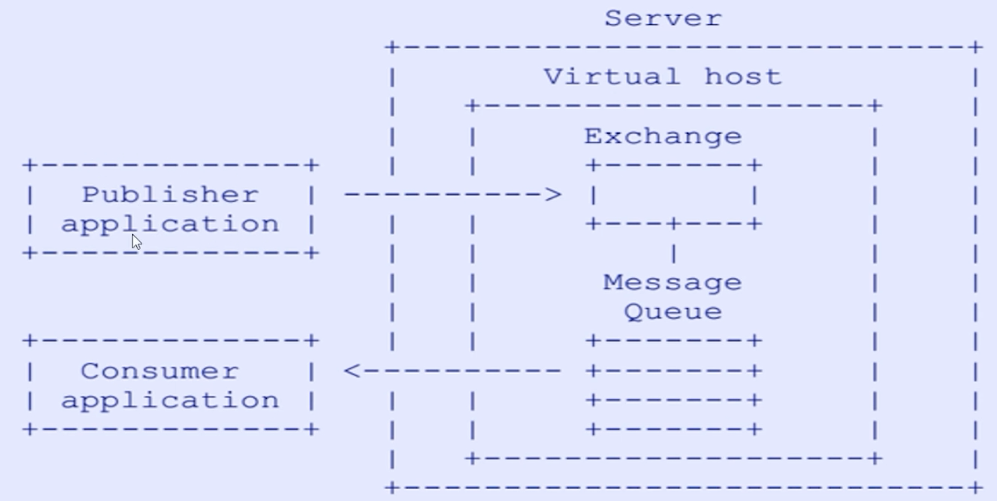
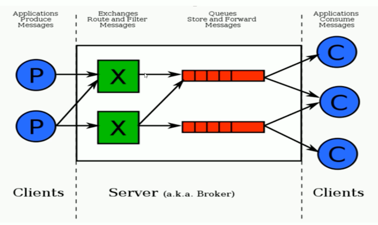
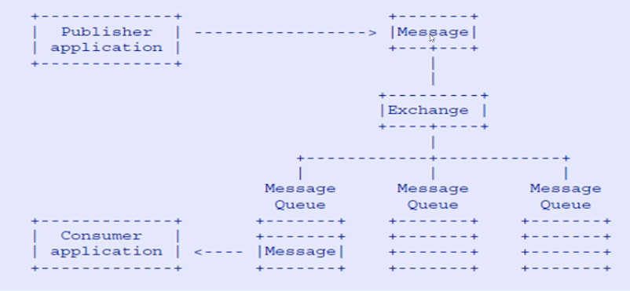

## AMQP高级消息队列协议

#### AMQP高级消息队列协议

AMQP定义: 具有现代特征的二进制协议. 是一个提供统一消息服务的应用层标准高级消息队列协议, 是应用层协议的一个开发标准, 为面向消息的中间件设计.

#### AMQP协议模型

生产者生产消息, 交给server端(RabbitMQ), virtual host是一个上层的路由, 是一个逻辑的概念. exchange表示交换机. 生产者将消息投递到exchange分成三个步骤:

1.  和server建立连接
2.  选择server端中的某一virtual host
3.  选择virtual host中某一exchange, 并将消息进行交付

#### AMQP核心概念

Server: 又称Broker, 接受客户端的连接, 实现AMQP实体服务

Connection: 连接, 应用程序与Broker的网络连接

Channel: 网络信道, 客户端可以建立多个Channel, 每个Channel代表一个会话任务.

Message: 消息, 服务器与应用程序之间传递的数据, 由Properties和Body组成. Properties可以对消息进行修饰, 比如消息的优先级, 延迟等高级特性; Body则是消息体内容.

Virtual host: 虚拟主机, 用以进行逻辑隔离, 最上层的消息路由. 一个Virtual host里面可以有若干个exchange和queue, 同一个virtual host里面不能有相同名称的exchange或queue.

Exchange: 交换机, 接受消息, 根据路由键转发消息到**绑定**的队列.

Binding: Exchange和Queue之间的虚拟连接, binding中可以包含routing key

Queue: 消息队列, 保存消息并将他们发送给消费者

#### RabbitMQ的整体架构

**Producer只需要关注将消息投递到指定的Exchange中而不关系消息被路由到那个Queue, Consumer只需要监听指定的Queue即可而不关系Queue中的消息是来自哪个Exchange.**

**Exchange 过滤, 路由消息到绑定的Queue中**

#### RabbitMQ消息的流转

生产者生产消息, 将其交付给Exchange, 一个Exchange可以绑定多个Message Queue, Exchange根据routing key将消息路由到指定的Queue, 所以在发送消息时需要指定消息发送到哪一个Exchange和对应的routing key

