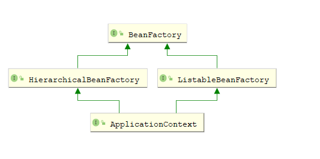

#### 关于BeanFactory的说明



用于访问Spring bean容器的根接口。是bean容器的基本客户端视图；

该接口的实现对象应该持有多个bean difinition。  每个bean difinition均由String名称唯一标识。

取决于bean的定义，*工厂将返回一个包含对象的独立实例*（原型设计模式），或者返回一个共享实例（Singleton设计模式）。

如果该接口的实现了是HierarchicalBeanFactory，此接口中的所有*操作还将检查父工厂。如果在此工厂实例中未找到bean，则*将询问直接的父工厂。该工厂实例中的Bean应该覆盖任何父工厂中同名的Bean。

BeanFactory实现应尽可能支持标准Bean生命周期接口。全套初始化方法及其标准顺序为：

```shell
# void setBeanName(String name); 让并可以知道自己的bean id。
# Spring 自动调用，并且会在完成Bean属性装配之后，且在调用任何Bean生命周期回调（初始化或者销毁）方法之前就调用这个方法
BeanNameAware's {@code setBeanName}

# void setBeanClassLoader(ClassLoader classLoader);
# 将当前 bean 对象相应的 ClassLoader 注入到当前对象实例中
BeanClassLoaderAware's {@code setBeanClassLoader}

# void setBeanFactory(BeanFactory beanFactory) throws BeansException;
# BeanFactory 容器会将自身注入到当前对象实例中，这样当前对象就会拥有一个 BeanFactory 容器的引用
BeanFactoryAware's {@code setBeanFactory}

EnvironmentAware's {@code setEnvironment}

EmbeddedValueResolverAware's {@code setEmbeddedValueResolver}

ResourceLoaderAware's {@code setResourceLoader}
(only applicable when running in an application context)

ApplicationEventPublisherAware's {@code setApplicationEventPublisher}
(only applicable when running in an application context)

MessageSourceAware's {@code setMessageSource}
(only applicable when running in an application context)

ApplicationContextAware's {@code setApplicationContext}
(only applicable when running in an application context)

ServletContextAware's {@code setServletContext}
(only applicable when running in a web application context)

# 后置处理器postProcessBeforeInitialization，通过实现BeanPostProcessors实现
{@code postProcessBeforeInitialization} methods of BeanPostProcessors

# bean 生命周期的初始化方法， 通过继承InitializingBean实现
InitializingBean's {@code afterPropertiesSet}

# bean 生命周期的初始化方法， 通过@Bean的initMethod属性实现
a custom init-method definition

# 后置处理器postProcessAfterInitialization，通过实现BeanPostProcessors实现
{@code postProcessAfterInitialization} methods of BeanPostProcessors
```

在关闭BeanFactory时，以下生命周期方法适用:


```
{@code postProcessBeforeDestruction} methods of DestructionAwareBeanPostProcessors

DisposableBean's {@code destroy}

a custom destroy-method definition
```


#### 关于BeanDefinition的说明


#### 关于spring的注解编程模型和@AliasFor注解的说明

https://github.com/spring-projects/spring-framework/wiki/Spring-Annotation-Programming-Model

https://github.com/spring-projects/spring-framework/wiki/MergedAnnotation-API-internals

https://docs.spring.io/spring-framework/docs/current/javadoc-api/ api文档搜索AliasFor的说明

https://www.jianshu.com/p/d6bba708100d

@see MergedAnnotations

@see AttributeMethods

@see AnnotationTypeMappings

@see AnnotationUtils

@see AnnotatedElementUtils

https://studyidea.cn/spring-stereotype-annotations

https://studyidea.cn/articles/2019/07/05/1562314284729.html

https://studyidea.cn/articles/2019/07/10/1562768280760.html

https://studyidea.cn/articles/2019/06/15/1560598141405.html↓↓↓


> Meta-Annotations（元注解）

**A *meta-annotation* is an annotation that is declared on another annotation**. An annotation is therefore *meta-annotated* if it is annotated with another annotation. For example, any annotation that is declared to be *documented* is meta-annotated with `@Documented` from the `java.lang.annotation` package.

标注在注解上的注解，类似于@Documented，@Target。包括@Component也是元注解，因为他可以标注在其他注解上。


> Stereotype Annotations（模式注解）

**A *stereotype annotation* is an annotation that is used to declare the role that a component plays within the application**. For example, the `@Repository` annotation in the Spring Framework is a marker for any class that fulfills the role or *stereotype* of a repository (also known as Data Access Object or DAO).

**`@Component` is a generic stereotype for any Spring-managed component**. Any component annotated with `@Component` is a candidate for component scanning. Similarly, any component annotated with an annotation that is itself meta-annotated with `@Component` is also a candidate for component scanning. For example, `@Service` is meta-annotated with `@Component`.

Core Spring provides several stereotype annotations out of the box, including but not limited to: `@Component`, `@Service`, `@Repository`, `@Controller`, `@RestController`, and `@Configuration`. `@Repository`, `@Service`, etc. are specializations of `@Component`.

模式注解：只要在相应的类上标注这些注解，就能成为 Spring 中组件(Bean)。@Component是spring中通用的模式注解。任何被@Component注解标注的注解都是模式注解（例如@Controller）。任何被@Component标注的注解标注的注解都是模式注解（例如@RestController被@Controller标注，而@Controller被@Component标注，所以@RestController也是模式注解）。


> Composed Annotations（复合注解）

**A *composed annotation* is an annotation that is *meta-annotated* with one or more annotations with the intent of combining the behavior associated with those meta-annotations into a single custom annotation**. For example, an annotation named `@TransactionalService` that is meta-annotated with Spring's `@Transactional` and `@Service` annotations is a composed annotation that combines the semantics of `@Transactional` and `@Service`. `@TransactionalService` is technically also a custom *stereotype annotation*.

复合注解：被一个或者多个元注解标注以结合这些元注解的特性到一个注解上。例如@RestController被@Controller和@ResponseBody标注以结合两者的特性。


> Attribute Overrides（属性覆写）

An ***attribute override*** is an annotation attribute that *overrides* (or *shadows*) an annotation attribute in a meta-annotation. Attribute overrides can be categorized as follows.

1. **Implicit Overrides**: given attribute `A` in annotation `@One` and attribute `A` in annotation `@Two`, if `@One` is meta-annotated with `@Two`, then attribute `A` in annotation `@One` is an *implicit override* for attribute `A` in annotation `@Two` based solely on a naming convention (i.e., both attributes are named `A`).

   ~~~java
   // HelloComponent的value属性隐式覆写Component的value属性
   @Component
   public @interface HelloComponent {
       String value() default "";
   }
   ~~~

2. **Explicit Overrides**: if attribute `A` is declared as an alias for attribute `B` in a meta-annotation via `@AliasFor`, then `A` is an *explicit override* for `B`.

   ~~~java
    @ContextConfiguration
    public @interface XmlTestConfig {
       @AliasFor(annotation = ContextConfiguration.class, attribute = "locations")
       String[] xmlFiles();
    }
   ~~~

3. **Transitive Explicit Overrides**: if attribute `A` in annotation `@One` is an explicit override for attribute `B` in annotation `@Two` and `B` is an explicit override for attribute `C` in annotation `@Three`, then `A` is a *transitive explicit override* for `C` following the [law of transitivity](https://en.wikipedia.org/wiki/Transitive_relation).

   ~~~java
   @RequestMapping
   public @interface CoolMapping{
       @AliasFor(annotation = RequestMapping.class, attribute = "path")
       String requestPath() default "";
   }
   
   @CoolMapping
   public @interface HotMapping{
       @AliasFor(annotation = CoolMapping.class, attribute = "requestPath")
       String hotRequestPath() default "";
   }
   ~~~


> Attribute Aliases属性别名

An ***attribute alias*** is an alias from one annotation attribute to another annotation attribute. Attributes within a set of aliases can be used interchangeably and are treated as equivalent. Attribute aliases can be categorized as follows.

1. **Explicit aliases within an annotation**: if two attributes in one annotation are declared as aliases for each other via `@AliasFor`, they are *explicit aliases*.

   In `@ContextConfiguration`, `value` and `locations` are explicit aliases for each other.

   ```java
    public @interface ContextConfiguration {
   
       @AliasFor("locations")
       String[] value() default {};
   
       @AliasFor("value")
       String[] locations() default {};
   
       // ...
    }
   ```

2. **Explicit alias for attribute in meta-annotation**: if the [`annotation()`](https://docs.spring.io/spring-framework/docs/current/javadoc-api/org/springframework/core/annotation/AliasFor.html#annotation--) attribute of `@AliasFor` is set to a different annotation than the one that declares it, the [`attribute()`](https://docs.spring.io/spring-framework/docs/current/javadoc-api/org/springframework/core/annotation/AliasFor.html#attribute--) is interpreted as an alias for an attribute in a meta-annotation (i.e., an explicit meta-annotation attribute override). This enables fine-grained control over exactly which attributes are overridden within an annotation hierarchy. In fact, with `@AliasFor` it is even possible to declare an alias for the `value` attribute of a meta-annotation.

   In `@XmlTestConfig`, `xmlFiles` is an explicit alias for `locations` in `@ContextConfiguration`. In other words, `xmlFiles` overrides the `locations` attribute in `@ContextConfiguration`.

   ```java
 @ContextConfiguration
    public @interface XmlTestConfig {
   
       @AliasFor(annotation = ContextConfiguration.class, attribute = "locations")
       String[] xmlFiles();
    }
   ```
   
2. **Implicit Aliases**: if two or more attributes in one annotation are declared as explicit overrides for the same attribute in a meta-annotation via `@AliasFor`, they are *implicit aliases*.

   In `@MyTestConfig`, `value`, `groovyScripts`, and `xmlFiles` are all explicit meta-annotation attribute overrides for the `locations` attribute in `@ContextConfiguration`. These three attributes are therefore also implicit aliases for each other.

   ~~~java
    @ContextConfiguration
    public @interface MyTestConfig {
   
       @AliasFor(annotation = ContextConfiguration.class, attribute = "locations")
       String[] value() default {};
   
       @AliasFor(annotation = ContextConfiguration.class, attribute = "locations")
       String[] groovyScripts() default {};
   
       @AliasFor(annotation = ContextConfiguration.class, attribute = "locations")
       String[] xmlFiles() default {};
    }
   ~~~

   

4. **Transitive Implicit Aliases**: given two or more attributes in one annotation that are declared as explicit overrides for attributes in meta-annotations via `@AliasFor`, if the attributes *effectively* override the same attribute in a meta-annotation following the [law of transitivity](https://en.wikipedia.org/wiki/Transitive_relation), they are *transitive implicit aliases*.

   In `@GroovyOrXmlTestConfig`, `groovy` is an explicit override for the `groovyScripts` attribute in `@MyTestConfig`; whereas, `xml` is an explicit override for the `locations` attribute in `@ContextConfiguration`. Furthermore, `groovy` and `xml` are transitive implicit aliases for each other, since **they both effectively override the `locations` attribute in `@ContextConfiguration`.（<font color=red>有效覆写即可传递，不管是显式覆写还是隐式覆写</font>）**

   ```java
    @MyTestConfig
    public @interface GroovyOrXmlTestConfig {
   
       @AliasFor(annotation = MyTestConfig.class, attribute = "groovyScripts")
       String[] groovy() default {};
   
       @AliasFor(annotation = ContextConfiguration.class, attribute = "locations")
       String[] xml() default {};
    }
   ```


> 属性覆写和属性别名的要求

- 覆写和别名的两个属性必须要有默认值，并且默认值一样
- 覆写和别名的两个属性类型必须一样
- AliasFor注解的annotation属性必须引用合适的注解，并且该注解必须标注在原来的注解上
- attribute不写的话表示引用同名的属性

~~~java
// requestPath和RequestMapping的path属性类型一样，必须要有默认值切默认值一样
// annotation必须引用RequestMapping注解，且@RequestMapping需要标注在CoolMapping上
// attribute不写的话表示引用同名的属性
@RequestMapping
public @interface CoolMapping{
    @AliasFor(annotation = RequestMapping.class, attribute = "path")
    String requestPath() default "";
}
~~~

>  Can `@AliasFor` be used with the `value` attributes for `@Component` and `@Qualifier`?

The short answer is: no.

The `value` attributes in `@Qualifier` and in *stereotype* annotations (e.g., `@Component`, `@Repository`, `@Controller`, and any custom stereotype annotations) *cannot* be influenced by `@AliasFor`. The reason is that the special handling of these `value` attributes was in place years before `@AliasFor` was invented. Consequently, due to backward compatibility issues it is simply not possible to use `@AliasFor` with such `value` attributes.

~~~java
// 这样设置的别名是无效的，beanName并不能设置bean的id
@Controller
public @interface BeautifulController{
    @AliasFor(annotation = Controller.class, attribute = "value")
    String beanName() default "";
}

// 这样是可以的，value属性可以设置bean的id，这属于隐式覆写
@Controller
public @interface BeautifulController{
    @AliasFor(annotation = Controller.class)
    String value() default "";
}
~~~


#### 关于@ComponentScan的说明

- ComponentScan默认扫描当前类所在的包及其子包

- ComponentScan默认会将@Component及其衍生注解注册成bean

- **在同一个ComponentScan中，excludeFilters的优先级大于includeFilters**

  ~~~java
  // 在同一个@ComponentScan中，同一个类即被include又被exclude， exclude是优先include的，因为源码先处理exclude，所以以下结果为exclude掉了SimpleScopeMetadataResolver
  @ComponentScan(includeFilters = {
          @Filter(type = FilterType.ASSIGNABLE_TYPE, value = {SimpleScopeMetadataResolver.class}, excludeFilters = {
          @Filter(type = FilterType.ASSIGNABLE_TYPE, value = {SimpleScopeMetadataResolver.class})
  })
  public class SpringTestApplication{}
  ~~~

- **若存在多个ComponentScan，每个ComponentScan之间是单独扫描的，不存在联系**，即：

  ~~~java
  // 第一个ComponentScan exclude掉了SimpleScopeMetadataResolver， 但是第二个注解include了SimpleScopeMetadataResolver， 两者之间并无联系，所以整体的结果还是include了SimpleScopeMetadataResolver
  @ComponentScan(excludeFilters = {
          @Filter(type = FilterType.ASSIGNABLE_TYPE, value = {SimpleScopeMetadataResolver.class})
  })
  @ComponentScan(includeFilters = {
          @Filter(type = FilterType.ASSIGNABLE_TYPE, value = {SimpleScopeMetadataResolver.class})
  })
  public class SpringTestApplication{}
  ~~~

  **推荐一个@ComponentScan只进行一个包的包扫描处理。**

- useDefaultFilters等效于@ComponentScan(includeFilters = {@Filter(type = FilterType.ANNOTATION, value = {Component.class})})， 源码也是添加了一个includeFilters

- 对于@ComponentScan，@ComponentScan(excludeFilters = {
          @Filter(type = FilterType.ANNOTATION, value = {Component.class})
  })相当于把Component，Controller，Service，Repository及他们的衍生注解都排除了。

> 关于@Component的includeFilters和excludeFilters的说明

```java
@Retention(RetentionPolicy.RUNTIME)
@Target(ElementType.TYPE)
@Documented
@Repeatable(ComponentScans.class)
public @interface ComponentScan {

   // 通过字符串指定需要扫描的包，@ComponentScan("com.example")
   @AliasFor("basePackages")
   String[] value() default {};

   // see value
   @AliasFor("value")
   String[] basePackages() default {};

   /**
    通过class指定需要扫描的包，若存在com.example.SimpleScan类，则@ComponentScan(basePackageClasses = SimpleScan)表示需要扫描SimpleScan所在的包，即com.example包。
    推荐写一个类似于Serializable一样的无任何属性的接口，并通过basePackageClasses属性进行引用。
    该属性相比较于basePackages更加的安全，因为字符串可能出错。
    */
   Class<?>[] basePackageClasses() default {};

   // 使用该属性可以自定义检测到的Component的bean id
   Class<? extends BeanNameGenerator> nameGenerator() default BeanNameGenerator.class;

   // 使用该属性可以自定义检测到的Component的Scope
   Class<? extends ScopeMetadataResolver> scopeResolver() default AnnotationScopeMetadataResolver.class;

   /**
    * Indicates whether proxies should be generated for detected components, which may be
    * necessary when using scopes in a proxy-style fashion.
    * <p>The default is defer to the default behavior of the component scanner used to
    * execute the actual scan.
    * <p>Note that setting this attribute overrides any value set for {@link #scopeResolver}.
    * @see ClassPathBeanDefinitionScanner#setScopedProxyMode(ScopedProxyMode)
    */
   ScopedProxyMode scopedProxy() default ScopedProxyMode.DEFAULT;

   // 通过该属性可以使只有匹配该pattern的class文件才进行扫描, 默认为"**/*.class"
   String resourcePattern() default ClassPathScanningCandidateComponentProvider.DEFAULT_RESOURCE_PATTERN;

   // 开启该选项的话，会将扫描到的带有@Component及其衍生注解（@Controller,@Service,@Repository）的类自动注册成bean。关闭的话就不会将这些有注解的类注册成bean了，需要自己通过includeFilters属性进行添加。
    // 该属性相当于@ComponentScan(includeFilters = {
        @Filter(type = FilterType.ANNOTATION, value = {Component.class})
})
   boolean useDefaultFilters() default true;

   
   /**
   指定哪些类型适合进行组件扫描。
   进一步将候选组件的范围从basePackages中的所有内容basePackages到与给定过滤器匹配的基本包中的所有内容。
   默认过滤器也将应用指定的includeFilters 
   即使不匹配默认过滤器（即未使用@Component注释），也将    包括与指定过滤器匹配的指定基本软件包下的任何类型
   */
   Filter[] includeFilters() default {};

   Filter[] excludeFilters() default {};

   // 设置检测到的Component是否进行懒加载
   boolean lazyInit() default false;

   /**
    * Declares the type filter to be used as an {@linkplain ComponentScan#includeFilters
    * include filter} or {@linkplain ComponentScan#excludeFilters exclude filter}.
    */
   @Retention(RetentionPolicy.RUNTIME)
   @Target({})
   @interface Filter {

      /**
       * The type of filter to use.
       * <p>Default is {@link FilterType#ANNOTATION}.
       */
      FilterType type() default FilterType.ANNOTATION;

      @AliasFor("classes")
      Class<?>[] value() default {};

      /**
       如果type被设置为FilterType#ANNOTATION，classes请填写注解，spring将会对标有该注解的类进行处理（exclude或者include）
       @ComponentScan(excludeFilters = {@Filter(type = FilterType.ANNOTATION, value = {Component.class})})表示排除被Component及其衍生注解标注的类
       
       如果type被设置为FilterType#ASSINGABLE_TYPE，classes请填写类
       @ComponentScan(includeFilters = {@Filter(type = FilterType.ASSIGNABLE_TYPE, value = {SimpleScopeMetadataResolver.class})})表示要讲SimpleScopeMetadataResolver注册成bean（即使他没有被@Component标注）
       
       如果type被设置为FilterType#CUSTOM，classes请填写自定义的过滤器，该过滤器需要继承TypeFilter接口，自定义TypeFilter可以选择实现以下任何Aware接口，并且将在匹配之前调用它们各自的方法：
       EnvironmentAware
       BeanFactoryAware
       BeanClassLoaderAware
       ResourceLoaderAware
       
       */
      @AliasFor("value")
      Class<?>[] classes() default {};

      /**
       如果type被设置为FilterType#ASPECTJ, pattern被解析为AspectJ表达式
       如果type被设置为FilterType#REGEX, pattern被解析为正则表达式
       */
      String[] pattern() default {};

   }

}
```

> @Component的源码解析

处理@Configuration的代码从ConfigurationClassPaser#doProcessConfigurationClass()开始


