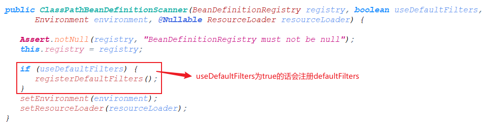

#### 关于BeanFactory的说明


用于访问Spring bean容器的根接口。是bean容器的基本客户端视图；

该接口的实现对象应该持有多个bean difinition。  每个bean difinition均由String名称唯一标识。

取决于bean的定义，*工厂将返回一个包含对象的独立实例*（原型设计模式），或者返回一个共享实例（Singleton设计模式）。

如果该接口的实现了是HierarchicalBeanFactory，此接口中的所有*操作还将检查父工厂。如果在此工厂实例中未找到bean，则*将询问直接的父工厂。该工厂实例中的Bean应该覆盖任何父工厂中同名的Bean。

BeanFactory实现应尽可能支持标准Bean生命周期接口。全套初始化方法及其标准顺序为：

```shell
# void setBeanName(String name); 让并可以知道自己的bean id。
# Spring 自动调用，并且会在完成Bean属性装配之后，且在调用任何Bean生命周期回调（初始化或者销毁）方法之前就调用这个方法
BeanNameAware's {@code setBeanName}

# void setBeanClassLoader(ClassLoader classLoader);
# 将当前 bean 对象相应的 ClassLoader 注入到当前对象实例中
BeanClassLoaderAware's {@code setBeanClassLoader}

# void setBeanFactory(BeanFactory beanFactory) throws BeansException;
# BeanFactory 容器会将自身注入到当前对象实例中，这样当前对象就会拥有一个 BeanFactory 容器的引用
BeanFactoryAware's {@code setBeanFactory}

EnvironmentAware's {@code setEnvironment}

EmbeddedValueResolverAware's {@code setEmbeddedValueResolver}

ResourceLoaderAware's {@code setResourceLoader}
(only applicable when running in an application context)

ApplicationEventPublisherAware's {@code setApplicationEventPublisher}
(only applicable when running in an application context)

MessageSourceAware's {@code setMessageSource}
(only applicable when running in an application context)

ApplicationContextAware's {@code setApplicationContext}
(only applicable when running in an application context)

ServletContextAware's {@code setServletContext}
(only applicable when running in a web application context)

# 后置处理器postProcessBeforeInitialization，通过实现BeanPostProcessors实现
{@code postProcessBeforeInitialization} methods of BeanPostProcessors

# bean 生命周期的初始化方法， 通过继承InitializingBean实现
InitializingBean's {@code afterPropertiesSet}

# bean 生命周期的初始化方法， 通过@Bean的initMethod属性实现
a custom init-method definition

# 后置处理器postProcessAfterInitialization，通过实现BeanPostProcessors实现
{@code postProcessAfterInitialization} methods of BeanPostProcessors
```

在关闭BeanFactory时，以下生命周期方法适用:


```
{@code postProcessBeforeDestruction} methods of DestructionAwareBeanPostProcessors

DisposableBean's {@code destroy}

a custom destroy-method definition
```


#### 关于BeanDefinition的说明


#### 关于spring的注解编程模型和@AliasFor注解的说明

https://github.com/spring-projects/spring-framework/wiki/Spring-Annotation-Programming-Model

https://github.com/spring-projects/spring-framework/wiki/MergedAnnotation-API-internals

https://docs.spring.io/spring-framework/docs/current/javadoc-api/ api文档搜索AliasFor的说明

https://www.jianshu.com/p/d6bba708100d

@see MergedAnnotations

@see AttributeMethods

@see AnnotationTypeMappings

@see AnnotationUtils

@see AnnotatedElementUtils

https://studyidea.cn/spring-stereotype-annotations

https://studyidea.cn/articles/2019/07/05/1562314284729.html

https://studyidea.cn/articles/2019/07/10/1562768280760.html

https://studyidea.cn/articles/2019/06/15/1560598141405.html↓↓↓


> Meta-Annotations（元注解）

**A *meta-annotation* is an annotation that is declared on another annotation**. An annotation is therefore *meta-annotated* if it is annotated with another annotation. For example, any annotation that is declared to be *documented* is meta-annotated with `@Documented` from the `java.lang.annotation` package.

标注在注解上的注解，类似于@Documented，@Target。包括@Component也是元注解，因为他可以标注在其他注解上。


> Stereotype Annotations（模式注解）

**A *stereotype annotation* is an annotation that is used to declare the role that a component plays within the application**. For example, the `@Repository` annotation in the Spring Framework is a marker for any class that fulfills the role or *stereotype* of a repository (also known as Data Access Object or DAO).

**`@Component` is a generic stereotype for any Spring-managed component**. Any component annotated with `@Component` is a candidate for component scanning. Similarly, any component annotated with an annotation that is itself meta-annotated with `@Component` is also a candidate for component scanning. For example, `@Service` is meta-annotated with `@Component`.

Core Spring provides several stereotype annotations out of the box, including but not limited to: `@Component`, `@Service`, `@Repository`, `@Controller`, `@RestController`, and `@Configuration`. `@Repository`, `@Service`, etc. are specializations of `@Component`.

模式注解：只要在相应的类上标注这些注解，就能成为 Spring 中组件(Bean)。@Component是spring中通用的模式注解。任何被@Component注解标注的注解都是模式注解（例如@Controller）。任何被@Component标注的注解标注的注解都是模式注解（例如@RestController被@Controller标注，而@Controller被@Component标注，所以@RestController也是模式注解）。


> Composed Annotations（复合注解）

**A *composed annotation* is an annotation that is *meta-annotated* with one or more annotations with the intent of combining the behavior associated with those meta-annotations into a single custom annotation**. For example, an annotation named `@TransactionalService` that is meta-annotated with Spring's `@Transactional` and `@Service` annotations is a composed annotation that combines the semantics of `@Transactional` and `@Service`. `@TransactionalService` is technically also a custom *stereotype annotation*.

复合注解：被一个或者多个元注解标注以结合这些元注解的特性到一个注解上。例如@RestController被@Controller和@ResponseBody标注以结合两者的特性。


> Attribute Overrides（属性覆写）

An ***attribute override*** is an annotation attribute that *overrides* (or *shadows*) an annotation attribute in a meta-annotation. Attribute overrides can be categorized as follows.

1. **Implicit Overrides**: given attribute `A` in annotation `@One` and attribute `A` in annotation `@Two`, if `@One` is meta-annotated with `@Two`, then attribute `A` in annotation `@One` is an *implicit override* for attribute `A` in annotation `@Two` based solely on a naming convention (i.e., both attributes are named `A`).

   ~~~java
   // HelloComponent的value属性隐式覆写Component的value属性
   @Component
   public @interface HelloComponent {
       String value() default "";
   }
   ~~~

2. **Explicit Overrides**: if attribute `A` is declared as an alias for attribute `B` in a meta-annotation via `@AliasFor`, then `A` is an *explicit override* for `B`.

   ~~~java
    @ContextConfiguration
    public @interface XmlTestConfig {
       @AliasFor(annotation = ContextConfiguration.class, attribute = "locations")
       String[] xmlFiles();
    }
   ~~~

3. **Transitive Explicit Overrides**: if attribute `A` in annotation `@One` is an explicit override for attribute `B` in annotation `@Two` and `B` is an explicit override for attribute `C` in annotation `@Three`, then `A` is a *transitive explicit override* for `C` following the [law of transitivity](https://en.wikipedia.org/wiki/Transitive_relation).

   ~~~java
   @RequestMapping
   public @interface CoolMapping{
       @AliasFor(annotation = RequestMapping.class, attribute = "path")
       String requestPath() default "";
   }
   
   @CoolMapping
   public @interface HotMapping{
       @AliasFor(annotation = CoolMapping.class, attribute = "requestPath")
       String hotRequestPath() default "";
   }
   ~~~


> Attribute Aliases属性别名

An ***attribute alias*** is an alias from one annotation attribute to another annotation attribute. Attributes within a set of aliases can be used interchangeably and are treated as equivalent. Attribute aliases can be categorized as follows.

1. **Explicit aliases within an annotation**: if two attributes in one annotation are declared as aliases for each other via `@AliasFor`, they are *explicit aliases*.

   In `@ContextConfiguration`, `value` and `locations` are explicit aliases for each other.

   ```java
    public @interface ContextConfiguration {
   
       @AliasFor("locations")
       String[] value() default {};
   
       @AliasFor("value")
       String[] locations() default {};
   
       // ...
    }
   ```

2. **Explicit alias for attribute in meta-annotation**: if the [`annotation()`](https://docs.spring.io/spring-framework/docs/current/javadoc-api/org/springframework/core/annotation/AliasFor.html#annotation--) attribute of `@AliasFor` is set to a different annotation than the one that declares it, the [`attribute()`](https://docs.spring.io/spring-framework/docs/current/javadoc-api/org/springframework/core/annotation/AliasFor.html#attribute--) is interpreted as an alias for an attribute in a meta-annotation (i.e., an explicit meta-annotation attribute override). This enables fine-grained control over exactly which attributes are overridden within an annotation hierarchy. In fact, with `@AliasFor` it is even possible to declare an alias for the `value` attribute of a meta-annotation.

   In `@XmlTestConfig`, `xmlFiles` is an explicit alias for `locations` in `@ContextConfiguration`. In other words, `xmlFiles` overrides the `locations` attribute in `@ContextConfiguration`.

   ```java
 @ContextConfiguration
    public @interface XmlTestConfig {
   
       @AliasFor(annotation = ContextConfiguration.class, attribute = "locations")
       String[] xmlFiles();
    }
   ```
   
2. **Implicit Aliases**: if two or more attributes in one annotation are declared as explicit overrides for the same attribute in a meta-annotation via `@AliasFor`, they are *implicit aliases*.

   In `@MyTestConfig`, `value`, `groovyScripts`, and `xmlFiles` are all explicit meta-annotation attribute overrides for the `locations` attribute in `@ContextConfiguration`. These three attributes are therefore also implicit aliases for each other.

   ~~~java
    @ContextConfiguration
    public @interface MyTestConfig {
   
       @AliasFor(annotation = ContextConfiguration.class, attribute = "locations")
       String[] value() default {};
   
       @AliasFor(annotation = ContextConfiguration.class, attribute = "locations")
       String[] groovyScripts() default {};
   
       @AliasFor(annotation = ContextConfiguration.class, attribute = "locations")
       String[] xmlFiles() default {};
    }
   ~~~

   

4. **Transitive Implicit Aliases**: given two or more attributes in one annotation that are declared as explicit overrides for attributes in meta-annotations via `@AliasFor`, if the attributes *effectively* override the same attribute in a meta-annotation following the [law of transitivity](https://en.wikipedia.org/wiki/Transitive_relation), they are *transitive implicit aliases*.

   In `@GroovyOrXmlTestConfig`, `groovy` is an explicit override for the `groovyScripts` attribute in `@MyTestConfig`; whereas, `xml` is an explicit override for the `locations` attribute in `@ContextConfiguration`. Furthermore, `groovy` and `xml` are transitive implicit aliases for each other, since **they both effectively override the `locations` attribute in `@ContextConfiguration`.（<font color=red>有效覆写即可传递，不管是显式覆写还是隐式覆写</font>）**

   ```java
    @MyTestConfig
    public @interface GroovyOrXmlTestConfig {
   
       @AliasFor(annotation = MyTestConfig.class, attribute = "groovyScripts")
       String[] groovy() default {};
   
       @AliasFor(annotation = ContextConfiguration.class, attribute = "locations")
       String[] xml() default {};
    }
   ```


> 属性覆写和属性别名的要求

- 覆写和别名的两个属性必须要有默认值，并且默认值一样
- 覆写和别名的两个属性类型必须一样
- AliasFor注解的annotation属性必须引用合适的注解，并且该注解必须标注在原来的注解上
- attribute不写的话表示引用同名的属性

~~~java
// requestPath和RequestMapping的path属性类型一样，必须要有默认值切默认值一样
// annotation必须引用RequestMapping注解，且@RequestMapping需要标注在CoolMapping上
// attribute不写的话表示引用同名的属性
@RequestMapping
public @interface CoolMapping{
    @AliasFor(annotation = RequestMapping.class, attribute = "path")
    String requestPath() default "";
}
~~~

>  Can `@AliasFor` be used with the `value` attributes for `@Component` and `@Qualifier`?

The short answer is: no.

The `value` attributes in `@Qualifier` and in *stereotype* annotations (e.g., `@Component`, `@Repository`, `@Controller`, and any custom stereotype annotations) *cannot* be influenced by `@AliasFor`. The reason is that the special handling of these `value` attributes was in place years before `@AliasFor` was invented. Consequently, due to backward compatibility issues it is simply not possible to use `@AliasFor` with such `value` attributes.

~~~java
// 这样设置的别名是无效的，beanName并不能设置bean的id
@Controller
public @interface BeautifulController{
    @AliasFor(annotation = Controller.class, attribute = "value")
    String beanName() default "";
}

// 这样是可以的，value属性可以设置bean的id，这属于隐式覆写
@Controller
public @interface BeautifulController{
    @AliasFor(annotation = Controller.class)
    String value() default "";
}
~~~


#### 关于@ComponentScan的说明

- ComponentScan默认扫描当前类所在的包及其子包

- ComponentScan默认会将@Component及其衍生注解注册成bean

- **在同一个ComponentScan中，excludeFilters的优先级大于includeFilters**

  ~~~java
  // 在同一个@ComponentScan中，同一个类即被include又被exclude， exclude是优先include的，因为源码先处理exclude，所以以下结果为exclude掉了SimpleScopeMetadataResolver
  @ComponentScan(includeFilters = {
          @Filter(type = FilterType.ASSIGNABLE_TYPE, value = {SimpleScopeMetadataResolver.class}, excludeFilters = {
          @Filter(type = FilterType.ASSIGNABLE_TYPE, value = {SimpleScopeMetadataResolver.class})
  })
  public class SpringTestApplication{}
  ~~~

- **若存在多个ComponentScan，每个ComponentScan之间是单独扫描的，不存在联系**，即：

  ~~~java
  // 第一个ComponentScan exclude掉了SimpleScopeMetadataResolver， 但是第二个注解include了SimpleScopeMetadataResolver， 两者之间并无联系，所以整体的结果还是include了SimpleScopeMetadataResolver
  @ComponentScan(excludeFilters = {
          @Filter(type = FilterType.ASSIGNABLE_TYPE, value = {SimpleScopeMetadataResolver.class})
  })
  @ComponentScan(includeFilters = {
          @Filter(type = FilterType.ASSIGNABLE_TYPE, value = {SimpleScopeMetadataResolver.class})
  })
  public class SpringTestApplication{}
  ~~~

  **推荐一个@ComponentScan只进行一个包的包扫描处理。**

- useDefaultFilters等效于@ComponentScan(includeFilters = {@Filter(type = FilterType.ANNOTATION, value = {Component.class})})， 源码也是添加了一个includeFilters

- 对于@ComponentScan，@ComponentScan(excludeFilters = {
          @Filter(type = FilterType.ANNOTATION, value = {Component.class})
  })相当于把Component，Controller，Service，Repository及他们的衍生注解都排除了。

> 关于@Component的includeFilters和excludeFilters的说明

```java
@Retention(RetentionPolicy.RUNTIME)
@Target(ElementType.TYPE)
@Documented
@Repeatable(ComponentScans.class)
public @interface ComponentScan {

   // 通过字符串指定需要扫描的包，@ComponentScan("com.example")
   @AliasFor("basePackages")
   String[] value() default {};

   // see value
   @AliasFor("value")
   String[] basePackages() default {};

   /**
    通过class指定需要扫描的包，若存在com.example.SimpleScan类，则@ComponentScan(basePackageClasses = SimpleScan)表示需要扫描SimpleScan所在的包，即com.example包。
    推荐写一个类似于Serializable一样的无任何属性的接口，并通过basePackageClasses属性进行引用。
    该属性相比较于basePackages更加的安全，因为字符串可能出错。
    */
   Class<?>[] basePackageClasses() default {};

   // 使用该属性可以自定义检测到的Component的bean id
   Class<? extends BeanNameGenerator> nameGenerator() default BeanNameGenerator.class;

   // 使用该属性可以自定义检测到的Component的Scope
   Class<? extends ScopeMetadataResolver> scopeResolver() default AnnotationScopeMetadataResolver.class;

   /**
    * Indicates whether proxies should be generated for detected components, which may be
    * necessary when using scopes in a proxy-style fashion.
    * <p>The default is defer to the default behavior of the component scanner used to
    * execute the actual scan.
    * <p>Note that setting this attribute overrides any value set for {@link #scopeResolver}.
    * @see ClassPathBeanDefinitionScanner#setScopedProxyMode(ScopedProxyMode)
    */
   ScopedProxyMode scopedProxy() default ScopedProxyMode.DEFAULT;

   // 通过该属性可以使只有匹配该pattern的class文件才进行扫描, 默认为"**/*.class"
   String resourcePattern() default ClassPathScanningCandidateComponentProvider.DEFAULT_RESOURCE_PATTERN;

   // 开启该选项的话，会将扫描到的带有@Component及其衍生注解（@Controller,@Service,@Repository）的类自动注册成bean。关闭的话就不会将这些有注解的类注册成bean了，需要自己通过includeFilters属性进行添加。
    // 该属性相当于@ComponentScan(includeFilters = {
        @Filter(type = FilterType.ANNOTATION, value = {Component.class})
})
   boolean useDefaultFilters() default true;

   
   /**
   指定哪些类型适合进行组件扫描。
   进一步将候选组件的范围从basePackages中的所有内容basePackages到与给定过滤器匹配的基本包中的所有内容。
   默认过滤器也将应用指定的includeFilters 
   即使不匹配默认过滤器（即未使用@Component注释），也将    包括与指定过滤器匹配的指定基本软件包下的任何类型
   */
   Filter[] includeFilters() default {};

   Filter[] excludeFilters() default {};

   // 设置检测到的Component是否进行懒加载
   boolean lazyInit() default false;

   /**
    * Declares the type filter to be used as an {@linkplain ComponentScan#includeFilters
    * include filter} or {@linkplain ComponentScan#excludeFilters exclude filter}.
    */
   @Retention(RetentionPolicy.RUNTIME)
   @Target({})
   @interface Filter {

      /**
       * The type of filter to use.
       * <p>Default is {@link FilterType#ANNOTATION}.
       */
      FilterType type() default FilterType.ANNOTATION;

      @AliasFor("classes")
      Class<?>[] value() default {};

      /**
       如果type被设置为FilterType#ANNOTATION，classes请填写注解，spring将会对标有该注解的类进行处理（exclude或者include）
       @ComponentScan(excludeFilters = {@Filter(type = FilterType.ANNOTATION, value = {Component.class})})表示排除被Component及其衍生注解标注的类
       
       如果type被设置为FilterType#ASSINGABLE_TYPE，classes请填写类或者接口，spring将会对该类及其子类进行处理（exclude or include）
       @ComponentScan(includeFilters = {@Filter(type = FilterType.ASSIGNABLE_TYPE, value = {SimpleScopeMetadataResolver.class})})表示要将SimpleScopeMetadataResolver及其子类注册成bean（即使他没有被@Component标注）
       
       如果type被设置为FilterType#CUSTOM，classes请填写自定义的过滤器，该过滤器需要继承TypeFilter接口，自定义TypeFilter可以选择实现以下任何Aware接口，并且将在匹配之前调用它们各自的方法：
       EnvironmentAware
       BeanFactoryAware
       BeanClassLoaderAware
       ResourceLoaderAware
       
       */
      @AliasFor("value")
      Class<?>[] classes() default {};

      /**
       如果type被设置为FilterType#ASPECTJ, pattern被解析为AspectJ表达式
       如果type被设置为FilterType#REGEX, pattern被解析为正则表达式
       */
      String[] pattern() default {};

   }

}
```

> @Component的源码解析

处理@Configuration的代码从ConfigurationClassParser#doProcessConfigurationClass()开始


从上面可以看出来，因为每一个@ComponentScan是在for循环中处理的，所以也就验证了上面所说的：**若存在多个ComponentScan，每个ComponentScan之间是单独扫描的，不存在联系**

下面进入this.componentScanPaser.paser()方法中


下面来开下useDefaultFilters的作用：

进入到ClassPathBeanDefinitionScanner的构造方法里面




从上面可以看出来,useDefaultFilters会导致注册一个默认的AnnotationTypeFilter类型的includeFilters, 这就相当于

```java
@ComponentScan(includeFilters = {
        @Filter(type = FilterType.ANNOTATION, value = {Component.class})
})
```

下面进入doScan()方法来看下


进入findCandidateComponents()


进入到ClassPathScanningCandidateComponentProvider#scanCandidateComponents()方法


下面进入到第一个isCandidateComponent()方法，从下面验证：**在同一个ComponentScan中，excludeFilters的优先级大于includeFilters**


我们上面还记得，如果@ComponentScan的useDefaultFilters = true的话，会向includeFilters中注册一个Filter，debug图片如下，可以看到，这是一个AnnotationTypeFilter，扫描的注解是Component。


下面进入到AnnotationTypeFilter的match()方法，该方法定义在TypeFilter接口中。

#### 关于spring Environment的说明

spring中的Environment是一个集成了properties和profile两个方面的集合。

其中properties就是引用的各种配置了，包括配置中心的配置，系统配置，各种框架的配置，数据库的配置。

而profile翻译成中文就是配置文件，很容易让人怀疑他表示的是类似于一系列配置的集合。而事实上他仅仅就是一个字符串而已，这个profile主要是配合@Profile功能使用。与配置没有什么关系。

> PropertySource

对于应用的各种的配置来说，其对应的接口是PropertySource, 这个PropertySource接口不是表示单个配置，而是表示一类配置的集合。**他有一个name属性和一个T类型的source属性，这个T类型中存储的就是具体的配置了。**


这个接口有众多的子类，表示不同种类的配置，如EnumerablePropertySource（可枚举的PropertySource，即通过getPropertyNames()方法可以获取所有的keyName），MapPropertySource，CommandLinePropertySource等等子类，但是查看他们的方法你会发现，**绝大多数的PropertySource只允许在创建的时候通过构造函数传入具体的配置，而不允许创建完之后改变配置**。


> PropertySources

PropertySources接口对应的就是多个PropertySource的集合了，一般一个应用的所有的配置都放在这里面。

PropertySources有一个重要的实现：**MutablePropertySources，意为可变的PropertySources，但是这里的可变并不是配置可变。而是提供了操控PropertySource优先级的能力。**

一个应用中那么多配置，重要有个优先级吧，查看MutablePropertySources你会发现他有个List<PropertySource<?>>的属性，这里面保存的就是各种PropertySource了，**在List里面排在前面的即index小的优先级最高**。（apollo设置spring配置的时候会调用它的addFirst方法把配置放在最前面，即index=0的位置，这样就保证了配置中心的配置优先级最高）。

这是调试的截图：


可以看到一个PropertySources中保存了非常多的PropertySource对象，而一个PropertySource对象中又保存了非常多的配置。

**并且可以发现他同样没有提供修改配置的方法，只提供了修改PropertySource优先级的方法以及一个replace方法。**


> PropertyResolver与ConfigurablePropertyResolver

有了PropertySources保存各种配置项，可以通过其获得配置。但是如果我们需要将配置项解析为不同类型呢？比如需要的配置项是Int，而需要的配置项的类型是String类型。如果我们需要解析一个字符串中的占位符（${prop.name:defaultVale}）并把它替换为对应的配置项呢？如果我们需要验证某个必要的配置项在PropertySources中是否存在呢？这时候PropertyResolver接口就来了。

但是呢，其子类AbstractPropertyResolver并不自己解析属性，而是依赖PropertyPlaceholderHelper和DefaultConversionService这两个类来进行解析属性（单一责任原则？）


#### 关于CommandLineRunner和ApplicationRunner接口的说明

https://cloud.tencent.com/developer/article/1524264

https://www.jianshu.com/p/5d4ffe267596


> 主要功能（总结现在前面）

- Spring boot的`CommandLineRunner`和`ApplicationRunner`接口主要用于实现在应用初始化后，去执行一段代码块逻辑，这段初始化代码在整个应用生命周期内**只会执行一次**。

- 只需要实现这两个接口并实现其中的方法，然后像普通的bean一样注册到spring容器里面即可。

- **可以在这两个接口的实现类内autowired依赖**，因为接口调用的时候context已经创建出来了。

- **在这两个接口中抛出异常将会导致spring容器启动失败**
- 通过标注@Order注解或者实现Order，PriorityOrdered接口来控制执行顺序，**PriorityOrdered整体优先Order**，**顺序的数字越低优先级越高，未实现Order，PriorityOrdered接口或者标注@Order默认最低优先级**（看源码可以知道，这两个类是放在一个list里面比较顺序，这就**导致了这两个接口的实现类根据顺序交替执行，而不是先全部执行完某一类接口的实现类在执行另一个接口的实现类**）

> 两者区别


发现二者的官方javadoc一样，区别在于接收的参数不一样。**CommandLineRunner的参数是最原始的参数，没有做任何处理。ApplicationRunner的参数是ApplicationArguments，是对原始参数做了进一步的封装。**

ApplicationArguments是对参数（main方法）做了进一步的处理，可以解析--name=value的，我们就可以通过name来获取value（而CommandLineRunner只是获取--name=value）


**--getOptionNames()方法可以得到foo这样的key的集合。**
 **--getOptionValues(String name)方法可以得到bar这样的集合的value。**

```java
@Component
public class MyApplicationRunner implements ApplicationRunner{

    @Override
    public void run(ApplicationArguments args) throws Exception {
        System.out.println("===MyApplicationRunner==="+                           Arrays.asList(args.getSourceArgs()));
        System.out.println("===getOptionNames========"+args.getOptionNames());
        System.out.println("===getOptionValues======="+args.getOptionValues("foo"));
System.out.println("==getOptionValues========"+args.getOptionValues("developer.name"));
    }
}
// 启动类
@SpringBootApplication
public class Application {
    public static void main(String[] args) {
        SpringApplication.run(Application.class,args);
    }
}
```


打印结果：


> 顺序控制

可以通过标注@Order注解或者实现Order，PriorityOrdered接口来控制CommandLineRunner和ApplicationRunner的顺序，**PriorityOrdered默认比Order优先**，**顺序的数字越低优先级越高，未实现Order接口或者标注@Order默认最低优先级**（看源码可以知道，这两个类是放在一个list里面比较顺序，这就导致了这两个类会交替执行，而不是先全部执行完某一类接口的实现类在执行另一个接口的实现类）

> 源码解析

在spring-boot1.5.22.release版本中，这两个接口的实现执行的时机在于SpringApplication初始化之后，调用的run方法中被调用的。

~~~java
public ConfigurableApplicationContext run(String... args) {
		// 创建 StopWatch 对象，用于统计 run 方法启动时长。
		StopWatch stopWatch = new StopWatch();
		// 启动统计。
		stopWatch.start();
		ConfigurableApplicationContext context = null;
		FailureAnalyzers analyzers = null;
		// 配置 headless 属性。
		configureHeadlessProperty();
		// 获得 SpringApplicationRunListener 数组，
		// 该数组封装于 SpringApplicationRunListeners 对象的 listeners 中。
		SpringApplicationRunListeners listeners = getRunListeners(args);
		// 启动监听，遍历 SpringApplicationRunListener 数组每个元素，并执行。
		listeners.starting();
		try {
			//创建 ApplicationArguments 对象
			ApplicationArguments applicationArguments = new DefaultApplicationArguments(
					args);
			// 加载属性配置，包括所有的配置属性（如：application.properties 中和外部的属性配置）
			ConfigurableEnvironment environment = prepareEnvironment(listeners,
					applicationArguments);
			// 打印 Banner
			Banner printedBanner = printBanner(environment);
			// 创建容器
			context = createApplicationContext();
            analyzers = new FailureAnalyzers(context);
			// 准备容器，组件对象之间进行关联
			prepareContext(context, environment, listeners, applicationArguments,
					printedBanner);
			// 初始化容器
			refreshContext(context);
			// 初始化操作之后执行。
			afterRefresh(context, applicationArguments);
            // 调用监听器的完成动作
            listeners.finished(context, null);
			// 停止时长统计
			stopWatch.stop();
			// 打印启动日志
			if (this.logStartupInfo) {
				new StartupInfoLogger(this.mainApplicationClass)
						.logStarted(getApplicationLog(), stopWatch);
			}
            return context;
		}catch (Throwable ex) {
			// 异常处理
			handleRunFailure(context, listeners, analyzers, ex);
			throw new IllegalStateException(ex);
		}
		
	}
~~~

其中在afterRefresh方法中， 因为是在afterRefresh中调用这两个接口，所以其他的bean都已经被实例化好了（懒加载除外），所以可以在这两个类里面使用自动注入。

~~~java
protected void afterRefresh(ConfigurableApplicationContext context, ApplicationArguments args) {
        // 调用CommandLineRunner和ApplicationRunner
		callRunners(context, args);
	}
~~~

~~~java
	private void callRunners(ApplicationContext context, ApplicationArguments args) {
		List<Object> runners = new ArrayList<Object>();
        
       // 获取容器中所有实现了ApplicationRunner接口的类
		runners.addAll(context.getBeansOfType(ApplicationRunner.class).values());
        // 获取容器中所有实现了ApplicationRunner接口的类
		runners.addAll(context.getBeansOfType(CommandLineRunner.class).values());
        // 通过Order接口，@Order注解，PriorityOrdered接口来排序
		AnnotationAwareOrderComparator.sort(runners);
		for (Object runner : new LinkedHashSet<Object>(runners)) {
            // 调用两个类的run方法
			if (runner instanceof ApplicationRunner) {
				callRunner((ApplicationRunner) runner, args);
			}
			if (runner instanceof CommandLineRunner) {
				callRunner((CommandLineRunner) runner, args);
			}
		}
	}

	private void callRunner(ApplicationRunner runner, ApplicationArguments args) {
		try {
			(runner).run(args);
		}
		catch (Exception ex) {
			throw new IllegalStateException("Failed to execute ApplicationRunner", ex);
		}
	}

	private void callRunner(CommandLineRunner runner, ApplicationArguments args) {
		try {
            // 这里可以看到调用CommandLineRunner传入的参数其实就是ApplicationArguments.getSourceArgs()
			(runner).run(args.getSourceArgs());
		}
		catch (Exception ex) {
			throw new IllegalStateException("Failed to execute CommandLineRunner", ex);
		}
	}
~~~

下面来看下AnnotationAwareOrderComparator如何对两个接口排序的呢？一路追踪下去可以到实现了Comparator<Object>接口的OrderComparator类的doCompare方法，

~~~java
    private int doCompare(Object o1, Object o2, OrderSourceProvider sourceProvider) {
        // 判断两者是否是实现的同一个接口，PriorityOrdered接口整体优先Order接口
        // 这里没有对@Order注释做处理，不知道为什么，但是文档写着@Order接口是有用的。。。。
		boolean p1 = (o1 instanceof PriorityOrdered);
		boolean p2 = (o2 instanceof PriorityOrdered);
		if (p1 && !p2) {
			return -1;
		}
		else if (p2 && !p1) {
			return 1;
		}
        // 不是实现同一个接口的话，上面就return出去了，所以这里比较实现同一个接口的类的顺序
		int i1 = getOrder(o1, sourceProvider);
		int i2 = getOrder(o2, sourceProvider);
		return (i1 < i2) ? -1 : (i1 > i2) ? 1 : 0;
	}

	protected int getOrder(Object obj) {
		Integer order = findOrder(obj);
        // 这里如果不是Order的实现类的话就是最低的优先级了
		return (order != null ? order : Ordered.LOWEST_PRECEDENCE);
	}

	private int getOrder(Object obj, OrderSourceProvider sourceProvider) {
		Integer order = null;
		if (sourceProvider != null) {
			Object orderSource = sourceProvider.getOrderSource(obj);
			if (orderSource != null && orderSource.getClass().isArray()) {
				Object[] sources = ObjectUtils.toObjectArray(orderSource);
				for (Object source : sources) {
					order = findOrder(source);
					if (order != null) {
						break;
					}
				}
			}
			else {
				order = findOrder(orderSource);
			}
		}
		return (order != null ? order : getOrder(obj));
        
    protected Integer findOrder(Object obj) {
		return (obj instanceof Ordered ? ((Ordered) obj).getOrder() : null);
	}
~~~

