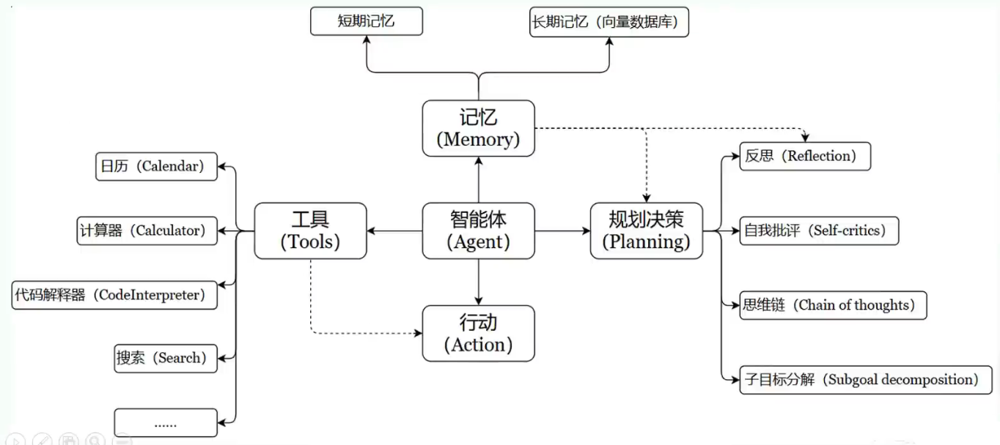

#### 国内大模型厂家推出的智能体

ai agent的架构

中文版

智能体的核心要素:

1. 大模型 (LLM) : 

   大模型作为大脑, 提供推理, 规划和知识理解的能力, 是ai agent的决策中枢

2. 记忆 (Memory): 

   记忆又分为短期记忆和长期记忆

   - 短期记忆主要存储单次对话周期的上下文信息, 属于临时信息存储机制.  

     短期记忆受限于模型的上下文窗口长度, 比如在问第11次的时候, 可能就记不住第一次的内容了

   - 长期记忆主要存储可以横跨多个任务或者时间周期, 可存储并调用核心知识, 非即时任务.  

     长期记忆可以通过**模型参数微调** (固话知识) 或者 **知识图谱** (结构化语义网络), 或者 **向量数据库** (相似性检索) 方式实现

3. 工具使用 (Tool Use)

   agent可以调用外部工具 (比如api, 数据库) 扩展能力边界

4. 规划决策(Planning)

   通过任务分解, 反思和自省框架实现复杂任务处理, 比如利用思维链(Chain of Thought) 将目标拆解为子任务, 并通过反馈优化策略

5. 行动 (Action)

   实际执行决策的模块, 比如软件操作接口 (比如自动订票) 和物理交互 (比如机器人执行搬运), 检索, 推理, 编程

#### 如何搭建企业私有/个人 知识库

大模型的长期记忆就是知识库, 他可以通过向量数据库来实现

哪些平台支持个人知识库的搭建?

1. AnythingLLM, Dify, 他们都支持数据完全本地化, 离线使用
2. MaxKB, 秘塔搜索, 知乎直达, 这些都需要将数据上传到服务器

注意: 上述软件都要基于大模型来使用