# 概述

Arthas（阿尔萨斯） 能为你做什么？

 

`Arthas` 是Alibaba开源的Java诊断工具，深受开发者喜爱。

当你遇到以下类似问题而束手无策时，`Arthas`可以帮助你解决：

1. 这个类从哪个 jar 包加载的？为什么会报各种类相关的 Exception？
2. 我改的代码为什么没有执行到？难道是我没 commit？分支搞错了？
3. 遇到问题无法在线上 debug，难道只能通过加日志再重新发布吗？
4. 线上遇到某个用户的数据处理有问题，但线上同样无法 debug，线下无法重现！
5. 是否有一个全局视角来查看系统的运行状况？
6. 有什么办法可以监控到JVM的实时运行状态？
7. 怎么快速定位应用的热点，生成火焰图？


# 安装

1. 访问https://arthas.aliyun.com/doc/download.html

   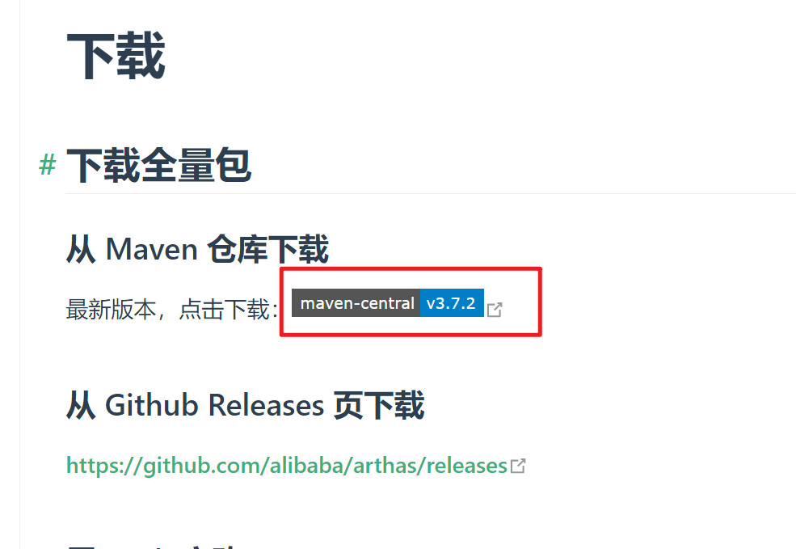

2. windows下点击, 直接下载

   linux下复制链接, 使用curl下载

   ~~~shell
   curl -O https://maven.aliyun.com/repository/public/com/taobao/arthas/arthas-packaging/3.1.7/arthas-packaging-3.1.7-bin.zip
   ~~~

3. 解压缩

   linxu下使用unzip

   ~~~shell
   # -d表示解压到的目录
   unzip -d arthas arthas-packaging-3.1.7-bin.zip
   ~~~

4. 运行

   ~~~
   java -jar arthas-boot.jar
   ~~~

5. 日志文件会放在

   - windwos:  `C:\Users\Administrator\logs\arthas`
   - linux: `~/logs/arthas`

# 卸载

linux:

~~~shell
rm -rf path_to_arthas
rm -rf ~/logs/arthas
~~~

windows:

​    直接删除`arthas安装路径`和`C:\Users\Administrator\logs\arthas`


# attach进程

我们可以通过`java -jar arthas-boot.jar`启动arthas, 然后选择一个java进行来attach

attach成功后, 可以直接在控制台使用arthas

同时arthas也会启动一个web服务, 也可以访问http://127.0.0.1:3658/来使用arthas

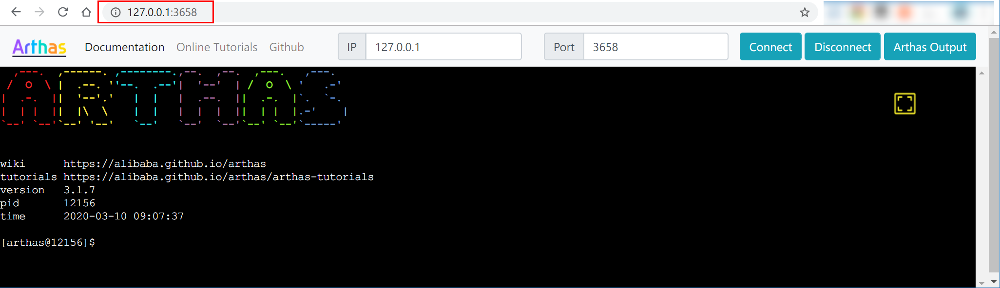

默认情况下，arthas只`listen 127.0.0.1`，所以如果想从远程连接，则可以使用 `--target-ip`参数指定listen的IP

如果在attach的过程中, 显示端口占用, 那么可以使用如下命令

~~~sh
 java -jar arthas-boot.jar --telnet-port 9998 --http-port -1
~~~


如果你当前没有一个合适的java进程来attach, 那么可以下载arthas提供的demo, 该程序是一个质因数分解的程序

~~~shell
curl -O https://alibaba.github.io/arthas/arthas-demo.jar

# 在命令行下执行
java -jar arthas-demo.jar
~~~

该程序具体代码如下:

~~~java
public class MathGame {
    private static Random random = new Random();
		
    //用于统计生成的不合法变量的个数
    public int illegalArgumentCount = 0;

    public static void main(String[] args) throws InterruptedException {
        MathGame game = new MathGame();
        //死循环，每过1秒调用1次下面的方法(不是开启一个线程)
        while (true) {
            game.run();
            TimeUnit.SECONDS.sleep(1);
        }
    }

    //分解质因数
    public void run() throws InterruptedException {
        try {
            //随机生成一个整数，有可能正，有可能负
            int number = random.nextInt()/10000;
            //调用方法进行质因数分解
            List<Integer> primeFactors = primeFactors(number);
            //打印结果
            print(number, primeFactors);
        } catch (Exception e) {
            System.out.println(String.format("illegalArgumentCount:%3d, ", illegalArgumentCount) + e.getMessage());
        }
    }
    
    //打印质因数分解的结果
    public static void print(int number, List<Integer> primeFactors) {
        StringBuffer sb = new StringBuffer(number + "=");
        for (int factor : primeFactors) {
            sb.append(factor).append('*');
        }
        if (sb.charAt(sb.length() - 1) == '*') {
            sb.deleteCharAt(sb.length() - 1);
        }
        System.out.println(sb);
    }

    //计算number的质因数分解
    public List<Integer> primeFactors(int number) {
        //如果小于2，则抛出异常，并且计数加1
        if (number < 2) {
            illegalArgumentCount++;
            throw new IllegalArgumentException("number is: " + number + ", need >= 2");
        }
			 //用于保存每个质数
        List<Integer> result = new ArrayList<Integer>();
        //分解过程，从2开始看能不能整除
        int i = 2;
        while (i <= number) {  //如果i大于number就退出循环
            //能整除，则i为一个因数，number为整除的结果再继续从2开始除
            if (number % i == 0) {
                result.add(i);
                number = number / i;
                i = 2;
            } else {
                i++;  //否则i++
            }
        }

        return result;
    }
}
~~~


# 基础命令

## help

查看命令帮助信息

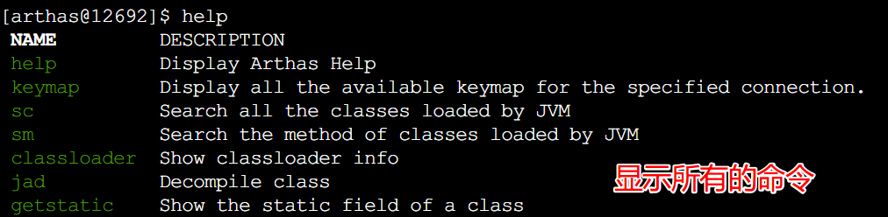


## cat

打印文件内容，和linux里的cat命令类似

如果没有写路径，则显示当前目录下的文件

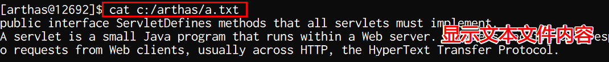


## grep

### 作用

匹配查找，和linux里的grep命令类似，但它只能用于管道命令

### 语法

| 参数列表        | 作用                                 |
| --------------- | ------------------------------------ |
| -n              | 显示行号                             |
| -i              | 忽略大小写查找                       |
| -m 行数         | 最大显示行数，要与查询字符串一起使用 |
| -e "正则表达式" | 使用正则表达式查找                   |

### 举例

```
只显示包含java字符串的行系统属性
sysprop | grep java
```
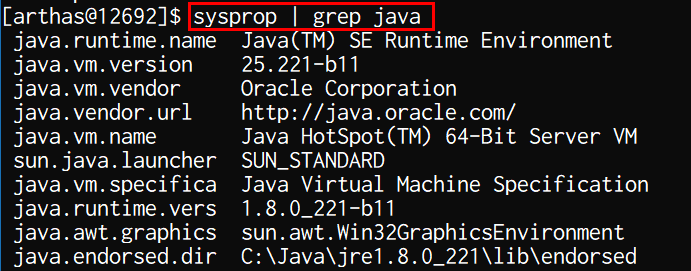 

```
显示包含java字符串的行和行号的系统属性
sysprop | grep java -n
```

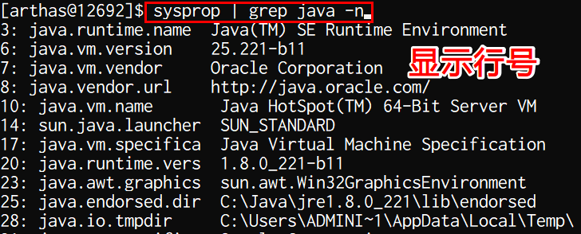 

```
显示包含system字符串的10行信息
thread | grep system -m 10
```

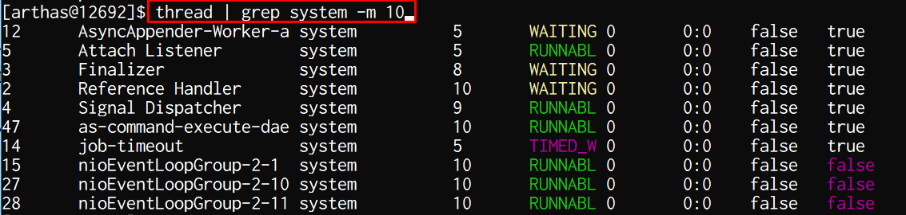 

```
使用正则表达式，显示包含2个o字符的线程信息
thread | grep -e "o+"
```

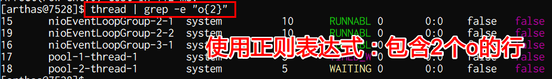 


## pwd

返回当前的工作目录，和linux命令类似

pwd: Print Work Directory 打印当前工作目录

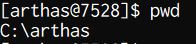 


## cls

清空当前屏幕区域


## session

查看当前会话的信息

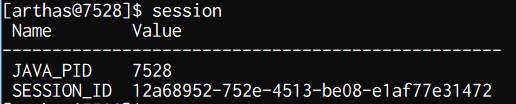 


## version

显示当前arthas的版本号

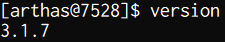 


### history

打印命令历史

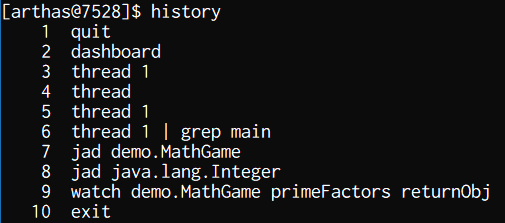 


## quit

仅离开 Arthas consol，但是绑定到 Java 进程的 arthas 任务不会退出。


## stop

停止和退出 Arthas consol ，正常退出步骤。

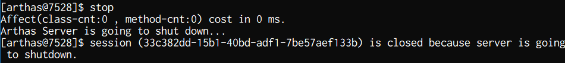

# jvm相关命令


## dashboard

### 作用

显示当前系统的实时数据面板，按q或ctrl+c退出

### 效果

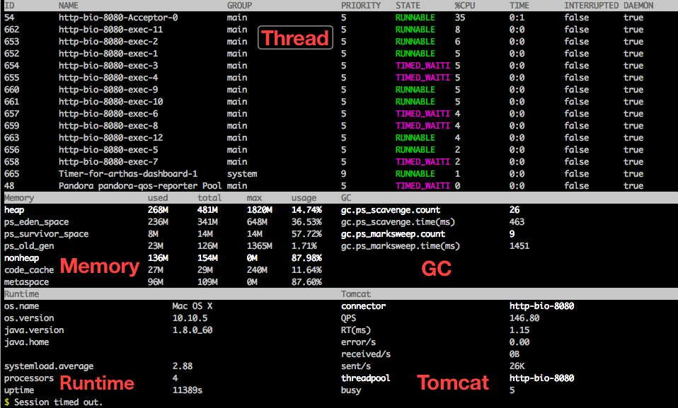

第一个部分是线程的信息

- ID: Java级别的线程ID，注意这个ID不能跟jstack中的nativeID一一对应
- NAME: 线程名
- GROUP: 线程组名
- PRIORITY: 线程优先级, 1~10之间的数字，越大表示优先级越高
- STATE: 线程的状态, new, runnable, block, waiting, time waiting, terminated
- CPU%: 线程消耗的cpu占比，**采样100ms，将所有线程在这100ms内的cpu使用量求和**，再算出每个线程的cpu使用占比。
- TIME: 线程运行总时间，数据格式为`分：秒`
- INTERRUPTED: 线程当前的中断位状态
- DAEMON: 是否是daemon线程

第二部分是内存的信息

- memory:  内存的类型

  heap堆, ps_eden_space新生代eden区, ps_survivor_space新生代survivor区, ps_old_gen老年代

  nonheap非堆(方法区、永久代),  

  code_cache jit将字节码转换为汇编, 保存在这里

  metaspace元数据区占用内存信息

- used: 当前使用的内存

- total: 当前向系统申请的内存

- max: 最大能够申请的内存

第三部分是GC的信息, 根据jvm的垃圾收集器不同, 显示的信息不同

jdk8

- gc.ps_scavenge.count:  垃圾回收的次数
- gc.ps_scavenge.time: 垃圾回收消耗的总
- gc.ps_marksweep.count: 执行标记的次数
- gc.marksweep.time: 执行清楚的次数

jdk11

- gc.g1_young_generation.count  young gc的次数
- gc.g1_young_generation.time  young gc的总耗时
- gc.g1_old_generation.count  old gc的次数
- gc.g1_old_generation.time old gc的总耗时
- gc.g1_concurrent_gc.count 并发标记的次数
- gc.g1_concurrent_gc.time 并发标记的总耗时

第四部分是jvm相关的参数

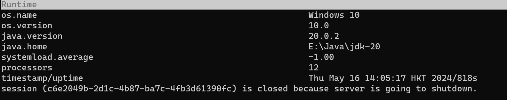


## thread

查看当前 JVM 的线程堆栈信息

- thread 查看第一页线程的情况

  | 参数                  | 作用                                                         |
  | --------------------- | ------------------------------------------------------------ |
  | --all                 | 显示所有线程的信息, 而不是第一页                             |
  | -b                    | 显示 持有synchronize锁而导致其他线程堵塞的线程               |
  | --state \<value>      | 显示指定状态的线程信息, NEW, RUNNABLE, TIMED_WAITING, WAITING,BLOCKED, TERMINATED |
  | -i \<value>           | 指定cpu使用率统计的采样间隔，单位为毫秒，默认值为200         |
  | --lockedMonitors      | 只显示带有lockedMonitors标识的，默认为false(不知道干嘛的)    |
  | --lockedSynchronizers | 只显示带有lockedSynchronizers标识的线程信息, 默认为false(不知道干嘛的) |
  | -n \<value>           | 查看前n个线程的栈信息, 按照cpu使用率排序 `thread -n 3`查看cpu使用前三的线程的栈信息 |
  | thread_id             | 显示指定线程的栈信息,  而不是笼统的信息                      |

  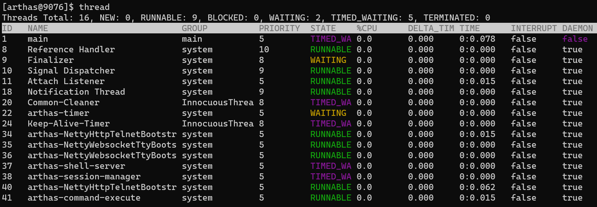

## jvm

查看当前 JVM 的信息, 可以分为以下几类信息:

1. Runtime

   包含jvm启动时间, 机器名字, jvm版本, javaagent, classpath, boot classpath, library path

2. Class Loading

   包含loaded class count已加载的class,   total loaded class count总共加载的class, unloaded class count卸载的class
   
3. compilation
   
   编译器的信息
   
4. Garbage Collectors

   垃圾收集器信息, 包括新生代和老年带使用的垃圾收集器

   收集的次数,  总消耗的时间

5. Memory Managers

   当前jvm的内存规划

6. Memory

   包含当前堆和非堆的使用情况,  初始大小, 已使用的大小, 已申请的大小, 最大能够申请的大小

7. Operating System

   当前操作系统的信息

8. Thread

   当前jvm的线程信息, 包含COUNT活跃的线程数

   DAEMON-COUNT活跃的守护线程数, 

   PEAK-COUNT从JVM启动开始曾经活着的最大线程数

   STARTED-COUNT: 从JVM启动开始总共启动过的线程次数

   DEADLOCK-COUNT: JVM当前死锁的线程数

9. File Descriptor

   文件描述符相关, 包含

   MAX-FILE-DESCRIPTOR-COUNT：JVM进程最大可以打开的文件描述符数

   OPEN-FILE-DESCRIPTOR-COUNT：JVM当前打开的文件描述符数

## sysprop

查看和修改JVM的系统属性

~~~sh
# 查看所有jvm系统属性
sysprop

# 查看指定的jvm系统属性
sysprop key

# 修改指定的jvm系统属性
sysprop key value
~~~

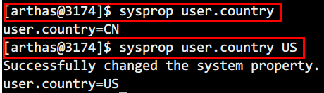

## sysenv

查看当前JVM的环境属性(`System Environment Variables`)

```sh
# 查看所有环境变量
sysenv

# 查看单个环境变量
sysenv key
```

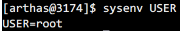 


## vmoption

查看，修改JVM参数

```sh
# 查看所有的选项
vmoption

# 查看指定的选项
vmoption Key

# 修改jvm参数
vmoption Key Value
```

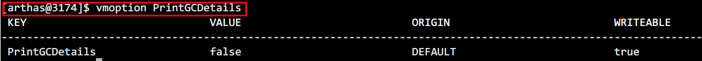 

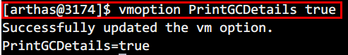 


## getstatic

查看类的静态变量, 格式`getstatic 全类名 属性名`

**全类名和属性名都可以使用通配符* **

| 参数                        | 作用                                                         |
| --------------------------- | ------------------------------------------------------------ |
| -c \<value>                 | 在使用正则表达式或者通配符的时候, 可能会匹配到多个类和多个变量 <br>可以指定classLoader的hashcode来缩小结果的范围 |
| --classLoaderClass \<value> | 同上, 只不过是指定ClassLoader的类名                          |
| -E                          | 全类名和属性名是否使用正则表达式来匹配, 默认使用通配符       |
| -x \<value>                 | 查看静态变量时, 要扩展几层, 即是否显示变量的属性, 属性的属性<br>默认1, 即只查看变量的属性和变量 |

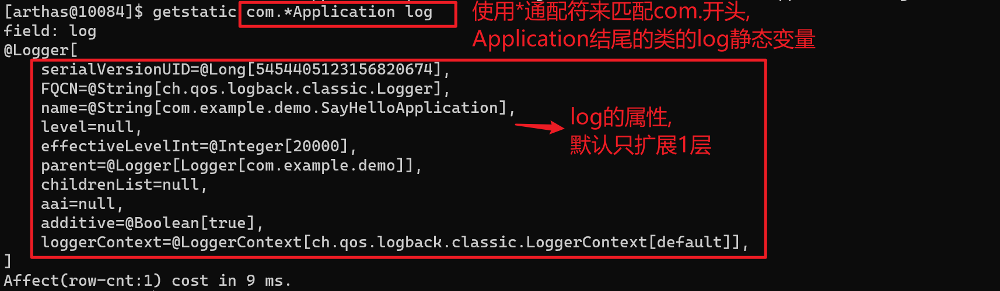  


## dump

生成指定类的字节码文件到指定的目录,  可以批量生成

格式: `dump class-pattern`

参数

| 参数名称 | 参数说明                                     |
| -------- | -------------------------------------------- |
| -d       | 指定生成的class文件的位置                    |
| -E       | class-pattern开启正则表达式,  默认使用通配符 |

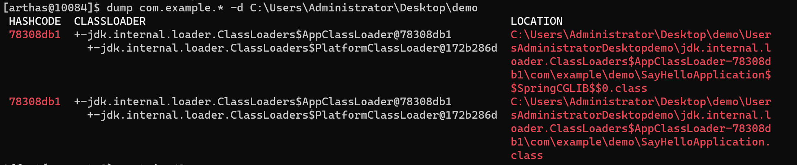


## heapdump

生成堆快照

1. dump到指定的文件

   ~~~sh
   heapdump arthas-output/dump.hprof
   ~~~

   **如果文件生成在`arthas-output`目录下,  那么可以访问http://localhost:8563/arthas-output/对其进行下载**

2. 只dump live对象

   ~~~sh
   [arthas@58205]$ heapdump --live /tmp/dump.hprof
   Dumping heap to /tmp/dump.hprof ...
   Heap dump file created
   ~~~

3. dump到临时文件

   ~~~sh
   [arthas@58205]$ heapdump
   Dumping heap to /var/folders/my/wy7c9w9j5732xbkcyt1mb4g40000gp/T/heapdump2019-09-03-16-385121018449645518991.hprof...
   Heap dump file created
   ~~~

   

## memory

查看JVM内存信息

~~~sh
$ memory
Memory                           used      total      max        usage
heap                             32M       256M       4096M      0.79%
g1_eden_space                    11M       68M        -1         16.18%
g1_old_gen                       17M       184M       4096M      0.43%
g1_survivor_space                4M        4M         -1         100.00%
nonheap                          35M       39M        -1         89.55%
codeheap_'non-nmethods'          1M        2M         5M         20.53%
metaspace                        26M       27M        -1         96.88%
codeheap_'profiled_nmethods'     4M        4M         117M       3.57%
compressed_class_space           2M        3M         1024M      0.29%
codeheap_'non-profiled_nmethods' 685K      2496K      120032K    0.57%
mapped                           0K        0K         -          0.00%
direct                           48M       48M        -          100.00%
~~~


## ognl

执行ognl表达式，这是从3.0.5版本新增的功能

格式: `ognl expression`

ognl语法查看http://commons.apache.org/proper/commons-ognl/language-guide.html

| 参数名称                    | 参数说明                                            |
| --------------------------- | --------------------------------------------------- |
| --classLoaderClass \<value> | 执行表达式的 ClassLoader，默认值是SystemClassLoader |
| -c \<value>                 | 同上, 只不过指定的是ClassLoader的hashcode           |
| -x \<value>                 | 结果对象的展开层次，默认值1                         |

举例

```sh
# 调用静态函数
ognl '@java.lang.System@out.println("hello")'

# 获取静态类的静态字段
ognl '@demo.MathGame@random'

# 执行多行表达式，赋值给临时变量，返回一个List
ognl '#value1=@System@getProperty("java.home"), #value2=@System@getProperty("java.runtime.name"), {#value1, #value2}'
```

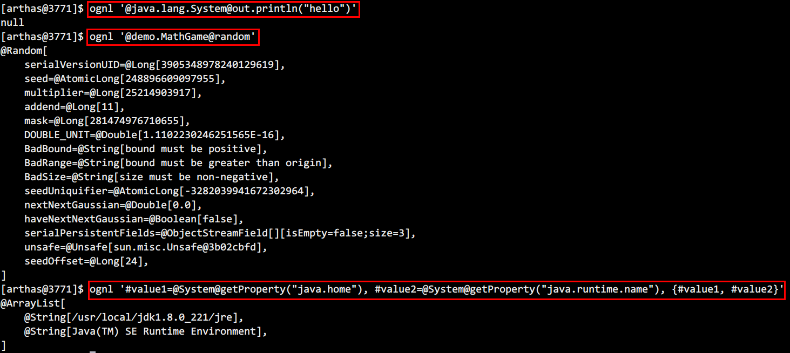


# class/classloader相关命令

## classloader

显示所有的classloader

参数

| 参数 | 作用                                                    |
| ---- | ------------------------------------------------------- |
| -l   | 显示所有的classloader的指标<br>即已加载的类, parent等等 |
| -t   | 按照继承结构来显示classloader                           |
| -u   | 显示classloader能够加载的类的路径                       |

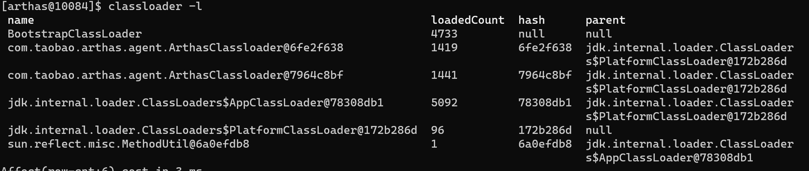

## sc

查找类及其子类

格式为: `sc 类名`,   类名可以使用**通配符**

sc 默认开启了子类匹配功能，也就是说所有当前类的子类也会被搜索出来，想要精确的匹配，请使用`options disable-sub-class true`命令来关闭该功能


参数说明

| 参数名称                    | 参数说明                                                     |      |
| --------------------------- | ------------------------------------------------------------ | ---- |
| -c \<value>                 | 在使用正则表达式或者通配符的时候, 可能会匹配到多个类和多个变量 <br>可以指定classLoader的hashcode来缩小结果的范围 |      |
| --classLoaderClass \<value> | 同上, 只不过是指定ClassLoader的类名                          |      |
| -E                          | 全类名和属性名是否使用正则表达式来匹配, 默认使用通配符       |      |
| -x \<value>                 | 查看静态变量时, 要扩展几层, 即是否显示变量的属性, 属性的属性 默认1, 即只查看变量的属性和变量 |      |
| -f                          | 输出当前类的成员变量信息（需要配合参数-d一起使用）           |      |
| -d                          | 查看详细信息, 包括**class的来源路径, 是否为接口, 注解, 枚举, 内部类, 是否为基本数据类型, 访问修饰符, class loader, 父类, 接口, 类上的注解** |      |

案例

```sh
模糊搜索，demo包下所有的类
sc demo.*

打印类的详细信息
sc -d demo.MathGame
```

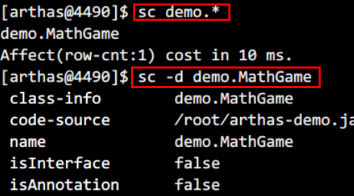 

```
打印出类的Field信息
sc -df demo.MathGame
```

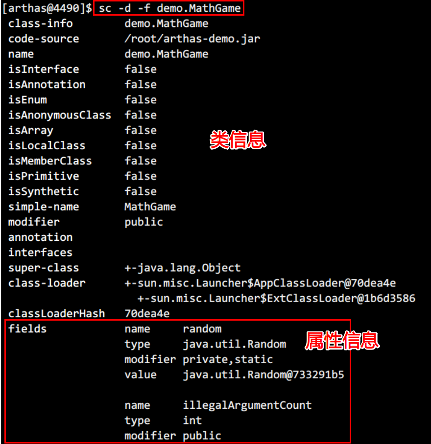 


## sm

查看已加载类的方法信息

格式: `sm 类名 方法名`  类名和方法名都可以使用通配符*

`sm` 命令只能看到由当前类所声明 (declaring) 的方法，无法看到继承自父类的方法。


参数说明

| 参数名称                    | 参数说明                                                     |      |
| --------------------------- | ------------------------------------------------------------ | ---- |
| -c \<value>                 | 在使用正则表达式或者通配符的时候, 可能会匹配到多个类和多个变量 <br>可以指定classLoader的hashcode来缩小结果的范围 |      |
| --classLoaderClass \<value> | 同上, 只不过是指定ClassLoader的类名                          |      |
| -E                          | 全类名和属性名是否使用正则表达式来匹配, 默认使用通配符       |      |
| -n \<value>                 | 设置匹配的class的最大个数, 默认为100                         |      |
| -f                          | 输出当前类的成员变量信息（需要配合参数-d一起使用）           |      |
| -d                          | 查看详细信息, 包括**class的来源路径, 是否为接口, 注解, 枚举, 内部类, 是否为基本数据类型, 访问修饰符, class loader, 父类, 接口, 类上的注解** |      |

举例

```
显示String类加载的方法
sm java.lang.String
```

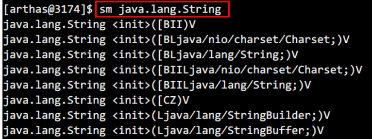 

```
显示String中的toString方法详细信息
sm -d java.lang.String toString
```

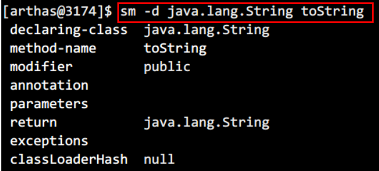 


## monitor

监控指定的方法, 返回其调用时间, 调用次数, 成功次数, 失败次数, 平均调用时间, 失败率

格式: `monitor class-pattern method-pattern [condition-express]`, 

condition-express使用ognl表达式, 不符合ognl表达式的调用不包含在统计结果中

参数

| 参数        | 作用                                                         |
| ----------- | ------------------------------------------------------------ |
| -E          | class-pattern, method-pattern是否开启正则表达式匹配, 默认使用通配符匹配 |
| -c \<value> | 设置监控周期的秒数,  默认60s输出一次监控的结果               |
| -n \<value> | 设置方法执行多少次后就结束监控                               |
| -v          | 打印详细信息                                                 |
| -m \<value> | 设置class-pattern能够匹配的最大个数                          |
| -b          | 在方法调用之前计算condition-express, 默认是在方法调用之后    |

1. 每5秒输出一次primeFactors的调用情况

   ~~~sh
   $ monitor -c 5 demo.MathGame primeFactors
   Press Ctrl+C to abort.
   Affect(class-cnt:1 , method-cnt:1) cost in 94 ms.
    timestamp            class          method        total  success  fail  avg-rt(ms)  fail-rate
   -----------------------------------------------------------------------------------------------
    2018-12-03 19:06:38  demo.MathGame  primeFactors  5      1        4     1.15        80.00%
   
    timestamp            class          method        total  success  fail  avg-rt(ms)  fail-rate
   -----------------------------------------------------------------------------------------------
    2018-12-03 19:06:43  demo.MathGame  primeFactors  5      3        2     42.29       40.00%
   ~~~

2. 在方法执行完之后, 过滤统计结果,  即只统计返回值不为null的调用

   ~~~sh
   monitor -c 5 demo.MathGame primeFactors "returnObj != null"
   ~~~

3. 在方法执行之前过滤, 即只统计第一个参数 <= 2 的调用

   ~~~sh
   monitor -b -c 5 com.test.testes.MathGame primeFactors "params[0] <= 2"
   ~~~

   

## jad

反编译指定的类, 并显示源码

格式:  `jad class-pattern method-pattern`  class-pattern和method-pattern都可以使用通配符

**可以不指定method-pattern, 表示反编译整个类**

参数说明

| 参数名称                    | 参数说明                                                     |      |
| --------------------------- | ------------------------------------------------------------ | ---- |
| -c \<value>                 | 在使用正则表达式或者通配符的时候, 可能会匹配到多个类和多个变量 <br>可以指定classLoader的hashcode来缩小结果的范围 |      |
| --classLoaderClass \<value> | 同上, 只不过是指定ClassLoader的类名                          |      |
| -E                          | 全类名和属性名是否使用正则表达式来匹配, 默认使用通配符       |      |
| --lineNumber \<value>       | 输出的源码是否包含行号                                       |      |
| --source-only               | 只输出反编译后的代码                                         |      |


举例

```sh
# 反编译java.lang.String
jad java.lang.String

# 反编译demo.MathGame, 并只显示反编译后的代码
jad --source-only demo.MathGame

# 输出反编译后的代码到文件中
jad --source-only demo.MathGame > /root/MathGame.java
```

 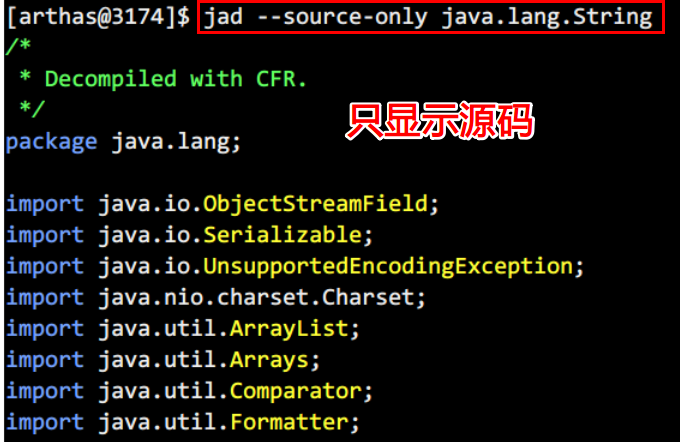 

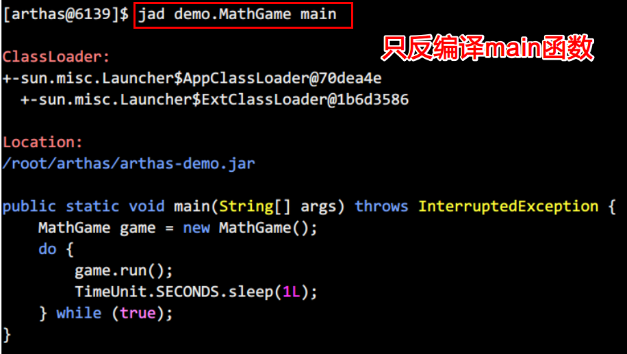 


## reset

重置增强类，将被 Arthas 增强过的类全部还原，Arthas 服务端关闭时会重置所有增强过的类

```sh
reset Test # 还原指定类
reset *List # 还原所有以List结尾的类
reset # 还原所有的类
```

### 效果

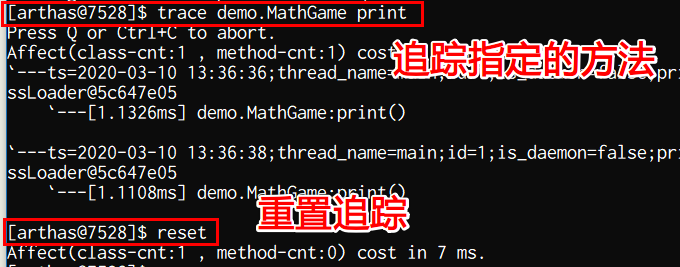 


## mc

编译`.java`文件生成`.class`

格式:  `mc xx.java`

| 参数                | 作用                                |
| ------------------- | ----------------------------------- |
| -d \<value>         | 指定class文件输出的位置, 默认为内存 |
| --encoding \<value> | 指定源文件的编码                    |


举例

```
在内存中编译Hello.java为Hello.class
mc /root/Hello.java

可以通过-d命令指定输出目录
mc -d /root/bbb /root/Hello.java
```

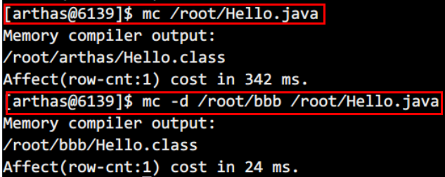 


## logger

查看logger的信息

1. 查看所有logger

   ~~~sh
   logger
   ~~~

2. 查看指定name的logger

   ~~~sh
   [arthas@2062]$ logger -n org.springframework.web
    name                                   org.springframework.web
    class                                  ch.qos.logback.classic.Logger
    classLoader                            sun.misc.Launcher$AppClassLoader@2a139a55
    classLoaderHash                        2a139a55
    level                                  null
    effectiveLevel                         INFO
    additivity                             true
    codeSource                             file:/Users/hengyunabc/.m2/repository/ch/qos/logback/logback-classic/1.2.3/logback-classic-1.2.3.jar
   ~~~

3. 更新logger 的 level

   ```bash
   [arthas@2062]$ logger --name ROOT --level debug
   update logger level success.
   ```

4. 查看没有 appender 的 logger 的信息

   默认情况下，`logger`命令只打印有 appender 的 logger 的信息。如果想查看没有`appender`的 logger 的信息，可以加上参数`--include-no-appender`。


## redefine

**推荐使用retransform**

加载class文件到jvm中, 覆盖原来加载的class

**redefine后的原来的类不能恢复，即使arthas关闭, 如果想要恢复, 需要`redefine`原始的字节码。**


redefine的限制

- 不允许新增加field/method, 否则会失败
- 正在跑的函数，要执行完下次进来才会生效

- `reset`命令对`redefine`的类无效。如果想重置，需要`redefine`原始的字节码。
- `redefine`命令和`jad`/`watch`/`trace`/`monitor`/`tt`等命令会冲突。执行完`redefine`之后，如果再执行上面提到的命令，则会把`redefine`的字节码重置。

案例：

```sh
# 1. 使用jad反编译demo.MathGame输出到/root/MathGame.java, 并保存原始的字节码文件
jad --source-only demo.MathGame > /root/MathGame.java
dump demo.MathGame -d /temp/

# 2. 修改源代码

# 3.使用mc内存中对新的代码编译, 如果编译失败可以在本地编译好再上传
mc /root/MathGame.java -d /root

# 4.使用redefine命令加载新的字节码
redefine /root/demo/MathGame.class

# 5. 加载原来的字节码文件
redefine /temp/MathGame.class
```

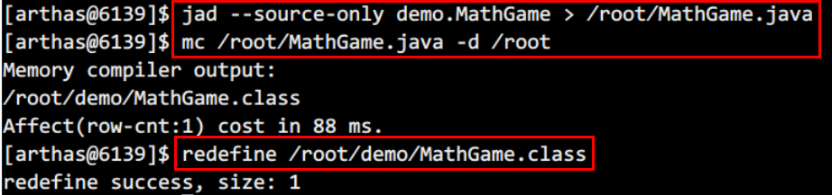 

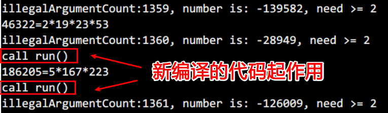 


## retransform

加载class文件到jvm中, 覆盖原来加载的class, 每覆盖一个class(包括内部类), 就会生成一个entry

和redefine的区别在于, redefine需要还原到原来的字节码, **需要重新redefine原始字节码文件, 而retransform不需要**

1. retransform class

   ~~~sh
   # 1. 使用jad反编译demo.MathGame输出到/root/MathGame.java
   jad --source-only demo.MathGame > /root/MathGame.java
   
   # 2. 修改源代码
   
   # 3.使用mc内存中对新的代码编译, 如果编译失败可以在本地编译好再上传
   mc /root/MathGame.java -d /root
   
   # 4.使用retransformer命令加载新的字节码
   retransformer /root/demo/MathGame.class
   ~~~

2. 查看retransform entry
   
   ~~~sh
   $ retransform -l
   Id              ClassName       TransformCount  LoaderHash      LoaderClassName
   1               demo.MathGame   1               null            null
   ~~~
   
3. 删除指定id的retransform entry

   ~~~sh
   retransform -d 1
   ~~~

4. 删除所有的retransform entry

   ~~~sh
   retransform --deleteAll
   ~~~

5. 显示触发retransform, 还原class字节码

   ~~~sh
   $ retransform --classPattern demo.MathGame
   retransform success, size: 1, classes:
   demo.MathGame
   ~~~

   注意:   对于同一个类，当存在多个 retransform entry 时，如果显式触发 retransform ，则最后添加的 entry 生效(id 最大的)。

### 清除retransform的影响

**如果想要清除retransform的影响, 还原到原来最开始的class版本**, 那么需要

- 使用`retransform -d id`或者`retransform --deleteAll`删除掉对应类的retransform entry
- 使用`retransform --classPath xxx` 显示重新触发retransform

**否则的话即使stop arthas, 也依然使用的是retransform之后的class**


## stack

当指定的方法被调用的时候, 输出调用栈

格式:  `stack class-pattern method-pattern [condition-express]`

condition-express是ognl表达式, 可以使用params和returnObj来过滤调用

| 参数                             | 作用                                                        |
| -------------------------------- | ----------------------------------------------------------- |
| -E                               | class-pattern和method-pattern开启正则匹配, 默认是通配符匹配 |
| -n \<value>                      | 执行次数限制                                                |
| -m \<value>                      | 指定匹配class的最大数量, 默认为50                           |
| --exclude-class-pattern \<value> | 排除掉class                                                 |

1. 按照参数条件来过滤,  并且限制监控的次数

   ~~~sh
   stack demo.MathGame primeFactors 'params[0]<0' -n 2
   ~~~

2. 参照执行时间来过滤

   ~~~sh
   stack demo.MathGame primeFactors '#cost>5'
   ~~~


## trace

统计方法内部调用路径，并输出方法路径上的每个节点上耗时

格式:`trace class-pattern method-pattern [condition-express] `

参数

| 参数                     | 作用                                                         |
| ------------------------ | ------------------------------------------------------------ |
| -E                       | class-pattern和method-pattern开启正则匹配, 默认是通配符匹配  |
| -n \<value>              | 执行次数限制                                                 |
| -m \<value>              | 指定匹配class的最大数量, 默认为50                            |
| --skipJDKMethod \<value> | 默认情况下，trace 不会包含 jdk 里的函数调用, 如果需要, 设置为false |

1. 根据调用函数来过滤, 并且只输出一次结果

   ~~~sh
   $ trace demo.MathGame run '#cost > 10' -n 1
   Press Ctrl+C to abort.
   Affect(class-cnt:1 , method-cnt:1) cost in 41 ms.
   `---ts=2018-12-04 01:12:02;thread_name=main;id=1;is_daemon=false;priority=5;TCCL=sun.misc.Launcher$AppClassLoader@3d4eac69
       `---[12.033735ms] demo.MathGame:run()
           +---[0.006783ms] java.util.Random:nextInt()
           +---[11.852594ms] demo.MathGame:primeFactors()
           `---[0.05447ms] demo.MathGame:print()
   ~~~

   

## watch

在方法调用时进行监视, 能观察到的范围为：`返回值`、`抛出异常`、`入参`，

通过编写 OGNL 表达式进行对应变量的查看

格式: `watch class-pattern method-pattern express condition-express`


特别说明

- watch 命令定义了 4 个观察事件点，即 `-b` 函数调用前，`-e` 函数异常后，`-s` 函数返回后，`-f` 函数结束后
- 4 个观察事件点 `-b`、`-e`、`-s` 默认关闭，`-f` 默认打开，当指定观察点被打开后，在相应事件点会对观察表达式进行求值并输出
- 当使用 `-b` 时，由于观察事件点是在函数调用前，此时返回值或异常均不存在
- 在 watch 命令的结果里，会打印出`location`信息。`location`有三种可能值：`AtEnter`，`AtExit`，`AtExceptionExit`。对应函数入口，函数正常 return，函数抛出异常。

参数

| 参数名称                         | 参数说明                                                     |
| -------------------------------- | ------------------------------------------------------------ |
| *class-pattern*                  | 类名表达式匹配                                               |
| *method-pattern*                 | 函数名表达式匹配                                             |
| *express*                        | 要监视的内容, ognl表达式 默认值：`{params, target, returnObj}`, <br>比如params, params[0], params[0]+params[1], throwExp, target, clazz |
| *condition-express*              | ognl表达式, 用于过滤调用                                     |
| -b                               | 在函数调用之前输出express, 默认关闭                          |
| -e                               | 在函数异常时输出express, 默认关闭,                           |
| -s                               | 在**函数返回时**输出express, 默认关闭                        |
| -f                               | 在**函数结束之后**(正常返回和异常返回)时输出express, 默认开启 |
| -E                               | 开启正则表达式匹配，默认为通配符匹配                         |
| -x \<value>                      | 指定输出结果的属性遍历深度，默认为 1，最大值是 4             |
| -m \<value>                      | 指定 Class 最大匹配数量，默认值为 50。                       |
| -n \<value>                      | 限制输出的次数, 防止大量调用                                 |
| --exclude-class-pattern \<value> | 不匹配的class 的 pattern                                     |

案例:

1. 观察函数调用返回时的参数、this 对象和返回值,以及异常

   设置观察内容的遍历深度为2

   观察两次之后就结束调用

   ~~~sh
    watch demo.MathGame primeFactors "{params, target, returnObj, throwExp}" -x 2 -n 2
   ~~~

   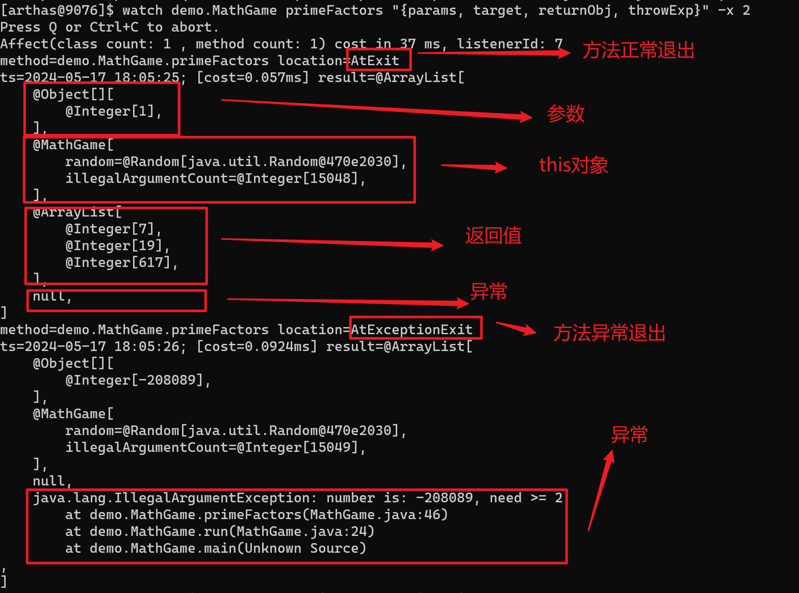

2. 在函数调用之前, 输出params和returnObj

   函数执行前，因此获取不到返回值

   ~~~sh
   $ watch demo.MathGame primeFactors "{params,returnObj}" -x 2 -b
   Press Ctrl+C to abort.
   Affect(class-cnt:1 , method-cnt:1) cost in 50 ms.
   ts=2018-12-03 19:23:23; [cost=0.0353ms] result=@ArrayList[
       @Object[][
           @Integer[-1077465243],
       ],
       null,
   ]
   ~~~

3. 在函数调用之前和函数正常退出时, 输出params

   ~~~sh
   $ watch demo.MathGame primeFactors "{params,target,returnObj}" -x 2 -b -s -n 2
   Press Ctrl+C to abort.
   Affect(class-cnt:1 , method-cnt:1) cost in 46 ms.
   ts=2018-12-03 19:29:54; [cost=0.01696ms] result=@ArrayList[
       @Object[][
           @Integer[1],
       ],
       @MathGame[
           random=@Random[java.util.Random@522b408a],
           illegalArgumentCount=@Integer[13038],
       ],
       null,
   ]
   ts=2018-12-03 19:29:54; [cost=4.277392ms] result=@ArrayList[
       @Object[][
           @Integer[1],
       ],
       @MathGame[
           random=@Random[java.util.Random@522b408a],
           illegalArgumentCount=@Integer[13038],
       ],
       @ArrayList[
           @Integer[2],
           @Integer[2],
           @Integer[2],
           @Integer[5],
           @Integer[5],
           @Integer[73],
           @Integer[241],
           @Integer[439],
       ],
   ]
   ~~~

   - 第一次输出的是函数调用前的观察表达式的结果，第二次输出的是函数返回后的表达式的结果

   - 结果的输出顺序和事件发生的先后顺序一致，和命令中 `-s -b` 的顺序无关

4. 只在异常时输出express的内容

   ~~~sh
   $ watch demo.MathGame primeFactors "{params[0],throwExp}" -e -x 2
   Press Ctrl+C to abort.
   Affect(class-cnt:1 , method-cnt:1) cost in 62 ms.
   ts=2018-12-03 19:38:00; [cost=1.414993ms] result=@ArrayList[
       @Integer[-1120397038],
       java.lang.IllegalArgumentException: number is: -1120397038, need >= 2
   	at demo.MathGame.primeFactors(MathGame.java:46)
   	at demo.MathGame.run(MathGame.java:24)
   	at demo.MathGame.main(MathGame.java:16)
   ,
   ]
   ~~~

5. 按照耗时来过滤输出, 只有函数大于200ms时才输出

   ~~~sh
   $ watch demo.MathGame primeFactors '{params, returnObj}' '#cost>200' -x 2
   Press Ctrl+C to abort.
   Affect(class-cnt:1 , method-cnt:1) cost in 66 ms.
   ts=2018-12-03 19:40:28; [cost=2112.168897ms] result=@ArrayList[
       @Object[][
           @Integer[1],
       ],
       @ArrayList[
           @Integer[5],
           @Integer[428379493],
       ],
   ]
   ~~~

6. 观察当前对象中的属性

   ~~~sh
   $ watch demo.MathGame primeFactors 'target.illegalArgumentCount'
   Press Ctrl+C to abort.
   Affect(class-cnt:1 , method-cnt:1) cost in 67 ms.
   ts=2018-12-03 20:04:34; [cost=131.303498ms] result=@Integer[8]
   ts=2018-12-03 20:04:35; [cost=0.961441ms] result=@Integer[8]
   ~~~

7. 获取类的静态字段, 调用类的静态函数

   ~~~sh
   [arthas@6527]$ watch demo.MathGame * '{params,@demo.MathGame@random.nextInt(100)}' -n 1 -x 2
   Press Q or Ctrl+C to abort.
   Affect(class count: 1 , method count: 5) cost in 34 ms, listenerId: 3
   ts=2021-01-05 21:35:20; [cost=0.173966ms] result=@ArrayList[
       @Object[][
           @Integer[-138282],
       ],
       @Integer[89],
   ]
   ~~~


## tt

把函数的入参/返回值, 异常等，保存到一个`Map<Integer, TimeFragment>`里，默认的大小是 100。

**tt 相关功能在使用完之后，需要手动释放内存，否则长时间可能导致OOM。**

退出 arthas 不会自动清除 tt 的缓存 map。

格式: `tt class-pattern method-pattern [condition-express]`


1. 开始记录调用到map中

   格式: `tt -t class-pattern method-pattern [condition-express]`

   class-pattern和method-pattern可以使用通配符, condition-express是ognl表达式

   可选的参数有: 

   | 参数                             | 作用                                                    |
   | -------------------------------- | ------------------------------------------------------- |
   | -n \<value>                      | 只记录n条数据就退出, 默认为100                          |
   | -E                               | class-pattern和method-pattern开启正则匹配, 而不是通配符 |
   | --exclude-class-pattern \<value> | 排除class                                               |
   | -m \<value>                      | class-pattern最多匹配到的class的个数                    |
   | -M \<size>                       | 设置map的大小, 默认(10 * 1024 *1024)                    |

   1. 只记录调用耗时大于200ms的调用到map中, 并且记录到10条之后就退出

      ~~~sh
      tt -t  demo.MathGame primeFactors "#cost > 200" -n 10
      ~~~

   2. tt显示的字段解释

      | 表格字段  | 字段解释                                               |
      | --------- | ------------------------------------------------------ |
      | INDEX     | 时间片段记录编号，每一个编号代表着一次调用             |
      | TIMESTAMP | 方法执行的本机时间，记录了这个时间片段所发生的本机时间 |
      | COST(ms)  | 方法执行的耗时                                         |
      | IS-RET    | 方法是否以正常返回的形式结束                           |
      | IS-EXP    | 方法是否以抛异常的形式结束                             |
      | OBJECT    | 执行对象的`hashCode()`                                 |
      | CLASS     | 执行的类名                                             |
      | METHOD    | 执行的方法名                                           |

2. 查看map中的数据

   1. 查看所有数据

      ~~~sh
      tt -l
      ~~~

   2. 如果你记录了很多方法的信息在map中, 那么可以查看指定方法的调用信息

      ~~~sh
      tt -s 'method.name=="primeFactors"'
      ~~~

   3. 查看指定index的调用的详细信息

      ~~~sh
      # -i查看index为1003的详细调用信息, -x表示将对象展开2层
      $ tt -i 1003 -x n
       INDEX            1003
       GMT-CREATE       2018-12-04 11:15:41
       COST(ms)         0.186073
       OBJECT           0x4b67cf4d
       CLASS            demo.MathGame
       METHOD           primeFactors
       IS-RETURN        false
       IS-EXCEPTION     true
       PARAMETERS[0]    @Integer[-564322413]
       THROW-EXCEPTION  java.lang.IllegalArgumentException: number is: -564322413, need >= 2
                            at demo.MathGame.primeFactors(MathGame.java:46)
                            at demo.MathGame.run(MathGame.java:24)
                            at demo.MathGame.main(MathGame.java:16)
      
      Affect(row-cnt:1) cost in 11 ms.
      ~~~

   4. 查看指定index的调用的指定内容

      ~~~sh
      # 查看index为1000的调用, 并且只查看调用时的illegalArgumentCount属性, 将其展开1层
      tt -w 'target.illegalArgumentCount'  -x 1 -i 1000
      ~~~

3. 回放调用

   当你稍稍做了一些调整之后，你可能需要前端系统重新触发一次你的调用，此时得求爷爷告奶奶的需要前端配合联调的同学再次发起一次调用

   `tt` 命令由于保存了当时调用的所有现场信息，所以我们可以自己主动对一个 `INDEX` 编号的时间片自主发起一次调用，从而解放你的沟通成本

   ~~~sh
   # 指定回放1004调用, 回放2次, 间隔200ms
   tt -i 1004 -p --replay-times 2 --replay-interval 200
   ~~~

4. 删除map中的记录

   ~~~sh
   tt -d 1001
   tt --delete-all
   ~~~


## profiler

支持生成应用热点的火焰图。本质上是通过不断的采样，然后把收集到的采样结果生成火焰图。

1. 开始采样, 格式: `profiler start`

   | 参数        | 作用                                                         |
   | ----------- | ------------------------------------------------------------ |
   | -d          | 采样持续的秒数                                               |
   | -e \<enent> | 采样的事件, 默认为cpu, 可以使用`profiler list`开查看所有的事件(没什么用的参数) |
   | -i \<value> | 采样的间隔,                                                  |


2. 查看已采集的sample数量

   ~~~sh
   $ profiler getSamples
   23
   ~~~

3. 查看profiler运行了多久

   ~~~sh
   $ profiler status
   [cpu] profiling is running for 4 seconds
   ~~~

4. 停止采样并生成结果

   ~~~sh
   # 默认结果为svg格式的图片
   $ profiler stop --format html
   profiler output file: /tmp/test/arthas-output/20211207-111550.html
   OK
   ~~~

5. 回复采样

   `start`和`resume`的区别是：`start`是新开始采样，`resume`会保留上次`stop`时的数据

   ~~~sh
   profiler resume
   ~~~

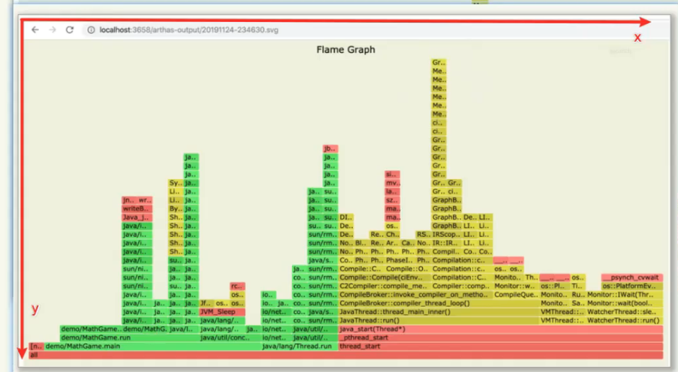

x轴的每一段都代表一次抽样,  如果一个函数在x轴占据的宽度越宽, 那么他被抽到的次数就越多, 即执行的时间越长

注意x轴不代表时间, 而是所有调用栈合并后, 按照字母排序的

y轴表示调用栈, 每一层就是一个函数, 调用者越深, 火焰就越高, 顶部是正在执行的的函数

颜色没有任何含义

**看火焰图就是要看顶层的哪个函数占据最大宽度,, 如果出现平顶, 那么就表示该函数有性能问题**


# 其他命令

## options

查看和设置arthas的设置

1. 查看所有设置

   ~~~sh
   $ options
    LEVEL  TYPE    NAME          VALUE   SUMMARY               DESCRIPTION
   -------------------------------------------------------------------------------------------------------
    0      boolean  unsafe        false   Option to support sy  This option enables to proxy functionality
                                          stem-level class       of JVM classes. 
   ~~~

2. 查看指定的设置

   ~~~sh
   $ options key
   ~~~

3. 设置指定的设置

   ~~~sh
   $ options key value
   ~~~

   

## keymap

可以使用`keymap` 命令来查看所有的快捷键

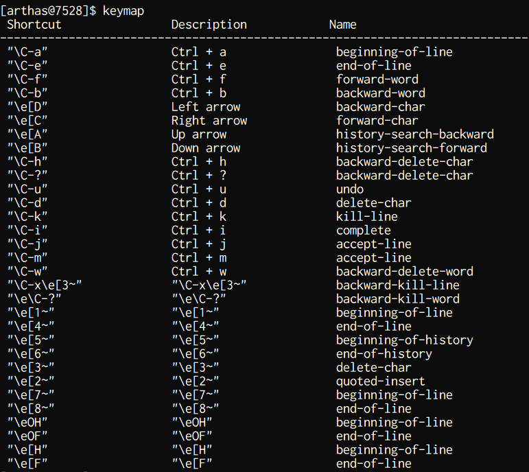 

### Arthas 命令行快捷键

| 快捷键说明       | 命令说明                         |
| ---------------- | -------------------------------- |
| ctrl + a         | 跳到行首                         |
| ctrl + e         | 跳到行尾                         |
| ctrl + f         | 向前移动一个单词                 |
| ctrl + b         | 向后移动一个单词                 |
| 键盘左方向键     | 光标向前移动一个字符             |
| 键盘右方向键     | 光标向后移动一个字符             |
| 键盘下方向键     | 下翻显示下一个命令               |
| 键盘上方向键     | 上翻显示上一个命令               |
| ctrl + h         | 向后删除一个字符                 |
| ctrl + shift + / | 向后删除一个字符                 |
| ctrl + u         | 撤销上一个命令，相当于清空当前行 |
| ctrl + d         | 删除当前光标所在字符             |
| ctrl + k         | 删除当前光标到行尾的所有字符     |
| ctrl + i         | 自动补全，相当于敲`TAB`          |
| ctrl + j         | 结束当前行，相当于敲回车         |
| ctrl + m         | 结束当前行，相当于敲回车         |

- 任何时候 `tab` 键，会根据当前的输入给出提示
- 命令后敲 `-` 或 `--` ，然后按 `tab` 键，可以展示出此命令具体的选项

### 后台异步命令相关快捷键

- ctrl + c: 终止当前命令
- ctrl + z: 挂起当前命令，后续可以 bg/fg 重新支持此命令，或 kill 掉
- ctrl + a: 回到行首
- ctrl + e: 回到行尾

# 上传class文件到服务器的技巧

如果服务器不允许直接上传文件, 那么可以将class文件转为base64, 然后将内容拷贝到服务器上, 然后在服务器上使用base64解码

~~~sh
1. 将本地class文件转为base64, 保存到文件中
base64 < Test.class > result.txt

2. 在服务器上新建result.txt, 并将内容复制到其中

3. 在服务器上将result.txt还原为.class文件
base64 < Test.class > result.txt

4. 使用md5命令计算hash, 校验是否一致
~~~

## 查看arthas输出的结果

默认情况下, arthas会在3658端口看起web服务, 所有保存在arthas-output目录下的文件够可以通过 http://localhost:3658/arthas-output/来访问

所以我们想要通过arthas来生成结果并下载的时候, 那么就可以生成到这个目录下面

