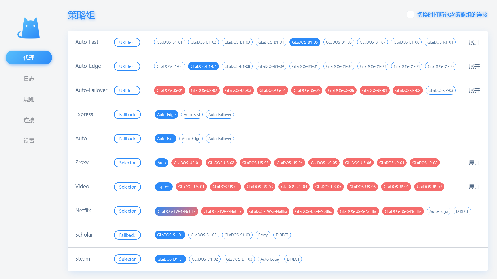

## Linux安装clash


### 安装

想要在linux下安装代理, 可以使用https://github.com/nelvko/clash-for-linux-install这个项目来一键安装clash

~~~shell
# 考虑到没有clash, 没有办法访问外网, 所以链接使用了gh-proxy.com来加速下载github
# 如果gh-proxy.com的github加速失效了, 可以访问https://ghproxy.link/来查看可用的连接
# 或者手动下载这个仓库
git clone --branch master --depth 1 https://gh-proxy.com/https://github.com/nelvko/clash-for-linux-install.git \
  && cd clash-for-linux-install \
  && sudo bash install.sh
~~~

上面安装的代理, 默认是使用mihomo内核的,  开启tun模式的时候会有点问题, 所以我们需要安装clash内核来进行代理

~~~shell
git clone --branch master --depth 1 https://gh-proxy.com/https://github.com/nelvko/clash-for-linux-install.git

cd clash-for-linux-install
# 删除掉resources/zip/下面的mihomo内核包, 此时没有内核包之后就会联网下载clash内核包
rm -rf resources/zip/mihomo-linux-amd64-v1-v1.19.12.gz
sudo bash install.sh
~~~

在安装的过程中, 会要求你输入订阅的地址

安装之后, 会自动通过systemctl设置开机自启动


### 命令一览

执行 `clashctl` 列出开箱即用的快捷命令。

```
$ clashctl
Usage:
    clashctl    COMMAND [OPTION]
    
Commands:
    on                   开启代理
    off                  关闭代理
    ui                   面板地址
    status               内核状况
    proxy    [on|off]    系统代理
    tun      [on|off]    Tun 模式
    mixin    [-e|-r]     Mixin 配置
    secret   [SECRET]    Web 密钥
    update   [auto|log]  更新订阅
```

💡`clashon` 等同于 `clashctl on`，`Tab` 补全更方便！


### 优雅启停

```
$ clashon
😼 已开启代理环境

$ clashoff
😼 已关闭代理环境
```

- 启停代理内核的同时，设置系统代理。
- 亦可通过 `clashproxy` 单独控制系统代理。


### Web 控制台

```
$ clashui
╔═══════════════════════════════════════════════╗
║                😼 Web 控制台                  ║
║═══════════════════════════════════════════════║
║                                               ║
║     🔓 注意放行端口：9090                      ║
║     🏠 内网：http://192.168.0.1:9090/ui       ║
║     🌏 公网：http://255.255.255.255:9090/ui   ║
║     ☁️ 公共：http://board.zash.run.place      ║
║                                               ║
╚═══════════════════════════════════════════════╝

$ clashsecret 666
😼 密钥更新成功，已重启生效

$ clashsecret
😼 当前密钥：666
```

- 通过浏览器打开 Web 控制台，实现可视化操作：**切换节点**、**查看日志**等。
- 若暴露到公网使用建议定期更换密钥。


### 更新订阅地址

```
$ clashupdate https://example.com
👌 正在下载：原配置已备份...
🍃 下载成功：内核验证配置...
🍃 订阅更新成功

$ clashupdate auto [url]
😼 已设置定时更新订阅

$ clashupdate log
✅ [2025-02-23 22:45:23] 订阅更新成功：https://example.com
```

- `clashupdate` 会记住上次更新成功的订阅链接，后续执行无需再指定。
- 可通过 `crontab -e` 修改定时更新频率及订阅链接。
- 通过配置文件进行更新：[pr#24](https://github.com/nelvko/clash-for-linux-install/pull/24#issuecomment-2565054701)


### `Tun` 模式

```
$ clashtun
😾 Tun 状态：关闭

$ clashtun on
😼 Tun 模式已开启
```

- 作用：<font color=red>实现本机及 `Docker` 等容器的所有流量路由到 `clash` 代理、DNS 劫持等。</font>
- 原理：[clash-verge-rev](https://www.clashverge.dev/guide/term.html#tun)、 [clash.wiki](https://clash.wiki/premium/tun-device.html)。
- 注意事项：[#100](https://github.com/nelvko/clash-for-linux-install/issues/100#issuecomment-2782680205)


### `Mixin` 配置

```
$ clashmixin
😼 less 查看 mixin 配置

$ clashmixin -e
😼 vim 编辑 mixin 配置

$ clashmixin -r
😼 less 查看 运行时 配置
```

- 持久化：将自定义配置项写入`Mixin`（`mixin.yaml`），而非原订阅配置（`config.yaml`），可避免更新订阅后丢失。
- 配置加载：代理内核启动时使用 `runtime.yaml`，它是订阅配置与 `Mixin` 配置的合并结果集，相同配置项以 `Mixin` 为准。
- 注意：因此直接修改 `config.yaml` 并不会生效。


### 卸载

```
sudo bash uninstall.sh
```

## CentOS使用Clash代理

~~~shell
# 下载clash
mkdir /opt/clash && cd /opt/clash
wget https://dl.ssrss.club/clash-linux-amd64-v1.9.0.gz --no-check-certificate
# 下载clash的订阅文件, 并重命名为config.yaml
wget -O /opt/clash/config.yaml "clash的订阅链接" --no-check-certificate
wget https://dl.ssrss.club/Country.mmdb --no-check-certificate
gunzip -c *.gz > clash && chmod +x clash

# 通过systemctl管理clash
cat > /usr/lib/systemd/system/clash.service <<'EOF'
[Unit]
Description=clash
[Service]
TimeoutStartSec=0
ExecStart=/opt/clash/clash -d /opt/clash
[Install]
WantedBy=multi-user.target
EOF

systemctl enable clash
systemctl start clash
~~~

查看clash的配置文件`config.yaml`


下面的`external-controller`表示外部控制的端口, 默认为`127.0.0.1:9090`, 可以修改为`0.0.0.1`, 表示任何人都可以连接到外部控制器

`secret`表示连接的密码

~~~shell
# 启动clash
systemctl start clash
systemctl enable clash

# 查看是否启动和监听端口
systemctl status clash
netstat -antp | grep 7890
netstat -antp | grep 9090
~~~

~~~shell
# 设置临时代理
export http_proxy=http://127.0.0.1:7890
export https_proxy=http://127.0.0.1:7890
# 取消临时代理
unset http_proxy
unset https_proxy

# 设置永久代理
vim /etc/profile
# 添加如下两行
export http_proxy=http://127.0.0.1:7890
export https_proxy=http://127.0.0.1:7890
~~~

~~~shell
# 测试
curl https://www.google.com.hk/
~~~


访问`http://clash.razord.top`, 可以通过这个界面来控制clash




