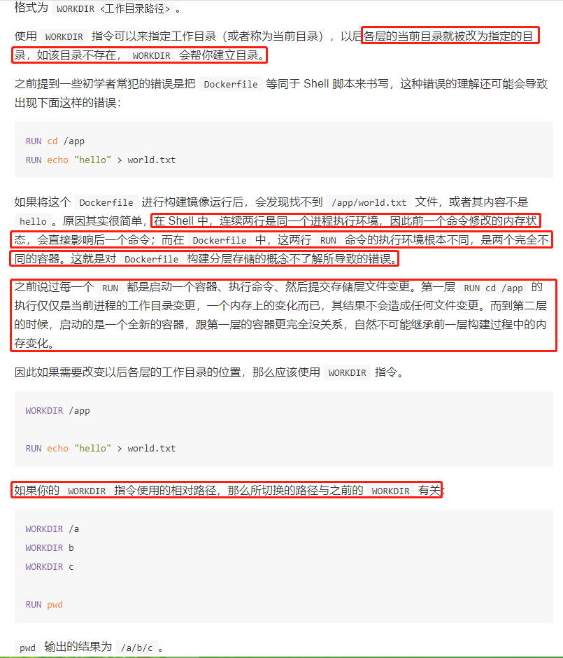
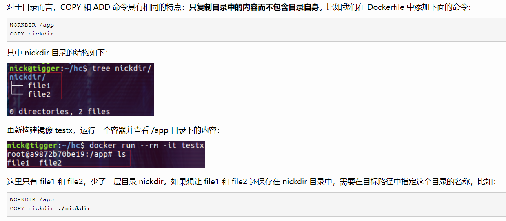
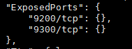

## Docker file

#### 基本结构

- 首行可以通过注释来指定解析器命令， 后续通过注释说明镜像的相关信息。 
- 主体部分首先使用FROM指令指明所基于的镜像名称， 接下来一般是使用LABEL指令说明维护者信息。
- 后面则是镜像操作指令， 例如RUN指令将对镜像执行跟随的命令。 每运行一条RUN指令，镜像添加新的一层， 并提交。 
- 最后是CMD指令， 来指定运行容器时的操作命令。  

#### FROM

指定所创建镜像的基础镜像

#### ENV

指定环境变量，定义环境变量的同时，可以引用已经定义的环境变量。

指定已有的环境变量会进行**覆盖**

~~~shell
ENV PATH /usr/local/bin:$PATH
~~~

由于镜像的层次文件系统，ENV定义的环境变量在后续层次中才能够被应用，示例如下：

```html
ENV abc=hello
ENV abc=bye def=$abc
ENV ghi=$abc
```

上述定义的结果中，def=hello，ghi=bye

#### LABEL

为生成的镜像添加元数据标签信息，可以在同一个LABEL中指定多个元数据标签

~~~shell
LABEL org.label-schema.schema-version="1.0" \
    org.label-schema.name="CentOS Base Image" \
    org.label-schema.vendor="CentOS" \
    org.label-schema.license="GPLv2" \
    org.label-schema.build-date="20181205"
~~~


#### RUN

格式：

- RUN <command>，在shell终端中运行命令，即/bin/sh -c
- RUN ["executable", "param1", "param2"]，指令会被解析为json数值，必须使用双引号。使用exec执行，不会启动shell环境。

每条 RUN 指令将在当前镜像基础上执行指定命令，并提交为新的镜像层 。 当命令较长时
可以使用＼来换行  

#### WORKDIR

指定工作目录，格式为WORKDIR <工作目录>，目录不存在会新建。




#### COPY、ADD

https://www.cnblogs.com/sparkdev/p/9573248.html

> 构建上下文

但我们使用docker build -t my-image:1.0.0 /home/tiger/test时，该命令将读取指定路径下（包括子目录）的 Dockerfile ，并**将该路径下所有数据作为上下文（ Context）发送给 Docker 服务端** 。 如果上下文过大， 会导致发送大量数据给服务端，延缓创建过程 。 因此除非是生成镜像所必需的文件，不然不要放到上下文路径下 。 

> **COPY 和 ADD 命令不能拷贝上下文之外的本地文件**。

对于 COPY 和 ADD 命令来说，如果要把本地的文件拷贝到镜像中，那么本地的文件必须是在上下文目录中的文件。其实这一点很好解释，因为在执行 build 命令时，**docker 客户端会把上下文中的所有文件发送给 docker daemon**。考虑 docker 客户端和 docker daemon 不在同一台机器上的情况，build 命令只能从上下文中获取文件

> 与WORKDIR协同工作

WORKDIR 命令为后续的 RUN、CMD、COPY、ADD 等命令配置工作目录。在设置了 WORKDIR 命令后，接下来的 COPY 和 ADD 命令中的相对路径就是相对于 WORKDIR 指定的路径。


> 只复制目录中的内容而不包含目录自身



> COPY

简单的将上下文的文件拷贝到镜像容器中，格式为 COPY <src> <dest>，支持Go风格的通配符。

~~~shell
# 因为COPY只拷贝文件而不拷贝目录，需要自己指定目录

COPY check* /testdir/           # 拷贝所有 check 开头的文件
COPY check?.log /testdir/       # ? 是单个字符的占位符，比如匹配文件
~~~

> ADD

ADD 命令可以完成 COPY 命令的所有功能，并且还可以完成两类超酷的功能：

- 自动解压压缩文件并把它们添加到镜像中

  ```shell
  WORKDIR /app
  # 自动解压文件
  ADD nickdir.tar.gz .
  ```

- 从 url 拷贝文件到镜像中
  这是一个更加酷炫的用法！但是在 docker [官方文档的最佳实践](https://docs.docker.com/develop/develop-images/dockerfile_best-practices/#add-or-copy)中却强烈建议不要这么用！！docker 官方建议我们当需要从远程复制文件时，最好使用 curl 或 wget 命令来代替 ADD 命令。原因是，当使用 ADD 命令时，会创建更多的镜像层，当然镜像的 size 也会更大

#### EXPOSE

EXPOSE <端口1> [<端口2>...]

> 两种作用

- 只是说明docker容器开放了哪些端口，并没有将这些端口实际开放了出来！更多的作用是告诉运维人员或容器操作人员该镜像会通过那个端口提供服务，只是一种说明。

  可以使用docker inspect查看EXPOSE将要暴露的端口。

  

- Dockerfile中声明了EXPOSE端口之后，我们使用-P命令进行随机映射的时候，会映射到EXPOSE声明的端口。比如说我们现在对一个tomcat容器进行EXPOSE 8080声明，那么我们进行-P随机映射的时候是会映射到8080端口。


#### USER

指定后续执行RUN，CMD，ENTRYPOINT时使用的用户，没有用户时需要新建用户。

~~~shell
RUN groupadd -g 1000 elasticsearch && useradd elasticsearch -u 1000 -g 1000

USER elasticsearch
~~~

在`docker run`中可以通过`-u`选项来覆盖USER指令的设置

~~~shell
docker run -it -u mysql newmysqldb /bin/bash
mysql@57cd57edba38:/$
~~~


#### ARG

定义构建镜像时需要的参数、用户可以在构建期间通过docker build --build-arg <varname>=<value>将其传递给构建器、如果指定了dockerfile中没有定义的参数，则发发出警告，提示构建参数未被使用。

> 默认值

~~~shell
FROM busybox
ARG user1=someuser
ARG buildno=1
~~~

如果`ARG`指令具有缺省值，并且在构建时未传递任何值，那么构建器将使用缺省值。

> 有效范围

**ARG变量定义从Dockerfile中定义的行开始生效**

**ARG指令定义变量之前、任何对该变量的引用返回的结果都是一个空字符串**。比如

~~~shell
FROM busybox
USER ${user:-some_user} # 定义了默认值为some_user
ARG user
USER $user
# ...
~~~

通过如下进行构建：

~~~shell
docker build --build-arg user=what_user .
~~~

第二行user=some_user, 此时user变量没有定义，所以使用了默认值. 第四行user=what_user，因为使用了通过命令行传递过来的值。


**一个ARG指令的有效范围在其定义的构建阶段内、如果要在多个阶段中都有效、则必须在每个阶段都饮食ARG指令**

```
FROM busybox
ARG SETTINGS=helloworld
RUN echo $SETTINGS
RUN echo $SETTINGS
```

第三行将输出helloworld，第三行输出空字符串。因为RUN命令添加了一层镜像，SETTINGS只在第三行命令中有效。

**使用ARG或ENV指令来指定RUN指令可用的变量，如果ARG和ENV同时指定了一个相同名称的变量、则ENV设置的变量会覆盖ARG设置的变量**


#### CMD、ENTRYPOINT

