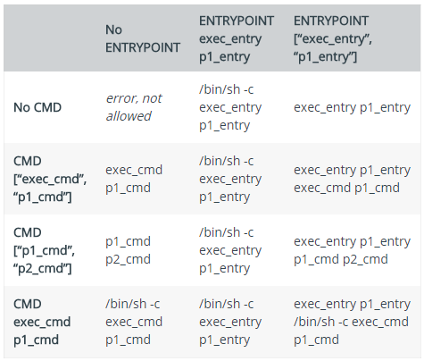

## Dockerfile

#### 基本结构

- 首行可以通过注释来指定解析器命令， 后续通过注释说明镜像的相关信息。 
- 主体部分首先使用FROM指令指明所基于的镜像名称， 接下来一般是使用LABEL指令说明维护者信息。
- 后面则是镜像操作指令， 例如RUN指令将对镜像执行跟随的命令。 每运行一条RUN指令，镜像添加新的一层， 并提交。 
- 最后是CMD指令， 来指定运行容器时的操作命令。  

#### FROM

指定所创建镜像的基础镜像

#### ENV

指定环境变量，定义环境变量的同时，可以引用已经定义的环境变量。

指定已有的环境变量会进行**覆盖**

~~~shell
ENV PATH /usr/local/bin:$PATH
~~~

由于镜像的层次文件系统，ENV定义的环境变量在后续层次中才能够被应用，示例如下：

```html
ENV abc=hello
ENV abc=bye def=$abc
ENV ghi=$abc
```

上述定义的结果中，def=hello，ghi=bye

#### LABEL

为生成的镜像添加元数据标签信息，可以在同一个LABEL中指定多个元数据标签

~~~shell
LABEL org.label-schema.schema-version="1.0" \
    org.label-schema.name="CentOS Base Image" \
    org.label-schema.vendor="CentOS" \
    org.label-schema.license="GPLv2" \
    org.label-schema.build-date="20181205"
~~~


#### RUN

格式：

- RUN <command>，在shell终端中运行命令，即/bin/sh -c
- RUN ["executable", "param1", "param2"]，指令会被解析为json数值，必须使用双引号。使用exec执行，不会启动shell环境。

每条 RUN 指令将在当前镜像基础上执行指定命令，并提交为新的镜像层 。 当命令较长时
可以使用＼来换行  

#### WORKDIR

指定工作目录，格式为WORKDIR <工作目录>，目录不存在会新建。


#### COPY、ADD

https://www.cnblogs.com/sparkdev/p/9573248.html

> 构建上下文

但我们使用docker build -t my-image:1.0.0 /home/tiger/test时，该命令将读取指定路径下（包括子目录）的 Dockerfile ，并**将该路径下所有数据作为上下文（ Context）发送给 Docker 服务端** 。 如果上下文过大， 会导致发送大量数据给服务端，延缓创建过程 。 因此除非是生成镜像所必需的文件，不然不要放到上下文路径下 。 

> **COPY 和 ADD 命令不能拷贝上下文之外的本地文件**。

对于 COPY 和 ADD 命令来说，如果要把本地的文件拷贝到镜像中，那么本地的文件必须是在上下文目录中的文件。其实这一点很好解释，因为在执行 build 命令时，**docker 客户端会把上下文中的所有文件发送给 docker daemon**。考虑 docker 客户端和 docker daemon 不在同一台机器上的情况，build 命令只能从上下文中获取文件

> 与WORKDIR协同工作

WORKDIR 命令为后续的 RUN、CMD、COPY、ADD 等命令配置工作目录。在设置了 WORKDIR 命令后，接下来的 COPY 和 ADD 命令中的相对路径就是相对于 WORKDIR 指定的路径。


> 只复制目录中的内容而不包含目录自身


> COPY

简单的将上下文的文件拷贝到镜像容器中，格式为 COPY <src> <dest>，支持Go风格的通配符。

~~~shell
# 因为COPY只拷贝文件而不拷贝目录，需要自己指定目录

COPY check* /testdir/           # 拷贝所有 check 开头的文件
COPY check?.log /testdir/       # ? 是单个字符的占位符，比如匹配文件
~~~

> ADD

ADD 命令可以完成 COPY 命令的所有功能，并且还可以完成两类超酷的功能：

- 自动解压压缩文件并把它们添加到镜像中

  ```shell
  WORKDIR /app
  # 自动解压文件
  ADD nickdir.tar.gz .
  ```

- 从 url 拷贝文件到镜像中
  这是一个更加酷炫的用法！但是在 docker [官方文档的最佳实践](https://docs.docker.com/develop/develop-images/dockerfile_best-practices/#add-or-copy)中却强烈建议不要这么用！！docker 官方建议我们当需要从远程复制文件时，最好使用 curl 或 wget 命令来代替 ADD 命令。原因是，当使用 ADD 命令时，会创建更多的镜像层，当然镜像的 size 也会更大

#### EXPOSE

EXPOSE <端口1> [<端口2>...]

> 两种作用

- 只是说明docker容器开放了哪些端口，并没有将这些端口实际开放了出来！更多的作用是告诉运维人员或容器操作人员该镜像会通过那个端口提供服务，只是一种说明。

  可以使用docker inspect查看EXPOSE将要暴露的端口。

  

- Dockerfile中声明了EXPOSE端口之后，我们使用-P命令进行随机映射的时候，会映射到EXPOSE声明的端口。比如说我们现在对一个tomcat容器进行EXPOSE 8080声明，那么我们进行-P随机映射的时候是会映射到8080端口。


#### USER

指定后续执行RUN，CMD，ENTRYPOINT时使用的用户，没有用户时需要新建用户。

~~~shell
RUN groupadd -g 1000 elasticsearch && useradd elasticsearch -u 1000 -g 1000

USER elasticsearch
~~~

在`docker run`中可以通过`-u`选项来覆盖USER指令的设置

~~~shell
docker run -it -u mysql newmysqldb /bin/bash
mysql@57cd57edba38:/$
~~~


#### ARG

定义构建镜像时需要的参数、用户可以在构建期间通过docker build --build-arg <varname>=<value>将其传递给构建器、如果指定了dockerfile中没有定义的参数，则发发出警告，提示构建参数未被使用。

> 默认值

~~~shell
FROM busybox
ARG user1=someuser
ARG buildno=1
~~~

如果`ARG`指令具有缺省值，并且在构建时未传递任何值，那么构建器将使用缺省值。

> 有效范围

**ARG变量定义从Dockerfile中定义的行开始生效**

**ARG指令定义变量之前、任何对该变量的引用返回的结果都是一个空字符串**。比如

~~~shell
FROM busybox
USER ${user:-some_user} # 定义了默认值为some_user
ARG user
USER $user
# ...
~~~

通过如下进行构建：

~~~shell
docker build --build-arg user=what_user .
~~~

第二行user=some_user, 此时user变量没有定义，所以使用了默认值. 第四行user=what_user，因为使用了通过命令行传递过来的值。


**一个ARG指令的有效范围在其定义的构建阶段内、如果要在多个阶段中都有效、则必须在每个阶段都饮食ARG指令**

```
FROM busybox
ARG SETTINGS=helloworld
RUN echo $SETTINGS
RUN echo $SETTINGS
```

第三行将输出helloworld，第三行输出空字符串。因为RUN命令添加了一层镜像，SETTINGS只在第三行命令中有效。

**使用ARG或ENV指令来指定RUN指令可用的变量，如果ARG和ENV同时指定了一个相同名称的变量、则ENV设置的变量会覆盖ARG设置的变量**


#### VOLUME

通过dockerfile的 VOLUME 指令可以在镜像中创建挂载点，这样只要通过该镜像创建的容器都有了挂载点。

**通过 VOLUME 指令创建的挂载点，无法指定主机上对应的目录，是自动生成的。**

```
#test
FROM ubuntu
MAINTAINER hello1
VOLUME ["/data1","/data2"]
```

上面的dockfile文件通过VOLUME指令指定了两个挂载点 /data1 和 /data2.

我们通过docker inspect 查看通过该dockerfile创建的镜像生成的容器，可以看到如下信息

```
    "Mounts": [
        {
            "Name": "d411f6b8f17f4418629d4e5a1ab69679dee369b39e13bb68bed77aa4a0d12d21",
            "Source": "/var/lib/docker/volumes/d411f6b8f17f4418629d4e5a1ab69679dee369b39e13bb68bed77aa4a0d12d21/_data",
            "Destination": "/data1",
            "Driver": "local",
            "Mode": "",
            "RW": true
        },
        {
            "Name": "6d3badcf47c4ac5955deda6f6ae56f4aaf1037a871275f46220c14ebd762fc36",
            "Source": "/var/lib/docker/volumes/6d3badcf47c4ac5955deda6f6ae56f4aaf1037a871275f46220c14ebd762fc36/_data",
            "Destination": "/data2",
            "Driver": "local",
            "Mode": "",
            "RW": true
        }
    ],
```

> 共享容器卷(挂载点)

~~~shell
docker run --name test1 -it myimage /bin/bash
~~~

上面命令中的 myimage是用前面的dockerfile文件构建的镜像。 这样容器test1就有了 /data1 和 /data2两个挂载点。

下面我们创建另一个容器可以和test1共享 /data1 和 /data2卷 ，这是在 docker run中使用 --volumes-from标记，如：

可以是来源不同镜像，如：

~~~shell
docker run --name test2 -it --volumes-from test1 ubuntu /bin/bash
~~~

也可以是同一镜像，如：

~~~shell
docker run --name test3 -it --volumes-from test1 myimage /bin/bash
~~~

上面的三个容器 test1 , test2 , test3 均有 /data1 和 /data2 两个目录，且目录中内容是共享的，任何一个容器修改了内容，别的容器都能获取到。


#### CMD、ENTRYPOINT

https://www.cnblogs.com/sparkdev/p/8461576.html

https://zhuanlan.zhihu.com/p/30555962

https://www.ctl.io/developers/blog/post/dockerfile-entrypoint-vs-cmd/

> CMD

CMD 指令的目的是：为容器提供默认的执行命令。
CMD 指令有三种使用方式，其中的一种是为 ENTRYPOINT 提供默认的参数：
**CMD ["param1","param2"]**
另外两种使用方式分别是 exec 模式和 shell 模式：
**CMD ["executable","param1","param2"]**  // 这是 exec 模式的写法，注意需要使用双引号。
**CMD command param1 param2**         // 这是 shell 模式的写法。
**注意命令行参数可以覆盖 CMD 指令的设置，但是只能是重写**，却不能给 CMD 中的命令通过命令行传递参数。
一般的镜像都会提供容器启动时的默认命令，但是有些场景中用户并不想执行默认的命令。用户可以通过命令行参数的方式覆盖 CMD 指令提供的默认命令。比如通过下面命令创建的镜像：

```
FROM ubuntu
CMD [ "top" ]
```

在启动容器时我们通过命令行指定参数 ps aux 覆盖默认的 top 命令：


从上图可以看到，命令行上指定的 ps aux 命令覆盖了 Dockerfile 中的 CMD [ "top" ]。实际上，**命令行上的命令同样会覆盖 shell 模式的 CMD 指令**。

> ENTRYPOINT

ENTRYPOINT 指令的目的也是为容器指定默认执行的任务。
ENTRYPOINT 指令有两种使用方式，就是我们前面介绍的 exec 模式和 shell 模式：
**ENTRYPOINT ["executable", "param1", "param2"]**  // 这是 exec 模式的写法，注意需要使用双引号。
**ENTRYPOINT command param1 param2**          // 这是 shell 模式的写法。
exec 模式和 shell 模式的基本用法和 CMD 指令是一样的，下面我们介绍一些比较特殊的用法。

**指定 ENTRYPOINT 指令为 exec 模式时，命令行上指定的参数会作为参数添加到 ENTRYPOINT 指定命令的参数列表中。**用下面的代码构建镜像 test1：

```
FROM ubuntu
ENTRYPOINT [ "top", "-b" ]
```

运行下面的命令：

```
$ docker run --rm test1 -c
```


我们在命令行上添加的参数被追加到了 top 命令的参数列表中。

**由 CMD 指令指定默认的可选参数：**

```
FROM ubuntu
ENTRYPOINT [ "top", "-b" ]
CMD [ "-c" ]
```

使用这段代码构建镜像 test2 并不带命令行参数启动容器：

```
$ docker run --rm test2
```

这时容器中运行的命令为：top -b -c。
如果我们指定命令行参数：

```
$ docker run --rm test2 -n 1
```

-n 1 会覆盖 通过 CMD [ "-c" ] 指定的参数，容器执行的命令为：top -b -n 1


注意上图的输出显示 -c 参数被覆盖了。

**指定 ENTRYPOINT 指令为 shell 模式时，会完全忽略命令行参数：**

```
FROM ubuntu
ENTRYPOINT echo $HOME 
```

把上面的代码编译成镜像 test2，分别不带命令行参数和使用命令行参数 ls 执行命令：


我们看到 ls 命令没有被执行，这说明命令行参数被 ENTRYPOINT 指令的 shell 模式忽略了。

**覆盖默认的 ENTRYPOINT 指令：**
ENTRYPOINT 指令也是可以被命令行覆盖的，只不过不是默认的命令行参数，而是需要显式的指定 --entrypoint 参数。比如我们通过下面的方式覆盖上面镜像中的 echo $HOME 命令：

```
$ docker run --rm --entrypoint hostname test2
```


这里我们使用 hostname 命令覆盖了默认的 echo $HOME 命令。

>  同时使用 CMD 和 ENTRYPOINT 的情况(搞不懂)

对于 CMD 和 ENTRYPOINT 的设计而言，多数情况下它们应该是单独使用的。当然，有一个例外是 CMD 为 ENTRYPOINT 提供默认的可选参数。
我们大概可以总结出下面几条规律：
   • 如果 ENTRYPOINT 使用了 shell 模式，CMD 指令会被忽略。
   • 如果 ENTRYPOINT 使用了 exec 模式，CMD 指定的内容被追加为 ENTRYPOINT 指定命令的参数。
   • 如果 ENTRYPOINT 使用了 exec 模式，CMD 也应该使用 exec 模式。
真实的情况要远比这三条规律复杂，好在 docker 给出了官方的解释，如下图所示：



> 启动时覆盖CMD、ENTRYPOINT

**命令行上的参数会覆盖EXEC和SHELL模式下的CMD命令**

**指定 ENTRYPOINT 指令为 shell 模式时，会完全忽略命令行参数**（上面已经说明）

**指定 ENTRYPOINT 指令为 exec 模式时，命令行上指定的参数会作为参数添加到 ENTRYPOINT 指定命令的参数列表中。**（上面已经说明）


比如, 我们写了一个这样的Dockerfile:

```docker
FROM ubuntu:trusty
CMD ping localhost 
```

如果根据这个Dockerfile构建一个新image, 名字叫demo

```bash
$ docker run -t demo
PING localhost (127.0.0.1) 56(84) bytes of data.
64 bytes from localhost (127.0.0.1): icmp_seq=1 ttl=64 time=0.051 ms
64 bytes from localhost (127.0.0.1): icmp_seq=2 ttl=64 time=0.038 ms
^C
--- localhost ping statistics ---
2 packets transmitted, 2 received, 0% packet loss, time 999ms
rtt min/avg/max/mdev = 0.026/0.032/0.039/0.008 ms
```

可以看出**ping**命令在docker启动后自己执行, 但是我们可以在命令行启动docker镜像时, 执行其他命令行参数, 覆盖默认的CMD

```bash
$ docker run demo hostname
6c1573c0d4c0
```

docker启动后, 并没有执行**ping**命令, 而是运行了**hostname**命令

> 使用shell还是Exec模式（永远使用exec模式）

ENTRYPOINT和CMD指令支持2种不同的写法: shell表示法和exec表示法. 下面的例子使用了shell表示法

**当使用shell表示法时, 命令行程序作为sh程序的子程序运行, docker用/bin/sh -c的语法调用**. 如果我们用docker ps命令查看运行的docker, 就可以看出实际运行的是/bin/sh -c命令

```text
$ docker run -d demo
15bfcddb11b5cde0e230246f45ba6eeb1e6f56edb38a91626ab9c478408cb615

$ docker ps -l
CONTAINER ID IMAGE COMMAND CREATED
15bfcddb4312 demo:latest "/bin/sh -c 'ping localhost'" 2 seconds ago 
```

我们再次运行demo镜像, 可以看出来实际运行的命令是/bin/sh -c 'ping localhost'.

虽然shell表示法看起来可以顺利工作, 但是它其实上有一些小问题存在. 如果我们用docker ps命令查看正在运行的命令, 会有下面的输出:

```text
$ docker exec 15bfcddb ps -f
UID PID PPID C STIME TTY TIME CMD
root 1 0 0 20:14 ? 00:00:00 /bin/sh -c ping localhost
root 9 1 0 20:14 ? 00:00:00 ping localhost
root 49 0 0 20:15 ? 00:00:00 ps -f 
```

PID为1的进程并不是在Dockerfile里面定义的ping命令, 而是/bin/sh命令. **如果从外部发送任何POSIX信号到docker容器, 由于/bin/sh命令不会转发消息给实际运行的ping命令, 则不能安全得关闭docker容器**(参考更详细的文档:[Gracefully Stopping Docker Containers](https://link.zhihu.com/?target=https%3A//www.ctl.io/developers/blog/post/gracefully-stopping-docker-containers/)).

一个更好的选择是用exec表示法:

```docker
CMD ["executable","param1","param2"] 
```

CMD指令后面用了类似于JSON的语法表示要执行的命令. 这种用法告诉docker不需要调用/bin/sh执行命令.

我们修改一下Dockerfile, 改用exec表示法:

```docker
FROM ubuntu:trusty
CMD ["/bin/ping","localhost"] 
```

重新build镜像, 用docker ps命令检查效果:

```text
$ docker build -t demo .
[truncated]

$ docker run -d demo
90cd472887807467d699b55efaf2ee5c4c79eb74ed7849fc4d2dbfea31dce441

$ docker ps -l
CONTAINER ID IMAGE COMMAND CREATED
90cd47288780 demo:latest "/bin/ping localhost" 4 seconds ago 
```

现在没有启动/bin/sh命令, 而是直接运行/bin/ping命令, ping命令的PID是1. **无论你用的是ENTRYPOINT还是CMD命令, 都强烈建议采用exec表示法,**

> 选择CMD还是ENTRYPOINT

大部分Linu发行版的基础镜像里面调用CMD命令, 指定容器启动后执行/bin/sh或/bin/bash. 这样镜像启动默认进入交互式的shell

3个不同的Linux镜像(ubuntu, busybox, debian)都在Dockerfile的最后调用 CMD '/bin/bash'

启动Linux发行版的基础container后, 默认调用shell程序, 符合大多数人的习惯.

**因为CMD命令很容易被docker run命令的方式覆盖, 所以, 如果你希望你的docker镜像的功能足够灵活, 建议在Dockerfile里调用CMD命令.**

**相反, ENTRYPOINT的作用不同, 如果你希望你的docker镜像只执行一个具体程序, 不希望用户在执行docker run的时候随意覆盖默认程序. 建议用ENTRYPOINT.**

## 数据卷

#### docker volume create

~~~shell
# 创建并使用
$ docker volume create hello
hello
$ docker run -d -v hello:/world ubuntu:latest ls /world
~~~


#### -mount和-v的区别

https://docs.docker.com/engine/reference/commandline/service_create/#add-bind-mounts-volumes-or-memory-filesystems

The `--mount` flag allows you to mount volumes, host-directories and `tmpfs` mounts in a container.

The `--mount` flag supports most options that are supported by the `-v` or the `--volume` flag, but uses a different syntax

```
docker run -t -i --mount type=bind,src=/data,dst=/data busybox sh

docker run -t -i -v /data:/data busybox sh
```

Docker supports three different kinds of mounts, which allow containers to read from or write to files or directories, either on the host operating system, or on memory filesystems. These types are *data volumes* (often referred to simply as volumes), *bind mounts*, *tmpfs*, and *named pipes*.

| Option                                   | Required                         | Description                                                  |
| :--------------------------------------- | :------------------------------- | :----------------------------------------------------------- |
| **type**                                 |                                  | The type of mount, can be either `volume`, `bind`, `tmpfs`, or `npipe`. Defaults to `volume` if no type is specified.`volume`: mounts a [managed volume](https://docs.docker.com/engine/reference/commandline/volume_create/) into the container.`bind`: bind-mounts a directory or file from the host into the container.`tmpfs`: mount a tmpfs in the container`npipe`: mounts named pipe from the host into the container (Windows containers only). |
| **src** or **source**                    | for `type=bind` and `type=npipe` | `type=volume`: `src` is an optional way to specify the name of the volume (for example, `src=my-volume`). If the named volume does not exist, it is automatically created. If no `src` is specified, the volume is assigned a random name which is guaranteed to be unique on the host, but may not be unique cluster-wide. A randomly-named volume has the same lifecycle as its container and is destroyed when the *container* is destroyed (which is upon `service update`, or when scaling or re-balancing the service)`type=bind`: `src` is required, and specifies an absolute path to the file or directory to bind-mount (for example, `src=/path/on/host/`). An error is produced if the file or directory does not exist.`type=tmpfs`: `src` is not supported. |
| **dst** or **destination** or **target** | yes                              | Mount path inside the container, for example `/some/path/in/container/`. If the path does not exist in the container's filesystem, the Engine creates a directory at the specified location before mounting the volume or bind mount. |
| **readonly** or **ro**                   |                                  | The Engine mounts binds and volumes `read-write` unless `readonly` option is given when mounting the bind or volume. Note that setting `readonly` for a bind-mount does not make its submounts `readonly` on the current Linux implementation. See also `bind-nonrecursive`.`true` or `1` or no value: Mounts the bind or volume read-only.`false` or `0`: Mounts the bind or volume read-write. |

## Docker Compose V3 模板文件常用命令

默认的模板文件名称为 `docker-compose.yml`，格式为 YAML 格式。

`docker-compose.yml`版本需要在第一行指定，这里是`version: "3"`

```yml
version: "3"

services:
  webapp:
    image: examples/web
    ports:
      - "80:80"
    volumes:
      - "/data"
```


#### build

指定 `Dockerfile` 所在文件夹的路径（可以是绝对路径，或者相对 `docker-compose.yml 文件的路径`）。 `Compose` 自动查找`Dockerfile`文件，并利用这个路径上下文自动构建这个镜像，然后使用这个镜像。

~~~yaml
version: '3'
services:
  webapp:
    build: ./dir
~~~

也可以使用 `context` 指令指定 `Dockerfile` 所在文件夹的路径。

使用 `dockerfile` 指令指定 `Dockerfile` 文件名。(类似于`docker build -f filename`)

使用 `arg` 指令指定构建镜像时的变量。(类似于`docker build --build-args varname=value`)

~~~yaml
version: "3.8"
services:
  webapp:
    build:
      # 指定构建路径上下文，默认使用这个路径下的Dockerfile文件
      context: ./dir
      # 指定Dockerfile文件名
      dockerfile: Dockerfile-alternate
      args:
        - arg1: 1
        # boolean需要使用引号
        - arg2: "true"
~~~

同时指定`build`和`image`，Compose将会使用`image`所指定的名字命名构建好的镜像。

下面示例命名构建好的镜像name=webapp，tag=1.0.0

~~~yaml
version: "3.8"
services:
  webapp:
    build:./dir
    image: webapp:1.0.0
~~~

#### command

覆盖容器启动后默认执行的命令。类似于`docker run`后面指定运行的命令行参数。

```yaml
version: "3.8"
services:
  webapp:
    build:./dir
    command: echo "hello world"
```

#### container_name

指定容器名称。默认将会使用 `项目名称_服务名称_序号` 这样的格式。

```yaml
version: "3.8"
services:
  webapp:
    build:./dir
    command: echo "hello world"
```

#### depends_on

解决容器的依赖、启动先后的问题。以下例子中会先启动 `redis` `db` 再启动 `web`

```yaml
version: '3'
services:
  web:
    build: .
    depends_on:
      - db
      - redis
  redis:
    image: redis
  db:
    image: postgres
```

注意：`web` 服务不会等待 `redis` `db` 「完全启动」之后才启动。

#### env_file

从文件中获取环境变量，可以为单独的文件路径或列表。

如果通过 `docker-compose -f FILE` 方式来指定 Compose 模板文件，则 `env_file` 中变量的路径会基于模板文件路径。

如果有变量名称与 `environment` 指令冲突，则按照惯例，以后者为准。

```yaml
env_file:  
  - ./common.env  
  - ./apps/web.env  
  - /opt/secrets.env
```

环境变量文件中每一行必须符合格式，支持 `#` 开头的注释行。

```
# common.env: Set development environment
PROG_ENV=development
```

#### environment

设置环境变量。你可以使用数组或字典两种格式。

只给定名称的变量会自动获取运行 Compose 主机上对应变量的值，可以用来防止泄露不必要的数据。（类似于`docker run -e env_name=value`）

```yaml
environment:  
  RACK_ENV: development  
  SESSION_SECRET:
environment:  
  - RACK_ENV=development  
  - SESSION_SECRET
```

如果变量名称或者值中用到 `true|false，yes|no` 等表达 [布尔](https://yaml.org/type/bool.html) 含义的词汇，最好放到引号里，避免 YAML 自动解析某些内容为对应的布尔语义。

#### expose

暴露端口，但不映射到宿主机，只被连接的服务访问。

仅可以指定内部端口为参数。( 类似于dockerfile中的`EXPOSE`命令 )

```
expose:
 - "3000"
 - "8000"
```

#### image

指定为镜像名称或镜像 ID。如果镜像在本地不存在，`Compose` 将会尝试拉取这个镜像。(类似于`docker run`中指定运行的镜像)

```yaml
version: '3'
services:
  web:
    image: ubuntu
```

#### labels

为容器添加 Docker 元数据（metadata）信息。例如可以为容器添加辅助说明信息。(类似于dockerfile中的`LABEL`命令)

```yaml
labels:
  com.startupteam.description: "webapp for a startup team"
  com.startupteam.department: "devops department"
  com.startupteam.release: "rc3 for v1.0"
```

#### ports

暴露端口信息。

使用宿主端口：容器端口 `(HOST:CONTAINER)` 格式，或者仅仅指定容器的端口（宿主将会随机选择端口）都可以。

```yaml
ports:
 - "3000"
 - "8000:8000"
 - "127.0.0.1:8001:8001"
```

*注意：当使用* *`HOST:CONTAINER`* *格式来映射端口时，如果你使用的容器端口小于 60 并且没放到引号里，可能会得到错误结果，因为* *`YAML`* *会自动解析* *`xx:yy`* *这种数字格式为 60 进制。为避免出现这种问题，建议数字串都采用引号包括起来的字符串格式。*

#### volumes

数据卷所挂载路径设置。可以设置为宿主机路径(`HOST:CONTAINER`)或者数据卷名称(`VOLUME:CONTAINER`)，并且可以设置访问模式 （`HOST:CONTAINER:ro`）。

该指令中路径支持相对路径。

```yaml
volumes:
 - /var/lib/mysql
 - cache/:/tmp/cache
 - ~/configs:/etc/configs/:ro
```

如果路径为数据卷名称，必须在文件中配置数据卷。

```yaml
version: "3"
services:  
  my_src:    
    image: mysql:8.0    
    volumes:      
      - mysql_data:/var/lib/mysql
      
volumes:  mysql_data:
```

