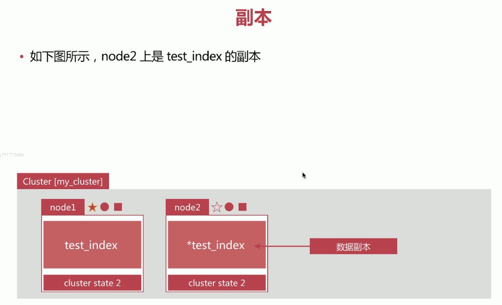

## elasticsearch安装注意

#### 设置kibana汉化

1. 进入`kibana安装目录\x-pack\plugins\translations\translations`，确认该目录下存在汉化包，一个Json文件 `zh-CN.json
   
2. 打开`kibana安装目录\config\kibana.yml`
   找到`i18n.locale`，如果没找到自行添加如下文本

   ~~~yml
   i18n:
     locale: "zh-CN"
   ~~~

#### 设置elasticsearch跨域

1. 因为elasticsearch-head默认的端口为9100，而elasticseache默认端口为9200。当es-head调用es时会产生跨域问题。

2. 在`elasticsearch安装目录\config\elasticsearch.yml`, 在其中添加

   ~~~yml
   http:
     cors:
       enabled: true
       allow-origin: "*"
   ~~~

#### 安装ik分词器

1. 使用浏览器访问https://github.com/medcl/elasticsearch-analysis-ik/releases/download/v7.5.1/elasticsearch-analysis-ik-7.5.1.zip，将版本号该为对应的es的版本号，就可以开始下载。版本不一致会导致该es的cmd闪退。

2. 解压该文件到`es安装目录\plugins\ik`

   

   

## ES核心概念
**ES和关系型数据库对比**：

> elasticsearch是面向文档的，一切都是json，关系型数据库和es客观对比

| Relational DB | ElasticSearch                           |
| ------------- | --------------------------------------- |
| 数据库        | 索引（indices）                         |
| 表            | types（7.x中过期，8.x中弃用，了解即可） |
| 行            | documents                               |
| 字段          | fields                                  |

es集群中可以包含多个indices，每个indices中可以包含多个types，每个types下包含多个documents，每个documents中又包含多个fields

**物理设计：**

es在后台把每个索引分成多个分片，每个分片可以在集群中的不同服务器间迁移。

一个人就是一个集群！默认的集群名称就是elasticsearch

**逻辑设计：**

一个索引类型中，包含多个文档，比如docment1，docment2. 当我们索引一篇文档时，可以通过这样的顺序找到他：索引 》 类型 》 文档ID。通过这个组合我们就能找到具体的某个文档。Note：ID不必是整数，实际上它是一个字符串。

> 文档

之前说es是面向文档的，那么索引和搜索数据的最小单位就是doc， es中doc有几个重要属性：

- 自我包含：一篇文档同时包含字段和对应的值，也就是同时包含key-value。
- 可以是层次型的，一个文档中可以包含自文档，复杂的逻辑就是这么来的。
- 灵活的结构。文档不依赖预先定义的模式，在关系型数据库中，要提前定义字段才能使用，在es中，对于字段是非常灵活的，有时候我们可以忽略该字段，或者动态的添加一个新的字段。

尽管我们可以随意新增和忽略某个字段，但是，每个字段的类型非常重要，比如一个年龄字段类型，可以是字符串也可以是整形。因为es会保存字段和类型之间的映射以其他设置。这种映射具体到每个映射的每种类型，这也是为什么在es中，类型有时候也成为映射类型。

> 索引

索引是一个非常大的文档集合。索引存储了映射类型的字段和其他设置。然后他们被存储在各个分片上。

**物理设计：节点和分片如何工作**

一个集群至少一个节点，而一个节点就是一个es进程，节点可以有多个索引默认。每个索引是多个分片（primary shard，又称主分片）构成的，每个主分片又会有多个副本（replica shard，又称复制分片）。

上图是一个有3个节点的集群，可以看到每个主分片和对应的复制分片都不会再同一个节点内，这样有利于某个节点挂掉，数据也会至于丢失。这一点和kafka相似，每个topic由多个分区构成，分区又有副本。同时分区和副本不会在同一个机器上。

> 倒排索引

## ik分词器

#### ik_smart

最粗粒度划分，分词不会重复，例如`中华人民共和国人民大会堂`会分词为`中华人民共和国`和`人民大会堂`

#### ik_max_word

最细粒度划分，会尽可能多的获取词汇的组合，例如中华人民共和国，会被划分为`中华人民共和国`和`中华人民`和`中华`和`华人`和`人民共和国`和`人民`和`共和国`等等

#### ik分词器配置扩展字典

- 进入到`es安装目录\plugins\ik\config`目录下面

- 新建自己的词典（`建议复制之前的dic文件进行使用，否则容易导致文件无法识别从而扩展失败`），kuang.dic, 并且在kuang.dic中输入自己想要扩展的词汇例如`狂神说`

  

- 编辑`es安装目录\plugins\ik\config`目录下的`IKAnalyzer.cfg.xml`,在其中配置自己新建的词典。多个词典配置多个`ext_dic`选项

  

- 重启es，发送请求，ik分词器已经能够识别狂神说这个单词了。图片中两个请求结果一致。

  

#### ES Rest风格说明

| Method |                     url地址                     |         描述         |
| :----: | :---------------------------------------------: | :------------------: |
|  PUT   |     localhost:9200/索引名称/类型名称/文档id     | 创建文档，指定文档id |
|  POST  |        localhost:9200/索引名称/类型名称         | 创建文档，随机文档id |
|  POST  | localhost:9200/索引名称/类型名称/文档id/_update |       修改文档       |
| DELETE |     localhost:9200/索引名称/类型名称/文档id     |       删除文档       |
|  GET   |     localhost:9200/索引名称/文档名称/文档id     |  通过文档id查询文档  |
|  POST  |    localhost:9200/索引名称/类型名称/_search     |     查询所有数据     |

> 新建/覆盖一个文档，没有索引会自动创建

~~~
PUT /{index}/_doc/{id}
{
  ...upsert的数据
}
~~~

> 修改一个文档

~~~
POST /{index}/_doc/_update
{
  "doc":{
    需要修改的数据，未修改的数据保持原样
  }
}
~~~

> 删除索引

~~~
DELETE {index}
~~~

> 查询文档

~~~

~~~

 # Elastic Stack

## Elastic Search和Kibana入门

#### Elasticsearch 配置说明

**可以在启动时通过-E来设置启动参数**

例如bin/elasticsearch -Ehttp.port=19200，修改http.port为19200

~~~yml
# 集群名称，以此作为判断同一集群的判断条件, 默认为elasticsearch
cluster.name: elasticsearch

# 当前节点在集群中的名称，默认随机分配
node.name: node-1

# 当前节点数据保存地址，同一台机器上的不同es节点的数据保存地址不能相同，默认为$ES_HOME/data
path.data: /path/to/data
# 当前节点日志地址, 默认为$ES_HOME/logs
path.logs: /path/to/logs

# 对外网络发布的地址, 默认为127.0.0.1
network.host: 127.0.0.1
# 当前节点提供restful api的端口， 默认为9200
http.port: 9200
~~~

#### Elasticsearch的Development和Production模式

es在启动时将会做启动前的检查，如磁盘是否够用，内存是否够用，版本是否足够高等

- 在Development模式下，不满足的条件会以**warning**的形式打印
- 在Production模式下，不满足的条件会以**error**的形式打印，并**启动失败**

es将根据elasticsearch.yml中的network.host属性进行区分

- network.host为127.0.0.1，为Development模式
- network.host为当前实际地址，为Production模式

#### ES本地快速部署集群

1. 切换到$ES_HOME目录，也就是es的安装目录

2. 开启三个cmd，分别执行（windows）：

   - bin\elasticsearch.bat -Ehttp.port=9200 -Epath.data=node1
   - bin\elasticsearch.bat -Ehttp.port=8200 -Epath.data=node2
   - bin\elasticsearch.bat -Ehttp.port=7200 -Epath.data=node3

   **path.data必须不一样，因为不同es的path.data一样会导致启动失败**

   **http.port必须不一样，因为一样会导致端口占用**

   

   

   

3. 浏览器访问http://localhost:9200/_cat/nodes?v

   

4. 查看$ES_HOME, 自动创建了node1，node2，node3文件夹，这三个文件夹会自动创建**$ES_HOME**目录下

   

#### ES 简单CRUD

**在7.x版本中，type已经移除了，只能为_doc**

> Create

~~~shell
# account为index，person为type，1为id。（5.x版本）
# 在7.x版本中，type已经移除了，只能为_doc
POST /account/person/1
{
  "name": "zhansan",
  "lastname": "Doe",
  "description": "admin root"
}
~~~

> Read

~~~shell
# account为index，person为type，1为id。（5.x版本）
# 在7.x版本中，type已经移除了，只能为_doc
GET /account/person/1
~~~

> Update

~~~shell
# account为index，person为type，1为id。（5.x版本）
# 
POST /account/person/1/_update
{
  "doc":{
    "description": "admin adminstrator"
  }
}

# 部分修改，修改后为
{
    "name" : "zhansan",
    "lastname" : "Doe",
    "description" : "admin adminstrator"
  }
~~~

> Delete

~~~shell
# 删除文档
DELETE /account/_doc/1
~~~

#### ES Document

> 文档数据类型

Document就是一个Json Object，有多个字段组成，字段的常见数据类型如下：

- 字符串：text，keyword
- 数字类型：long，integer，short，byte，double，float，half_float，scaled_float
- 布尔：boolean
- 日期：date
- 二进制：binary
- 范围类型：integer_range，float_range，long_range，double_range，date_range

> 每个文档的都有唯一id标识，类型mysql中的primary key

- 自行指定
- es自动生成

> Document元数据，用于标注文档的相关信息

- _index：文档所在的索引名
- _type：文档所在的类型名
- _id：文档唯一id
- \_uid：组合id，由\_type和\_id组成(6.x不在起作用，同_id一样)
- _source：文档的原始json数据
- _all：整合所有字段内容到该字段中，默认禁止使用

> Doucment API

#### ES Index

> Index API

#### 正排索引和倒排索引

> 倒排索引的结构

倒排索引的结构：

- 单词词典（Term Dictionary）：一般使用B+Tree进行实现
  - 记录所有文档的单词，一般都比较大
  - 记录单词到倒排列表的关联信息
- 倒排列表（Posting List）记录单词对应的文档集合，由倒排索引项（Posting）组成，倒排索引项有如下几种类型
  - 文档id，用于获取原生信息
  - 单词频率（TF），记录该单词在该文档中出现的次数，用于后续相关性算分
  - 位置（Position），记录单词在文档中的分词位置，用于做词语搜索
  - 偏移（Offset），记录单词在文档的开始和结束位置，用于做高亮显示

举例：有如下的3个文档

通过上面三个文档进行分词，然后构造出单词词典，**使用B+树进行实现**

然后构造出倒排列表，以”搜索引擎“这个单词为例：

总的结构如下：

## Mapping设置

#### Mapping作用

## ES分布式

#### es如何通过相同的cluster_name就可以组成一个集群? 网络广播?不同机器上的es要如何组成集群

#### es如何同步主分片和副本分片，宕机是否会导致数据丢失？

#### 新增机器和减少机器是否会导致重新分片？

