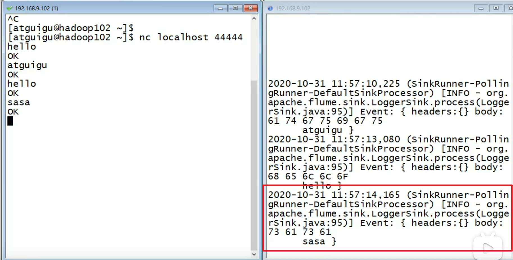
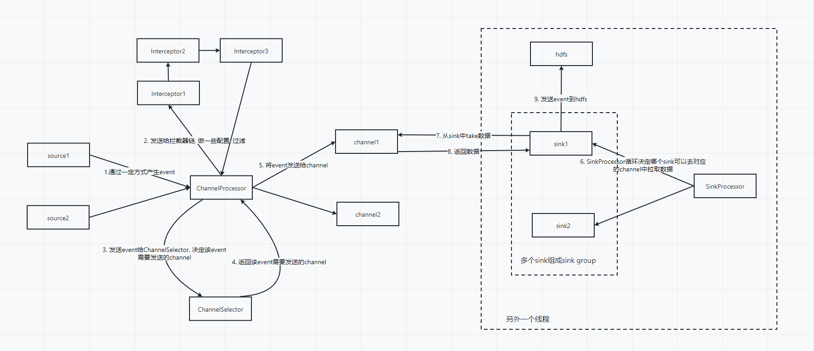
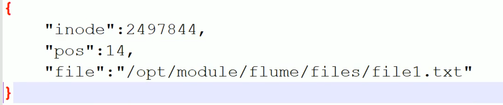
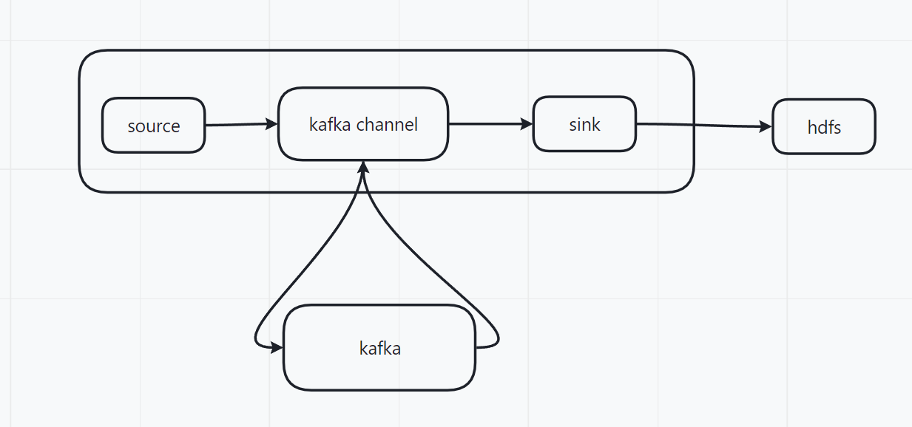
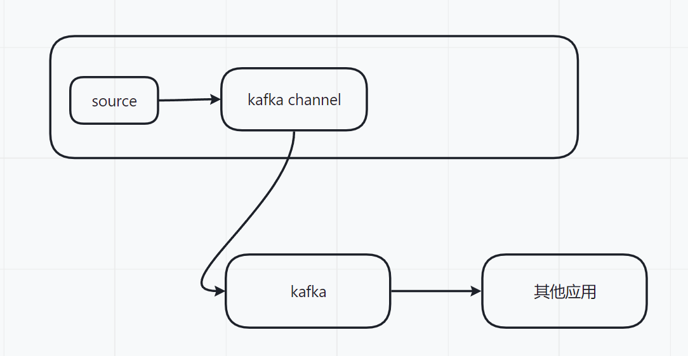
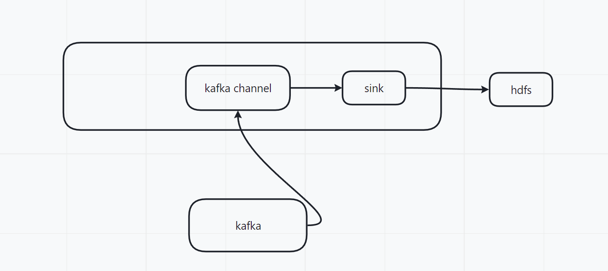

#### flume安装

1. 安装flume需要安装java

2. 下载安装包到/opt/software下

3. 解压到/opt/module下

   ~~~shell
   tar -zxf /opt/software/apacheflume-1.9.0-bin.tar.gz -C /opt/module/
   ~~~

4. 如果该机器上面有hadoop, 并且配置了HADOOP_HOME, 需要删除flume/lib目录下面的guava包, 该包会与hadoop使用的guava包冲突


#### flume HelloWorld案例

1. 在flume目录下创建job目录, 用于存放任务的配置文件

2. 在job目录下创建一个helloworld的配置文件, 该配置文件描述了如何配置source,sink, channel

   ~~~properties
   # 定义了一个agent名为a1, a1的sources为r1, sink为k1, channels为c1. source,sink,channel都可以定义多个, 使用空格分割
   # 一台机器上面只能同时启动一个重名的agent
   a1.sources = r1
   a1.sinks = k1
   a1.channels = c1
   
   # 定义了r1的各种属性
   a1.sources.r1.type = netcat
   a1.sources.r1.bind = localhost
   a1.sources.r1.port = 44444
   
   # 定义k1的各种属性
   a1.sinks.k1.type = logger
   
   # 定义了c1的各种属性
   # 使用内存作为event的缓存
   a1.channels.c1.type = memory
   # 最大缓存1000个event
   a1.channels.c1.capacity = 1000
   # 定义一批次最多接收100个event
   a1.channels.c1.transactionCapacity = 100
   
   # 将source, sink与channel进行绑定. 同一个source可以绑定多个channel, 一个sink只能绑定一个channel
   a1.sources.r1.channels = c1
   a1.sinks.k1.channel = c1
   ~~~

3. 执行命令启动一个agent

   ~~~shell
   # -c指定flume的配置文件, 该目录下包含flume-env.sh和可能的log4j.properties
   # -n指定本次启动的agent的名称
   # -f指定本次启动的agent的配置文件
   bin/flume-ng agent -c conf/ -n a1 -f job/helloworld -Dflume.root.logger=INFO,console
   ~~~

4. 启动一个nc客户端, 连接flume启动的nc服务器, 并通过客户端发送消息给flume

   ~~~shell
   nc localhost 44444
   ~~~

5. 查看flume的控制台打印的日志

   

> 遇到问题

如果遇到flume启动失败, 可能是内存不够, 可以修改flume-env.sh, 添加

~~~shell
export JAVA_OPTS="-Xms100m -Xmx2000m -Dcom.sun.management.jmxremote"
~~~


#### flume概述

> 基本概念

flume的基本逻辑就是source-channel-sink

- source端通过监控日志文件, 从网络接口中接收等方式生成event, 传递给channel。
- channel可以理解为一个队列, 用于缓存event。
- 在另外一个线程中, sink从channel中主动拉取数据， 并输出到hdfs， hbase，本地文件等地方。
- event包含有头信息和信息体, 头信息是一个map结构, 包含一些关于event的属性. 信息体中包含event的具体的数据

一个flume任务被称为一个agent， agent的名称在单台机器上必须唯一。

一个source可以有多个channel， 一个channel可以有多个sink， 一个sink只能对应一个channel。

多个任务之间可以通过特定的sink, source进行首尾连接， 组成拓扑结构。


> 详细执行步骤

1. Source通过监控本地日志文件, 或者从网络接收等方式生成event, 并发送给ChannelProcessor
2. ChannelProcessor将event发送给Interceptor拦截器链, 在这一步可以给event添加一些消息头或者做过滤, 脱敏
3. ChannelProcessor将拦截器链返回的event发送给ChannelSelector, 返回该event需要发送的Channel的列表(因为一个source可以对应多个channel, 所以必须通过ChannelSelector来决定发送到哪些Channel上面)。随后将event发送给channel
4. channel可以理解为一个队列, 队列中的event等待sink来拉取
5. SinkProcessor运行在另外一个线程, 并管理着一个或者多个sink(多个sink组成一个sink group). SinkProcessor一直循环决定哪个sink在本次循环的时候可以从channel中拉取数据
6. SinkProcessor选择的sink中channel中拉取event后， 发送到目的地（写入数据库， 写入hdfs等）




#### Source的分类

> 使用ExecSource监控单个文件中的追加内容

ExecSource的作用是使用linux命令来监控单个文件的追加内容, 不能监控多个文件, 也不能够支持断点续传

~~~properties
a2.sources = r2
a2.sinks = k2
a2.channels = c2

# 指定source的类型为exec
a2.sources.r2.type = exec
# 指定用以监控的linux命令
a2.sources.r2.command = tail -F /opt/module/hive/logs/hive.log

# Describe the sink
a2.sinks.k2.type = logger

# 定义了c1的各种属性
# 使用内存作为event的缓存
a1.channels.c1.type = memory
# 最大缓存1000个event
a1.channels.c1.capacity = 1000
# 定义一批次最多接收100个event 
a1.channels.c1.transactionCapacity = 100

# Bind the source and sink to the channel
a2.sources.r2.channels = c2
a2.sinks.k2.channel = c2
~~~

> 使用SpooldirSource监控指定文件夹中的新文件

使用SpooldirSource可以指定文件夹, 然后同步文件夹中所有的新文件, 同步完成的文件被标记为.COMPLETED结尾, 缺点是不能同步追加的内容。

~~~properties
a3.sources = r3
a3.sinks = k3
a3.channels = c3

# Describe/configure the source
a3.sources.r3.type = spooldir
# 指定需要同步的文件夹
a3.sources.r3.spoolDir = /opt/module/flume/upload
# 同步完成的文件将会添加上该后缀
a3.sources.r3.fileSuffix = .COMPLETED
a3.sources.r3.fileHeader = true
#忽略所有以.tmp 结尾的文件，不上传
a3.sources.r3.ignorePattern = ([^ ]*\.tmp)

# Describe the sink
a3.sinks.k3.type = hdfs
a3.sinks.k3.hdfs.path =
hdfs://hadoop102:9820/flume/upload/%Y%m%d/%H
#上传文件的前缀
a3.sinks.k3.hdfs.filePrefix = upload-
#是否按照时间滚动文件夹
a3.sinks.k3.hdfs.round = true
#多少时间单位创建一个新的文件夹
a3.sinks.k3.hdfs.roundValue = 1
#重新定义时间单位
a3.sinks.k3.hdfs.roundUnit = hour
#是否使用本地时间戳
a3.sinks.k3.hdfs.useLocalTimeStamp = true
#积攒多少个 Event 才 flush 到 HDFS 一次
a3.sinks.k3.hdfs.batchSize = 100
#设置文件类型，可支持压缩
a3.sinks.k3.hdfs.fileType = DataStream
#多久生成一个新的文件
a3.sinks.k3.hdfs.rollInterval = 60
#设置每个文件的滚动大小大概是 128M
a3.sinks.k3.hdfs.rollSize = 134217700
#文件的滚动与 Event 数量无关
a3.sinks.k3.hdfs.rollCount = 0

# Use a channel which buffers events in memory
a3.channels.c3.type = memory
a3.channels.c3.capacity = 1000
a3.channels.c3.transactionCapacity = 100

# Bind the source and sink to the channel
a3.sources.r3.channels = c3
a3.sinks.k3.channel = c3
~~~


> 使用TaildirSource监控多个文件并支持断点续传

TaildirSource能够监控多个文件, 并且支持断点续传, 其断点续传功能是指定一个文件, 然后在该文件中记录下已经同步的文件名和同步位置

同步位置文件内容如下, 通过inode和fileName唯一确定一个文件, 所以重命名文件会导致重新同步:



~~~properties
a3.sources = r3
a3.sinks = k3
a3.channels = c3


# Describe/configure the source
a3.sources.r3.type = TAILDIR
# 指定用于保存同步记录的文件
a3.sources.r3.positionFile = /opt/module/flume/tail_dir.json
a3.sources.r3.filegroups = f1 f2
a3.sources.r3.filegroups.f1 = /opt/module/flume/files/.*file.*
a3.sources.r3.filegroups.f2 = /opt/module/flume/files2/.*log.*


# Describe the sink
a3.sinks.k3.type = hdfs
a3.sinks.k3.hdfs.path =
hdfs://hadoop102:9820/flume/upload2/%Y%m%d/%H
#上传文件的前缀
a3.sinks.k3.hdfs.filePrefix = upload
#是否按照时间滚动文件夹
a3.sinks.k3.hdfs.round = true
#多少时间单位创建一个新的文件夹
a3.sinks.k3.hdfs.roundValue = 1
#重新定义时间单位
a3.sinks.k3.hdfs.roundUnit = hour
#是否使用本地时间戳
a3.sinks.k3.hdfs.useLocalTimeStamp = true
#积攒多少个 Event 才 flush 到 HDFS 一次
a3.sinks.k3.hdfs.batchSize = 100
#设置文件类型，可支持压缩
a3.sinks.k3.hdfs.fileType = DataStream
#多久生成一个新的文件
a3.sinks.k3.hdfs.rollInterval = 60
#设置每个文件的滚动大小大概是 128M
a3.sinks.k3.hdfs.rollSize = 134217700
#文件的滚动与 Event 数量无关
a3.sinks.k3.hdfs.rollCount = 0


# Use a channel which buffers events in memory
a3.channels.c3.type = memory
a3.channels.c3.capacity = 1000
a3.channels.c3.transactionCapacity = 100


# Bind the source and sink to the channel
a3.sources.r3.channels = c3
a3.sinks.k3.channel = c3
~~~


#### Sink的分类

> hdfs sink

- 使用hdfs sink需要本机安装有hadoop, 并配置环境变量, 因为flume需要使用hadoop的jar包
- hdfs sink能够支持按时间进行目录或者文件的滚动

hdfs sink能够配置的属性如下

| Name                   | Default      | Description                                                  |
| :--------------------- | :----------- | :----------------------------------------------------------- |
| **channel**            | –            |                                                              |
| **type**               | –            | `hdfs`                                                       |
| **hdfs.path**          | –            | 写入文件的hdfs路径                                           |
| hdfs.filePrefix        | FlumeData    | 文件前缀                                                     |
| hdfs.fileSuffix        | –            | 文件后缀                                                     |
| hdfs.inUsePrefix       | –            | 正在写入的文件的前缀                                         |
| hdfs.inUseSuffix       | `.tmp`       | 正在写入的文件的后缀                                         |
| hdfs.emptyInUseSuffix  | false        | If `false` an `hdfs.inUseSuffix` is used while writing the output. After closing the output `hdfs.inUseSuffix` is removed from the output file name. If `true` the `hdfs.inUseSuffix` parameter is ignored an empty string is used instead. |
| hdfs.rollInterval      | 30           | Number of seconds to wait before rolling current file (0 = never roll based on time interval) |
| hdfs.rollSize          | 1024         | File size to trigger roll, in bytes (0: never roll based on file size) |
| hdfs.rollCount         | 10           | Number of events written to file before it rolled (0 = never roll based on number of events) |
| hdfs.idleTimeout       | 0            | Timeout after which inactive files get closed (0 = disable automatic closing of idle files) |
| hdfs.batchSize         | 100          | number of events written to file before it is flushed to HDFS |
| hdfs.codeC             | –            | Compression codec. one of following : gzip, bzip2, lzo, lzop, snappy |
| hdfs.fileType          | SequenceFile | File format: currently `SequenceFile`, `DataStream` or `CompressedStream` (1)DataStream will not compress output file and please don’t set codeC (2)CompressedStream requires set hdfs.codeC with an available codeC |
| hdfs.maxOpenFiles      | 5000         | Allow only this number of open files. If this number is exceeded, the oldest file is closed. |
| hdfs.minBlockReplicas  | –            | Specify minimum number of replicas per HDFS block. If not specified, it comes from the default Hadoop config in the classpath. |
| hdfs.writeFormat       | Writable     | Format for sequence file records. One of `Text` or `Writable`. Set to `Text` before creating data files with Flume, otherwise those files cannot be read by either Apache Impala (incubating) or Apache Hive. |
| hdfs.threadsPoolSize   | 10           | Number of threads per HDFS sink for HDFS IO ops (open, write, etc.) |
| hdfs.rollTimerPoolSize | 1            | Number of threads per HDFS sink for scheduling timed file rolling |
| hdfs.kerberosPrincipal | –            | Kerberos user principal for accessing secure HDFS            |
| hdfs.kerberosKeytab    | –            | Kerberos keytab for accessing secure HDFS                    |
| hdfs.proxyUser         |              |                                                              |
| hdfs.round             | false        | Should the timestamp be rounded down (if true, affects all time based escape sequences except %t) |
| hdfs.roundValue        | 1            | Rounded down to the highest multiple of this (in the unit configured using `hdfs.roundUnit`), less than current time. |
| hdfs.roundUnit         | second       | The unit of the round down value - `second`, `minute` or `hour`. |
| hdfs.timeZone          | Local Time   | Name of the timezone that should be used for resolving the directory path, e.g. America/Los_Angeles. |
| hdfs.useLocalTimeStamp | false        | Use the local time (instead of the timestamp from the event header) while replacing the escape sequences. |
| hdfs.closeTries        | 0            | Number of times the sink must try renaming a file, after initiating a close attempt. If set to 1, this sink will not re-try a failed rename (due to, for example, NameNode or DataNode failure), and may leave the file in an open state with a .tmp extension. If set to 0, the sink will try to rename the file until the file is eventually renamed (there is no limit on the number of times it would try). The file may still remain open if the close call fails but the data will be intact and in this case, the file will be closed only after a Flume restart. |
| hdfs.retryInterval     | 180          | Time in seconds between consecutive attempts to close a file. Each close call costs multiple RPC round-trips to the Namenode, so setting this too low can cause a lot of load on the name node. If set to 0 or less, the sink will not attempt to close the file if the first attempt fails, and may leave the file open or with a ”.tmp” extension. |
| serializer             | `TEXT`       | Other possible options include `avro_event` or the fully-qualified class name of an implementation of the `EventSerializer.Builder` interface. |
| serializer.*           |              |                                                              |


#### Channel的分类

> KafkaChannel的使用

https://flume.apache.org/releases/content/1.10.0/FlumeUserGuide.html#kafka-channel

使用KakfaChannel可以有多种场景

1. 使用Flume source和sink, 从外部接收, 使用kafka作为存储, 使用sink写入到其他系统中

   

2. 使用source和interceptor, 不使用sink, 他可以将Flume事件直接写入kafka中, 给其他程序使用

   

   ~~~properties
   a1.sources = r1
   a1.channels = c1
   
   #描述source
   a1.sources.r1.type = TAILDIR
   a1.sources.r1.filegroups = f1
   a1.sources.r1.filegroups.f1 = /opt/module/applog/log/app.*
   a1.sources.r1.positionFile = /opt/module/flume/taildir_position.json
   
   #描述channel
   a1.channels.c1.type = org.apache.flume.channel.kafka.KafkaChannel
   a1.channels.c1.kafka.bootstrap.servers = hadoop102:9092,hadoop103:9092
   a1.channels.c1.kafka.topic = topic_log
   a1.channels.c1.parseAsFlumeEvent = false
   
   #绑定source和channel以及sink和channel的关系
   a1.sources.r1.channels = c1
   ~~~

   

3. 使用Flume sink, 不使用source, 他可以从kafka中接收事件, 然后写入到其他应用中, 如hdfs

   


#### Sink的分类


#### Sink和Source中的事务


#### 一些Interceptor的使用


#### 多个flume任务之间的拓扑结构


#### ChannelSelector分类

https://flume.apache.org/releases/content/1.10.0/FlumeUserGuide.html#flume-channel-selectors

1. ReplicatingChannelSelector

   默认的Selector, 会将event同时发送给所有的channel

   ~~~properties
   a1.sources = r1
   a1.channels = c1 c2 c3
   a1.sources.r1.selector.type = replicating # 指定selector类型为ReplicatingChannelSelector
   a1.sources.r1.channels = c1 c2 c3    # 指定source绑定的channel, 空格隔开
   a1.sources.r1.selector.optional = c3 # 指定可选的channel, 发送到c3失败不会导致事务提交失败
   ~~~

2. LoadBalancingChannelSelector

   轮询或者随机发送给channel

   ~~~properties
   a1.sources = r1
   a1.channels = c1 c2 c3 c4
   a1.sources.r1.channels = c1 c2 c3 c4
   a1.sources.r1.selector.type = load_balancing # 指定selector类型为LoadBalancingChannelSelector
   a1.sources.r1.selector.policy = round_robin # 指定发送方式为轮询, 随机发送使用random
   ~~~

3. MultiplexingChannelSelector

   根据event中的头信息来判断发送给哪个channel

   ~~~properties
   a1.sources = r1
   a1.channels = c1 c2 c3 c4
   a1.sources.r1.selector.type = multiplexing # 指定selector类型为MultiplexingChannelSelector
   a1.sources.r1.selector.header = state # 指定通过event头信息中的state来判断发送给哪个channel
   a1.sources.r1.selector.mapping.CZ = c1 # 如果state的值为CZ, 发送给c1
   a1.sources.r1.selector.mapping.US = c2 c3 # 如果state的值为US, 发送给c2和c3
   a1.sources.r1.selector.default = c4       # 如果是其他的话, 发送给c4
   ~~~

4. 自定义ChannelSelector

   自定义ChannelSelector需要继承AbstractChannelSelector抽象类, 或者实现ChannelSelector接口


#### SinkProcessor的分类

1. DefaultSinkProcessor

   默认的SinkProcessor, 该SinkProcessor只能管理一个sink, 所以该sink会一直从对应的channel中拉取数据

2. FailoverSinkProcessor

   该SinkProcessor管理多个sink, 多个sink之间组成sink group. sink之间会有优先级, 优先级高的sink从对应的channel中拉取数据发送到目的地, 如果发送失败就选择低优先级的sink去对应的channel中拉取数据

   该SinkProcessor的设计思路就是当一个sink发送失败后换另外的sink发送, 容错

   ```properties
   a1.sink = k1 k2
   a1.sinkgroups = g1 # 指定sinkgroup
   a1.sinkgroups.g1.sinks = k1 k2 # 指定sinkgroup中的sink
   a1.sinkgroups.g1.processor.type = failover # 指定sinkgroup使用的sinkProcessor
   a1.sinkgroups.g1.processor.priority.k1 = 5 # 指定每个sink的优先级
   a1.sinkgroups.g1.processor.priority.k2 = 10 
   a1.sinkgroups.g1.processor.maxpenalty = 10000 # sink失败后会将其加入黑名单， 指定多久将失败的sink中黑名单中释放，单位毫秒。sink失败后， 不会选择黑名单中的sink进行重试
   
   a1.sinks.k1.channel = c1 # 指定k1 k2对应的channel
   a1.sinks.k2.channel = c1
   ```

3. LoadbalancingSinkProcessor

   该SinkProcessor以随机或者轮询的方式指定sink去拉取数据， 如果指定的sink拉取数据或者发送到目的地失败， 将会选择下一个sink再次拉取数据。

   ~~~properties
   a1.sink = k1 k2
   a1.sinkgroups = g1 # 指定sinkgroup
   a1.sinkgroups.g1.sinks = k1 k2 # 指定sinkgroup中的sink
   a1.sinkgroups.g1.processor.type = load_balance # 指定sinkgroup使用的sinkProcessor
   a1.sinkgroups.g1.processor.selector = random # 指定轮询的方式， random或者round_robin或者自定义的实现AbstractSinkSelector的类
   a1.sinkgroups.g1.processor.backoff = true # 是否将失败的sink加入到黑名单中，黑名单中的sink不会参加选择
   a1.sinkgroups.g1.processor.selector.maxTimeOut = 10000 #  如果sink失败，则接收器将被列入黑名单，退出周期从250毫秒开始，然后成指数增加，直到达到10秒。 在这一点之后，每次写入失败时，接收器都会退出10秒，直到能够成功写入数据，此时退避重置为0
   
   a1.sinks.k1.channel = c1 # 指定k1 k2对应的channel
   a1.sinks.k2.channel = c1
   ~~~

   

4. 自定义SinkProcessor

   不支持自定义SinkProcessor


#### 自定义ChannelSelector

1. 添加maven

   ~~~xml
           <dependency>
               <groupId>org.apache.flume</groupId>
               <artifactId>flume-ng-core</artifactId>
               <version>1.10.0</version>
           </dependency>
   ~~~

   

2. 自定义ChannelSelector需要继承AbstractChannelSelector抽象类, 或者实现ChannelSelector接口

   ~~~java
   /**
    * 实现一个ChannelSelector, 实现将event发送给所有channel的功能
    */
   public class CustomChannelSelector extends AbstractChannelSelector{
   
       private final List<Channel> requiredChannels = new ArrayList<>();
       private final List<Channel> optionalChannels = new ArrayList<>();
   
       /**
        * 根据event返回该event需要发送到的required channel
        * 如果event发送到required channel失败, 将会导致事务失败
        */
       @Override
       public List<Channel> getRequiredChannels(Event event) {
           return requiredChannels;
       }
   
       /**
        * 根据event返回该event需要发送到的optional channel
        * 如果event发送到optional channel失败, 失败将会被忽略
        */
       @Override
       public List<Channel> getOptionalChannels(Event event) {
           return optionalChannels;
       }
   
       /**
        * 从context中获取配置文件中的配置
        * 根据这里的逻辑, 配置文件应该这样配置
        * a1.sources = r1
        * a1.channels = c1 c2 c3 c4
        * a1.sources.r1.selector.type = com.tiger.flume.CustomChannelSelector
        * a1.sources.r1.selector.optional = c1 c2
        * a1.sources.r1.selector.required = c3 c4
        */
       @Override
       public void configure(Context context) {
           Map<String, Channel> channelNameMap = getChannelNameMap();
   
           String optionalList = context.getString("optional");
           if (optionalList != null && !"".equals(optionalList)) {
               String[] channels = optionalList.split(" ");
               Arrays.asList(channels).forEach(channel -> {
                   optionalChannels.add(channelNameMap.get(channel));
               });
           }
   
           String requiredList = context.getString("required");
           if (requiredList != null && !"".equals(requiredList)) {
               String[] channels = requiredList.split(" ");
               Arrays.asList(channels).forEach(channel -> {
                   requiredChannels.add(channelNameMap.get(channel));
               });
           }
       }
   }
   ~~~

   

#### 自定义Source

1. 添加maven

   ~~~xml
           <dependency>
               <groupId>org.apache.flume</groupId>
               <artifactId>flume-ng-core</artifactId>
               <version>1.10.0</version>
           </dependency>
   ~~~

2. 继承AbstractSource

   ~~~java
   public class CustomSource extends AbstractSource implements Configurable, PollableSource {
   
       // 定义配置文件将来要读取的字段
       private Long delay;
       private String field;
   
       // 初始化配置信息
       @Override
       public void configure(Context context) {
           delay = context.getLong("delay");
           field = context.getString("field", "Hello!");
       }
   
       @Override
       public Status process() throws EventDeliveryException {
           try {
               // 创建事件头信息
               HashMap<String, String> hearderMap = new HashMap<>();
               // 创建事件
               SimpleEvent event = new SimpleEvent();
               // 循环封装事件
               for (int i = 0; i < 5; i++) {
                   // 给事件设置头信息
                   event.setHeaders(hearderMap);
                   // 给事件设置内容
                   event.setBody((field + i).getBytes());
                   // 将事件写入 channel
                   getChannelProcessor().processEvent(event);
                   Thread.sleep(delay);
               }
           } catch (Exception e) {
               e.printStackTrace();
               return Status.BACKOFF;
           }
           return Status.READY;
       }
   
       @Override
       public long getBackOffSleepIncrement() {
           return 0;
       }
   
       @Override
       public long getMaxBackOffSleepInterval() {
           return 0;
       }
   }
   ~~~

3. 打包并放置在FLUME_HOME/lib目录下面

4. 在配置文件中使用自定义source

   ~~~properties
   a1.sources = r1
   a1.sinks = k1
   a1.channels = c1
   
   # 使用指定source
   a1.sources.r1.type = com.tiger.flume.CustomSource
   a1.sources.r1.delay = 1000
   a1.sources.r1.field = atguigu
   
   a1.sinks.k1.type = logger
   
   a1.channels.c1.type = memory
   a1.channels.c1.capacity = 1000
   a1.channels.c1.transactionCapacity = 100
   
   a1.sources.r1.channels = c1
   a1.sinks.k1.channel = c1
   ~~~


#### 自定义Sink


#### 自定义Interceptor

1. 添加maven

   ~~~xml
           <dependency>
               <groupId>org.apache.flume</groupId>
               <artifactId>flume-ng-core</artifactId>
               <version>1.10.0</version>
           </dependency>
   ~~~

2. 继承Interceptor

   ~~~java
   public class CustomInterceptor implements Interceptor {
   
       @Override
       public void initialize() {
   
       }
   
       // 单个事件拦截
       @Override
       public Event intercept(Event event) {
           // 1.获取事件中的头信息
           Map<String, String> headers = event.getHeaders();
           // 2.获取事件中的 body 信息
           String body = new String(event.getBody());
           // 3.根据 body 中是否有"atguigu"来决定添加怎样的头信息
           if (body.contains("atguigu")) {
               // 4.添加头信息
               headers.put("type", "first");
           } else {
               // 4.添加头信息
               headers.put("type", "second");
           }
           return event;
       }
   
       // 批量事件拦截
       @Override
       public List<Event> intercept(List<Event> events) {
           events.forEach(this::intercept);
           return events;
       }
   
       @Override
       public void close() {}
   
       public static class Builder implements Interceptor.Builder {
           @Override
           public Interceptor build() {
               return new CustomInterceptor();
           }
   
           @Override
           public void configure(Context context) {
               
           }
       }
   }
   ~~~

3. 打包并放置在FLUME_HOME/lib目录下面

4. 在配置文件中使用拦截器

   ~~~properties
   a1.sources = r1
   a1.sinks = k1
   a1.channels = c1
   
   a1.sources.r1.type = netcat
   a1.sources.r1.bind = localhost
   a1.sources.r1.port = 44444
   
   # 指定r1的拦截器
   a1.sources.r1.interceptors = i1
   # 指定i1拦截器的类型
   a1.sources.r1.interceptors.i1.type =
   com.tiger.flume.CustomInterceptor$Builder
   
   
   a1.sinks.k1.type = logger
   
   a1.channels.c1.type = memory
   a1.channels.c1.capacity = 1000
   a1.channels.c1.transactionCapacity = 100
   
   a1.sources.r1.channels = c1
   a1.sinks.k1.channel = c1
   ~~~

   

