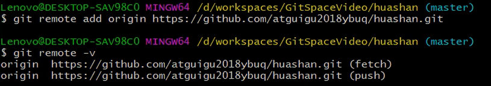
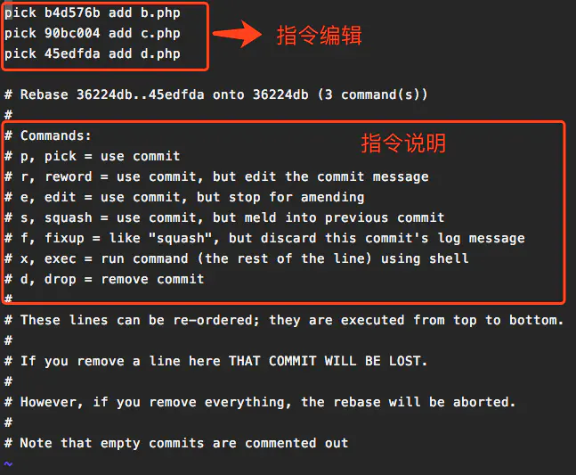
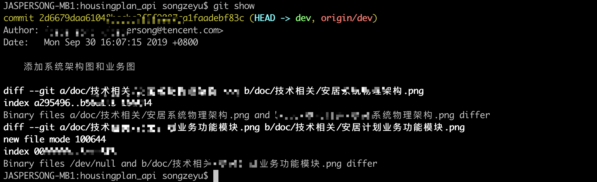

### Git


团队内部合作:


跨团队合作:


   


1. 查看历史记录

   - git log

     ```shell
     会以下面的格式输出所有的日志（我当前的git仓库只有三个提交）。如果日志特别多的话，在git bash中，按向下键来查看更多，按q键退出查看日志。
     
     $ git log
     commit c08099d1cf05fdc541752b049a91b92bdcf78a12
     Author: zdk <zdk@menhoo.com>
     Date:   Mon Jun 19 23:08:07 2017 +0800
     
         add hello.txt to git rep
     
     commit 723687a41685667a01dbd6254eb148d19501c3f1
     Author: zdk <zdk@menhoo.com>
     Date:   Sun Jun 18 22:27:29 2017 +0800
     
         add c.txt
     
     commit 1a29bde9519195f14e98270c29d125e9d18b8d87
     Author: zdk <zdk@menhoo.com>
     Date:   Sun Jun 11 22:40:21 2017 +0800
     
         新增了a.txt和b.txt文件
     
     ```

   - git log --online

     ```shell
     --oneline参数可以将每条日志的输出为一行，如果日志比较多的话，用这个参数能够使结果看起来比较醒目。
     
     $ git log --oneline
     c08099d add hello.txt to git rep
     723687a add c.txt
     1a29bde 新增了a.txt和b.txt文件
     ```

   - git log -[length] 显示最近几次提交的版本的信息

     ```shell
     只显示自己两次提交的信息
     $ git log -2 --oneline
     eb595c0 (HEAD -> master) test
     51510ef test
     ```

   - git reflog

     

2. 搜索git日志

   - 通过作者搜索
     有时候会从提交记录中查看一下自己（或某个人）的某次提交，git log命令可以很快地检索出这些信息

     ```shell
     $ git log --author yourname
     可以筛选出yourname用户提交的所有日志。这里的yourname可以包含通配符，从Author: zdk <zdk@menhoo.com>的信息中匹配信息。
     ```

   - 通过提交关键字搜索

     ```shell
     $ git log --grep keywords
     可以从提交的关键字中抓取匹配的commit项。
     ```

     

   - 通过文件名搜索
     有时候，我们想查某个文件的所有修改记录，可以根据文件名来过滤一下只跟这个文件有关的提交，就可以使用-p参数

     ```shell
     git log -p -- readme.md
     
     注意，这个--后面跟的是完整的文件名的相对地址，不是模糊匹配。如果你的文件的相对地址是config/my.config的话，你就需要用下面的命令
     
     git log -p -- config/my.config
     ```

3. 版本前进后退

   - 使用版本索引号

     ```shell
     git reset --hard [版本索引号]
     ```

   - 使用^

     ```shell
     git reset --hard HEAD^
     一个^表示后退一步
     ```

   - 使用~

     ```shell
     git reset --hard HEAD~n
     n表示回退的步数
     ```

4. 分支操作

   - 查看分支 

     - git branch

       ```shell
       $ git branch
       * apple
         master
       ```

     - git branch -v

       ```shell
       $ git branch -v
       * apple  e46d188 change apple.txt
         master b831f21 add helloworld.txt
       
       ```

     - **git branch -a**

       ```shell
       $ git branch -a
       * apple
         master
         remotes/origin/HEAD -> origin/master
         remotes/origin/apple
         remotes/origin/master
       ```

       

   - 创建分支 git branch [branch name]

   - **新分支创建的同时切换分支**

     ```undefined
     git checkout -b newBranch
     ```

     该命令相当于下面这两条命令的执行结果：

     ```undefined
     1. git branch newBranch 
     2. git checkout newBranch
     ```

   - 切换分支 git checkout [branch name]

   - 合并分支 

     - 第一步: 切换到接受合并的分支上, 即想要将dev分支合并到master上, 就要切换到master上

       git checkout [branch_name]

     - 第二步: 执行合并命令

       git merge [branch_name]

5. 合并分支并解决冲突

   将master合并到hot_fix分支上产生冲突, 此时hot_fix显示正在合并中

   

   调用git status显示有未合并的文件

   

   切换到good.txt中, 显示冲突

   

   **修改good.txt解决冲突后将其git add good.txt到暂存区, 表示该文件中的冲突已解决**

   

   **将所有文件中的冲突解决后调用git commit -m 'commit message' 完成合并**

6. 查看和设置远程仓库别名

   - 查看远程库别名

     git remote -v

     

   - 设置远程库别名

     git remote add [远程库别名] [远程库地址]

     

   - 删除远程仓库别名

     git remote rm [远程仓库别名]

7. **设置命令别名**

   git config --global  alias.[命令别名] [原命令]

   ```shell
   git config --global alias.st status
   这样设置之后只要输入git st 就相当于输入了git status
   ```

8. **将远程git仓库里的指定分支拉取到本地（本地不存在的分支）**

   - 当我想从远程仓库里拉取一条本地不存在的分支时：

     ```
     git checkout -b 本地分支名 origin/远程分支名
     ```

     这个将会自动创建一个新的本地分支，并与指定的远程分支关联起来。

     例如远程仓库里有个分支dev2,我本地没有该分支，我要把dev2拉到我本地：

     

     若成功，将会在本地创建新分支dev2,并自动切到dev2上。

     如果出现提示：

     ```
     fatal: Cannot update paths and switch to branch 'dev2' at the same time.
     Did you intend to checkout 'origin/dev2' which can not be resolved as commit?
     ```

     表示拉取不成功。我们需要先执行

     ```
     git fetch
     ```

     然后再执行

     ```shell
     git checkout -b 本地分支名 origin/远程分支名
     ```

   - 从远程仓库上拉取到本地并新建分支

     ```undefined
     git branch newBranch origin/newBranch
     ```

9. **分支建立追踪关系**

   在某些场合，Git会自动在本地分支与远程分支之间，建立一种追踪关系(tracking)。比如，在`git clone`的时候，所有本地分支默认与远程主机的同名分支，建立追踪关系，也就是说，本地的`master`分支自动”追踪”`origin/master`分支。

   Git也允许手动建立追踪关系。

   ```shell
   $ git branch --set-upstream master origin/next
   ```

   上面命令指定`master`分支追踪`origin/next`分支。

   如果当前分支与远程分支存在追踪关系，`git pull`就可以省略远程分支名。

   ```shell
   $ git pull origin
   ```

   上面命令表示，本地的当前分支自动与对应的`origin`主机”追踪分支”(remote-tracking branch)进行合并。

   如果当前分支只有一个追踪分支，连远程主机名都可以省略。

   ```shell
   $ git pull
   ```

   上面命令表示，当前分支自动与唯一一个追踪分支进行合并。

10. 推送到远程库

    - 推送当前分支到远程仓库并建立追踪关系git push --set-upstram [远程仓库] [分支名]

### git push

语法:

```shell
git push [远程主机名] [本地分支名]:[远程分支名]
```

示例:

```shell
#将当前分支推送到origin的master分支上, 如果master没有就新建
git push origin master

#省略本地分支名, 相当于推送了一个空的分支到master, 相当于删除master
git push origin :master
#等同于
git push --delete master

#如果当前分支有upstream可以省略远程分支名
git push origin

#如果当前分支只有一个upstream可以使用
git push
```

参数使用:

```shell
# [-u | --upstream]
#推送当前分支到origin的master上并设置分支
git push -u origin master

# [-d | --delete]
#删除origin上的master分支
git push --delete origin master
```


### git pull

语法:

```shell
 git pull [远程主机名] [远程分支名]:[本地分支名]
 #与当前分支合并可以省略本地分支名
```

示例:

```shell
#拉取master与当前分支合并
git pull origin master

#当前分支有upstream
git pull origin

#当前分支只有一个upstream
```


### git push 和 git pull默认行为

#### git push

通常对于一个本地的新建分支，例如`git checkout -b develop`, 在develop分支commit了代码之后，如果直接执行`git push`命令，develop分支将不会被push到远程仓库. <font color='red'>我们至少需要显式指定将要推送的分支名</font>，例如`git push origin develop`，才能将本地新分支推送到远程仓库。


当我们通过显式指定分支名进行初次push操作后，本地有了新的commit，此时执行`git push`命令会有什么效果呢？


如果你未曾改动过git config中的`push.default`属性，根据我们使用的git不同版本（Git 2.0之前或之后），`git push`通常会有两种截然不同的行为:

1. develop分支中本地新增的commit被push到远程仓库
2. push失败，并收到git如下的警告

```
fatal: The current branch new has no upstream branch.To push the current branch and set the remote as upstream, use     git push --set-upstream origin develop
```

为什么git版本不同会有两种不同的push行为？

因为在[git的全局配置中，有一个push.default](http://git-scm.com/docs/git-config)属性，其决定了`git push`操作的默认行为。在Git 2.0之前，这个属性的默认被设为'matching'，2.0之后则被更改为了'simple'。

我们可以通过`git version`确定当前的git版本（如果小于2.0，更新是个更好的选择），通过`git config --global push.default 'option'`改变push.default的默认行为（或者也可直接编辑~/.gitconfig文件）。

**push.default** 有以下几个可选值：
**nothing, current, upstream, simple, matching**

其用途分别为：

| 选项         | 用途                                                         |
| ------------ | ------------------------------------------------------------ |
| **nothing**  | push操作无效，除非显式指定远程分支，例如`git push origin develop`（我觉得。。。可以给那些不愿学git的同事配上此项）。 |
| **simple**   | simple和upstream是相似的，只有一点不同，simple必须保证本地分支和它的远程upstream分支同名，否则会拒绝push操作。 |
| **upstream** | push当前分支到它的upstream分支上（这一项其实用于经常从本地分支push/pull到同一远程仓库的情景，这种模式叫做central workflow）。 |
| **matching** | push所有本地和远程两端都存在的同名分支。                     |
| **current**  | push当前分支到远程同名分支，如果远程同名分支不存在则自动创建同名分支。 |

因此如果我们使用了git2.0之前的版本，push.default = matching，git push后则会推送当前分支代码到远程分支，而2.0之后，push.default = simple，如果没有指定当前分支的upstream分支，就会收到上文的fatal提示。


#### git pull

`git pull`的默认行为和`git push`完全不同。当我们执行`git pull`的时候，实际上是做了`git fetch + git merge`操作，fetch操作将会更新本地仓库的remote tracking，也就是refs/remotes中的代码，并不会对refs/heads中本地当前的代码造成影响。

当我们进行pull的第二个行为merge时，对git来说，如果我们没有设定当前分支的upstream，它并不知道我们要合并哪个分支到当前分支，所以我们需要通过下面的代码指定当前分支的upstream：

```shell
git push --set-upstream origin develop 
```

实际上，如果我们没有指定upstream，git在merge时会访问git config中当前分支(develop)merge的默认配置，我们可以通过配置下面的内容指定某个分支的默认merge操作

```config
[branch "develop"]    
    remote = origin    
    merge = refs/heads/develop
```


1. git rm --cached file
2. git checkout -- file 取消改变
3. git reset

## git 初始化仓库

1. 新建并初始化仓库

   - 创建一个test文件夹, 并调用git bash使用git init

     

2. 设置签名, 改签名用于识别用户

   - 单个仓库设置

     ```shell
     git config user.name 用户名
     git config user.email 邮箱
     ```

   - 全局设置(对于当前电脑登录的用户)

     ```shell
     git config --global user.name 用户名
     git config --global user.email 邮箱
     ```

3. 设置命令别名

   ```shell
   git config --global alias.cmt commit   # 将commit别名设置为cmt
   git config --global alias.st status    # 将status别名设置为st
   git config --global alias.co checkout  # 将checkout别名设置为co
   ```

   

4. 查看仓库状态git status

   

### .gitignore文件的配置

- **.gitignore忽略规则的优先级**
  在 .gitingore 文件中，每一行指定一个忽略规则，Git检查忽略规则的时候有多个来源，它的优先级如下（由高到低）：

  1. 从命令行中读取可用的忽略规则
  2. 当前目录定义的规则
  3. 父级目录定义的规则，依次递推
  4. $GIT_DIR/info/exclude 文件中定义的规则
  5. core.excludesfile中定义的全局规则

- 定义Git全局的.gitignore文件

  除了可以在项目中定义 .gitignore 文件外，还可以设置全局的git .gitignore文件来管理所有Git项目的行为。这种方式在不同的项目开发者之间是不共享的，是属于项目之上Git应用级别的行为。这种方式也需要创建相应的 .gitignore 文件，可以放在任意位置。然后在使用以下命令配置Git：

  ```shell
  # git config --global core.excludesfile ~/.gitignore
  ```

- 匹配规则

  ```text
  1）空格不匹配任意文件，可作为分隔符，可用反斜杠转义
  2）以“＃”开头的行都会被 Git 忽略。即#开头的文件标识注释，可以使用反斜杠进行转义。
  3）可以使用标准的glob模式匹配。所谓的glob模式是指shell所使用的简化了的正则表达式。
  4）以斜杠"/"开头表示目录；"/"结束的模式只匹配文件夹以及在该文件夹路径下的内容，但是不匹配该文件；"/"开始的模式匹配项目跟目录；如果一个模式不包含斜杠，则它匹配相对于当前 .gitignore 文件路径的内容，如果该模式不在 .gitignore 文件中，则相对于项目根目录。
  5）以星号"*"通配多个字符，即匹配多个任意字符；使用两个星号"**" 表示匹配任意中间目录，比如`a/**/z`可以匹配 a/z, a/b/z 或 a/b/c/z等。
  6）以问号"?"通配单个字符，即匹配一个任意字符；
  7）以方括号"[]"包含单个字符的匹配列表，即匹配任何一个列在方括号中的字符。比如[abc]表示要么匹配一个a，要么匹配一个b，要么匹配一个c；如果在方括号中使用短划线分隔两个字符，表示所有在这两个字符范围内的都可以匹配。比如[0-9]表示匹配所有0到9的数字，[a-z]表示匹配任意的小写字母）。
  8）以叹号"!"表示不忽略(跟踪)匹配到的文件或目录，即要忽略指定模式以外的文件或目录，可以在模式前加上惊叹号（!）取反。
  需要特别注意的是：如果文件的父目录已经被前面的规则排除掉了，那么对这个文件用"!"规则是不起作用的。也就是说"!"开头的模式表示否定，该文件将会再次被包含，如果排除了该文件的父级目录，则使用"!"也不会再次被包含。可以使用反斜杠进行转义。
  ```

  


## git diff

**使用--stat参数表示仅显示统计信息, 而不显示具体的差异**

- git diff [<options>] --no-index [--] <path> <path>

  显示文件系统上两个文件的差异, 当两者至少一个文件在git管理下, 或者在git 仓库中运行该命令, 你可以省略--no-index参数

- git diff [<options>] [--] [<path>…] 显示工作区和暂存区的差异

- git diff [<options>] --cached/--staged [<commit>] [--] [<path>...] 

  显示暂存区和提交版本的差异, commit默认为HEAD, --cached和--staged同义

  ```shell
  # 显示暂存区中readme.md和上次提交的差异
  git diff --cached HEAD readme.md
  git diff --cached readme.md
  git diff --staged readme.md
  
  # 显示暂存区中readme.md和上上次提交的差异
  git diff --cachd HEAD^^ readme.md
  ```

- git diff [<options>] <commit> [--] [<path>...]

  - 显示工作区与提交版本的差异

    ```shell
    # 显示工作区与上次提交的差异, 也就是显示待提交的内容
    git diff HEAD
    
    # 显示工作区中readme.md与上次提交时的差异
    git diff HEAD readme.md
    
    # 显示工作区中readme.md与上上次提交时的差异
    git diff HEAD^ readme.md
    ```


    - <commit>也可以表示分支名, 此时显示的是当前分支工作区与分支最近一次提交的差异

      ```shell
      # 显示工作区中readme.md与test分支最近一次提交的差异
      # 该命令不加--的话是有歧义的, 有可能你是想比较test和readme.md的差异
      git diff test -- readme.md
            
      # 显示工作区与test分支最近一次提交
        
      # 该命令不加--是有歧义的, 有可能你是想比较工作区的test和暂存区中的test文件
      git diff test -- 
      ```

- git diff [<options>] <commit> <commit> [--] [<path>...]

  git diff [<options>] <commit>..<commit> [--] [<path>...]

  - 当commit为提交版本时, 比较两个版本差异

    ```shell
    # 把上次提交的readme.md和上上次提交的readme.md相比较
    git diff HEAD HEAD^ readme.md
    
    # 把上次提交和上上次提交相比较
    git diff HEAD HEAD^ readme.md
    ```

    **需要注意的是git diff HEAD HEAD^和git diff HEAD^ HEAD是不同的结果**

    ```shell
    当我们在readme.md中添加一行 11111并且提交
    git diff HEAD HEAD^ readme.md 显示 +11111
    git diff HEAD^ HEAD readme.md 显示 -11111
    ```

    

  - 当commit为分支名时, 比较两个分支的差异, 

    ```shell
    # 把test分支和dev分支相比较
    # --不能省略, 否则有歧义
    git diff test dev --
    
    #把test分支的readme.md和dev分支的readme.md相比较
    git diff test dev -- readme.md
    ```

    **需要注意的是git diff test dev -- 和git diff dev test --是不同结果的**

  

- git diff [<options>] <commit1>...<commit2> [--] [<path>...]

  查看输出自commit1和commit2分别开发以来，commit2分支上的变更。两者必须有共同的祖先

  ```shell
  # 现有分支dev, 内有一个readme.md
  git checkout -b test # 创建一个test branch, 现在两个分支readme.md一样
  
  # 在dev分支上的readme.md添加一行11111并提交, test分支上的readme.md不修改
  git diff test...dev readme.md  # 显示+11111
  git diff dev...test readme.md  # 显示没有差异, 因为test和dev分来以后, test分支上的readme.md没有被修改
  ```


## git add

​    git add [filename]

- git add . 

  不加参数默认为提交未跟踪文件(unchecked)和被修改(modified)文件，不包括被删除(deleted)文件

- git add -u . 

  -u 表示将已跟踪文件中的修改和删除的文件添加到暂存区，不包括新增加的文件，注意这些被删除的文件被加入到暂存区再被提交并推送到服务器的版本库之后这个文件就会从git系统中消失了。

- git add -A . 

  表示将所有的已跟踪的文件的修改与删除和新增的未跟踪的文件都添加到暂存区。

5. 将暂存区内容提交到本地库 git commit

   - git commit -m “message”

     ```shell
     这种是比较常见的用法，-m 参数表示可以直接输入后面的“message”，如果不加 -m参数，那么是不能直接输入message的，而是会调用一个编辑器一般是vim来让你输入这个message，
     
     message即是我们用来简要说明这次提交的语句。还有另外一种方法，当我们想要提交的message很长或者我们想描述的更清楚更简洁明了一点，我们可以使用这样的格式，如下：
     
     git commit -m ‘
     message1
     message2
     message3’
     ```

   - git commit -a -m “massage”

     ```shell
     加的-a参数可以将所有已跟踪文件中的执行修改或删除操作的文件都提交到本地仓库，即使它们没有经过git add添加到暂存区
     注意，新加的文件（即没有被git系统管理的文件）是不能被提交到本地仓库的。建议一般不要使用-a参数，正常的提交还是使用git add先将要改动的文件添加到暂存区，再用git commit 提交到本地版本库。
     ```

## Git配置文件

**<font color='red'>git config 默认修改local config, 如果要修改system config和global config请添加--system和--global命令</font>**

**1. Git配置文件位置**

- system config: 包含了适用于系统所有用户和所有项目的值。

  - windows:    /Git安装目录/mingw64/etc/gitconfig
  - linux:     /etc/gitconfig

- global config: 只适用于当前登录用户的配置。

  - windows:   C:/Users/用户名/.gitconfig
  - linux:    ~/.gitconfig

  ```shell
  git config --global alias.st status
  # global配置位于该文件中
  ```

- local config: 适用于特定git项目的配置。

  - windows:    位于git仓库中的.git/config
  - linux:    位于git仓库中的.git/config

  ```shell
  git config alias.st status 
  # 局部配置位于该文件中
  ```

对于同一配置项，三个配置文件的优先级是1<2<3

**2. 编辑Git配置文件**

- git config --local -e 编辑仓库级别配置文件
- git config --global -e 编辑用户级别配置文件
- git config --system -e 编辑系统级别配置文件

**3. 查看Git配置**

- git config --local -l:  查看具体仓库配置(必须要进入到具体的目录下)
- git config --global -l: 查看全局配置
- git config --system -l: 查看系统配置

**4. 删除Git配置**

git config [--local / --global / --system] --unset section.key

```shell
删除status命令别名st
git config --unset alias.st   # 默认删除local config中的alias.st
```

### git branch

- 创建新分支

  - 创建新分支, 但不切换

    ```shell
    git branch branchname
    ```

  - 创建新分支并且切换过去

    ```shell
    git checkout -b branchname
    ```

- 查看分支

  ```shell
  # 查看本地分支
  git branch
  
  # 查看所有分支(远程和本地)
  git branch -a
  
  # 查看远程分支
  git branch -r
  
  # 查看上游分支
  git branch -vv
  ```


- 重命名分支

  ```shell
  # 重命名分支
  git branch -m nowbranch newbranch
  
  # 强制重命名
  git branch -M nowbranch newbranch
  ```

- 删除本地分支

  ```shell
  # 删除一个已经合并的分支
  git branch -d branchname
  
  # 强制删除一个分支
  git branch -D branchname
  ```

#### git 拉取指定的分支

- 一般使用git clone的时候，虽然会把所有的远程分支拉取到本地，但是只会在本地创建一个master分支，并且追踪origin/master分支。

  使用 git clone -b 分支代码名称 仓库地址， 例：git clone -b dev https://xxx.git。指定拉去xxx仓库的dev分支到本地

- 如果本地已经clone了仓库并且有了master，还想拉取dev分支到本地怎么办呢？

  使用git fetch拉取所有的远程分支到本地，然后`git checkout -b dev origin/dev`，dev和origin/dev自动建立追踪

  ~~~shell
  git checkout -b dev_local origin/dev # 根据origin/dev生产dev_local并自动跟踪
  git checkout --track origin/dev # 根据远程分支生成同名的本地分支并自动跟踪
  
  git switch -c dev origin/dev # 同上
  git switch --track origin/dev
  ~~~

  

  

#### git 查看本地分支的远程分支

git branch -vv

#### git log的使用

git log -p -2展示每次提交的内容差异，-2表示仅显示最近两次

git log --stat 显示每次提交的增改行数

git log --graph --pretty=oneline --abbrev-commit显示图像表示的分支数，--pretty=oneline表示仅显示一行，--abbrev-commit表示缩略显示commitid

git log --grep 搜索提交说明中的关键字

**git log -1 -- [file path] 显示文件变化，即使文件被删除也能正常工作**


#### git 将本地项目推送到远程仓库

- 本地项目不是git仓库：
  - git clone下远程分支
  - 复制项目到仓库中
  - git commit
  - git push -u origin master
- 本地仓库已经是一个git 仓库的话
  - git remote add origin 远程仓库地址
  - git pull origin master --allow-unrelated-histories，拉取远程仓库，使用--allow-unrelated-histories忽略本地仓库和远程仓库的无关性
  - git push -u origin master推送本地仓库到远程origin仓库，并设置origin为默认主机。

#### git 命令别名

~~~shell
git config --global alias.br branch
git config --golbal alias.cm commit
git config --global alias.st status
git config --global alias.co checkout
~~~


#### git rebase详解

参考

http://jartto.wang/2018/12/11/git-rebase/

https://www.jianshu.com/p/4a8f4af4e803

《Pro Git》变基部分

#### 合并多个commit为一个commit

当你在实现一个功能的时候，有非常多次的无用的无意义的提交的时候，会有如下几个问题：

1. 不利于代码review

   设想一下，你要做 `code review` ，结果一个很小的功能，提交了 `60` 多次，会不会有一些崩溃？

2. 会造成分支污染
   你的项目充满了无用的 `commit` 纪录，如果有一天线上出现了紧急问题，你需要回滚代码，却发现海量的 `commit` 需要一条条来看。

3. 提交的记录非常不简洁明了，让人迷惑

我们希望把如下分支B、C、D三个提交记录合并为一个完整的提交，然后再push到公共仓库。


现在我们在测试分支上添加了四次提交，我们的目标是把最后三个提交合并为一个提交：


这里我们使用命令:

```css
  git rebase -i  [startpoint]  [endpoint]
```

其中`-i`的意思是`--interactive`，即弹出交互式的界面让用户编辑完成合并操作，`[startpoint]`  `[endpoint]`则指定了一个编辑区间，如果不指定`[endpoint]`，则该区间的终点默认是当前分支`HEAD`所指向的`commit`(注：该区间指定的是一个**前开后闭**的区间)。

 在查看到了log日志后，我们运行以下命令：

```undefined
git rebase -i 36224db
```

或:

```undefined
git rebase -i HEAD~3 
```

然后我们会看到如下界面:




 上面未被注释的部分列出的是我们本次rebase操作包含的所有提交，下面注释部分是git为我们提供的命令说明。每一个commit id 前面的`pick`表示指令类型，git 为我们提供了以下几个命令:


> - pick：保留该commit（缩写:p）
> - reword：保留该commit，但我需要修改该commit的注释（缩写:r）
> - edit：保留该commit, 但我要停下来修改该提交(不仅仅修改注释)（缩写:e）
> - squash：将该commit和前一个commit合并（缩写:s）
> - fixup：将该commit和前一个commit合并，但我不要保留该提交的注释信息（缩写:f）
> - exec：执行shell命令（缩写:x）
> - drop：我要丢弃该commit（缩写:d）


根据我们的需求，我们将commit内容编辑如下:


然后是注释修改界面:


编辑完保存即可完成commit的合并了：


#### git rabse合并分支

在 Git 中整合来自不同分支的修改主要有两种方法：**merge** 以及 **rebase**  

假如有两个分支experiment和master


使用git merge合并时，它会**把两个分支的最新快照（C3 和 C4）以及二者最近的**
**共同祖先（C2）进行三方合并，合并的结果是生成一个新的快照（并提交）**。  


当使用git rebase时，可以提取在 C4 中引入的补丁和修改，然后在 C3 的基础上应用一次。 在 Git 中，这种操作就叫做 变基（rebase）。 你可以使用 rebase 命令将提交到某一分支上的所有修改都移至另一分支上，就好像“重新播放”一样。  

在图一的基础上：

~~~shell
git switch experiment
git rebase master
~~~

- 首先找到这两个分支（即当前分支 experiment、变基操作的目标基底分支 master） 的最近共同祖先 C2
- 然后对比当前分支相对于该祖先的历次提交，提取历次的修改并存为临时文件， 然后将当前分支指向目标基底 C3, 最后以此将之前另存为临时文件的修改依序应用。  


在 `rebase` 的过程中，也许会出现冲突 `conflict`。在这种情况，`git` 会停止 `rebase` 并会让你去解决冲突。

在解决完冲突后，用 `git add` 命令去更新这些内容。

注意，你无需执行 git-commit，只要执行 continue

```
git rebase --continue
```

这样 `git` 会继续应用余下的 `patch` 补丁文件。

在任何时候，我们都可以用 `--abort` 参数来终止 `rebase` 的行动，并且分支会回到 `rebase` 开始前的状态。

```
git rebase —abort
```

合并冲突后，回到master上进行一次快进合并

~~~shell
git switch master
git merge experiment
~~~


此时，C4' 指向的快照就和使用git merge 中 C5 指向的快照一模一样了。 这两种整合方法的**最终结果没有任何区别，但是变基使得提交历史更加整洁**。 你在查看一个经过变基的分支的历史记录时会发现，尽管实际的开发工作是并行的， 但它们看上去就像是串行的一样，提交历史是一条直线没有分叉。
一般我们这样做的目的是为了确保在向远程分支推送时能保持提交历史的整洁——例如向某个其他人维护的项目贡献代码时。 在这种情况下，你首先在自己的分支里进行开发，当开发完成时你需要先将你的代码变基到origin/master 上，然后再向主项目提交修改。 这样的话，该项目的维护者就不再需要进行整合工作，只需要快进合并便可。
请注意，无论是**通过变基，还是通过三方合并，整合的最终结果所指向的快照始终是一样的，只不过提交历史不同罢了**。 变基是将一系列提交按照原有次序依次应用到另一分支上，而合并是把最终结果合在一起。  


#### git rebase的危险操作

<font color=red>**如果你的提交已经推送到了远程仓库, 别人可能基于这些提交进行开发,那么就不要执行rebase.**</font>

假如你从远程分支拉取下c1,并再次基础上提交了c2,c3, 下图是远程分支和本地分支的情况.


某人又向中央服务器提交了一些修改，其中还包括一次合并。 你pull了这些在远程分支上的修改，并将其合并到你本地的开发分支，然后你的提交历史就会变成这样  


然后这个人又决定把合并操作回滚，改用变基；继而又用 git push --force 命令覆盖了服务器上的提交历史。 之后你从服务器抓取更新，会发现多出来一些新的提交。  


如果你执行 git pull 命令，你将合并来自两条提交历史的内容，生成
一个新的合并提交，最终仓库会如图所示  


此时如果你执行 git log 命令，你**会发现有两个提交的作者、日期、日志居然是一样的**，这会令人感到混乱。
此外，如果你将这一堆又推送到服务器上，你实际上是将那些已经被变基抛弃的提交又找了回来，这会令人感到
更加混乱。 很明显对方并不想在提交历史中看到 C4 和 C6，因为之前就是他把这两个提交通过变基丢弃的。  


#### git stash(将修改暂存到缓存栈中)

**使用场景:** 

**需要切换分支时,工作区或者暂存区有修改,又不想进行一次多余的提交,导致提交混乱.**


>  git stash暂存的文件

默认情况下，`git stash`会缓存下列文件：

- 添加到暂存区的修改（staged changes）
- Git跟踪的但并未添加到暂存区的修改（unstaged changes）

但不会缓存一下文件：

- 在工作目录中新的文件（untracked files）
- 被忽略的文件（ignored files）

`git stash`命令提供了参数用于缓存上面两种类型的文件。使用`-u`或者`--include-untracked`可以stash untracked文件。使用`-a`或者`--all`命令可以stash当前目录下的所有修改。

> git stash或者git stash save

`git stash`会把所有未提交的修改（包括暂存的和非暂存的）都保存起来,并且将当前代码切换到`HEAD`提交上.

```shell
$ git status
On branch master
Changes to be committed:

new file:   style.css

Changes not staged for commit:

modified:   index.html

$ git stash
Saved working directory and index state WIP on master: 5002d47 our new homepage
HEAD is now at 5002d47 our new homepage

$ git status
On branch master
nothing to commit, working tree clean
```

需要说明一点，**stash是本地的**，不会通过`git push`命令上传到git server上。
实际应用中推荐给每个stash加一个message，用于记录版本，使用`git stash save`取代`git stash`命令。

```shell
$ git stash save "test-cmd-stash"
Saved working directory and index state On autoswitch: test-cmd-stash

$ git stash list
stash@{0}: On autoswitch: test-cmd-stash
```

> 查看stash缓栈

可以使用`git stash list`命令

```shell
$ git stash list
stash@{0}: WIP on master: 049d078 added the index file
stash@{1}: WIP on master: c264051 Revert "added file_size"
stash@{2}: WIP on master: 21d80a5 added number to log
```

> 重新应用缓存的stash

可以通过`git stash pop`命令恢复之前缓存的工作目录, 这个指令**将缓存堆栈中的第一个stash删除，并将对应修改应用到当前的工作目录下**。，输出如下：

```shell
$ git status
On branch master
nothing to commit, working tree clean
$ git stash pop
On branch master
Changes to be committed:

    new file:   style.css

Changes not staged for commit:

    modified:   index.html

Dropped refs/stash@{0} (32b3aa1d185dfe6d57b3c3cc3b32cbf3e380cc6a)
```

你也可以**使用`git stash apply`命令，将缓存堆栈中的stash多次应用到工作目录中，但并不删除stash拷贝。在使用`git stash apply`命令时可以通过名字指定使用哪个stash，默认使用最近的stash（即stash@{0}）**命令输出如下：

```shell
$ git stash apply stash@{0}
On branch master
Changes to be committed:

    new file:   style.css

Changes not staged for commit:

    modified:   index.html
```

> git stash drop移除stash

可以使用`git stash drop`命令，后面可以跟着stash名字。下面是一个示例：

```
$ git stash list
stash@{0}: WIP on master: 049d078 added the index file
stash@{1}: WIP on master: c264051 Revert "added file_size"
stash@{2}: WIP on master: 21d80a5 added number to log
$ git stash drop stash@{0}
Dropped stash@{0} (364e91f3f268f0900bc3ee613f9f733e82aaed43)
```

或者使用`git stash clear`命令，删除所有缓存的stash。

> git stash show查看指定stash的diff

可以使用`git stash show`命令，后面可以跟着stash名字。示例如下：

```
$ git stash show
 index.html | 1 +
 style.css | 3 +++
 2 files changed, 4 insertions(+)
```

在该命令后面添加`-p`或`--patch`可以查看特定stash的全部diff，如下：

```
$ git stash show -p
diff --git a/style.css b/style.css
new file mode 100644
index 0000000..d92368b
--- /dev/null
+++ b/style.css
@@ -0,0 +1,3 @@
+* {
+  text-decoration: blink;
+}
diff --git a/index.html b/index.html
index 9daeafb..ebdcbd2 100644
--- a/index.html
+++ b/index.html
@@ -1 +1,2 @@
+<link rel="stylesheet" href="style.css"/>
```


## 合并分支的三种形式

merge前


#### git merge

```shell
git checkout master
git merge devel
```

- 优点: commit line笔直
- 缺点: 如果devel分支上commit比较多比较乱的话也会导致master分支上commit比较多比较乱


#### git merge --squash

```shell
git checkout master
git merge --squash devel
```

然后你会发现master分支上有未提交的修改, 需要你在master上主动提交修改. 注意, 这里是你的commit, 也就是说改变了commit的author. 

- 优点: 合并了多个commit为一个
- 缺点: 改变了提交信息


#### git merge -- rebase

```shell
git checkout devle
git rebase -i master
git checkout master
git merge devle
```

- 优点: 多个commit合并为1个, 保留作者信息
- 缺点: 需要在devel分支上执行git rebase, 导致devel分支上的原始commit history变化了.


## git remote 详解

#### git remote --help 显示帮助文档

#### git remote add 添加远程仓库

~~~shell
git remote add <remote_name> <url>
~~~

#### git remote -v 显示所有远程仓库及地址


#### git remote rename 重命名远程仓库


#### git remote remove 删除远程仓库

~~~shell
git remote remove <remote_name>
~~~

#### git remote show 显示远程仓库的详细信息


红色框显示了可以pull和push的分支


同时显示了所有的远程分支以及远程分支的状态, **tracked为正常状态, new表示新建的远程分支,下次fetch会在本地新建这个远程分支, stale表示该分支已经在远程仓库删除了, 请使用git remote prune删除本地的这个远程分支**

#### git remote prune 

~~~shell
# 删除远程仓库中已经删除的本地的远程分支
git remote prune <remote_name>
# 列出远程仓库中已经删除的分支
git remote prune --dry-run <remote_name>

# git fetch + git remote prune
git fetch --prune
~~~

#### git remote update

~~~shell
# 同git fetch
git remote update
~~~

## git 实用技巧

> 查看文件是在哪一个commit中被删除的？

~~~shell
# 显示文件的变化，即使文件被删除也能正常工作。
git log -1 -- [file path]
~~~

> 从远程分支创建本地分支

~~~shell
git switch -c test_branch origin/test_branch
~~~

> 删除本地分支与远程分支

~~~shell
git branch -D test_branch # 删除本地分支
git push origin :test_branch # 删除远程分支， 相当于推送了一个空的本地分支到远程分支上。
git remote prune origin #从远程仓库同步分支情况到本地仓库，针对远程分支被删除而本地分支还保留的情况，只要同步一下分支情况即可删除对应的本地分支。
~~~

> 取消git对文件的track

首先可以使用.gitignore让git忽略不需要track的文件， 但是只限于未track的文件

如果是已经track的文件，可以使用`git rm -r --cached`来取消git的该文件的track

如果想要取消track的文件是在是太多了， 可以使用`git rm -r --cached *`取消对所有文件的track， 然后再gitignore文件中添加忽略文件， 然后使用`git add .`把需要track的文件添加回来， 这样需要忽略的文件就取消track了。

#### 撤销git push

- 执行git log查看日志获取需要回退的版本号

  

- 执行 git reset –-soft <版本号> ，如 git reset --soft 4f5e ，重置至指定版本的提交，达到撤销提交的目的

  然后执行 git log 查看

  

  此时，已重置至指定版本的提交，log中已经没有了需要撤销的提交

- 执行 git push origin 分支名 –-force ，强制提交当前版本号。至此，撤销push提交完成。

#### git 查看提交的具体改动

- git log --stat查看每次提交设计的文件以及修改的行数

  

- git log -p展开查看每次提交的文件差异, -2仅显示最近两次更新

  

- git show查看最新提交中的文件差异

  

- git show commitid查看指定提交中所有的文件修改

  

- git show commitid fileName

  查看某次提交中具体某个文件的改动