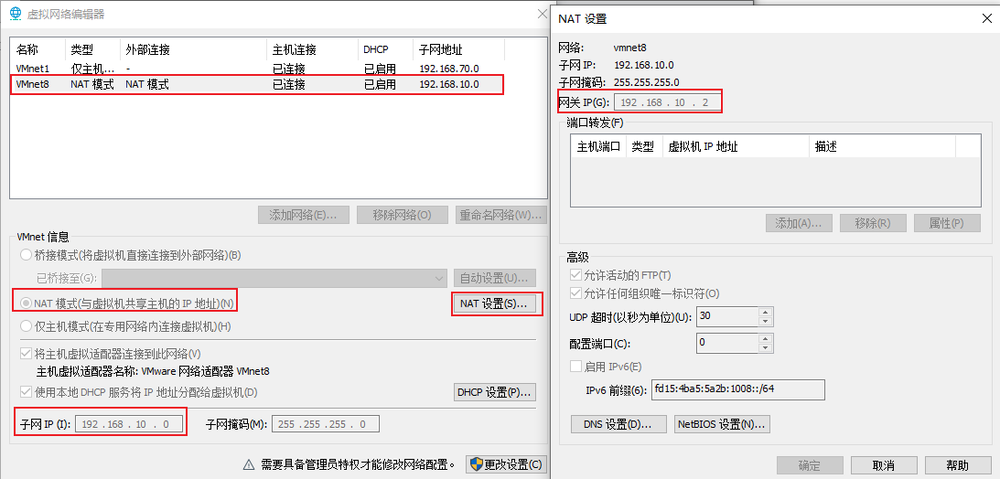
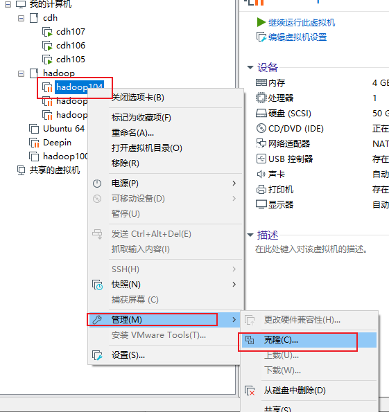
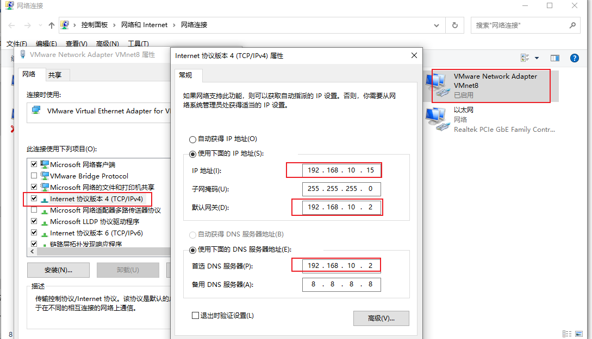
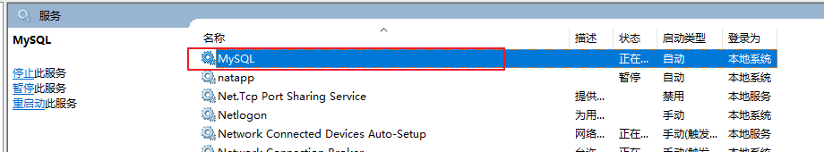
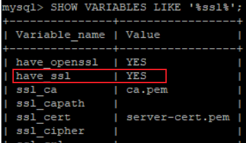
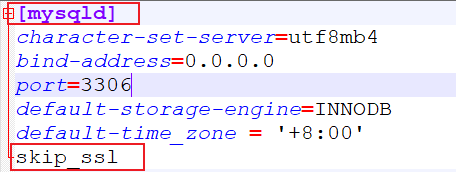
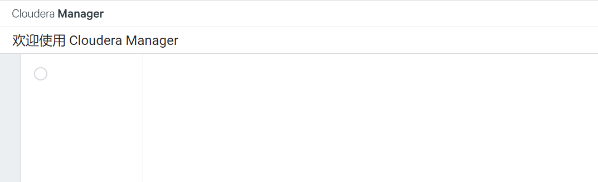
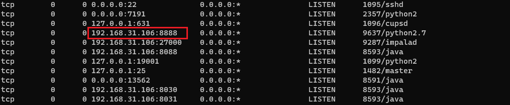
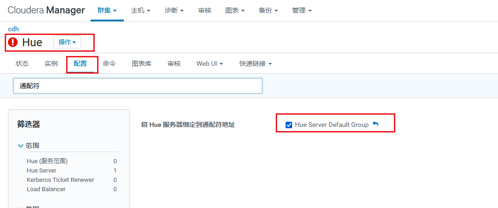
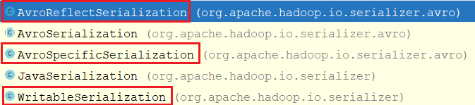

# HADOOP

### hadoop安装环境准备

1. 安装1台虚拟机, 使用nat模式使之可以上网, 使用**root**执行以下命令

2. 安装yum并重启

   https://blog.csdn.net/weixin_45457922/article/details/116430625

3. 安装epel-release

   ~~~shell
   yum install -y epel-release
   ~~~

   Extra Packages for Enterprise Linux是为“红帽系”的操作系统提供额外的软件包，适用于RHEL、CentOS和Scientific Linux。相当于是一个软件仓库，大多数rpm包在官方 repository 中是找不到的）

4. 安装工具类

   ~~~shell
   yum install -y net-tools
   yum install -y vim
   ~~~

5. 关闭防火墙

   ~~~shell
   systemctl stop firewalld
   systemctl disable firewalld.service
   ~~~

6. 创建用户

   ~~~shell
   # 删除其他用户, 连同家目录
   userdel -r otheruser
   
   # 创建用户和用户组
   group add tiger
   useradd tiger -d /home/tiger -s /bin/bash -g tiger
   ~~~

7. 安装java, 并在/etc/profile,   ~/.bashrc两个文件中配置环境变量

8. 配置hostname

   ~~~shell
   vim /etc/hostname
   ~~~

9. 配置静态ip, 虚拟机dns

   ~~~shell
   vim /etc/sysconfig/network-scripts/ifcfg-ens33
   
   DEVICE=ens33
   TYPE=Ethernet
   ONBOOT=yes
   BOOTPROTO=static # 静态ip
   NAME="ens33"
   IPADDR=192.168.10.102 # ip
   PREFIX=24
   GATEWAY=192.168.10.2 # dns
   ~~~

10. 配置虚拟机网络, 使用nat模式

    

11. 配置hosts

    ~~~shell
    vim /etc/hosts
    
    # 添加本机与其他机器的hosts
    ~~~

12. 配置一台虚拟机完成以后, 可以通过vmware的虚拟机复制功能复制几台一模一样的虚拟机

    
    
13. 配置windows的VMnet8网卡的ip地址, 以及网关, dns。

    配置需要与虚拟机的配置的网关和dns一直

    

14. 设置windows的hosts， 添加虚拟机的hosts

15. 虚拟机之间配置ssh免密登录

    ~~~shell
    ssh-keygen -t rsa
    ssh-copy-id hadoop102
    ~~~

    

### hadoop 安装

1. 下载安装包并解压

2. 在/etc/profile 和 ~/.bashrc下配置环境变量

   ~~~shell
   export JAVA_HOME=/opt/module/jdk-11.0.9
   export PATH=$JAVA_HOME/bin:$PATH
   
   export HADOOP_HOME=/opt/module/hadoop-3.2.1
   export PATH=$PATH:$HADOOP_HOME/bin:$HADOOP_HOME/sbin
   ~~~

3. 参照hadoop启动配置对core-site.xml, hdfs-site.xml, yarn-site.xml, mapred-site.xml文件进行配置

### hadoop启动配置

hadoop日志文件位置：$HADOOP_HOME/logs，可以在hadoop-env中设置该变量进行覆盖。日志文件末尾数字越大，文件越老

> core-site.xml

~~~xml
<property>
    <!-- namenode地址和rpc端口, 端口默认8082-->
	<name>fs.defaultFS</name>
	<value>hdfs://localhost:8082/</value>
</property>
<property>
    <!-- webhdfs使用的用户 -->
	<name>hadoop.http.staticuser.user</name>
	<value>tiger</value>
</property>
<property>
    <!--hadoop数据目录，默认/tmp/hadoop-${user.name}-->
	<name>hadoop.tmp.dir</name>
	<value>/home/tiger/hadoop-3.3.1/data</value>
</property>
~~~

> hdfs-site.xml

~~~xml
<property>
  <!-- dfs文件默认副本数 -->  
  <name>dfs.replication</name>
  <value>1</value>
</property>
~~~

可选：

~~~xml
<property>
    <!-- 指定webhdfs的位置和端口，默认0.0.0.0:9870-->
    <name>dfs.namenode.http-address</name>
    <value>hadoop:9870</value>
</property>
<property>
    <!-- 指定namenode image存储位置, 默认file://${hadoop.tmp.dir}/dfs/name-->
    <name>dfs.namenode.name.dir</name>
    <value>file://${hadoop.tmp.dir}/dfs/name</value>
</property>
<property>
    <!-- 指定namenode edits的存储位置， 默认${dfs.namenode.name.dir} -->
    <name>dfs.namenode.edits.dir</name>
    <value>${dfs.namenode.name.dir}</value>
</property>
<property>
    <!-- 指定datanode block的存储位置，默认file://${hadoop.tmp.dir}/dfs/data -->
    <name>dfs.datanode.data.dir</name>
    <value>file://${hadoop.tmp.dir}/dfs/data</value>
</property>
<property>
    <!-- 开启webhdfs, 默认true -->
    <name>dfs.webhdfs.enabled</name>
    <value>true</value>
</property>
~~~

> yarn-site.xml

~~~xml
<configuration>
    <!-- 指定MR走shuffle -->
    <property>
        <name>yarn.nodemanager.aux-services</name>
        <value>mapreduce_shuffle</value>
    </property>

    <!-- 指定ResourceManager的地址-->
    <property>
        <name>yarn.resourcemanager.hostname</name>
        <value>localhost</value>
    </property>
</configuration>
~~~

> mapred-site.xml

~~~xml
<configuration>
  <!-- 设置mapreduce yarn模式-->
  <property>
    <name>mapreduce.framework.name</name>
    <value>yarn</value>
  </property>
  <property>
  <name>yarn.app.mapreduce.am.env</name>
  <value>HADOOP_MAPRED_HOME=${HADOOP_HOME}</value>
  </property>
  <property>
    <name>mapreduce.map.env</name>
    <value>HADOOP_MAPRED_HOME=${HADOOP_HOME}</value>
  </property>
  <property>
    <name>mapreduce.reduce.env</name>
    <value>HADOOP_MAPRED_HOME=${HADOOP_HOME}</value>
  </property>
</configuration>
~~~

### 开启MapReduce JobHistory

开启该功能可以查看MR程序的一些详细的配置信息和运行情况

mapred-site.xml

~~~xml
<!-- 历史服务器端地址 -->
<property>
    <name>mapreduce.jobhistory.address</name>
    <value>hadoop102:10020</value>
</property>

<!-- 历史服务器web端地址 -->
<property>
    <name>mapreduce.jobhistory.webapp.address</name>
    <value>hadoop102:19888</value>
</property>
~~~

使用mapred --daemon start historyserver启动historyserver

### 开启yarn日志聚集

开启yarn日志聚集可以在程序运行的日志信息上传到hdfs系统上, 方便开发调试

yarn-site.xml

~~~xml
<!-- 开启日志聚集功能 -->
<property>
    <name>yarn.log-aggregation-enable</name>
    <value>true</value>
</property>
<!-- 设置日志聚集服务器地址 -->
<property>  
    <name>yarn.log.server.url</name>  
    <value>http://hadoop102:19888/jobhistory/logs</value>
</property>
<!-- 设置日志保留时间为7天 -->
<property>
    <name>yarn.log-aggregation.retain-seconds</name>
    <value>604800</value>
</property>
~~~

### CM6.3.2安装

参考https://zhuanlan.zhihu.com/p/425449993

> 环境准备

1. 机器准备

   - 准备好三台虚拟机cdh105, cdh106, cdh107。虚拟机之间配置hosts和免密登录， 具体流程可以查看之前的hadoop环境准备

   - 安装好java1.8

   - 安装mysql，修改root的登录权限

     ~~~shell
     update mysql.user set host='%' where user='root'
     flush privileges;
     ~~~

3. 所有机器关闭防火墙和selinux

   ~~~shell
   # 禁用防火墙
   systemctl disable firewalld
   systemctl stop firewalld
   
   # 关闭selinux
   vim /etc/selinux/config
   # 修改config文件中的SELINUX为disable
   SELINUX=disable
   
   reboot # 重启
   ~~~
   
3. 在三台机器上分别下载第三方依赖

   ~~~shell
   yum install -y chkconfig python bind-utils psmisc libxslt zlib sqlite cyrus-sasl-plain cyrus-sasl-gssapi fuse fuse-libs redhat-lsb
   ~~~

4. 所有节点配置时间同步服务

   ~~~shell
   # 安装chrony
   yum -y install chrony
   
   # 配置chrony::
   vim /etc/chrony.conf 
   
   ---
   server ntp1.alyun.com 
   server ntp2.alyun.com 
   server ntp3.alyun.com 
   ---
   
   # 启动chrony
   systemctl start chronyd
   systemctl enable chronyd
   systemctl status chronyd
   ~~~

5. 在mysql中创建数据库

   ~~~sql
   -- 集群监控数据库
   create database monitor DEFAULT CHARSET utf8 COLLATE utf8_general_ci;
   -- Hive数据库
   create database hive DEFAULT CHARSET utf8 COLLATE utf8_general_ci;
   -- Oozie数据库
   create database oozie default charset utf8 collate utf8_general_ci;
   -- Hue数据库
   create database hue default charset utf8 collate utf8_general_ci;
   -- cloudera manager数据库
   create database cmf default charset utf8 collate utf8_general_ci;
   ~~~

> 安装Cloudera Manager

1. 将parcel包放在/opt/module/parcel-repo下

   ~~~shell
   # pwd
   /opt/module/parcel-repo
   # ls
   CDH-6.3.2-1.cdh6.3.2.p0.1605554-el7.parcel
   CDH-6.3.2-1.cdh6.3.2.p0.1605554-el7.parcel.sha1
   CDH-6.3.2-1.cdh6.3.2.p0.1605554-el7.parcel.sha256
   manifest.json
   ~~~

2. 将CDH-6.3.2-1.cdh6.3.2.p0.1605554-el7.parcel.sha1后缀修改为sha

   ~~~shell
   mv CDH-6.3.2-1.cdh6.3.2.p0.1605554-el7.parcel.sha1 CDH-6.3.2-1.cdh6.3.2.p0.1605554-el7.parcel.sha
   ~~~

3. 将cm包放在/opt/module/cm下

   ~~~shell
   # pwd
   /opt/module/cm
   # ls
   cloudera-manager-agent-6.3.1-1466458.el7.x86_64.rpm
   cloudera-manager-daemons-6.3.1-1466458.el7.x86_64.rpm
   cloudera-manager-server-6.3.1-1466458.el7.x86_64.rpm
   cloudera-manager-server-db-2-6.3.1-1466458.el7.x86_64.rpm
   enterprise-debuginfo-6.3.1-1466458.el7.x86_64.rpm
   oracle-j2sdk1.8-1.8.0+update181-1.x86_64.rpm
   ~~~

4. 所有节点安装daemons和agent

   ~~~shell
   yum -y localinstall cloudera-manager-daemons-6.3.1-1466458.el7.x86_64.rpm
   yum -y localinstall cloudera-manager-agent-6.3.1-1466458.el7.x86_64.rpm
   ~~~

5. cdh105安装server

   ~~~shell
   yum -y localinstall cloudera-manager-server-6.3.1-1466458.el7.x86_64.rpm
   ~~~

6. 修改所有节点的agent配置, 指向cdh105

   ~~~shell
   sed -i "s/server_host=localhost/server_host=cdh105/g" /etc/cloudera-scm-agent/config.ini
   ~~~

7. 所有节点配置mysql驱动包

   ~~~shell
    #整理mysql的驱动包, mysql驱动包必须放在/usr/share/java目录，并且需要重命名mysql‐connector‐java.jar， 所有节点都需要安装
    wget https://repo1.maven.org/maven2/mysql/mysql-connector-java/8.0.20/mysql-connector-java-8.0.20.jar
   mv mysql-connector-java-8.0.20.jar /usr/share/java/mysql-connector-java.jar
   ~~~
   
   
   
8. 在cdh105上配置数据库信息

   vim /etc/cloudera-scm-server/db.properties

   ~~~shell
   # Copyright (c) 2012 Cloudera, Inc. All rights reserved.
   #
   # This file describes the database connection.
   #
   
   # The database type
   # Currently 'mysql', 'postgresql' and 'oracle' are valid databases.
   com.cloudera.cmf.db.type=mysql
   
   # The database host
   # If a non standard port is needed, use 'hostname:port'
   com.cloudera.cmf.db.host=cdh01:3306
   
   # The database name
   com.cloudera.cmf.db.name=cmf
   
   # The database user
   com.cloudera.cmf.db.user=root
   
   # The database user's password
   com.cloudera.cmf.db.password=root
   
   # The db setup type
   # After fresh install it is set to INIT
   # and will be changed post config.
   # If scm-server uses Embedded DB then it is set to EMBEDDED
   # If scm-server uses External DB then it is set to EXTERNAL
   com.cloudera.cmf.db.setupType=EXTERNAL
   ~~~

9. 启动cm的server和agent, 开始安装cdh集群

   ~~~shell
   # 在cdh105上启动server
   systemctl start cloudera-scm-server
   # 另开一个窗口，查看相关日志。有异常就解决异常
   tail ‐200f /var/log/cloudera‐scm‐server/cloudera‐scm‐server.log
   # 这个异常可以忽略 ERROR ParcelUpdateService:com.cloudera.parcel.component
   ParcelDownloaderImpl: Unable to retrieve remote parcel repository manifes
   # 等待日志输出 started jetty server, 则cm-server启动成功
   
   # 在全部节点上启动agent
   systemctl start cloudera-scm-agent
    # 当在 cdh01上 netstat -antp | grep 7180 有内容时，说明我们可以访问web页面了
   # 查看运行状态
   systemctl status cloudera-scm-agent
   systemctl status cloudera-scm-server
   ~~~

> 遇到的坑

1. cm默认读取的java目录是/usr/java/default，而不是用户指定的java home，所以会导致cloudera-scm-server启动失败， 并且/var/log/cloudera-scm-server目录下连日志文件都没有输出。

   解决办法

   ~~~shell
   mkdir -p /usr/java
   ln -s /opt/module/jdk1.8.0_271  /usr/java/default
   ~~~

2. 关于mysql驱动类找不到的问题，注意驱动类jar包的两个横杆是否为英文，同时驱动包权限修改为777

3. 关于mysql需要设置time_zone属性, 否则无法连接的问题, 在windows下的解决办法是:

   1. 查看mysql时区设置

      ~~~SQL
      show variables like '%time_zone%';
      +------------------+--------+
      | Variable_name    | Value  |
      +------------------+--------+
      | system_time_zone |        |
      | time_zone        | SYSTEM |
      +------------------+--------+
      ~~~

   2. 设置mysql时区, 当前启动有效

      ~~~shell
      set global time_zone = '+8:00';
      FLUSH PRIVILEGES;
      ~~~
   
   3. 修改mysql配置文件, 永久有效。windows系统中配置文件为my.ini。linux系统中配置文件为/etc/my.cnf
   
      ~~~shell
      # 在[mysqld]的下面添加或者修改如下内容
      default-time_zone = '+8:00'
      ~~~
   
      在windows下重启服务
   
      
   
4. 关于scm_prepare_database.sh脚本初始化数据库, 出现关于useSSL的问题

   默认情况下mysql8.0需要设置连接的useSSL=false, 但是配置文件好像并没有那个地方设置这个数据

   所以只能将mysql中的这个属性关掉

   先查看mysql中的这个属性

   ~~~shell
   SHOW VARIABLES LIKE '%ssl%';
   ~~~

   

   修改mysql的配置文件, 添加如下属性,  重启

   

   ~~~java
   ** BEGIN NESTED EXCEPTION ** 
   javax.net.ssl.SSLException
   MESSAGE: closing inbound before receiving peer's close_notify
   STACKTRACE:
   javax.net.ssl.SSLException: closing inbound before receiving peer's close_notify
   	at sun.security.ssl.Alert.createSSLException(Alert.java:133)
   	at sun.security.ssl.Alert.createSSLException(Alert.java:117)
   	at sun.security.ssl.TransportContext.fatal(TransportContext.java:340)
   	at sun.security.ssl.TransportContext.fatal(TransportContext.java:296)
   	at sun.security.ssl.TransportContext.fatal(TransportContext.java:287)
   	at sun.security.ssl.SSLSocketImpl.shutdownInput(SSLSocketImpl.java:737)
   	at sun.security.ssl.SSLSocketImpl.shutdownInput(SSLSocketImpl.java:716)
   ~~~

5. cloudera-scm-server启动后, /var/log/cloudera-scm-server/cloudera-scm-server.log 报错

   - Row size too large. The maximum row size for the used table type, not counting BLOBs, is 65535

   - Table 'scm.VERSION' doesn't exist.

   解决: 指定的数据库的编码不会, 重新创建数据库并初始化

   ~~~sql
   CREATE DATABASE scm DEFAULT CHARACTER SET utf8 DEFAULT COLLATE utf8_general_ci;
   ~~~

6. 如果登录cm之后, 无法显示安装界面, 切换firefox浏览器， 谷歌浏览器访问不了？

   

### 使用CDH安装HUE

> 遇到的坑

1. 指定hue使用的数据库为mysql8.x时， 无法校验通过， 因为

2. 安装hue之后， 无法通过外网范围hue的web界面， 只能在局域网范围， 通过`netstat -tunpl`发现

   

   需要在cdh界面勾选`将 Hue 服务器绑定到通配符地址`， 然后**重启**hue

   

   

   

   

# HDFS

### HDFS概述

> 适合场景

- 分布式文件系统
- 适合一次写入，多次读出

> 优点

- 高容错性

  数据可以指定多个副本，一旦一个机器挂掉，可以在其他机器上再生成一个副本

- 适合大数据

  数据规模：能够达到TB甚至PB

  文件规模：能处理百万规模以上的文件数量

- 可以在廉价机器上，通过多副本机制，提高可靠性
  

> 缺点

- 不适合低延时数据访问，比如毫秒级别的存储数据是做不到的
- 无法高效的对大量小文件进行存储

  - 存储大量小文件的话，会占用NameNode大量内存来存储文件目录和块信息

  - 小文件的寻址时间会超过读取时间，违反了HDFS的设计目标
- 不支持并发写入，文件随机修改
  - 一个文件只能有一个写，不允许多个线程同时写
  - 仅支持数据的追加和截断，不支持文件的随机修改

### HDFS组成架构

- NameNode
  - 管理HDFS的名称空间

### 关于Hadoop JAVA_HOME is not set and could not be found的问题

参考https://blog.csdn.net/wangbaomi/article/details/108287757

该问题是在执行start-dfs.sh时发现的。

经过分析，发现start-dfs.sh会使用ssh连接上worker文件中的所有机器，然后执行hdfs命令来启动集群中的所有hdfs。

“JAVA_HOME is not set and could not be found“这个问题就是在执行hdfs命令时发生的。

需要知道的是，使用使用ssh连接上机器，然后执行hdfs这个脚本，在hdfs这个脚本里面，bash的运行模式是非登录非交互式的。这个时候bash在启动时只会加载BASH_ENV环境变量指定的文件而不会加载/etc/profile这个文件。

同时bash会判断他的标准输入是否来自一个网络，在这里即判断是否是通过ssh来执行的。如果是将会加载~/.bashrc配置文件。

所以解决方案就是，通过BASH_ENV指定一个配置文件(比如/etc/profile)，然后再该配置文件中export JAVA_HOME。

第二种办法是在~/.bashrc中export JAVA_HOME，但是我的版本查看~/.bashrc发现在开头有这样一段代码

~~~shell
# If not running interactively, don't do anything
case $- in
    *i*) ;;
      *) return;;
esac
~~~

这段代码的作用是判断该脚本是否是在交互式bash中执行的，如果不是就立即退出。因为我们的模式是非登录非交互式的，所以导致了bash加载~/.bashrc的时候直接退出了。这样的话export语句必须放在这段代码的前面才是有效的。放在最后面是无效的。

### hdfs写流程

正常情况和异常情况

### hdfs写数据DataNode选择策略

节点距离感知和机架选择

client读取多个block块时是串行读取

### hdfs 读流程

考虑节点距离最近和负载均衡 

### hdfs 2nn工作机制

fsImage edit_log

### hdfs DataNode工作机制

心跳, block块信息汇报

本地存储的block块信息的数据完整性校验

### hdfs 数据存储原理

### hdfs dfs命令指南

hdfs 查看所有子命令

hdfs subcmd -h 查看子命令的帮助选项：hdfs dfs -h

hdfs subcmd -help 查看子命令的帮助选项的具体功能：hdfs dfs -help mkdir

一般在HDFS文件系统创建文件或文件夹时，若直接hadoop fs -mkdir [文件夹名]，那么创建的目录在用户目录/user下，若想建立在其他地方，必须要写完整路径。

# MapReduce

### MapReduce序列化器

> 序列化器与反序列化的调用时机

- 将MapTask输出的KV进行序列化， 然后转换成byte数字， 然后写入环形缓冲区
- 在环形缓冲区溢写的时候， 需要对key进行快排， 这个时候会调用反序列化对key进行反序列化，从数组到对象，然后进行比较。

> 序列化相关类

对于序列化器， 有四个相关类

1. Serialization

   ~~~java
   public interface Serialization<T> {
     // 用于判断当前类是否支持某种类型的序列化
     boolean accept(Class<?> c);
     // 获取序列化器
     Serializer<T> getSerializer(Class<T> c);
     // 获取反序列化器
     Deserializer<T> getDeserializer(Class<T> c);
   }
   ~~~

2. Serializer

   需要注意的是，open方法传入了一个OutputStream， 他的实际类型为MapTask#BlockingBuffer。调用序列化serialize方法的时候，需要调用他的write方法将序列化之后的内容写入到环形缓冲区中。

   ~~~java
   public interface Serializer<T> {
     // 初始化方法， 传入的是一个输出流
     void open(OutputStream out) throws IOException;
     // 序列化方法， 该方法内部必须调用out对象的write方法将序列化后的内容写入到输出流中
     void serialize(T t) throws IOException;
   
     void close() throws IOException;
   }
   ~~~

   

3. Deserializer

   在初始化会传入一个输入流。在反序列化的时候，传入的对象t是通过反射创建的一个未初始化对象，你可以从in输入流里面读取数据为这个t初始化，或者忽略这个t，直接从in里面读取数据创建一个新的T对象（推荐）。

   ~~~java
   public interface Deserializer<T> {
     // 初始化方法， 传入的是一个输入流
     void open(InputStream in) throws IOException;
     // 反序列化方法
     T deserialize(T t) throws IOException;
       
     void close() throws IOException;
   }
   ~~~

   

> 序列化器的指定位置

默认的序列化和反序列化器定义在SerializationFactory中， 一个三个类。当某一类型需要序列化和反序列化的时候， 会依次调用他们的accept方法来判断是否支持这种类型的反序列化。

~~~java
  public SerializationFactory(Configuration conf) {
    super(conf);
    for (String serializerName : conf.getTrimmedStrings(
            CommonConfigurationKeys.IO_SERIALIZATIONS_KEY,
            new String[]{WritableSerialization.class.getName(),
                    AvroSpecificSerialization.class.getName(),
                    AvroReflectSerialization.class.getName()})) {
      add(conf, serializerName);
    }
  }
~~~

用户可以通过以下代码来覆盖默认配置

~~~java
Configuration conf = new Configuration();
        conf.set("io.serializations", String.format("%s,%s", JavaSerialization.class, WritableSerialization.class));
        Job job = Job.getInstance(conf);
~~~

> 内置的序列化器

一共五种， 其中红色框中的是默认使用的， 自定义的时候可以参考WritableSerialization和JavaSerialization

Shuffle

shuffle的主要过程如下：

   1. MapTask初始化， 创建一个100M的字节数组作为环形缓冲区，并设置赤道位置为数组开始位置。

   2. 在Mapper的map方法中调用context.write()将Mapper的输出KV写出。

   3. 使用指定的Partitioner对Mapper输出的KV进行分区

   4. 将分区号，KV值一同写入到环形缓冲区中，具体的写入逻辑就是

   5. 如果环形缓冲区使用率达到了80%, 那么就会将环形一个溢写线程将这部分数据溢写到磁盘上，生成一个spill.out文件和一个spill.index文件。同时对于写线程，重置他的写数据起到到生育20%的中间位置。这样就达到了一个写缓冲区线程和一个溢写缓冲区线程同时工作， 两不耽误。

      如果写缓冲区
      
      

### Map Join 和Reduce Join

> Reduce Join

1. Reduce端Join实现原理

   Map端的主要工作，为来自不同表（文件）的key/value对打标签以区别不同来源的记录。然后用连接字段作为key，其余部分和新加的标志作为value，最后进行输出。

   Reduce端的主要工作，在Reduce端以连接字段作为key的分组已经完成，我们只需要在每一个分组当中将那些来源于不同文件的记录（在map阶段已经打标志）分开，最后进行笛卡尔只就ok了。

2. Reduce端Join的使用场景

   Reduce端连接比Map端连接更为普遍，因为在map阶段不能获取所有需要的join字段，即：同一个key对应的字段可能位于不同map中，但是Reduce端连接效率比较低，因为所有数据都必须经过Shuffle过程。

> Map Join

1. Map端Join实现原理

   map join指的是在mapreduce的map阶段先加载一个文件缓存到内存当中，这个文件可能是从磁盘读取的或网络请求的都可以。

   map(key,value,context)方法中读取的数据key和value，这两个数据和先前缓存到内存中的数据一起做join后再context.write()到reduce阶段。

2. 如何缓存文件到NodeManager上

   DistributedCache 是一个提供给Map/Reduce框架的工具，用来缓存文件（text, archives, jars and so on）文件的默认访问协议为(hdfs://).

   DistributedCache在任何Job在节点上执行之前将拷贝缓存的文件到Slave节点。文件在每个Job中只会被拷贝一次，缓存的归档文件会被在Slave节点中解压缩。 

   每个存储在HDFS中的文件被放到缓存中后都可以通过一个符号链接使用。URI hdfs://namenode/test/input/file1#myfile 你可以在程序中直接使用myfile来访问 file1这个文件。 myfile是一个符号链接文件。

3. 使用场景

   一张表十分小、一张表很大。

   在提交作业的时候先将小表文件放到该作业的DistributedCache中，然后从DistributeCache中取出该小表进行join (比如放到Hash Map等等容器中)。然后扫描大表，看大表中的每条记录的join key /value值是否能够在内存中找到相同join key的记录，如果有则直接输出结果。