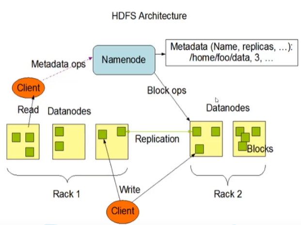

### HDFS概述

> 适合场景

- 分布式文件系统
- 适合一次写入，多次读出

> 优点

- 高容错性

  数据可以指定多个副本，一旦一个机器挂掉，可以在其他机器上再生成一个副本

- 适合大数据

  数据规模：能够达到TB甚至PB

  文件规模：能处理百万规模以上的文件数量

- 可以在廉价机器上，通过多副本机制，提高可靠性
  

> 缺点

- 不适合低延时数据访问，比如毫秒级别的存储数据是做不到的
- 无法高效的对大量小文件进行存储

  - 存储大量小文件的话，会占用NameNode大量内存来存储文件目录和块信息

  - 小文件的寻址时间会超过读取时间，违反了HDFS的设计目标
- 不支持并发写入，文件随机修改
  - 一个文件只能有一个写，不允许多个线程同时写
  - 仅支持数据的追加和截断，不支持文件的随机修改

### HDFS组成架构

- NameNode
  - 管理HDFS的名称空间

### 关于Hadoop JAVA_HOME is not set and could not be found的问题

参考https://blog.csdn.net/wangbaomi/article/details/108287757

该问题是在执行start-dfs.sh时发现的。

经过分析，发现start-dfs.sh会使用ssh连接上worker文件中的所有机器，然后执行hdfs命令来启动集群中的所有hdfs。

“JAVA_HOME is not set and could not be found“这个问题就是在执行hdfs命令时发生的。

需要知道的是，使用使用ssh连接上机器，然后执行hdfs这个脚本，在hdfs这个脚本里面，bash的运行模式是非登录非交互式的。这个时候bash在启动时只会加载BASH_ENV环境变量指定的文件而不会加载/etc/profile这个文件。

同时bash会判断他的标准输入是否来自一个网络，在这里即判断是否是通过ssh来执行的。如果是将会加载~/.bashrc配置文件。

所以解决方案就是，通过BASH_ENV指定一个配置文件(比如/etc/profile)，然后再该配置文件中export JAVA_HOME。

第二种办法是在~/.bashrc中export JAVA_HOME，但是我的版本查看~/.bashrc发现在开头有这样一段代码

~~~shell
# If not running interactively, don't do anything
case $- in
    *i*) ;;
      *) return;;
esac
~~~

这段代码的作用是判断该脚本是否是在交互式bash中执行的，如果不是就立即退出。因为我们的模式是非登录非交互式的，所以导致了bash加载~/.bashrc的时候直接退出了。这样的话export语句必须放在这段代码的前面才是有效的。放在最后面是无效的。

### hdfs写流程

正常情况和异常情况

### hdfs写数据DataNode选择策略

节点距离感知和机架选择

client读取多个block块时是串行读取

### hdfs 读流程

考虑节点距离最近和负载均衡 

### hdfs 2nn工作机制

fsImage edit_log

### hdfs DataNode工作机制

心跳, block块信息汇报

本地存储的block块信息的数据完整性校验

### hdfs 数据存储原理

### hdfs dfs命令指南

hdfs 查看所有子命令

hdfs subcmd -h 查看子命令的帮助选项：hdfs dfs -h

hdfs subcmd -help 查看子命令的帮助选项的具体功能：hdfs dfs -help mkdir

一般在HDFS文件系统创建文件或文件夹时，若直接hadoop fs -mkdir [文件夹名]，那么创建的目录在用户目录/user下，若想建立在其他地方，必须要写完整路径。

### hadoop配置

hadoop日志文件位置：$HADOOP_HOME/logs，可以在hadoop-env中设置该变量进行覆盖。日志文件末尾数字越大，文件越老

> core-site.xml

~~~xml
<property>
    <!-- namenode地址和rpc端口, 端口默认8082-->
	<name>fs.defaultFS</name>
	<value>hdfs://localhost:8082/</value>
</property>
<property>
    <!-- webhdfs使用的用户 -->
	<name>hadoop.http.staticuser.user</name>
	<value>tiger</value>
</property>
<property>
    <!--hadoop数据目录，默认/tmp/hadoop-${user.name}-->
	<name>hadoop.tmp.dir</name>
	<value>/home/tiger/hadoop-3.3.1/data</value>
</property>
~~~

> hdfs-site.xml

~~~xml
<property>
  <!-- dfs文件默认副本数 -->  
  <name>dfs.replication</name>
  <value>1</value>
</property>
~~~

可选：

~~~xml
<property>
    <!-- 指定webhdfs的位置和端口，默认0.0.0.0:9870-->
    <name>dfs.namenode.http-address</name>
    <value>hadoop:9870</value>
</property>
<property>
    <!-- 指定namenode image存储位置, 默认file://${hadoop.tmp.dir}/dfs/name-->
    <name>dfs.namenode.name.dir</name>
    <value>file://${hadoop.tmp.dir}/dfs/name</value>
</property>
<property>
    <!-- 指定namenode edits的存储位置， 默认${dfs.namenode.name.dir} -->
    <name>dfs.namenode.edits.dir</name>
    <value>${dfs.namenode.name.dir}</value>
</property>
<property>
    <!-- 指定datanode block的存储位置，默认file://${hadoop.tmp.dir}/dfs/data -->
    <name>dfs.datanode.data.dir</name>
    <value>file://${hadoop.tmp.dir}/dfs/data</value>
</property>
<property>
    <!-- 开启webhdfs, 默认true -->
    <name>dfs.webhdfs.enabled</name>
    <value>true</value>
</property>
~~~

> yarn-site.xml

~~~xml
<configuration>
    <!-- 指定MR走shuffle -->
    <property>
        <name>yarn.nodemanager.aux-services</name>
        <value>mapreduce_shuffle</value>
    </property>

    <!-- 指定ResourceManager的地址-->
    <property>
        <name>yarn.resourcemanager.hostname</name>
        <value>localhost</value>
    </property>
</configuration>
~~~

