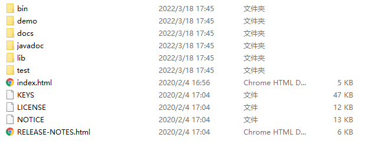
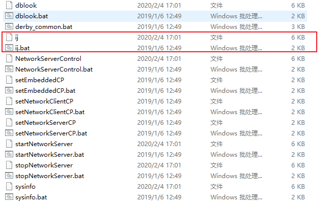
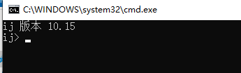
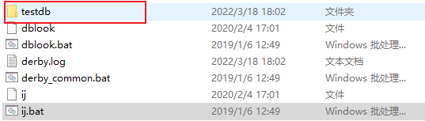
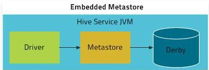
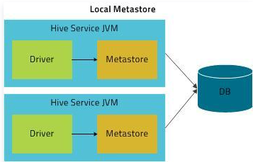
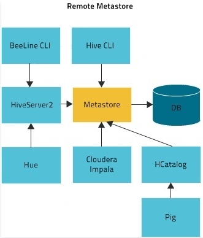
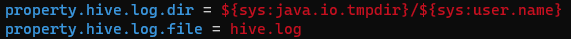

### Derby数据库简介

derby数据库是有java语言编写的轻量级数据库, 类文件大小大约是 2MB ，并且只使用了 4MB 的 Java 堆。

和mysql等其他数据库不同的是, 他有两种运行模式. 

1. **内嵌模式**: Derby数据库与应用程序共享同一个JVM，通常由应用程序负责启动和停止，对除启动它的应用程序外的其它应用程序不可见，即其它应用程序不可访问它；

2. **网络模式**。Derby数据库独占一个JVM，做为服务器上的一个独立进程运行。在这种模式下，允许有多个应用程序来访问同一个Derby数据库。类似mysql.

> 内嵌模式

1. 下载并解压derby

   https://db.apache.org/derby/derby_downloads.html#For+Java+9+and+Higher

   

   在bin目录下面有一个ij, 可以使用该脚本来启动一个应用程序, 并使用该引用程序来创建, 连接derby数据库.

   windows下可以双击或者cmd运行, linux下使用bash执行

   

2. 双击ij.bat

   

3. 执行`connect 'jdbc:derby:testdb;create=true';`创建数据库.

   - create=true表示没有数据库的话就新建
   - 分号表示语句结尾
   - 执行connect之后, 会查找**执行ij程序的目录下**有没有testdb数据库, 没有的话就新建
   - 当前的ij程序已经连接到了testdb数据库了, 所以其他的程序就无法连接这个数据库了, 因为嵌入模式下, 一个数据库一次只能有一个连接.

   

4. 执行`create table test_table(id bigint);`建表

   

5. 执行`insert into test_table values (20);`插入数据

   

6. 执行`exit;`退出ij.

7. 结束之后可以看到, 在**运行ij的目录**下生成了数据库的文件夹, 这个文件夹包括了testdb的所有数据.

   

> 嵌入模式总结

嵌入模式下, derby数据库的所有数据都存放在他生成的那个文件夹下面(也就是上面提到的testdb). 

嵌入到应用程序里面的与其说是一个derby数据库, 不如说是一个derby数据管理系统, 来查询修改这个文件夹下面的数据.  所以复制这个文件夹相当于复制了一个数据库.

同时, 这个derby数据管理系统连接上了这个数据库, 就意味着这个文件夹被独占了, 这样嵌入到别的应用程序的derby数据管理系统就没有办法连接这个数据库了.

应用系统和这个derby数据管理系统在同一个jvm中, 应用系统关闭了, 这个derby数据管理系统也就关闭了, 对应数据库的文件夹相当于解除释放了.

并且, 这个数据管理系统在连接时, 也就是上面的ij执行connect时, 会查找当前运行的模型下有没有这个数据库, 如果没有就新建, 所以你只要换一个目录运行ij的话就会发现连接不上了.只能在数据库所在的目录下运行ij才能连接上这个数据库.


### Hive安装使用Derby数据库

**hive安装需要jdk8, jdk11报错**

1. 下载Hive包并解压

   - 下载地址 http://archive.apache.org/dist/hive/
   - tar -xzvf apache-hive-3.1.2-bin.tar.gz

2. 配置环境变量

   在/etc/profile, 和 ~/.bashrc下配置环境变量

   ~~~java
   export HIVE_HOME=/opt/module/hive
   export PATH=$PATH:$HIVE_HOME/bin
   ~~~

3. 初始化derby数据库

   ~~~shell
   bin/schematool -dbType derby -initSchema
   ~~~

4. 启动hive

   ~~~shell
   bin/hive
   ~~~

   默认的元数据库连接地址是`jdbc:derby:;databaseName=metastore_db;create=true`
   
   所以会查找执行hive的默认下有没有这个metastore_db的derby数据库. 如果没有就新建. 
   
   所以会有两个头疼的点
   
   - 相同目录下无法启动两个hive, 因为第一个启动的hive会对元数据库独占, 第二个就无法连接上了
   - 不同目录下启动两个hive, 那么他们回是两个毫不相干的hive, 因为启动时会查找执行hive命令的目录下有没有metastore_db这个数据库, 没有就新建. 因为启动目录不同, 所以会创建两个metastore_db数据库, 这样这两个hive就变成了好不相干的hive了
   
   
   
   

### Hive安装使用MySQL数据库

**hive安装需要jdk8, jdk11报错**

1. 下载Hive包并解压

   - 下载地址 http://archive.apache.org/dist/hive/
   - tar -xzvf apache-hive-3.1.2-bin.tar.gz

2. 配置环境变量

   在/etc/profile, 和 ~/.bashrc下配置环境变量

   ~~~java
   export HIVE_HOME=/opt/module/hive
   export PATH=$PATH:$HIVE_HOME/bin
   ~~~

3. 安装mysql, 并配置mysql 库下的 user 表中的 root 用户允许任意 ip 连接  

   ~~~shell
   mysql> update mysql.user set host='%' where user='root';
   mysql> flush privileges;
   ~~~

4. 从maven仓库下载mysql对应jdbc驱动包到Hive的lib目录下

   ~~~shell
   wget https://repo1.maven.org/maven2/mysql/mysql-connector-java/8.0.28/mysql-connector-java-8.0.28.jar
   ~~~

5. 在mysql中创建hive的元数据库

   ~~~shell
   mysql> create database hive_metadata
   ~~~

6. 初始化元数据库

   ~~~shell
   bin/schematool -initSchema -dbType mysql - verbose
   ~~~

7. 在$HIVE_HOME/conf/hive-site.xml( 没有新建 ) 配置hive到mysql的连接信息

   ~~~xml
   <?xml version="1.0"?>
   <?xml-stylesheet type="text/xsl" href="configuration.xsl"?>
   <configuration>
       <!-- jdbc 连接的 URL -->
       <property>
           <name>javax.jdo.option.ConnectionURL</name>
           <value>jdbc:mysql://hadoop102:3306/hive_metadata?useSSL=false</value>
       </property>
       <!-- jdbc 连接的 Driver-->
       <!-- com.mysql.cj.jdbc.Driver对应8.x  com.mysql.jdbc.Driver对应5.x-->
       <property>
           <name>javax.jdo.option.ConnectionDriverName</name>
           <value>com.mysql.cj.jdbc.Driver</value>
       </property>
       <!-- jdbc 连接的 username-->
       <property>
           <name>javax.jdo.option.ConnectionUserName</name>
           <value>root</value>
       </property>
       <!-- jdbc 连接的 password -->
       <property>
           <name>javax.jdo.option.ConnectionPassword</name>
           <value>000000</value>
       </property>
       <!-- Hive 元数据存储版本的验证, 使用derby需要, mysql不需要 -->
       <property>
           <name>hive.metastore.schema.verification</name>
           <value>false</value>
       </property>
       <!--元数据存储授权, 使用derby需要, mysql不需要-->
       <property>
           <name>hive.metastore.event.db.notification.api.auth</name>
           <value>false</value>
       </property>
       <!-- Hive 默认在 HDFS 的工作目录 -->
       <property>
           <name>hive.metastore.warehouse.dir</name>
   		<value>/hive</value>
   	</property>
       
       <!-- 使用hive客户端时, 查询时在第一行显示的列信息 -->
       <property>
   		<name>hive.cli.print.header</name>
   		<value>true</value>
   	</property>
       <!-- 使用hive客户端时, 显示当前所在数据库 -->
   	<property>
   		<name>hive.cli.print.current.db</name>
   		<value>true</value>
   	</property>
   
   </configuration>
   ~~~

8. 启动hive

   ~~~hive
   bin/hive
   ~~~


> 遇到的坑

~~~java
Exception in thread "main" java.lang.NoSuchMethodError: com.google.common.base.Preconditions.checkArgument(ZLjava/lang/String;Ljava/lang/Object;)V
    at org.apache.hadoop.conf.Configuration.set(Configuration.java:1357)
    at org.apache.hadoop.conf.Configuration.set(Configuration.java:1338)
    at org.apache.hadoop.mapred.JobConf.setJar(JobConf.java:536)
    at org.apache.hadoop.mapred.JobConf.setJarByClass(JobConf.java:554)
    at org.apache.hadoop.mapred.JobConf.<init>(JobConf.java:448)
    at 
~~~

hadoop-3.2.1（路径：hadoop\share\hadoop\common\lib）中该jar包为 guava-27.0-jre.jar；而hive-3.1.2(路径：hive/lib)中该jar包为guava-19.0.1.jar

将jar包变成一致的版本：删除hive中低版本jar包，将hadoop中高版本的复制到hive的lib中。

### Hive配置优先级、查看、修改

hive配置文件存放在$HIVE_HOME/conf下, 设置配置如下:

- hive-default.xml, 永久有效
- hive-site.xml, 永久有效
- 启动hive时, 通过-hiveconf param=value来设置参数, 仅本次启动有效
- 启动hive后, 通过set param=value来设置参数, 仅本次有效.

优先级有依次增加;


启动hive后, 使用查看所有参数

~~~shell
set;
~~~

启动hive后, 查看单个参数

~~~shell
set param;
~~~


### Hive元数据服务MetaStore

> 概念

MetaSore 是 Hive 元数据存储的地方。Hive 数据库、表、函数等的定义都存储在 Metastore 中。

根据系统配置方式，统计信息和授权记录也可以存储在MetaStore中。Hive 或者其他执行引擎在运行时使用此数据来确定如何解析，授权以及有效执行用户查询。

> Meta作用

**客户端连接metastore服务，metastore再去连接MySQL数据库来存取元数据。有了metastore服务，就可以有多个客户端同时连接，而且这些客户端不需要知道MySQL数据库的用户名和密码，只需要连接metastore 服务即可。**

> 配置参数

| 配置参数                              | 参数说明                                                     |
| :------------------------------------ | :----------------------------------------------------------- |
| hive.metastore.local                  | 本地或远程元数据存储。该配置项从Hive 0.10 废弃，而是通过 hive.metastore.uris 来判断，如果为空，则假定为本地模式，否则为远程模式。 |
| hive.metastore.uris                   | 远程元数据存储的 Thrift URI。元数据服务客户端通过该配置连接远程元数据。 |
| javax.jdo.option.ConnectionURL        | 元数据存储的 JDBC 连接 URL                                   |
| javax.jdo.option.ConnectionDriverName | 元数据存储的 JDBC 驱动类                                     |
| javax.jdo.option.ConnectionUserName   | 元数据存储数据库用户名                                       |
| javax.jdo.option.ConnectionPassword   | 元数据存储数据库密码                                         |
| hive.metastore.warehouse.dir          | 数据仓库存储位置                                             |

#### MetaStore三种部署模式

> 内嵌模式

默认情况下，MetaStore 服务和 Hive 服务运行在同一个 JVM 中，包含一个内嵌的以本地磁盘作为存储的 Derby 数据库实例。



使用内嵌的 MetaStore 是 Hive 入门最简单的方法。但是，每次只有一个内嵌的 Derby 数据库可以访问某个磁盘上的数据库文件，一次只能有一个进程可以连接到数据库，因此它并不是一个实际的解决方案，但对于单元测试来说效果很好，并不适合在生产环境使用。

~~~xml
<!-- 本地模式不需要配置 -->
<property>
  <name>hive.metastore.uris</name>
  <value/>
</property>
<property>  
  <name>javax.jdo.option.ConnectionURL</name>  
  <value>jdbc:derby:;databaseName=metastore_db;create=true</value>  
</property>  
<property>  
  <name>javax.jdo.option.ConnectionDriverName</name>  
  <value>org.apache.derby.jdbc.EmbeddedDriver</value>  
</property>
~~~

> 本地模式

如果要支持多会话（以及多租户），需要使用一个独立的数据库。这种配置方式成为本地配置，因为 MetaStore 服务仍然和 Hive 服务运行在同一个进程中，但连接的却是另一个进程中运行的数据库，在同一台机器上或者远程机器上。



对于独立的 MetaStore，MySQL 是一种很受欢迎的选择。本实例我们 MySQL 为例，具体看看如何配置：

```xml
<!-- 本地模式不需要配置 -->
<property>
  <name>hive.metastore.uris</name>
  <value/>
</property>
<property>  
  <name>javax.jdo.option.ConnectionURL</name>
  <value>jdbc:mysql://localhost:3306/hive_meta?createDatabaseIfNotExist=true</value>
</property>  
<property>  
  <name>javax.jdo.option.ConnectionDriverName</name>
  <value>com.mysql.cj.jdbc.Driver</value>  
</property>  
<property>  
  <name>javax.jdo.option.ConnectionUserName</name>
  <value>root</value>  
</property>  
<property>  
  <name>javax.jdo.option.ConnectionPassword</name>
  <value>root</value>  
</property>
```

在本地模式下不需要配置 hive.metastore.uris，默认为空表示是本地模式。

如果选择 MySQL 作为 MetaStore 存储数据库，需要提前将 MySQL 的驱动包拷贝到 $HIVE_HOME/lib目录下。

> 远程模式

在远程模式下，MetaStore 服务和 Hive 服务运行在不同进程中，**甚至不同的机器上**。MetaStore 服务通过 JDBC 与 MetaStore 数据库进行通信（使用 javax.jdo.option.ConnectionURL 属性配置）。同时Hive通过thrift协议与MetaStore服务通信(使用hive.metastore.uris配置)



在这种情况下，我们还可以单独部署一台 MetaStore 服务器，以提供更高可用性。这也可以有更好的可管理性/安全性，因为数据库层可以完全防火墙关闭。

**Hive MetaStore 是无状态的，因此可以有多个实例来实现高可用性。**使用 hive.metastore.uris 可以指定多个远程 MetaStore。Hive 将默认使用列表中的第一个，但会在连接失败时随机选择一个，并尝试重新连接。

通过一下命令启动hive metastore,

nohup:  放在命令开头，表示不挂起,也就是关闭终端进程也继续保持运行状态

&表示后台运行

~~~shell
nohup hive --service metastore 1>/dev/null 2>&1 & 
~~~

HiveMetaStore配置：

```xml
<property>  
  <name>javax.jdo.option.ConnectionURL</name>
  <value>jdbc:mysql://localhost:3306/hive_meta?createDatabaseIfNotExist=true</value>
</property>  
<property>  
  <name>javax.jdo.option.ConnectionDriverName</name>
  <value>com.mysql.cj.jdbc.Driver</value>  
</property>  
<property>  
  <name>javax.jdo.option.ConnectionUserName</name>
  <value>root</value>  
</property>  
<property>  
  <name>javax.jdo.option.ConnectionPassword</name>
  <value>root</value>  
</property>
```

Hive客户端配置

~~~xml
<!-- 指定存储元数据要连接的地址 -->
<property>
	<name>hive.metastore.uris</name>
	<value>thrift://hadoop102:9083</value>
</property>
~~~


> Hive修改日志文件位置

- Hive 的 log 默认存放在/tmp/${user.name}/hive.log 

- 修改hive的log存放日志

  - 修改/opt/module/hive/conf/hive-log4j2.properties.template 文件名称为 hive-log4j2.properties

  - 在 hive-log4j2.properties 文件中修改 log 存放位置

    ~~~txt
    hive.log.dir=/opt/module/hive/logs 
    ~~~

    

### HiveServer2

metaStore：

- hive的metaStore提供的是一个服务，而这个服务就是将hive的元数据暴露出去，而不是需要通过对hive元数据库mysql的访问才能拿到hive的元数据信息;

- metastore服务实际上就是一种thrift服务，通过它我们可以获取到hive原数据，并且通过thrift获取原数据的方式，屏蔽了数据库访问需要驱动，url，用户名，密码等等细节

hiveServer2: 

- HiveServer2（HS2）是一个服务端接口，使远程客户端可以通过jdbc, odbc, thrift连接到HiveServer2上并执行对Hive的查询并返回结果。目前基于Thrift RPC的实现是HiveServer的改进版本，并支持多客户端并发.

- 启动

  ~~~shell
  nohup hive --service hiveserver2 1>/dev/null 2>&1 & 
  ~~~

- 判断是否启动

  **可以查看/tmp/username/hive.log查看启动日志的详细信息来判断是否启动**。

  或者浏览器直接访问10002端口来判断, hiveserver2启动后会占用该端口用于hiveserver2的web ui。

  在或者通过命令`netstat -tunlp | grep 10000`看端口是否被占用来判断。

### Hive日志

hive日志配置文件为$HIVE_HOME/conf/hive-log4j2.properties

刚解压是没有这个文件的, 只有一个hive-log4j2.properties.template文件, 可以通过cp命令复制为hive-log4j2.properties

hive默认日志文件位置通过hive-log4j2.properties中的以下两个属性配置, 默认在/tmp/username/hive.log



需要注意的是, hive metastore和hiveserver2的日志文件都是这个hive.log, 所以两个进程的日志是混在一起的.

启动时可以通过tail这个hive.log文件来查看是否启动

hiveserver2记录的客户端提交的操作日志在/tmp/username/operation_logs目录下.


### Dbeaver连接Hive


### Hive DDL

#### DDL 库

- 建库

  ~~~sql
  CREATE DATABASE [IF NOT EXISTS] database_name 
  [COMMENT  database_comment]  -- 注释
  [LOCATION hdfs_path]  -- 指定库在hdfs存储路径
  [WITH DBPROPERTIES (property_name=property_value, ...)];  -- 指定一下属性, 如创建者, 创建时间
  ~~~

  案例

  ~~~sql
  -- db_hive2.db 是一个目录
  create database db_hive2 location '/db_hive2.db'; 
  ~~~

- 显示所有库

  ~~~sql
  show databases [like 'xxx'];
  ~~~

- 切换库

  ~~~sql
  use db_name
  ~~~

- 删除库

  ~~~sql
  -- 库中有表存在不允许删除, 需要使用cascade强制删除
  drop database [if exists] db_name [cascade] 
  ~~~

- 修改库的properties

  ~~~sql
  alter database db_hive set dbproperties('createtime'='20170830');
  ~~~

- 显示库详细信息
  ~~~sql
  desc [extended] database db_name  -- extended表示详细信息,比如database的properties
  ~~~

#### DDL 表

- 创建表

  ~~~sql
  create [external] table [if not exists] table_name 
  [(col_name data_type [comment col_comment], ...)] 
  [comment table_comment] 
  [partitioned by (col_name data_type [comment col_comment], ...)] 
  [clustered by (col_name, col_name, ...) 
  [sorted by (col_name [asc|desc], ...)] into num_buckets buckets] 
  [row format delimited  
   	[fields terminated by 'char'] 
   	[collection items terminated by 'char'] 
   	[map keys terminated by 'char'] 
   	[lines terminated by 'char']
  [row format SERDE  serde_name  
   	[WITH  SERDEPROPERTIES  (property_name=property_value,  property_name=property_value, ...)] --row format的另一种写法
  [stored as file_format] 
  [location hdfs_path] 
  [tblproperties (property_name=property_value, ...)] 
  [as select_statement | like table_name]
  ~~~

  - create table  创建一个指定名字的表。如果相同名字的表已经存在，则抛出异常； 用户可以用 IF NOT EXISTS  选项来忽略这个异常。

  - external 关键字可以让用户创建一个外部表，在建表的同时可以指定一个指向实 际数据的路径（LOCATION），在删除表的时候，内部表的元数据和数据会被一起删除，而外 部表只删除元数据，不删除数据。

  - comment：为表和列添加注释。

  - partition by 创建分区表

  - clustered by 创建分桶表

  - sorted by 不常用，对桶中数据按照的一个或多个列进行排序

  - ROW FORMAT 

    用户在建表的时候可以自定义 SerDe  或者使用自带的 SerDe。如果没有指定 ROW FORMAT 或者 ROW FORMAT DELIMITED，将会使用自带的 SerDe。在建表的时候，用户还需 要为表指定列，用户在指定表的列的同时也会指定自定义的 SerDe，Hive 通过 SerDe 确定表 的具体的列的数据。

    SerDe 是 Serialize/Deserilize 的简称， hive 使用 Serde 进行行对象的序列与反序列化。

  - STORED AS 指定存储文件类型 常用的存储文件类型：SEQUENCEFILE（二进制序列文件）、TEXTFILE（文本）、RCFILE（列式存储格式文件）。如果文件数据是纯文本，可以使用 STORED AS TEXTFILE。如果数据需要压缩，使用 STORED AS SEQUENCEFILE。
  - LOCATION  ：指定表在 HDFS 上的存储位置。
  - AS：后跟查询语句，根据查询结果创建表。
  - LIKE 允许用户复制现有的表结构，但是不复制数据。

- 查看表的建表语句

  ~~~sql
  show create table tbl_name;
  ~~~

- 查看表结构和属性

  ~~~sql
  desc [formatted ]tbl_name -- 不加formatted表示查看表结构, 添加formatted表示查看各种属性
  ~~~

- 查看表是否为内外部表

  ~~~sql
  desc formatted tbl_name -- 查看Table Type字段, MANAGED_TABLE表示内部表, EXTERNAL_TABLE表示外部表
  ~~~

- 外部表与内部表转换

  ~~~sql
  alter table student2 set tblproperties('EXTERNAL'='FALSE'); --设置为FALSE或者true, 区分大小写
  ~~~

- 重命名表

  ~~~sql
  alter table tbl_name rename to tbl_name1
  ~~~

- 修改列

  ~~~sql
  ALTER TABLE table_name CHANGE [COLUMN] col_old_name col_new_name column_type [COMMENT col_comment] [FIRST|AFTER column_name]
  ~~~

- 新增/替换表

  ~~~sql
  ALTER TABLE table_name ADD|REPLACE COLUMNS (col_name data_type [COMMENT col_comment], ...)
  ~~~

  新增字段在所有列的后面(partition 列前)

  替换表示替换当前表的所有列为当前语句的定义的列

- 删除表

  ~~~sql
  drop table tbl_name;
  ~~~


### Hive DML

