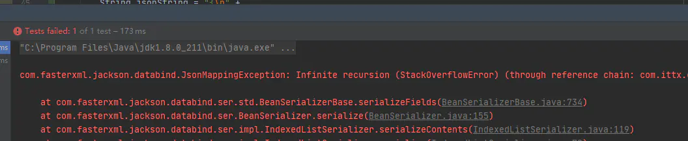
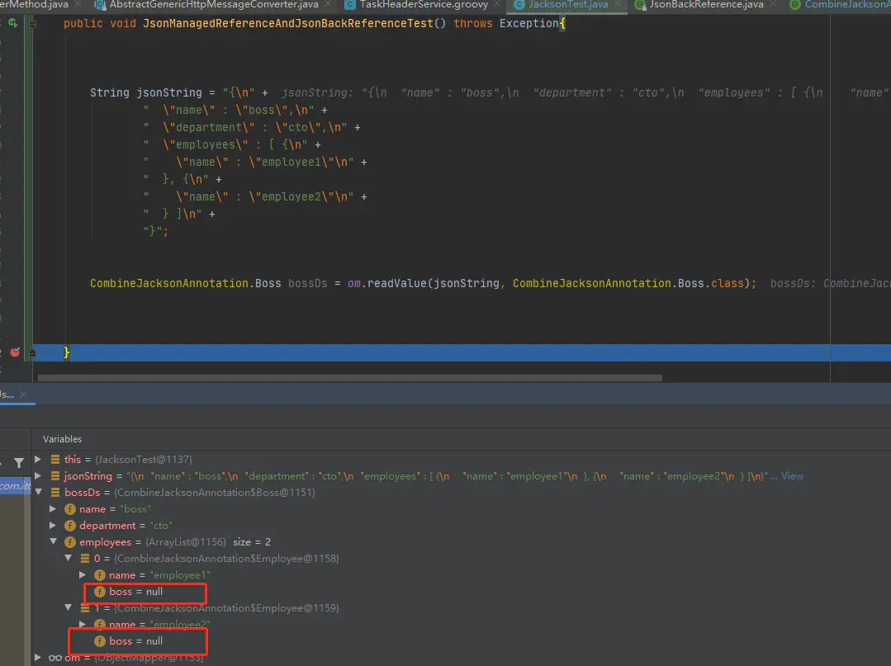
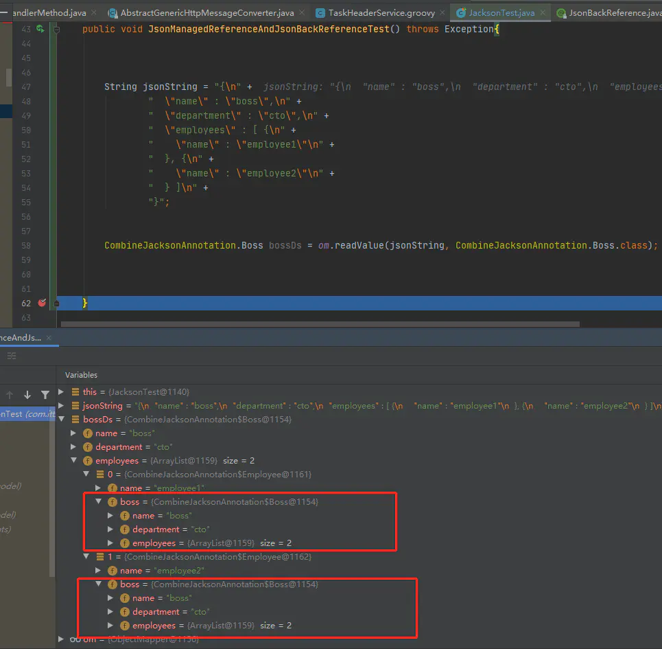

### Jackson Serialization And Deserialization Annotations

#### @JsonDeserialize 和 @JsonSerialize

> - @JsonDeserialize反序列化时使用，标注在setter或者字段上，需要使用 using 属性指定处理参数的类，该类需要继承 JsonDeserializer 类，并重写 deserialize()。
>
> - @JsonSerialize序列化时使用，标注在getter或者字段上， 需要使用 using 属性指定处理参数的类，该类需要继承 JsonSerializer 类，并重写 serialize()。

~~~~json
{
    "name": "zhangsan",
    "address": {
        "street": "xxx",
        "city": "aaa"
    }
}
~~~~

比如上面的json，对应java类

~~~java
public class Student{
    String name;
    String address; // 因为某种原因address的类型为String
}
~~~

将上面的json数据将无法反序列化为Student.class，因为json中address是Object类型而java中是String，并且就算是成功反序列化， 再次序列化也会得到如下的结果，因为address序列化时被自动加上了引号。

~~~json
{
    "name": "zhangsan",
    "address": "{
        "street": "xxx",
        "city": "aaa"
    }"
}
~~~

解决上面的问题使用如下方法：

~~~java
@Data
public class Student {
    String name;

    @JsonSerialize(using = JsonDataSerializer.class)
    @JsonDeserialize(using = JsonDataDeserializer.class)
    String address;
    
            // long类型转json给前端可能丢失进度, 序列化时long->string, 反序列化时string->long
        // 其他序列化器和反序列化器可以查看这两个类所在包的其他类
        @JsonSerialize(using = ToStringSerializer.class)
        @JsonDeserialize(using = NumberDeserializers.LongDeserializer.class)
        Long id;

    public static class JsonDataSerializer extends JsonSerializer<String> {
        @Override
        public void serialize(String value, JsonGenerator gen, SerializerProvider provider) throws IOException {
            gen.writeRawValue(value);
        }
    }

    public static class JsonDataDeserializer extends JsonDeserializer<String> {
        @Override
        public String deserialize(JsonParser p, DeserializationContext ctxt) throws IOException {
            JsonNode node = p.getCodec().readTree(p);
            return node.toString();
        }
    }

    public static void main(String[] args) throws JsonProcessingException {
        String student = "{\n" +
                "    \"name\": \"zhangsan\",\n" +
                "    \"address\": {\n" +
                "        \"street\": \"xxx\",\n" +
                "        \"city\": \"aaa\"\n" +
                "    }\n" +
                "}";
        ObjectMapper objectMapper = new ObjectMapper();
        Student student1 = objectMapper.readValue(student, Student.class);
        String s = objectMapper.writeValueAsString(student1);
        System.out.println(s);
    }
}
~~~


#### 枚举序列化与反序列化


## Jackson 常用注解

#### @JsonAnySetter和@JsonAnyGetter

@JsonAnyGetter用于序列化时，将Map属性中的kv对作为json的标准属性，即map中的key将作为json的key而不再被包装在map中。

@JsonAnySetter用于反序列化时，当json串有识别不了的属性时，可以使用一个map将其全部的接收下来。

- 标注在Map类型的字段上
- 或者非静态的两个类型的参数上，第一个参数为key，第二个参数为value

> 使用场景

当我们用一个Bean去接收参数的时候，就不用怕不同的接口参数不同，而去写好几个不同的Bean了，只需要一个Bean然后里面存放共有的属性和一个Map就行了，需要的字段直接从Map中拿就好了，省了很多的事情。

~~~java
@Data
public  class ExtendableBean {
        private String name;
        @JsonAnySetter
        // @Getter(onMethod_ = {@JsonAnyGetter}) 使用lombok
        private Map<String, String> properties = Maps.newHashMap();
        @JsonAnyGetter
        public Map<String, String> getProperties() {
            return properties;
        }
        // @JsonAnySetter, 标注在字段上或者方法上都可以
        public void setProp(String key, String value) {
            this.properties.put(key, value);
        }
    }
~~~

> 使用过程中的坑

想将@JsonAnySetter通过lombok放置在map的setter上面，发现无效。因为map的setter是setSqlParams(Map<String, String> map)， 这不是jackson要求的set方法。

~~~java
    @Getter(onMethod_ = {@JsonAnyGetter})
    @Setter(onMethod_ = {@JsonAnySetter})
    private Map<String, String> sqlParams = Maps.newHashMap();
~~~

正确做法是直接放置字段上，或者另写一个set方法

~~~java
    @Getter(onMethod_ = {@JsonAnyGetter})
    @JsonAnySetter
    private Map<String, String> sqlParams = Maps.newHashMap();

    // public void setProp(String key, String value) {
    //    this.sqlParams.put(key, value);
    // }
~~~

> 测试

序列化ExtendableBean：

~~~java
    @SneakyThrows
    @Test
    public void serialized (){
        ExtendableBean extendableBean = new ExtendableBean("zhangsan");
        extendableBean.setProp("key1", "value1");
        extendableBean.setProp("key2", "value2");
        new ObjectMapper().writerWithDefaultPrettyPrinter().writeValueAsString(extendableBean); 
    }
}
// 可以看到map中的key和value被当做整个json的key和value
//{
//  "name" : "zhangsan",
//  "key1" : "value1",
//  "key2" : "value2"
//}
~~~

反序列化：

~~~java
	@SneakyThrows
    @Test
    public void deserialized(){
        String json = "{\n" +
                "  \"name\" : \"zhangsan\",\n" +
                "  \"key1\" : \"value1\",\n" +
                "  \"key2\" : \"value2\"\n" +
                "}";
        ExtendableBean extendableBean = new ObjectMapper().readValue(json, ExtendableBean.class);
        System.out.println(extendableBean);
    }
// name=zhangsan, properties={key1=value1, key2=value2}
// 可以看到无法识别的json属性被放在的map中
~~~


#### @JsonGetter，@JsonSetter，@JsonProperty

这三个注解用来指定json和java中字段的对应关系

JsonGetter标注在getter方法上，序列化时指定getter属性对应的json的key。

JsonSetter标注在setter方法上，反序列化将指定的key应用在setter方法上。

JsonProperty标注在字段上，指定json和java的对应关系。

~~~java
public class People {

    // @JsonProperty("USERNAME")
    private String username;

    @JsonGetter("USERNAME")
    public String getUsername() {
        return username;
    }

    @JsonSetter("USERNAME")
    public void setUsername(String username) {
        this.username = username;
    }
}
~~~

**@JsonProperty还可以放在枚举类上，指示枚举类的序列化与反序列化。**

~~~java
public enum Status {
    @JsonProperty("ready")
    READY,
    @JsonProperty("notReady")
    NOT_READY,
    @JsonProperty("notReadyAtAll")
    NOT_READY_AT_ALL;
}
~~~


#### @JsonPropertyOrder

序列化时字段排序，alphabetic指定是否使用字母排序。value和alphabetic两个使用一个就好。

~~~java
@JsonPropertyOrder(value = {"time","name"}, alphabetic = true)
@Data
public class JsonTestModel {
    String name;
    Date time;
}
~~~


#### @JsonRowValue

标注在字段或者方法上，表示该属性序列化后的字符串是其本身， 而不需要加双引号，**单向工作**！！！

~~~java
    @SneakyThrows
    public static void main(String[] args) {
        RawBean bean = new RawBean("My bean", "{\"attr\":false}");
        ObjectMapper objectMapper = new ObjectMapper();
        String result = objectMapper
                .writerWithDefaultPrettyPrinter()
                .writeValueAsString(bean);
        System.out.println(result);

        // !!!!
        // @JsonRawValue只能单向工作，下面代码将导致报错
        // 双向工作可以再添加一个@JsonDeserialize自定义反序列化器
        RawBean rawBean = objectMapper.readValue(result, RawBean.class);
    }
    @Data
    @AllArgsConstructor
    public static class RawBean {
        public String name;
        @JsonRawValue
        public String json;  // 添加注释， json将会原样输出， 不加的时候，json会被添加上引号
    }
~~~

使用注解时：

~~~json
{
  "name" : "My bean",
  "json" : {"attr":false}
}
~~~

不使用时：

~~~json
{
  "name" : "My bean",
  "json" : "{\"attr\":false}"
}
~~~


#### @JsonValue

@JsonValue修饰一个字段或者无参有返回值的方法。指示jackson使用指定的字段或者方法序列化整个实例。多个@JsonValue将会报错。

~~~java
    @Data
    @AllArgsConstructor
    public class Student{
        @JsonValue
        private String name;
        private Integer age;

        // 使用toString()方法序列化实例
        // @JsonValue
        public String toString() {
            return "Student{" +
                    "name='" + name + '\'' +
                    ", age=" + age +
                    '}';
        }
    }

    @Test
    @SneakyThrows
    public void test(){
        Student student = new Student("zhangsan", 18);
        String s = new ObjectMapper().writerWithDefaultPrettyPrinter().writeValueAsString(student);
        System.out.println(s);  // "zhangsan"
    }
~~~

#### @JsonCreator

Jackson在反序列化的时候，会使用实体的默认无参构造函数来实例化一个对象，然后使用对象的setter方法来初始化属性值。如果没有无参构造的话会报错。

我们可以使用@JsonCreator来指定反序列化时候的构造函数，或者静态工厂方法。**Jackson会在调用@JsonCreator方法后继续调用setter方法进行属性的赋值。**

@JsonProperty可以标注在构造函数参数或者静态工厂方法上，指示要传入的json的key。

@ConstructorProperties只能放在构造方法上，效果同上。

~~~java
public static class Student{
        private String name;
        private Integer age;
    
        @JsonCreator // 调用构造方法后，依旧会调用age的setter方法。
        public Student(@JsonProperty("name")String name){
            this.name = name;
            this.age = 10;
        }

        // @JsonCreator和@ConstructorProperties搭配使用，不需要使用@JsonProperty， @ConstructorProperties只能使用在构造方法上
        // @JsonCreator
        // @ConstructorProperties({"name", "age"})
        // public Student(String name, Integer age){
        //     this.name = name;
        //     this.age = age;
        // }

        // 工厂方法
        @JsonCreator
        public static Student getInstance(@JsonProperty("name")String name, @JsonProperty("age")Integer age){
            return new Student(name, age);
        }
    }
~~~


#### @JsonRootName

指定序列化的json的根包装，使用时需要开启SerializationFeature.WRAP_ROOT_VALUE，否则无效。

对于这类json，反序列化时需要开启DeserializationFeature.UNWRAP_ROOT_VALUE。

~~~java
    @JsonRootName("student")
    @AllArgsConstructor
    @NoArgsConstructor
    @Data
    public static class Student{
        private String name;
        private Integer age;
    }

    @Test
    @SneakyThrows
    public void test(){
        Student student = new Student("zhangsan", 18);
        ObjectMapper objectMapper = new ObjectMapper();
        objectMapper.enable(SerializationFeature.WRAP_ROOT_VALUE);
        String s = objectMapper.writerWithDefaultPrettyPrinter().writeValueAsString(student);
        System.out.println(s);

        objectMapper.enable(DeserializationFeature.UNWRAP_ROOT_VALUE);
        Student student1 = objectMapper.readValue(s, Student.class);
        System.out.println(student1);
    }
~~~

~~~json
{
  "student" : {
    "name" : "zhangsan",
    "age" : 18
  }
}
JsonRootNameTest.Student(name=zhangsan, age=18)
~~~

对于序列化为xml时，默认情况下跟标签就是其类名。使用@JsonRootName可以指定根标签的名称， 还可以使用@JsonRootName的namespace属性。并且在使用XmlObject时不需要开启什么特性，感觉这个注解就是为xml而生的。

~~~java
    @JsonRootName(value = "student", namespace = "stu")
    @Data
    public static class Student{
        private String name;
        private Integer age;
    }

    @Test
    @SneakyThrows
    public void xml(){
        Student student = new Student("zhangsan", 18);
        XmlMapper xmlMapper = new XmlMapper();
        String s = xmlMapper.writerWithDefaultPrettyPrinter().writeValueAsString(student);
        System.out.println(s);

        Student student1 = xmlMapper.readValue(s, Student.class);
        System.out.println(student1);
    }
~~~

~~~xml
<student xmlns="stu">
  <name xmlns="">zhangsan</name>
  <age xmlns="">18</age>
</student>

JsonRootNameTest.Student(name=zhangsan, age=18)
~~~


#### @JacksonInject

指示jackson反序列化的时候被标注字段的值将由ObjectMapper注入。按照JacksonInject的使用可以分为按id注入和按类型注入。

> 按id注入

~~~java
    @Data
    public static class Student{
        private String name;
        private Integer age;
        @JacksonInject(value = "date")
        private Date date;
    }

    @Test
    @SneakyThrows
    public void test(){
        String json = "{\"name\":\"zhangsan\",\"age\":18}";
        ObjectMapper objectMapper = new ObjectMapper();
        InjectableValues.Std std = new InjectableValues.Std();
        std.addValue("date", new Date());
        objectMapper.setInjectableValues(std);
        Student student = objectMapper.readValue(json, Student.class); // name=zhangsan, age=18, date=Thu Jul 01 16:49:28 CST 2021
    }
~~~

> 按type注入

~~~java
    @Data
    public static class Student{
        private String name;
        private Integer age;
        @JacksonInject
        private Date date;
    }
    @Test
    @SneakyThrows
    public void test1(){
        String json = "{\n" +
                "  \"name\" : \"zhangsan\",\n" +
                "  \"age\" : 18\n" +
                "}";
        ObjectMapper objectMapper = new ObjectMapper();
        InjectableValues.Std std = new InjectableValues.Std();
        std.addValue(Date.class, new Date());
        objectMapper.setInjectableValues(std);
        Student student = objectMapper.readValue(json, Student.class); // name=zhangsan, age=18, date=Thu Jul 01 16:52:26 CST 2021
    }
~~~


#### @JsonAlias

反序列化时指定多个json字段对应一个java字段

~~~java
    @Data
    public static class Student{
        @JsonAlias({"Name", "namE"})
        private String name;
        private Integer age;
    }

    @Test
    @SneakyThrows
    public void test1(){
        String json = "{\"namE\" : \"zhangsan\",  \"age\" : 18}";
        ObjectMapper objectMapper = new ObjectMapper();
        Student student = objectMapper.readValue(json, Student.class); // name=zhangsan, age=18
    } 
~~~


#### @JsonFormat

用于格式化时间

> @JsonFormat

用于序列化时指定格式

~~~java
@JsonFormat(pattern="yyyy-MM-dd",timezone = "GMT+8")
LocalDataTime localDataTime
~~~

#### @JsonUnwrapped

扁平化被注解的字段

~~~java
public class Money {
    private double remain;
}
public class PersonInfo {
    private String name;
    private int id;
}

public class Account {
    @JsonUnwrapped
    private Money money;
    @JsonUnwrapped
    private PersonInfo personInfo;
}
~~~

序列化之后：

~~~json
{
    "remain": 1030.0,
    "name": "tangbaobao",
    "id": 1
}
~~~


#### @JsonView

用于序列化时对不同字段进行分组显示

~~~java
    public interface Base{}
    public interface Big extends Base{}
    public interface Small extends Base{}

    @Data
    @AllArgsConstructor
    public static class Student{
        @JsonView(Base.class)
        private String name;
        @JsonView(Big.class)
        private Integer big;
        @JsonView(Small.class)
        private Integer small;
        private Integer middle;
    }

    @Data
    @AllArgsConstructor
    public static class Student2{
        @Getter
        @Setter
        @JsonView(Base.class)
        private Student student;
    }

    @Test
    @SneakyThrows
    public void test(){
        ObjectMapper objectMapper = new ObjectMapper();
        Student student = new Student("zahngsan", 999, 111, 555);
        System.out.println(objectMapper.writerWithView(Base.class).writeValueAsString(student)); // {"name":"zahngsan","middle":555}
        System.out.println(objectMapper.writerWithView(Big.class).writeValueAsString(student)); // {"name":"zahngsan","big":999,"middle":555}
        System.out.println(objectMapper.writerWithView(Small.class).writeValueAsString(student)); // {"name":"zahngsan","small":111,"middle":555}

        Student2 student2 = new Student2(student);
        System.out.println(objectMapper.writerWithView(Big.class).writeValueAsString(student2)); // {"student":{"name":"zahngsan","big":999,"middle":555}}

    }
~~~

上面分别定义了三个接口以表示三个不同的view，因为big和small继承自base，所以使用big和small的时候也会显示base view的字段。并且未被标注为任何view的middle也被输出。

同时该注解可以直接使用在controller上。但是这里的@JsonView只能包含一个class， 并且未被标注为任何view的middle将不会被输出。

~~~java
    @GetMapping("/say")
    @JsonView(JsonViewTest.Small.class)
    public JsonViewTest.Student2 say() {
        return new JsonViewTest.Student2(new JsonViewTest.Student("zhangsan", 999, 111, 555));
        // {"student": {"name": "zhangsan","small": 111}
}
    }

    @GetMapping("/say2")
    @JsonView(JsonViewTest.Big.class)
    public JsonViewTest.Student say2() {
        return new JsonViewTest.Student("zhangsan", 999, 111, 555);
        // {"name": "zhangsan","big": 999}
    }
~~~


#### @JsonManagedReference，@JsonBackReference， @JsonIdentityInfo

> @JsonManagedReference，@JsonBackReference

https://www.jianshu.com/p/e85c3dfba052

Jackson在序列化对象的时候，如果对象里面有循环依赖的情况，会报栈溢出，示例如下

```java
    @Getter
    @Setter
    @NoArgsConstructor
    class Boss{
        String name;
        String department;
        List<Employee> employees;
    }

   @Getter
    @Setter
    @NoArgsConstructor
    class Employee{
        String name;
        Boss   boss;
    }
 @Test
    public void JsonManagedReferenceAndJsonBackReferenceTest() throws Exception{
        CombineJacksonAnnotation.Employee employee1 = new  CombineJacksonAnnotation.Employee();
        employee1.setName("employee1");

        CombineJacksonAnnotation.Employee employee2 = new  CombineJacksonAnnotation.Employee();
        employee2.setName("employee2");

        CombineJacksonAnnotation.Boss boss = new CombineJacksonAnnotation.Boss();
        boss.setName("boss");
        boss.setDepartment("cto");
        boss.setEmployees(Lists.newArrayList(employee1,employee2));

        employee1.setBoss(boss);
        employee2.setBoss(boss);

        System.out.println(om.writeValueAsString(boss));
```

运行测试代码



针对这种情况，Jackson提供了@JsonBackReference，加上此注解的字段，不会被序列化，也就打断了循环依赖，如下

```java
    @Getter
    @Setter
    @NoArgsConstructor
    class Employee{
        String name;
        @JsonBackReference
        Boss   boss;
    }
```

再次运行测试代码，结果如下

```json
{
  "name" : "boss",
  "department" : "cto",
  "employees" : [ {
    "name" : "employee1"
  }, {
    "name" : "employee2"
  } ]
}
```

可以看到，在序列化的时候，成功的将Employee里面的Boss忽略掉了，按照这样的逻辑，貌似@JsonBackReference 与@JsonIgnore很相似，我们可以试验下，将@JsonBackReference替换成@JsonIgnore，如下

```dart
    @Getter
    @Setter
    @NoArgsConstructor
    class Employee{
        String name;
        @JsonIgnore
        Boss   boss;
    }
```

再次运行代码，可以得到相同的序列化结果，那么@JsonBackReference与@JsonIgnore的区别在哪里呢，区别主要体现在反序列的时候，我们将上面例子中序列化的结果进行反序列化，看看效果，代码如下



可以看到Employee里面的Boss属性没有被赋值，但是我们将代码修改如下

```dart
    @Getter
    @Setter
    @NoArgsConstructor
    class Boss{
        String name;
        String department;
        @JsonManagedReference
        List<Employee> employees;
    }
    @Getter
    @Setter
    @NoArgsConstructor
    class Employee{
        String name;
        @JsonBackReference
        Boss   boss;
    }
```

再次进行反序列化，奇迹出现了



当属性分别打上@JsonManagedReference 与 @JsonBackReference时，Jackson会知道这两个属性间有父子关系，反序列化初始化的时候会建立起循环依赖。
 可以说这一对注解是解决父子间循环依赖的利器。

> @JsonIdentityInfo

@JsonIdentityInfo也可以解决父子之间的依赖关系，但是比上面介绍的两个注解更加的灵活，在上面的两个注解中，我们自己明确类之间的父子关系，但是@JsonIdentityInfo是独立的，解决的是相互之间的依赖关系，没有父子之间的上下关系。使用方法如下

```dart
   @Getter
    @Setter
    @NoArgsConstructor
    @JsonIdentityInfo(property = "@id",generator = ObjectIdGenerators.IntSequenceGenerator.class)
    class Boss{
        String name;
        String department;
        //@JsonManagedReference
        List<Employee> employees;
    }

    @Getter
    @Setter
    @NoArgsConstructor
    @JsonIdentityInfo(property = "@id",generator = ObjectIdGenerators.IntSequenceGenerator.class)
    class Employee{
        String name;
        //@JsonBackReference
        Boss   boss;
    }

 @Test
    public void JsonIdentityInfoTest() throws Exception{

        CombineJacksonAnnotation.Employee employee1 = new  CombineJacksonAnnotation.Employee();
        employee1.setName("employee1");

        CombineJacksonAnnotation.Employee employee2 = new  CombineJacksonAnnotation.Employee();
        employee2.setName("employee2");

        CombineJacksonAnnotation.Boss boss = new CombineJacksonAnnotation.Boss();
        boss.setName("boss");
        boss.setDepartment("cto");
        boss.setEmployees(Lists.newArrayList(employee1,employee2));

        employee1.setBoss(boss);
        employee2.setBoss(boss);

        System.out.println(om.writeValueAsString(boss));
}
输出如下
{
  "@id" : 1,
  "name" : "boss",
  "department" : "cto",
  "employees" : [ {
    "@id" : 2,
    "name" : "employee1",
    "boss" : 1
  }, {
    "@id" : 3,
    "name" : "employee2",
    "boss" : 1
  } ]
}
```

其中@id表明此类的唯一标签名，我们可以使用类已经存在的属性名，如下

```ruby
@Getter
    @Setter
    @NoArgsConstructor
    @JsonIdentityInfo(property = "name",generator = ObjectIdGenerators.PropertyGenerator.class)
    class Boss{

        String name;
        String department;
        //@JsonManagedReference
        List<Employee> employees;


    }

    @Getter
    @Setter
    @NoArgsConstructor
    @JsonIdentityInfo(property = "name",generator = ObjectIdGenerators.PropertyGenerator.class)
    class Employee{

        String name;
        //@JsonBackReference
        Boss   boss;
    }
输出结果如下
{
  "name" : "boss",
  "department" : "cto",
  "employees" : [ {
    "name" : "employee1",
    "boss" : "boss"
  }, {
    "name" : "employee2",
    "boss" : "boss"
  } ]
}
```

此注解的使用在解决循环解决的时候更加的灵活。

> 另一个案例

https://blog.csdn.net/qq_35357001/article/details/55505659

~~~java
public class TreeNode {  
    String name;  
    @JsonBackReference  
//  @JsonIgnore  
    TreeNode parent;  
    @JsonManagedReference  
    List<TreeNode> children;  
}
~~~

~~~java
public class JsonTest {  
    static TreeNode node;  
  
    @BeforeClass  
    public static void setUp() {  
        TreeNode node1 = new TreeNode("node1");  
        TreeNode node2 = new TreeNode("node2");  
        TreeNode node3 = new TreeNode("node3");  
        TreeNode node4 = new TreeNode("node4");  
        TreeNode node5 = new TreeNode("node5");  
        TreeNode node6 = new TreeNode("node6");  
  
        node1.addChild(node2);  
        node2.setParent(node1);  
        node2.addChild(node3);  
        node3.setParent(node2);  
        node2.addChild(node4);  
        node4.setParent(node2);  
        node3.addChild(node5);  
        node5.setParent(node3);  
        node5.addChild(node6);  
        node6.setParent(node5);  
  
        node = node3;  
    }  
  
    @Test   
    public void test() throws JsonGenerationException, JsonMappingException, IOException {  
        ObjectMapper mapper = new ObjectMapper();  
        String json = mapper.writeValueAsString(node);  
        System.out.println(json);  
        TreeNode readValue = mapper.readValue(json, TreeNode.class); 
        System.out.println(readValue.getName());  
    }  
  
    @AfterClass  
    public static void tearDown() {  
        node = null;  
    }  
}  
~~~


### Ignore Null Fields with Jackson

~~~java
// Include.Include.ALWAYS 默认 
// Include.NON_DEFAULT 属性为默认值不序列化 
// Include.NON_EMPTY 属性为 空（“”） 或者为 NULL 都不序列化 
// Include.NON_NULL 属性为NULL 不序列化 
~~~

使用Jackson进行对象序列化时，默认会输出值为null的字段。

很多时候，序列化null字段是没有意义的。如果想忽略null字段，一起来看看Jackson提供的几种方法。

> 默认

```java
@Data
public class Animal {
    private String name;
    private int sex;
    private Integer weight;
}
```

当weight为null时默认输出

~~~json
{"name":"sam","sex":1,"weight":null}
~~~

> 全局忽略

~~~java
@Test
public void nonNullForGlobal() throws JsonProcessingException {
    // 指定序列化时的包含规则，NON_NULL表示序列化时忽略值为null的字段
    // 使用该ObjectMapper序列化时有效
    ObjectMapper mapper = new ObjectMapper();
    mapper.setSerializationInclusion(JsonInclude.Include.NON_NULL);
   
}
~~~

> 类范围

~~~java
@JsonInclude(JsonInclude.Include.NON_NULL) // 序列化时忽略所有值为null的字段
public class Animal2NonNull {
    private String name;
    private int sex;
    private Integer weight;
}
~~~

> 指定字段

~~~java
public class Animal2NonNull {
    private String name;
    private int sex;
    @JsonInclude(JsonInclude.Include.NON_NULL) // 如果字段值为null，则不进行序列化
    private Integer weight;
}
~~~


### Jackson Ignore Property

#### @JsonIgnoreProperties

标注在类上，用于序列化和反序列化时忽略标注类的对应属性

ignoreUnknown属性表示在反序列化该类时是否忽略未知的属性。

~~~java
@JsonIgnoreProperties(value = { "id" }, ignoreUnknown = true)
public class BeanWithIgnore {
    public int id;
    public String name;
}
~~~

#### @JsonIgnore

标注在字段上， 指示jackson序列化和反序列时忽略该字段

~~~java
public class BeanWithIgnore {
    @JsonIgnore
    public int id;

    public String name;
}
~~~

#### @JsonIgnoreType

标注在类上， 当该类作为其他类的属性被序列化时将会被忽略。

~~~java
@NoArgsConstructor
@JsonIgnoreType
public class JsonIgnoreTypeTest {

    public Integer id;
    public Student student;

    @Data
    @AllArgsConstructor
    @NoArgsConstructor
    @JsonIgnoreType
    public static class Student{
        private String name;
        private Integer age;
    }

    @Test
    @SneakyThrows
    public void test1(){
        Student zhangsan = new Student("zhangsan", 18);
        JsonIgnoreTypeTest test = new JsonIgnoreTypeTest();
        test.id = 2313123;
        test.student = zhangsan;
        ObjectMapper objectMapper = new ObjectMapper();
        System.out.println(objectMapper.writeValueAsString(test));
       System.out.println(objectMapper.writeValueAsString(zhangsan));
        // {"id":2313123}
        // {"name":"zhangsan","age":18}
    }
}
~~~

当我们需要忽略源码上的某种类型时，我们无法在其上面添加@JsonIgnoreType， 这时可以使用ObjectMapper.addMix()。

~~~java
    @JsonIgnoreType
    public static class StudentType{}

    ObjectMapper objectMapper = new ObjectMapper();
    objectMapper.addMixIn(String.class, Student.class);
~~~

这样会使用StudentType上的注解覆盖Student上的注解。


#### @JsonFilter

通过过滤器过滤字段

~~~java
@Data
    @AllArgsConstructor
    @JsonFilter("first") // 使用id为first的过滤器
    public static class Student{
        private String name;
        private Integer age;
        private Integer id;
    }

    @Test
    @SneakyThrows
    public void test1(){
        Student student = new Student("zhangsan", 14, 391);
        ObjectMapper objectMapper = new ObjectMapper();
        SimpleFilterProvider simpleFilterProvider = new SimpleFilterProvider();
        simpleFilterProvider.addFilter("first", SimpleBeanPropertyFilter.serializeAll()); // 序列化所有
        simpleFilterProvider.addFilter("second", SimpleBeanPropertyFilter.serializeAllExcept("age", "name")); // 序列化所有，除了age和name
        simpleFilterProvider.addFilter("third", SimpleBeanPropertyFilter.filterOutAllExcept("name")); // 过滤所有除了name
        objectMapper.setFilterProvider(simpleFilterProvider);
        // objectMapper.writer(simpleFilterProvider).writeValueAsString(student);
        System.out.println(student);
    }
~~~


#### @JsonAutoDetect

默认情况下， jackson会序列化public的字段和public的getter方法的字段。并且反序列化的时候调用无参构造函数和public的字段和setter。

标注在类上， 重新定义jackson对不同访问权限控制符的可见性。

```java
Visibility.ANY // 任何类型的访问权限控制符都是可见的
Visibility.NON_PRIVATE // 任何非private的权限控制符都是可见的
Visibility.PROTECTED_AND_PUBLIC // protected and public
Visibility.PUBLIC_ONLY // public only
Visibility.NONE  // 任何控制符都不可见
Visibility.DEFAULT // 取决于父级的visibility settings
```

可以设置的类型有

~~~java
getterVisibility
isGetterVisibility
setterVisibility
creatorVisibility
fieldVisibility
~~~

当使用如下注解时， 序列化后的结果：`{"name":"zhangsan","age":1,"sex":18,"id":123}`
~~~java
    @JsonAutoDetect(fieldVisibility = JsonAutoDetect.Visibility.ANY)
    public static class Student{
         private String name;
         protected Integer age;
         Integer sex;
         public Integer id;
    }
~~~

当使用`@JsonAutoDetect(fieldVisibility = JsonAutoDetect.Visibility.PROTECTED_AND_PUBLIC)`时结果为`{"age":1,"id":123}`

当使用`@JsonAutoDetect(fieldVisibility = JsonAutoDetect.Visibility.NONE)`时将抛出异常，因为没有可以序列化的字段。


### ObjectMapper

~~~java
public class Car {
    private String color;
    private String type;
}
~~~

#### Java Object to JSON

~~~java
ObjectMapper objectMapper = new ObjectMapper();
Car car = new Car("yellow", "renault");
// 写入文件
objectMapper.writeValue(new File("target/car.json"), car); 

// 写为string
String carAsString = objectMapper.writeValueAsString(car);

// 写为字节数组
byte[] bytes = objectMapper.writeValueAsBytes(car);
~~~

#### JSON to Java Object

~~~java
// 从字符串读取
String json = "{ \"color\" : \"Black\", \"type\" : \"BMW\" }";
Car car = objectMapper.readValue(json, Car.class);

// 从文件读取
Car car = objectMapper.readValue(new File("src/test/resources/json_car.json"), Car.class);

// 从url读取
Car car = 
  objectMapper.readValue(new URL("file:src/test/resources/json_car.json"), Car.class);
~~~

#### JSON to Jackson JsonNode

获取到的JsonNode一般要强转成ObjectNode才会有类似新增，删除，修改JsonNode的方法，JsonNode的方法不太全。数组的话可以转成ArrayNode。

~~~java
String json = "{ \"color\" : \"Black\", \"type\" : \"FIAT\" }";
JsonNode jsonNode = objectMapper.readTree(json);
ObjectNode objectNode = (ObjectNode)jsonNode
String color = jsonNode.get("color").asText();
~~~

#### JSON Array String to Java List

~~~java
String jsonCarArray = 
  "[{ \"color\" : \"Black\", \"type\" : \"BMW\" }, { \"color\" : \"Red\", \"type\" : \"FIAT\" }]";
List<Car> listCar = objectMapper.readValue(jsonCarArray, new TypeReference<List<Car>>(){});
~~~

#### JSON String to Java Map

~~~java
String json = "{ \"color\" : \"Black\", \"type\" : \"BMW\" }";
Map<String, Object> map 
  = objectMapper.readValue(json, new TypeReference<Map<String,Object>>(){});
~~~

#### Configuring Serialization or Deserialization Feature

~~~java
objectMapper.configure(DeserializationFeature.FAIL_ON_UNKNOWN_PROPERTIES, false);
Car car = objectMapper.readValue(jsonString, Car.class);

objectMapper.configure(DeserializationFeature.FAIL_ON_NULL_FOR_PRIMITIVES, false);

objectMapper.configure(DeserializationFeature.FAIL_ON_NUMBERS_FOR_ENUMS, false);
~~~


### Else


#### 自定义Jackson注解

~~~java
@Retention(RetentionPolicy.RUNTIME)
    @JacksonAnnotationsInside
    @JsonInclude(Include.NON_NULL)
    @JsonPropertyOrder({ "name", "id", "dateCreated" })
    public @interface CustomAnnotation {}
~~~

~~~~java
@CustomAnnotation
public class BeanWithCustomAnnotation {
    public int id;
    public String name;
    public Date dateCreated;
}
~~~~


#### Jackson MixIn（混合）

ObjectMapper#addMixIn(Class\<?> target, Class<?> mixinSource)用于将来自mixinSource所有注释都用于覆盖target （或其超类型）具有的注释。

```java
public class Item {
    public int id;
    public String itemName;
    public User owner;
}
@JsonIgnoreType
public class MyMixInForIgnoreType {}
```

```java
@Test
public void whenSerializingUsingMixInAnnotation_thenCorrect() 
  throws JsonProcessingException {
    Item item = new Item(1, "book", null);
    ObjectMapper mapper = new ObjectMapper();
    // 把MyMixInForIgnoreType覆盖到User类上
    mapper.addMixIn(User.class, MyMixInForIgnoreType.class);
    result = mapper.writeValueAsString(item);
}
```


#### Disable Jackson Annotation

设置ObjectMapper不使用注解， 即所有注解都无效

~~~~java
ObjectMapper mapper = new ObjectMapper();    mapper.disable(MapperFeature.USE_ANNOTATIONS);
~~~~


#### 序列化数字转字符串

> 针对单个字符串

~~~java
    @JSONField(serializeUsing = com.alibaba.fastjson.serializer.ToStringSerializer.class)
    @JsonSerialize(using = com.fasterxml.jackson.databind.ser.std.ToStringSerializer.class)
Long id;
~~~

> 全局设置

- Jackson

  - 在application.properties中，可以使用`spring.jackson.generator.write-numbers-as-strings=true`

  - 单个ObjectMapper

    ~~~java
    ObjectMapper objectMapper = JsonMapper.builder()
        .configure(JsonWriteFeature.WRITE_NUMBERS_AS_STRINGS, true)
        .build();
    ~~~

    

- fastjson

  ~~~java
  @Configuration
  public class SessionConfig implements WebMvcConfigurer{
      
      @Override
      public void configureMessageConverters(List<HttpMessageConverter<?>> converters) {
          FastJsonHttpMessageConverter fastJsonConverter = new FastJsonHttpMessageConverter();
          FastJsonConfig fjc = new FastJsonConfig();
          /**
           * 序列换成json时,将所有的long变成string
           * 因为js中得数字类型不能包含所有的java long值
           */
          SerializeConfig serializeConfig = SerializeConfig.globalInstance;
          serializeConfig.put(Long.class , ToStringSerializer.instance);
          serializeConfig.put(Long.TYPE , ToStringSerializer.instance);
          fjc.setSerializeConfig(serializeConfig);
          fastJsonConverter.setFastJsonConfig(fjc);
          converters.add(fastJsonConverter);
      }
  }
  ~~~


#### 格式化时间

> @JsonFormat

序列化时候格式化时间

~~~java
    @JsonFormat(pattern="yyyy-MM-dd",timezone = "GMT+8")
    private LocalDateTime gmtModified;
~~~


> @JsonField

fastjson用于格式化时间的注解

~~~java
    @JSONField(format="yyyy-MM-dd HH:mm:ss")
    private LocalDateTime gmtModified;
~~~


> @DataTimeFormat

spring的注解， 用于controller接收前端数据时， 指定前端数据的格式

~~~java
@DateTimeFormat(pattern = "yyyy-MM-dd")
private Date symendtime;
~~~

