类的加载过程

转载自https://blog.csdn.net/ln152315/article/details/79223441

#### 加载

简单来说，加载指的是把class字节码文件从各个来源通过类加载器装载入内存中。

这里有两个重点：

字节码来源。一般的加载来源包括从本地路径下编译生成的.class文件，从jar包中的.class文件，从远程网络，以及动态代理实时编译

类加载器。一般包括启动类加载器，扩展类加载器，应用类加载器，以及用户的自定义类加载器。

注：为什么会有自定义类加载器？

一方面是由于java代码很容易被反编译，如果需要对自己的代码加密的话，可以对编译后的代码进行加密，然后再通过实现自己的自定义类加载器进行解密，最后再加载。

另一方面也有可能从非标准的来源加载代码，比如从网络来源，那就需要自己实现一个类加载器，从指定源进行加载。

#### 验证

主要是为了保证加载进来的字节流符合虚拟机规范，不会造成安全错误。

包括对于文件格式的验证，比如常量中是否有不被支持的常量？文件中是否有不规范的或者附加的其他信息？

对于元数据的验证，比如该类是否继承了被final修饰的类？类中的字段，方法是否与父类冲突？是否出现了不合理的重载？

对于字节码的验证，保证程序语义的合理性，比如要保证类型转换的合理性。

对于符号引用的验证，比如校验符号引用中通过全限定名是否能够找到对应的类？校验符号引用中的访问性（private，public等）是否可被当前类访问？

#### 准备

主要是为类变量（注意，不是实例变量）分配内存，并且赋予初值。

特别需要注意，初值，不是代码中具体写的初始化的值，而是Java虚拟机根据不同变量类型的默认初始值。

比如8种基本类型的初值，默认为0；引用类型的初值则为null；常量的初值即为代码中设置的值，final static tmp = 456， 那么该阶段tmp的初值就是456

#### 解析

将常量池内的符号引用替换为直接引用的过程。

两个重点：

符号引用。即一个字符串，但是这个字符串给出了一些能够唯一性识别一个方法，一个变量，一个类的相关信息。

直接引用。可以理解为一个内存地址，或者一个偏移量。比如类方法，类变量的直接引用是指向方法区的指针；而实例方法，实例变量的直接引用则是从实例的头指针开始算起到这个实例变量位置的偏移量

举个例子来说，现在调用方法hello()，这个方法的地址是1234567，那么hello就是符号引用，1234567就是直接引用。

在解析阶段，虚拟机会把所有的类名，方法名，字段名这些符号引用替换为具体的内存地址或偏移量，也就是直接引用。

#### 初始化

这个阶段主要是对类变量初始化，是执行类构造器的过程。

换句话说，只对**static修饰的变量或语句进行初始化**。

如果初始化一个类的时候，其父类尚未初始化，则优先初始化其父类。

如果同时包含多个静态变量和静态代码块，则按照自上而下的顺序依次执行。

总结
类加载过程只是一个类生命周期的一部分，在其前，有编译的过程，只有对源代码编译之后，才能获得能够被虚拟机加载的字节码文件；在其后还有具体的类使用过程，当使用完成之后，还会在方法区垃圾回收的过程中进行卸载。


## jar命令详解

jar命令格式：`jar ` `{c t x u f }` `[ v m e 0 M i ]` `[-C 目录]` `文件名...`

其中{ctxu}这四个参数必须选选其一。[v f m e 0 M i ]是可选参数，文件名也是必须的。

-c 创建一个jar包
-t 显示jar中的内容列表
-x 解压jar包
-u 添加文件到jar包中
-f 指定jar包的文件名
-v 生成详细的报造，并输出至标准设备
-m 指定manifest.mf文件.(manifest.mf文件中可以对jar包及其中的内容作一些一设置)
-0 产生jar包时不对其中的内容进行压缩处理
-M 不产生所有文件的清单文件(Manifest.mf)。这个参数与忽略掉-m参数的设置
-i  为指定的jar文件创建索引文件
-C 表示转到相应的目录下执行jar命令,相当于cd到那个目录，然后不带-C执行jar命令

> 创建jar包

~~~shell
jar -cf hello.jar hello
~~~

根据hello目录生成一个hello.jar包

> 创建并显示打包过程

~~~shell
jar -cvf hello.jar hello
~~~

根据hello目录生成一个hello.jar包, 并显示创建过程

> 显示jar包内容

~~~shell
jar -tvf hello.jar
~~~

> 解压jar包

~~~shell
jar -xvf hello.jar
~~~

> 创建jar包, 并指定MANIFEST.MF文件

~~~shell
jar -cvfm hello.jar MANIFEST.MF hello
~~~

创建该jar包后, jar包中的MANIFEST.MF文件与指定的文件内容相同

> 创建不包含META-INF目录及MANIFEST.MF文件的jar包

~~~shell
jar -cvfM hello.jar hello
~~~

> -C选项

~~~shell
jar cvfm hello.jar mymanifest.mf -C hello/
~~~

表示切换到hello目录下然后再执行jar命令


## 记一次手动编译java项目

[文件](file:///./img/java/javacdemo)

#### 项目目录

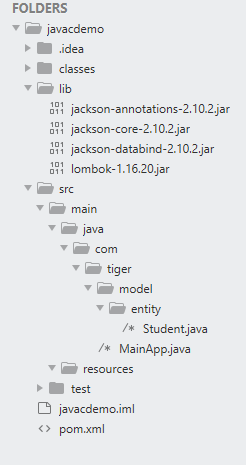

项目名称为javacdemo，目录如下：

- classes主要用于放置编译后的class文件
- lib主要放置项目引用的jar包
- src按照maven项目的格式
- pom.xml可以忽略，因为要手动编译

两个java文件如下：

Student.java

~~~java
package com.tiger.model.entity;

public class Student {
    private Integer age;
    private String name;
    public Integer getAge() {
        return age;
    }
    public void setAge(Integer age) {
        this.age = age;
    }
    public String getName() {
        return name;
    }
    public void setName(String name) {
        this.name = name;
    }
    public Student(Integer age, String name) {
        this.age = age;
        this.name = name;
    }
}
~~~

Main.java

~~~java
package com.tiger;

import com.fasterxml.jackson.core.JsonProcessingException;
import com.fasterxml.jackson.databind.ObjectMapper;
import com.tiger.model.entity.Student;

public class MainApp {

    public static void main(String[] args) {
        try {
            Student a = new Student(12, "zhangsna");
            ObjectMapper objectMapper = new ObjectMapper();
            String s = objectMapper.writerWithDefaultPrettyPrinter().writeValueAsString(a);
            System.out.println(s);
        } catch (JsonProcessingException e){
            e.printStackTrace();
        }

    }
}
~~~

MainApp引用了jackson相关类和com.tiger.model.entity.Student.java

#### 编译

<font color=red>windows下请使用cmd进行编译，不要使用power shell，貌似是指定-cp时，windwos下多个路径在使用；分开，在linux下使用：隔开。但是power shell输入；认为命令已经结束， 输入：会认为多个路径是同一个路径。</font>

cd到项目根目录下：


编译项目：

~~~shell
javac -d classes -cp lib\*;src\main\java -verbose src\main\java\com\tiger\MainApp.java
~~~

-d 指定项目编译后的class的存放地址。

-cp指定classpath路径，需要用到jar包都存放在lib文件夹下。这里我们使用到了jackson的一些jar包，放在了javacdemo\lib目录下，多个jar包可以一一指定，也可以使用通配符*，他将匹配lib下所有的.jar和.JAR文件。

同时还要指定src\main\java目录，因为编译需要的Student.java存放在该目录下。

~~~shell
lib\*;src\main\java
~~~


-verbose表示输出详细的编译信息。

编译之后查看classes目录

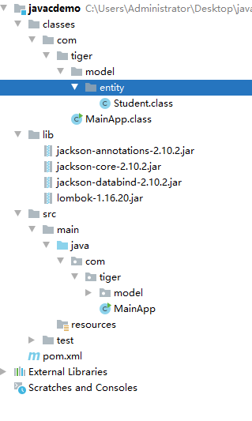

#### 关于javac命令中classpath的作用

当执行javac命令的时候（cp后面的.表示当前目录，为了说明原理添加上，在本例中没什么用）：

~~~shell
javac -d classes -cp .;lib\*;src\main\java -verbose src\main\java\com\tiger\MainApp.java
~~~

javac首先找到并读取src\main\java\com\tiger\MainApp.java（这个就是命令后面指定的）。但是MainApp.java导入了

```
import com.fasterxml.jackson.core.JsonProcessingException;
import com.fasterxml.jackson.databind.ObjectMapper;
import com.tiger.model.entity.Student;
```

这个时候java编译器需要找到这三个类才能编译MainApp，话句话说就是MainApp的编译需要这三个类的参与，但是要去哪里找呢？

>  没有CLASSPATH环境变量，也没有使用-cp或者-classpath的话，默认从当前路径寻找。

但是当前路径是哪个路径的？其实这个命令就是你执行javac命令的路径，我是在C:\Users\Administrator\Desktop\javacdemo目录下执行的javac命令，所以当前路径就是C:\Users\Administrator\Desktop\javacdemo。<font color=red>java编译器查找当前路径+包路径（把需要导入的类的包名中的.转换为路径分隔符）下有没有对应的class文件或者java文件。</font>具体来说就是查找C:\Users\Administrator\Desktop\javacdemo\com\tiger\model\entity\Student.java(Student.class)和C:\Users\Administrator\Desktop\javacdemo\com\fasterxml\jackson\databind\ObjectMapper.java(ObjectMapper.class)。JsonProcessingException类同理。如果没有找到对应class或者java文件报错。找到一个java和class文件，对比两者新旧，java文件新的话将该java文件进行编译并使用编译后的class文件，class文件新的话直接使用该class文件。如果找到多个java文件或者多个class文件报错。

如果我们不指定CLASSPATH环境变量的话，也不使用-cp或者-classpath的话肯定是编译不成功的。因为找不到。

> CLASSPATH的作用与-cp和-classpath的作用相同。使用了-cp或者-classpath，会覆盖CLASSPATH环境变量。

如果你在环境变量中设置了classpath的话同时没有使用-cp和-classpath的话，java编译器会根据CLASSPATH环境变量来查找上述的三个文件，

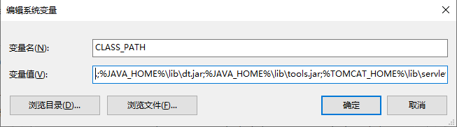而如果你使用了-cp或者-classpath的话，java编译器就会根据来你指定的路径来查找上述的三个类。

那么具体怎么个查找法呢？这里以查找Student类为例。

~~~shell
javac -d classes -cp .;lib\*;src\main\java -verbose src\main\java\com\tiger\MainApp.java
~~~

- 根据-cp的指定的路径，首先会查找当前目录下（注意-cp后面的小点，他表示当前路径）是否有Student类的java文件或者class文件，具体就是C:\Users\Administrator\Desktop\javacdemo\com\tiger\model\entity\Student.java(Student.class)文件。
- 然后查找lib下的jackson-core-2.10.2.jar包里面有没有com\tiger\model\entity\Student.java(Student.class)。其实jar包可以看作另类的压缩包，解压后可以看到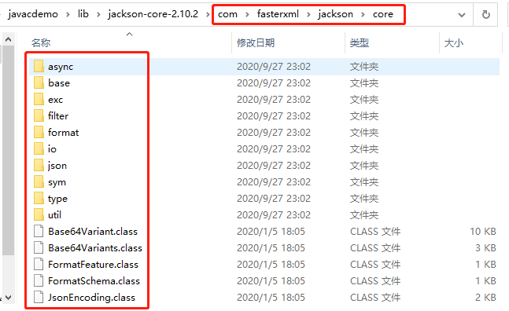

- 然后再查找lib下的jackson-annotations-2.10.2.jar包中有没有com\tiger\model\entity\Student.java(Student.class)。
- 同理再查找jackson-detabind-2.10.2.jar。
- 最后查找src\main\java\com\tiger\model\entity\Student.java(Student.class)

找到一个java和class文件，对比两者新旧，java文件新的话将该java文件进行编译并使用编译后的class文件，class文件新的话直接使用该class文件。如果找到多个java文件或者多个class文件报错。

#### java命令中classpath的作用

javac命令中classpath的作用大体上与java命令中的classpath相同，但是要注意一点，

~~~shell
javac -d classes -cp .;lib\*;src\main\java -verbose src\main\java\com\tiger\MainApp.java
~~~

~~~shell
java -cp .;lib\*;classes -verbose com.tiger.MainApp
~~~

上述两个命令，javac指定需要编译的文件为src\main\java\com\tiger\MainApp.java，javac会查找当前路径下的src\main\java\com\tiger\MainApp.java，这和classpath没什么关系，就跟平常的shell命令一样。而对于MainApp中的import的类，java编译器会根据上面的方法在classpath路径中查找。

<font color=red>但是对于java命令指定要运行的com.tiger.MainApp类，他不会把com.tiger转换为com\tiger，然后在当前路径下查找com\tiger\MainApp.class。他会根据classpath去查找com.tiger.MainApp,就像是被import的类一样。</font>对于刚学习的人，这里会有点想当然，然后发现跑不去来，特别记录下。


#### 运行

同样在项目根目录下执行运行命令

~~~shell
java -cp lib\*;classes -verbose com.tiger.MainApp
~~~

-cp指定了运行需要的jar包。因为com.tiger.MainApp是在classes文件夹下，所以要添加classes为classpath，不添加此路径会找不到MainApp类。

-verbose输入详细信息，因为截屏，我没有使用该选项，需要查看过程的同学可以使用该选项

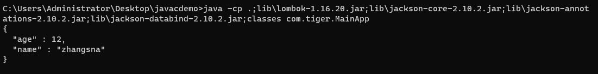

#### 打包成普通jar

> 打包

再项目根目录下运行:

~~~shell
# 切换到classes下
cd classes
jar -cvf javacdemo.jar .
~~~

-c 创建一个jar包

-f 指定jar包的文件名

-v 生成详细的报造，并输出至标准设备

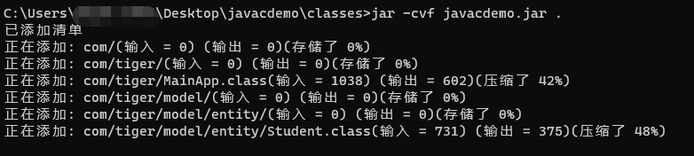

查看classes下,已经生产了javacdemo.jar文件

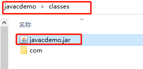

> 运行

在classes目录删除com文件夹，防止其中的classes干扰我们运行jar包。 然后运行：


~~~shell
# 切换回项目根目录下
cd ..
java -cp lib\*;classes\javacdemo.jar com.tiger.MainApp
~~~

这里指定的classpath中需要有classes\javacdemo.jar，因为com.tiger.MainApp现在javacdemo.jar包中了。

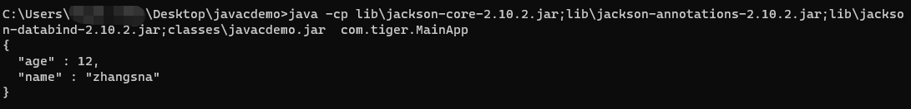

#### 打包成可执行jar包

> 打包

~~~shell
# 编译项目，放在classes下
javac -d classes -cp lib\*;src\main\java src\main\java\com\tiger\MainApp.java

# 把根目录下面的lib里面的jar包拷贝到classes目录下
xcopy lib classes
~~~

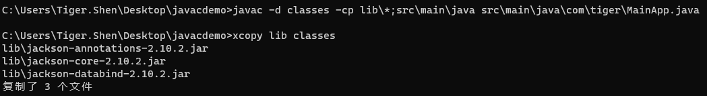


~~~shell
# 切换到classes下
cd classes
# 解压三个jar包, 获取需要的class文件
jar -xf jackson-annotations-2.10.2.jar
jar -xf jackson-core-2.10.2.jar
jar -xf jackson-databind-2.10.2.jar
# 删除解压出来的多余的文件
del *.jar
rd /s META-INF
del module-info.class
~~~

这时候已经把所有运行需要的类弄到了classes下。

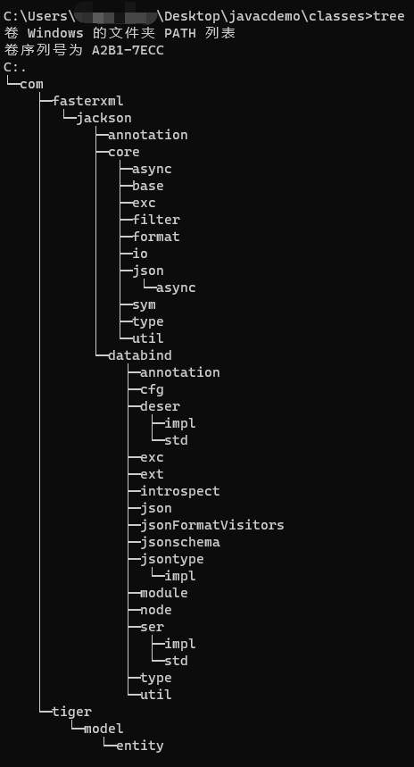

执行打包命令

~~~shell
jar -cvf javacdemo.jar .
~~~

编辑生成的javacdemo.jar里面的META-INF下的MANI-FEST.MF文件, jar包本质上就是个压缩包, 怎么编辑压缩包里面的文件就不说了

在其中添加一行, <font color=red>注意冒号后面有空格, 要保留两行空白行, 如图片所述, 关于MANI-FEST.MF文件网上挺多坑的，可以查下。</font>

这一行的作用就是<font color=red>告诉java你要运行的主类是哪一个。</font>

~~~text
Main-Class: com.tiger.MainApp
~~~


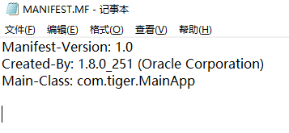

这时候你就可以把jar包复制到任何一个目录下，执行该jar包只需要

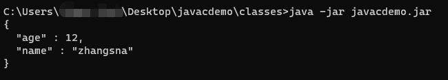


## Java 折叠代码块

ctrl + alt + T in IDEA

//region Description

Some code

//endregion


## java对象求交并差集

https://blog.csdn.net/weixin_34122548/article/details/90196224?utm_medium=distribute.pc_relevant.none-task-blog-2~default~baidujs_baidulandingword~default-1.pc_relevant_aa&spm=1001.2101.3001.4242.2&utm_relevant_index=4

需要使用google的guava工具类

~~~xml
        <dependency>
            <groupId>com.google.guava</groupId>
            <artifactId>guava</artifactId>
            <version>22.0</version>
        </dependency>
~~~

下面是求基础对象的交并差集

~~~java
        HashSet<Integer> s1 = Sets.newHashSet(1, 2, 3, 4);
        HashSet<Integer> s2 = Sets.newHashSet(3, 4, 5, 6);


        // 求s1 - s2的结果
        Sets.SetView<Integer> difference1 = Sets.difference(s1, s2);
        // 求s2 - s1的结果
        Sets.SetView<Integer> difference2 = Sets.difference(s2, s1);
        // 求s1，s2的交集
        Sets.SetView<Integer> intersection = Sets.intersection(s1, s2);
        // 求s1，s2的并集
        Sets.SetView<Integer> union = Sets.union(s1, s2);

        System.out.println(difference1); // [1, 2]
        System.out.println(difference2); // [5, 6]
        System.out.println(intersection); // [3, 4]
        System.out.println(union);  // [1, 2, 3, 4, 5, 6]
~~~

下面是求包装类型的交并差集， 将对象类型的Set集合转换成Map集合， 对应的key是用来求交并差集的key

~~~java
    @Test
    @SneakyThrows
    public void test(){
        Person zhangsan = new Person(1, "zhangsan");
        Person lisi = new Person(2, "lisi");
        Person wangwu = new Person(3, "wangwu");

        HashSet<Person> s1 = Sets.newHashSet(zhangsan, lisi);
        HashSet<Person> s2 = Sets.newHashSet(lisi, wangwu);

        Map<Integer, Person> map1 = s1.stream().collect(Collectors.toMap(person -> person.getId(), person -> person));
        Map<Integer, Person> map2 = s2.stream().collect(Collectors.toMap(person -> person.getId(), person -> person));

        // 求s1 - s2的结果
        Sets.SetView<Integer> difference1 = Sets.difference(map1.keySet(), map2.keySet());
        // 求s2 - s1的结果
        Sets.SetView<Integer> difference2 = Sets.difference(map2.keySet(), map1.keySet());
        // 求s1，s2的交集
        Sets.SetView<Integer> intersection = Sets.intersection(map1.keySet(), map2.keySet());
        // 求s1，s2的并集
        Sets.SetView<Integer> union = Sets.union(map1.keySet(), map2.keySet());

        difference1.forEach(id -> System.out.println(map1.get(id)));
        difference2.forEach(id -> System.out.println(map2.get(id)));
        intersection.forEach(id -> System.out.println(map2.get(id)));
        union.forEach(id -> System.out.println(map1.containsKey(id) ? map1.get(id) : map2.get(id)));

    }

    @Data
    @AllArgsConstructor
    public class Person{
        int id;
        String name;
    }
~~~

## java格式化，修改sql

在使用jdbc执行用户传入的sql时， 需要先进行sql格式化，去除掉注释、空白。如果有多个sql，还需要将他们拆分出来。

可以使用druid进行格式化

maven：

~~~xml
<dependency>
    <groupId>com.alibaba</groupId>
    <artifactId>druid</artifactId>
    <version>1.2.8</version>
</dependency>
~~~

java：

~~~java
		String sql = "select * from dual";		
		// 格式化输出, 缺省大写格式
        String result = SQLUtils.format(sql, DbType.postgresql);
        System.out.println(result);
        
        // 解析出的独立语句的个数
        List<SQLStatement> stmtList = SQLUtils.parseStatements(sql, DbType.postgresql);
~~~

## Class.getReources和Class.getClassLoader.getResources的区别

今天在Java程序中读取resources资源下的文件，由于对Java结构了解不透彻，遇到很多坑。正常在Java工程中读取某路径下的文件时，可以采用绝对路径和相对路径，绝对路径没什么好说的，相对路径，即相对于当前类的路径。在本地工程和服务器中读取文件的方式有所不同，以下图配置文件为例：

　

> 本地读取资源文件

　　Java类中需要读取properties中的配置文件，可以采用**文件（File）**方式进行读取：

```java
File file = new File("src/main/resources/properties/test.properties");
InputStream in = new FileInputStream(file);
```

　　注意：**当在IDEA中运行（不部署在服务器上），可以读取到该文件；**

　　原因：JavaWeb项目部署服务器中，会将项目打包成Jar包或者war包，此时就不会存在 src/main/resources 目录，JVM会在编译项目时，主动将 java文件编译成 class文件 和 resources 下的静态文件放在 target/classes目录下；

　　理解：Java文件只有编译成 class文件才会被JVM执行，本地执行时，当前项目即为Java进程的工作空间，虽然class文件在target/classes目录下，但是target/classes不是class文件运行的目录，只是存放的目录，运行目录还是在IDEA的模块下，所以运行时会找到 src/main/resources 资源文件！

> 服务器（Tomcat）读取资源文件

　　当工程部署到Tomcat中时，按照上边方式，则会抛出异常：FileNotFoundException。原因：Java工程打包部署到Tomcat中时，properties的路径变到顶层（classes下），这是由Maven工程结构决定的。由Maven构建的web工程，主代码放在src/main/java路径下，资源放在src/main/resources路径下，当构建jar包 或 war包时，JVM虚拟机会自动编译java文件为class文件存放在 target/classes目录下，resource资源下的文件会原封不动的拷贝一份到 target/classes 目录下：


> 案例

\#java获取文件目录
├── pom.xml
├── src
│  ├── main
│  │  ├── java
│  │  │  ├── com
│  │  │  │  ├── alipay
│  │  │  │  │  ├── ResourceTest.java
│  │  │  │  │  └── Resource.java
│  │  └── resources
│  │  │  ├── conf
│  │  │  │  ├── sysConf.json
│  │  │  └── request.xml
└── local.iml

~~~java
public class ResourceTest {
    public static void main(String[] args) {
        // 1、通过Class的getResource方法
        // 使用绝对路径
        String a3 = ResourceTest.class.getResource("/request.xml").getPath();
        // 使用相对路径
        String a4 = ResourceTest.class.getResource("../../request.xml").getPath();
 
        // 2、通过本类的ClassLoader的getResource方法
        // 只能使用绝对路径
        String b2 = ResourceTest.class.getClassLoader().getResource("request.xml").getPath();
    }
}
~~~

Class.getResources和ClassLoader.getReources的区别在于：

- **Class.getResources可以使用相对路径，也可以使用绝对路径，使用相对路径时不加"/", 使用绝对路径时使用"/"**
- **ClassLoader.getResources不能使用相对路径，只能使用绝对路径，使用绝对路径时不用加"/", 默认就是绝对路径就是项目根目录。**

~~~java
// 读取properties时，可以通过getResourcesAsStream读取流，然后通过Properties进行加载。
InputStream in = this.getClass().getResourceAsStream("/properties/test.properties");
Properties properties = new Properties();
properties.load(in);
properties.getProperty("name");
~~~

## default和static方法

> static方法

在接口中可以定义一个或者多个static方法，默认为public。子类不会继承接口中的静态方法，但是子类可以继承抽象类中的静态方法

~~~java
public interface HelloInterface {
    static void say(){}
}

public abstract class SimpleAbstractClass {
    public static void say1(){}
}

public class HelloInterfaceImpl extends SimpleAbstractClass implements HelloInterface {
    public void sayHello() {
        // 接口中的static方法不会被继承， 还是要通过类名.方法名调用
        HelloInterface.say();
        // 抽象类中的static方法可以被继承
        say1();
    }
}
~~~

> default方法

在接口中可以定义一个或者多个default方法，默认为public。default方法可以调用抽象方法

~~~java
public interface HelloInterface2 {
    void sayHello(String say);
    default void play(String sport) {
        // default方法中调用抽象方法
        sayHello("haha");
    }
}
~~~

**当子类实现的两个接口中有相同方法签名（方法名相同，参数类型及顺序相同）的default方法时， 子类必须实现该default方法。否则编译失败。**

**当子类实现的接口中有与抽象类中相同方法签名的default方法时， 默认调用父类的方法。**

**当子类实现的两个接口或者接口和抽象类有相同的方法签名， 但是两个方法的返回值<font color=red>不兼容</font>，将会编译失败。**

下面代码是可以编译成功的， 因为Integer兼容Number。但是UserServiceImpl返回Number就不兼容了

~~~java
    public interface UserService{ Number add(String name); }

    public interface UserService1{ Integer add(String name); }

    public static class UserServiceImpl implements UserService, UserService1{
        @Override
        public Integer add(String name) { return null; }
    }
~~~


#### java静态变量、静态代码块、代码块、成员变量初始化时机

>  Java中静态变量初始化、static块执行时机（https://www.cnblogs.com/aflyun/p/9562885.html）

演示例子

在使用static进行初始化的操作，怎么也执行不了！代码如下：

```java
public class StaticDemo {

    public static final String INIT = "init";
    static {
        System.out.println("------StaticDemo----");
    }
}

public class TestStatic {

    public static void main(String[] args) {
        System.out.println(StaticDemo.INIT);
    }
}
//打印
init
```

怎么没有执行 static 块的代码呢？

最后发现是因为调用的静态属性被final修饰导致的。去掉final修饰，结果OK！

```
public class StaticDemo {

    //去掉 final
    public static String INIT = "init";
    static {
        System.out.println("------StaticDemo----");
    }
}

public class TestStatic {

    public static void main(String[] args) {
        System.out.println(StaticDemo.INIT);
    }
}
//打印结果
------StaticDemo----
init
```

(static final的基础类型和String可能在编译的时候就定下来了吧)

这里就和类加载机制中的 **初始化** 相关！**类被加载了不一定就会执行静态代码块，只有一个类被主动使用的时候，静态代码才会被执行**！

　当一个类被主动使用时，Java虚拟就会对其初始化，如下六种情况为主动使用：

1. 当创建某个类的新实例时（如通过new或者反射，克隆，反序列化等）

2. 当调用某个类的静态方法时

3. **当使用某个类或接口的静态字段时**

4. 当调用Java API中的某些反射方法时，比如类Class中的方法，或者java.lang.reflect中的类的方法时

5. 当初始化某个子类时

6. 当虚拟机启动某个被标明为启动类的类（即包含main方法的那个类）

   Java编译器会收集所有的类变量初始化语句和类型的静态初始化器，将这些放到一个特殊的方法中：clinit。

**重点：使用final修饰的静态字段，在调用的时候不会对类进行初始化！**

> 静态变量、静态代码块、代码块、成员变量调用顺序

1. 类被主动使用时，静态代码被执行
   - 为非final的静态变量分配内存空间，并赋初始值（不对变量进行初始化）
   - 从上到下为静态变量初始化和执行静态代码块
2. 类实例化的时候，执行普通代码块和对成员变量初始化
   - 为成员变量分配内存空间，并赋初始值
   - 从上到下为成员变量初始化和执行普通代码块
   - 执行构造函数

案例分析（https://blog.csdn.net/tongyi55555/article/details/46627415）

~~~java
public class VarOrder {

    public static int k = 0;
    public static VarOrder t1 = new VarOrder("t1");
    public static VarOrder t2 = new VarOrder("t2");
    public static int i = print("i");
    public static int n = 99;
    private int a = 0;
    public int j = print("j");
    {
        print("构造块");
    }
    static {
        print("静态块");
    }

    public VarOrder(String str) {
        System.out.println((++k) + ":" + str + " i=" + i + " n=" + n);
        ++i;
        ++n;
    }

    public static int print(String str) {
        System.out.println((++k) + ":" + str + " i=" + i + " n=" + n);
        ++n;
        return ++i;
    }

    public static void main(String args[]) {
        VarOrder t = new VarOrder("init");
    }
}
~~~

　1). 静态的一定是最开始进行调用的，如果存在多个，那么写在前面的先调用，因此静态变量int k先调用，没有输出；

　　2). 静态变量t1开始调用，t1是该类的实例对象，因此在实例对象中，非静态变量和代码块要首先进行初始化，因此int a和int j先进行调用进行赋值，然后是代码块进行调用。**虽然类的静态变量和静态代码块的调用顺序要高于非静态变量和代码块，但是因为这里的t1是实例对象，因此不会跳转到t1和t2后面的静态变量int i和int n中执行赋值，打印输出的都是i和n的初始值，从0开始。**最后才是自身的构造函数进行调用，输出如下：

```
1:j i=0 n=0
2:构造块 i=1 n=1
3:t1 i=2 n=2123
```

　　同理t1调用后，t2进行调用，输出的内容与t1实例化时相似，如下：

```
4:j i=3 n=3
5:构造块 i=4 n=4
6:t2 i=5 n=5123
```

　　3). t2实例化后，继续顺序执行，开始执行静态变量int i，此时输出内容：

```
7:i i=6 n=61
```

　　4). 继续进行静态变量int n赋值，没有输出，但是要记住此时n的值已经由6变为99；

　　5). 最后一个静态调用，即静态块调用，此时输出如下：

```
8:静态块 i=7 n=991
```

　　6). 静态变量和静态块调用完毕后，此时才开始进入到主方法的代码中执行，主方法中的代码就一句，实例化对象，与2)分析的一致，先调用非静态变量和代码块，最后调用构造函数，因此输出如下：

```
9:j i=8 n=100
10:构造块 i=9 n=101
11:init i=10 n=102123
```

**综上所述，最终的输出结果为：**

```
1:j i=0 n=0
2:构造块 i=1 n=1
3:t1 i=2 n=2
4:j i=3 n=3
5:构造块 i=4 n=4
6:t2 i=5 n=5
7:i i=6 n=6
8:静态块 i=7 n=99
9:j i=8 n=100
10:构造块 i=9 n=101
11:init i=10 n=102
```


#### bio, nio, select多路复用

> bio

https://zhuanlan.zhihu.com/p/625401360

下面是bio实现socket的代码

~~~c
#include <stdio.h>
#include <stdlib.h>
#include <string.h>
#include <errno.h>
#include <unistd.h>
#include <arpa/inet.h>
#include <sys/socket.h>
#define ERR_MSG(err_code) do {                                     \
    err_code = errno;                                              \
    fprintf(stderr, "ERROR code: %d \n", err_code);                \
    perror("PERROR message");                                      \
} while (0)

const int BUF_LEN = 100;
int main(void)
{
    /* 配置 Server Sock 信息。*/
    struct sockaddr_in srv_sock_addr;
    memset(&srv_sock_addr, 0, sizeof(srv_sock_addr));
    srv_sock_addr.sin_family = AF_INET;
    srv_sock_addr.sin_addr.s_addr = htonl(INADDR_ANY);  // 即 0.0.0.0 表示监听本机所有的 IP 地址。
    srv_sock_addr.sin_port = htons(6666);

    /* 创建 Server Socket。*/
    int srv_socket_fd = 0;
    srv_socket_fd = socket(AF_INET, 
                           SOCK_STREAM, // 表示传输数据使用tcp
                           IPPROTO_TCP)
    /* 设置 Server Socket 选项。*/
    int optval = 1;
 	setsockopt(srv_socket_fd,
                   SOL_SOCKET,    // 表示套接字选项的协议层。
                   SO_REUSEADDR,  // 表示在绑定地址时允许重用本地地址。这样做的好处是，当服务器进程崩溃或被关闭时，可以更快地重新启动服务器，而不必等待一段时间来释放之前使用的套接字。
                   &optval,
                   sizeof(optval))

    /* 绑定 Socket 与 Sock Address 信息。*/
    bind(srv_socket_fd, (struct sockaddr *)&srv_sock_addr, sizeof(srv_sock_addr)))

    /* 开始监听 Client 发出的连接请求。10表示请求队列的最大长度, 请求队列满了之后不再接收队列*/
    listen(srv_socket_fd, 10)


    /* 初始化 Client Sock 信息存储变量。*/
    struct sockaddr cli_sock_addr;
    memset(&cli_sock_addr, 0, sizeof(cli_sock_addr));
    int cli_sockaddr_len = sizeof(cli_sock_addr);

    int cli_socket_fd = 0;

    int recv_len = 0;
    char buff[BUF_LEN] = {0};

    /* 永远接受 Client 的连接请求。*/
    while (1)
    {
        cli_socket_fd = accept(srv_socket_fd,
                                          (struct sockaddr *)(&cli_sock_addr),  // 填充 Client Sock 信息。
                                          (socklen_t *)&cli_sockaddr_len))

        /* 接收指定 Client Socket 发出的数据，*/
        (recv_len = recv(cli_socket_fd, buff, BUF_LEN, 0)
        printf("Recevice data from client: %s\n", buff);

        /* 将收到的数据重新发送给指定的 Client Socket。*/
        send(cli_socket_fd, buff, recv_len, 0);
        printf("Send data to client: %s\n", buff);

        /* 每处理完一次 Client 请求，即关闭连接。*/
        close(cli_socket_fd);
        memset(buff, 0, BUF_LEN);
    }
    close(srv_socket_fd);
    return EXIT_SUCCESS;
}
~~~

client:

~~~c
#include <stdio.h>
#include <stdlib.h>
#include <string.h>
#include <errno.h>
#include <unistd.h>
#include <arpa/inet.h>
#include <sys/socket.h>
#define ERR_MSG(err_code) do {                                     \
    err_code = errno;                                              \
    fprintf(stderr, "ERROR code: %d \n", err_code);                \
    perror("PERROR message");                                      \
} while (0)
const int BUF_LEN = 100;
int main(void)
{
    /* 配置 Server Sock 信息。*/
    struct sockaddr_in srv_sock_addr;
    memset(&srv_sock_addr, 0, sizeof(srv_sock_addr));
    srv_sock_addr.sin_family = AF_INET;
    srv_sock_addr.sin_addr.s_addr = inet_addr("127.0.0.1");
    srv_sock_addr.sin_port = htons(6666);

    int cli_socket_fd = 0;
    char send_buff[BUF_LEN];
    char recv_buff[BUF_LEN];

    /* 永循环从终端接收输入，并发送到 Server。*/
    while (1) {

        /* 创建 Client Socket。*/
        if (-1 == (cli_socket_fd = socket(AF_INET, SOCK_STREAM, IPPROTO_TCP)))
        {
            printf("Create socket ERROR.\n");
            ERR_MSG(errno);
            exit(EXIT_FAILURE);
        }

        /* 连接到 Server Sock 信息指定的 Server。*/
        if (-1 == connect(cli_socket_fd,
                          (struct sockaddr *)&srv_sock_addr,
                          sizeof(srv_sock_addr)))
        {
            printf("Connect to server ERROR.\n");
            ERR_MSG(errno);
            exit(EXIT_FAILURE);
        }

        /* 从 stdin 接收输入，再发送到建立连接的 Server Socket。*/
        fputs("Send to server> ", stdout);
        fgets(send_buff, BUF_LEN, stdin);
        send(cli_socket_fd, send_buff, BUF_LEN, 0);
        memset(send_buff, 0, BUF_LEN);

        /* 从建立连接的 Server 接收数据。*/
        recv(cli_socket_fd, recv_buff, BUF_LEN, 0);
        printf("Recevice from server: %s\n", recv_buff);
        memset(recv_buff, 0, BUF_LEN);

        /* 每次 Client 请求和响应完成后，关闭连接。*/
        close(cli_socket_fd);
    }

    return EXIT_SUCCESS;
}
~~~

上面服务端会造成阻塞的操作有两个, 一个是accept, 一个是recev函数

需要知道的是, Socket是在内核态中的, 每个Socket都有一个线程等待队列, 和数据接收队列

1. 线程等待队列中存放了进程号, 上下文信息, 回调函数信息
2. 数据接收队列保存client发送过来的数据

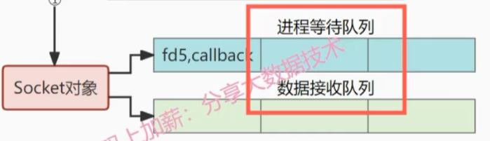

如果recev函数发现数据接收队列中没有数据到达, 会发生下面这件事

1. 进程让出cpu时间片, 进入堵塞状态
2. 进程的文件描述符进入socket等待队列
3. client发送消息到server网卡上面, 网卡会通过dma控制器将数据写到内核的环形缓冲区中, 并且产生一个IO中断, 内核根据端口将环形缓冲区中的数据复制到数据接收队列, 并且中断程序会调用进程等待队列中的callback函数来唤醒线程
4. 当线程被唤醒的时候, recv会将处于内核态中的数据接收队列中的数据拷贝到用户空间中, 然后返回

# 反射相关

## java注解

#### 元注解

- @Retetion，设置保留期，取值如下

  - RetentionPolicy.SOURCE 注解只在源码阶段保留，在编译器进行编译时它将被丢弃忽视。
  - RetentionPolicy.CLASS 注解只被保留到编译进行的时候，它并不会被加载到 JVM 中。
  - RetentionPolicy.RUNTIME 注解可以保留到程序运行的时候，它会被加载进入到 JVM 中，所以在程序运行时可以获取到它们。

  源代码级别的注解有两个意图, 一是作为文档的补充, 给人看的, 比如Override注解, 二是作为源代码生成器(java和android都有注解处理器APT)的材料，比如lombok。

  同样字节码级别的注解, 可以作为字节码修改, **插桩**, 代理的依据, 可以使用aspectj, **asm**等工具进行字节码修改. 比如一些模块间调用, 如果你直接写代码, 会导致耦合, 此时可以加入一个注解, run一下asm这样的工具, 将注解标注的方法字段以generate的方式插入进去。应用场景：**无痕埋点**，**性能监控**

  运行时级别的注解, 显然是用于反射后参与某些业务逻辑用的, 比如spring依赖注入。

- @Target， 指定注解可以被标注在哪里，取值如下：

  - ElementType.ANNOTATION_TYPE 可以给一个注解进行注解
  - ElementType.CONSTRUCTOR 可以给构造方法进行注解
  - ElementType.FIELD 可以给属性进行注解
  - ElementType.LOCAL_VARIABLE 可以给局部变量进行注解
  - ElementType.METHOD 可以给方法进行注解
  - ElementType.PACKAGE 可以给一个包进行注解
  - ElementType.PARAMETER 可以给一个方法内的参数进行注解
  - ElementType.TYPE 可以给一个类型进行注解，比如类、接口、枚举、注解

- @Document， 该注解标记的元素，javadoc工具在生成文档时，会将注解信息包含在javadoc中

  例如：

  ~~~java
  // 定义一个@Document标注的@Book注解
  package org.springmorning.demo.javabase.annotation.meta;
  
  @Documented
  @Inherited
  public @interface Book {
      //书名
      String name();
      //出版日期
      String publishedDate();
      //作者
      String author();
  }
  
  // 使用@Book注解标注DocumentAnnotation类
  @Book(
          name = "Spring in Action",
          author = "Craig Walls",
          publishedDate = "2008-10-1"
  )
  public class DocumentAnnotation {}
  ~~~

  在项目的src\main\java目录下：

  javadoc -d D:\doc org.springmorning.demo.javabase.annotation.meta -encoding utf-8 -charset utf-8

  说明：

  -d D:\doc 表示：doc文件输入目录为D盘的doc文件夹；

  org.springmorning.demo.javabase.annotation.meta 表示此包中所有类需要生成java doc html文件；

  -encoding utf-8 表示：java代码采用的是utf-8字符编码编写的；

  -charset utf-8 表示：java doc html文件为utf-8字符编码。

  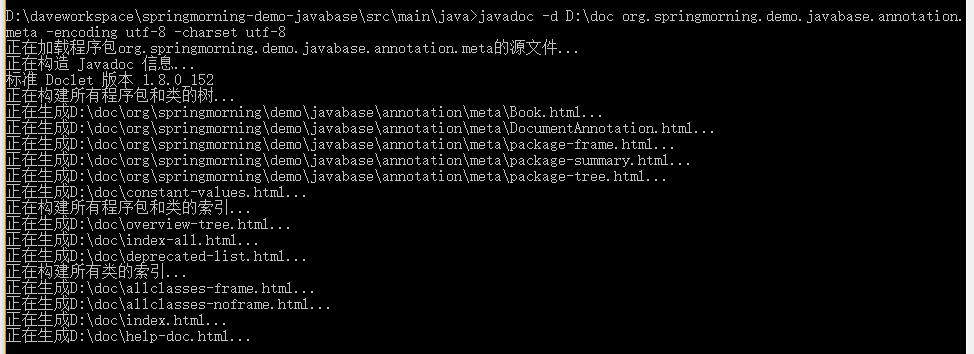

  

  

  

  如果@Book注解没有被@Document标记，那么被@Book注解标记的DocumentAnnotation类的注解信息就不会包含在java doc html文档

  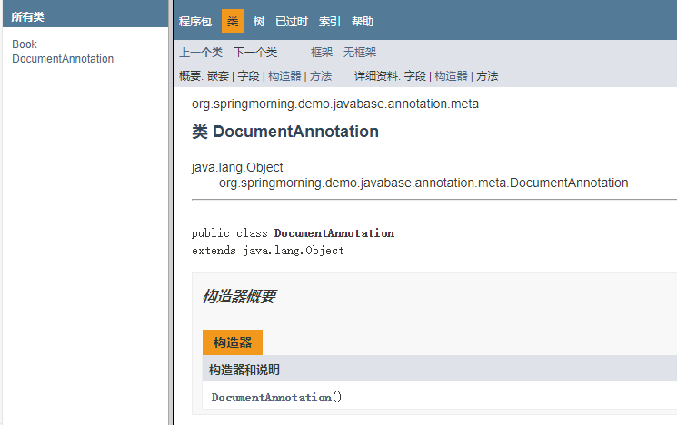

- @Repeatable

- @Inherited，指定该注解是可以被继承的。

  ~~~java
  @Inherited
  @Retention(RetentionPolicy.RUNTIME)
  public @interface Test {}
  
  @Test
  public class A{}
  
  public class B extends A{}
  
  // 注解Test被元注解@Inherited标注，说明@Test是可以继承的。
  // @Test标注在了class A上， 并且class B继承了class A
  // class B也被@Test标注了
  ~~~

#### 注解的成员变量

注解只有成员变量，没有成员方法

~~~~java
@Target(ElementType.TYPE)
@Retention(RetentionPolicy.RUNTIME)
public @interface TestAnnotation {
    int id() default 1;
    String msg() default "hello world";
}
~~~~

- 当注解中只有一个名字为value的属性时，应用时可以直接将属性值填到括号里
- 当注解中没有任何属性时，应用时可以不添加括号，例@Test


## 关于java.lang.reflect.Type的说明

参看https://www.cnblogs.com/binarylei/p/8485609.html

https://www.jianshu.com/p/7e2f0adbd164

JDK 1.5 为了泛型 引入Type，再次之前只有所谓的原始类型。一个Class 就代表一个指定的原始类型。


泛型出现后扩充了数据类型，从只有原始类型扩充了参数化类型、类型变量类型、泛型数组类型。Type 的子接口有：ParameterizedType、TypeVariable、GenericArrayType、WildcardType，实现类有 Class。


其中Class表示一个类的类型，如List.class, Set.class，String[].class

ParameterizedType表示的是参数化类型，如List\<String>, Set\<Integer>, List\<E>, Map<K, V>

~~~java
// 以Simple<List<String>, E extends Number>为例
public interface ParameterizedType extends Type {
    // 1. 获得<>中实际类型，这里是List<String>，E extends Number
    Type[] getActualTypeArguments();

    // 2. 获得 <> 前面实际类型，这里是Simple
    Type getRawType();

    // 3. 如果这个类型是在哪个Type上定义的，上面的List<String>返回Simple，Simple如果是外部类，返回null，如果是内部类返回外部类。
    Type getOwnerType();
}
~~~

~~~java
    List<Set> a1;           // 返回 Set，Class 类型
    List<Set<String>> a2;   // 返回 Set<String>，ParameterizedType 类型
    List<T> a3;             // 返回 T，TypeVariable 类型
    List<? extends Set> a4; // 返回 WildcardType 类型
    List<Set<String>[]> a5; // 返回 GenericArrayType 类型
~~~

TypeVariable表示的是类型变量，如List\<E>中的E，Map<K, V>中的K，V

~~~java
public interface TypeVariable<D extends GenericDeclaration> extends Type, AnnotatedElement {
    // 变量上边界数组，没有指定的话是 Object
    Type[] getBounds();

    // 获取变量被定义在什么 GenericDeclaration 上
    D getGenericDeclaration();

    // 获取变量名字
    String getName();

    // jdk 1.8
    AnnotatedType[] getAnnotatedBounds();
}
~~~

WildcardType表示的是通配符，如List\<? extends List>中的？

~~~java
public interface WildcardType extends Type {
    // 得到上边界 Type 的数组, List<E extends Number>, E的上界是Number
    Type[] getUpperBounds();
    // 得到下边界 Type 的数组，List<E super Number>, E的下界是Number
    Type[] getLowerBounds();
}
~~~

GenericArrayType表示的是泛型数组，如List\<E>[]， Set\<String>[]

~~~java
public interface GenericArrayType extends Type {
    // 获得这个数组元素类型，List[]返回List， List<String>[]返回List<String>
    Type getGenericComponentType();
}
~~~

Class与其他四个的区别是，Class表示某个类的类型，是不带泛型的。而其他四个就是为了表示泛型信息的引入的。


> 泛型擦除

需要提前了解的是， 只有方法的返回值和入参，类定义，类中的成员、静态变量才能在运行时获取泛型信息，而方法的代码块中的泛型信息在运行时是会擦除的。方法代码块中的泛型会在编译器检测是否正确，如果不正确会在编译阶段报错。并且编译的时候会将泛型信息擦除。下面这段代码是可以正常执行的，因为在运行期，泛型被擦除掉了，Set\<Integer>只会被当做Set。

~~~java
Set<Integer> set = new HashSet<>();
Collection stringList = Lists.newArrayList("1", "2", "3");
set.addAll(stringList);
~~~

> 从Class获取Type

从class中获取泛型先关信息的方法一般带有generic字样， 如getGenericSuperclass，getGenericInterfaces方法，这两个方法返回type类型，具体的类型需要看情况。

~~~~java
    public abstract class Class1<E> { }
    public abstract class Class2<E> extends Class1<E> { }
    public abstract class Class3 extends Class2<String> { }
    public abstract class Class4 extends Class3 { }

public void classes(){
        Type type4 = Class4.class.getGenericSuperclass();
        System.out.println(type4);  // Type的具体类型是Class， Class3

        ParameterizedType type3 = (ParameterizedType)Class3.class.getGenericSuperclass();
        Class<String> string = (Class<String>)(type3.getActualTypeArguments()[0]); // 返回泛型参数
        Class<Class2> rawType = (Class<Class2>)type3.getRawType(); // 返回ParameterizedType表示的原始类型
        Class<TypeTest> ownerType = (Class<TypeTest>)type3.getOwnerType(); // 返回ParameterizedType表示的类是在哪个类中定义的，这里是TypeTest，如果不是内部类（顶层类），返回null


        ParameterizedType type2 = (ParameterizedType)Class2.class.getGenericSuperclass();
        TypeVariable typeVariable = (TypeVariable)(type2.getActualTypeArguments()[0]);// 返回泛型参数，这里是E
        Type[] bounds = typeVariable.getBounds(); // 返回E的上界，这里是Object.class, 如果是E extends String，那么返回String.class

    }
~~~~

> 从Field获取Type

~~~java
    class Person<T> {
        public List<CharSequence> charSequenceList;
        public String str;
    }
   @Test
    public void test1() throws NoSuchFieldException {
Field field=Student.class.getField("str");
System.out.println(field.getType());  // class java.lang.String
System.out.println(field.getGenericType()); // class java.lang.String

Field field=Student.class.getField("charSequenceList");
System.out.println(field.getType()); // interface java.util.List
 System.out.println(field.getGenericType());//java.util.List<java.lang.CharSequence>
    }
~~~

> 从方法的入参返回值和构造函数的入参上获取Type

~~~java
public class MethodTest {

    static class Student{
        public Student(List<CharSequence> list) { }
        public Integer test(List<CharSequence> list) { }
    }

    @Test
    public void test1() throws NoSuchMethodException {
            Method method=Student.class.getMethod("test",List.class);
            Class type1=method.getParameterTypes()[0];
            Type type2=method.getGenericParameterTypes()[0];
        	Type type3 = method.getGenericReturnType()
            System.out.println(type1);
            System.out.println(type2);

       Constructor constructor=Student.class.getConstructor(List.class);
            Class type1=constructor.getParameterTypes()[0];
            Type type2=constructor.getGenericParameterTypes()[0];
            System.out.println(type1);
            System.out.println(type2);
        }
    }
}
~~~

# 正则表达式

#### 语法


| 字符 | 说明                                                         |
| ---- | :----------------------------------------------------------- |
| \d   | 匹配一个数字, 等效于[0-9]                                    |
| \D   | 匹配一个非数字字符, 等效于\[^ 0-9]                           |
| .    | **匹配\r(回车符)\n(换行符)之外任意字符, 若要匹配任意字符请使用[\s\S]**, 如果需要匹配点号, 需要使用转义字符\\.<br>如果要 . 可以匹配任意字符(包括回车换行, 那么可以开启single line模式) |
| []   | **自定义字符集合**, [a-f]表示a到f的任意字符, \[^ 123]表示非123的任意字符<br>**正则表达式中的特殊符号被包括到中括号中则失去特殊意义, 除了^,-之外**, 比如[.]就表示匹配点, .失去了特殊意义<br/>**标准字符集合除小数点外, 被包含在中括号中, 则该自定义字符集合将包含该标准集合** |
| \w   | 匹配一个数字字母下划线, 等效于[a-zA-Z0-9_], **是否包括中文看操作系统** |
| \W   | 匹配一个非字符类, 等效于\[^a-zA-Z0-9_]                       |

| 量词  | 说明                                                         |
| ----- | :----------------------------------------------------------- |
| {n}   | 正好匹配n次, \d{3}匹配3个数字, i{2}匹配2个i                  |
| {n,}  | 匹配至少n次, >=n                                             |
| {n,m} | 匹配至少n次, 至多m次,  **不要将空格插入逗号和数字之间** <br />**贪婪模式: 匹配字符越多越好, 默认**, \d{3,5}将会匹配1234567中的12345 <br />**非贪婪模式: 匹配的字符越少越好, 在量词后面加?表示**,  \d{3,5}?将会匹配1234567中的123和456 |
| *     | 等效于{0,}                                                   |
| +     | 等效于{1,}                                                   |
| ?     | 等效于{0,1}                                                  |

| 空白字符 | 说明                                                         |
| -------- | :----------------------------------------------------------- |
| \s       | 匹配一个空白字符, 包括空格, Tab, 换页符, 回车, 等效于[\f\n\r\t\v] |
| \S       | 匹配一个非空白字符                                           |
| \n       | 匹配一个换行符                                               |
| \r       | 匹配一个回车符                                               |
| \t       | 匹配一个制表符((Tab)                                         |
| \v       | 匹配一个垂直制表符                                           |
| \f       | 匹配一个换页符                                               |

| 字符边界 | 说明                                                         |
| -------- | ------------------------------------------------------------ |
| ^        | 与字符串开始的地方匹配                                       |
| $        | 与字符串结束的地方匹配                                       |
| \b       | 匹配一个位置: **前面的字符和后面的字符不全是\w**<br>比如在下面这个字符串中 `fee*fen&fens fena fenxx `, 其中画竖线是匹配到的位置`|fee|*|fen|&|fens| |fena| |fenxx|`<br>常常用来匹配一个完整的单词, 比如上面那个字符串`fee*fen&fens fena fenxx`, 需要匹配`fen`这个单词, 需要使用`\bfen\b` |

| 匹配模式    | 说明                                                         |
| ----------- | ------------------------------------------------------------ |
| ignore case | **忽略大小写, 默认情况下不忽略**                             |
| single line | 单行模式, 整个文本看做一个字符串, 只有一个开头和结尾<br>小数点"."可以匹配包括换行符\n在内的任何字符 |
| multi line  | 每一行都是一个字符串, 都有开头和结尾<br>**^和$会匹配每一行的开始和结尾**<br>如果需要仅匹配**文本开始和结束**的位置, 可以使用\A和\Z |

| 选择符和分组 | 说明                                                         |
| ------------ | ------------------------------------------------------------ |
| \| 分值结构  | 或, 匹配左边或右边的表达式                                   |
| (?: )        | 非捕获组, 常常与 \| 一起使用, 比如`aa(?:a|b)`会匹配`aaa`和`aab` |
| ()           | 捕获组<br>每队括号分配一个编号, 从1开始                      |

| 零宽断言(位置匹配、预搜索) | 说明                                                         |
| -------------------------- | ------------------------------------------------------------ |
| (?=exp)                    | 匹配自身出现的位置的后面能匹配表达式的位置<br>"[a-z]+(?=ing)"将会匹配"eating,doing,running"中的eat, do, runn. 不包括ing因为是位置匹配<br>"[a-z]+ing"将会匹配eating, doing, running |
| (?!exp)                    | 匹配自身出现的位置的后面不能匹配表达式的位置                 |
| (?<=exp)                   | 匹配自身出现的位置前面能匹配表达式的位置                     |
| (?<!exp)                   | 匹配自身出现的位置前面不能匹配表达式的位置                   |

#### 正则 踩坑

~~~java
Pattern pattern = Pattern.compile("com\\.controller.*");
Matcher matcher = pattern.matcher("com.controller.HelloController");
System.out.println(matcher.matches());
//如果注释掉reset，下面的matcher.find()将会返回false，而不注释的话将会返回true。原理在于matches()修改了matcher的状态。
//matcher.reset();
if (matcher.find()) {
    System.out.println(matcher.group(0));
}
~~~

~~~java
Pattern pattern = Pattern.compile("com\\.controller.*");
Matcher matcher = pattern.matcher("com.controller.HelloController");
// find()的含义是查找下一个匹配的子序列，所以调用两次find()函数返回的结果是不同的。
matcher.find()  // true
matcher.find()  // false
~~~


#### group的使用

先看下面的例子：

~~~java
String regEx = "count((\\d+)(df))";  
String s = "count000dfdfsdffaaaa1";  
Pattern pat = Pattern.compile(regEx);  
Matcher mat = pat.matcher(s);  
if(mat.find()){
    System.out.println(mat.group()); // count000df
    System.out.println(mat.group(0));// count000df
    System.out.println(mat.group(1));// 000df
    System.out.println(mat.group(2));// 000
    System.out.println(mat.group(2));// df
}
~~~

从上面可以看到，group()和group(0)是表达式匹配到的整个字符串，而group(1)是第一个括号匹配到的字符串，group(2)是第二个字符串匹配到的内容。

如果表达式没有括号的话，那么只有group(0)，调用其他的group会有异常。

group的的顺序是按照左括号的决定的。上面((\\d+)(df))

其实，Java正则表达式中的“组”概念与《正则表达式必知必会》一书中讲述的“子表达式”其实是一样的，只是表述不同而已。


#### Matcher类方法

matches和find的区别：

- find()方法是部分匹配，是查找输入串中与模式匹配的子串，如果该匹配的串有组还可以使用group()函数。

- matches()是全部匹配，是将整个输入串与模式匹配，如果要验证一个输入的数据是否为数字类型或其他类型，一般要用matches()。

| 一般方法                           | 说明                           |
| ---------------------------------- | ------------------------------ |
| Matcher reset()                    | 重置此匹配器。                 |
| Matcher reset(CharSequence input)  | 使用新的输入序列重置此匹配器。 |
| Matcher region(int start, int end) | 设置此匹配器区域的限制。       |
| int regionStart()                  | 报告此匹配器区域的起始索引。   |
| Pattern pattern()                  | 返回此匹配器解释的模式。       |

| 匹配方法            | 说明                                       |
| ------------------- | ------------------------------------------ |
| boolean matches()   | 尝试将整个区域与模式匹配。                 |
| boolean lookingAt() | 尝试将从区域开头开始的输入序列与模式匹配。 |

| 查找方法                  | 说明                                                         |
| ------------------------- | ------------------------------------------------------------ |
| boolean find()            | 尝试查找与模式匹配的输入序列的下一个子序列。                 |
| boolean find(int start)   | 重置此匹配器，然后尝试从**指定的索引处**开始查找与模式匹配的输入序列的下一个子序列。 |
| String group()            | 返回上一个匹配操作期间给定组捕获的输入子序列。               |
| String group(int group)   | 返回在上一个匹配操作期间指定的捕获组捕获的子序列。           |
| String group(String name) | 返回在上一个匹配操作期间由给定的命名捕获组捕获的输入子序列   |
| int groupCount()          | **返回此匹配器模式中捕获组的数量**。                         |
| int start()               | 返回上一个匹配的起始索引                                     |
| int start(int group)      | 返回上一个匹配操作期间给定组捕获的子序列的起始索引。         |
| int end()                 | 返回最后一个字符匹配后的偏移量。                             |
| int end(int group)        | 返回在上一个匹配操作期间由给定组捕获的子序列的最后一个字符之后的偏移量。 |

| 替换方法                                                     | 说明                                                         |
| ------------------------------------------------------------ | ------------------------------------------------------------ |
| Matcher appendReplacement(StringBuffer sb, String replacement) | 实现非终端附加和替换步骤。                                   |
| StringBuffer appendTail(StringBuffer sb)                     | 实现终端附加和替换步骤。                                     |
| static String quoteReplacement(String s)                     | 返回指定String的文字替换String。                             |
| String replaceAll(String replacement)                        | 将具有给定替换字符串的模式匹配的输入序列的每个子序列替换。   |
| String replaceFirst(String replacement)                      | 将具有给定替换字符串的模式匹配的输入序列的第一个子序列替换。 |
|                                                              |                                                              |
|                                                              |                                                              |

| 其他方法                                | 说明                                                         |
| --------------------------------------- | ------------------------------------------------------------ |
| boolean hasAnchoringBounds()            | 查询此匹配器的区域边界的锚定。                               |
| boolean hasTransparentBounds()          | 查询此匹配器的区域边界的透明度。                             |
| boolean hitEnd()                        | 如果在此匹配器执行的最后一个匹配操作中搜索引擎命中输入结尾，则返回`true`。 |
| Matcher useAnchoringBounds(boolean b)   | 设置此匹配器的区域边界的锚定。                               |
| Matcher usePattern(Pattern newPattern)  | 更改此匹配器用于查找匹配项的模式。                           |
| Matcher useTransparentBounds(boolean b) | 设置此匹配器的区域边界的透明度。                             |
| boolean requireEnd()                    | 如果更多输入可以将正匹配更改为负匹配，则返回`true`。         |
| MatchResult toMatchResult()             | 返回此匹配器的匹配状态作为:`MatchResult`。                   |


## 关于枚举类

#### 定义枚举类

```java
public enum ResultCode {

    /** 有没有发现写枚举类的这一部分就像是在调用构造方法 */
    SUCCESS(1, "成功"),
    PARAM_IS_INVALID(10001, "参数无效"),
    PARAM_IS_BLANK(10002, "参数为空"),
    PARAM_TYPE_BIND_ERROR(10003, "参数类型错误"),
    PARAM_NOT_COMPLETE(10004, "参数缺失"),
    //上面的逗号可去可不去, 并不会导致编译错误
    ;

    private Integer code;

    private String message;

    //构造函数默认并且必须是private
    ResultCode(Integer code, String message) {
        this.code = code;
        this.message = message;
    }

    public Integer code() {
        return this.code;
    }

    public String message() {
        return this.message;
    }
}
```

#### 枚举类的使用

所有的枚举类在编译之后会自动继承enum类, 并且会自动生成一个values()方法

```java
//只放出部分常见代码
public abstract class Enum<E extends Enum<E>>
        implements Comparable<E>, Serializable {

	/**
	实例的名字, 类型为字符串
	即ResultCode.SUCCESS为SUCCESS, ResultCode.PARAM_IS_INVALID为PARAM_IS_INVALID
	*/
    private final String name;

    public final String name() {
        return name;
    }

	/**
	实例的索引, 从0开始
	即ResultCode.SUCCESS.ordinal()为0, ResultCode.PARAM_IS_INVALID.ordinal()为1
	*/
    private final int ordinal;

    public final int ordinal() {
        return ordinal;
    }
    //toString方法与name()一样
    public String toString() {
        return name;
    }
	//判断两个枚举实例是否一样, 注意这里使用的是==, 直接比引用, 说明枚举类的实例是单例的
    public final boolean equals(Object other) {
        return this==other;
    }
    /**
    比较两个枚举实例的索引详见, 返回的int
    上面我们知道ResultCode.SUCCESS.ordinal()为0, ResultCode.PARAM_IS_INVALID.ordinal()为1
    所以ResultCode.SUCCESS.compareTo(ResultCode.PARAM_IS_INVALID)为0-1=-1
    */
    public final int compareTo(E o) {
		//略去实现代码
    }
}
```

验证: 

```java
//ResultCode.values()会返回ResultCode这个枚举类的所有实例, 类型为ResultCode[]
for (ResultCode resultCode : ResultCode.values()) {
            System.out.println(resultCode.name());
            System.out.println(resultCode.ordinal());
            System.out.println(resultCode.compareTo(ResultCode.SUCCESS));
}
//ResultCode.valueOf()会返回name与参数相等的枚举实例
ResultCode SUCCESS = ResultCode.valueOf("SUCCESS");
System.out.println(SUCCESS.equals(ResultCode.SUCCESS));   //输出为true
```

#### 枚举类中定义抽象方法

```java
/**
 * 枚举类可以有抽象方法，但是必须在它的实例中实现
 */
public enum AbstractWeek {

    MONDAY(0,"星期一") {
        @Override
        public AbstractWeek getNextDay() {
            return TUESDAY;
        }
    }, TUESDAY(1,"星期二") {
        @Override
        public AbstractWeek getNextDay() {
            return WEDNESDAY;
        }
    }, WEDNESDAY(2,"星期三") {
        @Override
        public AbstractWeek getNextDay() {
            return THURSDAY;
        }
    }, THURSDAY(3,"星期四") {
        @Override
        public AbstractWeek getNextDay() {
            return FRIDAY;
        }
    }, FRIDAY(4,"星期五") {
        @Override
        public AbstractWeek getNextDay() {
            return SATURDAY;
        }
    }, SATURDAY(5,"星期六") {
        @Override
        public AbstractWeek getNextDay() {
            return SUNDAY;
        }
    }, SUNDAY(6,"星期日") {
        @Override
        public AbstractWeek getNextDay() {
            return MONDAY;
        }
    };

    private int num;
    private String desc;

    AbstractWeek(int num,String desc) {
        this.num = num;
        this.desc=desc;
    }

    //一个抽象方法
    public abstract AbstractWeek getNextDay();
}
```

#### 反编译与语法糖

```java
public enum Weather {
	
	Sunny(1, "晴天") {
		@Override
		public String test() {
			return "今天阳光明媚！！！\n";
		}
	},
	Rainy(2, "雨天") {
		@Override
		public String test() {
			return "出门别忘带把雨伞哦！！！\n";
		}
	},
	Cloudy(3, "多云") {
		@Override
		public String test() {
			return "别出去登高望远了，你看不远的，呵呵呵！！！\n";
		}
	};
 
	private int value;
	private String label;
 
	private Weather(int value, String label) {
		this.value = value;
		this.label = label;
	}
 
	public int getValue() {
		return value;
	}
 
	public String getLabel() {
		return label;
	}
 
	public abstract String test();

}
```

我们将上述代码进行反编译:

```java
import java.io.PrintStream;
import java.util.*;
 
//枚举类继承了Enum, 所以我们在定义的时候不能再继承其他的类了
//非抽象枚举类默认是final的, 所以不要去继承非抽象的枚举类
public abstract class Weather extends Enum {
 
    //这里s表示name, i表示ordinal
    //构造函数为私有的
	private Weather(String s, int i, int value, String label) {
		super(s, i);
		this.value = value;
		this.label = label;
	}
 
	public int getValue() {
		return value;
	}
 
	public String getLabel() {
		return label;
	}
 
    //我们自己定义的抽象方法
	public abstract String test();

 	//values()返回所有枚举类的实例
	public static Weather[] values() {
		Weather aweather[];
		int i;
		Weather aweather1[];
		System.arraycopy(aweather = ENUM$VALUES, 0, aweather1 = new Weather[i = aweather.length], 0, i);
		return aweather1;
	}
 
	public static Weather valueOf(String s) {
		return (Weather) Enum.valueOf(Weather, s);
	}
 
	Weather(String s, int i, int j, String s1, Weather weather) {
		this(s, i, j, s1);
	}
 
    //这是我们所定义的枚举类实例, 这也是为什么我们在定义枚举类的时候就像是在调用构造函数
    //每一个变量都是public static final
	public static final Weather Sunny;
	public static final Weather Rainy;
	public static final Weather Cloudy;
    
	private int value;
	private String label;
    
	private static final Weather ENUM$VALUES[];
 
	static {
		Sunny = new Weather("Sunny", 0, 1, "\u6674\u5929") {
			public String test() {
				return "\u4ECA\u5929\u9633\u5149\u660E\u5A9A\uFF01\uFF01\uFF01\n";
			}
		};
		Rainy = new Weather("Rainy", 1, 2, "\u96E8\u5929") {
			public String test() {
				return "\u51FA\u95E8\u522B\u5FD8\u5E26\u628A\u96E8\u4F1E\u54E6\uFF01\uFF01\uFF01\n";
			}
		};
		Cloudy = new Weather("Cloudy", 2, 3, "\u591A\u4E91") {
			public String test() {
				return "\u522B\u51FA\u53BB\u767B\u9AD8\u671B\u8FDC\u4E86\uFF0C\u4F60\u770B\u4E0D\u8FDC\u7684\uFF0C\u5475\u5475\u5475\uFF01\uFF01\uFF01\n";
			}
		};
		ENUM$VALUES = (new Weather[] { Sunny, Rainy, Cloudy });
	}
}
```

从上述我们可以看出, 枚举类的实现还是普通的java类, 只不过这个java类的构造函数是私有的, 而且实例的个数是有限个的, 当这个枚举类的实例个数只有一个的时候, 这个类就变成了单例模式了. 


# Java8新特性

## Stream API

- 创建Stream

  - Collection系列集合, 直接调用stream方法

    ```java
    List<String> strings = Arrays.asList("he", "ha", "hi");
    //创建串行流
    Stream<String> stream = strings.stream();
    //创建并行流
    Stream<String> stringStream = strings.parallelStream();
    ```

  - 数组, 调用Arrays.stream(T[] values)

    ```java
    String[] list = {"12", "adn", "jskl"};
    Arrays.stream(list);
    ```

  - 个别的值调用Stream.of(T... values)

    ```java
    Stream<String>  list = Stream.of("ahdah", "sjdka", "ksda");
    ```

- Stream的中间操作

  - 流的操作类型分为两种：

    - **Intermediate**：一个流可以后面跟随零个或多个 intermediate 操作。其目的主要是打开流，做出某种程度的数据映射/过滤，然后返回一个新的流，交给下一个操作使用。这类操作都是惰性化的（lazy），就是说，仅仅调用到这类方法，并没有真正开始流的遍历。
  - **Terminal**：一个流只能有一个 terminal 操作，当这个操作执行后，流就被使用“光”了，无法再被操作。所以这必定是流的最后一个操作。Terminal 操作的执行，才会真正开始流的遍历，并且会生成一个结果，或者一个 side effect。

  在对于一个 Stream 进行多次转换操作 (Intermediate 操作)，每次都对 Stream 的每个元素进行转换，而且是执行多次，这样时间复杂度就是 N（转换次数）个 for 循环里把所有操作都做掉的总和吗？其实不是这样的，转换操作都是 lazy 的，多个转换操作只会在 Terminal 操作的时候融合起来，一次循环完成。我们可以这样简单的理解，**Stream 里有个操作函数的集合，每次转换操作就是把转换函数放入这个集合中，在 Terminal 操作的时候循环 Stream 对应的集合，然后对每个元素执行所有的函数**

- 筛选与切片

  

- 映射

  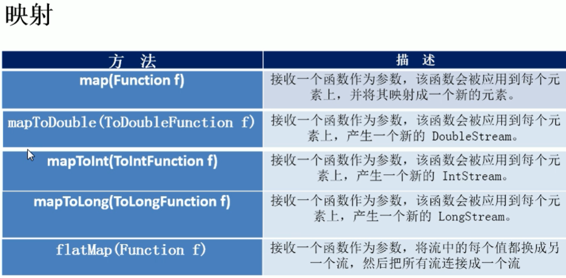

- 排序

  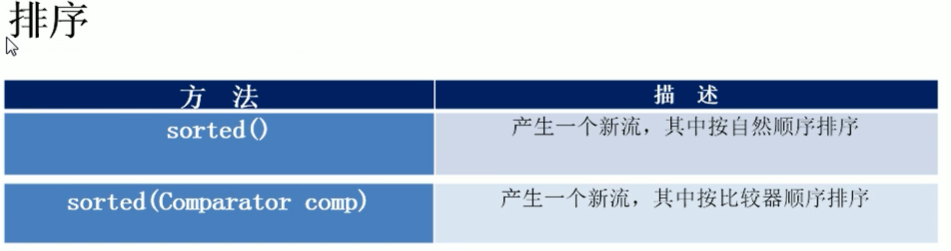

  - 查找与匹配

    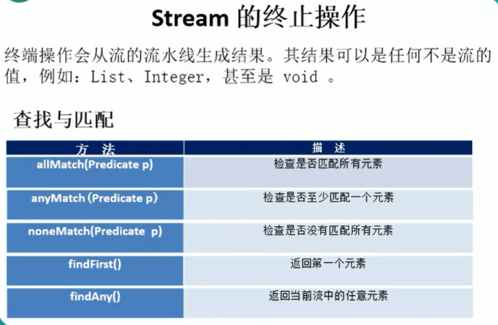

  - 规约

    


# Java9新特性

## Module模块系统

https://juejin.cn/post/6847902216590721031


#### 模块系统的作用

一个模块就是一个 jar 文件，但相比于传统的 jar 文件，模块的根目录下多了一个 `module-info.class` 文件，也即 `module descriptor`。 `module descriptor` 包含以下信息：

- 模块名称
- 依赖哪些模块
- 导出模块内的哪些包（允许直接 `import` 使用）
- 开放模块内的哪些包（允许通过 Java 反射访问）
- 提供哪些服务
- 依赖哪些服务


#### 模块系统的好处

第一，原生的依赖管理。有了模块系统，Java 可以根据 `module descriptor` 计算出各个模块间的依赖关系，一旦发现循环依赖，启动就会终止。同时，**由于模块系统不允许不同模块导出相同的包（即 `split package`，分裂包）**，所以在查找包时，Java 可以精准的定位到一个模块，从而获得更好的性能。

第二，精简  JRE。引入模块系统之后，JDK 自身被划分为 94 个模块（参见*图-2*）。通过 Java 9 新增的 `jlink` 工具，开发者可以根据实际应用场景随意组合这些模块，去除不需要的模块，生成自定义 JRE，从而有效缩小 JRE 大小。得益于此，JRE 11 的大小仅为 JRE 8 的 53%，从 218.4 MB缩减为 116.3 MB，JRE 中广为诟病的巨型 jar 文件 `rt.jar` 也被移除。更小的 JRE 意味着更少的内存占用，这让 Java 对嵌入式应用开发变得更友好。

第三，更好的兼容性。自打 Java 出生以来，就只有 4 种包可见性，这让 Java 对面向对象的三大特征之一封装的支持大打折扣，类库维护者对此叫苦不迭，只能一遍又一遍的通过各种文档或者奇怪的命名来强调这些或者那些类仅供内部使用，擅自使用后果自负云云。Java 9 之后，利用 `module descriptor` 中的 `exports` 关键词，模块维护者就精准控制哪些类可以对外开放使用，哪些类只能内部使用，换句话说就是不再依赖文档，而是由编译器来保证。类可见性的细化，除了带来更好的兼容性，也带来了更好的安全性。


#### module.info.java

上面提到，模块的核心在于 `module descriptor`，对应根目录下的 `module-info.class` 文件，而这个 class 文件是由源代码根目录下的 `module-info.java` 编译生成。Java 为 `module-info.java` 设计了专用的语法，包含 `module`、 `requires`、`exports` 等多个关键词

语法解读：

- `[open] module <module>`: 声明一个模块，模块名称应全局唯一，不可重复。加上 `open` 关键词表示模块内的所有包都允许通过 Java 反射访问，模块声明体内不再允许使用 `opens` 语句。
- `requires [transitive] <module>`: 声明模块依赖，一次只能声明一个依赖，如果依赖多个模块，需要多次声明。加上 `transitive` 关键词表示传递依赖，比如模块 A 依赖模块 B，模块 B 传递依赖模块 C，那么模块 A 就会自动依赖模块 C，类似于 Maven。
- `exports <package> [to <module1>[, <module2>...]]`: 导出模块内的包（**允许直接 `import` 使用和反射调用**），一次导出一个包，如果需要导出多个包，需要多次声明。如果需要定向导出，可以使用 `to` 关键词，后面加上模块列表（逗号分隔）。
- `opens <package> [to <module>[, <module2>...]]`: 开放模块内的包（**只运行反射调用, 不允许import**），一次开放一个包，如果需要开放多个包，需要多次声明。如果需要定向开放，可以使用 `to` 关键词，后面加上模块列表（逗号分隔）。
- `provides <interface | abstract class> with <class1>[, <class2> ...]`: 声明模块提供的 Java SPI 服务，一次可以声明多个服务实现类（逗号分隔）。
- `uses <interface | abstract class>`: 声明模块依赖的 Java SPI 服务，加上之后模块内的代码就可以通过 `ServiceLoader.load(Class)` 一次性加载所声明的 SPI 服务的所有实现类。

#### -p -m参数

Java 9 引入了一系列新的参数用于编译和运行模块，其中最重要的两个参数是 `-p` 和 `-m`。`-p` 参数指定模块路径，多个模块之间用 ":"（Mac, Linux）或者 ";"（Windows）分隔，同时适用于 `javac` 命令和 `java` 命令，用法和Java 8 中的 `-cp` 非常类似。`-m` 参数指定待运行的模块主函数，输入格式为`模块名/主函数所在的类名`，仅适用于 `java` 命令。两个参数的基本用法如下：

- `javac -p <module_path> <source>`
- `java -p <module_path> -m <module>/<main_class>`


#### demo示例

https://github.com/emac/jmods-demo

在本地文件的`./img/jmods-demo`下面也有备份


#### 老版本的处理

看到这里，相信创建和运行一个新的模块应用对你而言已经不是问题了，可问题是老的 Java 8 应用怎么办？别着急，我们先来了解两个高级概念，未命名模块（unnamed module）和自动模块（automatic module）。


一个未经模块化改造的 jar 文件是转为未命名模块还是自动模块，取决于这个 jar 文件出现的路径

如果是类路径，那么就会转为未命名模块，如果是模块路径，那么就会转为自动模块。

注意，自动模块也属于命名模块的范畴，其名称是模块系统基于 jar 文件名自动推导得出的，比如 com.foo.bar-1.0.0.jar 文件推导得出的自动模块名是 com.foo.bar。上图列举了未命名模块和自动模块行为上的区别，除此之外，两者还有一个关键区别，**分裂包规则适用于自动模块，但对未命名模块无效，也即多个未命名模块可以导出同一个包，但自动模块不允许。**

未命名模块和自动模块存在的意义在于，无论传入的 jar 文件是否一个合法的模块（包含 `module descriptor`），Java 内部都可以统一的以模块的方式进行处理，这也是 Java 9 兼容老版本应用的架构原理。运行老版本应用时，所有 jar 文件都出现在类路径下，也就是转为未命名模块，对于未命名模块而言，默认导出所有包并且依赖所有模块，因此应用可以正常运行。进一步的解读可以参阅[官方白皮书](https://link.juejin.cn?target=http%3A%2F%2Fopenjdk.java.net%2Fprojects%2Fjigsaw%2Fspec%2Fsotms%2F)的相关章节。

基于未命名模块和自动模块，相应的就产生了两种老版本应用的迁移策略，或者说模块化策略。


#### 如何使用未导出类

在jdk8中, `sun.security.util.SecurityConstants`这个类我们是可以随便使用的, 因为这是一个public类

但是在jdk11中, 我们无法再使用这个类, 因为jdk的jdk.base这个module并没有export他, 所以我们无法使用他

如果我们非要使用这个类, 可以使用如下命令

`--add-exports=a/b=c`, 指定a模块中的b包对c模块export


如果我们的项目中没有module-info.java(还是jdk8的结构)

可以在jvm中添加`--add-exports=java.base/sun.security.util=ALL-UNNAMED`来使用这个类, 这告诉jvm, `java.base`这个模块中的`sun.security.util`包对所有的未命名模块(因为我们的项目没有module-info.java, 所以是未命名模块)export

如果我们的项目中已经有了module-info.java, 

那么在jvm启动参数中添加``--add-exports=java.base/sun.security.util=our_module_name`, 这告诉jvm, `java.base`这个模块中的`sun.security.util`包对我们的包export

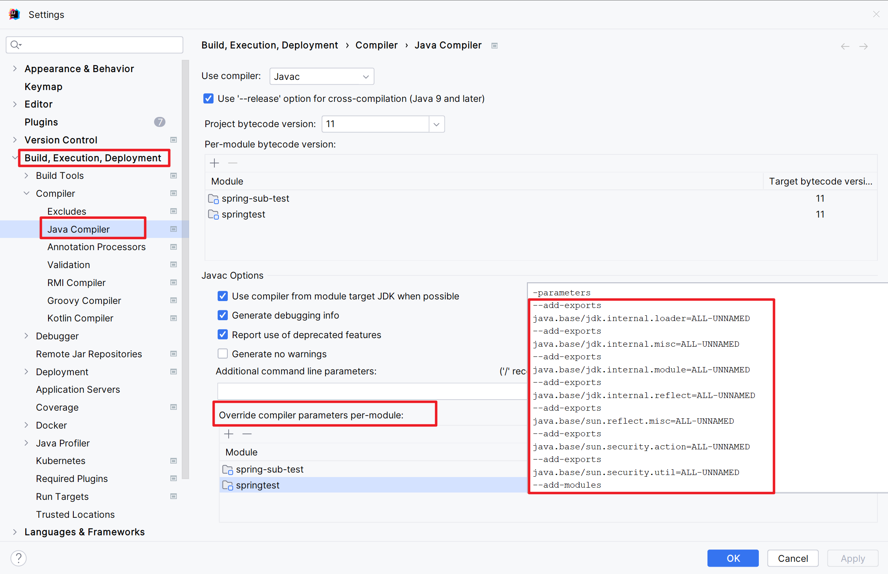

如果我们的项目是maven, 那么还必须添加如下maven才能正确打包

~~~xml
<plugin>
                <groupId>org.apache.maven.plugins</groupId>
                <artifactId>maven-compiler-plugin</artifactId>
                <version>3.11.0</version>
                <configuration>
                    <source>11</source>
                    <target>11</target>
                    <compilerArgs>
                        <!-- 如果有多个--add-exports, 那么可以添加多个arg标签 -->
                        <arg>--add-exports=java.base/sun.security.pkcs=ALL-UNNAMED</arg>
                    </compilerArgs>
                </configuration>
            </plugin>
~~~


同理的还有`--add-opens=a/b=c`, 指定a模块的b包对c模块open


#### 如何改造老项目

> Bottom-up 自底向上策略

第一种策略，叫做自底向上（bottom-up）策略，即根据 jar 包依赖关系（如果依赖关系比较复杂，可以使用 `jdeps` 工具进行分析），沿着依赖树自底向上对 jar 包进行模块化改造（在 jar 包的源代码根目录下添加合法的模块描述文件 `module-info.java`）。初始时，所有 jar 包都是非模块化的，全部置于类路径下（转为未命名模块），应用以传统方式启动。然后，开始自底向上对 jar 包进行模块化改造，改造完的 jar 包就移到模块路径下，这期间应用仍以传统方式启动。最后，等所有 jar 包都完成模块化改造，应用改为 `-m` 方式启动，这也标志着应用已经迁移为真正的 Java 9 应用。以上面的示例工程为例，


*图-8: Bottom-up模块化策略*

1. 假设初始时，所有 jar 包都是非模块化的，此时应用运行命令为：

```
java -cp mod1.jar:mod2a.jar:mod2b.jar:mod3.jar:mod4.jar mod1.EventCenter
```

1. 对 mod3 和 mod4 进行模块化改造。完成之后，此时 mod1, mod2a, mod2b 还是普通的 jar 文件，新的运行命令为：

```
java -cp mod1.jar:mod2a.jar:mod2b.jar -p mod3.jar:mod4.jar --add-modules mod3,mod4 mod1.EventCenter
```

对比上一步的命令，首先 mod3.jar 和 mod4.jar 从类路径移到了模块路径，这个很好理解，因为这两个 jar 包已经改造成了真正的模块。其次，多了一个额外的参数 `--add-modules mod3,mod4`，这是为什么呢？这就要谈到模块系统的模块发现机制了。

不管是编译时，还是运行时，模块系统首先都要确定一个或者多个根模块（root module），然后从这些根模块开始根据模块依赖关系在模块路径中循环找出所有可观察到的模块（observable module），这些可观察到的模块加上类路径下的 jar 文件最终构成了编译时环境和运行时环境。那么根模块是如何确定的呢？对于运行时而言，如果应用是通过 `-m` 方式启动的，那么根模块就是 `-m` 指定的主模块；如果应用是通过传统方式启动的，那么根模块就是所有的 `java.*` 模块即 JRE（参见*图-2*）。回到前面的例子，如果不加 `--add-modules` 参数，那么运行时环境中除了 JRE 就只有 mod1.jar、mod2a.jar、mod2b.jar，没有 mod3、mod4 模块，就会报 `java.lang.ClassNotFoundException` 异常。如你所想，`--add-modules` 参数的作用就是手动指定额外的根模块，这样应用就可以正常运行了。

1. 接着完成 mod2a、mod2b 的模块化改造，此时运行命令为：

```
java -cp mod1.jar -p mod2a.jar:mod2b.jar:mod3.jar:mod4.jar --add-modules mod2a,mod2b,mod4 mod1.EventCenter
```

由于 mod2a、mod2b 都依赖 mod3，所以 mod3 就不用加到 `--add-modules` 参数里了。

1. 最后完成 mod1 的模块化改造，最终运行命令就简化为：

```
java -p mod1.jar:mod2a.jar:mod2b.jar:mod3.jar:mod4.jar -m mod1/mod1.EventCenter
```

注意此时应用是以 `-m` 方式启动，并且指定了 mod1 为主模块（也是根模块），因此所有其他模块根据依赖关系都会被识别为可观察到的模块并加入到运行时环境，应用可以正常运行。

>  Top-down 自上而下策略

自底向上策略很容易理解，实施路径也很清晰，但它有一个隐含的假设，即所有 jar 包都是可以模块化的，那如果其中有 jar 包无法进行模块化改造（比如 jar 包是一个第三方类库），怎么办？别慌，我们再来看第二种策略，叫做自上而下（top-down）策略。

它的基本思路是，根据 jar 包依赖关系，从主应用开始，沿着依赖树自上而下分析各个 jar 包模块化改造的可能性，将 jar 包分为两类，一类是可以改造的，一类是无法改造的。对于第一类，我们仍然采用自底向上策略进行改造，直至主应用完成改造，对于第二类，需要从一开始就放入模块路径，即转为自动模块。这里就要谈一下自动模块设计的精妙之处，首先，自动模块会导出所有包，这样就保证第一类 jar 包可以照常访问自动模块，其次，自动模块依赖所有命名模块，并且允许访问所有未命名模块的类（这一点很重要，因为除自动模块之外，其它命名模块是不允许访问未命名模块的类），这样就保证自动模块自身可以照常访问其他类。等到主应用完成模块化改造，应用的启动方式就可以改为 `-m` 方式。

还是以示例工程为例，假设 mod4 是一个第三方 jar 包，无法进行模块化改造，那么最终改造完之后，虽然应用运行命令和之前一样还是`java -p mod1.jar:mod2a.jar:mod2b.jar:mod3.jar:mod4.jar -m mod1/mod1.EventCenter`，但其中只有 mod1、mod2a、mod2b、mod3 是真正的模块，mod4 未做任何改造，借由模块系统转为自动模块。


*图-9: Top-down模块化策略*

看上去很完美，不过等一下，如果有多个自动模块，并且它们之间存在分裂包呢？前面提到，自动模块和其它命名模块一样，需要遵循分裂包规则。对于这种情况，如果模块化改造势在必行，要么忍痛割爱精简依赖只保留其中的一个自动模块，要么自己动手丰衣足食 Hack 一个版本。当然，你也可以试试找到这些自动模块的维护者们，让他们 PK 一下决定谁才是这个分裂包的主人。


# 工具

## ClassLoader


### ClassLoader类的方法和属性

ClassLoader类是所有ClassLoader的父类, 并且他是一个抽象类, 不能被实例化

~~~java
public abstract class ClassLoader {}
~~~


#### 属性

- name: 每个ClassLoader都有他们的name, 并且有`getName()`方法
- parent: 每个ClassLoader都有他们的parent, 并且有getParent

~~~java
public final ClassLoader getParent(); // 返回parent, 如果为null说明是BootstrapClassLoader
public String getName() // 返回name
~~~


#### 构造函数

~~~java
protected ClassLoader() // name为null, parent为AppClassLoader
protected ClassLoader(ClassLoader parent)// name为null, parent为指定的
protected ClassLoader(String name, ClassLoader parent)// name和parent都是指定的
~~~


#### 方法

ClassLoader提供了如下几种能力

1. 加载字节码为Class

   要想加载指定的Class, 我们有两种办法

   1. 调用`Class.forName("com.tiger.Main")`, 实际上就等效于`this.class.getClassLoader().loadClass("com.tiger.Main", true)`来加载类
   2. 通过一定的方法获取一个ClassLoader, 然后调用他的`loadClass(com.tiger.Main)`方法, 这实际上就等于`loadClass("com.tiger.Main", false)`

   所以我们可以看到, 加载类的实际代码就是loadClass方法, 并且他也是**双亲委派的逻辑来源**

   ~~~java
   // resolve: 最后没有找到是否报错, 如果不报错就返回null
   protected Class<?> loadClass(String name, boolean resolve)
           throws ClassNotFoundException
       {
           synchronized (getClassLoadingLock(name)) {
               Class<?> c = findLoadedClass(name); // 查找已经加载的缓存
               if (c == null) {
                   try {
                       if (parent != null) {
                           c = parent.loadClass(name, false); // 如果有父类, 通过parent加载
                       } else {
                           c = findBootstrapClassOrNull(name); // 如果父类为null, 通过BootstrapClass加载
                       }
                   } catch (ClassNotFoundException e) {
                       // do nothing
                   }
                   if (c == null) {
                       c = findClass(name); // 通过自身的findClass来查找
                   }
               }
               if (resolve) {
                   resolveClass(c); // 判断c是否为null, 如果为null就报错
               }
               return c;
           }
       }
   ~~~

   所以我们如果要实现自定义的ClassLoader, 那么就要在`findClass`方法中

   - 查找对应的文件
   - 将文件读取为byte[]
   - 将byte[]通过`defineClass()`转换为Class对象

   

2. 读取jar包中的资源文件

   ~~~java
   public URL getResource(String name);
   public InputStream getResourceAsStream(String name);
   public Enumeration<URL> getResources(String name);
   
   public static URL getSystemResource(String name)
   public static InputStream getSystemResourceAsStream(String name)
   public static Enumeration<URL> getSystemResources(String name)
   ~~~

   比如我的项目的有一个`resource/application.yaml`, 那么我可以这样读取

   ~~~java
   InputStream = ClassLoader.getSystemClassLoader().getResourceAsStream("application.yaml")
   ~~~

   同时资源的读取也是遵循双亲委派机制的

   ~~~java
   public URL getResource(String name) {
           Objects.requireNonNull(name);
           URL url;
           if (parent != null) {
               url = parent.getResource(name);
           } else {
               url = BootLoader.findResource(name);
           }
           if (url == null) {
               url = findResource(name);
           }
           return url;
       }
   ~~~

   如果parent没有找到的话, 就会调用自身的`findResource`来查找, 而默认的`findResource`方法是直接返回null的, 所以如果你想要一个ClassLoader具有读取资源的能力的话, 那么你要自己去实现`findResource`这个方法


#### 其他的一些方法

ClassLoader中提供了两个静态方法, 方便获取platformClassLoader和appClassLoader

~~~java
public static ClassLoader getPlatformClassLoader(); // 返回platformClassLoader
public static ClassLoader getSystemClassLoader() // 返回appClassLoader
~~~


然后他还提供了静态的方法, 方便通过appClassLoader来读取资源

~~~java
public static URL getSystemResource(String name) // 等效于getSystemClassLoader().getResource()
public static InputStream getSystemResourceAsStream(String name) // 同理
public static Enumeration<URL> getSystemResources(String name) // 同理
~~~


#### 并发加载的ClassLoader

我们注意到, 我们在调用loadClass的时候, 他的内部是会加锁的

~~~java
// resolve: 最后没有找到是否报错, 如果不报错就返回null
protected Class<?> loadClass(String name, boolean resolve)
        throws ClassNotFoundException
    {
        synchronized (getClassLoadingLock(name)) { // 加锁
            Class<?> c = findLoadedClass(name); // 查找已经加载的缓存
            if (c == null) {
                try {
                    if (parent != null) {
                        c = parent.loadClass(name, false); // 如果有父类, 通过parent加载
                    } else {
                        c = findBootstrapClassOrNull(name); // 如果父类为null, 通过BootstrapClass加载
                    }
                } catch (ClassNotFoundException e) {
                    // do nothing
                }
                if (c == null) {
                    c = findClass(name); // 通过自身的findClass来查找
                }
            }
            if (resolve) {
                resolveClass(c); // 判断c是否为null, 如果为null就报错
            }
            return c;
        }
    }
~~~

在默认的情况下, getClassLoadingLock(name)返回的就是ClassLoader的this对象, 这意味着多线程加载不同的类, 会共用同一个锁, 这在很多情况下会是瓶颈

如果我们想要针对不同的name, 返回不同的锁, 那么我们可以这样

~~~java
public static class MyParallelCapableClassLoader extends ClassLoader {
        static {
            // 通过ClassLoader.registerAsParallelCapable()将MyParallelCapableClassLoader标记为可以并发加载的classLoader
            if (!ClassLoader.registerAsParallelCapable()) {
                System.out.println("MyPallClassLoader is not parallel capable");
            }
        }

        public MyParallelCapableClassLoader(String name) {
            super();
        }
    }
~~~

之后getClassLoadingLock返回的就是一个name一个锁了, 这样就实现了并发加载

~~~java
protected Object getClassLoadingLock(String className) {
        Object lock = this;
        // 如果你没有不调用registerAsParallelCapable, 那么在ClassLoader的构造函数中, parallelLockMap就是null, 如果你调用了就不是null
        if (parallelLockMap != null) {
            Object newLock = new Object();
            lock = parallelLockMap.putIfAbsent(className, newLock);
            if (lock == null) {
                lock = newLock;
            }
        }
        return lock;
    }
~~~

> 在`registerAsParallelCapable`的内部, 会判断当前注册的ClassLoader的所有父类是不是都已经注册了, 只有他所有父ClassLoader都已经注册了, 他才能注册成功


所幸, 在JDK11中, URLClassLoader, AppClassLoader, ClassLoader, PlatformClassLoader, BuiltinClassLoader都已经注册为了并发加载的ClassLoader


### URLClassLoader的使用

URLClassLoader是JDK提供的一个工具类, 在JDK8的时候, AppClassLoder和ExtClassLoader都继承了他

他提供了很方便的加载Class和加载资源的能力

~~~java
public static void main(String[] args) {
        URL[] urls = new URL[0];
        try {
            urls = new URL[] {
                    new URL("file:/path/to/test.jar"),
                    new URL("file:/path/to/classes"),
                    new URL("http://localhost:8080/test1.jar"),
                    new URL("http://localhost:8080/classes"),
                    new URL("https://example.com/test1.jar"),
                    new URL("https://example.com/classes")};
        } catch (MalformedURLException e) {
            // 1. 没有指定协议
            // 2. 未知的协议
            // 3. url解析失败
            throw new RuntimeException(e);
        }

        // URLClassLoader实现了Closable接口, 在不使用的时候要关闭
        // close()并不会卸载类, 而是释放.class文件句柄
        try (URLClassLoader urlClassLoader = new URLClassLoader("name", urls, ClassLoader.getPlatformClassLoader());) {
            /*
             * 会查找如下地址:
             * 1. file:/path/to/test.jar!/org/example/Main1.class
             * 2. file:/path/to/classes/org/example/Main1.class
             * 3. http://localhost:8080/test1.jar!/org/example/Main1.class
             * 4. http://localhost:8080/classes/org/example/Main1.class
             * 5. https://example.com/test1.jar!/org/example/Main1.class
             * 6. https://example.com/classes/org/example/Main1.class
             */
            Class<?> aClass = urlClassLoader.loadClass("org.example.Main1");
            System.out.println(aClass.getClassLoader());
        } catch (ClassNotFoundException | IOException e) {
            throw new RuntimeException(e);
        }
    }
~~~

同时URLClassLoader也实现了资源查找的能力, 你可以通过他来加载资源文件

假设有一个jar包如下:

~~~java
test.jar
├── com/
│   └── tiger/
│       └── Main.class
└── config/
    └── app.properties
~~~

~~~java
URLClassLoader loader = new URLClassLoader(new URL[]{
    new URL("file:/opt/test.jar")
});

// 加载资源（注意路径是相对 JAR 根的）
InputStream in = loader.getResourceAsStream("config/app.properties");

if (in != null) {
    Properties props = new Properties();
    props.load(in);
    System.out.println("app.name = " + props.getProperty("app.name"));
} else {
    System.out.println("Resource not found.");
}
~~~


### 自定义ClassLoader

要自定义ClassLoader, 你有两种选择

1. 继承ClassLoader, 并重写findClass方法

   >  默认情况下, ClassLoader.findResource()直接返回null, 你可以选择不重写他, 这就就不能调用getResource()和getResourceAsStream()和getResources()这三个方法了

   下面自定义一个ClassLoader, 他可以从指定地址下面读取所有的jar包, 然后加载其中的资源和class

   ~~~java
   public class RealtimeJarClassLoader extends ClassLoader {
   
       static {
           ClassLoader.registerAsParallelCapable();
       }
   
       private final List<String> jarPaths;
   
       public RealtimeJarClassLoader(File jarDir, String name) {
           super(name, ClassLoader.getPlatformClassLoader()); // 使用平台线程作为父类, 防止AppClassLoader已经加载了同名的class
           this.jarPaths = scanJarPaths(jarDir); // 扫描指定地址下所有的jar, 并记录地址
       }
   
       private List<String> scanJarPaths(File dir) {
           File[] jars = dir.listFiles(f -> f.isFile() && f.getName().endsWith(".jar"));
           if (jars == null) return List.of();
           List<String> paths = new ArrayList<>();
           for (File jar : jars) {
               paths.add("file:" + jar.getAbsolutePath());
           }
           return paths;
       }
   
       @Override
       protected Class<?> findClass(String name) throws ClassNotFoundException {
           String entryName = name.replace('.', '/') + ".class";
           // 尝试从不同的jar中读取class
           for (String jarPath : jarPaths) {
               try (JarFile jar = new JarFile(new File(new URI(jarPath)))) {
                   JarEntry entry = jar.getJarEntry(entryName);
                   if (entry != null) {
                       try (InputStream in = jar.getInputStream(entry)) {
                           byte[] bytes = in.readAllBytes();
                           return defineClass(name, bytes, 0, bytes.length);
                       }
                   }
               } catch (Exception e) {
                   // 忽略继续尝试其他 JAR
               }
           }
           throw new ClassNotFoundException(name);
       }
   
       // 这样的话, getResource(String name)和getResourceAsStream(String name)就可用了
       @Override
       protected URL findResource(String name) {
           // 尝试从不同的jar中读取资源
           for (String jarPath : jarPaths) {
               try (JarFile jar = new JarFile(new File(new URI(jarPath)))) {
                   JarEntry entry = jar.getJarEntry(name);
                   if (entry != null) {
                       return new URL("jar:" + jarPath + "!/" + name);
                   }
               } catch (Exception e) {
                   // 忽略继续尝试
               }
           }
           return null;
       }
   
       // 这样的话, getResources(String name)就可用了
       @Override
       protected Enumeration<URL> findResources(String name) throws IOException {
           List<URL> result = new ArrayList<>();
           for (String jarPath : jarPaths) {
               try (JarFile jar = new JarFile(new File(new URI(jarPath)))) {
                   if (jar.getJarEntry(name) != null) {
                       result.add(new URL("jar:" + jarPath + "!/" + name));
                   }
               } catch (Exception e) {
                   // 忽略
               }
           }
           return Collections.enumeration(result);
       }
   }
   ~~~

2. 如果你不想搞得这么复杂, 也可以继承自URLClassLoader

   下面我们实现一个并发加载的, 能够从指定目录下读取所有jar, 然后加载其中的资源和class的ClassLoader

   ~~~java
   public class OptJarUrlClassLoader extends URLClassLoader {
   
       static {
           ClassLoader.registerAsParallelCapable();
       }
       
       public OptJarUrlClassLoader(File dir) throws IOException {
           super(scanJarUrls(dir), ClassLoader.getPlatformClassLoader());
       }
   
       private static URL[] scanJarUrls(File dir) throws IOException {
           File[] jars = dir.listFiles(f -> f.isFile() && f.getName().endsWith(".jar"));
           if (jars == null) return new URL[0];
           URL[] urls = new URL[jars.length];
           for (int i = 0; i < jars.length; i++) {
               urls[i] = jars[i].toURI().toURL();
           }
        return urls;
       }
   }
   ~~~
   
   

### 双亲委派机制

双亲委派机制来源于ClassLoader类的loadClass方法

~~~java
// resolve: 最后没有找到是否报错, 如果不报错就返回null
protected Class<?> loadClass(String name, boolean resolve)
        throws ClassNotFoundException
    {
        synchronized (getClassLoadingLock(name)) {
            Class<?> c = findLoadedClass(name); // 查找已经加载的缓存
            if (c == null) {
                try {
                    if (parent != null) {
                        c = parent.loadClass(name, false); // 如果有父类, 通过parent加载
                    } else {
                        c = findBootstrapClassOrNull(name); // 如果父类为null, 通过BootstrapClass加载
                    }
                } catch (ClassNotFoundException e) {
                    // do nothing
                }
                if (c == null) {
                    c = findClass(name); // 通过自身的findClass来查找
                }
            }
            if (resolve) {
                resolveClass(c); // 判断c是否为null, 如果为null就报错
            }
            return c;
        }
    }
~~~

为什么要有双亲委派:

1. 变相的让Class具有优先级


在JDK8中, 双亲委派机制是

- BootstrapClassLoader: 用于加载`%JAVA_HOME%/lib`下的jar包
- ExtClassLoader: 用于加载`%JAVA_HOME%/lib/ext`目录下的jar包
- AppClassLoader: 也被称为SystemClassLoader, 用于加载classpath下的所有类

但是在JDK9中, 因为添加了模块化的东西, 所以双亲委派机制变成了

- BootstrapClassLoader
- PlatformClassLOader: 用于加载部分JavaSE和JDK模块
- AppClassLoader

并且在JDK8中, ExtClassLoader和AppClassLoader都继承自URLClassLoader, 但是在JDK11中, 他们不在继承自URLClassLoader, 而是继承自BuiltinClassLoader


~~~java
// 对于JDK内部的类, 都是Bootstrap ClassLoader加载的
        // Thread.class.getClassLoader()返回null, 因为Bootstrap ClassLoader是C++实现的, 没有对应的Java类
        printClassLoader(Thread.class.getClassLoader()); // BootstrapClassLoader
        printClassLoader(Object.class.getClassLoader()); // BootstrapClassLoader
        printClassLoader(Executors.class.getClassLoader()); // BootstrapClassLoader

        // 对于用户自定义的类, 都是AppClassLoader加载的
        printClassLoader(Main1.class.getClassLoader()); // jdk.internal.loader.ClassLoaders$AppClassLoader
        printClassLoader(Main1.class.getClassLoader().getParent()); // jdk.internal.loader.ClassLoaders$PlatformClassLoader
        printClassLoader(Main1.class.getClassLoader().getParent().getParent()); // BootstrapClassLoader
~~~


### 线程的contextClassLoader

对于每一个Thread对象, 都有一个对应的contextClassLoader对象

~~~java
public ClassLoader getContextClassLoader() 
public void setContextClassLoader(ClassLoader cl) 
~~~

对于main线程, 他的contextClassLoader是appClassLoader

对于一个新的Thread, 他的contextClassLoader是父线程的ClassLoader

对于一个线程池中worker线程, 他的ClassLoader是提交任务时, 调用addWorker()时的线程的ClassLoader

~~~java
public static void main(String[] args) {

        // main线程的contextClassLoader是AppClassLoader
        printClassLoader(Thread.currentThread().getContextClassLoader()); // jdk.internal.loader.ClassLoaders$AppClassLoader

        // new Thread()的contextClassLoader, 取决于他的父线程, 也就是创建这个Thread的线程
        new Thread(() -> {
            ClassLoader contextClassLoader = Thread.currentThread().getContextClassLoader();
            printClassLoader(contextClassLoader); // jdk.internal.loader.ClassLoaders$AppClassLoader
            System.out.println(contextClassLoader instanceof MyClassLoader); // false
        }).start();

        // 将线程的contextClassLoader设置为自定义的ClassLoader
        Thread.currentThread().setContextClassLoader(new MyClassLoader(new URL[]{}, "aaaa"));

        ThreadPoolExecutor executor = new ThreadPoolExecutor(10, 10, 30, TimeUnit.SECONDS,
                new LinkedBlockingQueue<>(1000000000));

        // 线程池中的线程的contextClassLoader, 取决于提交任务的时候, 调用addWorker()方法的线程
        executor.submit(() -> {
            ClassLoader contextClassLoader = Thread.currentThread().getContextClassLoader();
            printClassLoader(contextClassLoader); // org.example.Main1$MyClassLoader
            System.out.println(contextClassLoader instanceof MyClassLoader); // true
        });

    }

    public static void printClassLoader(ClassLoader classLoader) {
        System.out.println(classLoader == null ? "BootstrapClassLoader" : classLoader.getClass().getName());
    }

    public static class MyClassLoader extends URLClassLoader {

        private final String name;

        public MyClassLoader(URL[] urls, String name) {
            super(urls);
            this.name = name;
        }
    }
~~~


### 打破双亲委派机制

如果你想要打破双亲委派机制, 那么就重写loadClass这个方法, 不要去父类中查找, 而是直接到查找自身

~~~java
// resolve: 最后没有找到是否报错, 如果不报错就返回null
protected Class<?> loadClass(String name, boolean resolve)
        throws ClassNotFoundException
    {
        synchronized (getClassLoadingLock(name)) {
            Class<?> c = findLoadedClass(name); // 查找已经加载的缓存
            if (c == null) {
                    c = findClass(name); // 通过自身的findClass来查找
            }
            if (resolve) {
                resolveClass(c); // 判断c是否为null, 如果为null就报错
            }
            return c;
        }
    }
~~~


### SPI与双亲委派

为什么要打破双亲委派, 一个案例是:

JDBC中, Driver通过spi机制来实现对应的Driver,  但是DriverManager是JDK的核心类, 他的ClassLoader是BootstrapManager,  也就是说DriverManger根本就不能查找通过他的ClassLoader来加载`META-INF/services`下的文件,  即使加载了, 他也不能读取到对应的字节码文件


这样就没办法完成SPI了,  所以JDK里面添加了一个contextClassLoader, 即每个线程都有一个contextClassLoader

当你调用`DriverManger.getConnection()`的时候, 他会调用`ServiceLoader<Driver> loadedDrivers = ServiceLoader.load(Driver.class);`来加载所有的Driver依赖


而在`load()`方法里面, 它使用的是当前线程的contextClassLoader,  他在默认情况下就是AppClassLoader

~~~java
    public static <S> ServiceLoader<S> load(Class<S> service) {
        ClassLoader cl = Thread.currentThread().getContextClassLoader();
        return new ServiceLoader<>(Reflection.getCallerClass(), service, cl);
    }
~~~

如果ServiceLoader中使用的不是contextClassLoader, 而是使用`DriverManager.class.getClassLoader`的话, 那他就加载不到对应的实现类


### Class的卸载

类的卸载（unloading）是非常有限的，只在特定条件下发生。简单来说：

要让一个类 `MyClass` 被卸载，必须满足以下三个条件 **全部成立**：

1. **该类由一个可回收的（非根 ClassLoader）ClassLoader 加载**
2. **该 ClassLoader 实例不再被引用（也能被 GC）**
3. **该类的所有实例、方法、字段也都不再被引用**

所以BootStrapClassLoader, AppClassLoader加载的类, 永远不会被卸载

只有当:

1. 你自定义的ClassLoader不再被引用
2. 加载的类的class对象, 这些class创建的对象, 静态字段, 方法引用也不再被引用

此时JVM会gc掉ClassLoader, 并且卸载这个ClassLoader加载的所有类


如果你自定义的ClassLoader是URLClassLoader, 那么你可以调用他的close方法来关闭自定义的ClassLoader

之后他不能用于加载Class和Resource了, 但是已经加载的Class和Resource还是可以使用的


你可以在jvm中添加`java -XX:+TraceClassUnloading -XX:+TraceClassLoading`来跟踪类加载, 卸载的情况

如果看到了如下输出

~~~java
[Unloading class com.example.MyClass 0x00000008000ab000]
~~~

说明类已经被卸载了


## Janino编译器


#### 简介

 Janino 是一个极小、极快的 开源Java 编译器（Janino is a super-small, super-fast Java™ compiler.）。Janino 不仅可以像 JAVAC 一样将 Java 源码文件编译为字节码文件，还可以编译内存中的 Java 表达式、块、类和源码文件，加载字节码并在 JVM 中直接执行。Janino 同样可以用于静态代码分析和代码操作。

项目地址：https://github.com/janino-compiler/janino

官网地址：http://janino-compiler.github.io/janino/    <font color=red>官网简单一看即可，更重要的是看javadoc</font>


#### ExpressEvaluator

~~~java
 public static void main(String[] args) throws Exception {
        // Create "ExpressionEvaluator" object.
        IExpressionEvaluator ee = CompilerFactoryFactory.getDefaultCompilerFactory().newExpressionEvaluator();
        // 设置返回值类型
        ee.setExpressionType(double.class);
        // 设置参数名与类型
        ee.setParameters(new String[] { "total" }, new Class[] { double.class });
        // 设置抛出异常的类型
        ee.setThrownExceptions(new Class[]{Exception.class});
        // 设置表达式体
        ee.cook("total*100");
        // 传入参数并执行表达式体, 没有参数时传入null
        Double res = (Double)ee.evaluate(new Object[]{7.5D});
        System.out.println(res);

    }
~~~

#### ScriptEvaluator

~~~java
public static void main(String[] args) throws CompileException, InvocationTargetException {
        // ScriptEvaluator可以用于编译和执行代码块
        // 如果有return的返回值，则该块必须返回该类型的值。
        // 作为一项特殊功能，它允许声明方法。方法声明的位置和顺序无关紧要。
        ScriptEvaluator se = new ScriptEvaluator();
        se.setParameters(new String[] { "arg1", "arg2" }, new Class[] { String.class, int.class });
        se.cook(
                ""
                        + "System.out.println(arg1);\n"
                        + "System.out.println(arg2);\n"
                        + "\n"
                        + "static void method1() {\n"
                        + "    System.out.println(\"run in method1()\");\n"
                        + "}\n"
                        + "\n"
                        + "public static void method2() {\n"
                        + "    System.out.println(\"run in method2()\");\n"
                        + "}\n"
                        + "\n"
                        + "method1();\n"
                        + "method2();\n"
                        + "\n"

        );
        se.evaluate(new Object[]{"aaa",22});
    }
~~~

#### ClassBodyEvaluator

ClassBodyEvaluator的作用是编译类的主体，然后生成一个用于反射的Class对象。

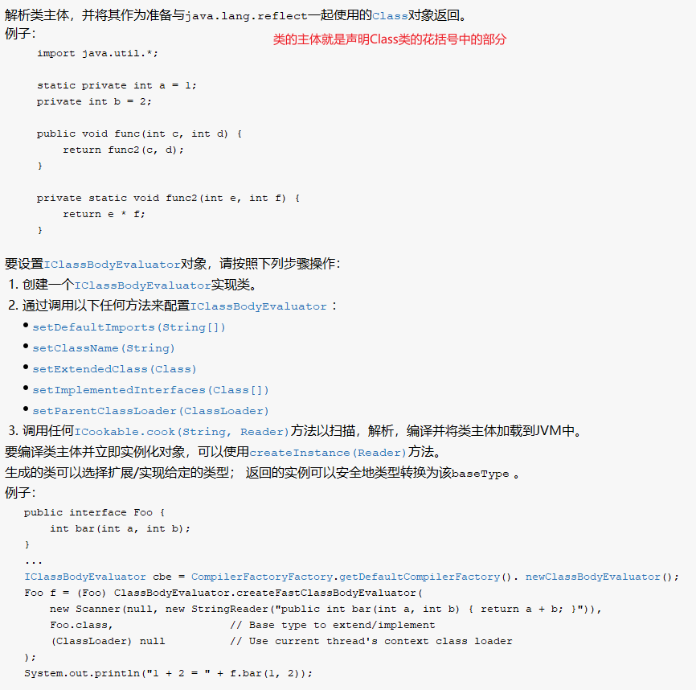

#### Janino使用Compiler

~~~java
public static void main(String[] args) throws IOException, CompileException, ClassNotFoundException,
            NoSuchMethodException, InvocationTargetException, IllegalAccessException {

        ICompiler compiler = new CompilerFactory().newCompiler();
        // 用于保存编译后的class字节码的map
        Map<String, byte[]> classes = new HashMap<String, byte[]>();
        // 设置字节码生产器为MapResourceCreator
        compiler.setClassFileCreator(new MapResourceCreator(classes));

        // Now compile two units from strings:
        compiler.compile(new Resource[] {
            new StringResource("pkg1/A.java",
                "package pkg1; public class A { public static int meth() { return pkg2.B.meth(); } }"),
            new StringResource("pkg2/B.java",
                "package pkg2; public class B { public static int meth() { return 77;            } }"),});

        // Set up a class loader that uses the generated classes.
        ClassLoader cl = new ResourceFinderClassLoader(new MapResourceFinder(classes), // resourceFinder
            ClassLoader.getSystemClassLoader() // parent
        );
        Assert.assertEquals(77, cl.loadClass("pkg1.A").getDeclaredMethod("meth").invoke(null));
    }
~~~

#### Janino使用ClassLoader

~~~java
ClassLoader cl = new JavaSourceClassLoader(
    this.getClass().getClassLoader(),  // parentClassLoader
    new File[] { new File("srcdir") }, // optionalSourcePath
    (String) null,                     // optionalCharacterEncoding
    DebuggingInformation.NONE          // debuggingInformation
);
 
// Load class A from "srcdir/pkg1/A.java", and also its superclass
// B from "srcdir/pkg2/B.java":
Object o = cl.loadClass("pkg1.A").newInstance();
 
// Class "B" implements "Runnable", so we can cast "o" to
// "Runnable".
((Runnable) o).run(); 
~~~

#### Debug

idea貌似可以调试，但是无法看到生成的java文件，所以两样一抹黑

```
org.codehaus.janino.source_debugging.enable=true\
org.codehaus.janino.source_debugging.dir=C:\tmp\
```

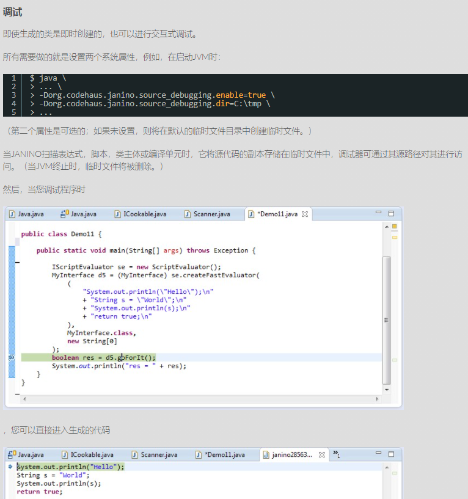

## [反射框架reflections](https://github.com/ronmamo/reflections)

> 简介

使用Reflections可以很轻松的获取以下元数据信息：

- 获取某个类型的全部子类
- 只要类型、构造器、方法，字段上带有特定注解，便能获取带有这个注解的全部信息（类型、构造器、方法，字段）
- 获取所有能匹配某个正则表达式的资源
- 获取所有带有特定签名的方法，包括参数，参数注解，返回类型
- 获取所有方法的名字
- 获取代码里所有字段、方法名、构造器的使用

> Maven依赖

~~~java
<dependency>
    <groupId>org.reflections</groupId>
    <artifactId>reflections</artifactId>
    <version>0.9.11</version>
</dependency>
~~~

> 实例化

```java
// 实例化Reflections，指定扫描的包为my.package及其子包，使用默认的scanners（扫描器）
Reflections reflections = new Reflections("my.package");

// 使用ConfigurationBuilder进行实例化
new Reflections(new ConfigurationBuilder()
     .setUrls(ClasspathHelper.forPackage("my.project.prefix"))
     .setScanners(new SubTypesScanner(), 
                  new TypeAnnotationsScanner().filterResultsBy(optionalFilter), ...),
     .filterInputsBy(new FilterBuilder().includePackage("my.project.prefix"))
     ...);
```

> 使用

- 扫描子类

  ~~~java
  //SubTypesScanner
  Set<Class<? extends Module>> modules = 
      reflections.getSubTypesOf(com.google.inject.Module.class);
  ~~~

- 扫描带有某个注解的类

  ~~~java
  //TypeAnnotationsScanner 
  Set<Class<?>> singletons = 
      reflections.getTypesAnnotatedWith(javax.inject.Singleton.class);
  ~~~

- 扫描资源

  ~~~java
  //ResourcesScanner
  Set<String> properties = 
      reflections.getResources(Pattern.compile(".*\\.properties"));
  ~~~

- 扫描带有某个注解的方法/构造方法

  ~~~java
  //MethodAnnotationsScanner
  Set<Method> resources =
      reflections.getMethodsAnnotatedWith(javax.ws.rs.Path.class);
  Set<Constructor> injectables = 
      reflections.getConstructorsAnnotatedWith(javax.inject.Inject.class);
  ~~~

- 扫描带有某个注解的字段

  ~~~java
  //FieldAnnotationsScanner
  Set<Field> ids = 
      reflections.getFieldsAnnotatedWith(javax.persistence.Id.class);
  ~~~

- 扫描特定的方法

  ~~~java
  //MethodParameterScanner
  //扫描特定参数类型的方法
  Set<Method> someMethods =
      reflections.getMethodsMatchParams(long.class, int.class);
  //扫描特定返回类型的方法
  Set<Method> voidMethods =
      reflections.getMethodsReturn(void.class);
  //扫描方法参数上带有某个注解的方法
  Set<Method> pathParamMethods =
      reflections.getMethodsWithAnyParamAnnotated(PathParam.class);
  ~~~

- 扫描方法的参数名

  ~~~java
  //MethodParameterNamesScanner
  List<String> parameterNames = 
      reflections.getMethodParamNames(Method.class)
  ~~~

- 扫描？？？

  ~~~java
  //MemberUsageScanner
  Set<Member> usages = 
      reflections.getMethodUsages(Method.class)
  ~~~


## Process

在java中, Process表示一个子程序

他的使用场景是如果我们想执行一个子程序, 那么可以使用他

### 创建Process

要执行一个子程序, 有两种办法

1. 通过`Runtime.getRuntime().exec()`方法

   ~~~java
           /*
               三个参数分别是:
                   1. command: 指定要执行的命令, 
                   2. envp: 环境变量(每个string都应该是 aaa=bbb 的格式), 
                   3. dir: 命令执行的工作目录
            */
   Process process = Runtime.getRuntime().exec("java HelloWorld", null, new File("F:\\demo\\"));
   ~~~

2. 通过ProcessBuilder来创建一个builder, 然后调用他的start方法来执行命令

   ~~~java
           ProcessBuilder builder = new ProcessBuilder("java", "-version");
           Process process = builder.start();
   ~~~

   ProcessBuilder有如下可选的方法

   1. 指定命令的工作目录

      ~~~java
      builder.directory(new File("/path/to/working_dir")); // 设置工作目录
      ~~~

   2. 指定启动命令时的环境变量

      ~~~java
      Map<String, String> environment = builder.environment();
              environment.put("MY_VAR", "my_value"); // 设置环境变量
      ~~~

   3. 默认情况下, 创建的Process的输入, 输出, 错误流是System.in, System.out, System.out

      当然你也可以重定向他们

      ~~~java
      builder.redirectErrorStream(); // 将错误流合并到标准输出流
      
      // 将输入重定向到文件中
      builder.redirectInput(ProcessBuilder.Redirect.from(new File("input.txt")));
      // 标准输入重定向到与父进程相同
      builder.redirectInput(ProcessBuilder.Redirect.INHERIT); 
      // 程序的标准输入通过管道连接到当前的进程
      builder.redirectInput(ProcessBuilder.Redirect.PIPE); 
      
      
      builder.redirectOutput(ProcessBuilder.Redirect.appendTo(new File("error.log"))); // 错误流追加到文件
      builder.redirectOutput(ProcessBuilder.Redirect.to(new File("out.log"))); // 标准输出重定向到文件
      builder.redirectOutput(ProcessBuilder.Redirect.INHERIT); // 标准输出重定向到与父进程相同
      builder.redirectOutput(ProcessBuilder.Redirect.DISCARD);  // 标准输出重定向到黑洞
      builder.redirectOutput(ProcessBuilder.Redirect.PIPE); // 程序的标准输出通过管道连接到当前的进程
      
      // 重定向错误流和重定向输出流一样
      builder.redirectError(ProcessBuilder.Redirect.appendTo(new File("error.log")));
      ~~~

      

### Process的各个方法

1. 获取输入, 输出, 错误流

   ~~~java
   // Stream形式的流
   InputStream inputStream = process.getInputStream(); // 获取他的输入流
   InputStream errorStream = process.getErrorStream(); // 获取他的错误输出流
   OutputStream outputStream = process.getOutputStream(); // 获取他的输出流
   BufferedReader bufferedReader = new BufferedReader(new InputStreamReader(process.getInputStream()));
   String str;
   while ((str = bufferedReader.readLine()) != null) {
       System.out.println(str);
   }
   
   // Reader形式的流
   BufferedReader bufferedReader1 = process.inputReader(StandardCharsets.UTF_8); // 标准输入, 使用UTF-8编码
   BufferedReader bufferedReader2 = process.errorReader(StandardCharsets.UTF_8); // 标准错误输出, 使用UTF-8编码
   BufferedWriter bufferedWriter = process.outputWriter(StandardCharsets.UTF_8); // 标准输出, 使用UTF-8编码 
   if (bufferedReader1.ready()) {
       String line;
       while ((line = bufferedReader1.readLine()) != null) {
           System.out.println(line);
       }
   }
   ~~~

2. 获取程序pid

   ~~~java
   long pid = process.pid(); // 获取程序的pid
   ~~~

3. 关闭程序

   ~~~java
   CompletableFuture<Process> future = process.onExit(); // 返回Process退出的Future
   future.thenRun(() -> {
       System.out.println("进程退出");
   });
   
   
   process.destroy(); // kill -15
   process.destroyForcibly(); // kill -9
   boolean alive = process.isAlive(); // 判断进程是否存活
   process.waitFor(); // 等待进程结束
   process.waitFor(1000, java.util.concurrent.TimeUnit.MILLISECONDS); // 等待进程结束, 最多等待1000毫秒
   int exitValue = process.exitValue();// 获取进程的退出值
   ~~~

4. 句柄相关的函数

   ~~~java
   ProcessHandle processHandle = process.toHandle();// 获取进程的句柄
   Stream<ProcessHandle> children = process.children(); // 获取进程的子进程句柄
   Optional<ProcessHandle> parent = processHandle.parent(); // 获取当前进程的父进程的句柄
   int same = processHandle.compareTo(processHandle);// 比较两个进程的句柄
   ~~~

   

## JavaCompiler

JavaCompiler的功能是动态的从文件, 内存中编译Java类为字节码文件

要想使用他, 有两种方式

1. 一种是简单的编译, 适合你只想要编译java文件的清空

2. 一种是复杂的编译, 可以定制化的功能多

   

### 简单编译

~~~java
public static void main(String[] args) throws IOException, InterruptedException {
        JavaCompiler systemJavaCompiler = ToolProvider.getSystemJavaCompiler();
        if (systemJavaCompiler == null) {
            // JavaCompiler只在jdk中可用, 在jre中不可用
            throw new RuntimeException("JDK required (JRE is not sufficient)");
        }

        /*
            四个参数分别是:
                1. 标准输入: 如果为null, 则使用System.in, 一般都为null, 因为javac几乎不会从标准输入读取内容, 保留这个参数只是为了与其他Tool类保持一致
                2. 标准输出: 如果为null, 则使用System.out
                3. 标准错误输出: 如果为null, 则使用System.err
                4. 传递给javac的参数
                        -d target/classes: 指定输出后的目录
                        -cp : 指定类路径
                        -encoding utf-8: 指定编码
                        -source 17: 指定源代码的版本
                        -target 17: 指定编译后的字节码的版本
                        com.tiger.HelloWorld.java: 指定要编译的类
         */
        String[] arguments = {
                "-d", "target/java-compiler",
                "-cp", "F:\\demo\\",
                "-encoding", "utf-8",
                "-source", "17",
                "-target", "17",
            "C:\\Users\\Administrator\\Desktop\\untitled\\src\\main\\resources\\HelloWorld.java"
        };
        // 编译成功返回0, 编译失败返回非0
        // 你可以从错误流, 输出流中获取报错原因
        int success = systemJavaCompiler.run(System.in, System.out, System.err, arguments);
        if (success == 0) {
            System.out.println("编译成功");
        } else {
            System.out.println("编译失败"); return;
        }
    }
~~~

### 复杂的情况

除了上面简单的直接编译本地文件外, JavaCompiler还提供了一整套编译流程, 下面要讲解几个相关的类

#### JavaFileObject

他表示一个 `.java`的源文件,  或者一个`.class`的字节码文件,  或者一个`.html`的javadoc文件, 或者一个其他类型的资源文件

他内部有一个Kind属性

~~~java
public interface JavaFileObject extends FileObject {
    // JavaFileObject表示的文件的枚举
    enum Kind {
        SOURCE(".java"), // java源文件
        CLASS(".class"), // java字节码文件
        HTML(".html"), // javadoc文件
        OTHER(""); // 其他的资源文件
        public final String extension; // 文件的扩展名
        Kind(String extension) {
            this.extension = Objects.requireNonNull(extension);
        }
    }
    Kind getKind(); // 返回当前JavaFileObject表示的文件类型
}
~~~

#### SimpleJavaFileObject

他是JavaFileObject的一个子类, 如果我们想要自定义各种类型的Java文件, 那么最好是继承他

他有两个属性

~~~java
// 当前SimpleJavaFileObject表示的文件的uri
protected final URI uri; 
protected final Kind kind; // 表示的文件的类型
~~~

他的内部有好几个可以重写的方法

~~~java
// 获取文件的输入流, 通常用于Kind为CLASS的时候, 编译器读取java字节码的内容的时候调用
public InputStream openInputStream() throws IOException
// 获取文件的输出流, 通常用于Kind为CLASS的时候, 编译器写Java字节码到文件中的调用
public OutputStream openOutputStream() throws IOException 
    
// 返回文件的内容, 通常用于Kind为SOURCE的时候, 编译器读取java源文件的内容
public CharSequence getCharContent(boolean ignoreEncodingErrors) 
~~~


比如我可以重写他来表示一个内存中字符串组成的Java源码文件

~~~java
class JavaSourceFromString extends SimpleJavaFileObject {
    private final String code;
    private final String className;

    JavaSourceFromString(String className, String code) {
        super(URI.create("string:///" + className.replace('.', '/') + Kind.SOURCE.extension), Kind.SOURCE);
        this.code = code;
        this.className = className;
    }

    // 编译器会调用这个方法, 来获取Java源文件的内容
    @Override
    public CharSequence getCharContent(boolean ignoreEncodingErrors) {
        return code;
    }
    public String getClassName() {
        return className;
    }
}
~~~

也可以重写他, 来表示一个等待写入字节码的Java字节码文件

~~~java
class JavaClassObject extends SimpleJavaFileObject {
    private final ByteArrayOutputStream outputStream = new ByteArrayOutputStream();

    JavaClassObject(String className) {
        super(URI.create("mem:///" + className.replace('.', '/') + Kind.CLASS.extension), Kind.CLASS);
    }

    @Override
    public OutputStream openOutputStream() {
        return outputStream; // 编译器会调用这个方法, 获取OutputStream, 然后将编译后的字节码文件写入到OutputStream
    }

    public byte[] getBytes() {
        return outputStream.toByteArray();
    }
}
~~~

也可以重写他, 来表示一个内存中的Java字节码文件

~~~java
import javax.tools.SimpleJavaFileObject;
import java.io.ByteArrayOutputStream;
import java.io.IOException;
import java.io.InputStream;
import java.io.OutputStream;
import java.net.URI;

public class MemoryByteCodeJavaFileObject extends SimpleJavaFileObject {

    private final String className;
    private final byte[] bytes;

    public MemoryByteCodeJavaFileObject(String className, byte[] bytes) {
        super(URI.create("mem:///" + className.replace('.', '/') + Kind.CLASS.extensions), Kind.CLASS);
        this.className = className;
        this.bytes = bytes;
    }

    @Override
    public InputStream openInputStream() {
        // 编译器会调用这个方法, 来获取Java字节码文件的内容
        return new java.io.ByteArrayInputStream(getBytes());
    }

    public byte[] getBytes() {
        return bytes;
    }

    public String getClassName() {
        return className;
    }
}
~~~

#### JavaFileManager

`JavaFileManager` 主要用于处理 Java 文件（如 `.java` 和 `.class`）的读取、写入、路径定位等操作。它是连接文件系统和编译器之间的桥梁。


JavaCompiler在编译过程中, 会调用JavaFileManager中的方法, 来查找对应的`.java/.class`文件, 并且在JavaCompiler在输出的时候, 与会调用JavaFileManger中特定的方法, 来输出字节码文件

所以在JavaFileManager中, 有一些方法是编译器来调用的, 有一些方法是我们手动可以调用的


| 方法名                       | 被谁调用           | 什么时候调用                            | 作用                                                         |
| ---------------------------- | ------------------ | --------------------------------------- | ------------------------------------------------------------ |
| `getJavaFileForInput`        | 编译器             | 查找依赖类或增量编译                    | 读取已有的 `.java` 或 `.class`                               |
| `getJavaFileForOutput`       | 编译器             | 输出 `.class` 文件时                    | 获取一个用于写 `.class` 的目标                               |
| `getFileForInput`            | 编译器或注解处理器 | 读取资源文件时（如 `@PropertySource`）  | 读任意非 `.java` 的文件资源                                  |
| `getFileForOutput`           | 编译器或注解处理器 | 生成资源文件时                          | 写资源文件（如 `META-INF/services/...`）                     |
| `list(...)`                  | 编译器             | 自动扫描某 package 下的类或源码         | 枚举 `.java` 或 `.class` 文件                                |
| `inferBinaryName(...)`       | 编译器             | list 时返回的 `JavaFileObject` 需要类名 | `list(location, packageName, ...)` 返回一堆 `JavaFileObject` 后，<br>编译器会依次调用 `inferBinaryName(location, javaFileObject)` 来知道这些类的完整类名。 |
| `inferModuleName(...)`       |                    |                                         |                                                              |
| `hasLocation(...)`           | 编译器或你         | 判断是否设置过某个路径                  | 避免空指针异常等                                             |
| `isSameFile(...)`            | 编译器             | 判断两个 `JavaFileObject` 是否等价      | 常用于避免重复编译                                           |
| `handleOption(...)`          | 编译器             | 处理命令行参数如 `-d`, `-classpath` 等  | 转给 `JavaFileManager`                                       |
| `flush()`                    | 编译器             | 编译中间阶段刷新文件流                  | 保证数据写入磁盘或内存                                       |
| `close()`                    | 编译器或你         | 编译结束时                              | 清理资源（流、临时文件等）                                   |
| `getClassLoader(...)`        | 编译器或你         | 想要加载 `.class` 文件为 Class 时       | 获取对应 `Location` 的 `ClassLoader`                         |
| `listLocationForModules(..)` |                    |                                         | 列出模块的所有位置                                           |
| `containes(...)`             |                    |                                         | 判断某个FileObject是否在指定的Location中                     |
| `getServiceLoader(...)`      |                    |                                         | 获取一个ServiceLoader                                        |
| `getLocationForModule(...)`  |                    |                                         | 获取模块的位置                                               |


#### StandardJavaFileManager

`StandardJavaFileManager` 是`JavaFileManager`的标准实现类, 并且他还提供了更多的方法, 

- 让你可以自主控制编译的源码路径, 输出路径, 类路径等等
- 把本地文件（如 `.java`）转换成 `JavaFileObject`，供编译器使用；

他的常见api如下

1. 创建

   ~~~java
   JavaCompiler systemJavaCompiler = ToolProvider.getSystemJavaCompiler();
   if (systemJavaCompiler == null) {
   	throw new RuntimeException("JDK required (JRE is not sufficient)");
   }
   DiagnosticCollector<JavaFileObject> diagnostics = new DiagnosticCollector<>();
   try (
       /*
        三个参数分别为:
         1. 诊断信息收集器: 用于收集信息
         2. 区域化信息: 格式化信息的时候, 要使用的区域信息, 一般为null, 使用默认的区域
         3. 文件编码
        */
       StandardJavaFileManager stdFileManager = compiler.getStandardFileManager(diagnostics, null, null);
   ) {
       
   }
   ~~~

2. 从本地文件中读取文件, 转换为JavaFileObject, 供java编译器使用

   <font color=red>下面所有的方法都不能指定目录地址, 必须是真实的文件地址</font>

   ~~~java
   // 将File指定的文件转换为JavaFileObject
   Iterable<? extends JavaFileObject> getJavaFileObjectsFromFiles(Iterable<? extends File> files);
   Iterable<? extends JavaFileObject> getJavaFileObjects(File... files);
   Iterable<? extends JavaFileObject> getJavaFileObjects(String... names); // 通过string指定文件的文件名
   Iterable<? extends JavaFileObject> getJavaFileObjectsFromStrings(Iterable<String> names);
   
   
   // 通过Path来指定要转换为JavaFileObject的文件的路径
   Iterable<? extends JavaFileObject> getJavaFileObjectsFromPaths(Iterable<? extends Path> paths)
   Iterable<? extends JavaFileObject> getJavaFileObjectsFromPaths( Collection<? extends Path> paths);
   Iterable<? extends JavaFileObject> getJavaFileObjects(Path... paths)
   ~~~

3. `setLocation(...)` / `getLocation(...)` 是用来配置和获取 JavaCompiler能够使用的各种路径

   这些是 Java 编译器必须知道的路径信息，用于编译时查找依赖、生成字节码、写入输出目录等。

   ~~~java
   // 设置某个位置（如类路径或输出路径）对应的文件目录
   setLocation(Location location, Iterable<? extends File> files)	
   setLocationFromPaths(Location location, Collection<? extends Path> paths)	
       
   // 针对 Java 模块（JPMS）设置某个模块的路径
   setLocationForModule(Location location, String moduleName, Collection<? extends Path> paths)	
   
   getLocation(Location location)	 // 获取当前为某个位置设置的路径, 返回File
   getLocationAsPaths(Location location) // 同上, 返回Path
   ~~~

   能够设置和获取的Location有

   ~~~java
   StandardLocation.CLASS_PATH // Java 类路径（查找依赖）
   StandardLocation.SOURCE_PATH // Java 源码路径（查找源码）
   StandardLocation.CLASS_OUTPUT // .class 文件的输出目录
   StandardLocation.SOURCE_OUTPUT // .java 文件生成输出目录
   StandardLocation.MODULE_PATH  // 模块路径（Java 9+）
   StandardLocation.SYSTEM_MODULES // 	JDK 自带的模块
   StandardLocation.ANNOTATION_PROCESSOR_PATH // 注解处理器类路径
   ~~~


#### ForwardingJavaFileManager

ForwardingJavaFileManager采用的是装饰器模式, 他也实现了JavaFileManager接口, 他可以对已有的 `JavaFileManager` 实现进行“包装”或“代理”，从而可以扩展或修改其行为，而无需完全从零实现接口。


他内部有一个属性`fileManager`

- **“转发”所有方法调用** 给内部持有的 `fileManager`实例；
- 你可以 **选择性地覆盖某些方法**，以改变行为，比如把 `.class` 文件输出到内存而不是磁盘；
- 适合用于：**自定义内存编译**、**拦截文件写入**、**注入类加载逻辑** 等场景。

~~~java
public class ForwardingJavaFileManager<M extends JavaFileManager> implements JavaFileManager {
    protected final M fileManager;

    protected ForwardingJavaFileManager(M fileManager) {
        this.fileManager = fileManager;
    }

    // 所有 JavaFileManager 方法默认都转发给 this.fileManager
}
~~~


#### DiagnosticCollector

你可以在编译代码的时候, 传递一个`DiagnosticListener<T>`给JavaCompiler, 他主要用于在编译代码的时候, 收集编译时的各种信息, 包括

1. 编译错误
2. 编译警告
3. 提示信息

他的使用比较简单, 就是在编译代码的时候, 将其传递给JavaCompiler, 等编译完了, 就可以通过for循环来获取编译产生的信息了

~~~java
for (Diagnostic<? extends JavaFileObject> diagnostic : diagnostics.getDiagnostics()) {
    JavaFileObject javaFileObject = diagnostic.getSource(); // 获取产生信息的Java文件对象
    String source = diagnostic.getSource().toUri().toString(); // 获取信息的源文件路径
                
    Diagnostic.Kind kind = diagnostic.getKind(); // 获取信息的类型, ERROR, WARNING, NOTE
                
    long lineNumber = diagnostic.getLineNumber(); // 获取信息的行号
    long columnNumber = diagnostic.getColumnNumber(); // 获取信息的列号
                
    String message = diagnostic.getMessage(Locale.getDefault()); // 获取信息的内容
    long startPosition = diagnostic.getStartPosition(); // 产生信息的代码的起始位置
    long endPosition = diagnostic.getEndPosition(); // 产生信息的代码的结束位置
    long position = diagnostic.getPosition(); // 产生信息的代码的位置
                
    String code = diagnostic.getCode(); // 产生信息的代码
}
~~~


#### 案例1: 编译本地的文件

~~~java
    /**
     * 编译本地文件
     */
    public static void main(String[] args) throws IOException, InterruptedException {


        JavaCompiler compiler = ToolProvider.getSystemJavaCompiler();
        if (compiler == null) {
            // JavaCompiler只在JDK中可用, 在JRE中不可用
            throw new RuntimeException("JDK required (JRE is not sufficient)");
        }

        DiagnosticCollector<JavaFileObject> diagnostics = new DiagnosticCollector<>();

        try (
                /*
                    三个参数分别为:
                        1. 诊断信息收集器: 用于收集信息
                        2. 区域化信息: 格式化信息的时候, 要使用的区域信息, 一般为null, 使用默认的区域
                        3. 文件编码
                 */
                StandardJavaFileManager fileManager = compiler.getStandardFileManager(diagnostics, null, null);
        ) {

            // 获取要编译的Java文件
            Iterable<? extends JavaFileObject> compilationUnits = fileManager.getJavaFileObjectsFromFiles(Arrays.asList(
                    new File("C:\\Users\\Administrator\\Desktop\\untitled\\src\\main\\resources\\HelloWorld.java")));

            // 设置编译选项
            List<String> options = Arrays.asList(
                    // "-d", "target/java-compiler11", // 指定输出后的目录, 不必事先存在
                    // "-cp", "F:\\", // 指定classpath
                    "-encoding", "utf-8",
                    "-source", "17",
                    "-target", "17"
            );

            // 通过fileManager也可以指定output, classpath等等
            fileManager.setLocation(StandardLocation.CLASS_OUTPUT, Arrays.asList(new File("target/java-compiler"))); // 目录需要事先存在
            fileManager.setLocation(StandardLocation.CLASS_PATH, Arrays.asList(new File("F:\\")));
            fileManager.setLocation(StandardLocation.SOURCE_OUTPUT, Arrays.asList(new File("target/java-compiler11"))); // 目录需要事先存在
            fileManager.setLocation(StandardLocation.SOURCE_PATH, Arrays.asList(new File("F:\\")));
            fileManager.setLocation(StandardLocation.ANNOTATION_PROCESSOR_PATH, Arrays.asList(new File("F:\\")));
            
            // 创建编译任务
            JavaCompiler.CompilationTask task = compiler.getTask(
                    null,  // 标准输出
                    fileManager, // 文件管理器
                    diagnostics, // 诊断信息收集器
                    options, // 编译选项
                    null, // 需要注解处理器处理的类
                    compilationUnits // 要编译的Java文件
            );

            // 执行编译
            boolean success = task.call();

            // 处理诊断信息
            for (Diagnostic<? extends JavaFileObject> diagnostic : diagnostics.getDiagnostics()) {
                System.out.format(
                        "Error on line %d in %s%n",
                        diagnostic.getLineNumber(),
                        diagnostic.getSource().toUri()
                );
            }

            if (success) {
                System.out.println("编译成功");
            } else {
                System.out.println("编译失败"); return;
            }

        }
    }
~~~


#### 案例2: 编译字符串

~~~java
    // 创建一个自定义的JavaFileObject, 用来表示内容为字符串的java源码文件
    static class StringJavaFileObject extends SimpleJavaFileObject {
        final String code; // 具体的代码

        // 这里的string没有特别的含义, 仅仅作为标识
        // 常用的标识有 string:/// 字符串表示的文件
        //             file:/// 磁盘上的文件
        //             mem:///  内存中的文件
        StringJavaFileObject(String code) {
            super(URI.create("string:///" + name.replace('.', '/') + Kind.SOURCE.extension), Kind.SOURCE);
            this.code = code;
        }

        @Override
        public CharSequence getCharContent(boolean ignoreEncodingErrors) {
            // 返回源文件的内容
            return code;
        }
    }

    // 再创建一个自定义的JavaFileObject, 用来存储编译后的字节码内容
    static class MemoryClassJavaFileObject extends SimpleJavaFileObject {
        private final ByteArrayOutputStream outputStream = new ByteArrayOutputStream();

        MemoryClassJavaFileObject(String name) {
            super(URI.create("mem:///" + name.replace('.', '/') + Kind.CLASS.extension), Kind.CLASS);
        }

        // java编译器会调用这个方法, 来获取outputStream, 然后将字节码写入到outputStream中
        @Override
        public OutputStream openOutputStream() {
            return outputStream;
        }
        
        @Override
        public InputStream openInputStream() {
            return new ByteArrayInputStream(outputStream.toByteArray());
        }

        public byte[] getBytes() {
            return outputStream.toByteArray();
        }
    }

    // 自定义一个JavaFileManager, 并且重写他的getJavaFileForOutput方法
    public static class MemoryJavaFileManager extends ForwardingJavaFileManager<StandardJavaFileManager> {
        private final Map<String, MemoryClassJavaFileObject> classBytes = new HashMap<>();

        MemoryJavaFileManager(StandardJavaFileManager fileManager) {
            super(fileManager);
        }

        // 当编译器要生成文件内容的时候, 会调用这个方法来获得一个JavaFileObject
        // 然后调用JavaFileObject的openOutputStream方法来获取一个OutputStream, 用于写入内容
        @Override
        public JavaFileObject getJavaFileForOutput(
                Location location, String className, JavaFileObject.Kind kind, FileObject sibling) throws IOException {
            // 只处理生成的文件是class文件的情况
            if (kind == JavaFileObject.Kind.CLASS) {
                // 生成的内容输出到MemoryClassJavaFileObject中
                MemoryClassJavaFileObject fileObject = new MemoryClassJavaFileObject(className);
                classBytes.put(className, fileObject);
                return fileObject;
            }
            return super.getJavaFileForOutput(location, className, kind, sibling);
        }

        public Map<String, byte[]> getClassBytes() {
            Map<String, byte[]> result = new HashMap<>();
            for (Map.Entry<String, MemoryClassJavaFileObject> entry : classBytes.entrySet()) {
                result.put(entry.getKey(), entry.getValue().getBytes());
            }
            return result;
        }

    }

    // Step 4: 自定义类加载器从内存中加载字节码, parent是AppClassLoader
    static class MemoryClassLoader extends ClassLoader {
        private final Map<String, byte[]> classBytes = new ConcurrentHashMap<>();
        private final Map<String, Class<?>> alreadyLoadedClasses = new ConcurrentHashMap<>();

        public void addClass(String className, byte[] bytes) {
            classBytes.put(className, bytes);
        }

        @Override
        protected Class<?> findClass(String name) throws ClassNotFoundException {
            if (alreadyLoadedClasses.containsKey(name)) {
                return alreadyLoadedClasses.get(name);
            }
            byte[] bytes = classBytes.get(name);
            if (bytes == null) {
                return null;
            }
            Class<?> aClass = defineClass(name, bytes, 0, bytes.length);
            alreadyLoadedClasses.put(name, aClass);
            return aClass;
        }
    }

public static void main(String[] args) throws Exception {
        String className = "Hello";
        String codeStr = """
                    public class Hello {
                        public void sayHello() {
                            System.out.println("Hello, dynamic Java!");
                        }
                    }
                """;

        JavaCompiler compiler = ToolProvider.getSystemJavaCompiler();
        DiagnosticCollector<JavaFileObject> diagnostics = new DiagnosticCollector<>();
        if (compiler == null) {
            throw new RuntimeException("JDK required (JRE is not sufficient)");
        }
        try (
                StandardJavaFileManager stdFileManager =
                        compiler.getStandardFileManager(diagnostics, null, null);
                MemoryJavaFileManager fileManager = new MemoryJavaFileManager(stdFileManager);
        ) {
            // 封装源码
            JavaFileObject source = new StringJavaFileObject(className, codeStr);

            // 设置编译选项
            List<String> options = Arrays.asList(
                    // "-d", "target/java-compiler11", // 指定输出后的目录, 不必事先存在
                    // "-cp", "F:\\", // 指定classpath
                    "-encoding", "utf-8",
                    "-source", "17",
                    "-target", "17"
            );
            
            // 通过fileManager也可以指定output, classpath等等
            fileManager.setLocation(StandardLocation.CLASS_OUTPUT, Arrays.asList(new File("target/java-compiler"))); // 目录需要事先存在
            fileManager.setLocation(StandardLocation.CLASS_PATH, Arrays.asList(new File("F:\\")));
            fileManager.setLocation(StandardLocation.SOURCE_OUTPUT, Arrays.asList(new File("target/java-compiler11"))); // 目录需要事先存在
            fileManager.setLocation(StandardLocation.SOURCE_PATH, Arrays.asList(new File("F:\\")));
            fileManager.setLocation(StandardLocation.ANNOTATION_PROCESSOR_PATH, Arrays.asList(new File("F:\\")));

            
            // 准备编译任务
            Iterable<? extends JavaFileObject> compilationUnits = List.of(source);
            JavaCompiler.CompilationTask task = compiler.getTask(
                    null,  // 标准输出
                    fileManager, // 文件管理器
                    diagnostics, // 诊断信息收集器
                    options, // 编译选项
                    null, // 需要注解处理器处理的类
                    compilationUnits // 要编译的Java文件
            );

            boolean success = task.call();

            // 输出编译信息
            for (Diagnostic<? extends JavaFileObject> diagnostic : diagnostics.getDiagnostics()) {
                JavaFileObject javaFileObject = diagnostic.getSource(); // 获取产生信息的Java文件对象
                String sourcePath = diagnostic.getSource().toUri().toString(); // 获取信息的源文件路径

                Diagnostic.Kind kind = diagnostic.getKind(); // 获取信息的类型, ERROR, WARNING, NOTE

                long lineNumber = diagnostic.getLineNumber(); // 获取信息的行号
                long columnNumber = diagnostic.getColumnNumber(); // 获取信息的列号

                String message = diagnostic.getMessage(Locale.getDefault()); // 获取信息的内容
                long startPosition = diagnostic.getStartPosition(); // 产生信息的代码的起始位置
                long endPosition = diagnostic.getEndPosition(); // 产生信息的代码的结束位置
                long position = diagnostic.getPosition(); // 产生信息的代码的位置

                String code = diagnostic.getCode(); // 产生信息的代码
            }

            if (!success) {
                System.out.println("编译失败");
            } else {
                // 读取编译后的字节码, 将其加载为Class
                Map<String, byte[]> classBytes = fileManager.getClassBytes();
                MemoryClassLoader memoryClassLoader = new MemoryClassLoader();
                classBytes.forEach((s, b) -> {
                            memoryClassLoader.addClass(s, b);
                });

                // 加载类
                Class<?> aClass = memoryClassLoader.loadClass(className);
                // 调用其中的方法
                aClass.getMethod("sayHello").invoke(aClass.newInstance());
            }
        }
~~~


## 在线编译和解释执行scala

首先要知道的是, 你可以像java一样来使用scala, 也可以编写一个scala脚本来解释执行, 类似groovy一样, 不需要main函数就直接执行

所以我们在使用java编译scala的时候, 也有两种方式

1. 像java一样, 编译, 然后执行, 这个时候你不能写脚本代码, 所有要执行的代码都要写在main函数中

   ~~~scala
   class Hello {
     def greet(): String = "Hello from compiled class!"
   }
   object Hello {
     var count: Int = 0
     def main(args: Array[String]): Unit = {
       println("Hello, Scala!")
       println(s"Arguments: ${args.mkString(", ")}")
     }
   }
   ~~~

2. 像groovy一样, 一边编译一遍执行, 这个时候可以写脚本代码

   ~~~scala
   class Hello {
      def greet(): String = "Hello from compiled class!"
    }
   object Hello {
     var count: Int = 0
   }
   
   val hello = new Hello
   println(hello.greet())
   println(Hello.count)        
   ~~~


scala提供了两个工具类: 

- `Global.Run`:  直接编译scala, 无法编译脚本
- `IMain`: 解释执行scala,  也可以指定解释器生成的classes的位置

上面两个工具类都可以用来编译scala并输出到指定的地方, 只不过`Global.Run`是正经编译的,

 `IMain`是解释执行的时候, 指定将编译的class放在指定的目录,  编译产物相对来说是副产物

所以我们还是推荐使用`Global.Run`来编译, `IMain`来解释执行


### 导入依赖

~~~xml
    <dependencies>
        <!-- 运行scala代码需要的类库 -->
        <dependency>
            <groupId>org.scala-lang</groupId>
            <artifactId>scala-library</artifactId>
            <version>2.12.10</version>
        </dependency>
        <!-- 编译scala需要的类库 -->
        <dependency>
            <groupId>org.scala-lang</groupId>
            <artifactId>scala-compiler</artifactId>
            <version>2.12.10</version>
        </dependency>
        <!-- scala的反射支持库 -->
        <dependency>
            <groupId>org.scala-lang</groupId>
            <artifactId>scala-reflect</artifactId>
            <version>2.12.10</version>
        </dependency>
    </dependencies>
~~~


### 使用Global.Run编译scala

~~~java
package com.tiger;

import scala.collection.JavaConverters;
import scala.tools.nsc.Global;
import scala.tools.nsc.Settings;
import scala.tools.nsc.reporters.ConsoleReporter;

import java.io.File;
import java.io.FileWriter;
import java.util.Collections;

import scala.collection.immutable.List;

public class ScalaCompilerDemo {
    
    private static class ErrorHandler extends AbstractFunction1<String, BoxedUnit> {

        // 假如你在设置Settings对象的时候, 传入的参数不正确
        // 比如参数只能传 none/all 的时候, 你传了一个hello
        // 那么编译器会将错误信息传递到这里
        @Override
        public BoxedUnit apply(String msg) {
            System.err.printf("Interpreter error: %s", msg);
            return BoxedUnit.UNIT; // BoxedUnit.UNIT是java中的void
        }
    }
    public static void main(String[] args) throws Exception {
        // 1. 写入 Scala 源文件
        // 因为我们是进行编译, 所以这里不能写scala脚本了, 只能写类
        String scalaCode = """
            class Hello {
              def greet(): String = "Hello from compiled class!"
            }
           object Hello {
             var count: Int = 0
           }
           """;
        File sourceFile = new File("com/tiger/Hello.scala");
        File parentDir = sourceFile.getParentFile();
        if (!parentDir.exists()) {
            parentDir.mkdirs();  // 确保父目录存在, 自动创建 com/tiger/
        }
        try (FileWriter writer = new FileWriter(sourceFile)) {
            writer.write(scalaCode);
        }

        // 2. 配置编译器 Settings
        String outputDir = "./out-classes";

        // 配置 Scala Settings, 通过settings.xxx.tryToSetFromPropertyValue("xxx")来设置
        Settings settings = new Settings(new ErrorHandler());
        settings.usejavacp().tryToSetFromPropertyValue("true"); // 设置使用 当前JVM 的 classpath
        settings.outdir().tryToSetFromPropertyValue(outputDir); // 设置输出的目录

        // 3. 创建 Global 编译器并运行
        //      ConsoleReporter 用于输出日志在控制台
        //      你也可以创建一个PrintWriter, 来将日志打印到指定的地方
        Global.Run run;
        try (Global global = new Global(settings, new ConsoleReporter(settings))) {
            run = global.new Run();
            java.util.List<String> javaList1 = Collections.singletonList(sourceFile.getPath());
            List<String> scalaList1 = JavaConverters.asScalaBuffer(javaList1).toList();
            run.compile(scalaList1);

            System.out.println("✅ 编译完成，输出在: " + outputDir);
        }
    }
}
~~~


### 使用IMain编译和解释执行scala

~~~java
package com.tiger;


import scala.runtime.AbstractFunction1;
import scala.runtime.BoxedUnit;
import scala.tools.nsc.GenericRunnerSettings;
import scala.tools.nsc.Settings;
import scala.tools.nsc.interpreter.IMain;
import scala.tools.nsc.interpreter.Results;

import java.io.File;
import java.io.OutputStream;
import java.io.PrintWriter;


public class ScalaIMainFromJava {

    private static class ErrorHandler extends AbstractFunction1<String, BoxedUnit> {

        // 假如你在设置Settings对象的时候, 传入的参数不正确
        // 比如参数只能传 none/all 的时候, 你传了一个hello
        // 那么编译器会将错误信息传递到这里
        @Override
        public BoxedUnit apply(String msg) {
            System.err.printf("Interpreter error: %s", msg);
            return BoxedUnit.UNIT; // BoxedUnit.UNIT是java中的void
        }
    }

    public static void main(String[] args) {
        // 输出目录
        String outputDir = "./out-classes";

        // 配置 Scala Settings, 通过settings.xxx.tryToSetFromPropertyValue("xxx")来设置
        // GenericRunnerSettings是Settigns的子类, 专门用于配置解释执行的, 具有更多的参数
        GenericRunnerSettings settings = new GenericRunnerSettings(new ErrorHandler());


        // settings.classpath().tryToSetFromPropertyValue(""); // 设置classpath
        // settings.verbose().tryToSetFromPropertyValue(""); // 设置打印详细信息
        settings.usejavacp().tryToSetFromPropertyValue("true"); // 设置使用 当前JVM 的 classpath
        // settings.outdir().tryToSetFromPropertyValue(outputDir); // outdir对于IMain来说没用, 因为他是解释器执行的, 而不是编译器
        settings.Yreploutdir().tryToSetFromPropertyValue(outputDir); // 指定脚本编译后的class的输出目录, 默认情况下他是不输出到磁盘上的


        // 解释执行的时候, 解释器也会输出一些内容, 默认情况下会打印在控制台
        // 你也可以将其重定向到/dev/null中
        PrintWriter nullWriter = new PrintWriter(OutputStream.nullOutputStream());

        // 创建解释器
        // IMain interpreter = new IMain(settings); // 不传入PrintWriter, 默认输出到控制台
        IMain interpreter = new IMain(settings, nullWriter);


        // 开始解释执行代码, 并且会将解释过程中产生的class文件输出到指定的目录
        Results.Result result = interpreter.interpret("""
            class Hello {
              def greet(): String = "Hello from compiled class!"
            }
           object Hello {
             var count: Int = 0
           }
           
           val hello = new Hello
           println(hello.greet())
           println(Hello.count)
           """); // 代码被识别为脚本, 被编译为$eval和$read两个文件, 放在out-classes/$line1目录下
        interpreter.interpret("Hello.count += 1"); // 代码被识别为脚本, 被编译为$eval和$read两个文件, 放在out-classes/$line2目录下
        interpreter.interpret("println(Hello.count)"); // 代码被识别为脚本, 被编译为$eval和$read两个文件, 放在out-classes/$line3目录下
        interpreter.interpret("println(\"hello world\")");// 代码被识别为脚本, 被编译为$eval和$read两个文件, 放在out-classes/$line4目录下
        interpreter.interpret("""
            class HelloWorld2 {
              def greet(): String = "Hello from compiled class!"
            }
            """); // 代码被识别为类, 被编译为HelloWorld2.class文件, 放在out-classes目录下
        
        
        // 解释代码, 但是不执行
        // 虽然这样也能编译代码到指定的目录, 但是缺点是他本质还是通过解释器来编译的
        // 会在output目录下生成一个$repl_$init文件
        // 而使用Global.Run来编译的话, 因为是是通过编译器来执行, 所以不会有$repl_$init文件
        // 所以如果你要编译scala的话, 推荐使用Global.Run, 尽管这种方式也能达成目的
        interpreter.compileString("""
            class HelloWorld {
              def greet(): String = "Hello from compiled class!"
            }
            """); // 代码被识别为类, 被编译为HelloWorld.class文件, 放在out-classes目录下
        

        if (result instanceof Results.Success$) {
            System.out.println("✅ 执行成功！");
        } else if (result instanceof Results.Error$) {
            System.out.println("❌ 执行出错！");
            System.out.println(((Results.Error$) result));
        } else if (result instanceof Results.Incomplete$) {
            System.out.println("⚠️ 代码不完整！");
        }
        interpreter.close();
    }
}
~~~


# 其他

## 关于ShutdownHook的说明

参考https://www.jb51.net/article/210702.htm

> ShutdownHook的作用

在java程序中，很容易在进程结束时添加一个钩子，即ShutdownHook。通常在程序启动时加入以下代码即可

```java
Runtime.getRuntime().addShutdownHook(new Thread(){
    @Override
    public void run() {
        System.out.println("I'm shutdown hook...");
    }
});
```

有了ShutdownHook我们可以

- 在进程结束时做一些善后工作，例如释放占用的资源，保存程序状态等
- 为优雅（平滑）发布提供手段，在程序关闭前摘除流量

> 何时被调用

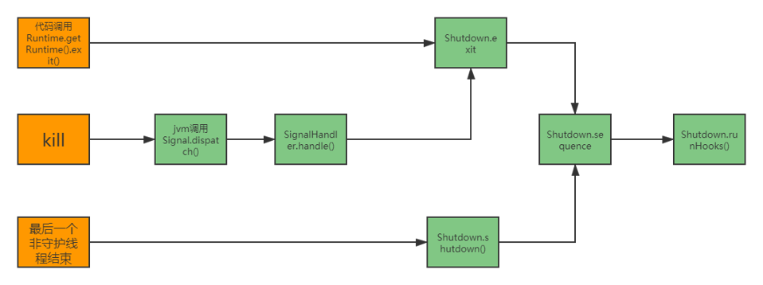

> kill

先说kill的情况，系统启动后加载System类，并调用其静态代码块，静态代码块中native方法将使得jvm调用initializeSystenClass()方法来初始化System类。

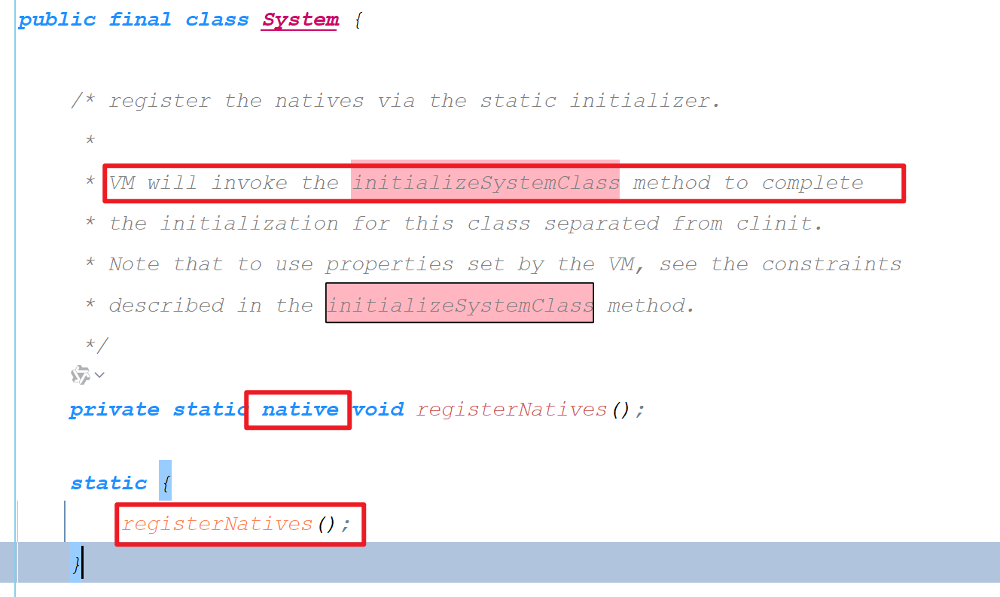

initialzeSystenClass()方法中调用Terminator.setUp()向Signal类中注册了2个SignalHandler类，分别处理`TERM`，`INT`信号，而这两个信号的handle方法都是调用System.exit()。

`int`: 在ctrl c结束前台进程的时候会接受到该信号

`term`: 在`kill pid`或者`kill -15 pid`时会接受到该信号

`kill`: 在`kill -9 pid`时会接收到该信号, 注意该信号时无法被捕获的,也就是说进程无法执行信号处理程序,会直接发送默认行为,也就是直接退出.这也就是为何`kill -9 pid`一定能杀死程序的原因. 故这也造成了进程被结束前无法清理或者关闭资源等行为,这样时不好的.

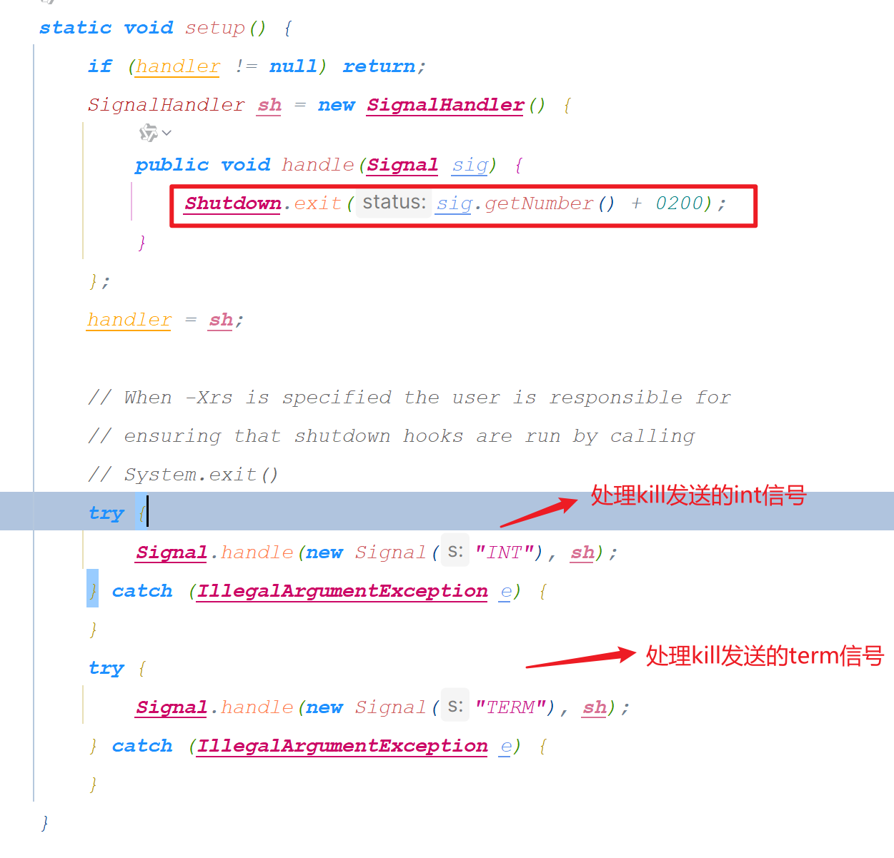

用户使用kill命令发送信号给java程序， jvm接受到signal后调用Signal.dispatch()方法异步调用对应handler.handle()方法。上面说到handle()方法将调用`Shutdown.exit()`。

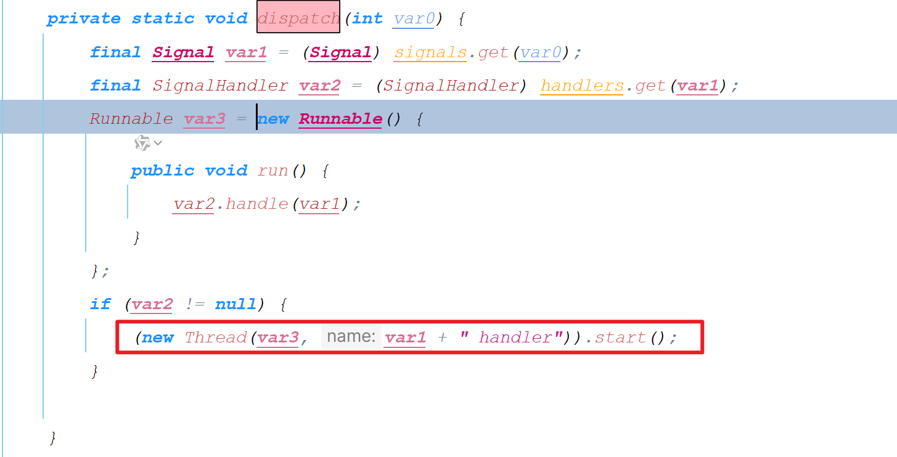

用户可以通过Signal.handle()方法传入对应的handler和其处理的信号， 来覆盖系统预定义的handler

~~~java
        // 定义一个term的信号， 也就是kill pid发出的信号
		Signal signal = new Signal("TERM");
		// 定义信号的处理方法，并注册
		// 该signal handler将覆盖系统定义的
		// 这将会导致系统直接忽略term信号
        SignalHandler oldHandler = Signal.handle(signal, new SignalHandler() {
            @Override
            public void handle(Signal sig) {
                System.out.println("handle sig");
            }
        });
		// 通过代码触发该信号， 也可以
        Signal.raise(signal);
~~~


> 最后一个非守护线程结束

jvm自动调用`Shutdown.shutdown()`方法。

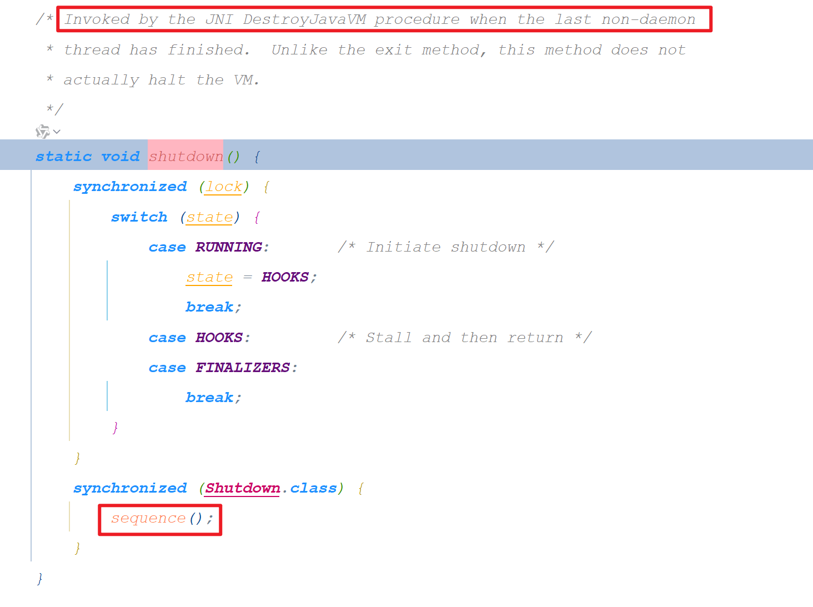

> 代码调用

代码调用`Runtime.getRuntime().exit()`底层也是会调用`Shutdown.exit()`

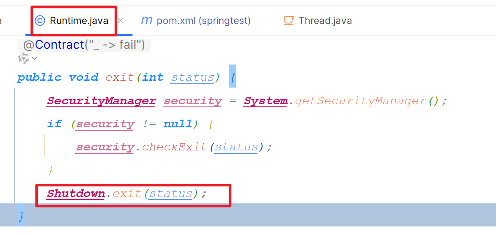

或者代码调用`System.exit()`, 底层还是会调用`shutdown.exit()`

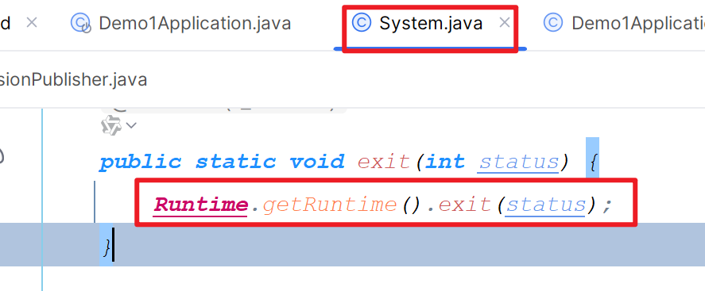


> Shutdown.sequence()

上述三种情况都将调用Shutdown.sequence()方法。该方法将调用runHooks()**同步**执行所有的钩子函数。

这里的hook可以看做是系统级的shutdownHook。

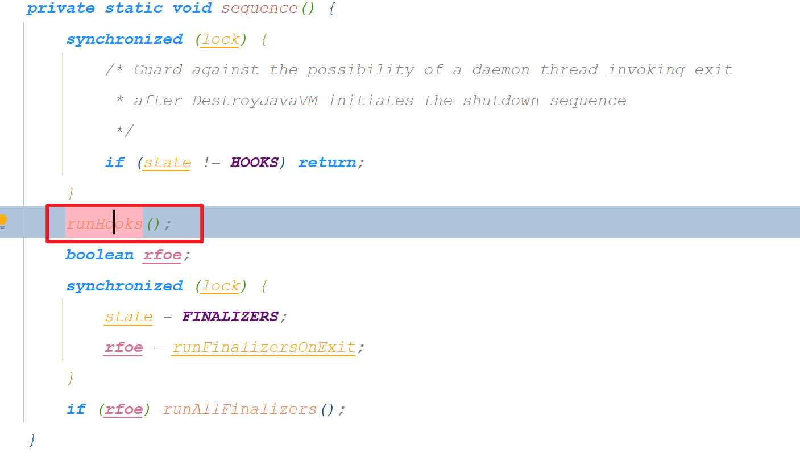

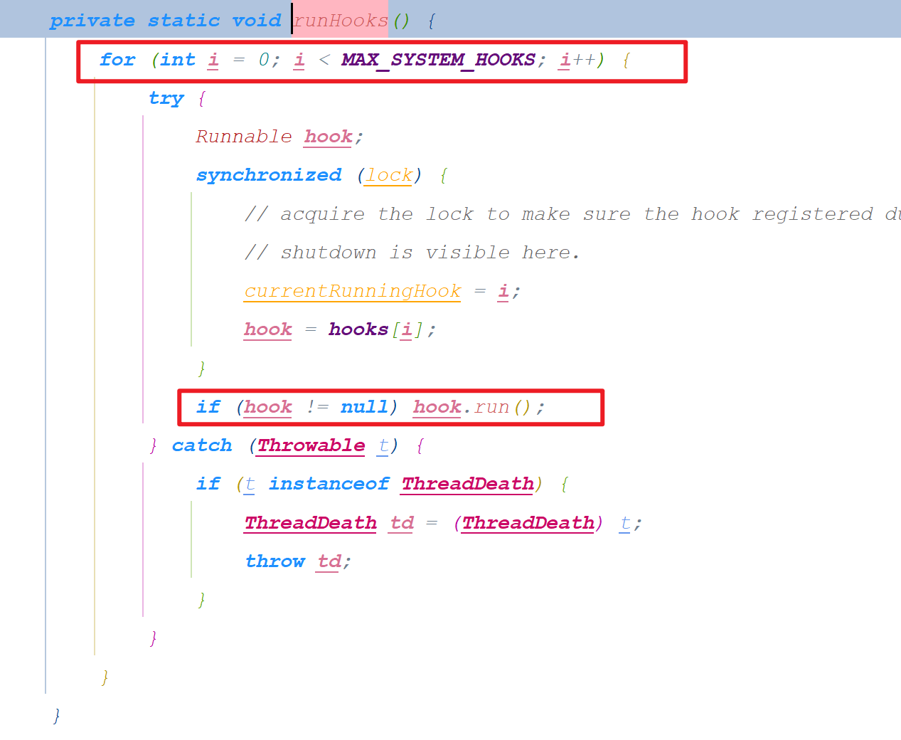

而应用级别的shutdownHook是ApplicationShutdownHooks在静态代码块中通过调用Shutdown.add()方法注册到Shutdown里面的。

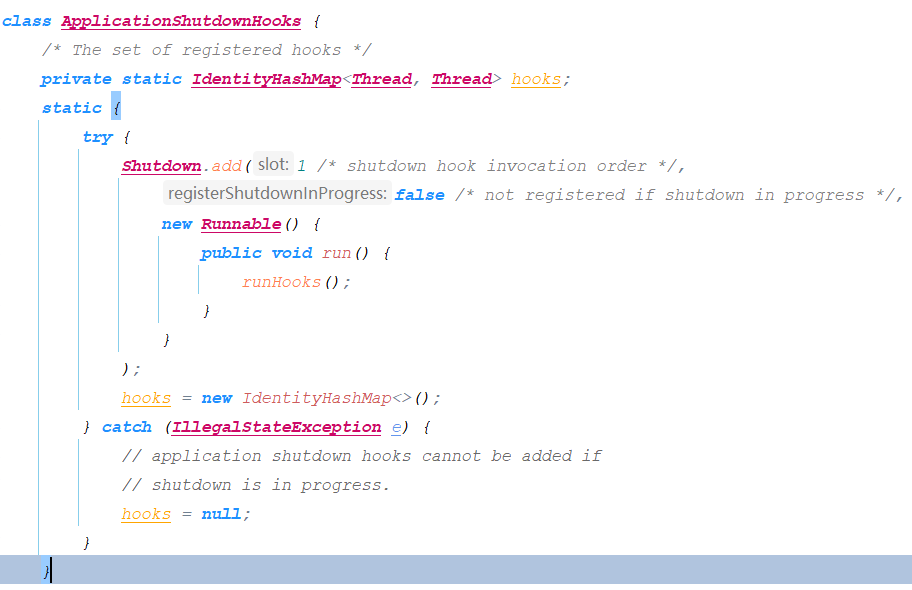

我们看下ApplicationShutdownHooks的runHooks()方法， 异步调用所有的自定义的ShutdownHooks。

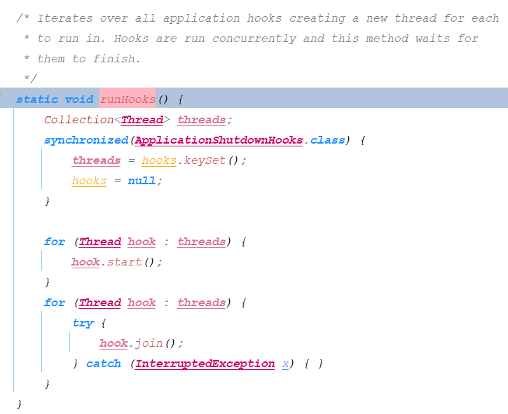

我们可以通过`Runtime.getRuntime().addShutdownHook()`来添加我们的自定义的hook

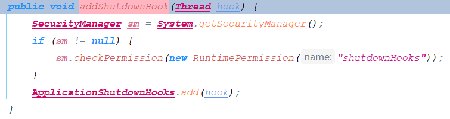

~~~java
Runtime.getRuntime().addShutdownHook(new Thread(()->{
            System.out.println("shutdown...");
        }));
~~~


结束Shutdown.sequence()后将调用runAllFinalizers()方法调用所有对象的finalize()方法。（未细看）

> 总结

不管何种关闭形式都将调用Shutdown.sequence()方法， 该方法同步调用系统级hook， 第二个系统级hook即使ApplicationShutdownHook， 该hook将异步调用自定义的shutdownHook。


## 单例模式

**实现单例模式的重点是在多线程和序列化的时候保持实例的单一**

#### 饿汉式

```java
public class Singletion {

    /**
     * 优点:
     *      用到这个实例的时候就能够立即拿到，而不需要任何等待时间
     *      由于该实例在类被加载的时候就创建出来了，所以也避免了线程安全问题
     * 缺点:
     *      在类被加载的时候对象就会实例化, 这也许会造成不必要的消耗
     *      如果这个类被多次加载的话也会造成多次实例化
     *      但是怎么样才会导致一个类被加载两次呢??? 网上也没有, 留一个todu吧
     */
    //TODO 如上注释
    private static Singletion instance = new Singletion();

    private Singletion() {

    }

    public Singletion getInstance() {
        return instance;
    }
}
```

#### 静态内部类式

```java
/**
 * 这种方式同样利用了classloder的机制来保证初始化instance时只有一个线程，
 * 它跟饿汉式不同的是（很细微的差别）：
 *      饿汉式是只要Singleton类被装载了，那么instance就会被实例化（没有达到lazy loading效果），
 *      而这种方式是Singleton类被装载了，instance不一定被初始化。
 *      因为SingletonHolder类没有被主动使用，只有显示通过调用getInstance方法时
 *      才会显示装载SingletonHolder类，从而实例化instance。
 *      想象一下，如果实例化instance很消耗资源，我想让他延迟加载，
 *      另外一方面，我不希望在Singleton类加载时就实例化，
 *      因为我不能确保Singleton类还可能在其他的地方被主动使用从而被加载，
 *      那么这个时候实例化instance显然是不合适的。这个时候，这种方式相比饿汉式更加合理。
 */
public class Singletion {

    private static class SingletonHodler {
        private static final Singletion INSTANCE = new Singletion();
    }

    private Singletion(){};

    public static final Singletion getInstance() {
        return SingletonHodler.INSTANCE;
    }

}
```

#### 懒汉式

##### 存在线程安全的模型

```java
public class Singletion implements Serializable{

    private static Singletion instance;

    private Singletion(){};

    /** 这种懒汉模式存在线程安全 */
    public static Singletion getInstance1() {
        if (instance == null) {
            instance = new Singletion();
        }
        return instance;
    }
}
```

##### 线程安全但是效率低下的模型

```java
public class Singletion implements Serializable{

    private static Singletion instance;

    private Singletion(){};

    /**
     * 这种写法在多线程中可以很好工作
     * 但是效率很低下, 因为加锁是整个方法加锁, 该方法的所有操作都是同步进行的
     * 但是对于非第一次操作, 根本不需要同步操作, 可以直接返回instance
     *
     * 但是以上的做法都不能防止序列化和反序列化所带来的危害
     */
    public static synchronized Singletion getInstance2() {
        if (instance == null) {
            instance = new Singletion();
        }
        return instance;
    }   
}
```

##### 双重校验锁

```java
public class Singletion implements Serializable{

    // 必须使用volatile, 防止指令重排, 和多线程之间的可见性
    private static volatile Singletion instance;

    private Singletion(){};
    /**
     * 双重校验锁的单例模式
     * 因为java 内存模型, 必须强制线程从主内存区读取
     * 所有要在instance变量上面加volatile
     * @return
     */
    public static Singletion getInstance() {
        if (instance == null) {
            synchronized (Singletion.class) {
                if (instance == null) {
                    instance = new Singletion();
                }
            }
        }
        return instance;
    }
}
```

#### 单例模式与序列化


看下面案例:

```java
public static void main(String[] args) throws IOException, ClassNotFoundException {
        File file = new File("temp");
        ObjectOutputStream oos = new ObjectOutputStream(new FileOutputStream(file));
        oos.writeObject(Singletion.getInstance());
        ObjectInputStream ois = new ObjectInputStream(new FileInputStream(file));
        Singletion newSingletion = (Singletion) ois.readObject();
        System.out.println(newSingletion == Singletion.getInstance()); //false
    }
```

这里的单例采用上面的双重校验锁,  将instance序列化后再反序列化, 得到了两个不一样的对象, 这就破坏了单例模式了


先说怎么解决:

```java
//在单例模式里面加入这个方法解决序列化问题
/**
     * 实现这个方法可以避免序列化的问题, 返回的必须是Object类型
     * @return
     */
    public Object readResolve() {
        return getInstance();
    }
```


原理:

对象的序列化过程通过ObjectOutputStream和ObjectInputputStream来实现的，那么带着刚刚的问题，分析一下ObjectInputputStream 的`readObject` 方法执行情况到底是怎样的。

为了节省篇幅，这里给出ObjectInputStream的`readObject`的调用栈：

```
readObject--->readObject0--->readOrdinaryObject--->checkResolve
```

这里看一下重点代码，`readOrdinaryObject`方法的代码片段

```java
private Object readOrdinaryObject(boolean unshared)
        throws IOException
    {
        //省略部分代码
        
        Object obj;
        try {
        /**
        这里创建的这个obj对象，就是本方法要返回的对象，也可以暂时理解为是ObjectInputStream的readObject返回的对象
        
        isInstantiable：如果一个serializable/externalizable的类可以在运行时被实例化，那么该方法就返回true。
		desc.newInstance：该方法通过反射的方式调用无参构造方法新建一个对象。
		到目前为止，也就可以解释，为什么序列化可以破坏单例了？
		序列化会通过反射调用无参数的构造方法创建一个新的对象。
        */
            obj = desc.isInstantiable() ? desc.newInstance() : null;
        } catch (Exception ex) {
            throw (IOException) new InvalidClassException(
                desc.forClass().getName(),
                "unable to create instance").initCause(ex);
        }
		//省略部分代码

		/**
		hasReadResolveMethod:如果实现了serializable 或者 externalizable接口的类中包含readResolve则返回true
		*/
        if (obj != null &&
            handles.lookupException(passHandle) == null &&
            desc.hasReadResolveMethod())
        {
        	//invokeReadResolve:通过反射的方式调用要被反序列化的类的readResolve方法。
        	//所以，原理也就清楚了，主要在Singleton中定义readResolve方法，并在该方法中指定要返回的对象的生成策略，就可以方式单例被破坏。
            Object rep = desc.invokeReadResolve(obj);
            if (unshared && rep.getClass().isArray()) {
                rep = cloneArray(rep);
            }
            if (rep != obj) {
                // Filter the replacement object
                if (rep != null) {
                    if (rep.getClass().isArray()) {
                        filterCheck(rep.getClass(), Array.getLength(rep));
                    } else {
                        filterCheck(rep.getClass(), -1);
                    }
                }
                handles.setObject(passHandle, obj = rep);
            }
        }

        return obj;
    }
```

#### 使用枚举实现单例

单例的枚举实现在《Effective Java》中有提到，因为其**功能完整、使用简洁、无偿地提供了序列化机制、在面对复杂的序列化或者反射攻击时仍然可以绝对防止多次实例化**等优点，单元素的枚举类型被作者认为是实现Singleton的最佳方法

```java
//比上面的什么双重校验锁简单多了
public enum  Singletion {
    INSTANCE;
}
```

下面深入了解一下为什么枚举会满足线程安全、序列化等标准。

在JDK5 中提供了大量的语法糖，枚举就是其中一种。
所谓 语法糖（Syntactic Sugar），也称糖衣语法，是由英国计算机学家 Peter.J.Landin 发明的一个术语，指在计算机语言中添加的某种语法，这种语法对语言的功能并没有影响，但是但是更方便程序员使用。只是在编译器上做了手脚，却没有提供对应的指令集来处理它。

就拿枚举来说，其实Enum就是一个普通的类，它继承自java.lang.Enum类。

```java
public enum DataSourceEnum {
    DATASOURCE;
}  
```

把上面枚举编译后的字节码反编译，得到的代码如下：

```java
public final class DataSourceEnum extends Enum<DataSourceEnum> {
      public static final DataSourceEnum DATASOURCE;
      public static DataSourceEnum[] values();
      public static DataSourceEnum valueOf(String s);
      static {};
}
```

由反编译后的代码可知，DATASOURCE 被声明为 static 的，根据在[【单例深思】饿汉式与类加载](https://blog.csdn.net/gavin_dyson/article/details/69668946)中所描述的类加载过程，可以知道虚拟机会保证一个类的\<clinit>() 方法在多线程环境中被正确的加锁、同步。所以，枚举实现是在实例化时是线程安全。

当一个Java类第一次被真正使用到的时候静态资源被初始化、Java类的加载和初始化过程都是线程安全的（因为虚拟机在加载枚举的类的时候，会使用ClassLoader的loadClass方法，而这个方法使用同步代码块保证了线程安全）。所以，创建一个enum类型是线程安全的。

也就是说，我们定义的一个枚举，在第一次被真正用到的时候，会被虚拟机加载并初始化，而这个初始化过程是线程安全的。而我们知道，解决单例的并发问题，主要解决的就是初始化过程中的线程安全问题。

所以，由于枚举的以上特性，枚举实现的单例是天生线程安全的。

接下来看看序列化问题：

Java规范中规定，每一个枚举类型极其定义的枚举变量在JVM中都是唯一的，因此在枚举类型的序列化和反序列化上，Java做了特殊的规定。
**在序列化的时候Java仅仅是将枚举对象的name属性输出到结果中，反序列化的时候则是通过 java.lang.Enum 的 valueOf() 方法来根据名字查找枚举对象。**
也就是说，以下面枚举为例，序列化的时候只将 DATASOURCE 这个名称输出，反序列化的时候再通过这个名称，查找对于的枚举类型，因此反序列化后的实例也会和之前被序列化的对象实例相同。

参考:

https://mp.weixin.qq.com/s?__biz=MzI3NzE0NjcwMg==&mid=402577543&idx=1&sn=41c4bf5f46d13806668edacce130468b&scene=21#wechat_redirect

https://cloud.tencent.com/developer/article/1341386

https://blog.csdn.net/moakun/article/details/80688851

https://blog.csdn.net/gavin_dyson/article/details/70832185


