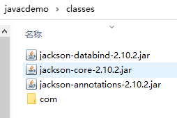
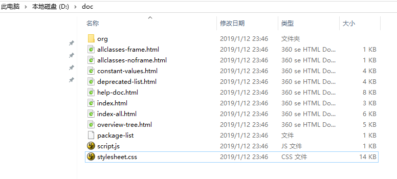
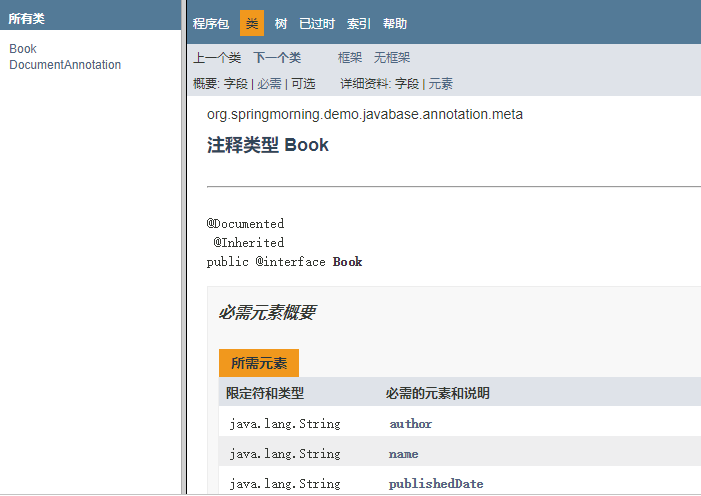
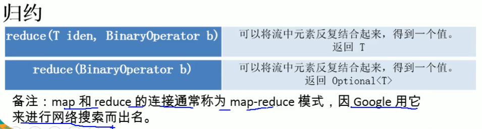

类的加载过程

转载自https://blog.csdn.net/ln152315/article/details/79223441

#### 加载

简单来说，加载指的是把class字节码文件从各个来源通过类加载器装载入内存中。

这里有两个重点：

字节码来源。一般的加载来源包括从本地路径下编译生成的.class文件，从jar包中的.class文件，从远程网络，以及动态代理实时编译

类加载器。一般包括启动类加载器，扩展类加载器，应用类加载器，以及用户的自定义类加载器。

注：为什么会有自定义类加载器？

一方面是由于java代码很容易被反编译，如果需要对自己的代码加密的话，可以对编译后的代码进行加密，然后再通过实现自己的自定义类加载器进行解密，最后再加载。

另一方面也有可能从非标准的来源加载代码，比如从网络来源，那就需要自己实现一个类加载器，从指定源进行加载。

#### 验证

主要是为了保证加载进来的字节流符合虚拟机规范，不会造成安全错误。

包括对于文件格式的验证，比如常量中是否有不被支持的常量？文件中是否有不规范的或者附加的其他信息？

对于元数据的验证，比如该类是否继承了被final修饰的类？类中的字段，方法是否与父类冲突？是否出现了不合理的重载？

对于字节码的验证，保证程序语义的合理性，比如要保证类型转换的合理性。

对于符号引用的验证，比如校验符号引用中通过全限定名是否能够找到对应的类？校验符号引用中的访问性（private，public等）是否可被当前类访问？

#### 准备

主要是为类变量（注意，不是实例变量）分配内存，并且赋予初值。

特别需要注意，初值，不是代码中具体写的初始化的值，而是Java虚拟机根据不同变量类型的默认初始值。

比如8种基本类型的初值，默认为0；引用类型的初值则为null；常量的初值即为代码中设置的值，final static tmp = 456， 那么该阶段tmp的初值就是456

#### 解析

将常量池内的符号引用替换为直接引用的过程。

两个重点：

符号引用。即一个字符串，但是这个字符串给出了一些能够唯一性识别一个方法，一个变量，一个类的相关信息。

直接引用。可以理解为一个内存地址，或者一个偏移量。比如类方法，类变量的直接引用是指向方法区的指针；而实例方法，实例变量的直接引用则是从实例的头指针开始算起到这个实例变量位置的偏移量

举个例子来说，现在调用方法hello()，这个方法的地址是1234567，那么hello就是符号引用，1234567就是直接引用。

在解析阶段，虚拟机会把所有的类名，方法名，字段名这些符号引用替换为具体的内存地址或偏移量，也就是直接引用。

#### 初始化

这个阶段主要是对类变量初始化，是执行类构造器的过程。

换句话说，只对**static修饰的变量或语句进行初始化**。

如果初始化一个类的时候，其父类尚未初始化，则优先初始化其父类。

如果同时包含多个静态变量和静态代码块，则按照自上而下的顺序依次执行。

总结
类加载过程只是一个类生命周期的一部分，在其前，有编译的过程，只有对源代码编译之后，才能获得能够被虚拟机加载的字节码文件；在其后还有具体的类使用过程，当使用完成之后，还会在方法区垃圾回收的过程中进行卸载。


## jar命令详解

jar命令格式：`jar ` `{c t x u f }` `[ v m e 0 M i ]` `[-C 目录]` `文件名...`

其中{ctxu}这四个参数必须选选其一。[v f m e 0 M i ]是可选参数，文件名也是必须的。

-c 创建一个jar包
-t 显示jar中的内容列表
-x 解压jar包
-u 添加文件到jar包中
-f 指定jar包的文件名
-v 生成详细的报造，并输出至标准设备
-m 指定manifest.mf文件.(manifest.mf文件中可以对jar包及其中的内容作一些一设置)
-0 产生jar包时不对其中的内容进行压缩处理
-M 不产生所有文件的清单文件(Manifest.mf)。这个参数与忽略掉-m参数的设置
-i  为指定的jar文件创建索引文件
-C 表示转到相应的目录下执行jar命令,相当于cd到那个目录，然后不带-C执行jar命令

> 创建jar包

~~~shell
jar -cf hello.jar hello
~~~

根据hello目录生成一个hello.jar包

> 创建并显示打包过程

~~~shell
jar -cvf hello.jar hello
~~~

根据hello目录生成一个hello.jar包, 并显示创建过程

> 显示jar包内容

~~~shell
jar -tvf hello.jar
~~~

> 解压jar包

~~~shell
jar -xvf hello.jar
~~~

> 创建jar包, 并指定MANIFEST.MF文件

~~~shell
jar -cvfm hello.jar MANIFEST.MF hello
~~~

创建该jar包后, jar包中的MANIFEST.MF文件与指定的文件内容相同

> 创建不包含META-INF目录及MANIFEST.MF文件的jar包

~~~shell
jar -cvfM hello.jar hello
~~~

> -C选项

~~~shell
jar cvfm hello.jar mymanifest.mf -C hello/
~~~

表示切换到hello目录下然后再执行jar命令


## 记一次手动编译java项目

[文件](file:///./img/java/javacdemo)

#### 项目目录


项目名称为javacdemo，目录如下：

- classes主要用于放置编译后的class文件
- lib主要放置项目引用的jar包
- src按照maven项目的格式
- pom.xml可以忽略，因为要手动编译

两个java文件如下：

Student.java

~~~java
package com.tiger.model.entity;

public class Student {
    private Integer age;
    private String name;
    public Integer getAge() {
        return age;
    }
    public void setAge(Integer age) {
        this.age = age;
    }
    public String getName() {
        return name;
    }
    public void setName(String name) {
        this.name = name;
    }
    public Student(Integer age, String name) {
        this.age = age;
        this.name = name;
    }
}
~~~

Main.java

~~~java
package com.tiger;

import com.fasterxml.jackson.core.JsonProcessingException;
import com.fasterxml.jackson.databind.ObjectMapper;
import com.tiger.model.entity.Student;

public class MainApp {

    public static void main(String[] args) {
        try {
            Student a = new Student(12, "zhangsna");
            ObjectMapper objectMapper = new ObjectMapper();
            String s = objectMapper.writerWithDefaultPrettyPrinter().writeValueAsString(a);
            System.out.println(s);
        } catch (JsonProcessingException e){
            e.printStackTrace();
        }

    }
}
~~~

MainApp引用了jackson相关类和com.tiger.model.entity.Student.java

#### 编译

<font color=red>windows下请使用cmd进行编译，不要使用power shell，貌似是指定-cp时，windwos下多个路径在使用；分开，在linux下使用：隔开。但是power shell输入；认为命令已经结束， 输入：会认为多个路径是同一个路径。</font>

cd到项目根目录下：


编译项目：

~~~shell
javac -d classes -cp lib\*;src\main\java -verbose src\main\java\com\tiger\MainApp.java
~~~

-d 指定项目编译后的class的存放地址。

-cp指定classpath路径，需要用到jar包都存放在lib文件夹下。这里我们使用到了jackson的一些jar包，放在了javacdemo\lib目录下，多个jar包可以一一指定，也可以使用通配符*，他将匹配lib下所有的.jar和.JAR文件。

同时还要指定src\main\java目录，因为编译需要的Student.java存放在该目录下。

~~~shell
lib\*;src\main\java
~~~


-verbose表示输出详细的编译信息。

编译之后查看classes目录


#### 关于javac命令中classpath的作用

当执行javac命令的时候（cp后面的.表示当前目录，为了说明原理添加上，在本例中没什么用）：

~~~shell
javac -d classes -cp .;lib\*;src\main\java -verbose src\main\java\com\tiger\MainApp.java
~~~

javac首先找到并读取src\main\java\com\tiger\MainApp.java（这个就是命令后面指定的）。但是MainApp.java导入了

```
import com.fasterxml.jackson.core.JsonProcessingException;
import com.fasterxml.jackson.databind.ObjectMapper;
import com.tiger.model.entity.Student;
```

这个时候java编译器需要找到这三个类才能编译MainApp，话句话说就是MainApp的编译需要这三个类的参与，但是要去哪里找呢？

>  没有CLASSPATH环境变量，也没有使用-cp或者-classpath的话，默认从当前路径寻找。

但是当前路径是哪个路径的？其实这个命令就是你执行javac命令的路径，我是在C:\Users\Administrator\Desktop\javacdemo目录下执行的javac命令，所以当前路径就是C:\Users\Administrator\Desktop\javacdemo。<font color=red>java编译器查找当前路径+包路径（把需要导入的类的包名中的.转换为路径分隔符）下有没有对应的class文件或者java文件。</font>具体来说就是查找C:\Users\Administrator\Desktop\javacdemo\com\tiger\model\entity\Student.java(Student.class)和C:\Users\Administrator\Desktop\javacdemo\com\fasterxml\jackson\databind\ObjectMapper.java(ObjectMapper.class)。JsonProcessingException类同理。如果没有找到对应class或者java文件报错。找到一个java和class文件，对比两者新旧，java文件新的话将该java文件进行编译并使用编译后的class文件，class文件新的话直接使用该class文件。如果找到多个java文件或者多个class文件报错。

如果我们不指定CLASSPATH环境变量的话，也不使用-cp或者-classpath的话肯定是编译不成功的。因为找不到。

> CLASSPATH的作用与-cp和-classpath的作用相同。使用了-cp或者-classpath，会覆盖CLASSPATH环境变量。

如果你在环境变量中设置了classpath的话同时没有使用-cp和-classpath的话，java编译器会根据CLASSPATH环境变量来查找上述的三个文件，

而如果你使用了-cp或者-classpath的话，java编译器就会根据来你指定的路径来查找上述的三个类。

那么具体怎么个查找法呢？这里以查找Student类为例。

~~~shell
javac -d classes -cp .;lib\*;src\main\java -verbose src\main\java\com\tiger\MainApp.java
~~~

- 根据-cp的指定的路径，首先会查找当前目录下（注意-cp后面的小点，他表示当前路径）是否有Student类的java文件或者class文件，具体就是C:\Users\Administrator\Desktop\javacdemo\com\tiger\model\entity\Student.java(Student.class)文件。
- 然后查找lib下的jackson-core-2.10.2.jar包里面有没有com\tiger\model\entity\Student.java(Student.class)。其实jar包可以看作另类的压缩包，解压后可以看到

- 然后再查找lib下的jackson-annotations-2.10.2.jar包中有没有com\tiger\model\entity\Student.java(Student.class)。
- 同理再查找jackson-detabind-2.10.2.jar。
- 最后查找src\main\java\com\tiger\model\entity\Student.java(Student.class)

找到一个java和class文件，对比两者新旧，java文件新的话将该java文件进行编译并使用编译后的class文件，class文件新的话直接使用该class文件。如果找到多个java文件或者多个class文件报错。

#### java命令中classpath的作用

javac命令中classpath的作用大体上与java命令中的classpath相同，但是要注意一点，

~~~shell
javac -d classes -cp .;lib\*;src\main\java -verbose src\main\java\com\tiger\MainApp.java
~~~

~~~shell
java -cp .;lib\*;classes -verbose com.tiger.MainApp
~~~

上述两个命令，javac指定需要编译的文件为src\main\java\com\tiger\MainApp.java，javac会查找当前路径下的src\main\java\com\tiger\MainApp.java，这和classpath没什么关系，就跟平常的shell命令一样。而对于MainApp中的import的类，java编译器会根据上面的方法在classpath路径中查找。

<font color=red>但是对于java命令指定要运行的com.tiger.MainApp类，他不会把com.tiger转换为com\tiger，然后在当前路径下查找com\tiger\MainApp.class。他会根据classpath去查找com.tiger.MainApp,就像是被import的类一样。</font>对于刚学习的人，这里会有点想当然，然后发现跑不去来，特别记录下。


#### 运行

同样在项目根目录下执行运行命令

~~~shell
java -cp lib\*;classes -verbose com.tiger.MainApp
~~~

-cp指定了运行需要的jar包。因为com.tiger.MainApp是在classes文件夹下，所以要添加classes为classpath，不添加此路径会找不到MainApp类。

-verbose输入详细信息，因为截屏，我没有使用该选项，需要查看过程的同学可以使用该选项


#### 打包成普通jar

> 打包

再项目根目录下运行:

~~~shell
# 切换到classes下
cd classes
jar -cvf javacdemo.jar .
~~~

-c 创建一个jar包

-f 指定jar包的文件名

-v 生成详细的报造，并输出至标准设备


查看classes下,已经生产了javacdemo.jar文件


> 运行

在classes目录删除com文件夹，防止其中的classes干扰我们运行jar包。 然后运行：


~~~shell
# 切换回项目根目录下
cd ..
java -cp lib\*;classes\javacdemo.jar com.tiger.MainApp
~~~

这里指定的classpath中需要有classes\javacdemo.jar，因为com.tiger.MainApp现在javacdemo.jar包中了。


#### 打包成可执行jar包

> 打包

~~~shell
# 编译项目，放在classes下
javac -d classes -cp lib\*;src\main\java src\main\java\com\tiger\MainApp.java

# 把根目录下面的lib里面的jar包拷贝到classes目录下
xcopy lib classes
~~~




~~~shell
# 切换到classes下
cd classes
# 解压三个jar包, 获取需要的class文件
jar -xf jackson-annotations-2.10.2.jar
jar -xf jackson-core-2.10.2.jar
jar -xf jackson-databind-2.10.2.jar
# 删除解压出来的多余的文件
del *.jar
rd /s META-INF
del module-info.class
~~~

这时候已经把所有运行需要的类弄到了classes下。


执行打包命令

~~~shell
jar -cvf javacdemo.jar .
~~~

编辑生成的javacdemo.jar里面的META-INF下的MANI-FEST.MF文件, jar包本质上就是个压缩包, 怎么编辑压缩包里面的文件就不说了

在其中添加一行, <font color=red>注意冒号后面有空格, 要保留两行空白行, 如图片所述, 关于MANI-FEST.MF文件网上挺多坑的，可以查下。</font>

这一行的作用就是<font color=red>告诉java你要运行的主类是哪一个。</font>

~~~text
Main-Class: com.tiger.MainApp
~~~


这时候你就可以把jar包复制到任何一个目录下，执行该jar包只需要


## 单例模式

**实现单例模式的重点是在多线程和序列化的时候保持实例的单一**

#### 饿汉式

```java
public class Singletion {

    /**
     * 优点:
     *      用到这个实例的时候就能够立即拿到，而不需要任何等待时间
     *      由于该实例在类被加载的时候就创建出来了，所以也避免了线程安全问题
     * 缺点:
     *      在类被加载的时候对象就会实例化, 这也许会造成不必要的消耗
     *      如果这个类被多次加载的话也会造成多次实例化
     *      但是怎么样才会导致一个类被加载两次呢??? 网上也没有, 留一个todu吧
     */
    //TODO 如上注释
    private static Singletion instance = new Singletion();

    private Singletion() {

    }

    public Singletion getInstance() {
        return instance;
    }
}
```

#### 静态内部类式

```java
/**
 * 这种方式同样利用了classloder的机制来保证初始化instance时只有一个线程，
 * 它跟饿汉式不同的是（很细微的差别）：
 *      饿汉式是只要Singleton类被装载了，那么instance就会被实例化（没有达到lazy loading效果），
 *      而这种方式是Singleton类被装载了，instance不一定被初始化。
 *      因为SingletonHolder类没有被主动使用，只有显示通过调用getInstance方法时
 *      才会显示装载SingletonHolder类，从而实例化instance。
 *      想象一下，如果实例化instance很消耗资源，我想让他延迟加载，
 *      另外一方面，我不希望在Singleton类加载时就实例化，
 *      因为我不能确保Singleton类还可能在其他的地方被主动使用从而被加载，
 *      那么这个时候实例化instance显然是不合适的。这个时候，这种方式相比饿汉式更加合理。
 */
public class Singletion {

    private static class SingletonHodler {
        private static final Singletion INSTANCE = new Singletion();
    }

    private Singletion(){};

    public static final Singletion getInstance() {
        return SingletonHodler.INSTANCE;
    }

}
```

#### 懒汉式

##### 存在线程安全的模型

```java
public class Singletion implements Serializable{

    private static Singletion instance;

    private Singletion(){};

    /** 这种懒汉模式存在线程安全 */
    public static Singletion getInstance1() {
        if (instance == null) {
            instance = new Singletion();
        }
        return instance;
    }
}
```

##### 线程安全但是效率低下的模型

```java
public class Singletion implements Serializable{

    private static Singletion instance;

    private Singletion(){};

    /**
     * 这种写法在多线程中可以很好工作
     * 但是效率很低下, 因为加锁是整个方法加锁, 该方法的所有操作都是同步进行的
     * 但是对于非第一次操作, 根本不需要同步操作, 可以直接返回instance
     *
     * 但是以上的做法都不能防止序列化和反序列化所带来的危害
     */
    public static synchronized Singletion getInstance2() {
        if (instance == null) {
            instance = new Singletion();
        }
        return instance;
    }   
}
```

##### 双重校验锁

```java
public class Singletion implements Serializable{

    // 必须使用volatile, 防止指令重排, 和多线程之间的可见性
    private static volatile Singletion instance;

    private Singletion(){};
    /**
     * 双重校验锁的单例模式
     * 因为java 内存模型, 必须强制线程从主内存区读取
     * 所有要在instance变量上面加volatile
     * @return
     */
    public static Singletion getInstance() {
        if (instance == null) {
            synchronized (Singletion.class) {
                if (instance == null) {
                    instance = new Singletion();
                }
            }
        }
        return instance;
    }
}
```

#### 单例模式与序列化


看下面案例:

```java
public static void main(String[] args) throws IOException, ClassNotFoundException {
        File file = new File("temp");
        ObjectOutputStream oos = new ObjectOutputStream(new FileOutputStream(file));
        oos.writeObject(Singletion.getInstance());
        ObjectInputStream ois = new ObjectInputStream(new FileInputStream(file));
        Singletion newSingletion = (Singletion) ois.readObject();
        System.out.println(newSingletion == Singletion.getInstance()); //false
    }
```

这里的单例采用上面的双重校验锁,  将instance序列化后再反序列化, 得到了两个不一样的对象, 这就破坏了单例模式了


先说怎么解决:

```java
//在单例模式里面加入这个方法解决序列化问题
/**
     * 实现这个方法可以避免序列化的问题, 返回的必须是Object类型
     * @return
     */
    public Object readResolve() {
        return getInstance();
    }
```


原理:

对象的序列化过程通过ObjectOutputStream和ObjectInputputStream来实现的，那么带着刚刚的问题，分析一下ObjectInputputStream 的`readObject` 方法执行情况到底是怎样的。

为了节省篇幅，这里给出ObjectInputStream的`readObject`的调用栈：

```
readObject--->readObject0--->readOrdinaryObject--->checkResolve
```

这里看一下重点代码，`readOrdinaryObject`方法的代码片段

```java
private Object readOrdinaryObject(boolean unshared)
        throws IOException
    {
        //省略部分代码
        
        Object obj;
        try {
        /**
        这里创建的这个obj对象，就是本方法要返回的对象，也可以暂时理解为是ObjectInputStream的readObject返回的对象
        
        isInstantiable：如果一个serializable/externalizable的类可以在运行时被实例化，那么该方法就返回true。
		desc.newInstance：该方法通过反射的方式调用无参构造方法新建一个对象。
		到目前为止，也就可以解释，为什么序列化可以破坏单例了？
		序列化会通过反射调用无参数的构造方法创建一个新的对象。
        */
            obj = desc.isInstantiable() ? desc.newInstance() : null;
        } catch (Exception ex) {
            throw (IOException) new InvalidClassException(
                desc.forClass().getName(),
                "unable to create instance").initCause(ex);
        }
		//省略部分代码

		/**
		hasReadResolveMethod:如果实现了serializable 或者 externalizable接口的类中包含readResolve则返回true
		*/
        if (obj != null &&
            handles.lookupException(passHandle) == null &&
            desc.hasReadResolveMethod())
        {
        	//invokeReadResolve:通过反射的方式调用要被反序列化的类的readResolve方法。
        	//所以，原理也就清楚了，主要在Singleton中定义readResolve方法，并在该方法中指定要返回的对象的生成策略，就可以方式单例被破坏。
            Object rep = desc.invokeReadResolve(obj);
            if (unshared && rep.getClass().isArray()) {
                rep = cloneArray(rep);
            }
            if (rep != obj) {
                // Filter the replacement object
                if (rep != null) {
                    if (rep.getClass().isArray()) {
                        filterCheck(rep.getClass(), Array.getLength(rep));
                    } else {
                        filterCheck(rep.getClass(), -1);
                    }
                }
                handles.setObject(passHandle, obj = rep);
            }
        }

        return obj;
    }
```

#### 使用枚举实现单例

单例的枚举实现在《Effective Java》中有提到，因为其**功能完整、使用简洁、无偿地提供了序列化机制、在面对复杂的序列化或者反射攻击时仍然可以绝对防止多次实例化**等优点，单元素的枚举类型被作者认为是实现Singleton的最佳方法

```java
//比上面的什么双重校验锁简单多了
public enum  Singletion {
    INSTANCE;
}
```

下面深入了解一下为什么枚举会满足线程安全、序列化等标准。

在JDK5 中提供了大量的语法糖，枚举就是其中一种。
所谓 语法糖（Syntactic Sugar），也称糖衣语法，是由英国计算机学家 Peter.J.Landin 发明的一个术语，指在计算机语言中添加的某种语法，这种语法对语言的功能并没有影响，但是但是更方便程序员使用。只是在编译器上做了手脚，却没有提供对应的指令集来处理它。

就拿枚举来说，其实Enum就是一个普通的类，它继承自java.lang.Enum类。

```java
public enum DataSourceEnum {
    DATASOURCE;
}  
```

把上面枚举编译后的字节码反编译，得到的代码如下：

```java
public final class DataSourceEnum extends Enum<DataSourceEnum> {
      public static final DataSourceEnum DATASOURCE;
      public static DataSourceEnum[] values();
      public static DataSourceEnum valueOf(String s);
      static {};
}
```

由反编译后的代码可知，DATASOURCE 被声明为 static 的，根据在[【单例深思】饿汉式与类加载](https://blog.csdn.net/gavin_dyson/article/details/69668946)中所描述的类加载过程，可以知道虚拟机会保证一个类的\<clinit>() 方法在多线程环境中被正确的加锁、同步。所以，枚举实现是在实例化时是线程安全。

当一个Java类第一次被真正使用到的时候静态资源被初始化、Java类的加载和初始化过程都是线程安全的（因为虚拟机在加载枚举的类的时候，会使用ClassLoader的loadClass方法，而这个方法使用同步代码块保证了线程安全）。所以，创建一个enum类型是线程安全的。

也就是说，我们定义的一个枚举，在第一次被真正用到的时候，会被虚拟机加载并初始化，而这个初始化过程是线程安全的。而我们知道，解决单例的并发问题，主要解决的就是初始化过程中的线程安全问题。

所以，由于枚举的以上特性，枚举实现的单例是天生线程安全的。

接下来看看序列化问题：

Java规范中规定，每一个枚举类型极其定义的枚举变量在JVM中都是唯一的，因此在枚举类型的序列化和反序列化上，Java做了特殊的规定。
**在序列化的时候Java仅仅是将枚举对象的name属性输出到结果中，反序列化的时候则是通过 java.lang.Enum 的 valueOf() 方法来根据名字查找枚举对象。**
也就是说，以下面枚举为例，序列化的时候只将 DATASOURCE 这个名称输出，反序列化的时候再通过这个名称，查找对于的枚举类型，因此反序列化后的实例也会和之前被序列化的对象实例相同。

参考:

https://mp.weixin.qq.com/s?__biz=MzI3NzE0NjcwMg==&mid=402577543&idx=1&sn=41c4bf5f46d13806668edacce130468b&scene=21#wechat_redirect

https://cloud.tencent.com/developer/article/1341386

https://blog.csdn.net/moakun/article/details/80688851

https://blog.csdn.net/gavin_dyson/article/details/70832185


- 


## Java 折叠代码块

ctrl + alt + T in IDEA

//region Description

Some code

//endregion


## [反射框架reflections](https://github.com/ronmamo/reflections)

> 简介

使用Reflections可以很轻松的获取以下元数据信息：

- 获取某个类型的全部子类
- 只要类型、构造器、方法，字段上带有特定注解，便能获取带有这个注解的全部信息（类型、构造器、方法，字段）
- 获取所有能匹配某个正则表达式的资源
- 获取所有带有特定签名的方法，包括参数，参数注解，返回类型
- 获取所有方法的名字
- 获取代码里所有字段、方法名、构造器的使用

> Maven依赖

~~~java
<dependency>
    <groupId>org.reflections</groupId>
    <artifactId>reflections</artifactId>
    <version>0.9.11</version>
</dependency>
~~~

> 实例化

```java
// 实例化Reflections，指定扫描的包为my.package及其子包，使用默认的scanners（扫描器）
Reflections reflections = new Reflections("my.package");

// 使用ConfigurationBuilder进行实例化
new Reflections(new ConfigurationBuilder()
     .setUrls(ClasspathHelper.forPackage("my.project.prefix"))
     .setScanners(new SubTypesScanner(), 
                  new TypeAnnotationsScanner().filterResultsBy(optionalFilter), ...),
     .filterInputsBy(new FilterBuilder().includePackage("my.project.prefix"))
     ...);
```

> 使用

- 扫描子类

  ~~~java
  //SubTypesScanner
  Set<Class<? extends Module>> modules = 
      reflections.getSubTypesOf(com.google.inject.Module.class);
  ~~~

- 扫描带有某个注解的类

  ~~~java
  //TypeAnnotationsScanner 
  Set<Class<?>> singletons = 
      reflections.getTypesAnnotatedWith(javax.inject.Singleton.class);
  ~~~

- 扫描资源

  ~~~java
  //ResourcesScanner
  Set<String> properties = 
      reflections.getResources(Pattern.compile(".*\\.properties"));
  ~~~

- 扫描带有某个注解的方法/构造方法

  ~~~java
  //MethodAnnotationsScanner
  Set<Method> resources =
      reflections.getMethodsAnnotatedWith(javax.ws.rs.Path.class);
  Set<Constructor> injectables = 
      reflections.getConstructorsAnnotatedWith(javax.inject.Inject.class);
  ~~~

- 扫描带有某个注解的字段

  ~~~java
  //FieldAnnotationsScanner
  Set<Field> ids = 
      reflections.getFieldsAnnotatedWith(javax.persistence.Id.class);
  ~~~

- 扫描特定的方法

  ~~~java
  //MethodParameterScanner
  //扫描特定参数类型的方法
  Set<Method> someMethods =
      reflections.getMethodsMatchParams(long.class, int.class);
  //扫描特定返回类型的方法
  Set<Method> voidMethods =
      reflections.getMethodsReturn(void.class);
  //扫描方法参数上带有某个注解的方法
  Set<Method> pathParamMethods =
      reflections.getMethodsWithAnyParamAnnotated(PathParam.class);
  ~~~

- 扫描方法的参数名

  ~~~java
  //MethodParameterNamesScanner
  List<String> parameterNames = 
      reflections.getMethodParamNames(Method.class)
  ~~~

- 扫描？？？

  ~~~java
  //MemberUsageScanner
  Set<Member> usages = 
      reflections.getMethodUsages(Method.class)
  ~~~


## Janino编译器


#### 简介

   Janino 是一个极小、极快的 开源Java 编译器（Janino is a super-small, super-fast Java™ compiler.）。Janino 不仅可以像 JAVAC 一样将 Java 源码文件编译为字节码文件，还可以编译内存中的 Java 表达式、块、类和源码文件，加载字节码并在 JVM 中直接执行。Janino 同样可以用于静态代码分析和代码操作。

项目地址：https://github.com/janino-compiler/janino

官网地址：http://janino-compiler.github.io/janino/    <font color=red>官网简单一看即可，更重要的是看javadoc</font>


#### ExpressEvaluator

~~~java
 public static void main(String[] args) throws Exception {
        // Create "ExpressionEvaluator" object.
        IExpressionEvaluator ee = CompilerFactoryFactory.getDefaultCompilerFactory().newExpressionEvaluator();
        // 设置返回值类型
        ee.setExpressionType(double.class);
        // 设置参数名与类型
        ee.setParameters(new String[] { "total" }, new Class[] { double.class });
        // 设置抛出异常的类型
        ee.setThrownExceptions(new Class[]{Exception.class});
        // 设置表达式体
        ee.cook("total*100");
        // 传入参数并执行表达式体, 没有参数时传入null
        Double res = (Double)ee.evaluate(new Object[]{7.5D});
        System.out.println(res);

    }
~~~

#### ScriptEvaluator

~~~java
public static void main(String[] args) throws CompileException, InvocationTargetException {
        // ScriptEvaluator可以用于编译和执行代码块
        // 如果有return的返回值，则该块必须返回该类型的值。
        // 作为一项特殊功能，它允许声明方法。方法声明的位置和顺序无关紧要。
        ScriptEvaluator se = new ScriptEvaluator();
        se.setParameters(new String[] { "arg1", "arg2" }, new Class[] { String.class, int.class });
        se.cook(
                ""
                        + "System.out.println(arg1);\n"
                        + "System.out.println(arg2);\n"
                        + "\n"
                        + "static void method1() {\n"
                        + "    System.out.println(\"run in method1()\");\n"
                        + "}\n"
                        + "\n"
                        + "public static void method2() {\n"
                        + "    System.out.println(\"run in method2()\");\n"
                        + "}\n"
                        + "\n"
                        + "method1();\n"
                        + "method2();\n"
                        + "\n"

        );
        se.evaluate(new Object[]{"aaa",22});
    }
~~~

#### ClassBodyEvaluator

ClassBodyEvaluator的作用是编译类的主体，然后生成一个用于反射的Class对象。


#### Janino使用Compiler

~~~java
public static void main(String[] args) throws IOException, CompileException, ClassNotFoundException,
            NoSuchMethodException, InvocationTargetException, IllegalAccessException {

        ICompiler compiler = new CompilerFactory().newCompiler();
        // 用于保存编译后的class字节码的map
        Map<String, byte[]> classes = new HashMap<String, byte[]>();
        // 设置字节码生产器为MapResourceCreator
        compiler.setClassFileCreator(new MapResourceCreator(classes));

        // Now compile two units from strings:
        compiler.compile(new Resource[] {
            new StringResource("pkg1/A.java",
                "package pkg1; public class A { public static int meth() { return pkg2.B.meth(); } }"),
            new StringResource("pkg2/B.java",
                "package pkg2; public class B { public static int meth() { return 77;            } }"),});

        // Set up a class loader that uses the generated classes.
        ClassLoader cl = new ResourceFinderClassLoader(new MapResourceFinder(classes), // resourceFinder
            ClassLoader.getSystemClassLoader() // parent
        );
        Assert.assertEquals(77, cl.loadClass("pkg1.A").getDeclaredMethod("meth").invoke(null));
    }
~~~

#### Janino使用ClassLoader

~~~java
ClassLoader cl = new JavaSourceClassLoader(
    this.getClass().getClassLoader(),  // parentClassLoader
    new File[] { new File("srcdir") }, // optionalSourcePath
    (String) null,                     // optionalCharacterEncoding
    DebuggingInformation.NONE          // debuggingInformation
);
 
// Load class A from "srcdir/pkg1/A.java", and also its superclass
// B from "srcdir/pkg2/B.java":
Object o = cl.loadClass("pkg1.A").newInstance();
 
// Class "B" implements "Runnable", so we can cast "o" to
// "Runnable".
((Runnable) o).run(); 
~~~

#### Debug

idea貌似可以调试，但是无法看到生成的java文件，所以两样一抹黑

```
org.codehaus.janino.source_debugging.enable=true\
org.codehaus.janino.source_debugging.dir=C:\tmp\
```


## java对象求交并差集

https://blog.csdn.net/weixin_34122548/article/details/90196224?utm_medium=distribute.pc_relevant.none-task-blog-2~default~baidujs_baidulandingword~default-1.pc_relevant_aa&spm=1001.2101.3001.4242.2&utm_relevant_index=4

需要使用google的guava工具类

~~~xml
        <dependency>
            <groupId>com.google.guava</groupId>
            <artifactId>guava</artifactId>
            <version>22.0</version>
        </dependency>
~~~

下面是求基础对象的交并差集

~~~java
        HashSet<Integer> s1 = Sets.newHashSet(1, 2, 3, 4);
        HashSet<Integer> s2 = Sets.newHashSet(3, 4, 5, 6);


        // 求s1 - s2的结果
        Sets.SetView<Integer> difference1 = Sets.difference(s1, s2);
        // 求s2 - s1的结果
        Sets.SetView<Integer> difference2 = Sets.difference(s2, s1);
        // 求s1，s2的交集
        Sets.SetView<Integer> intersection = Sets.intersection(s1, s2);
        // 求s1，s2的并集
        Sets.SetView<Integer> union = Sets.union(s1, s2);

        System.out.println(difference1); // [1, 2]
        System.out.println(difference2); // [5, 6]
        System.out.println(intersection); // [3, 4]
        System.out.println(union);  // [1, 2, 3, 4, 5, 6]
~~~

下面是求包装类型的交并差集， 将对象类型的Set集合转换成Map集合， 对应的key是用来求交并差集的key

~~~java
    @Test
    @SneakyThrows
    public void test(){
        Person zhangsan = new Person(1, "zhangsan");
        Person lisi = new Person(2, "lisi");
        Person wangwu = new Person(3, "wangwu");

        HashSet<Person> s1 = Sets.newHashSet(zhangsan, lisi);
        HashSet<Person> s2 = Sets.newHashSet(lisi, wangwu);

        Map<Integer, Person> map1 = s1.stream().collect(Collectors.toMap(person -> person.getId(), person -> person));
        Map<Integer, Person> map2 = s2.stream().collect(Collectors.toMap(person -> person.getId(), person -> person));

        // 求s1 - s2的结果
        Sets.SetView<Integer> difference1 = Sets.difference(map1.keySet(), map2.keySet());
        // 求s2 - s1的结果
        Sets.SetView<Integer> difference2 = Sets.difference(map2.keySet(), map1.keySet());
        // 求s1，s2的交集
        Sets.SetView<Integer> intersection = Sets.intersection(map1.keySet(), map2.keySet());
        // 求s1，s2的并集
        Sets.SetView<Integer> union = Sets.union(map1.keySet(), map2.keySet());

        difference1.forEach(id -> System.out.println(map1.get(id)));
        difference2.forEach(id -> System.out.println(map2.get(id)));
        intersection.forEach(id -> System.out.println(map2.get(id)));
        union.forEach(id -> System.out.println(map1.containsKey(id) ? map1.get(id) : map2.get(id)));

    }

    @Data
    @AllArgsConstructor
    public class Person{
        int id;
        String name;
    }
~~~

## java格式化，修改sql

在使用jdbc执行用户传入的sql时， 需要先进行sql格式化，去除掉注释、空白。如果有多个sql，还需要将他们拆分出来。

可以使用druid进行格式化

maven：

~~~xml
<dependency>
    <groupId>com.alibaba</groupId>
    <artifactId>druid</artifactId>
    <version>1.2.8</version>
</dependency>
~~~

java：

~~~java
		String sql = "select * from dual";		
		// 格式化输出, 缺省大写格式
        String result = SQLUtils.format(sql, DbType.postgresql);
        System.out.println(result);
        
        // 解析出的独立语句的个数
        List<SQLStatement> stmtList = SQLUtils.parseStatements(sql, DbType.postgresql);
~~~

## Class.getReources和Class.getClassLoader.getResources的区别

今天在Java程序中读取resources资源下的文件，由于对Java结构了解不透彻，遇到很多坑。正常在Java工程中读取某路径下的文件时，可以采用绝对路径和相对路径，绝对路径没什么好说的，相对路径，即相对于当前类的路径。在本地工程和服务器中读取文件的方式有所不同，以下图配置文件为例：

　

> 本地读取资源文件

　　Java类中需要读取properties中的配置文件，可以采用**文件（File）**方式进行读取：

```java
File file = new File("src/main/resources/properties/test.properties");
InputStream in = new FileInputStream(file);
```

　　注意：**当在IDEA中运行（不部署在服务器上），可以读取到该文件；**

　　原因：JavaWeb项目部署服务器中，会将项目打包成Jar包或者war包，此时就不会存在 src/main/resources 目录，JVM会在编译项目时，主动将 java文件编译成 class文件 和 resources 下的静态文件放在 target/classes目录下；

　　理解：Java文件只有编译成 class文件才会被JVM执行，本地执行时，当前项目即为Java进程的工作空间，虽然class文件在target/classes目录下，但是target/classes不是class文件运行的目录，只是存放的目录，运行目录还是在IDEA的模块下，所以运行时会找到 src/main/resources 资源文件！

> 服务器（Tomcat）读取资源文件

　　当工程部署到Tomcat中时，按照上边方式，则会抛出异常：FileNotFoundException。原因：Java工程打包部署到Tomcat中时，properties的路径变到顶层（classes下），这是由Maven工程结构决定的。由Maven构建的web工程，主代码放在src/main/java路径下，资源放在src/main/resources路径下，当构建jar包 或 war包时，JVM虚拟机会自动编译java文件为class文件存放在 target/classes目录下，resource资源下的文件会原封不动的拷贝一份到 target/classes 目录下：


> 案例

\#java获取文件目录
├── pom.xml
├── src
│  ├── main
│  │  ├── java
│  │  │  ├── com
│  │  │  │  ├── alipay
│  │  │  │  │  ├── ResourceTest.java
│  │  │  │  │  └── Resource.java
│  │  └── resources
│  │  │  ├── conf
│  │  │  │  ├── sysConf.json
│  │  │  └── request.xml
└── local.iml

~~~java
public class ResourceTest {
    public static void main(String[] args) {
        // 1、通过Class的getResource方法
        // 使用绝对路径
        String a3 = ResourceTest.class.getResource("/request.xml").getPath();
        // 使用相对路径
        String a4 = ResourceTest.class.getResource("../../request.xml").getPath();
 
        // 2、通过本类的ClassLoader的getResource方法
        // 只能使用绝对路径
        String b2 = ResourceTest.class.getClassLoader().getResource("request.xml").getPath();
    }
}
~~~

Class.getResources和ClassLoader.getReources的区别在于：

- **Class.getResources可以使用相对路径，也可以使用绝对路径，使用相对路径时不加"/", 使用绝对路径时使用"/"**
- **ClassLoader.getResources不能使用相对路径，只能使用绝对路径，使用绝对路径时不用加"/", 默认就是绝对路径就是项目根目录。**

~~~java
// 读取properties时，可以通过getResourcesAsStream读取流，然后通过Properties进行加载。
InputStream in = this.getClass().getResourceAsStream("/properties/test.properties");
Properties properties = new Properties();
properties.load(in);
properties.getProperty("name");
~~~

## default和static方法

> static方法

在接口中可以定义一个或者多个static方法，默认为public。子类不会继承接口中的静态方法，但是子类可以继承抽象类中的静态方法

~~~java
public interface HelloInterface {
    static void say(){}
}

public abstract class SimpleAbstractClass {
    public static void say1(){}
}

public class HelloInterfaceImpl extends SimpleAbstractClass implements HelloInterface {
    public void sayHello() {
        // 接口中的static方法不会被继承， 还是要通过类名.方法名调用
        HelloInterface.say();
        // 抽象类中的static方法可以被继承
        say1();
    }
}
~~~

> default方法

在接口中可以定义一个或者多个default方法，默认为public。default方法可以调用抽象方法

~~~java
public interface HelloInterface2 {
    void sayHello(String say);
    default void play(String sport) {
        // default方法中调用抽象方法
        sayHello("haha");
    }
}
~~~

**当子类实现的两个接口中有相同方法签名（方法名相同，参数类型及顺序相同）的default方法时， 子类必须实现该default方法。否则编译失败。**

**当子类实现的接口中有与抽象类中相同方法签名的default方法时， 默认调用父类的方法。**

**当子类实现的两个接口或者接口和抽象类有相同的方法签名， 但是两个方法的返回值<font color=red>不兼容</font>，将会编译失败。**

下面代码是可以编译成功的， 因为Integer兼容Number。但是UserServiceImpl返回Number就不兼容了

~~~java
    public interface UserService{ Number add(String name); }

    public interface UserService1{ Integer add(String name); }

    public static class UserServiceImpl implements UserService, UserService1{
        @Override
        public Integer add(String name) { return null; }
    }
~~~


#### java静态变量、静态代码块、代码块、成员变量初始化时机

>  Java中静态变量初始化、static块执行时机（https://www.cnblogs.com/aflyun/p/9562885.html）

演示例子

在使用static进行初始化的操作，怎么也执行不了！代码如下：

```java
public class StaticDemo {

    public static final String INIT = "init";
    static {
        System.out.println("------StaticDemo----");
    }
}

public class TestStatic {

    public static void main(String[] args) {
        System.out.println(StaticDemo.INIT);
    }
}
//打印
init
```

怎么没有执行 static 块的代码呢？

最后发现是因为调用的静态属性被final修饰导致的。去掉final修饰，结果OK！

```
public class StaticDemo {

    //去掉 final
    public static String INIT = "init";
    static {
        System.out.println("------StaticDemo----");
    }
}

public class TestStatic {

    public static void main(String[] args) {
        System.out.println(StaticDemo.INIT);
    }
}
//打印结果
------StaticDemo----
init
```

(static final的基础类型和String可能在编译的时候就定下来了吧)

这里就和类加载机制中的 **初始化** 相关！**类被加载了不一定就会执行静态代码块，只有一个类被主动使用的时候，静态代码才会被执行**！

　当一个类被主动使用时，Java虚拟就会对其初始化，如下六种情况为主动使用：

1. 当创建某个类的新实例时（如通过new或者反射，克隆，反序列化等）

2. 当调用某个类的静态方法时

3. **当使用某个类或接口的静态字段时**

4. 当调用Java API中的某些反射方法时，比如类Class中的方法，或者java.lang.reflect中的类的方法时

5. 当初始化某个子类时

6. 当虚拟机启动某个被标明为启动类的类（即包含main方法的那个类）

   Java编译器会收集所有的类变量初始化语句和类型的静态初始化器，将这些放到一个特殊的方法中：clinit。

**重点：使用final修饰的静态字段，在调用的时候不会对类进行初始化！**

> 静态变量、静态代码块、代码块、成员变量调用顺序

1. 类被主动使用时，静态代码被执行
   - 为非final的静态变量分配内存空间，并赋初始值（不对变量进行初始化）
   - 从上到下为静态变量初始化和执行静态代码块
2. 类实例化的时候，执行普通代码块和对成员变量初始化
   - 为成员变量分配内存空间，并赋初始值
   - 从上到下为成员变量初始化和执行普通代码块
   - 执行构造函数

案例分析（https://blog.csdn.net/tongyi55555/article/details/46627415）

~~~java
public class VarOrder {

    public static int k = 0;
    public static VarOrder t1 = new VarOrder("t1");
    public static VarOrder t2 = new VarOrder("t2");
    public static int i = print("i");
    public static int n = 99;
    private int a = 0;
    public int j = print("j");
    {
        print("构造块");
    }
    static {
        print("静态块");
    }

    public VarOrder(String str) {
        System.out.println((++k) + ":" + str + " i=" + i + " n=" + n);
        ++i;
        ++n;
    }

    public static int print(String str) {
        System.out.println((++k) + ":" + str + " i=" + i + " n=" + n);
        ++n;
        return ++i;
    }

    public static void main(String args[]) {
        VarOrder t = new VarOrder("init");
    }
}
~~~

　1). 静态的一定是最开始进行调用的，如果存在多个，那么写在前面的先调用，因此静态变量int k先调用，没有输出；

　　2). 静态变量t1开始调用，t1是该类的实例对象，因此在实例对象中，非静态变量和代码块要首先进行初始化，因此int a和int j先进行调用进行赋值，然后是代码块进行调用。**虽然类的静态变量和静态代码块的调用顺序要高于非静态变量和代码块，但是因为这里的t1是实例对象，因此不会跳转到t1和t2后面的静态变量int i和int n中执行赋值，打印输出的都是i和n的初始值，从0开始。**最后才是自身的构造函数进行调用，输出如下：

```
1:j i=0 n=0
2:构造块 i=1 n=1
3:t1 i=2 n=2123
```

　　同理t1调用后，t2进行调用，输出的内容与t1实例化时相似，如下：

```
4:j i=3 n=3
5:构造块 i=4 n=4
6:t2 i=5 n=5123
```

　　3). t2实例化后，继续顺序执行，开始执行静态变量int i，此时输出内容：

```
7:i i=6 n=61
```

　　4). 继续进行静态变量int n赋值，没有输出，但是要记住此时n的值已经由6变为99；

　　5). 最后一个静态调用，即静态块调用，此时输出如下：

```
8:静态块 i=7 n=991
```

　　6). 静态变量和静态块调用完毕后，此时才开始进入到主方法的代码中执行，主方法中的代码就一句，实例化对象，与2)分析的一致，先调用非静态变量和代码块，最后调用构造函数，因此输出如下：

```
9:j i=8 n=100
10:构造块 i=9 n=101
11:init i=10 n=102123
```

**综上所述，最终的输出结果为：**

```
1:j i=0 n=0
2:构造块 i=1 n=1
3:t1 i=2 n=2
4:j i=3 n=3
5:构造块 i=4 n=4
6:t2 i=5 n=5
7:i i=6 n=6
8:静态块 i=7 n=99
9:j i=8 n=100
10:构造块 i=9 n=101
11:init i=10 n=102
```

## 关于ShutdownHook的说明

参考https://www.jb51.net/article/210702.htm

> ShutdownHook的作用

在java程序中，很容易在进程结束时添加一个钩子，即ShutdownHook。通常在程序启动时加入以下代码即可

```java
Runtime.getRuntime().addShutdownHook(new Thread(){
    @Override
    public void run() {
        System.out.println("I'm shutdown hook...");
    }
});
```

有了ShutdownHook我们可以

- 在进程结束时做一些善后工作，例如释放占用的资源，保存程序状态等
- 为优雅（平滑）发布提供手段，在程序关闭前摘除流量

> 何时被调用


> kill

先说kill的情况，系统启动后加载System类，并调用其静态代码块，静态代码块中native方法将使得jvm调用initializeSystenClass()方法来初始化System类。


initialzeSystenClass()方法中调用Terminator.setUp()向Signal类中注册了2个SignalHandler类，分别处理`TERM`，`INT`信号，而这两个信号的handle方法都是调用System.exit()。

`int`: 在ctrl c结束前台进程的时候会接受到该信号

`term`: 在`kill pid`或者`kill -15 pid`时会接受到该信号

`kill`: 在`kill -9 pid`时会接收到该信号, 注意该信号时无法被捕获的,也就是说进程无法执行信号处理程序,会直接发送默认行为,也就是直接退出.这也就是为何`kill -9 pid`一定能杀死程序的原因. 故这也造成了进程被结束前无法清理或者关闭资源等行为,这样时不好的.


用户使用kill命令发送信号给java程序， jvm接受到signal后调用Signal.dispatch()方法异步调用对应handler.handle()方法。上面说到handle()方法将调用`Shutdown.exit()`。


用户可以通过Signal.handle()方法传入对应的handler和其处理的信号， 来覆盖系统预定义的handler

~~~java
        // 定义一个term的信号， 也就是kill pid发出的信号
		Signal signal = new Signal("TERM");
		// 定义信号的处理方法，并注册
		// 该signal handler将覆盖系统定义的
		// 这将会导致系统直接忽略term信号
        SignalHandler oldHandler = Signal.handle(signal, new SignalHandler() {
            @Override
            public void handle(Signal sig) {
                System.out.println("handle sig");
            }
        });
		// 通过代码触发该信号， 也可以
        Signal.raise(signal);
~~~


> 最后一个非守护线程结束

jvm自动调用`Shutdown.shutdown()`方法。


> 代码调用

代码调用`Runtime.getRuntime().exit()`底层也是会调用`Shutdown.exit()`


或者代码调用`System.exit()`, 底层还是会调用`shutdown.exit()`


> Shutdown.sequence()

上述三种情况都将调用Shutdown.sequence()方法。该方法将调用runHooks()**同步**执行所有的钩子函数。

这里的hook可以看做是系统级的shutdownHook。


而应用级别的shutdownHook是ApplicationShutdownHooks在静态代码块中通过调用Shutdown.add()方法注册到Shutdown里面的。


我们看下ApplicationShutdownHooks的runHooks()方法， 异步调用所有的自定义的ShutdownHooks。


我们可以通过`Runtime.getRuntime().addShutdownHook()`来添加我们的自定义的hook


~~~java
Runtime.getRuntime().addShutdownHook(new Thread(()->{
            System.out.println("shutdown...");
        }));
~~~


结束Shutdown.sequence()后将调用runAllFinalizers()方法调用所有对象的finalize()方法。（未细看）

> 总结

不管何种关闭形式都将调用Shutdown.sequence()方法， 该方法同步调用系统级hook， 第二个系统级hook即使ApplicationShutdownHook， 该hook将异步调用自定义的shutdownHook。


## 双亲委派机制

https://www.zhihu.com/question/466696410

https://blog.csdn.net/qq_39169614/article/details/120557704

https://zhuanlan.zhihu.com/p/651047427

java中有三个类加载器

1. 启动类加载器BoostrapClassLoader: 加载jre/lib/rt.jar中的所有class
2. 扩展类加载器ExtClassLoader: 加载jre/lib/ext目录中jar包的类
3. 应用程序类加载器AppClassLoader: 加载classpath下的class

他们的父子关系不是通过继承来实现的, 而是通过组合实现的

jvm加载类的时候, 调用AppClassLoader.loadClass来加载类, 在这个方法中会调用ExtClassLoader.loadClass来加载类, 在这个方法中又会调用BootstrapClassLoader.loadClass来加载类, 如果发现某个类以及加载过了, 就直接返回.

**为什么需要双亲委派机制**

1. 防止核心类被重写
2. 避免类重复加载

**如何打破双亲委派机制**

除了BootrapClassLoader, 其他两个ClassLoader都继承与ClassLoader, 我们自定义的classloader也要继承ClassLoader

该类的两个方法

- loadclass: 处理双亲委派, 子加载器委托父加载器, 父加载器失败时调用findclass自行加载
- findclass: 当前类加载器根据路径以及class文件名加载字节码文件, 从class文件中读取字节码数组, 然后调用defineClass方法, 根据字节数组, 返回class对象

所以

1. 自定义类加载器, 继承ClassLoader, 重写findClass
2. 打破双亲委派, 重写loadClass

**打破双亲委派的案例**

1. JDBC

   我们在使用jdbc的时候, 通过DriverManager获取connection, 但是这个类在java.sql包下, 是又bootstrapClassLoader加载的

   类加载有个规则:  **如果一个类由A加载器加载, 那么他的依赖类也由这个类加载**

   显然bootstrapClassLoader是无法加载到各个厂商的具体的第三方类, 所以导致NoClassDefException

   所以DriverManager的静态代码块中, 会通过ServiceLoader这个类来加载Driver

   ServiceLoader就是查找meta-inf/service下指定的具体实现类, 对他们一一实例化(**如果有多个实现类, 都会实例化, 不能按需加载**)

   ~~~java
   package com.buhui.ecommerce.jvmjuc.class4;
   public interface TestInterface {
       public  void saySPI();
   }
   public class TestSPI01 implements TestInterface {
       @Override
       public void saySPI() {  System.out.println("spi 01"); }
   }
   public class TestSPI02 implements TestInterface {
       @Override
       public void saySPI() { System.out.println("spi 02"); }
   }
   public class TestSPI03 implements TestInterface {
       @Override
       public void saySPI() { System.out.println("spi 03"); }
   }
   
   ~~~

   

   

   ~~~java
   public class Test {
       public static void main(String[] args) {
   		//加载TestInterface的实现类
           ServiceLoader<TestInterface>loader=ServiceLoader.load(TestInterface.class);
           //创建迭代器
           Iterator<TestInterface>  it=loader.iterator();
           while(it.hasNext()){
               //通过迭代器拿到实现类
               TestInterface testInterface=it.next();
               //调用实现类的方法
               testInterface.saySPI();
           }
       }
   }
   ~~~

2. Tomcat

   部署项目，我们是把war包放到[tomcat](https://www.zhihu.com/search?q=tomcat&search_source=Entity&hybrid_search_source=Entity&hybrid_search_extra={"sourceType"%3A"answer"%2C"sourceId"%3A2219153613})的webapp下，这意味着一个tomcat可以运行多个Web应用程序, Tomcat给每个 Web 应用创建一个类加载器实例 (WebAppClassLoader)该加载器重写了loadClass方法，优先加载当前应用目录下的, 这样就可以隔离各个app的class


#### bio, nio, select多路复用

> bio

https://zhuanlan.zhihu.com/p/625401360

下面是bio实现socket的代码

~~~c
#include <stdio.h>
#include <stdlib.h>
#include <string.h>
#include <errno.h>
#include <unistd.h>
#include <arpa/inet.h>
#include <sys/socket.h>
#define ERR_MSG(err_code) do {                                     \
    err_code = errno;                                              \
    fprintf(stderr, "ERROR code: %d \n", err_code);                \
    perror("PERROR message");                                      \
} while (0)

const int BUF_LEN = 100;
int main(void)
{
    /* 配置 Server Sock 信息。*/
    struct sockaddr_in srv_sock_addr;
    memset(&srv_sock_addr, 0, sizeof(srv_sock_addr));
    srv_sock_addr.sin_family = AF_INET;
    srv_sock_addr.sin_addr.s_addr = htonl(INADDR_ANY);  // 即 0.0.0.0 表示监听本机所有的 IP 地址。
    srv_sock_addr.sin_port = htons(6666);

    /* 创建 Server Socket。*/
    int srv_socket_fd = 0;
    srv_socket_fd = socket(AF_INET, 
                           SOCK_STREAM, // 表示传输数据使用tcp
                           IPPROTO_TCP)
    /* 设置 Server Socket 选项。*/
    int optval = 1;
 	setsockopt(srv_socket_fd,
                   SOL_SOCKET,    // 表示套接字选项的协议层。
                   SO_REUSEADDR,  // 表示在绑定地址时允许重用本地地址。这样做的好处是，当服务器进程崩溃或被关闭时，可以更快地重新启动服务器，而不必等待一段时间来释放之前使用的套接字。
                   &optval,
                   sizeof(optval))

    /* 绑定 Socket 与 Sock Address 信息。*/
    bind(srv_socket_fd, (struct sockaddr *)&srv_sock_addr, sizeof(srv_sock_addr)))

    /* 开始监听 Client 发出的连接请求。10表示请求队列的最大长度, 请求队列满了之后不再接收队列*/
    listen(srv_socket_fd, 10)


    /* 初始化 Client Sock 信息存储变量。*/
    struct sockaddr cli_sock_addr;
    memset(&cli_sock_addr, 0, sizeof(cli_sock_addr));
    int cli_sockaddr_len = sizeof(cli_sock_addr);

    int cli_socket_fd = 0;

    int recv_len = 0;
    char buff[BUF_LEN] = {0};

    /* 永远接受 Client 的连接请求。*/
    while (1)
    {
        cli_socket_fd = accept(srv_socket_fd,
                                          (struct sockaddr *)(&cli_sock_addr),  // 填充 Client Sock 信息。
                                          (socklen_t *)&cli_sockaddr_len))

        /* 接收指定 Client Socket 发出的数据，*/
        (recv_len = recv(cli_socket_fd, buff, BUF_LEN, 0)
        printf("Recevice data from client: %s\n", buff);

        /* 将收到的数据重新发送给指定的 Client Socket。*/
        send(cli_socket_fd, buff, recv_len, 0);
        printf("Send data to client: %s\n", buff);

        /* 每处理完一次 Client 请求，即关闭连接。*/
        close(cli_socket_fd);
        memset(buff, 0, BUF_LEN);
    }
    close(srv_socket_fd);
    return EXIT_SUCCESS;
}
~~~

client:

~~~c
#include <stdio.h>
#include <stdlib.h>
#include <string.h>
#include <errno.h>
#include <unistd.h>
#include <arpa/inet.h>
#include <sys/socket.h>
#define ERR_MSG(err_code) do {                                     \
    err_code = errno;                                              \
    fprintf(stderr, "ERROR code: %d \n", err_code);                \
    perror("PERROR message");                                      \
} while (0)
const int BUF_LEN = 100;
int main(void)
{
    /* 配置 Server Sock 信息。*/
    struct sockaddr_in srv_sock_addr;
    memset(&srv_sock_addr, 0, sizeof(srv_sock_addr));
    srv_sock_addr.sin_family = AF_INET;
    srv_sock_addr.sin_addr.s_addr = inet_addr("127.0.0.1");
    srv_sock_addr.sin_port = htons(6666);

    int cli_socket_fd = 0;
    char send_buff[BUF_LEN];
    char recv_buff[BUF_LEN];

    /* 永循环从终端接收输入，并发送到 Server。*/
    while (1) {

        /* 创建 Client Socket。*/
        if (-1 == (cli_socket_fd = socket(AF_INET, SOCK_STREAM, IPPROTO_TCP)))
        {
            printf("Create socket ERROR.\n");
            ERR_MSG(errno);
            exit(EXIT_FAILURE);
        }

        /* 连接到 Server Sock 信息指定的 Server。*/
        if (-1 == connect(cli_socket_fd,
                          (struct sockaddr *)&srv_sock_addr,
                          sizeof(srv_sock_addr)))
        {
            printf("Connect to server ERROR.\n");
            ERR_MSG(errno);
            exit(EXIT_FAILURE);
        }

        /* 从 stdin 接收输入，再发送到建立连接的 Server Socket。*/
        fputs("Send to server> ", stdout);
        fgets(send_buff, BUF_LEN, stdin);
        send(cli_socket_fd, send_buff, BUF_LEN, 0);
        memset(send_buff, 0, BUF_LEN);

        /* 从建立连接的 Server 接收数据。*/
        recv(cli_socket_fd, recv_buff, BUF_LEN, 0);
        printf("Recevice from server: %s\n", recv_buff);
        memset(recv_buff, 0, BUF_LEN);

        /* 每次 Client 请求和响应完成后，关闭连接。*/
        close(cli_socket_fd);
    }

    return EXIT_SUCCESS;
}
~~~

上面服务端会造成阻塞的操作有两个, 一个是accept, 一个是recev函数

需要知道的是, Socket是在内核态中的, 每个Socket都有一个线程等待队列, 和数据接收队列

1. 线程等待队列中存放了进程号, 上下文信息, 回调函数信息
2. 数据接收队列保存client发送过来的数据


如果recev函数发现数据接收队列中没有数据到达, 会发生下面这件事

1. 进程让出cpu时间片, 进入堵塞状态
2. 进程的文件描述符进入socket等待队列
3. client发送消息到server网卡上面, 网卡会通过dma控制器将数据写到内核的环形缓冲区中, 并且产生一个IO中断, 内核根据端口将环形缓冲区中的数据复制到数据接收队列, 并且中断程序会调用进程等待队列中的callback函数来唤醒线程
4. 当线程被唤醒的时候, recv会将处于内核态中的数据接收队列中的数据拷贝到用户空间中, 然后返回

# 反射相关

## java注解

#### 元注解

- @Retetion，设置保留期，取值如下

  - RetentionPolicy.SOURCE 注解只在源码阶段保留，在编译器进行编译时它将被丢弃忽视。
  - RetentionPolicy.CLASS 注解只被保留到编译进行的时候，它并不会被加载到 JVM 中。
  - RetentionPolicy.RUNTIME 注解可以保留到程序运行的时候，它会被加载进入到 JVM 中，所以在程序运行时可以获取到它们。

  源代码级别的注解有两个意图, 一是作为文档的补充, 给人看的, 比如Override注解, 二是作为源代码生成器(java和android都有注解处理器APT)的材料，比如lombok。

  同样字节码级别的注解, 可以作为字节码修改, **插桩**, 代理的依据, 可以使用aspectj, **asm**等工具进行字节码修改. 比如一些模块间调用, 如果你直接写代码, 会导致耦合, 此时可以加入一个注解, run一下asm这样的工具, 将注解标注的方法字段以generate的方式插入进去。应用场景：**无痕埋点**，**性能监控**

  运行时级别的注解, 显然是用于反射后参与某些业务逻辑用的, 比如spring依赖注入。

- @Target， 指定注解可以被标注在哪里，取值如下：

  - ElementType.ANNOTATION_TYPE 可以给一个注解进行注解
  - ElementType.CONSTRUCTOR 可以给构造方法进行注解
  - ElementType.FIELD 可以给属性进行注解
  - ElementType.LOCAL_VARIABLE 可以给局部变量进行注解
  - ElementType.METHOD 可以给方法进行注解
  - ElementType.PACKAGE 可以给一个包进行注解
  - ElementType.PARAMETER 可以给一个方法内的参数进行注解
  - ElementType.TYPE 可以给一个类型进行注解，比如类、接口、枚举、注解

- @Document， 该注解标记的元素，javadoc工具在生成文档时，会将注解信息包含在javadoc中

  例如：

  ~~~java
  // 定义一个@Document标注的@Book注解
  package org.springmorning.demo.javabase.annotation.meta;
  
  @Documented
  @Inherited
  public @interface Book {
      //书名
      String name();
      //出版日期
      String publishedDate();
      //作者
      String author();
  }
  
  // 使用@Book注解标注DocumentAnnotation类
  @Book(
          name = "Spring in Action",
          author = "Craig Walls",
          publishedDate = "2008-10-1"
  )
  public class DocumentAnnotation {}
  ~~~

  在项目的src\main\java目录下：

  javadoc -d D:\doc org.springmorning.demo.javabase.annotation.meta -encoding utf-8 -charset utf-8

  说明：

  -d D:\doc 表示：doc文件输入目录为D盘的doc文件夹；

  org.springmorning.demo.javabase.annotation.meta 表示此包中所有类需要生成java doc html文件；

  -encoding utf-8 表示：java代码采用的是utf-8字符编码编写的；

  -charset utf-8 表示：java doc html文件为utf-8字符编码。

  

  

  

  

  如果@Book注解没有被@Document标记，那么被@Book注解标记的DocumentAnnotation类的注解信息就不会包含在java doc html文档

  

- @Repeatable

- @Inherited，指定该注解是可以被继承的。

  ~~~java
  @Inherited
  @Retention(RetentionPolicy.RUNTIME)
  public @interface Test {}
  
  @Test
  public class A{}
  
  public class B extends A{}
  
  // 注解Test被元注解@Inherited标注，说明@Test是可以继承的。
  // @Test标注在了class A上， 并且class B继承了class A
  // class B也被@Test标注了
  ~~~

#### 注解的成员变量

注解只有成员变量，没有成员方法

~~~~java
@Target(ElementType.TYPE)
@Retention(RetentionPolicy.RUNTIME)
public @interface TestAnnotation {
    int id() default 1;
    String msg() default "hello world";
}
~~~~

- 当注解中只有一个名字为value的属性时，应用时可以直接将属性值填到括号里
- 当注解中没有任何属性时，应用时可以不添加括号，例@Test


## 关于java.lang.reflect.Type的说明

参看https://www.cnblogs.com/binarylei/p/8485609.html

https://www.jianshu.com/p/7e2f0adbd164

JDK 1.5 为了泛型 引入Type，再次之前只有所谓的原始类型。一个Class 就代表一个指定的原始类型。


泛型出现后扩充了数据类型，从只有原始类型扩充了参数化类型、类型变量类型、泛型数组类型。Type 的子接口有：ParameterizedType、TypeVariable、GenericArrayType、WildcardType，实现类有 Class。


其中Class表示一个类的类型，如List.class, Set.class，String[].class

ParameterizedType表示的是参数化类型，如List\<String>, Set\<Integer>, List\<E>, Map<K, V>

~~~java
// 以Simple<List<String>, E extends Number>为例
public interface ParameterizedType extends Type {
    // 1. 获得<>中实际类型，这里是List<String>，E extends Number
    Type[] getActualTypeArguments();

    // 2. 获得 <> 前面实际类型，这里是Simple
    Type getRawType();

    // 3. 如果这个类型是在哪个Type上定义的，上面的List<String>返回Simple，Simple如果是外部类，返回null，如果是内部类返回外部类。
    Type getOwnerType();
}
~~~

~~~java
    List<Set> a1;           // 返回 Set，Class 类型
    List<Set<String>> a2;   // 返回 Set<String>，ParameterizedType 类型
    List<T> a3;             // 返回 T，TypeVariable 类型
    List<? extends Set> a4; // 返回 WildcardType 类型
    List<Set<String>[]> a5; // 返回 GenericArrayType 类型
~~~

TypeVariable表示的是类型变量，如List\<E>中的E，Map<K, V>中的K，V

~~~java
public interface TypeVariable<D extends GenericDeclaration> extends Type, AnnotatedElement {
    // 变量上边界数组，没有指定的话是 Object
    Type[] getBounds();

    // 获取变量被定义在什么 GenericDeclaration 上
    D getGenericDeclaration();

    // 获取变量名字
    String getName();

    // jdk 1.8
    AnnotatedType[] getAnnotatedBounds();
}
~~~

WildcardType表示的是通配符，如List\<? extends List>中的？

~~~java
public interface WildcardType extends Type {
    // 得到上边界 Type 的数组, List<E extends Number>, E的上界是Number
    Type[] getUpperBounds();
    // 得到下边界 Type 的数组，List<E super Number>, E的下界是Number
    Type[] getLowerBounds();
}
~~~

GenericArrayType表示的是泛型数组，如List\<E>[]， Set\<String>[]

~~~java
public interface GenericArrayType extends Type {
    // 获得这个数组元素类型，List[]返回List， List<String>[]返回List<String>
    Type getGenericComponentType();
}
~~~

Class与其他四个的区别是，Class表示某个类的类型，是不带泛型的。而其他四个就是为了表示泛型信息的引入的。


> 泛型擦除

需要提前了解的是， 只有方法的返回值和入参，类定义，类中的成员、静态变量才能在运行时获取泛型信息，而方法的代码块中的泛型信息在运行时是会擦除的。方法代码块中的泛型会在编译器检测是否正确，如果不正确会在编译阶段报错。并且编译的时候会将泛型信息擦除。下面这段代码是可以正常执行的，因为在运行期，泛型被擦除掉了，Set\<Integer>只会被当做Set。

~~~java
Set<Integer> set = new HashSet<>();
Collection stringList = Lists.newArrayList("1", "2", "3");
set.addAll(stringList);
~~~

> 从Class获取Type

从class中获取泛型先关信息的方法一般带有generic字样， 如getGenericSuperclass，getGenericInterfaces方法，这两个方法返回type类型，具体的类型需要看情况。

~~~~java
    public abstract class Class1<E> { }
    public abstract class Class2<E> extends Class1<E> { }
    public abstract class Class3 extends Class2<String> { }
    public abstract class Class4 extends Class3 { }

public void classes(){
        Type type4 = Class4.class.getGenericSuperclass();
        System.out.println(type4);  // Type的具体类型是Class， Class3

        ParameterizedType type3 = (ParameterizedType)Class3.class.getGenericSuperclass();
        Class<String> string = (Class<String>)(type3.getActualTypeArguments()[0]); // 返回泛型参数
        Class<Class2> rawType = (Class<Class2>)type3.getRawType(); // 返回ParameterizedType表示的原始类型
        Class<TypeTest> ownerType = (Class<TypeTest>)type3.getOwnerType(); // 返回ParameterizedType表示的类是在哪个类中定义的，这里是TypeTest，如果不是内部类（顶层类），返回null


        ParameterizedType type2 = (ParameterizedType)Class2.class.getGenericSuperclass();
        TypeVariable typeVariable = (TypeVariable)(type2.getActualTypeArguments()[0]);// 返回泛型参数，这里是E
        Type[] bounds = typeVariable.getBounds(); // 返回E的上界，这里是Object.class, 如果是E extends String，那么返回String.class

    }
~~~~

> 从Field获取Type

~~~java
    class Person<T> {
        public List<CharSequence> charSequenceList;
        public String str;
    }
   @Test
    public void test1() throws NoSuchFieldException {
Field field=Student.class.getField("str");
System.out.println(field.getType());  // class java.lang.String
System.out.println(field.getGenericType()); // class java.lang.String

Field field=Student.class.getField("charSequenceList");
System.out.println(field.getType()); // interface java.util.List
 System.out.println(field.getGenericType());//java.util.List<java.lang.CharSequence>
    }
~~~

> 从方法的入参返回值和构造函数的入参上获取Type

~~~java
public class MethodTest {

    static class Student{
        public Student(List<CharSequence> list) { }
        public Integer test(List<CharSequence> list) { }
    }

    @Test
    public void test1() throws NoSuchMethodException {
            Method method=Student.class.getMethod("test",List.class);
            Class type1=method.getParameterTypes()[0];
            Type type2=method.getGenericParameterTypes()[0];
        	Type type3 = method.getGenericReturnType()
            System.out.println(type1);
            System.out.println(type2);

       Constructor constructor=Student.class.getConstructor(List.class);
            Class type1=constructor.getParameterTypes()[0];
            Type type2=constructor.getGenericParameterTypes()[0];
            System.out.println(type1);
            System.out.println(type2);
        }
    }
}
~~~

# 正则表达式

#### 语法


| 字符 | 说明                                                         |
| ---- | :----------------------------------------------------------- |
| \d   | 匹配一个数字, 等效于[0-9]                                    |
| \D   | 匹配一个非数字字符, 等效于\[^ 0-9]                           |
| .    | **匹配\r(回车符)\n(换行符)之外任意字符, 若要匹配任意字符请使用[\s\S]**, 如果需要匹配点号, 需要使用转义字符\\. |
| []   | **自定义字符集合**, [a-f]表示a到f的任意字符, \[^ 123]表示非123的任意字符<br>**正则表达式中的特殊符号被包括到中括号中则失去特殊意义, 除了^,-之外**, 比如[.]就表示匹配点, .失去了特殊意义<br/>**标准字符集合除小数点外, 被包含在中括号中, 则该自定义字符集合将包含该标准集合** |
| \w   | 匹配一个数字字母下划线, 等效于[a-zA-Z0-9_], **是否包括中文看操作系统** |
| \W   | 匹配一个非字符类, 等效于\[^a-zA-Z0-9_]                       |

| 量词  | 说明                                                         |
| ----- | :----------------------------------------------------------- |
| {n}   | 正好匹配n次, \d{3}匹配3个数字, i{2}匹配2个i                  |
| {n,}  | 匹配至少n次, >=n                                             |
| {n,m} | 匹配至少n次, 至多m次,  **不要将空格插入逗号和数字之间** <br />**贪婪模式: 匹配字符越多越好, 默认**, \d{3,5}将会匹配1234567中的12345 <br />**非贪婪模式: 匹配的字符越少越好, 在量词后面加?表示**,  \d{3,5}?将会匹配1234567中的123和456 |
| *     | 等效于{0,}                                                   |
| +     | 等效于{1,}                                                   |
| ?     | 等效于{0,1}                                                  |

| 空白字符 | 说明                                                         |
| -------- | :----------------------------------------------------------- |
| \s       | 匹配一个空白字符, 包括空格, Tab, 换页符, 回车, 等效于[\f\n\r\t\v] |
| \S       | 匹配一个非空白字符                                           |
| \n       | 匹配一个换行符                                               |
| \r       | 匹配一个回车符                                               |
| \t       | 匹配一个制表符((Tab)                                         |
| \v       | 匹配一个垂直制表符                                           |
| \f       | 匹配一个换页符                                               |

| 字符边界 | 说明                                                         |
| -------- | ------------------------------------------------------------ |
| ^        | 与字符串开始的地方匹配                                       |
| $        | 与字符串结束的地方匹配                                       |
| \b       | 匹配一个位置: **前面的字符和后面的字符不全是\w**<br>比如在下面这个字符串中 `fee*fen&fens fena fenxx `, 其中画竖线是匹配到的位置`|fee|*|fen|&|fens| |fena| |fenxx|`<br>常常用来匹配一个完整的单词, 比如上面那个字符串`fee*fen&fens fena fenxx`, 需要匹配`fen`这个单词, 需要使用`\bfen\b` |

| 匹配模式    | 说明                                                         |
| ----------- | ------------------------------------------------------------ |
| ignore case | **忽略大小写, 默认情况下不忽略**                             |
| single line | 单行模式, 整个文本看做一个字符串, 只有一个开头和结尾<br>小数点"."可以匹配包括换行符\n在内的任何字符 |
| multi line  | 每一行都是一个字符串, 都有开头和结尾<br>**^和$会匹配每一行的开始和结尾**<br>如果需要仅匹配**文本开始和结束**的位置, 可以使用\A和\Z |

| 选择符和分组 | 说明                                    |
| ------------ | --------------------------------------- |
| \| 分值结构  | 或, 匹配左边或右边的表达式              |
| ()           | 捕获组<br>每队括号分配一个编号, 从1开始 |

| 零宽断言(位置匹配、预搜索) | 说明                                                         |
| -------------------------- | ------------------------------------------------------------ |
| (?=exp)                    | 匹配自身出现的位置的后面能匹配表达式的位置<br>"[a-z]+(?=ing)"将会匹配"eating,doing,running"中的eat, do, runn. 不包括ing因为是位置匹配<br>"[a-z]+ing"将会匹配eating, doing, running |
| (?!exp)                    | 匹配自身出现的位置的后面不能匹配表达式的位置                 |
| (?<=exp)                   | 匹配自身出现的位置前面能匹配表达式的位置                     |
| (?<!exp)                   | 匹配自身出现的位置前面不能匹配表达式的位置                   |

#### 正则 踩坑

~~~java
Pattern pattern = Pattern.compile("com\\.controller.*");
Matcher matcher = pattern.matcher("com.controller.HelloController");
System.out.println(matcher.matches());
//如果注释掉reset，下面的matcher.find()将会返回false，而不注释的话将会返回true。原理在于matches()修改了matcher的状态。
//matcher.reset();
if (matcher.find()) {
    System.out.println(matcher.group(0));
}
~~~

~~~java
Pattern pattern = Pattern.compile("com\\.controller.*");
Matcher matcher = pattern.matcher("com.controller.HelloController");
// find()的含义是查找下一个匹配的子序列，所以调用两次find()函数返回的结果是不同的。
matcher.find()  // true
matcher.find()  // false
~~~


#### group的使用

先看下面的例子：

~~~java
String regEx = "count((\\d+)(df))";  
String s = "count000dfdfsdffaaaa1";  
Pattern pat = Pattern.compile(regEx);  
Matcher mat = pat.matcher(s);  
if(mat.find()){
    System.out.println(mat.group()); // count000df
    System.out.println(mat.group(0));// count000df
    System.out.println(mat.group(1));// 000df
    System.out.println(mat.group(2));// 000
    System.out.println(mat.group(2));// df
}
~~~

从上面可以看到，group()和group(0)是表达式匹配到的整个字符串，而group(1)是第一个括号匹配到的字符串，group(2)是第二个字符串匹配到的内容。

如果表达式没有括号的话，那么只有group(0)，调用其他的group会有异常。

group的的顺序是按照左括号的决定的。上面((\\d+)(df))

其实，Java正则表达式中的“组”概念与《正则表达式必知必会》一书中讲述的“子表达式”其实是一样的，只是表述不同而已。


#### Matcher类方法

matches和find的区别：

- find()方法是部分匹配，是查找输入串中与模式匹配的子串，如果该匹配的串有组还可以使用group()函数。

- matches()是全部匹配，是将整个输入串与模式匹配，如果要验证一个输入的数据是否为数字类型或其他类型，一般要用matches()。

| 一般方法                           | 说明                           |
| ---------------------------------- | ------------------------------ |
| Matcher reset()                    | 重置此匹配器。                 |
| Matcher reset(CharSequence input)  | 使用新的输入序列重置此匹配器。 |
| Matcher region(int start, int end) | 设置此匹配器区域的限制。       |
| int regionStart()                  | 报告此匹配器区域的起始索引。   |
| Pattern pattern()                  | 返回此匹配器解释的模式。       |

| 匹配方法            | 说明                                       |
| ------------------- | ------------------------------------------ |
| boolean matches()   | 尝试将整个区域与模式匹配。                 |
| boolean lookingAt() | 尝试将从区域开头开始的输入序列与模式匹配。 |

| 查找方法                  | 说明                                                         |
| ------------------------- | ------------------------------------------------------------ |
| boolean find()            | 尝试查找与模式匹配的输入序列的下一个子序列。                 |
| boolean find(int start)   | 重置此匹配器，然后尝试从**指定的索引处**开始查找与模式匹配的输入序列的下一个子序列。 |
| String group()            | 返回上一个匹配操作期间给定组捕获的输入子序列。               |
| String group(int group)   | 返回在上一个匹配操作期间指定的捕获组捕获的子序列。           |
| String group(String name) | 返回在上一个匹配操作期间由给定的命名捕获组捕获的输入子序列   |
| int groupCount()          | **返回此匹配器模式中捕获组的数量**。                         |
| int start()               | 返回上一个匹配的起始索引                                     |
| int start(int group)      | 返回上一个匹配操作期间给定组捕获的子序列的起始索引。         |
| int end()                 | 返回最后一个字符匹配后的偏移量。                             |
| int end(int group)        | 返回在上一个匹配操作期间由给定组捕获的子序列的最后一个字符之后的偏移量。 |

| 替换方法                                                     | 说明                                                         |
| ------------------------------------------------------------ | ------------------------------------------------------------ |
| Matcher appendReplacement(StringBuffer sb, String replacement) | 实现非终端附加和替换步骤。                                   |
| StringBuffer appendTail(StringBuffer sb)                     | 实现终端附加和替换步骤。                                     |
| static String quoteReplacement(String s)                     | 返回指定String的文字替换String。                             |
| String replaceAll(String replacement)                        | 将具有给定替换字符串的模式匹配的输入序列的每个子序列替换。   |
| String replaceFirst(String replacement)                      | 将具有给定替换字符串的模式匹配的输入序列的第一个子序列替换。 |
|                                                              |                                                              |
|                                                              |                                                              |

| 其他方法                                | 说明                                                         |
| --------------------------------------- | ------------------------------------------------------------ |
| boolean hasAnchoringBounds()            | 查询此匹配器的区域边界的锚定。                               |
| boolean hasTransparentBounds()          | 查询此匹配器的区域边界的透明度。                             |
| boolean hitEnd()                        | 如果在此匹配器执行的最后一个匹配操作中搜索引擎命中输入结尾，则返回`true`。 |
| Matcher useAnchoringBounds(boolean b)   | 设置此匹配器的区域边界的锚定。                               |
| Matcher usePattern(Pattern newPattern)  | 更改此匹配器用于查找匹配项的模式。                           |
| Matcher useTransparentBounds(boolean b) | 设置此匹配器的区域边界的透明度。                             |
| boolean requireEnd()                    | 如果更多输入可以将正匹配更改为负匹配，则返回`true`。         |
| MatchResult toMatchResult()             | 返回此匹配器的匹配状态作为:`MatchResult`。                   |


## 关于枚举类

#### 定义枚举类

```java
public enum ResultCode {

    /** 有没有发现写枚举类的这一部分就像是在调用构造方法 */
    SUCCESS(1, "成功"),
    PARAM_IS_INVALID(10001, "参数无效"),
    PARAM_IS_BLANK(10002, "参数为空"),
    PARAM_TYPE_BIND_ERROR(10003, "参数类型错误"),
    PARAM_NOT_COMPLETE(10004, "参数缺失"),
    //上面的逗号可去可不去, 并不会导致编译错误
    ;

    private Integer code;

    private String message;

    //构造函数默认并且必须是private
    ResultCode(Integer code, String message) {
        this.code = code;
        this.message = message;
    }

    public Integer code() {
        return this.code;
    }

    public String message() {
        return this.message;
    }
}
```

#### 枚举类的使用

所有的枚举类在编译之后会自动继承enum类, 并且会自动生成一个values()方法

```java
//只放出部分常见代码
public abstract class Enum<E extends Enum<E>>
        implements Comparable<E>, Serializable {

	/**
	实例的名字, 类型为字符串
	即ResultCode.SUCCESS为SUCCESS, ResultCode.PARAM_IS_INVALID为PARAM_IS_INVALID
	*/
    private final String name;

    public final String name() {
        return name;
    }

	/**
	实例的索引, 从0开始
	即ResultCode.SUCCESS.ordinal()为0, ResultCode.PARAM_IS_INVALID.ordinal()为1
	*/
    private final int ordinal;

    public final int ordinal() {
        return ordinal;
    }
    //toString方法与name()一样
    public String toString() {
        return name;
    }
	//判断两个枚举实例是否一样, 注意这里使用的是==, 直接比引用, 说明枚举类的实例是单例的
    public final boolean equals(Object other) {
        return this==other;
    }
    /**
    比较两个枚举实例的索引详见, 返回的int
    上面我们知道ResultCode.SUCCESS.ordinal()为0, ResultCode.PARAM_IS_INVALID.ordinal()为1
    所以ResultCode.SUCCESS.compareTo(ResultCode.PARAM_IS_INVALID)为0-1=-1
    */
    public final int compareTo(E o) {
		//略去实现代码
    }
}
```

验证: 

```java
//ResultCode.values()会返回ResultCode这个枚举类的所有实例, 类型为ResultCode[]
for (ResultCode resultCode : ResultCode.values()) {
            System.out.println(resultCode.name());
            System.out.println(resultCode.ordinal());
            System.out.println(resultCode.compareTo(ResultCode.SUCCESS));
}
//ResultCode.valueOf()会返回name与参数相等的枚举实例
ResultCode SUCCESS = ResultCode.valueOf("SUCCESS");
System.out.println(SUCCESS.equals(ResultCode.SUCCESS));   //输出为true
```

#### 枚举类中定义抽象方法

```java
/**
 * 枚举类可以有抽象方法，但是必须在它的实例中实现
 */
public enum AbstractWeek {

    MONDAY(0,"星期一") {
        @Override
        public AbstractWeek getNextDay() {
            return TUESDAY;
        }
    }, TUESDAY(1,"星期二") {
        @Override
        public AbstractWeek getNextDay() {
            return WEDNESDAY;
        }
    }, WEDNESDAY(2,"星期三") {
        @Override
        public AbstractWeek getNextDay() {
            return THURSDAY;
        }
    }, THURSDAY(3,"星期四") {
        @Override
        public AbstractWeek getNextDay() {
            return FRIDAY;
        }
    }, FRIDAY(4,"星期五") {
        @Override
        public AbstractWeek getNextDay() {
            return SATURDAY;
        }
    }, SATURDAY(5,"星期六") {
        @Override
        public AbstractWeek getNextDay() {
            return SUNDAY;
        }
    }, SUNDAY(6,"星期日") {
        @Override
        public AbstractWeek getNextDay() {
            return MONDAY;
        }
    };

    private int num;
    private String desc;

    AbstractWeek(int num,String desc) {
        this.num = num;
        this.desc=desc;
    }

    //一个抽象方法
    public abstract AbstractWeek getNextDay();
}
```

#### 反编译与语法糖

```java
public enum Weather {
	
	Sunny(1, "晴天") {
		@Override
		public String test() {
			return "今天阳光明媚！！！\n";
		}
	},
	Rainy(2, "雨天") {
		@Override
		public String test() {
			return "出门别忘带把雨伞哦！！！\n";
		}
	},
	Cloudy(3, "多云") {
		@Override
		public String test() {
			return "别出去登高望远了，你看不远的，呵呵呵！！！\n";
		}
	};
 
	private int value;
	private String label;
 
	private Weather(int value, String label) {
		this.value = value;
		this.label = label;
	}
 
	public int getValue() {
		return value;
	}
 
	public String getLabel() {
		return label;
	}
 
	public abstract String test();

}
```

我们将上述代码进行反编译:

```java
import java.io.PrintStream;
import java.util.*;
 
//枚举类继承了Enum, 所以我们在定义的时候不能再继承其他的类了
//非抽象枚举类默认是final的, 所以不要去继承非抽象的枚举类
public abstract class Weather extends Enum {
 
    //这里s表示name, i表示ordinal
    //构造函数为私有的
	private Weather(String s, int i, int value, String label) {
		super(s, i);
		this.value = value;
		this.label = label;
	}
 
	public int getValue() {
		return value;
	}
 
	public String getLabel() {
		return label;
	}
 
    //我们自己定义的抽象方法
	public abstract String test();

 	//values()返回所有枚举类的实例
	public static Weather[] values() {
		Weather aweather[];
		int i;
		Weather aweather1[];
		System.arraycopy(aweather = ENUM$VALUES, 0, aweather1 = new Weather[i = aweather.length], 0, i);
		return aweather1;
	}
 
	public static Weather valueOf(String s) {
		return (Weather) Enum.valueOf(Weather, s);
	}
 
	Weather(String s, int i, int j, String s1, Weather weather) {
		this(s, i, j, s1);
	}
 
    //这是我们所定义的枚举类实例, 这也是为什么我们在定义枚举类的时候就像是在调用构造函数
    //每一个变量都是public static final
	public static final Weather Sunny;
	public static final Weather Rainy;
	public static final Weather Cloudy;
    
	private int value;
	private String label;
    
	private static final Weather ENUM$VALUES[];
 
	static {
		Sunny = new Weather("Sunny", 0, 1, "\u6674\u5929") {
			public String test() {
				return "\u4ECA\u5929\u9633\u5149\u660E\u5A9A\uFF01\uFF01\uFF01\n";
			}
		};
		Rainy = new Weather("Rainy", 1, 2, "\u96E8\u5929") {
			public String test() {
				return "\u51FA\u95E8\u522B\u5FD8\u5E26\u628A\u96E8\u4F1E\u54E6\uFF01\uFF01\uFF01\n";
			}
		};
		Cloudy = new Weather("Cloudy", 2, 3, "\u591A\u4E91") {
			public String test() {
				return "\u522B\u51FA\u53BB\u767B\u9AD8\u671B\u8FDC\u4E86\uFF0C\u4F60\u770B\u4E0D\u8FDC\u7684\uFF0C\u5475\u5475\u5475\uFF01\uFF01\uFF01\n";
			}
		};
		ENUM$VALUES = (new Weather[] { Sunny, Rainy, Cloudy });
	}
}
```

从上述我们可以看出, 枚举类的实现还是普通的java类, 只不过这个java类的构造函数是私有的, 而且实例的个数是有限个的, 当这个枚举类的实例个数只有一个的时候, 这个类就变成了单例模式了. 


# Java8新特性

## Stream API

- 创建Stream

  - Collection系列集合, 直接调用stream方法

    ```java
    List<String> strings = Arrays.asList("he", "ha", "hi");
    //创建串行流
    Stream<String> stream = strings.stream();
    //创建并行流
    Stream<String> stringStream = strings.parallelStream();
    ```

  - 数组, 调用Arrays.stream(T[] values)

    ```java
    String[] list = {"12", "adn", "jskl"};
    Arrays.stream(list);
    ```

  - 个别的值调用Stream.of(T... values)

    ```java
    Stream<String>  list = Stream.of("ahdah", "sjdka", "ksda");
    ```

- Stream的中间操作

  - 流的操作类型分为两种：

    - **Intermediate**：一个流可以后面跟随零个或多个 intermediate 操作。其目的主要是打开流，做出某种程度的数据映射/过滤，然后返回一个新的流，交给下一个操作使用。这类操作都是惰性化的（lazy），就是说，仅仅调用到这类方法，并没有真正开始流的遍历。
  - **Terminal**：一个流只能有一个 terminal 操作，当这个操作执行后，流就被使用“光”了，无法再被操作。所以这必定是流的最后一个操作。Terminal 操作的执行，才会真正开始流的遍历，并且会生成一个结果，或者一个 side effect。

  在对于一个 Stream 进行多次转换操作 (Intermediate 操作)，每次都对 Stream 的每个元素进行转换，而且是执行多次，这样时间复杂度就是 N（转换次数）个 for 循环里把所有操作都做掉的总和吗？其实不是这样的，转换操作都是 lazy 的，多个转换操作只会在 Terminal 操作的时候融合起来，一次循环完成。我们可以这样简单的理解，**Stream 里有个操作函数的集合，每次转换操作就是把转换函数放入这个集合中，在 Terminal 操作的时候循环 Stream 对应的集合，然后对每个元素执行所有的函数**

- 筛选与切片

  

- 映射

  

- 排序

  

  - 查找与匹配

    

  - 规约

    


# Java9新特性

## Module模块系统

https://juejin.cn/post/6847902216590721031


#### 模块系统的作用

一个模块就是一个 jar 文件，但相比于传统的 jar 文件，模块的根目录下多了一个 `module-info.class` 文件，也即 `module descriptor`。 `module descriptor` 包含以下信息：

- 模块名称
- 依赖哪些模块
- 导出模块内的哪些包（允许直接 `import` 使用）
- 开放模块内的哪些包（允许通过 Java 反射访问）
- 提供哪些服务
- 依赖哪些服务


#### 模块系统的好处

第一，原生的依赖管理。有了模块系统，Java 可以根据 `module descriptor` 计算出各个模块间的依赖关系，一旦发现循环依赖，启动就会终止。同时，**由于模块系统不允许不同模块导出相同的包（即 `split package`，分裂包）**，所以在查找包时，Java 可以精准的定位到一个模块，从而获得更好的性能。

第二，精简  JRE。引入模块系统之后，JDK 自身被划分为 94 个模块（参见*图-2*）。通过 Java 9 新增的 `jlink` 工具，开发者可以根据实际应用场景随意组合这些模块，去除不需要的模块，生成自定义 JRE，从而有效缩小 JRE 大小。得益于此，JRE 11 的大小仅为 JRE 8 的 53%，从 218.4 MB缩减为 116.3 MB，JRE 中广为诟病的巨型 jar 文件 `rt.jar` 也被移除。更小的 JRE 意味着更少的内存占用，这让 Java 对嵌入式应用开发变得更友好。

第三，更好的兼容性。自打 Java 出生以来，就只有 4 种包可见性，这让 Java 对面向对象的三大特征之一封装的支持大打折扣，类库维护者对此叫苦不迭，只能一遍又一遍的通过各种文档或者奇怪的命名来强调这些或者那些类仅供内部使用，擅自使用后果自负云云。Java 9 之后，利用 `module descriptor` 中的 `exports` 关键词，模块维护者就精准控制哪些类可以对外开放使用，哪些类只能内部使用，换句话说就是不再依赖文档，而是由编译器来保证。类可见性的细化，除了带来更好的兼容性，也带来了更好的安全性。


#### module.info.java

上面提到，模块的核心在于 `module descriptor`，对应根目录下的 `module-info.class` 文件，而这个 class 文件是由源代码根目录下的 `module-info.java` 编译生成。Java 为 `module-info.java` 设计了专用的语法，包含 `module`、 `requires`、`exports` 等多个关键词

语法解读：

- `[open] module <module>`: 声明一个模块，模块名称应全局唯一，不可重复。加上 `open` 关键词表示模块内的所有包都允许通过 Java 反射访问，模块声明体内不再允许使用 `opens` 语句。
- `requires [transitive] <module>`: 声明模块依赖，一次只能声明一个依赖，如果依赖多个模块，需要多次声明。加上 `transitive` 关键词表示传递依赖，比如模块 A 依赖模块 B，模块 B 传递依赖模块 C，那么模块 A 就会自动依赖模块 C，类似于 Maven。
- `exports <package> [to <module1>[, <module2>...]]`: 导出模块内的包（**允许直接 `import` 使用和反射调用**），一次导出一个包，如果需要导出多个包，需要多次声明。如果需要定向导出，可以使用 `to` 关键词，后面加上模块列表（逗号分隔）。
- `opens <package> [to <module>[, <module2>...]]`: 开放模块内的包（**只运行反射调用, 不允许import**），一次开放一个包，如果需要开放多个包，需要多次声明。如果需要定向开放，可以使用 `to` 关键词，后面加上模块列表（逗号分隔）。
- `provides <interface | abstract class> with <class1>[, <class2> ...]`: 声明模块提供的 Java SPI 服务，一次可以声明多个服务实现类（逗号分隔）。
- `uses <interface | abstract class>`: 声明模块依赖的 Java SPI 服务，加上之后模块内的代码就可以通过 `ServiceLoader.load(Class)` 一次性加载所声明的 SPI 服务的所有实现类。

#### -p -m参数

Java 9 引入了一系列新的参数用于编译和运行模块，其中最重要的两个参数是 `-p` 和 `-m`。`-p` 参数指定模块路径，多个模块之间用 ":"（Mac, Linux）或者 ";"（Windows）分隔，同时适用于 `javac` 命令和 `java` 命令，用法和Java 8 中的 `-cp` 非常类似。`-m` 参数指定待运行的模块主函数，输入格式为`模块名/主函数所在的类名`，仅适用于 `java` 命令。两个参数的基本用法如下：

- `javac -p <module_path> <source>`
- `java -p <module_path> -m <module>/<main_class>`


#### demo示例

https://github.com/emac/jmods-demo

在本地文件的`./img/jmods-demo`下面也有备份


#### 老版本的处理

看到这里，相信创建和运行一个新的模块应用对你而言已经不是问题了，可问题是老的 Java 8 应用怎么办？别着急，我们先来了解两个高级概念，未命名模块（unnamed module）和自动模块（automatic module）。


一个未经模块化改造的 jar 文件是转为未命名模块还是自动模块，取决于这个 jar 文件出现的路径

如果是类路径，那么就会转为未命名模块，如果是模块路径，那么就会转为自动模块。

注意，自动模块也属于命名模块的范畴，其名称是模块系统基于 jar 文件名自动推导得出的，比如 com.foo.bar-1.0.0.jar 文件推导得出的自动模块名是 com.foo.bar。上图列举了未命名模块和自动模块行为上的区别，除此之外，两者还有一个关键区别，**分裂包规则适用于自动模块，但对未命名模块无效，也即多个未命名模块可以导出同一个包，但自动模块不允许。**

未命名模块和自动模块存在的意义在于，无论传入的 jar 文件是否一个合法的模块（包含 `module descriptor`），Java 内部都可以统一的以模块的方式进行处理，这也是 Java 9 兼容老版本应用的架构原理。运行老版本应用时，所有 jar 文件都出现在类路径下，也就是转为未命名模块，对于未命名模块而言，默认导出所有包并且依赖所有模块，因此应用可以正常运行。进一步的解读可以参阅[官方白皮书](https://link.juejin.cn?target=http%3A%2F%2Fopenjdk.java.net%2Fprojects%2Fjigsaw%2Fspec%2Fsotms%2F)的相关章节。

基于未命名模块和自动模块，相应的就产生了两种老版本应用的迁移策略，或者说模块化策略。


#### 如何使用未导出类

在jdk8中, `sun.security.util.SecurityConstants`这个类我们是可以随便使用的, 因为这是一个public类

但是在jdk11中, 我们无法再使用这个类, 因为jdk的jdk.base这个module并没有export他, 所以我们无法使用他

如果我们非要使用这个类, 可以使用如下命令

`--add-exports=a/b=c`, 指定a模块中的b包对c模块export


如果我们的项目中没有module-info.java(还是jdk8的结构)

可以在jvm中添加`--add-exports=java.base/sun.security.util=ALL-UNNAMED`来使用这个类, 这告诉jvm, `java.base`这个模块中的`sun.security.util`包对所有的未命名模块(因为我们的项目没有module-info.java, 所以是未命名模块)export

如果我们的项目中已经有了module-info.java, 

那么在jvm启动参数中添加``--add-exports=java.base/sun.security.util=our_module_name`, 这告诉jvm, `java.base`这个模块中的`sun.security.util`包对我们的包export


如果我们的项目是maven, 那么还必须添加如下maven才能正确打包

~~~xml
<plugin>
                <groupId>org.apache.maven.plugins</groupId>
                <artifactId>maven-compiler-plugin</artifactId>
                <version>3.11.0</version>
                <configuration>
                    <source>11</source>
                    <target>11</target>
                    <compilerArgs>
                        <!-- 如果有多个--add-exports, 那么可以添加多个arg标签 -->
                        <arg>--add-exports=java.base/sun.security.pkcs=ALL-UNNAMED</arg>
                    </compilerArgs>
                </configuration>
            </plugin>
~~~


同理的还有`--add-opens=a/b=c`, 指定a模块的b包对c模块open


#### 如何改造老项目

> Bottom-up 自底向上策略

第一种策略，叫做自底向上（bottom-up）策略，即根据 jar 包依赖关系（如果依赖关系比较复杂，可以使用 `jdeps` 工具进行分析），沿着依赖树自底向上对 jar 包进行模块化改造（在 jar 包的源代码根目录下添加合法的模块描述文件 `module-info.java`）。初始时，所有 jar 包都是非模块化的，全部置于类路径下（转为未命名模块），应用以传统方式启动。然后，开始自底向上对 jar 包进行模块化改造，改造完的 jar 包就移到模块路径下，这期间应用仍以传统方式启动。最后，等所有 jar 包都完成模块化改造，应用改为 `-m` 方式启动，这也标志着应用已经迁移为真正的 Java 9 应用。以上面的示例工程为例，


*图-8: Bottom-up模块化策略*

1. 假设初始时，所有 jar 包都是非模块化的，此时应用运行命令为：

```
java -cp mod1.jar:mod2a.jar:mod2b.jar:mod3.jar:mod4.jar mod1.EventCenter
```

1. 对 mod3 和 mod4 进行模块化改造。完成之后，此时 mod1, mod2a, mod2b 还是普通的 jar 文件，新的运行命令为：

```
java -cp mod1.jar:mod2a.jar:mod2b.jar -p mod3.jar:mod4.jar --add-modules mod3,mod4 mod1.EventCenter
```

对比上一步的命令，首先 mod3.jar 和 mod4.jar 从类路径移到了模块路径，这个很好理解，因为这两个 jar 包已经改造成了真正的模块。其次，多了一个额外的参数 `--add-modules mod3,mod4`，这是为什么呢？这就要谈到模块系统的模块发现机制了。

不管是编译时，还是运行时，模块系统首先都要确定一个或者多个根模块（root module），然后从这些根模块开始根据模块依赖关系在模块路径中循环找出所有可观察到的模块（observable module），这些可观察到的模块加上类路径下的 jar 文件最终构成了编译时环境和运行时环境。那么根模块是如何确定的呢？对于运行时而言，如果应用是通过 `-m` 方式启动的，那么根模块就是 `-m` 指定的主模块；如果应用是通过传统方式启动的，那么根模块就是所有的 `java.*` 模块即 JRE（参见*图-2*）。回到前面的例子，如果不加 `--add-modules` 参数，那么运行时环境中除了 JRE 就只有 mod1.jar、mod2a.jar、mod2b.jar，没有 mod3、mod4 模块，就会报 `java.lang.ClassNotFoundException` 异常。如你所想，`--add-modules` 参数的作用就是手动指定额外的根模块，这样应用就可以正常运行了。

1. 接着完成 mod2a、mod2b 的模块化改造，此时运行命令为：

```
java -cp mod1.jar -p mod2a.jar:mod2b.jar:mod3.jar:mod4.jar --add-modules mod2a,mod2b,mod4 mod1.EventCenter
```

由于 mod2a、mod2b 都依赖 mod3，所以 mod3 就不用加到 `--add-modules` 参数里了。

1. 最后完成 mod1 的模块化改造，最终运行命令就简化为：

```
java -p mod1.jar:mod2a.jar:mod2b.jar:mod3.jar:mod4.jar -m mod1/mod1.EventCenter
```

注意此时应用是以 `-m` 方式启动，并且指定了 mod1 为主模块（也是根模块），因此所有其他模块根据依赖关系都会被识别为可观察到的模块并加入到运行时环境，应用可以正常运行。

>  Top-down 自上而下策略

自底向上策略很容易理解，实施路径也很清晰，但它有一个隐含的假设，即所有 jar 包都是可以模块化的，那如果其中有 jar 包无法进行模块化改造（比如 jar 包是一个第三方类库），怎么办？别慌，我们再来看第二种策略，叫做自上而下（top-down）策略。

它的基本思路是，根据 jar 包依赖关系，从主应用开始，沿着依赖树自上而下分析各个 jar 包模块化改造的可能性，将 jar 包分为两类，一类是可以改造的，一类是无法改造的。对于第一类，我们仍然采用自底向上策略进行改造，直至主应用完成改造，对于第二类，需要从一开始就放入模块路径，即转为自动模块。这里就要谈一下自动模块设计的精妙之处，首先，自动模块会导出所有包，这样就保证第一类 jar 包可以照常访问自动模块，其次，自动模块依赖所有命名模块，并且允许访问所有未命名模块的类（这一点很重要，因为除自动模块之外，其它命名模块是不允许访问未命名模块的类），这样就保证自动模块自身可以照常访问其他类。等到主应用完成模块化改造，应用的启动方式就可以改为 `-m` 方式。

还是以示例工程为例，假设 mod4 是一个第三方 jar 包，无法进行模块化改造，那么最终改造完之后，虽然应用运行命令和之前一样还是`java -p mod1.jar:mod2a.jar:mod2b.jar:mod3.jar:mod4.jar -m mod1/mod1.EventCenter`，但其中只有 mod1、mod2a、mod2b、mod3 是真正的模块，mod4 未做任何改造，借由模块系统转为自动模块。


*图-9: Top-down模块化策略*

看上去很完美，不过等一下，如果有多个自动模块，并且它们之间存在分裂包呢？前面提到，自动模块和其它命名模块一样，需要遵循分裂包规则。对于这种情况，如果模块化改造势在必行，要么忍痛割爱精简依赖只保留其中的一个自动模块，要么自己动手丰衣足食 Hack 一个版本。当然，你也可以试试找到这些自动模块的维护者们，让他们 PK 一下决定谁才是这个分裂包的主人。

## 


