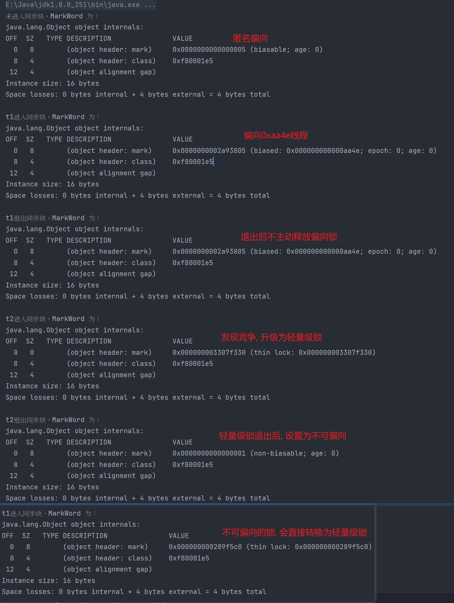

## Future和FutureTask

在JDK中, 首先推出了Future, 他可以用来包装一个异步任务, 获取其结果, 判断其是否完成, 

FutureTask是他的实现类, 他可以用来包装Callable和Runnable任务

~~~java
    public static void main(String[] args) {
        Callable<String> callable = () -> {
            return "hello world";
        };
        FutureTask<String> futureTask = new FutureTask<>(callable);

        Runnable runnable = () -> {
            System.out.println("hello world");
        };
        FutureTask<Void> futureTask1 = new FutureTask<Void>(runnable, null);
    }
~~~

Future接口有如下几个方法

~~~java
public interface Future<V> {
    boolean cancel(boolean mayInterruptIfRunning); // 取消任务
    boolean isCancelled(); // 判断任务是否取消
    boolean isDone(); // 判断任务是否完成
    V get() ; // 堵塞直到任务结束, 并获取结果
    V get(long timeout, TimeUnit unit); // 堵塞获取任务的结果, 直到超时
}
~~~

FutureTask可以作为一个任务传递给线程池

~~~java
    public static void main(String[] args) throws InterruptedException, ExecutionException {
        ExecutorService executorService = Executors.newFixedThreadPool(1);
        
        FutureTask<String> futureTask = new FutureTask<>(() -> {
            return "hello world";
        });
        executorService.submit(futureTask);
        while (!futureTask.isDone()) {
            Thread.sleep(1000);
        }
        System.out.println(futureTask.get());
    }
~~~

提交任务到线程池中也会得到一个FutureTask

~~~java
    public static void main(String[] args) throws InterruptedException, ExecutionException {
        ExecutorService executorService = Executors.newFixedThreadPool(1);


        Future<String> futureTask = executorService.submit(() -> {
            return "hello world";
        });
        while (!futureTask.isDone()) {
            Thread.sleep(1000);
        }
        System.out.println(futureTask.get());
    }
~~~


## Future的缺点

- Future缺乏回调通知的功能

  因为Future的get()方法会堵塞线程, 所以我们一般都是通过在while循环中调用 isDown来判断任务有没有完成, 执行完毕了才能调用get方法来获取返回值, 而在while中调用isDown相当于自旋, 如果时间久了会浪费CPU, 我们希望任务完成的时候, 能够直接调用回调函数来通知我们

- 如果多个异步任务之间有依赖关系, 比如要先执行A任务, 之后执行B任务, Future也无法实现

- 如果想要将多个异步任务的计算结果合并起来, Future也无法支持

- 如果多个异步任务, 想要只取最先完成的结果, 其他任务放弃, Future也无法支持


## CompletableFuture

基于Future的这些缺点, JDK8的时候推出了CompletableFuture

在CompletableFuture的理念中, **多个异步任务可以组合为一个大的任务, CompletableFuture可以表示大任务的某一个阶段的结果, 也可以表示大任务最终的结果**


### CompletableFuture的创建

创建CompletableFuture的时候, 应该使用他提供的静态方法, 而不要直接new一个出来

1. 创建一个异步任务, 使用默认的ForkJoinPool.commonPool()来执行

   ~~~java
   public static CompletableFuture<Void> runAsync(Runnable runnable) // 没有返回值的任务 
   public static <U> CompletableFuture<U> supplyAsync(Supplier<U> supplier) // 有返回值的任务
   ~~~

2. 创建一个异步任务, 使用自定义线程池来执行 <font color=red>推荐</font>

   ~~~java
   public static CompletableFuture<Void> runAsync(Runnable runnable,Executor executor)// 没有返回值的任务 
   
   public static <U> CompletableFuture<U> supplyAsync(Supplier<U> supplier,Executor executor) // 有返回值的任务
   ~~~

3. 创建一个已经完成的CompletableFuture

   ~~~java
   public static <U> CompletableFuture<U> completedFuture(U value)
   ~~~

### 获取CompletableFuture的结果

~~~java
public boolean isDone() // 通过该方法来判断是否完成
public T get() throws InterruptedException, ExecutionException // 堵塞直到完成, 并返回结果
public T get(long timeout, TimeUnit unit) // 堵塞直到超时, 或者返回结果
public T join() // 和get()一样, 打算不需要抛出异常(推荐)
public boolean isCompletedExceptionally() // 判断是否异常结束
~~~


### 设置下一个异步任务

thenXXX的作用是

- 当前步骤**正常结束**的时候, 将结果作为参数传入下一步骤中, 并执行下一步骤
- 如果当前步骤失败了, 那么不会执行下一步骤, 下一步骤的异常和当前步骤一致

thenXXX会返回一下新的CompletableFuture


|                                                   | 下一步骤有返回值                              | 下一步骤没有返回值                                   | 下一步骤不需要参数, 也没有返回值                  |
| ------------------------------------------------- | --------------------------------------------- | ---------------------------------------------------- | ------------------------------------------------- |
| 提交到当前步骤的线程池中执行                      | thenApply(Function  fn);                      | thenAccept(Consumer  action);                        | thenRun(Runnable action);                         |
| 使用默认的ForkJoinPool.commonPool()来执行(不推荐) | thenApplyAsync(Function  fn);                 | thenAcceptAsync(Consumer action);                    | thenRunAsync(Runnable action);                    |
| 提交到自定义的线程池中执行                        | thenApplyAsync (Function ,Executor executor); | thenAcceptAsync(Consumer action, Executor executor); | thenRunAsync(Runnable action, Executor executor); |

示例代码

~~~java
    public static void main(String[] args) throws InterruptedException, ExecutionException {
        ExecutorService executorService = Executors.newFixedThreadPool(1);

        CompletableFuture.supplyAsync(() -> {
            int i = new Random().nextInt(10);
            System.out.println("生成的int为: " + i);
            return i;
        }, executorService).thenApply((result) -> {
            // 需要返回值和异步, 使用thenApplyAsync
            System.out.println("执行thenApplyAsync: " + result);
            return result * 2;
        }).thenAccept((result) -> {
            // 不需要返回值, 需要异步, 使用thenAcceptAsync
            System.out.println("执行thenAcceptAsync: " + result);
        }).thenRun(() -> {
            // 不需要参数, 需要异步, 使用thenRunAsync
            System.out.println("执行完毕");
        });
    }

生成的int为: 7
执行thenApplyAsync: 7
执行thenAcceptAsync: 14
执行完毕
~~~


thenCompose和thenApply的作用是一样的, 都是用于指定下一个要执行的步骤, 但是他们的不同点在于

- thenApply的Function返回的是一个任意一个结果

- thenCompose的Function返回的还是一个CompletableFuture, 然后这个CompletableFuture也会被执行, 类似于flatmap

  ~~~java
  public <U> CompletionStage<U> thenCompose(Function<? super T, ? extends CompletionStage<U>> fn);
  public <U> CompletionStage<U> thenComposeAsync (Function<? super T, ? extends CompletionStage<U>> fn);
  public <U> CompletionStage<U> thenComposeAsync (Function<? super T, ? extends CompletionStage<U>> fn, Executor executor);
  ~~~

假设你的下一个步骤可以直接得到一个结果, 那么你可以使用thenApply

~~~java
        CompletableFuture.supplyAsync(() -> {
            return new Random().nextInt(10);
        }).thenApply(i -> {
            System.out.println(i);
            return i;
        });
~~~

但是如果你的下一个步骤又依赖另外一个CompletableFuture才能得到结果, 那么你可能需要使用thenCompose

~~~java
        // 使用thenApply
		CompletableFuture.supplyAsync(() -> {
            return 10;
        }).thenApply((userId) -> {
            // 根据UserID查询用户信息
            UserInfo userInfo = CompletableFuture.supplyAsync(() -> {
                UserInfo userInfo = userService.findUserInfo(userId);
                return userInfo;
            }).join();
            return userInfo;
        });

		// 使用thenCompose
        CompletableFuture.supplyAsync(() -> {
            return 10;
        }).thenCompose((userId) -> {
            return CompletableFuture.supplyAsync(() -> {
                UserInfo userInfo = userService.findUserInfo(userId);
                return userInfo;
            }); // 当前步骤依赖另外一个CompletableFuture才能得到结果
        });
~~~


### 合并两个CompletableFuture, 并指定下一个步骤

1. 当两个CompletableFuture都正常结束的时候, 将两个结果作为参数传入下一步骤, 并执行下一步骤, 并返回一个新的CompletableFuture

   如果其中一个失败了, 那么不会执行下一步骤, 下一步骤的异常和当前步骤一致
   
   
   
   
   
   |                                                   | 下一步骤有返回值                                             | 下一步骤没有返回值                                           | 下一步骤不需要参数, 也没有返回值                             |
   | ------------------------------------------------- | ------------------------------------------------------------ | ------------------------------------------------------------ | ------------------------------------------------------------ |
   | 提交到当前步骤的线程池中执行同步执行              | thenCombine (CompletionStage other, BiFunction fn);          | thenAcceptBoth (CompletionStage other,      BiConsumer action); | runAfterBoth(CompletionStage other,  Runnable action);       |
   | 使用默认的ForkJoinPool.commonPool()来执行(不推荐) | thenCombineAsync (CompletionStage  other, BiFunction fn);    | thenAcceptBothAsync     (CompletionStage other,  BiConsumer action); | runAfterBothAsync(CompletionStage other,  Runnable action);  |
   | 提交到自定义的线程池中执行                        | thenCombineAsync     (CompletionStage other,      BiFunction fn, Executor executor); | thenAcceptBothAsync     (CompletionStage other,      BiConsumer action,  Executor executor); | runAfterBothAsync(CompletionStage other,  Runnable action, Executor executor); |
   
   ~~~java
           ExecutorService executorService = Executors.newFixedThreadPool(1);
   
           CompletableFuture<Integer> other = CompletableFuture.supplyAsync(() -> {
               return new Random().nextInt(10);
           }, executorService);
   
           CompletableFuture.supplyAsync(() -> {
               return new Random().nextInt(20);
           }, executorService).thenCombine(other, (v1, v2) -> {
               return v2 * v1;
           }).whenComplete((v, ex) -> {
               if (ex != null) {
                   ex.printStackTrace();
                   return;
               }
               System.out.println(v);
           });
   ~~~

2. 返回一个新的CompletableFuture, 当两个CompletableFuture中有一个率先完成时, 就将结果作为参数传入下一步骤, 并执行下一步骤

   如果两个都失败了, 那么不会执行下一步骤, 下一步骤的异常和当前步骤一致

   

   |                                                   | 下一步骤有返回值                                             | 下一步骤没有返回值                                           | 下一步骤不需要参数, 也没有返回值                             |
   | ------------------------------------------------- | ------------------------------------------------------------ | ------------------------------------------------------------ | ------------------------------------------------------------ |
   | 提交到当前步骤的线程池中执行                      | applyToEither     (CompletionStage other,      Function fn); | acceptEither (CompletionStage  other,  Consumer action);     | runAfterEither(CompletionStage  other, Runnable action);     |
   | 使用默认的ForkJoinPool.commonPool()来执行(不推荐) | applyToEitherAsync     (CompletionStage other,      Function fn); | acceptEitherAsync  (CompletionStage other,  Consumer action); | runAfterEitherAsync (CompletionStage  other,      Runnable action); |
   | 提交到自定义的线程池中执行                        | applyToEitherAsync     (CompletionStage other, Function fn,      Executor executor); | acceptEitherAsync (CompletionStage other, Consumer action, Executor executor); | runAfterEitherAsync     (CompletionStage  other,  Runnable action,  Executor executor); |

   ~~~java
   ExecutorService executorService = Executors.newFixedThreadPool(2);
   
           CompletableFuture<Integer> other = CompletableFuture.supplyAsync(() -> {
               int i = new Random().nextInt(1000) * 100;
               System.out.println(i);
               try {
                   Thread.sleep(i);
               } catch (InterruptedException e) {
                   throw new RuntimeException(e);
               }
               return i;
           }, executorService);
   
           CompletableFuture.supplyAsync(() -> {
               int i = new Random().nextInt(1000) * 100;
               System.out.println(i);
               try {
                   Thread.sleep(i);
               } catch (InterruptedException e) {
                   throw new RuntimeException(e);
               }
               return i;
           }, executorService).acceptEither(other, (v) -> {
               System.out.println("先执行完结果的是: " + v);
           });
   ~~~

   

### 结果处理

1. 异常处理

   ~~~java
   // 返回一个新的CompletableFuture
   // 当前阶段正常结束, 返回的CompletableFuture也以相同的结果正常结束
   // 如果当前阶段异常结束, 就将异常作为参数传入Function中执行, 然后将执行结果作为返回的CompletableFuture的结果
   exceptionally (Function<Throwable, ? extends T> fn);
   ~~~

   ~~~java
           ExecutorService executorService = Executors.newFixedThreadPool(2);
           CompletableFuture.runAsync(() -> {
               // 步骤1
           }, executorService).thenRun(() -> {
               // 步骤2
           }).thenRun(() -> {
               // 步骤3
           }).exceptionally(ex -> {
               // 只要上面有任何一个步骤失败了, 那么后续的步骤都会跟着失败
               // 所以可以在这里处理最开始的异常
               return null;
           });
   ~~~

2. 处理结果和异常, 无返回值

   ~~~java
   // 返回一个新的CompletableFuture
   // 当前阶段结束的时候, 然后会将结果和异常作为参数传入到BiConsumer中执行
   // 返回的CompletableFuture与当前阶段的CompletableFuture结果一致, 除非BiConsumer报错了
   public CompletionStage<T> whenComplete (BiConsumer<? super T, ? super Throwable> action);
   public CompletionStage<T> whenCompleteAsync (BiConsumer<? super T, ? super Throwable> action);
   public CompletionStage<T> whenCompleteAsync (BiConsumer<? super T, ? super Throwable> action, Executor executor);
   ~~~

   ~~~java
   CompletableFuture.supplyAsync(() -> {
               int nextInt = new Random().nextInt(10);
               if (nextInt > 5) {
                   throw new RuntimeException("i > 5");
               }
               return nextInt;
           }, executorService).whenComplete((v, ex) -> {
               // do something
               
               // 当前步骤的结果与上一个步骤的结果相同, 除非这里也报错了
           });
   ~~~

3. 处理结果和异常, 有返回值

   ~~~java
   // 返回一个新的CompletableFuture
   // 当前阶段结束的时候, 然后会将结果和异常作为参数传入到BiFunction中执行
   // 返回的CompletableFuture的结果是BiFunction执行后的结果
   public <U> CompletionStage<U> handle (BiFunction<? super T, Throwable, ? extends U> fn);
   public <U> CompletionStage<U> handleAsync(BiFunction<? super T, Throwable, ? extends U> fn);
   public <U> CompletionStage<U> handleAsync (BiFunction<? super T, Throwable, ? extends U> fn, Executor executor);
   ~~~

   ~~~java
   CompletableFuture.supplyAsync(() -> {
               int nextInt = new Random().nextInt(10);
               if (nextInt > 5) {
                   throw new RuntimeException("i > 5");
               }
               return nextInt;
           }, executorService).handle((v, ex) -> {
               if ( ex != null ) {
        
               }
       	// 当前步骤的结果根据这里的结果来, 而不是上一个步骤
               return v;
           });
   ~~~

whenComplete和handle的区别

- whenComplete接受的是BiConsumer, 因为没有返回值, 所以当前步骤的结果和上一个步骤一样, 除非BiConsumer也发生了异常
- handle接受的是BiFunction, 有返回值, 所以当前步骤逇结果是根据BiFunction来的


### 合并多个CompletableFuture

1. `allOf`可以合并多个CompletableFuture, 并等待多个CompletableFuture完成

   ~~~java
           ExecutorService executorService = Executors.newFixedThreadPool(2);
   
           CompletableFuture<Integer> future0 = CompletableFuture.supplyAsync(() -> {
               return new Random().nextInt(1000);
           }, executorService);
   
           CompletableFuture<Integer> future1 = CompletableFuture.supplyAsync(() -> {
               int i = new Random().nextInt(1000);
               if (i > 500) {
                   throw new RuntimeException("i > 500");
               }
               return i;
           }, executorService);
   
           CompletableFuture<Double> future2 = CompletableFuture.supplyAsync(() -> {
               double nextDouble = new Random().nextDouble();
               if (nextDouble > 0.5) {
                   throw new RuntimeException(
                           "double > 100"
                   );
               }
               return nextDouble;
           });
   
           // 堵塞直到3个都完成
           CompletableFuture.allOf(future0, future1, future2).join();
   
           Integer result0 = future0.join();
           Double result2 = future2.join();
           Integer result1 = future1.join();
       }
   ~~~

2. `anyOf` 合并多个CompletableFuture, 并等待最先完成的，并返回该任务的结果。

   ~~~java
   CompletableFuture<String> future1 = CompletableFuture.supplyAsync(() -> {
               sleep(3000);
               return "Task 1";
           });
   
           CompletableFuture<String> future2 = CompletableFuture.supplyAsync(() -> {
               sleep(1000);
               return "Task 2";
           });
   
           CompletableFuture<String> future3 = CompletableFuture.supplyAsync(() -> {
               sleep(2000);
               return "Task 3";
           });
   
           // 使用 anyOf 等待最快完成的任务
           CompletableFuture<Object> anyOfFuture = CompletableFuture.anyOf(future1, future2, future3);
   
           // 获取最快完成的任务结果
           Object result = anyOfFuture.join();
   ~~~


# 线程中断

一个线程不应该由其他线程来强制中断或者停止, 而是应该由线程自己决定, 所以`Thread.stop`, `Thread.suspend`, `Thread.resume`都被废弃了

Java中提供了一种停止线程的协商机制--中断,  如果你需要中断一个线程, 你需要调用`interrupt`方法, 该方法会将线程的中断标识位设置为true, 仅此而已

你需要自己在线程中写代码, 不断地检查当前线程的中断标识位, 如果为true, 表示当前的线程被中断了, 此时究竟做什么事情, 都需要你直接写代码来实现


## 有关中断的方法

1. `public boolean isInterrupted`
   判断线程是否中断

2. `public static boolean interrupted`

   判断线程是否中断, 并清除线程的中断位

3. `public void interrupt()`

   中断线程, 仅仅是将线程的中断标识位设置为true

   如果线程正处于join(), wait(), sleep()等堵塞状态, 那么会清除标志位, 并抛出InterruptException

   这里清理标志位的原因是, 如果已经抛出了InterruptException, 那么程序自然需要处理终端的请求, 后续就应该把中断位清除掉, 防止后续代码以为又接到了新的中断的请求

   ~~~java
       public static void main(String[] args) throws InterruptedException, ExecutionException {
   
           Thread thread = new Thread(() -> {
               System.out.println(Thread.currentThread().isInterrupted());
               try {
                   Thread.sleep(10000);
               } catch (InterruptedException e) {
                   System.out.println("被中断了");
               }
               System.out.println(Thread.currentThread().isInterrupted());
           });
           thread.start();
   
           Thread.sleep(1000);
           thread.interrupt();
       }
   false
   被中断了
   false
   ~~~

   如果当前线程已经中断了, 那么调用sleep, join, wait等方法, 会立即抛出异常, 并清除标志位

   ~~~java
       public static void main(String[] args) throws InterruptedException, ExecutionException {
           Thread.currentThread().interrupt();
           System.out.println(Thread.currentThread().isInterrupted());
   
           Thread.sleep(1000);
   
           System.out.println(Thread.currentThread().isInterrupted());
           
       }
   true
   Exception in thread "main" java.lang.InterruptedException: sleep interrupted
   	at java.lang.Thread.sleep(Native Method)
   	at org.example.Main7.main(Main7.java:16)
   ~~~

   

## 中断线程的办法

1. 通过一个volatile变量来实现

   ~~~java
   public volatile boolean isStop = false;
   while (true) {
       if (isStop) {
           break;
       }
       // do something
   }
   ~~~

2. 通过一个AtomicBoolean变量来实现

   ~~~java
   public AtomicBoolean isStop = new AtomicBoolean(false);
   while (true) {
       if (isStop.get()) {
           break;
       }
       // do something
   }
   ~~~

3. 通过interrupt来中断

   ~~~java
   while (true) {
       if (Thread.currentThread().isInterrupted()) {
           break;
       }
       // do something
   }
   ~~~


## 中断的坑

~~~java
    public static void main(String[] args) throws InterruptedException, ExecutionException {
        Thread thread = new Thread(() -> {
            while (!Thread.currentThread().isInterrupted()) {
                System.out.println("当前正在执行");

                try {
                    // 如果线程没有sleep, 那么中断会设置标志位, 导致执行sleep的时候立即报错并清除中断位
                    // 如果线程正在处于sleep, 那么中断也会让sleep报错并清除中断位
                    Thread.sleep(100);
                } catch (InterruptedException e) {
                    // 如果不重新设置中断位, 那么while循环永远不会跳出来
                    Thread.currentThread().interrupt();
                }
            }
        });

        thread.start();

        Thread.sleep(1000);
        thread.interrupt();
    }
~~~


# LockSupport

## 通断和恢复线程的方法

1. 通过Object中的wait和notify

   ~~~java
   public static void main(String[] args) throws InterruptedException, ExecutionException {
           Object lock = new Object();
           Thread thread = new Thread(() -> {
               synchronized (lock) {
                   System.out.println("准备wait");
                   try {
                       lock.wait();
                   } catch (InterruptedException e) {
                       throw new RuntimeException(e);
                   }
                   System.out.println("被唤醒");
               }
           });
           thread.start();
   
           Thread thread1 = new Thread(() -> {
               synchronized (lock) {
                   System.out.println("发出通知");
                   lock.notify();
               }
           });
           thread1.start();
       }
   ~~~

   缺点: 

   - wait()和notify()必须放在synchronized中执行, 否则会报错
   - notify必须在wait后面执行, 否则唤醒不了

2. 通过JUC包中的Condition的await和signal方法

   ~~~java
       public static void main(String[] args) throws InterruptedException, ExecutionException {
           ReentrantLock lock = new ReentrantLock();
           Condition condition = lock.newCondition();
           Thread thread = new Thread(() -> {
               synchronized (lock) {
                   System.out.println("准备wait");
                   try {
                       condition.await();
                   } catch (InterruptedException e) {
                       throw new RuntimeException(e);
                   }
                   System.out.println("被唤醒");
               }
           });
           thread.start();
   
           Thread thread1 = new Thread(() -> {
               synchronized (lock) {
                   System.out.println("发出通知");
                   condition.signal();
               }
           });
           thread1.start();
       }
   ~~~

   缺点: 

   - await()和signal()必须放在lock代码块中执行, 否则会报错
   - signal必须在await后面执行, 否则唤醒不了

3. 使用LockSupport中的park和unpark

   ~~~java
       public static void main(String[] args) throws InterruptedException, ExecutionException {
           Thread thread = new Thread(() -> {
               System.out.println("准备wait");
               LockSupport.park();
               System.out.println("被唤醒");
   
           });
           thread.start();
   
           Thread thread1 = new Thread(() -> {
               System.out.println("发出通知");
               LockSupport.unpark(thread);
           });
           thread1.start();
       }
   ~~~

   

### LockSupport详解

基于Object的wait/notify的缺点, 我们可以使用LockSupport的park和unpark方法

他提出了许可证的概念, 即

- 调用unpark会给线程颁发一个许可证, 许可证每个线程最多持有一个
- 如果park住的线程获得了一个许可证, 那么就会被唤醒并消耗掉这个许可证
- 调用park的时候, 如果这个线程已经有一个许可证了, 那么会消耗掉这个许可证, 并立即返回

他有如下几个方法:

- `public static void park()`

  堵塞线程, 直到被中断, 或者当前线程被unpark颁发了一个通行证

  <font color=red>park()方法被其他线程中断的时候, 不会抛出异常, 而是设置中断位, 所以退出之后应该判断线程的中断标识位来确定返回的原因到底是unpark还是中断</font>

- `public static void parkNanos(long nanos)`

  和park()一样, 只是添加了一个超时自动唤醒

- `public static void parkUntil(long deadline)`

  和parkNanos一样, 只不过指定的是从1970年开始的毫秒数

- `public static void unpark(Thread thread) `

  颁发一个通行证给线程

  

# CAS

## 通过CAS实现锁

~~~java
class CASLock {
    private volatile int state = 0; // 0 表示无锁，1 表示加锁
    private static final Unsafe unsafe;
    private static final long stateOffset;

    static {
        try {
            // 通过反射获取 Unsafe 实例
            Field field = Unsafe.class.getDeclaredField("theUnsafe");
            field.setAccessible(true);
            unsafe = (Unsafe) field.get(null);

            // 获取 state 变量在 CASLock 类中的偏移量
            stateOffset = unsafe.objectFieldOffset(CASLock.class.getDeclaredField("state"));
        } catch (Exception e) {
            throw new Error(e);
        }
    }

    // 加锁方法
    public void lock() {
        while (!unsafe.compareAndSwapInt(this, stateOffset, 0, 1)) {
            // 自旋等待
        }
    }

    // 解锁方法
    public void unlock() {
        unsafe.compareAndSwapInt(this, stateOffset, 1, 0)
    }
}
public class UnsafeCASLockDemo {
    public static void main(String[] args) {
        CASLock lock = new CASLock();

        Runnable task = () -> {
            lock.lock();
            try {
                System.out.println(Thread.currentThread().getName() + " 获取锁");
                Thread.sleep(1000);
            } catch (InterruptedException e) {
                e.printStackTrace();
            } finally {
                lock.unlock();
                System.out.println(Thread.currentThread().getName() + " 释放锁");
            }
        };

        Thread t1 = new Thread(task, "线程1");
        Thread t2 = new Thread(task, "线程2");

        t1.start();
        t2.start();
    }
}
~~~

## CAS的ABA问题

CAS（Compare-And-Swap，比较并交换）操作的核心是：

- 读取变量的值（A）。
- 比较变量的当前值是否仍然是 A。
- 如果是，则将其更新为新值 B。

但是，在并发环境下，可能会发生 **ABA 问题**：

1. 线程 1 读取变量值 `A`。
2. 线程 2 将变量从 `A` 改为 `B`，然后再改回 `A`。
3. 线程 1 进行 CAS 操作，发现值仍然是 `A`，以为变量没有变，CAS 成功。

~~~java
public class ABAProblemDemo {
    private static AtomicInteger atomicInteger = new AtomicInteger(1);

    public static void main(String[] args) {
        Thread t1 = new Thread(() -> {
            int oldValue = atomicInteger.get();
            System.out.println("线程1 读取到的值: " + oldValue);
            try { Thread.sleep(1000); } catch (InterruptedException ignored) {}
		   // 在这期间, 线程2将 1 -> 2, 然后有 2 -> 1
            boolean result = atomicInteger.compareAndSet(oldValue, 2);
            System.out.println("线程1 CAS 结果: " + result);
        });

        Thread t2 = new Thread(() -> {
            try { Thread.sleep(500); } catch (InterruptedException ignored) {}
            atomicInteger.incrementAndGet(); // 1 -> 2
            atomicInteger.decrementAndGet(); // 2 -> 1
            System.out.println("线程2 修改值后恢复: " + atomicInteger.get());
        });

        t1.start();
        t2.start();
    }
}
~~~

注意: CAS的ABA只是会导致潜在的问题, 不是说一定就存在问题


## 解决CAS的ABA问题

Java 提供了 `AtomicStampedReference<T>`，他额外添加了一个版本号的属性, 在cas的时候, 不仅会比较值, 还会比较版本号

AtomicStampedReference主要有如下的方法:

- `public AtomicStampedReference(V initialRef, int initialStamp)`

  创建一个对象, 保存值并设置初始的版本号

- `getReference()`: 获取当前存储的对象

- `getStamp()`: 获取当前版本号

- `compareAndSet(V expectedReference, V newReference, int expectedStamp, int newStamp)`

  cas并同时比较value和版本号

- `set(V newReference, int newStamp)`

  **直接** 设置新的值和版本号

- `attemptStamp(V expectedReference, int newStamp)`

  仅当 **value匹配** 时，更新版本号，不改值

~~~java
import java.util.concurrent.atomic.AtomicStampedReference;

public class ABASolutionStamped {
    // 创建一个对象, 初始版本号为0
    private static AtomicStampedReference<Integer> atomicStampedRef = new AtomicStampedReference<>(1, 0);

    public static void main(String[] args) {
        Thread t1 = new Thread(() -> {
            int stamp = atomicStampedRef.getStamp();  // 获取当前版本号
            System.out.println("线程1 初始版本号: " + stamp);
            try { Thread.sleep(1000); } catch (InterruptedException ignored) {}

            // cas
            boolean result = atomicStampedRef.compareAndSet(1, 2, stamp, stamp + 1);
            System.out.println("线程1 CAS 结果: " + result);
        });

        Thread t2 = new Thread(() -> {
            try { Thread.sleep(500); } catch (InterruptedException ignored) {}
            int stamp = atomicStampedRef.getStamp();
            atomicStampedRef.compareAndSet(1, 2, stamp, stamp + 1);
            atomicStampedRef.compareAndSet(2, 1, stamp + 1, stamp + 2);
            System.out.println("线程2 修改值后恢复，当前版本号: " + atomicStampedRef.getStamp());
        });

        t1.start();
        t2.start();
    }
}
~~~


# 原子类

在JUC中, 主要提供了如下的原子类

- 基础类型原子类: `AtomicInteger、AtomicLong、AtomicBoolean、AtomicDouble`
- 数组类型原子类: `AtomicIntegerArray、AtomicLongArray、AtomicReferenceArray`
- 对象引用原子类: `AtomicReference、AtomicStampedReference、AtomicMarkableReference`
- 累加器原子类: `LongAdder、DoubleAdder、LongAccumulator、DoubleAccumulator`
- 修改字段原子类: `AtomicIntegerFieldUpdater, ActomicLongFieldUpdater, AtomicReferenceFieldUpdater`


## 基础类型原子类

基础类型原子类主要有: `AtomicInteger、AtomicLong、AtomicBoolean、AtomicDouble`


| **方法**                                        | **作用**                   | **示例**                                          |
| ----------------------------------------------- | -------------------------- | ------------------------------------------------- |
| `get()`                                         | 获取当前值                 | `int value = atomicInt.get();`                    |
| `set(int newValue)`                             | 设置新值（非原子性）       | `atomicInt.set(10);`                              |
| `lazySet(int newValue)`                         | **延迟设置新值**，提高性能 | `atomicInt.lazySet(20);`                          |
| `compareAndSet(int expect, int update)`         | CAS 原子更新               | `atomicInt.compareAndSet(10, 15);`                |
| `getAndSet(int newValue)`                       | 设置新值并返回旧值         | `int old = atomicInt.getAndSet(5);`               |
| `incrementAndGet()`                             | **自增**，返回新值         | `int newValue = atomicInt.incrementAndGet();`     |
| `getAndIncrement()`                             | **自增**，返回旧值         | `int oldValue = atomicInt.getAndIncrement();`     |
| `decrementAndGet()`                             | **自减**，返回新值         | `int newValue = atomicInt.decrementAndGet();`     |
| `getAndDecrement()`                             | **自减**，返回旧值         | `int oldValue = atomicInt.getAndDecrement();`     |
| `addAndGet(int delta)`                          | **加法**，返回新值         | `int newValue = atomicInt.addAndGet(5);`          |
| `getAndAdd(int delta)`                          | **加法**，返回旧值         | `int oldValue = atomicInt.getAndAdd(5);`          |
| `accumulateAndGet(int x, IntBinaryOperator op)` | **自定义操作**，返回新值   | `atomicInt.accumulateAndGet(2, (a, b) -> a * b);` |

~~~java
import java.util.concurrent.atomic.AtomicInteger;

public class AtomicIntegerExample {
    public static void main(String[] args) {
        AtomicInteger atomicInt = new AtomicInteger(10);

        System.out.println("初始值: " + atomicInt.get()); // 10
        atomicInt.incrementAndGet(); // +1
        System.out.println("自增后: " + atomicInt.get()); // 11

        atomicInt.addAndGet(5); // +5
        System.out.println("加 5 后: " + atomicInt.get()); // 16

        boolean success = atomicInt.compareAndSet(16, 20);
        System.out.println("CAS 结果: " + success); // true
        System.out.println("最终值: " + atomicInt.get()); // 20
    }
}
~~~


## 数组类型原子类

数组类型原子类: `AtomicIntegerArray、AtomicLongArray、AtomicReferenceArray`

| **方法**                                       | **作用**                                     | **示例**                                              |
| ---------------------------------------------- | -------------------------------------------- | ----------------------------------------------------- |
| `AtomicReferenceArray(int length)`             | 创建指定长度的数组，默认 `null`              | `new AtomicReferenceArray<>(5);`                      |
| `AtomicReferenceArray(T[] array)`              | 传入数组创建原子数组                         | `new AtomicReferenceArray<>(new String[]{"A", "B"});` |
| `get(int index)`                               | 获取索引 `index` 位置的值                    | `array.get(0);`                                       |
| `set(int index, T newValue)`                   | **<font color=red>非原子性</font>** 设置新值 | `array.set(1, "C");`                                  |
| `lazySet(int index, T newValue)`               | **延迟设置**，比 `set()` 更快                | `array.lazySet(2, "D");`                              |
| `compareAndSet(int index, T expect, T update)` | CAS 操作，比较并交换                         | `array.compareAndSet(1, "B", "E");`                   |
| `getAndSet(int index, T newValue)`             | 设置新值，返回旧值                           | `String old = array.getAndSet(1, "F");`               |
| `length()`                                     | 获取数组长度                                 | `array.length();`                                     |

~~~java
import java.util.concurrent.atomic.AtomicReferenceArray;

public class AtomicReferenceArrayExample {
    public static void main(String[] args) {
        AtomicReferenceArray<String> atomicArray = new AtomicReferenceArray<>(new String[]{"A", "B", "C"});
        
        // 获取元素
        System.out.println("初始值: " + atomicArray.get(1)); // B
        
        // 设置新值（非原子）
        atomicArray.set(1, "X");
        System.out.println("set() 后: " + atomicArray.get(1)); // X
        
        // CAS 更新
        boolean success = atomicArray.compareAndSet(1, "X", "Y");
        System.out.println("CAS 更新成功? " + success); // true
        System.out.println("最终值: " + atomicArray.get(1)); // Y
    }
}
~~~


## 对象引用原子类

对象引用原子类: `AtomicReference、AtomicStampedReference、AtomicMarkableReference`


### AtomicReference

一个普通的原题类, 用于cas引用的

| **方法**                            | **作用**           | **示例**                                                 |
| ----------------------------------- | ------------------ | -------------------------------------------------------- |
| `get()`                             | 获取当前引用       | `Person p = atomicRef.get();`                            |
| `set(T newValue)`                   | 非原子性设置新值   | `atomicRef.set(new Person("Tom"));`                      |
| `compareAndSet(T expect, T update)` | CAS 原子更新       | `atomicRef.compareAndSet(oldValue, newValue);`           |
| `getAndSet(T newValue)`             | 设置新值，返回旧值 | `Person old = atomicRef.getAndSet(new Person("Jerry"));` |

~~~java
import java.util.concurrent.atomic.AtomicReference;

public class AtomicReferenceExample {
    static class Person {
        String name;
        Person(String name) { this.name = name; }
        public String toString() { return name; }
    }

    public static void main(String[] args) {
        AtomicReference<Person> atomicRef = new AtomicReference<>(new Person("Alice"));
        
        Person oldValue = atomicRef.get();
        Person newValue = new Person("Bob");

        boolean success = atomicRef.compareAndSet(oldValue, newValue);
        System.out.println("CAS 更新成功？" + success);
        System.out.println("当前值：" + atomicRef.get());
    }
}
~~~


### AtomicStampedReference

一个版本号的原子引用类, 主要用来解决ABA问题

| **方法**                                                     | **作用**             | **示例**                                                     |
| ------------------------------------------------------------ | -------------------- | ------------------------------------------------------------ |
| `getReference()`                                             | 获取当前引用         | `Person p = atomicRef.getReference();`                       |
| `getStamp()`                                                 | 获取当前版本号       | `int stamp = atomicRef.getStamp();`                          |
| `compareAndSet(T expect, T update, int expectStamp, int newStamp)` | CAS 更新（带版本号） | `atomicRef.compareAndSet(oldVal, newVal, oldStamp, newStamp);` |

~~~java
import java.util.concurrent.atomic.AtomicStampedReference;

public class AtomicStampedReferenceExample {
    static class Person {
        String name;
        Person(String name) { this.name = name; }
    }

    public static void main(String[] args) {
        Person initialPerson = new Person("Alice");
        // 设置初始的值和版本号
        AtomicStampedReference<Person> atomicRef = new AtomicStampedReference<>(initialPerson, 0);

        int stamp = atomicRef.getStamp();
        Person oldValue = atomicRef.getReference();
        Person newValue = new Person("Bob");

        // 只有value和版本号都对上的时候, 才cas成功
        boolean success = atomicRef.compareAndSet(oldValue, newValue, stamp, stamp + 1);
        System.out.println("CAS 更新成功？" + success);
        System.out.println("当前值：" + atomicRef.getReference() + "，版本号：" + atomicRef.getStamp());
    }
}
~~~


### AtomicMarkableReference

`AtomicMarkableReference`相较于`AtomicReference`, 添加了一个boolean类型的标志位

他不能完全解决ABA问题, 但是可以部分解决ABA问题

它适用的场景是:

- **逻辑删除（Lazy Deletion）**：数据仍在内存中，但标记为“已删除”。

- **标记处理状态**：比如一个任务是否已经被某个线程处理。

| **方法**                                                     | **作用**                                 | **示例**                                                |
| ------------------------------------------------------------ | ---------------------------------------- | ------------------------------------------------------- |
| `getReference()`                                             | 获取当前对象引用                         | `Person p = atomicRef.getReference();`                  |
| `isMarked()`                                                 | 获取当前标记值                           | `boolean mark = atomicRef.isMarked();`                  |
| `get(boolean[] markHolder)`                                  | **获取引用+当前标记**（`markHolder[0]`） | `atomicRef.get(markHolder);`                            |
| `set(T newReference, boolean newMark)`                       | 非原子性地设置新值和标记                 | `atomicRef.set(newPerson, true);`                       |
| `compareAndSet(T expectRef, T newRef, boolean expectMark, boolean newMark)` | **CAS** 方式更新引用和标记               | `atomicRef.compareAndSet(oldRef, newRef, false, true);` |
| `attemptMark(T expectedReference, boolean newMark)`          | 仅更新标记值（如果引用匹配）             | `atomicRef.attemptMark(oldRef, true);`                  |

~~~java
import java.util.concurrent.atomic.AtomicMarkableReference;

public class AtomicMarkableReferenceExample {
    static class Person {
        String name;
        Person(String name) { this.name = name; }
        public String toString() { return name; }
    }

    public static void main(String[] args) {
        Person alice = new Person("Alice");
        AtomicMarkableReference<Person> atomicRef = new AtomicMarkableReference<>(alice, false);

        System.out.println("初始值: " + atomicRef.getReference() + "，标记: " + atomicRef.isMarked());

        // CAS 更新引用和标记
        boolean success = atomicRef.compareAndSet(alice, new Person("Bob"), false, true);
        System.out.println("CAS 更新成功？" + success);
        System.out.println("当前值: " + atomicRef.getReference() + "，标记: " + atomicRef.isMarked());

        // 仅更新标记
        atomicRef.attemptMark(atomicRef.getReference(), false);
        System.out.println("标记更新后: " + atomicRef.getReference() + "，标记: " + atomicRef.isMarked());
    }
}
~~~


## 累加器原子类

累加器原子类: `LongAdder、DoubleAdder、LongAccumulator、DoubleAccumulator`


**使用场景**

累加器适用于高并发环境下的整数累加。通过 **分段累加**（`cells` 数组），多个线程可同时更新不同的 `cell`，降低 CAS 竞争。

**比 `AtomicLong` 性能更高**，但**不适用于获取精确值频繁的场景**, 因为高并发的场景下**不能获得精确的值**。


### LongAddr和DoubleAdder

| **方法**         | **作用**       | **示例**                              |
| ---------------- | -------------- | ------------------------------------- |
| `increment()`    | 自增 1         | `adder.increment();`                  |
| `decrement()`    | 自减 1         | `adder.decrement();`                  |
| `add(long x)`    | 加上 `x`       | `adder.add(5);`                       |
| `sum()`          | 计算总和       | `long result = adder.sum();`          |
| `sumThenReset()` | 计算总和并重置 | `long result = adder.sumThenReset();` |
| `reset()`        | 清零           | `adder.reset();`                      |

~~~java
import java.util.concurrent.atomic.LongAdder;

public class LongAdderExample {
    public static void main(String[] args) {
        LongAdder adder = new LongAdder();

        // 多线程累加
        Runnable task = () -> {
            for (int i = 0; i < 1000; i++) {
                adder.increment();
            }
        };

        Thread t1 = new Thread(task);
        Thread t2 = new Thread(task);
        t1.start();
        t2.start();

        try {
            t1.join();
            t2.join();
        } catch (InterruptedException e) {
            e.printStackTrace();
        }

        System.out.println("最终累加结果：" + adder.sum());
    }
}
~~~


### LongAccumulator和DoubleAccumulator

LongAccumulator相较于LongAdder, 可以进行更复杂的计算逻辑, 而不是简单的自增自减

| **方法**             | **作用**               |
| -------------------- | ---------------------- |
| `accumulate(long x)` | 按照自定义规则累加 `x` |
| `get()`              | 获取当前值             |
| `reset()`            | 清零                   |

~~~java
import java.util.concurrent.atomic.LongAccumulator;
import java.util.function.LongBinaryOperator;

    public static void main(String[] args) {
        // 定义一个累加规则
        LongBinaryOperator accumulator = (long a, long b) -> {
            return a * b + 1;
        };
        // 传入累加规则, 和初始的累加值
        LongAccumulator maxAccumulator = new LongAccumulator(accumulator, 1);
        
        maxAccumulator.accumulate(10); // 进行累加
        maxAccumulator.accumulate(30); // 进行累加
        maxAccumulator.accumulate(20); // 进行累加

        System.out.println("最大值：" + maxAccumulator.get());
    }
~~~


### 性能测试

经过测试, 50个线程, 每个线程100000次的自增,

- 通过Synchronized实现同步耗时318ms
- 通过AtomicInteger实现同步耗时86ms
- 通过LongAdder实现同步耗时42ms

~~~java
    public static void main(String[] args) throws InterruptedException, ExecutionException {
        long currentTimeMillis = System.currentTimeMillis();
        SynchronizedCounter.test();
        long nextTime = System.currentTimeMillis();
        System.out.println(nextTime - currentTimeMillis);

        long currentTimeMillis1 = System.currentTimeMillis();
        AtomicIntegerCounter.test();
        long nextTime1 = System.currentTimeMillis();
        System.out.println(nextTime1 - currentTimeMillis1);

        long currentTimeMillis2 = System.currentTimeMillis();
        LongAdderCounter.test();
        long nextTime2 = System.currentTimeMillis();
        System.out.println(nextTime2 - currentTimeMillis2);

    }

    public static class SynchronizedCounter {
        private static int count = 0;
        private static final Object lock = new Object();

        public static void test() throws InterruptedException {
            int threadCount = 50;
            int loopCount = 100000;
            CountDownLatch latch = new CountDownLatch(threadCount);

            Runnable task = () -> {
                for (int i = 0; i < loopCount; i++) {
                    synchronized (lock) {
                        count++;
                    }
                }
                latch.countDown();
            };

            Thread[] threads = new Thread[threadCount];
            for (int i = 0; i < threadCount; i++) {
                threads[i] = new Thread(task);
                threads[i].start();
            }

            latch.await();  // 等待所有线程完成
            System.out.println("最终结果 (synchronized)：" + count);
        }
    }

    public static class AtomicIntegerCounter {
        private static final AtomicInteger count = new AtomicInteger(0);

        public static void test() throws InterruptedException {
            int threadCount = 50;
            int loopCount = 100000;
            CountDownLatch latch = new CountDownLatch(threadCount);

            Runnable task = () -> {
                for (int i = 0; i < loopCount; i++) {
                    count.incrementAndGet();
                }
                latch.countDown();
            };

            Thread[] threads = new Thread[threadCount];
            for (int i = 0; i < threadCount; i++) {
                threads[i] = new Thread(task);
                threads[i].start();
            }

            latch.await();  // 等待所有线程完成
            System.out.println("最终结果 (AtomicInteger)：" + count.get());
        }
    }

    public static class LongAdderCounter {
        private static final LongAdder count = new LongAdder();

        public static void test() throws InterruptedException {
            int threadCount = 50;
            int loopCount = 100000;
            CountDownLatch latch = new CountDownLatch(threadCount);

            Runnable task = () -> {
                for (int i = 0; i < loopCount; i++) {
                    count.increment();
                }
                latch.countDown();
            };

            Thread[] threads = new Thread[threadCount];
            for (int i = 0; i < threadCount; i++) {
                threads[i] = new Thread(task);
                threads[i].start();
            }

            latch.await();  // 等待所有线程完成
            System.out.println("最终结果 (LongAdder)：" + count.sum());
        }
    }
~~~


| **方法**         | **作用**       | **示例**                              |
| ---------------- | -------------- | ------------------------------------- |
| `increment()`    | 自增 1         | `adder.increment();`                  |
| `decrement()`    | 自减 1         | `adder.decrement();`                  |
| `add(long x)`    | 加上 `x`       | `adder.add(5);`                       |
| `sum()`          | 计算总和       | `long result = adder.sum();`          |
| `sumThenReset()` | 计算总和并重置 | `long result = adder.sumThenReset();` |
| `reset()`        | 清零           | `adder.reset();`                      |

~~~java
import java.util.concurrent.atomic.LongAdder;

public class LongAdderExample {
    public static void main(String[] args) {
        LongAdder adder = new LongAdder();

        // 多线程累加
        Runnable task = () -> {
            for (int i = 0; i < 1000; i++) {
                adder.increment();
            }
        };

        Thread t1 = new Thread(task);
        Thread t2 = new Thread(task);
        t1.start();
        t2.start();

        try {
            t1.join();
            t2.join();
        } catch (InterruptedException e) {
            e.printStackTrace();
        }

        System.out.println("最终累加结果：" + adder.sum());
    }
}

~~~


### LongAdder源码分析

#### 主要属性

```java
// 这三个属性都在Striped64中
// cells数组，存储各个段的值
transient volatile Cell[] cells;

static final class Cell {
    // 存储元素的值，使用volatile修饰保证可见性
    volatile long value;
    Cell(long x) { value = x; }
    // CAS更新value的值
    final boolean cas(long cmp, long val) {
        return UNSAFE.compareAndSwapLong(this, valueOffset, cmp, val);
    }
    // ... 省略部分代码
}

// 最初无竞争时使用的，也算一个特殊的段
transient volatile long base;

// 标记当前是否有线程在创建或扩容cells，或者在创建Cell
// 通过CAS更新该值，相当于是一个锁
transient volatile int cellsBusy;
```

- 最初的时候没有出现过竞争, 或者其它线程在创建cells数组时使用base更新值
- 如果更新base失败, 说明出现了竞争, 就要更新特定的cell了,  或者出现过竞争, 也要更新cell
- 每个线程会有一个固定的随机值, 然后进行hash来确定要更新的cell的下标, 所以每个线程更新的cell也是固定的


#### add(x)方法

add(x)方法是LongAdder的主要方法，使用它可以使LongAdder中存储的值增加x，x可为正可为负。

```java
public void add(long x) {
    // as是Striped64中的cells属性
    // b是Striped64中的base属性
    // v是当前线程hash到的Cell中存储的值
    // m是cells的长度减1，hash时作为掩码使用
    // a是当前线程hash到的Cell
    Cell[] as; long b, v; int m; Cell a;
    // 条件1：cells不为空，说明出现过竞争，cells已经创建
    // 条件2：cas操作base失败，说明其它线程先一步修改了base，正在出现竞争
    if ((as = cells) != null || !casBase(b = base, b + x)) {
        // true表示当前竞争还不激烈
        // false表示竞争激烈，多个线程hash到同一个Cell，可能要扩容
        boolean uncontended = true;

        if (
            // 条件1：cells为空，说明上面是从条件2过来的, 正在出现竞争
            as == null || 
            // 条件2：应该不会出现
            (m = as.length - 1) < 0 ||
            // 条件3：当前线程所在的Cell为空，说明当前线程还没有更新过Cell，应初始化一个Cell
            // getProbe()方法返回的是线程中的threadLocalRandomProbe字段, 他是一个随机的值, 生成之后就固定了, 所以线程操作的cell也是固定的
            (a = as[getProbe() & m]) == null ||
            // 条件4：更新当前线程所在的Cell失败，说明现在竞争很激烈，多个线程hash到了同一个Cell，应扩容
            !(uncontended = a.cas(v = a.value, v + x)))
            // 调用Striped64中的方法处理
            longAccumulate(x, null, uncontended);
    }
}
```

（1）最初无竞争时只更新base；

（2）直到更新base失败时，创建cells数组；

（3）当多个线程竞争同一个Cell比较激烈时，可能要扩容；

#### longAccumulate()方法

```java
final void longAccumulate(long x, LongBinaryOperator fn,
                              boolean wasUncontended) {
    // 存储线程的probe值
    int h;
    // 如果getProbe()方法返回0，说明随机数未初始化
    if ((h = getProbe()) == 0) {
        // 强制初始化
        ThreadLocalRandom.current(); // force initialization
        // 重新获取probe值
        h = getProbe();
        // 都未初始化，肯定还不存在竞争激烈
        wasUncontended = true;
    }
    // 是否发生碰撞
    boolean collide = false;                // True if last slot nonempty
    for (;;) {
        Cell[] as; Cell a; int n; long v;
        // cells已经初始化过
        if ((as = cells) != null && (n = as.length) > 0) {
            // 当前线程所在的Cell未初始化
            if ((a = as[(n - 1) & h]) == null) {
                // 当前无其它线程在创建或扩容cells，也没有线程在创建Cell
                if (cellsBusy == 0) {       // Try to attach new Cell
                    // 新建一个Cell，值为当前需要增加的值
                    Cell r = new Cell(x);   // Optimistically create
                    // 再次检测cellsBusy，并尝试更新它为1
                    // 相当于当前线程加锁
                    if (cellsBusy == 0 && casCellsBusy()) {
                        // 是否创建成功
                        boolean created = false;
                        try {               // Recheck under lock
                            Cell[] rs; int m, j;
                            // 重新获取cells，并找到当前线程hash到cells数组中的位置
                            // 这里一定要重新获取cells，因为as并不在锁定范围内
                            // 有可能已经扩容了，这里要重新获取
                            if ((rs = cells) != null &&
                                (m = rs.length) > 0 &&
                                rs[j = (m - 1) & h] == null) {
                                // 把上面新建的Cell放在cells的j位置处
                                rs[j] = r;
                                // 创建成功
                                created = true;
                            }
                        } finally {
                            // 相当于释放锁
                            cellsBusy = 0;
                        }
                        // 创建成功了就返回
                        // 值已经放在新建的Cell里面了
                        if (created)
                            break;
                        continue;           // Slot is now non-empty
                    }
                }
                // 标记当前未出现冲突
                collide = false;
            }
            // 当前线程所在的Cell不为空，且更新失败了
            // 这里简单地设为true，相当于简单地自旋一次
            // 通过下面的语句修改线程的probe再重新尝试
            else if (!wasUncontended)       // CAS already known to fail
                wasUncontended = true;      // Continue after rehash
            // 再次尝试CAS更新当前线程所在Cell的值，如果成功了就返回
            else if (a.cas(v = a.value, ((fn == null) ? v + x :
                                         fn.applyAsLong(v, x))))
                break;
            // 如果cells数组的长度达到了CPU核心数，或者cells扩容了
            // 设置collide为false并通过下面的语句修改线程的probe再重新尝试
            else if (n >= NCPU || cells != as)
                collide = false;            // At max size or stale
            // 上上个elseif都更新失败了，且上个条件不成立，说明出现冲突了
            else if (!collide)
                collide = true;
            // 明确出现冲突了，尝试占有锁，并扩容
            else if (cellsBusy == 0 && casCellsBusy()) {
                try {
                    // 检查是否有其它线程已经扩容过了
                    if (cells == as) {      // Expand table unless stale
                        // 新数组为原数组的两倍
                        Cell[] rs = new Cell[n << 1];
                        // 把旧数组元素拷贝到新数组中
                        for (int i = 0; i < n; ++i)
                            rs[i] = as[i];
                        // 重新赋值cells为新数组
                        cells = rs;
                    }
                } finally {
                    // 释放锁
                    cellsBusy = 0;
                }
                // 已解决冲突
                collide = false;
                // 使用扩容后的新数组重新尝试
                continue;                   // Retry with expanded table
            }
            // 更新失败或者达到了CPU核心数，重新生成probe，并重试
            h = advanceProbe(h);
        }
        // 未初始化过cells数组，尝试占有锁并初始化cells数组
        else if (cellsBusy == 0 && cells == as && casCellsBusy()) {
            // 是否初始化成功
            boolean init = false;
            try {                           // Initialize table
                // 检测是否有其它线程初始化过
                if (cells == as) {
                    // 新建一个大小为2的Cell数组
                    Cell[] rs = new Cell[2];
                    // 找到当前线程hash到数组中的位置并创建其对应的Cell
                    rs[h & 1] = new Cell(x);
                    // 赋值给cells数组
                    cells = rs;
                    // 初始化成功
                    init = true;
                }
            } finally {
                // 释放锁
                cellsBusy = 0;
            }
            // 初始化成功直接返回
            // 因为增加的值已经同时创建到Cell中了
            if (init)
                break;
        }
        // 如果有其它线程在初始化cells数组中，就尝试更新base
        // 如果成功了就返回
        else if (casBase(v = base, ((fn == null) ? v + x :
                                    fn.applyAsLong(v, x))))
            break;                          // Fall back on using base
    }
}
```

（1）如果cells数组未初始化，当前线程会尝试占有cellsBusy锁并创建cells数组；

（2）如果当前线程尝试创建cells数组时，发现有其它线程已经在创建了，就尝试更新base，如果成功就返回；

（3）通过线程的probe值找到当前线程应该更新cells数组中的哪个Cell；

（4）如果当前线程所在的Cell未初始化，就占有占有cellsBusy锁并在相应的位置创建一个Cell；

（5）尝试CAS更新当前线程所在的Cell，如果成功就返回，如果失败说明出现冲突；

（5）当前线程更新Cell失败后并不是立即扩容，而是尝试更新probe值后再重试一次；

（6）如果在重试的时候还是更新失败，就扩容；

（7）扩容时当前线程占有cellsBusy锁，并把数组容量扩大到两倍，再迁移原cells数组中元素到新数组中；

（8）cellsBusy在创建cells数组、创建Cell、扩容cells数组三个地方用到；

#### sum()方法

sum()方法是获取LongAdder中真正存储的值的大小，通过把base和所有段相加得到。

```java
public long sum() {
    Cell[] as = cells; Cell a;
    // sum初始等于base
    long sum = base;
    // 如果cells不为空
    if (as != null) {
        // 遍历所有的Cell
        for (int i = 0; i < as.length; ++i) {
            // 如果所在的Cell不为空，就把它的value累加到sum中
            if ((a = as[i]) != null)
                sum += a.value;
        }
    }
    // 返回sum
    return sum;
}
```

可以看到sum()方法是把base和所有段的值相加得到，那么，这里有一个问题，如果前面已经累加到sum上的Cell的value有修改，不是就没法计算到了么？

答案确实如此，<font color=red>所以LongAdder可以说不是强一致性的，它是最终一致性的。</font>

#### 彩蛋

在longAccumulate()方法中有个条件是`n >= NCPU`就不会走到扩容逻辑了，而n是2的倍数，那是不是代表cells数组最大只能达到大于等于NCPU的最小2次方？

答案是明确的。因为同一个CPU核心同时只会运行一个线程，而更新失败了说明有两个不同的核心更新了同一个Cell，这时会重新设置更新失败的那个线程的probe值，这样下一次它所在的Cell很大概率会发生改变，如果运行的时间足够长，最终会出现同一个核心的所有线程都会hash到同一个Cell（大概率，但不一定全在一个Cell上）上去更新，所以，这里cells数组中长度并不需要太长，达到CPU核心数足够了。

比如，笔者的电脑是8核的，所以这里cells的数组最大只会到8，达到8就不会扩容了。


# JUC同步工具类

## AQS

AQS是AbstractQueuedSynchronizer的简称, 是DougLee提出来的统一规范并简化了锁的实现, 将其抽象出来, 屏蔽了`同步状态管理`, `同步队列管理`, `堵塞线程排队和通知, 唤醒机制`等, 是一切锁和同步组件的的实现的公共基础部分

### 设计模式

AQS主要使用的是模板方法模式（Template Method Pattern）。它提供了若干抽象方法供子类实现

- tryAcquire(int) 尝试获取state
- tryRelease(int) 尝试释放state
- tryAcquireShared(int) 共享的方式尝试获取
- tryReleaseShared(int) 共享的方式尝试释放
- isHeldExclusively() 判断当前是否为独占锁

AQS中的方法（如`acquire`、`release`等）会调用这些子类实现的方法。子类可以重写这些方法来实现不同的同步工具, 根据实现方式的不同，可以分为两种：独占锁和共享锁。其中JUC中锁的分类为:

- 独占锁：ReentrantLock、ReentrantReadWriteLock.WriteLock
- 共享锁：ReentrantReadWriteLock.ReadLock、CountDownLatch、CyclicBarrier、Semaphore

其实现方式为：

- 独占锁实现的是tryAcquire(int)、tryRelease(int)
- 共享锁实现的是tryAcquireShared(int)、tryReleaseShared(int)

ReentrantLock, CountDownLatch等类在使用AQS的时候, 都是创建一个名为`Sync`(约定俗成)的静态内部类来实现AQS, 然后这个Sync作为内部的工具类来帮助ReentrantLock, CountDownLatch实现同步, 唤醒等逻辑

### AQS的基本逻辑

AQS使用`volatile int`变量`state`来作为**核心状态**，所有的同步控制都是围绕这个`state`来进行的，`volatile`保证其内存可见性，并使用CAS确保`state`的修改是原子的。`volatile`和CAS同时存在，就保证了`state`的**线程安全性**

对于不同的同步工具实现来说，语义是不同的，如下：

- `ReentratntLock`：表示当前线程获取锁的**重入次数**，0表示锁空闲
- `ReentrantReadWriteLock`：`state`的高16位表示**读锁数量**，低16位表示**写锁数量**
- `CountDownLatch`：表示当前的**计数值**
- `Semaphore`：表示当前**可用信号量**的个数

针对`state`这个核心状态，AQS提供了`getState`、`setState`等多个获取、修改方法，源码如下：

~~~java
private volatile int state;
 
protected final int getState() { return state; }
 
protected final void setState(int newState) { state = newState; }
 
protected final boolean compareAndSetState(int expect, int update) {
    // cas替换state
    return unsafe.compareAndSwapInt(this, stateOffset, expect, update);
}
~~~


- 他是为了实现堵塞锁和相关同步器提供的一个框架, 他是依赖于先进先出的一个等待
- 他依靠单个原子int值来表示状态, 通过占用和释放方法来改变状态的值

## ReentrantLock


## ReentrantReadWriteLock


## StampedLock

邮戳锁是JDK8出现,  主要是为了解决ReentrantReadWriteLock中`写锁饥饿`的问题

在ReentrantReadWriteLock中, 因为读锁和写锁不可以共存, 所以在读锁的过程中, 必须堵塞写锁, 这其实是一种悲观的读锁, 即认为在读的过程中, 一定会有写锁竞争


所以在StampedLock, 引入了乐观读的概念:  在读取的时候, 乐观的认为没有写锁来竞争, 可以直接读取数据, 当读取数据完毕之后, 判断有没有写锁来竞争

- 如果有就要放弃已经读取的数据, 重新申请读锁, 然后重新读取数据
- 没有的话, 那么可以直接返回数据

所以StampedLock能够大大的减少ReentrantReadWriteLock的写锁饥饿问题, 因为**乐观读允许一个写线程获取写锁，所以不会导致所有写线程阻塞，也就是当读多写少的时候，写线程有机会获取写锁，减少了线程饥饿的问题，吞吐量大大提高。**

### 使用

在使用StampedLock的时候, 都是有一定的模板的, 一定要按照模板来, 否则很容易导致死锁

模仿写一个将用户id与用户名数据保存在 共享变量 map 中，并且提供 put 方法添加数据、get 方法获取数据、以及 putIfNotExist 先从 map 中获取数据，若没有则模拟从数据库查询数据并放到 map 中。

~~~java
public class CacheStampedLock {
    // 共享变量数据
    private final Map<Integer, String> idMap = new HashMap<>();
    private final StampedLock lock = new StampedLock();

    // 写数据, 要申请写锁
    public void put(Integer key, String value) {
        long stamp = lock.writeLock();
        try {
            idMap.put(key, value);
        } finally {
            lock.unlockWrite(stamp);
        }
    }

    // 读取数据
    public String get(Integer key) {
        // 1. 开启乐观读, 不会堵塞
        long stamp = lock.tryOptimisticRead();
        // 2. 读取数据
        String currentValue = idMap.get(key);
        
        // 3. 数据的处理
        
        
        // 4. 校验在乐观读的过程中, 验证有没有其他线程申请写锁
        //    返回true表示验证通过, 没有写锁竞争
        //    返回false表示在乐观读的过程中, 有写锁来竞争
        if (!lock.validate(stamp)) {
            
            // 4. 有竞争, 要放弃已经读取的数据和做过的逻辑, 申请读锁
            //     然后重新读取数据, 处理数据
            stamp = lock.readLock();
            try {
                currentValue = idMap.get(key);
            } finally {
                // 5. 释放读锁
                lock.unlockRead(stamp);
            }
        }
        // 6. 返回处理好的数据
        return currentValue;
    }

    /**
     * 如果数据不存在则从数据库读取添加到 map 中,锁升级运用
     * @param key
     * @param value 可以理解成从数据库读取的数据，假设不会为 null
     * @return
     */
    public String putIfNotExist(Integer key, String value) {
        // 获取悲观读锁
        long stamp = lock.readLock();
        String currentValue = idMap.get(key);
        // 缓存为空则尝试上写锁从数据库读取数据并写入缓存
        try {
            while (Objects.isNull(currentValue)) {
                // 尝试升级写锁
                long wl = lock.tryConvertToWriteLock(stamp);
                // 不为 0 升级写锁成功
                if (wl != 0L) {
                    // 模拟从数据库读取数据, 写入缓存中
                    stamp = wl;
                    currentValue = value;
                    idMap.put(key, currentValue);
                    break;
                } else {
                    // 升级失败，释放之前加的读锁并上写锁，通过循环再试
                    lock.unlockRead(stamp);
                    stamp = lock.writeLock();
                }
            }
        } finally {
            // 释放最后加的锁, 自动判断是读锁还是写锁
            lock.unlock(stamp);
        }
        return currentValue;
    }
}
~~~


### 常用方法说明

获取锁的方法

| 方法                                          | 作用                                        | 是否阻塞         |
| --------------------------------------------- | ------------------------------------------- | ---------------- |
| `long writeLock()`                            | 获取 **写锁**，其他线程必须等待             | **阻塞**         |
| `long writeLockInterruptibly()`               | 获取 **写锁**，但可响应中断                 | **阻塞，可中断** |
| `long tryWriteLock()`                         | **尝试**获取 **写锁**，失败立即返回 `0`     | **非阻塞**       |
| `long tryWriteLock(long time, TimeUnit unit)` | 在指定时间内尝试获取 **写锁**               | **限时阻塞**     |
| `long readLock()`                             | 获取 **悲观读锁**，写线程必须等待           | **阻塞**         |
| `long readLockInterruptibly()`                | 获取 **悲观读锁**，但可响应中断             | **阻塞，可中断** |
| `long tryReadLock()`                          | **尝试**获取 **悲观读锁**，失败立即返回 `0` | **非阻塞**       |
| `long tryReadLock(long time, TimeUnit unit)`  | 在指定时间内尝试获取 **悲观读锁**           | **限时阻塞**     |
| `long tryOptimisticRead()`                    | **尝试获取乐观读锁**，不会阻塞写线程        | **非阻塞**       |

释放锁的方法

| 方法                           | 作用                                 |
| ------------------------------ | ------------------------------------ |
| `void unlockWrite(long stamp)` | 释放 **写锁**                        |
| `void unlockRead(long stamp)`  | 释放 **悲观读锁**                    |
| `void unlock(long stamp)`      | **通用方法**，自动判断释放写锁或读锁 |

辅助方法

| 方法                                          | 作用                                 |
| --------------------------------------------- | ------------------------------------ |
| `boolean validate(long stamp)`                | **检查乐观读锁是否仍然有效**         |
| `boolean isReadLocked()`                      | **是否有线程持有读锁**               |
| `boolean isWriteLocked()`                     | **是否有线程持有写锁**               |
| `long tryConvertToWriteLock(long stamp)`      | **尝试将读锁升级为写锁**（可能失败） |
| `long tryConvertToReadLock(long stamp)`       | **尝试将写锁降级为读锁**             |
| `long tryConvertToOptimisticRead(long stamp)` | **尝试将读/写锁降级为乐观读**        |


### 注意事项

1. `StampedLock`是**不可重入**锁，使用过程中一定要注意；
2. 悲观读、写锁都不支持条件变量 `Conditon` ，当需要这个特性的时候需要注意；
3. 如果线程阻塞在 StampedLock 的 readLock() 或者 writeLock() 上时，此时调用该阻塞线程的 interrupt() 方法，会导致 CPU 飙升。所以，**<font color=red>使用 StampedLock 一定不要调用中断操作，如果需要支持中断功能，一定使用可中断的悲观读锁 readLockInterruptibly() 和写锁 writeLockInterruptibly()</font>**。这个规则一定要记清楚。

## CountDownLatch

CountDownLatch的意思就是倒计时,  使用的场景大部分都是主线程等待任务执行完毕, 在接着执行后续代码

~~~java
public static void main(String[] args) throws InterruptedException {
    CountDownLatch latch = new CountDownLatch(3);
    new Thread(() -> {
        log.debug("begin...");
        sleep(1);
        latch.countDown(); // 任务完成1个, state减1
        log.debug("end...{}", latch.getCount());
    }).start();
    new Thread(() -> {
        log.debug("begin...");
        sleep(2);
        latch.countDown();
        log.debug("end...{}", latch.getCount());
    }).start();
    new Thread(() -> {
        log.debug("begin...");
        sleep(1.5);
        latch.countDown();
        log.debug("end...{}", latch.getCount());
    }).start();
    log.debug("waiting...");
    latch.await(); // 等待任务全部完成, state归零, 就会返回
    log.debug("wait end...");
}
~~~

### 原理

其实就是在调用`await()`的时候, 看下state是不是为0

- 如果是0, 那么tryReleaseShared直接返回1, 表示抢锁成功
- 如果不是0, 那么tryReleaseShared直接返回-1, 表示抢锁成功, 就将当前线程放到aqs中堵塞

在调用`countDown()`的时候, 将state减1, 然后看下state是不是为0

- 如果不是0, 不做任何事情, 让aqs同步队列中的线程继续堵塞
- 如果是0, 那么就唤醒所有aqs同步队列中所有堵塞的线程

~~~java
public class CountDownLatch {
    
    private static final class Sync extends AbstractQueuedSynchronizer {
        private static final long serialVersionUID = 4982264981922014374L;

        Sync(int count) {
            setState(count);
        }
        // state为0, 抢锁成功, 直接返回
        // state不为0, 抢锁失败, 放到aqs同步队列中
        protected int tryAcquireShared(int acquires) {
            return (getState() == 0) ? 1 : -1;
        }

        protected boolean tryReleaseShared(int releases) {
            for (;;) {
                int c = getState();
                if (c == 0)
                    return false;
                // 这里的release是让state-1
                int nextc = c-1;
                if (compareAndSetState(c, nextc))
                    return nextc == 0;
            }
        }
    }

    private final Sync sync;

    public CountDownLatch(int count) {
        // 设置aqs的state
        this.sync = new Sync(count);
    }
    public void countDown() {
        sync.releaseShared(1);
    }
    // await调用的是tryAcquireShared
    public void await() throws InterruptedException {
        sync.acquireSharedInterruptibly(1);
    }
}
~~~

## Semahpore

Semahpore主要用于共享资源获取的限制, 类似停车场, 车位没有之后就不能再进来了

### 主要方法

~~~java
// 创建一个非公平的Semahpore, 并指定许可数
Semaphore(int permits) 
// 创建一个Semahpore, 并指定许可数, 指定是否公平
Semaphore(int permits, boolean fair) 

// 请求获取许可, 可以被中断   
void acquire()
void acquire(int permits)
// 从此信号量中获取许可，不可中断
void acquireUninterruptibly() 
void acquireUninterruptibly(int permits) 
    
// 放回许可
void release();
void release(int permits);  


// 返回当前可用的许可数。      
int availablePermits() 
// 如果此信号量的公平设置为 true，则返回 true。          
boolean isFair() 


boolean tryAcquire(); // 获取一个许可, 如果没有立刻返回, tryAcquire一定是非公平的(即使Semahpore是公平的)
boolean tryAcquire(int permits); // 同上

boolean tryAcquire(long timeout, TimeUnit unit); // 获取一个许可, 直到超时或者成功, 会考虑公平性, 会被中断
boolean tryAcquire(int permits, long timeout, TimeUnit unit); // 同上
~~~

### 使用案例

~~~java
    public static void main(String[] args) {
        Semaphore semaphore = new Semaphore(3);
        ExecutorService executorService = Executors.newFixedThreadPool(10);
        for (int i = 0; i < 10; i++) {
            int finalI = i;
            executorService.submit(() -> {
                try {
                    semaphore.acquire();
                    Thread.sleep(2000);
                } catch (InterruptedException e) {
                    throw new RuntimeException(e);
                }
                System.out.println("SemahporeThread: " + finalI);
                semaphore.release();
            });
        }
    }
~~~

### 原理

Semahpore实现同步主要还是依赖内部的Sync工具类

~~~java
public class Semaphore implements java.io.Serializable {
    // 依赖Sync来实现同步
    public Semaphore(int permits, boolean fair) {
        sync = fair ? new FairSync(permits) : new NonfairSync(permits);
    }
    abstract static class Sync extends AbstractQueuedSynchronizer {
       // ...
    }

    static final class NonfairSync extends Sync {
        //...
    }

    static final class FairSync extends Sync {
        //...
    }
}
~~~


- 在创建Semaphore的时候, 其实就是设置aqs内部的state是多少
- 因为Sync继承了aqs, 所以在实现的方法上, 他只要实现tryAcquireShared和tryReleaseShared两个函数就好了

~~~java
    abstract static class Sync extends AbstractQueuedSynchronizer {
        // 公平版本和非公平版本的release逻辑都是一样的
        // 直接cas让state加1
        protected final boolean tryReleaseShared(int releases) {
            for (;;) {
                int current = getState();
                int next = current + releases;
                if (next < current) // overflow
                    throw new Error("Maximum permit count exceeded");
                if (compareAndSetState(current, next))
                    return true;
            }
        }
    }
    static final class NonfairSync extends Sync {
        protected int tryAcquireShared(int acquires) {
            return nonfairTryAcquireShared(acquires);
        }

        // 非公平版本的tryAcquireShared, 直接让cas减1
        final int nonfairTryAcquireShared(int acquires) {
            for (;;) {
                int available = getState();
                int remaining = available - acquires;
                if (remaining < 0 || compareAndSetState(available, remaining))
                    return remaining;
            }
        }
    }
    static final class FairSync extends Sync {
        // 公平版本的tryAcquireShared
        // 如果aqs的同步队列中有其他线程在等待, 直接获取资源失败
        // 否则cas让cas减1
        protected int tryAcquireShared(int acquires) {
            for (;;) {
                if (hasQueuedPredecessors())
                    return -1;
                int available = getState();
                int remaining = available - acquires;
                if (remaining < 0 || compareAndSetState(available, remaining))
                    return remaining;
            }
        }
    }
~~~

## CyclicBarrier

CyclicBarrier的作用就类似于打麻将, 只有人数凑齐了才可以开始


CyclicBarrier的作用也比较简单, 调用`await()`方法表示当前线程已经就绪

- 如果就绪的线程还不够, 那么`await()`会堵塞
- 如果就绪的线程个数达到了要求,  那么所有线程的`await()`都会同时返回, 执行后续代码, 同时CyclicBarrier的state会**重置**
- 一定要记住, CyclicBarrier是可以重用的, state为0的时候会唤醒所有线程, 并重置state

~~~java
CyclicBarrier cb = new CyclicBarrier(2); // 要有两个线程到期了之后才开始
new Thread(()->{
    System.out.println("线程1开始.."+new Date());
    try {
        cb.await(); // 调用await表示1个线程就绪, 等待执行后面的步骤, state减1为1
    } catch (InterruptedException | BrokenBarrierException e) {
        e.printStackTrace();
    }
    System.out.println("线程1继续向下运行..."+new Date());
}).start();
new Thread(()->{
    System.out.println("线程2开始.."+new Date());
    try { Thread.sleep(2000); } catch (InterruptedException e) { }
    try {
        cb.await(); // 调用await表示1个线程就绪, 等待执行后面的步骤, state减1为0, 所有的线程都恢复执行, 并且state重置为2
    } catch (InterruptedException | BrokenBarrierException e) {
        e.printStackTrace();
    }
    System.out.println("线程2继续向下运行..."+new Date());
}).start();
~~~


# JUC线程安全集合类


线程安全集合类可以分为三大类： 

- 遗留的线程安全集合如`Hashtable`，` Vector `
- 使用`Collections`装饰的线程安全集合，如： 
  - `Collections.synchronizedCollection `
  - `Collections.synchronizedList `
  - `Collections.synchronizedMap `
  - `Collections.synchronizedSet `
  - `Collections.synchronizedNavigableMap `
  - `Collections.synchronizedNavigableSet  `
  - `Collections.synchronizedSortedMap `
  - `Collections.synchronizedSortedSet `
  - 说明：以上集合均采用修饰模式设计，将非线程安全的集合包装后，在调用方法时包裹了一层synchronized代码块。其并发性并不比遗留的安全集合好。
- java.util.concurrent.*

重点介绍`java.util.concurrent.* `下的线程安全集合类，可以发现它们有规律，里面包含三类关键词： Blocking、CopyOnWrite、Concurrent

- Blocking 大部分实现基于锁，并提供用来阻塞的方法 
- CopyOnWrite 之类容器修改开销相对较重 
- Concurrent 类型的容器
  - 内部很多操作使用 cas 优化，一般可以提供较高吞吐量 
  - 弱一致性
    - 遍历时弱一致性，例如，当利用迭代器遍历时，如果容器发生修改，迭代器仍然可以继续进行遍 历，这时内容是旧的 
    - 求大小弱一致性，size 操作未必是 100% 准确 
    - 读取弱一致性

> 遍历时如果发生了修改，对于非安全容器来讲，使用 **fail-fast** 机制也就是让遍历立刻失败，抛出 ConcurrentModificationException，不再继续遍历


## ConcurrentHashMap

https://www.bilibili.com/video/BV17i4y1x71z

- ConcurrentHashMap的默认大小为16, 扩容因子为0.75, 每次扩容2倍

- **ConcurrentHashMap的key和value都不能为null**

  因为在HashMap中, 你可以通过map.containsKey来判断一个key是否存在, 如果存在就get他

  但是在ConcurrentHashMap中, 因为他是并发的, 

  你用containsKey判断一个key, 如果存在, 你去get的时候可能无法get到,因为别的线程可能在contain和get之间就把这个key删除了, 这个时候他返回null, 你可能就会奇怪, 到底是value是null, 还是就没有这个key

  所以为了避免歧义, 不准key和value为null, 当get返回null的时候, 明确表示他没有这个key

- 他有一个重要属性sizeCtl:

  - 0: 表示数组未初始化(table==null), 数值初始容量16

    整数: 如果数组未初始化, 那么他就是初始容量

    ​		如果已经初始化, 那么他就是扩容阈值

  - -1: 正在初始化

  - -n: 此时有n-1个线程正在共同完成数组的扩容操作

- ConcurrentHashMap中的链表如果长度超过8, 但是总容量小于64的时候, 会优先扩容

  只有当链表长度超过8, 并且容量大于64, 才会将链表转换为红黑树

- 在添加节点的时候, 如果table[i] == null, 那么会直接通过cas将node插入

  **如果table[i] != null, 那么会synchronized (table[i])来锁住他, 进行同步插入**

- table是ConcurrentHashMap的底层结构(数组), table[i]有以下几种类型

  1. 如果table[i]的hash大于0, 那么此时table[i]是Node节点, 此时table[i]是链表的头结点

  2. 如果table[i]的hash=-1, 那么此时他是Moved节点, 此时table正在扩容

  3. 如果table[i]的hash=-2, 那么此时table[i]是TreeBin, 红黑树

  4. 如果table[i]的hash=-3, 那么此时table[i]是Reserved节点

     

> ConcurrentHashMap 计数原理

插入之后会将count加1, 它使用的是LongAdder的方式来加1的, 即baseCount和一个CounterCell数组来组成一个LongAdder, 在开始的使用使用cas在baseCount上加1, 如果产生竞争, 就随机选一个CounterCell, 对他的value来加1, 所有总的count就是baseCount和所有CounterCell.value的和

这样可以就有将cas的竞争分散到多个值上面

> ConcurrentHashMap扩容过程

- 在加1之后, 会判断是否需要扩容, 扩容的原理创建一个两倍的数组, 然后将原始table分为一段一段的, 每个线程都负责一段长度的数组的迁移,

- 迁移的方向是从后往前迁移的

- 每段的长度为**max(length/8/cpu, 16)**, 当一个线程进来之后, 会计算出自己需要负责迁移的起始和结束的下标, 然后开始迁移数据到新的数组

如下图所示, 一个长度为35的数组进行迁移,  其中蓝色节点表示Node节点, 橙色节点表示BinTree红黑树节点, 紫色节点表示Forwarding节点, 该节点表示当前桶已经迁移完毕


transferIndex表示当前线程从这个位置开始计算自己的负责的这段桶的开始节点和结束节点

i表示当前迁移的桶的下标, bound表示结束的下标


开始是transferIndex=35=length, bound=i=0


计算任务后, transferIndex=bound=transferIndex-16=35-16=19, i=transferIndex-1=34, 即当前线程负责34~19这段桶的数据迁移


当别的线程进入到扩容的代码后, 会进行辅助迁移数据, 即从transferIndex开始又往前数16个格子, 然后对这段数据进行迁移

当前线程锁住table[i], 然后对这个桶进行迁移, 当table[i]迁移完之后, 将ForwardingNode的一个实例赋值给table[i]


### 源码分析

##### 重要属性和内部类

```java
// 默认为 0
// 当初始化时, 为 -1
// 当扩容时, 为 -(1 + 扩容线程数)
// 当初始化或扩容完成后，为 下一次的扩容的阈值大小
private transient volatile int sizeCtl;
// 整个 ConcurrentHashMap 就是一个 Node[]
static class Node<K,V> implements Map.Entry<K,V> {}
// hash 表
transient volatile Node<K,V>[] table;
// 扩容时的 新 hash 表
private transient volatile Node<K,V>[] nextTable;
// 扩容时如果某个 bin 迁移完毕, 用 ForwardingNode 作为旧 table bin 的头结点
static final class ForwardingNode<K,V> extends Node<K,V> {}
// 用在 compute 以及 computeIfAbsent 时, 用来占位, 计算完成后替换为普通 Node
static final class ReservationNode<K,V> extends Node<K,V> {}
// 作为 treebin 的头节点, 存储 root 和 first
static final class TreeBin<K,V> extends Node<K,V> {}
// 作为 treebin 的节点, 存储 parent, left, right
static final class TreeNode<K,V> extends Node<K,V> {}
```


##### 重要方法

```java
// 获取 Node[] 中第 i 个 Node
static final <K,V> Node<K,V> tabAt(Node<K,V>[] tab, int i)
 
// cas 修改 Node[] 中第 i 个 Node 的值, c 为旧值, v 为新值
static final <K,V> boolean casTabAt(Node<K,V>[] tab, int i, Node<K,V> c, Node<K,V> v)
 
// 直接修改 Node[] 中第 i 个 Node 的值, v 为新值
static final <K,V> void setTabAt(Node<K,V>[] tab, int i, Node<K,V> v)
```


##### 构造器分析

可以看到实现了懒惰初始化，在构造方法中仅仅计算了 table 的大小，以后在第一次使用时才会真正创建

```java
public ConcurrentHashMap(int initialCapacity, float loadFactor, int concurrencyLevel) {
    if (!(loadFactor > 0.0f) || initialCapacity < 0 || concurrencyLevel <= 0)
        throw new IllegalArgumentException();
    if (initialCapacity < concurrencyLevel) // Use at least as many bins
        initialCapacity = concurrencyLevel; // as estimated threads
    long size = (long)(1.0 + (long)initialCapacity / loadFactor);
    // tableSizeFor 仍然是保证计算的大小是 2^n, 即 16,32,64 ... 
    int cap = (size >= (long)MAXIMUM_CAPACITY) ?
        MAXIMUM_CAPACITY : tableSizeFor((int)size);
    this.sizeCtl = cap;
}
```


##### get流程

```java
public V get(Object key) {
    Node<K,V>[] tab; Node<K,V> e, p; int n, eh; K ek;
    // spread 方法能确保返回结果是正数
    int h = spread(key.hashCode());
    if ((tab = table) != null && (n = tab.length) > 0 &&
        (e = tabAt(tab, (n - 1) & h)) != null) {
        // 如果头结点已经是要查找的 key
        if ((eh = e.hash) == h) {
            if ((ek = e.key) == key || (ek != null && key.equals(ek)))
                return e.val;
        }
        // hash 为负数表示该 bin 在扩容中或是 treebin, 这时调用 find 方法来查找
        else if (eh < 0)
            return (p = e.find(h, key)) != null ? p.val : null;
        // 正常遍历链表, 用 equals 比较
        while ((e = e.next) != null) {
            if (e.hash == h &&
                ((ek = e.key) == key || (ek != null && key.equals(ek))))
                return e.val;
        }
    }
    return null;
}
```

总结：

- 如果table不为空且长度大于0且索引位置有元素
  - if 头节点key的hash值相等
    - 头节点的key指向同一个地址或者equals
      - 返回value
  - else if 头节点的hash为负数（bin在扩容或者是treebin）
    - 调用find方法查找
  - 进入循环（e不为空）：
    - 节点key的hash值相等，且key指向同一个地址或equals
      - 返回value
- 返回null


##### put 流程 

以下数组简称（table），链表简称（bin）

```java
public V put(K key, V value) {
    return putVal(key, value, false);
}
final V putVal(K key, V value, boolean onlyIfAbsent) {
    if (key == null || value == null) throw new NullPointerException();
    // 其中 spread 方法会综合高位低位, 具有更好的 hash 性
    int hash = spread(key.hashCode());
    int binCount = 0;
    for (Node<K,V>[] tab = table;;) {
        // f 是链表头节点
        // fh 是链表头结点的 hash
        // i 是链表在 table 中的下标
        Node<K,V> f; int n, i, fh;
        // 要创建 table
        if (tab == null || (n = tab.length) == 0)
            // 初始化 table 使用了 cas, 无需 synchronized 创建成功, 进入下一轮循环
            tab = initTable();
        // 要创建链表头节点
        else if ((f = tabAt(tab, i = (n - 1) & hash)) == null) {
            // 添加链表头使用了 cas, 无需 synchronized
            if (casTabAt(tab, i, null,
                         new Node<K,V>(hash, key, value, null)))
                break;
        }
        // 帮忙扩容
        else if ((fh = f.hash) == MOVED)
            // 帮忙之后, 进入下一轮循环
            tab = helpTransfer(tab, f);
        else {
            V oldVal = null;
            // 锁住链表头节点
            synchronized (f) {
                // 再次确认链表头节点没有被移动
                if (tabAt(tab, i) == f) {
                    // 链表
                    if (fh >= 0) {
                        binCount = 1;
                        // 遍历链表
                        for (Node<K,V> e = f;; ++binCount) {
                            K ek;
                            // 找到相同的 key
                            if (e.hash == hash &&
                                ((ek = e.key) == key ||
                                 (ek != null && key.equals(ek)))) {
                                oldVal = e.val;
                                // 更新
                                if (!onlyIfAbsent)
                                    e.val = value;
                                break;
                            }
                            Node<K,V> pred = e;
                            // 已经是最后的节点了, 新增 Node, 追加至链表尾
                            if ((e = e.next) == null) {
                                pred.next = new Node<K,V>(hash, key,
                                                          value, null);
                                break;
                            }
                        }
                    }
                    // 红黑树
                    else if (f instanceof TreeBin) {
                        Node<K,V> p;
                        binCount = 2;
                        // putTreeVal 会看 key 是否已经在树中, 是, 则返回对应的 TreeNode
                        if ((p = ((TreeBin<K,V>)f).putTreeVal(hash, key,
                                                              value)) != null) {
                            oldVal = p.val;
                            if (!onlyIfAbsent)
                                p.val = value;
                        }
                    }
                }
                // 释放链表头节点的锁
            }

            if (binCount != 0) { 
                if (binCount >= TREEIFY_THRESHOLD)
                    // 如果链表长度 >= 树化阈值(8), 进行链表转为红黑树
                    treeifyBin(tab, i);
                if (oldVal != null)
                    return oldVal;
                break;
            }
        }
    }
    // 增加 size 计数
    addCount(1L, binCount);
    return null;
}
private final Node<K,V>[] initTable() {
    Node<K,V>[] tab; int sc;
    while ((tab = table) == null || tab.length == 0) {
        if ((sc = sizeCtl) < 0)
            Thread.yield();
        // 尝试将 sizeCtl 设置为 -1（表示初始化 table）
        else if (U.compareAndSwapInt(this, SIZECTL, sc, -1)) {
            // 获得锁, 创建 table, 这时其它线程会在 while() 循环中 yield 直至 table 创建
            try {
                if ((tab = table) == null || tab.length == 0) {
                    int n = (sc > 0) ? sc : DEFAULT_CAPACITY;
                    Node<K,V>[] nt = (Node<K,V>[])new Node<?,?>[n];
                    table = tab = nt;
                    sc = n - (n >>> 2);
                }
            } finally {
                sizeCtl = sc;
            }
            break;
        }
    }
    return tab;
}
// check 是之前 binCount 的个数
private final void addCount(long x, int check) {
    CounterCell[] as; long b, s;
    if (
        // 已经有了 counterCells, 向 cell 累加
        (as = counterCells) != null ||
        // 还没有, 向 baseCount 累加
        !U.compareAndSwapLong(this, BASECOUNT, b = baseCount, s = b + x)
    ) {
        CounterCell a; long v; int m;
        boolean uncontended = true;
        if (
            // 还没有 counterCells
            as == null || (m = as.length - 1) < 0 ||
            // 还没有 cell
            (a = as[ThreadLocalRandom.getProbe() & m]) == null ||
            // cell cas 增加计数失败
            !(uncontended = U.compareAndSwapLong(a, CELLVALUE, v = a.value, v + x))
        ) {
            // 创建累加单元数组和cell, 累加重试
            fullAddCount(x, uncontended);
            return;
        }
        if (check <= 1)
            return;
        // 获取元素个数
        s = sumCount();
    }
    if (check >= 0) {
        Node<K,V>[] tab, nt; int n, sc;
        while (s >= (long)(sc = sizeCtl) && (tab = table) != null &&
               (n = tab.length) < MAXIMUM_CAPACITY) {
            int rs = resizeStamp(n);
            if (sc < 0) {
                if ((sc >>> RESIZE_STAMP_SHIFT) != rs || sc == rs + 1 ||
                    sc == rs + MAX_RESIZERS || (nt = nextTable) == null ||
                    transferIndex <= 0)
                    break;
                // newtable 已经创建了，帮忙扩容
                if (U.compareAndSwapInt(this, SIZECTL, sc, sc + 1))
                    transfer(tab, nt);
            }
            // 需要扩容，这时 newtable 未创建
            else if (U.compareAndSwapInt(this, SIZECTL, sc,
                                         (rs << RESIZE_STAMP_SHIFT) + 2))
                transfer(tab, null);
            s = sumCount();
        }
    }
}
```

总结：

- 进入for循环：
  - if  table为null或者长度 为0
    - 初始化表
  - else if 索引处无节点
    - 创建节点，填入key和value，放入table，退出循环
  - else if 索引处节点的hash值为MOVE（ForwardingNode），表示正在扩容和迁移
    - 帮忙
  - else
    - 锁住头节点
      - if 再次确认头节点没有被移动
        - if  头节点hash值大于0（表示这是一个链表）
          - 遍历链表找到对应key，如果没有，创建。
        - else if 节点为红黑树节点
          - 调用`putTreeVal`查看是否有对应key的数节点
            - 如果有且为覆盖模式，将值覆盖，返回旧值
            - 如果没有，创建并插入，返回null
      - 解锁
    - if binCount不为0
      - 如果binCount大于树化阈值8
        - 树化
      - 如果旧值不为null
        - 返回旧值
      - break
- 增加size计数
- return null


##### size 计算流程 

size 计算实际发生在 put，remove 改变集合元素的操作之中 

- 没有竞争发生，向 baseCount 累加计数 
- 有竞争发生，新建 counterCells，向其中的一个 cell 累加计
  - counterCells 初始有两个 cell 
  - 如果计数竞争比较激烈，会创建新的 cell 来累加计数

```java
public int size() {
    long n = sumCount();
    return ((n < 0L) ? 0 :
            (n > (long)Integer.MAX_VALUE) ? Integer.MAX_VALUE :
            (int)n);
}
final long sumCount() {
    CounterCell[] as = counterCells; CounterCell a;
    // 将 baseCount 计数与所有 cell 计数累加
    long sum = baseCount;
    if (as != null) {
        for (int i = 0; i < as.length; ++i) {
            if ((a = as[i]) != null)
                sum += a.value;
        }
    }
    return sum;
}
```


##### 总结

**Java 8** 数组（Node） +（ 链表 Node | 红黑树 TreeNode ） 以下数组简称（table），链表简称（bin） 

- 初始化，使用 cas 来保证并发安全，懒惰初始化 table 
- 树化，当 table.length < 64 时，先尝试扩容，超过 64 时，并且 bin.length > 8 时，会将链表树化，树化过程 会用 synchronized 锁住链表头 
- put，如果该 bin 尚未创建，只需要使用 cas 创建 bin；如果已经有了，锁住链表头进行后续 put 操作，元素 添加至 bin 的尾部 
- get，无锁操作仅需要保证可见性，扩容过程中 get 操作拿到的是 ForwardingNode 它会让 get 操作在新 table 进行搜索 
- 扩容，扩容时以 bin 为单位进行，需要对 bin 进行 synchronized，但这时妙的是其它竞争线程也不是无事可 做，它们会帮助把其它 bin 进行扩容，扩容时平均只有 1/6 的节点会把复制到新 table 中 
- size，元素个数保存在 baseCount 中，并发时的个数变动保存在 CounterCell[] 当中。最后统计数量时累加 即可

源码分析 http://www.importnew.com/28263.html 

其它实现 [Cliff Click's high scale lib](https://github.com/boundary/high-scale-lib)


## BlockingQueue

####  Queue

~~~java
public interface Queue<E> extends Collection<E>
~~~

设计用于数据处理之前容纳数据的集合。 除了基本的Collection操作外，队列还提供其他插入，提取和检查操作。 这些方法中的每一种都以两种形式存在：一种在操作失败时引发异常，另一种返回一个特殊值（null/false, 取决于具体操作）。 **插入操作的后一种形式是专门为与容量受限的Queue实现一起使用而设计的**； 在大多数实现中，插入操作不会失败。 

| 操作 | 抛出异常 |   返回特定值   |
| :--: | :------: | :------------: |
| 插入 |   add    | offer（false） |
| 去除 |  remove  |  poll（null）  |
| 检查 | element  |  peek（null）  |

队列通常但不一定以FIFO（先进先出）的方式对元素进行排序。 例外情况包括优先级队列（根据提供的比较器对元素进行排序或元素的自然排序）和LIFO队列（或堆栈），对LIFO进行排序（后进先出）。每个Queue实现必须指定其排序属性。
Queue实现通常不允许插入null元素，尽管某些实现（例如LinkedList不允许插入null 。 即使在允许的实现中，也不应将null插入到Queue ，因为poll方法还将null用作特殊的返回值，以指示该队列不包含任何元素。
Queue实现通常不定义方法equals和hashCode的基于元素的版本，而是从Object类继承基于身份的版本，因为对于具有相同元素但顺序属性不同的队列，基于元素的相等性并不总是很好定义的

#### Deque

双端队列。 大多数Deque实现对它们可能包含的元素数量没有固定的限制，但是此接口支持容量受限的双端队列以及没有固定大小限制的双端队列。

|      |          头 | 部         |         尾 | 部        |
| :--: | ----------: | :--------- | ---------: | :-------- |
|      |    引发异常 | 特殊值     |   引发异常 | 特殊值    |
| 插入 |    addFirst | offerFirst |    addLast | offerLast |
| 去除 | removeFirst | pollFirst  | removeLast | pollLast  |
| 检查 |    getFirst | peekFirst  |    getLast | peekLast  |

 当双端队列用作队列时，将导致FIFO（先进先出）行为。 元素在双端队列的末尾添加，并从开头删除。 继承自Queue接口的方法与Deque方法完全等效，如下表所示：

| Queue方法 |  Deque方法  |
| :-------: | :---------: |
|    add    |   addLast   |
|   offer   |  offerLast  |
|  remove   | removeFirst |
|   poll    |  pollFirst  |
|  element  |  getFirst   |
|   peek    |  peekFirst  |

 当双端队列用作堆栈时，元素从双端队列的开头被压入并弹出。 堆栈方法完全等同于Deque方法，如下表所示：

| 堆栈方法 |  Deque方法  |
| :------: | :---------: |
|   push   |  addFirst   |
|   pop    | removeFirst |
|   peek   |  peekFirst  |


此接口提供了两种删除内部元素的方法： 

|             方法              |              功能              |
| :---------------------------: | :----------------------------: |
| removeFirstOccurrence(Object) | 移除从队首开始首次出现的该元素 |
| removeLastOccurrence(Object)  | 移除从队尾开始首次出现的该元素 |

尽管严格不要求Deque实现禁止插入null元素，但强烈建议这样做。

#### BlockingQueue

~~~~java
BlockingQueue<E> extends Queue<E>
~~~~

当检索和移除元素时支持等待队列由空转为非空， 添加元素时支持等待队列由不可用转为可用。

BlockingQueue方法有四种形式，它们以不同的方式处理操作，这些操作无法立即满足，但将来可能会满足：

- 一种抛出异常

- 第二种返回特殊值（ null或false ，具体取决于操作）

- 第三个块将无限期地阻塞当前线程，直到操作成功为止

- 第四个块仅在给定的最大时间限制内放弃。 

下表总结了这些方法：

|      | 引发异常  | 返回特殊值 |  堵塞  |         超时         |
| :--: | :-------: | :--------: | :----: | :------------------: |
| 插入 |  add(e)   |  offer(e)  | put(e) | offer(e, time, unit) |
| 去除 | remove()  |   poll()   | take() |   poll(time, unit)   |
| 检查 | element() |   peek()   | 不适用 |        不适用        |

- BlockingQueue不接受null元素。 实现会在尝试add ， put或offer null抛出NullPointerException 。null值用作标记值，以指示poll操作失败
- BlockingQueue可能受容量限制。 在任何给定时间，它都可能具有remainingCapacity容量，超过该容量就不能put其他元素而不会阻塞。 没有任何内部容量约束的BlockingQueue始终返回Integer.MAX_VALUE的剩余容量。
- BlockingQueue实现被设计为主要用于生产者-消费者队列，但另外还支持Collection接口。 因此，例如，可以使用remove(x)从队列中remove(x)任意元素。 但是，这样的操作通常不能非常有效地执行，并且仅用于偶尔的使用，例如当取消排队的消息时。
  BlockingQueue实现是线程安全的。 所有排队方法都是使用内部锁或其他形式的并发控制来原子地实现其效果的。 然而，大量的Collection操作addAll ， containsAll ， retainAll和removeAll不一定原子除非在实现中另有规定执行。 因此，例如，仅在c添加一些元素之后， addAll(c)可能会失败（引发异常）。
- BlockingQueue本质上不支持任何类型的“关闭”或“关闭”操作，以指示将不再添加任何项目。 此类功能的需求和使用往往取决于实现。 例如，一种常见的策略是让生产者插入特殊的流尾对象或有毒对象，当消费者采取这种方法时会对其进行相应的解释。
  使用示例，基于典型的生产者-消费者方案。 请注意， BlockingQueue可以安全地与多个生产者和多个消费者一起使用。

### <font color='blue'>\* BlockingQueue 原理</font>

#### 基本的入队出队

```java
public class LinkedBlockingQueue<E> extends AbstractQueue<E>
    implements BlockingQueue<E>, java.io.Serializable {
    static class Node<E> {
        E item;
        /**
 		* 下列三种情况之一
 		* - 真正的后继节点
 		* - 自己, 发生在出队时
 		* - null, 表示是没有后继节点, 是最后了
 		*/
        Node<E> next;
        Node(E x) { item = x; }
    }
}
```

##### 初始化链表

`last = head = new Node(null);`Dummy 节点用来占位，item 为 null


##### 当一个节点入队

`last = last.next = node;`


再来一个节点入队`last = last.next = node;`


##### 出队

```java
//临时变量h用来指向哨兵
Node<E> h = head;
//first用来指向第一个元素
Node<E> first = h.next;
h.next = h; // help GC
//head赋值为first，表示first节点就是下一个哨兵。
head = first;
E x = first.item;
//删除first节点中的数据，表示真正成为了哨兵，第一个元素出队。
first.item = null;
return x;
```

`h = head`


`first = h.next`


`h.next = h`


`head = first`


```java
E x = first.item;
first.item = null;
return x;
```


#### 加锁分析

**高明之处**在于用了两把锁和 dummy 节点 

- 用一把锁，同一时刻，最多只允许有一个线程（生产者或消费者，二选一）执行 
- 用两把锁，同一时刻，可以允许两个线程同时（一个生产者与一个消费者）执行 
  - 消费者与消费者线程仍然串行 
  - 生产者与生产者线程仍然串行


线程安全分析 

- 当节点总数大于 2 时（包括 dummy 节点），putLock 保证的是 last 节点的线程安全，takeLock 保证的是 head 节点的线程安全。两把锁保证了入队和出队没有竞争 
- 当节点总数等于 2 时（即一个 dummy 节点，一个正常节点）这时候，仍然是两把锁锁两个对象，不会竞争 
- 当节点总数等于 1 时（就一个 dummy 节点）这时 take 线程会被 notEmpty 条件阻塞，有竞争，会阻塞

```java
// 用于 put(阻塞) offer(非阻塞)
private final ReentrantLock putLock = new ReentrantLock();
// 用户 take(阻塞) poll(非阻塞)
private final ReentrantLock takeLock = new ReentrantLock();
```

put 操作

```java
public void put(E e) throws InterruptedException {
    //LinkedBlockingQueue不支持空元素
    if (e == null) throw new NullPointerException();
    int c = -1;
    Node<E> node = new Node<E>(e);
    final ReentrantLock putLock = this.putLock;
    // count 用来维护元素计数
    final AtomicInteger count = this.count;
    putLock.lockInterruptibly();
    try {
        // 满了等待
        while (count.get() == capacity) {
            // 倒过来读就好: 等待 notFull
            notFull.await();
        }
        // 有空位, 入队且计数加一
        enqueue(node);
        c = count.getAndIncrement(); 
        // 除了自己 put 以外, 队列还有空位, 由自己叫醒其他 put 线程
        if (c + 1 < capacity)
            notFull.signal();
    } finally {
        putLock.unlock();
    }
    // 如果队列中有一个元素, 叫醒 take 线程
    if (c == 0)
        // 这里调用的是 notEmpty.signal() 而不是 notEmpty.signalAll() 是为了减少竞争
        signalNotEmpty();
}
```

take 操作

```java
public E take() throws InterruptedException {
    E x;
    int c = -1;
    final AtomicInteger count = this.count;
    final ReentrantLock takeLock = this.takeLock;
    takeLock.lockInterruptibly();
    try {
        while (count.get() == 0) {
            notEmpty.await();
        }
        x = dequeue();
        c = count.getAndDecrement();
        if (c > 1)
            notEmpty.signal();
    } finally {
        takeLock.unlock();
    }
    // 如果队列中只有一个空位时, 叫醒 put 线程
    // 如果有多个线程进行出队, 第一个线程满足 c == capacity, 但后续线程 c < capacity
    if (c == capacity)
        // 这里调用的是 notFull.signal() 而不是 notFull.signalAll() 是为了减少竞争
        signalNotFull()
        return x;
}
```

> 由 put 唤醒 put 是为了避免信号不足


#### 性能比较

主要列举 LinkedBlockingQueue 与 ArrayBlockingQueue 的性能比较 

- Linked 支持有界，Array 强制有界 
- Linked 实现是链表，Array 实现是数组 
- Linked 是懒惰的，而 Array 需要提前初始化 Node 数组 
- Linked 每次入队会生成新 Node，而 Array 的 Node 是提前创建好的 
- Linked 两把锁，Array 一把锁


## ConcurrentLinkedQueue

ConcurrentLinkedQueue 的设计与 LinkedBlockingQueue 非常像，也是 

- 两把【锁】，同一时刻，可以允许两个线程同时（一个生产者与一个消费者）执行 
- dummy 节点的引入让两把【锁】将来锁住的是不同对象，避免竞争 
- 只是这【锁】使用了 cas 来实现


事实上，ConcurrentLinkedQueue 应用还是非常广泛的 

例如之前讲的 Tomcat 的 Connector 结构时，Acceptor 作为生产者向 Poller 消费者传递事件信息时，正是采用了 ConcurrentLinkedQueue 将 SocketChannel 给 Poller 使用

```mermaid
graph LR

subgraph Connector->NIO EndPoint
t1(LimitLatch)
t2(Acceptor)
t3(SocketChannel 1)
t4(SocketChannel 2)
t5(Poller)
subgraph Executor
t7(worker1)
t8(worker2)
end
t1 --> t2
t2 --> t3
t2 --> t4
t3 --有读--> t5
t4 --有读--> t5
t5 --socketProcessor--> t7
t5 --socketProcessor--> t8
end


```


### <font color='blue'>*ConcurrentLinkedQueue 原理</font>

#### 模仿 ConcurrentLinkedQueue

初始代码

```java
package cn.itcast.concurrent.thirdpart.test;
import java.util.Collection;
import java.util.Iterator;
import java.util.Queue;
import java.util.concurrent.atomic.AtomicReference;
public class Test3 {
    public static void main(String[] args) {
        MyQueue<String> queue = new MyQueue<>();
        queue.offer("1");
        queue.offer("2");
        queue.offer("3");
        System.out.println(queue);
    }
}
class MyQueue<E> implements Queue<E> {
    @Override
    public String toString() {
        StringBuilder sb = new StringBuilder();
        for (Node<E> p = head; p != null; p = p.next.get()) {
            E item = p.item;
            if (item != null) {
                sb.append(item).append("->");
            }
        }
        sb.append("null");
        return sb.toString();
    }
    @Override
    public int size() {
        return 0;
    }
    @Override
    public boolean isEmpty() {
        return false;
    }
    @Override
    public boolean contains(Object o) {
        return false;
    }
    @Override
    public Iterator<E> iterator() {
        return null;
    }
    @Override
    public Object[] toArray() {
        return new Object[0];
    }
    @Override
    public <T> T[] toArray(T[] a) {
        return null;
    }
    @Override
    public boolean add(E e) {
        return false;
    }
    @Override
    public boolean remove(Object o) {
        return false;
    }
    @Override
    public boolean containsAll(Collection<?> c) {
        return false;
    }
    @Override
    public boolean addAll(Collection<? extends E> c) {
        return false;
    }
    @Override
    public boolean removeAll(Collection<?> c) {
        return false;
    }
    @Override
    public boolean retainAll(Collection<?> c) {
        return false;
    }
    @Override
    public void clear() {
    }
    @Override
    public E remove() {
        return null;
    }
    @Override
    public E element() {
        return null;
    }
    @Override
    public E peek() {
        return null;
    }
    public MyQueue() {
        head = last = new Node<>(null, null);
    }
    private volatile Node<E> last;
    private volatile Node<E> head;
    private E dequeue() {
        /*Node<E> h = head;
 		Node<E> first = h.next;
 		h.next = h;
 		head = first;
        E x = first.item;
 		first.item = null;
 		return x;*/
        return null;
    }
    @Override
    public E poll() {
        return null;
    }
    @Override
    public boolean offer(E e) {
        return true;
    }
    static class Node<E> {
        volatile E item;
        public Node(E item, Node<E> next) {
            this.item = item;
            this.next = new AtomicReference<>(next);
        }
        AtomicReference<Node<E>> next;
    }
}
```

offer

```java
public boolean offer(E e) {
    Node<E> n = new Node<>(e, null);
    while(true) {
        // 获取尾节点
        AtomicReference<Node<E>> next = last.next;
        // S1: 真正尾节点的 next 是 null, cas 从 null 到新节点
        if(next.compareAndSet(null, n)) {
            // 这时的 last 已经是倒数第二, next 不为空了, 其它线程的 cas 肯定失败
            // S2: 更新 last 为倒数第一的节点
            last = n;
            return true;
        }
    }
}
```


## CopyOnWriteArrayList

#### CopyOnWriteArrayList和CopyOnWriteArraySet

CopyOnWriteArrayList:

- get操作无锁, 但是获取的是老版本的数据

- add操作会加锁, 并且复制数据一份, 对复制的数据进行修改, 然后重新设置引用
- 优点是适合读多写少的环境
- 缺点是如果添加操作频繁, 或者保存的数据太大, 复制内存会占用很大空间, 造成gc

CopyOnWriteArraySet:

- 底层是CopyOnWriteArraySet
- 在add的时候会循环遍历List看有没有重复的元素, 如果有就不加入

~~~java
    public E get(int index) {
        return get(getArray(), index);
    }
	public void add(int index, E element) {
        final ReentrantLock lock = this.lock; // 加锁
        lock.lock();
        try {
            Object[] elements = getArray(); // 获取数据
            int len = elements.length;
            if (index > len || index < 0)
                throw new IndexOutOfBoundsException("Index: "+index+
                                                    ", Size: "+len);
            Object[] newElements;
            int numMoved = len - index;
            if (numMoved == 0)
                newElements = Arrays.copyOf(elements, len + 1); // 进行复制
            else {
                newElements = new Object[len + 1];
                System.arraycopy(elements, 0, newElements, 0, index);
                System.arraycopy(elements, index, newElements, index + 1,
                                 numMoved);
            }
            newElements[index] = element; // 添加元素
            setArray(newElements); // 重新设置数据
        } finally {
            lock.unlock();
        }
    }
~~~


`CopyOnWriteArraySet`是它的马甲 底层实现采用了 写入时拷贝 的思想，增删改操作会将底层数组拷贝一份，更 改操作在新数组上执行，这时不影响其它线程的**并发读**，**读写分离**。 以新增为例：

```java
public boolean add(E e) {
    synchronized (lock) {
        // 获取旧的数组
        Object[] es = getArray();
        int len = es.length;
        // 拷贝新的数组（这里是比较耗时的操作，但不影响其它读线程）
        es = Arrays.copyOf(es, len + 1);
        // 添加新元素
        es[len] = e;
        // 替换旧的数组
        setArray(es);
        return true;
    }
}
```

> 这里的源码版本是 Java 11，在 Java 1.8 中使用的是可重入锁而不是 synchronized

其它读操作并未加锁，例如：

```java
public void forEach(Consumer<? super E> action) {
    Objects.requireNonNull(action);
    for (Object x : getArray()) {
        @SuppressWarnings("unchecked") E e = (E) x;
        action.accept(e);
    }
}
```

适合『读多写少』的应用场景 

##### get 弱一致性

| 时间点 |             操作             |
| :----: | :--------------------------: |
|   1    |     Thread-0 getArray()      |
|   2    |     Thread-1 getArray()      |
|   3    | Thread-1 setArray(arrayCopy) |
|   4    |    Thread-0 array[index]     |

> 不容易测试，但问题确实存在


##### 迭代器弱一致性

```java
CopyOnWriteArrayList<Integer> list = new CopyOnWriteArrayList<>();
list.add(1);
list.add(2);
list.add(3);
Iterator<Integer> iter = list.iterator();
new Thread(() -> {
    list.remove(0);
    System.out.println(list);
}).start();
sleep1s();
//此时主线程的iterator依旧指向旧的数组。
while (iter.hasNext()) {
    System.out.println(iter.next());
}
```

> 不要觉得弱一致性就不好 
>
> - 数据库的 MVCC 都是弱一致性的表现 
> - 并发高和一致性是矛盾的，需要权衡

# Reference

https://www.cnblogs.com/binlovetech/p/18245598

### 1. Reference的概念

#### 1.1 StrongReference

大部分 Java 对象之间的关系都是强引用，只要对象与 GcRoot 之间有强引用关系的存在，那么JVM宁愿报OutOfMemory也不会回收他

~~~java
Object gcRoot = new Object();
~~~

#### 1.2 SoftReference

如果一个对象只有一个软引用引用着他, 那么只有当内存不足的时候, 才会回收他

后面我们通过 `SoftReference#get` 方法获取到的引用对象将会是 Null （Object 对象已被回收)。

~~~java
SoftReference gcRoot = new SoftReference<Object>(new Object());
~~~


#### 1.3 WeakReference

如果一个对象只有一个弱引用在引用着他, 那么只要发生了gc, 就会回收他

后面我们通过 `WeakReference#get` 方法获取到的引用对象将会是 Null （Object 对象已被回收)。

~~~java
WeakReference gcRoot = new WeakReference<Object>(new Object());
~~~


#### 1.4 PhantomReference

虚引用其实和 WeakReference 差不多，他们共同的特点都是一旦发生 GC，PhantomReference 和 WeakReference 所引用的对象都会被 GC 掉

不同的是 PhantomReference 无法像其他引用类型一样能够通过 get 方法获取到被引用的对象。

~~~java
public class PhantomReference<T> extends Reference<T> {
    public T get() {
        return null;
    }
}
~~~

看上去这个 PhantomReference 好像是没啥用处，因为它既不能影响被引用对象的生命周期，也无法通过它来访问被引用对象。

但是PhantomReference一个重要的功能就是, 我们可以在创建PhantomReference的时候指定一个ReferenceQueue, 这样当PhantomReference保存的值被gc之后, JVM会将PhantomReference放到这个ReferenceQueue中,  我们可以从ReferenceQueue中将PhantomReference取出来, 这样我们就知道对应的referent被gc了, 从而进行一些资源清理的动作, 类似对象的析构函数

~~~java
public class ReferenceTest {

    public static class MustRelease extends PhantomReference<Object> {

        public static final ReferenceQueue<Object> queue = new ReferenceQueue<>();

        // Reference需要被gc root强引用才会生效, 否则Reference和保存的值会被直接gc掉
        // 所有创建的MustRelease都放在这里, 组成一个双向链表, 进行强引用
        private static MustRelease first = null;
        private MustRelease next = null;
        private MustRelease prev = null;

        // 执行资源清理的动作
        private final Runnable doRelease;

        private MustRelease(Object referent, Runnable doRelease) {
            // 所有referent被gc的MustRelease都会被放到这个队列中
            super(referent, queue);
            this.doRelease = doRelease;
        }

        public static MustRelease create(Object referent, Runnable doRelease){
            return add(new MustRelease(referent, doRelease));
        }

        // 将创建的MustRelease头插法到链表中
        private static synchronized MustRelease add(MustRelease m) {
            if (first != null) {
                m.next = first;
                first.prev = m;
            }
            first = m;
            return m;
        }

        // 从链表中移除MustRelease
        private static synchronized boolean remove(MustRelease m) {
            // 如果m已经被移除了
            if (m.next == m)
                return false;
            // 如果移除的是头结点
            if (first == m) {
                if (m.next != null)
                    first = m.next;
                else
                    first = m.prev;
            }
            // 移除的是中间节点
            if (m.next != null)
                m.next.prev = m.prev;
            if (m.prev != null)
                m.prev.next = m.next;
            // 将m的next和prev都指向自己, 表示一个被删除了
            m.next = m;
            m.prev = m;
            return true;
        }

        public void clean(){
            // 从链表中移除this, 使得当前Reference对象可以被gc
            if (!remove(this)) {
                return;
            }
            try {
                // 执行清理
                doRelease.run();
            } catch (Throwable e) {
                e.printStackTrace();
            }
        }

        static {
            // 启动一个线程, 从queue中不停的获取MustRelease, 这些对象的referent已经被gc了
            new Thread(() -> {
                while (true) {
                    try {
                        // remove()会阻塞, 直到队列中有元素
                        // remove(timeout)会堵塞, 直到有元素或者timeout时间到了
                        // poll()不会堵塞, 如果没有元素就直接返回null
                        MustRelease mustRelease = (MustRelease)queue.remove();

                        mustRelease.doRelease.run(); // 执行资源清理的动作
                    } catch (InterruptedException e) {
                        e.printStackTrace();
                    }
                }
            }).start();
        }
    }

    public static void main(String[] args) {
        MustRelease mustRelease = new MustRelease(new Object(), () -> {
            System.out.println("do release");
        });
        System.gc(); // 回收object对象
        System.out.println("end");
    }
}
~~~

需要注意的是, **不管软引用还是弱引用, 还是虚引用, 都必须被其他gcroot强引用, 否则Reference和他保存的值referent都是不可达的, 那么只要有gc的时候, Reference和他保存的值referent都会被回收掉, 起不到作用**


### 2. Reference的原理

在这里提出一个疑问? **PhantomReference保存的referent被gc后, 对应的PhantomReference会被放到对应的ReferenceQueue中,  那么他是怎么被放进去的?**

要回答这个问题, 我们首先来看看Reference这个类的字段

~~~java
public abstract class Reference<T> {
    private T referent; // 保存的值
    volatile ReferenceQueue<? super T> queue; // 当referent被gc后, Reference需要放入的队列
    volatile Reference next;
    private transient Reference<T> discovered;
}
~~~

当GC的时候, JVM如果发现了

- 一个对象只能通过WeakReference, PhantomReference可达
- 内存不足时只能通过SoftReference可达

**那么就会将该对象gc, 并将对应的Reference使用头插法插入到叫做 `_reference_pending_list` 变量的链表中, 同时将对应Reference保存的值referent设置为null**

`_reference_pending_list` 链表中的 Reference 对象通过 Reference 类中的 `discovered` 字段相互连接。

```java
public abstract class Reference<T> {
     private transient Reference<?> discovered;
}
```


而在Reference中还有这样一段代码

~~~java
public abstract class Reference<T> {

    static {
        ThreadGroup tg = Thread.currentThread().getThreadGroup();
        // 获取 system thread group
        for (ThreadGroup tgn = tg;
             tgn != null;
             tg = tgn, tgn = tg.getParent());
        // 创建 system thread : ReferenceHandler
        Thread handler = new ReferenceHandler(tg, "Reference Handler");
        // 设置 ReferenceHandler 线程的优先级为最高优先级
        handler.setPriority(Thread.MAX_PRIORITY);
        handler.setDaemon(true);
        handler.start();  
    }
}
~~~

可以看到, Reference 类被加载的时候会创建一个ReferenceHandler守护线程，同时拥有最高的优先级, 这样可以尽最大可能保证 ReferenceHandler 线程被及时的调度到

而这个线程的作用就是执行processPendingReferences方法, 从`_reference_pending_list`中不停的取元素, 然后处理他们

~~~java
public abstract class Reference<T> {
	private static class ReferenceHandler extends Thread {
        public void run() {
            while (true) {
                processPendingReferences();
            }
        }
    }
    // 获取JVM内部的_reference_pending_list的值, 即获取链表的第一个元素并清除他
    private static native Reference<Object> getAndClearReferencePendingList();
	// 判断_reference_pending_list是否有值
    private static native boolean hasReferencePendingList();
	// 堵塞直到_reference_pending_list有值
    private static native void waitForReferencePendingList();
    // 当前是否在处理Reference
    private static boolean processPendingActive = false;
    
    private static void processPendingReferences() {
        // ReferenceHandler 线程等待 JVM 向 _reference_pending_list 填充 Reference 对象
        // GC 之后，如果有 Reference 对象需要处理，JVM 则将 ReferenceHandler 线程 唤醒
        waitForReferencePendingList();
        Reference<Object> pendingList;
        synchronized (processPendingLock) {
            // 获取 _reference_pending_list，随后将 _reference_pending_list 置为 null
            // 方便 JVM 在下一轮 GC 处理其他 Reference 对象
            pendingList = getAndClearReferencePendingList();
            //  true 表示 ReferenceHandler 线程正在处理 pendingList
            processPendingActive = true;
        }
  
        // 将 pendingList 中的 Reference 对象挨个从链表中摘下处理
        while (pendingList != null) {
            Reference<Object> ref = pendingList;
            // 获取下一个要处理的元素
            pendingList = ref.discovered;
            // 断开两个Reference之间的连接
            ref.discovered = null;

            if (ref instanceof Cleaner) {
                // 如果ref是Cleaner子类型, 那么调用其clean方法清除资源
                ((Cleaner)ref).clean();
                // 唤醒其他线程
                synchronized (processPendingLock) {
                    processPendingLock.notifyAll();
                }
            } else {
                // 如果对应的ref不是Cleaner值类型, 并且指定了ReferenceQueue
                // 就将Reference入队列
                ReferenceQueue<? super Object> q = ref.queue;
                if (q != ReferenceQueue.NULL) q.enqueue(ref);
            }
        }
        // 处理完了链表中的所有元素, 将是否正在处理Reference设置为false
        // 并唤醒其他线程
        synchronized (processPendingLock) {
            processPendingActive = false;
            processPendingLock.notifyAll();
        }
    }
}    
~~~


说大白话就是

- JVM会将referent被gc的Reference放到内部的_reference_pending_list链表中
- ReferenceHandler形成会从中不停的取元素, 如果是Cleaner就执行clean方法, 否则就放入到ReferenceQueueu中

### 3. Reference的应用

#### DirectByteBuffer

在java中, 我们可以通过如下方式来创建堆内存和直接内存的ByteBuffer

~~~java
// 堆内存的ByteBuffer, 由gc自动回收
ByteBuffer buffer = ByteBuffer.allocate(1024 * 1024); 
// 直接内存的ByteBuffer, 真实类似的DirectByteBuffer
ByteBuffer buffer1 = ByteBuffer.allocateDirect(1024 * 1024);
~~~

现在我们提出问题, 

- 当DirectByteBuffer被gc回收的时候, 那么他底层使用的字节内存是怎么被回收的

- DirectByteBuffer又是怎么限制直接内存的使用大小的


##### DirectByteBuffer内存的释放

要回答这个两个问题, 我们首先要看看DirectByteBuffer的创建过程

~~~java
class DirectByteBuffer extends MappedByteBuffer implements DirectBuffer {
    private final Cleaner cleaner;

    DirectByteBuffer(int cap) { 

        ...... 省略 .....   
        // 检查堆外内存整体用量是否超过了 -XX:MaxDirectMemorySize
        // 如果超过则尝试等待一下 JVM 回收堆外内存，回收之后还不够的话则抛出 OutOfMemoryError
        Bits.reserveMemory(size, cap);   
        // 底层调用 malloc 申请虚拟内存
        base = UNSAFE.allocateMemory(size);

        ...... 省略 .....   

        cleaner = Cleaner.create(this, new Deallocator(base, size, cap));
    }
}
~~~

首先我们先来看看后面的Cleaner设计

~~~java
public class Cleaner extends PhantomReference<Object>{

    private static final ReferenceQueue<Object> dummyQueue = new ReferenceQueue<>();

    private static Cleaner first = null;

    private Cleaner next = null, prev = null;
    
    private static synchronized Cleaner add(Cleaner cl) {
		// ...
    }

    private static synchronized boolean remove(Cleaner cl) {
		// ...
    }
        private final Runnable thunk;

    private Cleaner(Object referent, Runnable thunk) {
        super(referent, dummyQueue);
        this.thunk = thunk;
    }

    public static Cleaner create(Object ob, Runnable thunk) {
        return add(new Cleaner(ob, thunk));
    }

    public void clean() {
        if (!remove(this))
            return;
        try {
            thunk.run();
        } catch (final Throwable x) {
            // ...
        }
    }
~~~

首先我们可以看到, Cleaner继承自PhantomReference, 并且每当创建一个DirectByteBuffer的时候, 都会将this传入到Reference的referent中

同时在创建的时候,  还会将创建的Cleaner添加到一个链表中, 这个链表强引用着所有的Cleaner, 这样就保证了PhantomReference不会失效()

~~~java
    // 静态的头结点, 强引用所有Cleaner实例
	private static Cleaner first = null;
	// 双向节点
    private Cleaner next = null, prev = null;
	// 添加实例到头结点, 采用头插法
    private static synchronized Cleaner add(Cleaner cl) {}
	// 移除节点
    private static synchronized boolean remove(Cleaner cl) {}
~~~


因为Cleaner继承自PhantomReference, 这样当DirectByteBuffer只能通过Cleaner可达的时候, JVM就会将DirectByteBuffer进行回收, 并将Cleaner的referent设置为null, 同时将对应的Cleaner放到JVM内部的` _reference_pending_list`链表中


同时在Reference类中还定义了一个ReferenceHandler线程,  他会从 `_reference_pending_list` 链表中不停的获取第一个元素, 然后判断他是不是Cleaner子类, 如果是的话就执行对应的clean方法, 如果不是的话, 那么就将其放入到对应的ReferenceQueue中

所以此时ReferenceHandler就会仔细对应Cleaner的clean方法

~~~java
    private static void processPendingReferences() {
        // 堵塞直到_reference_pending_list有值
        waitForReferencePendingList();
        Reference<Object> pendingList;
        synchronized (processPendingLock) {
            // 从JVM的_reference_pending_list链表中获取第一个元素并清除
            pendingList = getAndClearReferencePendingList();
            // 表示当前正在处理Reference
            processPendingActive = true;
        }
        while (pendingList != null) {
            Reference<Object> ref = pendingList;
            // 获取下一个要处理的元素
            pendingList = ref.discovered;
            // 断开两个Reference之间的连接
            ref.discovered = null;

            if (ref instanceof Cleaner) {
                // 如果ref是Cleaner子类型, 那么调用其clean方法清除资源
                ((Cleaner)ref).clean();
            } else {
                // 如果对应的ref不是Cleaner值类型, 并且指定了ReferenceQueue
                // 就将Reference入队列
                ReferenceQueue<? super Object> q = ref.queue;
                if (q != ReferenceQueue.NULL) q.enqueue(ref);
            }
        }

    }
~~~

而在Cleaner的clean方法中, 就是清理对应的直接内存

~~~java
    public void clean() {
        if (!remove(this))
            return;
        try {
            thunk.run();
        } catch (final Throwable x) {
            // ...
        }
    }
    private static class Deallocator implements Runnable {
        private long address;
        public void run() {
            // 是否直接内存
            UNSAFE.freeMemory(address);
            address = 0;
            Bits.unreserveMemory(size, capacity);
        }
    }
~~~

##### DirectByteBuffer直接内存限制

当我们使用 `ByteBuffer#allocateDirect` 来向 JVM 申请 direct memory 的时候，direct memory 的容量是受到 `-XX:MaxDirectMemorySize` 参数限制的，在 ZGC 中 `-XX:MaxDirectMemorySize` 默认为堆的最大容量（`-Xmx`）。

```java
class DirectByteBuffer extends MappedByteBuffer implements DirectBuffer
{
    private final Cleaner cleaner;

    DirectByteBuffer(int cap) {                   // package-private

        ...... 省略 .....   
        // 检查堆外内存整体用量是否超过了 -XX:MaxDirectMemorySize
        // 如果超过则尝试等待一下 JVM 回收堆外内存，回收之后还不够的话则抛出 OutOfMemoryError
        Bits.reserveMemory(size, cap);   
        // 底层调用 malloc 申请虚拟内存
        base = UNSAFE.allocateMemory(size);

        ...... 省略 .....   

        cleaner = Cleaner.create(this, new Deallocator(base, size, cap));
    }
}
```

所以在创建 DirectByteBuffer 之前，需要通过 `Bits.reserveMemory` 来检查一下当前 direct memory 的使用量是否已经超过了 `-XX:MaxDirectMemorySize` 的限制，如果超过了就需要进行一些补救的措施，尝试去回收一部分 direct memory 用以满足本次申请的容量需求。

检查当前 direct memory 使用量是否超过限制的逻辑在 `tryReserveMemory` 函数中完成：

```java
    // -XX:MaxDirectMemorySize 最大允许使用的 direct memory 容量
    private static volatile long MAX_MEMORY = VM.maxDirectMemory();
    // 向 OS 实际申请的内存，考虑到内存对齐的情况，实际向 OS 申请的内存会比指定的 cap 要多
    private static final AtomicLong RESERVED_MEMORY = new AtomicLong();
    // 已经使用的 direct memory 总量 
    private static final AtomicLong TOTAL_CAPACITY = new AtomicLong();

    private static boolean tryReserveMemory(long size, long cap) {

        long totalCap;
        while (cap <= MAX_MEMORY - (totalCap = TOTAL_CAPACITY.get())) {
            if (TOTAL_CAPACITY.compareAndSet(totalCap, totalCap + cap)) {
                RESERVED_MEMORY.addAndGet(size);
                COUNT.incrementAndGet();
                return true;
            }
        }
        // 已经超过了最大 direct memory 容量的限制则返回 false
        return false;
    }
```

如果 tryReserveMemory 返回 `false` 表示当前系统中 direct memory 的使用量已经超过了 `-XX:MaxDirectMemorySize` 的限制，随后就会调用 `waitForReferenceProcessing` 检查一下当前系统中是否还有待处理的 Reference 对象（Cleaner）没有处理。

如果有的话，就让当前 Java 业务线程在 `processPendingLock` 上等待一下，目的是等待 ReferenceHandler 线程去调用 Cleaner 释放 direct memory。等到 ReferenceHandler 线程处理完这些 Cleaner 就会将当前业务线程从 `processPendingLock` 上唤醒。

随后 waitForReferenceProcessing 方法返回 `true` ，表示 _reference_pending_list 中的的这些 Cleaner 已经被 ReferenceHandler 线程处理完了，又释放了一些 direct memory。

如果当前系统中没有待处理的 Cleaner , 那么就返回 false ，说明系统中已经没有任何可回收的 direct memory 了。

```java
public abstract class Reference<T> {

    private static boolean waitForReferenceProcessing()
        throws InterruptedException
    {
        synchronized (processPendingLock) {
            // processPendingActive = true 表示 ReferenceHandler 线程正在处理 PendingList 中的 Cleaner，那么就等待 ReferenceHandler 处理完
            // hasReferencePendingList 检查 JVM 中的 _reference_pending_list 是否包含待处理的 Reference 对象
            // 如果还有待处理的 Reference，那么也等待一下
            if (processPendingActive || hasReferencePendingList()) {
                // 等待 ReferenceHandler 线程处理 Cleaner 释放 direct memory
                processPendingLock.wait();
                return true;
            } else {
                // 当前系统中没有待处理的 Reference，直接返回 false
                return false;
            }
        }
    }
}
```

当 Java 业务线程从 waitForReferenceProcessing 上唤醒之后，如果 ReferenceHandler 线程已经回收了一些 direct memory（返回 true），那么就尝试再次调用 `tryReserveMemory` 检查一下当前系统中剩余的 direct memory 容量是否满足本次申请的需要。

如果还是不满足，那么就循环调用 waitForReferenceProcessing 持续查看当前系统是否有可回收的 direct memory，如果确实没有任何 direct memory 可以被回收了（返回 false）那么就退出循环。

退出循环之后，那么就说明当前系统中已经没有可回收的 direct memory 了，这种情况下 JDK 就会调用 `System.gc()` 来立即触发一次 `Full GC`，尝试让 JVM 在去回收一些没有任何强引用的 directByteBuffer。

如果当前系统中确实存在一些没有任何强引用的 directByteBuffer，那么本轮 GC 就可以把它们回收掉，于此同时，与这些 directByteBuffer 关联的 Cleaner 也会被 JVM 放入 _reference_pending_list 中。

那么 JDK 就会再次调用 waitForReferenceProcessing 去等待 ReferenceHandler 线程处理这些 Cleaner 释放 direct memory。等到 ReferenceHandler 线程处理完之后，再去调用 `tryReserveMemory` 查看当前 direct memory 的容量是否满足本次申请的需要。

如果还是不满足，但本次 GC 回收的 Cleaner 已经全部被执行完了，系统中已经没有可回收的 direct memory 了，那该怎么办呢 ？

此时 JDK 再去调用 waitForReferenceProcessing 就会返回 false，最后的一个补救措施就是让当前 Java 业务线程在一个 `while (true)` 循环中睡眠 —— `Thread.sleep(sleepTime)`, 最多睡眠 9 次，每次睡眠时间按照 `1, 2, 4, 8, 16, 32, 64, 128, 256 ms` 依次递增，目的是等待其他线程触发 GC，尝试看看后面几次的 GC 是否能回收到一些 direct memory。

> 这里不让当前线程继续触发 System.gc 的目的是，我们刚刚已经触发一轮 GC 了，仍然没有回收到足够的 direct memory，那如果再次立即触发 GC ,收效依然不会很大，所以这里选择等待其他线程去触发。

如果在睡眠了 9 次之后，也就是尝试等待 `511 ms` 之后，依然没有足够的 direct memory ，那么就抛出 OOM 异常。

JDK 这里选择连续睡眠的应对场景还有另外一种，如果 `System.gc()` 触发的是一次 `Concurrent Full GC`，那么 Java 业务线程是可以与 GC 线程一起并发执行的。

此时 JDK 去调用 waitForReferenceProcessing 有很大可能会返回 false，因为 GC 线程可能还没有遍历标记到 Cleaner 对象，自然 JVM 中的 _reference_pending_list 啥也没有。

连续睡眠应对的就是这种并发执行的情况，每次睡眠时间由短逐渐变长，尽可能及时的感知到 _reference_pending_list 中的变化。

以上就是 Bits.reserveMemory 函数的核心逻辑，明白这些之后，在看源码的实现就很清晰了。


```java
    static void reserveMemory(long size, long cap) {
         // 首先检查一下 direct memory 的使用量是否已经超过了 -XX:MaxDirectMemorySize 的限制
        if (tryReserveMemory(size, cap)) {
            return;
        }

        final JavaLangRefAccess jlra = SharedSecrets.getJavaLangRefAccess();
        boolean interrupted = false;
        try {      
            boolean refprocActive;
            do {
                try {
                    // refprocActive = true 表示 ReferenceHandler 线程又释放了一些 direct memory
                    // refprocActive = false 表示当前系统中没有待处理的 Cleaner，系统中已经没有任何可回收的 direct memory 了
                    refprocActive = jlra.waitForReferenceProcessing();
                } catch (InterruptedException e) {
                    // Defer interrupts and keep trying.
                    interrupted = true;
                    refprocActive = true;
                }
                // 再次检查 direct memory 的容量是否能够满足本次分配请求
                if (tryReserveMemory(size, cap)) {
                    return;
                }
            } while (refprocActive);

            // 此时系统中已经没有任何可回收的 direct memory 了
            // 只能触发 gc，尝试让 JVM 再去回收一些没有任何强引用的 directByteBuffer
            System.gc();
             
            // 下面开始睡眠等待 ReferenceHandler 线程调用 Cleaner 释放 direct memory
            // 初始睡眠时间, 单位 ms
            long sleepTime = 1;
            // 睡眠次数，最多睡眠 9 次
            int sleeps = 0;
            while (true) {
                if (tryReserveMemory(size, cap)) {
                    return;
                }
                // MAX_SLEEPS = 9
                if (sleeps >= MAX_SLEEPS) {
                    break;
                }
                try {
                    // 等待 ReferenceHandler 线程处理 Cleaner 释放 direct memory （返回 true）
                    // 当前系统中没有任何可回收的 direct memory，则 Thread.sleep 睡眠 (返回 false)
                    if (!jlra.waitForReferenceProcessing()) {
                        // 睡眠等待其他线程触发 gc，尝试看看后面几轮 gc 是否能够回收到一点 direct memory
                        // 最多睡眠 9 次，每次睡眠时间按照 1, 2, 4, 8, 16, 32, 64, 128, 256 ms 依次递增
                        Thread.sleep(sleepTime);
                        sleepTime <<= 1;
                        sleeps++;
                    }
                } catch (InterruptedException e) {
                    interrupted = true;
                }
            }

            // 在尝试回收 direct memory 511 ms 后触发 OOM
            throw new OutOfMemoryError
                ("Cannot reserve "
                 + size + " bytes of direct buffer memory (allocated: "
                 + RESERVED_MEMORY.get() + ", limit: " + MAX_MEMORY +")");

        } finally {
        }
    }
```

从上面 Bits.reserveMemory 的源码实现中我们可以体会到，监控当前 JVM 进程 direct memory 的使用量是非常重要的，如果 direct memory 的使用量达到了 `-XX:MaxDirectMemorySize` 的限制，那么此时我们再去通过 `ByteBuffer#allocateDirect`来向 JVM 申请 direct memory 的话，就会引起很大的阻塞延迟。

首先当前线程会阻塞在 processPendingLock 上去等待 ReferenceHandler 线程去处理 Cleaner 释放 direct memory。

如果当前系统中没有可回收的 direct memory，当前线程又会触发一次 Full GC，如果 Full GC 之后也没有回收足够的 direct memory 的话，当前线程还会去睡眠等待其他线程触发 GC，极端的情况下需要睡眠 9 次，也就是说在 `511 ms` 之后才会去触发 OOM。所以监控系统中 direct memory 的用量是非常非常重要的。


#### WeakHashMap

WeakHashMap的使用案例如下

~~~java
    public static void main(String[] args) {
        WeakHashMap<String, String> map = new WeakHashMap<>();
        String key = "key";
        map.put(key, "hello");
        String value = map.get(key);
        System.out.println(value); // hello

        key = null;
        System.gc();
        value = map.get(key);
        System.out.println(value); // null
    }
~~~

**下面我们就来讲讲WeakHashMap的原理**

首先 WeakHashMap 的内部包含了一个 ReferenceQueue 的实例 —— queue，WeakHashMap 的底层数据结构是一个哈希表 —— table，table 中的元素类型为 Entry 结构。

```java
public class WeakHashMap<K,V> extends AbstractMap<K,V>  implements Map<K,V> {
    Entry<K,V>[] table;
    private final ReferenceQueue<Object> queue = new ReferenceQueue<>();
}
```

Entry 是一个 WeakReference，弱引用了 key，强引用了 value，在构造 Entry 实例的时候需要传入一个 ReferenceQueue，当 key 被 GC 回收的时候，这个 Entry 实例就会被 ReferenceHandler 线程从 JVM 中的 `_reference_pending_list` 转移到这里的 ReferenceQueue 中。

```java
    private static class Entry<K,V> extends WeakReference<Object> implements Map.Entry<K,V> {
        V value;
        final int hash;
        Entry<K,V> next;

        Entry(Object key, V value, ReferenceQueue<Object> queue, int hash, Entry<K,V> next) {
            super(key, queue);
            this.value = value;
            this.hash  = hash;
            this.next  = next;
        }
}
```

从 WeakHashMap 的 put 方法实现中我们可以看到，构建 Entry 实例的时候传入的这个 ReferenceQueue 正是 WeakHashMap 内部的 queue 实例。

```java
    public V put(K key, V value) {
        Object k = maskNull(key);
        int h = hash(k);
        Entry<K,V>[] tab = getTable();
        int i = indexFor(h, tab.length);

        ...... 省略 ......

        Entry<K,V> e = tab[i];
        // 创建 Entry 的时候会传入 ReferenceQueue
        tab[i] = new Entry<>(k, value, queue, h, e);

        return null;
    }
```


**当 Entry 对象中的 key 在 WeakHashMap 之外存在强引用的时候，那么 key 是不会被 GC 回收的。当这个强引用被断开之后，发生 GC 的时候，这个 key 就会被 GC 回收掉，以此同时，与 key 关联的这个 Entry 对象（WeakReference）就会被 JVM 放入 _reference_pending_list 中。**

**随后 ReferenceHandler 线程会将 Entry 对象从 _reference_pending_list 中转移到 WeakHashMap 内部的这个 ReferenceQueue 中。**


从这里我们也可以看到，ReferenceQueue 中保存的正是 WeakHashMap 所有已经被 GC 回收的 key 对应的 Entry 对象。key 都已经被回收了，那么这个 Entry 对象以及其中的 value 也没什么用了。

**调用 WeakHashMap 的任意方法都会触发对 ReferenceQueue 的检测，遍历 ReferenceQueue，将队列中所有的 Entry 对象以及其中的 value 清除掉，当下一次 GC 的时候，这些 Entry 对象以及 value 就可以被回收了，防止内存泄露的发生。**

```java
    private void expungeStaleEntries() {
        for (Object x; (x = queue.poll()) != null; ) {
            synchronized (queue) {

             ... 将 ReferenceQueue 中的 Entry 全部从 WeakHashMap 中删除 ...

            }
        }
    }
```


#### ThreadLocal

ThreadLocal 顾名思义是线程本地变量，当我们在程序中定义了一个 ThreadLocal 对象之后，那么在多线程环境中，每个线程都会拥有一个独立的 ThreadLocal 对象副本，这就使得多线程可以独立的操作这个 ThreadLocal 变量不需要加锁。

为了完成线程本地变量的语义，JDK 在 Thread 中添加了一个 ThreadLocalMap 对象，用来持有属于自己本地的 ThreadLocal 变量副本。

```java
public class Thread implements Runnable {
        ThreadLocal.ThreadLocalMap threadLocals = null;
}
```

由于我们通常在程序中会定义多个 ThreadLocal 变量，所以 ThreadLocalMap 被设计成了一个哈希表的结构 —— `Entry[] table`，多个 ThreadLocal 变量的本地副本就保存在这个 table 中。

```java
static class ThreadLocalMap {
        private Entry[] table;
}
```

table 中的每一个元素是一个 Entry 结构，Entry 被设计成了一个 WeakReference，由 Entry 来弱引用持有 ThreadLocal 对象（作为 key）, 强引用持有 value 。这样一来，ThreadLocal 对象和它所对应的 value 就被 Entry 关联起来了。

```java
static class Entry extends WeakReference<ThreadLocal<?>> { 
        Object value;
        Entry(ThreadLocal<?> k, Object v) {       
                // 弱引用     
                super(k);
                // 强引用
                value = v;
        }
}
```

当某一个线程开始调用 ThreadLocal 对象的 get 方法时：

```java
        ThreadLocal<Object> gcRoot = new ThreadLocal<Object>(){
            @Override
            protected Object initialValue() {
                return new Object();
            }
        };

        gcRoot.get();
```

JDK 首先会找到本地线程中保存的 ThreadLocal 变量副本 —— ThreadLocalMap，然后以 ThreadLocal 对象为 key —— 也就是上面 `gcRoot` 变量引用的 ThreadLocal 对象，到哈希表 table 中查找对应的 Entry 结构（WeakReference），近而通过 `Entry. value` 找到该 ThreadLocal 对象对应的 value 值返回。

```java
public class ThreadLocal<T> {
    public T get() {
        Thread t = Thread.currentThread();
        // 获取本地线程中存储的 ThreadLocal 变量副本
        ThreadLocalMap map = getMap(t);
        if (map != null) {
            // 以 ThreadLocal 对象为 key，到哈希表 table 中查找对应的 Entry 结构
            ThreadLocalMap.Entry e = map.getEntry(this);
            if (e != null) {
                // 返回该 threadLocal 对象对应的 value。
                T result = (T)e.value;
                return result;
            }
        }
        // 如果 threadLocal 对象还未设置 value 值的话，则调用 initialValue 初始化 threadLocal 对象的值
        return setInitialValue();
    }
}
```

以上面这段示例代码为例，当前系统中的这个 ThreadLocal 对象 —— 也就是由 `gcRoot` 变量指向的 ThreadLocal 对象，存在以下两条引用链：


- 一条是 `Thead对象 -> ThreadLocalMap对象->Entry对象` 这条弱引用链。
- 另一条则是有 `gcRoot变量 -> ThreadLocal对象` 这条强引用链。

当我们通过 `gcRoot = null` 来断开 gcRoot 变量到 ThreadLocal 对象的强引用之后，ThreadLocal 对象在系统中就只剩下一条弱引用链存在了。


**Entry 被设计成一个 WeakReference，由它来弱引用 ThreadLocal 对象的好处就是，当系统中不存在任何对这个 ThreadLocal 对象的强引用之后，发生 GC 的时候这个 ThreadLocal 对象就会被回收掉。后续我们在通过 `Entry.get()` 获取 Key（ThreadLocal 对象）的时候就会得到一个 Null 。**

虽然现在 ThreadLocal 对象已经被 GC 掉了，但 JDK 对于 Reference 的处理流程还没有结束，事实上对于 Reference 的处理是需要 GC 线程以及 Java 业务线程相互配合完成的，这也是本文我们要重点讨论的主题。（唠叨了这么久，终于要引入主题了）

**GC 线程负责回收被 WeakReference 引用的对象，也就是这里的 ThreadLocal 对象。但别忘了这里的 Entry 对象本身也是一个 WeakReference 类型的对象。被它弱引用的对象现在已经回收掉了，那么与其关联的 Entry 对象以及 value 其实也没啥用处了。**

**但如上图所示，Entry 对象以及 value 对象却还是存在一条强引用链，虽然他们没什么用了，但仍然无法被回收，如果 Java 业务线程不做任何处理的话就会导致内存泄露。**

在 ThreadLocal 的设计中 ，Java 业务线程清理无用 Entry 的时机有以下三种：

1. 当我们在线程中通过 `ThreadLocal.get()` 获取任意 ThreadLocal 变量值的时候，如果发生哈希冲突，随后采用**开放定址**解决hash冲突的过程中，如果发现 key 为 null 的 Entry，那么就将该 Entry以及与其关联的 vakue 设置为 null。最后以此 Entry 对象为起点遍历整个 ThreadLocalMap 清理所有无用的 Entry 对象。

   **但这里需要注意的是如果 `ThreadLocal.get()` 没有发生哈希冲突（直接命中），或者在解决哈希冲突的过程中没有发现 key 为 null 的 Entry**，那么就不会触发无用 Entry 的清理，仍然存在内存泄露的风险。

```java
       private int expungeStaleEntry(int staleSlot) {
            Entry[] tab = table;
            int len = tab.length;

            // 将当前遍历到的 Entry 以及与其关联的 value 设置为 null 
            tab[staleSlot].value = null;
            tab[staleSlot] = null;
            size--;
    
            Entry e;
            int i;
            // 遍历整个 ThreadLocalMap，清理无用的 Entry
            for (i = nextIndex(staleSlot, len);
                 (e = tab[i]) != null;
                 i = nextIndex(i, len)) {
                ThreadLocal<?> k = e.get();
                if (k == null) {
                    e.value = null;
                    tab[i] = null;
                    size--;
                } 
            }
            return i;
        }
```

2. 当我们在线程中通过 `ThreadLocal.set(value)`设置任意 ThreadLocal 变量值的时候，如果直接通过 ThreadLocal 变量定位到了 Entry 的位置，那么直接设置 value 返回，并不会触发无用 Entry 的清理。如果在定位 Entry 的时候发生哈希冲突，随后会通过开放定址在 ThreadLocalMap 中寻找到一个合适的 Entry 位置。并从这个位置开始向后扫描 `log2(size)` 个 Entry，如果在扫描的过程中发现有一个是无用的 Entry，那么就会遍历整个 ThreadLocalMap 清理所有无用的 Entry 对象。**但如果恰好这 `log2(size)` 个 Entry 都是有用的，即使后面存在无用的 Entry 也不会再清理了，这也导致了内存泄露的风险。**

```java
        // 参数 i 表示开发定址定位到的 Entry 位置
        // n 为当前 ThreadLocalMap 的 size
        private boolean cleanSomeSlots(int i, int n) {
            boolean removed = false;
            Entry[] tab = table;
            int len = tab.length;
            do {
                i = nextIndex(i, len);
                Entry e = tab[i];
                // 如果发现有一个是无用 Entry
                if (e != null && e.refersTo(null)) {
                    // 遍历整个 ThreadLocalMap 清理所有无用的 Entry 对象
                    i = expungeStaleEntry(i);
                }
            } while ( (n >>>= 1) != 0); // 向后扫描 log2(size) 个 Entry
            return removed;
        }
```

3. 前面介绍的 get , set 方法只是顺手清理一下 ThreadLocalMap 中无用的 Entry，但并不一定保证能够触发到清理动作，所以仍然面临内存泄露的风险。**一个更加安全有效的方式是我们需要在使用完 ThreadLocal 对象的时候，手动调用它的 `remove` 方法，及时清理掉 Entry 对象并通过 `Entry.clear()` 断开 Entry 到 ThreadLocal 对象之间的弱引用关系，这样一来，当 ThreadLocal 对象被 GC 的时候，与它相关的 Entry 对象以及 value 也会被一并 GC ，这样就彻底杜绝了内存泄露的风险。**

```java
        private void remove(ThreadLocal<?> key) {
            Entry[] tab = table;
            int len = tab.length;
            // 确定 key 在 table 中的起始位置
            int i = key.threadLocalHashCode & (len-1);
            for (Entry e = tab[i];
                 e != null;
                 e = tab[i = nextIndex(i, len)]) {
                if (e.refersTo(key)) {
                    // 断开 Entry  到 ThreadLocal 对象之间的弱引用关系
                    e.clear();
                    // 清理 key 为 null 的 Entry 对象。
                    expungeStaleEntry(i);
                    return;
                }
            }
        }
```

#### ResourceLeakDetector 

Netty 中的资源泄露探测工具 ResourceLeakDetector 也是通过 WeakReference 来探测资源是否存在泄露的，默认是开启的，但我们也可以通过 `-Dio.netty.leakDetection.level=DISABLED` 来关闭资源泄露探测。

Netty 中的 ByteBuf 是一种内存资源，我们可以通过 ResourceLeakDetector 来探测我们的工程是否存在内存泄露的状况，这里面有一个非常重要的类 DefaultResourceLeak 就是一个弱引用 WeakReference。由它来弱引用 ByteBuf。

```java
private static final class DefaultResourceLeak<T> extends WeakReference<Object> implements ResourceLeakTracker<T>, ResourceLeak {

    private final Set<DefaultResourceLeak<?>> allLeaks;

    DefaultResourceLeak(
                Object referent,
                ReferenceQueue<Object> refQueue,
                Set<DefaultResourceLeak<?>> allLeaks) {
            // 弱引用 ByteBuf
            super(referent, refQueue);    
            // 将弱引用 DefaultResourceLeak 放入全局 allLeaks 集合中
            allLeaks.add(this);
            this.allLeaks = allLeaks;
    }
}
```

在每创建一个 ByteBuf 的时候， Netty 都会创建一个 DefaultResourceLeak 实例来弱引用 ByteBuf，并且会将这个 DefaultResourceLeak 实例放入到一个全局的 allLeaks 集合中。Netty 中的每个 ByteBuf 都会有一个 refCnt 来表示对这块内存的引用情况。

```java
public abstract class AbstractReferenceCountedByteBuf extends AbstractByteBuf {
   // 引用计数
   private volatile int refCnt = updater.initialValue();
}
```

对于 ByteBuf 的每一次引用 —— `ByteBuf.retain()`，都会增加一次引用计数 refCnt。对于 ByteBuf 的每一次释放 —— `ByteBuf.release()`,都会减少一次引用计数 refCnt。当引用计数 refCnt 为 0 时，Netty 就会将与 ByteBuf 弱引用关联的 DefaultResourceLeak 实例从 allLeaks 中删除。

由于 DefaultResourceLeak 只是用来追踪 ByteBuf 的资源泄露情况，它并不能影响 ByteBuf 是否存活，所以 Netty 这里只是让 DefaultResourceLeak 来弱引用一下 ByteBuf。当 ByteBuf 在系统中没有任何强引用或者软引用时，那么就只有一个 DefaultResourceLeak 实例在弱引用它了，发生 GC 的时候 ByteBuf 就会被回收掉。

Netty 判断是否发生内存泄露的时机就发生在 ByteBuf 被 GC 的时候，这时 Netty 会拿到被 GC 掉的 ByteBuf 对应的弱引用 DefaultResourceLeak 实例，然后检查它的 allLeaks 集合是否仍然包含这个 DefaultResourceLeak 实例，如果包含就说明 ByteBuf 有内存泄露的情况。

因为如果 ByteBuf 的引用计数 refCnt 为 0 时，Netty 就会将弱引用 ByteBuf 的 DefaultResourceLeak 实例从 allLeaks 中删除。ByteBuf 现在都被 GC 了，它的 DefaultResourceLeak 实例如果还存在 allLeaks 中，那说明我们就根本没有调用 `ByteBuf.release()` 去释放内存资源。

在探测到内存泄露发生之后，后续 Netty 就会通过 `reportLeak()` 将内存泄露的相关信息以 `error` 的日志级别输出到日志中。


# ThreadLocal

### 概述

- 使用方法

  ~~~scala
      val threadLocal: ThreadLocal[Int] = new ThreadLocal[Int]
      threadLocal.set(10) // 设置
      val value: Int = threadLocal.get() // 获取
      threadLocal.remove() // 设置完成后需要remove, 否则会内存泄露
      ThreadLocal.withInitial(() => Random.nextInt()) // 创建一个ThreadLocal对象, 并设置初始值
  ~~~

- 原理: 每一个Thread对象内部都有一个ThreadLocalMap对象, 调用ThreadLocal的set方法都会将this作为key设置到当前线程的ThreadLocalMap对象里面, 所以每次获取都是当前线程中ThreadLocalMap中的值, 所以能够进行线程隔离

- ThreadLocal造成内存泄露的问题

  ~~~~java
  public void test(){
      ThreadLocal tl = new ThreadLocal();
      tl.set("hello");
  }
  ~~~~

  上面代码将会造成内存泄露, 因为test方法结束之后, tl对象的引用被销毁, 所以我们就无法通过tl对象来获取到hello字符串了, 但是在jvm中还是有Thread->ThreadLocalMap-> Entry -> 'hello'的路径关联到hello对象, 导致hello无法gc, 导致内存泄露

  但是因为key是保存在WeakReference中的, 当发生gc的时候key被回收, 所以就可以通过e.get()==null来判断当前entry是否过期，从而在ThreadLocalMap内部通过代码判断来手动释放掉内存。


### ThreadLocal源码

> ThreadLocal的作用

ThreadLocal类提供了线程局部 (thread-local) 变量。每个线程都可以通过其 get 或 set方法来访问自己的独立初始化的变量副本。ThreadLocal中的变量是线程隔离的。

```java
public class ThreadId {
    // Atomic integer containing the next thread ID to be assigned
    private static final AtomicInteger nextId = new AtomicInteger(0);

    // Thread local variable containing each thread's ID
    private static final ThreadLocal<Integer> threadId =
            new ThreadLocal<Integer>() {
                @Override protected Integer initialValue() {
                    return nextId.getAndIncrement();
                }
            };

    // Returns the current thread's unique ID, assigning it if necessary
    public static int get() {
        return threadId.get();
    }

    public static void main(String[] args) {
        for (int i = 0; i < 5; i++) {
            new Thread(new Runnable() {
                public void run() {
                    System.out.print(threadId.get());
                }
            }).start();
        }
    }
    // 输出结果01234
```

> ThreadLocal

ThreadLocal中重要的方法有：

- remove()清除ThreadLocal中保存的变量
- get() 设置ThreadLocal中保存的变量
- set(T)获取ThreadLocal中保存的变量
- initialValue()子类可以覆盖这个方法来对ThreadLocal设置一个初始值， 默认为null。

~~~java
	public void set(T value) {
    	// 获取当前线程的ThreadLocalMap对象
    	Thread t = Thread.currentThread();
	    ThreadLocalMap map = getMap(t);
 	   // 设置值
  	  if (map != null)
  	      map.set(this, value);
  	  else
     	   createMap(t, value);
	}
    public T get() {
        // 获取当前线程的ThreadLocalMap对象
        Thread t = Thread.currentThread();
        ThreadLocalMap map = getMap(t);
        if (map != null) {
            // 获取ThreadLocalMap中对应的entry，需要注意的是这里传入的是this，也就是说ThreadLocalMap中的key是ThreadLocal。
            ThreadLocalMap.Entry e = map.getEntry(this);
            if (e != null) {
                @SuppressWarnings("unchecked")
                T result = (T)e.value;
                return result;
            }
        }
        // 没有对应的值就获取初始值， 初始值可以继承TheadLocal类并覆盖其initialValue()方法来设置
        return setInitialValue();
    }
     public void remove() {
         // 获取当前线程的ThreadLocalMap对象
         ThreadLocalMap m = getMap(Thread.currentThread());
         // 清除ThreadLocalMap中key为当前对象的entry
         if (m != null)
             m.remove(this);
     }
	// 假如当前TheadLocal对象没有通过set()方法设置值就调用get()方法的话，那ThreadLocalMap对象中肯定无法获得对应的entry，那么get()方法中就会调用该方法。
	private T setInitialValue() {
        // 获取初始值，默认的话是null，可以通过子类覆盖这个方法。
        T value = initialValue();
        Thread t = Thread.currentThread();
        ThreadLocalMap map = getMap(t);
        // 想ThreadLocalMap中设置这个初始值。
        if (map != null)
            map.set(this, value);
        else
            createMap(t, value);
        return value;
    }
~~~

综上可以看出，对ThreadLocal对象调用set/get方法，其实就是调用了Thread.currentThread()中的ThreadLocalMap对象。

### ThreadLocalMap源码

ThreadLocalMap与HashMap不同(不继承map接口), 使用`环形数组`保存entry, 初始大小16, 阈值2/3, 每次扩容两倍, 使用`线性探测法`来解决hash冲突

**每个Entry都继承自WeekReference**


关键的是，**每一个Thread对象中维护着一个ThreadLocalMap对象，当调用的ThreadLocal进行set/get时，操作的ThreadLocalMap是当前线程Thread.currentThread()的，所以保存在ThreadLocal中的对象是线程隔离的。**


ThreadLocalMap成员变量如下：

```java
    //初始容量 —— 必须是2的幂
    private static final int INITIAL_CAPACITY = 16;
    //存放数据的table，Entry类的定义在下面分析，同样，数组长度必须是2的幂
    private Entry[] table;
    // 数组里面entrys的个数，可以用于判断table当前使用量是否超过负因子。
    private int size = 0;
    // 进行扩容的阈值，表使用量大于它的时候进行扩容。
    private int threshold;
    // 长度的2/3
    private void setThreshold(int len) {
        threshold = len * 2 / 3;
    }
```

存储结构Entry：

```java
/**
 * Entry继承WeakReference，并且用ThreadLocal作为key.如果key为null
 * (entry.get() == null)表示key不再被引用，表示ThreadLocal对象被回收
 * 因此这时候这个entry也可以从table从清除。
 */
static class Entry extends WeakReference<ThreadLocal<?>> {
    /** The value associated with this ThreadLocal. */
    Object value;

    Entry(ThreadLocal<?> k, Object v) {
        super(k);
        value = v;
    }
}
```

**ThreadLocalMap中的key是ThreadLocal对象，这样当调用ThreadLocal的set/get方法时，传入this便可以获取对应保存的value。**

> ThreadLocal和ThreadLocalMap中的set

先看看ThreadLocal中set()源码。

```java
    public void set(T value) {
        Thread t = Thread.currentThread();
        ThreadLocal.ThreadLocalMap map = getMap(t);
        if (map != null)
            map.set(this, value);
        else
            createMap(t, value);
    }
    
    ThreadLocal.ThreadLocalMap getMap(Thread t) {
        return t.threadLocals;
    }

    void createMap(Thread t, T firstValue) {
        t.threadLocals = new ThreadLocal.ThreadLocalMap(this, firstValue);
    }
```

- 代码很简单，获取当前线程，并获取当前线程的ThreadLocalMap实例（从getMap(Thread t)中很容易看出来）。
- 如果获取到的map实例不为空，调用map.set()方法，否则调用构造函数 ThreadLocal.ThreadLocalMap(this, firstValue)实例化map。

可以看出来线程中的ThreadLocalMap使用的是延迟初始化，在第一次调用get()或者set()方法的时候才会进行初始化。下面来看看构造函数`ThreadLocalMap(ThreadLocal<?> firstKey, Object firstValue)` 。

```java
    ThreadLocalMap(ThreadLocal<?> firstKey, Object firstValue) {
        //初始化table
        table = new ThreadLocal.ThreadLocalMap.Entry[INITIAL_CAPACITY];
        //计算索引
        int i = firstKey.threadLocalHashCode & (INITIAL_CAPACITY - 1);
        //设置值
        table[i] = new ThreadLocal.ThreadLocalMap.Entry(firstKey, firstValue);
        size = 1;
        //设置阈值
        setThreshold(INITIAL_CAPACITY);
    }
```

主要说一下计算索引，`firstKey.threadLocalHashCode & (INITIAL_CAPACITY - 1)`。

- 关于`& (INITIAL_CAPACITY - 1)`, 这是快速取模法，相当于 `%INITIAL_CAPACITY` ，前提是`INITIAL_CAPACITY` 必须是2的幂。这也就是为啥容量必须为2的幂。
- 关于`firstKey.threadLocalHashCode`：

```java
    private final int threadLocalHashCode = nextHashCode();
    private static int nextHashCode() {
        return nextHashCode.getAndAdd(HASH_INCREMENT);
    }
    private static AtomicInteger nextHashCode =
            new AtomicInteger();     
    private static final int HASH_INCREMENT = 0x61c88647;
```

定义了一个AtomicInteger类型，每次获取当前值并加上HASH_INCREMENT，`HASH_INCREMENT = 0x61c88647`,关于这个值和`斐波那契散列`有关，其原理这里不再深究，感兴趣可自行搜索，其**主要目的就是为了让哈希码能均匀的分布在2的n次方的数组里, 也就是`Entry[] table`中。**

在了解了上面的源码后，终于能进入正题了，下面开始进入ThreadLocalMap中的set()。

ThreadLocalMap使用`线性探测法`来解决哈希冲突，线性探测法的地址增量di = 1, 2, ... , m-1，其中，i为探测次数。该方法一次探测下一个地址，直到有空的地址后插入，若整个空间都找不到空余的地址，则产生溢出。假设当前table长度为16，也就是说如果计算出来key的hash值为14，如果table[14]上已经有值，并且其key与当前key不一致，那么就发生了hash冲突，这个时候将14加1得到15，取table[15]进行判断，这个时候如果还是冲突会回到0，取table[0],以此类推，直到可以插入。

按照上面的描述，`可以把table看成一个环形数组`。

先看一下线性探测相关的代码，从中也可以看出来table实际是一个环：

```java
    // 获取环形数组的下一个索引
    private static int nextIndex(int i, int len) {
        return ((i + 1 < len) ? i + 1 : 0);
    }
    // 获取环形数组的上一个索引
    private static int prevIndex(int i, int len) {
        return ((i - 1 >= 0) ? i - 1 : len - 1);
    }
```

ThreadLocalMap的set()及其set()相关代码如下：

```java
    private void set(ThreadLocal<?> key, Object value) {
        ThreadLocal.ThreadLocalMap.Entry[] tab = table;
        int len = tab.length;
        //计算索引，上面已经有说过。
        int i = key.threadLocalHashCode & (len-1);

        /**
         * 根据获取到的索引进行循环，如果当前索引上的table[i]不为空，在没有return的情况下，
         * 就使用nextIndex()获取下一个（上面提到到线性探测法）。
         */
        for (ThreadLocal.ThreadLocalMap.Entry e = tab[i];
             e != null;
             e = tab[i = nextIndex(i, len)]) {
            ThreadLocal<?> k = e.get();
            //table[i]上key不为空，并且和当前key相同，更新value
            if (k == key) {
                e.value = value;
                return;
            }
            /**
             * table[i]上的key为空，说明被回收了（上面的弱引用中提到过）。
             * 这个时候说明改table[i]可以重新使用，用新的key-value将其替换,并删除其他无效的entry
             */
            if (k == null) {
                replaceStaleEntry(key, value, i);
                return;
            }
        }

        //找到为空的插入位置，插入值，在为空的位置插入需要对size进行加1操作
        tab[i] = new ThreadLocal.ThreadLocalMap.Entry(key, value);
        int sz = ++size;

        /**
         * cleanSomeSlots用于清除那些e.get()==null，也就是table[index] != null && table[index].get()==null
         * 之前提到过，这种数据key关联的对象已经被回收，所以这个Entry(table[index])可以被置null。
         * 如果没有清除任何entry,并且当前使用量达到了负载因子所定义(长度的2/3)，那么进行rehash()
         */
        if (!cleanSomeSlots(i, sz) && sz >= threshold)
            rehash();
    }


    /**
     * 替换无效entry
     */
    private void replaceStaleEntry(ThreadLocal<?> key, Object value,
                                   int staleSlot) {
        ThreadLocal.ThreadLocalMap.Entry[] tab = table;
        int len = tab.length;
        ThreadLocal.ThreadLocalMap.Entry e;

        /**
         * 根据传入的无效entry的位置（staleSlot）,向前扫描
         * 一段连续的entry(这里的连续是指一段相邻的entry并且table[i] != null),
         * 直到找到一个无效entry，或者扫描完也没找到
         */
        int slotToExpunge = staleSlot;//之后用于清理的起点
        for (int i = prevIndex(staleSlot, len);
             (e = tab[i]) != null;
             i = prevIndex(i, len))
            if (e.get() == null)
                slotToExpunge = i;

        /**
         * 向后扫描一段连续的entry
         */
        for (int i = nextIndex(staleSlot, len);
             (e = tab[i]) != null;
             i = nextIndex(i, len)) {
            ThreadLocal<?> k = e.get();

            /**
             * 如果找到了key，将其与传入的无效entry替换，也就是与table[staleSlot]进行替换
             */
            if (k == key) {
                e.value = value;

                tab[i] = tab[staleSlot];
                tab[staleSlot] = e;

                //如果向前查找没有找到无效entry，则更新slotToExpunge为当前值i
                if (slotToExpunge == staleSlot)
                    slotToExpunge = i;
                cleanSomeSlots(expungeStaleEntry(slotToExpunge), len);
                return;
            }

            /**
             * 如果向前查找没有找到无效entry，并且当前向后扫描的entry无效，则更新slotToExpunge为当前值i
             */
            if (k == null && slotToExpunge == staleSlot)
                slotToExpunge = i;
        }

        /**
         * 如果没有找到key,也就是说key之前不存在table中
         * 就直接最开始的无效entry——tab[staleSlot]上直接新增即可
         */
        tab[staleSlot].value = null;
        tab[staleSlot] = new ThreadLocal.ThreadLocalMap.Entry(key, value);

        /**
         * slotToExpunge != staleSlot,说明存在其他的无效entry需要进行清理。
         */
        if (slotToExpunge != staleSlot)
            cleanSomeSlots(expungeStaleEntry(slotToExpunge), len);
    }

    /**
     * 连续段清除
     * 根据传入的staleSlot,清理对应的无效entry——table[staleSlot],
     * 并且根据当前传入的staleSlot,向后扫描一段连续的entry(这里的连续是指一段相邻的entry并且table[i] != null),
     * 对可能存在hash冲突的entry进行rehash，并且清理遇到的无效entry.
     *
     * @param staleSlot key为null,需要无效entry所在的table中的索引
     * @return 返回下一个为空的solt的索引。
     */
    private int expungeStaleEntry(int staleSlot) {
        ThreadLocal.ThreadLocalMap.Entry[] tab = table;
        int len = tab.length;

        // 清理无效entry，置空
        tab[staleSlot].value = null;
        tab[staleSlot] = null;
        //size减1，置空后table的被使用量减1
        size--;

        ThreadLocal.ThreadLocalMap.Entry e;
        int i;
        /**
         * 从staleSlot开始向后扫描一段连续的entry
         */
        for (i = nextIndex(staleSlot, len);
             (e = tab[i]) != null;
             i = nextIndex(i, len)) {
            ThreadLocal<?> k = e.get();
            //如果遇到key为null,表示无效entry，进行清理.
            if (k == null) {
                e.value = null;
                tab[i] = null;
                size--;
            } else {
                //如果key不为null,计算索引
                int h = k.threadLocalHashCode & (len - 1);
                /**
                 * 计算出来的索引——h，与其现在所在位置的索引——i不一致，置空当前的table[i]
                 * 从h开始向后线性探测到第一个空的slot，把当前的entry挪过去。
                 */
                if (h != i) {
                    tab[i] = null;
                    while (tab[h] != null)
                        h = nextIndex(h, len);
                    tab[h] = e;
                }
            }
        }
        //下一个为空的solt的索引。
        return i;
    }

    /**
     * 启发式的扫描清除，扫描次数由传入的参数n决定
     * @param i 从i向后开始扫描（不包括i，因为索引为i的Slot肯定为null）
     * @param n 控制扫描次数，正常情况下为 log2(n) ，
     * 如果找到了无效entry，会将n重置为table的长度len,进行段清除。
     * map.set()点用的时候传入的是元素个数，replaceStaleEntry()调用的时候传入的是table的长度len
     *
     * @return true if any stale entries have been removed.
     */
    private boolean cleanSomeSlots(int i, int n) {
        boolean removed = false;
        ThreadLocal.ThreadLocalMap.Entry[] tab = table;
        int len = tab.length;
        do {
            i = nextIndex(i, len);
            ThreadLocal.ThreadLocalMap.Entry e = tab[i];
            if (e != null && e.get() == null) {
                //重置n为len
                n = len;
                removed = true;
                //依然调用expungeStaleEntry来进行无效entry的清除
                i = expungeStaleEntry(i);
            }
        } while ( (n >>>= 1) != 0);//无符号的右移动，可以用于控制扫描次数在log2(n)
        return removed;
    }
    private void rehash() {
        //全清理
        expungeStaleEntries();

        /**
         * threshold = 2/3 * len
         * 所以threshold - threshold / 4 = 1en/2
         * 这里主要是因为上面做了一次全清理所以size减小，需要进行判断。
         * 判断的时候把阈值调低了。
         */
        if (size >= threshold - threshold / 4)
            resize();
    }
    /**
     * 扩容，扩大为原来的2倍（这样保证了长度为2的冥）
     */
    private void resize() {
        ThreadLocal.ThreadLocalMap.Entry[] oldTab = table;
        int oldLen = oldTab.length;
        int newLen = oldLen * 2;
        ThreadLocal.ThreadLocalMap.Entry[] newTab = new ThreadLocal.ThreadLocalMap.Entry[newLen];
        int count = 0;

        for (int j = 0; j < oldLen; ++j) {
            ThreadLocal.ThreadLocalMap.Entry e = oldTab[j];
            if (e != null) {
                ThreadLocal<?> k = e.get();
                //虽然做过一次清理，但在扩容的时候可能会又存在key==null的情况。
                if (k == null) {
                    //这里试试将e.value设置为null
                    e.value = null; // Help the GC
                } else {
                    //同样适用线性探测来设置值。
                    int h = k.threadLocalHashCode & (newLen - 1);
                    while (newTab[h] != null)
                        h = nextIndex(h, newLen);
                    newTab[h] = e;
                    count++;
                }
            }
        }
        //设置新的阈值
        setThreshold(newLen);
        size = count;
        table = newTab;
    }

    /**
     * 全清理，清理所有无效entry
     */
    private void expungeStaleEntries() {
        ThreadLocal.ThreadLocalMap.Entry[] tab = table;
        int len = tab.length;
        for (int j = 0; j < len; j++) {
            ThreadLocal.ThreadLocalMap.Entry e = tab[j];
            if (e != null && e.get() == null)
                //使用连续段清理
                expungeStaleEntry(j);
        }
    }
```

> ThreadLocal和ThreadLocalMap中的get

ThreadLocalMap中的getEntry()及其相关

同样的对于ThreadLocalMap中的getEntry()也从ThreadLocal的get()方法入手。

ThreadLocal中的get()

```java
public T get() {
    //同set方法类似获取对应线程中的ThreadLocalMap实例
    Thread t = Thread.currentThread();
    ThreadLocalMap map = getMap(t);
    if (map != null) {
        ThreadLocalMap.Entry e = map.getEntry(this);
        if (e != null) {
            @SuppressWarnings("unchecked")
            T result = (T)e.value;
            return result;
        }
    }
    //为空返回初始化值
    return setInitialValue();
}
/**
 * 初始化设值的方法，可以被子类覆盖。
 */
protected T initialValue() {
   return null;
}

private T setInitialValue() {
    //获取初始化值，默认为null(如果没有子类进行覆盖)
    T value = initialValue();
    Thread t = Thread.currentThread();
    ThreadLocalMap map = getMap(t);
    //不为空不用再初始化，直接调用set操作设值
    if (map != null)
        map.set(this, value);
    else
        //第一次初始化，createMap在上面介绍set()的时候有介绍过。
        createMap(t, value);
    return value;
}
```

ThreadLocalMap中的getEntry()

```java
    private ThreadLocal.ThreadLocalMap.Entry getEntry(ThreadLocal<?> key) {
        //根据key计算索引，获取entry
        int i = key.threadLocalHashCode & (table.length - 1);
        ThreadLocal.ThreadLocalMap.Entry e = table[i];
        if (e != null && e.get() == key)
            return e;
        else
            return getEntryAfterMiss(key, i, e);
    }

    /**
     * 通过直接计算出来的key找不到对应的value的时候适用这个方法.
     */
    private ThreadLocal.ThreadLocalMap.Entry getEntryAfterMiss(ThreadLocal<?> key, int i, ThreadLocal.ThreadLocalMap.Entry e) {
        ThreadLocal.ThreadLocalMap.Entry[] tab = table;
        int len = tab.length;

        while (e != null) {
            ThreadLocal<?> k = e.get();
            if (k == key)
                return e;
            if (k == null)
                //清除无效的entry
                expungeStaleEntry(i);
            else
                //基于线性探测法向后扫描
                i = nextIndex(i, len);
            e = tab[i];
        }
        return null; // 扫描整个表都没有找到对应的key, 说明根本没有这个key, 返回null
    }
```

ThreadLocalMap中的remove()

```java
    private void remove(ThreadLocal<?> key) {
        ThreadLocal.ThreadLocalMap.Entry[] tab = table;
        int len = tab.length;
        //计算索引
        int i = key.threadLocalHashCode & (len-1);
        //进行线性探测，查找正确的key
        for (ThreadLocal.ThreadLocalMap.Entry e = tab[i];
             e != null;
             e = tab[i = nextIndex(i, len)]) {
            if (e.get() == key) {
                //调用weakrefrence的clear()清除引用
                e.clear();
                //连续段清除
                expungeStaleEntry(i);
                return;
            }
        }
    }
```

remove()在有上面了解后可以说极为简单了，就是找到对应的table[],调用weakrefrence的clear()清除引用，然后再调用expungeStaleEntry()进行清除。

> Entry使用弱引用的原因与内存泄漏

~~~java
public void test(){
    ThreadLocal tl = new ThreadLocal();
    tl.set("hello");
}
~~~

上面调用test后，会往当前线程的threadLocalMap中添加一个“hello”。但是**当test方法结束后，tl对象的引用被销毁，那么也就无法通过tl来获取threadLocalMap中的“hello”这个字符串了。tl对应的entry会一致保存在entry[]数组中，这就造成了内存泄漏。**

但是因为Entry是继承WeakReference的，这就导致当tl对象的引用被销毁的时候，因为threadLocalMap中的Entry[]数组只是持有tl的弱引用，当堆内存不够时，会gc回收tl对象，这样对应的entry调用的get方法返回的是null，从而可以判断该tl对象已经被回收了。（gc只是对entry的key进行回收，即tl对象，而不是对entry对象回收，因为entry类是将key保存在弱引用中）使用弱引用的话可以将entry中过期的key通过gc进行回收，但是entry和entry中的value是不会回收的。**也就是说即使使用了弱引用也不能防止内存泄漏，但是可以通过entry的key是不是null来判断这个entry是不是过期的，从而手动释放掉他。**

事实上，在ThreadLocalMap的set/get中也会通过e.get()==null来判断当前entry是否过期，从而手动释放掉这个entry。


> 使用中注意的点

- 使用完ThreadLocal调用remove方法清除ThreadLocalMap中的值。
- ThreadLocal对象推荐使用static，因为static对象虽然是类所有的，但是因为是通过ThreadLocal获取的不同Thread中的ThreadLocalMap的value，所以ThreadLocal是线程隔离的。

# 关于WeekReference的说明

https://www.jianshu.com/p/964fbc30151a

WeakReference如字面意思，弱引用， **当一个对象仅仅被weak reference（弱引用）指向, 而没有任何其他strong reference（强引用）指向的时候, 如果这时GC运行, 那么这个对象就会被回收，不论当前的内存空间是否足够，这个对象都会被回收。**

> 认识WeakReference类

WeakReference继承Reference，其中只有两个构造函数：

```java
public class WeakReference<T> extends Reference<T> {
    public WeakReference(T referent) { super(referent); }
    public WeakReference(T referent, ReferenceQueue<? super T> q) { 
        super(referent, q); 
    }
}
```

WeakReference(T referent)：referent就是被弱引用的对象，可以如下使用，并且通过get()方法来获取被引用对象。

```java
WeakReference<Apple> appleWeakReference = new WeakReference<>(apple);
Apple apple2 = appleWeakReference.get();
```

WeakReference(T referent, ReferenceQueue<? super T> q)：与上面的构造方法比较，多了个ReferenceQueue，**在对象被回收后，会把弱引用对象，也就是WeakReference对象或者其子类的对象，放入队列ReferenceQueue中，注意不是被弱引用的对象，被弱引用的对象已经被回收了。**

> 使用WeakReference

下面是使用继承WeakReference的方式来使用软引用，并且不使用ReferenceQueue。

```java
public class Apple {
    private String name;
    public Apple(String name) {
        this.name = name;
    }
    /**
     * 覆盖finalize，在回收的时候会执行。
     * @throws Throwable
     */
    @Override
    protected void finalize() throws Throwable {
        super.finalize();
        System.out.println("Apple： " + name + " finalize。");
    }
}
```

继承WeakReference的Salad

```java
public class Salad extends WeakReference<Apple> {
    public Salad(Apple apple) {super(apple);}
}
```

Clent调用和输出

```java
public class Client {
    public static void main(String[] args) {
        Salad salad = new Salad(new Apple("红富士"));
        //通过WeakReference的get()方法获取Apple
        System.out.println("Apple:" + salad.get());
        System.gc();
        try {
            //休眠一下，在运行的时候加上虚拟机参数-XX:+PrintGCDetails，输出gc信息，确定gc发生了。
            Thread.sleep(5000);
        } catch (InterruptedException e) {
            e.printStackTrace();
        }
        //如果为空，代表被回收了
        if (salad.get() == null) {
            System.out.println("clear Apple");
        }
    }
}
```

输出如下：

```rust
Apple:Apple{name='红富士'}, hashCode:1846274136
[GC (System.gc()) [PSYoungGen: 3328K->496K(38400K)] 3328K->504K(125952K), 0.0035102 secs] [Times: user=0.00 sys=0.00, real=0.01 secs] 
[Full GC (System.gc()) [PSYoungGen: 496K->0K(38400K)] [ParOldGen: 8K->359K(87552K)] 504K->359K(125952K), [Metaspace: 2877K->2877K(1056768K)], 0.0067965 secs] [Times: user=0.00 sys=0.00, real=0.00 secs] 
Apple： 红富士 finalize。
clear Apple。
```

>  ReferenceQueue的使用

```java
public class Client2 {
    public static void main(String[] args) {
        ReferenceQueue<Apple> appleReferenceQueue = new ReferenceQueue<>();
        WeakReference<Apple> appleWeakReference = new WeakReference<Apple>(new Apple("青苹果"), appleReferenceQueue);
        WeakReference<Apple> appleWeakReference2 = new WeakReference<Apple>(new Apple("毒苹果"), appleReferenceQueue);

        System.out.println("=====gc调用前=====");
        Reference<? extends Apple> reference = null;
        while ((reference = appleReferenceQueue.poll()) != null ) {
            //不会输出，因为没有回收被弱引用的对象，并不会加入队列中
            System.out.println(reference);
        }
        System.out.println(appleWeakReference.get());
        System.out.println(appleWeakReference2.get());

        System.out.println("=====调用gc=====");
        System.gc();
        try {
            Thread.sleep(5000);
        } catch (InterruptedException e) {
            e.printStackTrace();
        }

        System.out.println("=====gc调用后=====");

        //下面两个输出为null,表示对象被回收了
        System.out.println(appleWeakReference.get());
        System.out.println(appleWeakReference2.get());

        //输出结果，并且就是上面的appleWeakReference、appleWeakReference2，再次证明对象被回收了
        Reference<? extends Apple> reference2 = null;
        while ((reference2 = appleReferenceQueue.poll()) != null ) {
            //如果使用继承的方式就可以包含其他信息了
            System.out.println("appleReferenceQueue中：" + reference2);
        }
    }
}
```

结果输出如下：

```csharp
=====gc调用前=====
Apple{name='青苹果'}, hashCode:1627674070
Apple{name='毒苹果'}, hashCode:1360875712
=====调用gc=====
Apple： 毒苹果 finalize
Apple： 青苹果 finalize
=====gc调用后=====
null
null
appleReferenceQueue中：java.lang.ref.WeakReference@6e0be858
appleReferenceQueue中：java.lang.ref.WeakReference@61bbe9ba
```

可以看到在队列中（ReferenceQueue），调用gc之前是没有内容的，调用gc之后，对象被回收了，并且弱引用对象appleWeakReference和appleWeakReference2被放入了队列中。


# TransmittableThreadLocal

### 产生的问题

在多线程的环境中, 如果希望父线程中的ThreadLocal能够传递给子线程, 那么可以使用InheritableThreadLocal

每个Thread对象都有一个`inheritableThreadLocalMap`属性, 在new Thread的时候, 子线程会把父线程中的`inheritableThreadLocalMap`拷贝到自己的`inheritableThreadLocalMap`上面,  所以在子线程中可以获取到和父线程中一样的内容

但是如果是在使用线程池的情况下, 这种方式就不能使用了, 由此我们可以使用alibaba提供的`TransmittableThreadLocal`类

~~~xml
<dependency>
    <groupId>com.alibaba</groupId>
    <artifactId>transmittable-thread-local</artifactId>
    <version>2.14.4</version>
</dependency>
~~~


```java
@Test
public void test() {
    ThreadLocal<String> threadLocal = new ThreadLocal<>();
    threadLocal.set("hello");

    InheritableThreadLocal<Object> inheritableThreadLocal = new InheritableThreadLocal<>();
    inheritableThreadLocal.set("world");

    Thread thread = new Thread(() -> {
        System.out.println(threadLocal.get()); // null
        System.out.println(inheritableThreadLocal.get()); // world
    });
    thread.start();
}
```

### TransmittableThreadLocal的使用

1. TransmittableThreadLocal继承自`inheritableThreadLocalMap`, 所以可以像`inheritableThreadLocalMap`那么使用

   ~~~java
   @Test
       public void transmittableThreadLocalTest() {
   
           TransmittableThreadLocal<String> threadLocal = new TransmittableThreadLocal<>();
           // 在主线程中设置TransmittableThreadLocal的值
           threadLocal.set("Hello, World!");
           // 在新线程中获取TransmittableThreadLocal的值
           Thread thread = new Thread(() -> {
               String value = threadLocal.get();
               System.out.println("TransmittableThreadLocal value in new thread: " + value);
           });
           thread.start();
       }
   ~~~

2. 如果要在线程池中使用`TransmittableThreadLocal`, 需要将runnable或者callable的task包装起来

   ~~~java
   @Test
       public void test2() throws InterruptedException {
           ExecutorService executorService = Executors.newFixedThreadPool(2);
           TransmittableThreadLocal<String> context = new TransmittableThreadLocal<>();
           // 在主线程中设置TransmittableThreadLocal的值
           context.set("Hello, World!");
           // 在线程池中执行任务
           // TtlRunnable.get()会对当前task进行包装, 保存当前线程的TransmittableThreadLocal
           // 然后在线程池执行任务的开始, 把TransmittableThreadLocal设置到执行线程中
           executorService.execute(TtlRunnable.get(() -> {
               String value = context.get();
               System.out.println(value);
           }));
           // 等待任务执行完成
           executorService.shutdown();
           executorService.awaitTermination(1, TimeUnit.SECONDS);
       }
   ~~~

   即使是同一个`Runnable`任务多次提交到线程池时，每次提交时都需要通过修饰操作（即`TtlRunnable.get(task)`）以抓取这次提交时的`TransmittableThreadLocal`上下文的值；即如果同一个任务下一次提交时不执行修饰而仍然使用上一次的`TtlRunnable`，则提交的任务运行时会是之前修饰操作所抓取的上下文。

3. 如果不想每次都对task进行包装, 那么也可以选择对线程池进行包装, 之后就可以直接提交任务了

   **原理就是包装后的ExecutorService的submit方法中, 会帮我们调用TtlRunnable.get()来对task进行包装**

   ~~~java
   	@Test
       public void test3() {
           ExecutorService executorService = Executors.newFixedThreadPool(2);
           // 对线程池进行包装
           executorService = TtlExecutors.getTtlExecutorService(executorService);
           TransmittableThreadLocal<String> context = new TransmittableThreadLocal<>();
           // 在父线程中设置
           context.set("value-set-in-parent");
   
           executorService.submit(() -> {
               System.out.println(context.get()); // value-set-in-parent
           });
       }
   ~~~

   通过工具类[`TtlExecutors`](https://github.com/alibaba/transmittable-thread-local/blob/master/ttl-core/src/main/java/com/alibaba/ttl3/executor/TtlExecutors.java)完成，有下面的方法：

   - `getTtlExecutor`：修饰接口`Executor`
   - `getTtlExecutorService`：修饰接口`ExecutorService`
   - `getTtlScheduledExecutorService`：修饰接口`ScheduledExecutorService`

4. 如果不想对线程池进行包装, 还可以使用java agent来修饰jdk线程池的实现类

   ~~~shell
   java -jar -javaagent:path/to/transmittable-thread-local-2.x.y.jar ...
   ~~~

   之后就可以正常使用线程池了

   ~~~java
   TransmittableThreadLocal<String> context = new TransmittableThreadLocal<>();
   context.set("value-set-in-parent");
   
   // ## 2. 应用逻辑，后续流程业务调用框架下层逻辑 ##
   ExecutorService executorService = Executors.newFixedThreadPool(3);
   
   Runnable task = new RunnableTask();
   Callable call = new CallableTask();
   executorService.submit(task);
   executorService.submit(call);
   
   // ## 3. 框架下层逻辑 ##
   // Task或是Call中可以读取，值是"value-set-in-parent"
   String value = context.get();
   ~~~

   该java agent会修改`java.util.concurrent.ThreadPoolExecutor`, `java.util.concurrent.ScheduledThreadPoolExecutor`, `java.util.concurrent.ForkJoinTask`, `java.util.TimerTask`

   `TTL Agent`与其它`Agent`（如`Skywalking`、`Promethues`）配合使用时不生效,  需要将java agent放在最前面

   ~~~java
   java -javaagent:path/to/transmittable-thread-local-2.x.y.jar \
        -javaagent:path/to/skywalking-agent.jar \
        -jar your-app.jar
   ~~~

   

# Synchronized


https://www.bilibili.com/video/BV16J411h7Rd?spm_id_from=333.788.videopod.episodes&vd_source=f79519d2285c777c4e2b2513f5ef101a&p=85

https://www.cnblogs.com/kuangdaoyizhimei/p/18502947

https://javabetter.cn/thread/synchronized.html#%E9%94%81%E7%9A%84%E5%9B%9B%E7%A7%8D%E7%8A%B6%E6%80%81%E5%8F%8A%E9%94%81%E9%99%8D%E7%BA%A7

https://javabetter.cn/thread/pianxiangsuo.html#%E9%87%8D%E9%87%8F%E7%BA%A7%E9%94%81%E5%92%8Cobject-wait


### MarkWord的理解

每个对象都有一个对象头, 在64位的机器上, 对象头占128bit

其中64bit是MarkWord, 记录对象的hashcode和锁信息

剩下64bit是ClassMetadataAddress, 记录到对象类型数据的指针


锁的状态保存在对象头的mark work中, 使用有四种, 如下图


1. 无锁状态(non-biased):  

   如果一个对象的markword后面是010, 表示是无锁的状态

   这种状态表示一个<font color=red>对象不开启偏向锁, 同时也没有被加锁,  当对这种状态的MarkWord加锁的时候,  应该直接加轻量级锁</font>

2. 偏向锁(biased):

   如果一个对象的markword是后面是101, 表示一个对象已经开启了偏向锁功能

   - 如果ThreadID为0, 表示这个时候开启了偏向锁, 但是还没有偏向具体的线程, 称为**匿名偏向**, 在加锁的时候, 应该加偏向锁
   - 如果ThreadID不为0, 表示已经偏向了一个线程

3. 轻量级锁(thin lock)

   如果一个对象的markword后面是00, 表示当前的对象加的是轻量级锁

4. 重量级锁 (fat lock)

   如果一个对象的markword后面是11, 表示当前对象加的是重量级锁

   

### 偏向锁

要想查看对象的markword的布局, 可以使用一下依赖

~~~xml
<dependency>
  <groupId>org.openjdk.jol</groupId>
  <artifactId>jol-core</artifactId>
  <version>0.16</version>
</dependency>
~~~

#### 偏向锁延迟开启

在JVM启动的时候, 锁的竞争压力是很大的, 所以会延迟4s开启偏向锁

**在这个时候创建的对象, 后面三位都是001无锁状态, 同时你也不开启偏向锁, 在加锁的时候, 应该直接加轻量级锁**

**4s后创建的对象, 后面的三位都是101偏向锁状态, 在加锁的时候, 应该加偏向锁**

如果要关闭偏向锁的延迟, 可以使用如下参数`-XX:BiasedLockingStartupDelay=0`

~~~java
    public static void main(String[] args) throws InterruptedException {
        System.out.println("4秒前");
        Object o = new Object();
        System.out.println("未进入同步块，MarkWord 为：");
        System.out.println(ClassLayout.parseInstance(o).toPrintable()); // non-biasable

        synchronized (o){
            System.out.println("进入同步块，MarkWord 为：");
            System.out.println(ClassLayout.parseInstance(o).toPrintable()); // thin lock
        }

        Thread.sleep(4000);
        System.out.println("四秒之后");

        Object o1 = new Object();
        System.out.println("未进入同步块，MarkWord 为：");
        System.out.println(ClassLayout.parseInstance(o1).toPrintable()); // biasable, 匿名偏向

        synchronized (o1) {
            System.out.println("四秒后创建的对象, 进入同步块，MarkWord 为："); // biasable, 偏向0xb28e线程
            System.out.println(ClassLayout.parseInstance(o1).toPrintable());
        }
    }
~~~


#### 偏向锁在退出的时候不会主动释放

~~~java
    public static void main(String[] args) throws InterruptedException {
        Thread.sleep(5000);

        Object o = new Object();
        System.out.println("未进入同步块，MarkWord 为：");
        System.out.println(ClassLayout.parseInstance(o).toPrintable()); // 匿名偏向

        synchronized (o){
            System.out.println("t1进入同步块，MarkWord 为：");
            System.out.println(ClassLayout.parseInstance(o).toPrintable()); // 偏向main线程
        }

        System.out.println("t1退出同步块，MarkWord 为：");
        System.out.println(ClassLayout.parseInstance(o).toPrintable()); // 还是偏向main线程
    }
~~~


#### 偏向锁升级为轻量级锁

- 当一个t2线程在进入同步代码块的时候, 发现偏向锁的ThreadID不为0(假如偏向t1), 这个时候就产生了竞争, 此时不管偏向t1是否还在同步代码块中, 都要将其升级为轻量级锁

- **轻量级锁在释放之后, 会变为无锁并且不可偏向**
- **无锁不可偏向的锁, 要加锁需要加轻量级锁**

~~~java
    public static void main(String[] args) throws InterruptedException {
        Thread.sleep(5000);

        Object o = new Object();
        System.out.println("未进入同步块，MarkWord 为：");
        System.out.println(ClassLayout.parseInstance(o).toPrintable()); // 匿名偏向

        synchronized (o){
            System.out.println("t1进入同步块，MarkWord 为："); // 偏向main线程
            System.out.println(ClassLayout.parseInstance(o).toPrintable());
        }

        System.out.println("t1退出同步块，MarkWord 为："); // 偏向main线程
        System.out.println(ClassLayout.parseInstance(o).toPrintable());

        Thread t2 = new Thread(() -> {
            synchronized (o) {
                System.out.println("t2进入同步块，MarkWord 为："); // 轻量级锁
                System.out.println(ClassLayout.parseInstance(o).toPrintable());
            }
        });
        t2.start();
        t2.join();

        System.out.println("t2退出同步块，MarkWord 为："); // 无锁, 不可偏向
        System.out.println(ClassLayout.parseInstance(o).toPrintable());

        synchronized (o){
            System.out.println("t1进入同步块，MarkWord 为："); // 轻量级锁
            System.out.println(ClassLayout.parseInstance(o).toPrintable());
        }
    }
~~~




#### [偏向撤销](https://javabetter.cn/thread/pianxiangsuo.html#偏向撤销)

在讲偏向撤销之前，需要和大家明确一个概念——偏向锁撤销和偏向锁释放是两码事：

1. 撤销：笼统的说，就是多个线程竞争导致不能再使用偏向模式，主要是告知这个锁对象不能再用偏向模式
2. 释放：和你的常规理解一样，对应的就是 synchronized 方法的退出或 synchronized 块的结束

何为偏向撤销？

> 从偏向状态撤回到原来的状态，也就是将 MarkWord 的第 3 位（是否偏向撤销）的值，`从 1 变回 0`

偏向撤销主要发生在:  **如果一个线程要执行同步块, 但是发现markword中已经有偏向的线程了, 不管偏向的线程有没有执行完毕, 都要进行偏向撤销**

想要撤销偏向锁，还不能对持有偏向锁的线程有影响，就要等待所有线程都执行到 `safepoint 安全点` , 在这个时候, 所有的线程都暂停运行, 只有JVM线程能够运行

在这个安全点，线程可能还是处在不同的状态

1. 线程不存活，或者活着的线程退出了同步块，很简单，直接撤销偏向A的锁，此时对象变为不可偏向的对象了，线程A只能通过自旋来获取轻量级锁
2. 偏向的线程仍然在同步块内, 此时就要将锁升级为轻量级锁（更新 Mark Work、锁标志等信息），然后当前线程通过 CAS 尝试获得锁，如果CAS失败，轻量级锁失效，再次升级为重量级锁


偏向锁只有在竞争较少的情况下能够提升效率, 但在高并发的场景下, 大量的偏向锁撤销不当不能提高效率, 反而会拖慢效率, 比如下面的场景:

1. 一个线程创建了大量对象并执行了初始的同步操作，之后在另一个线程中将这些对象作为锁进行之后的操作。这种 case 下，会导致大量的偏向锁撤销操作
2. 明知有多线程竞争（[生产者/消费者](https://javabetter.cn/thread/shengchanzhe-xiaofeizhe.html)队列），还要使用偏向锁，也会导致各种撤销

很显然，这两种场景肯定会导致偏向撤销的，一个偏向撤销的成本无所谓，大量偏向撤销的成本是不能忽视的。那怎么办？

既不想禁用偏向锁，还不想忍受大量撤销偏向增加的成本，这种方案就是设计一个**有阶梯的底线**。


#### [批量重偏向（bulk rebias）](https://javabetter.cn/thread/pianxiangsuo.html#批量重偏向-bulk-rebias)

这是第一种场景的快速解决方案，以 class 为单位，为每个 class 维护一个偏向锁撤销计数器，只要 class 的对象发生偏向撤销，该计数器 `+1`，当这个值达到重偏向阈值（默认 20）时, <font color=red>JVM 就认为该 class 的偏向锁有问题，因此会允许偏向锁重新偏向其他的线程</font>, 它的实现方式就用到了我们上面说的 `epoch`。

你可以通过如下参数来打印JVM的所有参数

~~~shell
[root@lenovo ~]# java -XX:+PrintFlagsFinal | grep BiasedLock
     intx BiasedLockingBulkRebiasThreshold          = 20  
     intx BiasedLockingBulkRevokeThreshold          = 40 
     intx BiasedLockingDecayTime                    = 25000  
     intx BiasedLockingStartupDelay                 = 4000 
     bool TraceBiasedLocking                        = false  
     bool UseBiasedLocking                          = true         
~~~

`Epoch`，如其含义「纪元」一样，就是一个时间戳。每个 class 对象会有一个对应的`epoch`字段，每个**处于偏向锁状态对象**的`mark word` 中也有该字段，其初始值为创建该对象时 class 中的`epoch`的值（此时二者是相等的）。

每次发生偏向撤销( 处于safe point )时，就将该值加 1，同时遍历 JVM 中所有线程的栈：

1. 找到该 class 所有**正处于加锁状态**的偏向锁对象，将其`epoch`字段改为新值
2. class 中**不处于加锁状态**的偏向锁对象（没被任何线程持有，但之前是被线程持有过的，这种锁对象的 markword 肯定也是有偏向的），保持 `epoch` 字段值不变

这样，当偏向锁被其他线程尝试获取锁时，就会检查**偏向锁对象类中的epoch**是否和**偏向锁Mark Word中的epoch**相同：

1. 如果不相同，表示偏向锁对象类中的epoch增加时，偏向锁的持有线程已经结束，所以偏向锁Mark Word中的epoch并没有增加，也就是说，**该对象的偏向锁已经无效了**，这时候可以直接通过 CAS 操作将其`mark word`的线程 ID 改成当前线程 ID，这也算是一定程度的优化，毕竟没升级锁；
2. 如果相同，表示还是当前纪元内，当前的偏向锁没有发生过重偏向，又有新线程来竞争锁，那锁就要升级为轻量级锁。


**批量重偏向是第一阶梯底线，还有第二阶梯底线**

#### [批量撤销（bulk revoke）](https://javabetter.cn/thread/pianxiangsuo.html#批量撤销-bulk-revoke)

当达到重偏向阈值后，假设该 class 计数器继续增长，当其达到批量撤销的阈值后（默认 40）时，

```
BiasedLockingBulkRevokeThreshold = 40
```

JVM 就认为该 class 的使用场景存在多线程竞争，会标记该 class 为不可偏向。之后对于该 class 的锁，直接走轻量级锁的逻辑。

这就是第二阶梯底线，但是在第一阶梯到第二阶梯的过渡过程中，也就是在彻底禁用偏向锁之前，还会给一次改过自新的机会，那就是另外一个计时器：

```
BiasedLockingDecayTime = 25000
```

1. 如果在距离上次批量重偏向发生的 25 秒之内，并且累计撤销计数达到 40，就会发生批量撤销（偏向锁彻底 game over）
2. 如果在距离上次批量重偏向发生超过 25 秒之外，就会重置在 `[20, 40)` 内的计数, 再给次机会, 可以理解为`撤销冷静期`


需要注意的是: <font color=red>在批量撤销之后, 新建的对象的markword会直接是不可偏向的</font>


至此，整个偏向锁的工作流程可以用一张图表示：


### 轻量级锁(自旋锁)

首先要知道, 每个线程的栈帧中, 都一个一块叫做`Displaced Mark Word`的内存地址


#### 加锁过程

1. 如果一个线程在执行同步块的时候, 发现对象markword是`001`, 说明此时是无锁的状态, 并且不可偏向, 那么在加锁的过程中就要加轻量级锁
2. 加锁时, 首先线程会在栈帧中创建一个`Lock Record`对象
3. 然后将`Mark Word`复制到`Lock Record`中, 这个被复制的`Mark Word`被称为`Displaced Mark Word`
4. 然后线程尝试使用cas来将对象markword中的ptr_to_lock_record替换为Lock Record的地址
5. 如果哪个线程替换成功了, 那么说明他获得了锁, 那么之后要将标志位改为00
6. 如果失败了, 说明别的线程已经率先替换了ptr_to_lock_record为他的栈帧中的Lock Record的地址, 这个时候要从新执行步骤3-4, 进行自旋
7. 如果自旋了多次都没有获得锁, 那么JVM就会将轻量级升级为重量级锁, 并堵塞抢锁的线程


如果一个线程在执行同步代码块的时候, 发现对象markword已经是`00`了, 说明别的线程已经持有了轻量级锁, 那么这个时候他也要重复执行步骤3和步骤4来自旋,  以获得锁


<font color=red>从上面可以看出, 自旋锁自旋的过程就是看哪个线程可以率先将Mark Word备份到自己的栈帧中, 然后设置地址到对象的markword中</font>


#### 解锁过程

在释放锁时，当前线程会使用 CAS 操作将 `Displaced Mark Word` 的内容复制回锁的 Mark Word 里面。

如果没有发生竞争，那么这个复制的操作会成功。

如果有其他线程因为自旋多次导致轻量级锁升级成了重量级锁，那么 CAS 操作会失败，此时线程需要直接释放掉重量级锁并唤醒被阻塞的线程。


#### 轻量级锁升级到重量级锁的过程

当一个轻量级锁自旋了很久都没有获得锁的话, 那么他就会升级到重量级锁, 具体来说就是将`Displaced Mark Word`复制一份保存到对象的ObjectMonitor中, 然后将重量级锁的地址设置到MarkWord中, 然后设置MarkWord的标志位为00


#### 自适应自旋锁

所谓自适应自旋锁，就是等待线程空循环的自旋次数并非是固定的，而是会动态地根据实际情况来改变自旋等待的次数，自旋次数由前一次在同一个锁上的自旋时间及锁的拥有者的状态来决定。自适应自旋锁的大概原理是：

（1）如果抢锁线程在同一个锁对象上之前成功获得过锁，JVM就会认为这次自旋很有可能再次成功，因此允许自旋等待持续相对更长的时间。

（2）如果对于某个锁，抢锁线程很少成功获得过，那么JVM将可能减少自旋时间甚至省略自旋过程，以避免浪费处理器资源。

自适应自旋解决的是“锁竞争时间不确定”的问题。自适应自旋假定不同线程持有同一个锁对象的时间基本相当，竞争程度趋于稳定。总的思想是：根据上一次自旋的时间与结果调整下一次自旋的时间。


#### 总结


### 重量级锁

重量级锁是我们常说的传统意义上的锁，其利用操作系统底层的同步机制去实现Java中的线程同步 所以**通过重量级锁来加锁的消耗是非常大的**。

重量级锁在C++层面是通过ObjectMonitor类来实现的, 每创建一个Java对象, JVM就会创建出与之对应的ObjectMonitor对象


ObjectMonitor对象有如下几个重要的属性

- owner: 持有锁的线程
- cxq 竞争队列(Contention Queue): 所有请求锁的线程首先被放在这个竞争队列中。
- EntryList:  cxq中那些有资格成为候选资源的线程被移动到EntryList中。
- WaitSet: 保存所有调用了Object.wati()方法堵塞的线程, 这些线程在被唤醒的时候, 也有可能需要获取锁


当一个线程尝试获得锁时，如果发现MarkWord后面是00, 那么意味着他要申请重量级锁了

如果该锁已经被占用，则会将该线程封装成一个ObjectWaiter对象插入到cxq的队列尾部，然后暂停当前线程。

当线程释放锁时，会从 cxq 或 EntryList 中挑选一个线程唤醒, 然后把cxq中的其他线程移到EntryList中去, 当然这个唤醒的线程并不一定能够抢到锁, 有可能刚好被另外一个要加锁的线程抢到了


### 锁状态的转换


### [偏向锁与 HashCode](https://javabetter.cn/thread/pianxiangsuo.html#偏向锁与-hashcode)

在无锁状态下, 我们第一次生成hashcode, jvm就会将其保存到markword中, 但是在偏向锁, 轻量级锁, 重量级锁的状态下, 并没有保存hashcode的字段, 那么在这些状态下, hashcode保存在哪里呢?

#### [场景一](https://javabetter.cn/thread/pianxiangsuo.html#场景一)

```java
public static void main(String[] args) throws InterruptedException {
    // 睡眠 5s
    Thread.sleep(5000);

    Object o = new Object();
    log.info("未生成 hashcode，MarkWord 为：");
    log.info(ClassLayout.parseInstance(o).toPrintable());

    o.hashCode();
    log.info("已生成 hashcode，MarkWord 为：");
    log.info(ClassLayout.parseInstance(o).toPrintable());

    synchronized (o){
        log.info(("进入同步块，MarkWord 为："));
        log.info(ClassLayout.parseInstance(o).toPrintable());
    }
}
```

来看运行结果


结论就是：即便初始化为可偏向状态的对象，一旦调用 `Object::hashCode()` 或者`System::identityHashCode(Object)` ，**一旦进入同步块就会直接使用轻量级锁。**

#### [场景二](https://javabetter.cn/thread/pianxiangsuo.html#场景二)

假如已偏向某一个线程，然后生成了 hashcode，然后同一个线程又进入同步块，会发生什么呢？来看代码：

```java
public static void main(String[] args) throws InterruptedException {
    // 睡眠 5s
    Thread.sleep(5000);

    Object o = new Object();
    log.info("未生成 hashcode，MarkWord 为：");
    log.info(ClassLayout.parseInstance(o).toPrintable());

    synchronized (o){
        log.info(("进入同步块，MarkWord 为："));
        log.info(ClassLayout.parseInstance(o).toPrintable());
    }

    o.hashCode();
    log.info("生成 hashcode");
    synchronized (o){
        log.info(("同一线程再次进入同步块，MarkWord 为："));
        log.info(ClassLayout.parseInstance(o).toPrintable());
    }
}
```

查看运行结果：


结论就是：同场景一，会直接使用轻量级锁。

#### [场景三](https://javabetter.cn/thread/pianxiangsuo.html#场景三)

那假如对象处于已偏向状态，在同步块中调用了那两个方法会发生什么呢？继续代码验证：

```java
public static void main(String[] args) throws InterruptedException {
    // 睡眠 5s
    Thread.sleep(5000);

    Object o = new Object();
    log.info("未生成 hashcode，MarkWord 为：");
    log.info(ClassLayout.parseInstance(o).toPrintable());

    synchronized (o){
        log.info(("进入同步块，MarkWord 为："));
        log.info(ClassLayout.parseInstance(o).toPrintable());
        o.hashCode();
        log.info("已偏向状态下，生成 hashcode，MarkWord 为：");
        log.info(ClassLayout.parseInstance(o).toPrintable());
    }
}
```

来看运行结果：


结论就是：如果对象处在已偏向状态，并且在同步块中生成 hashcode 后，就会直接升级成重量级锁。

最后用书中的一段话来描述锁和 hashcode 之间的关系。


#### 各个锁的使用场景


1. 能够受益于偏向锁的程序, 都是在竞争较少的情况下, 比如GUI程序, 大多数的时候都是main线程在执行, 其他线程只是起辅助作用, 这种情况下使用偏向锁性能好

   但是对于高并发的场景下, 非常的不适合, 因为高并发场景下, 会有大量的偏向锁撤销, 而这些偏向锁撤销要等到safepoint的时候才能去执行撤销

   但是safepoint的主要功能是用来标记整理算法的时候, 用来标记还活着的对象的

   **如果这个时候有大量的偏向锁撤销, 会导致本来执行标记的时间被用来执行偏向锁撤销(safepoint有固定的一段时间, 不会太长), 导致拖慢gc**, 可以通过`-XX:-UseBiasedLocking`关闭偏向锁

2. 轻量级锁的使用场景是同步任务快进快出的场景, 如果任务比较长, 即使竞争比较少, 也会导致cpu空转, 最后升级为重量级锁

3. 使用重量级锁的时候, 因为要暂停线程, 设计到用户态到内核态的切换, 特别消耗资源


### [重量级锁和Object.wait](https://javabetter.cn/thread/pianxiangsuo.html#重量级锁和object-wait)

Object 除了提供上述的 hashcode 方法，还有 `wait()` 方法，这也是我们在同步块中常用的，调用 wait 方法会对锁产生哪些影响呢？来看代码：

```java
public static void main(String[] args) throws InterruptedException {
    // 睡眠 5s
    Thread.sleep(5000);

    Object o = new Object();
    log.info("未生成 hashcode，MarkWord 为："); // 匿名偏向
    log.info(ClassLayout.parseInstance(o).toPrintable());

    synchronized (o) {
        log.info(("进入同步块，MarkWord 为："));
        log.info(ClassLayout.parseInstance(o).toPrintable()); // 偏向锁

        log.info("wait 2s");
        o.wait(2000);

        log.info(("调用 wait 后，MarkWord 为：")); // 重量级锁
        log.info(ClassLayout.parseInstance(o).toPrintable());
    }
}
```

查看运行结果：


结论就是，wait 方法是重量级锁独有的功能, 一旦调用该方法，就会升级成重量级锁（这个是面试可以说出的亮点内容哦）

最后再继续丰富一下锁对象变化图：


### [再见偏向锁](https://javabetter.cn/thread/pianxiangsuo.html#再见偏向锁)

从JDK15开始, 偏向锁已经默认关闭了, 并且在JDK20中, 已经将偏向锁彻底删除了

原因如下:

- 能够从偏向锁中受益的都是并发低的服务, 现在的服务都高并发了, 时代变了, 不合适了
- 偏向锁的代码成本太高了, 很难维护


### 锁的粗化

对于如下代码, 因为每次方法调用都是创建出一个新的Object, 然后进行加锁, 也就是说在for循环的时候, 根本就没有竞争

~~~java
    public static void main(String[] args) throws InterruptedException {
        Object object = new Object();
        for (int i = 0; i < 100; i++) {
            synchronized (object) {
                // do something
            }
        }
    }
~~~

那么编译器在编译的时候, 会编译为如下代码, 将锁的范围扩大

~~~Java
    public static void main(String[] args) throws InterruptedException {
        Object object = new Object();
        synchronized(object) {
            for (int i = 0; i < 100; i++) {
                // do something
        	}
        }
    }
~~~


### 锁的消除

对于如下代码, 因为每次方法调用都是创建一个新的Object, 然后进行加锁, 所以每次方法调用, 他们加的锁根本就不一样, 这样根本不会产生竞争, 所以在编译的时候, 会直接将`synchronized`关键字干掉, 消除这个锁

~~~java
    public static void main(String[] args) throws InterruptedException {
        Object object = new Object();
        synchronized (object) {
            // do something
        }
    }
~~~


#### synchronized

1. synchronized关键字**不能**被继承 即父类方法是同步方法 子类方法继承后默认不是同步方法
2. synchronized**不能**修饰接口方法 因为接口是特殊的抽象类 不能新建实例 实例锁应归实现其的类所有
3. synchronized**不能**修饰构造方法（但可在内部使用synchronized代码块来同步
4. 对成员方法修饰 -> synchronized(this)
5. 对静态方法修饰 -> synchronized(ClassA.class)
6. 尝试获取该对象锁的线程会被阻塞，并不影响其他线程不获取锁的操作，所以要在涉及同步量操作的所有地方采用同步方法（如加锁），否则引起线程安全问题几乎是必然的。
7. 可重进入, 在父子类继承的情况下也支持.


# 线程池

## ThreadPoolExecutor


说明：

- ScheduledThreadPoolExecutor是带调度的线程池
- ThreadPoolExecutor是不带调度的线程池


##### 线程池状态

ThreadPoolExecutor 使用 int 的高 3 位来表示线程池状态，低 29 位表示线程数量

|   状态名   | 高3位 | 接收新任务 | 处理阻塞队列任务 |                    说明                    |
| :--------: | :---: | :--------: | :--------------: | :----------------------------------------: |
|  RUNNING   |  111  |     Y      |        Y         |                                            |
|  SHUTDOWN  |  000  |     N      |        Y         | 不会接收新任务，但会处理阻塞队列剩余 任务  |
|    STOP    |  001  |     N      |        N         | 会中断正在执行的任务，并抛弃阻塞队列 任务  |
|  TIDYING   |  010  |            |                  | 任务全执行完毕，活动线程为 0 即将进入 终结 |
| TERMINATED |  011  |            |                  |                  终结状态                  |

从数字上比较，TERMINATED > TIDYING > STOP > SHUTDOWN > RUNNING 

这些信息存储在一个原子变量 ctl 中，目的是将线程池状态与线程个数合二为一，这样就可以用一次 cas 原子操作 进行赋值

```java
// c 为旧值， ctlOf 返回结果为新值
ctl.compareAndSet(c, ctlOf(targetState, workerCountOf(c))));
// rs 为高 3 位代表线程池状态， wc 为低 29 位代表线程个数，ctl 是合并它们
private static int ctlOf(int rs, int wc) { return rs | wc; }
```


##### 构造方法

```java
public ThreadPoolExecutor(int corePoolSize,
                          int maximumPoolSize,
                          long keepAliveTime,
                          TimeUnit unit,
                          BlockingQueue<Runnable> workQueue,
                          ThreadFactory threadFactory,
                          RejectedExecutionHandler handler)
```

- corePoolSize 核心线程数目 (最多保留的线程数) 
- maximumPoolSize 最大线程数目 
- keepAliveTime 生存时间 - 针对救急线程 
- unit 时间单位 - 针对救急线程 
- workQueue 阻塞队列 
- threadFactory 线程工厂 - 可以为线程创建时起个好名字 
- handler 拒绝策略
  - ThreadPoolExecutor.AbortPolicy: 处理程序在拒绝时抛出运行时RejectedExecutionException, 默认
  - ThreadPoolExecutor.CallerRunsPolicy: 在当前线程中执行任务
  - 在ThreadPoolExecutor.DiscardPolicy: 直接丢弃掉当前任务
  - 在ThreadPoolExecutor.DiscardOldestPolicy: 如果执行器没有关闭，工作队列头部的任务会被丢弃，然后重试执行（可能会再次失败，导致重复执行）。


##### 工作方式

```mermaid
graph LR

subgraph 阻塞队列
size=2
t3(任务3)
t4(任务4)
end

subgraph 线程池c-2,m=3
ct1(核心线程1)
ct2(核心线程2)
mt1(救急线程1)
ct1 --> t1(任务1)
ct2 --> t2(任务2)
end
t1(任务1)

style ct1 fill:#ccf,stroke:#f66,stroke-width:2px
style ct2 fill:#ccf,stroke:#f66,stroke-width:2px
style mt1 fill:#ccf,stroke:#f66,stroke-width:2px,stroke-dasharray:5,5
```

- 线程池中刚开始没有线程，当一个任务提交给线程池后，线程池会创建一个新线程来执行任务。 

- 当线程数达到 corePoolSize 并没有线程空闲，这时再加入任务，新加的任务会被加入workQueue 队列排 队，直到有空闲的线程。 

- 如果队列选择了有界队列，那么任务超过了队列大小时，会创建 maximumPoolSize - corePoolSize 数目的线程来救急。 

- 如果线程到达 maximumPoolSize 仍然有新任务这时会执行拒绝策略。拒绝策略 jdk 提供了 4 种实现，其它 著名框架也提供了实现

  - AbortPolicy 让调用者抛出 RejectedExecutionException 异常，这是默认策略
  - CallerRunsPolicy 让调用者运行任务 
  - DiscardPolicy 放弃本次任务 
  - DiscardOldestPolicy 放弃队列中最早的任务，本任务取而代之 
  - Dubbo 的实现，在抛出 RejectedExecutionException 异常之前会记录日志，并 dump 线程栈信息，方 便定位问题 
  - Netty 的实现，是创建一个新线程来执行任务 
  - ActiveMQ 的实现，带超时等待（60s）尝试放入队列，类似我们之前自定义的拒绝策略 
  - PinPoint 的实现，它使用了一个拒绝策略链，会逐一尝试策略链中每种拒绝策略

- 当高峰过去后，超过corePoolSize 的救急线程如果一段时间没有任务做，需要结束节省资源，这个时间由 keepAliveTime 和 unit 来控制。

  

根据这个构造方法，JDK Executors 类中提供了众多工厂方法来创建各种用途的线程池。


##### newFixedThreadPool

```java
public static ExecutorService newFixedThreadPool(int nThreads) {
    return new ThreadPoolExecutor(nThreads, nThreads,
                                  0L, TimeUnit.MILLISECONDS,
                                  new LinkedBlockingQueue<Runnable>());
}
```

内部调用了：ThreadPoolExecutor的一个构造方法

```java
public ThreadPoolExecutor(int corePoolSize,
                          int maximumPoolSize,
                          long keepAliveTime,
                          TimeUnit unit,
                          BlockingQueue<Runnable> workQueue) {
    this(corePoolSize, maximumPoolSize, keepAliveTime, unit, workQueue,
         Executors.defaultThreadFactory(), defaultHandler);
}
```

默认工厂以及默认构造线程的方法：

```java
DefaultThreadFactory() {
    SecurityManager s = System.getSecurityManager();
    group = (s != null) ? s.getThreadGroup() :
    Thread.currentThread().getThreadGroup();
    namePrefix = "pool-" +
        poolNumber.getAndIncrement() +
        "-thread-";
}

public Thread newThread(Runnable r) {
    Thread t = new Thread(group, r,
                          namePrefix + threadNumber.getAndIncrement(),
                          0);
    if (t.isDaemon())
        t.setDaemon(false);
    if (t.getPriority() != Thread.NORM_PRIORITY)
        t.setPriority(Thread.NORM_PRIORITY);
    return t;
}
```

默认拒绝策略：抛出异常

```java
private static final RejectedExecutionHandler defaultHandler = new AbortPolicy();
```

特点 

- 核心线程数 == 最大线程数（没有救急线程被创建），因此也无需超时时间 
- 阻塞队列是无界的，可以放任意数量的任务

> **评价** 适用于任务量已知，相对耗时的任务


##### newCachedThreadPool

```java
public static ExecutorService newCachedThreadPool() {
    return new ThreadPoolExecutor(0, Integer.MAX_VALUE,
                                  60L, TimeUnit.SECONDS,
                                  new SynchronousQueue<Runnable>());
}
```

特点 

- 核心线程数是 0， 最大线程数是 Integer.MAX_VALUE，救急线程的空闲生存时间是 60s，
  - 意味着全部都是救急线程（60s 后可以回收）
  - 救急线程可以无限创建
- 队列采用了 SynchronousQueue 实现特点是，它没有容量，没有线程来取是放不进去的（一手交钱、一手交货）

```java
SynchronousQueue<Integer> integers = new SynchronousQueue<>();
new Thread(() -> {
    try {
        log.debug("putting {} ", 1);
        integers.put(1);
        log.debug("{} putted...", 1);
        log.debug("putting...{} ", 2);
        integers.put(2);
        log.debug("{} putted...", 2);
    } catch (InterruptedException e) {
        e.printStackTrace();
    }
},"t1").start();
sleep(1);
new Thread(() -> {
    try {
        log.debug("taking {}", 1);
        integers.take();
    } catch (InterruptedException e) {
        e.printStackTrace();
    }
},"t2").start();
sleep(1);
new Thread(() -> {
    try {
        log.debug("taking {}", 2);
        integers.take();
    } catch (InterruptedException e) {
        e.printStackTrace();
    }
},"t3").start();
```

输出

```sh
11:48:15.500 c.TestSynchronousQueue [t1] - putting 1 
11:48:16.500 c.TestSynchronousQueue [t2] - taking 1 
11:48:16.500 c.TestSynchronousQueue [t1] - 1 putted... 
11:48:16.500 c.TestSynchronousQueue [t1] - putting...2 
11:48:17.502 c.TestSynchronousQueue [t3] - taking 2 
11:48:17.503 c.TestSynchronousQueue [t1] - 2 putted... 
```

> **评价** 整个线程池表现为线程数会根据任务量不断增长，没有上限，当任务执行完毕，空闲 1分钟后释放线 程。 适合任务数比较密集，但每个任务执行时间较短的情况


##### newSingleThreadExecutor

```java
public static ExecutorService newSingleThreadExecutor() {
    return new FinalizableDelegatedExecutorService
        (new ThreadPoolExecutor(1, 1,
                                0L, TimeUnit.MILLISECONDS,
                                new LinkedBlockingQueue<Runnable>()));
}
```

使用场景： 

希望多个任务排队执行。线程数固定为 1，任务数多于 1 时，会放入无界队列排队。任务执行完毕，这唯一的线程 也不会被释放。 

区别：

- 自己创建一个单线程串行执行任务，如果任务执行失败而终止那么没有任何补救措施，而线程池还会新建一 个线程，保证池的正常工作
- Executors.newSingleThreadExecutor() 线程个数始终为1，不能修改
  - FinalizableDelegatedExecutorService 应用的是装饰器模式，在调用构造方法时将ThreadPoolExecutor对象传给了内部的ExecutorService接口。只对外暴露了 ExecutorService 接口，因此不能调用 ThreadPoolExecutor 中特有的方法，也不能重新设置线程池的大小。
- Executors.newFixedThreadPool(1) 初始时为1，以后还可以修改
  - 对外暴露的是 ThreadPoolExecutor 对象，可以强转后调用 setCorePoolSize 等方法进行修改


##### 提交任务

```java
// 执行任务
void execute(Runnable command);
// 提交任务 task，用返回值 Future 获得任务执行结果
<T> Future<T> submit(Callable<T> task);
// 提交 tasks 中所有任务
<T> List<Future<T>> invokeAll(Collection<? extends Callable<T>> tasks)
    throws InterruptedException;
// 提交 tasks 中所有任务，带超时时间，时间超时后，会放弃执行后面的任务
<T> List<Future<T>> invokeAll(Collection<? extends Callable<T>> tasks,
                              long timeout, TimeUnit unit)
    throws InterruptedException;
// 提交 tasks 中所有任务，哪个任务先成功执行完毕，返回此任务执行结果，其它任务取消
<T> T invokeAny(Collection<? extends Callable<T>> tasks)
    throws InterruptedException, ExecutionException;
// 提交 tasks 中所有任务，哪个任务先成功执行完毕，返回此任务执行结果，其它任务取消，带超时时间
<T> T invokeAny(Collection<? extends Callable<T>> tasks,
                long timeout, TimeUnit unit)
    throws InterruptedException, ExecutionException, TimeoutException;
```

测试submit

```java
private static void method1(ExecutorService pool) throws InterruptedException, ExecutionException {
    Future<String> future = pool.submit(() -> {
        log.debug("running");
        Thread.sleep(1000);
        return "ok";
    });

    log.debug("{}", future.get());
}
public static void main(String[] args) throws ExecutionException, InterruptedException {
    ExecutorService pool = Executors.newFixedThreadPool(1);
    method1(pool);
}
```

测试结果

```sh
18:36:58.033 c.TestSubmit [pool-1-thread-1] - running
18:36:59.034 c.TestSubmit [main] - ok
```

测试invokeAll

```java
private static void method2(ExecutorService pool) throws InterruptedException {
    List<Future<String>> futures = pool.invokeAll(Arrays.asList(
        () -> {
            log.debug("begin");
            Thread.sleep(1000);
            return "1";
        },
        () -> {
            log.debug("begin");
            Thread.sleep(500);
            return "2";
        },
        () -> {
            log.debug("begin");
            Thread.sleep(2000);
            return "3";
        }
    ));

    futures.forEach( f ->  {
        try {
            log.debug("{}", f.get());
        } catch (InterruptedException | ExecutionException e) {
            e.printStackTrace();
        }
    });
}
public static void main(String[] args) throws ExecutionException, InterruptedException {
    ExecutorService pool = Executors.newFixedThreadPool(1);
    method2(pool);
}
```

测试结果

```java
19:33:16.530 c.TestSubmit [pool-1-thread-1] - begin
19:33:17.530 c.TestSubmit [pool-1-thread-1] - begin
19:33:18.040 c.TestSubmit [pool-1-thread-1] - begin
19:33:20.051 c.TestSubmit [main] - 1
19:33:20.051 c.TestSubmit [main] - 2
19:33:20.051 c.TestSubmit [main] - 3
```

测试invokeAny

```java
private static void method3(ExecutorService pool) throws InterruptedException, ExecutionException {
    String result = pool.invokeAny(Arrays.asList(
        () -> {
            log.debug("begin 1");
            Thread.sleep(1000);
            log.debug("end 1");
            return "1";
        },
        () -> {
            log.debug("begin 2");
            Thread.sleep(500);
            log.debug("end 2");
            return "2";
        },
        () -> {
            log.debug("begin 3");
            Thread.sleep(2000);
            log.debug("end 3");
            return "3";
        }
    ));
    log.debug("{}", result);
}
public static void main(String[] args) throws ExecutionException, InterruptedException {
    ExecutorService pool = Executors.newFixedThreadPool(3);
    //ExecutorService pool = Executors.newFixedThreadPool(1);
    method3(pool);
}
```

测试结果

```sh
19:44:46.314 c.TestSubmit [pool-1-thread-1] - begin 1
19:44:46.314 c.TestSubmit [pool-1-thread-3] - begin 3
19:44:46.314 c.TestSubmit [pool-1-thread-2] - begin 2
19:44:46.817 c.TestSubmit [pool-1-thread-2] - end 2
19:44:46.817 c.TestSubmit [main] - 2

19:47:16.063 c.TestSubmit [pool-1-thread-1] - begin 1
19:47:17.063 c.TestSubmit [pool-1-thread-1] - end 1
19:47:17.063 c.TestSubmit [pool-1-thread-1] - begin 2
19:47:17.063 c.TestSubmit [main] - 1
```


##### 关闭线程池


**shutdown**

```java
/*
线程池状态变为 SHUTDOWN
- 不会接收新任务
- 但已提交任务会执行完
- 此方法不会阻塞调用线程的执行
*/
void shutdown();
```

```java
public void shutdown() {
    final ReentrantLock mainLock = this.mainLock;
    mainLock.lock();
    try {
        checkShutdownAccess();
        // 修改线程池状态
        advanceRunState(SHUTDOWN);
        // 仅会打断空闲线程
        interruptIdleWorkers();
        onShutdown(); // 扩展点 ScheduledThreadPoolExecutor
    } finally {
        mainLock.unlock();
    }
    // 尝试终结(没有运行的线程可以立刻终结，如果还有运行的线程也不会等)
    tryTerminate();
}
```

**shutdownNow**

```java
/*
线程池状态变为 STOP
- 不会接收新任务
- 会将队列中的任务返回
- 并用 interrupt 的方式中断正在执行的任务
*/
List<Runnable> shutdownNow();
```

```java
public List<Runnable> shutdownNow() {
    List<Runnable> tasks;
    final ReentrantLock mainLock = this.mainLock;
    mainLock.lock();
    try {
        checkShutdownAccess();
        // 修改线程池状态
        advanceRunState(STOP);
        // 打断所有线程
        interruptWorkers();
        // 获取队列中剩余任务
        tasks = drainQueue();
    } finally {
        mainLock.unlock();
    }
    // 尝试终结
    tryTerminate();
    return tasks;
}
```

**其他方法**

```java
// 不在 RUNNING 状态的线程池，此方法就返回 true
boolean isShutdown();
// 线程池状态是否是 TERMINATED
boolean isTerminated();
// 调用 shutdown 后，由于调用线程并不会等待所有任务运行结束，因此如果它想在线程池 TERMINATED 后做些事情，可以利用此方法等待
// 一般task是Callable类型的时候不用此方法，因为futureTask.get方法自带等待功能。
boolean awaitTermination(long timeout, TimeUnit unit) throws InterruptedException;
```

**测试shutdown、shutdownNow、awaitTermination**

```java
@Slf4j(topic = "c.TestShutDown")
public class TestShutDown {

    public static void main(String[] args) throws ExecutionException, InterruptedException {
        ExecutorService pool = Executors.newFixedThreadPool(2);

        Future<Integer> result1 = pool.submit(() -> {
            log.debug("task 1 running...");
            Thread.sleep(1000);
            log.debug("task 1 finish...");
            return 1;
        });

        Future<Integer> result2 = pool.submit(() -> {
            log.debug("task 2 running...");
            Thread.sleep(1000);
            log.debug("task 2 finish...");
            return 2;
        });

        Future<Integer> result3 = pool.submit(() -> {
            log.debug("task 3 running...");
            Thread.sleep(1000);
            log.debug("task 3 finish...");
            return 3;
        });

        log.debug("shutdown");
        pool.shutdown();
        //        pool.awaitTermination(3, TimeUnit.SECONDS);
        //        List<Runnable> runnables = pool.shutdownNow();
        //        log.debug("other.... {}" , runnables);
    }
}
```

测试结果

```sh
#shutdown依旧会执行剩下的任务
20:09:13.285 c.TestShutDown [main] - shutdown
20:09:13.285 c.TestShutDown [pool-1-thread-1] - task 1 running...
20:09:13.285 c.TestShutDown [pool-1-thread-2] - task 2 running...
20:09:14.293 c.TestShutDown [pool-1-thread-2] - task 2 finish...
20:09:14.293 c.TestShutDown [pool-1-thread-1] - task 1 finish...
20:09:14.293 c.TestShutDown [pool-1-thread-2] - task 3 running...
20:09:15.303 c.TestShutDown [pool-1-thread-2] - task 3 finish...
#shutdownNow立刻停止所有任务
20:11:11.750 c.TestShutDown [main] - shutdown
20:11:11.750 c.TestShutDown [pool-1-thread-1] - task 1 running...
20:11:11.750 c.TestShutDown [pool-1-thread-2] - task 2 running...
20:11:11.750 c.TestShutDown [main] - other.... [java.util.concurrent.FutureTask@66d33a]
```


##### <font color='orange'>*模式之 Worker Thread</font>


**定义**

让有限的工作线程（Worker Thread）来轮流异步处理无限多的任务。也可以将其归类为分工模式，它的典型实现 就是线程池，也体现了经典设计模式中的享元模式。

例如，海底捞的服务员（线程），轮流处理每位客人的点餐（任务），如果为每位客人都配一名专属的服务员，那 么成本就太高了（对比另一种多线程设计模式：Thread-Per-Message） 

注意，不同任务类型应该使用不同的线程池，这样能够避免饥饿，并能提升效率 

例如，如果一个餐馆的工人既要招呼客人（任务类型A），又要到后厨做菜（任务类型B）显然效率不咋地，分成 服务员（线程池A）与厨师（线程池B）更为合理，当然你能想到更细致的分工


**饥饿**

固定大小线程池会有饥饿现象 

- 两个工人是同一个线程池中的两个线程 

- 他们要做的事情是：为客人点餐和到后厨做菜，这是两个阶段的工作 
  - 客人点餐：必须先点完餐，等菜做好，上菜，在此期间处理点餐的工人必须等待 
  - 后厨做菜：没啥说的，做就是了 
- 比如工人A 处理了点餐任务，接下来它要等着 工人B 把菜做好，然后上菜，他俩也配合的蛮好 
- 但现在同时来了两个客人，这个时候工人A 和工人B 都去处理点餐了，这时没人做饭了，饥饿

```java
public class TestDeadLock {
    static final List<String> MENU = Arrays.asList("地三鲜", "宫保鸡丁", "辣子鸡丁", "烤鸡翅");
    static Random RANDOM = new Random();
    static String cooking() {
        return MENU.get(RANDOM.nextInt(MENU.size()));
    }
    public static void main(String[] args) {
        ExecutorService executorService = Executors.newFixedThreadPool(2);
        executorService.execute(() -> {
            log.debug("处理点餐...");
            Future<String> f = executorService.submit(() -> {
                log.debug("做菜");
                return cooking();
            });
            try {
                log.debug("上菜: {}", f.get());
            } catch (InterruptedException | ExecutionException e) {
                e.printStackTrace();
            }
        });
        /*
        executorService.execute(() -> {
            log.debug("处理点餐...");
            Future<String> f = executorService.submit(() -> {
                log.debug("做菜");
                return cooking();
            });
            try {
                log.debug("上菜: {}", f.get());
            } catch (InterruptedException | ExecutionException e) {
                e.printStackTrace();
            }
        });
        */
    }
}
```

输出

```sh
17:21:27.883 c.TestDeadLock [pool-1-thread-1] - 处理点餐...
17:21:27.891 c.TestDeadLock [pool-1-thread-2] - 做菜
17:21:27.891 c.TestDeadLock [pool-1-thread-1] - 上菜: 烤鸡翅
```

当注释取消后，可能的输出 

```sh
17:08:41.339 c.TestDeadLock [pool-1-thread-2] - 处理点餐...  
17:08:41.339 c.TestDeadLock [pool-1-thread-1] - 处理点餐... 
```

解决方法可以增加线程池的大小，不过不是根本解决方案，还是前面提到的，不同的任务类型，采用不同的线程 池，例如：

```java
public class TestDeadLock {
    static final List<String> MENU = Arrays.asList("地三鲜", "宫保鸡丁", "辣子鸡丁", "烤鸡翅");
    static Random RANDOM = new Random();
    static String cooking() {
        return MENU.get(RANDOM.nextInt(MENU.size()));
    }
    public static void main(String[] args) {
        ExecutorService waiterPool = Executors.newFixedThreadPool(1);
        ExecutorService cookPool = Executors.newFixedThreadPool(1);
        waiterPool.execute(() -> {
            log.debug("处理点餐...");
            Future<String> f = cookPool.submit(() -> {
                log.debug("做菜");
                return cooking();
            });
            try {
                log.debug("上菜: {}", f.get());
            } catch (InterruptedException | ExecutionException e) {
                e.printStackTrace();
            }
        });
        waiterPool.execute(() -> {
            log.debug("处理点餐...");
            Future<String> f = cookPool.submit(() -> {
                log.debug("做菜");
                return cooking();
            });
            try {
                log.debug("上菜: {}", f.get());
            } catch (InterruptedException | ExecutionException e) {
                e.printStackTrace();
            }
        });
    }
}
```

输出

```sh
17:25:14.626 c.TestDeadLock [pool-1-thread-1] - 处理点餐... 
17:25:14.630 c.TestDeadLock [pool-2-thread-1] - 做菜
17:25:14.631 c.TestDeadLock [pool-1-thread-1] - 上菜: 地三鲜
17:25:14.632 c.TestDeadLock [pool-1-thread-1] - 处理点餐... 
17:25:14.632 c.TestDeadLock [pool-2-thread-1] - 做菜
17:25:14.632 c.TestDeadLock [pool-1-thread-1] - 上菜: 辣子鸡丁
```


 **创建多少线程池合适**

- 过小会导致程序不能充分地利用系统资源、容易导致饥饿 
- 过大会导致更多的线程上下文切换，占用更多内存

**CPU 密集型运算**

通常采用 `cpu 核数 + 1` 能够实现最优的 CPU 利用率，+1 是保证当线程由于页缺失故障（操作系统）或其它原因 导致暂停时，额外的这个线程就能顶上去，保证 CPU 时钟周期不被浪费

 **I/O 密集型运算**

CPU 不总是处于繁忙状态，例如，当你执行业务计算时，这时候会使用 CPU 资源，但当你执行 I/O 操作时、远程 RPC 调用时，包括进行数据库操作时，这时候 CPU 就闲下来了，你可以利用多线程提高它的利用率。 

经验公式如下 

`线程数 = 核数 * 期望 CPU 利用率 * 总时间(CPU计算时间+等待时间) / CPU 计算时间` 

例如 4 核 CPU 计算时间是 50% ，其它等待时间是 50%，期望 cpu 被 100% 利用，套用公式 

`4 * 100% * 100% / 50% = 8` 

例如 4 核 CPU 计算时间是 10% ，其它等待时间是 90%，期望 cpu 被 100% 利用，套用公式 

`4 * 100% * 100% / 10% = 40`


##### 任务调度线程池

在『任务调度线程池』功能加入之前(JDK1.3)，可以使用 java.util.Timer 来实现定时功能，Timer 的优点在于简单易用，但 由于所有任务都是由同一个线程来调度，因此所有任务都是串行执行的，同一时间只能有一个任务在执行，前一个 任务的延迟或异常都将会影响到之后的任务。

```java
public static void main(String[] args) {
    Timer timer = new Timer();
    TimerTask task1 = new TimerTask() {
        @Override
        public void run() {
            log.debug("task 1");
            sleep(2);
        }
    };
    TimerTask task2 = new TimerTask() {
        @Override
        public void run() {
            log.debug("task 2");
        }
    };
    // 使用 timer 添加两个任务，希望它们都在 1s 后执行
    // 但由于 timer 内只有一个线程来顺序执行队列中的任务，因此『任务1』的延时，影响了『任务2』的执行
    timer.schedule(task1, 1000);
    timer.schedule(task2, 1000);
}
```

输出

```sh
20:46:09.444 c.TestTimer [main] - start... 
20:46:10.447 c.TestTimer [Timer-0] - task 1 
20:46:12.448 c.TestTimer [Timer-0] - task 2 
```

使用 ScheduledExecutorService 改写：

```java
ScheduledExecutorService executor = Executors.newScheduledThreadPool(2);
// 添加两个任务，希望它们都在 1s 后执行
executor.schedule(() -> {
    System.out.println("任务1，执行时间：" + new Date());
    try { Thread.sleep(2000); } catch (InterruptedException e) { }
}, 1000, TimeUnit.MILLISECONDS);
executor.schedule(() -> {
    System.out.println("任务2，执行时间：" + new Date());
}, 1000, TimeUnit.MILLISECONDS);
```

输出

```sh
任务1，执行时间：Thu Jan 03 12:45:17 CST 2019 
任务2，执行时间：Thu Jan 03 12:45:17 CST 2019 
```

scheduleAtFixedRate 例子：

```java
ScheduledExecutorService pool = Executors.newScheduledThreadPool(1);
log.debug("start...");
pool.scheduleAtFixedRate(() -> {
    log.debug("running...");
}, 1, 1, TimeUnit.SECONDS);
```

输出

```sh
21:45:43.167 c.TestTimer [main] - start... 
21:45:44.215 c.TestTimer [pool-1-thread-1] - running... 
21:45:45.215 c.TestTimer [pool-1-thread-1] - running... 
21:45:46.215 c.TestTimer [pool-1-thread-1] - running... 
21:45:47.215 c.TestTimer [pool-1-thread-1] - running... 
```

scheduleAtFixedRate 例子（任务执行时间超过了间隔时间）：

```java
ScheduledExecutorService pool = Executors.newScheduledThreadPool(1);
log.debug("start...");
pool.scheduleAtFixedRate(() -> {
    log.debug("running...");
    sleep(2);
}, 1, 1, TimeUnit.SECONDS);
```

输出分析：一开始，延时 1s，接下来，由于任务执行时间 > 间隔时间，间隔被『撑』到了 2s

```sh
21:44:30.311 c.TestTimer [main] - start... 
21:44:31.360 c.TestTimer [pool-1-thread-1] - running... 
21:44:33.361 c.TestTimer [pool-1-thread-1] - running... 
21:44:35.362 c.TestTimer [pool-1-thread-1] - running... 
21:44:37.362 c.TestTimer [pool-1-thread-1] - running...
```

scheduleWithFixedDelay 例子：

```java
ScheduledExecutorService pool = Executors.newScheduledThreadPool(1);
log.debug("start...");
pool.scheduleWithFixedDelay(()-> {
    log.debug("running...");
    sleep(2);
}, 1, 1, TimeUnit.SECONDS);
```

输出分析：一开始，延时 1s，scheduleWithFixedDelay 的间隔是 上一个任务结束 <-> 延时 <-> 下一个任务开始 所 以间隔都是 3s

```sh
21:40:55.078 c.TestTimer [main] - start... 
21:40:56.140 c.TestTimer [pool-1-thread-1] - running... 
21:40:59.143 c.TestTimer [pool-1-thread-1] - running... 
21:41:02.145 c.TestTimer [pool-1-thread-1] - running... 
21:41:05.147 c.TestTimer [pool-1-thread-1] - running... 
```

> **评价** 整个线程池表现为：线程数固定，任务数多于线程数时，会放入无界队列排队。任务执行完毕，这些线 程也不会被释放。用来执行延迟或反复执行的任务


##### 正确处理执行任务异常

不论是哪个线程池，在线程执行的任务发生异常后既不会抛出，也不会捕获，这时就需要我们做一定的处理。

**方法1：主动捉异常**

```java
ExecutorService pool = Executors.newFixedThreadPool(1);
pool.submit(() -> {
    try {
        log.debug("task1");
        int i = 1 / 0;
    } catch (Exception e) {
        log.error("error:", e);
    }
});
```

输出

```sh
21:59:04.558 c.TestTimer [pool-1-thread-1] - task1 
21:59:04.562 c.TestTimer [pool-1-thread-1] - error: 
java.lang.ArithmeticException: / by zero 
 at cn.itcast.n8.TestTimer.lambda$main$0(TestTimer.java:28) 
 at java.util.concurrent.Executors$RunnableAdapter.call(Executors.java:511) 
 at java.util.concurrent.FutureTask.run(FutureTask.java:266) 
 at java.util.concurrent.ThreadPoolExecutor.runWorker(ThreadPoolExecutor.java:1149) 
 at java.util.concurrent.ThreadPoolExecutor$Worker.run(ThreadPoolExecutor.java:624) 
 at java.lang.Thread.run(Thread.java:748) 
```


**方法2：使用 Future**

说明：

- lambda表达式内要有返回值，编译器才能将其识别为Callable，否则将识别为Runnable，也就不能用FutureTask
- 方法中如果出异常，`futuretask.get`会返回这个异常，否者正常返回。

```java
ExecutorService pool = Executors.newFixedThreadPool(1);
Future<Boolean> f = pool.submit(() -> {
    log.debug("task1");
    int i = 1 / 0;
    return true;
});
log.debug("result:{}", f.get());
```

输出

```sh
21:54:58.208 c.TestTimer [pool-1-thread-1] - task1 
Exception in thread "main" java.util.concurrent.ExecutionException: 
java.lang.ArithmeticException: / by zero 
 at java.util.concurrent.FutureTask.report(FutureTask.java:122) 
 at java.util.concurrent.FutureTask.get(FutureTask.java:192) 
 at cn.itcast.n8.TestTimer.main(TestTimer.java:31) 
Caused by: java.lang.ArithmeticException: / by zero 
 at cn.itcast.n8.TestTimer.lambda$main$0(TestTimer.java:28) 
 at java.util.concurrent.FutureTask.run(FutureTask.java:266) 
 at java.util.concurrent.ThreadPoolExecutor.runWorker(ThreadPoolExecutor.java:1149) 
 at java.util.concurrent.ThreadPoolExecutor$Worker.run(ThreadPoolExecutor.java:624) 
 at java.lang.Thread.run(Thread.java:748) 
```


##### <font color='green'>\* 应用之定时任务</font>

如何让每周四 18:00:00 定时执行任务？

```java
// 获得当前时间
LocalDateTime now = LocalDateTime.now();
// 获取本周四 18:00:00.000
LocalDateTime thursday = 
    now.with(DayOfWeek.THURSDAY).withHour(18).withMinute(0).withSecond(0).withNano(0);
// 如果当前时间已经超过 本周四 18:00:00.000， 那么找下周四 18:00:00.000
if(now.compareTo(thursday) >= 0) {
    thursday = thursday.plusWeeks(1);
}
// 计算时间差，即延时执行时间
long initialDelay = Duration.between(now, thursday).toMillis();
// 计算间隔时间，即 1 周的毫秒值
long oneWeek = 7 * 24 * 3600 * 1000;
ScheduledExecutorService executor = Executors.newScheduledThreadPool(2);
System.out.println("开始时间：" + new Date());
executor.scheduleAtFixedRate(() -> {
    System.out.println("执行时间：" + new Date());
}, initialDelay, oneWeek, TimeUnit.MILLISECONDS);
```


##### Tomcat 线程池

Tomcat 在哪里用到了线程池呢

```mermaid
graph LR

subgraph Connector->NIO EndPoint
t1(LimitLatch)
t2(Acceptor)
t3(SocketChannel 1)
t4(SocketChannel 2)
t5(Poller)
subgraph Executor
t7(worker1)
t8(worker2)
end
t1 --> t2
t2 --> t3
t2 --> t4
t3 --有读--> t5
t4 --有读--> t5
t5 --socketProcessor--> t7
t5 --socketProcessor--> t8
end


```

- LimitLatch 用来限流，可以控制最大连接个数，类似 J.U.C 中的 Semaphore 后面再讲 
- Acceptor 只负责【接收新的 socket 连接】 
- Poller 只负责监听 socket channel 是否有【可读的 I/O 事件】 
- 一旦可读，封装一个任务对象（socketProcessor），提交给 Executor 线程池处理 
- Executor 线程池中的工作线程最终负责【处理请求】


Tomcat 线程池扩展了 ThreadPoolExecutor，行为稍有不同 

- 如果总线程数达到 maximumPoolSize 
  - 这时不会立刻抛 RejectedExecutionException 异常 
  - 而是再次尝试将任务放入队列，如果还失败，才抛出 RejectedExecutionException 异常 

源码 tomcat-7.0.42

```java
public void execute(Runnable command, long timeout, TimeUnit unit) {
    submittedCount.incrementAndGet();
    try {
        super.execute(command);
    } catch (RejectedExecutionException rx) {
        if (super.getQueue() instanceof TaskQueue) {
            final TaskQueue queue = (TaskQueue)super.getQueue();
            try {
                if (!queue.force(command, timeout, unit)) {
                    submittedCount.decrementAndGet();
                    throw new RejectedExecutionException("Queue capacity is full.");
                }
            } catch (InterruptedException x) {
                submittedCount.decrementAndGet();
                Thread.interrupted();
                throw new RejectedExecutionException(x);
            }
        } else {
            submittedCount.decrementAndGet();
            throw rx;
        }
    }
}
```

TaskQueue.java

```java
public boolean force(Runnable o, long timeout, TimeUnit unit) throws InterruptedException {
    if ( parent.isShutdown() ) 
        throw new RejectedExecutionException(
        "Executor not running, can't force a command into the queue"
    );
    return super.offer(o,timeout,unit); //forces the item onto the queue, to be used if the task 
    is rejected
}
```

Connector 配置

|         配置项         | 默认值 |                  说明                  |
| :--------------------: | :----: | :------------------------------------: |
| `acceptorThreadCount ` |   1    |           acceptor 线程数量            |
|  `pollerThreadCount`   |   1    |            poller 线程数量             |
|   `minSpareThreads`    |   10   |      核心线程数，即 corePoolSize       |
|      `maxThreads`      |  200   |     最大线程数，即 maximumPoolSize     |
|       `executor`       |   -    | Executor 名称，用来引用下面的 Executor |

Executor 线程配置

|          配置项           |      默认值       |                   说明                    |
| :-----------------------: | :---------------: | :---------------------------------------: |
|     `threadPriority`      |         5         |                线程优先级                 |
|         `deamon`          |       true        |               是否守护线程                |
|     `minSpareThreads`     |        25         |        核心线程数，即corePoolSize         |
|       `maxThreads`        |        200        |      最大线程数，即 maximumPoolSize       |
|       `maxIdleTime`       |       60000       | 线程生存时间，单位是毫秒，默认值即 1 分钟 |
|      `maxQueueSize`       | Integer.MAX_VALUE |                 队列长度                  |
| `prestartminSpareThreads` |       false       |      核心线程是否在服务器启动时启动       |


## Fork/Join

Fork/Join 是 JDK 1.7 加入的新的线程池实现，它体现的是一种分治思想，适用于能够进行任务拆分的 cpu 密集型 运算 


它同ThreadPoolExecutor一样，也实现了Executor和ExecutorService接口。它使用了一个无限队列来保存需要执行的任务，而线程的数量则是通过构造函数传入，如果没有向构造函数中传入指定的线程数量，那么当前计算机可用的CPU数量会被设置为线程数量作为默认值。


ForkJoinPool主要使用**分治法(Divide-and-Conquer Algorithm)**来解决问题。典型的应用比如快速排序算法。这里的要点在于，ForkJoinPool能够使用相对较少的线程来处理大量的任务。比如要对1000万个数据进行排序，那么会将这个任务分割成两个500万的排序任务和一个针对这两组500万数据的合并任务。以此类推，对于500万的数据也会做出同样的分割处理，到最后会设置一个阈值来规定当数据规模到多少时，停止这样的分割处理。比如，当元素的数量小于10时，会停止分割，转而使用插入排序对它们进行排序。那么到最后，所有的任务加起来会有大概200万+个。问题的关键在于，对于一个任务而言，只有当它所有的子任务完成之后，它才能够被执行。

所以当使用ThreadPoolExecutor时，使用分治法会存在问题，因为ThreadPoolExecutor中的线程无法向任务队列中再添加一个任务并在等待该任务完成之后再继续执行。而使用ForkJoinPool就能够解决这个问题，它就能够让其中的线程创建新的任务，并挂起当前的任务，此时线程就能够从队列中选择子任务执行。

**那么使用ThreadPoolExecutor或者ForkJoinPool，性能上会有什么差异呢？**

首先，使用ForkJoinPool能够使用数量有限的线程来完成非常多的具有父子关系的任务，比如使用4个线程来完成超过200万个任务。但是，使用ThreadPoolExecutor时，是不可能完成的，因为ThreadPoolExecutor中的Thread无法选择优先执行子任务，需要完成200万个具有父子关系的任务时，也需要200万个线程，很显然这是不可行的，也是很不合理的！！

### 工作窃取算法

假如我们需要做一个比较大的任务，我们可以把这个任务分割为若干互不依赖的子任务，为了减少线程间的竞争，于是把这些子任务分别放到不同的队列里，并为每个队列创建一个单独的线程来执行队列里的任务，线程和队列一一对应，比如A线程负责处理A队列里的任务。但是有的线程会先把自己队列里的任务干完，而其他线程对应的队列里还有任务等待处理。干完活的线程与其等着，不如去帮其他线程干活，于是它就去其他线程的队列里窃取一个任务来执行。而在这时它们会访问同一个队列，所以为了减少窃取任务线程和被窃取任务线程之间的竞争，通常会使用双端队列，被窃取任务线程永远从双端队列的头部拿任务执行，而窃取任务的线程永远从双端队列的尾部拿任务执行。

- 优点: 充分利用线程进行并行计算，并减少了线程间的竞争。
- 缺点: 在某些情况下还是存在竞争，比如双端队列里只有一个任务时。并且该算法会消耗更多的系统资源，比如创建多个线程和多个双端队列。


### Fork/Join框架局限性

对于Fork/Join框架而言，当一个任务正在等待它使用Join操作创建的子任务结束时，执行这个任务的工作线程查找其他未被执行的任务，并开始执行这些未被执行的任务，通过这种方式，线程充分利用它们的运行时间来提高应用程序的性能。为了实现这个目标，Fork/Join框架执行的任务有一些局限性。

（1）任务只能使用Fork和Join操作来进行同步机制，如果使用了其他同步机制，则在同步操作时，工作线程就不能执行其他任务了。比如，在Fork/Join框架中，使任务进行了睡眠，那么，在睡眠期间内，正在执行这个任务的工作线程将不会执行其他任务了。

（2）在Fork/Join框架中，所拆分的任务不应该去执行IO操作，比如：读写数据文件。

（3）任务不能抛出检查异常，必须通过必要的代码来出来这些异常。


### 方法说明

#### 构造函数

1. `public ForkJoinPool(int parallelism, ForkJoinWorkerThreadFactory factory, UncaughtExceptionHandler handler, boolean asyncMode) `

   - parallelism：可并行级别，Fork/Join框架将依据这个并行级别的设定，决定框架内并行执行的线程数量。并行的每一个任务都会有一个线程进行处理，但是千万不要将这个属性理解成Fork/Join框架中最多存在的线程数量，也不要将这个属性和ThreadPoolExecutor线程池中的corePoolSize、maximumPoolSize属性进行比较，因为ForkJoinPool的组织结构和工作方式与后者完全不一样。而后续的讨论中，读者还可以发现Fork/Join框架中可存在的线程数量和这个参数值的关系并不是绝对的关联（有依据但并不全由它决定）。

   - factory：当Fork/Join框架创建一个新的线程时，同样会用到线程创建工厂。只不过这个线程工厂不再需要实现ThreadFactory接口，而是需要实现ForkJoinWorkerThreadFactory接口。后者是一个函数式接口，只需要实现一个名叫newThread的方法。在Fork/Join框架中有一个默认的`ForkJoinWorkerThreadFactory`接口实现：`DefaultForkJoinWorkerThreadFactory。`

   - handler：异常捕获处理器。当执行的任务中出现异常，并从任务中被抛出时，就会被handler捕获。

   - asyncMode：这个参数也非常重要，它并不是说Fork/Join框架是采用同步模式还是采用异步模式工作。Fork/Join框架中为每一个独立工作的线程准备了对应的待执行任务队列，这个任务队列是使用数组进行组合的双向队列。即是说存在于队列中的待执行任务，即可以使用先进先出的工作模式，也可以使用后进先出的工作模式。

     asyncMode默认为false, 使用fifo的方式, 适合大部分场景, 如果设置为true表示使用lifo(先进后出)的方式, 适用于递归任务

2. `public ForkJoinPool(int parallelism)`

   指定并行度, 线程工程使用默认的线程工厂, 异常处理器为null, asyncMode为false

3. `public ForkJoinPool()`

   同上, 并行度为cpu核心数

4. `public static ForkJoinPool commonPool() `

5. `public ForkJoinPool(int parallelism, ForkJoinPool.ForkJoinWorkerThreadFactory factory, boolean asyncMode, int corePoolSize, int maximumPoolSize, int minimumRunnable, long keepAliveTime, TimeUnit unit, ForkJoinPool.ManagedBlocker blocker)`

   允许自定义线程池的构造函数（JDK 9+）

   

#### 任务提交

异步提交一个任务, 返回一个ForkJoinTask, 类似于Future, 可以使用ForkJoinTask来获取对应的执行结果

~~~java
public <T> ForkJoinTask<T> submit(ForkJoinTask<T> task)
public <T> ForkJoinTask<T> submit(Callable<T> task)
public <T> ForkJoinTask<T> submit(Runnable task, T result)
public ForkJoinTask<?> submit(Runnable task)
    
boolean trySubmit(ForkJoinTask<?> task) // 尝试提交任务，如果任务队列已满，可能会失败（返回 false）
~~~


异步提交一个任务, 没有返回值, 适合不关心结果的任务, 比如日志处理

~~~java
public void execute(ForkJoinTask<?> task) 
public void execute(Runnable task)
~~~


同步提交任务

~~~java
public <T> T invoke(ForkJoinTask<T> task) // 同步提交一个任务, 并等待完成
    
public List<Future<T>> invokeAll(Collection<? extends Callable<T>> tasks) // 同步提交多个任务, 直到他们都完成
public <T> List<Future<T>> invokeAll(Collection<? extends Callable<T>> tasks, long timeout, TimeUnit unit) // 同步提交多个任务, 堵塞直到他们都完成或者超时, 如果超时了那么未完成的任务会被取消, 所有Future.isDone都返回true
    
public T invokeAny(Collection<? extends Callable<T>> tasks) // 提交多个任务, 并返回最快完成的任务的结果, 如果任务都失败了会报错
public T invokeAny(Collection<? extends Callable<T>> tasks, long timeout, TimeUnit unit) // 提交多个任务, 堵塞并返回最快完成的任务的结果, 如果都失败了, 或者超时了, 会报错
~~~


#### 获取状态

~~~java
int getParallelism() // 获取 ForkJoinPool 的并行度
boolean getAsyncMode() // 获取队列的工作模式
int getPoolSize() // 获取 ForkJoinPool 内部线程池的大小（一般等于并行度）
UncaughtExceptionHandler getUncaughtExceptionHandler() // 获取异常处理器

    
ForkJoinWorkerThreadFactory getFactory() // 获取线程池的线程工厂, 可用于自定义线程创建逻辑
long getStealCount() // 获取“工作窃取”次数, 线程在空闲时，会从其他线程那里窃取任务
    
long getQueuedTaskCount() // 获取当前任务队列中的任务数量（不包括正在执行的任务）
int getQueuedSubmissionCount() // 获取等待被执行的任务数量
boolean hasQueuedSubmissions() // 检查是否有未执行的任务
    

int getRunningThreadCount() // 获取当前正在运行的线程数量（不包含空闲线程）
long getActiveThreadCount() // 获取当前正在执行任务的线程数
    
int drainTasksTo(Collection<? super ForkJoinTask<?>> c) // 将所有等待执行的任务移动到集合 c，并返回移动的任务数
boolean awaitQuiescence(long timeout, TimeUnit unit) // 等待线程池空闲，返回 true 表示没有剩余任务
boolean isQuiescent() // 如果当前线程池没有活跃任务，则返回 true, 用于检查线程池是否空闲。
~~~


#### 关闭线程池

~~~java
void shutdown() // 温和关闭, 不接受新任务, 已提交的任务继续执行
void shutdown() //强制关闭线程池, 中断所有正在运行的任务, 但 ForkJoinTask 不会响应中断，仍然会继续执行

void awaitTermination(long timeout, TimeUnit unit)//  阻塞等待线程池完全关闭，超时后返回 false。
boolean isTerminating() // 检查线程池是否正在终止（即 shutdown() 后，任务仍未完全执行完）。
boolean isTerminated() // 线程池是否完全关闭
~~~


### ForkJoinTask

ForkJoinTask封装了数据及其相应的计算，并且支持细粒度的数据并行。

ForkJoinTask类中主要包括两个方法`fork()`和`join()`，分别实现任务的分拆与合并。

- fork()方法类似于Thread.start()，但是它并不立即执行任务，而是将任务放入工作队列中。

- 跟Thread.join()方法不同，ForkJoinTask的join()方法并不简单的阻塞线程，而是利用工作线程运行其他任务，当一个工作线程中调用join()，它将处理其他任务，直到注意到目标子任务已经完成。

我们可以使用下图来表示这个过程。


ForkJoinTask有3个子类：

- RecursiveAction：无返回值的任务。比如日志处理
- RecursiveTask：有返回值的任务。
- CountedCompleter：完成任务后将触发其他任务。

### 案例

例如下 面定义了一个对 1~n 之间的整数求和的任务

```java
class AddTask1 extends RecursiveTask<Integer> {
    int n; 
    public AddTask1(int n) {
        this.n = n;
    }
    @Override
    public String toString() {
        return "{" + n + '}';
    }
    @Override
    protected Integer compute() {
        // 如果 n 已经为 1，可以求得结果了
        if (n == 1) {
            log.debug("join() {}", n);
            return n;
        }

        // 将任务进行拆分(fork)
        AddTask1 t1 = new AddTask1(n - 1);
        t1.fork(); // 提交子任务

        int result = n + t1.join(); // join等待子任务完成, 并获得结果
        return result;
    }
}
```

然后提交给 ForkJoinPool 来执行

```java
public static void main(String[] args) {
    ForkJoinPool pool = new ForkJoinPool(4);
    System.out.println(pool.invoke(new AddTask1(5)));
}
```

用图来表示


改进

```java
class AddTask3 extends RecursiveTask<Integer> {

    int begin;
    int end;
    public AddTask3(int begin, int end) {
        this.begin = begin;
        this.end = end;
    }
    @Override
    public String toString() {
        return "{" + begin + "," + end + '}';
    }
    @Override
    protected Integer compute() {
        // 5, 5
        if (begin == end) {
            return begin;
        }
        // 4, 5
        if (end - begin == 1) {
            return end + begin;
        }
       
        int mid = (end + begin) / 2; // 求中点
        AddTask3 t1 = new AddTask3(begin, mid); // 拆分为两个子任务
        AddTask3 t2 = new AddTask3(mid + 1, end); 
        t1.fork();  // 提交两个子任务
        t2.fork();
        log.debug("fork() {} + {} = ?", t1, t2);
        int result = t1.join() + t2.join(); // 等待两个子任务完成, 并获得结果
        return result;
    }
}
```

然后提交给 ForkJoinPool 来执行

```java
public static void main(String[] args) {
    ForkJoinPool pool = new ForkJoinPool(4);
    System.out.println(pool.invoke(new AddTask3(1, 10)));
}
```

用图来表示


