https://www.bilibili.com/video/BV1kv411y7yL/?spm_id_from=333.337.search-card.all.click&vd_source=f79519d2285c777c4e2b2513f5ef101a


#### Kudu使用Impala指定副本数量

https://blog.csdn.net/weixin_30367543/article/details/98326443

https://kudu.apache.org/docs/kudu_impala_integration.html

副本数量只能在创建表时指定，创建后不能修改，并且副本数量必须为奇数，并且副本数量不能多于Kudu Tablet的数量


#### kudu使用场景

在 KUDU 之前，大数据主要以两种方式存储

1. 静态数据
   以 HDFS 引擎作为存储引，适用于高吞吐量的离线大数据分析场景这类存储的局限性是数据无法进行随机的读写。 

2. 动态数据

   以 HBase、Cassandra 作为存储引擎，适用于**大数据随机读写场景**

   局限性是批量读取吞吐量远不如 HDFS，**不适用于批量数据分析的场景**

从上面分析可知，这两种数据在存储方式上完全不同，进而导致使用场景完全不同，但在真实的场景中，边界可能没有那么清晰，面对既需要随机读写，又需要批量分析的大数据场景，该如何选择呢?
这个场景中，单种存储引擎无法满足业务需求，我们需要通过多种大数据工具组合米满足这一需求，如下图所示:

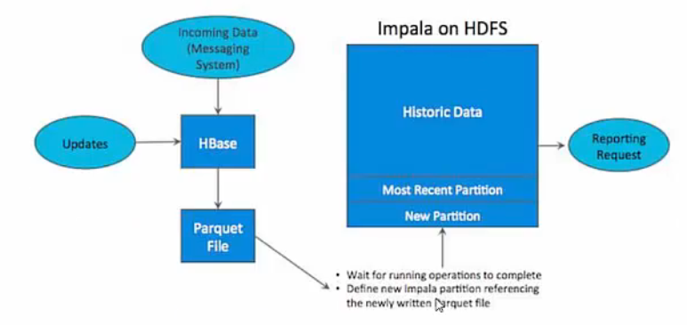

如上图所示，**数据实时写入 HBase，实时的数据更新也在 HBase 完成**，为了应对 OLAP需求，我们**定时将 HBase 数据写成静态的文件(如:Parquet)导入到 OLAP 引擎(如:Impala、hive)**。这一架构能满足既需要随机读写，又可以支持 OLAP 分析的场景，但他有如下缺点:

1. **架构复杂。**

   从架构上看，数据在 HBase、消息队列、HDFS 间流转，涉及环节太多,运维成本很高。并且每个环节需要保证高可用,都需要维护多个副本，存储空间也有一定的浪费。最后数据在多个系统上，对数据安全策略、监控等都提出了挑战。

2. **时效性低。**

   数据从 HBase 导出成静态文件是周期性的，一般这个周期是一天(或一小时)，在时效性上不是很高。

3. 难以应对后续的更新。
   
   真实场景中，总会有数据是延迟到达的。如果这些数据之前已经从 HBase 导出到 IIDFS，新到的变更数据就难以处理了，一个方案是把原有数据应用上新的变更后重写一遍，但这代价又很高。

为了解决上述架构的这些问题，KUDU 应运而生。KUDU 的定位是 FastAnalytics on Fast Data，是一个**既支持随机读写、又支持 OLAP 分析的大数据存储引擎**

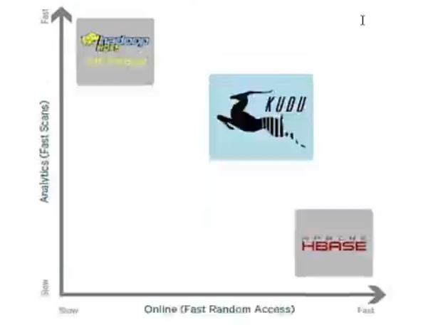

从上图可以看出，KUDU 是一个折中的产品，在 HDFS 和 HBase 这两个偏科生中平衡了随机读写和批量分析的性能。从 KUDU 的诞生可以说明一个观点:底层的技术发展很多时候都是上层的业务推动的，脱离业务的技术很可能是空中楼阁。

总结: 

**适用于那些既有随机访问，也有批量数据扫描的复合场景**

**高计算量的场景**
**使用了高性能的存储设备，包括使用更多的内存**

**支持数据更新，避免数据反复迁移**

**支持跨地域的实时数据备份和查询**

**国内使用的 kudu一些案例可以查看《构建近实时分析系统pdf》文档**


#### 架构

- Master Leader: 保管集群的元数据(表结构等等), 管理集群

- Master Follower: 只是Master Leader的备份, **不对外提供服务**

- Tablet Server: 负责最终数据的存储, 对外提供读写功能

- Table: kudu中的表, **<font color=red>每个表必须有一个全局有序的primary key, table根据分区方式(范围, hash)会被水平拆分为多个片段, 称为tablet</font>**

- Tablet: 一个 tablet 是一张 table 连续的片段(默认3个), 每个 tablet 存储着一定连续 range 的数据 (key)且 tablet 两两间的 range 不会重叠。
  **tablet 会冗余存储。**放置到多个 tablet server 上

  **<font color=red>其中一个副本被认为是 leader tablet,其余的被认之为 follower tablet。每个 tablet 都可以进行数据的读请求，但只有 Leader tablet 负责写数据请求。</font>**

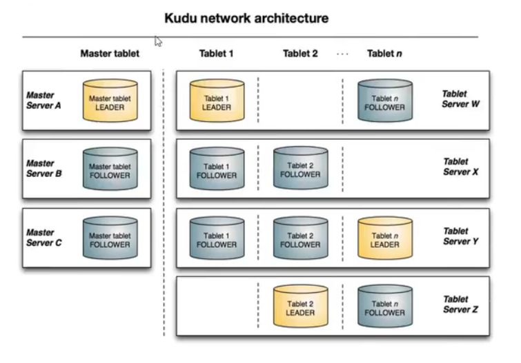

#### kudu底层数据结构

kudu的表必须要一个**唯一的主键, 可以是多个字段组合**

列可以增删, 但是primary key中的列不能删除

kudu有特定的列类型, 不想nosql都是byte, 好处是对类型进行特有的编码, 提供元数据给其他上层工具

> 底层数据结构

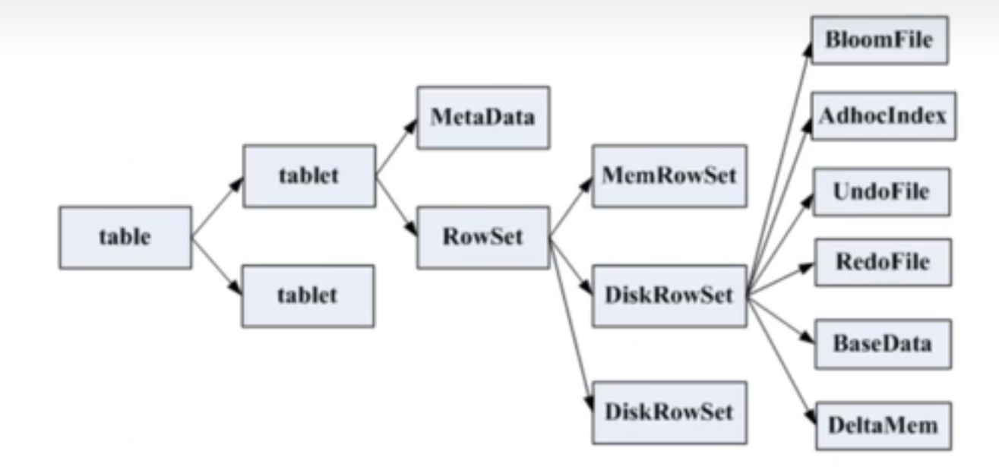

一张table 会分成若干个 tablet，每个 tablet 包括 MetaData 元信息及若千个RowSet。

RowSet 包含一个MemRowSet 及若干个DiskRowSet，DiskRowSet 中包含一个BloomFile、Ad hoc Index、BaseData、DeltaMem 及若干个RedoFile和UndoFile。

MemRowSet: 用于新数据 insert 及已在 MemRowSet 中的数据的更新，一个MemRowSet 写满后会将数据刷到磁盘形成若干个 DiskRowSet。默认是 1G 或者或者120S。

DiskRowSet:用于老数据的变更后台定期对 DiskRowSet 做 compaction，以删除没用的数据及合并历史数据，减少查询过程中的 IO 开销。

BloomFile:根据一个DiskRowSet 中的 key 生成一个 bloom filter，用于快速模糊定位某个 key 是否在 DiskRowSet 中

Ad hocIndex:是主键的索引，用于定位 key 在 DiskRowSet 中的具体哪个偏移位置

BaseData 是 MemRowSet flush 下来的数据，按列存储，按主键有序。

UndoFile 是基于 BaseData 之前时间的历史数据，通过在 BaseData 上applyUndoFile 中的记录，可以获得历史数据

RedoFile 是基于 BaseData 之后时间的变更记录,通过在 BaseData 上applyRedoFile 中的记录，可获得较新的数据。

DeltaMem 用于 DiskRowSet 中数据的变更，先写到内存中，写满后 flush 到磁盘形成 RedoFile。

REDO 与 UNDO 与关系型数据库中的 REDO  UNDO 日志类似 (在关系型数据库中，REDO 日志记录了更新后的数据，可以用来恢复尚未写入 Data File 的已成功事务更新的数据。而 UNDO 日志用来记录事务更新之前的数据，可以用来在事务失败时进行回滚)

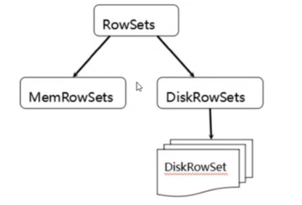

MemRowSets 可以对比理解成HBase 中的 MemStore，而 DiskRowSets 可理解成HBase 中的HFile。

MemRowSets 中的数据被 Flush 到磁盘之后,形成DiskRowSets。DisRowSets中的数据,按照32MB 大小为单位,按序划分为一个个的DiskRowSet。DiskRowSet中的数据按照 Column 进行组织，与 Parquet 类似。

这是 Kudu 可支持一些分析性查询的基础。每一个 Column 的数据被存储在一个相邻的数据区域，而这个数据区域进一步被细分成一个个的小的 Page 单元，与HBase File 中的Block 类似，对每一个Column Page 可采用一些 Encoding 算法，以及一些通用的Compression 算法。既然可对 Column Page 可采用 Encoding以及 Compression 算法，那么，对单条记录的更改就会比较困难了。

前面提到了 Kudu 可支持单条记录级别的更新/删除，是如何做到的?

与 HBase 类似，也是通过增加一条新的记录来描述这次更新/删除操作的。DiskRowSet 是不可修改了，那么 KUDU 要如何应对数据的更新呢?

在 KUDU 中把 **DiskRowSet 分为了两部分: base data、delta stores。base data 负责存储基础数据，delta stores 负责存储 base data 中的变更数据**

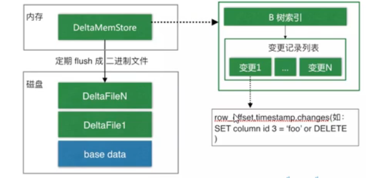

如上图所示，数据从 MemRowSet 刷到磁盘后就形成了一份 DiskRowSet(只包含 base data)，每份 DiskRowSet 在内存中都会有一个对应的DeltaMemStore，负责记录此 DiskRowSet 后续的数据变更(更新、删除)。DeltaMemStore 内部维护一个 B-树索引，映射到每个 row offset 对应的数据变更。DeltaMemStore 数据增长到一定程度后转化成二进制文件存储到磁盘，形成一个 DeltaFile，随着 base data 对应数据的不断变更，DeltaFile 逐渐增长

#### tablet发现过程

当创建 Kudur客户端时，其会从主服务器上获取 tablet 位置信息，然后直接与服务于该 tablet 的服务器进行交谈。

为了优化读取和写入路径，客户端将保留该信息的本地缓存，以防止他们在每个请求时需要查询主机的 tablet 位置信息。随着时间的推移，客户端的缓存可能会变得过时，并且当写入被发送到不再是 tablet 领导者的 tablet 服务器时，则将被拒绝。然后客户端将通过查询主服务器发现新领导者的位置来更新其缓存。

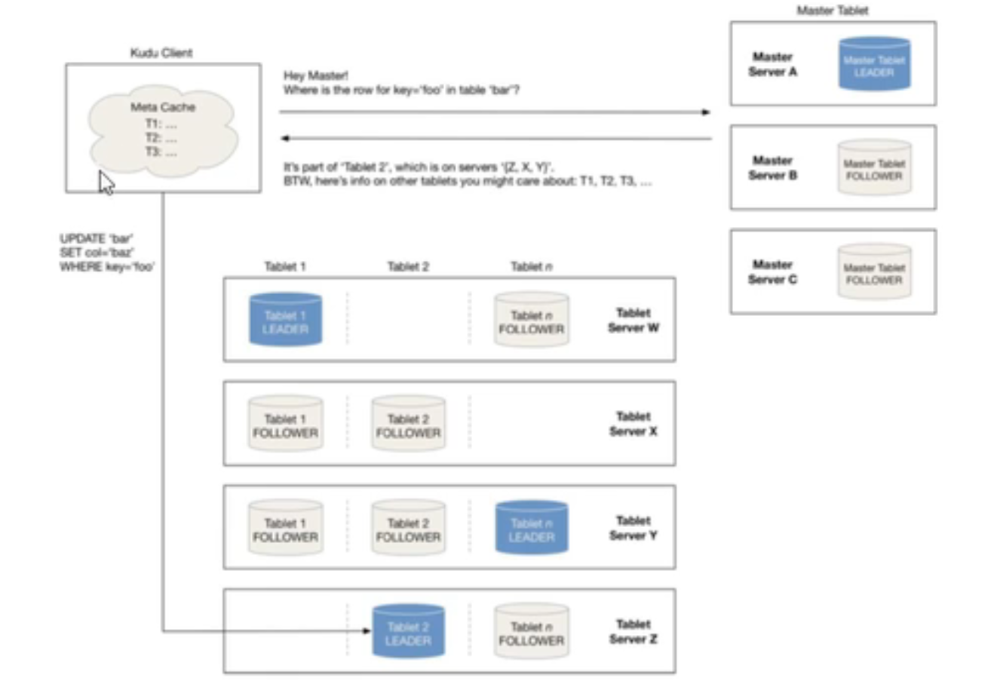

#### 分区方式

kudu表根据分区方式, 将一张表分为多个tablet, 分布在多个tablet server上

分区方式需要在建表时指定

1. range partitioning

2. hash partitioning

   通过哈希值将行分配到许多buckets上

3.  多级分区

   既使用hash分区, 在hash分区下由使用range分区


#### kudu写流程

当 Client 请求写数据时，先根据主键从 Master Server 中获取要访问的日标 Tablets，然后到依次对应的 Tablet 获取数据

因为 KUDU 表存在主键约束，所以需要进行主键是否已经存在的判断，这里就涉及到之前说的索引结构对读写的优化了。一个Tablet 中存在很多个RowSets，为了提升性能，我们要尽可能地减少要扫描的 RowSets 数量。

首先，我们先通过每个 RowSet 中记录的主键的(最大最小)范围，过滤掉一批不存在目标主键的 RowSets，然后在根据 RowSet 中的布降过滤器，过滤掉确定不存在目标主键的 RowSets，最后再通过RowSets 中的 B-树索引，精确定位目标主键是否存在。

如果主键已经存在，则报错(主键重复),否则就进行写数据(写 MemRowSet)。

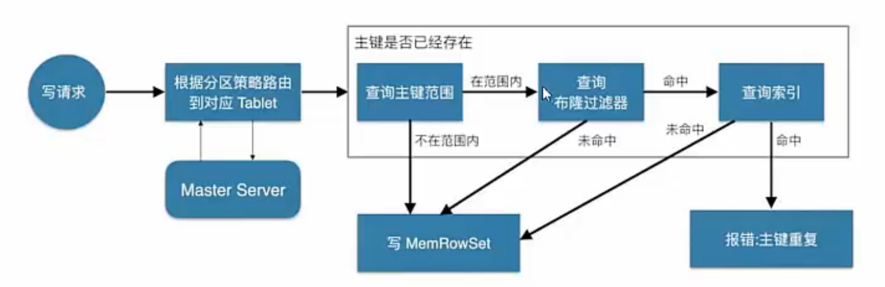

#### kudu读流程

数据读取过程大致如下: 先根据要扫描数据的主键范围，定位到日标的Tablets，然后读取 Tablets 中的 RowSets.

在读取每个 RowSet 时，先根据主键过滤要 scan 范围，然后加载范围内的base dalta, 再找到对应的delta slores, 应用所有变更, 最后union上MemRowSel中的内容，返回数据给 Client。

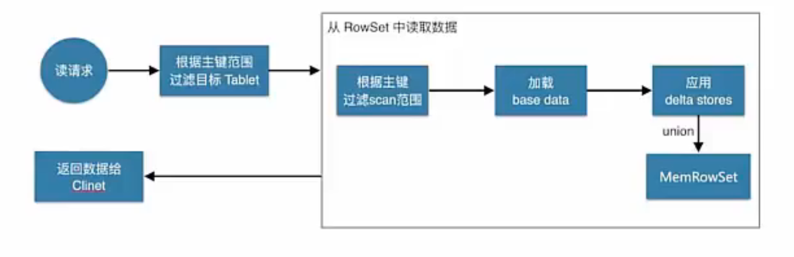

####  kudu更新流程

数据更新的核心是定位到待更新数据的位置，这块与写入的时候类似，就不展开了，等定位到具体位置后，然后将变更写到对应的 delta store 中

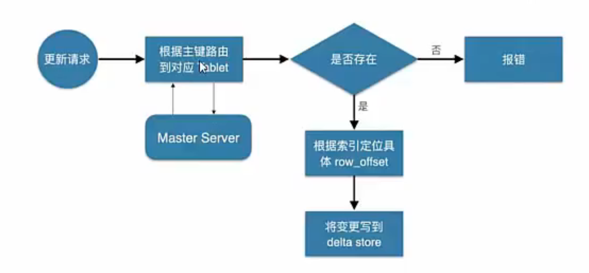

#### 安装kudu

https://www.bilibili.com/video/BV1kv411y7yL/?p=4&spm_id_from=pageDriver&vd_source=f79519d2285c777c4e2b2513f5ef101a

https://kudu.apache.org/docs/quickstart.html docker

#### java操作kudu

https://www.bilibili.com/video/BV1kv411y7yL/?p=6&spm_id_from=pageDriver&vd_source=f79519d2285c777c4e2b2513f5ef101a

#### spark操作kudu

https://www.bilibili.com/video/BV1kv411y7yL/?p=11&spm_id_from=pageDriver&vd_source=f79519d2285c777c4e2b2513f5ef101a


#### kudu集成impala

使用Impala创建新的Kudu表时，不用做多余的操作, 可以直接使用

可以将该表创建为**内部表或外部表**

> 内部表

内部表由Impala管理，当您从Impala中删除时，数据和表确实被删除。当您使用Impala创建新表时，它通常是内部表。
使用impala创建内部表:

~~~sql
-- 在CREATE TABLE 语句中，必须首先列出构成主键的列
CREATE TABLE my_first_table
(
id BIGINT,
name STRING,
PRIMARY KEY(id)
)
PARTITION BY HASH PARTITIONS 16
STORED AS KUDU
TBLPROPERTIES (
'kudu.master_addresses' = 'node1:7051,node2:7051,node3:7051',
'kudu .table_name' = 'my_first_table'
);
~~~


此时创建的表是内部表，从impala删除表的时候，在底层存储的kudu也会删除表。

~~~sql
drop table if exists my_first_table;
~~~

> 外部表

外部表不受mpala管理，并且删除此表不会将表从其源位置(Kudu)丢弃
相反，它只会去除lmpala和Kudu之间的映射
这是Kudu提供的用于将现有表映射到Impala的语法

1. 使用java创建kudu表

   ~~~java
       public void createTable() {
           String kuduMaster = "cdh01.wld.com:7051";
           KuduClient.KuduClientBuilder kuduClientBuilder = new KuduClient.KuduClientBuilder(kuduMaster);
           kuduClientBuilder.defaultOperationTimeoutMs(1800000);
           kuduClientBuilder.defaultAdminOperationTimeoutMs(1800000);
           KuduClient kuduClient = kuduClientBuilder.build();
           // 创建写session,kudu必须通过session写入
           KuduSession session = kuduClient.newSession();
           if (!kuduClient.tableExists("aaa")) {
               ArrayList<ColumnSchema> schemaColumns = new ArrayList<>();
               // 添加id列, 并指定主键
               schemaColumns.add(new ColumnSchema.ColumnSchemaBuilder("id", Type.INT32).key(true).build());
               schemaColumns.add(new ColumnSchema.ColumnSchemaBuilder("name", Type.STRING).build());
               schemaColumns.add(new ColumnSchema.ColumnSchemaBuilder("age", Type.INT32).build());
               schemaColumns.add(new ColumnSchema.ColumnSchemaBuilder("sex", Type.INT32).build());
               Schema schema = new Schema(schemaColumns);
   			// 指定表的其他属性
               CreateTableOptions tableOptions = new CreateTableOptions();
               // 指定表的分区方式和分区列
               ArrayList<String> partitionList = new ArrayList<>();
               partitionList.add("id");
               tableOptions.addHashPartitions(partitionList, 6);
               // 指定tablet的个数, 默认为3个
               tableOptions.setNumReplicas(3);
               // 创建表
               kuduClient.createTable(tableName, schema, tableOptions);
           session.close();
           kuduClient.close();
           }
   ~~~

2. 创建kudu表和impala的映射

   ~~~sql
   create external table `Student` stored as kudu
   tblproperties(
       'kudu.table_name' = 'Student',
       'kudu.master_address' = 'node-1:7051,node-2:7051,node-3:7051'
   )
   ~~~

> 其他操作

1. 重命名impala表

   ```sql
   alter table person rename to person_temp
   ```

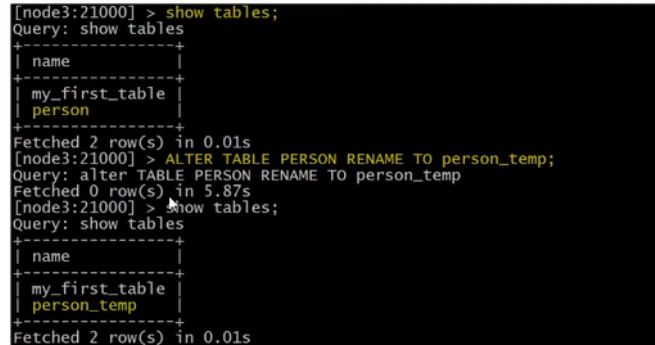

2. 从新命名 内部表依赖的kudu表

   ~~~sql
   -- 创建内部表
   CREATE TABLE kudu_student
   CompanyId INT,
   WorkId INT,
   Name STRING,
   Gender STRING,
   Photo STRING,
   PRIMARY KEY(CompanyId)
   )
   PARTITION BY HASH PARTITIONS 16
   STORED AS KUDU
   TBLPROPERTIES (
   'kudu.master_addresses' = 'node1:7051,node2:7051,node3:7051',
   'kudu.table name' = 'student'
   )
   -- 重新命名kudu_student依赖的底层kudu表
   ALTER TABLE kudu_student SET TBLPROPERTIES('kudu.table_name' = 'new-student');
   ~~~

3. 将外部表重新映射到不同的kudu表上

   ~~~sql
   -- 创建外部表
   CREATE EXTERNAL TABLE externa1_table
   STORED AS KUDU
   TBLPROPERTIES (
   'kudu.master_addresses' = 'node1:7051,node2:7051,node3:7051',
   'kudu.table_name' = 'person'
   )
   -- 重新映射外部表，指向不同的kudu表:
   ALTER TABLE externaT_table
   SET TBLPROPERTIES('kudu.table_name' ='hashTable')
   ~~~

4. 修改kudu master地址

   ~~~sql
   ALTER TABLE externaT_table
   SET TBLPROPERTIES(
   'kudu.master_addresses' = 'node1:7051,node2:7051,node3:7051')
   ~~~

5. 将内部表转换为外部表

   ~~~sql
   ALTER TABLE externaT_table
   SET TBLPROPERTIES(
   'external'='true')
   ~~~

#### java操作impala间接操作kudu

https://www.bilibili.com/video/BV1kv411y7yL/?p=15&spm_id_from=pageDriver&vd_source=f79519d2285c777c4e2b2513f5ef101a

比较无聊, 就是原始的jdbc

1. 依赖

   ~~~xml
   <!-- impala 的 jdbc 操作-->
   <dependency>
   	<groupld>com.cloudera</groupld>
   	<artifactld>ImpalaJDBC41</artifactld>
   	<version>2.5.42</version>
   </dependency>
   <!--Caused by : ClassNotFound : thriftprotocol.TPro-->
   <dependency>
   	<groupld>orgapache.thrift</groupld>
   	<artifactld>libfb303</artifactld>
   	<version>0.9.3</version>
   	<type>pom</type>
   </dependency>
   <!-- Caused by : ClassNotFound : thrift.protocol.TPro -->
   <dependency>
   	<groupld>orgapache.thrift</groupld>
       <artifactld>libthrift</artifactld>
   	<version>0.9.3</version>
   	<type>pom</type>
   </dependency>
   <dependency>
   	<groupld>orgapache.hive</groupld>
       <artifactld>hive-jdbc</artifactld>
   	<exclusions>
           <exclusion>
   			<groupid>org.apache.hive</groupid>
               <artifactld>hive-service-rpc</artifactld>
   		</exclusion>
           <exclusion>
               <groupld>org.apache.hive</groupld>
               <artifactld>hiveservice</artifactld> 
   		</exclusion>
   	</exclusions>
   	<version>1.1.0</version>
   </dependency>
   <!导入 hive-->
   <dependency>
   	<groupid>org.apache.hive</groupid>
       <artifactld>hive-service</artifactld>
       <version>1.1.0</version>
   </dependency>
   ~~~

   

   


