## CentOS 常用命令:

#### firewall

查看是否开启防火墙:

```txt
firewall-cmd --state
```

查看已经开放的端口：

```
firewall-cmd --list-ports
```

开启端口

```txt
firewall-cmd --zone=public --add-port=80/tcp --permanent
命令含义：

–zone #作用域

–add-port=80/tcp #添加端口，格式为：端口/通讯协议

–permanent #永久生效，没有此参数重启后失效
```

重启防火墙

```
firewall-cmd --reload #重启firewall

systemctl stop firewalld.service #停止firewall

systemctl disable firewalld.service #禁止firewall开机启动

firewall-cmd --state #查看默认防火墙状态（关闭后显示notrunning，开启后显示running）
```

#### 开启关闭服务

```
systemctl stop firewalld.service
systemctl disable firewalld.service`
```


##  Linux常用命令

### Ubuntu软件安装位置

- 安装目录: /usr/share
- 可执行文件: /usr/sbin, /usr/bin
- 配置文件: /etc
- lib文件: /usr/lib
- 日志文件: /var/log

### Vim命令

整页翻页 ctrl-f ctrl-b
f就是forword b就是backward

翻半页
ctrl-d ctlr-u
d=down u=up

光标跳到下一行 ctrl+j

光标跳到下一行 ctrl+p


### 不同文件类型文件名颜色不同

蓝 色：文件夹  
红色：压缩文件   
绿色：可执行文件   
白色：文本文件
红色闪烁：错误的符号链接
淡蓝色：符号链接
黄色：设备文件
灰色:其它文件


可以使用dircolors -p 查看具体的文件类型对应的颜色


### systemctl命令

systemctl list-units            ##列出当前系统服务的状态

systemctl list-unit-files       ##列出服务的开机状态

systemctl status sshd           ##查看指定服务的状态

systemctl stop sshd             ##关闭指定服务

systemctl start sshd            ##开启指定服务

systemctl restart sshd          ##从新启动服务

systemctl enable sshd           ##设定指定服务开机开启

systemctl disable sshd          ##设定指定服务开机关闭

systemctl reload sshd           ##使指定服务从新加载配置

systemctl list-dependencies sshd    ##查看指定服务的倚赖关系

systemctl mask  sshd            ##冻结指定服务

systemctl unmask sshd           ##启用服务

systemctl set-default multi-user.target ##开机不开启图形

systemctl set-default graphical.target  ##开机启动图形


### 查看端口占用

```shell
# 用于查看某一端口的占用情况
lsof -i:端口号
#lsof -i 需要 root 用户的权限来执行(sudo)

#用于查看指定的端口号的进程情况，如查看8000端口的情况
netstat -tunlp |grep 端口号
netstat -ant查看所有被监听的端口
```

#### 实例

```shell
# lsof -i:8000
COMMAND   PID USER   FD   TYPE   DEVICE SIZE/OFF NODE NAME
nodejs  26993 root   10u  IPv4 37999514      0t0  TCP *:8000 (LISTEN)
```


### chmod 修改文件访问权限

####  修改某类用户对于文件的权限

```shell
#格式
chmod [ u / g / o / a ] [ + / - / = ] [ r / w / x ]  filename
# ” * ” 为通配符，表示对当前所在目录下的所有文件(包括目录)做权限修改操作

[ u / g / o / a ] 为权限范围，其中 
u：User，即文件或目录的拥有者 
g：Group，即文件或目录的所属群组 
o：Other，除了文件或目录拥有者和所属群组外，其他用户都属于这个范围 
a：All，即全部用户

权限操作 
+表示增加权限 
-表示取消权限 
=表示取消之前的权限，并给予唯一的权限

权限代号 
r：读取权限，数字代号为 “4” 
w：写入权限，数字代号为 “2” 
x：执行权限，数字代号为 “1” 
-：不具备任何权限，数字代号为 “0”

file,文件名（路径）

#案例
#修改所属群组对nginx.conf的访问权限为 rw
sudo chmod g=rw nginx.conf

#给其他人加上nginx.conf的rw权限
sudo chmod o+rw nginx.conf

#给其他人加上对当前目录下所有文件的w权限
sudo chmod o+w *
```


#### 同时制定三类用户的权限

```shell
chmod 权限 filename

# 给nginx.conf文件指定777的权限
sudo chmod 777 nginx.conf

sudo chmod 774 *

# -R 处理指定目录及子目录下的所有文件
sudo chmod -R 774 /code/
```

#### 查看文件 more

- Enter 向下n行，需要定义。默认为1行
- 空格键 向下滚动一屏
- b 返回上一屏
- V 调用vi编辑器
- !命令 调用Shell，并执行命令
- q 退出more


## 用户和用户组管理

### 1. 用户配置文件

#### 1.1 用户信息文件/etc/passwd


使用 man 5 passwd(不用指定路径) 来查看帮助文档


- 第一个字段: 用户名称

- 第二个字段: 密码标识

  如果该字段为"x", 则该用户有密码, 加密密码存于/etc/shadow文件中

  如果该字段为空, 则该用户没有密码, 可以直接登录, 但是没有密码的用户只能本地登录, 不能远程登录

- 第三字段: UID(用户id)

  - 0:		                超级用户

  - 1-499:                 系统用户(伪用户), 类似于npc, 不能登录, 不能删除

  - 500(1000)-65535:        普通用户, 根据版本不同开始序列不同, centos7从1000开始

    **可以将一个用户的uid改为0, 这样系统会将其视为管理员**

- 第四个字段: GID (用户初始组id), **用户组可以分为初始组和附加组**

  - 初始值:  用户一登录就立刻拥有这个用户组的相关权限, 每个用户的初始组只能有一个, 即用户创建的时候会为该用户创建一个同用户名的组作为该用户初始组
  - 附加组: 用户可以加入多个其他的用户组, 并拥有这些组的权限, 附加组可以有多个

- 第五个字段: 用户的备注或者说明信息

- 第六个字段: 用户主目录(家目录),  默认为/home/用户名/, 超级用户家目录为/root/

- 第七个字段: 可选的命令解释器(shell)

    

#### 1.2 影子文件/etc/shadow

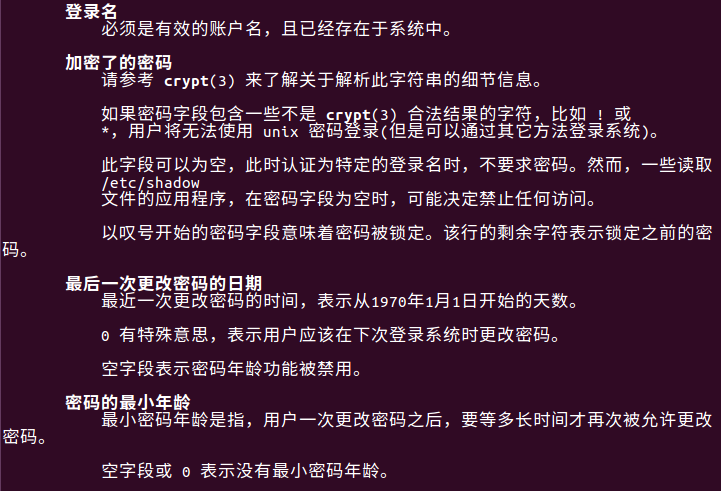

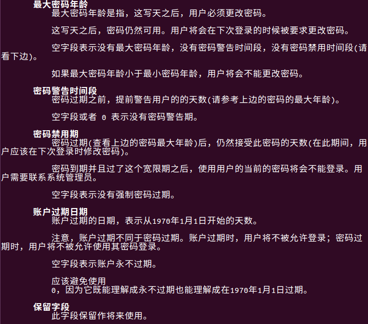

#### 1.3 组信息文件/etc/group


用户列表是该组的附加用户, 这个字段中无法看到该组的初始用户

#### 1.4 组密码文件/etc/gshadow


### 2. 用户管理相关文件

#### 2.1 用户的家目录

- 普通用户: /home/用户名, 所有者和所属组都是此用户, 权限是700
- 超级用户: /root/, 所有者和所属组都是root用户, 权限是500

#### 2.2 用户邮箱: /var/spool/main/用户名


### 3. 用户管理命令

#### 3.1 用户添加命令useradd


#### 3.2 修改用户密码passwd

- root修改其他用户密码: passwd angerwind
- 普通用户修改自己密码: passwd
- passwd -l angerwind:  暂时锁定angerwind用户, 该操作仅root可做
- passwd -u angerwind: 解锁用户, 仅root可用

#### 3.3 修改用户信息usermod


#### 3.4 修改用户密码状态change

#### 3.5 删除用户userdel

userdel -r angerwind : 删除一个用户同时删除一个该用户的家目录

#### 3.6 用户切换命令su


su - root: 连带环境切换用户

su -root -c "useradd user":  不切换用户的情况下借用root的身份执行一次命令

#### 3.7 查看用户UID, GID和附加组

- id: 查看当前用户

- id 用户名: 查看指定用户信息

  

### 4. 用户组管理命令

#### 4.1 添加用户组


#### 4.2 修改组信息


#### 4.3 删除用户组

groupdel 组名

**当该组是某个用户的初始组时, 该组不能删除**

#### 4.4 把用户添加入组或者从组中删除

```sell
gpasswd [选项] 用户名 组名
-a  把用户加入组
-d  把用户从组中删除
```


## Linux ssh命令

SSH(远程连接工具)连接原理：**ssh服务是一个守护进程(demon)，系统后台监听客户端的连接，ssh服务端的进程名为sshd,负责实时监听客户端的请求(IP 22端口)，包括公共秘钥等交换等信息。**

ssh服务端由2部分组成： openssh(提供ssh服务)    openssl(提供加密的程序)

ssh的客户端可以用 XSHELL，Securecrt, Mobaxterm等工具进行连接


格式: ssh [command] user@xx.xx.xx.xx

参数: 

- -i 指定私钥
- -v 看起debug模式, 打印详细链接信息
- -p 指定服务端的端口, 默认在22


#### 生成密钥对

1. 生成密钥对, 使用命令ssh-keygen -t rsa. 其中-t为type, 生成密钥使用的算法, 还可以使用dsa算法生成

   

2. 生成的密钥对默认保存在~/.ssh目录下, 公钥为id_rsa.pub, 私钥为id_rsa

3. 把这个密钥对中的公共密钥复制到你要访问的机器上去，并保存为

   ~/.ssh/authorized_keys

   使用scp命令:scp ~/.ssh/id_rsa.pub rh1:/home/user1/.ssh/authorized_keys

### scp复制命令

1. **scp 命令用于 Linux 之间复制文件和目录**。scp 是加密的

   scp 是 secure copy 的缩写, **scp 是 linux 系统下基于 ssh 登陆进行安全的远程文件拷贝命令。**

   

   格式:  scp [可选参数] [user1@host1]:file1  [user2@host2:]file2

   

##  yum源更换为163

#### 1. 备份

mv /etc/yum.repos.d/CentOS-Base.repo /etc/yum.repos.d/CentOS-Base.repo.backup

#### 2、下载新的CentOS-Base.repo 到/etc/yum.repos.d/

wget -O /etc/yum.repos.d/CentOS-Base.repo http://mirrors.163.com/.help/CentOS6-Base-163.repo

#### 3. 生成缓存

yum clean all

yum makecache

https://juejin.im/editor/post/5e593407518825495a2779de

https://juejin.im/editor/posts/5e593407518825495a2779de

## Linux 命令使用

#### 查看端口占用

~~~shell
# 查看8080端口的占用
lsof -i:8080
~~~

#### gz压缩包

- 解压

  gzip -d fileName

- 压缩

  gzip fileName

- 查看文件压缩内容

  zcat fileName, 可结合管道使用

- 不解压直接搜索压缩文件

  zgrep 模式 文件名

  ~~~shell
  # 在压缩文件中直接搜索字符a
  zgrep a /root.gz
  ~~~

  

#### 压缩、解压、tar命令

> 常见的压缩文件压缩和解压缩

| 文件后缀名 | 说明                           | 压缩                              | 解压缩                    |
| ---------- | ------------------------------ | --------------------------------- | ------------------------- |
| *.zip      | zip 程序打包压缩的文件         | zip fileName.zip dirName          | unzip fileName.zip        |
| *.rar      | rar 程序压缩的文件             | rar a fileName.rar dirName        | rar x fileName.rar        |
| *.7z       | 7zip 程序压缩的文件            | 7z a fileName.7z dirName          | 7z x fileName.7z          |
| *.tar      | tar 程序打包，未压缩的文件     | tar cvf fileName.tar dirName      | tar xvf fileName.tar      |
| *.gz       | gzip 程序 (GNU zip) 压缩的文件 | gzip fileName                     | gzip -d fileName.gz       |
| *.bz2      | tar 打包，gzip 程序压缩的文件  | bzip2 -z FileName                 | bzip2 -d FileName.bz2     |
| *.tar.gz   | tar打包，gzip程序压缩的文件    | tar zcvf FileName.tar.gz dirName  | tar zxvf FileName.tar.gz  |
| *.tar.xz   | tar打包，xz程序压缩的文件      | tar cvJf fileName.tar.xz dirName  | tar -xvJf fileName.tar.xz |
| *.tar.bz2  | tar打包，bzip2程序压缩的文件   | tar jcvf FileName.tar.bz2 dirName | tar jxvf FileName.tar.bz2 |
| *.Z        | compress命令解压缩rar文件      | compress fileName                 | uncompress fileName.Z     |

> 参数

必选参数：

- -c：建立一个压缩文件的参数指令(create 的意思)；   
- -x：解开一个压缩文件的参数指令！  
- -t：查看 tarfile 里面的文件！   
- -r：向压缩归档文件末尾追加文件   
- -u：更新原压缩包中的文件   

可选参数：

- -z：有gzip属性,即需要用 gzip 压缩   
- -j：有bz2属性,即需要用 bzip2 压缩   
- -Z：有compress属性的   
- -v ：压缩的过程中显示文件(显示所有过程)！这个常用，但不建议用在背景执行过程！   
- -O：将文件解开到标准输出   
- -f ：使用档名，请留意，在 f 之后要立即接档名！不要再加参数！       例如：使用『 tar -zcvfP tfile sfile』就是错误的写法，要写成『 tar -zcvPf tfile sfile』才对喔！  -p ：使用原文件的原来属性（属性不会依据使用者而变）   
- -P ：可以使用绝对路径来压缩！   
- -N ：比后面接的日期(yyyy/mm/dd)还要新的才会被打包进新建的文件中！   --exclude FILE：在压缩的过程中，不要将 FILE 打包！     
- -f: 使用档案名字，切记，这个参数是最后一个参数，后面只能接档案名。 
- -C：指定目录

> 解压

~~~shell
# 将/source/kernel.tgz解压到 /source/linux-2.6.29 目录
tar zxvf /source/kernel.tgz -C /source/linux-2.6.29

tar –xvf file.tar         // 解压 tar包  
tar -zxvf file.tar.gz     // 解压tar.gz  
tar -jxvf file.tar.bz2    // 解压 tar.bz2  
tar –Zxvf file.tar.Z      // 解压tar.Z  
~~~

> 压缩

~~~shell
# 将linux-2.6.29 目录压缩到 kernel.tgz
tar -czvf kernel.tgz linux-2.6.29

# 将目录里所有jpg文件打包成tar.jpg  
tar -cvf jpg.tar *.jpg       

# 将目录里所有jpg文件打包成jpg.tar后，并且将其用gzip压缩，生成一个gzip压缩过的包，命名为jpg.tar.gz  
tar –czf jpg.tar.gz *.jpg   

# 将目录里所有jpg文件打包成jpg.tar后，并且将其用bzip2压缩，生成一个bzip2压缩过的包，命名为jpg.tar.bz2 
tar –cjf jpg.tar.bz2 *.jpg 

# 将目录里所有jpg文件打包成jpg.tar后，并且将其用compress压缩，生成一个umcompress压缩过的包，命名为jpg.tar.Z  
tar –cZf jpg.tar.Z *.jpg     
~~~

> 查看

~~~shell
# 列出压缩包中所有文件
tar -tf aaa.tar.gz
~~~

#### ps命令

选项：

- a：显示一个终端的所有进程，除会话引线外；
- u：显示进程的归属用户及内存的使用情况；
- x：显示没有控制终端的进程；
- -a：显示同意终端下所有进行
- -A:  显示所有进程
- -l：长格式显示更加详细的信息；
- -e：显示所有进程，等于-A；
- -u：指定用户的所有进程

~~~shell
# 显示所有进程
ps aux

USER PID %CPU %MEM  VSZ  RSS   TTY STAT START TIME COMMAND
root   1  0.0  0.2 2872 1416   ?   Ss   Jun04 0:02 /sbin/init
root   2  0.0  0.0    0    0   ?    S   Jun04 0:00 [kthreadd]

USER	该进程是由哪个用户产生的。
PID	进程的 ID。
%CPU	该进程占用 CPU 资源的百分比，占用的百分比越高，进程越耗费资源。
%MEM	该进程占用物理内存的百分比，占用的百分比越高，进程越耗费资源。
VSZ	该进程占用虚拟内存的大小，单位为 KB。
RSS	该进程占用实际物理内存的大小，单位为 KB。
TTY	该进程是在哪个终端运行的。
STAT	进程状态。
START	该进程的启动时间。
TIME	该进程占用 CPU 的运算时间，注意不是系统时间。
COMMAND	产生此进程的命令名。
~~~

~~~shell
# 显示指定用户进程
ps -u root
~~~

~~~shell
# 显示所有进程信息，连同命令行
ps -ef 
~~~

~~~shell
ps -le
~~~

#### man命令查看帮助文档

man命令是Linux下最核心的命令之一。而man命令也并不是英文单词“man”的意思，它是单词**manual**的缩写，即使用手册的意思。


**man手册页文件存放在/usr/share/man目录下。**


Linux的man手册共有以下几个章节：

| 代號 | 代表內容                                                     |
| ---- | ------------------------------------------------------------ |
| 1    | Executable programs or shell commands<br/> 使用者在shell中可以操作的指令或可执行档 |
| 2    | System calls (functions provided by the kernel)<br/>系統核心可呼叫的函数与工具等 |
| 3    | Library calls (functions within program libraries)<br/>一些常用的函数(function)与函数库(library)，大部分是C的函数库(libc) |
| 4    | Special files (usually found in /dev)<br/>装置档案的说明，通常在/dev下的档案 |
| 5    | File formats and conventions eg /etc/passwd<br/>设定档或者是某些档案的格式 |
| 6    | Games<br/>游戏                                               |
| 7    | Miscellaneous (including macro packages and conventions), e.g. man(7), groff(7)<br/>惯例与协定等，例如Linux档案系统、网络协定、ASCII code等等的說明 |
| 8    | System administration commands (usually only for root)<br/>系統管理員可用的管理指令 |
| 9    | Kernel routines [Non standard]<br>跟kernel有关的文件         |

我们输入`man ls`，它会在最左上角显示“LS（1）”，在这里，“LS”表示手册名称，而“（1）”表示该手册位于第一节章，表示可执行命令。

**man是按照手册的章节号的顺序进行搜索的**，比如：

```
man sleep
```

只会显示sleep命令的手册,如果想查看库函数sleep，就要输入:

```
man 3 sleep
```

> 选项

- -a：在所有的man帮助手册中搜索

  ~~~shell
  man -a sleep
  ~~~

  显示sleep(1)按q推出后将会询问还有sleep(3)是否查看

  

- -w：显示手册所在位置

  man -w只会显示搜索到的第一个文档的位置

  man -aw显示搜索到的全部文档的位置

  


#### shell输入输出重定向

输入输出类型：

| 类型                        | 文件描述符 | 默认情况               | 对应文件句柄位置 |
| :-------------------------- | :--------- | :--------------------- | :--------------- |
| 标准输入（standard input）  | 0          | 从键盘获得输入         | /proc/self/fd/0  |
| 标准输出（standard output） | 1          | 输出到屏幕（即控制台） | /proc/self/fd/1  |
| 错误输出（error output）    | 2          | 输出到屏幕（即控制台） | /proc/self/fd/2  |

> 重定向输出

| 命令                | 介绍                                                         |
| :------------------ | :----------------------------------------------------------- |
| command >filename   | 把标准输出重定向到新文件中(**删除文件再新建再写入**, 等于**覆盖**内容)（**没有文件新建**） |
| command 1>filename  | 同上                                                         |
| command >>filename  | 把标准输出**追加**到文件中（**没有文件新建**）               |
| command 1>>filename | 同上                                                         |
| command 2>filename  | 把标准错误重定向到新文件中                                   |
| command 2>>filename | 把标准错误追加到新文件中                                     |

案例：

~~~shell
$ ls
Dockerfile
$ ls Dockerfile a.txt
ls: cannot access a.txt: No such file or directory
Dockerfile
~~~

上面命令，我们目录下只有Dockerfile一个文件， 使用`ls Dockerfile a.txt`命令以后，`ls: cannot access a.txt: No such file or directory`是错误输出，`Dockerfile`是标准输出。所以我们可以将错误内容输出到error.txt文件中，把标准输出输入到stadand.txt文件中。

~~~shell
$ ls Dockerfile a.txt > error.txt 2>error.txt
~~~

~~~shell
# 把"hello world输入到a.txt中"
echo "hello world" > a.txt
~~~


> 输入重定向

| 命令                | 介绍                                      |
| :------------------ | :---------------------------------------- |
| command <filename   | 以filename文件作为标准输入                |
| command 0<filename  | 同上                                      |
| command <<delimiter | 从标准输入中读入，直到遇到delimiter分隔符 |

案例：

~~~shell
# 从标准输入中读取，直到遇到结束符， <<后面的是自定义的结束符
$ cat >a.txt  <<end
hello
world
end

$ cat a.txt 
hello
world
~~~

> 高级用法(https://blog.csdn.net/qq_31073871/article/details/80810306)

**>/dev/null**

这条命令的作用是将标准输出1重定向到`/dev/null`中。 `/dev/null`代表linux的空设备文件，所有往这个文件里面写入的内容都会丢失，俗称“黑洞”。那么执行了`>/dev/null`之后，标准输出就会不再存在，没有任何地方能够找到输出的内容。

**2  >&1**

这条命令用到了重定向绑定，采用&可以将两个输出绑定在一起。这条命令的作用是**将错误输出输入到标准输出**

2>&1，可以这样理解：按照前面讲解的知识，“2>”表示要把标准错误信息进行重定向，一般来说，重定向的目标是某个文件，而这条语句把重定向的目标设置成了文件描述符1的输入了，也即“&1”，也即，fd2的输出会被送到fd1的输入中去，后果就是，fd2的输入从fd1的输出口送了出来，流程是这样的：fd2输入 -> fd2输出 -> fd1的输入 -> fd的输出。

linux在执行shell命令之前，就会**确定好所有的输入输出位置，并且从左到右依次执行重定向的命令**，所以`>/dev/null 2>&1`的作用就是让标准输出重定向到`/dev/null`中（丢弃标准输出），然后错误输出由于重用了标准输出的描述符，所以错误输出也被定向到了`/dev/null`中，错误输出同样也被丢弃了。执行了这条命令之后，该条shell命令将不会输出任何信息到控制台，也不会有任何信息输出到文件中。

**>/dev/null 2>&1 和 2>&1 >/dev/null**

乍眼看这两条命令貌似是等同的，但其实大为不同。刚才提到了，linux在执行shell命令之前，就会确定好所有的输入输出位置，并且从左到右依次执行重定向的命令。

那么我们同样从左到右地来分析`2>&1 >/dev/null`：`2>&1`，将错误输出绑定到标准输出上。由于此时的标准输出是默认值，也就是输出到屏幕，所以错误输出会输出到屏幕。`>/dev/null`，将标准输出1重定向到`/dev/null`中。

**>/dev/null 2>&1 和 >/dev/null 2>/dev/null**

那么可能会有些同学会疑问，为什么要用重定向绑定，而不是像`>/dev/null 2>/dev/null`这样子重复一遍呢。

为了回答这个问题，我们回到刚才介绍输出重定向的场景。我们尝试将标准输出和错误输出都定向到out文件中：

```
# ls a.txt b.txt >out 2>out
# cat out
a.txt
无法访问b.txt: 没有那个文件或目录
```

WTF？竟然出现了乱码，这是为啥呢？这是因为采用这种写法，标准输出和错误输出会抢占往out文件的管道，所以可能会导致输出内容的时候出现缺失、覆盖等情况。现在是出现了乱码，有时候也有可能出现只有error信息或者只有正常信息的情况。不管怎么说，采用这种写法，最后的情况是无法预估的。

而且，由于out文件被打开了两次，两个文件描述符会抢占性的往文件中输出内容，所以整体IO效率不如`>/dev/null 2>&1`来得高。


#### 环境变量与export

> Linux环境变量分类

一、按照生命周期来分，Linux环境变量可以分为两类：
 1、永久的：需要用户修改相关的配置文件，变量永久生效。
 2、临时的：用户利用export命令，在当前终端下声明环境变量，关闭Shell终端失效。

二、按照作用域来分，Linux环境变量可以分为：
 1、系统环境变量：系统环境变量对该系统中所有用户都有效。
 2、用户环境变量：顾名思义，这种类型的环境变量只对特定的用户有效。

>  Linux设置环境变量的方法

一、在`/etc/profile`文件中添加变量 **对所有用户生效（永久的）**
 用vim在文件`/etc/profile`文件中增加变量，该变量将会对Linux下所有用户有效，并且是“永久的”。
 例如：编辑/etc/profile文件，添加CLASSPATH变量

```bash
  vim /etc/profile    
  export CLASSPATH=./JAVA_HOME/lib;$JAVA_HOME/jre/lib
```

注：修改文件后要想马上生效还要运行`source /etc/profile`不然只能在下次重进此用户时生效。


 二、在用户目录下的.bash_profile文件中增加变量 **【对单一用户生效（永久的）】**
 用`vim ~/.bash_profile`文件中增加变量，改变量仅会对当前用户有效，并且是“永久的”。

```bash
vim ~/.bash.profile
export CLASSPATH=./JAVA_HOME/lib;$JAVA_HOME/jre/lib
```

注：修改文件后要想马上生效还要运行$ source ~/.bash_profile不然只能在下次重进此用户时生效。


 三、直接运行export命令定义变量 **【只对当前shell（BASH）有效（临时的）】**
 在shell的命令行下直接使用`export 变量名=变量值`
 定义变量，该变量只在当前的shell（BASH）或其子shell（BASH）下是有效的，shell关闭了，变量也就失效了，再打开新shell时就没有这个变量，需要使用的话还需要重新定义。


#### awk

功能：逐行扫描文件，寻找含有目标文本的行，如果匹配成功，则会在该行上执行用户想要的操作；反之，则不对行做任何处理。

格式：用来指定脚本命令可以作用到文本内容中的具体行，可以使用字符串（**比如 /demo/，表示查看含有 demo 字符串的行**）或者正则表达式指定。另外需要注意的是，整个脚本命令是用单引号''括起，而其中的执行命令部分需要用大括号{}括起来。

在 awk 程序执行时，如果没有指定执行命令，则默认会把匹配的行输出；如果不指定匹配规则，则默认匹配文本中所有的行。

~~~shell
 awk [选项] '匹配规则{执行命令}' 文件名
~~~

选项：

| 选项       | 含义                                                         |
| ---------- | ------------------------------------------------------------ |
| -F fs      | 指定以 fs 作为输入行的分隔符，awk 命令**默认分隔符为空格或制表符**。 |
| -f file    | 从脚本文件中读取 awk 脚本指令，以取代直接在命令行中输入指令。 |
| -v var=val | 在执行处理过程之前，设置一个变量 var，并给其设备初始值为 val。 |

默认情况下，awk 会将如下变量分配给它在文本行中发现的数据字段：

- $0 代表整个文本行；
- $1 代表文本行中的第 1 个数据字段；
- $2 代表文本行中的第 2 个数据字段；
- $n 代表文本行中的第 n 个数据字段。

前面说过，**在 awk 中，默认的字段分隔符是任意的空白字符（例如空格或制表符）。 在文本行中，每个数据字段都是通过字段分隔符划分的。awk 在读取一行文本时，会用预定义的字段分隔符划分每个数据字段。**

例子：

~~~shell
[root@localhost ~] cat data2.txt
One line of test text.
Two lines of test text.
Three lines of test text.
[root@localhost ~] awk '{print $1}' data2.txt
One
Two
Three
~~~

~~~shell
docker ps -a | awk '/elasticsearch/{print $1}' # 执行docker ps -a，然后显示所有跟es有关的容器的id

docker ps -a | awk '/elasticsearch/{print "docker rm "$1}' | sh # 删除所有跟es有关的容器
~~~


#### shell $(),${}

> 1、在 bash shell 中，$()是将括号内命令的执行结果赋值给变量：

```shell
#将命令 ls 赋值给变量 a
$ a=$(ls)
$ echo $a
a.sh data.sh results.txt
```

~~~shell
# 将$()中计算的结果给docker rm, 所以这里是删除所有跟es有关的容器
docker rm $(docker ps -a | awk '/elasticsearch/{print $1}')
~~~

>  2、${} 是用来作变量替换。一般情况下，$var 与 ${var} 并没有啥不一样。但是用 ${ } 会比较精确的界定变量名称的范围：

```bash
$ A=B
#目的想打印变量A，然后再加上一个B，结果返回无。
$ echo $AB
#此时，${ }可以较为精确的确定变量的范围
$ echo ${A}B
BB
```

#### watch

在Linux下，watch是周期性的执行下个程序，并全屏显示执行结果。

命令格式：`watch` `[参数]` `[命令]`

多个命令使用''引器来

-n或--interval watch缺省每2秒运行一下程序，可以用-n或-interval来指定间隔的时间。

-d或--differences 用-d或--differences 选项watch 会高亮显示变化的区域。 而-d=cumulative选项会把变动过的地方(不管最近的那次有没有变动)都高亮显示出来。

~~~shell
# 每隔一秒高亮显示http链接数的变化情况
watch -n 1 -d 'pstree|grep http'
~~~

#### top

https://man.linuxde.net/top

**top命令**可以实时动态地查看系统的整体运行情况，是一个综合了多方信息监测系统性能和运行信息的实用工具。通过top命令所提供的互动式界面，用热键可以管理。

> 语法 

```
top(选项)
```

> 选项 

- -b：以批处理模式操作；
- -c：显示完整的进程运行命令；
- **-d：屏幕刷新间隔时间；**
- -I：忽略失效过程；
- -s：保密模式；
- -S：累积模式；
- -i<时间>：设置间隔时间；
- **-u<用户名>：指定用户名；**
- **-p<进程号>：指定进程；**
- -n<次数>：循环显示的次数。

> top交互命令 

在top命令执行过程中可以使用的一些交互命令。这些命令都是单字母的，如果在命令行中使用了-s选项， 其中一些命令可能会被屏蔽。

- **h：显示帮助画面，给出一些简短的命令总结说明；**
- **k：终止一个进程；**
- i：忽略闲置和僵死进程，这是一个开关式命令；
- **q：退出程序；**
- r：重新安排一个进程的优先级别；
- S：切换到累计模式；
- **s：改变两次刷新之间的延迟时间（单位为s），如果有小数，就换算成ms。输入0值则系统将不断刷新，默认值是5s；**
- f或者F：从当前显示中添加或者删除项目；
- o或者O：改变显示项目的顺序；
- l：切换显示平均负载和启动时间信息；
- m：切换显示内存信息；
- t：切换显示进程和CPU状态信息；
- **c：切换显示命令名称还是完整命令行；同-c参数**
- **M：根据驻留内存大小进行排序；**
- **P：根据CPU使用百分比大小进行排序；**
- T：根据时间/累计时间进行排序；
- w：将当前设置写入~/.toprc文件中。

> 实例 

```
top - 09:44:56 up 16 days, 21:23,  1 user,  load average: 9.59, 4.75, 1.92
Tasks: 145 total,   2 running, 143 sleeping,   0 stopped,   0 zombie
Cpu(s): 99.8%us,  0.1%sy,  0.0%ni,  0.2%id,  0.0%wa,  0.0%hi,  0.0%si,  0.0%st
Mem:   4147888k total,  2493092k used,  1654796k free,   158188k buffers
Swap:  5144568k total,       56k used,  5144512k free,  2013180k cached
```

**解释：**

- top - 09:44:56[当前系统时间],
- 16 days[系统已经运行了16天],
- 1 user[个用户当前登录],
- load average: 9.59, 4.75, 1.92[系统负载，即任务队列的平均长度]
- Tasks: 145 total[总进程数],
- 2 running[正在运行的进程数],
- 143 sleeping[睡眠的进程数],
- 0 stopped[停止的进程数],
- 0 zombie[冻结进程数],
- Cpu(s): 99.8%us[用户空间占用CPU百分比],
- 0.1%sy[内核空间占用CPU百分比],
- 0.0%ni[用户进程空间内改变过优先级的进程占用CPU百分比],
- 0.2%id[空闲CPU百分比], 0.0%wa[等待输入输出的CPU时间百分比],
- 0.0%hi[],
- 0.0%st[],
- Mem: 4147888k total[物理内存总量],
- 2493092k used[使用的物理内存总量],
- 1654796k free[空闲内存总量],
- 158188k buffers[用作内核缓存的内存量]
- Swap: 5144568k total[交换区总量],
- 56k used[使用的交换区总量],
- 5144512k free[空闲交换区总量],
- 2013180k cached[缓冲的交换区总量],

#### less

> option

-i：忽略搜索时的大小写

-N：显示行号

-m：显示百分比

> 常用

h：帮助文档

q：退出

> 移动

方向键：上下左右

f(forward) 、PageDown：后一页

b(backward)、PageUp：前一页

> 搜索

/字符串：向下搜索“字符串”的功能

?字符串：向上搜索“字符串”的功能

n：重复前一个搜索（与 / 或 ? 有关）

N：反向重复前一个搜索（与 / 或 ? 有关）

> 跳转

g：跳转到第一行

G：跳转到最后一行


#### curl

https://blog.csdn.net/wuhuagu_wuhuaguo/article/details/90764856#%E4%B8%80%E3%80%81%E6%9C%80%E5%B8%B8%E7%94%A8%E7%9A%84curl%E5%91%BD%E4%BB%A4

http://aiezu.com/article/linux_curl_command.html

| 选项                                                         | 作用                                                         | 示例                                                         |
| ------------------------------------------------------------ | ------------------------------------------------------------ | ------------------------------------------------------------ |
| -X                                                           | 设置请求方式POST/GET/HEAD/DELETE/PUT/PATCH                   | curl -X GET www.baidu.com, 使用GET方式请求百度               |
| -H "name: value"<br />--header "name: value"                 | 添加http的请求头                                             | curl -H "cookie: token=123" -H "origin: https://www.baidu.com" www.baidu.com， 设置请求头 |
| -H "name: "<br />--header "name: "                           | 移除一个http header                                          |                                                              |
| -A "string"<br />--user-agent "string"                       | 设置Http请求头“User-Agent”，服务器通过“User-Agent”可以判断客户端使用的浏览器名称和操作系统类型，伪造此参数能导致服务器做出错误判断。<br/>也可以使用“-H”, “--header option”设置此选项；<br />使用-A "" 将会移除User-Agent请求头 |                                                              |
| -e "url"<br />--referer "url"                                | 设置Referer请求头，告诉http服务从哪个页面进入到此页面；      |                                                              |
| -b "name1=value1;name2=value2"<br />--cookie "name1=value1;name2=value2" | 设置cookie，设置多个cookie使用分号隔开，使用多个-b选项只有最后一个生效（与-H不同）。 |                                                              |
| -d "data"<br />--data "data"<br /> --data-ascii "data"<br />--data-binary "data"<br />--data-raw "data" | 发送指定数据给服务器, 就像html表单一样.curl将会使用content-type application/x-www-form-urlencoded 发送数据<br />-d, --data --data-ascii效果一样. --data-raw 与上述一样但不会转义@字符.<br />要发送二进制数据请使用--data-binary.  <br />要讲数据进行url编码请使用--data-urlencode.<br/>以上选项多次使用将会把数据通过&合并在一起，因此使用 '-d name=daniel -d skill=lousy' 将会生成 'name=daniel&skill=lousy'.<br/>If you start the data with the letter @, the rest should be a file name to read the data from, or - if you want curl to read the  data  from              stdin.  Multiple files can also be specified. Posting data from a file named 'foobar' would thus be done with --data @foobar. 读取文件时，回车和换行将被丢弃。如果不想@作为转义字符请使用--data-raw instead. | curl -d "login=root&pwd=123"  www.baidu.com 向百度post"login=root&pwd=123"字符串。<br />**curl -d "@data.txt" www.baidu.com 读取`data.txt`文件的内容，作为数据体向服务器发送。** |
| --data-urlencode `<data>`                                    | 除了执行url编码，与--data一样<br/>`<data>`需要符合以下格式<br /><br />content   这会将content进行编码，content中不能包含任何@，=<br/><br /> =content  这会将content进行编码，包括= @都会进行编码.<br/><br /> name=content  仅编码content内容，name需要是已经进行url编码的<br/> @filename 将文件内容读取出来编码<br/><br/>name@filename  将文件内容进行编码需要是已经进行url编码的。 |                                                              |
| -I <br />--head                                              | 只输出返回的请求头，不输出请求体                             |                                                              |
| -i<br />--include                                            | 输出返回的请求头和请求体                                     |                                                              |
| -D file<br />--dump-header file                              | 保存http响应头到指定的文件                                   | curl -D hello.txt www.baidu.com 将响应头保存在hello.txt中    |
| -c file<br />--cookie-jar file                               | 将服务器返回cookie保存到指定文件中                           | curl -c hello.txt www.baidu.com 将cookie保存在hello.txt中    |
| -G                                                           |                                                              |                                                              |
| -F, --form <name=content>                                    | 模拟html表单，并将Content-Type设置为  multipart/form-data.<br />如果content是文件，filename 请以@开头. 如果content是从文件中读取的，filename请以<开头.  <br/>@和<的区别是，@将会上传文件，而<将会读取文件内容转换为text上传。<br />Example, to send your password file to the server, where 'password' is the name of the form-field to which /etc/passwd will be the input:<br/><br/>              curl -F password=@/etc/passwd www.mypasswords.com<br/><br/>              To read content from stdin instead of a file, use - as the filename. This goes for both @ and < constructs.<br/><br/>可以通过'type='来设置Content-Type:curl -F "web=@index.html;type=text/html" url.com 或者 curl -F "name=daniel;type=text/foo" url.com<br/><br/>可以通过'filename='来显式改变文件名：curl -F "file=@localfile;filename=nameinpost" url.com<br/><br/>如果filename或者path含有逗号和分号，必须使用""括起来：curl -F "file=@\"localfile\";filename=\"nameinpost\"" url.com 或者 curl -F 'file=@"localfile";filename="nameinpost"' url.com<br/>如果被""括起来的filename和path中含有双引号和反斜杠，则必须使用反斜杠进行转义<br/><br/>该选项可以被多次使用 |                                                              |
| -#<br/>--progress-bar                                        | 显式进度条                                                   |                                                              |
| -o <file> <br />--output <file>                              | 将返回内容输出到文件。 如果是用过通配符获取多个url，可以使用“#”后跟“数字序号”，curl会自动将它替换对应的关键词，如： 　　curl "http://aiezu.com/{a,b}.txt" -o "#1.txt"; 　　将保存为：“a.txt”,“b.txt”;  　　curl "http://aiezu.com/{a,b}_[1-3].txt" -o "#1#2.txt"; 　　将保存为：a1.txt、a2.txt、a3.txt、b1.txt、b2.txt、b3.txt  　　如果要根据规则创建保存目录，参考：“--create-dirs”  指定“-”将定向到标准输出“如控制台”； |                                                              |
| -O --remote-name                                             | 将返回内容输出到当前目录下，并将 URL 的最后部分当作文件名；  |                                                              |
|                                                              |                                                              |                                                              |
|                                                              |                                                              |                                                              |
|                                                              |                                                              |                                                              |

#### scp 主机之间拷贝文件

格式： scp -r user@host:path user@host:path， 

选项：-r 递归拷贝

~~~shell
# 分别以用户tiger1， tiger2登录192.168.0.1， 192.168.0.2
# 然后将tiger1机器上的jdk拷贝到tiger2机器上的/opt/module路径下
# 输入命令后会要求分别输入tiger1的密码和tiger2的密码
scp -r tiger1@192.168.0.1:/opt/module/jdk tiger2@192.168.0.2:/opt/module

# 如果tiger1就是本机还可以省略用户和地址
scp -r /opt/module/jdk tiger2@192.168.0.2:/opt/module
~~~


#### rsync 主机之间同步文件

http://www.ruanyifeng.com/blog/2020/08/rsync.html

r表示remote， sync表示同步， 使用该命令需要两台机器都安装有rsync命令

rsync 默认使用 SSH 进行远程登录和数据传输。

rsync 的最大特点是会检查发送方和接收方已有的文件，仅传输有变动的部分（默认规则是文件大小或修改时间有变动）

格式： rsync  user@host:path user@host:path 

-r表示递归同步

-a表示递归同步，并且同步元信息（比如修改时间、权限等）。由于 rsync 默认使用文件大小和修改时间决定文件是否需要更新，所以`-a`比`-r`更有用

-v表示显示同步过程

~~~shell
# 分别以用户tiger1， tiger2登录192.168.0.1， 192.168.0.2
# 然后将tiger1机器上的jdk拷贝到tiger2机器上的/opt/module路径下
# 输入命令后会要求分别输入tiger1的密码和tiger2的密码
# 这样在tiger2主机上就会生产/opt/module/jdk
sync -av tiger1@192.168.0.1:/opt/module/jdk tiger2@192.168.0.2:/opt/module

# 如果只想拷贝jdk下的所有文件, 可以在jdk下后面添加/
sync -av tiger1@192.168.0.1:/opt/module/jdk/ tiger2@192.168.0.2:/opt/module

# 如果tiger1就是本机还可以省略用户和地址
scp -r /opt/module/jdk tiger2@192.168.0.2:/opt/module
~~~

`-n` 参数

如果不确定 rsync 执行后会产生什么结果，可以先用`-n`或`--dry-run`参数模拟执行的结果。

 ```bash
$ rsync -anv source/ destination
 ```

上面命令中，`-n`参数模拟命令执行的结果，并不真的执行命令。`-v`参数则是将结果输出到终端，这样就可以看到哪些内容会被同步。

 `--delete` 参数

默认情况下，rsync 只确保源目录的所有内容（明确排除的文件除外）都复制到目标目录。它不会使两个目录保持相同，并且不会删除文件。如果要使得目标目录成为源目录的镜像副本，则必须使用`--delete`参数，这将删除只存在于目标目录、不存在于源目录的文件。

 ```bash
 $ rsync -av --delete source/ destination
 ```

上面命令中，`--delete`参数会使得`destination`成为`source`的一个镜像。


#### ssh 登录主机

格式： ssh -l port user@host

port表示ssh的端口，user表示登录的用户名，host表示登录机器的地址。

端口默认为22.

不写user默认为当前用户的用户名

~~~shell
# 当前登录用户为tiger
ssh 192.168.0.1

# 上面相当于
ssh -l 22 tiger@192.168.0.1
~~~

修改ssh端口

~~~shell
vim /etc/ssh/sshd_config

# 添加并保持
Port 12345

# 重启ssh
systemctl restart sshd
~~~


#### ssh免密登录

https://blog.csdn.net/universe_hao/article/details/52296811

首先，说明一下我们要做的是，serverA 服务器的 usera 用户免密码登录 serverB 服务器的 userb用户。

我们先使用usera 登录 serverA 服务器

~~~shell
[root@serverA ~]# su - usera
[usera@serverA ~]$ pwd
/home/usera
~~~

然后在serverA上生成密钥对

~~~shell
[usera@serverA ~]$ ssh-keygen -t rsa
Generating public/private rsa key pair.
Enter file in which to save the key (/home/usera/.ssh/id_rsa): 
Created directory '/home/usera/.ssh'.
Enter passphrase (empty for no passphrase): 
Enter same passphrase again: 
Your identification has been saved in /home/usera/.ssh/id_rsa.
Your public key has been saved in /home/usera/.ssh/id_rsa.pub.
The key fingerprint is:
39:f2:fc:70:ef:e9:bd:05:40:6e:64:b0:99:56:6e:01 usera@serverA
The key's randomart image is:
+--[ RSA 2048]----+
|          Eo*    |
|           @ .   |
|          = *    |
|         o o .   |
|      . S     .  |
|       + .     . |
|        + .     .|
|         + . o . |
|          .o= o. |
+-----------------+
~~~


此时会在/home/usera/.ssh目录下生成密钥对

```shell
[usera@serverA ~]$ ls -la .ssh
总用量 16
drwx------  2 usera usera 4096  8月 24 09:22 .
drwxrwx--- 12 usera usera 4096  8月 24 09:22 ..
-rw-------  1 usera usera 1675  8月 24 09:22 id_rsa
-rw-r--r--  1 usera usera  399  8月 24 09:22 id_rsa.pub
```

然后将公钥上传到serverB 服务器的，并以userb用户登录

```shell
[usera@portalweb1 ~]$ ssh-copy-id userb@10.124.84.20
The authenticity of host '10.124.84.20 (10.124.84.20)' can't be established.
RSA key fingerprint is f0:1c:05:40:d3:71:31:61:b6:ad:7c:c2:f0:85:3c:cf.
Are you sure you want to continue connecting (yes/no)? yes
Warning: Permanently added '10.124.84.20' (RSA) to the list of known hosts.
userb@10.124.84.29's password: 
Now try logging into the machine, with "ssh 'userb@10.124.84.20'", and check in:

  .ssh/authorized_keys

to make sure we haven't added extra keys that you weren't expecting.
```


这个时候usera的公钥文件内容会追加写入到userb的 .ssh/authorized_keys 文件中

```shell
[usera@serverA ~]$ cat .ssh/id_rsa.pub 
ssh-rsa AAAAB3NzaC1yc2EAAAABIwAAAQEA2dpxfvifkpswsbusPCUWReD/mfTWpDEErHLWAxnixGiXLvHuS9QNavepZoCvpbZWHade88KLPkr5XEv6M5RscHXxmxJ1IE5vBLrrS0NDJf8AjCLQpTDguyerpLybONRFFTqGXAc/ximMbyHeCtI0vnuJlvET0pprj7bqmMXr/2lNlhIfxkZCxgZZQHgqyBQqk/RQweuYAiuMvuiM8Ssk/rdG8hL/n0eXjh9JV8H17od4htNfKv5+zRfbKi5vfsetfFN49Q4xa7SB9o7z6sCvrHjCMW3gbzZGYUPsj0WKQDTW2uN0nH4UgQo7JfyILRVZtwIm7P6YgsI7vma/vRP0aw== usera@serverA
```

查看serverB服务器userb用户下的 ~/.ssh/authorized_keys文件，内容是一样的，此处我就不粘贴图片了。

```shell
[userb@serverB ~]$ cat .ssh/authorized_keys 
ssh-rsa AAAAB3NzaC1yc2EAAAABIwAAAQEA2dpxfvifkpswsbusPCUWReD/mfTWpDEErHLWAxnixGiXLvHuS9QNavepZoCvpbZWHade88KLPkr5XEv6M5RscHXxmxJ1IE5vBLrrS0NDJf8AjCLQpTDguyerpLybONRFFTqGXAc/ximMbyHeCtI0vnuJlvET0pprj7bqmMXr/2lNlhIfxkZCxgZZQHgqyBQqk/RQweuYAiuMvuiM8Ssk/rdG8hL/n0eXjh9JV8H17od4htNfKv5+zRfbKi5vfsetfFN49Q4xa7SB9o7z6sCvrHjCMW3gbzZGYUPsj0WKQDTW2uN0nH4UgQo7JfyILRVZtwIm7P6YgsI7vma/vRP0aw== usera@serverA
```

另外我们要注意，.ssh目录的权限为700，其下文件authorized_keys和私钥的权限为600。否则会因为权限问题导致无法免密码登录。我们可以看到登陆后会有known_hosts文件生成。

```shell
[useb@serverB ~]$ ls -la .ssh
total 24
drwx------.  2 useb useb 4096 Jul 27 16:13 .
drwx------. 35 useb useb 4096 Aug 24 09:18 ..
-rw-------   1 useb useb  796 Aug 24 09:24 authorized_keys
-rw-------   1 useb useb 1675 Jul 27 16:09 id_rsa
-rw-r--r--   1 useb useb  397 Jul 27 16:09 id_rsa.pub
-rw-r--r--   1 useb useb 1183 Aug 11 13:57 known_hosts
```

这样做完之后我们就可以免密码登录了

```shell
[usera@serverA ~]$ ssh userb@10.124.84.20
```

另外，将公钥拷贝到服务器的~/.ssh/authorized_keys文件中方法有如下几种：
1、将公钥通过scp拷贝到服务器上，然后追加到~/.ssh/authorized_keys文件中，这种方式比较麻烦。scp -P 22 ~/.ssh/id_rsa.pub user@host:~/。
2、通过ssh-copy-id程序，就是我演示的方法，ssh-copyid user@host即可
3、可以通过cat ~/.ssh/id_rsa.pub | ssh -p 22 user@host ‘cat >> ~/.ssh/authorized_keys’，这个也是比较常用的方法，因为可以更改端口号。


#### su和sudo

su user：在当前shell窗口开启一个新的shell窗口，并且切换用户的身份为指定的用户。`su`与`su root`相同

> su与su - 的区别

su user只是切换用户的身份，但是不切换用户环境变量。

切换用户的同时切换用户环境变量需要使用 `su - root`

~~~shell
# 当前执行用户为tiger
# 添加用户环境变量
vim ~/.profile
# 添加
export PATH=$PATH:/home/tiger/bin
~~~


> sudo与sudo -i

sudo command是将当前用户的权限提升为root权限并执行command命令

执行该命令需要用户是sudoers。不是sudoers将无法使用。

可以将sudoers理解为root的私人账户， 即必要时候可以使用root的权限。


将用户提升为sudoers：

1. 切换到root用户

2. 修改/etc/sudoers文件

3. 在%whell下面输入`tiger ALL=ALL ALL`或者`tiger ALL=ALL NOPASSWD:ALL`

   NOPASSWD的意思是在使用sudo时不需要密码

   

sudo -i: 为了频繁的执行某些只有超级用户才能执行的权限，而不用每次输入密码，可以使用该命令。

> sudo与su的区别

- su是切换用户身份， 需要使用su -才会切换到root的用户环境变量。而sudo是使用root的身份执行命令，使用sudo时使用的是root的用户环境变量 
- su 输入的密码是指定用户的密码， 而sudo输入的是root的密码。


#### alias命令别名

http://c.biancheng.net/linux/alias.html

命令别名可以将一串长的命令生成一个别名，当使用这个别名命令时就相当于使用那个长的命令。

> 定义别名

```shell
# 等号（=）前后不能有空格，否则就会出现语法错误了。
# 如果value中有空格或tab，则value一定要使用引号（单、双引号都行）括起来。
alias [name[=value]]
```

~~~shell
[tiger@hadoop103 ~]$ alias hv="hadoop version"
[tiger@hadoop103 ~]$ hv
Hadoop 3.2.1
~~~

> 查看别名

- 直接使用`alias`即可查看所有定义的别名 

- 使用alias加参数查看指定的别名

~~~shell
[tiger@hadoop103 ~]$ alias
alias egrep='egrep --color=auto'
alias home='cd ~'
alias hv='hadoop version'

[tiger@hadoop103 ~]$ alias hv
alias hv='hadoop version'
~~~


#### nohup


## 虚拟机Ubuntu磁盘扩容

**随着编译路由器的型号和数量的增多，原本50G的硬盘大小已经不够用了。**
**因此扩展了ubuntu硬盘容量，并将扩容的笔记分享给大家。**

**虚拟机关机状态下，点击编辑设置**


**找到硬盘，点击扩展**
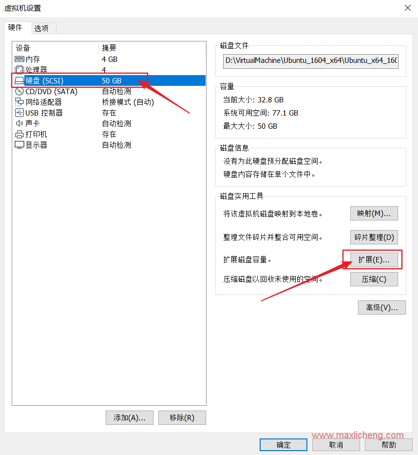

**修改磁盘大小，这里50G扩展到100G**


**扩展中**


**虚拟机提示扩展完成**
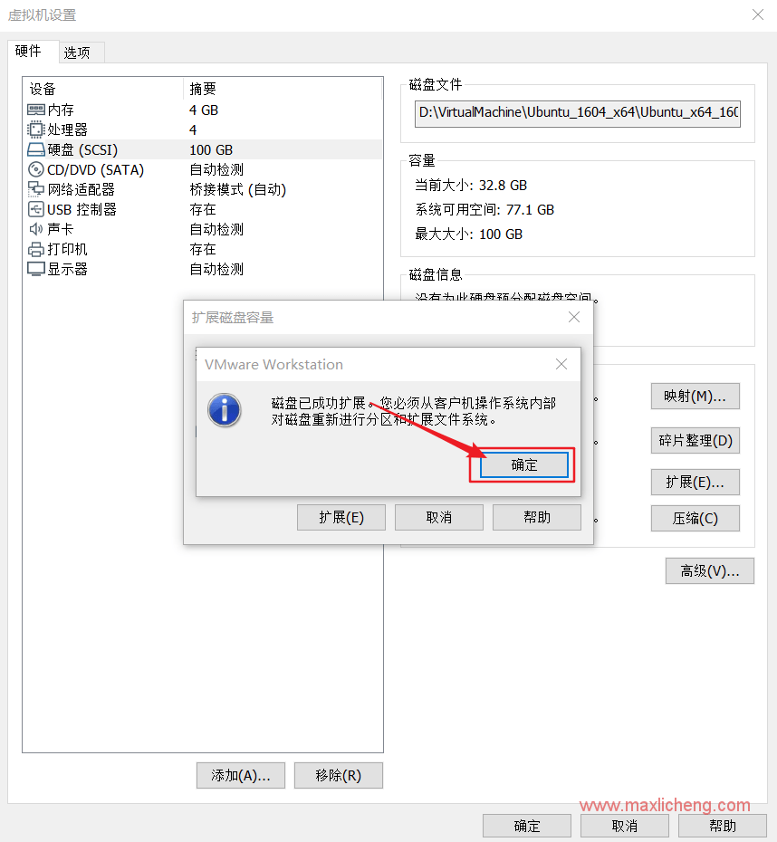

**开机进入系统，安装gparted分区管理工具，终端中运行**
sudo apt-get install gparted


**在软件管理中，找到gparted软件**


**提示输入密码**
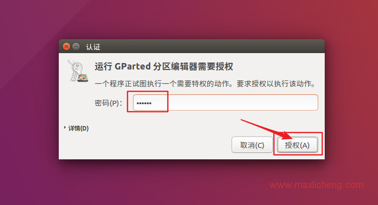

**记录sda2大小，并删除sda2**
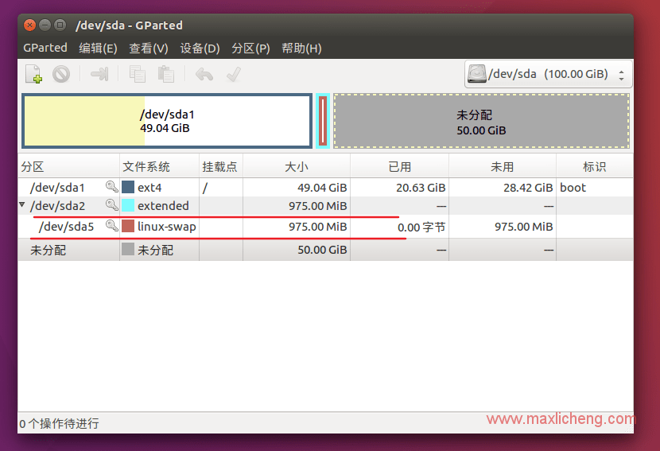

**选中sda5，右键禁用交换空间**


**禁用后，再次选中sda5，右键选中删除**


**删除sda5后，选中sda2，右键删除**


**选中sda1，右键更改大小**
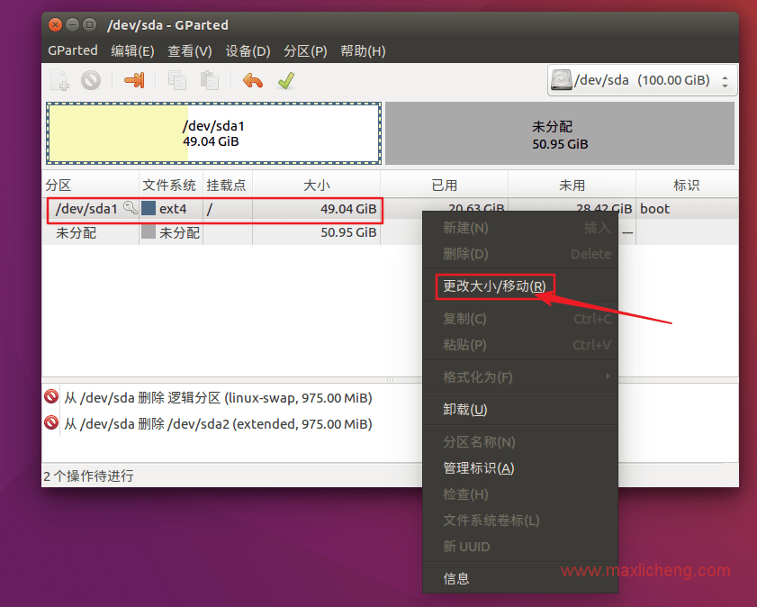

**弹出的窗口，调整剩余空间为1024即可。**


**完成调整后，选中未分配空间，右键新建**


**弹出的窗口，选择创建为扩展分区**
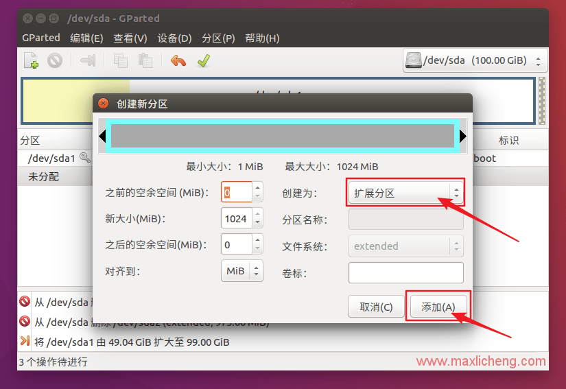

**完成后，选中新出现的未分配分区，右键新建**
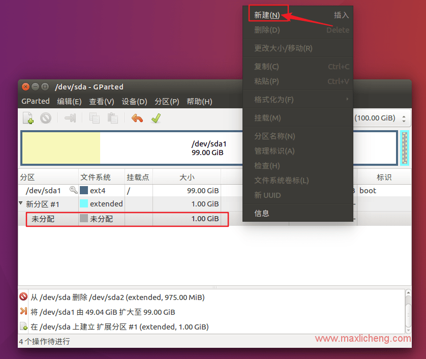

**弹出的窗口，选择文件系统为：linux-swap**


**确认参数无误，点击上面(√)确认按钮**
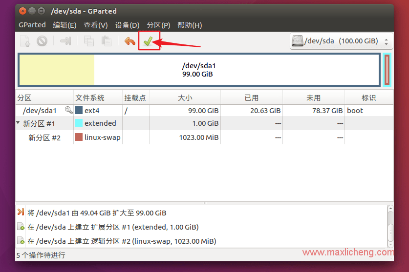

**点击应用，执行修改**
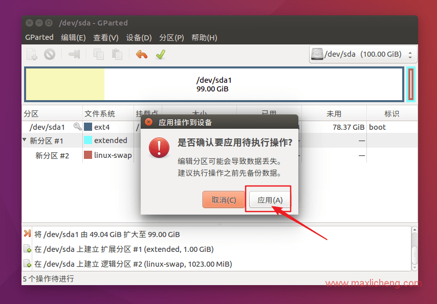

**大约10分钟，完成所有操作**
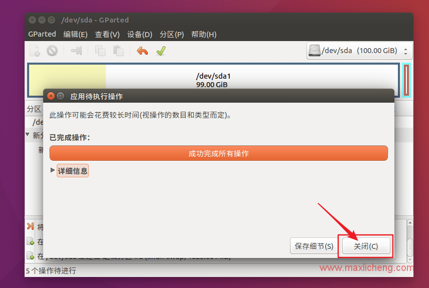

**查看系统硬盘是否成功扩展**
df -h


**成功扩展，以上就是VM虚拟机ubuntu硬盘大小扩展的所有操作。**


