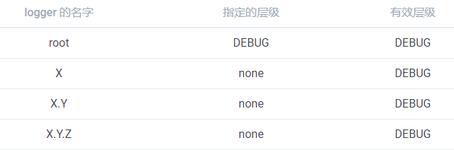
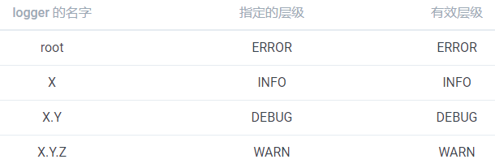
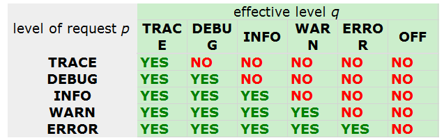

## Hello World

1. 添加依赖

   ~~~xml
   <dependency>
       <groupId>ch.qos.logback</groupId>
       <artifactId>logback-core</artifactId>
       <version>1.3.5</version>
   </dependency>
   <dependency>
       <groupId>org.slf4j</groupId>
       <artifactId>slf4j-api</artifactId>
       <version>2.0.4</version>
   </dependency>
   <dependency>
       <groupId>ch.qos.logback</groupId>
       <artifactId>logback-classic</artifactId>
       <version>1.3.5</version>
   </dependency>
   ~~~

2. 输出日志

   ~~~java
   public static void main(String[] args) {
           Logger logger = LoggerFactory.getLogger("chapters.introduction.HelloWorld1");
           logger.debug("hello world");
   }
   ~~~

   由于 logback 默认的配置策略：当没有默认的配置时，logback 将会在 `root logger `中新增一个 `ConsoleAppender` 

3. 打印内部状态

   ~~~java
   public static void main(String[] args) {
   		// 打印内部的状态
           LoggerContext lc = (LoggerContext)LoggerFactory.getILoggerFactory();
           StatusPrinter.print(lc);
       }
   ~~~

   运行结果如下:

   ~~~java
   12:23:49.324 [main] DEBUG chapters.introduction.HelloWorld2 - Hello world
   12:23:49,258 |-INFO in ch.qos.logback.classic.LoggerContext[default] - Could NOT find resource [logback-test.xml]
   12:23:49,258 |-INFO in ch.qos.logback.classic.LoggerContext[default] - Could NOT find resource [logback.groovy]
   12:23:49,258 |-INFO in ch.qos.logback.classic.LoggerContext[default] - Could NOT find resource [logback.xml]
   12:23:49,262 |-INFO in ch.qos.logback.classic.BasicConfigurator@2e5d6d97 - Setting up default configuration.
   ~~~

   Logback 没有找到 *logback-test.xml* 和 *logback.xml* 配置文件，所以通过默认的配置策略-添加一个基本的 `ConsoleAppender` 来进行配置。

   如果发生了错误，logback 会自动在控制台打印自己内部的状态信息。


### Logger

> Logger的层级

每一个 logger 都依附在 `LoggerContext` 上，它负责产生 logger，并且通过一个树状的层级结构来进行管理。

**Logger是分层级的，即名为 `com.foo` 的 logger 是名为 `com.foo.Bar` 的 logger 的父级。名为 `java` 的 logger 是名为 `java.util` 的父级，是名为 `java.util.Vector` 的祖先。**

**root logger是logger的最高层级，他是每一个logger的祖先。**

logger是单例的，即同一个名称的只对应一个logger。logger的命名是大小写敏感的

父级 logger 会自动寻找并关联子级 logger，即使父级 logger 在子级 logger 之后实例化。


> Logger的有效等级与等级继承

Logger 能够被分成不同的等级。不同的等级（TRACE, DEBUG, INFO, WARN, ERROR）定义在 `ch.qos.logback.classic.Level` 类中。

如果一个给定的 logger 没有指定一个层级，那么它就会继承离它最近的一个祖先的层级

**为了确保所有的 logger 都有一个层级，root logger 会有一个默认层级 --- DEBUG**






可以通过setLevel来设置Logger的打印等级

~~~java
		ch.qos.logback.classic.Logger logger = 
                (ch.qos.logback.classic.Logger)LoggerFactory.getLogger("com.foo");
        // 设置 logger 的级别为 INFO
        logger.setLevel(Level.INFO);

       // "com.foo.bar" 会继承 "com.foo" 的有效级别
        Logger barLogger = LoggerFactory.getLogger("com.foo.bar");
~~~

> 方法打印

Logger只会打印等级大于等于自身有效等级的日志， 即符合p>=q的日志




> 获取Logger

<font color=red>通过 `LoggerFactory.getLogger()` 可以获取到具体的 logger 实例，名字相同则返回的 logger 实例也相同。</font>

```java
Logger x = LoggerFactory.getLogger("wombat");
Logger y = LoggerFactory.getLogger("wombat");
```

**x**，**y** 是同一个 logger 对象。

## Appender

logger输出日志的目的地叫做appender。appender 包括console、file、socket 、MySQL、JMS。

一个logger可以有多个appender。logger 通过 `addAppender` 方法来新增一个 appender。

> Appender的叠加性

appender 从 logger 的层级结构中去继承叠加性。

<font color=red>logger *L* 的日志输出语句会遍历 *L* 和它的父级中所有的 appender。这就是所谓的 appender 叠加性（appender additivity）</font>

<font color=red>如果 root logger 添加了一个 console appender，所有允许输出的日志至少会在控制台打印出来。如果再给一个叫做 ***L*** 的 logger 添加了一个 file appender，那么 ***L*** 以及 ***L*** 的子级 logger 都可以在文件和控制台打印日志。可以通过设置 additivity = false 来改写默认的设置，这样 appender 将不再具有叠加性。</font>

<font color=red>如果 *L* 的某个上级 logger 为 *P*，且 *P* 设置了 additivity = false，那么 *L* 的日志会在层级在 *L* 到 *P* 之间的所有 logger 的 appender，包括 *P* 本身的 appender 中输出，但是不会在 *P* 的上级 appender 中输出。</font>

<font color=red>logger 默认设置 additivity = true。</font>

appender 的叠加性规则如下：

|     Logger      |  Appender  | Additivity  标识 |       输出目的地       |                             说明                             |
| :-------------: | :--------: | :--------------: | :--------------------: | :----------------------------------------------------------: |
|      root       |     A1     |      不适用      |           A1           | root logger 为 logger 层级中的最高层，additivity 对它不适用  |
|        x        | A-x1, A-x2 |       True       |     A1, A-x1, A-x2     |                    x 与 root 的 appender                     |
|       x.y       |     无     |       true       |     A1, A-x1, A-x2     |                    x 与 root 的 appender                     |
|      x.y.z      |   A-xyz1   |       true       | A1, A-x1, A-x2, A-xyz1 |                 x 与 x.y 与 root 的 appender                 |
|    security     |   A-sec    |    **false**     |         A-sec          |    因为 additivity = false，所以只有 A-sec 这个 appender     |
| security.access |     无     |       true       |         A-sec          | 因为它的父级 logger security 设置了 additivity = false，所以只有 A-sec 这一个 appender |

### Layout

通常，用户既想自定义日志的输出地，也想自定义日志的输出格式。通过给 appender 添加一个 *layout* 可以做到。

<font color=red>Layout是挂载在appender上的</font>

<font color=red>layout 的作用是将日志格式化，而 appender 的作用是将格式化后的日志输出到指定的目的地。**PatternLayout** 能够根据用户指定的格式来格式化日志，类似于 C 语言的 printf 函数。</font>

例：PatternLayout 通过格式化串 `%-4relative [%thread] %-5level %logger{32} - %msg%n` 会将日志格式化成如下结果：

```java
176  [main] DEBUG manual.architecture.HelloWorld2 - Hello world.
```

%-4relative表示程序启动以来的毫秒数, 最小宽度为4, 向左对齐。

%thread表示当前的线程号。

%-5level表示当前日志的级别, 最小宽度5, 向左对齐。

%logger{32}是 logger 的名字, 最大宽度32

%msg表示消息

%n表示换行


### Encoder

encoder 将日志事件转换为字节数组，同时将字节数组写入到一个 `OutputStream` 中。encoder 在 logback 0.9.19 版本引进。在之前的版本中，大多数的 appender 依赖 layout 将日志事件转换为 string，然后再通过 `java.io.Writer` 写出。在之前的版本中，用户需要在 `FileAppender` 中内置一个 `PatternLayout`。在 0.9.19 之后的版本中，`FileAppender` 以及子类[需要一个 encoder 而不是 layout](https://logback.qos.ch/codes.html#layoutInsteadOfEncoder)。

为什么会有这个改变？

layout 将会在下一章节讨论，它只能将日志事件转换为成 string。而且，考虑到 layout 在日志事件写出时不能控制日志事件，不能将**日志事件批量聚合**。与之相反的是，**encoder 不但可以完全控制字节写出时的格式，而且还可以控制这些字节什么时候被写出。**


`PatternLayoutEncoder` 是目前真正唯一有用的 encoder。它仅仅包裹了一个 `PatternLayout` 就完成了大部分的工作。因此，除了不必要的复杂性，encoder 似乎不会有太多的用处。但是，我们希望一个全新的更加强大的 encoder 来改变这种印象。


## 参数化日志

对于一些 Logger 如下输出日志：

```java
logger.debug("Entry number: " + i + " is " + String.valueOf(entry[i]));
```

会产生构建消息参数的成本，是因为需要将整数转为字符串，然后再将字符串拼接起来。但是我们是不需要关心 debug 信息是否被记录（强行曲解作者的意思）。

有一种更好的方式去格式化日志信息。假设 **entry** 是一个 Object 对象：

```java
Object entry = new SomeObject();
logger.debug("The entry is {}", entry);
```

<font color=red>只有在需要打印 debug 信息的时候，才会去格式化日志信息，将 '{}' 替换成 entry 的字符串形式。也就是说在这种情况下，如果禁止了日志的打印，也不会有构建参数上的性能消耗。</font>

如果需要使用三个或三个以上的参数，可以采用如下的形式：

~~~java
Object[] paramArray = {newVal, below, above};
logger.debug("Value {} was inserted between {} and {}.", paramArray);
~~~


## 配置文件优先级

配置文件优先级如下:

1. 类路径下的 logback-test.xml 
2. 类路径下的 logback.groovy
3. 类路径下的logback.xml 
4. **如果没有找到，将会通过 JDK 提供的 [ServiceLoader](https://docs.oracle.com/javase/6/docs/api/java/util/ServiceLoader.html) 工具在类路径下寻找文件 *META-INFO/services/ch.qos.logback.classic.spi.Configurator*，该文件的内容为实现了 [`Configurator`](https://logback.qos.ch/xref/ch/qos/logback/classic/spi/Configurator.html) 接口的实现类的全限定类名。**
5. **如果以上都没有成功，logback 会通过 [BasicConfigurator](https://logback.qos.ch/xref/ch/qos/logback/classic/BasicConfigurator.html) 为自己进行配置，并且日志将会全部在控制台打印出来。**

最后一步会添加给rootLogger添加一个ConsoleAppender, 并且使用PatternLayout来进行格式化.  rootLogger默认的level为debug


## 配置文件的语法

logback 允许你重新定义日志的行为而不需要重新编译代码，你可以轻易的禁用调应用中某些部分的日志，或者将日志输出到任何地方。

logback 的配置文件非常的灵活，不需要指定 DTD 或者 xml 文件需要的语法。但是，最基本的结构为 `<configuration>` 元素，包含 0 或多个 `<appender>` 元素，其后跟 0 或多个 `<logger>` 元素，其后再跟最多只能存在一个的 `<root>` 元素。基本结构图如下：


#### 标签名大小写敏感

默认规则遵循驼峰命名法。很难说清楚一个标签遵循什么规则，如果你不知道给定的标签遵循哪种规则，那么使用驼峰命名法总是正确的。

#### 配置 logger

现在你至少应该对[等级继承规则](https://github.com/Volong/logback-chinese-manual/blob/0197a2d5a3820d9c1756c680c2e21e934904c6a6/02%E7%AC%AC%E4%BA%8C%E7%AB%A0%EF%BC%9A%E6%9E%B6%E6%9E%84.md#%E6%9C%89%E6%95%88%E7%AD%89%E7%BA%A7%E5%8F%88%E7%A7%B0%E4%B8%BA%E7%AD%89%E7%BA%A7%E7%BB%A7%E6%89%BF)与[基本规则](https://github.com/Volong/logback-chinese-manual/blob/0197a2d5a3820d9c1756c680c2e21e934904c6a6/02%E7%AC%AC%E4%BA%8C%E7%AB%A0%EF%BC%9A%E6%9E%B6%E6%9E%84.md#%E6%96%B9%E6%B3%95%E6%89%93%E5%8D%B0%E4%BB%A5%E5%8F%8A%E5%9F%BA%E6%9C%AC%E9%80%89%E6%8B%A9%E8%A7%84%E5%88%99)有所了解.。

<font color=red>通过 `<logger>` 标签来过 logger 进行配置，一个 `<logger>` 标签必须包含一个 *name* 属性，一个可选的 *level* 属性，一个可选 *additivity* 属性。`additivity` 的值为 *true* 或 *false*。`level` 的值为 TRACE，DEBUG，INFO，WARN，ERROR，ALL，OFF，INHERITED，NULL。当 `level` 的值为 INHERITED 或 NULL 时，将会强制 logger 继承上一层的级别。</font>

<font color=red>`<logger>` 元素至少包含 0 或多个 `<appender-ref>` 元素。每一个 appender 通过这种方式被添加到 logger 上。</font>与 log4j 不同的是，logbakc-classic 不会关闭或移除任何之前在 logger 上定义好的的 appender。

#### 配置 root logger

<font color=red>root logger 通过 `<root>` 元素来进行配置。它只支持一个属性——`level`。它不允许设置其它任何的属性，因为 additivity 并不适用 root logger。而且，root logger 的名字已经被命名为 "ROOT"，也就是说也不支持 name 属性。level 属性的值可以为：TRACE、DEBUG、INFO、WARN、ERROR、ALL、OFF，但是不能设置为 INHERITED  或 NULL。</font>

<font color=red>跟 `<logger` 元素类似，`<root>` 元素可以包含 0 或多个 `<appender-ref>` 元素。</font>

#### 例子

如果我们不想看到属于 "chapters.configuration" 组件中任何的 DEBUG 信息。

*Example*：sample2.xml

```xml
<configuration>
	<appender name="STDOUT" class="ch.qos.logback.core.ConsoleAppender">
		<encoder>
			<pattern>%d{HH:mm:ss.SSS} [%thread] %-5level %logger{36} - %msg%n</pattern>
		</encoder>
	</appender>
	
	<logger name="chapters.configuration" level="INFO" />

	<root level="DEBUG">
		<appender-ref ref="STDOUT" />
	</root>
</configuration>
```

运行 *MyApp3*，可以看到如下的输出信息：

```java
21:52:48.726 [main] INFO  chapters.configuration.MyApp3 - Entering application
21:52:48.728 [main] INFO  chapters.configuration.MyApp3 - Exiting application
```

可以看到，["chapters.configuration.Foo"](https://logback.qos.ch/xref/chapters/configuration/Foo.html) 类中的 debug 信息没有被输出。

你可以配置任何 logger 的日志级别。在下一个例子中，我们设置 *chapters.configurations* 的 logger 日志级别为 INFO，同时设置 *chapters.configuration.Foo* 的 logger 日志级别为 DEBUG。

*Example*：sample3.xml

```xml
<configuration>
	<appender name="STDOUT" class="ch.qos.logback.core.ConsoleAppender">
        <!-- 默认使用class="ch.qos.logback.classic.encoder.PatternLayoutEncoder"-->
		<encoder>
			<pattern>
				%d{HH:mm:ss.SSS} [%thread] %-5level %logger{36} - %msg%n
			</pattern>
		</encoder>
	</appender>
	
	<logger name="chapters.configuration" level="INFO" />
	
	<logger name="chapters.configuration.Foo" level="DEBUG" />
	
	<root level="DEBUG">
		<appender-ref ref="STDOUT" />
	</root>
</configuration>
```

运行 *MyApp3* 可以看到如下的输出信息：

```java
22:06:43.500 [main] INFO  chapters.configuration.MyApp3 - Entering application
22:06:43.502 [main] DEBUG chapters.configuration.Foo - Did it again!
22:06:43.502 [main] INFO  chapters.configuration.MyApp3 - Exiting application
```

下面的表格列出了 `JoranConfigurator` 通过 *sample3.xml* 配置 logback 后，logger 以及其对应的日志级别。

| Logger name                   | 指定级别 | 有效级别 |
| :---------------------------- | :------: | :------: |
| root                          |  DEBUG   |  DEBUG   |
| chapters.configuration        |   INFO   |   INFO   |
| chapters.configuration.MyApp3 |   null   |   INFO   |
| chapters.configuration.Foo    |  DEBUG   |  DEBUG   |

`MyApp3` 类中的两条日志消息的级别都为 INFO，Foo.doIt() 中的 DEBUG 信息也能够进行输出。

> 注意：root logger 的日志级别永远不会设置成一个非空的值，默认是 DEBUG。

[基本选择法](https://github.com/Volong/logback-chinese-manual/blob/0197a2d5a3820d9c1756c680c2e21e934904c6a6/02%E7%AC%AC%E4%BA%8C%E7%AB%A0%EF%BC%9A%E6%9E%B6%E6%9E%84.md#%E6%96%B9%E6%B3%95%E6%89%93%E5%8D%B0%E4%BB%A5%E5%8F%8A%E5%9F%BA%E6%9C%AC%E9%80%89%E6%8B%A9%E8%A7%84%E5%88%99) 依赖被调用 logger 的有效日志级别，而并不是 appender 所依附的 logger 的级别。logback 会首先判断日志语句是否可以被打印，如果可以，则会在 logger 的层级结构中查找 appender，而不管它们的级别如何（表示很费解，appender 本来就没有日志级别，为什么会关 appender 的事？）。下面的例子说明了这一点。

*Example*：sample4.xml

```xml
<configuration>
    <appender name="STDOUT" class="ch.qos.logback.core.ConsoleAppender">
        <encoder>
            <pattern>%d{HH:mm:ss.SSS} [%thread] %-5level %logger{36} - %msg%n</pattern>
        </encoder>
    </appender>
    
    <logger name="chapters.configuration" level="INFO" />
    
    <root level="OFF">
        <appender-ref ref="STDOUT" />
    </root>
</configuration>
```

如下表格展示了应用 sample4.xml 之后的各 logger 的日志级别。

| logger name                   | 分配级别 | 有效级别 |
| ----------------------------- | -------- | -------- |
| root                          | OFF      | OFF      |
| chapters.configuration        | INFO     | INFO     |
| chapters.configuration.MyApp3 | null     | INFO     |
| chapters.configuration.Foo    | null     | INFO     |

ConsoleAppender 的名字为 *STDOUT*， *sample4.xml* 中唯一的 appender，它所依附的 root logger 的 level = OFF。但是，运行 *MyApp3* 还是得到日志输出：

```java
10:47:34.310 [main] INFO  chapters.configuration.MyApp3 - Entering application
10:47:34.313 [main] INFO  chapters.configuration.MyApp3 - Exiting application
```

很明显，root logger 没有影响到其他的 logger，因为 `chapters.configuration.MyApp3` 与 `chapters.configuration.Foo` 类的日志级别为 INFO。即使在 java 代码中没有直接引用 *chapters.configuration* 这个 logger，但是它是存在，因为它在配置文件中声明了。


#### 配置 appender

**<font color=red>appender 通过 `<appender>` 元素进行配置，需要两个强制的属性 *name* 与 *class*。*name* 属性用来指定 appender 的名字，*class* 属性需要指定类的全限定名用于实例化。`<appender>` 元素可以包含 0 或一个 `<layout>` 元素，0 或多个 `<encoder>` 元素，0 或多个 `<filter>` 元素。除了这些公共的元素之外，`<appender>` 元素可以包含任意与 appender 类的 JavaBean 属性相一致的元素。(类似spring设置javabean属性一样)</font>**

下图展示了一些常见的结构。

> 注意：对属性的支持不可见（没懂这句话是什么意思）。


**<font color=red>`<layout>` 元素强制一个 class 属性去指定一个类的全限定名，用于实例化。与 `<appender>` 元素一样，`<layout>` 元素也可以包含与 layout 实例相关的属性。如果 layout 的 class 是 `PatternLayout`，那么 class 属性可以被隐藏掉（参考：[默认类映射](#默认类映射)），因为这个很常见。</font>**

**<font color=red>`<encoder` 元素强制一个 class 属性去指定一个类的全限定名，用于实例化。如果 encoder 的 class 是 `PatternLayoutEncoder`，那么基于[默认类映射](#默认类映射)，class 属性可以被隐藏。</font>** 

通过多个 appender 输出日志就像定义多个 appender 以及将它们关联到 logger 上一样简单。

*Example*：multiple.xml

```xml
<?xml version="1.0" encoding="UTF-8"?>
<configuration>
	<appender name="FILE" class="ch.qos.logback.core.FileAppender">
		<file>myApp.log</file>
		<encoder>
			<pattern>
				%date %level [%thread] %logger{10} [%file:%line] %msg%n
			</pattern>
		</encoder>
	</appender>
	
	<appender name="STDOUT" class="ch.qos.logback.core.ConsoleAppender">
		<encoder>
			<pattern>
				%msg%n
			</pattern>
		</encoder>
	</appender>
	
	<root level="debug">
		<appender-ref ref="FILE" />
		<appender-ref ref="STDOUT" />
	</root>
</configuration>
```

这个配置文件定义了两个 appender：*FILE* 和 *STDOUT*。*FILE* appender 将日志输出到 *myApp.log* 文件。encoder 通过 `PatternLayoutEncoder` 输出日期、日志等级、线程名、logger 的名字、可以定位日志来源的文件以及所在行、具体的日志信息以及行分隔符。第二个 appender 是 `STDOUT`，将日志输出到控制台。它的 encoder 仅仅输出日志信息以及行分隔符。

<font color=blue>appender 通过 *appender-ref* 元素附加到 root logger 上。每一个 appender 都有自己 encoder。encoder 通常不会设计成给所有的 appender 共享。对于 layout 也是如此。因此，logback 不会提供任何共享 encoder 和 layout 的语法。</font>

#### 重复使用 appender

在默认的情况下，appender 是可以重复使用的：logger 可以通过附加到本身的 appender 输出日志，同样的也可以附加到起祖先的身上，并输出日志。因此，如果同一个 appender 附加到多个 logger 身上，那么就导致日志重复打印。

*Example*：duplicate.xml

```xml
<?xml version="1.0" encoding="UTF-8"?>
<configuration>
	<appender name="STDOUT" class="ch.qos.logback.core.ConsoleAppender">
		<encoder>
			<pattern>%d{HH:mm:ss.SSS} [%thread] %-5level %logger{36} - %msg%n</pattern>
		</encoder>
	</appender>
	
	<logger name="chapters.configuration">
		<appender-ref ref="STDOUT" />
	</logger>
	
	<root level="debug">
		<appender-ref ref="STDOUT" />
	</root>
</configuration>
```

运行 *MyApp3*，将会输出如下结果：

```java
22:43:35.469 [main] INFO  chapters.configuration.MyApp3 - Entering application
22:43:35.469 [main] INFO  chapters.configuration.MyApp3 - Entering application
22:43:35.471 [main] DEBUG chapters.configuration.Foo - Did it again!
22:43:35.471 [main] DEBUG chapters.configuration.Foo - Did it again!
22:43:35.472 [main] INFO  chapters.configuration.MyApp3 - Exiting application
22:43:35.472 [main] INFO  chapters.configuration.MyApp3 - Exiting application
```

注意日志重复输出了，因为 appender *STDOUT* 附加到了两个 logger 身上：root 以及 *chapters.configuration*。因为 root logger 是所有 logger 的祖先，*chapters.configuration* 是 *chapters.configuration.MyApp3* 以及 *chapters.configuraion.Foo* 的父级。每一次日志请求都会被打印两次，一次是通过 *STDOUT*，一次是通过 *root*。

appender 的叠加性并不是为新用户设置的陷阱。它是 logback 非常方便的一个特性。例如，你可以让系统中所有的日志输出到控制台上，而其它特定的日志输出到特定的 appender 中。

*Example*： restricted.xml

```xml
<?xml version="1.0" encoding="UTF-8"?>
<configuration>
	<appender name="FILE" class="ch.qos.logback.core.FileAppender">
		<file>myApp.log</file>
		<encoder>
			<pattern>%date %level [%thread] %logger{10} [%file:%line] %msg%n</pattern>
		</encoder>
	</appender>
	
	<appender name="STDOUT" class="ch.qos.logback.core.ConsoleAppender">
		<encoder>
			<pattern>%msg%n</pattern>
		</encoder>
	</appender>
	
	<logger name="chapters.configuration">
		<appender-ref ref="FILE" />
	</logger>
	
	<root level="debug">
		<appender-ref ref="STDOUT" />
	</root>
</configuration>
```

在这个例子中，控制台会打印所有的日志，而只有属于 *chapters.configuration* 的 logger 以及它的子级 logger 的日志才会输出到 *myApp.log* 文件。

#### 重写默认的累加行为

**<font color=red>如果默认的累积行为对你来说不适合，你可以设置 additivity = false。</font>**

*Example*：additivityFlag.xml

```xml
<configuration>
    <appender name="FILE" class="ch.qos.logback.core.FileAppender">
        <file>foo.log</file>
        <encoder>
            <pattern>%date %level [%thread] %logger{10} [%file : %line] %msg%n</pattern>
        </encoder>
    </appender>
    
    <appender name="STDOUT" class="ch.qos.logback.core.ConsoleAppender">
        <encoder>
            <pattern>%msg%n</pattern>
        </encoder>
    </appender>
    
    <logger name="chapters.configuration.Foo" additivity="false">
        <appender-ref ref="FILE" />
    </logger>
    
    <root level="debug">
        <appender-ref ref="STDOUT" />
    </root>
</configuration>
```

在这个例子中，*FILE* appender 附加到了名为 *chaoters.configuration.Foo* 的 logger 上。而且，*chapters.configuration.Foo* 设置了 additivity = false，那么这个 logger 的日志将会通过 *FILE* 这个 appender 输出，但是它的父级 logger 将不会输出属于这个 logger 的日志。运行 *MyApp3*，属于 *chapters.configuration.MyApp3* 这个 logger 的日志将会在控制台输出，但是属于 *chapters.configuration.Foo* 这个 logger 的日志只会在 *foo.log* 这个文件看到。

#### 设置 context 的名字

在之前的[章节](#Logger 上下文)中提到，<font color=red>每一个 logger 都会附加到一个 logger context 上去。默认这个 logger context 的名字为 "default"。但是你可以通过 `<contextName>` 设置其它的名字。但是如果设置过一次就不能[再设置](#https://logback.qos.ch/apidocs/ch/qos/logback/core/ContextBase.html#setName(java.lang.String))。</font>当多个应用输出日志到同一个目的地，设置 logger context 的名字可以更好的区分。

*Example*：contextName.xml

```xml
<configuration>
    <contextName>myAppName</contextName>
    <appender name="STDOUT" class="ch.qos.logback.core.ConsoleAppender">
        <encoder>
            <pattern>%d %contextName [%t] %level %logger{36} - %msg%n</pattern>
        </encoder>
    </appender>
    
    <root level="debug">
        <appender-ref ref="STDOUT" />
    </root>
</configuration>
```


#### 变量替换

**`注意`**：早期版本使用的是属性替换而不是变量替换

#### 变量的定义

logback 支持变量的定义以及替换，变量有它的作用域。而且，变量可以在配置文件中，外部文件中，外部资源文件中，甚至动态定义。

*Example*：variableSubstitution1.xml

```xml
<configuration>
	<property name="USER_NAME" value="/data/logs" />

	<appender name="FILE" class="ch.qos.logback.core.FileAppender">
		<file>${USER_NAME}/myApp.log</file>
		<encoder>
			<pattern>%msg%n</pattern>
		</encoder>
	</appender>
	
	<root level="debug">
		<appender-ref ref="FILE" />
	</root>	
</configuration>
```

这个例子中，在配置文件的开始定义了一个变量，之后通过引用这个变量指定了日志文件的路径。

*Example*：variableSubstitution2.xml

```xml
<configuration>
	<appender name="FILE" class="ch.qos.logback.core.FileAppender">
		<file>${USER_HOME}/myApp.log</file>
		<encoder>
			<pattern>%msg%n</pattern>
		</encoder>
	</appender>
	
	<root level="debug">
		<appender-ref ref="FILE" />
	</root>	
</configuration>
```

这个例子中，在 java 的系统变量中定义一个同样的变量名，达到的效果是一样的。可以通过如下的方式去运行：

```
java -DUSER_HOME="/data/logs" MyApp3
```

当需要定义多个变量时，可以将这些变量放到一个单独的文件中。

*Example*：variableSubstitution3.xml

```xml
<configuration>
	<property file="F:\project\logback-examples\src\main\resources\variables1.properties"/>
	
	<appender name="FILE" class="ch.qos.logback.core.FileAppender">
		<file>${USER_HOME}/myApp.log</file>
		<encoder>
			<pattern>%msg%n</pattern>
		</encoder>
	</appender>
	
	<root level="debug">
		<appender-ref ref="FILE" />
	</root>
</configuration>
```

这个配置文件包含了一个对外部文件的引用：*variables1.properties*。这个外部文件包含一个变量：

*Example*：variables1.properties

```properties
USER_HOME=/data/logs
```

也可以引用 classpath 下的资源文件：

```xml
<configuration>
	<property resource="resource1.properties" />
	
	<appender name="FILE" class="ch.qos.logback.core.FileAppender">
		<file>${USER_HOME}/myApp.log</file>
		<encoder>
			<pattern>%msg%n</pattern>
		</encoder>
	</appender>
	
	<root level="debug">
		<appender-ref ref="FILE" />
	</root>
</configuration>
```

<font color=red>property的file和resource的区别个人认为在于file用于加载外部文件，而resource用于加载classpath下的内部资源文件</font>

#### 作用域

属性的作用域分别为本地（local scope）、上下文（context scope）、系统（system scope）。默认为本地作用域。

`本地（local scope）`：本地范围内的属性存在配置文件的加载过程中。配置文件每加载一次，变量就会被重新定义一次。

`上下文（context scope）`：上下文范围内的属性会一直存在上下文被清除。

`系统（system scope）`：系统范围内的属性，会插入到 JVM 的系统属性中，跟随 JVM 一同消亡。

在进行变量替换的时候，会先从本地范围去找，再从上下文去找，再从系统属性中去找，最后会去系统的环境变量中去找。

可以通过 `<property>`、`<define>`、`<insertFromJNDI>` 元素的 *scope* 属性来设置变量的作用范围。*scope* 属性可能的值为：local，context，system。<font color=red>如果没有指定，则默认为 local。</font>

*Example*：contextScopedVariable.xml

```xml
<configuration>
    <property scope="context" name="nodeId" value="firstNode"/>
    
    <appender name="FILE" class="ch.qos.logback.core.FileAppender">
        <file>/data/${nodeId}/myApp.log</file>
        <encoder>
            <pattern>%msg%n</pattern>
        </encoder>
    </appender>
    
    <root level="debug">
        <appender-ref ref="FILE" />
    </root>
</configuration>
```

在这个例子中，*nodeId* 这个变量被定义在上下文范围，它在每个日志事件，甚至通过序列化发送到远程服务器上都有效。

#### 变量的默认值

在某些情况下，如果某个变量没有被声明，或者为空，默认值则非常有用。<font color=red>在 bash shell 中，默认值可以通过 **":-"** 来指定。</font>例如：假设变量 *aName* 没有被定义，*"${aNme:-golden}"* 会被解释成 "golden" 。

#### 变量的嵌套

<font color=red>变量的名字、默认值、以及值都可以引用其它的变量。</font>

#### 嵌套值

<font color=red>一个变量的值可以包含对其它变量的引用。</font>

*Example*：variables2.properties

```properties
USER_HOME=/data/logs
fileName=myApp.log
destination=${USER_HOME}/${fileName}
```

*Example*：variableSubsitution4.xml

```xml
<configuration>
    <!-- 注: 官网的例子不是 resource 而是 file -->
    <property resource="variables2.properties" />
    
    <appender name="FILE" class="ch.qos.logback.core.FileAppender">
        <file>${destination}</file>
        <encoder>
            <pattern>%msg%n</pattern>
        </encoder>
    </appender>
    
    <root level="debug">
        <appender-ref ref="FILE" />
    </root>
</configuration>
```

#### 名字嵌套

<font color=red>变量的名字可以包含对其它变量的引用。</font>例如：如果变量 *userid=alice*，那么 "${${userid}.password}" 就是对变量名为 "alice.passowrd" 的引用。

#### 默认值嵌套

<font color=red>一个变量的默认值可以引用另一个变量。</font>例如：假设变量 "id" 没有被定义，变量 "userid" 的值为 "alice"，那么表达式 "${id:-${userid}}" 的值为 "alice"。

#### HOSTNAME 属性

<font color=red>`HOSTNAME` 在配置期间会被自动定义为上下文范围内。</font>

*Example*：

```xml
<configuration>
    <appender name="STDOUT" class="ch.qos.logback.core.ConsoleAppender">
        <encoder>
            <pattern>${HOSTNAME} - %msg%n</pattern>
        </encoder>
    </appender>
    
    <root level="debug">
        <appender-ref ref="STDOUT" />
    </root>
</configuration>
```

#### CONTEXT_NAME 属性

<font color=red>通过名字可以看出来，`CONTEXT_NAME` 属性对应当前上下文的名字。</font>

```xml
<configuration>
    <appender name="STDOUT" class="ch.qos.logback.core.ConsoleAppender">
        <encoder>
            <pattern>${CONTEXT_NAME} - %msg%n</pattern>
        </encoder>
    </appender>
    
    <root level="debug">
        <appender-ref ref="STDOUT" />
    </root>
</configuration>
```

#### 动态定义属性

可以通过 `<define>` 元素动态的定义变量。这个元素需要两个强制的属性：*name*、*class*。*name* 属性用来定义变量的名字，*classs* 属性用来引用实现了 [PropertyDefiner](https://logback.qos.ch/xref/ch/qos/logback/core/spi/PropertyDefiner.html) 接口的类。`PropertyDefiner` 实例的 `getPropertyValue()` 的返回值就是变量的值。还可以通过 *scope* 属性指定变量的[作用域](#作用域)。

```xml
<configuration>
  <define name="rootLevel" class="chapters.configuration.SimplePropertyDefiner">
    <shape>round</shape>
    <color>brown</color>
    <size>24</size>
  </define>
  <root level="${rootLevel}"/>
</configuration>
```

~~~java
@Data
public class SimplePropertyDefiner extends PropertyDefinerBase {
    private String shape;
    private String brown;
    private String size;
    @Override
    public String getPropertyValue() {
        return shape + brown + size;
    }
}
~~~


shape，color，size 都是 "chapters.configuration.SimplePropertyDefiner" 的属性。只要在实现类里面，各属性有对应的 set 方法，logback 就可以通过配置文件给各属性注入对应的值。

目前，logback 已经有了几个简单的实现类：

|                             类名                             | 描述                                                         |
| :----------------------------------------------------------: | :----------------------------------------------------------- |
| [`CanonicalHostNamePropertyDefiner`](https://logback.qos.ch/apidocs/ch/qos/logback/core/property/CanonicalHostNamePropertyDefiner.html) | 将变量的值设置为本地的主机名。注意：获取主机名可能需要花费几秒的时间。 |
| [`FileExistsPropertyDefiner`](https://logback.qos.ch/apidocs/ch/qos/logback/core/property/FileExistsPropertyDefiner.html) | 如果通过 `path` 属性指定的文件存在，则设置变量为 "true"，否则设置为 "false"。 |
| [`ResourceExistsPropertyDefiner`](https://logback.qos.ch/apidocs/ch/qos/logback/core/property/FileExistsPropertyDefiner.html) | 如果通过 `resource` 属性指定的资源文件在类路径中存在，则设置变量为 "true"，否则设置为 "false"。 |

#### 配置文件中的条件处理

开发者通常需要在多个环境中切换配置文件，例如：开发，测试和生产。这些配置文件有大量相同的地方，只有少数地方不同。为了避免重复，logback 在配置文件中支持通过 `<if>`、`<then>`、`<else>` 元素作为条件语句来区分不同的环境。条件处理需要 [Janino](https://logback.qos.ch/setup.html#janino) 环境的支持。

*Example*：

```xml
    <if condition="条件表达式">
        <then>
            ...
        </then>
	</if>
	
	<if condition="条件表达式">
        <then>
            ...
        </then>
        <else>
            ...
        </else>
	</if>
```

<font color=red>条件表达式只能是上下文变量或者系统变量。使用`property()` 方法或者其等价的 `p()` 方法来获取属性的值。</font>例如：如果要获取变量 "k" 的值，可以通过 `property("k")` 或者 `p("k")` 来获取。如果 "k" 没有定义，那么方法将会返回空字符串。所以不需要去判断是否为 null。

`isDefined()` 方法可以用来判断变量是否已经被定义。例如：可以通过 `isDefined("k")` 来判断 k 是否已经定义。还可以通过 `isNull()` 方法来判断变量是否为 null。例如：`isNull("k")`。

```xml
<configuration debug="true">
	<if condition='property("HOSTNAME").contains("volong")'>
		<then>
			<appender name="CON" class="ch.qos.logback.core.ConsoleAppender">
				<encoder>
					<pattern>%d %-5level %logger{35} - %msg %n</pattern>
				</encoder>
			</appender>
			<root>
				<appender-ref ref="CON" />
			</root>
		</then>
	</if>
	
	<appender name="FILE" class="ch.qos.logback.core.FileAppender">
		<file>${randomOutputDir}/conditional.log</file>
		<encoder>
			<pattern>${HOSTNAME} %d %-5level %logger{35} - %msg %n</pattern>
		</encoder>
	</appender>
	
	<root level="ERROR">
		<appender-ref ref="FILE" />
	</root>
</configuration>
```

条件处理语句与嵌套的 if-else 语句在 `<configuration>` 元素内都是可以使用的。但是 xml 的语法非常的繁琐，不适合作为通用变成语言的基础。因此，不建议使用过多的条件语句，因为别人看了难以理解，对你自己也是如此。

#### 从 JNDI 中获取变量

在某些情况下，如果从 JNDI 中获取变量的值。`<insertFromJNDI>` 元素能够获取存储在 JNDI 中的元素并插入到本地的上下文中，然后通过 `as` 属性获取具体的值。还可以通过[作用域](#作用域)将变量插入到不同的作用域中。

*Example*：insertFromJNDI.xml

```xml
<!-- appName 的配置在 web.xml 中 
	使用的是 eclipse 的 jetty 插件运行的
	运行时候的配置：右键点击项目 -> Run Configurations -> Jetty 选项卡下选择 Show Advanced Options -> 选中 JNDI Support -> 在运行就可以了
-->
<configuration>
	<insertFromJNDI env-entry-name="java:comp/env/appName" as="appName" />
	<contextName>${appName}</contextName>

	<appender name="CONSOLE" class="ch.qos.logback.core.ConsoleAppender">
		<encoder>
			<pattern>%d %contextName %level %msg %logger{50}%n</pattern>
		</encoder>
	</appender>

	<root level="DEBUG">
		<appender-ref ref="CONSOLE" />
	</root>
</configuration>
```

#### 引入外部配置文件

<font color=red>通过 `<include>` 元素可以引入外部的配置文件。</font>

*Example*：containingConfig.xml

```xml
<configuration>
    <include file="src/main/resources/includedConfig.xml" />
    
    <root level="DEBUG">
        <appender-ref ref="includedConsole" />
    </root>
</configuration>
```

<font color=red>目标文件必须是由 `<included>` 元素包裹的。</font>

*Example*：includedConfig.xml

```xml
<included>
    <appender name="includedConsole" class="ch.qos.logback.core.ConsoleAppender">
        <encoder>
            <pattern>%d - %m%n</pattern>
        </encoder>
    </appender>
</included>
```

可以通过如下几个属性引入文件：

- **通过文件引入**：

  <font color=red>可以通过 `file` 属性引入外部文件。可以通过相对路径或者绝对路径来引入。相对路径是指相对应用程序的路径。</font>

- **通过资源文件引入**

  <font color=red>可以通过 `resource` 属性来引入位于 classpath 路径下的资源文件。</font>

  ```xml
  <include resource="includedConfig.xml"/>
  ```

- **通过 url 引入文件**

  <font color=red>可以通过 `url` 属性来引入外部文件。</font>

  ```xml
  <include url="http://some.host.com/includedConfig.xml"/>
  ```

如果 logback 没有通过 `include` 元素找到指定的配置文件，会在控制台打印出内部状态信息。如果引入的外部配置文件是可选的，可以设置 `optional=true`。

```xml
<include optional="true" ..../>
```


## logback 格式化日志

```text
d, date 显示日期
r, relative 程序启动以来经过的毫秒数
level, le, p 日志等级
t, thread 线程名
lo, logger, c 日志记录器名字
m, message, msg 日志消息
M, method 调用记录的方法
class, C 调用记录的类
L, line 调用记录的行号
cn, contextName 自动以的contextName
n, 换行
```


## logback配置文件模板

```xml
<?xml version="1.0" encoding="UTF-8" ?>
<!DOCTYPE configuration>
<!-- scan: 当此属性设置为true时，配置文件如果发生改变，将会被重新加载，默认值为true
     scanPeriod: 设置监测配置文件是否有修改的时间间隔，单位milliseconds，seconds，minutes 和 hours，默认单位是毫秒。当scan为true时，此属性生效。默认的时间间隔为1分钟。 -->
<!-- debug: 默认false,解析配置文件时，出现警告的信息或者错误信息，logback打印出自身的状态信息。
 true: 正常情况下也打印出状态信息 -->
<configuration debug="true" scan="true" scanPeriod="60 seconds">

  <Property name="log.name" value="${log.name:-${contextName}}" />
  <Property name="log.path" value="${log.path:-./data/logs}" />
  <Property name="log.level" value="${log.level:-info}" />
  <contextName>java-springboot-tiger</contextName>

  <Property name="patternTemplate"
    value="[%-5level] [%contextName] %d{yyyy-MM-dd HH:mm:ss.SSS} [%thread][%X{traceId}] %logger - %msg%n" />
  <jmxConfigurator />
  <shutdownHook class="ch.qos.logback.core.hook.DelayingShutdownHook" />
  <!-- 控制台输出日志 -->
  <appender name="STDOUT" class="ch.qos.logback.core.ConsoleAppender">
    <encoder class="ch.qos.logback.classic.encoder.PatternLayoutEncoder">
      <pattern>${patternTemplate}</pattern>
    </encoder>
  </appender>

    <!-- FILE和DataAndSize不能指定同一个日志输出文件 -->
  <!-- 文件输出日志 (文件大小策略进行文件输出，超过指定大小对文件备份) -->
  <appender name="FILE" class="ch.qos.logback.core.rolling.RollingFileAppender">
    <File>${log.path}/${log.name}.log</File>
    <rollingPolicy class="ch.qos.logback.core.rolling.TimeBasedRollingPolicy">
      <!-- 每日滚动 -->
      <FileNamePattern>${log.path}/%d{yyyy-MM-dd}/${log.name}.%i.zip</FileNamePattern>
      <timeBasedFileNamingAndTriggeringPolicy
        class="ch.qos.logback.core.rolling.SizeAndTimeBasedFNATP">
        <!-- 超过15MB按照%i进行滚动 -->
        <maxFileSize>15MB</maxFileSize>
      </timeBasedFileNamingAndTriggeringPolicy>
      <!-- 控制保留的归档文件的最大数量 -->
       <maxHistory>30</maxHistory>
    </rollingPolicy>
    <encoder class="ch.qos.logback.classic.encoder.PatternLayoutEncoder">
      <pattern>${patternTemplate}</pattern>
    </encoder>
  </appender>

  <!-- 按照毫秒和1MB进行滚动 -->
  <appender name="DataAndSize" class="ch.qos.logback.core.rolling.RollingFileAppender">
    <file>${log.path}/${log.name}.log</file>
    <encoder class="ch.qos.logback.classic.encoder.PatternLayoutEncoder">
      <pattern>${patternTemplate}</pattern>
    </encoder>
    <!-- 按秒和1MB进行归档 -->
    <rollingPolicy class="ch.qos.logback.core.rolling.SizeAndTimeBasedRollingPolicy">
      <fileNamePattern>${log.path}/%d{yyyy-MM-dd HH:mm:ss.SSS}/${log.name}.%i.zip</fileNamePattern>
      <maxFileSize>1MB</maxFileSize>
    </rollingPolicy>
  </appender>


  <!-- 异步输出 -->
  <appender name="ASYNC" class="ch.qos.logback.classic.AsyncAppender">
    <!-- 不丢失日志。默认如果队列的 80% 已满，则会丢弃 TRACT、DEBUG、INFO 级别的日志 -->
    <discardingThreshold>20</discardingThreshold>
    <!-- 更改默认的队列的深度,该值会影响性能.默认值为256 -->
    <queueSize>2048</queueSize>
    <includeCallerData>true</includeCallerData>
    <neverBlock>true</neverBlock>
    <!-- 停应用时最多等待多少毫秒处理 queue 中日志,暂定 10 秒 -->
    <maxFlushTime>10000</maxFlushTime>
    <!-- 添加附加的 appender，最多只能添加一个 -->
    <appender-ref ref="FILE" />
  </appender>

    <!-- 使用条件判断需要导入如下包 
    <dependency>
      <groupId>org.codehaus.janino</groupId>
      <artifactId>janino</artifactId>
      <version>3.0.6</version>
    </dependency>
-->
    <if condition='java表达式, 只能访问上下文和系统属性'>
    <then>
      <!--日志异步到数据库 -->
      <appender name="DB" class="ch.qos.logback.classic.db.DBAppender">
      <!--日志异步到数据库 -->
      <connectionSource class="ch.qos.logback.core.db.DriverManagerConnectionSource">
      <!--连接池 -->
      <dataSource class="com.mchange.v2.c3p0.ComboPooledDataSource">
      <driverClass>com.mysql.jdbc.Driver</driverClass>
      <url>jdbc:mysql://127.0.0.1:3306/databaseName</url>
      <user>root</user>
      <password>root</password>
      </dataSource>
      </connectionSource>
      </appender>
    </then>
  </if>

  <root level="${log.level}">
    <appender-ref ref="STDOUT" />
    <appender-ref ref="ASYNC" />
  </root>

  <!-- 特别注意，此处的 com.tiger根据实际项目情况进行修改，一般对应到公司的一级域名处 -->
  <logger name="com.tiger" additivity="true" level="info" />
  <logger name="org.springframework.core.env" additivity="true" level="info" />
  <logger name="org.springframework.beans.factory.support" additivity="true" level="info" />
  <!-- mybatis 暂时没有集成，日志暂不开启，后续集成了再开启 -->
  <logger name="org.apache.ibatis.logging" additivity="false" level="info" />
  <logger name="org.apache.tomcat.util.net" additivity="true" level="error" />
  <!-- 关闭 dubbo 协议日志的输出 -->
  <logger name="com.alibaba.dubbo.rpc.protocol.dubbo" additivity="false" level="OFF" />

</configuration>
```

