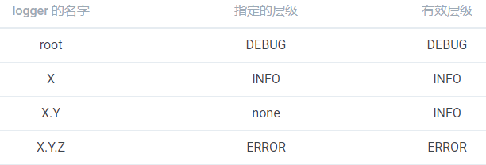

#### Logger

> Logger的层级

每一个 logger 都依附在 `LoggerContext` 上，它负责产生 logger，并且通过一个树状的层级结构来进行管理。

**Logger是分层级的，即名为 `com.foo` 的 logger 是名为 `com.foo.Bar` 的 logger 的父级。名为 `java` 的 logger 是名为 `java.util` 的父级，是名为 `java.util.Vector` 的祖先。**

**root logger是logger的最高层级，他是每一个logger的祖先。**

~~~shell
Logger rootLogger = LoggerFactory.getLogger(org.slf4j.Logger.ROOT_LOGGER_NAME)
~~~

logger是单例的，即同一个名称的只对应一个logger。

父级 logger 会自动寻找并关联子级 logger，即使父级 logger 在子级 logger 之后实例化。

> Logger的有效等级与等级继承

Logger 能够被分成不同的等级。不同的等级（TRACE, DEBUG, INFO, WARN, ERROR）定义在 `ch.qos.logback.classic.Level` 类中。

如果一个给定的 logger 没有指定一个层级，那么它就会继承离它最近的一个祖先的层级

**为了确保所有的 logger 都有一个层级，root logger 会有一个默认层级 --- DEBUG**

> 方法打印

Logger只会打印等级大于等于自身有效等级的日志， 即符合p>=q的日志

#### Appender

logger输出日志的目的地叫做appender。appender 包括console、file、socket 、MySQL、JMS。

一个logger可以有多个appender。logger 通过 `addAppender` 方法来新增一个 appender。

对于给定的 logger，每一个允许输出的日志都会被转发到该 logger 的所有 appender 中去。