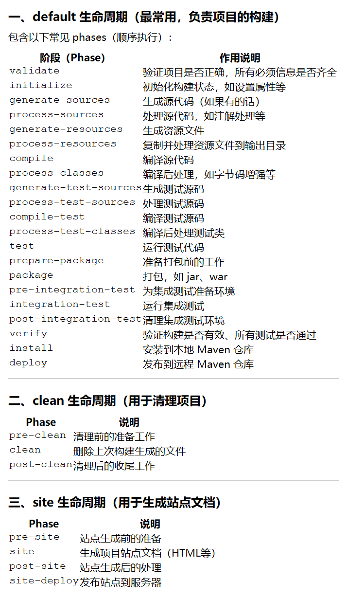
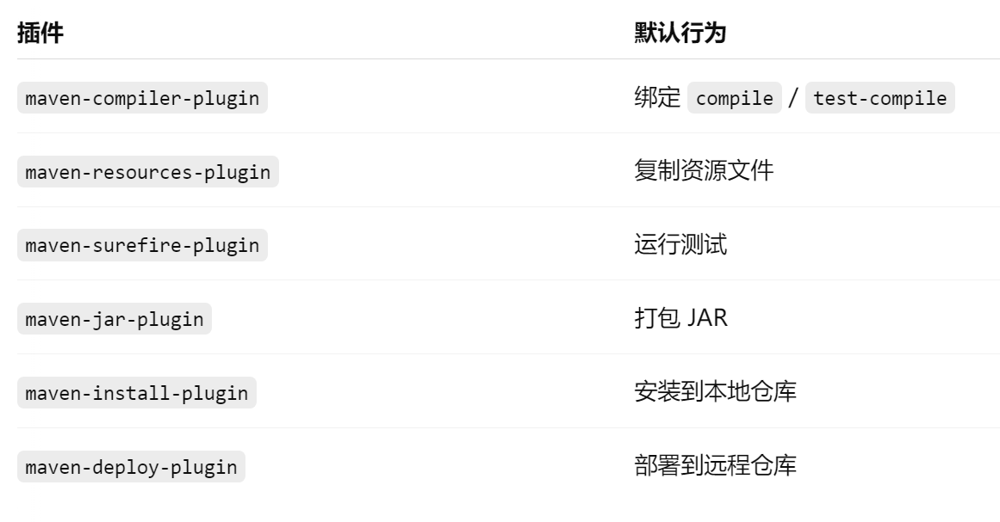
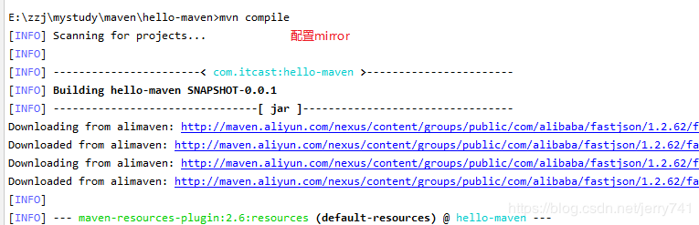
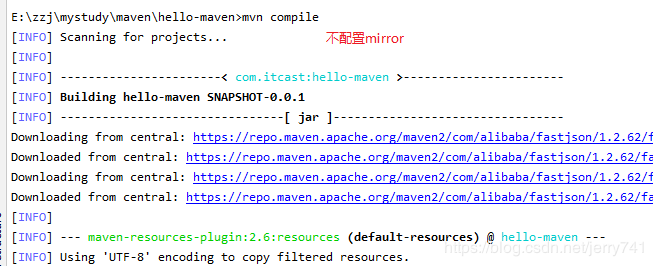
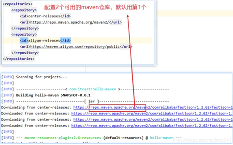
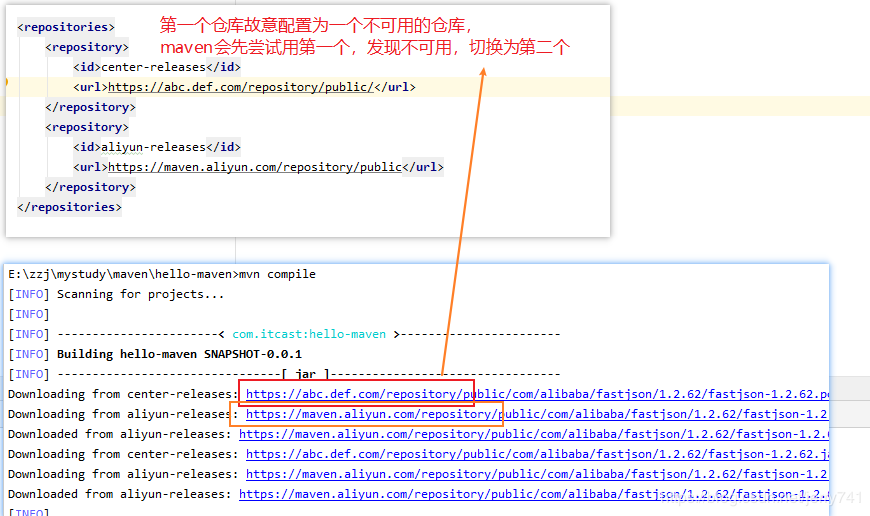
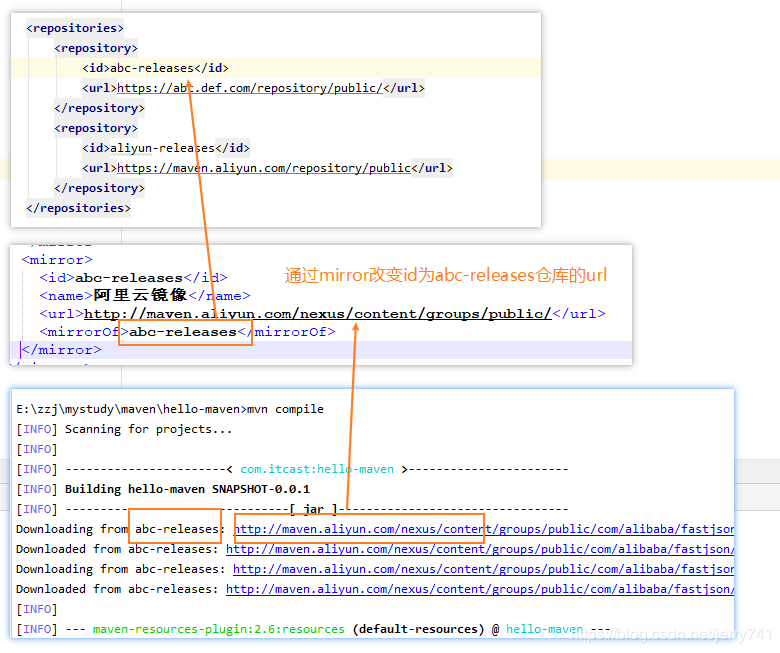
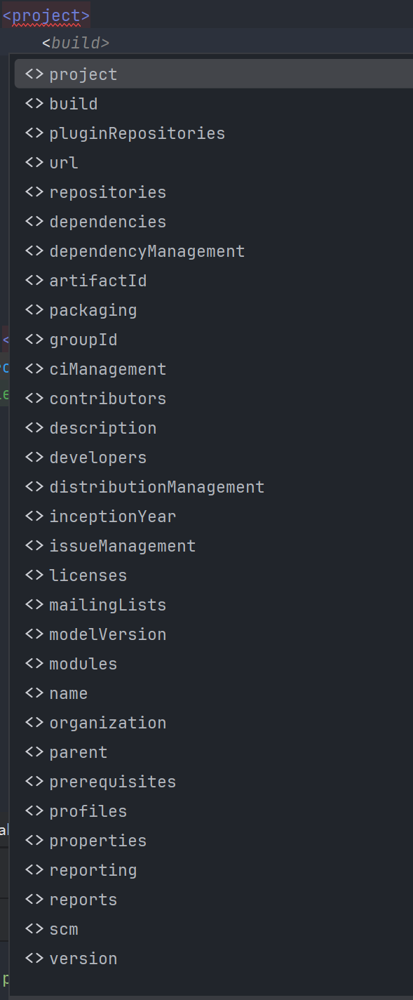

## 插件知识


### 生命周期

在maven中定义了三套生命周期, 分别是default, clean, site

生命周期中每个执行的步骤被称为phase



### phase

phase就是maven中每个生命周期中要执行的步骤, 比如上面的compile, process-resources等等


### goal和mojo

goal是由插件提供的一个个的任务, 每个插件包中可以包含多个goal

在插件中每个goal都有具体的实现类, 这个实现类被称为mojo, 比如`compiler:compile` 这个 goal 由 `CompilerMojo` 类实现。


我们可以通过如下代码在maven中添加插件

~~~xml
<build>
  <plugins>
    <plugin>
      <groupId>org.apache.maven.plugins</groupId>
      <artifactId>maven-compiler-plugin</artifactId>
      <version>3.8.1</version>
      <executions>
        <execution>
          <phase>compile</phase>
          <goals>
            <goal>compile</goal>
          </goals>
        </execution>
      </executions>
    </plugin>
  </plugins>
</build>
~~~

当maven执行到phase compile的时候, 就会自动执行goal compile了, 然后找到这个goal对应的mojo, 执行其中的代码


#### goal的手动触发

goal在绑定到特定的phase的时候, 会被指定自动执行

同时我们也可以手动来触发某个goal的执行

~~~shell
# 格式为: mvn group:artifact:goal
# 比如
mvn kr.motd.maven:show-goal-bindings:show
~~~

上面的代码就触发了`compiler`插件的compile这个goal

> 需要注意的时候, <font color=red>**手动执行 goal 时 Maven 不会自动处理依赖的前置 phase**</font>
>
> 比如有些goal是有依赖任务的, 比如执行`test`这个goal之前必须先编译好class文件
>
> 如果你没有编译好class文件, 那么手动执行`test`这个goal的话, 会失败的


**在执行maven的时候, 你不必处于项目的根目录下, 项目内的任何路径都可以, 他会递归父目录来查找pom.xml, 直到根目录**


#### goal的默认绑定

如果我们导入了一个插件, 但是不绑定任何的goal, 是不是这个插件就没有作用了呢?

~~~xml
<plugin>
  <groupId>org.apache.maven.plugins</groupId>
  <artifactId>maven-compiler-plugin</artifactId>
  <version>3.8.1</version>
</plugin>
~~~

其实不是的, 每个 Maven 插件在发布时，都会包含一个 `plugin.xml`（类似插件的元数据描述文件），**这个文件告诉 Maven：哪些 goal 默认绑定在哪些 phase 上**。

~~~xml
<mojos>
  <mojo>
    <goal>compile</goal>
    <phase>compile</phase>  <!-- 就是默认绑定 -->
    ...
  </mojo>
  <mojo>
    <goal>testCompile</goal>
    <phase>test-compile</phase>
    ...
  </mojo>
</mojos>
~~~

只要你执行了某个生命周期（比如 compile），Maven 就会自动找到那些默认绑定在这个 phase 的 goal 并执行它们。


你可以通过如下命令来查看一个插件的所有goal, 以及他们是否默认绑定到phase上面

~~~shell
mvn help:describe -Dplugin=groupId:artifactId:version -Dfull
~~~

> 而对于没有默认绑定到特定的phase上的goal, 那么他就不会被执行, 除非你手动执行他, 或者手动将他绑定到特定的goal上


你也可以通过这个插件来查看, phase上都绑定了哪些goal

~~~xml
<build>
  <plugins>
    <plugin>
      <groupId>kr.motd.maven</groupId>
      <artifactId>maven-show-goal-bindings</artifactId>
      <version>1.4</version>
      <executions>
        <execution>
          <goals>
            <goal>show</goal>
          </goals>
        </execution>
      </executions>
    </plugin>
  </plugins>
</build>
~~~

执行：

```bash
mvn kr.motd.maven:show-goal-bindings:show
```


### 默认的插件

Maven 自己并不直接“干活”，它只是个调度者，真正干活的是各个插件里的 goal。

如果你的maven项目中一个插件也没有添加, 那么maven会自动的给你添加上几个插件



这些插件中的goal会默认绑定到特定的phase上, 来保证最基本的功能


你可以通过如下代码来查看真正的pom文件

~~~shell
mvn help:effective-pom
~~~

这个命令会输出 **Maven 实际使用的 POM**，包括：

- 你自己声明的插件
- 父 POM 继承的插件
- 隐式引入的核心插件

下面是一个空的maven项目打印出来的

~~~xml
<project
    xmlns="http://maven.apache.org/POM/4.0.0"
    xmlns:xsi="http://www.w3.org/2001/XMLSchema-instance" xsi:schemaLocation="http://maven.apache.org/POM/4.0.0 https://maven.apache.org/xsd/maven-4.0.0.xsd">
    <modelVersion>4.0.0</modelVersion>
    <groupId>org.example</groupId>
    <artifactId>untitled</artifactId>
    <version>1.0-SNAPSHOT</version>
    <properties>
        <maven.compiler.source>17</maven.compiler.source>
        <maven.compiler.target>17</maven.compiler.target>
        <project.build.sourceEncoding>UTF-8</project.build.sourceEncoding>
    </properties>
    <repositories>
        <repository>
            <snapshots>
                <enabled>false</enabled>
            </snapshots>
            <id>central</id>
            <name>Central Repository</name>
            <url>https://repo.maven.apache.org/maven2</url>
        </repository>
    </repositories>
    <pluginRepositories>
        <pluginRepository>
            <snapshots>
                <enabled>false</enabled>
            </snapshots>
            <id>central</id>
            <name>Central Repository</name>
            <url>https://repo.maven.apache.org/maven2</url>
        </pluginRepository>
    </pluginRepositories>
    <build>
        <sourceDirectory>C:\Users\Administrator\Desktop\untitled\src\main\java</sourceDirectory>
        <scriptSourceDirectory>C:\Users\Administrator\Desktop\untitled\src\main\scripts</scriptSourceDirectory>
        <testSourceDirectory>C:\Users\Administrator\Desktop\untitled\src\test\java</testSourceDirectory>
        <outputDirectory>C:\Users\Administrator\Desktop\untitled\target\classes</outputDirectory>
        <testOutputDirectory>C:\Users\Administrator\Desktop\untitled\target\test-classes</testOutputDirectory>
        <resources>
            <resource>
                <directory>C:\Users\Administrator\Desktop\untitled\src\main\resources</directory>
            </resource>
        </resources>
        <testResources>
            <testResource>
                <directory>C:\Users\Administrator\Desktop\untitled\src\test\resources</directory>
            </testResource>
        </testResources>
        <directory>C:\Users\Administrator\Desktop\untitled\target</directory>
        <finalName>untitled-1.0-SNAPSHOT</finalName>
        <pluginManagement>
            <plugins>
                <plugin>
                    <artifactId>maven-antrun-plugin</artifactId>
                    <version>3.1.0</version>
                </plugin>
                <plugin>
                    <artifactId>maven-assembly-plugin</artifactId>
                    <version>3.7.1</version>
                </plugin>
                <plugin>
                    <artifactId>maven-dependency-plugin</artifactId>
                    <version>3.7.0</version>
                </plugin>
                <plugin>
                    <artifactId>maven-release-plugin</artifactId>
                    <version>3.0.1</version>
                </plugin>
            </plugins>
        </pluginManagement>
        <plugins>
            <plugin>
                <artifactId>maven-clean-plugin</artifactId>
                <version>3.2.0</version>
                <executions>
                    <execution>
                        <id>default-clean</id>
                        <phase>clean</phase>
                        <goals>
                            <goal>clean</goal>
                        </goals>
                    </execution>
                </executions>
            </plugin>
            <plugin>
                <artifactId>maven-resources-plugin</artifactId>
                <version>3.3.1</version>
                <executions>
                    <execution>
                        <id>default-testResources</id>
                        <phase>process-test-resources</phase>
                        <goals>
                            <goal>testResources</goal>
                        </goals>
                    </execution>
                    <execution>
                        <id>default-resources</id>
                        <phase>process-resources</phase>
                        <goals>
                            <goal>resources</goal>
                        </goals>
                    </execution>
                </executions>
            </plugin>
            <plugin>
                <artifactId>maven-jar-plugin</artifactId>
                <version>3.4.1</version>
                <executions>
                    <execution>
                        <id>default-jar</id>
                        <phase>package</phase>
                        <goals>
                            <goal>jar</goal>
                        </goals>
                    </execution>
                </executions>
            </plugin>
            <plugin>
                <artifactId>maven-compiler-plugin</artifactId>
                <version>3.13.0</version>
                <executions>
                    <execution>
                        <id>default-compile</id>
                        <phase>compile</phase>
                        <goals>
                            <goal>compile</goal>
                        </goals>
                    </execution>
                    <execution>
                        <id>default-testCompile</id>
                        <phase>test-compile</phase>
                        <goals>
                            <goal>testCompile</goal>
                        </goals>
                    </execution>
                </executions>
            </plugin>
            <plugin>
                <artifactId>maven-surefire-plugin</artifactId>
                <version>3.2.5</version>
                <executions>
                    <execution>
                        <id>default-test</id>
                        <phase>test</phase>
                        <goals>
                            <goal>test</goal>
                        </goals>
                    </execution>
                </executions>
            </plugin>
            <plugin>
                <artifactId>maven-install-plugin</artifactId>
                <version>3.1.2</version>
                <executions>
                    <execution>
                        <id>default-install</id>
                        <phase>install</phase>
                        <goals>
                            <goal>install</goal>
                        </goals>
                    </execution>
                </executions>
            </plugin>
            <plugin>
                <artifactId>maven-deploy-plugin</artifactId>
                <version>3.1.2</version>
                <executions>
                    <execution>
                        <id>default-deploy</id>
                        <phase>deploy</phase>
                        <goals>
                            <goal>deploy</goal>
                        </goals>
                    </execution>
                </executions>
            </plugin>
            <plugin>
                <artifactId>maven-site-plugin</artifactId>
                <version>3.12.1</version>
                <executions>
                    <execution>
                        <id>default-site</id>
                        <phase>site</phase>
                        <goals>
                            <goal>site</goal>
                        </goals>
                        <configuration>
                            <outputDirectory>C:\Users\Administrator\Desktop\untitled\target\site</outputDirectory>
                            <reportPlugins>
                                <reportPlugin>
                                    <groupId>org.apache.maven.plugins</groupId>
                                    <artifactId>maven-project-info-reports-plugin</artifactId>
                                </reportPlugin>
                            </reportPlugins>
                        </configuration>
                    </execution>
                    <execution>
                        <id>default-deploy</id>
                        <phase>site-deploy</phase>
                        <goals>
                            <goal>deploy</goal>
                        </goals>
                        <configuration>
                            <outputDirectory>C:\Users\Administrator\Desktop\untitled\target\site</outputDirectory>
                            <reportPlugins>
                                <reportPlugin>
                                    <groupId>org.apache.maven.plugins</groupId>
                                    <artifactId>maven-project-info-reports-plugin</artifactId>
                                </reportPlugin>
                            </reportPlugins>
                        </configuration>
                    </execution>
                </executions>
                <configuration>
                    <outputDirectory>C:\Users\Administrator\Desktop\untitled\target\site</outputDirectory>
                    <reportPlugins>
                        <reportPlugin>
                            <groupId>org.apache.maven.plugins</groupId>
                            <artifactId>maven-project-info-reports-plugin</artifactId>
                        </reportPlugin>
                    </reportPlugins>
                </configuration>
            </plugin>
        </plugins>
    </build>
    <reporting>
        <outputDirectory>C:\Users\Administrator\Desktop\untitled\target\site</outputDirectory>
    </reporting>
</project>
~~~


### 查看哪些goal绑定到了phase

maven中并没有提供直接的命令来查看各个phase到底绑定了哪些goal, 但是我们可以通过`mvn.cmd help:effective-pom`这个命令来生成执行时的pom文件

通过解析这个文件, 可以获取哪些goal绑定了哪些phase

下面是Java代码的时候, 他在执行的时候, 会打印所有的phase上面绑定的goal, 同时你也可以使用`--phase xxx`来指定要打印的phase上面绑定的goal

~~~java
import javax.xml.parsers.DocumentBuilderFactory;
import javax.xml.parsers.DocumentBuilder;
import org.w3c.dom.*;
import java.io.*;
import java.util.*;

public class MavenGoalBindings {
    public static void main(String[] args) throws Exception {
        String phaseFilter = null;
        for (int i = 0; i < args.length - 1; i++) {
            if ("--phase".equals(args[i])) {
                phaseFilter = args[i + 1];
            }
        }

        File effectivePom = File.createTempFile("effective-pom", ".xml");
        generateEffectivePom(effectivePom);

        Map<String, List<String>> bindings = parseEffectivePom(effectivePom);
        effectivePom.delete();

        if (phaseFilter != null) {
            List<String> goals = bindings.get(phaseFilter);
            if (goals != null) {
                System.out.println("🔹 " + phaseFilter);
                goals.forEach(goal -> System.out.println("   ↪ " + goal));
            } else {
                System.out.println("⚠️ No goals bound to phase: " + phaseFilter);
            }
        } else {
            bindings.keySet().stream().sorted().forEach(phase -> {
                System.out.println("\n🔹 " + phase);
                bindings.get(phase).forEach(goal -> System.out.println("   ↪ " + goal));
            });
        }
    }

    private static void generateEffectivePom(File outputFile) throws IOException, InterruptedException {
        ProcessBuilder pb = new ProcessBuilder(
                "mvn.cmd", "help:effective-pom", "-Doutput=" + outputFile.getAbsolutePath()
        );
        Map<String, String> env = pb.environment();
        env.put("PATH", System.getenv("PATH"));

        pb.inheritIO();
        Process process = pb.start();
        int exitCode = process.waitFor();
        if (exitCode != 0) {
            throw new RuntimeException("❌ Failed to generate effective POM");
        }
    }

    private static Map<String, List<String>> parseEffectivePom(File pomFile) throws Exception {
        Map<String, List<String>> phaseMap = new HashMap<>();

        DocumentBuilderFactory dbf = DocumentBuilderFactory.newInstance();
        dbf.setNamespaceAware(true); // Handle Maven's XML namespace
        DocumentBuilder db = dbf.newDocumentBuilder();
        Document doc = db.parse(pomFile);
        doc.getDocumentElement().normalize();

        NodeList plugins = doc.getElementsByTagNameNS("*", "plugin");

        for (int i = 0; i < plugins.getLength(); i++) {
            Element plugin = (Element) plugins.item(i);
            String groupId = getText(plugin, "groupId", "org.apache.maven.plugins");
            String artifactId = getText(plugin, "artifactId", null);

            if (artifactId == null) continue;

            NodeList executions = plugin.getElementsByTagNameNS("*", "execution");
            for (int j = 0; j < executions.getLength(); j++) {
                Element execution = (Element) executions.item(j);
                String phase = getText(execution, "phase", null);
                if (phase == null) continue;

                NodeList goals = execution.getElementsByTagNameNS("*", "goal");
                for (int k = 0; k < goals.getLength(); k++) {
                    String goal = goals.item(k).getTextContent().trim();
                    String full = groupId + ":" + artifactId + ":" + goal;
                    phaseMap.computeIfAbsent(phase, x -> new ArrayList<>()).add(full);
                }
            }
        }

        return phaseMap;
    }

    private static String getText(Element parent, String tag, String defaultValue) {
        NodeList list = parent.getElementsByTagNameNS("*", tag);
        if (list.getLength() > 0) {
            return list.item(0).getTextContent().trim();
        }
        return defaultValue;
    }
}
~~~


## plugin标签

~~~xml
      <plugin>
        <groupId>com.groupId</groupId>
        <artifactId>com.artifactId</artifactId>
        <version>1.0-SNAPSHOT</version>
        <!-- 表示该插件是一个 Maven 核心机制的扩展插件，它不只是普通地执行某些 goals，还可能：
             - 扩展 Maven 的构建生命周期（如添加新的生命周期、phase）；
             - 修改 Maven 的解析逻辑、项目构建机制
             - 动态注入功能，比如仓库解析、打包行为等
             - 需要在 Maven 的类加载器中生效（这点很关键）。
            Maven 会在构建开始前加载它，让它“驻留”在构建过程的类加载环境中。
            除非你很明确自己在干嘛, 否则不要使用这个选项
        -->
        <extensions>false</extensions>

        <!-- 表示当前这个插件是否要继承到子pom中, 如果是的话, 那么子项目也会有这个插件和所有的configuration, executions等等 -->
        <inherited>true</inherited>

        <!-- combine.children控制当前插件发送到子pom中的时候,是采用
                - merge(相同的key合并)(默认)
                - append(直接将子节点追加,不做合并)

             combine.self控制当前当前configuration节点怎么样继承父pom中的configuration
                - override: 用当前节点的configuration覆盖父pom中的configuration
                - merge: 用当前节点的configuration合并父pom中的configuration
              -->
        <!-- 这里的这个configuration作用于整个插件, 在所有的goal上面都可以读取 -->
        <configuration combine.children="append" combine.self="override">

        </configuration>

        <executions>
          <!-- 一个execution是goal的集合, 每个execution都可以有不同的configuration -->
          <execution>
            <!-- 想通id的execution在继承的时候会合并 -->
            <id>haha</id>

            <!-- 如果省略, 那么goal会绑定到默认的phase -->
            <phase>package</phase>

            <!-- 控制当前这个execution是否要继承到子pom中, 优先于外层的inherited -->
            <inherited>true</inherited>

            <!-- 这里的configuration作用于特定的goal, 并且较外层的有更高的优先级 -->
            <configuration combine.self="override" combine.children="append">

            </configuration>
            <goals>
              <goal>a</goal>
              <goal>b</goal>
            </goals>
          </execution>

          <execution>
            <!-- 这里还可以有另外一个execution, 他们可以有不同的configuration -->
          </execution>
        </executions>
        
        <!-- 需要传递给插件的classloader的额外依赖 -->
        <dependencies>

        </dependencies>
      </plugin>
~~~


## Plexus Container

Plexus Container其实是maven内部的一个ioc容器框架, 因为maven的第一个版本是在2002年发布的, 那个时候虽然有了ioc的思想, 但是还没有出现Spring这个框架

所以在maven早期的时候, 就实现了以及的一套ioc框架, 就是Plexus Container

Plexus类似其他的IOC框架，如Spring，但它还额外提供了很多特性，如：组件生命周期管理、组件实例化策略、嵌套容器、组件配置、自动注入、组件依赖、各种依赖注入方式（如构造器注入、setter注入、字段注入）。

Plexus下面主要有如下几个模块:

- Plexus Classworlds，类加载器框架，Maven至今还在用，个人感觉也挺不错，推荐学习学习；

- Plexus Container，IOC容器，Maven 1.x/2.x在用，3.0版本后，Maven自身也没有再使用了

- Plexus Components: 

- Maven的工作就是和各种文件、目录打交道，这期间，会沉淀出来很多公用组件:

  - IO相关的，`Plexus IO Components`，它的maven坐标：

  ```xml
  <dependency>
      <groupId>org.codehaus.plexus</groupId>
      <artifactId>plexus-io</artifactId>
      <version>3.2.0</version>
  </dependency>
  ```

  - 归档相关的，Plexus Archiver Component，maven坐标：

  ```xml
  <dependency>
      <groupId>org.codehaus.plexus</groupId>
      <artifactId>plexus-archiver</artifactId>
      <version>4.2.5</version>
  </dependency>
  ```

  - cli相关，Plexus CLI

  - 编译相关，Plexus Compiler

  - Digest/Hashcode相关，Plexus Digest / Hashcode Components

  - 国际化相关，i18n

  还有些其他的，我懒得列举了，大家自己看吧，https://web.archive.org/web/20150225072024/http://plexus.codehaus.org/plexus-components/

- Plexus Maven Plugin: 用来支持Maven插件

- Plexus Utils: 工具类，至今仍在用

### 现状

在maven2.0中, 与plexus相关的jar包只有少数几个了, 而在maven3.0中, 更是没有了plexus的声影

原因在于在maven3的时候, Spring已经开始成为事实上的IOC容器标准，不过，虽然Spring在应用开发领域，所向披靡，但是在各种框架中，框架开发者们还是觉得Spring太重了，一下就要引入好几个jar包，实在是过于臃肿。

因此，google 在2007年的时候，就推出了一个轻量级的依赖注入框架，叫google guice。经过多年的迭代，在2010年前后，guice已经比较成熟了，在google内部也而得到了广泛应用，且依赖注入这个领域，也在持续不断地发展中，比如java官方定义了相关的标准api。

经过多年的迭代，在2010年前后，guice已经比较成熟了，在google内部也而得到了广泛应用，且依赖注入这个领域，也在持续不断地发展中，比如java官方定义了相关的标准api。


## maven官方插件

### maven-invoker-plugin

这个插件的主要作用是, 当前项目执行的时候, 能够自动的调用别的项目构建并验证别的项目的输出

使用场景

1. 比如我有一个项目a, b,c, 项目bc依赖项目a, 我希望a在构建的时候, 自动帮我构建项目bc, 并验证是否构建成功
2. 我有一个插件a, 同时有两个测试项目bc, 我想插件a在构建的时候, 自动构建bc, 看看插件有没有达到预期


maven-invoker-plugin一共提供了六个goal:

1. `invoker:help`

   执行他可以打印invoker插件的帮助文档,  有哪些goal, 他们的作用

   还可以通过`-Ddetail=true`来打印详细的文档, 包括每个goal可以配置的参数

   还可以通过`-Dgoal=<goal-name>`来打印指定goal的帮助文档

2. `invoker:install`

   在调用项目之前, 将**当前项目和他的父项目打包的jar包和他的需要的所有依赖**install到本地仓库, 这样如果调用的项目依赖了当前项目, 就可以直接**最新**的版本

   默认绑定到`pre-integration-test`phase

   参数有

   | 参数名                                                       | 说明                                                         | 备注                                                         |
   | ------------------------------------------------------------ | ------------------------------------------------------------ | ------------------------------------------------------------ |
   | **extraArtifacts**                                           | 指定**额外**需要安装到本地仓库的依赖。 格式是： `groupId:artifactId:version:type:classifier`  **例子**： `org.apache.maven.plugins:maven-clean-plugin:2.4:maven-plugin` `org.apache.maven.plugins:maven-clean-plugin:2.4:jar:javadoc`  如果 `type` 是 `maven-plugin`，那么插件会用**plugin 仓库**而不是普通 artifact 仓库来解析。 | **注意**： 这里的依赖会被当做运行时（runtime scope）处理，且**会自动拉上它们的传递依赖（transitive dependencies）**。 |
   | **localRepositoryPath**  (默认值：`${session.localRepository.basedir}`) | 指定要安装这些 artifacts 的本地仓库路径。 如果不设，默认就是 Maven 的本地仓库（通常是 `~/.m2/repository`）。  **推荐**设成一个独立路径，比如： `${project.build.directory}/it-repo` 避免污染你平常用的本地仓库。 | **必填**参数（Required: Yes） 也可以通过命令行属性传：`-Dinvoker.localRepositoryPath=xxx` |
   | **scope**  (默认值：`runtime`)                               | 解析项目 artifact 时使用的依赖范围（scope）。 默认是 `runtime`，即运行时需要的依赖。 | 可以用 `-Dinvoker.install.scope=compile` 这样覆盖。          |
   | **skipInstallation**  (默认值：`false`)                      | 是否跳过 install 过程。 比如，有时候你只是想临时调试，想跳过 install，节省时间。 | 可以用命令行设置： `-Dinvoker.skip=true`                     |

3. `invoker:integration-test`

   搜索需要执行的项目, 并执行他们, 然后收集执行日志

   默认绑定到的生命周期: `integration-test`

   参数有如下几个:

   ```xml
   <plugin>
       <!--
           你只需要将使用到了插件的项目, 放到src/it目录下(这个目录是默认的, 可以配置)
        -->
       <groupId>org.apache.maven.plugins</groupId>
       <artifactId>maven-invoker-plugin</artifactId>
       <version>3.9.0</version>
   
       <configuration>
   
           <!-- 项目被调用前, 将他clone到指定的目录, 在clone后的项目中调用项目
                如果不设置的话, 就在项目的原始根目录下执行
                (如果运行 invoker 插件的是一个 maven-plugin 类型的项目,
                那么无论有没有设置 clone 目录，IT 项目都会默认被克隆到并在 target/its/ 目录下执行)
   
                最好还是设置一下
            -->
           <cloneProjectsTo>${project.build.directory}/it</cloneProjectsTo>
           <!-- 要克隆的项目, 默认情况下是所有的项目, 但是你可以手动制定 -->
           <collectedProjects>
               <collectedProject>../use-plugin</collectedProject>
           </collectedProjects>
           <!-- 在执行项目的时候, 需要调用的goals, 默认是package -->
           <goals>
               <goal>clean</goal>
               <goal>test-compile</goal>
           </goals>
           <!-- 可以在文件中定义调用项目时, 使用到的一些配置
                 文件中的配置优先级比这里高 -->
           <invokerPropertiesFile>src/it/invoker.properties</invokerPropertiesFile>
   
           <!-- 要执行的测试, 逗号分割, 不执行测试使用! -->
           <invokerTest>SimpleTest,Comp*Test,!Compare*</invokerTest>
           <!-- 定义一个本地存储库, 默认情况下会使用maven仓库,强烈建议指定一个独立存储库（例如 ${project.build.directory}/it-repo ）的路径。
                否则，系统将使用您的普通本地存储库，这可能会导致损坏的工件污染该存储库。  -->
           <localRepositoryPath>${project.build.directory}/it-repo</localRepositoryPath>
   
           <!-- 默认情况下, 项目的测试日志会被保存在项目根目录的build.log中,
                可以通过这个参数来指定保存到其他位置 -->
           <!-- <logDirect></logDirect> -->
   
   
           <!-- 需要调用和排除的项目的pom文件, 默认是${projectsDirectory}/*/pom.xml -->
           <pomIncludes>
               <pomInclude>*/pom.xml</pomInclude>
           </pomIncludes>
           <pomExcludes>
               <pomExclude>*/pom.xml</pomExclude>
           </pomExcludes>
           <!-- 搜索要调用项目的目录, 默认值${basedir}/src/it/ -->
           <projectsDirectory>${basedir}/src/it/</projectsDirectory>
   
   
           <!-- 执行构建后要运行的清理/验证钩子脚本的相对路径, 可以指定.bash和.groovy文件
                如果省略文件后缀, 默认使用.bash和.groovy来匹配
                比如verify等效于verify.bash和verify.groovy -->
           <postBuildHookScript>verify</postBuildHookScript>
           <!-- 同上, 在项目构建前要执行的脚本 -->
           <preBuildHookScript>clean</preBuildHookScript>
           <!-- 在构建项目的时候, 要指定的profile-->
           <profiles>
               <profile>dev</profile>
               <profile>web</profile>
           </profiles>
           <!-- 在构建项目的时候, 要通过-D传递的参数 -->
           <properties>
               <key1>value1</key1>
               <key2>value2</key2>
           </properties>
           <!-- 所有构建报告写入的基目录。每次执行集成测试都会生成一个 XML 文件，其中包含该构建作业成功或失败的信息
                默认值是${project.build.directory}/invoker-reports
                使用默认值就好 -->
           <reportsDirectory>${project.build.directory}/invoker-reports</reportsDirectory>
           <!-- 调用项目时, 指定使用的settigns.xml文件
                (文件中的<localRepository>会被忽略, 参数 localRepositoryPath 指定的路径将占主导地位) -->
           <settingsFile>src/it/settings.xml</settingsFile>
       </configuration>
       <executions>
           <execution>
               <id>integration-test</id>
               <goals>
                   <goal>install</goal>
                   <goal>integration-test</goal>
                   <goal>verify</goal>
               </goals>
           </execution>
       </executions>
   </plugin>
   ```

4. `invoker:verify`

   检查项目构建是否成功, 测试是否执行成功, postBuildHookScript脚本是否执行成功

   默认绑定到`verify`phase上

   这个goal的参数没什么好说的, 都是一些没用的参数

5. `invoker:run`

   运行这个goal就等效于运行了integration-test和verify两个goal

   并且integration-test和verify的参数, 在这里都可以配置

6. `invoker:report`

   将构建结果发布到站点中, 不知道有什么用

具体的使用可以查看`maven-plugin-test`这个项目


### maven-assembly-plugin

这个插件主要是用来将我们的项目打包为发行版本的, 比如我们从flink, dinky, dolphinscheduler这些网站下载的安装包

这个插件有两个goal: `help`和`single`

- `assembly:help`

  主要的作用是输出帮助信息

- `assembly:single`

  打包发行版本

  这个goal没有默认绑定的phase, 所以你如果要绑定到生命周期上的时候要指定phase, 如果不指定的话, 那么只能直接调用了

  详细的使用你可以查看文档, 或者本地的`assembly-test`项目

  

### maven-jar-plugin

这个插件主要是用来打jar包的, 其中只有一个help和jar两个goal

`jar:jar`默认绑定到`package`phase上面

尽管他有一些可以自定义的参数, 但是都是无关紧要的, 直接使用默认值就可以了

尽管jar这个goal可以打包可执行文件, 但是他并不会将所有的依赖一起打包进去, 你如果像打包可执行依赖, 还是使用maven-shade-plugin这个插件比较好


### maven-shade-plugin

这个插件主要用来打可执行jar包的, 并且他可以包含所有/部分的依赖

它里面只有`help`和`shade`两个goal

其中shade默认绑定到`package` phase

这个插件的使用场景是:

1. 我想将所有依赖都打包进来, 打包成一个可执行jar包

   ~~~xml
   <build>
     <plugins>
       <plugin>
         <groupId>org.apache.maven.plugins</groupId>
         <artifactId>maven-shade-plugin</artifactId>
         <version>3.6.0</version>
         <executions>
           <execution>
             <phase>package</phase> 
             <goals>
               <goal>shade</goal>   
             </goals>
             <configuration>
               <!-- 指定程序入口（Main-Class） -->
               <transformers>
                 <transformer implementation="org.apache.maven.plugins.shade.resource.ManifestResourceTransformer">
                   <mainClass>com.example.Main</mainClass> <!-- 这里改成你的启动类 -->
                 </transformer>
               </transformers>
             </configuration>
           </execution>
         </executions>
       </plugin>
     </plugins>
   </build>
   ~~~

2. 我想将当前项目的多个模块, 打包为一个uber包, 这样别人只需要引用这一个包, 就相当于使用了所有包


具体的参数可以查看本地的`shade-plugin-test`项目


## 自定义插件

查看本地项目的`maven-plugin-test`


## Maven隐含变量

Maven提供了三个隐式的变量可以用来访问环境变量，POM信息，和Maven Settings

#### env

env变量，暴露了你操作系统或者shell的环境变量。比如在Maven POM中一个对\${env.PATH}的引用将会被 ​\${PATH}环境变量替换，在Windows中为%PATH%.

#### project

project变量暴露了POM。可以使用点标记(.)的路径来引用POM元素的值。例如

```xml
<project>
	<modelVersion>4.0.0</modelVersion>
    <groupId>org.sonatype.mavenbook</groupId>
	<artifactId>project-a</artifactId>
	<version>1.0-SNAPSHOT</version>
	<packaging>jar</packaging>
	<build>
		<finalName>${project.groupId}-${project.artifactId</finalName>
	</build>
</project>
```

当你使用mvn help:effective-pom 查看时,你会看到<finalName>org.sonatype.mavenbook-project-a</finalName>


${basedir} 项目根目录 ​

\${project.build.directory} 构建目录, 缺省为target ​

\${project.build.outputDirectory} 构建过程输出目录, 缺省为target/classes

 ​\${project.build.finalName} 产出物名称, 缺省为\${project.artifactId}- \${project.version} 

\${project.packaging} 打包类型缺省为jar

\${project.xxx} 当前pom文件的任意节点的内容

#### settings

settings变量暴露了Maven settings信息。可以使用点标记(.)的路径来引用settings.xml文件中元素的值。

**例如${settings.offline}会引用~/.m2/settings.xml文件中offline元素的值。**

## maven 获取编译时间和pom中的版本号

1. Maven中获得编译时间

   在 pom文件`properties` 中添加两个属性

   ~~~xml
   <properties>
       <!--maven.build.timestamp保存了maven编译时间戳-->
       <timestamp>${maven.build.timestamp}</timestamp>
       <!--指定时间格式-->    
       <maven.build.timestamp.format>yyyy-MM-dd HH:mm:ss</maven.build.timestamp.format>
   </properties>
   ~~~

2. 在pom文件`build`中配置

   ```xml
   <build>
       <resources>
           <resource>
               <directory>src/main/resources</directory>
               <filtering>true</filtering>
           </resource>
       </resources>
   </build>
   12345678
   ```

3. 在`application.yml`中配置

   > 不能使用`${}`

   ```yml
   app:
     version: @project.version@
     build:
       time: @timestamp@
   ```

4. 提供接口

   ```java
   package com.example.demo;
   
   import java.util.HashMap;
   import java.util.Map;
   
   import org.springframework.beans.factory.annotation.Value;
   import org.springframework.web.bind.annotation.GetMapping;
   import org.springframework.web.bind.annotation.RequestMapping;
   import org.springframework.web.bind.annotation.RestController;
   
   @RestController
   @RequestMapping("/app")
   public class AppController {
       /**
        * 当前版本
        */
       @Value("${app.version}")
       private String version;
       /**
        * 打包时间
        */
       @Value("${app.build.time}")
       private String buildTime;
   
       @GetMapping
       public Map<String, String> uploadImg() {
           Map<String, String> ret = new HashMap<>();
           ret.put("version", version);
           ret.put("buildTime", buildTime);
           System.out.println(version + "," + buildTime);
           return ret;
       }
   }
   ```

#### `maven.build.timestamp`时区错误解决方案

在Maven 3.2.2+中， `maven.build.timestamp`已被重新定义，显示UTC中的时间,比中国时间慢8个小时。

要么自己处理, 加上八个小时, 或者使用插件`build-helper-maven-plugin`获得本时区的时间

~~~xml
    <build>
        <plugins>
            <plugin>
                <groupId>org.codehaus.mojo</groupId>
                <artifactId>build-helper-maven-plugin</artifactId>
                <version>1.8</version>
                <executions>
                    <execution>
                        <id>timestamp-property</id>
                        <goals>
                            <goal>timestamp-property</goal>
                        </goals>
                    </execution>
                </executions>
                <configuration>
                    <!-- 指定的property的名字 -->
                    <name>build.time</name>
                    <!-- 格式 -->
                    <pattern>yyyy-MM-dd HH:mm:ss.SSS</pattern>
                    <!-- 时区 -->
                    <timeZone>GMT+8</timeZone>
                </configuration>
            </plugin>
        </plugins>
        <resources>
            <resource>
                <directory>src/main/resources</directory>
                <filtering>true</filtering>
                <includes>
                    <!-- 指定要变量替换的文件 -->
                    <include>application.yml</include>
                </includes>
            </resource>
        </resources>

    </build>
~~~

经过上述处理后，属性`${build.time}`已经代表GMT-8时区的时间

`application.yml`配置如下

```yml
app:
  version: @project.version@
  build:
    time: @build.time@
```


#### 把时间戳加到包名

两种方法不要重复，否则

方法一：**把时间戳加到版本号**

```xml
<project>
    <versioin>
        0.0.5.${build.time}
    </version>
</project>
12345
```

方法二：**把时间戳直接加到包名**

```xml
<project>
    <build>
        <finalName>
            ${project.artifactId}-${project.version}-${build.time}
        </finalName>
    </build>    
    
</project>
```

## maven 属性过滤

~~~xml
   <build>
        <resources>
            <resource>
                <!-- 指定目录 -->
                <directory>src/main/resources/</directory>
                <!-- include的文件要进行变量替换 -->
                <filtering>true</filtering>
                <!-- 要过滤的文件 -->
                <includes>
                    <include>**/*.properties</include>
                    <include>**/*.yaml</include>
                </includes>
                <!-- 指定不要过滤的文件 -->
                <excludes>
                    <exclude>**/*.xml</exclude>
                </excludes>
            </resource>
            <resource>
                <directory>src/main/resources</directory>
                <!-- include的文件不需要变量替换 -->
                <filtering>false</filtering>
                <includes>
                    <include>**/*.xml</include>
                </includes>
            </resource>
        </resources>
    </build>
~~~

然后在resources下面的properties文件中, 可以使用`${xxx}`或者`@xxx@`来获取maven中的变量

注意: 在yml中不能使用`@xxx@`的形式

## repository标签和mirror标签

**原始的maven仓库**

所有的项目都自带一个仓库, 他定义在`pom-4.0.0.xml`中,这个就是所有Maven POM的父POM，所有Maven项目继承该配置

~~~xml
    <repository>
      <id>central</id>
      <name>Central Repository</name>
      <url>https://repo.maven.apache.org/maven2</url>
      <layout>default</layout>
      <snapshots>
        <enabled>false</enabled>
      </snapshots>
    </repository>
  </repositories>
~~~


**仓库的分类**

仓库一般分为release库和snapshot库,release库存放正式版本,snapshot库存放快照版本.两者的区别:

- 从远程仓库拉取的release版本依赖,如果远程仓库的该依赖版本升级,并且依赖的名称没有更改,那么本地项目的依赖就无法更新,比如Junit-4.10.jar,如果远程仓库版本升级,如果还采用Junit-4.10.jar名称,那么本地项目的依赖就无法更新,只有升级为Junit-4.11.jar,才会更新.
- snapshot版本依赖每次都会去远程仓库中检查该依赖是否更新,即使名称一样也会去检查,如果有更新则下载到本地仓库.推荐禁止从公共仓库下载snapshot构件，因为这些构件不稳定且不受控制，避免使用

~~~xml
<repositories>
  <repository>
    <id>aliyun-releases</id>
    <name>阿里云仓库(name可以随便起)</name>
    <url>https://maven.aliyun.com/repository/public</url>
    <releases>
      <!-- 默认为true, 表示是否需要重这个仓库下载稳定版本的jar包 -->
      <enabled>true</enabled>
    </releases>
    <snapshots>
      <!-- 默认为true, 表示是否需要重这个仓库下载快照版本的jar包 -->
      <enabled>false</enabled>
    </snapshots>
  </repository>
</repositories>
~~~


**pom.xml中配置多个远程仓库**

项目所需的依赖,可能不在中央仓库中,可能只存在于某个特定的公共仓库,这时就需要配置多个远程仓库了.比如:

```xml
 	<repository>
 		<id>aliyun</id>
 		<name>aliyun Repository</name>
 		<url>http://maven.aliyun.com/nexus/content/groups/public</url>
 		<snapshots>
 			<enabled>false</enabled>
 		</snapshots>
 	</repository>
 	<repository>
 		<id>jeecg</id>
 		<name>jeecg Repository</name>
 		<url>http://maven.jeecg.org/nexus/content/repositories/jeecg</url>
 		<snapshots>
 			<enabled>false</enabled>
 		</snapshots>
 	</repository>
 </repositories>
```


**仓库的优先级**

仓库优先级为：本地仓库(localRepositories) > profile中配置的repositories仓库 > pom中配置的repository仓库 > settings.xml中配置的mirrors


**通过mirror配置**

如果仓库X可以提供仓库Y所有的内容，那么我们就可以认为X是Y的一个镜像，通俗点说，可以从Y获取的构件都可以从他的镜像中进行获取。可以采用镜像的方式配置远程仓库，镜像在settings.xml中进行配置，在`setting.xml`中的`<mirrors>`标签下加入如下子标签配置便配置了一个maven镜像。

```xml
<mirror>
  <id>alimaven</id>
  <name>aliyun maven</name>
  <!--mirrorOf的配置很重要后面会详细说明-->
  <mirrorOf>central</mirrorOf>
  <url>http://maven.aliyun.com/nexus/content/groups/public/</url>
</mirror>
```

添加如上配置后，maven会读取setting.xml中配置的mirror作为jar包的下载地址，我们以在项目中下载fastjson为例来看一下效果。





可以看到，配置了上面的mirror后，maven是从aliyun仓库下载的jar包，不配置的时候，默认从apache的maven中央仓库下载的jar包。

上面提到，`<mirrorOf></mirrorOf>`的设置很重要，比如上面我设置的mirrorOf为`<mirrorOf>central</mirrorOf>`，如果`<mirrorOf></mirrorOf>`我随便设置一个参数，如`<mirrorOf>abc</mirrorOf>`，这时候我们配置的仓库就不起作用了，**这是因为maven默认内置了如下一个仓库，这个默认仓库的id为central，**当我们把mirrorOf设置为`<mirrorOf>central</mirrorOf>`时，maven就会查找有没有id为central的仓库，然后把id为central的仓库地址换成我们`<mirror>`标签配置的那个url，这样我们配置的mirror才会起作用。**当然我们也可以把mirrorOf设置为`<mirrorOf>\*</mirrorOf>`，表示所有仓库都使用我们配置的这个mirror作为jar包下载地址。**

~~~xml
<repositories>
  <repository>
   <id>central</id>
   <name>Central Repository</name>
   <url>https://repo.maven.apache.org/maven2</url>
   <layout>default</layout>
   <snapshots>
    <enabled>false</enabled>
   </snapshots>
  </repository>
</repositories>
~~~


**通过repositories配置**

通过setting.xml方式配置会对所有maven项目生效，如果只想在本项目中配置一个maven仓库，可以通过在pom.xml中配置`<repositories>`标签来实现。在自己的maven项目的pom.xml中添加如下配置，就配置好了一个仓库。这时候，maven会优先采用这个配置，而不会去读setting.xml中的配置了。这样配置好后，maven就会自动从aliyun下载jar包了。

~~~xml
<repositories>
  <repository>
    <id>aliyun-releases</id>
    <name>阿里云仓库(name可以随便起)</name>
    <url>https://maven.aliyun.com/repository/public</url>
  </repository>
</repositories>
~~~


我们知道，repositories标签下可以配置多个repository，如果我们配置了多个repository，maven会用哪个呢，答案是按出现顺序使用，如果第1个可用，就用第一个，如果不可用，就依次往下找，下面的2张图片可以说明这个问题。





上面配置<repository>时<id>似乎也没什么用，确实是，如果你只是在pom.xml中配置个仓库，这个id是没什么用的，可以随便写，其实这个id是配合上面讲的mirror一块使用的，还记得mirrorOf吗，我们配置mirrorOf为<mirrorOf>central</mirrorOf>是，mirror中的url就是central仓库的url给覆盖了，所以这里的<repository>标签下的id是给mirrorOf用的。

可以看下面一个例子，本来我们的abc-releases这个仓库是不可用的，因为根本就没有https://abc.def.com/repository/public/这个仓库，但是我们通过mirror配置，改变了id为abc-releases这个仓库的url，从而使用maven也可以从id为abc-releases这个仓库下载jar包了。当然这样配置也没只啥意义，只是为了方便理解repository和mirror之间的关系。




## pluginManagement标签

pluginManagement主要有两个作用

1. 用来管理当前模块和子模块的插件版本
2. 用来管理当前模块和子模块的goals

假如我们的父模块有如下的pom.xml

~~~xml
    <build>
        <pluginManagement>
            <plugins>
                <plugin>
                    <!-- 
                        这里有两个作用
                        1. 子模块只要使用了maven-dependency-plugin, 那么不用写version和groupid, 会指定使用当前的version和groupid
                        2. 子模块的maven-dependency-plugin会自动继承这里的execution和configuration
                     -->
                    <groupId>org.apache.maven.plugins</groupId>
                    <artifactId>maven-dependency-plugin</artifactId>
                    <version>3.8.1</version>
                    <executions>
                        <execution>
                            <id>print dependencies</id>
                            <phase>compile</phase>
                            <goals>
                                <goal>tree</goal>
                            </goals>
                        </execution>
                    </executions>
                </plugin>
            </plugins>
        </pluginManagement>
    </build>
~~~

假设我们的子模块如下

~~~xml
    <dependencies>
        <dependency>
            <groupId>org.springframework.boot</groupId>
            <artifactId>spring-boot-starter-web</artifactId>
            <version>3.4.4</version>
        </dependency>
    </dependencies>

    <build>
        <plugins>
            <plugin>
                <!-- 继承父pom的groupid, version, execution, configuration-->
                <artifactId>maven-dependency-plugin</artifactId>
            </plugin>
        </plugins>
    </build>
~~~

此时我们如果执行子模块的`compile`命令, 会自动执行tree这个goal, 因为他会从父模块中继承


## Maven profile

在maven中, 你可以通过如下方式来指定多个profile

~~~xml
    <profiles>
        <profile>
            <id>dev</id>
        </profile>
        <profile>
            <id>test</id>
        </profile>
        <profile>
            <id>docker</id>
        </profile>
        <profile>
            <id>prod</id>
        </profile>
    </profiles>
~~~

### 激活profile

对于一个profile, 有几种默认激活他的方式

1. 手动激活

   通过命令`mvn -P  dev, !prod`来指定启用dev配置文件, 并关闭prod配置文件(prod可能在默认情况下会激活)

2. 默认激活

   ~~~xml
           <profile>
               <id>mac</id>
               <activation>
                   <!-- 自动激活, 默认为false -->
                   <activeByDefault>true</activeByDefault>
               </activation>
           </profile>
   ~~~

3. 在执行mvn命令的时候, 通过判断属性的值和有无来激活

   要设置属性的话, 可以通过`mvn -Dxxx=bbb`来设置

   ~~~xml
   <profile>
     <id>mac</id>
     <activation>
       <property>
         <!-- 如果存在特定的property, 并且值也是一样的, 那么自动激活-->
         <name>xxx</name>
         <value>bbb</value>
       </property>
     </activation>
   </profile>
   <profile>
     <id>mac</id>
     <activation>
       <property>
         <!-- 如果存在特定的property, 但是值与bbb不一样, 那么自动激活-->
         <name>xxx</name>
         <value>!bbb</value>
       </property>
     </activation>
   </profile>
   <profile>
     <id>mac1</id>
     <activation>
       <property>
   	  <!-- 当不存在xxx属性的时候, 该配置激活 --> 
         <name>!xxx</name>
       </property>
     </activation>
   </profile>
   <profile>
     <id>mac2</id>
     <activation>
       <property>
   	  <!-- 只要存在xxx属性的时候, 该配置激活 --> 
         <name>xxx</name>
       </property>
     </activation>
   </profile>
   ~~~

4. 特定的jdk版本

   这里的jdk版本是指执行`mvn`命令的时候使用的jdk的版本, 而**不是** `pom.xml` 里 `maven.compiler.target` 或 `maven.compiler.source` 指定的编译 JDK 版本。

   ~~~xml
   <profile>
     <id>mac</id>
     <activation>
       <!-- 指定在特定的jdk版本时激活 -->
       <!-- 还可以制定 !1.4 , 只在jdk为非1.4时才自动激活 -->
       <!-- 还可以制定范围 [1.5, ) 在大于1.5的版本激活 -->
       <jdk>1.8</jdk>
     </activation>
   </profile>
   ~~~

5. 在特定的操作系统上激活

   ~~~xml
   <profile>
     <id>mac</id>
     <activation>
       <!-- 在特定的操作系统上激活 -->
       <os>
         <!-- family表示系统大类, arch表示架构, name表示系统的名称, version表示版本 -->
         <family>mac</family>
         <arch>x86_64</arch>
         <name>mac os x</name>
         <version>10.15.7</version>
       </os>
     </activation>
   </profile>
   ~~~

下面还有一些需要注意的问题

- 如果同时指定了jdk/os/file/property,   那么他们的关系是与的

- jdk/os/file/property这些标签都只能指定**一个**, 不能指定多个

- **注意: 以下代码, 如果设置了`-Dxxx=bbb`, 那么两个profile都会被同时激活, 并且如果设置了相同的property, 那么下面的会覆盖上面的**

  ~~~xml
  	<profile>
          <activation>
              <property>
                  <!-- 在-Dxxx=bbb的时候激活 -->
                  <name>xxx</name>
                  <value>bbb</value>
              </property>
          </activation>
      </profile>
  	<profile>
          <activation>
              <property>
                  <!-- 在具有xxx属性的时候激活 -->
                  <name>xxx</name>
              </property>
          </activation>
       </profile>
  ~~~

  

### 不同的profile能够拥有的东西

你可以在profile标签中, 指定当前profile生效的内容, 包括

1. dependencies:  使用这个标签, 可以在激活profile的时候, 添加dependency, 或者让不同的依赖使用不同的version
2. dependencyManagement: 使用这个标签可以管理不同的依赖
3. repository: 使用这个标签可以有不同的仓库
4. pluginRepositories: 使用这个标签可以有不同的插件仓库
5. modules: 使用这个标签, 可以有不同的子模块
6. properties: 使用这个标签, 可以激活不同的property
7. build
8. project

~~~xml
 <profile>
            <id>dev</id>
            <dependencies>
                <!-- 指定不同的依赖, 或者同一个依赖, 使用不同的版本-->
            </dependencies>
            <properties>
                <!-- 添加property, 或者同一个property使用不同的值-->
                <flink.version>1.14</flink.version>
                <scope>test</scope>
            </properties>
            <dependencyManagement>
                <dependencies>
                    <!-- 不同的依赖版本-->
                </dependencies>
            </dependencyManagement>
            <repositories>
                <repository>
                    <!-- 不同的仓库 -->
                </repository>
            </repositories>
            <pluginRepositories>
                <pluginRepository>
                    <!-- 不同的插件仓库 -->
                </pluginRepository>
            </pluginRepositories>
            <modules>
                <module>
                    <!-- 能够包含不同的子模块 -->
                </module>
            </modules>
            <build>
                <!-- 不同的构建方式 -->
                <plugins></plugins>
                <pluginManagement></pluginManagement>
                <finalName></finalName>
                <directory></directory>
                <resources></resources>
                <testResources></testResources>
                <filters></filters>
            </build>
            <project>
                <!-- 这里面能写的东西很多, 看截图-->
            </project>
        </profile>
~~~

project标签能写的内容太多了, 看截图

