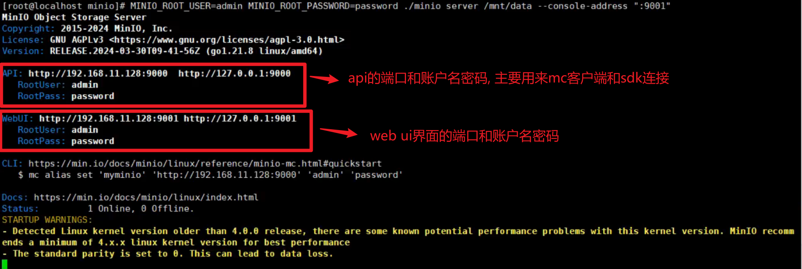
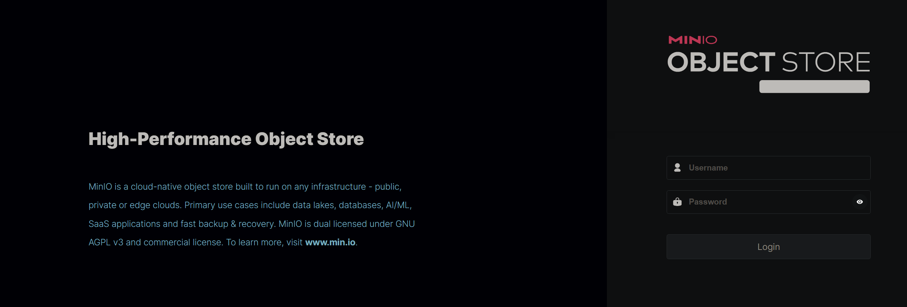
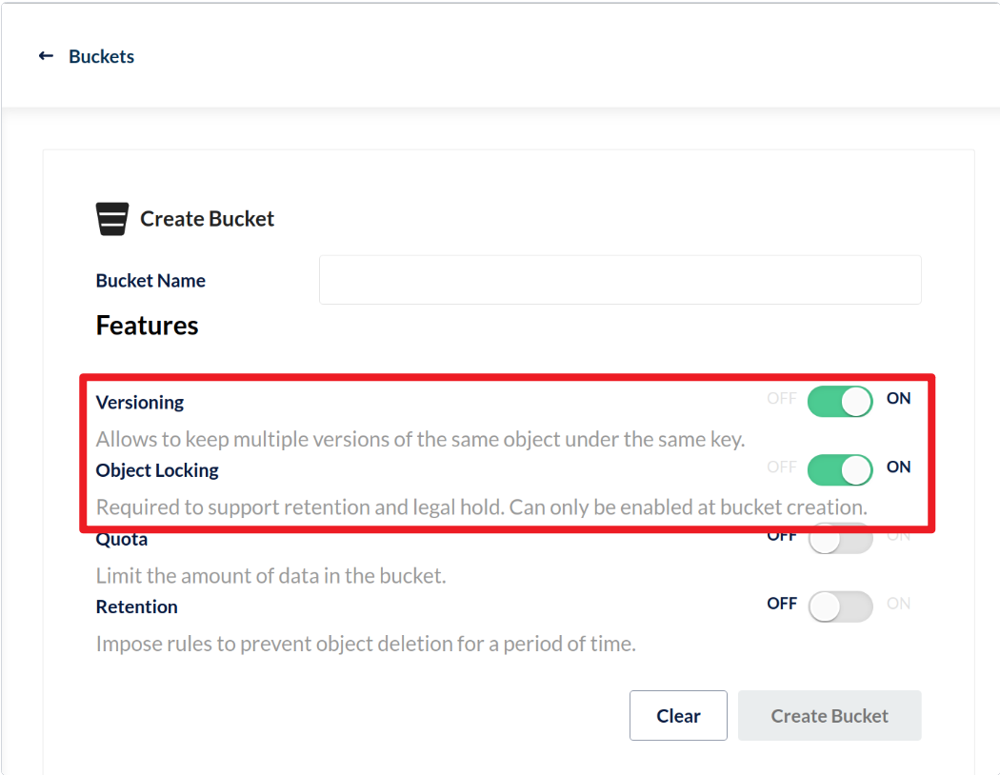
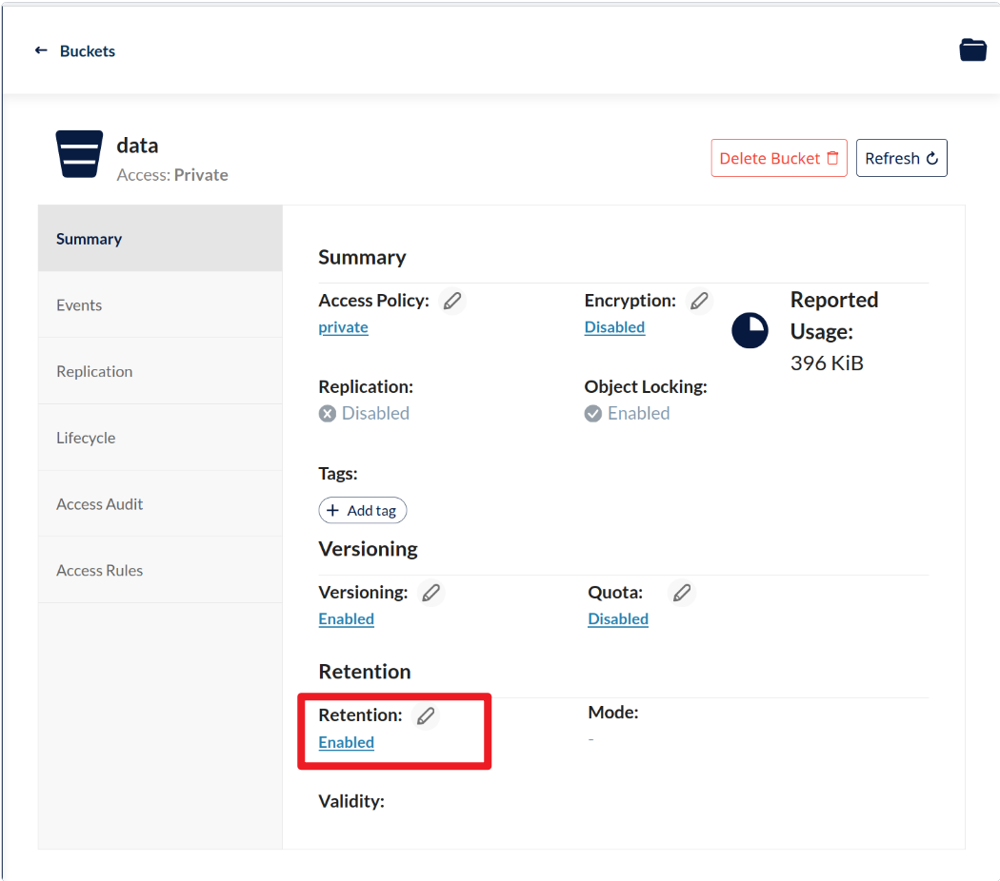
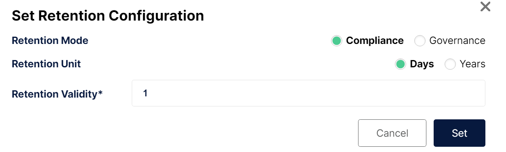
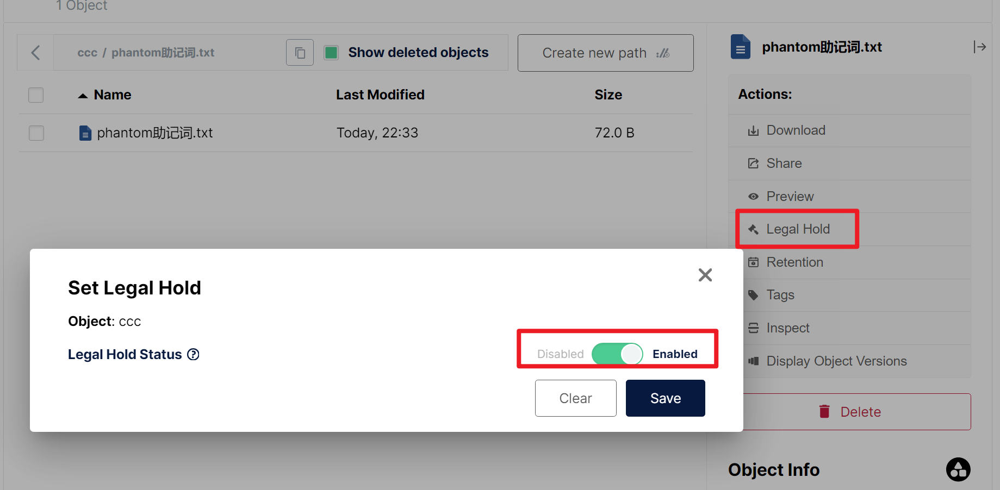
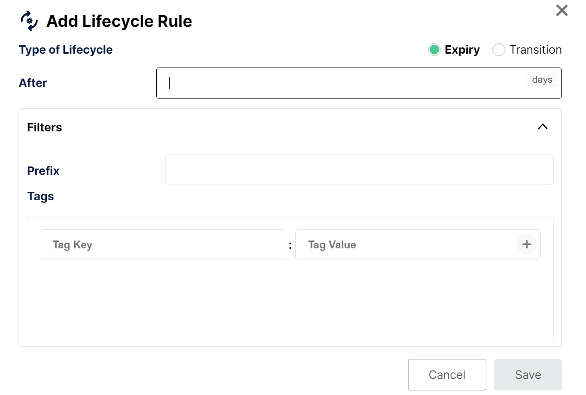
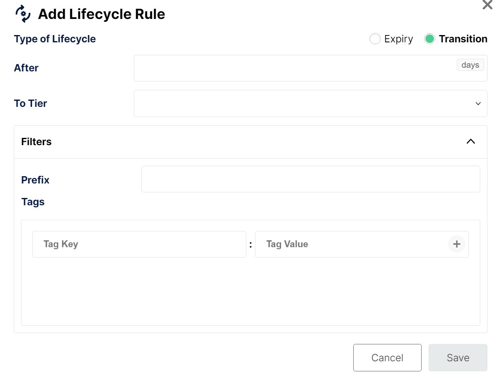
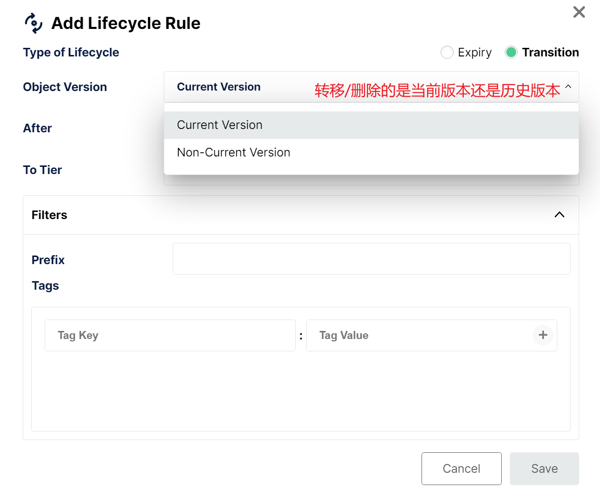
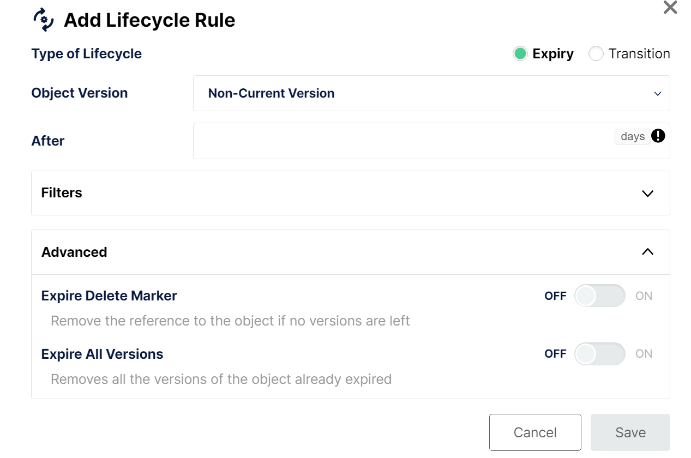

官方社区版文档

https://docs.min.io/community/minio-object-store/operations/deployments/baremetal-deploy-minio-on-ubuntu-linux.html


## 测试网站

MinIO官网提供了一个搭建好的MinIO Server, 账号和密码为minioadmin, 可以直接开玩

web ui: https://play.min.io:9443

api端口: https://play.min.io


## MinIO 单机单磁盘直接启动(测试使用)

minio的安装可以分为三个部分:

1. minio:   minio的服务端
2. minio client: minio的客户端, 该客户端提供了一系列的命令来控制minio
3. sdk:   通过代码来上传和下载文件


minio server的安装基本可以划分为一下几步:

1. 下载minio
2. 设置root username和password到环境变量**(默认root账户的账户名和密码都是minioadmin)**
3. 启动minio




### windows

https://min.io/download?license=agpl&platform=windows

**MinIO Server**

powershell执行如下命令: 

~~~powershell
# 下载minio到c盘
PS> Invoke-WebRequest -Uri "https://dl.min.io/server/minio/release/windows-amd64/minio.exe" -OutFile ".\minio.exe"

# 设置用户名和密码到环境变量
PS> setx MINIO_ROOT_USER admin
PS> setx MINIO_ROOT_PASSWORD password

# server表示启动server端, f:\data为数据目录, :9001表示webUI的端口, 绑定到0.0.0.0
PS> .\minio.exe server .\Data --console-address ":9001"
MinIO Object Storage Server
Copyright: 2015-2025 MinIO, Inc.
License: GNU AGPLv3 - https://www.gnu.org/licenses/agpl-3.0.html
Version: RELEASE.2025-09-07T16-13-09Z (go1.24.6 windows/amd64)

# 这里告诉你可以通过如下的地址和账号来通过sdk的方式来访问minio
API: http://192.168.31.162:9000  http://172.18.160.1:9000  http://192.168.1.1:9000  http://192.168.85.1:9000  http://127.0.0.1:9000
   RootUser: admin
   RootPass: password
# 这里告诉你可以通过如下的地址和账号来访问minio的webUi界面
WebUI: http://192.168.31.162:9001 http://172.18.160.1:9001 http://192.168.1.1:9001 http://192.168.85.1:9001 http://127.0.0.1:9001
   RootUser: admin
   RootPass: password
# 这里告诉你可以通过下面这行命令使用mc来连接minio
CLI: https://docs.min.io/community/minio-object-store/reference/minio-mc.html#quickstart
   $ mc alias set 'myminio' 'http://192.168.31.162:9000' 'admin' 'password'

Docs: https://docs.min.io
~~~

**MinIO Client**

~~~powershell
PS> Invoke-WebRequest -Uri "https://dl.minio.io/client/mc/release/windows-amd64/mc.exe" -OutFile ".\mc.exe"
# 添加minio server到minio client中, 这样以后可以直接通过myminio来调用这个server
# 可以配置多个server
.\mc.exe alias set myminio/ http://MINIO-SERVER MYUSER MYPASSWORD

.\mc.exe alias set myminio/ http://localhost:9092 admin password
~~~


### Linux

https://min.io/download?license=agpl&platform=linux


**MinIO Server**

~~~shell
wget https://dl.min.io/server/minio/release/linux-amd64/minio

# 赋予执行权限
chmod +x minio

# /mnt/data表示数据目录
# MINIO_ROOT_USER和MINIO_ROOT_PASSWORD是环境变量, 用于设置minio的root的用户名和密码
MINIO_ROOT_USER=admin MINIO_ROOT_PASSWORD=password ./minio server /mnt/data --console-address ":9001"
~~~

**MinIO Client**

~~~shell
wget https://dl.min.io/client/mc/release/linux-amd64/mc
chmod +x mc
# 添加minio server到minio client中, 这样以后可以直接通过myminio来调用这个server
# 可以配置多个server
mc alias set myminio/ http://MINIO-SERVER MYUSER MYPASSWORD
~~~


### docker

https://min.io/download?license=agpl&platform=docker

**MinIO Server**

~~~shell
podman run -p 9000:9000 -p 9001:9001 minio/minio server /data --console-address ":9001"
~~~

**MinIO Client**

~~~shell
podman run --name my-mc --hostname my-mc -it --entrypoint /bin/bash --rm minio/mc
[root@my-mc /]# mc alias set myminio/ https://my-minio-service MY-USER MY-PASSWORD
[root@my-mc /]# mc ls myminio/mybucket
~~~


### kubernetes

https://min.io/download?license=agpl&platform=kubernetes

**MinIO Server**

~~~shell
kubectl apply -k github.com/minio/operator
~~~

**MinIO Client**

~~~shell
kubectl run my-mc -i --tty --image minio/mc:latest --command -- bash
[root@my-mc /]# mc alias set myminio/ https://minio.default.svc.cluster.local MY-USER MY-PASSWORD
[root@my-mc /]# mc ls myminio/mybucket
~~~


## MinIO Server安装

> 查看文档的时候, 一定要注意, 查看的是社区版的文档, 不要使用企业版的文档, 否则要license才能启动

https://docs.min.io/community/minio-object-store/operations/deployments/baremetal-deploy-minio-on-ubuntu-linux.html

1. 访问`https://dl.min.io/server/minio/release`, 选择合适的版本进行下载

   首选选择合适的cpu架构, 因为我们linux是amd64架构的, 所以选择linux-amd64

   访问`https://dl.min.io/server/minio/release/linux-amd64/`, 有如下的文件

   ~~~shell
   File Name	File Size	Date
   Parent directory/	-	-
   archive/	-	2025-09-07 18:02
   minio	106 MiB	2025-09-07 17:54
   minio-20250907161309.0.0-1.x86_64.rpm	39 MiB	2025-09-07 17:59
   minio-20250907161309.0.0-1.x86_64.rpm.sha256sum	103 B	2025-09-07 17:59
   minio.RELEASE.2025-09-07T16-13-09Z	106 MiB	2025-09-07 17:54
   minio.RELEASE.2025-09-07T16-13-09Z.asc	833 B	2025-09-07 17:54
   minio.RELEASE.2025-09-07T16-13-09Z.minisig	326 B	2025-09-07 17:54
   minio.RELEASE.2025-09-07T16-13-09Z.sha256sum	100 B	2025-09-07 17:54
   minio.RELEASE.2025-09-07T16-13-09Z.shasum	76 B	2025-09-07 17:54
   minio.apk	35 B	2025-09-07 17:59
   minio.asc	833 B	2025-09-07 17:54
   minio.deb	34 B	2025-09-07 17:59
   minio.minisig	326 B	2025-09-07 17:54
   minio.rpm	37 B	2025-09-07 17:59
   minio.sha256sum	100 B	2025-09-07 17:54
   minio_20250907161309.0.0_amd64.deb	38 MiB	2025-09-07 17:59
   minio_20250907161309.0.0_amd64.deb.sha256sum	100 B	2025-09-07 17:59
   minio_20250907161309.0.0_x86_64.apk	39 MiB	2025-09-07 17:59
   minio_20250907161309.0.0_x86_64.apk.sha256sum	101 B	2025-09-07 17:59
   ~~~

2. 因为我们是Ubuntu, 所以下载`minio_20250907161309.0.0_amd64.deb`, 如果是centos, 可以下载`minio-20250907161309.0.0-1.x86_64.rpm`

   千万不要下载`minio.deb`和`minio.rmp`, 他们只是一个重定向包, 实际上还是要下载上面两个文件的

3. 下载上面的文件, 保存到`/opt/module/software`目录下, 并重命名为`minio.deb`

4. 安装上面的deb包

   ~~~shell
   sudo dpkg -i minio.deb
   
   Selecting previously unselected package minio.
   (Reading database ... 185440 files and directories currently installed.)
   Preparing to unpack minio.deb ...
   Unpacking minio (20250907161309.0.0) ...
   Setting up minio (20250907161309.0.0) ...
   ~~~

5. 安装完毕后, 可以通过如下命令来查看minio的版本

   ~~~shell
   minio --version
   
   minio version RELEASE.2025-09-07T16-13-09Z (commit-id=07c3a429bfed433e49018cb0f78a52145d4bedeb)
   Runtime: go1.24.6 linux/amd64
   License: GNU AGPLv3 - https://www.gnu.org/licenses/agpl-3.0.html
   Copyright: 2015-2025 MinIO, Inc.
   ~~~

   > 注意一定不要安装企业版本的

6. 安装的过程中, minio会自动创建systemd的连接文件, `/lib/systemd/system/minio.service`, 内容如下

   ~~~ini
   [Unit]
   Description=MinIO
   Documentation=https://docs.min.io
   Wants=network-online.target
   After=network-online.target
   AssertFileIsExecutable=/usr/local/bin/minio
   
   [Service]
   Type=notify
   
   WorkingDirectory=/usr/local
   
   User=minio-user
   Group=minio-user
   ProtectProc=invisible
   
   EnvironmentFile=-/etc/default/minio
   ExecStart=/usr/local/bin/minio server $MINIO_OPTS $MINIO_VOLUMES
   
   # Let systemd restart this service always
   Restart=always
   
   # Specifies the maximum file descriptor number that can be opened by this process
   LimitNOFILE=1048576
   
   # Turn-off memory accounting by systemd, which is buggy.
   MemoryAccounting=no
   
   # Specifies the maximum number of threads this process can create
   TasksMax=infinity
   
   # Disable timeout logic and wait until process is stopped
   TimeoutSec=infinity
   
   # Disable killing of MinIO by the kernel's OOM killer
   OOMScoreAdjust=-1000
   
   SendSIGKILL=no
   
   [Install]
   WantedBy=multi-user.target
   
   # Built for ${project.name}-${project.version} (${project.name})
   ~~~

7. 安装完成后, 我们还需要为minio创建对应的用户和组

   ~~~shell
   # 新建一个group, -r表示系统组
   sudo groupadd -r minio-user 
   
   # 新建一个minio-user的用户, -M表示不需要家目录, -r表示系统用户, -g指定初始的group
   sudo useradd -M -r -g minio-user minio-user 
   ~~~

8. 接下来, 我们可以将单独的磁盘, 挂载到特定的路径下,  比如我们将两个磁盘分别挂载到`/data/minio1`和`/data/minio2`下

   > 两个路径一定要是不同的磁盘, 因为minio会将这些磁盘作为备份, 如果两个路径是同一个磁盘, 那么完全没有备份容灾的作用, 反而因为备份导致磁盘占用增加 

   > 如果没有两个不同的备份, 你也可以直接mkdir两个目录, 来模拟测试一下

9. 挂载磁盘之后, 我们需要将这些磁盘路径的所有者和所属组分别修改为`minio-user`用户和`minio-user`组

   ~~~shell
   # {}是bash中的花括号展开语法, 表示1和2
   chown -R minio-user:minio-user /data/minio{1...2}
   ~~~

10. 根据上面的`minio.service`文件中的`EnvironmentFile=-/etc/default/minio`配置, minio在启动的时候, 会自动的读取`/etc/default/minio`, 所以我们还需要创建这个环境变量文件

    ~~~shell
    # MINIO_VOLUMES指定minio存储的文件保存的目录
    # MINIO_ROOT_PASSWORD指定超级管理员密码, 一定要超过8位长度, 否则无法启动
    # MINIO_OPTS用于指定其他的启动参数
    sudo tee /etc/default/minio <<'EOF'
    MINIO_VOLUMES="/data/minio{1...2}"
    MINIO_ROOT_USER="minioadmin"
    MINIO_ROOT_PASSWORD="00000000"
    MINIO_OPTS="--console-address :9001"
    EOF
    ~~~

    在minio中, 分别有三种不同的磁盘挂载方式

    1. 单节点单磁盘:

       这种方式集群只有一个节点, 这个节点中只有一个磁盘用于保存minio的数据

       **这种模式主要用在测试环境下**

       你需要在`/etc/default/minio`中指定这一个磁盘的挂载目录, 比如

       ~~~shell
       MINIO_VOLUMES="/mnt/drive1/minio"
       ~~~

    2. 单节点多磁盘

       https://min.io/docs/minio/linux/operations/install-deploy-manage/deploy-minio-single-node-multi-drive.html

       这种方式集群只有一个节点, 但是有多个磁盘挂载到系统中, 用于保存minio的数据

       **这种模式主要用在可以容忍minio停机和数据丢失的场景**

       你需要在`/etc/default/minio`中指定这些磁盘的挂载目录, 比如

       ```shell
       MINIO_VOLUMES="https://minio1.example.net:9000/mnt/drive{1...4}/minio"
       ```

       > 这种模式安装, MINIO_VOLUMES指定的每个目录必须挂载的是新磁盘, 而不能和主系统一个磁盘, 否则无法启动

    3. 多节点多磁盘

       https://min.io/docs/minio/linux/operations/install-deploy-manage/deploy-minio-multi-node-multi-drive.html

       https://www.bilibili.com/video/BV1Gx4y1Y7Rg/?spm_id_from=333.337.search-card.all.click&vd_source=f79519d2285c777c4e2b2513f5ef101a

       这种方式集群有多个minio节点, 每个节点都有至少一个磁盘用于保存minio的数据

       这种模式用于生产模式下, 需要分布式高可靠性

       你需要在`/etc/default/minio`中指定这些磁盘的挂载目录, 比如

       ```shell
       MINIO_VOLUMES="http://minio{1...4}.example.net:9000/mnt/disk{1...4}/minio"
       ```

       

11. 之后我们就可以通过如下的命令来启动minio

    ~~~shell
    systemctl start minio
    systemctl status minio
    systemctl stop minio
    systemctl restart minio
    systemctl enable minio
    systemctl disable minio
    ~~~

12. 启动之后, 可以通过如下的命令, 来查看他的启动日志

    ~~~shell
    journalctl -u minio
    ~~~

13. 启动之后, 你可以通过浏览器范围`http://localhost:9001`来访问minio的界面

    

    > 如果访问失败, 记得F5刷新一下, 有可能是缓存的问题

    > minio一共会占用两个端口, 9001是webui的端口
    >
    > 9000是S3 API的端口, mc命令, 客户端sdk, aws s3都是通过这个端口进行对象存储的读写的

    当然你也可以使用命令行来操作minio, 详情请查看MinIO Client的使用

    

14. 如果要卸载minio, 可以使用如下的命令

    ~~~shell
    # 卸载minio
    sudo dpkg -P minio
    # 移除systemd文件
    sudo rm /lib/systemd/system/minio.service
    # 重新加载
    sudo systemctl daemon-reload
    
    # 卸载不会删除掉/data/minio1, /data/minio2中的数据
    ~~~

    

## MinIO Client的使用

### 安装mc命令

https://docs.min.io/community/minio-object-store/reference/minio-mc.html#mc-install

要使用MinIO Client, 首先需要再系统中安装`mc`命令

1. windows下的安装过程如下

   - 下载windows版本的mc命令, 地址https://dl.min.io/client/mc/release/windows-amd64/mc.exe

   - 然后通过cmd来使用mc命令

     ~~~shell
     \path\to\mc.exe --help
     ~~~

2. linux下的安装过程

   - amd64架构(一般都是amd64架构的)

     ~~~shell
     curl https://dl.min.io/client/mc/release/linux-amd64/mc \
       --create-dirs \
       -o $HOME/minio-binaries/mc
     
     chmod +x $HOME/minio-binaries/mc
     export PATH=$PATH:$HOME/minio-binaries/
     
     mc --help
     ~~~

   - arm架构

     ~~~shell
     curl https://dl.min.io/client/mc/release/linux-arm64/mc \
       --create-dirs \
       -o ~/minio-binaries/mc
     
     chmod +x $HOME/minio-binaries/mc
     export PATH=$PATH:$HOME/minio-binaries/
     
     mc --help
     ~~~


### mc命令的使用

https://docs.min.io/community/minio-object-store/reference/minio-mc/mc-alias.html


#### mc alias

mc alias的主要作用是给一个minio节点起一个别名,  保存他的地址, 账户名, 密码等等信息, 方便后续操作

- `mc alias set`: 给一个minio节点起别名

  ~~~shell
  D:\minio>mc alias  set  local http://127.0.0.1:9000 admin 00000000
  Added `local` successfully.
  ~~~

- `mc alias list`: 查看当前保存的所有的minio节点的别名

  默认情况下, mc命令会自带几个可用的alias, 这些alias可以用于测试

  ~~~shell
  # 查看指定alias的minio的节点的信息
  D:\minio>mc alias list local
  local
    URL       : http://127.0.0.1:9000
    AccessKey : admin
    SecretKey : 00000000
    API       : s3v4
    Path      : auto
    Src       : C:\Users\sys49482\mc\config.json
  
  # 查看所有的minio节点的信息
  D:\minio>mc alias list
  gcs
    URL       : https://storage.googleapis.com
    AccessKey : YOUR-ACCESS-KEY-HERE
    SecretKey : YOUR-SECRET-KEY-HERE
    API       : S3v2
    Path      : dns
    Src       : C:\Users\sys49482\mc\config.json
  
  local
    URL       : http://127.0.0.1:9000
    AccessKey : admin
    SecretKey : 00000000
    API       : s3v4
    Path      : auto
    Src       : C:\Users\sys49482\mc\config.json
  
  play
    URL       : https://play.min.io
    AccessKey : Q3AM3UQ867SPQQA43P2F
    SecretKey : zuf+tfteSlswRu7BJ86wekitnifILbZam1KYY3TG
    API       : S3v4
    Path      : auto
    Src       : C:\Users\sys49482\mc\config.json
  
  s3
    URL       : https://s3.amazonaws.com
    AccessKey : YOUR-ACCESS-KEY-HERE
    SecretKey : YOUR-SECRET-KEY-HERE
    API       : S3v4
    Path      : dns
    Src       : C:\Users\sys49482\mc\config.json
  ~~~

- `mc alias export`: 将指定的minio的节点的信息, 生成为json格式

  ~~~shell
  # 直接执行会导出到控制台
  D:\minio>mc alias export local
  {"url":"http://127.0.0.1:9000","accessKey":"admin","secretKey":"00000000","api":"s3v4","path":"auto"}
  
  # 导出到文件
  D:\minio>mc alias export local > local.json
  ~~~

- `mc alias remove`: 移除指定的minio的节点的信息

  ~~~shell
  D:\minio>mc alias remove local
  Removed `local` successfully.
  ~~~

- `mc alias import`: 从文件中读取json格式的minio的节点的信息, 然后保存为alias, 对应export命令

  ~~~shell
  # 导入minio节点的信息, 保存alias为local
  D:\minio>mc alias import local ./local.json
  Imported `local` successfully.
  ~~~

  

#### mc anonymous

mc anonymous用来控制bucket的匿名访问策略

匿名访问策略就是控制某个bucket是否允许未认证的用户访问, 或访问的权限(r, w, rw)

~~~shell
mc anonymous get myminio/mybucket # 查看当前bucket的策略


# 可选的策略有:
# none: 不允许匿名访问, 默认
# download: 允许匿名用户下载对象 (只读)
# upload: 允许匿名用户上传对象 (只读)
# public: 允许匿名用户上传和下载对象 (读写)
mc anonymous set download myminio/mybucket # 设置任何人对mybucket都可以下载
mc anonymous set none myminio/mybucket # 设置匿名用户不能访问这个bucket
~~~


#### mc batch

mc batch主要的作用是可以根据一个json文件, 去执行大量的命令, 而不需要手动一个一个命令去执行

他的主要使用场景是:

- 一次性删除/移动几万个对象
- 批量迁移bucket中的文件到另外一个minio集群
- 配合cron定时执行批量清理任务

~~~shell
# 创建一个批量任务模板
mc batch generate --type delete > delete-job.json

# 在delete-job.json中指定要删除的对象
{
  "version": "1.0",
  "type": "delete",
  "source": {
    "bucket": "mybucket",
    "objects": ["obj1.txt", "obj2.txt", "folder/obj3.txt"]
  }
}


# 根据json执行任务
mc batch start delete-job.json

# 查看任务状态
mc batch list

# 查看指定任务的id
mc batch status <JOB-ID>
~~~

--type参数执行如下的任务类型:

- copy: 批量复制对象
- delete: 批量移动对象
- move: 批量移动对象


#### mc cat

mc cat的作用主要用于查看文件的内容, 并打印到终端

如果对象非常大，`mc cat` 会把它完整输出到终端，可能刷屏，所以建议配合 `head`、`less`、`grep` 等命令使用。

~~~shell
mc cat myminio/my_bucket/readme.txt # 查看文件内容

mc cat myminio/my_bucket/readme.txt > ./local-readme.txt # 下载文件

mc cat myminio/logs/app.log | head -n 20 # 只看前 20 行日志
~~~


#### mc cp

mc cp的作用主要用于

- 本地到minio之间的文件复制
- 两个minio节点之间的文件复制
- 同一个节点不同路径, 不同bucket之间的文件复制

~~~shell
mc cp ./photo.jpg myminio/my_bucket/ # 上传文件到myminio/my_bucket目录下
mc cp myminio/my_bucket/photo.jpg ./photo-downloaded.jpg # 下载文件

mc cp myminio/my_bucket/photo.jpg myminio/my_bucket1/ # 同一个节点, 不同bucket之间的复制

mc cp myminio/my_bucket/photo.jpg anotherminio/my_bucket1/ # 两个minio节点之间的文件复制
~~~


#### mc diff

mc diff用于检查本地和minio, minio之间的目录中的文件的差异

~~~shell
# 比较本地目录和 MinIO bucket
mc diff ./mydata myminio/mybucket

# 比较两个 MinIO bucket
mc diff myminio/mybucket1 myminio/mybucket2
~~~

输出如下

~~~shell
> file1.txt # 目标缺少这个文件, 源里有
< file2.txt # 源缺少这个文件，目标里有
! file3.txt # 源和目标都有，但内容不同（大小或时间戳不一致）
~~~

#### mc du

mc du的全称是disk usage, 主要用于统计某个目录下的object占用的大小, 和linux下的du的效果是一样的

~~~shell
# 查看整个 bucket 的占用情况
mc du myminio/mybucket

# 查看 bucket 下某个前缀的占用情况
mc du myminio/mybucket/path/

# 查看本地目录占用情况
mc du ./data
~~~

输出类似

~~~shell
34 MiB  50 objects # 该 bucket（或目录）占用了 34 MiB 空间, 里面有 50 个对象
~~~

常用参数:

- `--versions`
   统计时包含对象的所有版本（如果开启了版本控制）。

- `--recursive`
   递归统计子目录/前缀（默认就会递归）。


#### mc encrypt

mc encrypt的作用是管理bucket的加密配置, 可以启用, 禁用, 查看bucket的加密策略

注意: 它不是直接去加密文件，而是配置 **Bucket 的默认加密策略**，让上传到这个 Bucket 的对象自动加密（使用 SSE-S3 或 SSE-KMS）。

~~~shell
# 查看 bucket 的加密状态
mc encrypt info myminio/mybucket

# 开启加密（SSE-S3）
mc encrypt set sse-s3 myminio/mybucket

# 使用 KMS key 开启加密（SSE-KMS）
mc encrypt set sse-kms minio-key-name myminio/mybucket

# 关闭加密
mc encrypt clear myminio/mybucket
~~~

执行的加密模式有:

- **SSE-S3**：MinIO 使用其内置的 KMS 自动生成并管理密钥，用户无需提供密钥。

- **SSE-KMS**：MinIO 使用外部 KMS（Key Management System），你需要指定一个密钥别名或 ARN。

- **SSE-C**：客户端提供密钥（不是用 `mc encrypt` 设置，而是每次上传时指定）。


#### mc event

mc event主要用于管理bucket的事件通知, 当你在minio中执行操作的时候, 就会触发对应的事件, 然后可以将这些事件发送到对应的NATS、Kafka、Webhook、AMQP、Redis、MQTT 等消息系统

~~~shell
# 查看 bucket 的事件配置
mc event list myminio/mybucket

# 创建一个notify_webhook类型的配置, 名字为1, 端点为http://my-webhook-service:8080/
mc admin config set myminio notify_webhook:1 endpoint="http://my-webhook-service:8080/"
# mc admin修改的是minio服务端的配置, 所以需要重启生效
mc admin service restart myminio


# 为 bucket 添加一个事件通知
# arn:minio是固定的, sqs是minio兼容s3的通知机制, 1表示刚刚添加的config的名字, webhook表示通知类型
# --event表示监听的类型
# --prefix表示要监听的对象的前缀, 比如只想监听mybucket下的images中的对象的消息
# --suffix表示要监听的对象的后缀, 比如只想监听.jpg文件
mc event add myminio/mybucket \
arn:minio:sqs::1:webhook \
--event put,delete \
--prefix images/
--suffix .jpg

# 删除事件配置
mc event remove myminio/mybucket arn:minio:sqs::1:webhook
~~~


#### mc find

mc find 用于在minio中查找符合条件的对象, 类似linux下的find命令

他可以根据名字, 前缀, 后缀, 大小, 修改时间等条件搜索对象, 还可以对查询出来的对象进行操作

~~~shell
# 查找 bucket 下所有对象
mc find myminio/mybucket

# 查找 bucket 下 **/photos/* 中的所有文件, 注意--prefix匹配的是路径而不是匹配文件名前缀
mc find myminio/mybucket --prefix photos/

# 查找 bucket 下所有 .jpg 文件
mc find myminio/mybucket --name "*.jpg"

# 查找大于 10MB 的对象
mc find myminio/mybucket --min-size 10MB

# 删除 bucket 下所有 .tmp 文件
mc find myminio/mybucket --name "*.tmp" --exec "mc rm {}"
~~~

常用选项

| 选项                        | 作用                               |
| --------------------------- | ---------------------------------- |
| `--name`                    | 按文件名匹配（支持通配符）         |
| `--prefix`                  | 只搜索指定前缀（路径）下的对象     |
| `--suffix`                  | 按后缀匹配                         |
| `--min-size` / `--max-size` | 按对象大小过滤                     |
| `--older` / `--newer`       | 按修改时间过滤                     |
| `--exec`                    | 对搜索结果执行命令，例如删除或复制 |


#### mc get

mc get主要用于从minio中下载对象

~~~shell
# 下载 bucket 中的单个对象到当前目录
mc get myminio/mybucket/myfile.txt
Downloading myminio/mybucket/myfile.txt
myfile.txt: 5 KiB / 5 KiB ┃█████████████████┃ 100% 0s


# 下载对象到指定本地文件名
mc get myminio/mybucket/myfile.txt ./localfile.txt

# 下载整个前缀（类似目录）
mc get --recursive myminio/mybucket/photos/ ./localphotos/
~~~

常用选项

| 选项          | 作用                                    |
| ------------- | --------------------------------------- |
| `--recursive` | 递归下载指定前缀下的所有对象            |
| `--attr`      | 显示对象的属性（大小、时间戳、etag 等） |
| `--quiet`     | 不显示进度信息                          |
| `--insecure`  | 在非安全连接下允许下载                  |


#### mc head

mc head命令用于查看object的元数据, 类似于linux中的head命令

~~~shell
# 查看对象的元数据
mc head myminio/mybucket/myfile.txt

Name: myfile.txt
Size: 5 KiB
ETag: "9b74c9897bac770ffc029102a200c5de"
LastModified: 2025-09-17T12:00:00Z
Content-Type: text/plain
Version-ID: null
~~~

常用配置

| 选项           | 作用                                 |
| -------------- | ------------------------------------ |
| `--json`       | 输出 JSON 格式的元数据，方便程序处理 |
| `--quiet`      | 只输出关键字段（通常配合脚本使用）   |
| `--version-id` | 指定版本号，查看对象特定版本的元数据 |


#### mc idp ldap


#### mc idp ldap accesskey


#### mc idp ldap policy


#### mc idp openid


#### mc idp openid


#### mc idp openid accesskey


#### mc ilm rule


#### mc ilm tier


#### mc legalhold

mc legalhold用于管理对象的法律保留状态

当你对某个对象启用Legal Hold功能后, 这个对象不能被覆盖和删除, 直到你显示移除Legal Hold

即使bucket没有启用Write-Once-Read_Many模式, 这个对象也会被保护

需要注意的是:

- Bucket必须开启版本控制的前提下, 才能使用LegalHold
- LegalHold是对象级别的, 不影响同bucket下的其他对象

他和Retention的区别在于

- Legal Hold没有到期时间, 必须手动移除

~~~shell
mc legalhold disable myminio/mybucket/myobject.txt # 关闭legal hold
mc legalhold enable myminio/mybucket/myobject.txt # 开启legal hold
mc legalhold info myminio/mybucket/myobject.txt # 查看对象的legal hold状态
~~~


#### mc license


#### mc ls

mc ls的作用是查看文件目录, minio会将object name解析为类似hdfs的目录树结构

~~~shell
# 查看myminio下的所有bucket
mc ls myminio
[2025-09-16 01:23:00 CST]     0B photos/
[2025-09-16 01:24:10 CST]     0B backups/

# 查看myminio/mybucket下的文件
mc ls myminio/mybucket
[2025-09-16 01:25:00 CST]   2.0MiB  img1.jpg
[2025-09-16 01:26:30 CST]   1.2MiB  img2.jpg

# 查看myminio/mybucket/myobject_prefix下的文件
mc ls myminio/mybucket/myobject_prefix

mc ls --recursive myminio/photos # 递归列出所有文件（包含子目录）
mc ls --long myminio/photos # 显示更多信息（大小、时间、权限）
mc ls --json myminio/photos # 以json的格式数组, 主要方便脚本处理
~~~


#### mc mb

mb的全写就是make bucket, 也就是创建bucket桶

~~~shell
# 在alias为myminio的节点上, 创建mybucket的桶
# --ignore-existing的作用是已经存在了就不创建
mc mb --ignore-existing myminio/mybucket
~~~

#### mc mirror

mc mirror主要用于同步本地和minio之间, minio和minio之间的文件结构

~~~shell
mc mirror ./data myminio/mybucket # 把./data里的所有文件递归上传到mybucket下, 保留目录结构

mc mirror myminio/mybucket ./backup # 把远程mybucket里的所有对象, 下载到./backup中

mc mirror --overwrite ./data myminio/mybucket # 只同步有变更的文件, 并覆盖已有的文件

mc mirror --remove ./data myminio/mybucket # 完全同步文件, 目标端如果有多出来的文件, 会被删除掉

mc mirror --watch ./data myminio/mybucket # 当./data有新增,修改,删除文件的时候, 自动同步到minio中, 适合做实时备份
~~~

常用参数

| 参数              | 作用                                 |
| ----------------- | ------------------------------------ |
| `--overwrite`     | 覆盖目标端已有文件                   |
| `--remove`        | 删除目标端多余文件，保持和源完全一致 |
| `--watch`         | 实时监听源目录变化，自动同步         |
| `--dry-run`       | 只显示将会执行的操作，不实际同步     |
| `--preserve`      | 保留文件的时间戳、权限信息           |
| `--storage-class` | 设置上传对象的存储类型               |


#### mc mv

mc mv 的作用类似linux上的mv, 用来移动对象

- 可以在minio的bucket之间移动文件
- 也可以将本地文件移动到minio中

~~~shell
mc mv myminio/mybucket/file.txt myminio/mybucket/archive/ # 把file.txt移动到同一个bucket中的archive/目录中

mc mv myminio/mybucket1/file.txt myminio/mybucket2/ # 跨bucket移动文件

mc mv myminio/mybucket/logs/*.log myminio/mybucket/archive/ # 批量移动文件

mc mv ./test.txt myminio/mybucket/ # 把本地的文件移动到minio中, 然后删除本地的文件
~~~

常用参数

| 参数              | 作用                         |
| ----------------- | ---------------------------- |
| `--recursive`     | 递归移动整个目录（非常常用） |
| `--force`         | 覆盖目标端已有文件           |
| `--older-than`    | 只移动早于指定时间的文件     |
| `--newer-than`    | 只移动晚于指定时间的文件     |
| `--storage-class` | 设置上传对象的存储类型       |

#### mc od

od的全称是 object distribution,  主要用于查看指定路径下的对象, 在各个磁盘上的分布情况

常常用于观测minio集群的负载均衡情况, 特别是当你使用多节点minio时, 能看到对象如何分局到不同的节点/磁盘上的

~~~shell
mc od myminio/mybucket # 查看整个mybucket中的对象, 在各个磁盘上的分布情况

Drive 1: 250 objects
Drive 2: 245 objects
Drive 3: 260 objects
Drive 4: 255 objects

mc od myminio/mybucket/logs/ # 只查看logs/目录下对象的分布情况

mc od myminio # 查看整个节点所有对象的分布情况
~~~

常用参数

| 参数          | 说明                            |
| ------------- | ------------------------------- |
| `--json`      | 以 JSON 格式输出，便于脚本处理  |
| `--insecure`  | 允许访问自签名证书的 MinIO 服务 |
| `--with-data` | 显示更多详细信息（如对象大小）  |


#### mc ping

mc ping的作用是判断mc命令是否正常连接到minio节点

~~~shell
mc ping myminio

Endpoint:  http://192.168.1.130:9000  [online]
Uptime:    4 hours
Version:   2025-09-07T16:13:09Z
Network:   1/1 OK
Drive:     2/2 OK

mc ping --count 10 myminio # ping 10次之后退出
mc ping --interval 2s myminio # 每2s间隔ping一次
mc ping --json myminio # 输出json格式的数据, 方便脚本处理和集成到监控系统
~~~


#### mc pipe

mc pipe的作用是把当前终端的标准输入数据写入到minio的对象中, 不需要生成临时文件, 然后再通过mc put上传

可以理解为**流式上传**, 特别适合脚本和自动化的场景

~~~shell
date | mc pipe myminio/mybucket/current-time.txt # 把当前时间写入到minio的对象中

tail -f /var/log/syslog | mc pipe myminio/mybucket/syslog.log # 流式上传日志

tar cz /data | mc pipe myminio/mybucket/data-backup.tar.gz # 把/data目录压缩, 然后上传到minio中, 省掉中间落盘的过程

curl -sL https://example.com/file.txt | mc pipe myminio/mybucket/file.txt # 上传网络下载的文件
~~~

常用参数:

| 参数                 | 说明                 |
| -------------------- | -------------------- |
| `--attr "key=value"` | 添加对象自定义元数据 |
| `--encrypt-key`      | 上传时加密对象       |
| `--tags`             | 添加对象标签         |
| `--storage-class`    | 指定对象存储类型     |


#### mc put

mc put主要用于将本地文件上传到minio的bucket中

~~~shell
mc put ./file.txt myminio/mybucket # 把本地的file.txt上传到mybucket根目录
mc put ./file.txt myminio/mybucket/docs/ # 把文件上传到mybucket/docs/目录下

mc put ./file1.txt ./file2.txt myminio/mybucket # 一次性上传多个文件

mc put --recursive ./data myminio/mybucket/ # 上传./data整个目录

mc put --overwrite ./file.txt myminio/mybucket # 上传文件, 如果有同名文件就覆盖
~~~

参数:

| 参数              | 作用                                                         |
| ----------------- | ------------------------------------------------------------ |
| `--recursive`     | 递归上传目录及其子目录                                       |
| `--overwrite`     | 覆盖已存在的对象                                             |
| `--attr`          | 设置对象的自定义元数据，例如：`--attr "content-type=text/plain"` |
| `--encrypt-key`   | 使用客户提供的密钥对上传对象进行加密                         |
| `--storage-class` | 设置对象的存储类型（STANDARD、REDUCED\_REDUNDANCY）          |


#### mc rb

mc rb的作用是删除整个bucket, 类似linux中的rmdir

~~~shell
mc rb myminio/mybucket # 删除一个bucket, 如果bucket中没有任何对象, 那么删除成功, 否则报错

mc rb --force myminio/mybucket # 强制删除一个bueket, 不管里面有没有对象
# 等效于
mc rm --recursive --force myminio/mybucket
mc rb myminio/mybucket


mc rb --force myminio/mybucket myminio/backup-bucket # 一次性删除多个bucket
~~~

参数:

- --force: 即使bucket不为空, 也强制删除
- --dangerous: 跳过确认提示, 常用在脚本中


#### mc ready

mc ready的主要作用是检查对应的集群的所有节点是否健康, 只有集群的所有节点都健康, 才会返回0

~~~shell
# 检查 minio 服务是否 ready, 所有节点都健康, 状态码为0
# 可以通过脚本来判断$?集群是否健康
mc ready myminio
~~~


#### mc replicate


#### mc retention


#### mc rm

mc rm用于删除对象, 目录

~~~shell
mc rm myminio/mybucket/img1.png # 删除img1.png对象
mc rm myminio/mybucket/img1.jpg myminio/mybucket/img2.jpg # 删除多个对象
mc rm --recursive myminio/mybucket/albums/ # 递归删除整个目录
mc rm --recursive --force myminio/mybucket # 清空bucket
~~~

常用参数:

- --recursive: 递归删除
- --force: 跳过确认提示
- --versions: 删除所有的版本的对象, 如果开启了版本控制的话
- --fake: 只显示删除哪些文件, 不执行真正的删除


#### mc share


#### mc sql


#### mc stat

mc stat用于显示对象或 Bucket 的详细状态信息，包括大小、修改时间、ETag、版本信息、加密状态等。

他比mc head更详细

~~~shell
# 查看单个对象的状态
mc stat myminio/mybucket/myfile.txt

Name: myfile.txt
Date: 2025-09-17 12:00:00
Size: 5 KiB
ETag: "9b74c9897bac770ffc029102a200c5de"
Version-ID: null
Storage-Class: STANDARD
Encryption: SSE-S3

# 查看 bucket 的总体状态（包括对象数量和总大小）
mc stat myminio/mybucket

Name: mybucket
CreationDate: 2025-01-01 10:00:00
Objects: 150
Size: 1.2 GiB
~~~

常用选项

| 选项          | 作用                                     |
| ------------- | ---------------------------------------- |
| `--recursive` | 递归显示前缀下所有对象的状态             |
| `--json`      | 输出 JSON 格式，便于程序解析             |
| `--versions`  | 显示对象所有版本信息（如果开启版本控制） |


#### mc support


#### mc support top


#### mc tag

mc tag用于管理对象的标签

对象标签是存储在对象元数据里的键值对，用于分类、标记或筛选对象。通过 `mc tag`，你可以给对象添加标签、查看标签或删除标签，而无需改变对象内容。

~~~shell
# 给对象添加标签
mc tag set myminio/mybucket/myfile.txt key1=value1,key2=value2

# 查看对象的标签
mc tag list myminio/mybucket/myfile.txt

# 删除对象的标签
mc tag remove myminio/mybucket/myfile.txt
~~~


#### mc tree

mc tree的作用和linux上tree的作用类似, 以树结构显示当前bucket或者目录下的对象

~~~shell
mc tree myminio/mybucket

mybucket
├─ img1.jpg
├─ img2.jpg
└─ albums
   ├─ 2024
   │  └─ summer.png
   └─ 2025
      ├─ spring.png
      └─ winter.png
~~~


#### mc undo 

mc undo 用于撤销上一次执行的批量操作

**支持场景**

- `mc batch` 批量删除或移动的对象（如果开启了版本控制或者目标未被覆盖）
- `mc mirror` 同步导致的覆盖或删除

**不支持的情况**

- 对象已经被永久删除且没有版本备份
- 普通单个 `mc rm` 命令删除的对象（没有通过 batch/undo 跟踪）

~~~shell
# 批量删除对象
mc find myminio/mybucket --name "*.tmp" --exec "mc rm {}" --watch

# 如果删除错了，可以撤销
mc undo myminio/mybucket
~~~


#### mc update

mc update的作用是更新当前使用的mc命令到最新的版本

~~~shell
# 检查并更新 mc 到最新版本
mc update
~~~

常用选项:

| 选项      | 作用                                   |
| --------- | -------------------------------------- |
| `--quiet` | 安静模式，不显示下载进度               |
| `--force` | 强制覆盖当前版本，即使本地已是最新版本 |


#### mc version

`mc version` 命令的作用是 **管理 Bucket 的版本控制功能**。

~~~shell
# 查看 bucket 的版本控制状态
mc version alias/bucket

# 启用版本控制, Bucket 内每个对象的写入、删除操作都会产生新的版本，便于回滚和恢复。
mc version enable alias/bucket

# 暂停版本控制, 暂停后不再生成新版本但已经存在的版本仍然可以通过 API 或 mc 命令查看、恢复或删除
mc version suspend alias/bucket
~~~


#### mc watch

`mc watch`用于监听minio中对象的各种事件

格式如下:

~~~shell
mc wath [flag] alias/bucket/path
~~~

常用的参数有:

| Flag          | 作用                                                         |
| ------------- | ------------------------------------------------------------ |
| `--recursive` | 递归监听子目录/子路径下对象                                  |
| `--events`    | **指定需要监听的事件类型, 如果不指定默认监听所有事件, 如果要监听多个事件, 使用逗号分隔** |
| `--json`      | 输出 JSON 格式事件，方便解析                                 |
| `--prefix`    | 监听指定前缀的对象                                           |
| `--suffix`    | 监听指定后缀的对象（如 `.jpg`）                              |

一共有如下的几种事件

| 事件            | 描述                                    |
| --------------- | --------------------------------------- |
| `put`           | 对象被 PUT 上传（单次上传）             |
| `post`          | 对象通过 POST 上传                      |
| `copy`          | 对象被复制                              |
| `complete`      | 多段上传完成（CompleteMultipartUpload） |
| `delete`        | 对象被删除                              |
| `delete-marker` | 删除标记（Versioning 开启时）           |


~~~shell
# 监听myminio集群中的mybucket的所有事件
mc watch myminio/mybucket
{
  "eventName": "s3:ObjectCreated:Put",
  "key": "test.txt",
  "size": 12,
  "eTag": "9b74c9897bac770ffc029102a200c5de"
}

# 只监听上传事件
mc watch --events put myminio/mybucket

# 监听上传和删除事件
mc watch --events put,delete myminio/mybucket
# 只监听 .jpg文件的上传事件
mc watch --events put --suffix .jpg --recursive myminio/mybucket
~~~


mc watch命令可以结合jq命令来进行过滤和处理

~~~shell
mc watch myminio/mybucket | jq '.key'
~~~

mc watch也可以挂载在后台运行, 记录所有事件到日志中

~~~shell
nohup mc watch myminio/mybucket > events.log 2>&1 &
~~~


### mc admin命令

#### mc admin user

这个命令主要用于的minio集群中的用户进行增删改的操作, 支持的操作有如下:

- add: 添加新的用户
- remove / rm: 删除用户
- enable: 解锁用户
- disable: 禁用用户
- list / ls: 列出所有的用户
- info: 查看单个用户的信息
- policy: 以json的形式查看当前用户拥有的一些策略, 你在上面通过`mc admin user add` 添加一个用户之后, 这个用户实际上是没有任何权限的,  他不能查看bucket, 不能上传和下载, 设置不能通过mc命令来连接到minio, 你必须通过`mc admin policy`来给这个用户添加相关的策略, 每个策略都会携带相关的权限, 用户根据这些策略决定能访问哪些bucket, 能执行哪些操作(读写) 

~~~shell
# 增加用户并设置密码, 添加成功后, 可以给这个用户分配权限
$ ./mc admin user add myminio alice password123
Added user `alice` successfully.

# info可以查看用户的状态, 访问权限, 当前活跃的sts会话数量
$ ./mc admin user info myminio alice
AccessKey: alice
Status: enabled
PolicyName:
MemberOf: []

# 禁用用户
$ ./mc admin user disable myminio alice
Disabled user `alice` successfully.

# 启用用户
$ ./mc admin user enable myminio alice
Enabled user `alice` successfully.

# 查看所有的用户
$ ./mc admin user list myminio
enabled    alice

# 删除用户
$ ./mc admin user remove myminio alice
Removed user `alice` successfully.
~~~

##### mc admin user svcacct

这个命令主要用于管理用户的Service Account

在minio中

- 普通用户（通过 `mc admin user add` 创建）登录 MinIO 控制台或使用 access key/secret key 访问；
- 但很多程序（如应用服务器、CI/CD、Flink、Airflow 等）不适合直接使用主账号；**Service Account** 是为这些程序准备用户的的“子账号”。

~~~shell
# 为myminio集群中的alice用户添加一个Service Account, 
# 这里不仅可以指定minio的普通用户, 还可以是STS和LDAP用户
$ ./mc admin user svcacct add myminio alice
Access Key: 973MVU0XHVJHQLD9U59F
Secret Key: sLcUAfMbw5ntFcVKAsv4tQZ5oWLHqZO25w2Pp7Nu
Expiration: no-expiry

# 修改Service Account的相关配置, 使用edit或者set命令都可以
$ ./mc admin user svcacct edit myminio/ '973MVU0XHVJHQLD9U59F' --secret-key 'fkajkfjaferngierhgiue' # 修改Secret key
Edited service account `973MVU0XHVJHQLD9U59F` successfully.
$ ./mc admin user svcacct set myminio/ '973MVU0XHVJHQLD9U59F' --expiry 2026-06-24T10:00:00-07:00 # 修改ServiceAccount的过期时间
Edited service account `973MVU0XHVJHQLD9U59F` successfully.


# 列出用户创建的Service Account, 这里的用户可以是minio的普通用户, 也可以是LDAP用户
$ ./mc admin user svcacct list myminio alice
   Access Key        | Expiry
973MVU0XHVJHQLD9U59F | 2026-06-24 17:00:00 +0000 UTC

# 查看ServiceAccount的详情
$ ./mc admin user  svcacct info myminio 973MVU0XHVJHQLD9U59F
AccessKey: 973MVU0XHVJHQLD9U59F
ParentUser: alice
Status: on
Name:
Description:
Policy: implied
Expiration: 7 months from now

# 查看用户拥有的policy, 以json的形式
$ ./mc admin user policy myminio alice
mc.exe: <ERROR> Unable to fetch user policy document: policy not found for user alice. # 当前用户没有任何的policy, 也就是没有任何的权限


# 禁用一个ServiceAccount
$ ./mc admin user  svcacct disable myminio 973MVU0XHVJHQLD9U59F
Disabled service account `973MVU0XHVJHQLD9U59F` successfully.

# 启用一个ServiceAccount
Shen@Wind MINGW64 /j/desktop-shortcut/note/minio/minio_bin (main)
$ ./mc admin user  svcacct enable myminio 973MVU0XHVJHQLD9U59F
Enabled service account `973MVU0XHVJHQLD9U59F` successfully.

# 删除一个ServiceAccount
$ ./mc admin user svcacct remove myminio 973MVU0XHVJHQLD9U59F
Removed service account `973MVU0XHVJHQLD9U59F` successfully.
~~~

##### mc admin user sts

这个命令是用来管理集群中的 **STS（Security Token Service）用户** 的。

这类用户不是普通的永久用户，而是**临时用户（temporary credentials）**，通常由外部身份提供者（如 OIDC、LDAP、AD、AssumeRole 等）自动创建，用于短期访问 MinIO。比如如果你启用了 OIDC（例如连接到 Keycloak、Auth0、AWS Cognito）, 每个通过 OIDC 登录 MinIO 的用户，都会对应一个 STS 临时用户。

~~~shell
# 查看STS的详情(STS没有办法手动创建, 只能通过一些外部系统自动生成)
mc admin user sts info myminio/ J123C4ZXEQN8RK6ND35I
~~~


### mc user policy


### mc admin policy 

```shell
# 查看当前minio有哪些策略
$ ./mc admin policy list myminio
consoleAdmin  # 允许访问minio控制台并执行管理操作, 一般给web管理员使用
diagnostics # 允许查看minio的系统信息, 健康状态, 系统诊断等等, 一般给系统监控或者诊断工具使用
readonly # 只读
readwrite # 读写
writeonly # 只写
...(自定义策略) # 其他一些自己添加的自定义策略
```


#### mc admin accesskey


#### mc admin cluster bucket


#### mc admin cluster bucket


#### mc admin clster iam


#### mc admin config


#### mc admin decommission


#### mc admin heal


#### mc admin info


#### mc admin kms key 


#### mc admin logs 


#### mc admin maintenance hosts


#### mc admin object info


#### mc admin prometheus


#### mc admin rebalance 


#### mc admin replicate


#### mc admin scanner 


#### mc admin trace


#### mc admin update


## 对象管理

MinIO使用Bucket来存储Object, Bucket类似文件系统的顶级目录

MinIO中没有二级目录的概念, 所有的Object都是直接放在Bucket中的

但是可以设置Object的名字为`aa/b.png`,  那么在使用minio console和minio client的时候., 会将`aa`作为一个二级目录来展示, 但是其内部还是使用`aa/b.png`来运行的


对于如下目录:

~~~txt
/articles/
   /john.doe/
      2020-01-02-MinIO-Object-Storage.md
      2020-01-02-MinIO-Object-Storage-comments.json
   /jane.doe/
      2020-01-03-MinIO-Advanced-Deployment.png
      2020-01-02-MinIO-Advanced-Deployment-comments.json
      2020-01-04-MinIO-Interview.md
~~~

管理员需要创建articles存储桶. 然后客户端使用**对象的完整路径**(`jane.doe/2020-01-04-MinIO-Interview.md`)来将对象写入这些存储桶


## Object Versioning 对象版本控制

https://min.io/docs/minio/linux/administration/object-management/object-versioning.html#id2

可以指定对bucket开启版本控制, 默认不开启

开启后, MinIO会保留同一Object的多个版本, 并给每个版本一个唯一的versionId

每个对象version ID 由一个 128 位固定大小的 UUIDv4 组成。

对于禁用或暂停版本控制时创建的对象，versionId为`null`。可以通过指定 `null` 作为version ID 来访问或删除这些对象。

对于最新版本, 会标记为latest

对于删除操作, 会创建一个0字节的`DeleteMarker`, 并将其标记为latest来只是该object的最新版本是删除, 同时该DeleeMarker也有versionId

每个对象最多保存10000个版本, 超过会报错, 删除一个或多个版本以创建对象的新版本。

可以删除对象的历史版本, 这个删除操作是永久性的, 不会进行版本管理

MinIO不会对文件夹进行版本管理, 换而言之, 目录的删除, 重命名, 创建都不会有版本控制

MinIO 使用全量复制的版本控制, 而不是增量或者差异。对于变化较多的Object, 会占用大量空间

可以通过`prefix`从版本控制中排除某些object

比如有文件`v1-aa.png`, `v1/a11.png`, `v1-ab.png`, 那么设置`prefix`为`v1`, 会将该bucket中的所有文件都排除出去

如果设置prefix为`v1/`, 那么只会将`v1/a11.png`排除出去

可以开启`exclude-folders`功能来将`/`结尾的对象排除在版本控制外(不知道这个功能有什么用)


开启, 暂停, 回复, 关闭版本控制可以通过三种方式来实现:

1. SDK(代码)
2. minio控制台界面
3. minio client

具体操作查看https://min.io/docs/minio/linux/administration/object-management/object-versioning.html#exclude-folders-from-versioning


开启版本控制后, 会改变下面命令的功能:


| `PUT`    | 创建对象的新完整版本作为“最新”并分配唯一的版本 ID            | 创建覆盖命名空间匹配的对象。   |
| :------- | :----------------------------------------------------------- | :----------------------------- |
| `GET`    | 默认获取对象的最新版本<br>支持通过版本ID检索任意对象版本。   | 检索对象                       |
| `LIST`   | 检索指定存储桶或前缀的对象的最新版本<br>支持检索所有对象及其关联的版本 ID。 | 检索指定存储桶或前缀的所有对象 |
| `DELETE` | 为对象创建一个 0 字节的“删除标记”作为“latest”（软删除）<br>支持通过版本ID删除任意对象版本（硬删除）。您无法撤消硬删除操作。 | 删除对象                       |


## Object Locking 对象锁定 和 Object Retention 对象保留

https://min.io/docs/minio/linux/administration/object-management/object-retention.html

可以指定bucket 开启对象锁定

被锁定的Object的历史版本只能读取, 不能删除, 直到锁过期

可以删除最新版本, 但是这也只是生成一个`DeleteMarker`, 并将其标记为`lasted`, 相当于没有删除

该功能常用于设置对象的最少保存时间


**开启Bucket对象锁定和对象保留**

该功能必须先开启bucket的版本控制功能, 并且**只能在创建bucket的时候设置是否开启Object Locking**, 一旦创建完成后就无法修改



开启Object Locking功能后, 还需要配置Bucket的 Object Retention(对象保留)规则, 才能够对Object进行Lock, 否则和没有开启一样






Retention 规则有三个选项:

1. Retention Mode: 

   - GOVERNANCE: 

     防止非特权用户进行任何会修改对象或其锁定设置的操作。

     对存储桶或对象拥有 `s3:BypassGovernanceRetention` 权限的用户可以修改对象或其锁定设置。

     在配置的保留规则持续时间过后，MinIO 会自动解除锁定。

   - COMPLIANCE:

     防止任何会改变或修改对象或其锁定设置的操作

     任何 MinIO 用户都无法修改该对象或其设置，包括 MinIO root 用户。

     在配置的保留规则持续时间过后，MinIO 会自动解除锁定。

2. Retention Unit和Retention Validity指定保留的时间


**除了在Bucket上开启默认的Retention规则,  还可以给每个对象设置单独的Retention规则**


**开启对象的合法保留**

在被锁定的对象上, 还可以设置是否开启Legal Hold Retention

对于开启了该功能的对象, 即使锁到期了, 也不能对他删除. 除非关闭了该功能之后, 才可以对其进行删除.




## Object Lifecycle Management 对象生命周期管理

Minio对Object的生命周期管理,  即Object保存了一定的时间之后, 将其删除, 或者转移到其他存储层中

一个bucket可以有多个生命周期规则





Type Of Lifecycle:  指定删除还是转移

After: 表示保留几天之后就出发生命周期

To Tier: 转移到哪里去

Filters: 可以指定prefix, tags来设置要应用生命周期的对象


对于开启了版本控制的bucket的生命周期, 还有一个Object Version选项用来控制转移/删除的是当前版本还是历史版本:



如果是移除非当前版本, 那么还有两个高级选项可以设置:

1. Expire Delete Marker: 如果一个Object的所有版本都被过期删除了, 如果最新版本是delete marker, 那么是否把delete marker也删除,  这样这个Object就完全删除了
2. Expire All Version: 不知道什么意思, 想不通




## Server-Side Encryption of Objects 服务端加密

MinIO中的bucket可以开启加密存储, 即数据到达minio后进行加密, 然后写入到磁盘, 在get的时候先解密然后返回

支持三种加密方式:

1. SSE-KMS

   使用存储在外部的key manager service(kms) 的external key(ek) 来对写入存储桶的所有对象进行加密

   客户端可以显示的指定秘钥来覆盖存储桶默认的ek

   加密一旦开启, 就无法禁用

2. SSE-S3

   与SSE-KMS类似, 也是使用存储在kms中的ek来对对象进行加密
   
   客户端可以显示的指定秘钥来覆盖存储桶默认的ek
   
   加密一旦开启, 就无法禁用
   
   **不同的是, SSE-KMS的方式可以给每个bucket指定一个不同的ek, 而SSE-S3只能对所有开启加密的bucket使用同一个ek**
   
3. SSE-C

   客户端在put对象的时候, 指定对象的ek来进行加密, 即使该bucket没有开启加密

   使用这种方式, 秘钥完全保存在客户端, 下次get的时候必须提供秘钥, 否则无法解密

三种加密方式的详细配置可以查看https://min.io/docs/minio/linux/administration/server-side-encryption/server-side-encryption-sse-kms.html


## Bucket Replication 存储桶复制

https://min.io/docs/minio/linux/administration/bucket-replication.html


## 数据压缩

https://min.io/docs/minio/linux/administration/object-management/data-compression.html


## Java整合MinIO

1. 添加依赖, **minio没有starter**

   ~~~xml
   <dependency>
       <groupId>io.minio</groupId>
       <artifactId>minio</artifactId>
       <version>8.4.3</version>
   </dependency>
   ~~~

   ~~~gradle
   implementation 'io.minio:minio:8.4.3'
   ~~~

2. 创建客户端

   ~~~java
   // 线程安全的, 可以在多线程下使用
       private MinioClient minioClient;
   
       @BeforeEach
       public void init() {
           minioClient = MinioClient.builder()
               .endpoint("http://localhost:9000")
               .credentials("minioadmin", "minioadmin")
               .build();
       }
   ~~~

   

3. 具体的api使用查看

   https://github.com/minio/minio-java/tree/master/examples


## 事件通知

MinIO可以向外部发送关于Bucket和Object的事件通知

他支持RabbitMQ, MQTT, NATS, NSQ, Elasticsearch, Kafka, Mysql, PostgrsSQL, Redis, Webhook

具体如何配置查看:

https://min.io/docs/minio/linux/administration/monitoring.html


## Server日志推送到HTTP Webhook


## 文件分片上传逻辑

分片上传有根据`文件系统是否能够暴露给前端`两种实现逻辑:

1. 文件上传给后端, 然后后端上传给MinIO
2. 前端向后端请求分片地址, 然后前端直接上传给MinIO


第一种的实现逻辑:

1. 调用后端接口, 开启一个分配上传任务, 参数有`文件名, 文件总大小, 分片大小, 分片个数, 文件md5, 文件类型, 如果可以的话还应该包含每个分片的md5`

   - 后端根据文件的md5判断数据库中是否有相同md5的文件, 如果有那么直接完成并返回(可能别人已经上传过了, 百度云就是这个逻辑)
   - 如果没有那么去指定的bucket, 创建一个文件夹, 用来保存分片文件, (文件夹的名称可以是md5, 也可以是任务id)
   - 在数据库创建任务的相关记录
   - 返回任务id

2. 前端发送指定的分片给后端

   - 后端根据任务id判断这个分片任务有没有开启, 如果没有开启, 那么要先开启分片任务
   - 如果开启了, 那么就把文件上传的minio的指定文件夹下, **object name可以直接使用分片号**
   - 返回

   根据业务考虑如下逻辑:
   
   1. 上传分片的时候, 去minio中查是否已经有分片文件了, 如果没有才上传, 还是直接覆盖?
   
3. 前端上传完成后调用合并接口

   - 根据任务id判断有没有开启任务
   - 查看minio中的分片个数是否是总的个数, 即有没有所有分片上传
   - 合并文件
   - 判断合并后的文件和开始的md5是否一样

代码参考: https://www.bilibili.com/video/BV1vC4y1X7UR/?spm_id_from=333.999.0.0&vd_source=f79519d2285c777c4e2b2513f5ef101a

https://github.com/dufGIT/minio-file/


第二种上传方式:

1. 也是调用后端接口, 来开启一个上传任务

2. 前端申请分片文件的url

   - 后端可以使用分片号作为分片文件的object name, 然后向minio申请url

3. 前端并将分片文件上传到指定的url中

4. 前端调用后端接口来合并文件, 然后后端校验合并后的md5是否与原先的相同

代码参考: https://gitee.com/Gary2016/minio-upload

   

