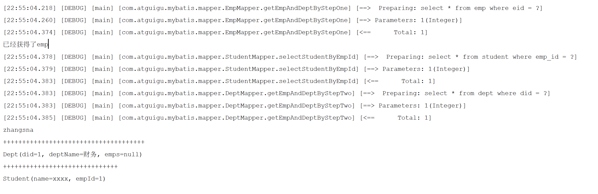

## Mybatis项目搭建

1. 创建Maven项目, 并设置打包方式为jar

   ~~~xml
   <packaging>jar</packaging>
   ~~~

2. 导入依赖

   ~~~xml
   <dependencies>
           <!-- Mybatis核心 -->
           <dependency>
               <groupId>org.mybatis</groupId>
               <artifactId>mybatis</artifactId>
               <version>3.5.7</version>
           </dependency>
   
           <!-- junit测试 -->
           <dependency>
               <groupId>junit</groupId>
               <artifactId>junit</artifactId>
               <version>4.12</version>
           </dependency>
   
           <!-- MySQL驱动 -->
           <dependency>
               <groupId>mysql</groupId>
               <artifactId>mysql-connector-java</artifactId>
               <version>8.0.32</version>
           </dependency>
   
           <!-- log4j日志 -->
           <dependency>
               <groupId>log4j</groupId>
               <artifactId>log4j</artifactId>
               <version>1.2.17</version>
           </dependency>
   
           <dependency>
               <groupId>org.projectlombok</groupId>
               <artifactId>lombok</artifactId>
               <version>1.18.30</version>
           </dependency>
   
       </dependencies>
   ~~~

3. 创建User表

   ~~~sql
   CREATE TABLE User (
                         id INT AUTO_INCREMENT PRIMARY KEY,
                         username VARCHAR(255) NOT NULL,
                         password VARCHAR(255) NOT NULL,
                         age INT,
                         sex VARCHAR(10),
                         email VARCHAR(255)
   );
   ~~~

4. 创建pojo类

   ~~~java
   @Data
   @AllArgsConstructor
   @NoArgsConstructor
   public class User {
       private Integer id;
       private String username;
       private String password;
       private Integer age;
       private String sex;
       private String email;
   }
   ~~~

5. 创建Mapper类, 并保存在`com.tiger.mapper`包下

   ~~~java
   public interface UserMapper {
   
       int insertUser();
       void updateUser();
       void deleteUser();
       User getUserById();
       List<User> getAllUser();
   }
   ~~~

6. 创建Mapper类对应的xml文件, 并保存在`resource/mapper`下

   ~~~xml
   <mapper namespace="com.atguigu.mybatis.mapper.UserMapper">
   
       <insert id="insertUser">
           insert into user values(null,'admin','123456',23,'男','12345@qq.com')
       </insert>
   
       <update id="updateUser">
           update user set username = '张三' where id = 4
       </update>
   
       <delete id="deleteUser">
           delete from user where id = 5
       </delete>
       
       <select id="getUserById" resultType="com.atguigu.mybatis.pojo.User">
           select * from user where id = 3
       </select>
   
       <select id="getAllUser" resultType="User">
           select * from user
       </select>
   
   </mapper>
   ~~~

7. 在`resource`下创建`jdbc.properties`文件, 用于保存数据库连接信息

   ~~~
   jdbc.driver=com.mysql.cj.jdbc.Driver
   jdbc.url=jdbc:mysql://localhost:3306/test
   jdbc.username=root
   jdbc.password=871403165
   ~~~

8. 在`resource`目录下创建`mybatis-config.xml`配置文件

   ~~~xml
   <?xml version="1.0" encoding="UTF-8" ?>
   <!DOCTYPE configuration
           PUBLIC "-//mybatis.org//DTD Config 3.0//EN"
           "http://mybatis.org/dtd/mybatis-3-config.dtd">
   <configuration>
   
       <!--
           MyBatis核心配置文件中，标签的顺序：
           properties?,settings?,typeAliases?,typeHandlers?,
           objectFactory?,objectWrapperFactory?,reflectorFactory?,
           plugins?,environments?,databaseIdProvider?,mappers?
       -->
   
       <!--引入properties文件-->
       <properties resource="jdbc.properties" />
       
       <settings>
           <!-- 设置这个属性, 这样在使用resultType的时候, 就可以自动匹配下划线风格的数据库字段为java中的小驼峰风格的属性 -->
           <setting name="mapUnderscoreToCamelCase" value="true"/>
       </settings>
   
       <!--设置类型别名, 之后在xml中设置resultType的时候就可以使用类名了-->
       <typeAliases>
           <!-- 设置单个类的类型别名, alias可以不写, 默认就是简单类名(不区分大小写, 即resultType中使用user, User都可以)-->
           <typeAlias type="com.atguigu.mybatis.pojo.User" alias="User"/>
   
           <!--将包下所有的类型设置默认的类型别名, 且不区分大小写-->
           <package name="com.atguigu.mybatis.pojo"/>
       </typeAliases>
   
       <!-- environments：配置多个连接数据库的环境, default指定默认使用的环境id -->
       <environments default="development">
           <!-- environment：配置某个具体的环境, id表示环境的唯一标识，不能重复 -->
           <environment id="development">
               <!--
                   transactionManager：设置事务管理方式
                   属性：
                       type="JDBC|MANAGED"
                       JDBC：表示当前环境中，执行SQL时，使用的是JDBC中原生的事务管理方式，事务的提交或回滚需要手动处理
                       MANAGED：被管理，例如Spring
               -->
               <transactionManager type="JDBC"/>
               <!--
                   dataSource：配置数据源
                   属性：
                       type：设置数据源的类型
                       type="POOLED|UNPOOLED|JNDI"
                       POOLED：表示使用数据库连接池缓存数据库连接
                       UNPOOLED：表示不使用数据库连接池
                       JNDI：表示使用上下文中的数据源
               -->
               <dataSource type="POOLED">
                   <!--设置连接数据库的驱动-->
                   <property name="driver" value="${jdbc.driver}"/>
                   <!--设置连接数据库的连接地址-->
                   <property name="url" value="${jdbc.url}"/>
                   <!--设置连接数据库的用户名-->
                   <property name="username" value="${jdbc.username}"/>
                   <!--设置连接数据库的密码-->
                   <property name="password" value="${jdbc.password}"/>
               </dataSource>
           </environment>
   
           <environment id="test">
               <transactionManager type="JDBC"/>
               <dataSource type="POOLED">
                   <property name="driver" value="${jdbc.driver}"/>
                   <property name="url" value="${jdbc.url}"/>
                   <property name="username" value="${jdbc.username}"/>
                   <property name="password" value="${jdbc.password}"/>
               </dataSource>
           </environment>
       </environments>
       <!--引入映射文件-->
       <mappers>
           <!-- 指定单个xml文件, 会根据xml中的namespace来获取到Mapper接口 -->
           <mapper resource="mapper/UserMapper.xml"/>
   
           <!--
               以包为单位引入映射文件
               要求：
               1、mapper接口所在的包要和xml文件所在的包一致
               2、mapper接口要和xml文件的名字一致
               todo mapper接口所在的包要和xml文件所在的包一致
           -->
           <!-- <package name="com.atguigu.mybatis.mapper"/> -->
       </mappers>
   </configuration>
   ~~~

9. 设置运行类

   ~~~java
   public class Main {
   
       /**
        * SqlSession默认不自动提交事务，若需要自动提交事务 可以使用SqlSessionFactory.openSession(true);
        */
       @Test
       public void testMyBatis() throws IOException {
           // 加载核心配置文件
           InputStream is = Resources.getResourceAsStream("mybatis-config.xml");
           // 获取SqlSessionFactoryBuilder
           SqlSessionFactoryBuilder sqlSessionFactoryBuilder = new SqlSessionFactoryBuilder();
           // 获取sqlSessionFactory
           SqlSessionFactory sqlSessionFactory = sqlSessionFactoryBuilder.build(is);
           try (
               // 获取SqlSession, 并设置自动提交
               SqlSession sqlSession = sqlSessionFactory.openSession(true)) {
               // 获取mapper接口对象
               UserMapper mapper = sqlSession.getMapper(UserMapper.class);
               // 测试功能
               int result = mapper.insertUser();
               // 提交事务
               // sqlSession.commit();
   
               System.out.println("result:" + result);
           }
       }
   }
   ~~~

   


## 核心配置文件

~~~xml
<?xml version="1.0" encoding="UTF-8" ?>
<!DOCTYPE configuration
        PUBLIC "-//mybatis.org//DTD Config 3.0//EN"
        "http://mybatis.org/dtd/mybatis-3-config.dtd">
<configuration>

    <!--
        MyBatis核心配置文件中，标签的顺序：
        properties?,settings?,typeAliases?,typeHandlers?,
        objectFactory?,objectWrapperFactory?,reflectorFactory?,
        plugins?,environments?,databaseIdProvider?,mappers?
    -->

    <!--引入properties文件-->
    <properties resource="jdbc.properties" />
    
    <settings>
        <!-- 设置这个属性, 这样在使用resultType的时候, 就可以自动匹配下划线风格的数据库字段为java中的小驼峰风格的属性 -->
        <setting name="mapUnderscoreToCamelCase" value="true"/>
        <!-- 是否开启二级缓存, 默认为true -->
        <setting name="`cacheEnabled" value="true"/>
        <!-- 在进行分步查询的时候, 是否对分步查询对象进行延迟加载, 默认为false -->
        <setting name="lazyLoadingEnabled" value="true"/> 
        <!-- 激进的延迟加载: 如果有多个分步查询对象, 是否在调用其中一个时, 就加载全部的分步查询对象, 默认为false, 这样用到哪个才会加载哪个 -->
        <setting name="aggressiveLazyLoading" value="false"/>
    </settings>

    <!--设置类型别名, 之后在xml中设置resultType的时候就可以使用类名了-->
    <typeAliases>
        <!-- 设置单个类的类型别名, alias可以不写, 默认就是简单类名(不区分大小写, 即resultType中使用user, User都可以)-->
        <typeAlias type="com.atguigu.mybatis.pojo.User" alias="User"/>

        <!--将包下所有的类型设置默认的类型别名, 且不区分大小写-->
        <package name="com.atguigu.mybatis.pojo"/>
    </typeAliases>
    
    <!-- 注册插件 --> 
    <plugins>
   		<plugin interceptor="QueryLimitPlugin">
    	 	<property name="limit" value="100"></property>
    	</plugin>
	</plugins>

    <!-- environments：配置多个连接数据库的环境, default指定默认使用的环境id -->
    <environments default="development">
        <!-- environment：配置某个具体的环境, id表示环境的唯一标识，不能重复 -->
        <environment id="development">
            <!--
                transactionManager：设置事务管理方式
                属性：
                    type="JDBC|MANAGED"
                    JDBC：表示当前环境中，执行SQL时，使用的是JDBC中原生的事务管理方式，事务的提交或回滚需要手动处理
                    MANAGED：被管理，例如Spring
            -->
            <transactionManager type="JDBC"/>
            <!--
                dataSource：配置数据源
                属性：
                    type：设置数据源的类型
                    type="POOLED|UNPOOLED|JNDI"
                    POOLED：表示使用数据库连接池缓存数据库连接
                    UNPOOLED：表示不使用数据库连接池
                    JNDI：表示使用上下文中的数据源
            -->
            <dataSource type="POOLED">
                <!--设置连接数据库的驱动-->
                <property name="driver" value="${jdbc.driver}"/>
                <!--设置连接数据库的连接地址-->
                <property name="url" value="${jdbc.url}"/>
                <!--设置连接数据库的用户名-->
                <property name="username" value="${jdbc.username}"/>
                <!--设置连接数据库的密码-->
                <property name="password" value="${jdbc.password}"/>
            </dataSource>
        </environment>

        <environment id="test">
            <transactionManager type="JDBC"/>
            <dataSource type="POOLED">
                <property name="driver" value="${jdbc.driver}"/>
                <property name="url" value="${jdbc.url}"/>
                <property name="username" value="${jdbc.username}"/>
                <property name="password" value="${jdbc.password}"/>
            </dataSource>
        </environment>
    </environments>
    <!--引入映射文件-->
    <mappers>
        <!-- 指定单个xml文件, 会根据xml中的namespace来获取到Mapper接口 -->
        <mapper resource="mapper/UserMapper.xml"/>

        <!--
            以包为单位引入映射文件
            要求：
            1、mapper接口所在的包要和xml文件所在的包一致
            2、mapper接口要和xml文件的名字一致
            todo mapper接口所在的包要和xml文件所在的包一致
        -->
        <!-- <package name="com.atguigu.mybatis.mapper"/> -->
    </mappers>
</configuration>
~~~


## #{}与${}的区别

${}的本质是字符串拼接, 而#{}的本质是占位符复制


- #将传入的数据都当成一个字符串，会自动为传入的数据添加一个单引号，而$只是字符串拼接

  下面的两条语句，分别传入id = 1，将被编译成

  ~~~xml
  select id,name,age from student where id =#{id}
  select id,name,age from student where id =${id}
  ~~~

  ~~~sql
  select id,name,age from student where id ='1'
  select id,name,age from student where id = 1
  ~~~

- #可以防止sql注入，而$不行，所以应当优先使用#{}

  下面的语句

  ~~~sql
  select * from ${tableName} where name = #{name}
  select * from #{tableName} where name = #{name}
  ~~~

  当tableName为user; delete user; --时将被编译为

  ~~~sql
  select * from user; delete user; -- where name = ?
  select * from 'user; delete user; --' where name = ?
  ~~~

- 在group by 和 order by的时候必须使用${}

  如下的语句

  ~~~sql
  select * from tableA group by ${columnA} order by #{columnB}
  ~~~

  传入columnA为id， columnB为createTime时被编译为，然而我们是要对createTime字段进行排序，而不是字符串createTime，所以只能使用${}

  ~~~sql
  select * from tableA group by id order by 'createTime'
  ~~~

- 处理时机不同。

  如果是下面的sql, 传入name为zhangsan：

  ~~~xml
  select * from ${tableName} where name = #{name}
  ~~~

  #{}在预处理的时候，会把参数变成一个占位符？代替

  ~~~sql
  select * from user where name = ?
  ~~~

  而${}只是在动态解析阶段做简单的字符串替换

  ~~~sql
  select * from user where name = 'zhangsan'
  ~~~


## MyBatis 在xml中获取方法参数的方式

1. 当方法只有一个参数时, 在xml中可以使用**任意名**来获取这个参数的值

   **注意在使用${}时需要两边加上单引号**

   ~~~java
   User getUserByUsername(String username);
   ~~~

   ~~~xml
   <select id="getUserByUsername" resultType="User">
      <!-- select * from t_user where username = #{username} -->
      select * from t_user where username = '${username}'
   </select>
   
   ~~~

2. 当方法的参数有多个时, 可以在xml中通过`arg0, arg1`或者`param1, param2`的方式来获取方法的参数

   **注意在使用${}时需要两边加上单引号**

   ~~~java
   User checkLogin(String username, String password);
   ~~~

   ~~~xml
   <select id="checkLogin" resultType="User">
       <!--select * from t_user where username = #{arg0} and password = #{arg1}-->
       select * from t_user where username = '${param1}' and password = '${param2}'
   </select>
   ~~~

3. 当方法参数有多个的时候, 也可以直接使用`@Param`注解来直接指定该参数在xml中的名称

   ~~~java
   User checkLoginByParam(@Param("username") String username, @Param("password") String password);
   ~~~

   ~~~xml
   <select id="checkLoginByParam" resultType="User">
       select * from t_user where username = #{username} and password = #{password}
   </select>
   ~~~

4. 当方法参数有多个时, 也可以直接传入一个map作为参数, 在xml中可以使用map中的key来获取值

   ~~~java
   User checkLoginByMap(Map<String, Object> map);
   ~~~

   ~~~xml
   <select id="checkLoginByMap" resultType="User">
       select * from t_user where username = #{username} and password = #{password}
   </select>
   ~~~

5. 当方法参数有多个时, 也可以直接使用一个POJO类来作为参数, 然后使用其`属性`来获取值

   ~~~java
   int insertUser(User user);
   ~~~

   ~~~xml
   <insert id="insertUser">
      insert into t_user values(null,#{username},#{password},#{age},#{sex},#{email})
   </insert>
   ~~~

## Mybatis 查询的结果类型

1. 查询一个POJO的时候, 可以直接将POJO作为结果类型

   ~~~java
   User getUserById(@Param("id") int id);
   ~~~

   ~~~xml
   <select id="getUserById" resultType="User">
   select * from t_user where id = #{id}
   </select>
   ~~~

2. 查询单个POJO的时候, 也可以使用Map作为结果, mybatis会将查询出来的字段名和对应的value设置到其中

   ~~~java
   Map<String, Object> getUserToMap(@Param("id") int id);
   ~~~

   ~~~xml
   <select id="getUserToMap" resultType="map">
   	select * from t_user where id = #{id}
   </select>
   ~~~

3. 查询多个POJO时, 可以返回一个List集合, 或者Map集合, POJO表示每一条记录

   ~~~java
   List<User> getUserList();
   
   // 设置一个查询出来的字段, 作为map的key, 一般是主键
   @MapKey("uid")
   Map<Integer, User>  getUserList();
   ~~~

   ~~~xml
   <select id="getUserList" resultType="User">
   	select * from t_user
   </select>
   ~~~

4. 查询多个POJO时, 可以返回一个List集合, 或者Map集合, Map<String, Object>表示每一条记录

   ~~~xml
   List<Map<String, Object>> getAllUserToMap();
   
   // 设置一个查询出来的字段, 作为map的key, 一般是主键
   @MapKey("uid")
   Map<Integer, Map<String, Object>>  getUserList();
   ~~~

   ~~~xml
   <select id="getAllUserToMap" resultType="map">
   	select * from t_user
   </select>
   ~~~


## 特殊的SQL

### 模糊查询

~~~java
List<User> selectNameLike(@Param("name") String name);
~~~

~~~xml
<select id="selectNameLike" resultType="User">
	<!-- select * from t_user where username like '%${mohu}%' -->
	<!-- select * from t_user where username like "%"#{mohu}"%" -->
    
    <!-- 使用这种方式最好 -->
    select * from t_user where username like concat('%',#{mohu},'%')
</select>
~~~

### 批量删除

~~~java
int deleteStudentIn(@Param("ids") String ids);
~~~

~~~xml
<delete id="deleteStudentIn">
    <!-- 通过这种方式传过来的参数, 如果是数字, 那么要类似 1,2,3 -->
    <!-- 如果是字符串, 必须类似: 'xx', 'aa', 'bb' -->
    <!-- 需要自己控制格式, 还是推荐使用动态sql中的foreach -->
	delete from t_user where id in (${ids})
</delete>
~~~

### 动态设置表名

~~~java
List<User> getAllUser(@Param("tableName") String tableName);
~~~

~~~xml
<select id="getAllUser" resultType="User">
    <!-- 这里必须使用${} -->
	select * from ${tableName}
</select>
~~~

### GroupBy和OrderBy

~~~java
List <User> selectUserGroupByAndOrderBy(@Param("groupBy") String groupBy, @Param("orderBy") String orderBy)
~~~

~~~xml
<select id="getAllUser" resultType="User">
    <!-- 这里必须使用${} -->
	select * from user group by ${groupBy} order by ${orderBy}
</select>
~~~

## resultType和resultMap的区别

在POJO属性和表字段一一对应的情况下, 使用resultType

当PJOO属性和表字段不一致的情况下, 我们就需要使用resultMap来自定义映射关系了


## 自定义映射resultMap

我们有如下java类和数据库表

~~~java
public class User {
    private Long id;
    private String userName;
    private String age;
}
~~~

~~~sql
CREATE TABLE User (
    id BIGINT PRIMARY KEY,
    user_name VARCHAR(255),
    age VARCHAR(255)
);
~~~

此时我们的属性`userName`和数据库中的`user_name`就无法一一对应上, 对于这种情况我们通过配置mybatis, 让他可以将java中的小驼峰属性和数据库中的下划线风格的字段进行对应上, 配置如下

~~~xml
<?xml version="1.0" encoding="UTF-8" ?>
<!DOCTYPE configuration
        PUBLIC "-//mybatis.org//DTD Config 3.0//EN"
        "http://mybatis.org/dtd/mybatis-3-config.dtd">
<configuration>
    <settings>
        <!-- 设置这个属性, 这样在使用resultType的时候, 就可以自动匹配下划线风格的数据库字段为java中的小驼峰风格的属性 -->
        <setting name="mapUnderscoreToCamelCase" value="true"/>
    </settings>
</configuration>
~~~


或者我们可以使用resultMap自定义映射关系

~~~xml
<!-- id指定resultMap的id, type指定映射的java类型-->
<!-- id列一般用来指定表中的主键字段,  property表示java中的属性, column指定对应的表字段-->
<!-- result列一般用来指定非主键字段-->
<resultMap id="user" type="User">
    <id property="id" column="id"/>
    <result property="userName" column="user_name" />
    <result property="age" column="age" />
</resultMap>

<!-- resultMap表示要使用的映射关系 -->
<select id="selectById" resultMap="user">
    select * from user
</select>
~~~


## 主键回填

https://blog.csdn.net/anLA_/article/details/103153210

1. 对应主键字段设置了自增的情况(mysql, postgres支持主键自增)

   ~~~java
   int insertUser(User user);
   int insertUserBatch(List<User> users);
   ~~~

   ~~~xml
   <!-- useGeneratedKeys表示使用数据库的回填功能,  keyProperty指定回填到User中的属性 --> 
   <insert id="insertUser" useGeneratedKeys="true" keyProperty="id" keyColumn="id">
   	insert into t_user values(null,#{username},#{password},#{age},#{sex})
   </insert>
       
   <insert id="insertUserBatch" useGeneratedKeys="true" keyProperty="id">
   	insert into t_user values
       <foreach item="user" index="index" collection="users" separator=",">
           (null, #{user.username}, #{user.password}, #{user.age}, #{user.sex})
       </foreach>
   </insert>
   ~~~
~~~
   
原理分析:
   
当执行`insert`语句的时候, 可以通过`getGeneratedKeys` 获取 当条插入语句的自增而成的主键。原理是 数据库端返回一个`LAST_INSERT_ID`，这个跟`auto_increment_id` 强相关。
   
   ~~~java
   Connection conn = DriverManager.getConnection(url, "root", "123456");
   String[] columnNames = {"ids", "name"};
   PreparedStatement stmt = conn.prepareStatement(sql, columnNames);
   stmt.setString(1, "test jdbc3 ");
   stmt.executeUpdate();
   ResultSet rs = stmt.getGeneratedKeys();
   int id = 0;
   if (rs.next()) {
     id = rs.getInt(1);
     System.out.println("----------" + id);
   }
~~~


2. 对于主键没有设置自增, 或者数据库不支持自增(oracle)的情况, 我们使用如下的方式: 

   ~~~java
   int insertUser(User user);
   ~~~

   ~~~xml
   <insert id="insertUser">
           <selectKey keyProperty="id" resultType="long" order="BEFORE">
               <!-- 表示还没有id时, 第一个id为1, 否则这次插入的id为max(id)+1 -->
               SELECT if(max(id) is null,1,max(id)+1) as newId FROM department
           </selectKey>
           insert into department (id, name) values (#{id}, #{department.name})
   </insert>
   ~~~

   原理解析:

   对于没有主键没有设置自增, 或者数据库不支持自增的情况, 我们在插入的时候,就必须手动生成一个sql, 然后插入进行

   上面的selectKey就是做这个事情, order="BEFORE"指定了selectKey中的语句会先于insert执行, selectKey中的sql就是查询数据库中的最大id, 然后返回最大id+1, 然后回填到keyProperty指定的属性中

   然后在执行insert语句的时候, 我们的Users中其实已经设置了id了, 这个时候我们就可以将这个id连同数据一起插入进行

   总结就是在插入数据库之前先生成了一个id, 与我们自己手动设置id没什么不同

   

## 级联

### 一对一的关系映射

假设我们有如下的员工类 和 部门类, 其中一个部门可以有多个员工, 一个员工只能有一个部门

~~~java
public class Emp implements Serializable {
    private Integer eid;
    private String empName;
    private Integer age;
    private String sex;
    private String email;
    private Dept dept;
}

public class Dept {
    private Integer did;
    private String deptName;
    private List<Emp> emps;
}
~~~

我们想在查询员工时同时查询出其部门可以有如下的方式

~~~java
Emp getEmpAndDeptByEid(@Param("eid") int eid);
~~~

1. 级联属性映射

   ~~~xml
   <resultMap id="empDeptMap" type="Emp">
   	<id column="eid" property="eid"></id>
   		<result column="ename" property="ename"></result>
   		<result column="age" property="age"></result>
   		<result column="sex" property="sex"></result>
   		<result column="did" property="dept.did"></result>
   		<result column="dname" property="dept.dname"></result>
   </resultMap>
   
   <select id="getEmpAndDeptByEid" resultMap="empDeptMap">
   	select emp.*,dept.* from t_emp emp left join t_dept dept on emp.did = dept.did where emp.eid = #{eid}
   </select>
   ~~~

2. 通过association处理

   ~~~xml
   <resultMap id="empDeptMap" type="Emp">
   	<id column="eid" property="eid"></id>
   	<result column="ename" property="ename"></result>
   	<result column="age" property="age"></result>
   	<result column="sex" property="sex"></result>
   	<association property="dept" javaType="Dept">
   		<id column="did" property="did"></id>
   		<result column="dname" property="dname"></result>
   	</association>
   </resultMap>
   
   <select id="getEmpAndDeptByEid" resultMap="empDeptMap">
   	select emp.*,dept.* from t_emp emp left join t_dept dept on emp.did = dept.did where emp.eid = #{eid}
   </select>
   ~~~

3. 分步查询

   ~~~xml
   <resultMap id="empDeptStepMap" type="Emp">
   	<id column="eid" property="eid"></id>
   	<result column="ename" property="ename"></result>
   	<result column="age" property="age"></result>
   	<result column="sex" property="sex"></result>
       <!-- select指定要查询dept的sql, 格式为namespace.sqlId-->
       <!-- column表示将查询出来的did作为参数, 传入到getEmpDeptByStep中进行查询 -->
   	<association property="dept" select="com.atguigu.MyBatis.mapper.DeptMapper.getEmpDeptByStep" column="did"/>
   </resultMap>
   
   <select id="getEmpByStep" resultMap="empDeptStepMap">
   	select * from t_emp where eid = #{eid}
   </select>
   ~~~

   

### 一对多的关系映射

还是上面的两个POJO类, 如果我们想要根据部门Id查询出部门以及该部门的所有员工

~~~java
Dept getDeptEmpByDid(@Param("did") int did);
~~~

我们可以使用如下的方式:

1. 通过collection处理关系

   ~~~xml
   <resultMap id="deptEmpMap" type="Dept">
   	<id property="did" column="did"></id>
   	<result property="dname" column="dname"></result>
   	<!-- ofType：设置集合元素的类型, 类似resultType -->
   	<collection property="emps" ofType="Emp">
   		<id property="eid" column="eid"></id>
   		<result property="ename" column="ename"></result>
   		<result property="age" column="age"></result>
   		<result property="sex" column="sex"></result>
   	</collection>
   </resultMap>
   
   <select id="getDeptEmpByDid" resultMap="deptEmpMap">
   	select dept.*,emp.* from t_dept dept left join t_emp emp on dept.did = emp.did where dept.did = #{did}
   </select>
   ~~~

2. 分步查询

   ~~~xml
   <resultMap id="deptEmpStep" type="Dept">
   	<id property="did" column="did"></id>
   	<result property="dname" column="dname"></result>
       <!-- select指定要查询dept的sql, 格式为namespace.sqlId-->
       <!-- column表示将查询出来的did作为参数, 传入到getEmpDeptByStep中进行查询 -->
   	<collection property="emps" fetchType="eager"
   		select="com.atguigu.MyBatis.mapper.EmpMapper.getEmpListByDid" column="did">
   	</collection>
   </resultMap>
   
   <select id="getDeptByStep" resultMap="deptEmpStep">
   	select * from t_dept where did = #{did}
   </select>
   ~~~

   

### 分步查询的优缺点

可以在`mybatis-config.xml`中的`settings`文件中通过`lazyLoadingEnabled`开启全局的分步查询延迟加载, 该属性默认为false

开启了延迟加载后, 那么**只有在调用到分步查询对象的属性之后, 才会对其进行加载**

同时还有属性`aggressiveLazyLoading`, 该属性表示**调用任何分步查询对象的属性时, 是否立即加载所有的分步查询对象**

在>3.4.1版本时默认为false, 在<=3.4.1版本时默认为true

~~~xml
<?xml version="1.0" encoding="UTF-8" ?>
<!DOCTYPE configuration
        PUBLIC "-//mybatis.org//DTD Config 3.0//EN"
        "http://mybatis.org/dtd/mybatis-3-config.dtd">
<configuration>
    <settings>
        <!--是否开启全局的延迟加载-->
        <!-- <setting name="lazyLoadingEnabled" value="true"/> -->
        <!-- 是否在调用的时候就加载全部的属性 -->
        <!-- <setting name="aggressiveLazyLoading" value="true"/> -->
    </settings>
</configuration>
~~~


在上面员工和部门的例子中, 我们给Emp多添加一个Student的属性

~~~java
@Data
@AllArgsConstructor
@NoArgsConstructor
public class Emp {
    private Integer eid;
    private String empName;
    private Integer age;
    private String sex;
    private String email;
    private Dept dept;
    private Student student;
}
@Data
@AllArgsConstructor
@NoArgsConstructor
public class Student {
    private String name;
    private String empId;
}
~~~

~~~xml
<resultMap id="empAndDeptByStepResultMap" type="Emp">
        <id property="eid" column="eid"/>
        <result property="empName" column="emp_name"/>
        <result property="age" column="age"/>
        <result property="sex" column="sex"/>
        <result property="email" column="email"/>
        <!--
            select:设置分步查询的sql的唯一标识（namespace.SQLId或mapper接口的全类名.方法名）
            column:设置分布查询的条件
            fetchType:当开启了全局的延迟加载之后，可通过此属性手动控制延迟加载的效果
            fetchType="lazy|eager":lazy表示延迟加载，eager表示立即加载
        -->
        <association property="dept"
          select="com.atguigu.mybatis.mapper.DeptMapper.getEmpAndDeptByStepTwo"
          column="did"/>
        <association property="student"
          select="com.atguigu.mybatis.mapper.StudentMapper.selectStudentByEmpId"
          column="eid"/>
</resultMap>
<select id="getEmpAndDeptByStepOne" resultMap="empAndDeptByStepResultMap">
        select * from emp where eid = #{eid}
</select>
~~~

当我们通过`Emp getEmpAndDeptByEid(@Param("eid") int eid)`查询到Emp时

~~~java
@Test
    public void testGetEmpAndDeptByStep(){
        SqlSession sqlSession = SqlSessionUtils.getSqlSession();
        EmpMapper mapper = sqlSession.getMapper(EmpMapper.class);
        Emp emp = mapper.getEmpAndDeptByStepOne(1);
        System.out.println("已经获得了emp");
        System.out.println(emp.getEmpName());
        System.out.println("+++++++++++++++++++++++++++++++++++++");
        System.out.println(emp.getDept());
        System.out.println("++++++++++++++++++++++++++++++");
        System.out.println(emp.getStudent());
    }
~~~

如果`lazyLoadingEnabled`为false, 结果如下, 可以看到emp和dept和student都被立即查询出来


如果`lazyLoadingEnabled`为true, `aggressiveLazyLoading`为true时, 结果如下

可以看到, emp被立即查询出来, 当调用dept的时候, dept和student都被立即查询出来



如果`lazyLoadingEnabled`为true, `aggressiveLazyLoading`为false时, 

 可以看到emp被立即查询出来, 当dept的时候, dept被查询出来, 当调用student的时候, student被查询出来


同时在`association`和`collection`标签中, 还有一个单独的属性`fetchType`

**当开启全局的延迟加载之后**, 可通过这个属性控制单个的分步查询是否延迟加载

`fetchType="lazy(延迟加载)|eager(立即加载)" `


## 条件运算符转义

Mybatis中的sql语句中的  “<”  和   “>”  号要用转义字符   “`&lt;`”   和  ”`&gt;`“ ，否则会报错！

如查找年龄大于等于指定年龄的用户信息：

```sql
SELECT * FROM T_USER WHERE AGE &gt;=#{age}
```


## 动态SQL

### if

~~~xml
<select id="selectUserBy" resultType="User">
    <!-- 注意这里必须加1=1, 否则会报错 -->
	select * from t_emp where 1=1
	<if test="age != null and age != ''">
		and age = #{age}
	</if>
	<if test="sex != null and sex != ''">
		and sex = #{sex}
	</if>
</select>  
~~~

### where

where一般和if进行使用

- 如果所有的if都不成立, 那么不会添加where关键字
- 如果where中的有if成立, 那么会添加关键字, 并且把条件最前面多余的if去掉
- where标签不能去掉最后多余的and

~~~xml
<select id="selectUserBy" resultType="User">
	select * from t_emp 
	<if test="age != null and age != ''">
		age = #{age}
	</if>
	<if test="sex != null and sex != ''">
		and sex = #{sex}
	</if>
</select>  
~~~

### foreach

collection表示循环的集合

item表示集合中的每个数据

index表示当前数据的索引

separator：设置循环体之间的分隔符

open：设置foreach标签中的内容的开始符

close：设置foreach标签中的内容的结束符  

~~~xml
<!--int insertMoreEmp(List<Emp> emps);-->
<insert id="insertMoreEmp">
	insert into t_emp values
    <foreach collection="emps" item="emp" separator=",">
		(null,#{emp.ename},#{emp.age},#{emp.sex},#{emp.email},null)
	</foreach>
</insert>

<!--int deleteMoreByArray(int[] eids);-->
<delete id="deleteMoreByArray">
	delete from t_emp where
    <foreach collection="eids" item="eid" separator="or">
		eid = #{eid}
	</foreach>
</delete>

<!--int deleteMoreByArray(int[] eids);-->
<delete id="deleteMoreByArray">
	delete from t_emp where eid in
    <foreach collection="eids" item="eid" separator="," open="(" close=")">
		#{eid}
	</foreach>
</delete>
~~~

### trim

trim的功能是: 

如果标签中的if成立,  那么会删除内容开头的prefixOverrides,和内容结尾的suffixOverrides

然后再在内容开头加上prefix , 在内容结尾加上suffix 

~~~xml
<select id="getEmpListByMoreTJ" resultType="Emp">
	select * from t_emp
    <!-- 删除掉内容开头和结束的end, 然后在开头添加上where -->
	<trim prefix="where" prefixOverrides="and" suffixOverrides="and">
		<if test="ename != '' and ename != null">
			and ename = #{ename} and
		</if>
		<if test="age != '' and age != null">
			age = #{age} and
		</if>
		<if test="sex != '' and sex != null">
			sex = #{sex} and
		</if>
	</trim>
</select>
~~~

### set

set常常用在update语句中

如果if成立, 那么会添加set关键字, 并且删除掉最后面的逗号

~~~xml
<update id="updateAuthorIfNecessary">
  update Author
    <set>
      <if test="username != null">username=#{username},</if>
      <if test="password != null">password=#{password},</if>
      <if test="email != null">email=#{email},</if>
      <if test="bio != null">bio=#{bio}</if>
    </set>
  where id=#{id}
</update>
~~~

set可以使用trim来实现

~~~xml
<trim prefix="SET" suffixOverrides=",">
  ...
</trim>
~~~


### choose, when, otherwise

choose, when, otherwise相当于java中的switch

~~~java
<select id="getEmpListByChoose" resultType="Emp">
	select <include refid="empColumns"></include> from t_emp
	<where>
		<choose>
			<when test="ename != '' and ename != null">
				ename = #{ename}
			</when>
			<when test="age != '' and age != null">
				age = #{age}
			</when>
			<when test="sex != '' and sex != null">
				sex = #{sex}
			</when>
			<otherwise>
				email = #{email}
			</otherwise>
		</choose>
	</where>
</select>
~~~


### sql片段

sql片段，可以记录一段公共sql片段，在使用的地方通过include标签进行引入  

~~~xml
<sql id="empColumns">
	eid,ename,age,sex,did
</sql>
<select id="selectAllEmp" resultType="Emp">
    select <include refid="empColumns" /> from t_emp
</select>
~~~


## Mybatis缓存

### 缓存的工作原理

一级缓存是`SqlSession`级别的，**默认开启而且不能关闭**的

SqlSession会将`sql语句`, `查询条件`和`结果`进行缓存, 下次执行相同的sql语句, 相同条件的时候, 就直接从缓存中取(同一个sql语句, 不同的条件会生成多个缓存)

二级缓存是`SqlSessionFactory`级别, 是基于namespace实现的，即一个mapper映射文件用一个缓存, **当sqlSession对事务进行提交的时候, 或者sqlSession close的时候, 会将他的缓存放入到一级缓存中**, 这样其他的sqlSession也可以使用了

在查询的时候, 先使用二级缓存, 因为二级缓存都是提交后的最新的数据, 然后是一级缓存, 最后是数据库


一级缓存的主要用途就是, 当sqlSession开启事务之后, 会将查询结果放到已经缓存中, 因为是在事务中查询出来的结果, 这些结果对于其他事务可能不是最新的数据, 所以必须放在sqlSession中进行隔离,

当sqlSession提交事务或者close后, 那么一级缓存中的数据肯定就是最新的数据, 这个时候可以把最新的数据放到SqlSessionFactory中, 供其他sqlSession使用

> 执行增删改会先清空当前sqlSession中的缓存和SqlSessionFactory缓存, 然后再执行sql


### 开启缓存

一级缓存是默认开启并且不能关闭

二级缓存开启的方式:

1. 在配置文件中设置`cacheEnabled="true"`，默认为true所以只要不关闭即可

   ~~~xml
   <?xml version="1.0" encoding="UTF-8" ?>
   <!DOCTYPE configuration
           PUBLIC "-//mybatis.org//DTD Config 3.0//EN"
           "http://mybatis.org/dtd/mybatis-3-config.dtd">
   <configuration>
       <settings>
           <!-- <setting name="`cacheEnabled" value="true"/> -->
       </settings>
   </configuration>
   ~~~
   
2. 在Mapper的xml文件中设置<cache/>标签, cache标签可以配置一些属性, 如下

   - eviction属性：缓存回收策略
     LRU（Least Recently Used） – 最近最少使用的：移除最长时间不被使用的对象。
     FIFO（First in First out） – 先进先出：按对象进入缓存的顺序来移除它们。
     SOFT – 软引用：移除基于垃圾回收器状态和软引用规则的对象。
     WEAK – 弱引用：更积极地移除基于垃圾收集器状态和弱引用规则的对象。
     默认的是 LRU。
   - flushInterval属性：刷新间隔，单位毫秒
     默认情况是不设置，也就是没有刷新间隔，缓存仅仅调用语句时刷新
   - size属性：引用数目，正整数
     代表缓存最多可以存储多少个对象，太大容易导致内存溢出
   - readOnly属性：只读，true/false
     true：只读缓存；会给所有调用者返回缓存对象的相同实例。因此这些对象不能被修改。这提供了
     很重要的性能优势。
     false：读写缓存；会返回缓存对象的拷贝（通过序列化）。这会慢一些，但是安全，因此默认是
     false。  

3. 查询的数据所转换的实体类类型必须实现序列化的接口  


### 分布式和缓存

https://cloud.tencent.com/developer/article/2297085

https://tech.meituan.com/2018/01/19/mybatis-cache.html

结论:  在分布式环境下建议禁用MyBatis的一级、二级缓存，否则可能出现数据一致性问题。二级缓存虽然默认关闭，建议设置settings中配置：cacheEnabled 为false，全局关闭。MyBatis的一级缓存最大范围是SqlSession内部，有多个SqlSession或者分布式的环境下，数据库写操作会引起脏数据，建议设置localCacheScope属性设置为STATEMENT，查询时清空一级缓存


## Mybatis 插件

https://www.bilibili.com/video/BV1hy4y1j7oF/?p=10&vd_source=f79519d2285c777c4e2b2513f5ef101a

### 概述

在mybatis中, 插件的作用是对mybatis中使用到的`Executor`，`StatementHandler`，`ParameterHandler`，`ResultSetHandler`四个接口的子类进行动态代理,  然后mybatis在调用这四个接口的子类实现方法时, 我们就可以对其进行增强


要实现插件, 必须实现`Interceptor`接口, 当mybatis中是要使用到`Executor`，`StatementHandler`，`ParameterHandler`，`ResultSetHandler`四个接口时, 就会创建对应的子类, 然后把具体的实现类传入到`Interceptor.plugin()`中, 在这个方法中, 我们可以对这些子类进行动态代理, 然后进行增强

下面是四个接口中每个方法的作用


### Interceptor接口详解

下面是`Interceptor`接口的源码:

~~~java
public interface Interceptor {

  Object intercept(Invocation invocation) throws Throwable;

  default Object plugin(Object target) {
    return Plugin.wrap(target, this);
  }
  default void setProperties(Properties properties) { }
}
~~~

1. `setProperties()`方法的作用是, 我们在注册`Interceptor`的时候, 可以在xml中设置一些自定义的属性, 当mybatis扫描到plugin标签时, 就会通过反射创建`Interceptor`并调用`setProperties()`方法传入这些属性

   ~~~xml
   <plugins>
       <plugin interceptor="xxx">
           <property name="key1" value="value1"></property>
           <property name="key1" value="value1"></property>
       </plugin>
   </plugins>
   ~~~

2. `plugin()`方法的作用是, 当mybatis使用到上述四个接口时, 就会创建对应的实现类, 然后循环调用所有`Interceptor`的`plugin()`方法, 我们可以在`plugin()`方法中对这些实现类进行代理

   ~~~java
   public class InterceptorChain {
     private final List<Interceptor> interceptors = new ArrayList<>();
     public Object pluginAll(Object target) {
       for (Interceptor interceptor : interceptors) {
           // 循环进行代理
         target = interceptor.plugin(target);
       }
       return target;
     }
   }
   ~~~

   `plugin()`方法是default方法, 默认实现为`Plugin.wrap(target, this)`

   伪代码如下:

   ~~~java
       public static Object wrap(Object target, Interceptor interceptor) {
           return Proxy.newProxyInstance(classLoader, target.interfaces, new InvocationHandler() {
           // 保存Interceptor上通过`Intercepts`注解指定的方法
           Set<Method> interceptMethod ;
           Interceptor interceptor ;
           Object target;
           public Object invoke(Object proxy, Method method, Object[] args) throws Throwable {
               // 判断方法是否是我们要指定拦截的
               if (interceptMethod.contains(method)) {
                   return interceptor.intercept(new Invocation(target, method, args));
               } else {
                   // 否则直接跳过
                   return method.invoke(target, args);
               }
           }
       }
     );
   }
   ~~~

   可以看到, 如果我们使用`Plugin.wrap(target, this)`来对target进行代理, 我们就可以通过`Intercepts`这个注解来指定具体要拦截的接口和方法

   只有我们指定要拦截的方法, 才会调用`interceptor.intercept()`, 否则就会执行他原来的逻辑

   > 一般推荐使用plugin()方法的默认实现,  如果我们重载他, 自己实现代理逻辑, 那么我们就要对target进行类型判断, 因为mybatis会把四个接口的实现类都传入plugin()中
   >
   > 同时在我们的代理逻辑中, 也要分清楚当前调用的具体方法是什么, 根据不同的方法实现不同的增强逻辑

   > 如果我们重写plugin()方法, 自定义代理逻辑, 那么就不会调用Interceptor的intercept方法,  需要注意!!!!!!!


### 注册Interceptor插件到mybatis中

~~~xml
<configuration>
    <plugins>
   		<plugin interceptor="xxx">
    	 	<property name="key1" value="value1"></property>
   	     	<property name="key1" value="value1"></property>
    	</plugin>
	</plugins>
</configuration>
~~~


### 自定义Interceptor案例1

下面我们实现一个能够帮我们给sql语句自动加上limit的功能(没有测试!!!!!)

 **todo 这个实例有问题, 只能拦截query方法, 需要通过jsqlparser解析sql, 并判断是不是select语句, 然后判断原来的sql上有没有limit**

~~~java
@Intercepts( {
    // 指定要拦截的接口, 方法, 方法的参数
    // @Signature可以有多个, 即拦截多个方法
    @Signature(type = StatementHandler.class, method = "prepare", args = {Connection.class, Integer.class})}
)
public class QueryLimitPlugin implements Interceptor {

    private int limit = 500;
    private static final String LIMIT_TABLE_NAME = "limit_table";

    @Override
    public Object intercept(Invocation invocation) throws Throwable {
        // 因为我们只指定了要拦截StatementHandler的prepare方法, 所以可以强转target
        StatementHandler statementHandler = (StatementHandler) invocation.getTarget();
        // 获取StatementHandler的源信息
        MetaObject metaobject = SystemMetaObject.forObject(statementHandler);
        // 获取要执行的sql
        String sql = ((String) metaobject.getValue( "delegate.boundSql.sql")).trim();
        // 比如原来的sql是 select * from user
        // 那么就把他改为  select * from ( select * from user ) limit_table limit 500
        String limitSql = "select * from (" + sql +") "+ LIMIT_TABLE_NAME +" limit " + limit;//重写要执行得SOL 语句;
        // 重新设置要执行的sql
        metaobject.setValue( "delegate.boundSql.sql", limitSql);
        // 调用target类的原始逻辑
        return invocation.proceed();

    }

    @Override
    public void setProperties(Properties properties) {
        this.limit = Integer.parseInt(properties.getProperty("limit", "50"));
    }
}
~~~

~~~xml
<configuration>
    <plugins>
   		<plugin interceptor="com.tiger.mybatis.plugin.QueryLimitPlugin">
    	 	<property name="limit" value="100"></property>
    	</plugin>
	</plugins>
</configuration>
~~~


### 自定义Interceptor2

https://www.bilibili.com/video/BV1hu4m1c7Bz/?spm_id_from=333.1007.tianma.1-3-3.click&vd_source=f79519d2285c777c4e2b2513f5ef101a

需求:

1. 在mapper的方法上标注`DynamicSql`注解, 即可替换掉sql的占位符为指定的内容

**记得注册插件**

~~~java
@Slf4j
@Intercepts({
    @Signature(type = StatementHandler.class, method = "prepare", args = {java.sql.Connection.class, Integer.class})})
public class DynamicSqlInterceptor implements Interceptor {

    // 占位符
    public String placeholder = "@dynamic_time";
    // 要替换的时间, 注意要加''
    public String dynamicDate = "'2024-01-01 01:00:00'";

    @Override
    public Object intercept(Invocation invocation) throws Throwable {
        // 因为我们只指定了要拦截StatementHandler的prepare方法, 所以可以强转target
        StatementHandler statementHandler = (StatementHandler)invocation.getTarget();
        // 获取StatementHandler的源信息
        MetaObject metaobject = SystemMetaObject.forObject(statementHandler);
        // 通过metaObject反射获取statementHandler对象的成员变量mappedStatement
        MappedStatement mappedStatement = (MappedStatement)metaobject.getValue("delegate.mappedStatement");
        // 获取传入到mapper方法中的参数
        Object parameterObject = metaobject.getValue("delegate.boundSql.parameterObject");

        // 获取mapper方法的全路径名, 比如com.tiger.mapper.UserMapper.count
        String id = mappedStatement.getId();
        // 通过id获取Mapper的全路径, 然后反射获取Mapper的class
        Class<?> mapperClass = Class.forName(id.substring(0, id.lastIndexOf(".")));
        // 获取mapper的方法
        String methodName = id.substring(id.lastIndexOf(".") + 1);
        for (Method method : mapperClass.getMethods()) {
            // todo 没有办法获取method的参数类型, 也就没办法获取method对象, 只能使用这种方式
            // 如果相同的方法有两个怎么办 ?
            if (methodName.equals(method.getName()) && method.isAnnotationPresent(DynamicSql.class)) {
                // 获取包含元素sql语句的BoundSql对象中的sql
                BoundSql boundSql = statementHandler.getBoundSql();
                String sql = boundSql.getSql();
                log.info("替换前的sql: {}", sql);
                String newSql = sql.replace(placeholder, String.format("%s", dynamicDate));
                log.info("替换后的sql: {}", newSql);
                if (!newSql.isEmpty()){
                    Field field = boundSql.getClass().getDeclaredField("sql");
                    field.setAccessible(true);
                    field.set(boundSql, newSql);
                }
                break;
            }
        }
        return invocation.proceed();
    }

    @Retention(RetentionPolicy.RUNTIME)
    @Target({ ElementType.METHOD})
    public static @interface DynamicSql  { }
}
~~~


### 自定义Interceptor3

需求:

1. 将`@PlatformTag`注解标注在mapper类上面, 即可对其中的所有sql的where字段中添加一个`platform_id`的过滤条件
2. 将`@PlatformIgnore`标注在mapper方法上, 即可忽略给mapper方法

记得注册插件

~~~java
import java.util.ArrayList;
import java.util.List;
import java.util.Properties;
import lombok.extern.slf4j.Slf4j;
import net.sf.jsqlparser.expression.Expression;
import net.sf.jsqlparser.expression.operators.relational.ExpressionList;
import net.sf.jsqlparser.parser.CCJSqlParserUtil;
import net.sf.jsqlparser.schema.Column;
import net.sf.jsqlparser.schema.Table;
import net.sf.jsqlparser.statement.Statement;
import net.sf.jsqlparser.statement.insert.Insert;
import net.sf.jsqlparser.statement.select.Select;
import net.sf.jsqlparser.statement.select.FromItem;
import net.sf.jsqlparser.statement.select.PlainSelect;
import net.sf.jsqlparser.statement.update.Update;
import org.apache.ibatis.cache.CacheKey;
import org.apache.ibatis.executor.Executor;
import org.apache.ibatis.mapping.BoundSql;
import org.apache.ibatis.mapping.MappedStatement;
import org.apache.ibatis.plugin.Interceptor;
import org.apache.ibatis.plugin.Intercepts;
import org.apache.ibatis.plugin.Invocation;
import org.apache.ibatis.plugin.Plugin;
import org.apache.ibatis.plugin.Signature;
import org.apache.ibatis.session.ResultHandler;
import org.apache.ibatis.session.RowBounds;

@Slf4j
@Intercepts({
        @Signature( type = Executor.class, method = "update",args = {MappedStatement.class, Object.class}),
        @Signature(type = Executor.class, method = "query",args = {MappedStatement.class, Object.class, RowBounds.class, ResultHandler.class}),
        @Signature(type = Executor.class, method = "query",args = {MappedStatement.class, Object.class, RowBounds.class, ResultHandler.class, CacheKey.class,
            BoundSql.class})

})
public class PlatformInterceptor implements Interceptor {

    private static final String  COLUMN_NAME = "platform_id";
    @Override
    public Object intercept(Invocation invocation) throws Throwable {

        String processSql = ExecutorPluginUtils.getSqlByInvocation(invocation);
        log.debug("schema替换前：{}", processSql);
        // 执行自定义修改sql操作
        // 获取sql
        String sql2Reset = processSql;
        // 使用jsqlparser来解析sql
        //忽略sql中包含on conflict的情况
        Statement statement = CCJSqlParserUtil.parse(processSql);

        MappedStatement mappedStatement = (MappedStatement) invocation.getArgs()[0];

        // 该mappedStatement是否符合条件
        if (ExecutorPluginUtils.isAreaTag(mappedStatement)) {
            try {
                if (statement instanceof Update) {
                    Update updateStatement = (Update) statement;
                    Table table = updateStatement.getTable();
                    if (table != null) {
                        List<Column> columns = updateStatement.getColumns();
                        List<Expression> expressions = updateStatement.getExpressions();
                        columns.add(new Column(COLUMN_NAME));
                        //CurrentPlatformIdCache.getCurrentPlatformId()为COLUMN_NAME对应的值
                        expressions.add(CCJSqlParserUtil.parseExpression(CurrentPlatformIdCache.getCurrentPlatformId()));

                        updateStatement.setColumns(columns);
                        updateStatement.setExpressions(expressions);

                        sql2Reset = updateStatement.toString();
                    }

                }
                if (statement instanceof Insert) {
                    Insert insertStatement = (Insert) statement;
                    ExpressionList<Column> columns = insertStatement.getColumns();
                    ExpressionList itemsList = (ExpressionList) insertStatement.getWithItemsList();
                    columns.add(new Column(COLUMN_NAME));
                    List<Expression> list = new ArrayList<>();
                    list.addAll(itemsList.getExpressions());
                    list.add(CCJSqlParserUtil.parseExpression(CurrentPlatformIdCache.getCurrentPlatformId()));
                    itemsList.setExpressions(list);
                    insertStatement.setWithItemsList(itemsList);
                    insertStatement.setColumns(columns);
                    sql2Reset = insertStatement.toString();
                }
                if (statement instanceof Select) {
                    Select selectStatement = (Select) statement;
                    PlainSelect plain = (PlainSelect) selectStatement.getSelectBody();
                    FromItem fromItem = plain.getFromItem();
                    //获取到原始sql语句
                    String sql = processSql;
                    StringBuffer whereSql = new StringBuffer();
                    //增加sql语句的逻辑部分处理
                    if (fromItem.getAlias() != null) {
                        whereSql.append(fromItem.getAlias().getName()).append(".platform_id = ").append(CurrentPlatformIdCache.getCurrentPlatformId());
                    } else {
                        whereSql.append("platform_id = ").append(CurrentPlatformIdCache.getCurrentPlatformId());
                    }
                    Expression where = plain.getWhere();
                    if (where == null) {
                        if (whereSql.length() > 0) {
                            Expression expression = CCJSqlParserUtil
                                    .parseCondExpression(whereSql.toString());
                            Expression whereExpression = (Expression) expression;
                            plain.setWhere(whereExpression);
                        }
                    } else {
                        if (whereSql.length() > 0) {
                            //where条件之前存在，需要重新进行拼接
                            whereSql.append(" and ( " + where.toString() + " )");
                        } else {
                            //新增片段不存在，使用之前的sql
                            whereSql.append(where.toString());
                        }
                        Expression expression = CCJSqlParserUtil
                                .parseCondExpression(whereSql.toString());
                        plain.setWhere(expression);
                    }
                    sql2Reset = selectStatement.toString();
                }

            } catch (Exception e) {
                e.printStackTrace();
            }
        }
        log.info("schema替换后：{}", sql2Reset);
        // 替换sql
        ExecutorPluginUtils.resetSql2Invocation(invocation, sql2Reset);

        return invocation.proceed();
    }
}

import java.lang.reflect.Method;
import java.sql.SQLException;
import org.apache.ibatis.mapping.BoundSql;
import org.apache.ibatis.mapping.MappedStatement;
import org.apache.ibatis.mapping.SqlCommandType;
import org.apache.ibatis.mapping.SqlSource;
import org.apache.ibatis.plugin.Invocation;
import org.apache.ibatis.reflection.DefaultReflectorFactory;
import org.apache.ibatis.reflection.MetaObject;
import org.apache.ibatis.reflection.factory.DefaultObjectFactory;
import org.apache.ibatis.reflection.wrapper.DefaultObjectWrapperFactory;

public class ExecutorPluginUtils {

    /**
     * 获取sql语句
     * @param invocation
     * @return
     */
    public static String getSqlByInvocation(Invocation invocation) {
        final Object[] args = invocation.getArgs();
        MappedStatement ms = (MappedStatement) args[0];
        Object parameterObject = args[1];
        BoundSql boundSql = ms.getBoundSql(parameterObject);
        return boundSql.getSql();
    }

    /**
     * 包装sql后，重置到invocation中
     * @param invocation
     * @param sql
     * @throws SQLException
     */
    public static void resetSql2Invocation(Invocation invocation, String sql) throws SQLException {
        final Object[] args = invocation.getArgs();
        MappedStatement statement = (MappedStatement) args[0];
        Object parameterObject = args[1];
        BoundSql boundSql = statement.getBoundSql(parameterObject);
        MappedStatement newStatement = newMappedStatement(statement, new BoundSqlSqlSource(boundSql));
        MetaObject msObject =  MetaObject.forObject(newStatement, new DefaultObjectFactory(), new DefaultObjectWrapperFactory(),new DefaultReflectorFactory());
        msObject.setValue("sqlSource.boundSql.sql", sql);
        args[0] = newStatement;
    }


    private static MappedStatement newMappedStatement(MappedStatement ms, SqlSource newSqlSource) {
        MappedStatement.Builder builder =
                new MappedStatement.Builder(ms.getConfiguration(), ms.getId(), newSqlSource, ms.getSqlCommandType());
        builder.resource(ms.getResource());
        builder.fetchSize(ms.getFetchSize());
        builder.statementType(ms.getStatementType());
        builder.keyGenerator(ms.getKeyGenerator());
        if (ms.getKeyProperties() != null && ms.getKeyProperties().length != 0) {
            StringBuilder keyProperties = new StringBuilder();
            for (String keyProperty : ms.getKeyProperties()) {
                keyProperties.append(keyProperty).append(",");
            }
            keyProperties.delete(keyProperties.length() - 1, keyProperties.length());
            builder.keyProperty(keyProperties.toString());
        }
        builder.timeout(ms.getTimeout());
        builder.parameterMap(ms.getParameterMap());
        builder.resultMaps(ms.getResultMaps());
        builder.resultSetType(ms.getResultSetType());
        builder.cache(ms.getCache());
        builder.flushCacheRequired(ms.isFlushCacheRequired());
        builder.useCache(ms.isUseCache());

        return builder.build();
    }

    /**
     * mappedStatement对应的方法上是否有对应的注解
     */
    public static boolean isAreaTag( MappedStatement mappedStatement) throws ClassNotFoundException {
        String id = mappedStatement.getId();
        Class<?> classType = Class.forName(id.substring(0,mappedStatement.getId().lastIndexOf(".")));

        //获取对应拦截方法名
        String mName = mappedStatement.getId().substring(mappedStatement.getId().lastIndexOf(".") + 1);

        boolean ignore = false;
        for(Method method : classType.getDeclaredMethods()){
            if(method.isAnnotationPresent(PlatformTagIgnore .class) && mName.equals(method.getName()) ) {
                ignore = true;
            }
        }
        if (classType.isAnnotationPresent(PlatformTag.class) && !ignore) {
            return true;
        }
        return false;
    }


    /**
     * 是否标记为区域字段
     * @return
     */
    public static boolean isAreaTagIngore( MappedStatement mappedStatement) throws ClassNotFoundException {
        String id = mappedStatement.getId();
        Class<?> classType = Class.forName(id.substring(0,mappedStatement.getId().lastIndexOf(".")));
        //获取对应拦截方法名
        String mName = mappedStatement.getId().substring(mappedStatement.getId().lastIndexOf(".") + 1);
        boolean ignore = false;
        for(Method method : classType.getDeclaredMethods()){
            if(method.isAnnotationPresent(PlatformTagIgnore .class) && mName.equals(method.getName()) ) {
                ignore = true;
            }
        }
        return ignore;
    }


    public static String getOperateType(Invocation invocation) {
        final Object[] args = invocation.getArgs();
        MappedStatement ms = (MappedStatement) args[0];
        SqlCommandType commondType = ms.getSqlCommandType();
        if (commondType.compareTo(SqlCommandType.SELECT) == 0) {
            return "select";
        }
        if (commondType.compareTo(SqlCommandType.INSERT) == 0) {
            return "insert";
        }
        if (commondType.compareTo(SqlCommandType.UPDATE) == 0) {
            return "update";
        }
        if (commondType.compareTo(SqlCommandType.DELETE) == 0) {
            return "delete";
        }
        return null;
    }
    //    定义一个内部辅助类，作用是包装sq
    static class BoundSqlSqlSource implements SqlSource {
        private BoundSql boundSql;
        public BoundSqlSqlSource(BoundSql boundSql) {
            this.boundSql = boundSql;
        }
        @Override
        public BoundSql getBoundSql(Object parameterObject) {
            return boundSql;
        }
    }
}

@Retention(RetentionPolicy.RUNTIME)
@Target({ ElementType.METHOD})
public @interface PlatformTag  { }

@Retention(RetentionPolicy.RUNTIME)
@Target({ ElementType.METHOD})
public @interface PlatformTagIgnore  {}
~~~


### 源码: Interceptor的创建,  setProperties的调用时机

在配置了我们的插件到xml中后, 

通过SqlSessionFactoryBuilder.build()来构造SqlSessionFactory的时候, 会创建一个XMLConfigBuilder来解析xml配置文件


在创建XMLConfigBuilder的时候, 在构造函数内部, 又会创建一个Configuration, 用来保存xml配置文件解析出来的所有配置


在new Configuration()的时候, 就会创建出各种对象来保存XML中解析出来的配置, 这其中就有保存插件的对象

~~~java
protected final InterceptorChain interceptorChain = new InterceptorChain();
~~~


~~~java
public class Configuration {

  protected Environment environment;

  protected boolean safeRowBoundsEnabled;
  protected boolean safeResultHandlerEnabled = true;
  protected boolean mapUnderscoreToCamelCase;
  protected boolean aggressiveLazyLoading;
  protected boolean multipleResultSetsEnabled = true;
  protected boolean useGeneratedKeys;
  protected boolean useColumnLabel = true;
  protected boolean cacheEnabled = true;
  protected boolean callSettersOnNulls;
  protected boolean useActualParamName = true;
  protected boolean returnInstanceForEmptyRow;
  protected boolean shrinkWhitespacesInSql;

  protected String logPrefix;
  protected Class<? extends Log> logImpl;
  protected Class<? extends VFS> vfsImpl;
  protected Class<?> defaultSqlProviderType;
  protected LocalCacheScope localCacheScope = LocalCacheScope.SESSION;
  protected JdbcType jdbcTypeForNull = JdbcType.OTHER;
  protected Set<String> lazyLoadTriggerMethods = new HashSet<>(Arrays.asList("equals", "clone", "hashCode", "toString"));
  protected Integer defaultStatementTimeout;
  protected Integer defaultFetchSize;
  protected ResultSetType defaultResultSetType;
  protected ExecutorType defaultExecutorType = ExecutorType.SIMPLE;
  protected AutoMappingBehavior autoMappingBehavior = AutoMappingBehavior.PARTIAL;
  protected AutoMappingUnknownColumnBehavior autoMappingUnknownColumnBehavior = AutoMappingUnknownColumnBehavior.NONE;

  protected Properties variables = new Properties();
  protected ReflectorFactory reflectorFactory = new DefaultReflectorFactory();
  protected ObjectFactory objectFactory = new DefaultObjectFactory();
  protected ObjectWrapperFactory objectWrapperFactory = new DefaultObjectWrapperFactory();

  protected boolean lazyLoadingEnabled = false;
  protected ProxyFactory proxyFactory = new JavassistProxyFactory(); // #224 Using internal Javassist instead of OGNL

  protected String databaseId;
  protected Class<?> configurationFactory;
  protected final MapperRegistry mapperRegistry = new MapperRegistry(this);
  protected final InterceptorChain interceptorChain = new InterceptorChain();
  protected final TypeHandlerRegistry typeHandlerRegistry = new TypeHandlerRegistry(this);
  protected final TypeAliasRegistry typeAliasRegistry = new TypeAliasRegistry();
  protected final LanguageDriverRegistry languageRegistry = new LanguageDriverRegistry();

  protected final Map<String, MappedStatement> mappedStatements = new StrictMap<MappedStatement>("Mapped Statements collection")
      .conflictMessageProducer((savedValue, targetValue) ->
          ". please check " + savedValue.getResource() + " and " + targetValue.getResource());
  protected final Map<String, Cache> caches = new StrictMap<>("Caches collection");
  protected final Map<String, ResultMap> resultMaps = new StrictMap<>("Result Maps collection");
  protected final Map<String, ParameterMap> parameterMaps = new StrictMap<>("Parameter Maps collection");
  protected final Map<String, KeyGenerator> keyGenerators = new StrictMap<>("Key Generators collection");

  protected final Set<String> loadedResources = new HashSet<>();
  protected final Map<String, XNode> sqlFragments = new StrictMap<>("XML fragments parsed from previous mappers");

  protected final Collection<XMLStatementBuilder> incompleteStatements = new LinkedList<>();
  protected final Collection<CacheRefResolver> incompleteCacheRefs = new LinkedList<>();
  protected final Collection<ResultMapResolver> incompleteResultMaps = new LinkedList<>();
  protected final Collection<MethodResolver> incompleteMethods = new LinkedList<>();

  /*
   * A map holds cache-ref relationship. The key is the namespace that
   * references a cache bound to another namespace and the value is the
   * namespace which the actual cache is bound to.
   */
  protected final Map<String, String> cacheRefMap = new HashMap<>();
}
~~~

InterceptorChain内部有一个List, 用来保存所有的Intercepter


然后再创建XMLConfigBuilder之后, 会调用他的parse()方法来解析配置文件


在XMLConfigBuilder的parse()方法中, 会先获取配置文件的Configuration标签, 然后依次解析他的子标签


~~~java
private void parseConfiguration(XNode root) {
    try {
      propertiesElement(root.evalNode("properties"));
      Properties settings = settingsAsProperties(root.evalNode("settings"));
      loadCustomVfs(settings);
      loadCustomLogImpl(settings);
        // 解析typeAliases
      typeAliasesElement(root.evalNode("typeAliases"));
        // 解析plugins
      pluginElement(root.evalNode("plugins"));
        // 解析objectFactory
      objectFactoryElement(root.evalNode("objectFactory"));
      objectWrapperFactoryElement(root.evalNode("objectWrapperFactory"));
      reflectorFactoryElement(root.evalNode("reflectorFactory"));
      settingsElement(settings);
        // 解析environments
      environmentsElement(root.evalNode("environments"));
      databaseIdProviderElement(root.evalNode("databaseIdProvider"));
      typeHandlerElement(root.evalNode("typeHandlers"));
        // 解析mappers
      mapperElement(root.evalNode("mappers"));
    } catch (Exception e) {
      throw new BuilderException("Error parsing SQL Mapper Configuration. Cause: " + e, e);
    }
  }
~~~

可以看到, 在解析plugin标签的方法中, 会获取interceptor属性指定的class, 然后通过反射实例化出来

然后调用interceptor.setProperties()方法, 将我们设置的property属性设置到其中

最后通过configuration.addInterceptor方法将插件添加到InterceptorChain中


~~~java
private void pluginElement(XNode parent) throws Exception {
    if (parent != null) {
        // 循环获取plugins中的plugin标签
      for (XNode child : parent.getChildren()) {
          // 获取plugin的interceptor属性
        String interceptor = child.getStringAttribute("interceptor");
        Properties properties = child.getChildrenAsProperties();
          // 通过反射实例化interceptor
        Interceptor interceptorInstance = (Interceptor) resolveClass(interceptor).getDeclaredConstructor().newInstance();
          // 设置的property属性设置到其中
        interceptorInstance.setProperties(properties);
          // 将插件添加到InterceptorChain中
        configuration.addInterceptor(interceptorInstance);
      }
    }
  }
~~~


 


### 源码: Interceptor.plugin()的调用时机

当mybatis在创建四个接口的子类时, 就会将实现类传入到`Interceptor.plugin()`方法中, 那么mybatis在什么时候会创建四个接口的子类呢

我们以Executor接口为例,  当我们调用`SqlSessionFactory.openSession()`时, 实际上调用的是子类的`DefaultSqlSessionFactory.openSession()`

在其内部的`openSessionFromDataSource`方法上, 会通过`configuration.newExecutor(tx, execType)`来创建一个`Executor`

~~~java
@Override
  public SqlSession openSession(boolean autoCommit) {
    return openSessionFromDataSource(configuration.getDefaultExecutorType(), null, autoCommit);
  }
private SqlSession openSessionFromDataSource(ExecutorType execType, TransactionIsolationLevel level, boolean autoCommit) {
    Transaction tx = null;
    try {
      final Environment environment = configuration.getEnvironment();
      final TransactionFactory transactionFactory = getTransactionFactoryFromEnvironment(environment);
      tx = transactionFactory.newTransaction(environment.getDataSource(), level, autoCommit);
        // 创建Executor
      final Executor executor = configuration.newExecutor(tx, execType);
      return new DefaultSqlSession(configuration, executor, autoCommit);
    } catch (Exception e) {
      closeTransaction(tx); // may have fetched a connection so lets call close()
      throw ExceptionFactory.wrapException("Error opening session.  Cause: " + e, e);
    } finally {
      ErrorContext.instance().reset();
    }
  }
~~~

我们来看看`Configuration.newExecutor()`方法, 首先他会根据`executorType`创建出Executor的不同子类, 然后将创建出来的Executor传入到`interceptorChain.pluginAll()`方法中

~~~java
public Executor newExecutor(Transaction transaction, ExecutorType executorType) {
    executorType = executorType == null ? defaultExecutorType : executorType;
    executorType = executorType == null ? ExecutorType.SIMPLE : executorType;
    Executor executor;
    // 创建不同子类的Executor
    if (ExecutorType.BATCH == executorType) {
      executor = new BatchExecutor(this, transaction);
    } else if (ExecutorType.REUSE == executorType) {
      executor = new ReuseExecutor(this, transaction);
    } else {
      executor = new SimpleExecutor(this, transaction);
    }
    if (cacheEnabled) {
      executor = new CachingExecutor(executor);
    }
    // 传入到该方法中
    executor = (Executor) interceptorChain.pluginAll(executor);
    return executor;
  }
~~~

在该方法中, 会循环调用`Interceptor`的plugin方法, 来对Executor类进行代理

~~~java
public class InterceptorChain {

  private final List<Interceptor> interceptors = new ArrayList<>();

  public Object pluginAll(Object target) {
    for (Interceptor interceptor : interceptors) {
      target = interceptor.plugin(target);
    }
    return target;
  }
}
~~~

其他三个方法也是类似, 只要在创建`StatementHandler`，`ParameterHandler`，`ResultSetHandler`的时候, 就会调用`InterceptorChain`的`pluginAll()`方法, 来进行代理


## 分页

https://pagehelper.github.io/docs/howtouse/

1. 导入依赖

   ~~~xml
   <dependency>
   	<groupId>com.github.pagehelper</groupId>
   	<artifactId>pagehelper</artifactId>
   	<version>5.2.0</version>
   </dependency>
   ~~~

2. 配置插件

   ~~~xml
   <!-- mybatis-config.xml -->
   <plugins>
       <plugin interceptor="com.github.pagehelper.PageInterceptor">
           <!-- 使用下面的方式配置参数，后面会有所有的参数介绍 -->
           <property name="param1" value="value1"/>
   	</plugin>
   </plugins>
   ~~~

3. 使用

   ~~~java
   //第二种，Mapper接口方式的调用，推荐这种使用方式。
   PageHelper.startPage(1, 10);
   List<Country> list = countryMapper.selectIf(1);
   
   //第三种，Mapper接口方式的调用，推荐这种使用方式。
   PageHelper.offsetPage(1, 10);
   List<Country> list = countryMapper.selectIf(1);
   
   //第四种，参数方法调用
   //存在以下 Mapper 接口方法，你不需要在 xml 处理后两个参数
   public interface CountryMapper {
       List<Country> selectByPageNumSize(
               @Param("user") User user,
               @Param("pageNum") int pageNum,
               @Param("pageSize") int pageSize);
   }
   //需要配置supportMethodsArguments=true
   //在代码中直接调用：
   List<Country> list = countryMapper.selectByPageNumSize(user, 1, 10);
   
   //第六种，ISelect 接口方式
   //jdk6,7用法，创建接口
   Page<Country> page = PageHelper.startPage(1, 10).doSelectPage(new ISelect() {
       @Override
       public void doSelect() {
           countryMapper.selectGroupBy();
       }
   });
   //!!!!! 推荐使用这种, jdk8 lambda用法
   Page<Country> page = PageHelper.startPage(1, 10).doSelectPage(()-> countryMapper.selectGroupBy());
   
   //也可以直接返回PageInfo，注意doSelectPageInfo方法和doSelectPage
   pageInfo = PageHelper.startPage(1, 10).doSelectPageInfo(new ISelect() {
       @Override
       public void doSelect() {
           countryMapper.selectGroupBy();
       }
   });
   //对应的lambda用法
   pageInfo = PageHelper.startPage(1, 10).doSelectPageInfo(() -> countryMapper.selectGroupBy());
   
   //count查询，返回一个查询语句的count数
   long total = PageHelper.count(new ISelect() {
       @Override
       public void doSelect() {
           countryMapper.selectLike(country);
       }
   });
   //lambda
   total = PageHelper.count(()->countryMapper.selectLike(country));
   ~~~

4. 需要注意的点

   1. 只有紧跟着的第一个sql会进行分页

      ~~~java
      PageHelper.startPage(request);
      //紧跟着的第一个select方法会被分页
      List<Country> list = countryMapper.selectIf(1);
      //后面的不会被分页，除非再次调用PageHelper.startPage
      List<Country> list2 = countryMapper.selectIf(null);
      ~~~

      

   2. 开启分页后, 看似返回的是List<Country>类型的结果, 但是他的实际类型是Page<Country>, 其中包含了很多分页信息, 可以使用PageInof对结果进行包装

      ~~~java
      PageHelper.startPage(request);
      List<Country> list = countryMapper.selectIf(1);
      //用PageInfo对结果进行包装
      PageInfo page = new PageInfo(list);
      //PageInfo包含了非常全面的分页属性
      assertEquals(1, page.getPageNum());
      assertEquals(10, page.getPageSize());
      assertEquals(1, page.getStartRow());
      assertEquals(10, page.getEndRow());
      assertEquals(183, page.getTotal());
      assertEquals(19, page.getPages());
      assertEquals(1, page.getFirstPage());
      assertEquals(8, page.getLastPage());
      assertEquals(true, page.isFirstPage());
      assertEquals(false, page.isLastPage());
      assertEquals(false, page.isHasPreviousPage());
      assertEquals(true, page.isHasNextPage());
      
      // 获取纯净的结果
      page.getList();
      ~~~

   3. `PageHelper` 方法使用了静态的 `ThreadLocal` 参数，分页参数和线程是绑定的。

      只要你可以保证在 `PageHelper` 方法调用后紧跟 MyBatis 查询方法，这就是安全的。因为 `PageHelper` 在 `finally` 代码段中自动清除了 `ThreadLocal` 存储的对象。

      如果代码在进入 `Executor` 前发生异常，就会导致线程不可用，这属于人为的 Bug（例如接口方法和 XML 中的不匹配，导致找不到 `MappedStatement` 时）， 这种情况由于线程不可用，也不会导致 `ThreadLocal` 参数被错误的使用。

      但是如果你写出下面这样的代码，就是不安全的用法：

      ```java
      PageHelper.startPage(1, 10);
      List<Country> list;
      if(param1 != null){
          list = countryMapper.selectIf(param1);
      } else {
          list = new ArrayList<Country>();
      }
      ```

      这种情况下由于 param1 存在 null 的情况，就会导致 PageHelper 生产了一个分页参数，但是没有被消费，这个参数就会一直保留在这个线程上。当这个线程再次被使用时，就可能导致不该分页的方法去消费这个分页参数，这就产生了莫名其妙的分页。


## TypeHandler

typeHandler的作用是

1. 在预处理语句(PreparedStatement)中设置参数时, 将Java类型的值设置到PreparedStatement中
2. 从结果(ResultSet)中取一个值的时候, 将数据库的值转换为对应的Java类型的值

### 内置的TypeHandler

我们可以在`org.apache.ibatis.type.TypeHandlerRegistry`中查看到系统内置的TypeHandler

### 自定义TypeHandler

自定义TypeHandler需要继承TypeHandler接口, 但是一般情况下我们都使用他的子类`BaseTypeHandler`

表结构和POJO类如下:

~~~sql
CREATE TABLE User (
     id BIGINT PRIMARY KEY,
     username VARCHAR(255),
     password VARCHAR(255),
     reg_time varchar(255)
);
~~~

~~~java
@NoArgsConstructor
@AllArgsConstructor
@Data
public class User {
    private Long id;
    private String username;
    private String password;
    private Date regTime;
}
~~~

下面我们自定义一个从Date的java类型 到 varchar类型的时间戳

~~~java
@MappedJdbcTypes(JdbcType.VARCHAR)
public class MyDateTypeHandler extends BaseTypeHandler<Date> {
    // 通过该方法, 将Java类型的值, 设置到PreparedStatement的占位符中
    // i是PreparedStatement中占位符的索引
    // Date是传进来的参数
    // jdbcType是要转换的数据库字段类型, 这里用不到
    public void setNonNullParameter(PreparedStatement preparedStatement, int i, Date date, JdbcType jdbcType) throws SQLException {
        preparedStatement.setString(i, String.valueOf(date.getTime()));
    }
	// 该方法在从ResultSet中通过列名获取结果时, 被调用
    // ResultSet是结果集, s是列名
    public Date getNullableResult(ResultSet resultSet, String s) throws SQLException {
        return new Date(resultSet.getLong(s));
    }
	// 该方法在从ResultSet中通过下标获取结果时, 被调用
    // ResultSet是结果集, i是列的下标
    public Date getNullableResult(ResultSet resultSet, int i) throws SQLException {
        return new Date(resultSet.getLong(i));
    }
	// 该方法在从CallableStatement(存储过程)中通过下标获取结果时, 被调用
    public Date getNullableResult(CallableStatement callableStatement, int i) throws SQLException {
        return callableStatement.getDate(i);
    }
}
~~~

~~~xml
<!-- mybatis-config.xml -->
<typeHandlers>
    <typeHandler handler="org.sang.db.MyDateTypeHandler"/>
</typeHandlers>
~~~

https://mybatis.org/mybatis-3/zh_CN/configuration.html#typeHandlers

默认情况下, mybatis能够通过TypeHandler的泛型来得知他能够处理的Java类型, 不过这种行为可以通过两种方法改变：

- 在类型处理器的配置元素（typeHandler 元素）上增加一个 `javaType` 属性（比如：`javaType="String"`）；
- 在类型处理器的类上增加一个 `@MappedTypes` 注解指定与其关联的 Java 类型列表。 如果在 `javaType` 属性中也同时指定，则注解上的配置将被忽略。

可以通过两种方式来指定关联的 JDBC 类型：

- 在类型处理器的配置元素上增加一个 `jdbcType` 属性（比如：`jdbcType="VARCHAR"`）；
- 在类型处理器的类上增加一个 `@MappedJdbcTypes` 注解指定与其关联的 JDBC 类型列表。 如果在 `jdbcType` 属性中也同时指定，则注解上的配置将被忽略。


可以让 MyBatis 帮你查找类型处理器, 此时只能通过注解方式来指定 JDBC 的类型。

```XML
<!-- mybatis-config.xml -->
<typeHandlers>
  <package name="org.sang.db"/>
</typeHandlers>
```


> Note: 因为MyBatis 不会检测数据库元信息, 所以在处理参数和结果时, mybatis实际上是不知道jdbcType的,  而javaType可以通过解析参数和要绑定的结果来得知, 所以必须在参数和结果映射中指明字段是 VARCHAR 类型， 以使其能够绑定到正确的类型处理器上

~~~xml
<mapper namespace="com.atguigu.mybatis.mapper.UserMapper">
    <insert id="insert">
        <!-- 只需要指定jdbcType, mybatis就可以选择正确的TypeHandler-->
        insert into user values (#{id}, #{username}, #{password}, #{regTime, jdbcType=VARCHAR})
    </insert>

    <resultMap id="user" type="User">
        <id column="id" property="id"/>
        <result column="username" property="username"/>
        <result column="password" property="password"/>
        <!-- 只需要指定jdbcType, mybatis就可以选择正确的TypeHandler-->
        <result column="reg_time" property="regTime" jdbcType="VARCHAR"/>
    </resultMap>
    <select id="selectById" resultMap="user">
        select * from user where id = #{id}
    </select>
</mapper>
~~~


当然, 在特殊时候, 你也可以强制指定需要使用的TypeHandler

~~~xml
<insert id="insertUser3">
    <!-- 只需要指定jdbcType, mybatis就可以选择正确的TypeHandler-->
    INSERT INTO user4(username,password,regTime) VALUES (#{username},#{password},#{regTime,typeHandler=org.sang.db.MyDateTypeHandler})
    </insert>
~~~


### 处理枚举类型

可以使用 `EnumTypeHandler` 或者 `EnumOrdinalTypeHandler` 来处理枚举

`EnumTypeHandler` 会将枚举类转换为他们的名字

`EnumOrdinalTypeHandler` 会将枚举类转换为数字

mybatis没有为我们注册这两个TypeHandler, 所以我们在使用的时候必须手动注册

~~~xml
<!-- mybatis-config.xml -->
<typeHandlers>
    <!--  这里必须指定处理的Java中的枚举类型, 要不然他会处理所有的枚举 -->
  <typeHandler handler="org.apache.ibatis.type.EnumOrdinalTypeHandler" javaType="java.math.RoundingMode"/>
</typeHandlers>
~~~


## 在xml中引入静态常亮，枚举类，静态方法

语法格式如下

~~~sql
${@全类名$内部类或者枚举类@属性或者方法}
~~~

**枚举类**

~~~java
package com.tiger
public enum Season{
    Spring("春"),
    Summer("夏"),
    Autumn("秋"),
    Winter("冬")
}
~~~

~~~xml
<select id='testSelectA' .....>
  select * from tableA where season=${@com.tiger.Season$Spring.value}
</select>
~~~

**静态方法和静态常亮**

https://blog.csdn.net/chenliang2623/article/details/100840838

比如我有一个工具类com.wts.test.DateUtil，其中有一个方法isLeapYear(int year)，用于判断某年是否闰年。而在mapper的某个select中要根据是否闰年执行不同的查询。可以类似这样：

```xml
<if test="@com.wts.test.DateUtil@isLeapYear(year)==true">
  select * from tableA
</if>
```

如果要使用常量的话，假设有常量类和常量Constant.CURRENT_YEAR：

```xml
<if test="year==@com.wts.test.Consant@CURRENT_YEAR">
	select * from tableC
</if>
```


sql中：

使用静态方法：

```xml
<select id='testSelectA' .....>
  select * from tableA where year=${@com.wts.test.DateUtil@getYear()}
</select>
```

使用静态常量：

```xml
<select id='testSelectB' .....>
	select * from tableA where year=${@com.wts.test.Constant@CURRENT_YEAR}
</select>
```

## Springboot和Mybatis集成

https://cloud.tencent.com/developer/article/2102778


## Mybatis通过IDEA插件生成代码

https://cloud.tencent.com/developer/article/2102778


## mybatis批量插入大量数据的问题

https://www.bilibili.com/list/watchlater?bvid=BV18E421u7zP&oid=1652983303

https://www.cnblogs.com/cxygg/p/16482921.html

https://zhuanlan.zhihu.com/p/513842503

https://mybatis.org/mybatis-dynamic-sql/docs/insert.html

https://blog.csdn.net/C3245073527/article/details/122071045

https://segmentfault.com/a/1190000021636834

https://blog.csdn.net/moshowgame/article/details/122226553

https://cloud.tencent.com/developer/article/2187205

https://blog.csdn.net/u010253246/article/details/115752049


在批量插入大量数据的时候, 传统的做法是将

~~~java
INSERT INTO tablel(`field1`, `field2`) VALUES("data1""data2");
INSERT INTO tablel(`field1`, `field2`) VALUES("data1""data2");
INSERT INTO tablel(`field1`, `field2`) VALUES("data1""data2");
~~~

转化为

~~~sql
INSERT INTO tablel(`field1`, `field2`) VALUES("data1""data2"), ("data1""data2"), ("data1""data2");
~~~

以下测试了几种批量插入的方式的性能:

~~~java
public class BatchInsert {

    Connection conn;
    int total = 200000;
    int batchSize = 10000;

    @Before
    public void init() {
        // String url = "jdbc:mysql://localhost:3306/test?useTimezone=true&serverTimezone=UTC";
        String url = "jdbc:mysql://localhost:3306/test?useTimezone=true&serverTimezone=UTC&rewriteBatchedStatements=true";
        String username = "root";
        String password = "871403165";

        // 2.获取与数据库的链接
        try {
            conn = DriverManager.getConnection(url, username, password);
        } catch (SQLException throwables) {
            throwables.printStackTrace();
        }

        PreparedStatement ps = null;
        try {
            // 创建表
            ps = conn.prepareStatement("create table if not exists jdbc_test (id bigint(20), name varchar(256))");
            ps.execute();
        } catch (SQLException e) {
            throw new RuntimeException(e);
        } finally {
            if (ps != null) {
                try {
                    ps.close();
                } catch (SQLException throwables) {
                    throwables.printStackTrace();
                }
            }
        }
    }

    @After
    public void close() {
        if (conn != null) {
            try {
                conn.close();
            } catch (SQLException throwables) {
                throwables.printStackTrace();
            }
        }
    }

    @Data
    @AllArgsConstructor
    @NoArgsConstructor
    static class Person {
        private Long id;
        private String name;
    }
    private List<Person> generateData(int total) {
        ArrayList<Person> list = new ArrayList<>();
        for (int i = 0; i < total; i++) {
            list.add(new Person((long)i, "name" + i));
        }
        return list;
    }
}
~~~

表`create table if not exists jdbc_test (id bigint(20), name varchar(256))`

总共20w数据, 一个batch1w条

1. 开启自动提交

   <details>
   public void singleInsertWithAutoCommit() {
           PreparedStatement ps = null;
           Date start = new Date();
           System.out.println("开始时间: " + start);
           try {
               // 插入数据
               ps = conn.prepareStatement("insert into jdbc_test(id, name) values(?,?)");
               List<Person> list = generateData(total);
               for (int i = 0; i < total; i++) {
                   ps.setLong(1, list.get(i).getId());
                   ps.setString(2, list.get(i).getName());
                   ps.execute();
               }
               Date end = new Date();
               System.out.println("结束时间: " + end);
               System.out.println("耗时: " + (end.getTime() - start.getTime()));
           } catch (SQLException e) {
               throw new RuntimeException(e);
           } finally {
               if (ps != null) {
                   try {
                       ps.close();
                   } catch (SQLException throwables) {
                       throwables.printStackTrace();
                   }
               }
           }
       }
   </details>

2. 不开启自动提交, 最后一起提价

   <details>
   public void singleInsertWithoutAutoCommit() {
           PreparedStatement ps = null;
           conn.setAutoCommit(false);
           Date start = new Date();
           System.out.println("开始时间: " + start);
           try {
               // 插入数据
               ps = conn.prepareStatement("insert into jdbc_test(id, name) values(?,?)");
               List<Person> list = generateData(total);
               for (int i = 0; i < total; i++) {
                   ps.setLong(1, list.get(i).getId());
                   ps.setString(2, list.get(i).getName());
                   ps.execute();
               }
               conn.commit();
               Date end = new Date();
               System.out.println("结束时间: " + end);
               System.out.println("耗时: " + (end.getTime() - start.getTime()));
           } catch (SQLException e) {
               throw new RuntimeException(e);
           } finally {
               if (ps != null) {
                   try {
                       ps.close();
                   } catch (SQLException throwables) {
                       throwables.printStackTrace();
                   }
               }
           }
       }
   </details>  

3. 不开启自动提交, 每达到一个batch提交一次

   <details>
       public void singleInsertWithBatchAutoCommit() {
           PreparedStatement ps = null;
           conn.setAutoCommit(false);
           Date start = new Date();
           System.out.println("开始时间: " + start);
           try {
               // 插入数据
               ps = conn.prepareStatement("insert into jdbc_test(id, name) values(?,?)");
               List<Person> list = generateData(total);
               for (int i = 0; i < total; i++) {
                   ps.setLong(1, list.get(i).getId());
                   ps.setString(2, list.get(i).getName());
                   ps.execute();
                   if (i != 0 && i % batchSize == 0) {
                       conn.commit();
                   }
               }
               conn.commit();
               Date end = new Date();
               System.out.println("结束时间: " + end);
               System.out.println("耗时: " + (end.getTime() - start.getTime()));
           } catch (SQLException e) {
               throw new RuntimeException(e);
           } finally {
               if (ps != null) {
                   try {
                       ps.close();
                   } catch (SQLException throwables) {
                       throwables.printStackTrace();
                   }
               }
           }
       }
   </details>

4. 使用jdbc的batch模式, 自动提交

   <details>
       public void batchInsertWithAutoCommit() {
           PreparedStatement ps = null;
           try {
               Date start = new Date();
               System.out.println("开始时间: " + start);
               // 插入数据
               ps = conn.prepareStatement("insert into jdbc_test(id, name) values(?,?)");
               List<Person> list = generateData(total);
               for (int i = 0; i < total; i++) {
                   ps.setLong(1, list.get(i).getId());
                   ps.setString(2, list.get(i).getName());
                   ps.addBatch();
                   if (i != 0 && i % batchSize == 0) {
                       ps.executeBatch();// 将容器中的sql语句提交
                       ps.clearBatch();// 清空容器，为下一次打包做准备
                   }
               }
               // 为防止有sql语句漏提交【如i结束时%500！=0的情况】，需再次提交sql语句
               ps.executeBatch();
               ps.clearBatch();
               Date end = new Date();
               System.out.println("结束时间: " + end);
               System.out.println("耗时: " + (end.getTime() - start.getTime()));
           } catch (SQLException e) {
               throw new RuntimeException(e);
           } finally {
               if (ps != null) {
                   try {
                       ps.close();
                   } catch (SQLException throwables) {
                       throwables.printStackTrace();
                   }
               }
           }
       }
   </details>
   
5. 使用jdbc的batch模式, 不自动提交, 最后提交一次

      <details>
          public void batchInsertWithoutAutoCommit() {
           PreparedStatement ps = null;
           try {
               conn.setAutoCommit(false);
               Date start = new Date();
               System.out.println("开始时间: " + start);
               // 插入数据
               ps = conn.prepareStatement("insert into jdbc_test(id, name) values(?,?)");
               List<Person> list = generateData(total);
               for (int i = 0; i < total; i++) {
                   ps.setLong(1, list.get(i).getId());
                   ps.setString(2, list.get(i).getName());
                   ps.addBatch();
                   if (i != 0 && i % batchSize == 0) {
                       ps.executeBatch();// 将容器中的sql语句提交
                       ps.clearBatch();// 清空容器，为下一次打包做准备
                   }
               }
               // 为防止有sql语句漏提交【如i结束时%500！=0的情况】，需再次提交sql语句
               ps.executeBatch();
               ps.clearBatch();
               conn.commit();
               conn.setAutoCommit(true); // 回复自动提交
               Date end = new Date();
               System.out.println("结束时间: " + end);
               System.out.println("耗时: " + (end.getTime() - start.getTime()));
           } catch (SQLException e) {
               throw new RuntimeException(e);
           } finally {
               if (ps != null) {
                   try {
                       ps.close();
                   } catch (SQLException throwables) {
                       throwables.printStackTrace();
                   }
               }
           }
       }
      </details>

6. 使用jdbc的batch模式, 不自动提交, 每达到一个batch提交一次

      <details>
          public void batchInsertWithBatchAutoCommit() {
           PreparedStatement ps = null;
           try {
               conn.setAutoCommit(false);
               Date start = new Date();
               System.out.println("开始时间: " + start);
               // 插入数据
               ps = conn.prepareStatement("insert into jdbc_test(id, name) values(?,?)");
               List<Person> list = generateData(total);
               for (int i = 0; i < total; i++) {
                   ps.setLong(1, list.get(i).getId());
                   ps.setString(2, list.get(i).getName());
                   ps.addBatch();
                   if (i != 0 && i % batchSize == 0) {
                       ps.executeBatch();// 将容器中的sql语句提交
                       ps.clearBatch();// 清空容器，为下一次打包做准备
                       conn.commit();
                   }
               }
               // 为防止有sql语句漏提交【如i结束时%500！=0的情况】，需再次提交sql语句
               ps.executeBatch();
               ps.clearBatch();
               conn.commit();
               conn.setAutoCommit(true); // 回复自动提交
               Date end = new Date();
               System.out.println("结束时间: " + end);
               System.out.println("耗时: " + (end.getTime() - start.getTime()));
           } catch (SQLException e) {
               throw new RuntimeException(e);
           } finally {
               if (ps != null) {
                   try {
                       ps.close();
                   } catch (SQLException throwables) {
                       throwables.printStackTrace();
                   }
               }
           }
       }
      </details>
      
7. 使用mybatis的foreach循环

      <details>
      @Data
      @AllArgsConstructor
      @NoArgsConstructor
      public class Person {
          private Long id;
          private String name;
      }
      public interface PersonMapper{
          void batchInsertWithForeach(List<Person> list);
          void isnert(Person person);
      }
      <mapper namespace="com.atguigu.mybatis.mapper.PersonMapper">
          <insert id="batchInsertWithForeach">
            insert into jdbc_test(id, name) values
            <foreach collection="list" item="person" separator=",">
              (#{person.id},#{person.name})
            </foreach>
          </insert>
        <select id="isnert">
          insert into jdbc_test(id, name) values(#{id},#{name})
        </select>
      </mapper>
      public void foreachWithAutoCommit() {
              SqlSession sqlSession = SqlSessionUtils.getSqlSession();
              PersonMapper mapper = sqlSession.getMapper(PersonMapper.class);
              List<Person> list = generateData(total);
              Date start = new Date();
              System.out.println("开始时间: " + start);
              for (int i = 0; i < 20; i++) {
                  mapper.batchInsertWithForeach(list.subList(i, (i + 1) * 10000));
              }
              Date end = new Date();
              System.out.println("结束时间: " + end);
              System.out.println("耗时: " + (end.getTime() - start.getTime()));
      }                           
      </details>

8. 使用mybatis的batch模式, 开启自动提交

      <details>
          public void batchExecuteTypeWithAutoCommit() {
              SqlSession sqlSession = SqlSessionUtils.getSqlSession(ExecutorType.BATCH, true);
              PersonMapper mapper = sqlSession.getMapper(PersonMapper.class);
              List<Person> list = generateData(total);
              Date start = new Date();
              System.out.println("开始时间: " + start);
              list.forEach(mapper::isnert);
              Date end = new Date();
              System.out.println("结束时间: " + end);
              System.out.println("耗时: " + (end.getTime() - start.getTime()));
          }
      </details>
      
9. 使用mybatis的batch模式, 不开启自动提交, 只在最后提交

      <details>
      public void batchExecuteTypeWithoutAutoCommit() {
              SqlSession sqlSession = SqlSessionUtils.getSqlSession(ExecutorType.BATCH, false);
              PersonMapper mapper = sqlSession.getMapper(PersonMapper.class);
              List<Person> list = generateData(total);
              Date start = new Date();
              System.out.println("开始时间: " + start);
              list.forEach(mapper::isnert);
              sqlSession.commit();
              sqlSession.clearCache();
              Date end = new Date();
              System.out.println("结束时间: " + end);
              System.out.println("耗时: " + (end.getTime() - start.getTime()));
      }
      </details>

10. 使用mybatis的batch模式, 不开启自动提交, 达到一个batch后提价一次

      <details>
      @Test
          public void batchExecuteTypeWithBatchCommit() {
              SqlSession sqlSession = SqlSessionUtils.getSqlSession(ExecutorType.BATCH, false);
              PersonMapper mapper = sqlSession.getMapper(PersonMapper.class);
              List<Person> list = generateData(total);
              Date start = new Date();
              System.out.println("开始时间: " + start);
              for (int i = 0; i < list.size(); i++) {
                  mapper.isnert(list.get(i));
                  if (i != 0 && i % batchSize == 0) {
                      sqlSession.commit();
                  }
              }
              sqlSession.commit();
              sqlSession.clearCache();
              Date end = new Date();
              System.out.println("结束时间: " + end);
              System.out.println("耗时: " + (end.getTime() - start.getTime()));
          }
      </details>

结果如下: 单位为ms

| 插入情况                                                     | url不添加rewriteBatchedStatements=true的耗时 | url添加rewriteBatchedStatements=true的耗时 | 备注                                       |
| ------------------------------------------------------------ | -------------------------------------------- | ------------------------------------------ | ------------------------------------------ |
| 开启自动提交                                                 | 247243                                       | 247377                                     | 开启自动提交, rewriteBatchedStatements无效 |
| 不开启自动提交, 最后一起提价                                 | 53379                                        | 51968                                      |                                            |
| 不开启自动提交<br>每达到一个batch提交一次                    | 53396                                        | 52851                                      |                                            |
| 使用jdbc的batch模式, 自动提交                                | 225905                                       | 1449                                       | 不懂原理                                   |
| 使用jdbc的batch模式<br/>不自动提交, 最后提交一次             | 29680                                        | 1447                                       |                                            |
| 使用jdbc的batch模式<br>不自动提交<br/>每达到一个batch提交一次 | 28528                                        | 1463                                       |                                            |
| 使用mybatis的foreach循环, 开启自动提交                       | 23396                                        | 27155                                      |                                            |
| 使用mybatis的batch模式<br/>开启自动提交                      | 251165                                       | 247098                                     | 开启自动提交, rewriteBatchedStatements无效 |
| 使用mybatis的batch模式<br/>不开启自动提交, 只在最后提交      | 54682                                        | 56207                                      |                                            |
| 使用mybatis的batch模式<br/>不开启自动提交, 达到一个batch后提价一次 | 89277                                        | 92710                                      |                                            |

总结:

1. 综合下来使用jdbc的batch模式, 关闭自动提交, 开启`rewriteBatchedStatements=true`速度最快, 只需要1s多

2. mybatis的foreach插入在数据量超大的时候, 拼接过长的sql到导致会OutOfMemory, 必须拆分数据, 多次插入

3. mybatis的foreach插入在拼接大量数据的时候, 会导致sql过长, 超过mysql能够执行的sql长度(默认4M, 通过global max_allowed_packet控制), 必须拆分
4. mybatis的foreach效率低下, 在字段特别多, 或者数据量特别大的时候, 拼接sql会导致很长的时间
5. mybatis的batch模式, 底层使用的就是jdbc的batch模式, 而如果使用的是foreach, 底层就是简单的平sql的方式, 并不会使用batch模式