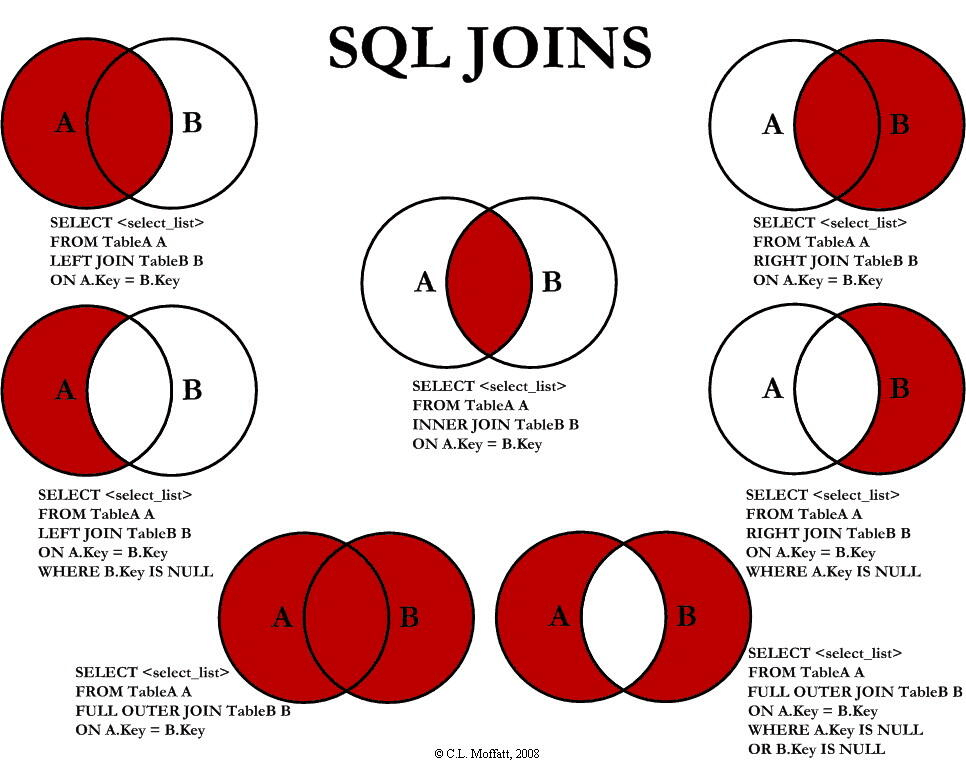
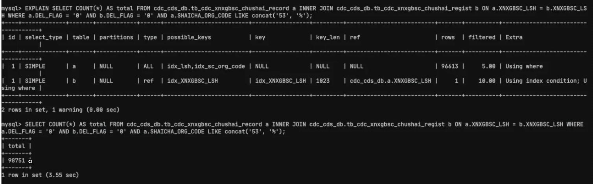
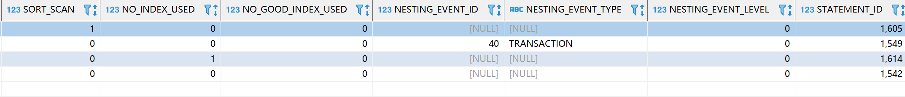
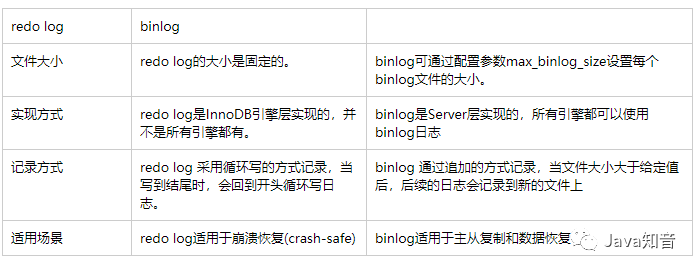
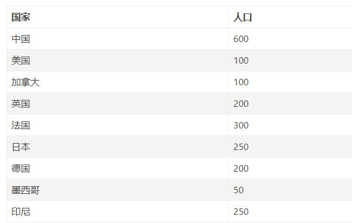

### 七种join



mysql不支持full join（全连接），使用union替代：

~~~mysql
# union合并两个结果集， 自动去重
select * from a left join b on a.id = b.id
union
select * from a right join b on a.id = b.id;
~~~


### sql优化

https://www.bilibili.com/video/BV1et421t7AM/?vd_source=f79519d2285c777c4e2b2513f5ef101a

1. 不要使用select *

2. 在业务允许的情况下, 使用union all替代union, 应为union会去重, 造成时间消耗

3. 小表驱动大表(**即根据情况, 在join和exist和in之间进行转换**)

4. 批量插入, 不要for循环插入,  大数据量不要使用mybatis的foreach, 有诸多问题

5. 使用宽表, 减少join, 比如一个项目下有多个任务, 每个任务可以有多次运行, 那么要查询一个项目下的所有运行的时候, 就必须三表join, 此时可以直接在运行记录中加一个项目id, 此时就不需要join了

6. 分页查询时, pageSize要限制大小

7. in中值太多时, 可以使用多线程查询, 但是如果数据量太多了, 网络传输也很耗性, 接口性能好不到哪里去

8. 同步数据时, 增量同步, 即按照create_time排序, 每批只同步一批数据, 然后把最大的时间作为下一批的条件再同步一批

   ~~~sql
   select * from user where  create_time > #{last_create_time} order by create_time limit 100;
   ~~~

9. 在分页查询中, 如果分页数据量太多, 如下第一条sql, 那么mysql会查到10020条数据, 然后丢掉前面10000条, 性能不好

   如果有create_time的话, 因为它是自增的, 那么可以将上一页的最大create_time保存起来, 在查询下一页的时候

   传递过去作为参数, 如下的第二个sql

   ~~~sql
   select * from user order by create_time limit 10000, 20;
   select * from user where create_time > #{last_create_time} order by create_time limit 20
   ~~~

10. 单表的索引数量应该控制在5个以内, 并且索引字段数不超过5个 

11. 为了控制索引的数量, 能建联合索引就别建单个索引

12. 合理选择数据类型

    1. 比如char是固定类型, varchar是变长类型, 所以手机号可以选择char类型
    2. 能用数字类型就不要用字符类型, 比如使用bit存布尔值, 使用tinyint存枚举, 金额字段用decimal, 


### 小表驱动大表, exist, in, join

https://blog.csdn.net/qq_39552268/article/details/111961963

mysql的join实现原理是，以驱动表的数据为基础，“嵌套循环”去被驱动表匹配记录，

这里的小表驱动大表速度快的前提是：**被驱动表上建立了索引**，**这样在根据某一条数据查找B+树时，速度就会大大提高，若没有建立索引，则两个表无论谁当作主表，查找数据的次数都是一样的**

假设有a表200数据, b表10000数据量

此时**如果被驱动表没有使用索引, 那么不管是a驱动b还是b驱动a, 需要匹配的次数都是一样的, 即200 * 10000**

而在被驱动表能够使用索引的情况下, 小表驱动大表的匹配次数是 200 * log(10000), 应为针对小表中的数据, 可以使用b+树在大表中查找, 所以时间复杂度是log(10000)

而大表驱动小表的匹配次数是10000 * log(200), 此时的匹配次数显然要高于小表驱动大表


**join, exist, in如何选择**

假设我们有两张表，分别是 Customers（客户表）和 Orders（订单表）。它们的关系为一个客户可以拥有多个订单。我们要找出有订单的客户。

使用join, in, exist都可以完成Customers和Orders表的关联关系

~~~sql
-- 使用join
select * from customers join orders on customers.id = orders.customer_id

-- 使用in
select * from customers where customers.id in (select customer_id from orders)

-- 使用exist
select * from customers where exists (select 1 from orders where customers.id = orders.customers.id)
~~~

区别在于**`join`可以把两张表的数据都查出来, 而`in和exist`只能查询一张表的数据**

所以此时可以根据业务是否需要两张表的数据来决定使用`join`还是`in和exist`

1. 当需要查询两张表的数据的时候, 使用join的时候

   还需要根据业务的情况决定使用`join`, `left join`, `right join`

   - 使用`join`, 会把连接条件为null的数据去掉

     此时mysql会选择数据量比较小的表作为驱动表，大表作为被驱动表, 具体看执行计划

   - 使用`left join`, 会保留左表的全量数据

     此时左表位驱动表, 右表为被驱动表

   - 使用`right join`, 会保留右表的全量数据

     此时右表为驱动表, 左表为被驱动表

2. 当只需要查询一张表的时候, 使用`in` 和 `exist`, 此时还需要决定到底使用`in`和`exist`

   1. 当使用in的时候, 会先执行子查询, 然后执行主查询, 此时子查询驱动主查询, 适合需要查询大表的数据的情况

      ~~~sql
      select * from 大表 where 大表.id in (select 大表_id from 小表)
      ~~~

   2. 但使用exist的时候, 会先执行主查询, 然后执行子查询, 此时主查询驱动子查询, 适合查询小表的数据的情况

      ~~~sql
      select * from 小表 where exists(select 1 from 大表 where 小表.id = 大表_id)
      ~~~

      


select * from a join b on a.bid =b.id

假设 a表10000数据，b表20数据

这里有2个过程，b 表数据最少，查询引擎优化选择b为驱动表，

循环b表的20条数据，
去a表的10000数据去匹配，这个匹配的过程是B+树的查找过程，比循环取数要快的多。
小表驱动的方式
for  20条数据
   匹配10000数据（根据on a.bid=b.id的连接条件，进行B+树查找）
查找次数 20+ log10000

2.如果使用大表驱动，则查找过程是这样的

for 10000条数据
    匹配20条数据（根据on a.bid=b.id的连接条件，进行B+树查找）
查找次数 10000+ log20


### 索引

本质上是一种排序的的数据结构（btree），可以加快查询和排序，但是降低更新删除操作。

基本语法：

~~~mysql
create [unique | fulltext | spatial] index index_name [using {btree | hash}] on tbl_name (key_part,...)

ALTER TABLE tbl_name ADD {INDEX | KEY} [index_name] [index_type] (key_part,...) [index_option] ...
ALTER TABLE tbl_name ADD {FULLTEXT | SPATIAL | UNIQUE} [INDEX | KEY] [index_name] (key_part,...) 
ALTER TABLE tbl_name ADD  PRIMARY KEY [index_type] (key_part,...) 
ALTER TABLE tbl_name ADD  FOREIGN KEY [index_name] (col_name,...) reference_definition

drop index index_name on table_name

show index from table_name;
~~~


### explain

~~~sql
CREATE TABLE `class` (
  `id` int NOT NULL AUTO_INCREMENT,
  `name` varchar(255) NOT NULL,
  PRIMARY KEY (`id`)
) ENGINE=InnoDB DEFAULT CHARSET=utf8mb4 COLLATE=utf8mb4_0900_ai_ci;
INSERT INTO class (id, name) VALUES(1, 'a');
INSERT INTO class (id, name) VALUES(2, 'b');

CREATE TABLE `student` (
  `id` int NOT NULL AUTO_INCREMENT,
  `name` varchar(255) NOT NULL,
  `class_id` int NOT NULL,
  PRIMARY KEY (`id`)
) ENGINE=InnoDB DEFAULT CHARSET=utf8mb4 COLLATE=utf8mb4_0900_ai_ci;
INSERT INTO student (id, name, class_id) VALUES(1, 'zhangsan', 1);
INSERT INTO student (id, name, class_id) VALUES(2, 'lisi', 2);
~~~


1. id: 

   - id是select的序列号，**有几个select就有几个id，并且id的顺序是按照select出现的顺序递增的**
- **id越大优先级越高， id相同从上到下执行**
  
   - select查询分为简单查询和复杂查询，复杂查询分为三类：简单子查询（出现在where和select后面的查询），派生表（from语句中的子查询），union查询
- 如果该行是其他行的联合结果，比如union，则id为null
  

  
2. select_type: 

   

   - simple: 简单的select查询， 查询中不包含子查询或者union

     ~~~mysql
     explain select * from student s join class c on s.class_id = c.id ;
     ~~~

     

   - primary：查询中若包含任何复杂的子部分， 最外层查询被标记为primary

     ~~~mysql
     explain select * from student s where s.class_id = (select id from class where class.name = 'a');
     ~~~

     

   - subquery：在select或者where中包含的子查询

   - derived（衍生）：在from列表中包含的子查询被标记为derived，mysql会递归执行这些子查询， 把结果表放在临时表中

     ~~~mysql
     explain select * from (select 1,2,3 from dual) as s;
     ~~~

     

   - union：出现在union，则被标记为union，若union包含在from子句的子查询中，外层select将被标记为derived

   - union result：从union表中获取结果的select被标记为union result，union result行的id为null

     ~~~mysql
     explain select * from student s right join class c on s.class_id  = c.id 
     union 
     select * from student s2 left join class c2 on s2.class_id = c2.id ;
     ~~~

     

     id为1的是第一个select，因为是一个right join，所以有两个。id为2的同理。

   - dependent union：与union相同，但是依赖于外部查询

   - dependent subquery：与subquery相同， 但是依赖于外部查询

   - dependent derived：于derived相同，但是依赖于外部查询。

     dependent通常用于表示一个关联子查询（correlated subquery），即子查询中对摸个表的引用，同时该引用出现在了外层查询中。dependent通常出现在where后面的in， exists，any等条件中。

     

     ~~~mysql
     explain select * from student where id in 
     (select id from student where id > 2 union select id from student where id < 5);
     ~~~

     
     
   - materialized: 物化表
     
     
     
     

3. table：

   表示explain的这一行正在访问哪个表，同时也可以是一下的值：

   <unionM,N>：该行使用的是id为M和N的行的union的结果

   \<deriverN>：表示该行使用的是id为N生成的衍生表

   \<subqueryN>：表示该行使用的id为N的子查询的

   

4. type：

   表的访问方式。

   从最好到最差依次，**一般来说保证查询至少达到range级别，最好能到ref。**

   **<font color=green>全部如下：system >> const >> eq_ref >> ref  >> fulltext >> ref_or_null >> index_merge >> unique_subquery >> index_subquery >> range >> index >> all</font>**

   **<font color=red>工作中常见如下：system >> const >> eq_ref >> ref >> range >> index >> all</font>**

   

   - system：表中只有一行记录（等于系统表），这是const类型的特例

   - const：该表至多只有一个匹配的行。因为只有一行，所以列的值可以视为常量。const的表只读取一次。

     ~~~mysql
   SELECT * FROM tbl_name WHERE primary_key=1;
     ~~~
     
   - eq_ref：与前表的每一行结合，都只有一行从该表中读取。并且因为使用了索引，所以可以快速定位。

     常见于通过`=`比较具有**primary key** 和 **unique not null index**的索引列。

     ~~~mysql
      SELECT * FROM ref_table,other_table WHERE ref_table.key_column=other_table.column;
     ~~~

     const与与eq_ref之间的不同在于：eq_ref的表与前表的每一行结合都只有一行被读取。

     而const就只有一行。

   - ref：与前表的每一行结合，都只有少量行从该表中读取。因为索引是有序的，只需要定位到第一行，在做一个小范围查找即可快速定位所有值。常见于通过`=`，`<>`比较**非唯一索引列**。

     ~~~mysql
    SELECT * FROM ref_table WHERE key_column=expr;
     
     SELECT * FROM ref_table,other_table
     WHERE ref_table.key_column=other_table.column;
     ~~~
     
   - fulltext：使用了fulltext索引

   - ref_or_null

   - index_merge

   - unique_subquery

   - range：只有给定范围内的行才会通过索引被检索，出现在一个索引列通过 `=`，`<>`，`>`，`>=`，`<`，`<=`，`IS NULL`，`<=>`，`BETWEEN`，`LIKE`，`IN()`进行比较时。type为range的时候ref为null

   - index：与前表的每一次结合都要按照索引的顺序做一次全表扫描，与all不同的是扫描索引树。

     - 如果当前索引能够满足当前查找的所有字段, 那么他就是一个覆盖索引, 在`Extra`字段中会有`using index`,  index通常比all要更快, 应为要扫描的数据量更小
     - 如果index要回填表数据的话，做完索引数扫描后还要进行全表扫描，实际上index比all还要慢一下，但是因为index是按照索引的顺序进行全表扫描的，所以当使用order by的时候index还是比all要快的。
     - index通常出现在
       - **查询条件不符合最左前缀原则, 但是能够使用覆盖索引的情况**
       -  使用覆盖索引, 但是查询的数据量比较小(一般小于全表20%), 此时因为数据量比较小, 所以回表是可以接受的
       - 查询条件不符合最左前缀原则, 不能使用覆盖索引, 查询的数据量占全表数据量比较大, 但是使用了limit, 此时还是会使用index的

   - all：与前表的每一行结合都要做一次全表扫描，扫描硬盘

     常见于: 

     - **无法使用索引的情况**
     - 有可用的索引, 不管是否符合最左前缀原则, 不能使用覆盖索引, 查询的数据量比较大(一般大于全表20%), 此时如果使用索引, 需要不断的回表, 比较耗时, 还不如全表扫描(**全表扫描是顺序读, 而回表是随机读, 这是由机械磁盘决定的, 如果使用的是固态, 那么随机读的操作是非常快的, 那么可以使用force index来指定强制使用索引**)
     - **有可用的索引, 但是整个表的数据量就非常小, 全表扫描也很快**

     > 特别要注意index和all的情况, 什么情况下即使有可用的索引也不会使用索引, 而是全表扫描

     下面是总结的关于index和all的各种情况

     **在有可用的索引的情况下, 应该先考虑是否能使用覆盖索引, 应为回表对type的影响很重大**

     

     | 是否有可用的索引 | 是否能使用索引覆盖 | 是否符合最左前缀 | 备注                            | type                   | 原因                                                         |
     | ---------------- | ------------------ | ---------------- | ------------------------------- | ---------------------- | ------------------------------------------------------------ |
     | 能               | 能                 | 能               |                                 | range                  |                                                              |
     | 能               | 能                 | 不能             |                                 | index                  | 扫描索引比扫表快                                             |
     | 能               | 不能               | 能               | 查询的数据量<全表20%            | range                  | 数据量小, 回表可以接受                                       |
     |                  |                    |                  | 查询的数据量> 全表20%           | all                    | 数据量大, 回表不能接受, 因为回表是随机读, 比较慢, 还不如顺序读的全部扫描, 固态的随机读很快, 可以使用force index强制索引<br>**产生了数据倾斜问题** |
     |                  |                    |                  | 查询数据量>20%, 但是使用了limit | index                  | 数据量小, 回表可以接受                                       |
     |                  |                    |                  | 这个表的数据量非常小            | all                    | 数据量小                                                     |
     |                  |                    |                  |                                 |                        |                                                              |
     | 能               | 不能               | 不能             |                                 | 不清楚, 看具体执行计划 |                                                              |
     | 不能             |                    |                  |                                 | all                    |                                                              |


- null：mysql能够在优化阶段分解查询语句，在执行阶段用不着在访问表
  
   - **<font color=red>案例说明ref，index，all出现的情况</font>**
   
     https://blog.csdn.net/yuanchangliang/article/details/107798724
   
     ~~~sql
     CREATE TABLE `student` (
       `id` int(11) NOT NULL AUTO_INCREMENT,
       `name` varchar(255) DEFAULT NULL,
       `cid` int(11) DEFAULT NULL,
    PRIMARY KEY (`id`),
       KEY `name_cid_INX` (`name`,`cid`),
       KEY `name_INX` (`name`)
     ) ENGINE=InnoDB AUTO_INCREMENT=8 DEFAULT CHARSET=utf8
     ~~~
   
     **执行1**
   
     ~~~mysql
     EXPLAIN SELECT * FROM student WHERE name='小红';
     ~~~
   
 
   
   
   
     1. possible_key表示可以使用两个索引
     2. key表示实际使用了name_cin_INX
     3. extra中的using index表示使用了覆盖索引，猜测这也是使用name_cid_INX索引原因
     4. 因为是通过name定位，符合name_cid_INX索引的最左前缀原则，能够通过索引快速定位name=‘小红’的某几行，所以type=ref
   5. 如果name_cid_INX是唯一索引，type=eq_ref
  
     **执行二**
   
     ~~~mysql
     EXPLAIN SELECT * FROM student WHERE cid=1;
     ~~~

   
   
   1. 使用到了name_cid_INX索引，但是因为要通过cid进行过滤，而cid在索引中是乱序的（只有在name相同时，cid才是有序的，即小范围有序），所以需要通过扫描索引树来定位cid=1的数据。并且type为index。
   
   >   如果类型为all, 那么说明出现了全表扫描
   
   - **当有可用索引， where符合最左前缀，索引为primary key或者 unique key， 那么type=eq_ref**
     
   - **当有可用索引， 并且where中的列符合最左前缀原则，但是索引为普通索引，type=ref**
     
   - **当有可用索引, 并且where符合最左前缀原则, 但是where条件是**
     
   - **当有可用索引， where中的列不符合最左前缀原则，这样就只能扫描索引树来定位符合条件的值。ref=index。**
     
     - **如果还需要回表操作，实际上是比all更慢的。如果是单值索引，可以提升order by的效率**
     - **但是如果不需要回表操作，也就是使用了覆盖索引，index比all快, 因为数据量更小。**
     
   - **实际没有使用索引，这是因为**
     
     - **表数据太小，使用index还需要回表，还不如全表扫描**
     
     - **表数据大的时候，比如在time字段上建立索引，然后where time between and, 但是mysql估算出between and包含了该表的大部分数据，这种情况下，一个表扫描可能更快，因为它要求更少量的查询。但是，如果这样的一个查询使用了 LIMIT 来检索只是少量的记录时，MySql 还是会使用索引，因为它能够更快地找到这点记录并将其返回。**


   ​        

5. possible_key：

   表示哪些索引可以用于查找表中的列。查询涉及到的字段上若存在索引，则该索引将被列出，但是不一定使用。

6. key：**（如何决定使用的key？？？？）**

   <font color=red>一个表可以有多个可以使用的索引， 但是执行的时候只能使用一个或者不使用</font>

   实际使用到的索引，如果为null则没有使用到索引

   如果使用到了覆盖索引，则该索引仅出现在key中，而不出现在possible_key。

7. key_len：

   https://blog.csdn.net/li1325169021/article/details/113898978

   1. 表示每条数据的索引使用的字节数，可通过该列计算查询中使用的索引的长度。在不损失精确性的情况下，长度越短越好；

   2. key_len显示的值为索引字段的最大可能长度，并非实际使用长度，即key_len是根据表定义计算而得，不是通过表内检索出的

   3. 比如基于`id int`和`user varchar(30) not null utf8`和`detail text(10) utf8`来建立索引, 那么

      `id int`的key_len = 4(int的长度)+1(允许为null) 

      `user varchar(30) not null utf8`的key_len = 30*3(每个utf8需要3字节) + 0(不允许为null) + 2(动态列类型)

      `detail text(10) utf8`的key_len = 30*3+2+1(每个utf8需要3字节, 动态列2字节, 运行为null需要1字节)

      所以总的key_len = 190

8. ref：用于指示哪些列或者常量被用于查找索引列上的值。如果type是range的话，ref为null。

   

   上图显示了一个常量""用于比较t1上的idx_t1索引，test.t1.ID(库表列)用于比较t2和t3上的primary key。

9. row：扫描的行

   即mysql为了找到符合条件的数据, 扫描了多少行数据

   如果在扫描的时候, 能够用上索引, 那么row表示的是扫描索引的行数, 应为索引使用的是B+树, 所以mysql能够非常准确的定位数据在哪里, 所以扫描的行会非常的少, 甚至如果索引是唯一索引, 并且条件是`=`, 那么mysql可以根据索引快速找到数据所在, 此时row=1

   当不能够使用索引的时候, 那么mysql为了找到符合的数据, 就会进行全表扫描, 此时row就是全部的数据量

10. extra：包含不适合在其他列中显示但是非常重要的其他信息。

    - using filesort：mysql使用了一个不基于索引的排序。

      <font color=red>解决using filesort可以让order by的字段与where中的字段相同，或与where中的字段组成复合索引</font>

      下面基于(1, 2, 3)建立的索引。在第一条sql中，使用了col1进行过滤，并使用col3进行排序，因为中间缺少col2所以col3无法通过索引排序。而第二天sql中，通过col1过滤完后刚好通过col2，col3进行排序，可以使用索引排序。（\G表示竖着显示结果）

      

    - using temporary：使用了临时表保存中间结果，常见于order by和 group by。

    - using index：使用了覆盖索引

### 数据倾斜问题

https://www.bilibili.com/video/BV12C411t7Ly/?spm_id_from=333.788&vd_source=f79519d2285c777c4e2b2513f5ef101a

当对如下sql进行分页查找时, 不管是否使用分页插件, 还是手动分页, 都需要执行两条sql

1. select count(*) where ...
2. select ... where ... limit ...


此时如果**count语句非常慢, 而select语句非常快**, 那么就基本可以断定是发生了数据倾斜

我们来看这个count语句的执行计划



我们需要重点关注的是:

1. 表a的type是all, 说明是全表扫描
2. 表a有possible_keys, 但是实际上却没有使用索引, 使用的是全表扫描
3. 表a的rows为96613, 说明表a就不到十万行

此时的疑惑是, 为什么在`shaicha_org_code`上面命名有索引`idx_sc_org_code`, 但是mysql却不去使用?

原因在于`shaicha_org_code like concat('53', '%')`和`a.del_flag='0'`在索引`idx_sc_org_code`上无法使用覆盖索引

如果使用该索引, 而`shaicha_org_code like concat('53', '%')`查询出来的数据非常大的话, 那么在对`a.del_flag='0'`这个查询条件进行匹配的话, 需要不断的进行回表, 此时是随机读, 速度很慢, 所以还不如全表扫描快


而在进行select语句的时候, 应为添加了limit关键字的因素, 即使无法使用覆盖索引, 那么也会使用该索引, 应为即使`a.del_flag='0'`这个条件需要回表, 但是少量的回表查询是可以接收的, 同时表中又有大量符合条件的数据, 所以查询起来会非常的快


解决count慢的方案就是建立del_flag和`shaicha_org_code的联合索引, 这样在count的时候就可以使用联合索引而不需要回表


### B数和B+数的区别, 为什么使用B+数不使用B数

https://blog.csdn.net/a519640026/article/details/106940115

b数


b+数


两者不同在于, b数的节点包含数据, 而b+数的数据都在叶子节点,并且叶子节点之间有指针相连,  他们的区别是:

- b数的复杂度不固定, 最好的情况为O(1), 一次就能查到数据, 而B+数复杂度固定为O(log n)
- 因为B+数非叶子节点不带数据, 所有每个节点能够划分的区间也更多, 每个节点的查找也跟精确, 同时能够有更多的子节点, 降低层高
- B+树叶节点两两相连可大大增加区间访问性，可使用在范围查询等，而B-树每个节点 key 和 data 在一起，则无法区间查找。


### Mysql 变量

#### 1. 系统变量

**1.1 全局变量**

全局变量在MYSQL启动的时候由服务器自动将它们初始化为默认值，这些默认值可以通过更改my.ini这个文件来更改。

全局变量查看出来两个列名分别为**variablle_name和value, 可使用这两个列名进行条件查询**


- 查看全局变量

  ```test
  (查看全部的全局变量)
  show global variables;
  
  (条件查询)
  show global variables like 'log%';
  show global variables where variable_name like 'log%' and value = 'on';
  
  (查询单个)
  select @@global.variables;  (查看单个全局变量)
  ```

- 修改全局变量

  ```test
  set global varname := value;
  set @@global.varname := value;
  ```

  

**1.2 会话变量**

会话变量在每次建立一个新的连接的时候，由MYSQL来初始化。**MYSQL会将当前所有全局变量的值复制一份。来做为会话变量。**（也就是说，如果在建立会话以后，没有手动更改过会话变量与全局变量的值，那所有这些变量的值都是一样的。）

全局变量与会话变量的区别就在于，**对全局变量的修改会影响到整个服务器，但是对会话变量的修改，只会影响到当前的会话（也就是当前的数据库连接）**。

- 查看会话变量

  ```test
  (查看全部的会话变量)
  show session variables;  
  
  (条件查询)
  show variables like 'log%';
  show variables where variable_name like 'log%' and value = 'on';
  
  (查询单个)
  select @@varname;
  select @@session.varname;
  ```

- 修改会话变量

  ```test
  set session varname := value;
  set @@session.varname := value;
  set @@varname := value;
  ```

  

#### 2. 用户自定义变量

**2.1 用户变量(会话级别)**

- 定义并赋值

  ```test
  set @变量名 := 值;
  
  ```

select @变量名 :=值;

  ```
  
- 赋值

  ```test
  set @变量名 := 值;

  select @变量名 :=值;

  select 字段 into @变量名 from 表名; (查询结果必须是一个值, 才能赋值给自定义变量)

  例: set @a := 1; select count(student.id) into @a  from student
  ```

- 查看

  ```test
  select @变量名
  ```

#### 2.2 局部变量

todo


### MySQL事务

- 查看存储引擎

  ~~~sql
  show variables like '%engine%';
  ~~~

- 查看是否自动提交与设置

  ~~~sql
  show variables like 'autocommit';
  
  set session autocommit = 'autocommit';
  ~~~

- 事务的开启与提交

  ~~~sql
  begin;
  update student set name = 'zhangsan' where id = 1;
  commit;
  
  begin;
  update student set name = 'zhangsan' where id = 1;
  rollback;
  ~~~

- 查看事务的隔离级别

  ~~~sql
  SELECT @@transaction_isolation; -- 当前会话的
  SELECT @@global.transaction_isolation; -- 系统的事务隔离级别
  ~~~

- 修改事务的隔离级别

  ~~~sql
  SET SESSION TRANSACTION ISOLATION LEVEL [READ UNCOMMITTED | READ COMMITTED |REPEATABLE READ | SERIALIZABLE]; -- 修改当前会话的
  ~~~

  如果实在java中, 可以通过

  ~~~java
  // 将会话的事务隔离级别设置为串行化
  conn.setTransactionIsolation(Connection.TRANSACTION_SERIALIZABLE);
  ~~~

  

  

  如果要修改当前数据库的, 需要在数据库的配置文件(通常是 `my.cnf`或 `my.ini`文件)中添加或修改 `transaction_isolation` 参数。

  ```init
  transaction_isolation = READ-UNCOMMITTED
  ```

  

> 事务并发导致的三大问题

- 脏读：一个事务读取到了别的事务**修改的**但**未提交**的数据

  SQL-transaction T1 modifies a row. SQL- transaction T2 then reads that row **before** T1 performs a COMMIT.  If T1 then performs a ROLLBACK, T2 will have read a row that was never committed and that may thus be considered to have never  existed.

  

- 不可重复读：一个事务读取到了别的事务**修改（删除）**的并且**已提交**的数据

  SQL-transaction T1 reads a row. SQL- transaction T2 then **modifies** or **deletes** that row and **performs** a COMMIT. If T1 then attempts to reread the row, it may <u>receive</u> the modified value or discover that the row has been deleted.

  

- 幻读：一个事务读取到了别的事务**新增的**并且**已经提交**的数据

  SQL-transaction T1 reads the set of rows N that satisfy some <search condition>. 

  SQL-transaction T2 then executes SQL-statements that generate one or more rows that satisfy the <search condition> used by SQL-transaction T1. 
  
  If SQL-transaction T1 then repeats the initial read with the same <search condition>, it obtains a different collection of rows.
  
  

> 数据库隔离级别

参考https://zhuanlan.zhihu.com/p/43493165

为了解决数据库事务并发带来的**读一致性**问题, 数据库提供了四种等级的隔离来解决上面三种问题

- Read Uncommitted（读未提交）：数据之间没有隔离性，脏读，不可重复读，幻读均有可能发生
- Read Committed （读已提交）：一个事务对别的事务新增(幻读)，(修改，删除)并且已提交的数据可见。这可以解决脏读，但是会导致不可重复读和幻读。
- Repeatable Read （可重复读）：一个事务对别的事务新增并且已提交的数据可见，但是对修改删除并且已提交的数据不可见。这可以解决脏读和不可重复读的问题，但是没有解决幻读的问题。(**mysql的innodb中通过快照读解决了幻读的问题**)
- Serializable （串行化）：串行化执行事务，可以严格保证不会出现上面三种问题，但是效率很低

下面是sql92标准下定义的四种隔离级别下，可能出现的问题

| 事务隔离级别     | 脏读     | 不可重复读 | 幻读     |
| ---------------- | -------- | ---------- | -------- |
| Read Uncommitted | 可能发生 | 可能发生   | 可能发生 |
| Read Committed   | 不可能   | 可能发生   | 可能发生 |
| Repeatable Read  | 不可能   | 不可能     | 可能发生 |
| Serializable     | 不可能   | 不可能     | 不可能   |

下面是mysql中四种隔离级别下，可能出现的问题
| 事务隔离级别     | 脏读     | 不可重复读 | 幻读             |
| ---------------- | -------- | ---------- | ---------------- |
| Read Uncommitted | 可能发生 | 可能发生   | 可能发生         |
| Read Committed   | 不可能   | 可能发生   | 可能发生         |
| Repeatable Read  | 不可能   | 不可能     | **InnoDB不可能** |
| Serializable     | 不可能   | 不可能     | 不可能           |

> 如何实现事务的隔离级别

1. 生成一个数据请求时间点的一致性数据快照，并用这个快照来提供一定级别（语句级别或者事务级别）的一致性读取——Multi Version Concurrency Control（MVCC）
2. 在数据读取之前，对其加锁，阻止其他书屋对数据进行修改——Lock Based Concurrency Control（LBCC）

### MySQL锁

参看https://dev.mysql.com/doc/refman/5.7/en/innodb-locking.html

> 锁的类型

1. 表锁

   ~~~shell
   # 当前事务对table添加读锁, 即共享锁
   lock tables some_table read; 
   # 当前事务对table添加写锁, 即排他锁
   lock tables some_table write;
   # 释放表锁
   unlock tables;
   ~~~

2. metadata lock(MDL)

   MDL是另外一种**表锁**,  不需要显式使用，在访问一个表的时候会被自动加上。**MDL 的作用是ddl和dml进行隔离**。你可以想象一下，如果一个查询正在遍历一个表中的数据，而执行期间另一个线程对这个表结构做变更，删了一列，那么查询线程拿到的结果跟表结构对不上，肯定是不行的。因此，在 MySQL 5.5 版本中引入了 MDL，当对一个表做增删改查操作的时候，加 MDL读锁；当要对表做结构变更操作的时候，加 MDL 写锁. 读锁之间不互斥，因此你可以有多个线程同时对一张表增删改查。
   
3. 共享锁与排他锁（Shared and Exclusive Locks）

   共享锁和排他锁是**两个行级别**的锁

   - 共享锁又称**读锁**， 允许事务锁定一行去读取。

     如果T1持有行r的s锁，那么对于T2，可以对行r加s锁，这样T1和T2都持有行r的s锁。T2不能添加x锁，必须要等待。

     加锁方式：`select * from student where id = 1 lock in share mode`

     释放锁:  `commit/rollback`

     使用场景：一张订单表order_info, 订单明细表order_detail， 如果希望修改order_detail时不希望order_info中对应数据被修改, 可以使用共享锁将order_info中数据锁起来

   - 排他锁又称**写锁**，允许事务锁定一行进行修改或者删除

     如果T1持有行r的x锁，那么对于T2，无论对行r添加s锁还是x锁，都需要等待。

     加锁方式：

     ​    自动:  delete/update/insert默认加x锁

     ​    手动: `select * from student where id = 1 for update;`

4. 意向锁

   意向锁是由**数据库引擎自己维护的表级别的锁**, 用户无法手动添加意向锁

   - 意向共享锁( Intention Shared Lock, 简称IS锁 )

     一个事务在给数据行添加共享锁前必须先获取该表的IS锁

   - 意向排他锁( Intention Exclusive Lock, 简称IX锁 )

     一个事务在给数据行添加x锁前必须先获取该表的IX锁

    意向锁的主要用途在于, **给表添加表锁的时候, 如果没有意向锁, 需要全局扫描所有的行上面的锁. 只有所有行都没有锁的时候才可以添加上表锁. 如果有了意向锁, 可以直接通过意向锁来判断当前表中的行有没有添加行锁. 加快效率.**

   意向锁与表级锁的兼容性

   |      | `X`  | `IX`   | `S`    | `IS`   |
   | :--- | :--- | :----- | :----- | ------ |
   | `X`  | 冲突 | 冲突   | 冲突   | 冲突   |
   | `IX` | 冲突 | 兼容的 | 冲突   | 兼容的 |
   | `S`  | 冲突 | 冲突   | 兼容的 | 兼容的 |
   | `IS` | 冲突 | 兼容的 | 兼容的 | 兼容的 |

5. 插入意向锁

   - 插入意向锁是在插入一行记录操作之前设置的一种间隙锁，这个锁释放了一种插入方式的信号，亦即多个事务在相同的索引间隙插入时如果不是插入间隙中相同的位置就不需要互相等待。
   - 假设有索引值4、7，几个不同的事务准备插入5、6，每个锁都在获得插入行的独占锁之前用插入意向锁各自锁住了4、7之间的间隙，但是不阻塞对方因为插入行不冲突。

6. 自增锁(AUTO-INC)

   `AUTO-INC`特殊的表级锁，在插入到具有 `AUTO_INCREMENT`列的表中的事务使用。在最简单的情况下，如果一个事务正在向表中插入行，则任何其他事务都必须等待在该表中执行自己的插入操作，以便第一个事务插入的行接收连续的主键值。


> 行锁的实现方式

**当通过select for update对数据添加锁的时候, innodb添加锁的对象是索引, 即在索引项上面添加锁,  如果加锁的语句没有使用到索引的话, innodb就会添加表锁.**

**记录锁, 间隙锁, 临键锁可以认为是innodb实现行锁的一种方式**.

建表语句

~~~sql
CREATE TABLE `class` (
  `id` int NOT NULL AUTO_INCREMENT,
  `name` varchar(255) NOT NULL,
  `age` int DEFAULT NULL,
  PRIMARY KEY (`id`),
  KEY `name` (`name`),
  KEY `age` (`age`)
) ENGINE=InnoDB AUTO_INCREMENT=19 DEFAULT CHARSET=utf8mb4 COLLATE=utf8mb4_0900_ai_ci;
INSERT INTO test.class (id, name, age) VALUES(1, 'a', 1);
INSERT INTO test.class (id, name, age) VALUES(8, 'b', 8);
INSERT INTO test.class (id, name, age) VALUES(14, 'c', 14);
INSERT INTO test.class (id, name, age) VALUES(18, 'd', 18);
~~~

使用一下语句来查询mysql8.x中当前连接所持有的锁

~~~sql
select * from performance_schema.data_locks dl join information_schema.INNODB_TRX it on dl.ENGINE_TRANSACTION_ID = it.trx_id where it.trx_mysql_thread_id = connection_id();
~~~


1. 记录锁(Record Lock)

   记录锁的作用是对某个存在数据加锁, 防止其他事务对这个数据操作

   **共享记录锁防止其他事务修改, 删除该数据. 排他记录锁防止其他事务读取, 删除, 修改该数据.**

   

2. 间隙锁(Gap Lock)

   **间隙锁的作用的锁住一段数据不存在的间隙, 防止其他事务在这段间隙上插入数据. 保证事务的读一致性**

   **因为间隙锁的唯一作用就是防止别的事务在这个间隙上插入数据, 所以两个事务可以同时对一个索引项添加间隙锁**

   **对一个索引项添加间隙锁, 会锁住当前索引项与其前面一个索引项中间这一段不存在数据的间隙, 两边开区间** 

   比如对id = 1的索引项上面添加间隙锁, 会锁住(-∞, 1)这一个区间段.  对id = 14的索引项添加间隙锁, 会锁住(8, 14)这一段区间

   

3. 临键锁(Next-Key Lock)

   临键锁是间隙锁与记录锁的一种组合

   对一个索引项加锁, 锁住当前记录(记录锁的作用)与当前记录前面那一段间隙(间隙锁的作用)

   比如对id = 1的索引项加锁, 会锁住(-∞, 1], 对id = 18的索引项加锁, 会锁住(14, 18]

   如果想要锁住(18 , +∞)这一个区间段, innodb的lock data将显示`supermun pseudo-record`

   

   

4. 插入意向锁(Insert Intention)

   - 插入意向锁是在插入一行记录操作之前设置的一种间隙锁，这个锁释放了一种插入方式的信号，亦即多个事务在相同的索引间隙插入时如果不是插入间隙中相同的位置就不需要互相等待。
   - 假设有索引值4、7，几个不同的事务准备插入5、6，每个锁都在获得插入行的独占锁之前用插入意向锁各自锁住了4、7之间的间隙，但是不阻塞对方因为插入行不冲突。

   

5. 其实不管是记录锁, 间隙锁还是临键锁, 都是为了保证数据的读一致性和事务的隔离.  innodb会根据数据的不同而采用不同的锁的组合方式来保证上面两个特效.

   下面是一些语句使用的锁的分析

   更多的sql分析可以查看https://juejin.cn/post/7075508551354941454#heading-8

   

   - 在**唯一索引**上进行**等值查询**时, 如果**没有查询到数据**时, 将对该数据**后面的第一个存在的数据的索引项**添加间隙锁, 锁住**该索引项**与其**前面的索引项中间这段间隙**

     ~~~sql
     select * from class c where id  = 9 for update;
     ~~~

     

     以上sql查询id = 9的数据, 但是当前表并没有id = 9的数据, 所以为了**保证读一致性**, 即防止别的事务插入id = 9的数据, 会在id = 14(9后面第一个存在的数据)上面添加一个记录锁, 锁住(8, 14)这个区间段, **两边都是开区间**. 这样别的事务就无法在这个区间段中**插入**数据(插入8-14中的任意数字都不行) 

     但是如果此时另外一个事务同时执行`select * from class c where id = 10 for update`依旧是可以成功的, 因为两个事务可以在一个索引项上面添加间隙锁

     

   - 在**唯一索引**上进行**等值查询**时, 如果**查询到数据**时, 将对该数据索引项添加记录锁

     使用以下语句对上表进行查询, 将添加记录锁

     ~~~sql
     begin;
      select * from class c where id = 8 or id = 14 for update;
      select * from performance_schema.data_locks dl join information_schema.INNODB_TRX it on dl.ENGINE_TRANSACTION_ID = it.trx_id where it.trx_mysql_thread_id = connection_id();
     rollback;
     ~~~

     ]

     可以看到, 上面的sql通过id进行查询, 而id上面刚好有一个唯一索引, 所以记录锁是添加在primary索引上的.

     并且上面的sql语句查询到了数据, 所以会在id=8和id=14的primary索引项上面添加记录锁. 

     并且上面的语句还会添加一个表锁类型的意向排他锁

   - 以下语句生成间隙锁, 因为在[10, 13]这个区间段没有数据, 所以添加了一个间隙锁在id = 14的索引项上面, 锁住(8, 14)这个区间段

     ~~~sql
     select * from class c where id between 10 and 13
     ~~~

     

   - 以下语句使用间隙锁和临键锁, 因为在[10, 15]这个区间段有一个数据id = 14, 所以为了保证读一致性, 需要在id = 14的索引项上面插入一个临键锁, 锁住(8, 14]这个区间段, 同时还要在id = 18的索引项上面添加一个间隙锁, 锁住(14, 18)这个区间段

     ~~~sql
     select * from class  where id between 10 and 15 for update;
     ~~~

     

   - 使用一下语句生成临键锁和间隙锁, 因为这里使用了age进行查询, 所以查询使用了age索引, 而**age并非唯一索引**, 即其他age=14的数据的索引项可能插入到age=14, id=14这个索引项的前面和后面, 所以为了保证读一致性, 需要在age=14, id=14这个索引项上面添加一个临键锁, 锁住age=8,id=8到age=14, id= 14这个区间段, 左开右闭.   同时在age=18, id=18的这个索引项上面添加一个间隙锁, 锁住age=14, id=14到age=18到id=18这个区间段, 两边开区间

     ~~~sql
     select * from class where age = 14 for update;
     ~~~

     


### Innodb查看事务

https://www.cnblogs.com/yuanfy008/p/15169030.html

#### information_schema.innodb_trx

在innodb中, 在`information_schema.innodb_trx`表中记录了所有**正在执行**的事务

表中字段解释如下:

- trx_id:  事务id

- trx_state: 事务的状态, RUNNING，LOCK WAIT， ROLLING BACK，和 COMMITTING。

- trx_requested_lock_id: 事务当前等待的锁的ID，如果TRX_STATE是LOCK WAIT；否则NULL。

- trx_wait_started: 事务开始等待锁的时间

- trx_weight: 事务权重， 反映（但不一定是准确计数）更改的行数和事务锁定的行数。

  为了解决死锁， InnoDB选择权重最小的事务作为“受害者”进行回滚。无论更改和锁定行的数量如何，更改非事务表的事务都被认为比其他事务更重。

- trx_mysql_thread_id: 线程的process id , 不是mysql线程id!!!!

  这个id很重要，如果发现某个事务一直在等待无法结束的话，可以通过这个ID kill掉。

- trx_query: 事务正在执行的 SQL 语句。

  这里的sql显示的是实时的, 执行完成就会被设置为null

- trx_operation_state: 事务的操作状态，通常显示事务在某个操作中的进展情况。

- trx_tables_in_use:  事务当前正在使用的表的数量

- trx_tables_locked: 事务当前锁定的表的数量。

- trx_lock_structs: 事务当前持有的锁的数量。

- trx_lock_memory_bytes: 事务持有的锁在内存中占用的总大小

- trx_rows_locked: 事务锁定的行的数量。

- trx_rows_modified此事务中修改的行数

- trx_concurrency_tickets: 此事务中插入的行数

- trx_isolation_level: 当前事务的隔离级别。

- trx_unique_checks

- trx_foreign_key_checks

- trx_last_foreign_key_error

- trx_adaptive_hash_latched

- trx_adaptive_hash_timeout

- trx_is_read_only

- trx_autocommit_non_locking

其中有几个特别重要的字段

- TRX_ID                  事务ID
- trx_state			   事务的状态, running表示正在运行, lock wait表示正在等待其他事务释放锁
- TRX_REQUESTED_LOCK_ID   事务当前正在等待的锁的ID。 如果当前事务阻塞就可以看出之前的锁
- TRX_MYSQL_THREAD_ID     process id, 经常用于连表查询
- trx_query               **当前事务正在执行的sql, 显示的sql是实时的, 执行完了就会被设置为null**


#### information_schema.PROCESSLIST

这张表记录了所有会话正在干嘛


https://blog.csdn.net/zgdwxp/article/details/98595277

~~~sql
select * from information_schema.PROCESSLIST ;
~~~


ID:  即process id, 会话id,  很重要, **可以用来连表查询**

USER: 当前会话id的用户

HOST: 创建连接的服务器

DB: 该连接执行SQL的数据库。有些连接创建时可能未指定数据库，因此该项可能为空。

COMMAND:  不是命令的意思, 而是状态,   **该项值常见的有Sleep(休眠)、Query(查询)、Connect(连接)**

TIME:  当前状态持续的时间,  一般状态变化非常快、在每个状态持续时间很短，如果持续多秒，说明就出现了问题。**所以这个设定，让时间成为判断SQL是否正常的关键要素**

STATE:  https://learn.blog.csdn.net/article/details/98624463

INFO: 正在执行的完整SQL语句, 这个是实时的sql, sql执行完成就会被设置为null


#### performance_schema.threads

这张表记录了mysql所有的线程正在做什么, 其中就包含了processlist表中的所有信息

~~~sql
select * from performance_schema.threads
~~~


- thread_id: 线程ID
- name:  线程的名称
- type 线程类型，分为BACKGROUND(后台线程)和FOREGROUND(用户线程)，我们要关注的是用户线程
- processlist_id:  用户会话ID，只有用户线程才有
- processlist_user: 会话用户名，只有用户线程才有
- processlist_host:  会话主机地址(IP)，只有用户线程才有
- processlist_db:  会话当前操作的数据库, 可能为null, 即没有指定数据库
- processlist_command: 当前线程的状态,  和processlist表中的command是一个意思
- processlist_time: 当前线程的状态的持续时间, 和processlsit表中的state是一样的
- processlist_state: 当前线程正在干嘛, 例如，`Sending data`, `Locked`, `Writing to net` 等。与 `INFORMATION_SCHEMA.PROCESSLIST` 表中的 `STATE` 字段一致。
- processlist_info:  上一次执行的sql语句, 
- parent_thread_id: 父线程的id
- role: 当前线程的角色, 如 `applier`, `worker`, `event_scheduler` 等。
- instrumented: 指示该线程是否被性能模式跟踪和监控, true/false
- history: 是否保存线程的历史性能数据, true/false
- connection_type: 线程的连接类型, 例如 `TCP/IP`, `Unix socket` 等。
- thread_os_id:  操作系统分配给该线程的唯一id


#### performance_schema.events_statements_current

记录了mysql用户线程上一条, 或者当前正在执行的sql语句的性能分析

在mysql中, 每个连接都有一个专门的用户线程负责

~~~sql
select * from performance_schema.events_statements_current
~~~




下面是关键字段的分析:

- **thread_id:  线程id**
- event_id: 事件的唯一标识符
- end_event_id: 语句时间结束时的时间id
- event_name: 事件名称, 通常以 `statement/` 开头，后跟具体的 SQL 语句类型，例如 `statement/sql/select`，`statement/sql/insert` 等。
- source: 触发此事件的源代码,   触发此事件的源代码位置，通常表示文件名和行号。这对开发和调试非常有用。
- timer_start: 语句执行开始的时间戳，单位为皮秒
- timer_end: 语句结束时的时间戳, 单位为皮秒
- timer_wait: 语句总的执行时间
- lock_time: 语句等待锁的时间
- **sql_text:  正在执行的sql的文本**
- digest: sql的摘要
- digest_text: sql的标准化文本,  类似于 `SQL_TEXT`，但去除了具体的常量和格式化信息
- current_schema: 当前正在使用的数据库
- object_name: sql语句操作的对象名称, 例如表名或视图名。如果没有特定对象，此字段为 `NULL`。


#### performance_schema.events_statements_history

这张表记录了每个用户线程最后N个执行的sql的性能分析

在mysql中, 每个连接都有一个专门的用户线程负责, 这个连接可能会先后执行多个事务

所以你可以在这张表看到多个事务的sql

~~~sql
select * from PERFORMANCE_SCHEMA.events_statements_history;
~~~

这张表的字段结构与`performance_schema.events_statements_history`


#### 查看长事务

https://www.cnblogs.com/mysqljs/p/11552646.html

需要注意的是, 上面介绍的表中

 `information_schema.innodb_trx`的`trx_query`显示的sql是实时的, 执行完就会被置位null

`information_schema.processlist`的`info`显示的sql也是实时的, 执行完就会被设置为null

`performance_schema.threads`中的`processlist_info`显示的sql, 是当前正在执行的, 或者上一次执行的. 在sql执行完之后, 不会被设置为null

`performance_schema.events_state_current`中的`sql_text`显示的也是当前正在执行的, 或者上一次执行的. 在sql执行完之后, 不会被设置为null


根据上面表的解析, 我们可以先从information_schema.INNODB_TRX表中查出正在执行的事务, 并计算其运行时间进行排序

~~~sql
select t.*,to_seconds(now())-to_seconds(t.trx_started) spend_time from INFORMATION_SCHEMA.INNODB_TRX t order by spend_time desc
~~~

在这个查询中, 我们特别要注意看`trx_query`字段, 看长事务到底在执行什么sql, 但是如果这个事务刚刚好没有正在执行sql, 那么他就是null, 所以我们还可以通过`performance_schema.event_state_current`或者`performance_schema.threads`这两张表来查看上一次执行或者当前正在执行的sql是什么

~~~sql
select now(),(UNIX_TIMESTAMP(now()) - UNIX_TIMESTAMP(trx.trx_started)) as spend_sec, trx.*, pl.*, cur.event_name, cur.sql_text
from information_schema.innodb_trx trx 
inner join information_schema.PROCESSLIST pl on trx.TRX_MYSQL_THREAD_ID=pl.id 
inner join performance_schema.threads t ON pl.id = t.PROCESSLIST_ID
inner join performance_schema.events_statements_current cur ON t.THREAD_ID = cur.THREAD_ID;
~~~


或者我们也可以查看执行这个事务的用户线程, 执行sql的历史记录

~~~sql
SELECT ps.id 'PROCESS ID', ps.USER, ps.HOST, esh.EVENT_ID, trx.trx_started, esh.event_name 'EVENT NAME', esh.sql_text 'SQL', ps.time 
FROM PERFORMANCE_SCHEMA.events_statements_history esh
JOIN PERFORMANCE_SCHEMA.threads th ON esh.thread_id = th.thread_id
JOIN information_schema.PROCESSLIST ps ON ps.id = th.processlist_id
LEFT JOIN information_schema.innodb_trx trx ON trx.trx_mysql_thread_id = ps.id
WHERE
trx.trx_id IS NOT NULL
AND ps.USER != 'SYSTEM_USER'
ORDER BY esh.EVENT_ID;
~~~

根据这个用户线程, 执行过的所有sql, 就可以查看到到底是哪个代码在执行的事务了, 从而定位到问题代码

同时我们就可以判定该事务是否可以杀掉，以免影响其他事务造成等待现象。


### Innodb查看锁

在mysql5.x, 所有的锁的情况都会记录在`information_schema.innodb_locks`中, 锁等待的情况记录在`information_schema.data_lock_waits`中

在mysql5.x时, 可以参考这篇文章https://www.cnblogs.com/mysqljs/p/11552646.html


在mysql8.x, 所有的锁的情况记录在`performance_schema.data_locks`,  锁等待的情况记录在`performance_schema.data_lock_waits`中

下面是`data_locks`字段的解释

- ENGINE: 持有或请求锁的存储引擎
- ENGINE_LOCK_ID: 锁的id, `information_schema.INNODB_TRX`的`trx_requested_lock_id`字段 就来源于这
- ENGINE_TRANSACTION_ID: 持有锁的事务的id, 来源于`information_schema.INNODB_TRX`的`TRX_ID`字段
- THREAD_ID 创建锁的会话的线程 ID, 来源于`performance_schema.threads`
- EVENT_ID: 产生锁的sql的event id, 来源于`performance_schema.event_state_history`
- OBJECT_SCHEMA: 锁的数据库
- OBJECT_NAME: 锁的表名
- PARTITION_NAME: 分区, innodb可以忽略
- SUBPARTITION_NAME: 子分区, innodb可以忽略
- INDEX_NAME: 锁定索引的名称
- OBJECT_INSTANCE_BEGIN: 主要用于内部调试
- LOCK_TYPE: 锁的类型, 对于Innodb, 有RECORD行级锁和 TABLE表级锁。
- LOCK_MODE: 锁的具体实现, 对于innodb, 有如下值:
  1. 当为行锁时, [X]表示排他临键锁, [X,GAP]表示排他间隙锁, [X,REC_NOT_GAP]表示排他记录锁
  2. 当为行锁时, [S]表示共享临键锁, [S,GAP]表示共享间隙锁, [S,REC_NOT_GAP]表示共享记录锁
  3. 当为表锁时, [IX]表示意向排他锁, [IS]表示意向共享锁   (在读取一行时要先获取IS锁, 在修改,删除一行时要先获取IX锁)
  4. [AUTO_INC]表示自增锁
  5. UNKNOWN, 其他
- LOCK_STATUS: 锁的状态, 对于Innodb, 有GRANTED（当前锁已锁定）和 WAITING（当前锁正在等待其他锁释放）
- LOCK_DATA: 锁是加在哪个数据上


下面是`data_lock_waits`的字段解释

- engine:  使用的数据库引擎
- requesting_engine_lock_id:  当前请求锁的锁id
- requesting_engine_transaction_id:  请求锁的事务id, 来源于`information_schema.innodb_trx`
- requesting_thread_id:   正在等待锁的mysql 线程 id, 来源于`information_schema.threads`
- request_event_id:  等待锁的sql, 产生的event id, 来源于`performance_schema.events_state_current`
- requesting_object_instance_begin: 等待锁对象的内存地址, 主要用于调试
- blocking_engine_lock_id: 持有锁的锁id
- blocking_engine_transaction_id: 持有锁的事务id, 来源于`information_schema.innodb_trx`
- blocking_thread_id: 持有锁的线程id, 来源于`information_schema.threads`
- block_even_id: : 持有锁的sql, 产生的event id, 来源于`performance_schema.events_state_current`
- blocking_object_instance_begin: 持有锁对象的内存地址, 主要用于调试


下面我们来看一个案例, 我们有如下数据

| id   | created_at                    | updated_at                    | deleted_at | name     | age  | birthday                      |
| ---- | ----------------------------- | ----------------------------- | ---------- | -------- | ---- | ----------------------------- |
| 1    | 2022-11-15 14:18:23.576000000 | 2022-11-15 14:18:23.576000000 |            | zhangsna | 199  | 2022-11-15 14:18:23.529000000 |
| 4    | 2022-11-15 14:26:57.265000000 | 2022-11-15 14:26:57.265000000 |            | zhangsna | 199  |                               |
| 8    | 2022-11-15 14:56:29.925000000 | 2022-11-15 14:56:29.925000000 |            | zhangsna | 100  |

现在我们开启事务, 并执行如下sql

~~~mysql
begin;
select * from test.users where id = 7 for update;
~~~

此时mysql会在id为8的数据上添加一个间隙锁, 我们使用另外一个mysql客户端 来看看`data_locks`表

~~~mysql
select * from performance_schema.data_locks;
~~~

结果如下:

| ENGINE | ENGINE_LOCK_ID                      | ENGINE_TRANSACTION_ID | THREAD_ID | EVENT_ID | OBJECT_SCHEMA | OBJECT_NAME | PARTITION_NAME | SUBPARTITION_NAME | INDEX_NAME | OBJECT_INSTANCE_BEGIN | LOCK_TYPE | LOCK_MODE | LOCK_STATUS | LOCK_DATA |
| ------ | ----------------------------------- | --------------------- | --------- | -------- | ------------- | ----------- | -------------- | ----------------- | ---------- | --------------------- | --------- | --------- | ----------- | --------- |
| INNODB | 2642898727856:1942:2642865333720    | 1637540               | 512       | 29       | test          | users       |                |                   |            | 2642865333720         | TABLE     | IX        | GRANTED     |           |
| INNODB | 2642898727856:875:4:7:2642865330936 | 1637540               | 512       | 29       | test          | users       |                |                   | PRIMARY    | 2642865330936         | RECORD    | X,GAP     | GRANTED     | 8         |

我们可以看到, 上面的sql对表test添加了一个表级别的IX意向排他锁,  还添加了一个行级别的排他间隙锁, 锁定的数据是8, 使用的主键索引, 两个锁的状态都是已获取的状态

同时还可以看到, 只有这两个锁的事务id为1637540, mysql用户线程的id为512, event_id为29

我们根据事务id到`information_schema.innodb_trx`中查询

~~~sql
select * from information_schema.INNODB_TRX it where trx_id = 1637540;
~~~

结果如下:

| trx_id  | trx_state | trx_started         | trx_requested_lock_id | trx_wait_started | trx_weight | trx_mysql_thread_id | trx_query | trx_operation_state | trx_tables_in_use | trx_tables_locked | trx_lock_structs | trx_lock_memory_bytes | trx_rows_locked | trx_rows_modified | trx_concurrency_tickets | trx_isolation_level | trx_unique_checks | trx_foreign_key_checks | trx_last_foreign_key_error | trx_adaptive_hash_latched | trx_adaptive_hash_timeout | trx_is_read_only | trx_autocommit_non_locking | trx_schedule_weight |
| ------- | --------- | ------------------- | --------------------- | ---------------- | ---------- | ------------------- | --------- | ------------------- | ----------------- | ----------------- | ---------------- | --------------------- | --------------- | ----------------- | ----------------------- | ------------------- | ----------------- | ---------------------- | -------------------------- | ------------------------- | ------------------------- | ---------------- | -------------------------- | ------------------- |
| 1637540 | RUNNING   | 2024-06-23 21:35:19 |                       |                  | 2          | 71                  |           |                     | 0                 | 1                 | 2                | 1136                  | 1               | 0                 | 0                       | REPEATABLE READ     | 1                 | 1                      |                            | 0                         | 0                         | 0                | 0                          |                     |

我们可以看到, 当前事务的processlist_id为71, trx_tables_locked表示持有1个表锁, trx_lock_structs表示持有2个锁, trx_rows_locked表示锁定了1行

我们在根据`processlist_id`在`performance_schema.threads`中查询

```sql
select * from performance_schema.threads where processlist_id = 71;
```

结果如下:

| THREAD_ID | NAME                      | TYPE       | PROCESSLIST_ID | PROCESSLIST_USER | PROCESSLIST_HOST | PROCESSLIST_DB | PROCESSLIST_COMMAND | PROCESSLIST_TIME | PROCESSLIST_STATE | PROCESSLIST_INFO                                 | PARENT_THREAD_ID | ROLE | INSTRUMENTED | HISTORY | CONNECTION_TYPE | THREAD_OS_ID | RESOURCE_GROUP |
| --------- | ------------------------- | ---------- | -------------- | ---------------- | ---------------- | -------------- | ------------------- | ---------------- | ----------------- | ------------------------------------------------ | ---------------- | ---- | ------------ | ------- | --------------- | ------------ | -------------- |
| 512       | thread/sql/one_connection | FOREGROUND | 71             | root             | localhost        | test           | Sleep               | 2105             |                   | select * from test.users where id = 7 for update |                  |      | YES          | YES     | TCP/IP          | 34844        | USR_default    |

我们可以看到, 这个用户线程的user为root,  上一次执行的sql为`select * from test.users where id = 7 for update`

我们再让看看

现在我们启动另外一个mysql客户端, 开启事务, 并执行如下sql

~~~sql
begin;
insert into test.users (id, name, age) values (6, 'zhangsan', 19);
~~~

应为我们的上一个sql生成了一个间隙锁, 这个间隙锁锁住了567这几个数据, 所以这个事务会一直等待锁

我们查看表data_locks看看

~~~sql
select * from performance_schema.data_locks;
~~~

结果如下:

| ENGINE | ENGINE_LOCK_ID                      | ENGINE_TRANSACTION_ID | THREAD_ID | EVENT_ID | OBJECT_SCHEMA | OBJECT_NAME | PARTITION_NAME | SUBPARTITION_NAME | INDEX_NAME | OBJECT_INSTANCE_BEGIN | LOCK_TYPE | LOCK_MODE              | LOCK_STATUS | LOCK_DATA |
| ------ | ----------------------------------- | --------------------- | --------- | -------- | ------------- | ----------- | -------------- | ----------------- | ---------- | --------------------- | --------- | ---------------------- | ----------- | --------- |
| INNODB | 2642898729504:1942:2642865347208    | 1637541               | 513       | 17       | test          | users       |                |                   |            | 2642865347208         | TABLE     | IX                     | GRANTED     |           |
| INNODB | 2642898729504:875:4:7:2642865340312 | 1637541               | 513       | 17       | test          | users       |                |                   | PRIMARY    | 2642865340312         | RECORD    | X,GAP,INSERT_INTENTION | WAITING     | 8         |
| INNODB | 2642898727856:1942:2642865333720    | 1637540               | 512       | 29       | test          | users       |                |                   |            | 2642865333720         | TABLE     | IX                     | GRANTED     |           |
| INNODB | 2642898727856:875:4:7:2642865330936 | 1637540               | 512       | 29       | test          | users       |                |                   | PRIMARY    | 2642865330936         | RECORD    | X,GAP                  | GRANTED     | 8         |

可以看到, 我们的sql和上一个sql类似, 都是添加了一个表级别的IX锁, 还有一个行级别的间隙锁

同时lock_status的状态为waiting, 说明了当前这个锁正在等待别的锁

我们查看data_lock_waits来看看

~~~sql
select * from performance_schema.data_lock_waits where REQUESTING_ENGINE_LOCK_ID = '2642898729504:875:4:7:2642865340312'
~~~

结果如下: 

| ENGINE | REQUESTING_ENGINE_LOCK_ID           | REQUESTING_ENGINE_TRANSACTION_ID | REQUESTING_THREAD_ID | REQUESTING_EVENT_ID | REQUESTING_OBJECT_INSTANCE_BEGIN | BLOCKING_ENGINE_LOCK_ID             | BLOCKING_ENGINE_TRANSACTION_ID | BLOCKING_THREAD_ID | BLOCKING_EVENT_ID | BLOCKING_OBJECT_INSTANCE_BEGIN |
| ------ | ----------------------------------- | -------------------------------- | -------------------- | ------------------- | -------------------------------- | ----------------------------------- | ------------------------------ | ------------------ | ----------------- | ------------------------------ |
| INNODB | 2642898729504:875:4:7:2642865340312 | 1637541                          | 513                  | 20                  | 2642865341344                    | 2642898727856:875:4:7:2642865330936 | 1637540                        | 512                | 29                | 2642865330936                  |

我们可以看到, 这个锁正在等待id为`2642898727856:875:4:7:2642865330936`的锁, 这个锁被事务id为`1637540`的事务持有, 并且这个锁被线程id 为 `512`的mysql用户线程持有

此时我们可以通过` PERFORMANCE_SCHEMA.events_statements_history`来看看这个线程id 为512的线程到底执行了哪些sql

~~~sql
select * from PERFORMANCE_SCHEMA.events_statements_history where id = 512;
~~~

| THREAD_ID | EVENT_ID | END_EVENT_ID | EVENT_NAME           | SOURCE                          | TIMER_START        | TIMER_END          | TIMER_WAIT | LOCK_TIME | SQL_TEXT                                         | DIGEST                                                       | DIGEST_TEXT                                              | CURRENT_SCHEMA | OBJECT_TYPE | OBJECT_SCHEMA | OBJECT_NAME | OBJECT_INSTANCE_BEGIN | MYSQL_ERRNO | RETURNED_SQLSTATE | MESSAGE_TEXT | ERRORS | WARNINGS | ROWS_AFFECTED | ROWS_SENT | ROWS_EXAMINED | CREATED_TMP_DISK_TABLES | CREATED_TMP_TABLES | SELECT_FULL_JOIN | SELECT_FULL_RANGE_JOIN | SELECT_RANGE | SELECT_RANGE_CHECK | SELECT_SCAN | SORT_MERGE_PASSES | SORT_RANGE | SORT_ROWS | SORT_SCAN | NO_INDEX_USED | NO_GOOD_INDEX_USED | NESTING_EVENT_ID | NESTING_EVENT_TYPE | NESTING_EVENT_LEVEL | STATEMENT_ID |
| --------- | -------- | ------------ | -------------------- | ------------------------------- | ------------------ | ------------------ | ---------- | --------- | ------------------------------------------------ | ------------------------------------------------------------ | -------------------------------------------------------- | -------------- | ----------- | ------------- | ----------- | --------------------- | ----------- | ----------------- | ------------ | ------ | -------- | ------------- | --------- | ------------- | ----------------------- | ------------------ | ---------------- | ---------------------- | ------------ | ------------------ | ----------- | ----------------- | ---------- | --------- | --------- | ------------- | ------------------ | ---------------- | ------------------ | ------------------- | ------------ |
| 512       | 24       | 24           | statement/sql/delete | init_net_server_extension.cc:95 | 971088612895100000 | 971088613837900000 | 942800000  | 638000000 | delete from test.users where id = 6              | 4b244ceb3cb88ccc885587e594e3074ab12f911b667c793a397cc287cdfb4747 | DELETE FROM `test` . `users` WHERE `id` = ?              | test           |             |               |             |                       | 0           | 00000             |              | 0      | 0        | 1             | 0         | 1             | 0                       | 0                  | 0                | 0                      | 0            | 0                  | 0           | 0                 | 0          | 0         | 0         | 0             | 0                  | 11               | TRANSACTION        | 0                   | 1904         |
| 512       | 25       | 25           | statement/sql/commit | init_net_server_extension.cc:95 | 981919357410200000 | 981919361571400000 | 4161200000 | 0         | commit                                           | f2b9be5f0f32ca7507e4ddf133cd2fad0993a1c26fde9caa6f067b1af2b7603c | COMMIT                                                   | test           |             |               |             |                       | 0           | 00000             |              | 0      | 0        | 0             | 0         | 0             | 0                       | 0                  | 0                | 0                      | 0            | 0                  | 0           | 0                 | 0          | 0         | 0         | 0             | 0                  | 11               | TRANSACTION        | 0                   | 1927         |
| 512       | 26       | 27           | statement/sql/begin  | init_net_server_extension.cc:95 | 981934693801400000 | 981934693991300000 | 189900000  | 0         | begin                                            | 55fa5810fbb2760e86d578526176c1497b134d4ef3dd0863dd78b1c5e819848c | BEGIN                                                    | test           |             |               |             |                       | 0           | 00000             |              | 0      | 0        | 0             | 0         | 0             | 0                       | 0                  | 0                | 0                      | 0            | 0                  | 0           | 0                 | 0          | 0         | 0         | 0             | 0                  |                  |                    | 0                   | 1931         |
| 512       | 28       | 28           | statement/sql/select | init_net_server_extension.cc:95 | 981941373268500000 | 981941373607700000 | 339200000  | 128000000 | select * from test.users where id = 7 for update | 48724a252bf6ab648faa89a35e898af655607bb8961cac2a74063d6ea5e9d811 | SELECT * FROM `test` . `users` WHERE `id` = ? FOR UPDATE | test           |             |               |             |                       | 0           |                   |              | 0      | 0        | 0             | 0         | 0             | 0                       | 0                  | 0                | 0                      | 0            | 0                  | 0           | 0                 | 0          | 0         | 0         | 0             | 0                  | 27               | TRANSACTION        | 0                   | 1932         |


### MySQL 死锁分析

我们先创建如下表结构:

~~~sql
-- id是自增主键，name是非唯一索引，balance普通字段
CREATE TABLE `account` (
  `id` int(11) NOT NULL AUTO_INCREMENT,
  `name` varchar(255) DEFAULT NULL,
  `balance` int(11) DEFAULT NULL,
  PRIMARY KEY (`id`),
  KEY `idx_name` (`name`) USING BTREE
) ENGINE=InnoDB AUTO_INCREMENT=3 DEFAULT CHARSET=utf8;
insert into account values (1, 'Eason', 100);
insert into account values (2, 'Wei', 100);
~~~


1. 我们先使用事务1执行如下sql

   ~~~sql
   begin;
   update account set balance = 1000 where name = 'Wei';
   ~~~

   我们使用如下sql来查看加锁情况

   ~~~sql
   select * from performance.data_locks;
   ~~~

   结果如下:

   | ENGINE | ENGINE_LOCK_ID                      | ENGINE_TRANSACTION_ID | THREAD_ID | EVENT_ID | OBJECT_SCHEMA | OBJECT_NAME | PARTITION_NAME | SUBPARTITION_NAME | INDEX_NAME | OBJECT_INSTANCE_BEGIN | LOCK_TYPE | LOCK_MODE     | LOCK_STATUS | LOCK_DATA              |
   | ------ | ----------------------------------- | --------------------- | --------- | -------- | ------------- | ----------- | -------------- | ----------------- | ---------- | --------------------- | --------- | ------------- | ----------- | ---------------------- |
   | INNODB | 2642898727032:2037:2642865083448    | 1637576               | 519       | 115      | test          | account     |                |                   |            | 2642865083448         | TABLE     | IX            | GRANTED     |                        |
   | INNODB | 2642898727032:970:5:1:2642865326984 | 1637576               | 519       | 115      | test          | account     |                |                   | idx_name   | 2642865326984         | RECORD    | X             | GRANTED     | supremum pseudo-record |
   | INNODB | 2642898727032:970:5:3:2642865326984 | 1637576               | 519       | 115      | test          | account     |                |                   | idx_name   | 2642865326984         | RECORD    | X             | GRANTED     | 'Wei', 2               |
   | INNODB | 2642898727032:970:4:3:2642865327328 | 1637576               | 519       | 115      | test          | account     |                |                   | PRIMARY    | 2642865327328         | RECORD    | X,REC_NOT_GAP | GRANTED     | 2                      |

   我们可以看到, 首先这个sql添加了一个IX的表锁, 这个是执行修改语句前都需要获取到的一个锁

   然后应为我们的name是一个非唯一索引, 所以需要再`Wei`和正无穷上添加一个next key lock

   同时为了保证`name = Wei`的这个数据不被修改, 还需要给这个数据在主键索引上添加一个记录锁

   如果看不懂这个可以先查看https://juejin.cn/post/7075508551354941454#heading-8查看锁的添加规则

   

2. 第二步我们使用事务2来执行如下sql

   ~~~sql
   begin;
   update account set balance = 1000 where name = 'Eason';
   ~~~

   我们同样使用sql来查看加锁情况

   ~~~sql
   -- connection_id()获取的是当前事务的processlist id
   -- 然后从innodb_trx中获取对应processlist id的事务id
   -- 然后根据事务id 从data_locks表中获取当前事务持有的锁
   select locks.* from information_schema.innodb_trx trx 
   join performance_schema.data_locks locks on locks.ENGINE_TRANSACTION_ID = trx.trx_id 
   where trx.trx_mysql_thread_id = connection_id();
   ~~~

   结果如下: 

   | ENGINE | ENGINE_LOCK_ID                      | ENGINE_TRANSACTION_ID | THREAD_ID | EVENT_ID | OBJECT_SCHEMA | OBJECT_NAME | PARTITION_NAME | SUBPARTITION_NAME | INDEX_NAME | OBJECT_INSTANCE_BEGIN | LOCK_TYPE | LOCK_MODE     | LOCK_STATUS | LOCK_DATA  |
   | ------ | ----------------------------------- | --------------------- | --------- | -------- | ------------- | ----------- | -------------- | ----------------- | ---------- | --------------------- | --------- | ------------- | ----------- | ---------- |
   | INNODB | 2642898726208:2037:2642865082712    | 1637577               | 518       | 171      | test          | account     |                |                   |            | 2642865082712         | TABLE     | IX            | GRANTED     |            |
   | INNODB | 2642898726208:970:5:2:2642865323032 | 1637577               | 518       | 171      | test          | account     |                |                   | idx_name   | 2642865323032         | RECORD    | X             | GRANTED     | 'Eason', 1 |
   | INNODB | 2642898726208:970:4:2:2642865323376 | 1637577               | 518       | 171      | test          | account     |                |                   | PRIMARY    | 2642865323376         | RECORD    | X,REC_NOT_GAP | GRANTED     | 1          |
   | INNODB | 2642898726208:970:5:3:2642865323720 | 1637577               | 518       | 171      | test          | account     |                |                   | idx_name   | 2642865323720         | RECORD    | X,GAP         | GRANTED     | 'Wei', 2   |

   可以看到上面sql也给表account添加了一个IX锁, 

   然后在索引name上, 给`name = Eason`的记录添加了一个next-key lock, 并且在`name = Wei`的记录上添加了一个间隙锁

   最后为了保证记录`name = Eason`不被其他事务修改, 还需要添加在主键索引上添加一个记录锁

   

3. 我们再通过事务1执行如下sql

   ~~~sql
   insert into account values (null, 'Jay', 100);
   ~~~

   此时我们会发现这个sql堵塞了, 应为事务2持有了`Eason~Wei`之间的间隙锁, 所以事务1需要等待事务2释放间隙锁.

   我们通过sql来查看锁的情况

   ~~~sql
   select * from performance_schema.data_locks where ENGINE_TRANSACTION_ID = 1637564;
   ~~~

   | ENGINE | ENGINE_LOCK_ID                      | ENGINE_TRANSACTION_ID | THREAD_ID | EVENT_ID | OBJECT_SCHEMA | OBJECT_NAME | PARTITION_NAME | SUBPARTITION_NAME | INDEX_NAME | OBJECT_INSTANCE_BEGIN | LOCK_TYPE | LOCK_MODE              | LOCK_STATUS | LOCK_DATA              |
   | ------ | ----------------------------------- | --------------------- | --------- | -------- | ------------- | ----------- | -------------- | ----------------- | ---------- | --------------------- | --------- | ---------------------- | ----------- | ---------------------- |
   | INNODB | 2642898727032:2037:2642865083448    | 1637576               | 519       | 115      | test          | account     |                |                   |            | 2642865083448         | TABLE     | IX                     | GRANTED     |                        |
   | INNODB | 2642898727032:970:5:1:2642865326984 | 1637576               | 519       | 115      | test          | account     |                |                   | idx_name   | 2642865326984         | RECORD    | X                      | GRANTED     | supremum pseudo-record |
   | INNODB | 2642898727032:970:5:3:2642865326984 | 1637576               | 519       | 115      | test          | account     |                |                   | idx_name   | 2642865326984         | RECORD    | X                      | GRANTED     | 'Wei', 2               |
   | INNODB | 2642898727032:970:4:3:2642865327328 | 1637576               | 519       | 115      | test          | account     |                |                   | PRIMARY    | 2642865327328         | RECORD    | X,REC_NOT_GAP          | GRANTED     | 2                      |
   | INNODB | 2642898727032:970:5:3:2642865327672 | 1637576               | 519       | 119      | test          | account     |                |                   | idx_name   | 2642865327672         | RECORD    | X,GAP,INSERT_INTENTION | WAITING     | 'Wei', 2               |

   发现我们的事务1多了一个锁, id为`  2642898727032:970:5:3:2642865327672`,  他是一个加在`Wei`上面的一个间隙锁, 同时还是一个插入意向锁, 他和普通的间隙锁还不一样, 普通的间隙锁是为了锁住一段区间, 防止别人插入数据

   而插入意向锁锁住一段区间, 多个事务的插入意向锁可以锁住同一段区间, 只要他们插入的数据不同, 那么就不冲突

   

   可以看到我们这个时候的插入意向锁, 状态是WAITING, 表示他正在等待其他的锁释放

   我们再通过sql来查看锁等待的情况

   ~~~sql
   select * from performance_schema.data_lock_waits where request_engine_transaction_id = 1637564;
   ~~~

   | ENGINE | REQUESTING_ENGINE_LOCK_ID           | REQUESTING_ENGINE_TRANSACTION_ID | REQUESTING_THREAD_ID | REQUESTING_EVENT_ID | REQUESTING_OBJECT_INSTANCE_BEGIN | BLOCKING_ENGINE_LOCK_ID             | BLOCKING_ENGINE_TRANSACTION_ID | BLOCKING_THREAD_ID | BLOCKING_EVENT_ID | BLOCKING_OBJECT_INSTANCE_BEGIN |
   | ------ | ----------------------------------- | -------------------------------- | -------------------- | ------------------- | -------------------------------- | ----------------------------------- | ------------------------------ | ------------------ | ----------------- | ------------------------------ |
   | INNODB | 2642898727032:970:5:3:2642865327672 | 1637576                          | 519                  | 119                 | 2642865327672                    | 2642898726208:970:5:3:2642865323720 | 1637577                        | 518                | 171               | 2642865323720                  |

   可以看到, 此时我们id为`2642898727032:970:5:3:2642865327672`的插入意向锁, 正在等待id为`2642898726208:970:5:3:2642865323720`的, 而这个锁正是事务2添加在`Wei`上的间隙锁

   

4. 此时如果我们使用事务2来执行如下sql

   ~~~sql
   insert into account values (null, 'Yan', 100);
   ~~~

   此时会产生死锁, 因为如果要插入这个数据, 就要等待事务1添加在`Wei~正无穷`的next key lock释放

   而此时事务1也在等待事务2释放锁,  这样就产生了死锁

   mysql检测到此时产生了死锁, 他会通过检查事务的权重, 并选择权重较小的事务, 来让其回滚

   我们可以通过查询`information_schema.innodb_trx`的`trx_weight`字段来查看事务的权重, sql如下

   ~~~sql
   select trx_id, trx_weight from information_schema.innodb_trx;
   ~~~

   | trx_id  | trx_state | trx_started         | trx_requested_lock_id               | trx_wait_started    | trx_weight | trx_mysql_thread_id | trx_query                                                    | trx_operation_state | trx_tables_in_use | trx_tables_locked | trx_lock_structs | trx_lock_memory_bytes | trx_rows_locked | trx_rows_modified | trx_concurrency_tickets | trx_isolation_level | trx_unique_checks | trx_foreign_key_checks | trx_last_foreign_key_error | trx_adaptive_hash_latched | trx_adaptive_hash_timeout | trx_is_read_only | trx_autocommit_non_locking | trx_schedule_weight |
   | ------- | --------- | ------------------- | ----------------------------------- | ------------------- | ---------- | ------------------- | ------------------------------------------------------------ | ------------------- | ----------------- | ----------------- | ---------------- | --------------------- | --------------- | ----------------- | ----------------------- | ------------------- | ----------------- | ---------------------- | -------------------------- | ------------------------- | ------------------------- | ---------------- | -------------------------- | ------------------- |
   | 1637577 | RUNNING   | 2024-06-25 00:00:55 |                                     |                     | 5          | 77                  |                                                              |                     | 0                 | 1                 | 4                | 1136                  | 3               | 1                 | 0                       | REPEATABLE READ     | 1                 | 1                      |                            | 0                         | 0                         | 0                | 0                          |                     |
   | 1637576 | LOCK WAIT | 2024-06-25 00:00:21 | 2642898727032:970:5:3:2642865327672 | 2024-06-25 00:02:59 | 5          | 78                  | /* ApplicationName=DBeaver Enterprise 21.1.0 - SQLEditor <Script-9.sql> */ insert into account values(null, 'Jay', 100) | inserting           | 1                 | 1                 | 4                | 1136                  | 4               | 1                 | 0                       | REPEATABLE READ     | 1                 | 1                      |                            | 0                         | 0                         | 0                | 0                          | 1                   |

   上面我们可以看到, 事务1的权重为5, 而事务2的权重为5, 而这个数据是我们执行insert语句前的数据, 所以执行insert语句时, 事务1的权重会比事务2的权重小, 所以mysql选择回滚事务1

   

   这样事务2的insert语句因为事务1的回滚, 锁释放就可以正常执行下去了

   

5. 此时我们可以使用如下sql, 来查看最近一次的死锁日志

   ~~~sql
   show engine innodb status
   ~~~

   结果如下,  我们只截取部分日志:

   ~~~sql
   ------------------------
   LATEST DETECTED DEADLOCK
   ------------------------
   2024-06-25 00:05:35 0x2838
   *** (1) TRANSACTION:
   -- 产生死锁的事务1的id, 该事务已经活跃了314秒, 发生死锁时正在执行insert操作
   TRANSACTION 1637576, ACTIVE 314 sec inserting
   -- 正在使用一张表, 并且锁定了1张表
   mysql tables in use 1, locked 1
   -- 事务1持有4个锁结构, 占用堆内存1136字节, 4个行级锁, 1个undo log
   LOCK WAIT 4 lock struct(s), heap size 1136, 4 row lock(s), undo log entries 1
   -- 对应的mysql用户线程id为78, 操作系统线程id为34844, 连接信息为localhost 127.0.0.1 root
   MySQL thread id 78, OS thread handle 34844, query id 2565 localhost 127.0.0.1 root update
   -- 死锁时正在执行的sql
   insert into account values(null, 'Jay', 100)
   
   -- 下面是具体的持有的锁信息
   *** (1) HOLDS THE LOCK(S):
   -- 在test.account的idx_name索引上持有一个X(临键锁), 事务id为1637576
   RECORD LOCKS space id 970 page no 5 n bits 72 index idx_name of table `test`.`account` trx id 1637576 lock_mode X
   -- 在supremum上添加了一个临键锁, 并且这条记录只有一个字段
   Record lock, heap no 1 PHYSICAL RECORD: n_fields 1; compact format; info bits 0
    0: len 8; hex 73757072656d756d; asc supremum;;
   -- 在[Wei,2]上添加了一个临键锁, 并且这条记录有两个字段
   Record lock, heap no 3 PHYSICAL RECORD: n_fields 2; compact format; info bits 0
    0: len 3; hex 576569; asc Wei;; -- 第一个字段, Wei
    1: len 4; hex 80000002; asc     ;;  -- 第二个字段, 2, 这里是id
   
   -- 下面是事务1等待的锁的情况
   *** (1) WAITING FOR THIS LOCK TO BE GRANTED:
   -- 等待在表test.account上的索引idx_name的锁
   -- 等待的事务ID为1637576
   -- 等待的锁类型为lock_mode X locks gap before rec insert intention waiting, 间隙锁-插入意向锁
   RECORD LOCKS space id 970 page no 5 n bits 72 index idx_name of table `test`.`account` trx id 1637576 lock_mode X locks gap before rec insert intention waiting
   -- 锁添加的记录上有两个字段
   Record lock, heap no 3 PHYSICAL RECORD: n_fields 2; compact format; info bits 0
    0: len 3; hex 576569; asc Wei;; -- 第一个字段为Wei, name
    1: len 4; hex 80000002; asc     ;; -- 第二个字段为2, id
   
   -- 下面是事务2的详情, 分析还是和事务1一样
   *** (2) TRANSACTION:
   TRANSACTION 1637577, ACTIVE 280 sec inserting
   mysql tables in use 1, locked 1
   LOCK WAIT 5 lock struct(s), heap size 1136, 4 row lock(s), undo log entries 2
   MySQL thread id 77, OS thread handle 33076, query id 2586 localhost 127.0.0.1 root update
   insert into account values (null, 'Yan', 100)
   
   -- 持有的锁
   *** (2) HOLDS THE LOCK(S):
   RECORD LOCKS space id 970 page no 5 n bits 72 index idx_name of table `test`.`account` trx id 1637577 lock_mode X locks gap before rec
   Record lock, heap no 3 PHYSICAL RECORD: n_fields 2; compact format; info bits 0
    0: len 3; hex 576569; asc Wei;;
    1: len 4; hex 80000002; asc     ;;
   
   --等待的锁
   *** (2) WAITING FOR THIS LOCK TO BE GRANTED:
   RECORD LOCKS space id 970 page no 5 n bits 72 index idx_name of table `test`.`account` trx id 1637577 lock_mode X insert intention waiting
   Record lock, heap no 1 PHYSICAL RECORD: n_fields 1; compact format; info bits 0
    0: len 8; hex 73757072656d756d; asc supremum;;
   
   -- 产生死锁之后, 回滚了事务1
   *** WE ROLL BACK TRANSACTION (1)
   ~~~

   


### Innodb杀死查询和事务

格式:

~~~sql
kill [connection | query] processlist_id
~~~

指定你要杀死的processlist_id,  可以从`information_schema.innodb_trx`中获取要杀死的事务, 根据`trx_mysql_thread_id`这个字段从`information_schema.processlist`中查询出想要杀死的事务的id


kill命令默认使用connection参数,  表示关闭指定processlist_id对应的连接

如果指定query, 表示关闭该processlist_id对应连接正在执行的sql, 类似于按下ctr+c, 不会关闭连接, 如果这个连接正在执行事务, 那么也不会关闭事务

(不确定java中是否会报错, 然后导致rollback)


### MySQL当前读和快照读

https://blog.csdn.net/mingtiannihaoabc/article/details/107018110

快照读：普通的select就是快照读，通过MVCC实现。读取到的数据是针对当前事务最新的数据, 但从整个数据库来看可能读取的是老数据. 能够实现`快照读-写`并发情况下的读一致性

当前读：读取的数据库记录，都是当前最新的版本，会对当前读取的数据进行加锁，防止其他事务修改数据, 如下操作都是当前读：

- select lock in share mode (共享锁)

- select for update (排他锁)
- update (排他锁)
- insert (排他锁)
- delete (排他锁)
- 串行化事务隔离级别

下面有这样一个实验, 当前事务隔离级别是可重复读

|      | 事务A                                      | 事务B                              | 结果                                                         | 分析                                                         |
| ---- | ------------------------------------------ | ---------------------------------- | ------------------------------------------------------------ | ------------------------------------------------------------ |
| 1    | begin;                                     |                                    |                                                              |                                                              |
| 2    | select * from class;                       |                                    |  | select是`快照读`, 导致事务A创建了一个ReadView, 记录了当前最大事务id+1, 当前最小活跃事务id, 当前事务id, 当前活跃的事务id |
| 3    |                                            | begin;                             |                                                              |                                                              |
| 4    |                                            | insert into class values (6, 'b'); |                                                              |                                                              |
| 5    |                                            | select * from class;               |  | id为6的数据的trx_id是当前事务B的id, 所以该条记录对当前事务可见, 符合MVCC |
| 6    |                                            | commit;                            |                                                              |                                                              |
| 7    | select * from class;                       |                                    |  | RR模式下, 使用步骤2创建的ReadView进行可见性判断. id为6的数据的trx_id大于等于ReadView中记录的最大事务id+1,  所以该条记录对于事务A不可见 |
| 8    | update class set name = 'yy' where id = 6; |                                    |  | update是`当前读`, 能够读取到最新的数据, 并对数据加锁. 所以能够读取到id为6的数据 |
| 9    | select * from class;                       |                                    |  | 步骤8修改id为6的数据后, 该数据的trx_id变为了当前事务id, 所以该条记录对当前可见. |
| 10   | commit;                                    |                                    |                                                              |                                                              |


### MySQL undo log和MVCC

https://zhuanlan.zhihu.com/p/66791480

https://www.php.cn/mysql-tutorials-460111.html

https://cloud.tencent.com/developer/article/1876227

> undo log

undo log是回滚日志，有两个作用：**提供回滚操作保证原子性**和**多个行版本控制(MVCC)**。

在数据修改的时候，不仅记录了redo，还记录了相对应的undo，如果因为某些原因导致事务失败或回滚了，可以借助该undo进行回滚。

undo log和redo log记录物理日志不一样。**redo log记录的是数据页的物理变化.** **undo log主要记录的是数据的逻辑变化**，它是逻辑日志。可以认为当delete一条记录时，undo log中会记录一条对应的insert记录，反之亦然，当update一条记录时，它记录一条对应相反的update记录。当执行rollback时，就可以从undo log中的逻辑记录读取到相应的内容并进行回滚。


> MVCC

MVCC主要用于`事务的读一致性`，和`发生读—写请求冲突时不用加锁`。 这个读是指的`快照读`。 并且只在可重复读(RR)和读已提交(RC)模式下工作

InnoDB行记录中有三个隐藏列

- row_id用于表没有主键和唯一键的时候生成聚簇索引
- trx_id: 表示**最近修改的事务的id** ，每次一个事务对某条聚簇索引记录进行改动时，都会把该事务的`事务id`赋值给`trx_id`隐藏列。新增一个事务时，trx_id会递增，因此 trx_id 能够表示事务开始的先后顺序。
- db_roll_ptr(roll pointer): 指向undo segment中的undo log。每次对某条聚簇索引记录进行改动时，都会把旧的版本写入到`undo日志`中，然后这个隐藏列就相当于一个指针，可以通过它来找到该记录修改前的信息。

数据每次更新后，都会将旧值放到一条 undo log 中，就算是该记录的一个旧版本，随着更新次数的增多，所有的版本都会被roll_ptr 属性连接成一个链表，我们把这个链表称之为**版本链**，版本链的尾节点就是当前记录最新的值。另外，每个版本中还包含生成该版本时对应的 **事务id（trx_id）**.


Undo log分为Insert和Update两种，delete可以看做是一种特殊的update，即在记录上修改删除标记。

update undo log记录了数据之前的数据信息，通过这些信息可以还原到之前版本的状态。

当进行插入操作时，生成的Insert undo log在事务提交后即可删除，因为其他事务不需要这个undo log。

进行删除修改操作时，会生成对应的undo log，并将当前数据记录中的db_roll_ptr指向新的undo log。


**Read View(读视图)**
事务进行`快照读`操作的时候会生产一个`读视图`(Read View)

Read View几个属性

trx_ids: 当前系统活跃(未提交)事务版本号集合。是系统中**不应该被当前`快照读`看到的事务id列表**

low_limit_id: **创建当前read view 时**“当前系统最大事务版本号+1”。

up_limit_id: **创建当前read view 时**“系统正处于活跃事务最小版本号”

creator_trx_id: 创建read view的当前事务版本号；

Read View主要是用来做`可见性判断`的, 即当我们某个事务执行快照读的时候，对该记录创建一个Read View读视图，把它比作条件用来判断当前事务能够看到哪个版本的数据。


**Read View可见性判断条件**
db_trx_id < up_limit_id || db_trx_id == creator_trx_id（显示）

如果数据事务ID小于read view中的最小活跃事务ID，则可以肯定该数据是在当前Read View创建之前就已经提交了的 ,所以是可见的。

或者数据的事务ID等于creator_trx_id ，那么说明这个数据就是当前事务自己生成的，自己生成的数据自己当然能看见，所以这种情况下此数据也是可以显示的。

db_trx_id >= low_limit_id（不显示）

如果数据事务ID大于read view 中的当前系统的最大事务ID，则说明该数据是在当前read view 创建之后才产生的，所以数据不显示。如果小于则进入下一个判断

db_trx_id是否在活跃事务（trx_ids）中

不存在：则说明read view产生的时候事务已经commit了，这种情况数据则可以显示。

已存在：则代表我Read View生成时刻，你这个事务还在活跃，还没有Commit，你修改的数据，我当前事务也是看不见的。


**RR、RC生成时机**
RC隔离级别下，是每个快照读都会生成并获取最新的Read View；

RR隔离级别下，则是同一个事务中的**第一个快照读**才会创建Read View, 之后的快照读获取的都是同一个Read View，之后的查询就不会重复生成了，所以一个事务的查询结果每次都是一样的。


用一张图更好的理解一下：

最后我们来举个例子让我们更好理解上面的内容。

比如我们有如下表：


现在有一个事务id是60的执行如下语句并提交：

```text
update user set name = '强哥1' where id = 1;
```

此时undo log存在版本链如下：


提交事务id是60的记录后，接着有一个事务id为100的事务，修改name=强哥2，但是事务还没提交。则此时的版本链是：


此时另一个事务发起select语句查询id=1的记录，因为trx_ids当前只有事务id为100的，所以该条记录不可见，继续查询下一条，发现trx_id=60的事务号小于up_limit_id，则可见，直接返回结果强哥1。

那这时候我们把事务id为100的事务提交了，并且新建了一个事务id为110也修改id为1的记录name=强哥3，并且不提交事务。这时候版本链就是：


这时候之前那个select事务又执行了一次查询,要查询id为1的记录。

如果你是已提交读隔离级别READ_COMMITED，这时候你会重新一个ReadView，那你的活动事务列表中的值就变了，变成了[110]。按照上的说法，你去版本链通过trx_id对比查找到合适的结果就是强哥2。

如果你是可重复读隔离级别REPEATABLE_READ，这时候你的ReadView还是第一次select时候生成的ReadView,也就是列表的值还是[100]。所以select的结果是强哥1。所以第二次select结果和第一次一样，所以叫可重复读！


### MySQL 事务和锁的总结

1. 任何的sql都是在事务中执行的, 区别在于有没有自动提交

   比如一个简单的select, update这些都是在事务中, 只是自动提交了

   还有就是begin这种, 没有自动提交的

2. 既然所有的sql都是在事务中执行的, 那么就可以按照事务的理解方式来进行

   即所有的当前读操作, 都会读取到最新的数据, 并且都会锁数据, 防止其他事务修改(能走索引的锁索引, 不能走索引的锁表), **不管什么事务隔离级别**

   如下的操作都是当前读:

   - select lock in share mode (共享锁)
   - select for update (排他锁)
   - update (排他锁)
   - insert (排他锁)
   - delete (排他锁)
   - 串行化事务隔离级别

3. 对于事务中的select语句, 要根据事务的隔离级别来划分

   如果是读未提交, 那么其他事务未提交的数据(脏读), 已提交的修改和删除的数据(不可重复读), 已提交的新增的数据(幻读)都会被读取到

   如果是读已提交, 那么其他事务已提交的修改和删除的数据(不可重复读), 已提交的新增的数据(幻读)都会被读取到

   如果是读已提交, 那么已提交的新增的数据(幻读)都会被读取到(针对于mysql, 因为这个隔离级别有mvcc的存在, 所以幻读也是不存在的)


### MySQL redo log

https://zhuanlan.zhihu.com/p/190886874

https://zhuanlan.zhihu.com/p/66791480

https://zhuanlan.zhihu.com/p/408175328

我们都知道，事务的四大特性里面有一个是**持久性**，具体来说就是只要事务提交成功，那么对数据库做的修改就被永久保存下来了，不可能因为任何原因再回到原来的状态。

但是**mysql中使用了大量缓存，缓存存在于内存中，修改操作时会直接修改内存，而不是立刻修改磁盘**，这就导致了内存中的数据与磁盘上的数据不一致。同时**因为数据库宕机, 掉电等缘故会使得内存中的数据丢失, 导致已提交的事务并没有被持久化到磁盘.**

那么mysql是如何保证持久性的呢？最简单的做法是在每次事务提交的时候，将该事务涉及修改的数据页全部从内存刷新到磁盘中。但是这么做会有严重的性能问题，主要体现在两个方面：

- 因为Innodb是以页为单位进行磁盘交互的，数据页大小是`16KB`，刷盘比较耗时，可能就修改了数据页里的几`Byte`数据，这个时候将完整的数据页从内存刷到磁盘的话，太浪费资源了！

  如果是写`redo log`，一行记录可能就占几十`Byte`，只包含表空间号、数据页号、磁盘文件偏移 量、更新值，所以刷盘速度很快。

- 一个事务可能涉及修改多个数据页，并且这些数据页在物理上并不连续，使用随机IO写入性能太差！

  redo log 再加上是顺序写，速度快(后面会将)

因此mysql设计了redo log，具体来说就是**只记录事务对数据页做了哪些修改**，因为记录的是数据页的变化, 恢复起来非常快速, 这样就能完美地解决性能问题了

同时我们很容易得知，**在innodb中，既有redo log需要刷盘，还有数据页也需要刷盘，****redo log存在的意义主要就是降低对数据页刷盘的要求**。


redo log包括两部分：一个是内存中的日志缓冲(redo log buffer)，另一个是磁盘上的日志文件(redo log file)。**mysql在事务执行的过程中每执行一条DML语句，先将记录写入redo log buffer，后续某个时间点再一次性将多个操作记录写到redo log file(一个没有提交事务的`redo log`记录，也可能会刷盘。)**。这种先写日志，再写磁盘的技术就是MySQL里经常说到的WAL(Write-Ahead Logging) 技术。

在计算机操作系统中，用户空间(user space)下的缓冲区数据一般情况下是无法直接写入磁盘的，中间必须经过操作系统内核空间(kernel space)缓冲区(OS Buffer)。因此，redo log buffer写入redo log file实际上是先写入OS Buffer，然后再通过系统调用fsync()将其刷到redo log file中，过程如下：


mysql支持三种将redo log buffer写入redo log file的时机，可以通过**innodb_flush_log_at_trx_commit**参数配置，各参数值含义如下：

| 参数值              | 含义                                                         |                                                              |                                                              |
| ------------------- | ------------------------------------------------------------ | ------------------------------------------------------------ | ------------------------------------------------------------ |
| 0（延迟写）         | 事务提交时将不会将redo log buffer中的日志写入到os buffer。而是通过后台线程每隔`1`秒，就会把`redo log buffer`中的内容写到文件系统缓存（`page cache`），然后调用`fsync`刷盘。 | 当数据库崩溃的时候，会丢失1秒的数据                          |  |
| 1（实时写，实时刷） | 事务每次提交都会将redo log buffer中的日志写入到os buffer并调用fsync()刷写到redo log file中. | 这种方式即使数据库崩溃也不会丢失任务数据, 但是因为每次提交都写入磁盘, IO性能较差 |  |
| 2（实时写，延迟刷） | 每次提交仅写入到os buffer中, 通过后台线程每个1秒调用fsync()将os buffer中的日志写入到redo log file中. | 如果仅仅只是`MySQL`挂了不会有任何数据丢失，但是宕机可能会有`1`秒数据的丢失。 |  |

除了后台线程每秒`1`次的轮询操作，还有一种情况，当`redo log buffer`占用的空间即将达到`innodb_log_buffer_size`一半的时候，后台线程会主动刷盘。


前面说过，redo log实际上记录数据页的变更，而**一旦数据页从内存持久化到磁盘上, 对应的redo log也就没有必要存在了**，因此redo log实现上采用了大小固定，循环写入的方式，当写到结尾时，会回到开头循环写日志。

同时redo log日志文件不止一个, 每个日志文件的大小一致, 多个redo log日志文件形成一个文件组. 如下图：


在整个日志文件组中还有两个重要的属性，分别是`write pos、checkpoint`

- **write pos表示redo log当前记录的LSN(逻辑序列号)位置**
- **checkpoint数据页更改记录刷盘后对应redo log所处的LSN(逻辑序列号)位置。**


在上图中，write pos到check point之间的部分是redo log空着的部分，用于记录新的记录；check point到write pos之间是redo log待落盘的数据页更改记录。当write pos追上check point时，会先推动check point向前移动，空出位置再记录新的日志。

启动innodb的时候，不管上次是正常关闭还是异常关闭，总是会进行恢复操作。因为redo log记录的是数据页的物理变化，因此恢复的时候速度比逻辑日志(如binlog)要快很多。

重启innodb时，首先会检查磁盘中数据页的LSN，如果数据页的LSN小于日志中的LSN，则会从checkpoint开始恢复。

还有一种情况，在宕机前正处于checkpoint的刷盘过程，且数据页的刷盘进度超过了日志页的刷盘进度，此时会出现数据页中记录的LSN大于日志中的LSN，这时超出日志进度的部分将不会重做，因为这本身就表示已经做过的事情，无需再重做。


redo log 与bin log的不同





### MySQL 悲观锁和乐观锁

https://zhuanlan.zhihu.com/p/31537871

https://zhuanlan.zhihu.com/p/100703597

> 悲观锁

悲观锁是对于数据的处理持悲观态度，总认为会发生并发冲突，获取和修改数据时，别人会修改数据。所以在整个数据处理过程中，需要将数据锁定。

例子：商品秒杀过程中，库存数量的减少，避免出现超卖的情况。

```text
CREATE TABLE `tb_goods_stock` (
  `id` bigint(20) unsigned NOT NULL AUTO_INCREMENT COMMENT 'ID',
  `goods_id` bigint(20) unsigned DEFAULT '0' COMMENT '商品ID',
  `nums` int(11) unsigned DEFAULT '0' COMMENT '商品库存数量',
  `create_time` datetime DEFAULT NULL COMMENT '创建时间',
  `modify_time` datetime DEFAULT NULL COMMENT '更新时间',
  PRIMARY KEY (`id`),
  UNIQUE KEY `goods_id` (`goods_id`)
) ENGINE=InnoDB DEFAULT CHARSET=utf8mb4 COMMENT='商品库存表';
```

将商品库存数量nums字段类型设为unsigned，保证在数据库层面不会发生负数的情况。

注意，使用悲观锁，需要关闭mysql的自动提交功能，将 set autocommit = 0;

注意，**mysql中的行级锁是基于索引的，如果sql没有走索引，那将使用表级锁把整张表锁住**。

1、开启事务，查询要卖的商品，并对该记录加锁。

```php
begin;
select nums from tb_goods_stock where goods_id = {$goods_id} for update;
```

2、判断商品数量是否大于购买数量。如果不满足，就回滚事务。

3、如果满足条件，则减少库存，并提交事务。

```text
update tb_goods_stock set nums = nums - {$num} where goods_id = {$goods_id} and nums >= {$num};
commit;
```

事务提交时会释放事务过程中的锁。

悲观锁在并发控制上采取的是先上锁然后再处理数据的保守策略，虽然保证了数据处理的安全性，但也降低了效率。


> 乐观锁

顾名思义，就是对数据的处理持乐观态度，乐观的认为数据一般情况下不会发生冲突，只有提交数据更新时，才会对数据是否冲突进行检测。

如果发现冲突了，则返回错误信息给用户，让用户自已决定如何操作。

**乐观锁的实现不依靠数据库提供的锁机制，需要我们自已实现，实现方式一般是记录数据版本，一种是通过版本号，一种是通过时间戳。**

给表加一个版本号或时间戳的字段，读取数据时，将版本号一同读出，数据更新时，将版本号加1。

当我们提交数据更新时，判断当前的版本号与第一次读取出来的版本号是否相等。如果相等，则予以更新，否则认为数据过期，拒绝更新，让用户重新操作。

```text
CREATE TABLE `tb_goods_stock` (
  `id` bigint(20) unsigned NOT NULL AUTO_INCREMENT COMMENT 'ID',
  `goods_id` bigint(20) unsigned DEFAULT '0' COMMENT '商品ID',
  `nums` int(11) unsigned DEFAULT '0' COMMENT '商品库存数量',
  `create_time` datetime DEFAULT NULL COMMENT '创建时间',
  `modify_time` datetime DEFAULT NULL COMMENT '更新时间',
  `version` bigint(20) unsigned DEFAULT '0' COMMENT '版本号',
  PRIMARY KEY (`id`),
  UNIQUE KEY `goods_id` (`goods_id`)
) ENGINE=InnoDB AUTO_INCREMENT=2 DEFAULT CHARSET=utf8mb4 COMMENT='商品库存表';
```

1、查询要卖的商品，并获取版本号。

```php
begin;
select nums, version from tb_goods_stock where goods_id = {$goods_id};
```

2、判断商品数量是否大于购买数量。如果不满足，就回滚事务。

3、如果满足条件，则减少库存。(更新时判断当前version与第1步中获取的version是否相同)

```text
update tb_goods_stock set nums = nums - {$num}, version = version + 1 where goods_id = {$goods_id} and version = {$version} and nums >= {$num};
```

4、判断更新操作是否成功执行，如果成功，则提交，否则就回滚。


乐观锁是基于程序实现的，所以不存在死锁的情况，适用于**读多**的应用场景。如果经常发生冲突，上层应用不断的让用户进行重新操作，这反而降低了性能，这种情况下悲观锁就比较适用。

悲观锁：比较适合**写入操作比较频繁**的场景，如果出现大量的读取操作，每次读取的时候都会进行加锁，这样会增加大量的锁的开销，降低了系统的吞吐量。

乐观锁：比较适合**读取操作比较频繁**的场景，如果出现大量的写入操作，数据发生冲突的可能性就会增大，为了保证数据的一致性，应用层需要不断的重新获取数据，这样会增加大量的查询操作，降低了系统的吞吐量。


### mysql架构

https://cloud.tencent.com/developer/article/1812198


### 索引下推

https://www.bilibili.com/video/BV1Wq421A7aE/?vd_source=f79519d2285c777c4e2b2513f5ef101a

索引下推是mysql推出来的查询优化方案, 原理就是**将查询条件尽可能的推送到索引层面进行过滤**

比如此时有张表如下:


需要使用如下sql来来查询

~~~sql
select * from user where name like '张%' and age = 18
~~~

如果没有索引下推, 那么在存储引擎层面, innodb会根据name匹配所有的行, 然后回表查询所有数据, 返回给server层

然后在server层进行age = 18的过滤, 此时有两次回表操作, 分别是id=1和id=4的数据

**没有理解这里为什么只会根据name来过滤, 然后要返回server层才对age进行过滤**

而开启了索引下推, 那么innodb会根据name和age来过滤, 然后回表, 最后返回结果给server层, 此时只有1次回表操作, 即id=1的数据


### count(*)和count(字段), count(1)的区别

https://www.bilibili.com/video/BV1Uf421Z7xo/?spm_id_from=333.1007.tianma.2-1-4.click&vd_source=f79519d2285c777c4e2b2513f5ef101a

count(字段)返回的是该字段非null的函数

count(*)返回的就是select * 该语句的函数

count(1)对应的select就是`select 1 from...` , 所以他的实际效果和`count(*)`的效果是一样的

**count(*)走索引的问题**

假设我们有一张表有两个字段a, b, a上面有主键索引, b上面有唯一索引

那么我们在count(*)的时候实际上会走b上面的索引, 应为b上面的索引是二级索引, 只会保存b字段, 扫描起来更快


### MySQL 统计逗号分隔的字符串的元素个数

参考： https://blog.csdn.net/qq_20749835/article/details/110000919

统计45,6,546,45,6,456中元素的个数

思路：将逗号删除掉， 然后删除前的字符串长度 - 删除后字符串长度 + 1就是元素个数

~~~sql
select char_length(@a) - char_length(replace(@a, ',', '')) + 1 from (select @a := '45,6,546,45,6,456') t
~~~


### MySQL 逗号分隔字符串拆分（行转列）

参考：https://blog.csdn.net/weixin_45395031/article/details/108779977


> 使用到的函数

字符串拆分：SUBSTRING_INDEX（str, delim, count）

| 参数名 |                             解释                             |
| :----: | :----------------------------------------------------------: |
|  str   |                       需要拆分的字符串                       |
| delim  |                  分隔符，通过某字符进行拆分                  |
| count  | 当 count 为正数，取第 n 个分隔符之前的所有字符； 当 count 为负数，取倒数第 n 个分隔符之后的所有字符。 |

1. 获取第2个以“,”逗号为分隔符之前的所有字符。

   ~~~sql
   SUBSTRING_INDEX('7654,7698,7782,7788',',',2) -- 7654,7698
   ~~~

2. 获取第2个以“，”逗号为分隔符之前的所有字符

   ~~~sql
   SUBSTRING_INDEX('7654,7698,7782,7788',',',-2) -- 7782,7788
   ~~~


> 解决思路

先从头获取第1,2,3....逗号分隔符之前的所有字符，然后从这些字符中固定去最后一个

1. 去第1,2,3...逗号分隔符之前的所有字符

   使用mysql.help_topic是为了获得一张数字辅助表，即一张1,2,3,4的表

   这张表的长度只有800行不到， 所以逗号分隔的元素最好不要超过800

   ~~~sql
   select SUBSTRING_INDEX(@a,',',help_topic_id+1) as str 
   from mysql.help_topic ht , (select @a := '7654,7698,7782,7788') t 
   where help_topic_id < length(@a) - length(replace(@a, ',', '')) + 1 
   order by str;
   ~~~

   

2. 对于每一行， 取固定的最后一个字符串

   ~~~sql
   select SUBSTRING_INDEX(SUBSTRING_INDEX('7654,7698,7782,7788',',',help_topic_id+1), ',', -1) as str 
   from mysql.help_topic ht , (select @a := '7654,7698,7782,7788') t 
   where help_topic_id < length(@a) - length(replace(@a, ',', '')) + 1 
   order by str;
   ~~~

   


### MySQL 递归查询


#### 使用的函数

> group_concat

格式： group_concat([distinct] column [order by asc/desc] [separator '分隔符'])

group_concat用于将指定的column的多个列值按照分隔符聚合在一起， 类似java中的String.join()方法

分隔符默认为逗号，可不填， 排列顺序默认为asc，可以不填

group_concat的问题：**group_concat返回的字符串最大程度是group_concat_max_len，默认为1024，当超过这个长度的时候会截断， 导致少数据**

下面举例说明：

```sql
select id,price from goods; 
```


以id分组，把price字段的值在同一行打印出来，逗号分隔(默认)

~~~sql
select id, group_concat(price) from goods group by id; 
~~~


以id分组，把price字段的值在一行打印出来，分号分隔

~~~sql
select id,group_concat(price separator ';') from goods group by id; 
~~~


以id分组，把去除重复冗余的price字段的值打印在一行，逗号分隔

```
select id,group_concat(distinct price) from goods group by id;  1
```


以id分组，把price字段的值去重打印在一行，逗号分隔，按照price倒序排列

~~~sql
select id,group_concat(DISTINCT price order by price desc) from goods group by id;  
~~~


> find_in_set

格式： find_in_set(str, set)

作用：**用于在逗号分隔的字符串set中查找指定的元素str**

如果str或set为`NULL`，则函数返回`NULL`值。

如果str不在set中，或者`haystack`是空字符串，则返回零。

如果str在set中，则返回一个正整数。

如果set是逗号开始，该函数将无法正常工作。 

此外，如果str是一个常量字符串，而且set是一个类型为`SET`类型的列，MySQL将使用位算术进行优化。

~~~sql
SELECT FIND_IN_SET('y','x,y,z'); -- 返回 2
SELECT FIND_IN_SET('a','x,y,z'); -- 返回 0
SELECT FIND_IN_SET('a',NULL); -- 返回null
SELECT FIND_IN_SET(NULL,'x,y,z'); -- 返回null
~~~

#### 数据准备

参考：https://blog.csdn.net/xubenxismile/article/details/107662209

建表：

~~~sql
DROP TABLE IF EXISTS `sys_region`;
CREATE TABLE `sys_region`  (
  `id` int(50) NOT NULL AUTO_INCREMENT COMMENT '地区主键编号',
  `name` varchar(50) CHARACTER SET utf8 COLLATE utf8_general_ci NULL DEFAULT NULL COMMENT '地区名称',
  `short_name` varchar(50) CHARACTER SET utf8 COLLATE utf8_general_ci NULL DEFAULT NULL COMMENT '简称',
  `code` varchar(50) CHARACTER SET utf8 COLLATE utf8_general_ci NULL DEFAULT NULL COMMENT '行政地区编号',
  `parent_code` varchar(50) CHARACTER SET utf8 COLLATE utf8_general_ci NULL DEFAULT NULL COMMENT '父id',
  `level` int(2) NULL DEFAULT NULL COMMENT '1级：省、直辖市、自治区\r\n2级：地级市\r\n3级：市辖区、县（旗）、县级市、自治县（自治旗）、特区、林区\r\n4级：镇、乡、民族乡、县辖区、街道\r\n5级：村、居委会',
  `flag` int(1) NULL DEFAULT NULL COMMENT '0:正常 1废弃',
  PRIMARY KEY (`id`) USING BTREE
) ENGINE = InnoDB AUTO_INCREMENT = 182 CHARACTER SET = utf8 COLLATE = utf8_general_ci COMMENT = '地区表' ROW_FORMAT = Dynamic;
~~~

插入数据：

~~~sql
INSERT INTO `sys_region` VALUES (1, '山东省', '鲁', '370000000000', NULL, 1, 0);
INSERT INTO `sys_region` VALUES (2, '济南市', '济南', '370100000000', '370000000000', 2, 0);
INSERT INTO `sys_region` VALUES (3, '市辖区', '市辖区', '370101000000', '370100000000', 3, 0);
INSERT INTO `sys_region` VALUES (4, '历下区', '历下区', '370102000000', '370100000000', 3, 0);
INSERT INTO `sys_region` VALUES (5, '市中区', '市中区', '370103000000', '370100000000', 3, 0);
INSERT INTO `sys_region` VALUES (6, '槐荫区', '槐荫区', '370104000000', '370100000000', 3, 0);
INSERT INTO `sys_region` VALUES (7, '天桥区', '天桥区', '370105000000', '370100000000', 3, 0);
INSERT INTO `sys_region` VALUES (8, '历城区', '历城区', '370112000000', '370100000000', 3, 0);
INSERT INTO `sys_region` VALUES (9, '长清区', '长清区', '370113000000', '370100000000', 3, 0);
INSERT INTO `sys_region` VALUES (10, '章丘区', '章丘区', '370114000000', '370100000000', 3, 0);
INSERT INTO `sys_region` VALUES (11, '济阳区', '济阳区', '370115000000', '370100000000', 3, 0);
INSERT INTO `sys_region` VALUES (12, '莱芜区', '莱芜区', '370116000000', '370100000000', 3, 0);
INSERT INTO `sys_region` VALUES (13, '钢城区', '钢城区', '370117000000', '370100000000', 3, 0);
INSERT INTO `sys_region` VALUES (14, '平阴县', '平阴县', '370124000000', '370100000000', 3, 0);
INSERT INTO `sys_region` VALUES (15, '商河县', '商河县', '370126000000', '370100000000', 3, 0);
INSERT INTO `sys_region` VALUES (16, '济南高新技术产业开发区', '高新区', '370171000000', '370100000000', 3, 0);
INSERT INTO `sys_region` VALUES (17, '解放路街道', '解放路街道', '370102001000', '370102000000', 4, 0);
INSERT INTO `sys_region` VALUES (18, '千佛山街道', '千佛山街道', '370102002000', '370102000000', 4, 0);
INSERT INTO `sys_region` VALUES (19, '趵突泉街道', '趵突泉街道', '370102003000', '370102000000', 4, 0);
INSERT INTO `sys_region` VALUES (20, '泉城路街道', '泉城路街道', '370102004000', '370102000000', 4, 0);
INSERT INTO `sys_region` VALUES (21, '大明湖街道', '大明湖街道', '370102005000', '370102000000', 4, 0);
INSERT INTO `sys_region` VALUES (22, '东关街道', '东关街道', '370102006000', '370102000000', 4, 0);
INSERT INTO `sys_region` VALUES (23, '文东街道', '文东街道', '370102007000', '370102000000', 4, 0);
INSERT INTO `sys_region` VALUES (24, '建新街道', '建新街道', '370102008000', '370102000000', 4, 0);
INSERT INTO `sys_region` VALUES (25, '甸柳街道', '甸柳街道', '370102009000', '370102000000', 4, 0);
INSERT INTO `sys_region` VALUES (26, '燕山街道', '燕山街道', '370102010000', '370102000000', 4, 0);
INSERT INTO `sys_region` VALUES (27, '姚家街道', '姚家街道', '370102011000', '370102000000', 4, 0);
INSERT INTO `sys_region` VALUES (28, '龙洞街道', '龙洞街道', '370102012000', '370102000000', 4, 0);
INSERT INTO `sys_region` VALUES (29, '智远街道', '智远街道', '370102013000', '370102000000', 4, 0);
INSERT INTO `sys_region` VALUES (30, '大观园街道', '大观园街道', '370103002000', '370103000000', 4, 0);
INSERT INTO `sys_region` VALUES (31, '杆石桥街道', '杆石桥街道', '370103003000', '370103000000', 4, 0);
INSERT INTO `sys_region` VALUES (32, '四里村街道', '四里村街道', '370103004000', '370103000000', 4, 0);
INSERT INTO `sys_region` VALUES (33, '魏家庄街道', '魏家庄街道', '370103006000', '370103000000', 4, 0);
INSERT INTO `sys_region` VALUES (34, '二七街道', '二七街道', '370103008000', '370103000000', 4, 0);
INSERT INTO `sys_region` VALUES (35, '七里山街道', '七里山街道', '370103009000', '370103000000', 4, 0);
INSERT INTO `sys_region` VALUES (36, '六里山街道', '六里山街道', '370103010000', '370103000000', 4, 0);
INSERT INTO `sys_region` VALUES (37, '舜玉路街道', '舜玉路街道', '370103012000', '370103000000', 4, 0);
INSERT INTO `sys_region` VALUES (38, '泺源街道', '泺源街道', '370103014000', '370103000000', 4, 0);
INSERT INTO `sys_region` VALUES (39, '王官庄街道', '王官庄街道', '370103015000', '370103000000', 4, 0);
INSERT INTO `sys_region` VALUES (40, '舜耕街道', '舜耕街道', '370103016000', '370103000000', 4, 0);
INSERT INTO `sys_region` VALUES (41, '白马山街道', '白马山街道', '370103017000', '370103000000', 4, 0);
INSERT INTO `sys_region` VALUES (42, '七贤街道', '七贤街道', '370103018000', '370103000000', 4, 0);
INSERT INTO `sys_region` VALUES (43, '十六里河街道', '十六里河街道', '370103019000', '370103000000', 4, 0);
INSERT INTO `sys_region` VALUES (44, '兴隆街道', '兴隆街道', '370103020000', '370103000000', 4, 0);
INSERT INTO `sys_region` VALUES (45, '党家街道', '党家街道', '370103021000', '370103000000', 4, 0);
INSERT INTO `sys_region` VALUES (46, '陡沟街道', '陡沟街道', '370103022000', '370103000000', 4, 0);
INSERT INTO `sys_region` VALUES (47, '振兴街街道', '振兴街街道', '370104001000', '370104000000', 4, 0);
INSERT INTO `sys_region` VALUES (48, '中大槐树街道', '中大槐树街道', '370104002000', '370104000000', 4, 0);
INSERT INTO `sys_region` VALUES (49, '道德街街道', '道德街街道', '370104003000', '370104000000', 4, 0);
INSERT INTO `sys_region` VALUES (50, '西市场街道', '西市场街道', '370104004000', '370104000000', 4, 0);
INSERT INTO `sys_region` VALUES (51, '五里沟街道', '五里沟街道', '370104005000', '370104000000', 4, 0);
INSERT INTO `sys_region` VALUES (52, '营市街街道', '营市街街道', '370104006000', '370104000000', 4, 0);
INSERT INTO `sys_region` VALUES (53, '青年公园街道', '青年公园街道', '370104007000', '370104000000', 4, 0);
INSERT INTO `sys_region` VALUES (54, '南辛庄街道', '南辛庄街道', '370104008000', '370104000000', 4, 0);
INSERT INTO `sys_region` VALUES (55, '段店北路街道', '段店北路街道', '370104009000', '370104000000', 4, 0);
INSERT INTO `sys_region` VALUES (56, '张庄路街道', '张庄路街道', '370104010000', '370104000000', 4, 0);
INSERT INTO `sys_region` VALUES (57, '匡山街道', '匡山街道', '370104011000', '370104000000', 4, 0);
INSERT INTO `sys_region` VALUES (58, '美里湖街道', '美里湖街道', '370104012000', '370104000000', 4, 0);
INSERT INTO `sys_region` VALUES (59, '腊山街道', '腊山街道', '370104013000', '370104000000', 4, 0);
INSERT INTO `sys_region` VALUES (60, '兴福街道', '兴福街道', '370104014000', '370104000000', 4, 0);
INSERT INTO `sys_region` VALUES (61, '玉清湖街道', '玉清湖街道', '370104015000', '370104000000', 4, 0);
INSERT INTO `sys_region` VALUES (62, '吴家堡街道', '吴家堡街道', '370104016000', '370104000000', 4, 0);
INSERT INTO `sys_region` VALUES (63, '无影山街道', '无影山街道', '370105001000', '370105000000', 4, 0);
INSERT INTO `sys_region` VALUES (64, '天桥东街街道', '天桥东街街道', '370105003000', '370105000000', 4, 0);
INSERT INTO `sys_region` VALUES (65, '北村街道', '北村街道', '370105004000', '370105000000', 4, 0);
INSERT INTO `sys_region` VALUES (66, '南村街道', '南村街道', '370105005000', '370105000000', 4, 0);
INSERT INTO `sys_region` VALUES (67, '堤口路街道', '堤口路街道', '370105006000', '370105000000', 4, 0);
INSERT INTO `sys_region` VALUES (68, '北坦街道', '北坦街道', '370105007000', '370105000000', 4, 0);
INSERT INTO `sys_region` VALUES (69, '制锦市街道', '制锦市街道', '370105009000', '370105000000', 4, 0);
INSERT INTO `sys_region` VALUES (70, '宝华街道', '宝华街道', '370105010000', '370105000000', 4, 0);
INSERT INTO `sys_region` VALUES (71, '官扎营街道', '官扎营街道', '370105011000', '370105000000', 4, 0);
INSERT INTO `sys_region` VALUES (72, '纬北路街道', '纬北路街道', '370105012000', '370105000000', 4, 0);
INSERT INTO `sys_region` VALUES (73, '药山街道', '药山街道', '370105013000', '370105000000', 4, 0);
INSERT INTO `sys_region` VALUES (74, '北园街道', '北园街道', '370105014000', '370105000000', 4, 0);
INSERT INTO `sys_region` VALUES (75, '泺口街道', '泺口街道', '370105015000', '370105000000', 4, 0);
INSERT INTO `sys_region` VALUES (76, '桑梓店街道', '桑梓店街道', '370105016000', '370105000000', 4, 0);
INSERT INTO `sys_region` VALUES (77, '大桥街道', '大桥街道', '370105017000', '370105000000', 4, 0);
INSERT INTO `sys_region` VALUES (78, '山大路街道', '山大路街道', '370112001000', '370112000000', 4, 0);
INSERT INTO `sys_region` VALUES (79, '洪家楼街道', '洪家楼街道', '370112002000', '370112000000', 4, 0);
INSERT INTO `sys_region` VALUES (80, '东风街道', '东风街道', '370112003000', '370112000000', 4, 0);
INSERT INTO `sys_region` VALUES (81, '全福街道', '全福街道', '370112004000', '370112000000', 4, 0);
INSERT INTO `sys_region` VALUES (82, '华山街道', '华山街道', '370112007000', '370112000000', 4, 0);
INSERT INTO `sys_region` VALUES (83, '荷花路街道', '荷花路街道', '370112008000', '370112000000', 4, 0);
INSERT INTO `sys_region` VALUES (84, '王舍人街道', '王舍人街道', '370112009000', '370112000000', 4, 0);
INSERT INTO `sys_region` VALUES (85, '鲍山街道', '鲍山街道', '370112010000', '370112000000', 4, 0);
INSERT INTO `sys_region` VALUES (86, '郭店街道', '郭店街道', '370112011000', '370112000000', 4, 0);
INSERT INTO `sys_region` VALUES (87, '唐冶街道', '唐冶街道', '370112012000', '370112000000', 4, 0);
INSERT INTO `sys_region` VALUES (88, '港沟街道', '港沟街道', '370112013000', '370112000000', 4, 0);
INSERT INTO `sys_region` VALUES (89, '董家街道', '董家街道', '370112016000', '370112000000', 4, 0);
INSERT INTO `sys_region` VALUES (90, '彩石街道', '彩石街道', '370112017000', '370112000000', 4, 0);
INSERT INTO `sys_region` VALUES (91, '仲宫街道', '仲宫街道', '370112018000', '370112000000', 4, 0);
INSERT INTO `sys_region` VALUES (92, '柳埠街道', '柳埠街道', '370112019000', '370112000000', 4, 0);
INSERT INTO `sys_region` VALUES (93, '唐王街道', '唐王街道', '370112020000', '370112000000', 4, 0);
INSERT INTO `sys_region` VALUES (94, '西营街道', '西营街道', '370112021000', '370112000000', 4, 0);
INSERT INTO `sys_region` VALUES (95, '文昌街道', '文昌街道', '370113001000', '370113000000', 4, 0);
INSERT INTO `sys_region` VALUES (96, '崮云湖街道', '崮云湖街道', '370113002000', '370113000000', 4, 0);
INSERT INTO `sys_region` VALUES (97, '平安街道', '平安街道', '370113003000', '370113000000', 4, 0);
INSERT INTO `sys_region` VALUES (98, '五峰山街道', '五峰山街道', '370113004000', '370113000000', 4, 0);
INSERT INTO `sys_region` VALUES (99, '归德街道', '归德街道', '370113005000', '370113000000', 4, 0);
INSERT INTO `sys_region` VALUES (100, '张夏街道', '张夏街道', '370113006000', '370113000000', 4, 0);
INSERT INTO `sys_region` VALUES (101, '万德街道', '万德街道', '370113007000', '370113000000', 4, 0);
INSERT INTO `sys_region` VALUES (102, '孝里镇', '孝里镇', '370113102000', '370113000000', 4, 0);
INSERT INTO `sys_region` VALUES (103, '马山镇', '马山镇', '370113107000', '370113000000', 4, 0);
INSERT INTO `sys_region` VALUES (104, '双泉镇', '双泉镇', '370113108000', '370113000000', 4, 0);
INSERT INTO `sys_region` VALUES (105, '明水街道', '明水街道', '370114001000', '370114000000', 4, 0);
INSERT INTO `sys_region` VALUES (106, '双山街道', '双山街道', '370114002000', '370114000000', 4, 0);
INSERT INTO `sys_region` VALUES (107, '枣园街道', '枣园街道', '370114003000', '370114000000', 4, 0);
INSERT INTO `sys_region` VALUES (108, '龙山街道', '龙山街道', '370114004000', '370114000000', 4, 0);
INSERT INTO `sys_region` VALUES (109, '埠村街道', '埠村街道', '370114005000', '370114000000', 4, 0);
INSERT INTO `sys_region` VALUES (110, '圣井街道', '圣井街道', '370114006000', '370114000000', 4, 0);
INSERT INTO `sys_region` VALUES (111, '普集街道', '普集街道', '370114007000', '370114000000', 4, 0);
INSERT INTO `sys_region` VALUES (112, '绣惠街道', '绣惠街道', '370114008000', '370114000000', 4, 0);
INSERT INTO `sys_region` VALUES (113, '相公庄街道', '相公庄街道', '370114009000', '370114000000', 4, 0);
INSERT INTO `sys_region` VALUES (114, '文祖街道', '文祖街道', '370114010000', '370114000000', 4, 0);
INSERT INTO `sys_region` VALUES (115, '官庄街道', '官庄街道', '370114011000', '370114000000', 4, 0);
INSERT INTO `sys_region` VALUES (116, '高官寨街道', '高官寨街道', '370114012000', '370114000000', 4, 0);
INSERT INTO `sys_region` VALUES (117, '白云湖街道', '白云湖街道', '370114013000', '370114000000', 4, 0);
INSERT INTO `sys_region` VALUES (118, '宁家埠街道', '宁家埠街道', '370114014000', '370114000000', 4, 0);
INSERT INTO `sys_region` VALUES (119, '曹范街道', '曹范街道', '370114015000', '370114000000', 4, 0);
INSERT INTO `sys_region` VALUES (120, '刁镇', '刁镇', '370114100000', '370114000000', 4, 0);
INSERT INTO `sys_region` VALUES (121, '垛庄镇', '垛庄镇', '370114101000', '370114000000', 4, 0);
INSERT INTO `sys_region` VALUES (122, '黄河镇', '黄河镇', '370114102000', '370114000000', 4, 0);
INSERT INTO `sys_region` VALUES (123, '济阳街道', '济阳街道', '370115001000', '370115000000', 4, 0);
INSERT INTO `sys_region` VALUES (124, '济北街道', '济北街道', '370115002000', '370115000000', 4, 0);
INSERT INTO `sys_region` VALUES (125, '崔寨街道', '崔寨街道', '370115003000', '370115000000', 4, 0);
INSERT INTO `sys_region` VALUES (126, '孙耿街道', '孙耿街道', '370115004000', '370115000000', 4, 0);
INSERT INTO `sys_region` VALUES (127, '回河街道', '回河街道', '370115005000', '370115000000', 4, 0);
INSERT INTO `sys_region` VALUES (128, '太平街道', '太平街道', '370115006000', '370115000000', 4, 0);
INSERT INTO `sys_region` VALUES (129, '垛石镇', '垛石镇', '370115101000', '370115000000', 4, 0);
INSERT INTO `sys_region` VALUES (130, '曲堤镇', '曲堤镇', '370115103000', '370115000000', 4, 0);
INSERT INTO `sys_region` VALUES (131, '仁风镇', '仁风镇', '370115104000', '370115000000', 4, 0);
INSERT INTO `sys_region` VALUES (132, '新市镇', '新市镇', '370115110000', '370115000000', 4, 0);
INSERT INTO `sys_region` VALUES (133, '凤城街道', '凤城街道', '370116001000', '370116000000', 4, 0);
INSERT INTO `sys_region` VALUES (134, '张家洼街道', '张家洼街道', '370116002000', '370116000000', 4, 0);
INSERT INTO `sys_region` VALUES (135, '高庄街道', '高庄街道', '370116003000', '370116000000', 4, 0);
INSERT INTO `sys_region` VALUES (136, '鹏泉街道', '鹏泉街道', '370116004000', '370116000000', 4, 0);
INSERT INTO `sys_region` VALUES (137, '口镇', '口镇', '370116100000', '370116000000', 4, 0);
INSERT INTO `sys_region` VALUES (138, '羊里镇', '羊里镇', '370116101000', '370116000000', 4, 0);
INSERT INTO `sys_region` VALUES (139, '方下镇', '方下镇', '370116102000', '370116000000', 4, 0);
INSERT INTO `sys_region` VALUES (140, '牛泉镇', '牛泉镇', '370116103000', '370116000000', 4, 0);
INSERT INTO `sys_region` VALUES (141, '苗山镇', '苗山镇', '370116104000', '370116000000', 4, 0);
INSERT INTO `sys_region` VALUES (142, '雪野镇', '雪野镇', '370116105000', '370116000000', 4, 0);
INSERT INTO `sys_region` VALUES (143, '大王庄镇', '大王庄镇', '370116106000', '370116000000', 4, 0);
INSERT INTO `sys_region` VALUES (144, '寨里镇', '寨里镇', '370116107000', '370116000000', 4, 0);
INSERT INTO `sys_region` VALUES (145, '杨庄镇', '杨庄镇', '370116108000', '370116000000', 4, 0);
INSERT INTO `sys_region` VALUES (146, '茶业口镇', '茶业口镇', '370116109000', '370116000000', 4, 0);
INSERT INTO `sys_region` VALUES (147, '和庄镇', '和庄镇', '370116110000', '370116000000', 4, 0);
INSERT INTO `sys_region` VALUES (148, '艾山街道', '艾山街道', '370117001000', '370117000000', 4, 0);
INSERT INTO `sys_region` VALUES (149, '里辛街道', '里辛街道', '370117002000', '370117000000', 4, 0);
INSERT INTO `sys_region` VALUES (150, '汶源街道', '汶源街道', '370117003000', '370117000000', 4, 0);
INSERT INTO `sys_region` VALUES (151, '颜庄镇', '颜庄镇', '370117100000', '370117000000', 4, 0);
INSERT INTO `sys_region` VALUES (152, '辛庄镇', '辛庄镇', '370117103000', '370117000000', 4, 0);
INSERT INTO `sys_region` VALUES (153, '棋山国家森林公园', '棋山国家森林公园', '370117400000', '370117000000', 4, 0);
INSERT INTO `sys_region` VALUES (154, '高新技术开发区', '高新技术开发区', '370117401000', '370117000000', 4, 0);
INSERT INTO `sys_region` VALUES (155, '榆山街道', '榆山街道', '370124001000', '370124000000', 4, 0);
INSERT INTO `sys_region` VALUES (156, '锦水街道', '锦水街道', '370124002000', '370124000000', 4, 0);
INSERT INTO `sys_region` VALUES (157, '东阿镇', '东阿镇', '370124102000', '370124000000', 4, 0);
INSERT INTO `sys_region` VALUES (158, '孝直镇', '孝直镇', '370124103000', '370124000000', 4, 0);
INSERT INTO `sys_region` VALUES (159, '孔村镇', '孔村镇', '370124104000', '370124000000', 4, 0);
INSERT INTO `sys_region` VALUES (160, '洪范池镇', '洪范池镇', '370124105000', '370124000000', 4, 0);
INSERT INTO `sys_region` VALUES (161, '玫瑰镇', '玫瑰镇', '370124106000', '370124000000', 4, 0);
INSERT INTO `sys_region` VALUES (162, '安城镇', '安城镇', '370124107000', '370124000000', 4, 0);
INSERT INTO `sys_region` VALUES (163, '许商街道', '许商街道', '370126001000', '370126000000', 4, 0);
INSERT INTO `sys_region` VALUES (164, '殷巷镇', '殷巷镇', '370126101000', '370126000000', 4, 0);
INSERT INTO `sys_region` VALUES (165, '怀仁镇', '怀仁镇', '370126102000', '370126000000', 4, 0);
INSERT INTO `sys_region` VALUES (166, '龙桑寺镇', '龙桑寺镇', '370126104000', '370126000000', 4, 0);
INSERT INTO `sys_region` VALUES (167, '郑路镇', '郑路镇', '370126105000', '370126000000', 4, 0);
INSERT INTO `sys_region` VALUES (168, '贾庄镇', '贾庄镇', '370126106000', '370126000000', 4, 0);
INSERT INTO `sys_region` VALUES (169, '玉皇庙镇', '玉皇庙镇', '370126107000', '370126000000', 4, 0);
INSERT INTO `sys_region` VALUES (170, '白桥镇', '白桥镇', '370126108000', '370126000000', 4, 0);
INSERT INTO `sys_region` VALUES (171, '孙集镇', '孙集镇', '370126109000', '370126000000', 4, 0);
INSERT INTO `sys_region` VALUES (172, '韩庙镇', '韩庙镇', '370126110000', '370126000000', 4, 0);
INSERT INTO `sys_region` VALUES (173, '沙河镇', '沙河镇', '370126111000', '370126000000', 4, 0);
INSERT INTO `sys_region` VALUES (174, '张坊镇', '张坊镇', '370126112000', '370126000000', 4, 0);
INSERT INTO `sys_region` VALUES (175, '舜华路街道', '舜华路街道', '370171001000', '370171000000', 4, 0);
INSERT INTO `sys_region` VALUES (176, '孙村街道', '孙村街道', '370171002000', '370171000000', 4, 0);
INSERT INTO `sys_region` VALUES (177, '巨野河街道', '巨野河街道', '370171003000', '370171000000', 4, 0);
INSERT INTO `sys_region` VALUES (178, '遥墙街道', '遥墙街道', '370171004000', '370171000000', 4, 0);
INSERT INTO `sys_region` VALUES (179, '临港街道', '临港街道', '370171005000', '370171000000', 4, 0);
INSERT INTO `sys_region` VALUES (180, '创新谷街道办事处', '创新谷街道办事处', '370171400000', '370171000000', 4, 0);
INSERT INTO `sys_region` VALUES (181, '章锦街道', '章锦街道', '370171401000', '370171000000', 4, 0);
~~~


#### 递归查询子节点，包含自身，父节点可以有多个子节点


#### 递归查询子节点， 不包含自身，父节点可以有多个子节点


#### 递归查询子节点，包含自身，子节点只有一个


### Mysql datetime和timestamp的区别

#### 1. 占用空间

| 类型      | 占据字节 | **表示形式**        |
| --------- | -------- | ------------------- |
| datetime  | 8 字节   | yyyy-mm-dd hh:mm:ss |
| timestamp | 4 字节   | yyyy-mm-dd hh:mm:ss |


#### 2. 表示范围

| **类型**  | **表示范围**                                                 |
| --------- | ------------------------------------------------------------ |
| datetime  | '1000-01-01 00:00:00.000000' to '9999-12-31 23:59:59.999999' |
| timestamp | '1970-01-01 00:00:01.000000' to '2038-01-19 03:14:07.999999' |

`timestamp`翻译为汉语即"时间戳"，它是当前时间到 Unix元年(1970 年 1 月 1 日 0 时 0 分 0 秒)的秒数。对于某些时间的计算，如果是以 `datetime` 的形式会比较困难，假如我是 `1994-1-20 06:06:06` 出生，现在的时间是 `2016-10-1 20:04:50`，那么要计算我活了多少秒钟用 `datetime` 还需要函数进行转换，但是 `timestamp` 直接相减就行。

#### 3. 测试

我们新建一个表


插入数据


查看数据，可以看到存进去的是`NULL`，`timestamp`会自动储存当前时间，而 `datetime`会储存`NULL`


把时区修改为东 9 区，再查看数据，会会发现 `timestamp` 比 `datetime` 多一小时


如果插入的是无效的呢？假如插入的是时间戳


结果是`0000-00-00 00:00:00`，根据官方的解释是插入的是无效的话会转为 `0000-00-00 00:00:00`，而时间戳并不是`MySQL`有效的时间格式。

那么什么形式的可以插入呢，下面列举三种

```text
//下面都是 MySQL 允许的形式，MySQL 会自动处理
2016-10-01 20:48:59
2016#10#01 20/48/59
20161001204859
```

#### 4. 选择

- 范围: 如果你的数据范围可能超过`'1970-01-01 00:00:01.000000' to '2038-01-19 03:14:07.999999'`还是选datetime
- 自动更新: 如果想自己的数据自动更新或者自动插入选timestamp
- 时区: 如果自己的业务跨时区使用timestamp

转载自https://segmentfault.com/a/1190000017393602


### mysql中的内置函数

mysql内置函数列表可以从mysql官方文档查询，这里仅分类简单介绍一些可能会用到的函数。

https://dev.mysql.com/doc/refman/5.6/en/sql-function-reference.html

https://www.cnblogs.com/noway-neway/p/5211401.html

https://www.w3cschool.cn/mysql/func-date-add.html

#### 1 数学函数

abs(x)
pi()
mod(x,y)
sqrt(x)
ceil(x)或者ceiling(x)
rand(),rand(N):返回0-1间的浮点数，使用不同的seed N可以获得不同的随机数
round(x, D)：四舍五入保留D位小数，D默认为0， 可以为负数， 如round(19, -1)返回20
truncate(x, D):截断至保留D位小数，D可以为负数， 如trancate(19,-1)返回10
sign(x): 返回x的符号，正负零分别返回1， -1， 0
pow(x,y)或者power(x,y)
exp(x)：e^x
log(x)：自然对数
log10(x)：以10为底的对数
radians(x):角度换弧度
degrees(x):弧度换角度
sin(x)和asin(x):
cos(x)和acos(x):
tan(x)和atan(x):
cot(x):

#### 2 字符串函数

char_length(str):返回str所包含的字符数，一个多字节字符算一个字符
length(str): 返回字符串的字节长度，如utf8中，一个汉字3字节，数字和字母算一个字节
concat(s1, s1, ...): 返回连接参数产生的字符串
concat_ws(x, s1, s2, ...): 使用连接符x连接其他参数产生的字符串
INSERT(str,pos,len,newstr):返回str,其起始于pos，长度为len的子串被newstr取代。
\1. 若pos不在str范围内，则返回原字符串str
\2. 若str中从pos开始的子串不足len,则将从pos开始的剩余字符用newstr取代
\3. 计算pos时从1开始，若pos=3,则从第3个字符开始替换
lower（str)或者lcase(str):
upper(str)或者ucase(str):
left(s,n):返回字符串s最左边n个字符
right(s,n): 返回字符串最右边n个字符
lpad(s1, len, s2): 用s2在s1左边填充至长度为len, 若s1的长度大于len,则截断字符串s1至长度len返回
rpad(s1, len, s2):
ltrim(s):删除s左侧空格字符
rtrim(s):
TRIM([{BOTH | LEADING | TRAILING} [remstr] FROM] str)或TRIM([remstr FROM] str)：从str中删除remstr, remstr默认为空白字符
REPEAT(str,count)：返回str重复count次得到的新字符串
REPLACE(str,from_str,to_str)： 将str中的from_str全部替换成to_str
SPACE(N):返回长度为N的空白字符串
STRCMP(str1,str2):若str1和str2相同，返回0， 若str1小于str2, 返回-1， 否则返回1.
SUBSTRING(str,pos), SUBSTRING(str FROM pos), SUBSTRING(str,pos,len), SUBSTRING(str FROM pos FOR len),MID(str,pos,len): 获取特定位置，特定长度的子字符串
LOCATE(substr,str), LOCATE(substr,str,pos),INSTR(str,substr),POSITION(substr IN str): 返回字符串中特定子串的位置，注意这里INSTR与其他函数的参数位置是相反的
REVERSE(str)
ELT(N,str1,str2,str3,...)：返回参数strN, 若N大于str参数个数，则返回NULL
FIELD(str,str1,str2,str3,...): 返回str在后面的str列表中第一次出现的位置，若找不到str或者str为NULL, 则返回0
FIND_IN_SET(str,strlist)：strlist是由','分隔的字符串，若str不在strlist或者strlist为空字符串，则返回0；若任意一个参数为NULL则返回ＮＵＬＬ
MAKE_SET(bits,str1,str2,...): 由bits的作为位图来选取strN参数，选中的参数用','连接后返回

#### 3 日期和时间函数

**CURDATE(), CURRENT_DATE, CURRENT_DATE():用于获取当前日期，格式为'YYYY-MM-DD'; 若+0则返回YYYYMMDD**
UTC_DATE, UTC_DATE():返回当前世界标准时间
CURTIME([fsp]), CURRENT_TIME, CURRENT_TIME([fsp]): 用于获取当前时间， 格式为'HH:MM:SS' 若+0则返回 HHMMSS
UTC_TIME, UTC_TIME([fsp])
CURRENT_TIMESTAMP, CURRENT_TIMESTAMP([fsp]), LOCALTIME, LOCALTIME([fsp]), SYSDATE([fsp]), NOW([fsp]): 用于获取当前的时间日期，格式为'YYYY-MM-DD HH:MM:SS'，若+0则返回YYYYMMDDHHMMSS
UTC_TIMESTAMP, UTC_TIMESTAMP([fsp])
UNIX_TIMESTAMP(), UNIX_TIMESTAMP(date)：返回一个unix时间戳（'1970-01-01 00:00:00' UTC至今或者date的秒数），这实际上是从字符串到整数的一个转化过程
FROM_UNIXTIME(unix_timestamp), FROM_UNIXTIME(unix_timestamp,format)：从时间戳返回'YYYY-MM-DD HH:MM:SS' 或者YYYYMMDDHHMMSS，加入format后根据所需的format显示。
**MONTH(date)**
MONTHNAME(date)
DAYNAME(date)
DAY(date)，DAYOFMONTH(date)：1-31或者0
**DAYOFWEEK(date)：1-7==>星期天-星期六**
**DAYOFYEAR(date)： 1-365（366）**
WEEK(date[,mode])：判断是一年的第几周，如果1-1所在周在新的一年多于4天，则将其定为第一周；否则将其定为上一年的最后一周。mode是用来人为定义一周从星期几开始。
WEEKOFYEAR(date)：类似week(date,3)，从周一开始计算一周。
QUARTER(date)：返回1-4
**HOUR(time)：返回时间中的小时数，可以大于24**
**MINUTE(time)：**
**SECOND(time)：**
EXTRACT(unit FROM date)：提取日期时间中的要素

```sql
    SELECT EXTRACT(YEAR FROM '2009-07-02'); ##2009
    SELECT EXTRACT(YEAR_MONTH FROM '2009-07-02 01:02:03');##200907
    SELECT EXTRACT(DAY_MINUTE FROM '2009-07-02 01:02:03');##20102
    SELECT EXTRACT(MICROSECOND FROM '2003-01-02 10:30:00.000123');##123
```

TIME_TO_SEC(time)
SEC_TO_TIME(seconds)

TO_DAYS(date): 从第0年开始的天数
TO_SECNDS(expr)：从第0年开始的秒数

ADDDATE(date,INTERVAL expr unit), ADDDATE(expr,days),DATE_ADD(date,INTERVAL expr unit)
DATE_SUB(date,INTERVAL expr unit), DATE_SUB(date,INTERVAL expr unit)
ADDTIME(expr1,expr2)
SUBTIME(expr1,expr2)

```sql
    SELECT ADDTIME('2007-12-31 23:59:59.999999', '1 1:1:1.000002');##'2008-01-02 01:01:01.000001'
    SELECT ADDTIME('01:00:00.999999', '02:00:00.999998');##'03:00:01.999997'
```

注意：时间日期的加减也可以直接用+/-来进行

```sql
    date + INTERVAL expr unit
    date - INTERVAL expr unit
    如：
    SELECT '2008-12-31 23:59:59' + INTERVAL 1 SECOND;##'2009-01-01 00:00:00'
    SELECT INTERVAL 1 DAY + '2008-12-31';##'2009-01-01'
    SELECT '2005-01-01' - INTERVAL 1 SECOND;##'2004-12-31 23:59:59'
```

DATE_FORMAT(date,format):
DATEDIFF(expr1,expr2):返回相差的天数
TIMEDIFF(expr1,expr2)：返回相隔的时间

#### 4 条件判断函数

IF(expr1,expr2,expr3)：如果expr1不为0或者NULL,则返回expr2的值，否则返回expr3的值
IFNULL(expr1,expr2)：如果expr1不为NULL,返回expr1,否则返回expr2
NULLIF(expr1,expr2): 如果expr1=expr2则返回NULL, 否则返回expr2
CASE value WHEN [compare_value] THEN result [WHEN [compare_value] THEN result ...] [ELSE result] END
当compare_value=value时返回result
CASE WHEN [condition] THEN result [WHEN [condition] THEN result ...] [ELSE result] END
当condition为TRUE时返回result

```sql
    SELECT CASE 1 WHEN 1 THEN 'one'
        WHEN 2 THEN 'two' ELSE 'more' END;##'one'
    SELECT CASE WHEN 1>0 THEN 'true' ELSE 'false' END;##'true'
    SELECT CASE BINARY 'B'
        WHEN 'a' THEN 1 WHEN 'b' THEN 2 END;##NULL
```

#### 5 系统信息函数

VERSION():返回mysql服务器的版本，是utf8编码的字符串
CONNECTION_ID()：显示连接号（连接的线程号）
DATABASE()，SCHEMA()：显示当前使用的数据库
SESSION_USER(), SYSTEM_USER(), USER(), CURRENT_USER, CURRENT_USER():返回当前的用户名@主机，utf8编码字符串
CHARSET(str)
COLLATION(str)
LAST_INSERT_ID()：自动返回最后一个insert或者update查询， 为auto_increment列设置的第一个发生的值

#### 6 加密和压缩函数

PASSWORD(str):这个函数的输出与变量old_password有关。old_password 在mysql5.6中默认为0。 不同取值的效果如下表

old_password=1时， password(str)的效果与old_password(str)相同，由于其不够安全已经弃用（5.6.5以后）。
old_password=2时，在生成哈希密码时会随机加盐。

MD5(str):计算MD5 128位校验和，返回32位16进制数构成的字符串，当str为NULL时返回NULL。可以用作哈希密码
SHA1(str), SHA(str)：计算160位校验和，返回40位16进制数构成的字符串，当str为NULL时返回NULL。
SHA2(str, hash_length)：计算SHA-2系列的哈希方法(SHA-224, SHA-256, SHA-384, and SHA-512). 第一个参数为待校验字符串，第二个参数为结果的位数（224， 256， 384， 512）
ENCRYPT(str[,salt]): 用unix crypt()来加密str. salt至少要有两位字符，否则会返回NULL。若未指定salt参数，则会随机添加salt。

ECODE(crypt_str,pass_str):解密crypt_str, pass_str用作密码
ENCODE(str,pass_str)：用pass_str作为密码加密str

DES_ENCRYPT(str[,{key_num|key_str}])：用Triple-DES算法编码str， 这个函数只有在mysql配置成支持ssl时才可用。
DES_DECRYPT(crypt_str[,key_str])

AES_ENCRYPT(str,key_str[,init_vector])
AES_DECRYPT(crypt_str,key_str[,init_vector])

COMPRESS(string_to_compress)：返回二进制码
UNCOMPRESS(string_to_uncompress)

#### 7 聚合函数

若在没使用group by时使用聚合函数，相当于把所有的行都归于一组来进行处理。除非特殊说明，一般聚合函数会忽略掉NULL.
AVG([DISTINCT] expr): 返回expr的平均值，distinct选项用于忽略重复值
COUNT([DISTINCT] expr)：返回select中expr的非0值个数，返回值为bigint类型
group_concat:连接组内的非空值，若无非空值，则返回NULL

```sql
        GROUP_CONCAT([DISTINCT] expr [,expr ...]
             [ORDER BY {unsigned_integer | col_name | expr}
                    [ASC | DESC] [,col_name ...]]
            [SEPARATOR str_val])
```

MAX([DISTINCT] expr)
MIN([DISTINCT] expr)

SUM([DISTINCT] expr)
VAR_POP(expr)
VARIANCE(expr)：同VAR_POP(expr)，但是这是标准sql的一个扩展函数
VAR_SAMP(expr)
STD(expr): 这是标准sql的一个扩展函数
STDDEV(expr)：这个函数是为了跟oracle兼容而设置的
STDDEV_POP(expr)：这个是sql标准函数

STDDEV_SAMP(expr)：样本标准差

#### 8 格式或类型转化函数

FORMAT(X,D[,locale])：将数字X转化成'#,###,###.##'格式，D为保留的小数位数
CONV(N,from_base,to_base)：改变数字N的进制，返回值为该进制下的数字构成的字符串
INET_ATON(expr)：ip字符串转数字
INET_NTOA(expr)：数字转ip字符串
CAST(expr AS type)：转换数据类型
CONVERT(expr,type), CONVERT(expr USING transcoding_name)： type可以为BINARY[(N)]，CHAR[(N)]，DATE，DATETIME， DECIMAL[(M[,D])]，DECIMAL[(M[,D])]，TIME，UNSIGNED [INTEGER]等等。transcoding_name如utf8等等

#### DATA_FORMAT函数

https://dev.mysql.com/doc/refman/5.6/en/date-and-time-functions.html#function_date-format

https://www.w3school.com.cn/sql/func_date_format.asp

| %a   | 缩写星期名                                     |
| ---- | ---------------------------------------------- |
| %b   | 缩写月名                                       |
| %c   | 月，数值                                       |
| %D   | 带有英文前缀的月中的天                         |
| %d   | 月的天，数值(00-31)                            |
| %e   | 月的天，数值(0-31)                             |
| %f   | 微秒                                           |
| %H   | 小时 (00-23)                                   |
| %h   | 小时 (01-12)                                   |
| %I   | 小时 (01-12)                                   |
| %i   | 分钟，数值(00-59)                              |
| %j   | 年的天 (001-366)                               |
| %k   | 小时 (0-23)                                    |
| %l   | 小时 (1-12)                                    |
| %M   | 月名                                           |
| %m   | 月，数值(00-12)                                |
| %p   | AM 或 PM                                       |
| %r   | 时间，12-小时（hh:mm:ss AM 或 PM）             |
| %S   | 秒(00-59)                                      |
| %s   | 秒(00-59)                                      |
| %T   | 时间, 24-小时 (hh:mm:ss)                       |
| %U   | 周 (00-53) 星期日是一周的第一天                |
| %u   | 周 (00-53) 星期一是一周的第一天                |
| %V   | 周 (01-53) 星期日是一周的第一天，与 %X 使用    |
| %v   | 周 (01-53) 星期一是一周的第一天，与 %x 使用    |
| %W   | 星期名                                         |
| %w   | 周的天 （0=星期日, 6=星期六）                  |
| %X   | 年，其中的星期日是周的第一天，4 位，与 %V 使用 |
| %x   | 年，其中的星期一是周的第一天，4 位，与 %v 使用 |
| %Y   | 年，4 位                                       |
| %y   | 年，2 位                                       |

~~~~text
'%Y-%m-%d %T' '%Y-%m-%d %H:%i:%s' XXXX-XX-XX XX:XX:XX 24小时制
'%Y-%m-%d %H' xxxx-xx-xx xx 保留年月日和小时
~~~~

### 关于时间的类型

> 时间的类型

|   类型    | 字节数 |                  取值                   |        零值         | 获取当前值                          |
| :-------: | :----: | :-------------------------------------: | :-----------------: | ----------------------------------- |
|   YEAR    |   1    |                1901~2155                |        0000         | now()                               |
|   DATE    |   4    |          1000-01-01~9999-12-31          |     0000-00-00      | current_date, now()                 |
|   TIME    |   3    |          -938:59:59~838:59:59           |      00:00:00       | current_time, current_time(), now() |
| DATETIME  |   8    | 1000-01-01 00:00:00~9999-12-31 23:59:59 | 0000-00-00 00:00:00 | now()                               |
| TIMESTAMP |   4    |      19700101080001~20380119111407      |   00000000000000    | current_timestamp                   |

> 关于YEAR

| 输入格式     | 具体例子              | 备注                                                         |
| ------------ | --------------------- | ------------------------------------------------------------ |
| 'YYYY'或YYYY | 1901，'1901'          | 如果超过了范围，就会插入0000。                               |
| ‘YY’或YY     | 01, '01'，‘1’表示2001 | ‘00’\~~‘69’转换为2000\~~2069，‘70’~~‘99’转换为1970~1999。数字同。<br>**'00'和‘0’转换为2000， 而00和0被转换为0000** |


> 关于DATE类型

| 输入格式                           | 具体例子                                                   | 说明                                                         |
| ---------------------------------- | ---------------------------------------------------------- | ------------------------------------------------------------ |
| YYMMDD或'YYMMDD'或'YY-MM-DD'       | ‘00-01-01’，'00-1-1',表示2000-01-01， 191101表示2019-11-01 | 其中，YY的取值，00\~~69转换为2000\~~2069，70\~~99转换为1970~~1999。字母同。<br>任何标点都可以用来做间隔符。如’YY/MM/DD‘，’YY@MM@DD‘，’YY.MM.DD‘等分隔形式。 |
| YYYYMMDD或'YYYYMMDD'或'YYYY-MM-DD' | 40080308表示4008-03-08                                     | ’00‘\~~’69‘转换为2000\~~2069，’70‘\~~’99‘转换为1970~~1999。<br>任何标点都可以用来做间隔符。如’YYYY/MM/DD‘，’YYYY@MM@DD‘，’YYYY.MM.DD‘等分隔形式。<br>**数字0表示零值0000-00-00。** |

> 关于TIME类型

| 格式                                      | 具体例子                                     | 说明                                                         |
| ----------------------------------------- | -------------------------------------------- | ------------------------------------------------------------ |
| 'D HH:MM:SS', 'D HH:MM','D HH'            | ‘2 11：30：50’，Time类型会转换为59：30：50。 | D表示天数，取值范围是0~~34。保存时，小时的值等于（D\*24+HH） |
| ‘HH:MM:SS’,'HH:MM','SS'，'HHMMSS', HHMMSS |                                              | 如果输入0或者‘0’，那么TIME类型会转换为null                   |

> DateTime

datetime类型使用8个字节来表示日期和时间。\*\*MySQL中以‘YYYY-MM-DD HH:MM:SS’的形式来显示

1，‘YYYY-MM-DD HH:MM:SS’或‘YYYYMMDDHHMMSS’格式的字符串表示。这种方式可以表达的范围是‘1000-01-01 00:00:00’~~‘9999-12-31 23:59:59’。举个例子，比如我现在输入‘2008-08-08 08:08:08’，dateTime类型转换为2008-08-08 08:08:08，输入‘20080808080808’，同样转换为2008-08-08 08:08:08。

2，MySQL中还支持一些不严格的语法格式，任何的标点都可以用来做间隔符。情况与date类型相同，而且时间部分也可以使用任意的分隔符隔开，这与Time类型不同，Time类型只能用‘:’隔开呢。
举个例子，比如我现在输入‘2008@08@08 08\*08\*08’，数据库中dateTime类型统一转换为2008-08-08 08:08:08。

3，‘YY-MM-DD HH:MM:SS’或‘YYMMDDHHMMSS’格式的字符串表示。其中‘YY’的取值，‘00'\~~‘69’转换为2000\~~2069，‘70’\~~‘99’转换为1970~~1999。与year型和date型相同。举个例子，比如我现在输入‘69-01-01 11:11:11’，数据库中插入2069-01-01 11:11:11；比如我现在输入‘70-01-01 11:11:11’，数据库中插入1970-01-01 11:11:11。

4，当然这种格式化的省略YY的简写也是支持一些不严格的语法格式的，比如用‘@’，‘\*’来做间隔符。

>  timestamp类型

timestamp类型使用4个字节来表示日期和时间。timestamp类型的范围是从1970-01-01 08:00:01~~2038-01-19 11:14:07。

MySQL中也是以‘YYYY-MM-DD HH:MM:SS’的形式显示timestamp类型的值。从其形式可以看出，timestamp类型与dateTime类型显示的格式是一样的。

给timestamp类型的字段复制的表示方法基本与dateTime类型相同。值得注意的是，timestamp类型范围比较小，没有dateTime类型的范围那么大。所以输入值时要保证在timestamp类型的有效范围内。


### MySQL中的交并差

aname：

bname: 

> 并集

~~~sql
SELECT oname,odesc FROM object_a
UNION ALL
SELECT oname,odesc FROM object_b
~~~


~~~sql
# union 自带去重
select * from aname union select * from bname
~~~


> 交集

~~~sql
select * from aname join bname on aname.name = bname.bname
~~~


> 差集

~~~sql
select * from aname left join bname on aname.name = bname.bname where bname.bname is null
select * from aname right join bname on aname.name = bname.bname where aname.name is null
~~~


### case when的用法

可以认为case when是**一个函数，传入一条数据，返回一个值**。所以他可以使用在任何需要值的地方，比如select后面，聚合函数的入参， where字句后面，用于赋值。

case 具有两种格式：简单case函数和case搜索函数。

- **简单case函数**

  ~~~sql
  CASE sex
      WHEN '1' THEN '男'
      WHEN '2' THEN '女'
      ELSE '其他' 
      END
  ~~~

- **case搜索函数**

  ~~~sql
  case when sex = '1' then '男'
       when sex = '2' then '女'
       else '其他'
       end
  ~~~

简单case函数写法简单，比较简洁。case搜索函数功能比较强大。

case函数只返回第一个符合条件的值，剩下的case部分自动被忽略。类似于java的if else。

> case when 使用在select后面


- 统计亚洲和北美洲的人口数量

  ~~~sql
  select (case when country in ('中国', '印度', '日本') then '亚洲'
           when country in ('美国', '加拿大', '墨西哥') then '北美洲'
           else '其他'
           end) as `洲`, sum(population) as `人口`
           from table_A
           group by `洲`;
  ~~~

- 统计各个国家不同性别的人

  

  ~~~sql
  select country as `国家`,
         sum(case sex when 1 then population else 0 end) as `男`,
         sum(case sex when 2 then population else 0 end) as `女` 
  from table_a 
  group by country
  ~~~

> case when使用在where后面

- 规定所有学生都有code，并且男生(sex = 1)的code以nan开头，女生的code已nv开头，找出表中的错误数据。

  

  ```SQl
  select * from table_b where 1=1 and 
  	(case when code is null then 1
  		  when sex = 1 and code not like 'nan%' then 1
  	      when sex = 0 and code not like 'nv%' then 1
  	      else 0
  	      end ) = 1
  ```

> case when 用在批量update中

```shell
# 将a, b, c的金额分别减掉1, 2, 3, 进行批量更新
update account set amount = amount - (
case id 
  when 'a' then 1
  when 'b' then 2
  when 'c' then 3
  else 0
end
)
where id in ('a', 'b', 'c');
```


#### mysql 多表连接删除

https://www.jb51.net/article/107813.htm

假设有张学生表student(id, name, age, class_id),  班级表class(id, class_name)

- 单表的删除 -----------------删除id为3的学生的记录

  ~~~mysql
  delete from student s where s.id = 3;
  ~~~

- 多表连接删除---------------------删除A班级的张三同学的记录

  需要删除记录的表跟在delete后面, 连接条件所用到的表放在from后面

  ~~~mysql
  # 下面使用了两个表进行连接， 但是只需要删除s表中的记录， 使用delete s进行表示
  # 如果使用delete s, c 会将s表和c表中的记录一起删除。
  delete s from student s, class c where s.class_id = c.id and s.name = '张三' and c.class_name = 'A';
  ~~~

  使用高级连接进行删除

  ~~~mysql
  delete s from student s join class c on s.class_id = c.id where s.name = '张三' and c.class_name = 'A';
  ~~~


#### 重命名列

~~~~sql
-- 使用change可以改变列名和列类型， first和after用于更新后列的定位
ALTER TABLE aaa CHANGE old_column_name new_column_NAME datatype[first | after column_name ]

-- mysql 8.0以后新增 rename column to
alter table aaa rename column old_column_name to new_column_name;
~~~~


### mysql中树形结构数据

https://www.jianshu.com/p/59ea449d9095  

先看原文, 总结: 对于可变的层级可以使用闭包表, 对于固定层级可以使用继承关系设计

**继承关系设计**

 表结构：

|   名称    |     类型     |    备注    |
| :-------: | :----------: | :--------: |
|    id     |     int      |     PK     |
| parent_id |     int      |  父节点id  |
|   name    | varchar(255) |    名称    |
| ancestor  |     int      | 根节点的id |

  以下是一些实例数据：


 我们首先会想到如上的设计" 这样的设计符合第三范式" 能正确的表达菜单的树状结构且没有冗余数据"，但在实际开发中这种设计及其不方便，先来看查询一个节点的所有后代，下面是两层的数据的SQL语句：

```mysql
SELECT t1.*
FROM tree AS t1 LEFT JOIN tree AS t2 
ON t1.id = t2.parent_id
where t2.parent_id=1
```

显然，每需要查多一层，就需要联结多一次表。SQL查询的联结次数是有限的，因此不能无限深的获取所有的后代。
为了实现这样的层次关系的树，就需要多次检索，通过父节点检索出子节点后，再根据检索出的子节点进行检索，以此类推直至到叶子节点，这样的效率对于少量的数据影响还能忍受，但是当树节点扩充到数十条甚至上百条记录后，单单一次菜单显示就要检索数十次该表，整个程序的运行效率就会非常差。

<font color=red>继承关系的设计在mysql8中可以使用sql递归来实现</font>


**闭包表**

对应想要保存世界上的国家的省市区, 或者学科分类(一级学科, 二级学科), 或者多级菜单栏等等属性结构, 可以使用闭包表来表示所有的层级关系

这个时候我们的主表只需要记录数据的描述信息, 而不需要关系层级, 比如对于省市区, 我们可以这样来设计

主表(city)结构

~~~sql
CREATE TABLE city (
    id INT PRIMARY KEY AUTO_INCREMENT,
    name VARCHAR(255) NOT NULL COMMENT '国家/省/市/区',
    is_root TINYINT(1) NOT NULL DEFAULT 0 COMMENT '是否为根节点, 即国家'
);
~~~

假数据如下:

~~~sql
INSERT INTO your_table_name (name, is_root) VALUES ('中国', 1);
INSERT INTO your_table_name (name, is_root) VALUES ('江西', 0);
INSERT INTO your_table_name (name, is_root) VALUES ('浙江', 0);
INSERT INTO your_table_name (name, is_root) VALUES ('杭州', 0);
INSERT INTO your_table_name (name, is_root) VALUES ('西湖', 0);
INSERT INTO your_table_name (name, is_root) VALUES ('上城区', 0);

INSERT INTO your_table_name (name, is_root) VALUES ('美国', 1);
INSERT INTO your_table_name (name, is_root) VALUES ('德克萨斯', 0);
INSERT INTO your_table_name (name, is_root) VALUES ('圣安东尼奥', 0);
INSERT INTO your_table_name (name, is_root) VALUES ('休斯顿', 0);
INSERT INTO your_table_name (name, is_root) VALUES ('奥斯汀 ', 0);
INSERT INTO your_table_name (name, is_root) VALUES ('加利福尼亚', 0);
~~~


关系表(relative)我们可以这样设计

~~~sql
CREATE TABLE relative (
    id INT PRIMARY KEY AUTO_INCREMENT,
    ancestor INT NOT NULL COMMENT '祖先id',
    descendant INT NOT NULL COMMENT '后代id',
    depth INT NOT NULL COMMENT '深度'
);
~~~

假数据如下:

~~~sql
insert into `relative` (ancestor,descendant, depth ) values (1, 2, 1), (1, 3, 1), (1, 4, 2), (1,5,3), (1,6,3), (3,4,1),(4,5,1),(4,6,1), (7,12,1), (7,8,1);
insert into `relative` (ancestor,descendant, depth ) values (7, 9, 2), (7, 10, 2), (7, 11, 2), (8, 9, 1), (8, 10, 1), (8, 11, 1);
~~~


~~~sql
-- 查询所有的国家
select * from city c where c.is_root = 1;
-- 查询中国的下一级
select * from city c where c.id in (select descendant from `relative` r join city c on r.ancestor = c.id where `depth` = 1 and name = '中国');
-- 查询杭州的上一级
select * from city c where c.id in (select ancestor from `relative` r join city c on r.descendant = c.id where `depth` = 1 and name = '杭州');
-- 查询美国的下两级
select * from city c where c.id in (select descendant from `relative` r join city c on r.ancestor = c.id where `depth` = 2 and name = '美国');
~~~


# 工作
## 记一次pg数据库死锁的问题

### 背景

期初发现这个问题是因为贵州农信那边反馈, 说syslog的数据聚合数量不对, 需要进行排除, 后来在自己的环境中插入数据库的时候, 因为数据库需要的数据量比较大, 需要800w数据, 经过一晚上的打流, 第二天在查看日志的时候发现里面有数据库死锁的日志产生

~~~shell
2181517 java.sql.BatchUpdateException: Batch entry 3 insert into tbl_syslog_data_agg(data_id, agg, digest, level, message, module, param_list, severity, pri, send_tim
2181517 e, source_ip, sysname, timestamp, amount, tenant_id,region_id) values ('6e164065-2ce5-48e0-9c4b-c92a9b13669d', '712acd13f9a35e461bf520088c724e564f963bace6fb60
2181517 061bf82ed106e85eb5', 'Test_Syslog_Digest', '', '111015b3278-9dbf-48df-8fc9-304d81777723', 'Test_Syslog_Module', '', '5', '', 'Dec  1 17:59:32 2025', '10.142.1
2181517 35.220', 'mj-extension-223-121-vip-125', '1764583164', 4, 'abd2d9f6-36d9-45b8-b7e3-7a793b3a6f2c', NULL)  on CONFLICT (agg) DO update set amount = tbl_syslog_d
2181517 ata_agg.amount + 4, timestamp = '1764583164' was aborted: ERROR: deadlock detected
2181518   详细：Process 6262 waits for ShareLock on transaction 5250715; blocked by process 1135.
2181519 Process 1135 waits for ShareLock on transaction 5250724; blocked by process 6262.
2181520   建议：See server log for query details.
2181521   在位置：while inserting index tuple (34,170) in relation "tbl_syslog_data_agg"  Call getNextException to see other errors in the batch.
2181522         at org.postgresql.jdbc.BatchResultHandler.handleError(BatchResultHandler.java:169) ~[postgresql-42.2.18.jar:42.2.18]
2181523         at org.postgresql.core.v3.QueryExecutorImpl.processResults(QueryExecutorImpl.java:2286) ~[postgresql-42.2.18.jar:42.2.18]
2181524         at org.postgresql.core.v3.QueryExecutorImpl.flushIfDeadlockRisk(QueryExecutorImpl.java:1404) ~[postgresql-42.2.18.jar:42.2.18]
2181525         at org.postgresql.core.v3.QueryExecutorImpl.sendQuery(QueryExecutorImpl.java:1429) ~[postgresql-42.2.18.jar:42.2.18]
2181526         at org.postgresql.core.v3.QueryExecutorImpl.execute(QueryExecutorImpl.java:507) ~[postgresql-42.2.18.jar:42.2.18]
2181527         at org.postgresql.jdbc.PgStatement.internalExecuteBatch(PgStatement.java:870) ~[postgresql-42.2.18.jar:42.2.18]
2181528         at org.postgresql.jdbc.PgStatement.executeBatch(PgStatement.java:893) ~[postgresql-42.2.18.jar:42.2.18]
2181529         at org.postgresql.jdbc.PgPreparedStatement.executeBatch(PgPreparedStatement.java:1644) ~[postgresql-42.2.18.jar:42.2.18]
2181530         at com.zaxxer.hikari.pool.ProxyStatement.executeBatch(ProxyStatement.java:128) ~[HikariCP-3.1.0.jar:?]
2181531         at com.zaxxer.hikari.pool.HikariProxyPreparedStatement.executeBatch(HikariProxyPreparedStatement.java) ~[HikariCP-3.1.0.jar:?]
2181532         at com.h3c.listener.upgrade.handler.DBSaveHandler.executeAndCommit(DBSaveHandler.java:291) ~[RuleEngine-1.0-SNAPSHOT.jar:?]
2181533         at com.h3c.listener.upgrade.handler.DBSaveHandler.saveBatchToDB(DBSaveHandler.java:189) ~[RuleEngine-1.0-SNAPSHOT.jar:?]
2181534         at com.h3c.listener.upgrade.handler.DBSaveHandler.saveBatchToDBWithRetry(DBSaveHandler.java:120) ~[RuleEngine-1.0-SNAPSHOT.jar:?]
2181535         at com.h3c.listener.upgrade.handler.DBSaveHandler.lambda$submitToExecutor$0(DBSaveHandler.java:106) ~[RuleEngine-1.0-SNAPSHOT.jar:?]
2181536         at java.util.concurrent.Executors$RunnableAdapter.call(Executors.java:511) ~[?:1.8.0_372]
2181537         at java.util.concurrent.FutureTask.run(FutureTask.java:266) ~[?:1.8.0_372]
2181538         at java.util.concurrent.ThreadPoolExecutor.runWorker(ThreadPoolExecutor.java:1149) ~[?:1.8.0_372]
2181539         at java.util.concurrent.ThreadPoolExecutor$Worker.run(ThreadPoolExecutor.java:624) ~[?:1.8.0_372]
2181540         at java.lang.Thread.run(Thread.java:826) ~[?:1.8.0_372]
2181541 Caused by: org.postgresql.util.PSQLException: ERROR: deadlock detected
2181542   详细：Process 6262 waits for ShareLock on transaction 5250715; blocked by process 1135.
2181543 Process 1135 waits for ShareLock on transaction 5250724; blocked by process 6262.
2181544   建议：See server log for query details.
2181545   在位置：while inserting index tuple (34,170) in relation "tbl_syslog_data_agg"
2181546         at org.postgresql.core.v3.QueryExecutorImpl.receiveErrorResponse(QueryExecutorImpl.java:2553) ~[postgresql-42.2.18.jar:42.2.18]
2181547         at org.postgresql.core.v3.QueryExecutorImpl.processResults(QueryExecutorImpl.java:2285) ~[postgresql-42.2.18.jar:42.2.18]
2181548         ... 17 more
~~~

然后根据保存信息找到对应的表,  查看这个系统, 发现对这个表进行写和修改操作的地方只有两个业务

涉及到的表也只有两个, 分别如下

~~~sql
create table tbl_syslog_data
(
    data_id    varchar(50) not null
        primary key,
    agg        varchar(3000) default NULL::character varying,
    digest     varchar(255)  default NULL::character varying,
    level      varchar(50)   default NULL::character varying,
    message    text,
    module     varchar(50)   default NULL::character varying,
    param_list varchar(255)  default NULL::character varying,
    severity   varchar(50)   default NULL::character varying,
    pri        varchar(50)   default NULL::character varying,
    send_time  varchar(50)   default NULL::character varying,
    source_ip  text,
    sysname    varchar(256)  default NULL::character varying,
    timestamp  varchar(50)   default NULL::character varying,
    tenant_id  varchar(255)  default NULL::character varying,
    region_id  varchar(255)  default NULL::character varying
);

alter table tbl_syslog_data
    owner to kong;

create index tbl_syslog_data_timestamp
    on tbl_syslog_data (timestamp);
~~~

~~~sql
create table tbl_syslog_data_agg
(
    data_id    varchar(50) not null
        primary key,
    agg        varchar(3000) default NULL::character varying
        constraint tbl_syslog_data_agg_un
            unique,
    digest     varchar(255)  default NULL::character varying,
    level      varchar(50)   default NULL::character varying,
    message    text,
    module     varchar(50)   default NULL::character varying,
    param_list varchar(255)  default NULL::character varying,
    severity   varchar(50)   default NULL::character varying,
    pri        varchar(50)   default NULL::character varying,
    send_time  varchar(50)   default NULL::character varying,
    source_ip  text,
    sysname    varchar(256)  default NULL::character varying,
    timestamp  varchar(50)   default NULL::character varying,
    amount     integer,
    tenant_id  varchar(255)  default NULL::character varying,
    region_id  varchar(255)  default NULL::character varying
);

alter table tbl_syslog_data_agg
    owner to kong;

create index tbl_syslog_data_agg_timestamp
    on tbl_syslog_data_agg (timestamp);
~~~

~~~sql
create table tbl_syslog_data_agg
(
    data_id    varchar(50) not null
        primary key,
    agg        varchar(3000) default NULL::character varying
        constraint tbl_syslog_data_agg_un
            unique,
    digest     varchar(255)  default NULL::character varying,
    level      varchar(50)   default NULL::character varying,
    message    text,
    module     varchar(50)   default NULL::character varying,
    param_list varchar(255)  default NULL::character varying,
    severity   varchar(50)   default NULL::character varying,
    pri        varchar(50)   default NULL::character varying,
    send_time  varchar(50)   default NULL::character varying,
    source_ip  text,
    sysname    varchar(256)  default NULL::character varying,
    timestamp  varchar(50)   default NULL::character varying,
    amount     integer,
    tenant_id  varchar(255)  default NULL::character varying,
    region_id  varchar(255)  default NULL::character varying
);

alter table tbl_syslog_data_agg
    owner to kong;

create index tbl_syslog_data_agg_timestamp
    on tbl_syslog_data_agg (timestamp);
~~~

其中第一个业务是从kafka中接收到一批次的数据之后, 将这一批次的数据保存到数据库的一个操作, 这个操作分两个步骤

- 将这一批次的数据通过insert语句插入到数据库的`tbl_syslog_data`表中

- 对这一批次的数据进行聚合统计, 即根据syslog的`digest, level, message, pri, sysname, source_ip`等字段进行sha256计算, 得到一个agg字段

  然后根据agg字段统计这一批次相同的agg有多少个, 然后对`tbl_syslog_data_agg`表进行一个upsert操作
  

主要的代码如下:

~~~java
@Slf4j
public class SyslogBatchInsert {

    private static final String DATA_SQL = "insert into tbl_syslog_data (data_id,agg,digest,level,message,module,param_list,severity,pri,send_time,source_ip,sysname,timestamp,tenant_id,region_id) values (?, ?, ?, ?, ?, ?, ?, ?, ?, ?, ?, ?, ?, ?, ?)";
    private static final String DATA_AGG_SQL = "insert into tbl_syslog_data_agg(data_id, agg, digest, level, message, module, param_list, severity, pri, send_time, source_ip, sysname, timestamp, amount, tenant_id,region_id)" +
        " values (?, ?, ?, ?, ?, ?, ?, ?, ?, ?, ?, ?, ?, ?, ?, ?)  on CONFLICT (agg) DO update set amount = tbl_syslog_data_agg.amount + ?, timestamp = ?";

    private static final DataSourceManager sm = DataSourceManager.getInstance();
    private static final Integer BATCH_SIZE = 3000;

    public static void handlerJsonData(LinkedBlockingQueue<RuleMessage> data) throws Exception {
        List<RuleMessage> dataList = new ArrayList<>(data);

        try (
            Connection connection = sm.getConnectionByDbName();
            PreparedStatement dataPreparedStatement = connection.prepareStatement(DATA_SQL);
            PreparedStatement dataAggPreparedStatement = connection.prepareStatement(DATA_AGG_SQL)
        ) {
            connection.setAutoCommit(false);

            // 按照批次划分每一批次, 然后每一批次每一批次进行处理
            for (int i = 0, batchNum = 1; i < dataList.size(); i += BATCH_SIZE, batchNum++) {
                // 获取当前批次的位置
                int end = Math.min(i + BATCH_SIZE, dataList.size());

                // 获取当前批次
                List<RuleMessage> batch = dataList.subList(i, end);
                int maxRetry = 5;

                Map<String, LinkedList<RuleMessage>> aggJsonMap = new HashMap<>();

                for (RuleMessage ruleMessage : batch) {
                    String sendTime = ruleMessage.getSendTime();
                    String host = ruleMessage.getHost();
                    Long receiveTime = ruleMessage.getReceiveTime();
                    String uuid = ruleMessage.getUuid();
                    String severity = ruleMessage.getSeverity();
                    String sysname = ruleMessage.getSysname();
                    String module = ruleMessage.getModule();
                    String digest = ruleMessage.getDigest();
                    String message = ruleMessage.getMessage();
                    String tenantId = ruleMessage.getTenantId();
                    String regionId = ruleMessage.getRegionId();
                    // 根据对应的字段, 拼接成对应的aggField
                    String aggField = buildAggField(
                        severity,
                        sysname,
                        module,
                        digest,
                        message,
                        host,
                        regionId,
                        tenantId
                    );
                    // 设置tbl_syslog_data表的jdbc参数
                    setDataPreparedStatements(
                        dataPreparedStatement, uuid, aggField, digest, message, module, severity,
                        sendTime, host, sysname, receiveTime, tenantId, regionId
                    );
                    // 将对应的aggField和对应的消息放到一个Map<String, LinkedList<RuleMessage>>中, 用于计数
                    aggJsonMap.putIfAbsent(aggField, new LinkedList<>());
                    aggJsonMap.get(aggField).add(ruleMessage);

                }
                // 设置tbl_syslog_data_agg聚合表的批量upsert
                setDataAggPreparedStatements(dataAggPreparedStatement, aggJsonMap);
                // 如果提交失败, 报错了, 那么会在这个循环中进行重试
                for (int j = 0; j < maxRetry; j++) {
                    try {
                        // 提交两个批量操作
                        executeAndCommit(dataPreparedStatement, dataAggPreparedStatement, connection);
                        dataPreparedStatement.clearBatch();
                        dataAggPreparedStatement.clearBatch();
                        break;
                    } catch (SQLTransientConnectionException |
                             SQLTransactionRollbackException |
                             SQLTimeoutException |
                             BatchUpdateException e) {
                        log.error("第{}批次数据入库异常, 当前批次大小: {}, 进行重试, 第{}次 ", batchNum, batch.size(), j, e);
                        rollback(connection);
                        Thread.sleep(50 + RandomUtils.nextInt(0, 150));
                    }
                }
            }
        }
    }

    private static void setDataPreparedStatements(PreparedStatement dataPreparedStatement, String uuid,
                                                  String aggField, String digest, String message,
                                                  String module, String severity, String sendTime,
                                                  String host, String sysname, Long receiveTime, String tenantId, String regionId) throws
        Exception {
        dataPreparedStatement.setString(1, uuid);
        dataPreparedStatement.setString(2, DigestUtil.sha256(aggField));
        dataPreparedStatement.setString(3, digest);
        dataPreparedStatement.setString(4, "");
        dataPreparedStatement.setString(5, message);
        dataPreparedStatement.setString(6, module);
        dataPreparedStatement.setString(7, "");
        dataPreparedStatement.setString(8, severity);
        dataPreparedStatement.setString(9, "");
        dataPreparedStatement.setString(10, sendTime);
        dataPreparedStatement.setString(11, host);
        dataPreparedStatement.setString(12, sysname);
        dataPreparedStatement.setString(13, String.valueOf(receiveTime));
        if (!PRESET_TENANT_ID.equals(tenantId)) {
            dataPreparedStatement.setString(14, tenantId);
        } else {
            dataPreparedStatement.setNull(14, Types.VARCHAR);
        }

        if (StringUtils.isNotEmpty(regionId)) {
            dataPreparedStatement.setString(15, regionId);
        } else {
            dataPreparedStatement.setNull(15, Types.VARCHAR);
        }
        dataPreparedStatement.addBatch();
    }

    private static void setDataAggPreparedStatements(PreparedStatement dataAggPreparedStatement,
                                                     Map<String, LinkedList<RuleMessage>> aggDataMap) throws Exception {
        for (Map.Entry<String, LinkedList<RuleMessage>> entry : aggDataMap.entrySet()) {
            String aggField = entry.getKey();
            List<RuleMessage> jsonObjectList = entry.getValue();
            if (jsonObjectList == null || jsonObjectList.isEmpty()) {
                continue;
            }
            int amount = jsonObjectList.size();
            RuleMessage first = jsonObjectList.get(0);
            RuleMessage last = jsonObjectList.get(amount - 1);
            String sendTime = first.getSendTime(); // 同一批次第一条的发送时间
            String host = first.getHost();
            Long receiveTime = first.getReceiveTime(); // 同一批次最后一条的接受时间
            String uuid = UUID.randomUUID().toString();
            String severity = first.getSeverity();
            String sysname = first.getSysname();
            String module = first.getModule();
            String digest = first.getDigest();
            String message = first.getMessage();
            String tenantId = first.getTenantId();
            String regionId = first.getRegionId();

            dataAggPreparedStatement.setString(1, uuid);
            dataAggPreparedStatement.setString(2, DigestUtil.sha256(aggField));
            dataAggPreparedStatement.setString(3, digest);
            dataAggPreparedStatement.setString(4, "");
            dataAggPreparedStatement.setString(5, message);
            dataAggPreparedStatement.setString(6, module);
            dataAggPreparedStatement.setString(7, "");
            dataAggPreparedStatement.setString(8, severity);
            dataAggPreparedStatement.setString(9, "");
            dataAggPreparedStatement.setString(10, sendTime);
            dataAggPreparedStatement.setString(11, host);
            dataAggPreparedStatement.setString(12, sysname);
            dataAggPreparedStatement.setString(13, String.valueOf(receiveTime));
            dataAggPreparedStatement.setInt(14, amount);
            if (!"preset".equals(tenantId)) {
                dataAggPreparedStatement.setString(15, tenantId);
            } else {
                dataAggPreparedStatement.setNull(15, Types.VARCHAR);
            }
            if (StringUtils.isNotEmpty(regionId)) {
                dataAggPreparedStatement.setString(16, regionId);
            } else {
                dataAggPreparedStatement.setNull(16, Types.VARCHAR);
            }
            dataAggPreparedStatement.setInt(17, amount);
            dataAggPreparedStatement.setString(18, String.valueOf(receiveTime));

            dataAggPreparedStatement.addBatch();
        }

    }


    private static void executeAndCommit(PreparedStatement dataPreparedStatement, PreparedStatement dataAggPreparedStatement, Connection connection) throws
        SQLException {
        if (dataPreparedStatement != null) {
            dataPreparedStatement.executeBatch();
        }
        if (dataAggPreparedStatement != null) {
            dataAggPreparedStatement.executeBatch();
        }
        connection.commit();
    }

    private static void rollback(Connection connection) {
        if (connection != null) {
            try {
                connection.rollback();
            } catch (SQLException e) {
                log.error("Failed to rollback transaction: ", e);
            }
        }
    }

    private static String buildAggField(String severity, String sysname, String module, String digest, String message, String host, String regionId, String tenantId) {
        String splitField = "l|s|m";
        String agg = severity + splitField + sysname + splitField + module + splitField + digest + splitField + message + splitField + host;
        if (StringUtils.isNotEmpty(regionId)) {
            agg = agg + splitField + regionId;
        }
        if (StringUtils.isNotEmpty(tenantId)) {
            agg = agg + splitField + tenantId;
        }
        return agg;
    }
}

public class RuleMessage  {
    // 优先级
    @Getter
    @Setter
    private String pri;

    // 发送时间
    @Getter
    @Setter
    private String sendTime;

    // 系统名称
    @Getter
    @Setter
    private String sysname;

    // 模块名称
    @Getter
    @Setter
    private String module;

    // 严重级别
    @Getter
    @Setter
    private String severity;

    // 摘要
    @Getter
    @Setter
    private String digest;

    // 详细消息
    @Getter
    @Setter
    private String message;
    @Getter
    @Setter
    private  String host;
    @Getter
    @Setter
    private  String tenantId;
    @Getter
    @Setter
    private  Long receiveTime;
    @Getter
    @Setter
    private  String regionId;
    // 省略部分字段
    // .....
}
~~~
第二个业务是一个定时任务, 在每天的1点和13点执行, 他的作用是防止`tbl_syslog_data`这个表中的数据过多, 所以他会删除90天之前的数据,  然后如果数据量还是太多了, 那么他只会保留最近的800w条数据, 其余的老的数据会删除掉

主要涉及的代码如下:

~~~java
    @Transactional(rollbackFor = Exception.class)
    public void deleteEsDataByDay() {
        long currentTimeMillis = System.currentTimeMillis();

        LogUtil.diagLog(
            Severity.INFO,
            "开始执行定时删除数据的任务, 删除90天之前的数据和800w行之前的数据"
        );
        try {
            // 查询到截止到800w数据的最小的时间戳
            String timestampLimit8MillionStr = syslogDataMapper.minTimestampLimit8Million();
            long timestampLimit8Million = 0;
            if (StringUtils.isNotBlank(timestampLimit8MillionStr)) {
                timestampLimit8Million = Long.parseLong(timestampLimit8MillionStr);
            }
            // 计算90天之前的时间戳
            long time90DaysAgo = currentTimeMillis / 1000 - 90 * 24 * 60 * 60;
            // 取一个最大值, 之前的数据全部删除掉
            long timeToDelete = Math.max(time90DaysAgo, timestampLimit8Million);


           // 先查询出要删除哪些数据, 不同的agg的聚合数量是多少, 为后续修改聚合表做准备
            List<AggCnt> deletedAgg = syslogDataMapper.selectAggLessTimeStamp(String.valueOf(timeToDelete));

            if (CollectionUtils.isEmpty(deletedAgg)) {
                // 没有要聚合的数据
                return;
            }

            // 将查询出来的agg和count转换为map
            Map<String, Integer> aggCnt = deletedAgg.stream()
                .collect(Collectors.toMap(
                    AggCnt::getAgg,      // Key 提取器
                    AggCnt::getCnt,      // Value 提取器
                    (oldValue, newValue) -> oldValue // 合并函数（如果有重复key）
                ));
            
            // 删除原始表中的数据
            int deletedRow = syslogDataMapper.deleteDataLessTimeStamp(String.valueOf(timeToDelete));
            long deletedSyslogDataTimestamp = System.currentTimeMillis();

            // 减少聚合表中对应agg的数量
            int modifiedRow =  syslogDataAggMapper.batchDecreaseAmountByValues(aggCnt);

            // 如果聚合数量归0了, 那么就要删除掉这行数据
            int deleteZeroOrNegativeAmountRecords = syslogDataAggMapper.deleteZeroOrNegativeAmountRecords();


        } finally {
			// do something
        }

    }
~~~

~~~java
@Mapper
public interface SyslogDataMapper {
    /**
    <select id="minTimestampLimit8Million" resultType="string">
        select timestamp from tbl_syslog_data order by timestamp desc limit 1 offset 8000000
    </select>
    */
    String minTimestampLimit8Million();
    
    /**
    <select id="selectAggLessTimeStamp" resultType="com.h3c.common.entity.vo.AggCnt">
        select agg, count(agg) as cnt from tbl_syslog_data
        where timestamp  &lt;= #{timestamp} group by agg
    </select>
    */
    List<AggCnt> selectAggLessTimeStamp(@Param("timestamp") String timestamp);
    public class AggCnt {
    	private String agg;
    	private Integer cnt;
	}
    
    /**
    <delete id="deleteDataLessTimeStamp">
        delete from tbl_syslog_data where CAST(timestamp AS BIGINT)&lt;=#{timestamp, jdbcType=BIGINT}
    </delete>
    */
    int deleteDataLessTimeStamp(@Param("timestamp") Long timestamp);
}

@Mapper
public interface SyslogDataAggMapper {
    /**
    <update id="batchDecreaseAmountByValues">
        UPDATE tbl_syslog_data_agg
        SET amount = amount -
        <foreach collection="aggValueMap" item="value" index="agg" separator=" " open="CASE" close="ELSE 0 END">
            WHEN agg = #{agg} THEN #{value}
        </foreach>
        WHERE agg IN
        <foreach collection="aggValueMap" index="agg" open="(" separator="," close=")">
            #{agg}
        </foreach>
    </update>
    */
    int batchDecreaseAmountByValues(@Param("aggValueMap") Map<String, Integer> aggValueMap);
    
    /**
    <delete id="deleteZeroOrNegativeAmountRecords">
        DELETE FROM tbl_syslog_data_agg
        WHERE amount &lt;= 0
    </delete>
    */
    int deleteZeroOrNegativeAmountRecords();
}
~~~


### 第一次代码修改

首先出现了死锁的时候, 我直接从数据库的日志中查找代码, 但是和代码里面的报错是一样的, 只说了是哪个sql执行的时候出现了死锁, 两个事务在互相等待,  但是并没有说明另外一个事务到底是什么, 所以从数据库和代码中的报错了开并没有看出来到底是怎么死锁了

然后我直接把数据库中关于死锁的报错丢给chatgpt, 问问他到底是什么情况

> 和chatgpt的对话在如下的链接中
>
> https://chatgpt.com/share/693b78cd-2838-800b-a150-8f5642df7492

~~~shell
我有一个pg数据库, 他会将日志seasql-%u.csv文件下, 现在有一个死锁问题, 下面是所有有关deadlock的日志, 帮我解析一下
[root@seasql-base-0 log]# grep deadlock *.csv
seasql-2.csv:2025-11-25 00:29:52.112 CST,"kong","syslog_db",1292479,"177.177.153.29:41368",692453e3.13b8bf,355,"UPDATE waiting",2025-11-24 20:47:31 CST,147/29979,3234351,LOG,00000,"process 1292479 detected deadlock while waiting for ShareLock on transaction 3234353 after 1000.128 ms","Process holding the lock: 1327915. Wait queue: .",,,,"while updating tuple (472,98) in relation ""tbl_syslog_data_agg""","UPDATE tbl_syslog_data_agg
seasql-2.csv:2025-11-25 00:29:52.114 CST,"kong","syslog_db",1292479,"177.177.153.29:41368",692453e3.13b8bf,356,"UPDATE",2025-11-24 20:47:31 CST,147/29979,3234351,ERROR,40P01,"deadlock detected","Process 1292479 waits for ShareLock on transaction 3234353; blocked by process 1327915.
seasql-2.csv:2025-11-25 00:45:06.711 CST,"kong","syslog_db",1332425,"177.177.153.29:59568",69248725.1454c9,31,"INSERT waiting",2025-11-25 00:26:13 CST,119/37153,3238656,LOG,00000,"process 1332425 detected deadlock while waiting for ShareLock on transaction 3238654 after 1000.151 ms","Process holding the lock: 1292479. Wait queue: .",,,,"while inserting index tuple (568,3) in relation ""tbl_syslog_data_agg""","insert into tbl_syslog_data_agg(data_id, agg, digest, level, message, module, param_list, severity, pri, send_time, source_ip, sysname, timestamp, amount, tenant_id,region_id) values ($1, $2, $3, $4, $5, $6, $7, $8, $9, $10, $11, $12, $13, $14, $15, $16)  on CONFLICT (agg) DO update set amount = tbl_syslog_data_agg.amount + $17, timestamp = $18",,,"PostgreSQL JDBC Driver","client backend",,-5651435701064934521
seasql-2.csv:2025-11-25 00:45:06.711 CST,"kong","syslog_db",1332425,"177.177.153.29:59568",69248725.1454c9,32,"INSERT",2025-11-25 00:26:13 CST,119/37153,3238656,ERROR,40P01,"deadlock detected","Process 1332425 waits for ShareLock on transaction 3238654; blocked by process 1292479.

你数据库里的两个死锁事件都发生在表：
tbl_syslog_data_agg
都是 UPSERT（INSERT ... ON CONFLICT ... DO UPDATE） 和 UPDATE 之间互相竞争造成的。
死锁关系图如下（简化）：

第一次死锁：
 1292479 UPDATE  等待 3234353
 1327915（持锁者） 等待别人 → 死锁

第二次死锁：
 1332425 INSERT on conflict 等待 3238654
 1292479（持锁者） 又参与阻塞 → 死锁


主要特征：你的系统中多个会话同时在对 tbl_syslog_data_agg 做 UPDATE / INSERT ON CONFLICT，竞争同一条记录或索引项，导致互相等待行锁与元组锁（ShareLock on transaction），最终被 PostgreSQL 检测为死锁。
~~~

根据chatgpt的提示, 我将tbl_syslog_data_agg的表结构和 涉及到agg的两个sql都丢给了chatgpt, 并告诉了他是批处理时

~~~txt
我的表结构如下
	create table tbl_syslog_data_agg
(
    data_id    varchar(50) not null
        primary key,
    agg        varchar(3000) default NULL::character varying
        constraint tbl_syslog_data_agg_un
            unique,
    digest     varchar(255)  default NULL::character varying,
    level      varchar(50)   default NULL::character varying,
    message    text,
    module     varchar(50)   default NULL::character varying,
    param_list varchar(255)  default NULL::character varying,
    severity   varchar(50)   default NULL::character varying,
    pri        varchar(50)   default NULL::character varying,
    send_time  varchar(50)   default NULL::character varying,
    source_ip  text,
    sysname    varchar(256)  default NULL::character varying,
    timestamp  varchar(50)   default NULL::character varying,
    amount     integer,
    tenant_id  varchar(255)  default NULL::character varying,
    region_id  varchar(255)  default NULL::character varying
);

alter table tbl_syslog_data_agg
    owner to kong;

create index tbl_syslog_data_agg_timestamp
    on tbl_syslog_data_agg (timestamp);

在这个表上面主要有两个sql会进行批处理任务
 private static final String DATA_AGG_SQL = "insert into tbl_syslog_data_agg(" +
        "data_id, agg, digest, level, message, module, param_list, " +
        "severity, pri, send_time, source_ip, sysname, timestamp, amount, tenant_id,region_id" +
        ")" +
        " values (?, ?, ?, ?, ?, ?, ?, ?, ?, ?, ?, ?, ?, ?, ?, ?)  " +
        "on CONFLICT (agg) DO update set amount = tbl_syslog_data_agg.amount + ?, timestamp = ?";
我会通过PreparedStatement的executeBatch来执行批量upsert
另外一个sql是
<update id="batchDecreaseAmountByValues">
        UPDATE tbl_syslog_data_agg
        SET amount = amount -
        <foreach collection="aggValueMap" item="value" index="agg" separator=" " open="CASE" close="ELSE 0 END">
            WHEN agg = #{agg} THEN #{value}
        </foreach>
        WHERE agg IN
        <foreach collection="aggValueMap" index="agg" open="(" separator="," close=")">
            #{agg}
        </foreach>
    </update>
	
	
	void batchDecreaseAmountByValues(@Param("aggValueMap") Map<String, Integer> aggValueMap);
进行批量修改

另外我的这个pg数据库是通过patronictl来进行管理的, 下面是pg的配置
failsafe_mode: true
loop_wait: 10
master_start_timeout: 120
master_stop_timeout: 10
maximum_lag_on_failover: 33554432
postgresql:
  parameters:
    archive_mode: 'on'
    archive_timeout: 1800s
    cron.database_name: seasql
    hot_standby: 'on'
    hot_standby_feedback: true
    idle_in_transaction_session_timeout: 10min
    idle_session_timeout: 10min
    lock_timeout: 10min
    log_autovacuum_min_duration: 0
    log_checkpoints: 'on'
    log_connections: 'on'
    log_destination: stderr
    log_disconnections: 'on'
    log_line_prefix: '%t [%p]: [%l-1] %c %x %d %u %a %h '
    log_lock_waits: 'on'
    log_min_duration_statement: 1000
    log_replication_commands: true
    log_statement: ddl
    log_temp_files: 0
    log_truncate_on_rotation: true
    logging_collector: true
    max_connections: '2000'
    max_logical_replication_workers: 8
    max_prepared_transactions: 0
    max_replication_slots: 10
    max_slot_wal_keep_size: 20GB
    max_standby_archive_delay: 10min
    max_standby_streaming_delay: 3min
    max_sync_workers_per_subscription: 6
    max_wal_senders: 10
    max_wal_size: 10GB
    password_encryption: md5
    promote_trigger_file: promote.signal
    superuser_reserved_connections: 10
    tcp_keepalives_idle: 900
    tcp_keepalives_interval: 100
    timezone: Asia/Shanghai
    track_commit_timestamp: true
    track_functions: none
    unix_socket_directories: /tmp
    vacuum_defer_cleanup_age: 0
    wal_compression: 'on'
    wal_keep_size: 8GB
    wal_level: hot_standby
    wal_log_hints: 'on'
    wal_receiver_status_interval: 1s
    wal_receiver_timeout: 60s
  remove_data_directory_on_creating_replication_failed: true
  remove_data_directory_on_rewind_failure: true
  use_pg_rewind: true
  use_slots: true
retry_timeout: 10
synchronous_mode: true
synchronous_node_count: 1
ttl: 30


下面我会基于你提供的：
✔ 表结构
✔ Upsert SQL（ON CONFLICT）批处理
✔ UPDATE CASE WHEN 批量修改 amount
✔ PostgreSQL（Patroni）配置
✔ 之前看到的死锁日志

给出 完整、精确、深入的死锁根因分析，并提供 可以从根本上解决的方案。

🧨 一、你当前死锁的根因（100% 确定）

你的两个 SQL 都是在竞争：
UNIQUE(agg) 的索引锁 + 行锁
导致死锁几乎必然发生。

1. Upsert 会锁 UNIQUE 索引项
你的 UPSERT：
INSERT ... ON CONFLICT (agg) DO UPDATE

PostgreSQL 的实现方式：
插入前先对 unique index on agg 做 索引扫描
拿下冲突 key（agg）的 unique index 元组锁 (SIReadLock / ShareLock)
再尝试更新行 → 需要 row lock

2. UPDATE CASE WHEN agg = XXX 形式，也会锁住多行 + 多次判断

你的 UPDATE：
UPDATE tbl_syslog_data_agg
SET amount = amount - CASE 
    WHEN agg = 'A' THEN 3
    WHEN agg = 'B' THEN 2
    ...
END
WHERE agg IN ('A','B',...)

这个 SQL 特性：
PostgreSQL 会先扫描 WHERE agg IN (...) 的所有行
对每行加 Row Share / Row Exclusive 锁
CASE WHEN 在执行时也会访问整个 row

3. 两者访问同一批 agg 时，锁顺序不一致 = 死锁根因

典型死锁场景：

Session A (UPSERT)            Session B (UPDATE)
-----------------------------------------------
锁住 agg = X 的 unique index   锁住 agg = Y 的行锁
准备锁住 agg = Y 的行锁        准备锁住 agg = X 的 unique index
→ 相互等待 → 死锁

⚠ 你是批处理（executeBatch），多个 agg 一起执行

每批提交中访问 agg 的顺序不一致 → 死锁概率指数增长

🔥 二、为什么死锁频繁发生在你的场景？
✔ 因为你的两个 SQL 分别以不同的顺序访问多个 agg
UPSERT 批处理：

假设一批里：
agg: B A E D
则锁顺序（unique index 锁顺序）可能是：
B → A → E → D
UPDATE CASE WHEN 批处理：
你传的是 Map<String,Integer>，没有排序：
MyBatis foreach 遍历 Map 时顺序不固定
可能生成：
WHEN A THEN ...
WHEN B THEN ...
WHEN D THEN ...
WHEN E THEN ...

那么 UPDATE 的锁顺序是：
A → B → D → E

❗ 两个 SQL 中 agg 的访问顺序不同，就会导致锁获取顺序不同，而这是死锁最常见的根源。
~~~


根据chatgpt的提示,  主要的问题是我的这两个sql, 在update更新数据的时候, 修改的行的先后顺序不一致, 所以导致了死锁, 所以只要保证在更新数据的时候, 两个sql都是按照固定的属性来更新数据的, 就不会死锁了

所以我的想法很理所当然的就是对批处理的数据, 根据agg进行排序, 然后再进行提交, 所以我对代码做了如下的修改

~~~java
// 在插入数据的时候, 批量更新设置agg参数的时候, 传入一个treemap
// 这样在setDataAggPreparedStatements方法的for循环中, 就能够正确的设置按照顺序来设置agg了, 这样就可以按照顺序来进行更新了
setDataAggPreparedStatements(dataAggPreparedStatement, new TreeMap<>(aggJsonMap));


// 在批量删除, 并减少agg数据的时候, 也传入一个treemap
    @Transactional(rollbackFor = Exception.class)
    public void deleteEsDataByDay() {
        long currentTimeMillis = System.currentTimeMillis();
        try {
            String timestampLimit8MillionStr = syslogDataMapper.minTimestampLimit8Million();
            long timestampLimit8Million = 0;
            if (StringUtils.isNotBlank(timestampLimit8MillionStr)) {
                timestampLimit8Million = Long.parseLong(timestampLimit8MillionStr);
            }
            long time90DaysAgo = currentTimeMillis / 1000 - 90 * 24 * 60 * 60;
            long timeToDelete = Math.max(time90DaysAgo, timestampLimit8Million);
            List<AggCnt> deletedAgg = syslogDataMapper.selectAggLessTimeStamp(String.valueOf(timeToDelete));
            if (CollectionUtils.isEmpty(deletedAgg)) {
                return;
            }

            // 这里转换为了Treemap, 这样在batchDecreaseAmountByValues方法中, mybatis的for循环可以正确的按照顺序来设置参数
            Map<String, Integer> aggCnt = deletedAgg.stream()
        		.collect(Collectors.toMap(
            		AggCnt::getAgg,      
            		AggCnt::getCnt,      
            		(oldValue, newValue) -> oldValue, 
            		TreeMap::new         
        	));
            int deletedRow = syslogDataMapper.deleteDataLessTimeStamp(String.valueOf(timeToDelete));
            long deletedSyslogDataTimestamp = System.currentTimeMillis();
            int modifiedRow =  syslogDataAggMapper.batchDecreaseAmountByValues(aggCnt);
            int deleteZeroOrNegativeAmountRecords = syslogDataAggMapper.deleteZeroOrNegativeAmountRecords();

        } finally {
        }

    }
~~~

本来以为只要将增加agg和减少agg的两个方法都传入一个TreeMap, 这样就可以按照顺序来设置sql的参数, 这样更新数据的时候就是按照顺序更新的, 没想到还是太年轻了

我重新调整了定时任务的执行评论, 让他每分钟执行一次, 同时减少要保存的数据量到30w, 这样删除数据的任务就可以频繁的执行了

同时我还增加了数据的发送, 这样让保存数据的任务也频繁的执行

果不其然死锁还是发生了


### 第二次修改

这次修改之后, 我明明都已经将数据排好序进行修改了, 但是死锁还是发生了, 所以我开始怀疑是不是不是这两个sq导致的死锁, 而是这两个业务并发修改`tbl_syslog_data`和`tbl_syslog_data_agg`两个表同时导致的

但是没道理, 业务1对`tbl_syslog_data`的新增都是最新的数据, 而业务2对`tbl_syslog_data`的删除, 都是老的数据, 所以他们两个的业务在处理数据的时候, 永远没有交集

所以我又尝试做了一次修改, 在业务2做任何的修改之前, 先通过select for update获取到agg表中所有行的锁, 再进行修改, 代码如下

~~~java
// 在插入数据的时候, 批量更新设置agg参数的时候, 传入一个treemap
// 这样在setDataAggPreparedStatements方法的for循环中, 就能够正确的设置按照顺序来设置agg了, 这样就可以按照顺序来进行更新了
setDataAggPreparedStatements(dataAggPreparedStatement, new TreeMap<>(aggJsonMap));


// 在批量删除, 并减少agg数据的时候, 也传入一个treemap
    @Transactional(rollbackFor = Exception.class)
    public void deleteEsDataByDay() {
        long currentTimeMillis = System.currentTimeMillis();
        try {
            String timestampLimit8MillionStr = syslogDataMapper.minTimestampLimit8Million();
            long timestampLimit8Million = 0;
            if (StringUtils.isNotBlank(timestampLimit8MillionStr)) {
                timestampLimit8Million = Long.parseLong(timestampLimit8MillionStr);
            }
            long time90DaysAgo = currentTimeMillis / 1000 - 90 * 24 * 60 * 60;
            long timeToDelete = Math.max(time90DaysAgo, timestampLimit8Million);
            List<AggCnt> deletedAgg = syslogDataMapper.selectAggLessTimeStamp(String.valueOf(timeToDelete));
            if (CollectionUtils.isEmpty(deletedAgg)) {
                return;
            }

            // 这里转换为了Treemap, 这样在batchDecreaseAmountByValues方法中, mybatis的for循环可以正确的按照顺序来设置参数
            Map<String, Integer> aggCnt = deletedAgg.stream()
        		.collect(Collectors.toMap(
            		AggCnt::getAgg,      
            		AggCnt::getCnt,      
            		(oldValue, newValue) -> oldValue, 
            		TreeMap::new         
        	));
            
            // 在做任何的修改之前, 先获取到tbl_syslog_data_agg表中要修改的行的锁, 再进行修改
            syslogDataAggMapper.lockAggRow(aggCnt.keySet());
            
            int deletedRow = syslogDataMapper.deleteDataLessTimeStamp(String.valueOf(timeToDelete));
            long deletedSyslogDataTimestamp = System.currentTimeMillis();
            int modifiedRow =  syslogDataAggMapper.batchDecreaseAmountByValues(aggCnt);
            int deleteZeroOrNegativeAmountRecords = syslogDataAggMapper.deleteZeroOrNegativeAmountRecords();

        } finally {
        }

    }

@Mapper
public interface SyslogDataAggMapper {
    /**
    <select id="lockAggRow" resultType="java.lang.Integer">
        select amount from tbl_syslog_data_agg
        where agg in (
        <foreach collection="aggSet" item="item" separator=",">
            #{item, jdbcType=VARCHAR}
        </foreach>
        )
        for update
    </select>
    */
    List<Integer> lockAggRow(@Param("aggSet") Set<String> aggSet);
}
~~~

重新测试, 结果发现还是死锁了, 但是现在死锁变成了`select amount from tbl_syslog_data_agg where agg in (...)` 这个sql了


### 第三次修改

经过这次的排除,  就非常的肯定了, 就是两个操作`tbl_syslog_data_agg`的sql相互嵌套, 发生的死锁, 无关`tbl_syslog_data`这个表的sql, 因为我将select for update提到最前面, 第二个业务都还没有操作`tbl_syslog_data`表呢就直接报死锁了

所以现在非常的肯定, 就是两个操作`tbl_syslog_data_agg`的sql相互嵌套, 发生的死锁

并且这次死锁还携带了一份比较干净的日志, 没有多余的, 直接表明了就是这两个sql发生了死锁

具体可以查看`seasql-3.csv`

然后再次排查代码, 发现第一次修改代码的时候, 还是有疏漏的

~~~java
for (RuleMessage ruleMessage : batch) {
    log.debug("syslog jsonObject:{}.", ruleMessage);
    String sendTime = ruleMessage.getSendTime();
    String host = ruleMessage.getHost();
    Long receiveTime = ruleMessage.getReceiveTime();
    String uuid = ruleMessage.getUuid();
    String severity = ruleMessage.getSeverity();
    String sysname = ruleMessage.getSysname();
    String module = ruleMessage.getModule();
    String digest = ruleMessage.getDigest();
    String message = ruleMessage.getMessage();
    String tenantId = ruleMessage.getTenantId();
    String regionId = ruleMessage.getRegionId();
    // 这里的构建聚合key, 只是将这几个字段拼接在了一次, 并没有真正的进行sha256计算
    String aggField = buildAggField(
        severity,
        sysname,
        module,
        digest,
        message,
        host,
        regionId,
        tenantId
    );
    setDataPreparedStatements(
        dataPreparedStatement, uuid, aggField, digest, message, module, severity,
        sendTime, host, sysname, receiveTime, tenantId, regionId
    );
    aggJsonMap.putIfAbsent(aggField, new LinkedList<>());
    aggJsonMap.get(aggField).add(ruleMessage);

}
// 在这个方法里面才真正的进行sha256计算出真正保存到数据库中的aggkey
setDataAggPreparedStatements(dataAggPreparedStatement, new TreeMap<>(aggJsonMap));
~~~

上面代码中, 一开始我以为aggJsonMap中保存的key就已经是保存到数据库中的最终数据了, 但是没想到根本不是, 他只是上面几个字段拼接了一下, 在保存到数据库的时候还要进行一次sha256

~~~java
    private static void setDataAggPreparedStatements(PreparedStatement dataAggPreparedStatement,
                                                     Map<String, LinkedList<RuleMessage>> aggDataMap) throws Exception {
        for (Map.Entry<String, LinkedList<RuleMessage>> entry : aggDataMap.entrySet()) {
            String aggField = entry.getKey();
            List<RuleMessage> jsonObjectList = entry.getValue();
            if (jsonObjectList == null || jsonObjectList.isEmpty()) {
                continue;
            }
            int amount = jsonObjectList.size();
            RuleMessage first = jsonObjectList.get(0);
            RuleMessage last = jsonObjectList.get(amount - 1);
            String sendTime = first.getSendTime(); // 同一批次第一条的发送时间
            String host = first.getHost();
            Long receiveTime = first.getReceiveTime(); // 同一批次最后一条的接受时间
            String uuid = UUID.randomUUID().toString();
            String severity = first.getSeverity();
            String sysname = first.getSysname();
            String module = first.getModule();
            String digest = first.getDigest();
            String message = first.getMessage();
            String tenantId = first.getTenantId();
            String regionId = first.getRegionId();

            dataAggPreparedStatement.setString(1, uuid);
            // !!!!! 这里还会进行一次sha256计算
            dataAggPreparedStatement.setString(2, DigestUtil.sha256(aggField));
            // .....其他代码
        }
    }
~~~

所以我第一次代码修改根据就是无效的, 传进去是有序的, 但是进行sha256之后又是无序的了


### 第四次修改

然后我又对上面的代码进行了修改, 在`buildAggField`方法中直接进行sha256计算, 然后返回

~~~java
    private static String buildAggField(String severity, String sysname, String module, String digest, String message, String host, String regionId, String tenantId) {
        String splitField = "l|s|m";
        String agg = severity + splitField + sysname + splitField + module + splitField + digest + splitField + message + splitField + host;
        if (StringUtils.isNotEmpty(regionId)) {
            agg = agg + splitField + regionId;
        }
        if (StringUtils.isNotEmpty(tenantId)) {
            agg = agg + splitField + tenantId;
        }
        // 在这里直接返回
        return DigestUtil.sha256(agg);
    }

// 然后再设置jdbc参数的时候,不再进行sha256
dataAggPreparedStatement.setString(2, aggField);
~~~

这样在传入的TreeMap中, agg这个字段就是有序的了

但是意外还是发生了, 还是出现了死锁


### 第五次修改

我再次排查了一下两个业务的代码,  这次可以非常肯定的是业务1是顺序更新顺序的, 然后我重新审视了一下下面这个代码

~~~xml
    <select id="lockAggRow" resultType="java.lang.Integer">
        select amount from tbl_syslog_data_agg
        where agg in (
        <foreach collection="aggSet" item="item" separator=",">
            #{item, jdbcType=VARCHAR}
        </foreach>
        )
        for update
    </select>
~~~

这个sql虽然我传入的map是一个TreeMap, 但是在底层数据库更新的时候, 还真不一定是按照treemap的顺序来更新的, 所以我将这个sql发送给了chatgpt, 他的回答是这样的

> 对话记录在这个链接的中间部分: https://chatgpt.com/share/693be0f5-b110-800b-b3b5-6c890d7fd52e

~~~shell
pg在执行update case when 的时候可以有序更新吗

结论先说：PostgreSQL 在执行 UPDATE ... SET col = CASE WHEN ... 时，本身并不会保证按某个顺序（例如主键顺序）依次更新行。
即使你写了：
UPDATE tbl SET x = CASE WHEN ... END
ORDER BY id;
PG 仍然不会按 ORDER BY 的顺序更新（因为 UPDATE 不支持有效的 ORDER BY）。
❗重点：PG 的 UPDATE 没有“行顺序保证”
你写的 UPDATE 语句：
UPDATE tbl_syslog_data_agg
SET amount = CASE WHEN ...
WHERE agg IN (...)
实际执行流程是：
PG 先根据 WHERE 扫描符合行（扫描顺序由执行计划决定
找到一行就更新一行，不保证顺序
多事务同时执行时，锁顺序可能不一致 → 产生死锁
这也是你会遇到死锁的核心原因。
❓那 PG 能不能强制顺序更新？
可以做到，但 不是直接在 UPDATE 上做 ORDER BY。
你必须使用一种技巧：
✅ 方法 1：子查询强制排序（推荐）

你可以这样写：
UPDATE tbl_syslog_data_agg t
SET amount = CASE WHEN ...
FROM (
    SELECT agg
    FROM tbl_syslog_data_agg
    WHERE agg IN (...)
    ORDER BY agg  -- 强制锁顺序
) s
WHERE t.agg = s.agg;

这样：

子查询先生成 有序行列表
UPDATE 根据这个有序列表逐条锁行
保证事务之间 锁行顺序一致
大幅减少死锁概率
这也是 PG 官方在 wiki 上提到的避免死锁的标准方式。
~~~


所以根据chatgpt的回答, 还是这个update的sql没有按照顺序来执行

所以我将上面的sql根据公司的deepseek的提示改成了这样

~~~xml
<update id="batchDecreaseAmountByValues">
	UPDATE tbl_syslog_data_agg t
        SET amount = amount -
        <foreach collection="aggValueMap" item="value" index="agg" separator=" " open="CASE" close="ELSE 0 END">
            WHEN t.agg = #{agg} THEN #{value}
        </foreach>
        from (
            select agg
            from tbl_syslog_data_agg
            where agg in
            <foreach collection="aggValueMap" index="agg" open="(" separator="," close=")">
            #{agg}
            </foreach>
            order by agg
        ) s
        WHERE t.agg = s.agg;
</update>
~~~

但是还是发生了死锁, 最终我还是问了chatgpt, 他给我的答复是要改成下面这个样子

~~~xml
<update id="batchDecreaseAmountByValues">
        UPDATE tbl_syslog_data_agg t
        SET amount = amount - s.value
        FROM (
        SELECT agg, value
        FROM (
        VALUES
        <foreach collection="aggValueMap" item="value" index="agg" separator=",">
            (#{agg}, #{value})
        </foreach>
        ) AS tmp(agg, value)
        ORDER BY agg
        ) s
        WHERE t.agg = s.agg;
</update>
~~~

就相当于在更新tbl_syslog_data_agg表的时候, 必须从s表中一个一个取数据

之后经过一晚上的测试, 终于是没有死锁的产生了


### 补充

其实当时也想到了另外一种改法, 就是在减少agg的那个任务中, 不使用如下的语法进行批量的修改

~~~sql
<update id="batchDecreaseAmountByValues">
        UPDATE tbl_syslog_data_agg
        SET amount = amount -
        <foreach collection="aggValueMap" item="value" index="agg" separator=" " open="CASE" close="ELSE 0 END">
            WHEN agg = #{agg} THEN #{value}
        </foreach>
        WHERE agg IN
        <foreach collection="aggValueMap" index="agg" open="(" separator="," close=")">
            #{agg}
        </foreach>
    </update>
~~~

而是修改成如下的sql, 然后按照treemap在for循环中一次一次执行就好了

~~~sql
update tbl_syslog_data_agg set amount = amount - #{cnt} where agg = #{agg}
~~~

但是考虑到这个定时任务只会半天执行一次, 如果数据量大一点的话, `tbl_syslog_data`表中的数据半天能有100w, 那么`tbl_syslog_data_agg`这个表的数据1w多估计也不是个事, 所以单条单条执行的话, 效率应该会很慢, 按照deepseek的说法, 更新1000条数据, 批量更新的话需要50-200ms, 而for循环单条数据更新的话, 需要5-20s


