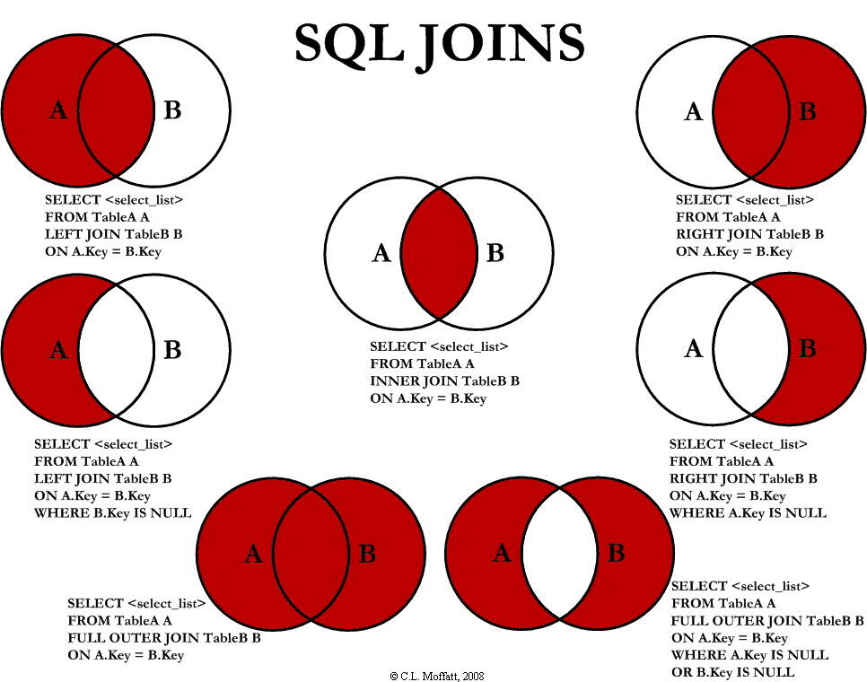
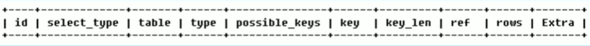
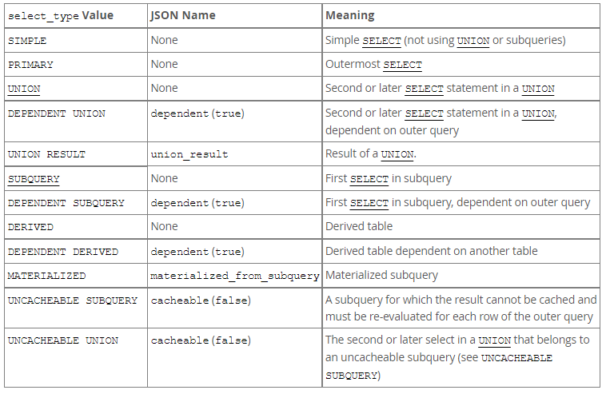
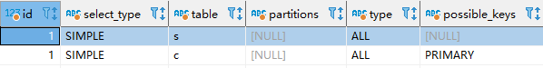
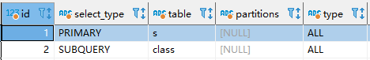
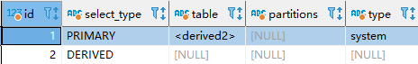
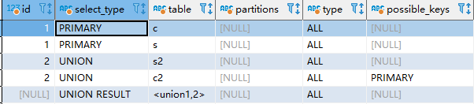
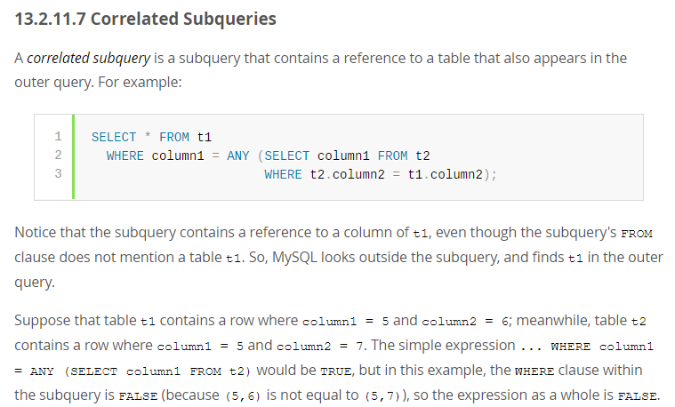
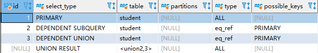
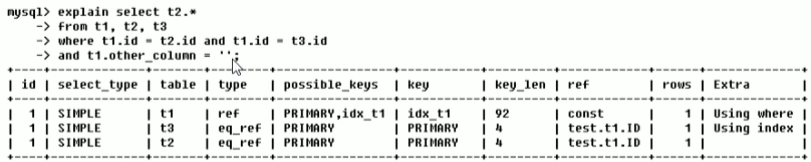

#### 七种join

mysql不支持full join（全连接），使用union替代：

~~~mysql
# union合并两个结果集， 自动去重
select * from a left join b on a.id = b.id
union
select * from a right join b on a.id = b.id;
~~~

#### 索引

本质上是一种排序的的数据结构（btree），可以加快查询和排序，但是降低更新删除操作。

基本语法：

~~~mysql
create [unique | fulltext | spatial] index index_name [using {btree | hash}] on tbl_name (key_part,...)

ALTER TABLE tbl_name ADD {INDEX | KEY} [index_name] [index_type] (key_part,...) [index_option] ...
ALTER TABLE tbl_name ADD {FULLTEXT | SPATIAL | UNIQUE} [INDEX | KEY] [index_name] (key_part,...) 
ALTER TABLE tbl_name ADD  PRIMARY KEY [index_type] (key_part,...) 
ALTER TABLE tbl_name ADD  FOREIGN KEY [index_name] (col_name,...) reference_definition

drop index index_name on table_name

show index from table_name;
~~~

#### explain

~~~sql
CREATE TABLE `class` (
  `id` int NOT NULL AUTO_INCREMENT,
  `name` varchar(255) NOT NULL,
  PRIMARY KEY (`id`)
) ENGINE=InnoDB DEFAULT CHARSET=utf8mb4 COLLATE=utf8mb4_0900_ai_ci;
INSERT INTO class (id, name) VALUES(1, 'a');
INSERT INTO class (id, name) VALUES(2, 'b');

CREATE TABLE `student` (
  `id` int NOT NULL AUTO_INCREMENT,
  `name` varchar(255) NOT NULL,
  `class_id` int NOT NULL,
  PRIMARY KEY (`id`)
) ENGINE=InnoDB DEFAULT CHARSET=utf8mb4 COLLATE=utf8mb4_0900_ai_ci;
INSERT INTO student (id, name, class_id) VALUES(1, 'zhangsan', 1);
INSERT INTO student (id, name, class_id) VALUES(2, 'lisi', 2);
~~~

1. id: 

   - id是select的序列号，**有几个select就有几个id，并且id的顺序是按照select出现的顺序递增的**
- **id越大优先级越高， id相同从上到下执行**
   
   - select查询分为简单查询和复杂查询，复杂查询分为三类：简单子查询（出现在where和select后面的查询），派生表（from语句中的子查询），union查询
- 如果该行是其他行的联合结果，比如union，则id为null
  

  
2. select_type: 

   

   - simple: 简单的select查询， 查询中不包含子查询或者union

     ~~~mysql
     explain select * from student s join class c on s.class_id = c.id ;
     ~~~

     

   - primary：查询中若包含任何复杂的子部分， 最外层查询被标记为primary

     ~~~mysql
     explain select * from student s where s.class_id = (select id from class where class.name = 'a');
     ~~~

     

   - subquery：在select或者where中包含的子查询

   - derived（衍生）：在from列表中包含的子查询被标记为derived，mysql会递归执行这些子查询， 把结果表放在临时表中

     ~~~mysql
     explain select * from (select 1,2,3 from dual) as s;
     ~~~

     

   - union：出现在union，则被标记为union，若union包含在from子句的子查询中，外层select将被标记为derived

   - union result：从union表中获取结果的select被标记为union result，union result行的id为null

     ~~~mysql
     explain select * from student s right join class c on s.class_id  = c.id 
     union 
     select * from student s2 left join class c2 on s2.class_id = c2.id ;
     ~~~

     

     id为1的是第一个select，因为是一个right join，所以有两个。id为2的同理。

   - dependent union：与union相同，但是依赖于外部查询

   - dependent subquery：与subquery相同， 但是依赖于外部查询

   - dependent derived：于derived相同，但是依赖于外部查询。

     dependent通常用于表示一个关联子查询（correlated subquery），即子查询中对摸个表的引用，同时该引用出现在了外层查询中。dependent通常出现在where后面的in， exists，any等条件中。

     

     ~~~mysql
     explain select * from student where id in 
     (select id from student where id > 2 union select id from student where id < 5);
     ~~~

     

3. table：

   表示explain的这一行正在访问哪个表，同时也可以是一下的值：

   <unionM,N>：该行使用的是id为M和N的行的union的结果

   \<deriverN>：表示该行使用的是id为N生成的衍生表

   \<subqueryN>：表示该行使用的id为N的子查询的

   

   

4. type：

   表的访问方式。

   从最好到最差依次，**一般来说保证查询至少达到range级别，最好能到ref。**

   **全部如下：system >> const >> eq_ref >> ref  >> fulltext >> ref_or_null >> index_merge >> unique_subquery >> index_subquery >> range >> index >> all**

   **工作中常见如下：system >> const >> eq_ref >> ref >> range >> index >> all**

   

   - system：表中只有一行记录（等于系统表），这是const类型的特例

   - const：该表至多只有一个匹配的行。因为只有一行，所以列的值可以视为常量。const的表只读取一次。

     `const` is used when you compare all parts of a `PRIMARY KEY` or `UNIQUE` index to constant values

     ~~~mysql
     SELECT * FROM tbl_name WHERE primary_key=1;
     ~~~

   - eq_ref：与前表的每一行结合，都只有一行从该表中读取。并且因为使用了索引，所以可以快速定位。常见于通过`=`比较具有primary key 和 unique not null index的索引列。

     ~~~mysql
  SELECT * FROM ref_table,other_table WHERE ref_table.key_column=other_table.column;
     ~~~

     const与与eq_ref之间的不同在于：eq_ref的表与前表的每一行结合都只有一行被读取。

     而const就只有一行。

   - ref：与前表的每一行结合，都只有少量行从该表中读取。因为索引是有序的，只需要定位到第一行，在做一个小范围查找即可快速定位所有值。常见于通过`=`，`<>`比较普通的索引列。

     ~~~mysql
  SELECT * FROM ref_table WHERE key_column=expr;
     
  SELECT * FROM ref_table,other_table
       WHERE ref_table.key_column=other_table.column;
     ~~~
   
   - fulltext：使用了fulltext索引
   
   - ref_or_null
   
   - index_merge
   
   - unique_subquery
   
   - range：只有给定范围内的行才会通过索引被检索，出现在一个索引列通过 `=`，`<>`，`>`，`>=`，`<`，`<=`，`IS NULL`，`<=>`，`BETWEEN`，`LIKE`，`IN()`进行比较时。type为range的时候ref为null
   
   - index：与前表的每一次结合都要按照索引的顺序做一次前表扫描，与all不同的是扫描索引数。
   
     - If the index is a covering index（覆盖索引） for the queries and can be used to satisfy all data required from the table, only the index tree is scanned. In this case, the `Extra` column says `Using index`. An index-only scan usually is faster than `ALL` because the size of the index usually is smaller than the table data.
     - A full table scan is performed using reads from the index to look up data rows（回填表数据） in index order. `Uses index` does not appear in the `Extra` column.
     - 如果index要回填表数据的话，做完索引数扫描后还要进行全表扫描，实际上index比all还要慢一下，但是因为index是按照索引的顺序进行全表扫描的，所以当使用order by的时候index还是比all要快的。
   
   - all：与前表的每一行结合都要做一次全表扫描，扫描硬盘
   
   - null：mysql能够在优化阶段分解查询语句，在执行阶段用不着在访问表
   
5. possible_key：

   表示哪些索引可以用于查找表中的列。查询涉及到的字段上若存在索引，则该索引将被列出，但是不一定使用。

6. key：**（如何决定使用的key？？？？）**

   实际使用到的索引，如果为null则没有使用到索引

   如果使用到了覆盖索引，则该索引仅出现在key中，而不出现在possible_key。

7. key_len：

8. ref：用于指示哪些列或者常量被用于查找索引列上的值。如果type是range的话，ref为null。

   

   上图显示了一个常量""用于比较t1上的idx_t1索引，test.t1.ID(库表列)用于比较t2和t3上的primary key。

9. row

10. extra

