https://www.bilibili.com/video/BV1py4y1E7oA?p=154&spm_id_from=pageDriver&vd_source=f79519d2285c777c4e2b2513f5ef101a


# 一. NIO


## NIO和BIO


### TCP三次握手

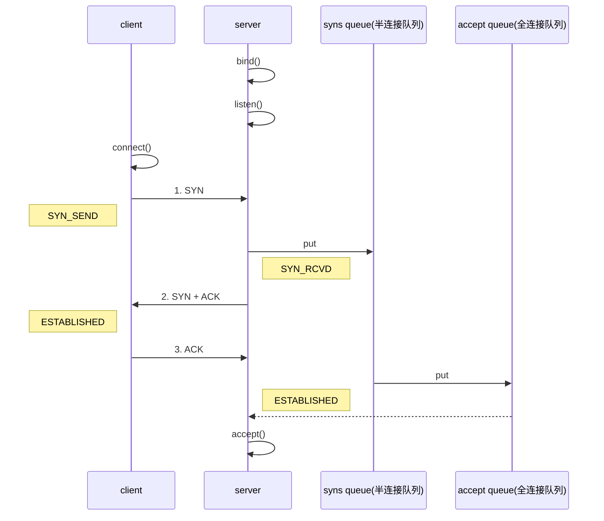

1. 服务段端创建ServerSocket, 调用bind()
2. 客户端创建socket, 调用connect()方法
3. 第一次握手，client 发送 SYN 到 server，状态自己修改为 SYN_SEND，server 收到，状态改变为 SYN_REVD，并将该请求放入 sync queue半连接 队列
4. 第二次握手，server 回复 SYN + ACK 给 client，client 收到，状态改变为 ESTABLISHED，并发送 ACK 给 server
5. 第三次握手，server 收到 ACK，状态改变为 ESTABLISHED，将该请求从 sync queue 放入 accept queue
6. 服务器从accept queue中获取连接， 并从accept()方法中返回

**为什么需要三次握手**

连接的过程最主要的目的就是证明:

1. client发送的消息server能够接受到
2. server发送的消息client能够接受到

为了证明条件1, 需要client发送syn消息给server, 然后server回复一个ack, 这样就证明client发送的消息server能够接受到

为了证明条件2, 需要server发送syn消息给client, 然后client回复一个ack, 这样就证明了server发送的消息client能够接受到

这样两边就可以双工通讯了

只是server回复给client的ack和sync可以合并为1条消息, 所以需要3次握手

**能不能使用两次握手**

如果使用两次握手的话, 只是client发送syn给server, server回复ack给client

这样只能证明client发送给server的消息, server能够正确接收, 但是不能证明server发送的消息client可以正确接收

这样的话只能client发送消息给server, 开启单边通讯


### TCP四次挥手

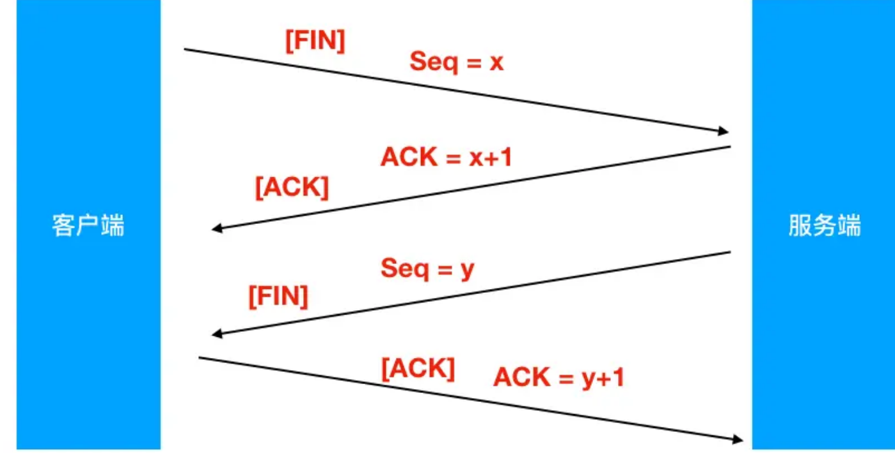

1. 第一次挥手（[FIN], Seq = x）
    客户端发送一个FIN标记的包，告诉服务器需要关闭连接，表示自己要断开连接诶, **并且之后不会发送数据了，但是还可以接收数据**。发送完成后，`客户端`进入`FIN_WAIT_1`状态。

2. 第二次挥手 ([ACK], ACK = x + 1)
    服务端发送一个ACK的确认包，告诉客户端接收到关闭的请求，但是还没有准备好关闭(可能还有需要向client发送的数据)。发送完成后，`服务端`进入`CLOSE_WAIT`状态，`客户端`收到这个包后，进入`FIN_WAIT_2`，等待服务器关闭连接。

3. 第三次挥手 ([FIN], Seq = y)
    服务端准备好关闭连接时，发送FIN标记的包，告诉客户端准备关闭了。发送完成后，`服务端`进入`LAST_ACK`状态，等待客户端确认。

4. 第四次挥手 ([ACK], ACK = y + 1)
    客户端接收到服务端的关闭请求，再发送ACK标记的确认包，进入`TIME_WAIT`状态，等待服务端可能请求重传的ACK包。
    服务端接收到ACK包后，关闭连接，进入`CLOSED`状态。
    客户端在等待固定时间(两个最大段生命周期)后，没有接收到服务的ACK包，认为服务器已关闭连接，自己也关闭连接，进入`CLOSED`状态。

**为什么需要四次挥手**

和tcp3次握手一样, 关闭连接的过程就是为了证明

1. client发送的关闭请求被server正确接收到了
2. server发送的关闭请求被client正确接收到了

为了证明条件1, 就需要client发送一个fin消息给server, server回复一个ack

为了证明条件1, 就需要server发送一个fin消息给client, client回复一个ack

**为什么不能和3次握手一样, 把server给client的fin和ack合并**

应为server接收到client的fin消息时, server可能还有一些要向client发送的tcp数据包, 这个时候要等server把这些数据包发送完, 才可以发送fin消息, 所以两个消息不能合并为1个


## NIO 基础

### Buffer

buffer 则用来缓冲读写数据，常见的 buffer 有

* ByteBuffer
  * MappedByteBuffer: 使用了mmap技术
  * DirectByteBuffer: 使用直接内存的buffer
  * HeapByteBuffer: 使用堆内存的buffer
* ShortBuffer
* IntBuffer
* LongBuffer
* FloatBuffer
* DoubleBuffer
* CharBuffer

#### ByteBuffer

##### ByteBuffer的结构

ByteBuffer 有以下重要属性

* capacity: 当前buffer的容量, 不会改变
* position: 下一次读写的位置
* limit: 当前读写的极限, 在写状态下就是capacity, 在读模式下就是上次写到的位置
* mark: 一个标记, 初始时为-1

ByteBuffer在初始创建时, 是写模式, 此时position=0, limit=capacity


下图表示写入了 4 个字节后的状态


在调用flip()翻转读写模式后，此时为读模式, limit=position, position


读取 4 个字节后，状态

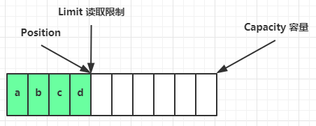

clear()调用后，position和limit都重置为初始状态, 并且转换为写模式

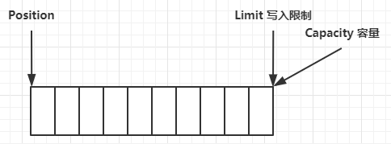

compact()调用后，是把未读完的部分移到队首，然后切换至写模式


##### Buffer 的线程安全

> Buffer 是**非线程安全的**


##### ByteBuffer的相关函数

1. 使用 allocate 方法为 ByteBuffer 分配空间，其它 buffer 类也有该方法

   ~~~java
   Bytebuffer buf = ByteBuffer.allocate(16);
   ~~~

2. 向buffer写数据

   * 调用 channel 的 read 方法

     ~~~java
     int readBytes = channel.read(buf);
     ~~~

   * 调用 buffer 自己的 put 方法

     ~~~java
     buf.put((byte)127);
     ~~~

3. 翻转读写模式

   - flip()函数, 翻转读写模式
   - clear(), 重置buffer, 并转为写模式,  一般用在**读取数据完**之后转换为写模式
   - compact(), 将未读的数据移到对首, 然后转换为写模式, 一般用在读取数据后, 此时还有部分数据没有读完, 但需要转换为写模式

4. 从buffer中读取数据

   * 调用 channel 的 write 方法, 将buffer中的数据写到channel中

     ~~~java
     int writeBytes = channel.write(buf);
     ~~~

   * 调用 buffer 自己的 get 方法, get()会让position往后移动

     ~~~java
     byte b = buf.get();
     ~~~

   * 调用buffer的get(index)方法,  这个方法不会让position往后移动

     ~~~java
     byte b = buf.get(i);
     ~~~

5. mark():  标记一个位置

6. reset():  将position设置到mark的位置

7. rewind(): 重新读去已读的数据， 就是将position重置为0

> **注意**
>
> rewind 和 flip 都会清除 mark 位置

~~~java
public static void main(String[] args) {

        CharBuffer buffer = CharBuffer.allocate(5);
        char i= 'a';
        // 根据当前的读写模式判断是否可读, 或者可写
        while (buffer.hasRemaining()){
            // 开始时是写模式, 每次往buffer中写数据都会导致position加一
            buffer.put(i++);
            System.out.printf("%d, %d, %d\n", buffer.position(), buffer.limit(), buffer.capacity());
        }

        buffer.flip(); // 切换读写模式, 就是把limit变为position, position变为0
        System.out.println("----------------------------------------------");
        System.out.printf("%d, %d %d\n", buffer.position(), buffer.limit(), buffer.capacity());
        System.out.println("----------------------------------------------");


        for (int j = 0; j < buffer.limit(); j++) {
            char c = buffer.get(i); // get(i) 不会改变 position的位置
            System.out.printf("%s, %d, %d %d\n", c, buffer.position(), buffer.limit(), buffer.capacity());
        }

        System.out.println("----------------------------------------------");
        while (buffer.hasRemaining()) {
            // buffer.get()会改变position的位置
            System.out.printf("%s, %d, %d %d\n", buffer.get(), buffer.position(), buffer.limit(), buffer.capacity());
        }

        buffer.rewind(); // 重新读， 就是将position重置为0
        while (buffer.hasRemaining()) {
            System.out.printf("%s, %d, %d %d\n", buffer.get(), buffer.position(), buffer.limit(), buffer.capacity());
        }

        buffer.compact(); // 清除已读的数据, 然后转换为写模式, 就是把position到limit这段内容移动到数组开头

        buffer.clear(); // 清除buffer中的所有数据, 转换为写模式

        buffer.mark(); // 标记一个位置
        buffer.reset(); // 将position设置为mark的位置


        CharBuffer ac = CharBuffer.wrap("ac");
        System.out.println(buffer.equals(ac)); // 相等， 先比较类型，然后比较内容
        System.out.println(buffer.compareTo(ac)); // 比较，按字典比较

    }
~~~


#### ByteBuffer的正确使用方式

1. 初始化合适长度的buffer
2. 向 buffer 写入数据，例如调用 channel.read(buffer)
3. 调用 flip() 切换至**读模式**
4. 从 buffer 读取数据，例如调用 buffer.get()
5. 调用 clear() 或 compact() 切换至**写模式**
6. 重复 2~4 步骤

下面是通过ByteBuffer来读取文件的内容

```java
@Slf4j
public class ChannelDemo1 {
    public static void main(String[] args) {
        try (RandomAccessFile file = new RandomAccessFile("helloword/data.txt", "rw")) {
            FileChannel channel = file.getChannel();
            ByteBuffer buffer = ByteBuffer.allocate(10);
            do {
                // 向 buffer 写入
                int len = channel.read(buffer);
                log.debug("读到字节数：{}", len);
                if (len == -1) {
                    break;
                }
                // 切换 buffer 读模式
                buffer.flip();
                while(buffer.hasRemaining()) {
                    log.debug("{}", (char)buffer.get());
                }
                // 切换 buffer 写模式
                buffer.clear();
            } while (true);
        } catch (IOException e) {
            e.printStackTrace();
        }
    }
}
```


#### 字符串与 ByteBuffer 互转

```java
ByteBuffer buffer1 = StandardCharsets.UTF_8.encode("你好");
ByteBuffer buffer2 = Charset.forName("utf-8").encode("你好");

debug(buffer1);
debug(buffer2);

CharBuffer buffer3 = StandardCharsets.UTF_8.decode(buffer1);
System.out.println(buffer3.getClass());
System.out.println(buffer3.toString());
```


### 分散读和聚合写

~~~java
/**
     * Scatter 分散器， 将channel中的数据读取到多个buffer中。先读入第一个buf中，读满下一个。
     * Gather 聚合器， 将多个buffer中的数据写入到channel中。 先将第一个buf的数据写入
     * 这对于固定格式的内容很有帮助。
     */
    @Test
    public void test() {
        ByteBuffer title = ByteBuffer.allocate(10);
        ByteBuffer content = ByteBuffer.allocate(1024);
        ByteBuffer[] buffers = {title, content};
        try (RandomAccessFile file = new RandomAccessFile("C:\\Users\\Tiger.Shen\\Desktop\\Test.java", "rw");
            FileChannel channel = file.getChannel();) {
            // 分散
            channel.read(buffers);

            // 聚集
            channel.write(buffers);
        } catch (Exception e) {

        }
    }
~~~

#### 通过分散读解决黏包半包

网络上有多条数据发送给服务端，数据之间使用 \n 进行分隔
但由于某种原因这些数据在接收时，被进行了重新组合，例如原始数据有3条为

* Hello,world\n
* I'm zhangsan\n
* How are you?\n

变成了下面的两个 byteBuffer (黏包，半包)

* Hello,world\nI'm zhangsan\nHo
* w are you?\n

现在要求你编写程序，将错乱的数据恢复成原始的按 \n 分隔的数据

```java
public static void main(String[] args) {
    ByteBuffer source = ByteBuffer.allocate(32);
    source.put("Hello,world\nI'm zhangsan\nHo".getBytes());
    split(source);
    source.put("w are you?\nhaha!\n".getBytes());
    split(source);
}

private static void split(ByteBuffer source) {
    source.flip();
    // 记录可读的位置
    int oldLimit = source.limit();
    for (int i = 0; i < oldLimit; i++) {
        // get(i)不会推动position的位置
        if (source.get(i) == '\n') {
            System.out.println(i);
            // 从当前i的位置, 减去position, 即起始读的位置, 就是msg的长度
            ByteBuffer target = ByteBuffer.allocate(i + 1 - source.position());
            // 将limit置于消息的结尾
            source.limit(i + 1);
            // 从source 读，向 target 写
            target.put(source); 
            debugAll(target);
            // 重置limit到buffer的末尾
            source.limit(oldLimit);
        }
    }
    source.compact();
}
```


### Channel

channel 有一点类似于 stream，它就是读写数据的**双向通道**，可以从 channel 将数据读入 buffer，也可以将 buffer 的数据写入 channel，而之前的 stream 要么是输入，要么是输出，channel 比 stream 更为底层


常见的 Channel 有

* FileChannel
* DatagramChannel
* SocketChannel
* ServerSocketChannel

#### 1. FileChannel

> FileChannel 只能工作在阻塞模式下

1. 获取FileChannel, 必须通过 FileInputStream、FileOutputStream 或者 RandomAccessFile 来获取 FileChannel，它们都有 getChannel 方法

   * 通过 FileInputStream 获取的 channel 只能读
   * 通过 FileOutputStream 获取的 channel 只能写
   * 通过 RandomAccessFile 是否能读写根据构造 RandomAccessFile 时的读写模式决定

   ~~~java
   RandomAccessFile file = new RandomAccessFile("C:\\Users\\Tiger.Shen\\Desktop\\Test.java", "rw");
   FileChannel channel = file.getChannel();
   
   File file1 = new File("aa.txt");
   FileChannel inputChannel = new FileInputStream(file).getChannel();
   FileChannel outChannel = new FileOutputStream(file).getChannel();
   ~~~

2. 读取文件

   ~~~java
   @Test
       @SneakyThrows
       public void readAndWrite(){
   
           // 从fromFile读取内容, 然后写到toFile中去
           try (RandomAccessFile fromFile = new RandomAccessFile("fromFile.txt", "rw");
                FileChannel      fromChannel = fromFile.getChannel();
   
                RandomAccessFile toFile = new RandomAccessFile("toFile.txt", "rw");
                FileChannel toChannel = toFile.getChannel()) {
   
               ByteBuffer buffer = ByteBuffer.allocate(8);
   
               int read;
               // 读取不到数据就会返回-1
               while ((read = fromChannel.read(buffer)) != -1) {
                   buffer.flip();
                   toChannel.write(buffer);
                   buffer.clear();
               }
           }
   
       }
   ~~~

3. 设置文件读写的位置

   ~~~java
   // 获取当前位置
   long pos = channel.position();
   
   // 设置当前位置
   long newPos = ...;
   channel.position(newPos);
   ~~~

4. 操作系统出于性能的考虑，会将数据缓存，不是立刻写入磁盘。可以调用 force(true)  方法将文件内容和元数据（文件的权限等信息）立刻写入磁盘

   ~~~java
   fileChannel.force(true); // 强制刷盘, 将channel写入到磁盘
   ~~~

   

5. 通过buffer来读写FileChannel

   ~~~java
   @Test
       @SneakyThrows
       public void readAndWrite(){
   
           // 从fromFile读取内容, 然后写到toFile中去
           try (RandomAccessFile fromFile = new RandomAccessFile("fromFile.txt", "rw");
                FileChannel      fromChannel = fromFile.getChannel();
   
                RandomAccessFile toFile = new RandomAccessFile("toFile.txt", "rw");
                FileChannel toChannel = toFile.getChannel()) {
   
               ByteBuffer buffer = ByteBuffer.allocate(8);
   
               int read;
               while ((read = fromChannel.read(buffer)) != -1) {
                   buffer.flip();
                   toChannel.write(buffer);
                   buffer.clear();
               }
           }
   
       }
   ~~~

6. 通过transferTo和transferFrom来传输文件

   ~~~java
   	@Test
       @SneakyThrows
       public void transform(){
   
           // 源channel传输到目的channel
           try (RandomAccessFile fromFile = new RandomAccessFile("fromFile.txt", "rw");
               FileChannel      fromChannel = fromFile.getChannel();
   
               RandomAccessFile toFile = new RandomAccessFile("toFile.txt", "rw");
               FileChannel toChannel = toFile.getChannel()) {
   
               long position = 0;
               long count = fromChannel.size();
   
               fromChannel.transferTo(position, count, toChannel); // transformTo
               toChannel.transferFrom(fromChannel, position, count); // transformFrom
           }
       }
   ~~~

7. 传输大小2g的文件

   ~~~java
   	@Test
       @SneakyThrows
       public static void main(String[] args) {
           try (
               FileChannel fromChannel = new FileInputStream("data.txt").getChannel();
               FileChannel toChannel = new FileOutputStream("to.txt").getChannel();
           ) {
               // 效率高，底层会利用操作系统的零拷贝进行优化
               long size = fromChannel.size();
               // left 变量代表还剩余多少字节
               for (long left = size; left > 0; ) {
                   System.out.println("position:" + (size - left) + " left:" + left);
                   left -= fromChannel.transferTo((size - left), left, toChannel);
               }
           } catch (IOException e) {
               e.printStackTrace();
           }
       }
   ~~~

   ~~~txt
   position:0 left:7769948160
   position:2147483647 left:5622464513
   position:4294967294 left:3474980866
   position:6442450941 left:1327497219
   ~~~

#### 2. SockChannel

使用方法和FileChannel差不多, 具体看Selector中的使用部分

### Selector

具体使用查看聊天室代码案例


### AIO(不重要)

AIO 用来解决数据复制阶段的阻塞问题

* 同步意味着，在进行读写操作时，线程需要等待结果，还是相当于闲置
* 异步意味着，在进行读写操作时，线程不必等待结果，而是将来由操作系统来通过回调方式由另外的线程来获得结果

> 异步模型需要底层操作系统（Kernel）提供支持
>
> * Windows 系统通过 IOCP 实现了真正的异步 IO
> * Linux 系统异步 IO 在 2.6 版本引入，但其底层实现还是用多路复用模拟了异步 IO，性能没有优势


#### 文件 AIO

先来看看 AsynchronousFileChannel

```java
@Slf4j
public class AioDemo1 {
    public static void main(String[] args) throws IOException {
        try{
            AsynchronousFileChannel s = 
                AsynchronousFileChannel.open(
                	Paths.get("1.txt"), StandardOpenOption.READ);
            ByteBuffer buffer = ByteBuffer.allocate(2);
            log.debug("begin...");
            s.read(buffer, 0, null, new CompletionHandler<Integer, ByteBuffer>() {
                @Override
                public void completed(Integer result, ByteBuffer attachment) {
                    log.debug("read completed...{}", result);
                    buffer.flip();
                    debug(buffer);
                }

                @Override
                public void failed(Throwable exc, ByteBuffer attachment) {
                    log.debug("read failed...");
                }
            });

        } catch (IOException e) {
            e.printStackTrace();
        }
        log.debug("do other things...");
        System.in.read();
    }
}
```

输出

```
13:44:56 [DEBUG] [main] c.i.aio.AioDemo1 - begin...
13:44:56 [DEBUG] [main] c.i.aio.AioDemo1 - do other things...
13:44:56 [DEBUG] [Thread-5] c.i.aio.AioDemo1 - read completed...2
         +-------------------------------------------------+
         |  0  1  2  3  4  5  6  7  8  9  a  b  c  d  e  f |
+--------+-------------------------------------------------+----------------+
|00000000| 61 0d                                           |a.              |
+--------+-------------------------------------------------+----------------+
```

可以看到

* 响应文件读取成功的是另一个线程 Thread-5
* 主线程并没有 IO 操作阻塞


#### 守护线程

默认文件 AIO 使用的线程都是守护线程，所以最后要执行 `System.in.read()` 以避免守护线程意外结束


#### 网络 AIO

```java
public class AioServer {
    public static void main(String[] args) throws IOException {
        AsynchronousServerSocketChannel ssc = AsynchronousServerSocketChannel.open();
        ssc.bind(new InetSocketAddress(8080));
        ssc.accept(null, new AcceptHandler(ssc));
        System.in.read();
    }

    private static void closeChannel(AsynchronousSocketChannel sc) {
        try {
            System.out.printf("[%s] %s close\n", Thread.currentThread().getName(), sc.getRemoteAddress());
            sc.close();
        } catch (IOException e) {
            e.printStackTrace();
        }
    }

    private static class ReadHandler implements CompletionHandler<Integer, ByteBuffer> {
        private final AsynchronousSocketChannel sc;

        public ReadHandler(AsynchronousSocketChannel sc) {
            this.sc = sc;
        }

        @Override
        public void completed(Integer result, ByteBuffer attachment) {
            try {
                if (result == -1) {
                    closeChannel(sc);
                    return;
                }
                System.out.printf("[%s] %s read\n", Thread.currentThread().getName(), sc.getRemoteAddress());
                attachment.flip();
                System.out.println(Charset.defaultCharset().decode(attachment));
                attachment.clear();
                // 处理完第一个 read 时，需要再次调用 read 方法来处理下一个 read 事件
                sc.read(attachment, attachment, this);
            } catch (IOException e) {
                e.printStackTrace();
            }
        }

        @Override
        public void failed(Throwable exc, ByteBuffer attachment) {
            closeChannel(sc);
            exc.printStackTrace();
        }
    }

    private static class WriteHandler implements CompletionHandler<Integer, ByteBuffer> {
        private final AsynchronousSocketChannel sc;

        private WriteHandler(AsynchronousSocketChannel sc) {
            this.sc = sc;
        }

        @Override
        public void completed(Integer result, ByteBuffer attachment) {
            // 如果作为附件的 buffer 还有内容，需要再次 write 写出剩余内容
            if (attachment.hasRemaining()) {
                sc.write(attachment);
            }
        }

        @Override
        public void failed(Throwable exc, ByteBuffer attachment) {
            exc.printStackTrace();
            closeChannel(sc);
        }
    }

    private static class AcceptHandler implements CompletionHandler<AsynchronousSocketChannel, Object> {
        private final AsynchronousServerSocketChannel ssc;

        public AcceptHandler(AsynchronousServerSocketChannel ssc) {
            this.ssc = ssc;
        }

        @Override
        public void completed(AsynchronousSocketChannel sc, Object attachment) {
            try {
                System.out.printf("[%s] %s connected\n", Thread.currentThread().getName(), sc.getRemoteAddress());
            } catch (IOException e) {
                e.printStackTrace();
            }
            ByteBuffer buffer = ByteBuffer.allocate(16);
            // 读事件由 ReadHandler 处理
            sc.read(buffer, buffer, new ReadHandler(sc));
            // 写事件由 WriteHandler 处理
            sc.write(Charset.defaultCharset().encode("server hello!"), ByteBuffer.allocate(16), new WriteHandler(sc));
            // 处理完第一个 accpet 时，需要再次调用 accept 方法来处理下一个 accept 事件
            ssc.accept(null, this);
        }

        @Override
        public void failed(Throwable exc, Object attachment) {
            exc.printStackTrace();
        }
    }
}
```


## 网络编程

#### 4.1 非阻塞 vs 阻塞

##### 阻塞

* 阻塞模式下，相关方法都会导致线程暂停
  * ServerSocketChannel.accept 会在没有连接建立时让线程暂停
  * SocketChannel.read 会在没有数据可读时让线程暂停
  * 阻塞的表现其实就是线程暂停了，暂停期间不会占用 cpu，但线程相当于闲置
* 单线程下，阻塞方法之间相互影响，几乎不能正常工作，需要多线程支持
* 但多线程下，有新的问题，体现在以下方面
  * 32 位 jvm 一个线程 320k，64 位 jvm 一个线程 1024k，如果连接数过多，必然导致 OOM，并且线程太多，反而会因为频繁上下文切换导致性能降低
  * 可以采用线程池技术来减少线程数和线程上下文切换，但治标不治本，如果有很多连接建立，但长时间 inactive，会阻塞线程池中所有线程，因此不适合长连接，只适合短连接


服务器端

```java
// 使用 nio 来理解阻塞模式, 单线程
// 0. ByteBuffer
ByteBuffer buffer = ByteBuffer.allocate(16);
// 1. 创建了服务器
ServerSocketChannel ssc = ServerSocketChannel.open();

// 2. 绑定监听端口
ssc.bind(new InetSocketAddress(8080));

// 3. 连接集合
List<SocketChannel> channels = new ArrayList<>();
while (true) {
    // 4. accept 建立与客户端连接， SocketChannel 用来与客户端之间通信
    log.debug("connecting...");
    SocketChannel sc = ssc.accept(); // 阻塞方法，线程停止运行
    log.debug("connected... {}", sc);
    channels.add(sc);
    for (SocketChannel channel : channels) {
        // 5. 接收客户端发送的数据
        log.debug("before read... {}", channel);
        channel.read(buffer); // 阻塞方法，线程停止运行
        buffer.flip();
        debugRead(buffer);
        buffer.clear();
        log.debug("after read...{}", channel);
    }
}
```

客户端

```java
SocketChannel sc = SocketChannel.open();
sc.connect(new InetSocketAddress("localhost", 8080));
System.out.println("waiting...");
```


##### 非阻塞

* 非阻塞模式下，相关方法都会不会让线程暂停
  * 在 ServerSocketChannel.accept 在没有连接建立时，会返回 null，继续运行
  * SocketChannel.read 在没有数据可读时，会返回 0，但线程不必阻塞，可以去执行其它 SocketChannel 的 read 或是去执行 ServerSocketChannel.accept 
  * 写数据时，线程只是等待数据写入 Channel 即可，无需等 Channel 通过网络把数据发送出去
* 但非阻塞模式下，即使没有连接建立，和可读数据，线程仍然在不断运行，白白浪费了 cpu
* 数据复制过程中，线程实际还是阻塞的（AIO 改进的地方）


服务器端，客户端代码不变

```java
// 使用 nio 来理解非阻塞模式, 单线程
// 0. ByteBuffer
ByteBuffer buffer = ByteBuffer.allocate(16);
// 1. 创建了服务器
ServerSocketChannel ssc = ServerSocketChannel.open();
ssc.configureBlocking(false); // 非阻塞模式
// 2. 绑定监听端口
ssc.bind(new InetSocketAddress(8080));
// 3. 连接集合
List<SocketChannel> channels = new ArrayList<>();
while (true) {
    // 4. accept 建立与客户端连接， SocketChannel 用来与客户端之间通信
    SocketChannel sc = ssc.accept(); // 非阻塞，线程还会继续运行，如果没有连接建立，但sc是null
    if (sc != null) {
        log.debug("connected... {}", sc);
        sc.configureBlocking(false); // 非阻塞模式
        channels.add(sc);
    }
    for (SocketChannel channel : channels) {
        // 5. 接收客户端发送的数据
        int read = channel.read(buffer);// 非阻塞，线程仍然会继续运行，如果没有读到数据，read 返回 0
        if (read > 0) {
            buffer.flip();
            debugRead(buffer);
            buffer.clear();
            log.debug("after read...{}", channel);
        }
    }
}
```


##### 多路复用

单线程可以配合 Selector 完成对多个 Channel 可读写事件的监控，这称之为多路复用

* 多路复用仅针对网络 IO、普通文件 IO 没法利用多路复用
* 如果不用 Selector 的非阻塞模式，线程大部分时间都在做无用功，而 Selector 能够保证
  * 有可连接事件时才去连接
  * 有可读事件才去读取
  * 有可写事件才去写入
    * 限于网络传输能力，Channel 未必时时可写，一旦 Channel 可写，会触发 Selector 的可写事件


#### 4.2 Selector

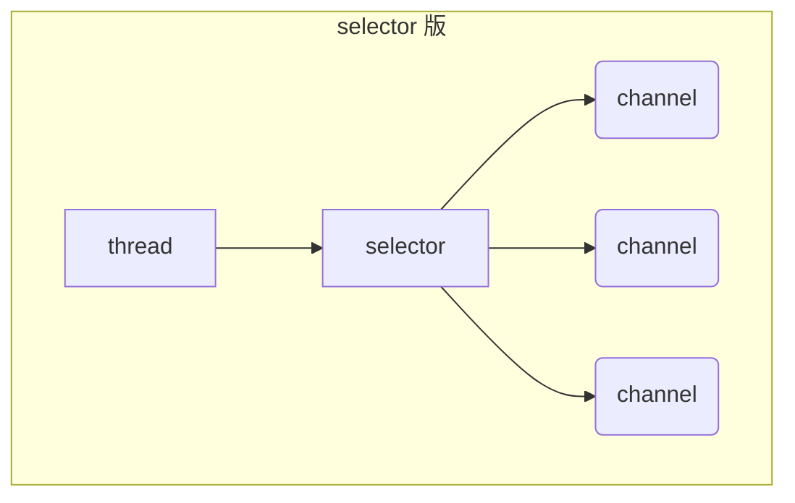


好处

* 一个线程配合 selector 就可以监控多个 channel 的事件，事件发生线程才去处理。避免非阻塞模式下所做无用功
* 让这个线程能够被充分利用
* 节约了线程的数量
* 减少了线程上下文切换


#### 创建

```java
Selector selector = Selector.open();
```


#### 绑定 Channel 事件

也称之为注册事件，绑定的事件 selector 才会关心 

```java
channel.configureBlocking(false);
SelectionKey key = channel.register(selector, 绑定事件);
```

* channel 必须工作在非阻塞模式
* FileChannel 没有非阻塞模式，因此不能配合 selector 一起使用
* 绑定的事件类型可以有
  * connect - 客户端连接成功时触发
  * accept - 服务器端成功接受连接时触发
  * read - 数据可读入时触发，有因为接收能力弱，数据暂不能读入的情况
  * write - 数据可写出时触发，有因为发送能力弱，数据暂不能写出的情况


##### 监听 Channel 事件

可以通过下面三种方法来监听是否有事件发生，方法的返回值代表有多少 channel 发生了事件

方法1，阻塞直到绑定事件发生

```java
int count = selector.select();
```


方法2，阻塞直到绑定事件发生，或是超时（时间单位为 ms）

```java
int count = selector.select(long timeout);
```


方法3，不会阻塞，也就是不管有没有事件，立刻返回，自己根据返回值检查是否有事件

```java
int count = selector.selectNow();
```


##### 💡 select 何时不阻塞

> * 事件发生时
>   * 客户端发起连接请求，会触发 accept 事件
>   * 客户端发送数据过来，客户端正常、异常关闭时，都会触发 read 事件，另外如果发送的数据大于 buffer 缓冲区，会触发多次读取事件
>   * channel 可写，会触发 write 事件
>   * 在 linux 下 nio bug 发生时
> * 调用 selector.wakeup()
> * 调用 selector.close()
> * selector 所在线程 interrupt


#### 4.3 处理 accept 事件

客户端代码为

```java
public class Client {
    public static void main(String[] args) {
        try (Socket socket = new Socket("localhost", 8080)) {
            System.out.println(socket);
            socket.getOutputStream().write("world".getBytes());
            System.in.read();
        } catch (IOException e) {
            e.printStackTrace();
        }
    }
}
```


服务器端代码为

```java
@Slf4j
public class ChannelDemo6 {
    public static void main(String[] args) {
        try (ServerSocketChannel channel = ServerSocketChannel.open()) {
            channel.bind(new InetSocketAddress(8080));
            System.out.println(channel);
            Selector selector = Selector.open();
            channel.configureBlocking(false);
            channel.register(selector, SelectionKey.OP_ACCEPT);

            while (true) {
                int count = selector.select();
//                int count = selector.selectNow();
                log.debug("select count: {}", count);
//                if(count <= 0) {
//                    continue;
//                }

                // 获取所有事件
                Set<SelectionKey> keys = selector.selectedKeys();

                // 遍历所有事件，逐一处理
                Iterator<SelectionKey> iter = keys.iterator();
                while (iter.hasNext()) {
                    SelectionKey key = iter.next();
                    // 判断事件类型
                    if (key.isAcceptable()) {
                        ServerSocketChannel c = (ServerSocketChannel) key.channel();
                        // 必须处理
                        SocketChannel sc = c.accept();
                        log.debug("{}", sc);
                    }
                    // 处理完毕，必须将事件移除
                    iter.remove();
                }
            }
        } catch (IOException e) {
            e.printStackTrace();
        }
    }
}
```


##### 💡 事件发生后能否不处理

> 事件发生后，要么处理，要么取消（cancel），不能什么都不做，否则下次该事件仍会触发，这是因为 nio 底层使用的是水平触发


#### 4.4 处理 read 事件

```java
@Slf4j
public class ChannelDemo6 {
    public static void main(String[] args) {
        try (ServerSocketChannel channel = ServerSocketChannel.open()) {
            channel.bind(new InetSocketAddress(8080));
            System.out.println(channel);
            Selector selector = Selector.open();
            channel.configureBlocking(false);
            channel.register(selector, SelectionKey.OP_ACCEPT);

            while (true) {
                int count = selector.select();
//                int count = selector.selectNow();
                log.debug("select count: {}", count);
//                if(count <= 0) {
//                    continue;
//                }

                // 获取所有事件
                Set<SelectionKey> keys = selector.selectedKeys();

                // 遍历所有事件，逐一处理
                Iterator<SelectionKey> iter = keys.iterator();
                while (iter.hasNext()) {
                    SelectionKey key = iter.next();
                    // 判断事件类型
                    if (key.isAcceptable()) {
                        ServerSocketChannel c = (ServerSocketChannel) key.channel();
                        // 必须处理
                        SocketChannel sc = c.accept();
                        sc.configureBlocking(false);
                        sc.register(selector, SelectionKey.OP_READ);
                        log.debug("连接已建立: {}", sc);
                    } else if (key.isReadable()) {
                        SocketChannel sc = (SocketChannel) key.channel();
                        ByteBuffer buffer = ByteBuffer.allocate(128);
                        int read = sc.read(buffer);
                        if(read == -1) {
                            key.cancel();
                            sc.close();
                        } else {
                            buffer.flip();
                            debug(buffer);
                        }
                    }
                    // 处理完毕，必须将事件移除
                    iter.remove();
                }
            }
        } catch (IOException e) {
            e.printStackTrace();
        }
    }
}
```

开启两个客户端，修改一下发送文字，输出

```
sun.nio.ch.ServerSocketChannelImpl[/0:0:0:0:0:0:0:0:8080]
21:16:39 [DEBUG] [main] c.i.n.ChannelDemo6 - select count: 1
21:16:39 [DEBUG] [main] c.i.n.ChannelDemo6 - 连接已建立: java.nio.channels.SocketChannel[connected local=/127.0.0.1:8080 remote=/127.0.0.1:60367]
21:16:39 [DEBUG] [main] c.i.n.ChannelDemo6 - select count: 1
         +-------------------------------------------------+
         |  0  1  2  3  4  5  6  7  8  9  a  b  c  d  e  f |
+--------+-------------------------------------------------+----------------+
|00000000| 68 65 6c 6c 6f                                  |hello           |
+--------+-------------------------------------------------+----------------+
21:16:59 [DEBUG] [main] c.i.n.ChannelDemo6 - select count: 1
21:16:59 [DEBUG] [main] c.i.n.ChannelDemo6 - 连接已建立: java.nio.channels.SocketChannel[connected local=/127.0.0.1:8080 remote=/127.0.0.1:60378]
21:16:59 [DEBUG] [main] c.i.n.ChannelDemo6 - select count: 1
         +-------------------------------------------------+
         |  0  1  2  3  4  5  6  7  8  9  a  b  c  d  e  f |
+--------+-------------------------------------------------+----------------+
|00000000| 77 6f 72 6c 64                                  |world           |
+--------+-------------------------------------------------+----------------+
```


##### 💡 为何要 iter.remove()

> 因为 select 在事件发生后，就会将相关的 key 放入 selectedKeys 集合，但不会在处理完后从 selectedKeys 集合中移除，需要我们自己编码删除。例如
>
> * 第一次触发了 ssckey 上的 accept 事件，没有移除 ssckey 
> * 第二次触发了 sckey 上的 read 事件，但这时 selectedKeys 中还有上次的 ssckey ，在处理时因为没有真正的 serverSocket 连上了，就会导致空指针异常


##### 💡 cancel 的作用

> cancel 会取消注册在 selector 上的 channel，并从 keys 集合中删除 key 后续不会再监听事件


##### ⚠️  不处理边界的问题

以前有同学写过这样的代码，思考注释中两个问题，以 bio 为例，其实 nio 道理是一样的

```java
public class Server {
    public static void main(String[] args) throws IOException {
        ServerSocket ss=new ServerSocket(9000);
        while (true) {
            Socket s = ss.accept();
            InputStream in = s.getInputStream();
            // 这里这么写，有没有问题
            byte[] arr = new byte[4];
            while(true) {
                int read = in.read(arr);
                // 这里这么写，有没有问题
                if(read == -1) {
                    break;
                }
                System.out.println(new String(arr, 0, read));
            }
        }
    }
}
```

客户端

```java
public class Client {
    public static void main(String[] args) throws IOException {
        Socket max = new Socket("localhost", 9000);
        OutputStream out = max.getOutputStream();
        out.write("hello".getBytes());
        out.write("world".getBytes());
        out.write("你好".getBytes());
        max.close();
    }
}
```

输出

```
hell
owor
ld�
�好

```

为什么？


##### 处理消息的边界


* 一种思路是固定消息长度，数据包大小一样，服务器按预定长度读取，缺点是浪费带宽
* 另一种思路是按分隔符拆分，缺点是效率低
* TLV 格式，即 Type 类型、Length 长度、Value 数据，类型和长度已知的情况下，就可以方便获取消息大小，分配合适的 buffer，缺点是 buffer 需要提前分配，如果内容过大，则影响 server 吞吐量
  * Http 1.1 是 TLV 格式
  * Http 2.0 是 LTV 格式


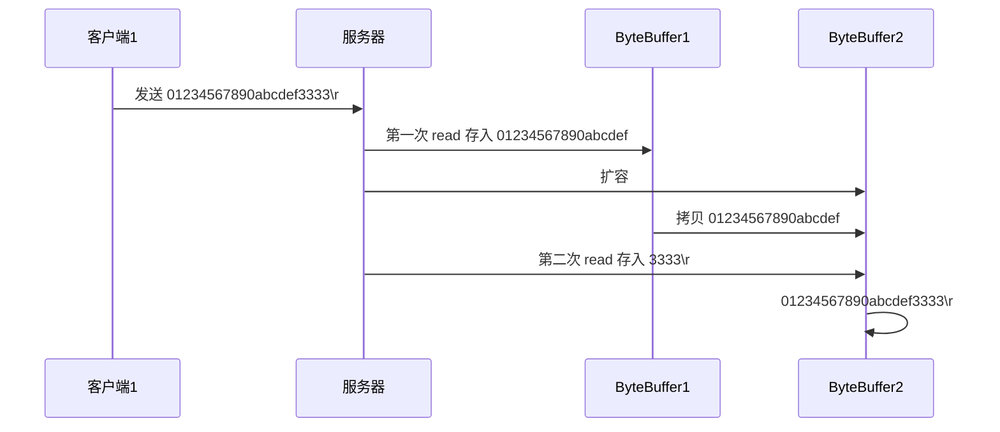

服务器端

```java
private static void split(ByteBuffer source) {
    source.flip();
    for (int i = 0; i < source.limit(); i++) {
        // 找到一条完整消息
        if (source.get(i) == '\n') {
            int length = i + 1 - source.position();
            // 把这条完整消息存入新的 ByteBuffer
            ByteBuffer target = ByteBuffer.allocate(length);
            // 从 source 读，向 target 写
            for (int j = 0; j < length; j++) {
                target.put(source.get());
            }
            debugAll(target);
        }
    }
    source.compact(); // 0123456789abcdef  position 16 limit 16
}

public static void main(String[] args) throws IOException {
    // 1. 创建 selector, 管理多个 channel
    Selector selector = Selector.open();
    ServerSocketChannel ssc = ServerSocketChannel.open();
    ssc.configureBlocking(false);
    // 2. 建立 selector 和 channel 的联系（注册）
    // SelectionKey 就是将来事件发生后，通过它可以知道事件和哪个channel的事件
    SelectionKey sscKey = ssc.register(selector, 0, null);
    // key 只关注 accept 事件
    sscKey.interestOps(SelectionKey.OP_ACCEPT);
    log.debug("sscKey:{}", sscKey);
    ssc.bind(new InetSocketAddress(8080));
    while (true) {
        // 3. select 方法, 没有事件发生，线程阻塞，有事件，线程才会恢复运行
        // select 在事件未处理时，它不会阻塞, 事件发生后要么处理，要么取消，不能置之不理
        selector.select();
        // 4. 处理事件, selectedKeys 内部包含了所有发生的事件
        Iterator<SelectionKey> iter = selector.selectedKeys().iterator(); // accept, read
        while (iter.hasNext()) {
            SelectionKey key = iter.next();
            // 处理key 时，要从 selectedKeys 集合中删除，否则下次处理就会有问题
            iter.remove();
            log.debug("key: {}", key);
            // 5. 区分事件类型
            if (key.isAcceptable()) { // 如果是 accept
                ServerSocketChannel channel = (ServerSocketChannel) key.channel();
                SocketChannel sc = channel.accept();
                sc.configureBlocking(false);
                ByteBuffer buffer = ByteBuffer.allocate(16); // attachment
                // 将一个 byteBuffer 作为附件关联到 selectionKey 上
                SelectionKey scKey = sc.register(selector, 0, buffer);
                scKey.interestOps(SelectionKey.OP_READ);
                log.debug("{}", sc);
                log.debug("scKey:{}", scKey);
            } else if (key.isReadable()) { // 如果是 read
                try {
                    SocketChannel channel = (SocketChannel) key.channel(); // 拿到触发事件的channel
                    // 获取 selectionKey 上关联的附件
                    ByteBuffer buffer = (ByteBuffer) key.attachment();
                    int read = channel.read(buffer); // 如果是正常断开，read 的方法的返回值是 -1
                    if(read == -1) {
                        key.cancel();
                    } else {
                        split(buffer);
                        // 需要扩容
                        if (buffer.position() == buffer.limit()) {
                            ByteBuffer newBuffer = ByteBuffer.allocate(buffer.capacity() * 2);
                            buffer.flip();
                            newBuffer.put(buffer); // 0123456789abcdef3333\n
                            key.attach(newBuffer);
                        }
                    }

                } catch (IOException e) {
                    e.printStackTrace();
                    key.cancel();  // 因为客户端断开了,因此需要将 key 取消（从 selector 的 keys 集合中真正删除 key）
                }
            }
        }
    }
}
```

客户端

```java
SocketChannel sc = SocketChannel.open();
sc.connect(new InetSocketAddress("localhost", 8080));
SocketAddress address = sc.getLocalAddress();
// sc.write(Charset.defaultCharset().encode("hello\nworld\n"));
sc.write(Charset.defaultCharset().encode("0123\n456789abcdef"));
sc.write(Charset.defaultCharset().encode("0123456789abcdef3333\n"));
System.in.read();
```


##### ByteBuffer 大小分配

* 每个 channel 都需要记录可能被切分的消息，因为 ByteBuffer 不能被多个 channel 共同使用，因此需要为每个 channel 维护一个独立的 ByteBuffer
* ByteBuffer 不能太大，比如一个 ByteBuffer 1Mb 的话，要支持百万连接就要 1Tb 内存，因此需要设计大小可变的 ByteBuffer
  * 一种思路是首先分配一个较小的 buffer，例如 4k，如果发现数据不够，再分配 8k 的 buffer，将 4k buffer 内容拷贝至 8k buffer，优点是消息连续容易处理，缺点是数据拷贝耗费性能，参考实现 [http://tutorials.jenkov.com/java-performance/resizable-array.html](http://tutorials.jenkov.com/java-performance/resizable-array.html)
  * 另一种思路是用多个数组组成 buffer，一个数组不够，把多出来的内容写入新的数组，与前面的区别是消息存储不连续解析复杂，优点是避免了拷贝引起的性能损耗


#### 4.5 处理 write 事件


##### 一次无法写完例子

* 非阻塞模式下，无法保证把 buffer 中所有数据都写入 channel，因此需要追踪 write 方法的返回值（代表实际写入字节数）
* 用 selector 监听所有 channel 的可写事件，每个 channel 都需要一个 key 来跟踪 buffer，但这样又会导致占用内存过多，就有两阶段策略
  * 当消息处理器第一次写入消息时，才将 channel 注册到 selector 上
  * selector 检查 channel 上的可写事件，如果所有的数据写完了，就取消 channel 的注册
  * 如果不取消，会每次可写均会触发 write 事件


```java
public class WriteServer {

    public static void main(String[] args) throws IOException {
        ServerSocketChannel ssc = ServerSocketChannel.open();
        ssc.configureBlocking(false);
        ssc.bind(new InetSocketAddress(8080));

        Selector selector = Selector.open();
        ssc.register(selector, SelectionKey.OP_ACCEPT);

        while(true) {
            selector.select();

            Iterator<SelectionKey> iter = selector.selectedKeys().iterator();
            while (iter.hasNext()) {
                SelectionKey key = iter.next();
                iter.remove();
                if (key.isAcceptable()) {
                    SocketChannel sc = ssc.accept();
                    sc.configureBlocking(false);
                    SelectionKey sckey = sc.register(selector, SelectionKey.OP_READ);
                    // 1. 向客户端发送内容
                    StringBuilder sb = new StringBuilder();
                    for (int i = 0; i < 3000000; i++) {
                        sb.append("a");
                    }
                    ByteBuffer buffer = Charset.defaultCharset().encode(sb.toString());
                    int write = sc.write(buffer);
                    // 3. write 表示实际写了多少字节
                    System.out.println("实际写入字节:" + write);
                    // 4. 如果有剩余未读字节，才需要关注写事件
                    if (buffer.hasRemaining()) {
                        // read 1  write 4
                        // 在原有关注事件的基础上，多关注 写事件
                        sckey.interestOps(sckey.interestOps() + SelectionKey.OP_WRITE);
                        // 把 buffer 作为附件加入 sckey
                        sckey.attach(buffer);
                    }
                } else if (key.isWritable()) {
                    ByteBuffer buffer = (ByteBuffer) key.attachment();
                    SocketChannel sc = (SocketChannel) key.channel();
                    int write = sc.write(buffer);
                    System.out.println("实际写入字节:" + write);
                    if (!buffer.hasRemaining()) { // 写完了
                        key.interestOps(key.interestOps() - SelectionKey.OP_WRITE);
                        key.attach(null);
                    }
                }
            }
        }
    }
}
```

客户端

```java
public class WriteClient {
    public static void main(String[] args) throws IOException {
        Selector selector = Selector.open();
        SocketChannel sc = SocketChannel.open();
        sc.configureBlocking(false);
        sc.register(selector, SelectionKey.OP_CONNECT | SelectionKey.OP_READ);
        sc.connect(new InetSocketAddress("localhost", 8080));
        int count = 0;
        while (true) {
            selector.select();
            Iterator<SelectionKey> iter = selector.selectedKeys().iterator();
            while (iter.hasNext()) {
                SelectionKey key = iter.next();
                iter.remove();
                if (key.isConnectable()) {
                    System.out.println(sc.finishConnect());
                } else if (key.isReadable()) {
                    ByteBuffer buffer = ByteBuffer.allocate(1024 * 1024);
                    count += sc.read(buffer);
                    buffer.clear();
                    System.out.println(count);
                }
            }
        }
    }
}
```


##### 💡 write 为何要取消

只要向 channel 发送数据时，socket 缓冲可写，这个事件会频繁触发，因此应当只在 socket 缓冲区写不下时再关注可写事件，数据写完之后再取消关注


#### 4.6 更进一步


##### 💡 利用多线程优化

> 现在都是多核 cpu，设计时要充分考虑别让 cpu 的力量被白白浪费


前面的代码只有一个选择器，没有充分利用多核 cpu，如何改进呢？

分两组选择器

* 单线程配一个选择器，专门处理 accept 事件
* 创建 cpu 核心数的线程，每个线程配一个选择器，轮流处理 read 事件


```java
public class ChannelDemo7 {
    public static void main(String[] args) throws IOException {
        new BossEventLoop().register();
    }


    @Slf4j
    static class BossEventLoop implements Runnable {
        private Selector boss;
        private WorkerEventLoop[] workers;
        private volatile boolean start = false;
        AtomicInteger index = new AtomicInteger();

        public void register() throws IOException {
            if (!start) {
                ServerSocketChannel ssc = ServerSocketChannel.open();
                ssc.bind(new InetSocketAddress(8080));
                ssc.configureBlocking(false);
                boss = Selector.open();
                SelectionKey ssckey = ssc.register(boss, 0, null);
                ssckey.interestOps(SelectionKey.OP_ACCEPT);
                workers = initEventLoops();
                new Thread(this, "boss").start();
                log.debug("boss start...");
                start = true;
            }
        }

        public WorkerEventLoop[] initEventLoops() {
//        EventLoop[] eventLoops = new EventLoop[Runtime.getRuntime().availableProcessors()];
            WorkerEventLoop[] workerEventLoops = new WorkerEventLoop[2];
            for (int i = 0; i < workerEventLoops.length; i++) {
                workerEventLoops[i] = new WorkerEventLoop(i);
            }
            return workerEventLoops;
        }

        @Override
        public void run() {
            while (true) {
                try {
                    boss.select();
                    Iterator<SelectionKey> iter = boss.selectedKeys().iterator();
                    while (iter.hasNext()) {
                        SelectionKey key = iter.next();
                        iter.remove();
                        if (key.isAcceptable()) {
                            ServerSocketChannel c = (ServerSocketChannel) key.channel();
                            SocketChannel sc = c.accept();
                            sc.configureBlocking(false);
                            log.debug("{} connected", sc.getRemoteAddress());
                            workers[index.getAndIncrement() % workers.length].register(sc);
                        }
                    }
                } catch (IOException e) {
                    e.printStackTrace();
                }
            }
        }
    }

    @Slf4j
    static class WorkerEventLoop implements Runnable {
        private Selector worker;
        private volatile boolean start = false;
        private int index;

        private final ConcurrentLinkedQueue<Runnable> tasks = new ConcurrentLinkedQueue<>();

        public WorkerEventLoop(int index) {
            this.index = index;
        }

        public void register(SocketChannel sc) throws IOException {
            if (!start) {
                worker = Selector.open();
                new Thread(this, "worker-" + index).start();
                start = true;
            }
            tasks.add(() -> {
                try {
                    SelectionKey sckey = sc.register(worker, 0, null);
                    sckey.interestOps(SelectionKey.OP_READ);
                    worker.selectNow();
                } catch (IOException e) {
                    e.printStackTrace();
                }
            });
            worker.wakeup();
        }

        @Override
        public void run() {
            while (true) {
                try {
                    worker.select();
                    Runnable task = tasks.poll();
                    if (task != null) {
                        task.run();
                    }
                    Set<SelectionKey> keys = worker.selectedKeys();
                    Iterator<SelectionKey> iter = keys.iterator();
                    while (iter.hasNext()) {
                        SelectionKey key = iter.next();
                        if (key.isReadable()) {
                            SocketChannel sc = (SocketChannel) key.channel();
                            ByteBuffer buffer = ByteBuffer.allocate(128);
                            try {
                                int read = sc.read(buffer);
                                if (read == -1) {
                                    key.cancel();
                                    sc.close();
                                } else {
                                    buffer.flip();
                                    log.debug("{} message:", sc.getRemoteAddress());
                                    debugAll(buffer);
                                }
                            } catch (IOException e) {
                                e.printStackTrace();
                                key.cancel();
                                sc.close();
                            }
                        }
                        iter.remove();
                    }
                } catch (IOException e) {
                    e.printStackTrace();
                }
            }
        }
    }
}
```


##### 💡 如何拿到 cpu 个数

> * Runtime.getRuntime().availableProcessors() 如果工作在 docker 容器下，因为容器不是物理隔离的，会拿到物理 cpu 个数，而不是容器申请时的个数
> * 这个问题直到 jdk 10 才修复，使用 jvm 参数 UseContainerSupport 配置， 默认开启


# 二. Netty 入门


## 1. 概述

### 1.1 Netty 是什么？

```
Netty is an asynchronous event-driven network application framework
for rapid development of maintainable high performance protocol servers & clients.
```

Netty 是一个异步的、基于事件驱动的网络应用框架，用于快速开发可维护、高性能的网络服务器和客户端


### 1.2 Netty 的作者


他还是另一个著名网络应用框架 Mina 的重要贡献者


### 1.3 Netty 的地位

Netty 在 Java 网络应用框架中的地位就好比：Spring 框架在 JavaEE 开发中的地位

以下的框架都使用了 Netty，因为它们有网络通信需求！

* Cassandra - nosql 数据库
* Spark - 大数据分布式计算框架
* Hadoop - 大数据分布式存储框架
* RocketMQ - ali 开源的消息队列
* ElasticSearch - 搜索引擎
* gRPC - rpc 框架
* Dubbo - rpc 框架
* Spring 5.x - flux api 完全抛弃了 tomcat ，使用 netty 作为服务器端
* Zookeeper - 分布式协调框架


### 1.4 Netty 的优势

* Netty vs NIO，工作量大，bug 多
  * 需要自己构建协议
  * 解决 TCP 传输问题，如粘包、半包
  * epoll 空轮询导致 CPU 100%
  * 对 API 进行增强，使之更易用，如 FastThreadLocal => ThreadLocal，ByteBuf => ByteBuffer
* Netty vs 其它网络应用框架
  * Mina 由 apache 维护，将来 3.x 版本可能会有较大重构，破坏 API 向下兼容性，Netty 的开发迭代更迅速，API 更简洁、文档更优秀
  * 久经考验，16年，Netty 版本
    * 2.x 2004
    * 3.x 2008
    * 4.x 2013
    * 5.x 已废弃（没有明显的性能提升，维护成本高）


## 2. Hello World

### 2.1 目标

开发一个简单的服务器端和客户端

* 客户端向服务器端发送 hello, world
* 服务器仅接收，不返回


加入依赖

```xml
<dependency>
    <groupId>io.netty</groupId>
    <artifactId>netty-all</artifactId>
    <version>4.1.39.Final</version>
</dependency>
```


### 2.2 服务器端

```java
new ServerBootstrap()
    // 1. 指定boos group和 worker group
    // boos group和worker group可以使用同一个group
    // .group(new NioEventLoopGroup())
    
    // 分别指定不同的group, NioEventLoopGroup中默认的EventLoop的个数为cpu核心数 * 2
    // boss group可以不指定eventloop的个数, 因为只会有一个ServerScoket, 相当于只会提交一个任务到线程池中
    // 这里worker group里面有两个线程
    .group(new NioEventLoopGroup(), new NioEventLoopGroup(2))
    // 2. 指定服务器的ServerSocketChannel实现
    .channel(NioServerSocketChannel.class) 
    // 3. 给连接过来的新的SocketChannel的pipeline添加handler
    .childHandler(new ChannelInitializer<NioSocketChannel>() { 
        // 这个handler专门给新连接过来的SocketChannel添加其他handler
        // 这个方法只有在有新链接过来的时候才会调用
        protected void initChannel(NioSocketChannel ch) {
            // 添加一个String的解码器, 客户端发送过来的消息会保存在ByteBuf中, 这个编码器就是ByteBuf => String
            ch.pipeline().addLast(new StringDecoder());
            // 添加第二个handler, 用来处理StringDecoder解析出来的消息
            ch.pipeline().addLast(new SimpleChannelInboundHandler<String>() { 
                @Override
                protected void channelRead0(ChannelHandlerContext ctx, String msg) {
                    System.out.println(msg);
                }
            });
        }
    })
    .bind(8080); // 绑定到8080端口
```

一般情况下, 如果你只绑定一个端口, 那么只会有一个ServerSocketChannel, 尽管你可以设置BossGroup中的线程数为10, 也只会使用其中的一个线程来处理这个ServerSocketChannel, 其他线程都是空着的

除非是你的应用需要占用多个端口, 那么每个端口都有一个ServerSocketChannel和Selector, 此时你可以调大BossGroup的线程数


### 2.3 客户端

```java
new Bootstrap()
    // 1. 指定BossEventLoop和WorkerEventLoop的类型, 这里使用的是NioEventLoop
    .group(new NioEventLoopGroup()) 
    // 2. 指定客户端的SocketChannel的实现类
    .channel(NioSocketChannel.class) 
    // 3. 给连接服务器成功的SocketChannel的pipeline添加handler
    .handler(new ChannelInitializer<Channel>() { 
        @Override
        protected void initChannel(Channel ch) {
            // 添加一个String的编码器, 用于将String转换为ByteBuf
            ch.pipeline().addLast(new StringEncoder()); 
        }
    })
    // 4. 指定服务器的地址
    .connect("127.0.0.1", 8080) 
    .sync() // 5 堵塞直到连接服务器成功
    .channel() // 6 获取SocketChannel
    .writeAndFlush(new Date() + ": hello world!"); // 写入消息并清空缓冲区
```


### 2.4 流程梳理

上面代码按照如下流程执行: 


### 2.5 理解

连接请求的

* 把 channel 理解为数据的通道
* 把 msg 理解为流动的数据，最开始输入是 ByteBuf，但经过 pipeline 的加工，会变成其它类型对象，最后输出又变成 ByteBuf
* 把 handler 理解为数据的处理工序
  * 工序有多道，合在一起就是 pipeline，pipeline 负责发布事件（读、读取完成...）传播给每个 handler， handler 对自己感兴趣的事件进行处理（重写了相应事件处理方法）
  * handler 分 Inbound 和 Outbound 两类
* 把 eventLoop 理解为处理数据的工人
  * 工人可以管理多个 channel 的 io 操作，并且一旦工人负责了某个 channel，就要负责到底（绑定）
  * 工人既可以执行 io 操作，也可以进行任务处理，每位工人有任务队列，队列里可以堆放多个 channel 的待处理任务，任务分为普通任务、定时任务
  * 工人按照 pipeline 顺序，依次按照 handler 的规划（代码）处理数据，可以为每道工序指定不同的工人


## 3. 组件

### 3.1 EventLoop

EventLoop 本质是一个EventLoopGroup中的一个线程,  他里面维护了一个Selector用来处理事件，并且在 run 方法中处理 Channel 上源源不断的 io 事件。

它的继承关系比较复杂

* 一条线是继承自 j.u.c.ScheduledExecutorService 因此包含了线程池中所有的方法
* 另一条线是继承自 netty 自己的 OrderedEventExecutor
  * 提供了 boolean inEventLoop(Thread thread) 方法判断一个线程是否属于此 EventLoop
  * 提供了 parent 方法来看看自己属于哪个 EventLoopGroup


### 3.2 EventLoopGroup

EventLoopGroup 是一组 EventLoop，Channel 一般会调用 EventLoopGroup 的 register 方法来绑定其中一个 EventLoop

主要的实现类有:

1. DefaultEventLoopGroup: 能够处理普通任务, 定时任务, 不能处理IO事件, **通常被作为一个线程池用来处理耗时较久的任务**
2. NioEventLoopGroup: 通用的NioEventLoop, 默认的EventLoop的个数为cpu*2, 能够处理io事件, 普通任务, 定时任务
3. EpollEventLoopGroup: linux平台下的专用的Group, 在Linux平台下使用的是多路复用中的边缘触发, 效率高, 而NioEventLoopGroup在linux下的实现就是java原生的Socket, 使用的是水平触发, 
4. KQueueEventLoopGroup: 
5. OioEventLoopGroup: BIO实现的Group

#### EventLoopGroup的绑定能力

EventLoopGroup有一个很特别的能力就是: **如果Channel绑定到了一个EventLoop, 那么后续这个 Channel 上的 io 事件都由此 EventLoop 来处理**（保证了 io 事件处理时的线程安全）

~~~java
new ServerBootstrap()
    .group(new NioEventLoopGroup(1), new NioEventLoopGroup(2))
    .channel(NioServerSocketChannel.class)
    .childHandler(new ChannelInitializer<NioSocketChannel>() {
        @Override
        protected void initChannel(NioSocketChannel ch) {
            ch.pipeline().addLast(new ChannelInboundHandlerAdapter() {
                @Override
                public void channelRead(ChannelHandlerContext ctx, Object msg) {
                    ByteBuf byteBuf = msg instanceof ByteBuf ? ((ByteBuf) msg) : null;
                    if (byteBuf != null) {
                        byte[] buf = new byte[16];
                        ByteBuf len = byteBuf.readBytes(buf, 0, byteBuf.readableBytes());
                        log.debug(new String(buf));
                    }
                }
            });
        }
    }).bind(8080).sync();
~~~

客户端，启动三次，分别修改发送字符串为 zhangsan，lisi，wangwu,  每个名字发送两边, 最后输出

```
-- 客户端1
22:03:34 [DEBUG] [nioEventLoopGroup-3-1] c.i.o.EventLoopTest - zhangsan       
22:03:36 [DEBUG] [nioEventLoopGroup-3-1] c.i.o.EventLoopTest - zhangsan    
-- 客户端2
22:05:36 [DEBUG] [nioEventLoopGroup-3-2] c.i.o.EventLoopTest - lisi           
22:05:38 [DEBUG] [nioEventLoopGroup-3-2] c.i.o.EventLoopTest - lisi       
-- 客户端3
22:06:09 [DEBUG] [nioEventLoopGroup-3-1] c.i.o.EventLoopTest - wangwu        
22:06:11 [DEBUG] [nioEventLoopGroup-3-1] c.i.o.EventLoopTest - wangwu         
```


#### Boss Group和Worker Group隔离

在hello world案例中, 我们使用如下代码创建Server, 此时Boss Group和Worker Group使用的都是同一个Group

~~~java
new ServerBootstrap()
    .group(new NioEventLoopGroup())
    ...
~~~

我们更推荐将Boss Group和Worker Group隔离

此时对于Boss Group我们可以不用指定大小, 虽然他的EventLoop最大个数是cpu*2, 但是我们只有一个ServerSocketChannel, 相当于只会向Boss Group中提交一个任务, 所以他只会有一个线程(线程只有提交任务的时候才会创建)(**EventLoopGroup就是一个线程池**)

~~~java
new ServerBootstrap()
    .group(new NioEventLoopGroup(), new NioEventLoopGroup(3))
    ...
~~~


#### 在其他线程池中处理读写IO事件

在hello world中, 我们使用如下代码来处理IO事件

我们给SocketChannel添加了两个handler, 当有消息来的时候, 这两个handler会在Worker Group中进行执行, 如果handler耗时较久, 那么就会堵塞住相关联的EventLoop

~~~java
new ServerBootstrap()
    .group(new NioEventLoopGroup(), new NioEventLoopGroup(2))
    .channel(NioServerSocketChannel.class) 
    .childHandler(new ChannelInitializer<NioSocketChannel>() { 
        protected void initChannel(NioSocketChannel ch) {
            ch.pipeline().addLast(new StringDecoder());
            ch.pipeline().addLast(new SimpleChannelInboundHandler<String>() { 
                @Override
                protected void channelRead0(ChannelHandlerContext ctx, String msg) {
                    System.out.println(msg);
                }
            });
        }
    })
    .bind(8080); // 绑定到8080端口
~~~

所以我们可以让handler在其他线程池中执行, 这样Boos Group中的EventLoop就可以更快的解放

~~~java
// !!!!!创建一个DefaultEventLoopGroup, 用来处理handler
DefaultEventLoopGroup normalWorkers = new DefaultEventLoopGroup(2);

new ServerBootstrap()
    .group(new NioEventLoopGroup(1), new NioEventLoopGroup(2))
    .channel(NioServerSocketChannel.class)
    .childHandler(new ChannelInitializer<NioSocketChannel>() {
        @Override
        protected void initChannel(NioSocketChannel ch)  {
            // handler1使用WorkerGroup中的线程
            // 一旦channel和其中一个EventLoop绑定, 就会一直使用这个EventLoop
            ch.pipeline().addLast("handler1", new ChannelInboundHandlerAdapter(){
                 @Override
                 public void channelRead(ChannelHandlerContext ctx, Object msg) throws Exception {
                         System.out.printf("%s: %s", Thread.currentThread().getName(), ((ByteBuf)msg).toString(StandardCharsets.UTF_8));
                         ctx.fireChannelRead(msg) // 发送给下一个handler
                 }
             });
            // handler2使用DefaultEventLoopGroup中的线程
            ch.pipeline().addLast(normalWorkers, "handler2", new ChannelInboundHandlerAdapter(){
                 @Override
                 public void channelRead(ChannelHandlerContext ctx, Object msg) throws Exception {
                        System.out.printf("%s: %s", Thread.currentThread().getName(), ((ByteBuf)msg).toString(StandardCharsets.UTF_8));
                        ctx.fireChannelRead(msg) // 发送给下一个handler
                  }
            });
        }
    }).bind(8080).sync();
~~~


#### handler 执行中如何换人

关键代码 `io.netty.channel.AbstractChannelHandlerContext#invokeChannelRead()`

```java
static void invokeChannelRead(final AbstractChannelHandlerContext next, Object msg) {
    final Object m = next.pipeline.touch(ObjectUtil.checkNotNull(msg, "msg"), next);
    // next是下一个handler
    // next.executor()返回下一个handler的绑定的EventLoop
    EventExecutor executor = next.executor();
    
    // 判断下一个 handler 的EventLoop是否与当前的handler的EventLoop是不是同一个线程
    // 是，直接调用
    if (executor.inEventLoop()) {
        next.invokeChannelRead(m);
    } 
    // 不是，将要执行的代码作为任务提交给下一个事件循环处理（换人）
    else {
        executor.execute(new Runnable() {
            @Override
            public void run() {
                next.invokeChannelRead(m);
            }
        });
    }
}
```


#### EventLoopGroup提供的其他能力

EventLoopGroup还有其他能力

* 实现了 Iterable 接口提供遍历 EventLoop 的能力

  ~~~java
  DefaultEventLoopGroup group = new DefaultEventLoopGroup(2);
  for (EventExecutor eventLoop : group) {
      System.out.println(eventLoop);
      // io.netty.channel.DefaultEventLoop@60f82f98
      //io.netty.channel.DefaultEventLoop@35f983\a6
  }
  ~~~

  也可以调用group.next() 来获取下一个EventLoop

  ~~~java
  // 内部创建了两个 EventLoop, 每个 EventLoop 维护一个线程
  DefaultEventLoopGroup group = new DefaultEventLoopGroup(2);
  System.out.println(group.next()); // io.netty.channel.DefaultEventLoop@60f82f98
  System.out.println(group.next()); //io.netty.channel.DefaultEventLoop@35f983a6
  ~~~

* 继承自ScheduledExecutorService, 所以有线程池的所有方法

  ~~~java
  NioEventLoopGroup nioWorkers = new NioEventLoopGroup(2);
  nioWorkers.execute(()->{
      log.debug("normal task...");
  });
  nioWorkers.scheduleAtFixedRate(() -> {
      log.debug("running...");
  }, 0, 1, TimeUnit.SECONDS);
  ~~~

  

#### 优雅关闭

优雅关闭 `shutdownGracefully` 方法。该方法会首先切换 `EventLoopGroup` 到关闭状态从而拒绝新的任务的加入，然后在任务队列的任务都处理完成后，停止线程的运行。从而确保整体应用是在正常有序的状态下退


### 3.2 Channel

Channel的实现类型有:

1. EpollServerSocketChannel: 基于Linux的epoll来实现的SocketChannel
2. KQueueServerSocketChannel: 针对mac电脑优化的SocketChannel
3. NioServerSocketChannel: 通用的实现, 基于NIO的实现
4. OioServerSocketChannel: 基于BIO来实现的SocketChannel

channel 的主要作用

* close() 可以用来关闭 channel
* closeFuture() 用来处理 channel 的关闭
  * sync 方法作用是同步等待 channel 关闭
  * 而 addListener 方法是异步等待 channel 关闭
* pipeline() 方法添加处理器
* write() 方法将数据写入
* writeAndFlush() 方法将数据写入并刷出
* flush() 将channel中的数据立刻刷盘出去


#### ChannelFuture

这时刚才的客户端代码

```java
new Bootstrap()
    .group(new NioEventLoopGroup())
    .channel(NioSocketChannel.class)
    .handler(new ChannelInitializer<Channel>() {
        @Override
        protected void initChannel(Channel ch) {
            ch.pipeline().addLast(new StringEncoder());
        }
    })
    .connect("127.0.0.1", 8080)
    .sync()
    .channel()
    .writeAndFlush(new Date() + ": hello world!");
```

现在把它拆开来看

```java
ChannelFuture channelFuture = new Bootstrap()
    .group(new NioEventLoopGroup())
    .channel(NioSocketChannel.class)
    .handler(new ChannelInitializer<Channel>() {
        @Override
        protected void initChannel(Channel ch) {
            ch.pipeline().addLast(new StringEncoder());
        }
    }).connect("127.0.0.1", 8080); 

channelFuture.sync().channel().writeAndFlush(new Date() + ": hello world!");
```

**注意** connect 方法会将建立连接的任务交给WorkerGroup中的EventLoop去执行, 并且不等待连接建立成功就返回了。因此 channelFuture 对象中不能【立刻】获得到正确的 Channel 对象

所以我们需要调用sync()方法来堵塞直到连接建立成功

除了用 sync 方法可以让异步操作同步以外，还可以使用回调的方式：

~~~java
ChannelFuture channelFuture = new Bootstrap()
    .group(new NioEventLoopGroup())
    .channel(NioSocketChannel.class)
    .handler(new ChannelInitializer<Channel>() {
        @Override
        protected void initChannel(Channel ch) {
            ch.pipeline().addLast(new StringEncoder());
        }
    })
    .connect("127.0.0.1", 8080);
channelFuture.addListener((ChannelFutureListener) future -> {
    // 这段代码在boss group的eventloop中调用
    Channel channel = future.channel();
    channel.writeAndFlush("hello world")
});
~~~


#### CloseFuture

```java
@Slf4j
public class CloseFutureClient {
    public static void main(String[] args) throws InterruptedException {
        NioEventLoopGroup group new NioEventLoopGroup();
        ChannelFuture channelFuture = new Bootstrap()
                .group(group)
                .channel(NioSocketChannel.class)
                .handler(new ChannelInitializer<NioSocketChannel>() {
                    @Override // 在连接建立后被调用
                    protected void initChannel(NioSocketChannel ch) throws Exception {
                        ch.pipeline().addLast(new LoggingHandler(LogLevel.DEBUG));
                        ch.pipeline().addLast(new StringEncoder());
                    }
                })
                .connect(new InetSocketAddress("localhost", 8080));
        Channel channel = channelFuture.sync().channel();
        log.debug("{}", channel);
        new Thread(()->{
            Scanner scanner = new Scanner(System.in);
            while (true) {
                String line = scanner.nextLine();
                if ("q".equals(line)) {
                    channel.close(); 
                    // close方法是异步的, 返回的时候并没有真正的关闭, 所以并不能在这里善后
				  // log.debug("处理关闭之后的操作"); 
                    break;
                }
                channel.writeAndFlush(line);
            }
        }, "input").start();

        // 获取 CloseFuture 对象
        ChannelFuture closeFuture = channel.closeFuture();
        // 1) 同步处理关闭
        closeFuture.sync();
        log.debug("处理关闭之后的操作");
        
        // 2) 异步处理关闭
        closeFuture.addListener(new ChannelFutureListener() {
            @Override
            public void operationComplete(ChannelFuture future) throws Exception {
                log.debug("处理关闭之后的操作");
                group.shutdownGracefully();
            }
        });
    }
}
```

#### 异步提升的是什么

* 有些同学看到这里会有疑问：为什么不在一个线程中去执行建立连接、去执行关闭 channel，那样不是也可以吗？非要用这么复杂的异步方式：比如一个线程发起建立连接，另一个线程去真正建立连接

* 还有同学会笼统地回答，因为 netty 异步方式用了多线程、多线程就效率高。其实这些认识都比较片面，多线程和异步所提升的效率并不是所认为的

思考下面的场景，4 个医生给人看病，每个病人花费 20 分钟，而且医生看病的过程中是以病人为单位的，一个病人看完了，才能看下一个病人。假设病人源源不断地来，可以计算一下 4 个医生一天工作 8 小时，处理的病人总数是：`4 * 8 * 3 = 96`


经研究发现，看病可以细分为四个步骤，经拆分后每个步骤需要 5 分钟，如下


因此可以做如下优化，只有一开始，医生 2、3、4 分别要等待 5、10、15 分钟才能执行工作，但只要后续病人源源不断地来，他们就能够满负荷工作，并且处理病人的能力提高到了 `4 * 8 * 12` 效率几乎是原来的四倍


要点

* 异步并没有缩短响应时间，反而有所增加
* 异步+回调才能有效的减少线程的堵塞时间


### 3.3 Future & Promise

在异步处理时，经常用到这两个接口

首先要说明 netty 中的 Future 与 jdk 中的 Future 同名，但是是两个接口，**netty 的 Future 继承自 jdk 的 Future，而 Promise 又对 netty Future 进行了扩展**

* jdk Future 只能同步等待任务结束（或成功、或失败）才能得到结果
* netty Future 可以同步等待任务结束得到结果，也可以异步方式得到结果，但都是要等任务结束
* netty Promise 不仅有 netty Future 的功能，而且脱离了任务独立存在，只作为两个线程间传递结果的容器

| 功能/名称    | jdk Future                     | netty Future                                                 | Promise      |
| ------------ | ------------------------------ | ------------------------------------------------------------ | ------------ |
| cancel       | 取消任务                       | -                                                            | -            |
| isCanceled   | 任务是否取消                   | -                                                            | -            |
| isDone       | 任务是否完成，不能区分成功失败 | -                                                            | -            |
| get          | 获取任务结果，阻塞等待         | -                                                            | -            |
| getNow       | -                              | 获取任务结果，非阻塞，还未产生结果时返回 null                | -            |
| await        | -                              | 等待任务结束，如果任务失败，不会抛异常，而是通过 isSuccess 判断 | -            |
| sync         | -                              | 等待任务结束，如果任务失败，抛出异常                         | -            |
| isSuccess    | -                              | 判断任务是否成功                                             | -            |
| cause        | -                              | 获取失败信息，非阻塞，如果没有失败，返回null                 | -            |
| addLinstener | -                              | 添加回调，异步接收结果                                       | -            |
| setSuccess   | -                              | -                                                            | 设置成功结果 |
| setFailure   | -                              | -                                                            | 设置失败结果 |

同步处理任务成功

```java
DefaultEventLoop eventExecutors = new DefaultEventLoop();
DefaultPromise<Integer> promise = new DefaultPromise<>(eventExecutors);

eventExecutors.execute(()->{
    try {
        Thread.sleep(1000);
    } catch (InterruptedException e) {
        promise.setFailure(e);
    }
    promise.setSuccess(10);
});

log.debug("start...");
log.debug("{}",promise.getNow()); // 还没有结果
log.debug("{}",promise.get());
```

输出

```
11:51:53 [DEBUG] [main] c.i.o.DefaultPromiseTest2 - start...
11:51:53 [DEBUG] [main] c.i.o.DefaultPromiseTest2 - null
11:51:54 [DEBUG] [defaultEventLoop-1-1] c.i.o.DefaultPromiseTest2 - set success, 10
11:51:54 [DEBUG] [main] c.i.o.DefaultPromiseTest2 - 10
```


### Promise和ProgressivePromise

在netty中, Promise的作用是用来监听某个动作是否成功, 通常都是用在写数据的时候, 监听数据输出成功

~~~java
// write方法会返回一个promise, 你也可以通过ctx.newPromise()来创建一个
ctx.channel().write("hello").addListener(new GenericFutureListener<Future<? super Void>>() {
    @Override
    public void operationComplete(Future<? super Void> future) throws Exception {
        if (future.isSuccess()) {
            System.out.println("write success");
        }
    }
})
~~~

但是在一些特定的操作下, 你不仅可以监听写操作的完成, 你还可以监听写操作的进度, 这可以通过添加一个ChannelProgressivePromise来监听

~~~java
File file = new File("large.zip");
RandomAccessFile raf = new RandomAccessFile(file, "r");
ChunkedFile chunkedFile = new ChunkedFile(raf);

ChannelProgressivePromise promise = ctx.newProgressivePromise();
ctx.writeAndFlush(new HttpChunkedInput(chunkedFile), promise);

promise.addListener(new ChannelProgressiveFutureListener() {
    public void operationProgressed(ChannelProgressiveFuture future, long progress, long total) {
        System.out.println("上传进度: " + progress + "/" + total);
    }

    public void operationComplete(ChannelProgressiveFuture future) {
        System.out.println("上传完成！");
    }
});
~~~

**什么时候可以使用ProgressiveFuture**

当你执行的是一个**普通的数据写操作**，比如写 `ByteBuf`、`String`、`POJO` 等，没有任何 handler 去上报进度时，就不会触发进度通知。

如果你在使用ChunkedWriteHandler写文件,  或者使用DefaultFileRegion传输文件, 那么可以使用ProgressiveFuture来监听进度


### 3.4 Handler & Pipeline

ChannelHandler 用来处理 Channel 上的各种事件，分为入站、出站两种。所有 ChannelHandler 被连成一串，就是 Pipeline

* 入站处理器通常是 ChannelInboundHandlerAdapter 的子类，主要用来读取客户端数据，写回结果
* 出站处理器通常是 ChannelOutboundHandlerAdapter 的子类，主要对写回结果进行加工

打个比喻，每个 Channel 是一个产品的加工车间，Pipeline 是车间中的流水线，ChannelHandler 就是流水线上的各道工序，而后面要讲的 ByteBuf 是原材料，经过很多工序的加工：先经过一道道入站工序，再经过一道道出站工序最终变成产品

先搞清楚顺序，服务端

```java
new ServerBootstrap()
    .group(new NioEventLoopGroup())
    .channel(NioServerSocketChannel.class)
    .childHandler(new ChannelInitializer<NioSocketChannel>() {
        protected void initChannel(NioSocketChannel ch) {
            ch.pipeline().addLast(new ChannelInboundHandlerAdapter(){
                @Override
                public void channelRead(ChannelHandlerContext ctx, Object msg) {
                    System.out.println(1);
                    ctx.fireChannelRead(msg); // 发送input消息到下一个handler
                }
            });
            ch.pipeline().addLast(new ChannelInboundHandlerAdapter(){
                @Override
                public void channelRead(ChannelHandlerContext ctx, Object msg) {
                    System.out.println(2);
                    ctx.fireChannelRead(msg); // 2
                }
            });
            ch.pipeline().addLast(new ChannelInboundHandlerAdapter(){
                @Override
                public void channelRead(ChannelHandlerContext ctx, Object msg) {
                    System.out.println(3);
                    ctx.channel().write(msg); // 3写出消息,并发送tail的前一个handler
                }
            });
            ch.pipeline().addLast(new ChannelOutboundHandlerAdapter(){
                @Override
                public void write(ChannelHandlerContext ctx, Object msg, 
                                  ChannelPromise promise) {
                    System.out.println(4);
                    ctx.write(msg, promise); // 4 写出消息, 发送给前一个handler
                }
            });
            ch.pipeline().addLast(new ChannelOutboundHandlerAdapter(){
                @Override
                public void write(ChannelHandlerContext ctx, Object msg, 
                                  ChannelPromise promise) {
                    System.out.println(5);
                    ctx.write(msg, promise); // 5写出消息, 发送给前一个handler
                }
            });
            ch.pipeline().addLast(new ChannelOutboundHandlerAdapter(){
                @Override
                public void write(ChannelHandlerContext ctx, Object msg, 
                                  ChannelPromise promise) {
                    System.out.println(6);
                    ctx.write(msg, promise); // 6写出消息, 发送给前一个handler
                }
            });
        }
    })
    .bind(8080);
```

客户端

```java
new Bootstrap()
    .group(new NioEventLoopGroup())
    .channel(NioSocketChannel.class)
    .handler(new ChannelInitializer<Channel>() {
        @Override
        protected void initChannel(Channel ch) {
            ch.pipeline().addLast(new StringEncoder());
        }
    })
    .connect("127.0.0.1", 8080)
    .addListener((ChannelFutureListener) future -> {
        future.channel().writeAndFlush("hello,world");
    });
```

服务器端打印：

```
123654
```

可以看到，**ChannelInboundHandlerAdapter 是按照 addLast 的顺序执行的，即他是从head开始遍历的**

**而 ChannelOutboundHandlerAdapter 是按照 addLast 的逆序执行的, 即是从tail开始遍历的**。

ChannelPipeline 的实现是一个 ChannelHandlerContext（包装了 ChannelHandler） 组成的**双向链表**, 其中的head和tail是内部的两个特殊的Handler

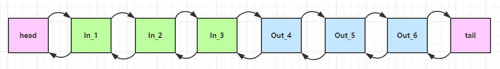

对于入站的消息, 我们可以调用 `ctx.fireChannelRead(msg) `或者`super.channelRead(ctx, msg)`来将消息发送当前InboundHandler给下一个InboundHandler

* 如果注释掉 2 处代码，则仅会打印 1 2

* 3 处的 ctx.channel().write(msg) 会 **从tail开始触发** 后续出站处理器的执行

**同时我们可以调用`ctx.channel().write(msg)`来发送一条消息到tail的前一个handler**

**调用`ctx.write(msg)`或者`super.write(ctx, msg, promise)`来将消息发送给当前OutboundHandler的前一个OutboundHandler**

- 如果注释掉 3 处代码，则仅会打印 1 2 3, 应为没有消息发送到入站处理器

* 3 处的 ctx.channel().write(msg) 如果改为 ctx.write(msg) 仅会打印 1 2 3，因为节点3 之前没有其它出站处理器了
* 6 处的 ctx.write(msg, promise) 如果改为 ctx.channel().write(msg) 会打印 1 2 3 6 6 6... 因为 ctx.channel().write() 是从尾部开始查找，结果又是节点6 自己

图1 - 服务端 pipeline 触发的原始流程，图中数字代表了处理步骤的先后次序

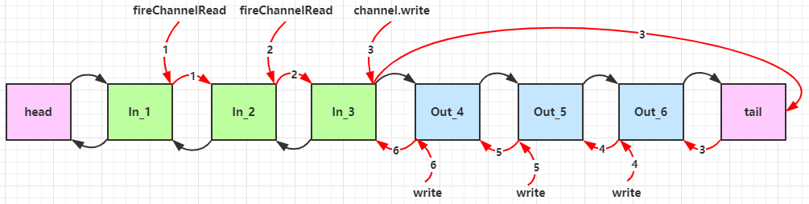


#### EmbeddedChannel

这是一个内嵌的用来测试的Channel, 有了他之后就不需要通过客户端的调用来测试了

~~~java
@Slf4j
public class TestEmbeddedChannel {
    public static void main(String[] args) {
        ChannelInboundHandlerAdapter h1 = new ChannelInboundHandlerAdapter() {
            @Override
            public void channelRead(ChannelHandlerContext ctx, Object msg) throws Exception {
                log.debug("1");
                super.channelRead(ctx, msg);
            }
        };
        ChannelInboundHandlerAdapter h2 = new ChannelInboundHandlerAdapter() {
            @Override
            public void channelRead(ChannelHandlerContext ctx, Object msg) throws Exception {
                log.debug("2");
                super.channelRead(ctx, msg);
            }
        };
        ChannelOutboundHandlerAdapter h3 = new ChannelOutboundHandlerAdapter() {
            @Override
            public void write(ChannelHandlerContext ctx, Object msg, ChannelPromise promise) throws Exception {
                log.debug("3");
                super.write(ctx, msg, promise);
            }
        };
        ChannelOutboundHandlerAdapter h4 = new ChannelOutboundHandlerAdapter() {
            @Override
            public void write(ChannelHandlerContext ctx, Object msg, ChannelPromise promise) throws Exception {
                log.debug("4");
                super.write(ctx, msg, promise);
            }
        };
        EmbeddedChannel channel = new EmbeddedChannel(h1, h2, h3, h4);
        // 模拟入站操作
//        channel.writeInbound(ByteBufAllocator.DEFAULT.buffer().writeBytes("hello".getBytes()));
        // 模拟出站操作
        channel.writeOutbound(ByteBufAllocator.DEFAULT.buffer().writeBytes("world".getBytes()));

    }
}
~~~


### 3.5 ByteBuf

扩容, discardReadBytes来释放已读取的空间

是对jdk中的ByteBuffer的封装, 可以动态扩容, 每次扩容翻倍

#### 结构

ByteBuf 由四部分组成

- max capacity: 最大容量, 默认为Integer.Max, 超过了这个数就不能再扩容了,  可以在构造时指定
- capacity: 当前buffer的容量, 如果写满了就会扩容, 最开始默认为256
- write index: 下一个可写的位置, 最开始为0, 从write index到capacity是可写的字节
- read index: 下一个可读的位置, 最开始为0, 从read index到write index是可读的字节
- 从0到read index是已读的被废弃的字节


#### 分类

ByteBuf从内存的角度看可以分为两类

- 直接内存的ByteBuf

  **直接内存的分配和回收速度慢一些,  但读写性能高, 因为底层是内核中的一块内存, 通过mmap的方式映射到了JVM内存上, 相当于使用了零拷贝技术, 在IO读写时可以少一次内存复制**

- 堆内存的ByteBuf

  **堆内存分配效率高, 因为已经通过jvm申请了,  但是在io读写的时候, 需要多进行一次拷贝**

  **因为在io的时候, 要求内存地址不能变动, JVM的gc会整理对象到内存头部, 这会导致基于堆内存的ByteBuf的地址变动, 所以在io的时候要将堆内存中的数据拷贝到直接内存中, 然后在进行io**

**经验表明, 如果ByteBuf是需要直接配合Channel进行读写的, 那么推荐使用PooledDirectByteBuf, 如果是用于编解码, 业务数据等其他情况的话, 使用UnpooledHeapByteBuf好, 分配回收快, 不会出现内存问题**


从内存回收角度看, ByteBuf可以分为池化和非池化的

- 池化的ByteBuf

  可以循环利用, 提高内存的使用率, 较低了高负载导致的频繁gc

- 非池化的ByteBuf

  使用简单


ByteBuf的主要继承结构如下

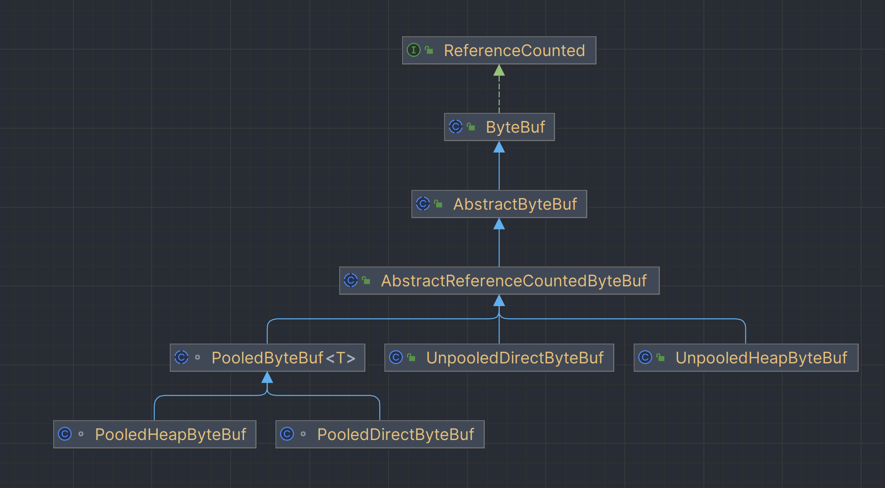

具体的实现类有: 

- PooledDirectByteBuf
- PooledHeapByteBuf
- UnpooledDirectByteBuf
- UnpooledHeapByteBuf


#### ByteBufAllocator

ByteBufAllocator主要用于创建ByteBuf,  ByteBufAllocator的实现类有两种

- PooledByteBufAllocator: 用于分配池化的ByteBuf
- UnpooledByteBufAllocator: 用于分配非池化的ByteBuf

ByteBufAllocator的api如下:

| 方法名称                                           | 返回值说明       | 功能                                                         |
| -------------------------------------------------- | ---------------- | ------------------------------------------------------------ |
| buffer()                                           | ByteBuf          | 创建一个初始容量为256, 最大容量为Int最大值的ByteBuf, 根据`preferDirect`属性来决定是否是直接内存,  是否池化根据Allocator类型决定 |
| buffer(int initialCapacity)                        | ByteBuf          | 同上, 只不过指定了初始容量                                   |
| bufer(int initialCapacity,int maxCapacity)         | ByteBuf          | 同上, 只不过指定了初始容量和最大容量                         |
| ioBufer(int initialCapacity,int maxCapacity)       | ByteBuf          | 创建一个直接内存的ByteBuf, 是否池化根据Allocator类型决定     |
| heapBuffer(int initialCapacity, int maxCapacity)   | ByteBuf          | 创建一个对内存的ByteBuf, 是否池化根据Allocator类型决定       |
| directBuffer(int initialCapacity, int maxCapacity) | ByteBuf          | 创建一个直接内存的ByteBuf, , 是否池化根据Allocator类型决定   |
| compositeBuffer(int maxNumComponents)              | CompositeByteBuf | 分配一个最大容量为maxCapacity的CompositeByteBuf,内存类型由 ByteBufAllocator 的实现类决定 |
| isDirectBuferPooled()                              | boolean          | 判断创建的直接内存是否是池化的                               |

需要注意的是:

- **创建的Buffer是否是池化的, 是根据Allocator的类型来决定了**

- **在Allocator中有一个`preferDirect`属性,  他决定了`buffer()`方法创建的ByteBuf是否使用直接内存**

  ~~~java
  // 创建一个池化的, preferDirect为true的分配器
  PooledByteBufAllocator pooledByteBufAllocator = new PooledByteBufAllocator(true);
  ByteBuf buf = pooledByteBufAllocator.buffer(); // 创建一个池化的直接内存的ByteBuf
  
  // 创建一个非池化的, preferDirect为true的分配器
  UnpooledByteBufAllocator unpooledByteBufAllocator = new UnpooledByteBufAllocator(true);
  ByteBuf buf1 = pooledByteBufAllocator.buffer(); // 创建一个池化的直接内存的ByteBuf
  ~~~

- 同时`PooledByteBufAllocator, UnpooledByteBufAllocator, ByteBufAllocator `他们都有一个`static final DEFAULT`属性, 是对应类型的实例

  ~~~java
  // 池化的ByteBuf分配器  
  PooledByteBufAllocator defaultPooledByteAllocator = PooledByteBufAllocator.DEFAULT;
  // 非池化的ByteBuf分配器
  UnpooledByteBufAllocator defaultUnpooledByteBufAllocator = UnpooledByteBufAllocator.DEFAULT;
  
  ByteBufAllocator defaultByteBufAllocator = ByteBufAllocator.DEFAULT;
  ~~~

  - PooledByteBufAllocator.DEFAULT用于分配池化的内存,  UnpooledByteBufAllocator.DEFAULT用于分配非池化的内存

  - PooledByteBufAllocator.DEFAULT和UnpooledByteBufAllocator.DEFAULT中的`preferDirect`属性

    在安卓平台强制等于false

    在其他平台默认等于true,  可以通过`-Dio.netty.noPreferDirect={false | true}`来控制

  - ByteBufAllocator.DEFAULT默认情况下

    在安卓平台等效于`UnpooledByteBufAllocator.DEFAULT`

    在非安卓平台等效于`PooledByteBufAllocator.DEFAULT`

    也可以通过`-Dio.netty.allocator.type={unpooled | pooled | adaptive}`来控制


#### 创建ByteBuf

创建ByteBuf有三种方式:

- 手动new一个Allocator,  然后通过他来创建ByteBuf

  不推荐使用这种, 因为这种方式是自己创建了一个ByteBufAllocator, 与netty内部使用的不是同一个Allocator

  会导致内存控制不当

  ~~~java
  // 创建一个池化的, preferDirect为true的分配器
  PooledByteBufAllocator pooledByteBufAllocator = new PooledByteBufAllocator(true);
  ByteBuf buf = pooledByteBufAllocator.buffer(); // 创建一个池化的直接内存的ByteBuf
  
  // 创建一个非池化的, preferDirect为true的分配器
  UnpooledByteBufAllocator unpooledByteBufAllocator = new UnpooledByteBufAllocator(true);
  ByteBuf buf1 = pooledByteBufAllocator.buffer(); // 创建一个池化的直接内存的ByteBuf
  ~~~

- 通过PooledByteBufAllocator.DEFAULT, UnpooledByteBufAllocator.DEFAULT, ByteBufAllocator.DEFAULT来创建

  推荐使用这种, 因为默认情况下, netty在进行io的时候, 就是通过调用`ByteBufAllocator.DEFAULT.ioBuffer()`

  使用同一个Allocator对象, 能够统一的管理内存

  ~~~java
          ByteBuf byteBuf = PooledByteBufAllocator.DEFAULT.ioBuffer(); // 池化的直接内存
          ByteBuf byteBuf1 = UnpooledByteBufAllocator.DEFAULT.heapBuffer(10, 20); // 非池化的堆内存
  
          ByteBuf byteBuf2 = ByteBufAllocator.DEFAULT.ioBuffer(10, 20); // 池化的直接内存
  ~~~

- 如果是在handler中, 推荐使用ctx来创建

  ~~~java
  ByteBufAllocator byteBufAllocator = ctx.alloc;
  byteBufAllocator.buffer();
  ~~~


#### 顺序读

~~~java
skipBytes(int length) // 跳过指定字节, 增加readerIndex

boolean readBoolean() // 从readerIndex开始获取boolean值，readerIndex增加1
byte readByte() // 从readerIndex开始获取字节值，readerlndex增加1
byte readUnsignedByte() // 从readerIndex开始获取无符号字节值，readerlndex增加1
short readShort() // 从readerlndex开始获取短整型值，readerIndex增加2 
short readUnsignedShort() // 从readerIndex开始获取无符号短整型值，readerIndex增加2
int readInt() // 从readerlndex开始获取整型值，readerlndex增加4
int readUnsignedint() // 从readerlndex开始获取无符号整型值，readerIndex增加4
char readChar() // 从readerIndex开始获取字符值，readerlndex增加2
float readFloat()  // 从readerIndex开始获取浮点值，readerIndex增加4 
double readDouble() // )从readerIndex开始获取双精度浮点值，readerlndex增加8
long readLong() // 从readerIndex开始获取长整型值，readerIndex增加8

/**
	以下方法都返回this
*/
// 从当前buf中读取指定length的字节, 到新的ByteBuf中并返回, 如果src中可读字节小于length, 报错, 返回this
ByteBuf readBytes(int length) 

// 将src中的字节读取到dst中，直到dst中没有剩余的空间可写
// 操作完成之后，当前ByteBuf的readcrlndex+=读取的字节数
// 如果目标ByteBuf可写的字节数大于当前ByteBuf可读取的字节数，则抛出IndexOutOfBoundsException，操作失败
ByteBuf readBytes(ByteBuf dst)

// 读取length字节到dst中, 如果src中可读字节不够, 或者dst中的可写字节不够, 报错
ByteBuf readBytes(ByteBuf dst, int length)
// 读取length字节到dst的dstIndex下标中, 如果src中可读字节不够, 或者dst中的可写字节不够, 报错
ByteBuf readBytes(ByteBufdst,int dstIndex, int length)
// 将src中的字节读取到dst中, 读取的字节为dst.length, 如果可读字节不够, 报错
ByteBuf readBytes(byte[] dst) 
// 将src中的字节读取到dst中dstIndex的下标中, 长度为length, 如果可读字节不够, 报错
ByteBuf readBytes(byte[] dst, int dstIndex, int length)
// 将src中的字节读取到dst中, 直到dst的limit, 如果src中的可读字节不够, 报错
ByteBuf readBytes(ByteBuffer dst) 
// 读取length字节到out中, 如果src中可读字节不够, 报错 
ByteBuf readBytes(OutputStream out, int length)
~~~


#### 顺序写

顺序写操作可以调用`writeXXX`来完成, 并且他们返回的都是this, 可以进行链式调用

~~~java
writeBoolean(boolean value)
writeByte(int value)
writeShort(int value)
writeInt(int value)
writeLong(long value)
writeChar(int value)
writeBytes(ByteBuf src) // 将src中所有可读字节写入到dst中, 如果dst中可写字节不够, 报错
writeBytes(ByteBuf src, int length) // 将src中length可读字节写入到dst中, 如果dst中可写字节不够, 报错
writeBytes(ByteBuf src, int srcIndex,int length) // 读取src中srcIndex下标的length字节到dst中, 如果src可读字节不够, 或者dst中可写字节不够, 报错
writeBytes(byte[] src) // 将src中的所有字节写到dst中, 如果dst可写字节不够, 报错
writeBytes(byte[] src, int srcIndex, int length) // 读取length长度的src中srcIndex下标的字节到dst中, 如果src中可读字节, 或者dst中可写字节不够, 报错
writeBytes(ByteBuffer src) // 将src中所有可读字节写入到dst中, 如果dst中可写字节不够, 报错
writeBytes(InputStream in, int length) // 将in中length字节写入到dst中, 如果dst中可写字节不够, 报错
writeZero(int length) // 写入length字节的0x00到dst中
~~~


#### 随机读写

需要注意的是

1. **随机写会覆盖原来的内容, 而不是后移**
2. **随机写的时候, 无法扩容, 所以不要超过了缓冲区的界限**
3. **随机读写不会导致ridx和widx的变动**

随机读可以调用`getXXX`来完成


随机写可以调用`setXXX`来完成, 常用的使用场景是在代码的最后用来设置消息的长度

~~~java
sendBuf.setInt(4, sendBuf.readableBytes());
~~~


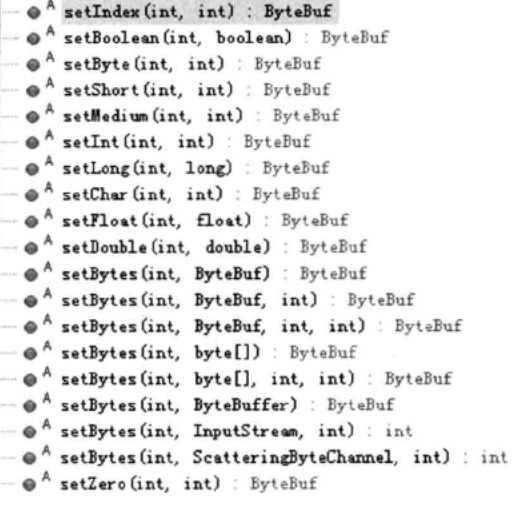

#### 扩容

ByteBuf能够自动扩容, 当调用顺序写的时候, 如果需要的空间不够, 那么就会执行扩容

扩容规则是

* 如何写入后数据大小未超过 512，则扩容到16的整数倍, 比如写入后大小为30, 那么扩容到32
* 如果写入后数据大小超过 512，则选择到2^n，例如写入后大小为 513，则扩容后 capacity 是 2^10=1024（2^9=512 已经不够了）
* 扩容不能超过 max capacity 会报错


#### 复制操作

##### copy

~~~java
// 复制当前ByteBuf指定的字节和长度, 不会当前ByteBuf的ridx和widx
// 返回的ByteBuf的ridx=0, widx=length, capacity=length, maxCapacity=原来的maxCapacity
// 两个ByteBuf在底层上不是同一块内存, 修改相互不影响
copy(int index, int length)
  
// 等效于buf.copy(buf.readerIndex(), buf.readableBytes())
// 返回的ByteBuf的ridx=0, widx=buf.readableBytes(), capacity=buf.readableBytes()
copy() 
~~~

##### slice

【零拷贝】的体现之一，对原始 ByteBuf 上进行切片

- 切片后的 ByteBuf 维护独立的 read，write, capacity, max capacity 指针
- **slice创建的bytebuf和原来的bytebuf共用一片内存地址, 修改会相互影响**
- **<font color=red>slice只能读取, 随机写, 而不能顺序写, 同时也不能扩容</font>**
- **<font color=red>对于retainedSlice()创建的ByteBuf, 使用完毕之后, 一定要记得release掉</font>**

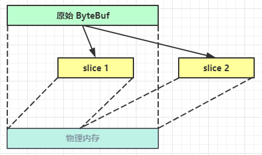

关于slice的操作有

```java
// 在原ByteBuf上建立slice, ridx=0, widx=length, capacity=length, maxCapacity=length
ByteBuf.slice(int index, index length)
    
// 等效于buf.slice(buf.readerIndex(), buf.readableBytes())
ByteBuf.slice()
    
// 等效于buf1 = buf.slice(); buf1.retain()
// 所以在使用的时候, 要记得使用完毕之后需要调用buf1.release()来将引用计数器减1, 否则会导致内存泄露
ByteBuf.retainedSlice()

// 等效于buf1 = buf.slice(index, length); buf1.retain()
// 所以在使用的时候, 要记得使用完毕之后需要调用buf1.release()来将引用计数器减1, 否则会导致内存泄露
ByteBuf.retainedSlice(int index, int length)
```


下面是slice的使用案例

```java
ByteBuf byteBuf = PooledByteBufAllocator.DEFAULT.ioBuffer(21); // 池化的直接内存
byteBuf.writeBytes("hello_world".getBytes(StandardCharsets.UTF_8));
logBuffer(byteBuf); // ridx=0, widx=11, capacity=21, maxCapacity=Integer.MAX

ByteBuf slice = byteBuf.slice(5, 15);
logBuffer(slice); // ridx=0, widx=15, capacity=15, maxCapacity=15

slice.setByte(0, 'A'); // 不能顺序写, 只能随机写, 因为widx=capacity
logBuffer(slice);
```


##### duplicate

【零拷贝】的体现之一，在原来的ByteBuf的内存上建立一个新的一模一样的ByteBuf

- 因为使用的是同一块内存地址, 所有修改会相互影响
- **创建出来的新的ByteBuf的ridx, widx, capacity, maxCapacity都和原来的相同**
- **<font color=red>能够扩容, 能够顺序读写, 能够随机读写</font>**
- **不管两个ByteBuf怎么扩容, 都使用的是同一批地址, 所以如果一个ByteBuf先扩容, 然后写数据, 另外一个ByteBuf后扩容, 那么扩容出来的空间实际上是有数据的**
- **如果是使用retainedDuplicate创建出来的, 那么记得在用完的时候, 一定要release**


duplicate相关的api有如下这些

~~~java
// 等效于buf.duplicate(buf.readerIndex(), buf.readableBytes())
ByteBuf.duplicate()
    
// 等效于buf1 = buf.duplicate(); buf1.retain()
// 所以在使用的时候, 要记得使用完毕之后需要调用buf1.release()来将引用计数器减1, 否则会导致内存泄露
ByteBuf.retainedDuplicate()
~~~


#### 查找操作

~~~java
// 从fromIndex到toIndex中查找value, 找不到返回-1
indexOf(int fromIndex,int toIndex,byte value)
// 同上, 起始位置为ridx, 结束位置为widx
bytesBefore(byte value)
// 同上, 起始位置为ridx, 结束位置为ridx+length
bytesBefore(int length, byte value)
// 同上, 起始位置为index, 结束位置为index+length
bytesBefore(int index, int length, byte value)
    
// 遍历当前 ByteBuf的可读字节数组，与ByteBufProcessor 设置的查找条件进行对比。如果满足条件，则返回位置索引，否则返回-1。
forEachByte(ByteBufProcessor processor)
// 同上, 起始位置为index, 结束位置为index+length
forEachByte(int index,int length,ByteBufProcessor processor)
    

forEachByteDesc(ByteBufProcessor processor) // 同上, 但是迭代的属性是从后到前
forEachByteDesc(int index, int length, ByteBufProcessor processor)
~~~


#### 其他操作

1. 释放已读空间

   调用`discardReadBytes`会将ridx到widx这段可读字节复制到数组头部, 然后设置ridx和widx

   频繁调用会导致内存数组频繁复制, 导致性能下降

2. Clear操作

   clear不会清空内存, 只会重置ridx和widx

3. Mark和Reset

   当对缓冲区读写时, 有时可能需要回滚读写操作, 那么就可以使用mark和reset

   ByteBuf中提供了四个方法:

   1. markReaderIndex: 保存ridx到markedReaderIndex中
   2. resetReaderIndex: 将markedReaderIndex设置到ridx中
   3. markWriterIndex: 将widx备份到 markedWriterlndex
   4. resetWriterlndex:将markedWriterlndex设置到widx中


#### 转换为ByteBuffer

~~~~java
// 在当前ByteBuf的可读缓冲区上建立一个ByteBuffer
ByteBuffer nioBuffer()
// 在当前ByteBuf的index到index+length上建立一个ByteBuffer
ByteBuffer nioBuffer(int index, int length)
~~~~


#### CompositeByteBuf

【零拷贝】的体现之一，可以将多个 ByteBuf 合并为一个逻辑上的 ByteBuf，避免拷贝

有两个 ByteBuf 如下

```java
ByteBuf buf1 = ByteBufAllocator.DEFAULT.buffer(5);
buf1.writeBytes(new byte[]{1, 2, 3, 4, 5});
ByteBuf buf2 = ByteBufAllocator.DEFAULT.buffer(5);
buf2.writeBytes(new byte[]{6, 7, 8, 9, 10});
```

现在需要一个新的 ByteBuf，内容来自于刚才的 buf1 和 buf2，如何实现？

方法1: 这种方式不太好，因为进行了数据的内存复制操作

```java
ByteBuf buf3 = ByteBufAllocator.DEFAULT
    .buffer(buf1.readableBytes()+buf2.readableBytes());
buf3.writeBytes(buf1);
buf3.writeBytes(buf2);
System.out.println(ByteBufUtil.prettyHexDump(buf3));
```

方法2：逻辑合并

```java
CompositeByteBuf buf3 = ByteBufAllocator.DEFAULT.compositeBuffer();
// true 表示增加新的 ByteBuf 时自动递增 write index, 否则 write index 会始终为 0
buf3.addComponents(true, buf1, buf2);
```

CompositeByteBuf 是一个组合的 ByteBuf，它内部维护了一个 Component 数组，每个 Component 管理一个 ByteBuf，记录了这个 ByteBuf 相对于整体偏移量等信息，代表着整体中某一段的数据。

* 优点，对外是一个虚拟视图，组合这些 ByteBuf 不会产生内存复制
* 缺点，复杂了很多，多次操作会带来性能的损耗


#### Unpooled

Unpooled 是一个工具类，类如其名，提供了非池化的 ByteBuf 创建、组合、复制等操作

这里仅介绍其跟【零拷贝】相关的 wrappedBuffer 方法，可以用来包装 ByteBuf

```java
ByteBuf buf1 = ByteBufAllocator.DEFAULT.buffer(5);
buf1.writeBytes(new byte[]{1, 2, 3, 4, 5});
ByteBuf buf2 = ByteBufAllocator.DEFAULT.buffer(5);
buf2.writeBytes(new byte[]{6, 7, 8, 9, 10});

// 当包装 ByteBuf 个数超过一个时, 底层使用了 CompositeByteBuf
ByteBuf buf3 = Unpooled.wrappedBuffer(buf1, buf2); // 01 02 03 04 05 06 07 08 09 0a
```

也可以用来包装普通字节数组，底层也不会有拷贝操作

```java
ByteBuf buf4 = Unpooled.wrappedBuffer(new byte[]{1, 2, 3}, new byte[]{4, 5, 6});
System.out.println(buf4.getClass()); // 01 02 03 04 05 06
```


### netty的内存管理

说到netty的内存管理, 我们先来看看ByteBuffer对内存的使用是怎么样的

#### ByteBuffer

ByteBuffer是JDK提供的, 可以用于对SocketChannel的读写

ByteBuffer有两个具体的子类实现

- HeapByteBuffer

  可以通过如下方式创建

  ~~~java
          // 将堆内存写到channel中
          ByteBuffer heapBuffer = ByteBuffer.allocate(10);
          heapBuffer.put("hello".getBytes(StandardCharsets.UTF_8));
          socketChannel.write(heapBuffer);
          // 方式2, 使用的是堆内存
          socketChannel.write(ByteBuffer.wrap("hello".getBytes(StandardCharsets.UTF_8)));
  ~~~

  **使用HeapByteBuffer的时候, 不需要考虑回收, 在gc的时候会自动回收**

- DirectByteBuffer

  可以通过如下方式创建

  ~~~java
          // 将直接内存写到channel中
          ByteBuffer directBuffer = ByteBuffer.allocateDirect(10);
          directBuffer.put("hello".getBytes(StandardCharsets.UTF_8));
          socketChannel.write(directBuffer);
  ~~~

  **在使用DirectByteBuffer的时候, 不需要考虑回收, 在gc的时候会自动回收**

  **同时推荐使用`ByteBuffer.allocateDirect()`来进行io读写, 使用直接内存可以减少一次io拷贝, 因为在socketChannel进行读写的时候, 要求内存地址不能变, 而gc的整理会造成HeapByteBuffer的内存地址变动, 所以使用HeapByteBuffer的时候, JVM底层会多一次内存拷贝**


#### DirectByteBuffer为什么不需要手动释放

首先在jvm中, 分配直接内存和释放直接内存是通过Unsafe中的如下函数来实现的:

~~~java
        // 获取Unsafe.theUnsafe属性, 他是一个Unsafe的单例对象
		Field field = Unsafe.class.getDeclaredField("theUnsafe");
        field.setAccessible(true); // Unsafe只有系统自带的类可以调用, 所有需要通过反射调用
        Unsafe unsafe = (Unsafe) field.get(null); // 获取 Unsafe 实例

        long address = unsafe.allocateMemory(1024 * 1024); // 分配直接内存
        unsafe.freeMemory(address); // 释放直接内存
~~~

在通过`ByteBuffer.allocateDirect(10)`的时候, 会通过`unsafe.allocateMemory()`来分配直接内存

同时还是调用`Cleaner.create(this, new Deallocator(base, size, cap));`来创建一个回调函数

**这个Cleaner的作用是告诉JVM, 在this被gc的时候, 调用`Deallocator`的`run`方法, 在run方法中调用`unsafe.freeMemory()**`

~~~java
    // 省略部分代码...
	public static ByteBuffer allocateDirect(int capacity) {
        return new DirectByteBuffer(capacity);
    }    
	DirectByteBuffer(int cap) {                   // package-private
        try {
            // 通过unsafe来分配内存
            base = unsafe.allocateMemory(size);
        } catch (OutOfMemoryError x) {
            Bits.unreserveMemory(size, cap);
            throw x;
        }
        // 传入this, 告诉JVM, gc回收this的时候回调Deallocator的run()方法
        cleaner = Cleaner.create(this, new Deallocator(base, size, cap));
    }
    private static class Deallocator implements Runnable {
        
        private static Unsafe unsafe = Unsafe.getUnsafe();
        public void run() {
            if (address == 0) {
                return;
            }
            unsafe.freeMemory(address); // 释放内存
            address = 0;
            Bits.unreserveMemory(size, capacity);
        }
    }
~~~

这样的话, 在使用DirectByteBuffer的时候, 就不需要手动释放内存了

可以通过下面这个案例来测试

- 在使用JVM的时候, 可以通过`-XX:MaxDirectMemorySize=100M -Xmx100M -Xms100M`来指定堆内存和直接内存的大小

- 可以在VisualVM的插件中安装`VisualVM-BufferMonitor`来查看直接内存的使用量

~~~java
  public static void main(String[] args) {
        int i = 0;
        while (true) {
            i++;
            // 堆内存, gc自动管理
            ByteBuffer buffer = ByteBuffer.allocate(1024 * 1024);
            // 内部有Cleaner管理, 在gc的时候会回收直接内存
            ByteBuffer buffer1 = ByteBuffer.allocateDirect(1024 * 1024);
            
            if (i % 70 == 0) {
                System.gc();
            }
        }
    }
~~~


#### ByteBuf的内存管理

Netty 采用了引用计数法来对ByteBuf进行计数, 看看有多少个ByteBuf引用着底层的内存

每种类型的 ByteBuf 都实现了 ReferenceCounted 接口

- 当ByteBuf创建的时候, 会为ByteBuf分配一块内存, 根据具体的实现可能是堆内存也可能是直接内存, 同时引用计数器的初始值为1,  表示有一个ByteBuf引用着底层的内存
- 调用方法`retain`计数会加1, 表示多了一个对应引用底层的内存

* 调用 `release` 方法计数减 1，如果计数为 0，ByteBuf 内存被回收
* 当计数为 0 时，底层内存会被回收，这时即使 ByteBuf 对象还在，其各个方法均无法正常使用

在ByteBuf中, 有如下的方法需要注意

- duplicate, slice, readSlice都会在原来的内存上再建立一个ByteBuf对象

  但是调用这些方法不会导致refCnt增加, 同时他们公用同一个refCnt, 所以我们只需要管理好原来的ByteBuf即可, 新创建出来的ByteBuf对象不需要管理
  
  **如果要把这些衍生ByteBuf传递给其他函数时，必须要主动调用retain()函数, 并且在不需要使用的时候手动release**

~~~java
        ByteBuf buffer = PooledByteBufAllocator.DEFAULT.directBuffer();
        buffer.writeBytes("hello world, hello world".getBytes(StandardCharsets.UTF_8));

        // 此时buffer和其他三个变量共享一个区域, 同时底层也是使用的同一个refCnt
        // 这是我们只需要管理好buffer的声明周期就行了, 在不需要使用他的时候release掉就行了, 其他三个也会release掉
        // 适用于不需要管理独立生命周期的场景。
        ByteBuf duplicate = buffer.duplicate();
        ByteBuf slice = buffer.slice(0, 5);
        ByteBuf readSlice = buffer.readSlice(5);
        logRefCount(buffer, duplicate, slice, readSlice); // 1111

        buffer.release(); // 释放掉buffer, 此时duplicate, slice, readSlice也会变得不可用
        logRefCount(buffer, duplicate, slice, readSlice); // 0000
~~~

~~~java
    public static void logRefCount(ByteBuf... bufs){
        for (ByteBuf buf : bufs) {
            System.out.print(buf.refCnt());
        }
        System.out.println();
    }
~~~

- retainedDuplicate, retainedSlice, readRetainedSlice也会在原来的ByteBuf上建立一个新的ByteBuf, 两者公用同一块内存
- 调用这些方法会导致原来的ByteBuf的refCnt加一,  同时新建的ByteBuf有他们各种独立的引用计数器
- 调用这些新建的ByteBuf的release方法, 不仅会导致他们自己的refCnt减一, 同时也会导致原来的ByteBuf的refCnt减一
- 需要注意的是: ByteBuf in = (ByteBuf) super.decode(ctx,inByteBuf) 调用decode函数时，会调用到buffer.retainedSlice(index, length)函数, 所以记得release

~~~java
    public static void test2() {
        ByteBuf buffer1 = PooledByteBufAllocator.DEFAULT.directBuffer();
        buffer1.writeBytes("hello world, hello world".getBytes(StandardCharsets.UTF_8));
        // 此时buffer和其他三个变量共享一个区域, 但是调用这些函数会导致buffer的refCnt加1
        // 这些副本有独立的生命周期，但释放副本时会减少原始缓冲区的引用计数。
        // 适用于需要长时间独立使用副本，并管理其生命周期的场景。
        ByteBuf retainedDuplicate = buffer1.retainedDuplicate(); // 会导致buffer的refCnt加1, 同时自己的refCnt是独立的, 为1
        logRefCount(buffer, retainedDuplicate); // 21

        ByteBuf retainedSlice = buffer1.retainedSlice(0, 5); // 会导致buffer的refCnt加1, 同时自己的refCnt是独立的, 为1
        logRefCount(buffer, retainedDuplicate, retainedSlice); // 311

        ByteBuf readRetainedSlice = buffer1.readRetainedSlice(5); // 会导致buffer的refCnt加1, 同时自己的refCnt是独立的, 为1
        logRefCount(buffer, retainedDuplicate, retainedSlice, readRetainedSlice); // 4111

        retainedDuplicate.release(); // 释放掉retainedDuplicate, 此时retainedDuplicate变得不可用, 同时buffer的refCnt也会减1
        logRefCount(buffer, retainedDuplicate, retainedSlice, readRetainedSlice); // 3011

        retainedSlice.release(); // 释放掉retainedSlice, 此时retainedSlice变得不可用, 同时buffer的refCnt也会减1
        logRefCount(buffer, retainedDuplicate, retainedSlice, readRetainedSlice); // 2001

        readRetainedSlice.release(); // 释放掉readRetainedSlice, 此时readRetainedSlice变得不可用, 同时buffer的refCnt也会减1
        logRefCount(buffer, retainedDuplicate, retainedSlice, readRetainedSlice); // 1000

        buffer1.release(); // 释放掉buffer1, 此时buffer1变得不可用
        logRefCount(buffer, retainedDuplicate, retainedSlice, readRetainedSlice); // 0000
    }
~~~

#### 谁来释放ByteBuf

谁来负责 release 呢？

不是我们想象的（一般情况下）

```java
ByteBuf buf = ...
try {
    ...
} finally {
    buf.release();
}
```

请思考，因为 pipeline 的存在，一般需要将 ByteBuf 传递给下一个 ChannelHandler，如果在 finally 中 release 了，就失去了传递性（当然，如果在这个 ChannelHandler 内这个 ByteBuf 已完成了它的使命，那么便无须再传递）

基本规则是，<font color=red>**谁是最后使用者，谁负责 release**</font>

假设有如下pipeline, 其中3个Inbound, 3个Outbound

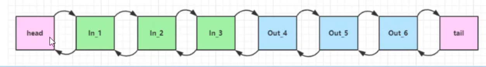

如果有一个入站的ByteBuf

- 如果In_1处理之后将buf传到In_2, 那么In_1就不需要处理release

- 如果In_2没有将buf传给In_3, 那么他就需要处理release

- 如果In_2传给了In_3, 并且In_3传给了tail, 那么tail也会在内部调用release

  ~~~java
  final class TailContext extends AbstractChannelHandlerContext implements ChannelInboundHandler {
          
      @Override
      public void channelRead(ChannelHandlerContext ctx, Object msg) {
          onUnhandledInboundMessage(ctx, msg);
      }
      
      protected void onUnhandledInboundMessage(ChannelHandlerContext ctx, Object msg) {
          onUnhandledInboundMessage(msg);
          if (logger.isDebugEnabled()) {
              logger.debug("Discarded message pipeline : {}. Channel : {}.",
                           ctx.pipeline().names(), ctx.channel());
          }
      }
      
      protected void onUnhandledInboundMessage(Object msg) {
          try {
              logger.debug(
                      "Discarded inbound message {} that reached at the tail of the pipeline. " +
                              "Please check your pipeline configuration.", msg);
          } finally {
              // 通过工具类释放掉ByteBuf
              ReferenceCountUtil.release(msg);
          }
      }
  }
  
  class ReferenceCountUtil {
      public static boolean release(Object msg) {
          // 判断是不是ReferenceCounted, 这个是ByteBuf的父接口
          if (msg instanceof ReferenceCounted) {
              return ((ReferenceCounted) msg).release();
          }
          return false;
      }
  }
  ~~~

对于一个出站的ByteBuf, 也是一样的, 如果这个buf最后传到了head, 那么head也会在内部把它release

~~~java
final class HeadContext extends AbstractChannelHandlerContext
            implements ChannelOutboundHandler, ChannelInboundHandler {

   private final Unsafe unsafe;
   @Override
   public void write(ChannelHandlerContext ctx, Object msg, ChannelPromise promise) {
            unsafe.write(msg, promise);
        }
    }

        @Override
        public final void write(Object msg, ChannelPromise promise) {
     		// ... 
            int size;
            try {
                msg = filterOutboundMessage(msg);
                size = pipeline.estimatorHandle().size(msg);
                if (size < 0) {
                    size = 0;
                }
            } catch (Throwable t) {
                try {
                    // 是否掉内存
                    ReferenceCountUtil.release(msg);
                } finally {
                    safeSetFailure(promise, t);
                }
                return;
            }
            // 把消息添加到outboundBuffer
            outboundBuffer.addMessage(msg, size, promise);
        }
~~~

如果我们没有将一个ByteBuf向后传递, 那么我们自己就要向上面一样, 调用`ReferenceCountUtil.release(ByteBuf)`方法来释放掉


#### 内存限制

如果使用的是DirectBuffer

- 可以通过`-XX:MaxDirectMemorySize=2G`来指定能够使用的内存大小

- 如果没有指定, 默认情况下与堆内存大小一致, 可以通过`-Xms100M`来限制堆内存大小, 间接限制直接内存大小

- 你也可以通过如下代码来获取最大能够使用的直接内存大小

  ~~~java
      public static void main(String[] args) {
          long maxDirectMemory = VM.maxDirectMemory();
          System.out.println("Max Direct Memory: " + maxDirectMemory / (1024 * 1024) + " MB");
      }
  ~~~

- 源码在

  ~~~java
  class Bits {
      private static volatile long MAX_MEMORY = VM.maxDirectMemory();
      private static boolean tryReserveMemory(long size, int cap) {
  
          // 通过-XX:MaxDirectMemorySize=2G来限制大小
          long totalCap;
          while (cap <= MAX_MEMORY - (totalCap = TOTAL_CAPACITY.get())) {
  			// ... 
          }
          return false;
      }
  }
  ~~~

如果使用的是netty

- 可以通过`-Dio.netty.maxDirectMemory=2G`来限制直接内存的大小

- 如果没有设置, 那么会继承JDK的直接内存限制, 可以通过`-XX:MaxDirectMemorySize=2G`来限制JDK的直接内存限制

- 如果没有设置JDK的直接内存限制, 那么默认的直接内存限制就是堆内存大小, 可以通过`-Xmx:2G`来限制堆内存大小

- 你可以通过如下代码来获取netty的直接内存大小

  ~~~java
  public static void main(String[] args) {
      // netty的直接内存大小
      System.out.println("Netty Max Direct Memory: " + PlatformDependent.maxDirectMemory() + " bytes");
      // JDK的直接内存大小
      long maxDirectMemory = VM.maxDirectMemory();
      System.out.println("Max Direct Memory: " + maxDirectMemory / (1024 * 1024) + " MB");
      }
  ~~~
  
- 可以通过如下代码来打印已经使用的直接内存大小
  
~~~javva
  PlatformDependent.usedDirectMemory()
~~~


#### 直接内存OOM导致程序假死的问题

netty的直接内存底层还是使用的DirectByteBuffer

DirectByteBuffer(int cap)构造方法中才会初始化Cleaner对象，方法中检查当前内存是否超过允许的最大堆外内存，如果直接内存分配超出限制后，则会先尝试将不可达的Reference对象加入Reference链表中，依赖Reference的内部守护线程触发可以被回收DirectByteBuffer关联的Cleaner的run()方法

如果内存还是不足， 则执行 System.gc()，触发full gc，来回收堆内存中的DirectByteBuffer对象来触发堆外内存回收，如果还是超过限制，则抛出java.lang.OutOfMemoryError(代码位于`java.nio.Bits#reserveMemory()`方法)。

所以这样就导致了一个恶性循环，qps高 =》 直接内存满 =》触发full gc =》 jvm stw =》堆内存中的DirectByteBuffer对象释放慢 =》 直接内存满 =》触发full gc  =》 ……。

  

  

  

  

#### 内存泄露

Netty提供了一种内存泄露检测机制，可以通过配置参数不同选择不同的检测级别，参数设置为`java -Dio.netty.leakDetection.level=advanced`

- `DISABLED` ：完全禁用内存泄露检测，不推荐
- `SIMPLE` ：抽样1%的ByteBuf，提示是否有内存泄露
- `ADVANCED` ：抽样1%的ByteBuf，提示哪里产生了内存泄露
- `PARANOID` ：对每一个ByteBu进行检测，提示哪里产生了内存泄露

我在测试时，直接提示了ByteBuf内存泄露的位置，如下，找到自己程序代码，看哪里有新生成的ByteBuf对象没有释放，主动释放一下，调用对象的release()函数，或者用工具类帮助释放ReferenceCountUtil.release(msg)。

```
2020-06-12 17:04:41.242 [nioEventLoopGroup-2-1] ERROR io.netty.util.ResourceLeakDetector - LEAK: ByteBuf.release() was not called before it's garbage-collected. See https://netty.io/wiki/reference-counted-objects.html for more information.
Recent access records: 
Created at:
    io.netty.buffer.PooledByteBufAllocator.newDirectBuffer(PooledByteBufAllocator.java:363)
    io.netty.buffer.AbstractByteBufAllocator.directBuffer(AbstractByteBufAllocator.java:187)
    io.netty.buffer.AbstractByteBufAllocator.buffer(AbstractByteBufAllocator.java:123)
    io.netty.buffer.AbstractByteBuf.readBytes(AbstractByteBuf.java:872)
    com.spring.netty.twg.service.TwgMessageDecoder.formatDecoder(TwgMessageDecoder.java:176)
    com.spring.netty.twg.service.TwgMessageDecoder.getMessageBody(TwgMessageDecoder.java:90)
    com.spring.netty.twg.service.TwgMessageDecoder.decode(TwgMessageDecoder.java:76)
    io.netty.handler.codec.LengthFieldBasedFrameDecoder.decode(LengthFieldBasedFrameDecoder.java:332)
    io.netty.handler.codec.ByteToMessageDecoder.decodeRemovalReentryProtection(ByteToMessageDecoder.java:501)
```

```
2020-06-12 17:04:45.460 [nioEventLoopGroup-2-1] ERROR io.netty.util.ResourceLeakDetector - LEAK: ByteBuf.release() was not called before it's garbage-collected. See https://netty.io/wiki/reference-counted-objects.html for more information.
Recent access records: 
Created at:
    io.netty.buffer.SimpleLeakAwareByteBuf.unwrappedDerived(SimpleLeakAwareByteBuf.java:143)
    io.netty.buffer.SimpleLeakAwareByteBuf.retainedSlice(SimpleLeakAwareByteBuf.java:57)
    io.netty.handler.codec.LengthFieldBasedFrameDecoder.extractFrame(LengthFieldBasedFrameDecoder.java:498)
    io.netty.handler.codec.LengthFieldBasedFrameDecoder.decode(LengthFieldBasedFrameDecoder.java:437)
    com.spring.netty.twg.service.TwgMessageDecoder.decode(TwgMessageDecoder.java:31)
    io.netty.handler.codec.LengthFieldBasedFrameDecoder.decode(LengthFieldBasedFrameDecoder.java:332)
```


## 4. 双向通信

### 4.1 练习

实现一个 echo server

编写 server

```java
new ServerBootstrap()
    .group(new NioEventLoopGroup())
    .channel(NioServerSocketChannel.class)
    .childHandler(new ChannelInitializer<NioSocketChannel>() {
        @Override
        protected void initChannel(NioSocketChannel ch) {
            ch.pipeline().addLast(new ChannelInboundHandlerAdapter(){
                @Override
                public void channelRead(ChannelHandlerContext ctx, Object msg) {
                    ByteBuf buffer = (ByteBuf) msg;
                    System.out.println(buffer.toString(Charset.defaultCharset()));

                    // 建议使用 ctx.alloc() 创建 ByteBuf, 而不是使用原来的ByteBuf.DEFAULT.allocate()
                    ByteBuf response = ctx.alloc().buffer();
                    response.writeBytes(buffer);
                    ctx.writeAndFlush(response);

                    // 思考：需要释放 buffer 吗
                    // 思考：需要释放 response 吗
                }
            });
        }
    }).bind(8080);
```

编写 client

```java
NioEventLoopGroup group = new NioEventLoopGroup();
Channel channel = new Bootstrap()
    .group(group)
    .channel(NioSocketChannel.class)
    .handler(new ChannelInitializer<NioSocketChannel>() {
        @Override
        protected void initChannel(NioSocketChannel ch) throws Exception {
            ch.pipeline().addLast(new StringEncoder());
            ch.pipeline().addLast(new ChannelInboundHandlerAdapter() {
                @Override
                public void channelRead(ChannelHandlerContext ctx, Object msg) {
                    ByteBuf buffer = (ByteBuf) msg;
                    System.out.println(buffer.toString(Charset.defaultCharset()));

                    // 思考：需要释放 buffer 吗
                }
            });
        }
    }).connect("127.0.0.1", 8080).sync().channel();

channel.closeFuture().addListener(future -> {
    group.shutdownGracefully();
});

new Thread(() -> {
    Scanner scanner = new Scanner(System.in);
    while (true) {
        String line = scanner.nextLine();
        if ("q".equals(line)) {
            channel.close();
            break;
        }
        channel.writeAndFlush(line);
    }
}).start();
```


### 💡 读和写的误解


我最初在认识上有这样的误区，认为只有在 netty，nio 这样的多路复用 IO 模型时，读写才不会相互阻塞，才可以实现高效的双向通信，但实际上，Java Socket 是全双工的：在任意时刻，线路上存在`A 到 B` 和 `B 到 A` 的双向信号传输。即使是阻塞 IO，读和写是可以同时进行的，只要分别采用读线程和写线程即可，读不会阻塞写、写也不会阻塞读


例如

```java
public class TestServer {
    public static void main(String[] args) throws IOException {
        ServerSocket ss = new ServerSocket(8888);
        Socket s = ss.accept();

        new Thread(() -> {
            try {
                BufferedReader reader = new BufferedReader(new InputStreamReader(s.getInputStream()));
                while (true) {
                    System.out.println(reader.readLine());
                }
            } catch (IOException e) {
                e.printStackTrace();
            }
        }).start();

        new Thread(() -> {
            try {
                BufferedWriter writer = new BufferedWriter(new OutputStreamWriter(s.getOutputStream()));
                // 例如在这个位置加入 thread 级别断点，可以发现即使不写入数据，也不妨碍前面线程读取客户端数据
                for (int i = 0; i < 100; i++) {
                    writer.write(String.valueOf(i));
                    writer.newLine();
                    writer.flush();
                }
            } catch (IOException e) {
                e.printStackTrace();
            }
        }).start();
    }
}
```

客户端

```java
public class TestClient {
    public static void main(String[] args) throws IOException {
        Socket s = new Socket("localhost", 8888);

        new Thread(() -> {
            try {
                BufferedReader reader = new BufferedReader(new InputStreamReader(s.getInputStream()));
                while (true) {
                    System.out.println(reader.readLine());
                }
            } catch (IOException e) {
                e.printStackTrace();
            }
        }).start();

        new Thread(() -> {
            try {
                BufferedWriter writer = new BufferedWriter(new OutputStreamWriter(s.getOutputStream()));
                for (int i = 0; i < 100; i++) {
                    writer.write(String.valueOf(i));
                    writer.newLine();
                    writer.flush();
                }
            } catch (IOException e) {
                e.printStackTrace();
            }
        }).start();
    }
}
```


# 三. Netty 进阶

## 1. 粘包与半包

### 1.1 粘包现象

服务端代码

```java
public class HelloWorldServer {
    static final Logger log = LoggerFactory.getLogger(HelloWorldServer.class);
    void start() {
        NioEventLoopGroup boss = new NioEventLoopGroup(1);
        NioEventLoopGroup worker = new NioEventLoopGroup();
        try {
            ServerBootstrap serverBootstrap = new ServerBootstrap();
            serverBootstrap.channel(NioServerSocketChannel.class);
            serverBootstrap.group(boss, worker);
            serverBootstrap.childHandler(new ChannelInitializer<SocketChannel>() {
                @Override
                protected void initChannel(SocketChannel ch) throws Exception {
                    ch.pipeline().addLast(new LoggingHandler(LogLevel.DEBUG));
                    ch.pipeline().addLast(new ChannelInboundHandlerAdapter() {
                       
                        @Override
                        public void channelActive(ChannelHandlerContext ctx) throws Exception {
                            log.debug("connected {}", ctx.channel());
                            super.channelActive(ctx);
                        }

                        @Override
                        public void channelInactive(ChannelHandlerContext ctx) throws Exception {
                            log.debug("disconnect {}", ctx.channel());
                            super.channelInactive(ctx);
                        }
                    });
                }
            });
            ChannelFuture channelFuture = serverBootstrap.bind(8080);
            log.debug("{} binding...", channelFuture.channel());
            channelFuture.sync();
            log.debug("{} bound...", channelFuture.channel());
            channelFuture.channel().closeFuture().sync();
        } catch (InterruptedException e) {
            log.error("server error", e);
        } finally {
            boss.shutdownGracefully();
            worker.shutdownGracefully();
            log.debug("stoped");
        }
    }

    public static void main(String[] args) {
        new HelloWorldServer().start();
    }
}
```

客户端代码希望发送 10 个消息，每个消息是 16 字节

```java
public class HelloWorldClient {
    static final Logger log = LoggerFactory.getLogger(HelloWorldClient.class);
    public static void main(String[] args) {
        NioEventLoopGroup worker = new NioEventLoopGroup();
        try {
            Bootstrap bootstrap = new Bootstrap();
            bootstrap.channel(NioSocketChannel.class);
            bootstrap.group(worker);
            bootstrap.handler(new ChannelInitializer<SocketChannel>() {
                @Override
                protected void initChannel(SocketChannel ch) throws Exception {
                    log.debug("connetted...");
                    ch.pipeline().addLast(new ChannelInboundHandlerAdapter() {
                        // 会在channel连接建立成功后触发
                        @Override
                        public void channelActive(ChannelHandlerContext ctx) throws Exception {
                            log.debug("sending...");
                            Random r = new Random();
                            char c = 'a';
                            for (int i = 0; i < 10; i++) {
                                ByteBuf buffer = ctx.alloc().buffer();
                                buffer.writeBytes(new byte[]{0, 1, 2, 3, 4, 5, 6, 7, 8, 9, 10, 11, 12, 13, 14, 15});
                                ctx.writeAndFlush(buffer);
                            }
                        }
                    });
                }
            });
            ChannelFuture channelFuture = bootstrap.connect("127.0.0.1", 8080).sync();
            channelFuture.channel().closeFuture().sync();

        } catch (InterruptedException e) {
            log.error("client error", e);
        } finally {
            worker.shutdownGracefully();
        }
    }
}
```

服务器端的某次输出，可以看到一次就接收了 160 个字节，而非分 10 次接收

```
08:24:46 [DEBUG] [main] c.i.n.HelloWorldServer - [id: 0x81e0fda5] binding...
08:24:46 [DEBUG] [main] c.i.n.HelloWorldServer - [id: 0x81e0fda5, L:/0:0:0:0:0:0:0:0:8080] bound...
08:24:55 [DEBUG] [nioEventLoopGroup-3-1] i.n.h.l.LoggingHandler - [id: 0x94132411, L:/127.0.0.1:8080 - R:/127.0.0.1:58177] REGISTERED
08:24:55 [DEBUG] [nioEventLoopGroup-3-1] i.n.h.l.LoggingHandler - [id: 0x94132411, L:/127.0.0.1:8080 - R:/127.0.0.1:58177] ACTIVE
08:24:55 [DEBUG] [nioEventLoopGroup-3-1] c.i.n.HelloWorldServer - connected [id: 0x94132411, L:/127.0.0.1:8080 - R:/127.0.0.1:58177]
08:24:55 [DEBUG] [nioEventLoopGroup-3-1] i.n.h.l.LoggingHandler - [id: 0x94132411, L:/127.0.0.1:8080 - R:/127.0.0.1:58177] READ: 160B
         +-------------------------------------------------+
         |  0  1  2  3  4  5  6  7  8  9  a  b  c  d  e  f |
+--------+-------------------------------------------------+----------------+
|00000000| 00 01 02 03 04 05 06 07 08 09 0a 0b 0c 0d 0e 0f |................|
|00000010| 00 01 02 03 04 05 06 07 08 09 0a 0b 0c 0d 0e 0f |................|
|00000020| 00 01 02 03 04 05 06 07 08 09 0a 0b 0c 0d 0e 0f |................|
|00000030| 00 01 02 03 04 05 06 07 08 09 0a 0b 0c 0d 0e 0f |................|
|00000040| 00 01 02 03 04 05 06 07 08 09 0a 0b 0c 0d 0e 0f |................|
|00000050| 00 01 02 03 04 05 06 07 08 09 0a 0b 0c 0d 0e 0f |................|
|00000060| 00 01 02 03 04 05 06 07 08 09 0a 0b 0c 0d 0e 0f |................|
|00000070| 00 01 02 03 04 05 06 07 08 09 0a 0b 0c 0d 0e 0f |................|
|00000080| 00 01 02 03 04 05 06 07 08 09 0a 0b 0c 0d 0e 0f |................|
|00000090| 00 01 02 03 04 05 06 07 08 09 0a 0b 0c 0d 0e 0f |................|
+--------+-------------------------------------------------+----------------+
08:24:55 [DEBUG] [nioEventLoopGroup-3-1] i.n.h.l.LoggingHandler - [id: 0x94132411, L:/127.0.0.1:8080 - R:/127.0.0.1:58177] READ COMPLETE
```


### 1.2 半包现象

客户端代码希望发送 1 个消息，这个消息是 160 字节，代码改为

```java
ByteBuf buffer = ctx.alloc().buffer();
for (int i = 0; i < 10; i++) {
    buffer.writeBytes(new byte[]{0, 1, 2, 3, 4, 5, 6, 7, 8, 9, 10, 11, 12, 13, 14, 15});
}
ctx.writeAndFlush(buffer);
```

为现象明显，服务端修改一下接收缓冲区，其它代码不变

```java
serverBootstrap.option(ChannelOption.SO_RCVBUF, 10);
```

服务器端的某次输出，可以看到接收的消息被分为两节，第一次 20 字节，第二次 140 字节

```
08:43:49 [DEBUG] [main] c.i.n.HelloWorldServer - [id: 0x4d6c6a84] binding...
08:43:49 [DEBUG] [main] c.i.n.HelloWorldServer - [id: 0x4d6c6a84, L:/0:0:0:0:0:0:0:0:8080] bound...
08:44:23 [DEBUG] [nioEventLoopGroup-3-1] i.n.h.l.LoggingHandler - [id: 0x1719abf7, L:/127.0.0.1:8080 - R:/127.0.0.1:59221] REGISTERED
08:44:23 [DEBUG] [nioEventLoopGroup-3-1] i.n.h.l.LoggingHandler - [id: 0x1719abf7, L:/127.0.0.1:8080 - R:/127.0.0.1:59221] ACTIVE
08:44:23 [DEBUG] [nioEventLoopGroup-3-1] c.i.n.HelloWorldServer - connected [id: 0x1719abf7, L:/127.0.0.1:8080 - R:/127.0.0.1:59221]
08:44:24 [DEBUG] [nioEventLoopGroup-3-1] i.n.h.l.LoggingHandler - [id: 0x1719abf7, L:/127.0.0.1:8080 - R:/127.0.0.1:59221] READ: 20B
         +-------------------------------------------------+
         |  0  1  2  3  4  5  6  7  8  9  a  b  c  d  e  f |
+--------+-------------------------------------------------+----------------+
|00000000| 00 01 02 03 04 05 06 07 08 09 0a 0b 0c 0d 0e 0f |................|
|00000010| 00 01 02 03                                     |....            |
+--------+-------------------------------------------------+----------------+
08:44:24 [DEBUG] [nioEventLoopGroup-3-1] i.n.h.l.LoggingHandler - [id: 0x1719abf7, L:/127.0.0.1:8080 - R:/127.0.0.1:59221] READ COMPLETE
08:44:24 [DEBUG] [nioEventLoopGroup-3-1] i.n.h.l.LoggingHandler - [id: 0x1719abf7, L:/127.0.0.1:8080 - R:/127.0.0.1:59221] READ: 140B
         +-------------------------------------------------+
         |  0  1  2  3  4  5  6  7  8  9  a  b  c  d  e  f |
+--------+-------------------------------------------------+----------------+
|00000000| 04 05 06 07 08 09 0a 0b 0c 0d 0e 0f 00 01 02 03 |................|
|00000010| 04 05 06 07 08 09 0a 0b 0c 0d 0e 0f 00 01 02 03 |................|
|00000020| 04 05 06 07 08 09 0a 0b 0c 0d 0e 0f 00 01 02 03 |................|
|00000030| 04 05 06 07 08 09 0a 0b 0c 0d 0e 0f 00 01 02 03 |................|
|00000040| 04 05 06 07 08 09 0a 0b 0c 0d 0e 0f 00 01 02 03 |................|
|00000050| 04 05 06 07 08 09 0a 0b 0c 0d 0e 0f 00 01 02 03 |................|
|00000060| 04 05 06 07 08 09 0a 0b 0c 0d 0e 0f 00 01 02 03 |................|
|00000070| 04 05 06 07 08 09 0a 0b 0c 0d 0e 0f 00 01 02 03 |................|
|00000080| 04 05 06 07 08 09 0a 0b 0c 0d 0e 0f             |............    |
+--------+-------------------------------------------------+----------------+
08:44:24 [DEBUG] [nioEventLoopGroup-3-1] i.n.h.l.LoggingHandler - [id: 0x1719abf7, L:/127.0.0.1:8080 - R:/127.0.0.1:59221] READ COMPLETE
```

> **注意**
>
> serverBootstrap.option(ChannelOption.SO_RCVBUF, 10) 影响的底层接收缓冲区（即滑动窗口）大小，仅决定了 netty 读取的最小单位，netty 实际每次读取的一般是它的整数倍


### 1.3 现象分析

粘包

* 现象，发送 abc def，接收 abcdef

* 原因

  * 应用层：接收方 ByteBuf 设置太大（Netty 默认 1024）, 导致多个消息都缓存在了buf中, 这样一次read会读取到多个消息

    可以通过`serverBootStrap.childOption(ChannelOption.RCVBUF_ALLOCATOTOR, new AdaptiveRecvByteBufAllocator(16, 16, 16))`来设置最小值, 初始值, 最大值

  * 滑动窗口：假设发送方 256 bytes 表示一个完整报文，但由于接收方处理不及时且窗口大小足够大，这 256 bytes 字节就会缓冲在接收方的滑动窗口中，当滑动窗口中缓冲了多个报文就会粘包

    可以通过netty的`serverBootStrap.option(ChannelOption.SO_RCVBUF, 10)`来设置滑动窗口的大小

    **滑动窗口的大小调整, 一般由客户端和服务器自主协商, 并且在过程中会自适应调整**

  * Nagle 算法：当数据太小的时候, 会将多个消息合并到一个tcp消息中

半包

* 现象，发送 abcdef，接收 abc def

* 原因

  * 应用层：接收方 ByteBuf 小于实际发送数据量

  * 滑动窗口：假设接收方的窗口只剩了 128 bytes，发送方的报文大小是 256 bytes，这时放不下了，只能先发送前 128 bytes，等待 ack 后才能发送剩余部分，这就造成了半包

    可以通过netty的`bootStrap.option(ChannelOption.SO_SNDBUF, 10)`来设置滑动窗口的大小

    **滑动窗口的大小调整, 一般由客户端和服务器自主协商, 并且在过程中会自适应调整**

  * MSS 限制：当发送的数据超过 MSS 限制后，会将数据切分为多个tcp消息，就会造成半包


本质是因为 TCP 是流式协议，消息无边界


> 滑动窗口
>
> * TCP 以一个段（segment）为单位，每发送一个段就需要进行一次确认应答（ack）处理，但如果这么做，缺点是包的往返时间越长性能就越差
>
>   
>
> 
>
> * 为了解决此问题，引入了窗口概念，窗口大小即决定了无需等待应答而可以继续发送的数据最大值
>
>   
>
> * 窗口实际就起到一个缓冲区的作用，同时也能起到流量控制的作用
>
>   * 图中深色的部分即要发送的数据，高亮的部分即窗口
>   * 窗口内的数据才允许被发送，当应答未到达前，窗口必须停止滑动
>   * 如果 1001~2000 这个段的数据 ack 回来了，窗口就可以向前滑动
>   * 接收方也会维护一个窗口，只有落在窗口内的数据才能允许接收


>  MSS 限制
>
>  * 链路层对一次能够发送的最大数据有限制，这个限制称之为 MTU（maximum transmission unit），不同的链路设备的 MTU 值也有所不同，例如
>
>   * 以太网的 MTU 是 1500
>   * FDDI（光纤分布式数据接口）的 MTU 是 4352
>   * 本地回环地址的 MTU 是 65535 - 本地测试不走网卡
>
>  * MSS 是最大段长度（maximum segment size），它是 MTU 刨去 tcp 头和 ip 头后剩余能够作为数据传输的字节数
>
>   * ipv4 tcp 头占用 20 bytes，ip 头占用 20 bytes，因此以太网 MSS 的值为 1500 - 40 = 1460
>   * TCP 在传递大量数据时，会按照 MSS 大小将数据进行分割发送
>   * MSS 的值在三次握手时通知对方自己 MSS 的值，然后在两者之间选择一个小值作为 MSS
>
>   


> Nagle 算法
>
> * 即使发送一个字节，也需要加入 tcp 头和 ip 头，也就是总字节数会使用 41 bytes，非常不经济。因此为了提高网络利用率，tcp 希望尽可能发送足够大的数据，这就是 Nagle 算法产生的缘由
> * 该算法是指发送端即使还有应该发送的数据，但如果这部分数据很少的话，则进行延迟发送
>   * 如果 SO_SNDBUF 的数据达到 MSS，则需要发送
>   * 如果 SO_SNDBUF 中含有 FIN（表示需要连接关闭）这时将剩余数据发送，再关闭
>   * 如果 TCP_NODELAY = true，则需要发送
>   * 已发送的数据都收到 ack 时，则需要发送
>   * 上述条件不满足，但发生超时（一般为 200ms）则需要发送
>   * 除上述情况，延迟发送


### 1.4 解决方案

1. 短链接，发一个包建立一次连接，这样连接建立到连接断开之间就是消息的边界，缺点效率太低
2. 每一条消息采用固定长度，缺点浪费空间
3. 每一条消息采用分隔符，例如 \n，缺点需要转义
4. 每一条消息分为 head 和 body，head 中包含 body 的长度


#### 方法1，短链接

以解决粘包为例

```java
public class HelloWorldClient {
    static final Logger log = LoggerFactory.getLogger(HelloWorldClient.class);

    public static void main(String[] args) {
        // 分 10 次发送
        for (int i = 0; i < 10; i++) {
            send();
        }
    }

    private static void send() {
        NioEventLoopGroup worker = new NioEventLoopGroup();
        try {
            Bootstrap bootstrap = new Bootstrap();
            bootstrap.channel(NioSocketChannel.class);
            bootstrap.group(worker);
            bootstrap.handler(new ChannelInitializer<SocketChannel>() {
                @Override
                protected void initChannel(SocketChannel ch) throws Exception {
                    log.debug("conneted...");
                    ch.pipeline().addLast(new LoggingHandler(LogLevel.DEBUG));
                    ch.pipeline().addLast(new ChannelInboundHandlerAdapter() {
                        @Override
                        public void channelActive(ChannelHandlerContext ctx) throws Exception {
                            log.debug("sending...");
                            ByteBuf buffer = ctx.alloc().buffer();
                            buffer.writeBytes(new byte[]{0, 1, 2, 3, 4, 5, 6, 7, 8, 9, 10, 11, 12, 13, 14, 15});
                            ctx.writeAndFlush(buffer);
                            // 发完即关
                            ctx.close();
                        }
                    });
                }
            });
            ChannelFuture channelFuture = bootstrap.connect("localhost", 8080).sync();
            channelFuture.channel().closeFuture().sync();

        } catch (InterruptedException e) {
            log.error("client error", e);
        } finally {
            worker.shutdownGracefully();
        }
    }
}
```

输出，略

> 半包用这种办法还是不好解决，因为接收方的缓冲区大小是有限的


#### 方法2，固定长度

缺点是，数据包的大小不好把握

* **长度定的太大，浪费**
* **长度定的太小，对某些数据包又显得不够**

使用固定长度的方式有如下步骤: 

1. 服务器和客户端使用固定的长度, 比如8byte, 那么消息不足8byte需要补齐, 消息不能长于8字节

   所以在选择消息长度的时候, 一定要选消息的最大值

2. 服务器端加入如下代码, 这是一个固定长度的解码器, 他会把8字节作为一个消息

   ~~~java
   ch.pipeline().addLast(new FixedLengthFrameDecoder(8));
   ~~~

3. 客户端使用如下代码:

   客户端测试代码，注意, 采用这种方法后，客户端什么时候 flush 都可以

   ~~~java
   public class HelloWorldClient {
       static final Logger log = LoggerFactory.getLogger(HelloWorldClient.class);
   
       public static void main(String[] args) {
           NioEventLoopGroup worker = new NioEventLoopGroup();
           try {
               Bootstrap bootstrap = new Bootstrap();
               bootstrap.channel(NioSocketChannel.class);
               bootstrap.group(worker);
               bootstrap.handler(new ChannelInitializer<SocketChannel>() {
                   @Override
                   protected void initChannel(SocketChannel ch) throws Exception {
                       ch.pipeline().addLast(new LoggingHandler(LogLevel.DEBUG));
                       ch.pipeline().addLast(new ChannelInboundHandlerAdapter() {
                           @Override
                           public void channelActive(ChannelHandlerContext ctx) throws Exception {
                               Random r = new Random();
                               char c = 'a';
                               ByteBuf buffer = ctx.alloc().buffer();
                               // 发送10次
                               for (int i = 0; i < 10; i++) {
                                   byte[] bytes = new byte[8];
                                   // 填充消息
                                   for (int j = 0; j < r.nextInt(8); j++) {
                                       bytes[j] = (byte) c;
                                   }
                                   c++;
                                   buffer.writeBytes(bytes); // 发送
                               }
                               ctx.writeAndFlush(buffer);
                           }
                       });
                   }
               });
               ChannelFuture channelFuture = bootstrap.connect("192.168.0.103", 9090).sync();
               channelFuture.channel().closeFuture().sync();
   
           } catch (InterruptedException e) {
               log.error("client error", e);
           } finally {
               worker.shutdownGracefully();
           }
       }
   }
   ~~~

客户端输出

```
12:07:00 [DEBUG] [nioEventLoopGroup-2-1] c.i.n.HelloWorldClient - connetted...
12:07:00 [DEBUG] [nioEventLoopGroup-2-1] i.n.h.l.LoggingHandler - [id: 0x3c2ef3c2] REGISTERED
12:07:00 [DEBUG] [nioEventLoopGroup-2-1] i.n.h.l.LoggingHandler - [id: 0x3c2ef3c2] CONNECT: /192.168.0.103:9090
12:07:00 [DEBUG] [nioEventLoopGroup-2-1] i.n.h.l.LoggingHandler - [id: 0x3c2ef3c2, L:/192.168.0.103:53155 - R:/192.168.0.103:9090] ACTIVE
12:07:00 [DEBUG] [nioEventLoopGroup-2-1] c.i.n.HelloWorldClient - sending...
12:07:00 [DEBUG] [nioEventLoopGroup-2-1] i.n.h.l.LoggingHandler - [id: 0x3c2ef3c2, L:/192.168.0.103:53155 - R:/192.168.0.103:9090] WRITE: 80B
         +-------------------------------------------------+
         |  0  1  2  3  4  5  6  7  8  9  a  b  c  d  e  f |
+--------+-------------------------------------------------+----------------+
|00000000| 61 61 61 61 00 00 00 00 62 00 00 00 00 00 00 00 |aaaa....b.......|
|00000010| 63 63 00 00 00 00 00 00 64 00 00 00 00 00 00 00 |cc......d.......|
|00000020| 00 00 00 00 00 00 00 00 66 66 66 66 00 00 00 00 |........ffff....|
|00000030| 67 67 67 00 00 00 00 00 68 00 00 00 00 00 00 00 |ggg.....h.......|
|00000040| 69 69 69 69 69 00 00 00 6a 6a 6a 6a 00 00 00 00 |iiiii...jjjj....|
+--------+-------------------------------------------------+----------------+
12:07:00 [DEBUG] [nioEventLoopGroup-2-1] i.n.h.l.LoggingHandler - [id: 0x3c2ef3c2, L:/192.168.0.103:53155 - R:/192.168.0.103:9090] FLUSH
```

服务端输出

```
12:06:51 [DEBUG] [main] c.i.n.HelloWorldServer - [id: 0xe3d9713f] binding...
12:06:51 [DEBUG] [main] c.i.n.HelloWorldServer - [id: 0xe3d9713f, L:/192.168.0.103:9090] bound...
12:07:00 [DEBUG] [nioEventLoopGroup-3-1] i.n.h.l.LoggingHandler - [id: 0xd739f137, L:/192.168.0.103:9090 - R:/192.168.0.103:53155] REGISTERED
12:07:00 [DEBUG] [nioEventLoopGroup-3-1] i.n.h.l.LoggingHandler - [id: 0xd739f137, L:/192.168.0.103:9090 - R:/192.168.0.103:53155] ACTIVE
12:07:00 [DEBUG] [nioEventLoopGroup-3-1] c.i.n.HelloWorldServer - connected [id: 0xd739f137, L:/192.168.0.103:9090 - R:/192.168.0.103:53155]
12:07:00 [DEBUG] [nioEventLoopGroup-3-1] i.n.h.l.LoggingHandler - [id: 0xd739f137, L:/192.168.0.103:9090 - R:/192.168.0.103:53155] READ: 8B
         +-------------------------------------------------+
         |  0  1  2  3  4  5  6  7  8  9  a  b  c  d  e  f |
+--------+-------------------------------------------------+----------------+
|00000000| 61 61 61 61 00 00 00 00                         |aaaa....        |
+--------+-------------------------------------------------+----------------+
12:07:00 [DEBUG] [nioEventLoopGroup-3-1] i.n.h.l.LoggingHandler - [id: 0xd739f137, L:/192.168.0.103:9090 - R:/192.168.0.103:53155] READ: 8B
         +-------------------------------------------------+
         |  0  1  2  3  4  5  6  7  8  9  a  b  c  d  e  f |
+--------+-------------------------------------------------+----------------+
|00000000| 62 00 00 00 00 00 00 00                         |b.......        |
+--------+-------------------------------------------------+----------------+
12:07:00 [DEBUG] [nioEventLoopGroup-3-1] i.n.h.l.LoggingHandler - [id: 0xd739f137, L:/192.168.0.103:9090 - R:/192.168.0.103:53155] READ: 8B
         +-------------------------------------------------+
         |  0  1  2  3  4  5  6  7  8  9  a  b  c  d  e  f |
+--------+-------------------------------------------------+----------------+
|00000000| 63 63 00 00 00 00 00 00                         |cc......        |
+--------+-------------------------------------------------+----------------+
12:07:00 [DEBUG] [nioEventLoopGroup-3-1] i.n.h.l.LoggingHandler - [id: 0xd739f137, L:/192.168.0.103:9090 - R:/192.168.0.103:53155] READ: 8B
         +-------------------------------------------------+
         |  0  1  2  3  4  5  6  7  8  9  a  b  c  d  e  f |
+--------+-------------------------------------------------+----------------+
|00000000| 64 00 00 00 00 00 00 00                         |d.......        |
+--------+-------------------------------------------------+----------------+
12:07:00 [DEBUG] [nioEventLoopGroup-3-1] i.n.h.l.LoggingHandler - [id: 0xd739f137, L:/192.168.0.103:9090 - R:/192.168.0.103:53155] READ: 8B
         +-------------------------------------------------+
         |  0  1  2  3  4  5  6  7  8  9  a  b  c  d  e  f |
+--------+-------------------------------------------------+----------------+
|00000000| 00 00 00 00 00 00 00 00                         |........        |
+--------+-------------------------------------------------+----------------+
12:07:00 [DEBUG] [nioEventLoopGroup-3-1] i.n.h.l.LoggingHandler - [id: 0xd739f137, L:/192.168.0.103:9090 - R:/192.168.0.103:53155] READ: 8B
         +-------------------------------------------------+
         |  0  1  2  3  4  5  6  7  8  9  a  b  c  d  e  f |
+--------+-------------------------------------------------+----------------+
|00000000| 66 66 66 66 00 00 00 00                         |ffff....        |
+--------+-------------------------------------------------+----------------+
12:07:00 [DEBUG] [nioEventLoopGroup-3-1] i.n.h.l.LoggingHandler - [id: 0xd739f137, L:/192.168.0.103:9090 - R:/192.168.0.103:53155] READ: 8B
         +-------------------------------------------------+
         |  0  1  2  3  4  5  6  7  8  9  a  b  c  d  e  f |
+--------+-------------------------------------------------+----------------+
|00000000| 67 67 67 00 00 00 00 00                         |ggg.....        |
+--------+-------------------------------------------------+----------------+
12:07:00 [DEBUG] [nioEventLoopGroup-3-1] i.n.h.l.LoggingHandler - [id: 0xd739f137, L:/192.168.0.103:9090 - R:/192.168.0.103:53155] READ: 8B
         +-------------------------------------------------+
         |  0  1  2  3  4  5  6  7  8  9  a  b  c  d  e  f |
+--------+-------------------------------------------------+----------------+
|00000000| 68 00 00 00 00 00 00 00                         |h.......        |
+--------+-------------------------------------------------+----------------+
12:07:00 [DEBUG] [nioEventLoopGroup-3-1] i.n.h.l.LoggingHandler - [id: 0xd739f137, L:/192.168.0.103:9090 - R:/192.168.0.103:53155] READ: 8B
         +-------------------------------------------------+
         |  0  1  2  3  4  5  6  7  8  9  a  b  c  d  e  f |
+--------+-------------------------------------------------+----------------+
|00000000| 69 69 69 69 69 00 00 00                         |iiiii...        |
+--------+-------------------------------------------------+----------------+
12:07:00 [DEBUG] [nioEventLoopGroup-3-1] i.n.h.l.LoggingHandler - [id: 0xd739f137, L:/192.168.0.103:9090 - R:/192.168.0.103:53155] READ: 8B
         +-------------------------------------------------+
         |  0  1  2  3  4  5  6  7  8  9  a  b  c  d  e  f |
+--------+-------------------------------------------------+----------------+
|00000000| 6a 6a 6a 6a 00 00 00 00                         |jjjj....        |
+--------+-------------------------------------------------+----------------+
12:07:00 [DEBUG] [nioEventLoopGroup-3-1] i.n.h.l.LoggingHandler - [id: 0xd739f137, L:/192.168.0.103:9090 - R:/192.168.0.103:53155] READ COMPLETE
```


#### 方法3，固定分隔符

缺点，处理字符数据比较合适，但如果内容本身包含了分隔符（字节数据常常会有此情况），那么就会解析错误

Netty中有两个用来处理分割符的解码器:

1. `LineBasedFrameDecoder`

   默认以` \n `或` \r\n `作为分隔符，需要指定一个消息的最大长度, 如果超出指定长度仍未出现分隔符，则抛出异常

2. `DelimiterBasedFrameDecode`

   在构造的时候, 不仅要指定最大长度, 还需要指定分割符


下面使用LineBasedFrameDecoder来处理

1. 服务器端加入如下代码

   ~~~java
   ch.pipeline().addLast(new LineBasedFrameDecoder(1024));
   ~~~

2. 客户端在每条消息之后, 加入 `\n`分隔符

   ~~~java
   public class HelloWorldClient {
       static final Logger log = LoggerFactory.getLogger(HelloWorldClient.class);
   
       public static void main(String[] args) {
           NioEventLoopGroup worker = new NioEventLoopGroup();
           try {
               Bootstrap bootstrap = new Bootstrap();
               bootstrap.channel(NioSocketChannel.class);
               bootstrap.group(worker);
               bootstrap.handler(new ChannelInitializer<SocketChannel>() {
                   @Override
                   protected void initChannel(SocketChannel ch) throws Exception {
                       log.debug("connetted...");
                       ch.pipeline().addLast(new LoggingHandler(LogLevel.DEBUG));
                       ch.pipeline().addLast(new ChannelInboundHandlerAdapter() {
                           @Override
                           public void channelActive(ChannelHandlerContext ctx) throws Exception {
                               log.debug("sending...");
                               Random r = new Random();
                               char c = 'a';
                               ByteBuf buffer = ctx.alloc().buffer();
                               for (int i = 0; i < 10; i++) {
                                   for (int j = 1; j <= r.nextInt(16)+1; j++) {
                                       buffer.writeByte((byte) c);
                                   }
                                   buffer.writeByte(10);
                                   c++;
                               }
                               ctx.writeAndFlush(buffer);
                           }
                       });
                   }
               });
               ChannelFuture channelFuture = bootstrap.connect("192.168.0.103", 9090).sync();
               channelFuture.channel().closeFuture().sync();
   
           } catch (InterruptedException e) {
               log.error("client error", e);
           } finally {
               worker.shutdownGracefully();
           }
       }
   }
   ~~~

客户端输出

```
14:08:18 [DEBUG] [nioEventLoopGroup-2-1] c.i.n.HelloWorldClient - connetted...
14:08:18 [DEBUG] [nioEventLoopGroup-2-1] i.n.h.l.LoggingHandler - [id: 0x1282d755] REGISTERED
14:08:18 [DEBUG] [nioEventLoopGroup-2-1] i.n.h.l.LoggingHandler - [id: 0x1282d755] CONNECT: /192.168.0.103:9090
14:08:18 [DEBUG] [nioEventLoopGroup-2-1] i.n.h.l.LoggingHandler - [id: 0x1282d755, L:/192.168.0.103:63641 - R:/192.168.0.103:9090] ACTIVE
14:08:18 [DEBUG] [nioEventLoopGroup-2-1] c.i.n.HelloWorldClient - sending...
14:08:18 [DEBUG] [nioEventLoopGroup-2-1] i.n.h.l.LoggingHandler - [id: 0x1282d755, L:/192.168.0.103:63641 - R:/192.168.0.103:9090] WRITE: 60B
         +-------------------------------------------------+
         |  0  1  2  3  4  5  6  7  8  9  a  b  c  d  e  f |
+--------+-------------------------------------------------+----------------+
|00000000| 61 0a 62 62 62 0a 63 63 63 0a 64 64 0a 65 65 65 |a.bbb.ccc.dd.eee|
|00000010| 65 65 65 65 65 65 65 0a 66 66 0a 67 67 67 67 67 |eeeeeee.ff.ggggg|
|00000020| 67 67 0a 68 68 68 68 0a 69 69 69 69 69 69 69 0a |gg.hhhh.iiiiiii.|
|00000030| 6a 6a 6a 6a 6a 6a 6a 6a 6a 6a 6a 0a             |jjjjjjjjjjj.    |
+--------+-------------------------------------------------+----------------+
14:08:18 [DEBUG] [nioEventLoopGroup-2-1] i.n.h.l.LoggingHandler - [id: 0x1282d755, L:/192.168.0.103:63641 - R:/192.168.0.103:9090] FLUSH
```


服务端输出

```
14:08:18 [DEBUG] [nioEventLoopGroup-3-5] c.i.n.HelloWorldServer - connected [id: 0xa4b3be43, L:/192.168.0.103:9090 - R:/192.168.0.103:63641]
14:08:18 [DEBUG] [nioEventLoopGroup-3-5] i.n.h.l.LoggingHandler - [id: 0xa4b3be43, L:/192.168.0.103:9090 - R:/192.168.0.103:63641] READ: 1B
         +-------------------------------------------------+
         |  0  1  2  3  4  5  6  7  8  9  a  b  c  d  e  f |
+--------+-------------------------------------------------+----------------+
|00000000| 61                                              |a               |
+--------+-------------------------------------------------+----------------+
14:08:18 [DEBUG] [nioEventLoopGroup-3-5] i.n.h.l.LoggingHandler - [id: 0xa4b3be43, L:/192.168.0.103:9090 - R:/192.168.0.103:63641] READ: 3B
         +-------------------------------------------------+
         |  0  1  2  3  4  5  6  7  8  9  a  b  c  d  e  f |
+--------+-------------------------------------------------+----------------+
|00000000| 62 62 62                                        |bbb             |
+--------+-------------------------------------------------+----------------+
14:08:18 [DEBUG] [nioEventLoopGroup-3-5] i.n.h.l.LoggingHandler - [id: 0xa4b3be43, L:/192.168.0.103:9090 - R:/192.168.0.103:63641] READ: 3B
         +-------------------------------------------------+
         |  0  1  2  3  4  5  6  7  8  9  a  b  c  d  e  f |
+--------+-------------------------------------------------+----------------+
|00000000| 63 63 63                                        |ccc             |
+--------+-------------------------------------------------+----------------+
14:08:18 [DEBUG] [nioEventLoopGroup-3-5] i.n.h.l.LoggingHandler - [id: 0xa4b3be43, L:/192.168.0.103:9090 - R:/192.168.0.103:63641] READ: 2B
         +-------------------------------------------------+
         |  0  1  2  3  4  5  6  7  8  9  a  b  c  d  e  f |
+--------+-------------------------------------------------+----------------+
|00000000| 64 64                                           |dd              |
+--------+-------------------------------------------------+----------------+
14:08:18 [DEBUG] [nioEventLoopGroup-3-5] i.n.h.l.LoggingHandler - [id: 0xa4b3be43, L:/192.168.0.103:9090 - R:/192.168.0.103:63641] READ: 10B
         +-------------------------------------------------+
         |  0  1  2  3  4  5  6  7  8  9  a  b  c  d  e  f |
+--------+-------------------------------------------------+----------------+
|00000000| 65 65 65 65 65 65 65 65 65 65                   |eeeeeeeeee      |
+--------+-------------------------------------------------+----------------+
14:08:18 [DEBUG] [nioEventLoopGroup-3-5] i.n.h.l.LoggingHandler - [id: 0xa4b3be43, L:/192.168.0.103:9090 - R:/192.168.0.103:63641] READ: 2B
         +-------------------------------------------------+
         |  0  1  2  3  4  5  6  7  8  9  a  b  c  d  e  f |
+--------+-------------------------------------------------+----------------+
|00000000| 66 66                                           |ff              |
+--------+-------------------------------------------------+----------------+
14:08:18 [DEBUG] [nioEventLoopGroup-3-5] i.n.h.l.LoggingHandler - [id: 0xa4b3be43, L:/192.168.0.103:9090 - R:/192.168.0.103:63641] READ: 7B
         +-------------------------------------------------+
         |  0  1  2  3  4  5  6  7  8  9  a  b  c  d  e  f |
+--------+-------------------------------------------------+----------------+
|00000000| 67 67 67 67 67 67 67                            |ggggggg         |
+--------+-------------------------------------------------+----------------+
14:08:18 [DEBUG] [nioEventLoopGroup-3-5] i.n.h.l.LoggingHandler - [id: 0xa4b3be43, L:/192.168.0.103:9090 - R:/192.168.0.103:63641] READ: 4B
         +-------------------------------------------------+
         |  0  1  2  3  4  5  6  7  8  9  a  b  c  d  e  f |
+--------+-------------------------------------------------+----------------+
|00000000| 68 68 68 68                                     |hhhh            |
+--------+-------------------------------------------------+----------------+
14:08:18 [DEBUG] [nioEventLoopGroup-3-5] i.n.h.l.LoggingHandler - [id: 0xa4b3be43, L:/192.168.0.103:9090 - R:/192.168.0.103:63641] READ: 7B
         +-------------------------------------------------+
         |  0  1  2  3  4  5  6  7  8  9  a  b  c  d  e  f |
+--------+-------------------------------------------------+----------------+
|00000000| 69 69 69 69 69 69 69                            |iiiiiii         |
+--------+-------------------------------------------------+----------------+
14:08:18 [DEBUG] [nioEventLoopGroup-3-5] i.n.h.l.LoggingHandler - [id: 0xa4b3be43, L:/192.168.0.103:9090 - R:/192.168.0.103:63641] READ: 11B
         +-------------------------------------------------+
         |  0  1  2  3  4  5  6  7  8  9  a  b  c  d  e  f |
+--------+-------------------------------------------------+----------------+
|00000000| 6a 6a 6a 6a 6a 6a 6a 6a 6a 6a 6a                |jjjjjjjjjjj     |
+--------+-------------------------------------------------+----------------+
14:08:18 [DEBUG] [nioEventLoopGroup-3-5] i.n.h.l.LoggingHandler - [id: 0xa4b3be43, L:/192.168.0.103:9090 - R:/192.168.0.103:63641] READ COMPLETE
```


#### 方法4，预设长度

可以使用netty中的`LengthFieldBasedFrameDecoder`来处理LTV

他会将消息分为两部分: 

1. header: 其中具有消息的各种各样的属性,  包括长度字段
2. body: 记录了消息本身

他有这几个属性:

1. lengthFieldOffset:  指定长度字段在消息中的偏移量

2. lengthFieldLength: 长度字段的占了几个字节

3. lengthAdjustment: 

   这个属性是一个特别的字段,  在设置的时候, 有两种设置的方法:

   1. 如果长度字段中填写的是body的长度,  那么lengthAdjustment表示的是**length字段结尾到body开头的间隔**(推荐)
   2. 如果长度字段中填写的是整个消息的长度, 那么lengthAdjustment表示的是**-(lengthFieldOffset + lengthFieldLenght)**

4. initialBytesToStrip: 指定解析消息之时, 将头几个字节剥离出去, 之后的数据作为解析后的结果

5. maxFrameLength: 指一个消息的最大长度, 如果这个Decoder读取到一个消息, 发现消息长度大于最大长度, 那么会报错


比如我们自定义了如下一种协议:`magic number(2byte)  + length field(2byte) + version(2byte) + body`

body是字符串`hello, world`, 占12字节, 那么有两种办法来构造`LengthFieldBasedFrameDecoder`对象

1. lengthFieldOffset   = 2, lengthFieldLength   = 2, lengthAdjustment = 2,   initialBytesToStrip = 2, 那么对应的长度字段就应该填写消息体的长度,  即12
2. lengthFieldOffset   = 2, lengthFieldLength   = 2, lengthAdjustment = -6,   initialBytesToStrip = 2, 那么对应的长度字段就应该填写整个消息的长度, 即18

| magic number | length field | version | body         |
| ------------ | ------------ | ------- | ------------ |
| 转换前      |        |   |  |
| 0xCABB       | 0x000C       | 0x0001  | HELLO, WORLD |
| 0xCABB       | 0x0012       | 0x0001  | HELLO, WORLD |
| 转换后 |  |  |  |
|  | 0x000C | 0x0001 | HELLO, WORLD |
|  | 0x0012 | 0x0001 | HELLO, WORLD |

下面我们就使用他来处理黏包和半包

1. 在服务器端添加如下代码:

   ~~~java
   // maxFrameLength，lengthFieldOffset，lengthFieldLength，lengthAdjustment，initialBytesToStrip
   ch.pipeline().addLast(new LengthFieldBasedFrameDecoder(65536, 0, 1, 0, 1));
   ~~~

2. 客户端代码

   ~~~java
   public class HelloWorldClient {
       static final Logger log = LoggerFactory.getLogger(HelloWorldClient.class);
   
       public static void main(String[] args) {
           NioEventLoopGroup worker = new NioEventLoopGroup();
           try {
               Bootstrap bootstrap = new Bootstrap();
               bootstrap.channel(NioSocketChannel.class);
               bootstrap.group(worker);
               bootstrap.handler(new ChannelInitializer<SocketChannel>() {
                   @Override
                   protected void initChannel(SocketChannel ch) throws Exception {
                       log.debug("connetted...");
                       ch.pipeline().addLast(new LoggingHandler(LogLevel.DEBUG));
                       ch.pipeline().addLast(new ChannelInboundHandlerAdapter() {
                           @Override
                           public void channelActive(ChannelHandlerContext ctx) throws Exception {
                               log.debug("sending...");
                               Random r = new Random();
                               char c = 'a';
                               ByteBuf buffer = ctx.alloc().buffer();
                               for (int i = 0; i < 10; i++) {
                                   byte length = (byte) (r.nextInt(16) + 1);
                                   // 先写入长度
                                   buffer.writeByte(length);
                                   // 再
                                   for (int j = 1; j <= length; j++) {
                                       buffer.writeByte((byte) c);
                                   }
                                   c++;
                               }
                               ctx.writeAndFlush(buffer);
                           }
                       });
                   }
               });
               ChannelFuture channelFuture = bootstrap.connect("192.168.0.103", 9090).sync();
               channelFuture.channel().closeFuture().sync();
   
           } catch (InterruptedException e) {
               log.error("client error", e);
           } finally {
               worker.shutdownGracefully();
           }
       }
   }
   ~~~

客户端输出

```
14:37:10 [DEBUG] [nioEventLoopGroup-2-1] c.i.n.HelloWorldClient - connetted...
14:37:10 [DEBUG] [nioEventLoopGroup-2-1] i.n.h.l.LoggingHandler - [id: 0xf0f347b8] REGISTERED
14:37:10 [DEBUG] [nioEventLoopGroup-2-1] i.n.h.l.LoggingHandler - [id: 0xf0f347b8] CONNECT: /192.168.0.103:9090
14:37:10 [DEBUG] [nioEventLoopGroup-2-1] i.n.h.l.LoggingHandler - [id: 0xf0f347b8, L:/192.168.0.103:49979 - R:/192.168.0.103:9090] ACTIVE
14:37:10 [DEBUG] [nioEventLoopGroup-2-1] c.i.n.HelloWorldClient - sending...
14:37:10 [DEBUG] [nioEventLoopGroup-2-1] i.n.h.l.LoggingHandler - [id: 0xf0f347b8, L:/192.168.0.103:49979 - R:/192.168.0.103:9090] WRITE: 97B
         +-------------------------------------------------+
         |  0  1  2  3  4  5  6  7  8  9  a  b  c  d  e  f |
+--------+-------------------------------------------------+----------------+
|00000000| 09 61 61 61 61 61 61 61 61 61 09 62 62 62 62 62 |.aaaaaaaaa.bbbbb|
|00000010| 62 62 62 62 06 63 63 63 63 63 63 08 64 64 64 64 |bbbb.cccccc.dddd|
|00000020| 64 64 64 64 0f 65 65 65 65 65 65 65 65 65 65 65 |dddd.eeeeeeeeeee|
|00000030| 65 65 65 65 0d 66 66 66 66 66 66 66 66 66 66 66 |eeee.fffffffffff|
|00000040| 66 66 02 67 67 02 68 68 0e 69 69 69 69 69 69 69 |ff.gg.hh.iiiiiii|
|00000050| 69 69 69 69 69 69 69 09 6a 6a 6a 6a 6a 6a 6a 6a |iiiiiii.jjjjjjjj|
|00000060| 6a                                              |j               |
+--------+-------------------------------------------------+----------------+
14:37:10 [DEBUG] [nioEventLoopGroup-2-1] i.n.h.l.LoggingHandler - [id: 0xf0f347b8, L:/192.168.0.103:49979 - R:/192.168.0.103:9090] FLUSH
```


服务端输出

```
14:36:50 [DEBUG] [main] c.i.n.HelloWorldServer - [id: 0xdff439d3] binding...
14:36:51 [DEBUG] [main] c.i.n.HelloWorldServer - [id: 0xdff439d3, L:/192.168.0.103:9090] bound...
14:37:10 [DEBUG] [nioEventLoopGroup-3-1] i.n.h.l.LoggingHandler - [id: 0x744f2b47, L:/192.168.0.103:9090 - R:/192.168.0.103:49979] REGISTERED
14:37:10 [DEBUG] [nioEventLoopGroup-3-1] i.n.h.l.LoggingHandler - [id: 0x744f2b47, L:/192.168.0.103:9090 - R:/192.168.0.103:49979] ACTIVE
14:37:10 [DEBUG] [nioEventLoopGroup-3-1] c.i.n.HelloWorldServer - connected [id: 0x744f2b47, L:/192.168.0.103:9090 - R:/192.168.0.103:49979]
14:37:10 [DEBUG] [nioEventLoopGroup-3-1] i.n.h.l.LoggingHandler - [id: 0x744f2b47, L:/192.168.0.103:9090 - R:/192.168.0.103:49979] READ: 9B
         +-------------------------------------------------+
         |  0  1  2  3  4  5  6  7  8  9  a  b  c  d  e  f |
+--------+-------------------------------------------------+----------------+
|00000000| 61 61 61 61 61 61 61 61 61                      |aaaaaaaaa       |
+--------+-------------------------------------------------+----------------+
14:37:10 [DEBUG] [nioEventLoopGroup-3-1] i.n.h.l.LoggingHandler - [id: 0x744f2b47, L:/192.168.0.103:9090 - R:/192.168.0.103:49979] READ: 9B
         +-------------------------------------------------+
         |  0  1  2  3  4  5  6  7  8  9  a  b  c  d  e  f |
+--------+-------------------------------------------------+----------------+
|00000000| 62 62 62 62 62 62 62 62 62                      |bbbbbbbbb       |
+--------+-------------------------------------------------+----------------+
14:37:10 [DEBUG] [nioEventLoopGroup-3-1] i.n.h.l.LoggingHandler - [id: 0x744f2b47, L:/192.168.0.103:9090 - R:/192.168.0.103:49979] READ: 6B
         +-------------------------------------------------+
         |  0  1  2  3  4  5  6  7  8  9  a  b  c  d  e  f |
+--------+-------------------------------------------------+----------------+
|00000000| 63 63 63 63 63 63                               |cccccc          |
+--------+-------------------------------------------------+----------------+
14:37:10 [DEBUG] [nioEventLoopGroup-3-1] i.n.h.l.LoggingHandler - [id: 0x744f2b47, L:/192.168.0.103:9090 - R:/192.168.0.103:49979] READ: 8B
         +-------------------------------------------------+
         |  0  1  2  3  4  5  6  7  8  9  a  b  c  d  e  f |
+--------+-------------------------------------------------+----------------+
|00000000| 64 64 64 64 64 64 64 64                         |dddddddd        |
+--------+-------------------------------------------------+----------------+
14:37:10 [DEBUG] [nioEventLoopGroup-3-1] i.n.h.l.LoggingHandler - [id: 0x744f2b47, L:/192.168.0.103:9090 - R:/192.168.0.103:49979] READ: 15B
         +-------------------------------------------------+
         |  0  1  2  3  4  5  6  7  8  9  a  b  c  d  e  f |
+--------+-------------------------------------------------+----------------+
|00000000| 65 65 65 65 65 65 65 65 65 65 65 65 65 65 65    |eeeeeeeeeeeeeee |
+--------+-------------------------------------------------+----------------+
14:37:10 [DEBUG] [nioEventLoopGroup-3-1] i.n.h.l.LoggingHandler - [id: 0x744f2b47, L:/192.168.0.103:9090 - R:/192.168.0.103:49979] READ: 13B
         +-------------------------------------------------+
         |  0  1  2  3  4  5  6  7  8  9  a  b  c  d  e  f |
+--------+-------------------------------------------------+----------------+
|00000000| 66 66 66 66 66 66 66 66 66 66 66 66 66          |fffffffffffff   |
+--------+-------------------------------------------------+----------------+
14:37:10 [DEBUG] [nioEventLoopGroup-3-1] i.n.h.l.LoggingHandler - [id: 0x744f2b47, L:/192.168.0.103:9090 - R:/192.168.0.103:49979] READ: 2B
         +-------------------------------------------------+
         |  0  1  2  3  4  5  6  7  8  9  a  b  c  d  e  f |
+--------+-------------------------------------------------+----------------+
|00000000| 67 67                                           |gg              |
+--------+-------------------------------------------------+----------------+
14:37:10 [DEBUG] [nioEventLoopGroup-3-1] i.n.h.l.LoggingHandler - [id: 0x744f2b47, L:/192.168.0.103:9090 - R:/192.168.0.103:49979] READ: 2B
         +-------------------------------------------------+
         |  0  1  2  3  4  5  6  7  8  9  a  b  c  d  e  f |
+--------+-------------------------------------------------+----------------+
|00000000| 68 68                                           |hh              |
+--------+-------------------------------------------------+----------------+
14:37:10 [DEBUG] [nioEventLoopGroup-3-1] i.n.h.l.LoggingHandler - [id: 0x744f2b47, L:/192.168.0.103:9090 - R:/192.168.0.103:49979] READ: 14B
         +-------------------------------------------------+
         |  0  1  2  3  4  5  6  7  8  9  a  b  c  d  e  f |
+--------+-------------------------------------------------+----------------+
|00000000| 69 69 69 69 69 69 69 69 69 69 69 69 69 69       |iiiiiiiiiiiiii  |
+--------+-------------------------------------------------+----------------+
14:37:10 [DEBUG] [nioEventLoopGroup-3-1] i.n.h.l.LoggingHandler - [id: 0x744f2b47, L:/192.168.0.103:9090 - R:/192.168.0.103:49979] READ: 9B
         +-------------------------------------------------+
         |  0  1  2  3  4  5  6  7  8  9  a  b  c  d  e  f |
+--------+-------------------------------------------------+----------------+
|00000000| 6a 6a 6a 6a 6a 6a 6a 6a 6a                      |jjjjjjjjj       |
+--------+-------------------------------------------------+----------------+
14:37:10 [DEBUG] [nioEventLoopGroup-3-1] i.n.h.l.LoggingHandler - [id: 0x744f2b47, L:/192.168.0.103:9090 - R:/192.168.0.103:49979] READ COMPLETE

```


## 2. 协议设计与解析

### 2.1 为什么需要协议？

TCP/IP 中消息传输基于流的方式，没有边界。

协议的目的就是划定消息的边界，制定通信双方要共同遵守的通信规则

例如：在网络上传输

```
下雨天留客天留我不留
```

是中文一句著名的无标点符号句子，在没有标点符号情况下，这句话有数种拆解方式，而意思却是完全不同，所以常被用作讲述标点符号的重要性

一种解读

```
下雨天留客，天留，我不留
```

另一种解读

```
下雨天，留客天，留我不？留
```


如何设计协议呢？其实就是给网络传输的信息加上“标点符号”。但通过分隔符来断句不是很好，因为分隔符本身如果用于传输，那么必须加以区分。因此，下面一种协议较为常用

``` 
定长字节表示内容长度 + 实际内容
```

例如，假设一个中文字符长度为 3，按照上述协议的规则，发送信息方式如下，就不会被接收方弄错意思了

```
0f下雨天留客06天留09我不留
```


> 小故事
>
> 很久很久以前，一位私塾先生到一家任教。双方签订了一纸协议：“无鸡鸭亦可无鱼肉亦可白菜豆腐不可少不得束修金”。此后，私塾先生虽然认真教课，但主人家则总是给私塾先生以白菜豆腐为菜，丝毫未见鸡鸭鱼肉的款待。私塾先生先是很不解，可是后来也就想通了：主人把鸡鸭鱼肉的钱都会换为束修金的，也罢。至此双方相安无事。
>
> 年关将至，一个学年段亦告结束。私塾先生临行时，也不见主人家为他交付束修金，遂与主家理论。然主家亦振振有词：“有协议为证——无鸡鸭亦可，无鱼肉亦可，白菜豆腐不可少，不得束修金。这白纸黑字明摆着的，你有什么要说的呢？”
>
> 私塾先生据理力争：“协议是这样的——无鸡，鸭亦可；无鱼，肉亦可；白菜豆腐不可，少不得束修金。”
>
> 双方唇枪舌战，你来我往，真个是不亦乐乎！
>
> 这里的束修金，也作“束脩”，应当是泛指教师应当得到的报酬


### 2.2 redis 协议举例

redis中client和server的通信协议如下, 假设我们要发送`set name zhangsan`

1. 我们首先要设置命令中的元素个数, 这里我们有三个, 所以要设置`*2`(*号开始), 然后添加回车换行

2. 然后设置第一个元素的长度, 这里set长度为3, 所有要设置`$3`($开头), 然后回车换行

3. 然后设置第一个元素的内容, 这里就是将set转换为bytes, 然后回车换行

4. 重复2-3, 设置name和zhangsan

5. 最后的命令转换成如下:

   ~~~txt
   *2\r\n$3\r\nset\r\n$4\r\nname\r\n$8\r\nzhangsan\r\n
   ~~~

6. 如果命令执行成功, 那么redis会返回一个`+Ok\r\n`

我们使用如下代码来测试:

```java
NioEventLoopGroup worker = new NioEventLoopGroup();
byte[] LINE = {13, 10}; // 定义回车换行
try {
    Bootstrap bootstrap = new Bootstrap();
    bootstrap.channel(NioSocketChannel.class);
    bootstrap.group(worker);
    bootstrap.handler(new ChannelInitializer<SocketChannel>() {
        @Override
        protected void initChannel(SocketChannel ch) {
            ch.pipeline().addLast(new LoggingHandler());
            ch.pipeline().addLast(new ChannelInboundHandlerAdapter() {
                // 会在连接 channel 建立成功后，会触发 active 事件
                @Override
                public void channelActive(ChannelHandlerContext ctx) {
                    set(ctx);
                    get(ctx);
                }
                private void get(ChannelHandlerContext ctx) {
                    ByteBuf buf = ctx.alloc().buffer();
                    buf.writeBytes("*2".getBytes());
                    buf.writeBytes(LINE);
                    buf.writeBytes("$3".getBytes());
                    buf.writeBytes(LINE);
                    buf.writeBytes("get".getBytes());
                    buf.writeBytes(LINE);
                    buf.writeBytes("$3".getBytes());
                    buf.writeBytes(LINE);
                    buf.writeBytes("aaa".getBytes());
                    buf.writeBytes(LINE);
                    ctx.writeAndFlush(buf);
                }
                private void set(ChannelHandlerContext ctx) {
                    ByteBuf buf = ctx.alloc().buffer();
                    buf.writeBytes("*3".getBytes());
                    buf.writeBytes(LINE);
                    buf.writeBytes("$3".getBytes());
                    buf.writeBytes(LINE);
                    buf.writeBytes("set".getBytes());
                    buf.writeBytes(LINE);
                    buf.writeBytes("$3".getBytes());
                    buf.writeBytes(LINE);
                    buf.writeBytes("aaa".getBytes());
                    buf.writeBytes(LINE);
                    buf.writeBytes("$3".getBytes());
                    buf.writeBytes(LINE);
                    buf.writeBytes("bbb".getBytes());
                    buf.writeBytes(LINE);
                    ctx.writeAndFlush(buf);
                }

                @Override
                public void channelRead(ChannelHandlerContext ctx, Object msg) throws Exception {
                    ByteBuf buf = (ByteBuf) msg;
                    System.out.println(buf.toString(Charset.defaultCharset()));
                }
            });
        }
    });
    ChannelFuture channelFuture = bootstrap.connect("localhost", 6379).sync();
    channelFuture.channel().closeFuture().sync();
} catch (InterruptedException e) {
    log.error("client error", e);
} finally {
    worker.shutdownGracefully();
}
```


### 2.3 http 协议举例

netty中已经帮我们实现了http协议, 我们直接使用`HttpServerCodec`即可对http协议进行编解码

他同时是一个编码器, 也是一个解码器

1. 在服务器端加入http的解码器

   ~~~java
   NioEventLoopGroup boss = new NioEventLoopGroup();
   NioEventLoopGroup worker = new NioEventLoopGroup();
   try {
       ServerBootstrap serverBootstrap = new ServerBootstrap();
       serverBootstrap.channel(NioServerSocketChannel.class);
       serverBootstrap.group(boss, worker);
       serverBootstrap.childHandler(new ChannelInitializer<SocketChannel>() {
           @Override
           protected void initChannel(SocketChannel ch) throws Exception {
               ch.pipeline().addLast(new LoggingHandler(LogLevel.DEBUG));
               // 添加编解码器
               ch.pipeline().addLast(new HttpServerCodec()); 
               // 添加自定义的逻辑来处理http请求
               ch.pipeline().addLast(new ChannelInboundHandlerAdapter() {
                   // HttpServerCodec会将http请求头转换为一个HttpRequest对象
                   // 将请求体转换为一个HttpContent对象, 即使get请求可能没有请求体
                   // 所以下面的channelRead会执行两次, 分别接受到HttpRequest和HttpContent
                   // 所以要判断接受的类型
                   @Override
                   public void channelRead(ChannelHandlerContext ctx, Object msg) throws Exception {
                       if (msg instanceof HttpRequest) { // 处理请求头
   
                       } else if (msg instanceof HttpContent) { //处理请求体
   
                       }
                   }
               });           
           }
       });
       ChannelFuture channelFuture = serverBootstrap.bind(8080).sync();
       channelFuture.channel().closeFuture().sync();
   } catch (InterruptedException e) {
       log.error("server error", e);
   } finally {
       boss.shutdownGracefully();
       worker.shutdownGracefully();
   }
   ~~~

   应为HttpServerCodec会将http消息转换为HttpRequest和HttpContent, 所以我们需要再自定义逻辑中判断到底是什么类型, 这样的话太多复杂了, 所以我们可以使用`SimpleChannelInboundHandler`, 他只处理特定类型的消息

   ~~~java
   NioEventLoopGroup boss = new NioEventLoopGroup();
   NioEventLoopGroup worker = new NioEventLoopGroup();
   try {
       ServerBootstrap serverBootstrap = new ServerBootstrap();
       serverBootstrap.channel(NioServerSocketChannel.class);
       serverBootstrap.group(boss, worker);
       serverBootstrap.childHandler(new ChannelInitializer<SocketChannel>() {
           @Override
           protected void initChannel(SocketChannel ch) throws Exception {
               ch.pipeline().addLast(new LoggingHandler(LogLevel.DEBUG));
               ch.pipeline().addLast(new HttpServerCodec()); 
               // 添加自定义的逻辑, 只处理HttpRequest类型的消息
               ch.pipeline().addLast(new SimpleChannelInboundHandler<HttpRequest>() {
                   @Override
                   protected void channelRead0(ChannelHandlerContext ctx, HttpRequest msg) throws Exception {
                       // 获取请求
                       log.debug(msg.uri());
                       // 返回响应, 并指定http版本, http状态码
                       DefaultFullHttpResponse response =
                               new DefaultFullHttpResponse(msg.protocolVersion(), HttpResponseStatus.OK);
                       byte[] bytes = "<h1>Hello, world!</h1>".getBytes();
                       // 一定要设置这个, 否则浏览器会以为数据没接收完, 会一直转圈
                       response.headers().setInt(CONTENT_LENGTH, bytes.length);
                       response.content().writeBytes(bytes);
                       // 写回响应
                       ctx.writeAndFlush(response);
                   }
               });          
           }
       });
       ChannelFuture channelFuture = serverBootstrap.bind(8080).sync();
       channelFuture.channel().closeFuture().sync();
   } catch (InterruptedException e) {
       log.error("server error", e);
   } finally {
       boss.shutdownGracefully();
       worker.shutdownGracefully();
   }
   ~~~

   


### 2.4 自定义协议要素

* 魔数，用来在第一时间判定是否是无效数据包

* 版本号，可以支持协议的升级

* 序列化算法:   

  消息正文到底采用哪种序列化反序列化方式，可以由此扩展，例如：json、protobuf、hessian、jdk

  **这个字段在设计协议的时候也可以不要, 由上层应用处理message和字节之间的转换**

* 指令类型，是登录、注册、单聊、群聊... 跟业务相关

* 请求序号:

  为了提高性能, 使用双工通信, client发送请求不必等待server返回结果即可发送下一条请求

  这样client就会不停地发送消息, 接受到响应, 这个时候我们就需要将请求和响应对上, 才知道哪个响应是哪个请求的

* 正文长度

* 消息正文: 根据序列化算法是json, protobuf, hessian, jdk序列化

#### 自定义协议

下面我们来自定义我们的协议:

1. 前面4字节作为魔数, 每个字节分别保存1, 2, 3, 4
2. 第五个字节表示协议的版本
3. 第6个字节表示消息的序列化方式, 0表示jdk序列化, 1表示json
4. 第7字节表示命令的类型
5. 第8-11字节表示消息的序列号
6. 第12字节无意义, 只是用来填充消息头, 让消息头的长度为2^n
7. 第13-16字节表示消息的长度
8. 后续的字节表示具体的消息数据

#### 定义编解码器

#### 编解码器

根据上面的要素，设计一个登录请求消息和登录响应消息，并使用 Netty 完成收发

```java
// 自定义消息的编解码器, 泛型就是要将什么类型的消息编码, 将字节转换为什么类型的消息
@Slf4j
public class MessageCodec extends ByteToMessageCodec<Message> {

    @Override
    protected void encode(ChannelHandlerContext ctx, Message msg, ByteBuf out) throws Exception {
        // 1. 4 字节的魔数
        out.writeBytes(new byte[]{1, 2, 3, 4});
        // 2. 1 字节的版本,
        out.writeByte(1);
        // 3. 1 字节的序列化方式 jdk 0 , json 1
        out.writeByte(0);
        // 4. 1 字节的指令类型
        out.writeByte(msg.getMessageType());
        // 5. 4 个字节
        out.writeInt(msg.getSequenceId());
        // 无意义，对齐填充
        out.writeByte(0xff);
        // 6. 获取内容的字节数组
        ByteArrayOutputStream bos = new ByteArrayOutputStream();
        ObjectOutputStream oos = new ObjectOutputStream(bos);
        oos.writeObject(msg);
        byte[] bytes = bos.toByteArray();
        // 7. 长度
        out.writeInt(bytes.length);
        // 8. 写入内容
        out.writeBytes(bytes);
    }

    @Override
    protected void decode(ChannelHandlerContext ctx, ByteBuf in, List<Object> out) throws Exception {
        int magicNum = in.readInt();
        byte version = in.readByte();
        byte serializerType = in.readByte();
        byte messageType = in.readByte();
        int sequenceId = in.readInt();
        in.readByte();
        int length = in.readInt();
        byte[] bytes = new byte[length];
        in.readBytes(bytes, 0, length);
        ObjectInputStream ois = new ObjectInputStream(new ByteArrayInputStream(bytes));
        Message message = (Message) ois.readObject();
        log.debug("{}, {}, {}, {}, {}, {}", magicNum, version, serializerType, messageType, sequenceId, length);
        log.debug("{}", message);
        out.add(message);
    }
}
```

测试

```java
EmbeddedChannel channel = new EmbeddedChannel(
    new LoggingHandler(),
    new LengthFieldBasedFrameDecoder(
        1024, 12, 4, 0, 0),
    new MessageCodec()
);
// encode
LoginRequestMessage message = new LoginRequestMessage("zhangsan", "123", "张三");
//        channel.writeOutbound(message);
// decode
ByteBuf buf = ByteBufAllocator.DEFAULT.buffer();
new MessageCodec().encode(null, message, buf);

ByteBuf s1 = buf.slice(0, 100);
ByteBuf s2 = buf.slice(100, buf.readableBytes() - 100);
s1.retain(); // 引用计数 2
channel.writeInbound(s1); // release 1
channel.writeInbound(s2);
```


解读


#### 💡 什么时候可以加 @Sharable

* 当 handler 不保存状态时，就可以安全地在多线程下被共享
* 但要注意对于编解码器类，不能继承 ByteToMessageCodec 或 CombinedChannelDuplexHandler 父类，他们的构造方法对 @Sharable 有限制
* 如果能确保编解码器不会保存状态，可以继承 MessageToMessageCodec 父类

```java
@Slf4j
@ChannelHandler.Sharable
/**
 * 必须和 LengthFieldBasedFrameDecoder 一起使用，确保接到的 ByteBuf 消息是完整的
 */
public class MessageCodecSharable extends MessageToMessageCodec<ByteBuf, Message> {
    @Override
    protected void encode(ChannelHandlerContext ctx, Message msg, List<Object> outList) throws Exception {
        ByteBuf out = ctx.alloc().buffer();
        // 1. 4 字节的魔数
        out.writeBytes(new byte[]{1, 2, 3, 4});
        // 2. 1 字节的版本,
        out.writeByte(1);
        // 3. 1 字节的序列化方式 jdk 0 , json 1
        out.writeByte(0);
        // 4. 1 字节的指令类型
        out.writeByte(msg.getMessageType());
        // 5. 4 个字节
        out.writeInt(msg.getSequenceId());
        // 无意义，对齐填充
        out.writeByte(0xff);
        // 6. 获取内容的字节数组
        ByteArrayOutputStream bos = new ByteArrayOutputStream();
        ObjectOutputStream oos = new ObjectOutputStream(bos);
        oos.writeObject(msg);
        byte[] bytes = bos.toByteArray();
        // 7. 长度
        out.writeInt(bytes.length);
        // 8. 写入内容
        out.writeBytes(bytes);
        outList.add(out);
    }

    @Override
    protected void decode(ChannelHandlerContext ctx, ByteBuf in, List<Object> out) throws Exception {
        int magicNum = in.readInt();
        byte version = in.readByte();
        byte serializerType = in.readByte();
        byte messageType = in.readByte();
        int sequenceId = in.readInt();
        in.readByte();
        int length = in.readInt();
        byte[] bytes = new byte[length];
        in.readBytes(bytes, 0, length);
        ObjectInputStream ois = new ObjectInputStream(new ByteArrayInputStream(bytes));
        Message message = (Message) ois.readObject();
        log.debug("{}, {}, {}, {}, {}, {}", magicNum, version, serializerType, messageType, sequenceId, length);
        log.debug("{}", message);
        out.add(message);
    }
}
```


## 3. 聊天室案例

### 3.1 聊天室业务介绍

```java
/**
 * 用户管理接口
 */
public interface UserService {

    /**
     * 登录
     * @param username 用户名
     * @param password 密码
     * @return 登录成功返回 true, 否则返回 false
     */
    boolean login(String username, String password);
}
```


```java
/**
 * 会话管理接口
 */
public interface Session {

    /**
     * 绑定会话
     * @param channel 哪个 channel 要绑定会话
     * @param username 会话绑定用户
     */
    void bind(Channel channel, String username);

    /**
     * 解绑会话
     * @param channel 哪个 channel 要解绑会话
     */
    void unbind(Channel channel);

    /**
     * 获取属性
     * @param channel 哪个 channel
     * @param name 属性名
     * @return 属性值
     */
    Object getAttribute(Channel channel, String name);

    /**
     * 设置属性
     * @param channel 哪个 channel
     * @param name 属性名
     * @param value 属性值
     */
    void setAttribute(Channel channel, String name, Object value);

    /**
     * 根据用户名获取 channel
     * @param username 用户名
     * @return channel
     */
    Channel getChannel(String username);
}
```


```java
/**
 * 聊天组会话管理接口
 */
public interface GroupSession {

    /**
     * 创建一个聊天组, 如果不存在才能创建成功, 否则返回 null
     * @param name 组名
     * @param members 成员
     * @return 成功时返回组对象, 失败返回 null
     */
    Group createGroup(String name, Set<String> members);

    /**
     * 加入聊天组
     * @param name 组名
     * @param member 成员名
     * @return 如果组不存在返回 null, 否则返回组对象
     */
    Group joinMember(String name, String member);

    /**
     * 移除组成员
     * @param name 组名
     * @param member 成员名
     * @return 如果组不存在返回 null, 否则返回组对象
     */
    Group removeMember(String name, String member);

    /**
     * 移除聊天组
     * @param name 组名
     * @return 如果组不存在返回 null, 否则返回组对象
     */
    Group removeGroup(String name);

    /**
     * 获取组成员
     * @param name 组名
     * @return 成员集合, 没有成员会返回 empty set
     */
    Set<String> getMembers(String name);

    /**
     * 获取组成员的 channel 集合, 只有在线的 channel 才会返回
     * @param name 组名
     * @return 成员 channel 集合
     */
    List<Channel> getMembersChannel(String name);
}
```


### Sharable注解

我们在给channel的pipeline添加handler的时候, 有如下代码:

~~~java
serverBootstrap.childHandler(new ChannelInitializer<SocketChannel>() {
                @Override
                protected void initChannel(SocketChannel ch) throws Exception {
                    ch.pipeline().addLast(new SimpleChannelInboundHandler<LoginRequestMessage>() {
                        @Override
                        protected void channelRead0(ChannelHandlerContext ctx, LoginRequestMessage msg) throws Exception {
                            // do something
                        }
                    });
                }
            });
~~~

那么对于每一个连接到server的channel, 都会创建一个SimpleChannelInboundHandler, 如果我们的SimpleChannelInboundHandler是有状态的, 那么我们必须这样做

但是如果我们的Handler是无状态的, 那么完全可以所有的Channel都使用同一个Handler, 如果是这样的话, 我们我们必须给这个Handler添加上@Sharable注解才行

没有@Sharable注解的Handler是不能进行复用的, 在添加Handler到pipeline的时候, netty会检查这个handler是否已经被添加过了, 如果是, 那么就会报错


如果我们在定义Handler了的时候, 使用了netty自带的一些handler作为父类, 那么我们一定要搞清楚这个父类的设计初衷, 

比如我们可以继承ByteToMessageCodec来实现对byte字节的编解码工作, 他可以是无状态的, 所以我们可能希望给我们的子类添加上@Sharable注解, 让他可以复用

但是ByteToMessageCodec在设计的时候就被认为是有状态的, 所有我们给他添加@Sharable, netty就会检查并报错

所有我们可以使用MessageToMessageCodec来实现我们的功能, 他和ByteToMessageCodec的功能是一样的, 但是被设计是无状态的, 所以我们可以实现它并标注@Sharable   


### 3.2 聊天室业务-登录

```java
@Slf4j
public class ChatServer {
    public static void main(String[] args) {
        NioEventLoopGroup boss = new NioEventLoopGroup();
        NioEventLoopGroup worker = new NioEventLoopGroup();
        LoggingHandler LOGGING_HANDLER = new LoggingHandler(LogLevel.DEBUG);
        MessageCodecSharable MESSAGE_CODEC = new MessageCodecSharable();
        try {
            ServerBootstrap serverBootstrap = new ServerBootstrap();
            serverBootstrap.channel(NioServerSocketChannel.class);
            serverBootstrap.group(boss, worker);
            serverBootstrap.childHandler(new ChannelInitializer<SocketChannel>() {
                @Override
                protected void initChannel(SocketChannel ch) throws Exception {
                    ch.pipeline().addLast(new ProcotolFrameDecoder());
                    ch.pipeline().addLast(LOGGING_HANDLER);
                    ch.pipeline().addLast(MESSAGE_CODEC);
                    ch.pipeline().addLast(new SimpleChannelInboundHandler<LoginRequestMessage>() {
                        @Override
                        protected void channelRead0(ChannelHandlerContext ctx, LoginRequestMessage msg) throws Exception {
                            String username = msg.getUsername();
                            String password = msg.getPassword();
                            boolean login = UserServiceFactory.getUserService().login(username, password);
                            LoginResponseMessage message;
                            if(login) {
                                message = new LoginResponseMessage(true, "登录成功");
                            } else {
                                message = new LoginResponseMessage(false, "用户名或密码不正确");
                            }
                            ctx.writeAndFlush(message);
                        }
                    });
                }
            });
            Channel channel = serverBootstrap.bind(8080).sync().channel();
            channel.closeFuture().sync();
        } catch (InterruptedException e) {
            log.error("server error", e);
        } finally {
            boss.shutdownGracefully();
            worker.shutdownGracefully();
        }
    }
}
```


```java
@Slf4j
public class ChatClient {
    public static void main(String[] args) {
        NioEventLoopGroup group = new NioEventLoopGroup();
        LoggingHandler LOGGING_HANDLER = new LoggingHandler(LogLevel.DEBUG);
        MessageCodecSharable MESSAGE_CODEC = new MessageCodecSharable();
        CountDownLatch WAIT_FOR_LOGIN = new CountDownLatch(1);
        AtomicBoolean LOGIN = new AtomicBoolean(false);
        try {
            Bootstrap bootstrap = new Bootstrap();
            bootstrap.channel(NioSocketChannel.class);
            bootstrap.group(group);
            bootstrap.handler(new ChannelInitializer<SocketChannel>() {
                @Override
                protected void initChannel(SocketChannel ch) throws Exception {
                    ch.pipeline().addLast(new ProcotolFrameDecoder());
//                    ch.pipeline().addLast(LOGGING_HANDLER);
                    ch.pipeline().addLast(MESSAGE_CODEC);
                    ch.pipeline().addLast("client handler", new ChannelInboundHandlerAdapter() {
                        // 接收响应消息
                        @Override
                        public void channelRead(ChannelHandlerContext ctx, Object msg) throws Exception {
                            log.debug("msg: {}", msg);
                            if ((msg instanceof LoginResponseMessage)) {
                                LoginResponseMessage response = (LoginResponseMessage) msg;
                                if (response.isSuccess()) {
                                    // 如果登录成功
                                    LOGIN.set(true);
                                }
                                // 唤醒 system in 线程
                                WAIT_FOR_LOGIN.countDown();
                            }
                        }

                        // 在连接建立后触发 active 事件
                        @Override
                        public void channelActive(ChannelHandlerContext ctx) throws Exception {
                            // 负责接收用户在控制台的输入，负责向服务器发送各种消息
                            new Thread(() -> {
                                Scanner scanner = new Scanner(System.in);
                                System.out.println("请输入用户名:");
                                String username = scanner.nextLine();
                                System.out.println("请输入密码:");
                                String password = scanner.nextLine();
                                // 构造消息对象
                                LoginRequestMessage message = new LoginRequestMessage(username, password);
                                // 发送消息
                                ctx.writeAndFlush(message);
                                System.out.println("等待后续操作...");
                                try {
                                    WAIT_FOR_LOGIN.await();
                                } catch (InterruptedException e) {
                                    e.printStackTrace();
                                }
                                // 如果登录失败
                                if (!LOGIN.get()) {
                                    ctx.channel().close();
                                    return;
                                }
                                while (true) {
                                    System.out.println("==================================");
                                    System.out.println("send [username] [content]");
                                    System.out.println("gsend [group name] [content]");
                                    System.out.println("gcreate [group name] [m1,m2,m3...]");
                                    System.out.println("gmembers [group name]");
                                    System.out.println("gjoin [group name]");
                                    System.out.println("gquit [group name]");
                                    System.out.println("quit");
                                    System.out.println("==================================");
                                    String command = scanner.nextLine();
                                    String[] s = command.split(" ");
                                    switch (s[0]){
                                        case "send":
                                            ctx.writeAndFlush(new ChatRequestMessage(username, s[1], s[2]));
                                            break;
                                        case "gsend":
                                            ctx.writeAndFlush(new GroupChatRequestMessage(username, s[1], s[2]));
                                            break;
                                        case "gcreate":
                                            Set<String> set = new HashSet<>(Arrays.asList(s[2].split(",")));
                                            set.add(username); // 加入自己
                                            ctx.writeAndFlush(new GroupCreateRequestMessage(s[1], set));
                                            break;
                                        case "gmembers":
                                            ctx.writeAndFlush(new GroupMembersRequestMessage(s[1]));
                                            break;
                                        case "gjoin":
                                            ctx.writeAndFlush(new GroupJoinRequestMessage(username, s[1]));
                                            break;
                                        case "gquit":
                                            ctx.writeAndFlush(new GroupQuitRequestMessage(username, s[1]));
                                            break;
                                        case "quit":
                                            ctx.channel().close();
                                            return;
                                    }
                                }
                            }, "system in").start();
                        }
                    });
                }
            });
            Channel channel = bootstrap.connect("localhost", 8080).sync().channel();
            channel.closeFuture().sync();
        } catch (Exception e) {
            log.error("client error", e);
        } finally {
            group.shutdownGracefully();
        }
    }
}
```


### 3.3 聊天室业务-单聊

服务器端将 handler 独立出来

登录 handler

```java
@ChannelHandler.Sharable
public class LoginRequestMessageHandler extends SimpleChannelInboundHandler<LoginRequestMessage> {
    @Override
    protected void channelRead0(ChannelHandlerContext ctx, LoginRequestMessage msg) throws Exception {
        String username = msg.getUsername();
        String password = msg.getPassword();
        boolean login = UserServiceFactory.getUserService().login(username, password);
        LoginResponseMessage message;
        if(login) {
            SessionFactory.getSession().bind(ctx.channel(), username);
            message = new LoginResponseMessage(true, "登录成功");
        } else {
            message = new LoginResponseMessage(false, "用户名或密码不正确");
        }
        ctx.writeAndFlush(message);
    }
}
```

单聊 handler

```java
@ChannelHandler.Sharable
public class ChatRequestMessageHandler extends SimpleChannelInboundHandler<ChatRequestMessage> {
    @Override
    protected void channelRead0(ChannelHandlerContext ctx, ChatRequestMessage msg) throws Exception {
        String to = msg.getTo();
        Channel channel = SessionFactory.getSession().getChannel(to);
        // 在线
        if(channel != null) {
            channel.writeAndFlush(new ChatResponseMessage(msg.getFrom(), msg.getContent()));
        }
        // 不在线
        else {
            ctx.writeAndFlush(new ChatResponseMessage(false, "对方用户不存在或者不在线"));
        }
    }
}
```


### 3.4 聊天室业务-群聊

创建群聊

```java
@ChannelHandler.Sharable
public class GroupCreateRequestMessageHandler extends SimpleChannelInboundHandler<GroupCreateRequestMessage> {
    @Override
    protected void channelRead0(ChannelHandlerContext ctx, GroupCreateRequestMessage msg) throws Exception {
        String groupName = msg.getGroupName();
        Set<String> members = msg.getMembers();
        // 群管理器
        GroupSession groupSession = GroupSessionFactory.getGroupSession();
        Group group = groupSession.createGroup(groupName, members);
        if (group == null) {
            // 发生成功消息
            ctx.writeAndFlush(new GroupCreateResponseMessage(true, groupName + "创建成功"));
            // 发送拉群消息
            List<Channel> channels = groupSession.getMembersChannel(groupName);
            for (Channel channel : channels) {
                channel.writeAndFlush(new GroupCreateResponseMessage(true, "您已被拉入" + groupName));
            }
        } else {
            ctx.writeAndFlush(new GroupCreateResponseMessage(false, groupName + "已经存在"));
        }
    }
}
```

群聊

```java
@ChannelHandler.Sharable
public class GroupChatRequestMessageHandler extends SimpleChannelInboundHandler<GroupChatRequestMessage> {
    @Override
    protected void channelRead0(ChannelHandlerContext ctx, GroupChatRequestMessage msg) throws Exception {
        List<Channel> channels = GroupSessionFactory.getGroupSession()
                .getMembersChannel(msg.getGroupName());

        for (Channel channel : channels) {
            channel.writeAndFlush(new GroupChatResponseMessage(msg.getFrom(), msg.getContent()));
        }
    }
}
```

加入群聊

```java
@ChannelHandler.Sharable
public class GroupJoinRequestMessageHandler extends SimpleChannelInboundHandler<GroupJoinRequestMessage> {
    @Override
    protected void channelRead0(ChannelHandlerContext ctx, GroupJoinRequestMessage msg) throws Exception {
        Group group = GroupSessionFactory.getGroupSession().joinMember(msg.getGroupName(), msg.getUsername());
        if (group != null) {
            ctx.writeAndFlush(new GroupJoinResponseMessage(true, msg.getGroupName() + "群加入成功"));
        } else {
            ctx.writeAndFlush(new GroupJoinResponseMessage(true, msg.getGroupName() + "群不存在"));
        }
    }
}
```

退出群聊

```java
@ChannelHandler.Sharable
public class GroupQuitRequestMessageHandler extends SimpleChannelInboundHandler<GroupQuitRequestMessage> {
    @Override
    protected void channelRead0(ChannelHandlerContext ctx, GroupQuitRequestMessage msg) throws Exception {
        Group group = GroupSessionFactory.getGroupSession().removeMember(msg.getGroupName(), msg.getUsername());
        if (group != null) {
            ctx.writeAndFlush(new GroupJoinResponseMessage(true, "已退出群" + msg.getGroupName()));
        } else {
            ctx.writeAndFlush(new GroupJoinResponseMessage(true, msg.getGroupName() + "群不存在"));
        }
    }
}
```

查看成员

```java
@ChannelHandler.Sharable
public class GroupMembersRequestMessageHandler extends SimpleChannelInboundHandler<GroupMembersRequestMessage> {
    @Override
    protected void channelRead0(ChannelHandlerContext ctx, GroupMembersRequestMessage msg) throws Exception {
        Set<String> members = GroupSessionFactory.getGroupSession()
                .getMembers(msg.getGroupName());
        ctx.writeAndFlush(new GroupMembersResponseMessage(members));
    }
}
```


### 3.5 聊天室业务-退出

```
@Slf4j
@ChannelHandler.Sharable
public class QuitHandler extends ChannelInboundHandlerAdapter {

    // 当连接断开时触发 inactive 事件
    @Override
    public void channelInactive(ChannelHandlerContext ctx) throws Exception {
        SessionFactory.getSession().unbind(ctx.channel());
        log.debug("{} 已经断开", ctx.channel());
    }

	// 当出现异常时触发
    @Override
    public void exceptionCaught(ChannelHandlerContext ctx, Throwable cause) throws Exception {
        SessionFactory.getSession().unbind(ctx.channel());
        log.debug("{} 已经异常断开 异常是{}", ctx.channel(), cause.getMessage());
    }
}
```


### 3.6 聊天室业务-空闲检测

原因

* 网络设备出现故障，例如网卡，机房等，底层的 TCP 连接已经断开了，但应用程序没有感知到，仍然占用着资源。
* 公网网络不稳定，出现丢包。如果连续出现丢包，这时现象就是客户端数据发不出去，服务端也一直收不到数据，就这么一直耗着
* 应用程序线程阻塞，无法进行数据读写

问题

* 假死的连接占用的资源不能自动释放
* 向假死的连接发送数据，得到的反馈是发送超时


我们可以使用IdleStateHandler来解决这个问题, 他需要三个参数:

1. readerIdleTime: 多久没有读取到消息就抛出一个IdleStateEvent
2. writerIdleTime: 多久没有写消息, 就抛出一个IdleStateEvent
3. allIdleTime: 多久没有读写消息, 就抛出一个IdleStateEvent
4. unit: 时间单位

在客户端, 如果我们在一个心跳包的时间内, 没有给服务器发送数据, 那么就通过IdleStateHandler来触发一个事件, 然后向服务器发送一个心跳包

在服务器端, 如果服务器在3个心跳包的时间内, 没有接受到客户端的时间, 那么就关闭channel


服务器端代码

```java
// 用来判断是不是 读空闲时间过长，或 写空闲时间过长
// 5s 内如果没有收到 channel 的数据，会触发一个 IdleState#READER_IDLE 事件
ch.pipeline().addLast(new IdleStateHandler(5, 0, 0));
// ChannelDuplexHandler 可以同时作为入站和出站处理器
ch.pipeline().addLast(new ChannelDuplexHandler() {
    // 用来触发特殊事件
    @Override
    public void userEventTriggered(ChannelHandlerContext ctx, Object evt) throws Exception{
        IdleStateEvent event = (IdleStateEvent) evt;
        // 触发了读空闲事件
        if (event.state() == IdleState.READER_IDLE) {
            log.debug("已经 5s 没有读到数据了");
            ctx.channel().close();
        }
    }
});
```


客户端定时心跳

* 客户端可以定时向服务器端发送数据，只要这个时间间隔小于服务器定义的空闲检测的时间间隔，那么就能防止前面提到的误判，客户端可以定义如下心跳处理器

```java
// 用来判断是不是 读空闲时间过长，或 写空闲时间过长
// 3s 内如果没有向服务器写数据，会触发一个 IdleState#WRITER_IDLE 事件
ch.pipeline().addLast(new IdleStateHandler(0, 3, 0));
// ChannelDuplexHandler 可以同时作为入站和出站处理器
ch.pipeline().addLast(new ChannelDuplexHandler() {
    // 用来触发特殊事件
    @Override
    public void userEventTriggered(ChannelHandlerContext ctx, Object evt) throws Exception{
        IdleStateEvent event = (IdleStateEvent) evt;
        // 触发了写空闲事件
        if (event.state() == IdleState.WRITER_IDLE) {
            //                                log.debug("3s 没有写数据了，发送一个心跳包");
            ctx.writeAndFlush(new PingMessage());
        }
    }
});
```


# 四. 优化与源码

## 1. 优化

### 1.1 扩展序列化算法

序列化，反序列化主要用在消息正文的转换上

* 序列化时，需要将 Java 对象变为要传输的数据（可以是 byte[]，或 json 等，最终都需要变成 byte[]）
* 反序列化时，需要将传入的正文数据还原成 Java 对象，便于处理

目前的代码仅支持 Java 自带的序列化，反序列化机制，核心代码如下

```java
// 反序列化
byte[] body = new byte[bodyLength];
byteByf.readBytes(body);
ObjectInputStream in = new ObjectInputStream(new ByteArrayInputStream(body));
Message message = (Message) in.readObject();
message.setSequenceId(sequenceId);

// 序列化
ByteArrayOutputStream out = new ByteArrayOutputStream();
new ObjectOutputStream(out).writeObject(message);
byte[] bytes = out.toByteArray();
```

为了支持更多序列化算法，抽象一个 Serializer 接口

```java
public interface Serializer {

    // 反序列化方法
    <T> T deserialize(Class<T> clazz, byte[] bytes);

    // 序列化方法
    <T> byte[] serialize(T object);

}
```

提供两个实现，我这里直接将实现加入了枚举类 Serializer.Algorithm 中

```java
enum SerializerAlgorithm implements Serializer {
	// Java 实现
    Java {
        @Override
        public <T> T deserialize(Class<T> clazz, byte[] bytes) {
            try {
                ObjectInputStream in = 
                    new ObjectInputStream(new ByteArrayInputStream(bytes));
                Object object = in.readObject();
                return (T) object;
            } catch (IOException | ClassNotFoundException e) {
                throw new RuntimeException("SerializerAlgorithm.Java 反序列化错误", e);
            }
        }

        @Override
        public <T> byte[] serialize(T object) {
            try {
                ByteArrayOutputStream out = new ByteArrayOutputStream();
                new ObjectOutputStream(out).writeObject(object);
                return out.toByteArray();
            } catch (IOException e) {
                throw new RuntimeException("SerializerAlgorithm.Java 序列化错误", e);
            }
        }
    }, 
    // Json 实现(引入了 Gson 依赖)
    Json {
        @Override
        public <T> T deserialize(Class<T> clazz, byte[] bytes) {
            Gson gson = new GsonBuilder().registerTypeAdapter(Class.class, new Serializer.ClassCodec()).create()
            return gson.fromJson(new String(bytes, StandardCharsets.UTF_8), clazz);
        }

        @Override
        public <T> byte[] serialize(T object) {
            Gson gson = new GsonBuilder().registerTypeAdapter(Class.class, new Serializer.ClassCodec()).create()
            return gson.toJson(object).getBytes(StandardCharsets.UTF_8);
        }
    };

    // 需要从协议的字节中得到是哪种序列化算法
    public static SerializerAlgorithm getByInt(int type) {
        SerializerAlgorithm[] array = SerializerAlgorithm.values();
        if (type < 0 || type > array.length - 1) {
            throw new IllegalArgumentException("超过 SerializerAlgorithm 范围");
        }
        return array[type];
    }
    
    // gson 设置 class对象的序列化和反序列化
    // 否则的话, gson无法对class对象序列化
    class ClassCodec implements JsonSerializer<Class<?>>, JsonDeserializer<Class<?>> {
        @Override
        public Class<?> deserialize(JsonElement json, Type type0fT, JsonDeserializationContext context) throws Exception {
            try {
                String str = json.getAsString();
                return Class.forName(str);
            } catch (ClassNotFoundException e) {
                throw new JsonParseException(e);
            }
        }

        @Override
        public JsonElement serialize(Class<?> src, Type typeOfSrc, JsonSerializationContext context) {
            return new JsonPrimitive(src.getName());
        }
    }
}
```


增加配置类和配置文件

```java
public abstract class Config {
    static Properties properties;
    static {
        try (InputStream in = Config.class.getResourceAsStream("/application.properties")) {
            properties = new Properties();
            properties.load(in);
        } catch (IOException e) {
            throw new ExceptionInInitializerError(e);
        }
    }
    public static int getServerPort() {
        String value = properties.getProperty("server.port");
        if(value == null) {
            return 8080;
        } else {
            return Integer.parseInt(value);
        }
    }
    public static Serializer.Algorithm getSerializerAlgorithm() {
        String value = properties.getProperty("serializer.algorithm");
        if(value == null) {
            return Serializer.Algorithm.Java;
        } else {
            return Serializer.Algorithm.valueOf(value);
        }
    }
}
```


配置文件

```properties
serializer.algorithm=Json
```


修改编解码器

```java
/**
 * 必须和 LengthFieldBasedFrameDecoder 一起使用，确保接到的 ByteBuf 消息是完整的
 */
public class MessageCodecSharable extends MessageToMessageCodec<ByteBuf, Message> {
    @Override
    public void encode(ChannelHandlerContext ctx, Message msg, List<Object> outList) throws Exception {
        ByteBuf out = ctx.alloc().buffer();
        // 1. 4 字节的魔数
        out.writeBytes(new byte[]{1, 2, 3, 4});
        // 2. 1 字节的版本,
        out.writeByte(1);
        // 3. 1 字节的序列化方式 jdk 0 , json 1
        out.writeByte(Config.getSerializerAlgorithm().ordinal());
        // 4. 1 字节的指令类型
        out.writeByte(msg.getMessageType());
        // 5. 4 个字节
        out.writeInt(msg.getSequenceId());
        // 无意义，对齐填充
        out.writeByte(0xff);
        // 6. 获取内容的字节数组
        byte[] bytes = Config.getSerializerAlgorithm().serialize(msg);
        // 7. 长度
        out.writeInt(bytes.length);
        // 8. 写入内容
        out.writeBytes(bytes);
        outList.add(out);
    }

    @Override
    protected void decode(ChannelHandlerContext ctx, ByteBuf in, List<Object> out) throws Exception {
        int magicNum = in.readInt();
        byte version = in.readByte();
        byte serializerAlgorithm = in.readByte(); // 0 或 1
        byte messageType = in.readByte(); // 0,1,2...
        int sequenceId = in.readInt();
        in.readByte();
        int length = in.readInt();
        byte[] bytes = new byte[length];
        in.readBytes(bytes, 0, length);

        // 找到反序列化算法
        Serializer.Algorithm algorithm = Serializer.Algorithm.values()[serializerAlgorithm];
        // 确定具体消息类型
        Class<? extends Message> messageClass = Message.getMessageClass(messageType);
        Message message = algorithm.deserialize(messageClass, bytes);
//        log.debug("{}, {}, {}, {}, {}, {}", magicNum, version, serializerType, messageType, sequenceId, length);
//        log.debug("{}", message);
        out.add(message);
    }
}
```


其中确定具体消息类型，可以根据 `消息类型字节` 获取到对应的 `消息 class`

```java
@Data
public abstract class Message implements Serializable {

    /**
     * 根据消息类型字节，获得对应的消息 class
     * @param messageType 消息类型字节
     * @return 消息 class
     */
    public static Class<? extends Message> getMessageClass(int messageType) {
        return messageClasses.get(messageType);
    }

    private int sequenceId;

    private int messageType;

    public abstract int getMessageType();

    public static final int LoginRequestMessage = 0;
    public static final int LoginResponseMessage = 1;
    public static final int ChatRequestMessage = 2;
    public static final int ChatResponseMessage = 3;
    public static final int GroupCreateRequestMessage = 4;
    public static final int GroupCreateResponseMessage = 5;
    public static final int GroupJoinRequestMessage = 6;
    public static final int GroupJoinResponseMessage = 7;
    public static final int GroupQuitRequestMessage = 8;
    public static final int GroupQuitResponseMessage = 9;
    public static final int GroupChatRequestMessage = 10;
    public static final int GroupChatResponseMessage = 11;
    public static final int GroupMembersRequestMessage = 12;
    public static final int GroupMembersResponseMessage = 13;
    public static final int PingMessage = 14;
    public static final int PongMessage = 15;
    private static final Map<Integer, Class<? extends Message>> messageClasses = new HashMap<>();

    static {
        messageClasses.put(LoginRequestMessage, LoginRequestMessage.class);
        messageClasses.put(LoginResponseMessage, LoginResponseMessage.class);
        messageClasses.put(ChatRequestMessage, ChatRequestMessage.class);
        messageClasses.put(ChatResponseMessage, ChatResponseMessage.class);
        messageClasses.put(GroupCreateRequestMessage, GroupCreateRequestMessage.class);
        messageClasses.put(GroupCreateResponseMessage, GroupCreateResponseMessage.class);
        messageClasses.put(GroupJoinRequestMessage, GroupJoinRequestMessage.class);
        messageClasses.put(GroupJoinResponseMessage, GroupJoinResponseMessage.class);
        messageClasses.put(GroupQuitRequestMessage, GroupQuitRequestMessage.class);
        messageClasses.put(GroupQuitResponseMessage, GroupQuitResponseMessage.class);
        messageClasses.put(GroupChatRequestMessage, GroupChatRequestMessage.class);
        messageClasses.put(GroupChatResponseMessage, GroupChatResponseMessage.class);
        messageClasses.put(GroupMembersRequestMessage, GroupMembersRequestMessage.class);
        messageClasses.put(GroupMembersResponseMessage, GroupMembersResponseMessage.class);
    }
}
```


### 1.2 参数调优

参数设置的方法

~~~java
// 设置客户端上的SocketChannel的参数
new Bootstrap().option();

// 设置服务器上的ServerSocketChannel
new ServerBootStrap().option();

// 设置服务器上的SocketChannel
new ServerBootStrap().childOption();
~~~


#### CONNECT_TIMEOUT_MILLIS

* 属于 客户端中的SocketChannal 参数
* 用在客户端建立连接时，如果因为网络状况不好, 在指定毫秒内无法连接，会抛出 ConnectTimeoutException异常
* 如果tpc检测到服务器没开, 那么他会直接抛出ConnectException, 而不会等到超时在抛出异常

```java
@Slf4j
public class TestConnectionTimeout {
    public static void main(String[] args) {
        NioEventLoopGroup group = new NioEventLoopGroup();
        try {
            Bootstrap bootstrap = new Bootstrap()
                    .group(group)
                    .option(ChannelOption.CONNECT_TIMEOUT_MILLIS, 300)
                    .channel(NioSocketChannel.class)
                    .handler(new LoggingHandler());
            ChannelFuture future = bootstrap.connect("127.0.0.1", 8080);
            future.sync().channel().closeFuture().sync(); // 断点1
        } catch (Exception e) {
            e.printStackTrace();
            log.debug("timeout");
        } finally {
            group.shutdownGracefully();
        }
    }
}
```

另外源码部分 `io.netty.channel.nio.AbstractNioChannel.AbstractNioUnsafe#connect`

```java
@Override
public final void connect(
        final SocketAddress remoteAddress, final SocketAddress localAddress, final ChannelPromise promise) {
    // ...
    // 获取超时时间
    int connectTimeoutMillis = config().getConnectTimeoutMillis();
    if (connectTimeoutMillis > 0) {
        // 创建定时任务, 延迟connectTimeoutMillis时间后执行
        // 如果连接成功了, 那么他会取消掉任务
        connectTimeoutFuture = eventLoop().schedule(new Runnable() {
            @Override
            public void run() {     
                // 创建一个链接超时的异常, 并设置到promise
                // 此时promise会唤醒sync()的线程
                // sync线程被唤醒之后, 检测到promise中有异常, 那么就会报错
                ChannelPromise connectPromise = AbstractNioChannel.this.connectPromise;
                ConnectTimeoutException cause =
                    new ConnectTimeoutException("connection timed out: " + remoteAddress); // 断点2
                if (connectPromise != null && connectPromise.tryFailure(cause)) {
                    close(voidPromise());
                }
            }
        }, connectTimeoutMillis, TimeUnit.MILLISECONDS);
    }
	// ...
}
```


#### SO_BACKLOG

* 属于 ServerSocketChannal 参数

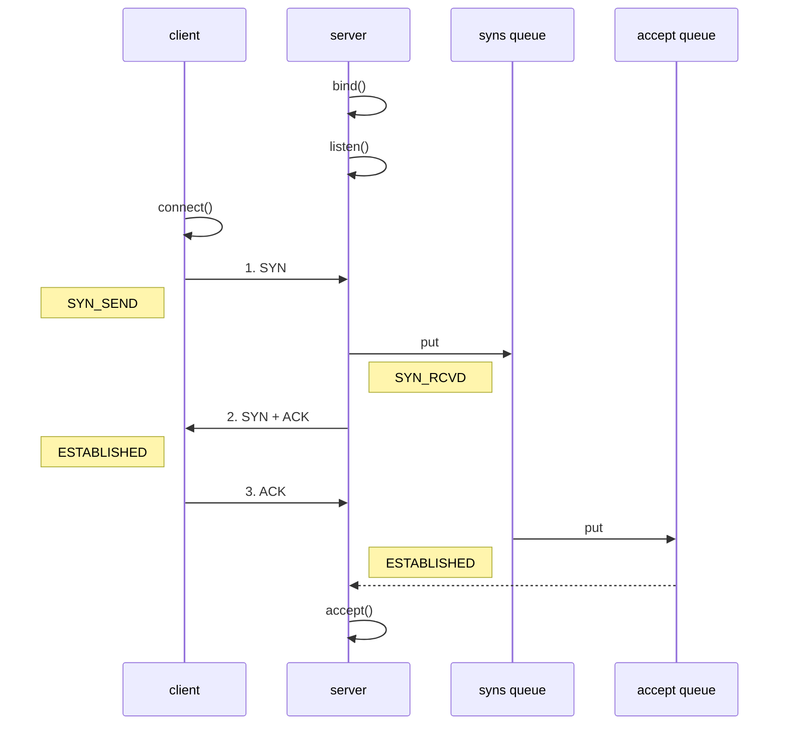

1. 第一次握手，client 发送 SYN 到 server，状态修改为 SYN_SEND，server 收到，状态改变为 SYN_REVD，并将该请求放入 sync queue 队列
2. 第二次握手，server 回复 SYN + ACK 给 client，client 收到，状态改变为 ESTABLISHED，并发送 ACK 给 server
3. 第三次握手，server 收到 ACK，状态改变为 ESTABLISHED，将该请求从 sync queue 放入 accept queue
4. 服务端accept()方法从全连接队列中取出连接, 并包装为channel, 然后返回

其中

* 在 linux 2.2 之前，backlog 大小包括了两个队列的大小，在 2.2 之后(我们用的应该都是这个版本, 不会太老)，分别用下面两个参数来控制

* sync queue - 半连接队列

  * 大小通过 /proc/sys/net/ipv4/tcp_max_syn_backlog 指定，在 `syncookies` 启用的情况下，逻辑上没有最大值限制，这个设置便被忽略

* accept queue - 全连接队列

  * 其大小通过 /proc/sys/net/core/somaxconn 指定，

    **在使用 listen 函数时，内核会根据传入的 backlog 参数与系统参数，取二者的较小值**

  * 如果 accpet queue 队列满了(accept方法会从队列中取出元素, 所以只有accept处理不了那么多连接时才会满)，server 将发送一个**拒绝连接**的错误信息到 client

netty 中可以通过  `ServerBootstrap.option(ChannelOption.SO_BACKLOG, value)` 来设置全连接队列的大小

这个值的默认大小在windos上是200, 在linux上是128

<font color=red>在高并发海量连接的场景下，该参数应适当调大。但是 SO_BACKLOG 也不能太大，否则无法防止 SYN-Flood 攻击。</font>

具体源码在: `NioServerSocketChannel#doBind`方法中使用, 在`NetUtil#SOMAXCONN`中赋值


#### ulimit -n

* 属于操作系统参数, 需要再操作系统中配置, netty中无法设置
* 用于设置一个进程能够同时打开的最大文件描述符的个数, 如果进程打开的文件描述符到达了这个上限, 如果再想打开就会报错


#### TCP_NODELAY

* 属于 SocketChannal 参数,  TCP在发送数据包时, 为了提高效率, 默认会使用nagle算法将多个小的数据包合并在一起发送, 那么这就会导致数据包的发送有一些延迟

  Nagle 算法 在海量流量的场景下非常有效，但是会造成一定的数据延迟。

  如果对数据传输延迟敏感的话, 可以设置这个参数为true来关闭nagle算法,  关闭之后不管多小的数据包都会立即发送出去
  
  


#### SO_SNDBUF & SO_RCVBUF

* `SO_SNDBUF` 属于 SocketChannal 参数

  `SO_RCVBUF` 既可用于 SocketChannal 参数，也可以用于 ServerSocketChannal 参数（建议设置到 ServerSocketChannal 上）

* SO_SNDBUF和SO_RCVBUF表示发送缓冲区和接收缓冲区, 在半包和黏包中讲到了

* 这两个参数一般不需要调整, 会自适应改变


#### ALLOCATOR

* 属于 SocketChannal 参数, 用来控制`ctx.alloc()`返回的allocator创建的buf是什么类型的, 默认是池化的字节内存
* 可以通过系统变量`io.netty.allocator.type`来设置, `unpooled`为非池化, `pooled`为池化的
* 可以通过系统变量`io.netty.noPreferDirect`来控制, `false`表示使用直接内存, `true`表示使用堆内存


#### RCVBUF_ALLOCATOR

* 属于 SocketChannal 参数, 用来控制 netty 接收缓冲区大小, 应为这个属于IO的buffer, 所以netty强制使用直接内存来提高效率

  至于是否池化, 通过上面提到的`io.netty.allocator.type`来控制

  

  负责接受入站数据时，netty 接收缓冲区大小(入站缓冲区)的大小

  可动态调整, 初始1024, 最小64字节, 最大65536
  
  为了提高io效率强制采用 direct 直接内存，具体池化还是非池化由 allocator 决定
  
  ~~~java
  new ServerBootstrap()
      .group(new NioEventLoopGroup(), new NioEventLoopGroup(2))
      .channel(NioServerSocketChannel.class) 
      .childHandler(new ChannelInitializer<NioSocketChannel>() { 
          protected void initChannel(NioSocketChannel ch) {
              ch.pipeline().addLast(new ChannelInboundHandlerAdapter(){
                  // 用来控制msg这个buf的大小的
                 @Override
                public void channelRead(ChannelHandlerContext ctx, Object msg) throws Exception {
                      ByteBuf buf = (ByteBuf)msg;
                }
              })
        }
      })
      .bind(8080); // 绑定到8080端口
  ~~~
  


#### SO_REUSEADDR

属于ServerSocketChannel参数, 允许在bind的时候, 两个应用程序bind到相同的port上, 但是要求他们bind的ip地址不一样

端口复用最常用的用途应该是防止服务器重启时之前绑定的端口还未释放或者程序突然退出而系统没有释放端口。这种情况下如果设定了端口复用，则新启动的服务器进程可以直接绑定端口。如果没有设定端口复用，绑定会失败，提示ADDR已经在使用中——那只好等等再重试了，麻烦！

~~~java
new ServerBootstrap().option(ChannelOption.SO_REUSEADDR, true)
~~~


#### SO_KEEPALIVE

属于SocketChannel的参数, 既可以在服务端, 也可以在客户端设置

~~~java
new ServerBootStrap().childOption(ChannelOption.SO_KEEPALIVE, true);
new BootStrap().option(ChannelOption.SO_KEEPALIVE, true);
~~~

**使用场景**

开始一个TCP连接需要三次握手协议，关闭TCP连接需要四次挥手协议。一旦连接已经建立，即使双方没有发送任何数据，TCP也会假设连接是存活的，除非能证明连接已经关闭。TCP以这种设计方式来提高弹性和效率。这种设计可以从网络和路由器崩溃中正常恢复

如果某个用户进程崩溃,  电脑崩溃, 路由器崩溃, 网络中断,  那么会导致发送端发送消息并接受到收到一个指示连接丢失的错误, 此时他已经意识到连接已经断开了

但是由于连接断开只能通过发送数据来检测，因此消息的接受方将永远等待. 

这种一方意识到连接断开, 而另一方还在永远等待数据的状态就被称为 半开(half open)状态

**原理分析**

若在一个给定连接上，两小时之内无任何活动，设置了keepalive的一方会发送一个探测段给另一方

如果: 

1. 另一方应用程序还活着, 那么他会接受到探测段, 并回复, 那么发送方会重置定时器
2. 如果另一方操作系统已经宕机了, 那么他不会接受到探测段, 发送方没有收到对其发出探测的响应，并且在75秒之后超时。发送方将总共发送10个这样的探测，每个探测75秒。如果没有收到一个响应，它就认为客户端主机已经关闭并终止连接。
3. 另一方崩溃了, 但是已经重启了, 那么操作系统会接受到探测段并回复一个复位响应, 发送方在接受到后, 终止连接
4. 如果接收端不可达,  那么与情况2类似


### 1.3 代码调优

https://blog.csdn.net/Fireworkit/article/details/136686571

1. 使用业务线程池

   Netty 是基于 Reactor 线程模型实现的，I/O 线程数量固定且资源珍贵，ChannelPipeline 负责所有事件的传播，如果其中任何一个 ChannelHandler 处理器需要执行耗时的操作，其中那么 I/O 线程就会出现阻塞，甚至整个系统都会被拖垮。
   所以推荐的做法是在 ChannelHandler 处理器中自定义新的业务线程池，将耗时的操作提交到业务线程池中执行。

   以 RPC 框架为例，在服务提供者处理 RPC 请求调用时就是将 RPC 请求提交到自定义的业务线程池中执行，如下所示：

   ```java
   public class RpcRequestHandler extends SimpleChannelInboundHandler<MiniRpcProtocol<MiniRpcRequest>> {
   
       @Override
       protected void channelRead0(ChannelHandlerContext ctx, MiniRpcProtocol<MiniRpcRequest> protocol) {
           RpcRequestProcessor.submitRequest(() -> {
               // 处理 RPC 请求
           });
       }
   }
   ```

2. 共享ChannelHandler

   我们经常使用以下 new HandlerXXX() 的方式进行 Channel 初始化，在每建立一个新连接的时候会初始化新的 HandlerA 和 HandlerB，如果系统承载了 1w 个连接，那么就会初始化 2w 个处理器，造成非常大的内存浪费。

   为了解决上述问题，Netty 提供了 @Sharable 注解用于修饰 ChannelHandler，标识该 ChannelHandler 全局只有一个实例，而且会被多个 ChannelPipeline 共享。
   所以我们必须要注意的是，@Sharable 修饰的 ChannelHandler 必须都是无状态的，这样才能保证线程安全。

3. 设置高低水位线

4. 使用对象池来减少gc压力

5. 使用压缩算法(protobuf, gzip, snappy)来减少数据传输量

6. 适当调整 I/O 线程池大小：I/O 线程池的大小应该根据系统资源和需求来适当调整。如果设置太小，可能会导致线程饥饿或阻塞；如果设置太大，可能会浪费系统资源。

7. 使用 Direct ByteBuffers：使用 Direct ByteBuffers 可以避免将内存从 JVM 移动到操作系统内核空间的额外复制，从而提高效率。


## 2. RPC 框架

#### 1）准备工作

这些代码可以认为是现成的，无需从头编写练习

为了简化起见，在原来聊天项目的基础上新增 Rpc 请求和响应消息

```java
@Data
public abstract class Message implements Serializable {

    // 省略旧的代码

    public static final int RPC_MESSAGE_TYPE_REQUEST = 101;
    public static final int  RPC_MESSAGE_TYPE_RESPONSE = 102;

    static {
        // ...
        messageClasses.put(RPC_MESSAGE_TYPE_REQUEST, RpcRequestMessage.class);
        messageClasses.put(RPC_MESSAGE_TYPE_RESPONSE, RpcResponseMessage.class);
    }
}
```

请求消息

```java
@Getter
@ToString(callSuper = true)
public class RpcRequestMessage extends Message {

    /**
     * 调用的接口全限定名，服务端根据它找到实现
     */
    private String interfaceName;
    /**
     * 调用接口中的方法名
     */
    private String methodName;
    /**
     * 方法返回类型
     */
    private Class<?> returnType;
    /**
     * 方法参数类型数组
     */
    private Class[] parameterTypes;
    /**
     * 方法参数值数组
     */
    private Object[] parameterValue;

    public RpcRequestMessage(int sequenceId, String interfaceName, String methodName, Class<?> returnType, Class[] parameterTypes, Object[] parameterValue) {
        super.setSequenceId(sequenceId);
        this.interfaceName = interfaceName;
        this.methodName = methodName;
        this.returnType = returnType;
        this.parameterTypes = parameterTypes;
        this.parameterValue = parameterValue;
    }

    @Override
    public int getMessageType() {
        return RPC_MESSAGE_TYPE_REQUEST;
    }
}
```

响应消息

```java
@Data
@ToString(callSuper = true)
public class RpcResponseMessage extends Message {
    /**
     * 返回值
     */
    private Object returnValue;
    /**
     * 异常值
     */
    private Exception exceptionValue;

    @Override
    public int getMessageType() {
        return RPC_MESSAGE_TYPE_RESPONSE;
    }
}
```

服务器架子

```java
@Slf4j
public class RpcServer {
    public static void main(String[] args) {
        NioEventLoopGroup boss = new NioEventLoopGroup();
        NioEventLoopGroup worker = new NioEventLoopGroup();
        LoggingHandler LOGGING_HANDLER = new LoggingHandler(LogLevel.DEBUG);
        MessageCodecSharable MESSAGE_CODEC = new MessageCodecSharable();
        
        // rpc 请求消息处理器，待实现
        RpcRequestMessageHandler RPC_HANDLER = new RpcRequestMessageHandler();
        try {
            ServerBootstrap serverBootstrap = new ServerBootstrap();
            serverBootstrap.channel(NioServerSocketChannel.class);
            serverBootstrap.group(boss, worker);
            serverBootstrap.childHandler(new ChannelInitializer<SocketChannel>() {
                @Override
                protected void initChannel(SocketChannel ch) throws Exception {
                    ch.pipeline().addLast(new ProcotolFrameDecoder());
                    ch.pipeline().addLast(LOGGING_HANDLER);
                    ch.pipeline().addLast(MESSAGE_CODEC);
                    ch.pipeline().addLast(RPC_HANDLER);
                }
            });
            Channel channel = serverBootstrap.bind(8080).sync().channel();
            channel.closeFuture().sync();
        } catch (InterruptedException e) {
            log.error("server error", e);
        } finally {
            boss.shutdownGracefully();
            worker.shutdownGracefully();
        }
    }
}
```

客户端架子

```java
public class RpcClient {
    public static void main(String[] args) {
        NioEventLoopGroup group = new NioEventLoopGroup();
        LoggingHandler LOGGING_HANDLER = new LoggingHandler(LogLevel.DEBUG);
        MessageCodecSharable MESSAGE_CODEC = new MessageCodecSharable();
        
        // rpc 响应消息处理器，待实现
        RpcResponseMessageHandler RPC_HANDLER = new RpcResponseMessageHandler();
        try {
            Bootstrap bootstrap = new Bootstrap();
            bootstrap.channel(NioSocketChannel.class);
            bootstrap.group(group);
            bootstrap.handler(new ChannelInitializer<SocketChannel>() {
                @Override
                protected void initChannel(SocketChannel ch) throws Exception {
                    ch.pipeline().addLast(new ProcotolFrameDecoder());
                    ch.pipeline().addLast(LOGGING_HANDLER);
                    ch.pipeline().addLast(MESSAGE_CODEC);
                    ch.pipeline().addLast(RPC_HANDLER);
                }
            });
            Channel channel = bootstrap.connect("localhost", 8080).sync().channel();
            channel.closeFuture().sync();
        } catch (Exception e) {
            log.error("client error", e);
        } finally {
            group.shutdownGracefully();
        }
    }
}@EnableAspectJAutoProxy(exposeProxy = true)

```

服务器端的 service 获取

```java
public class ServicesFactory {

    static Properties properties;
    static Map<Class<?>, Object> map = new ConcurrentHashMap<>();

    static {
        try (InputStream in = Config.class.getResourceAsStream("/application.properties")) {
            properties = new Properties();
            properties.load(in);
            Set<String> names = properties.stringPropertyNames();
            for (String name : names) {
                if (name.endsWith("Service")) {
                    Class<?> interfaceClass = Class.forName(name);
                    Class<?> instanceClass = Class.forName(properties.getProperty(name));
                    map.put(interfaceClass, instanceClass.newInstance());
                }
            }
        } catch (IOException | ClassNotFoundException | InstantiationException | IllegalAccessException e) {
            throw new ExceptionInInitializerError(e);
        }
    }

    public static <T> T getService(Class<T> interfaceClass) {
        return (T) map.get(interfaceClass);
    }
}
```

相关配置 application.properties

```
serializer.algorithm=Json
cn.itcast.server.service.HelloService=cn.itcast.server.service.HelloServiceImpl
```


#### 2）服务器 handler

```java
@Slf4j
@ChannelHandler.Sharable
public class RpcRequestMessageHandler extends SimpleChannelInboundHandler<RpcRequestMessage> {

    @Override
    protected void channelRead0(ChannelHandlerContext ctx, RpcRequestMessage message) {
        RpcResponseMessage response = new RpcResponseMessage();
        response.setSequenceId(message.getSequenceId());
        try {
            // 获取真正的实现对象
            HelloService service = (HelloService)ServicesFactory.getService(Class.forName(message.getInterfaceName()));
            // 获取要调用的方法
            Method method = service.getClass().getMethod(message.getMethodName(), message.getParameterTypes());
            // 调用方法
            Object invoke = method.invoke(service, message.getParameterValue());
            // 调用成功
            response.setReturnValue(invoke);
        } catch (Exception e) {
            e.printStackTrace();
            // 这里要新创建一个异常, 应为e这个异常里面包含了异常的调用栈
            // 包含的信息太多了, 而我们的客户端的LengthFieldBasedFrameDecoder解码器
            // 能够接受的最大消息只有1024字节
            response.setExceptionValue(new Exception(e.getCause().getMessage()));
        }
        // 返回结果
        ctx.writeAndFlush(response);
    }
}
```


#### 3）客户端代码第一版

只发消息

```java
@Slf4j
public class RpcClient {
    public static void main(String[] args) {
        NioEventLoopGroup group = new NioEventLoopGroup();
        LoggingHandler LOGGING_HANDLER = new LoggingHandler(LogLevel.DEBUG);
        MessageCodecSharable@EnableAspectJAutoProxy(exposeProxy = true)
 MESSAGE_CODEC = new MessageCodecSharable();
        RpcResponseMessageHandler RPC_HANDLER = new RpcResponseMessageHandler();
        try {
            Bootstrap bootstrap = new Bootstrap();
            bootstrap.channel(NioSocketChannel.class);
            bootstrap.group(group);
            bootstrap.handler(new ChannelInitializer<SocketChannel>() {
                @Override
                protected void initChannel(SocketChannel ch) throws Exception {
                    ch.pipeline().addLast(new ProcotolFrameDecoder());
                    ch.pipeline().addLast(LOGGING_HANDLER);
                    ch.pipeline().addLast(MESSAGE_CODEC);
                    ch.pipeline().addLast(RPC_HANDLER);
                }
            });
            Channel channel = bootstrap.connect("localhost", 8080).sync().channel();
            ChannelFuture future = channel.writeAndFlush(new RpcRequestMessage(
                    1,
                    "cn.itcast.server.service.HelloService",
                    "sayHello",
                    String.class,
                    new Class[]{String.class},
                    new Object[]{"张三"}
            )).addListener(promise -> {
                if (!promise.isSuccess()) {
                    Throwable cause = promise.cause();
                    log.error("error", cause);
                }
            });

            channel.closeFuture().sync();
        } catch (Exception e) {
            log.error("client error", e);
        } finally {
            group.shutdownGracefully();
        }
    }
}
```


#### 4）客户端 handler 第一版

```java
@Slf4j
@ChannelHandler.Sharable
public class RpcResponseMessageHandler extends SimpleChannelInboundHandler<RpcResponseMessage> {
    @Override
    protected void channelRead0(ChannelHandlerContext ctx, RpcResponseMessage msg) throws Exception {
        log.debug("{}", msg);
    }
}
```


#### 5）客户端代码 第二版

包括 channel 管理，代理，接收结果

```java
@Slf4j
public class RpcClientManager {


    public static void main(String[] args) {
        HelloService service = getProxyService(HelloService.class);
        System.out.println(service.sayHello("zhangsan"));
//        System.out.println(service.sayHello("lisi"));
//        System.out.println(service.sayHello("wangwu"));
    }

    // 创建代理类
    public static <T> T getProxyService(Class<T> serviceClass) {
        ClassLoader loader = serviceClass.getClassLoader();
        Class<?>[] interfaces = new Class[]{serviceClass};
        //                                                            sayHello  "张三"
        Object o = Proxy.newProxyInstance(loader, interfaces, (proxy, method, args) -> {
            // 1. 将方法调用转换为 消息对象
            int sequenceId = SequenceIdGenerator.nextId();
            RpcRequestMessage msg = new RpcRequestMessage(
                    sequenceId,
                    serviceClass.getName(),
                    method.getName(),
                    method.getReturnType(),
                    method.getParameterTypes(),
                    args
            );
            // 2. 将消息对象发送出去
            getChannel().writeAndFlush(msg);

            // 3. 准备一个空Promise对象，来接收结果
            // getChannel().eventLoop()是指定promise用于执行listener的线程
            DefaultPromise<Object> promise = new DefaultPromise<>(getChannel().eventLoop());
            RpcResponseMessageHandler.PROMISES.put(sequenceId, promise);
            
            // 4. 等待 promise 结果
            promise.await();
            if(promise.isSuccess()) {
                // 调用正常
                return promise.getNow();
            } else {
                // 调用失败
                throw new RuntimeException(promise.cause());
            }
        });
        return (T) o;
    }

    private static Channel channel = null;
    private static final Object LOCK = new Object();

    // 获取唯一的 channel 对象
    public static Channel getChannel() {
        if (channel != null) {
            return channel;
        }
        synchronized (LOCK) { //  t2
            if (channel != null) { // t1
                return channel;
            }
            initChannel();
            return channel;
        }
    }

    // 初始化 channel 方法
    private static void initChannel() {
        NioEventLoopGroup group = new NioEventLoopGroup();
        LoggingHandler LOGGING_HANDLER = new LoggingHandler(LogLevel.DEBUG);
        MessageCodecSharable MESSAGE_CODEC = new MessageCodecSharable();
        RpcResponseMessageHandler RPC_HANDLER = new RpcResponseMessageHandler();
        Bootstrap bootstrap = new Bootstrap();
        bootstrap.channel(NioSocketChannel.class);
        bootstrap.group(group);
        bootstrap.handler(new ChannelInitializer<SocketChannel>() {
            @Override
            protected void initChannel(SocketChannel ch) throws Exception {
                ch.pipeline().addLast(new ProcotolFrameDecoder());
                ch.pipeline().addLast(LOGGING_HANDLER);
                ch.pipeline().addLast(MESSAGE_CODEC);
                ch.pipeline().addLast(RPC_HANDLER);
            }
        });
        try {
            channel = bootstrap.connect("localhost", 8080).sync().channel();
            channel.closeFuture().addListener(future -> {
                group.shutdownGracefully();
            });
        } catch (Exception e) {
            log.error("client error", e);
        }
    }
}
```


#### 6）客户端 handler 第二版

```java
@Slf4j
@ChannelHandler.Sharable
public class RpcResponseMessageHandler extends SimpleChannelInboundHandler<RpcResponseMessage> {

    // key是sequenceId, value是对应的Promise对象
    public static final Map<Integer, Promise<Object>> PROMISES = new ConcurrentHashMap<>();

    @Override

    protected void channelRead0(ChannelHandlerContext ctx, RpcResponseMessage msg) throws Exception {
        log.debug("{}", msg);
        // 拿到空的 promise
        Promise<Object> promise = PROMISES.remove(msg.getSequenceId());
        if (promise != null) {
            Object returnValue = msg.getReturnValue();
            Exception exceptionValue = msg.getExceptionValue();
            if(exceptionValue != null) {
                promise.setFailure(exceptionValue);
            } else {
                promise.setSuccess(returnValue);
            }
        }
    }
}
```


## 3. 源码分析

### 2.1 启动流程

#### nio中的启动流程

我们先来看下nio中的启动流程

```java
//1 netty 中使用 NioEventLoopGroup （简称 nio boss 线程）来封装线程和 selector
Selector selector = Selector.open(); 

//2 创建 NioServerSocketChannel 时，创建了 java 原生的 ServerSocketChannel
ServerSocketChannel serverSocketChannel = ServerSocketChannel.open(); 
serverSocketChannel.configureBlocking(false);

//3 创建 NioServerSocketChannel，同时会初始化它关联的 handler，以及为原生 ssc 存储 config
NioServerSocketChannel attachment = new NioServerSocketChannel();

//4 启动 nio boss 线程执行接下来的操作

//5 注册，未关注事件
// 这一步的作用仅仅是关联 selector 和 NioServerSocketChannel
SelectionKey selectionKey = serverSocketChannel.register(selector, 0, attachment);

//6 head -> 初始化器 -> ServerBootstrapAcceptor -> tail，初始化器是一次性的，只为添加 acceptor

//7 绑定端口
serverSocketChannel.bind(new InetSocketAddress(8080));

//8 触发 channel active 事件，在 head 中关注 op_accept 事件
selectionKey.interestOps(SelectionKey.OP_ACCEPT);
```

其实上面最主要的的就是几个步骤:

1. 创建Selector
2. 创建ServerSocketChannel, 并设置为非阻塞
3. 注册ServerScoketChannel
4. 绑定端口
5. 设置关注事件

netty对于步骤2-5步骤的实现都在ServerBootstrap#bind方法中


#### netty启动流程剖析

上面说到, netty对于步骤2-5的实现都在ServerBootstrap#bind方法中

在该方法中有主要几个方法:

1. initAndRegister

   1.1 init [main线程]

   ​	1.1.1 创建NioServerSocketChannel,  在其构造方法内部会创建原生的ServerSocketChannel [main线程]

   ​	1.1.2  添加一个ChannelInitializer类型的handler到NioServerSocketChannel的pipeline中 [main线程]

   ​			 他的作用就是向pipeline中添加一个ServerBootstrapAcceptor类型的handler

   ​			 这个handler的作用是让原始的ServerScoketChannel关注accept事件, 并处理

   1.2 register

   ​	1.2.1 切换线程为eventloop中的线程

   ​	1.2.2 注册原生ServerScoketChannel到selector中, 此时不关注任何事件  [eventloop线程]

   ​	1.2.3 执行NioServerSocketChannel的pipeline中的ChannelInitializer  handler   [eventloop线程]

   1.3 移除ServerSocketChannel的pipleline中添加的NioServerSocketChannel

2. regFuture等待回调doBind0

   2.1 原生ServerSocketChannel绑定

   2.2 触发NioServerSocketChannel的active事件

测试代码如下:

~~~java
new ServerBootstrap()
    .group(new NioEventLoopGroup)
    .channel(NioServerSocketChannel.class)
    .childHandler(new ChannelInitializer<NioSocketChannel>() {
        protected void initChannel(NioSocketChannel ch) {
            ch.pipeline().addLast(new LoggingHandler());
        }
    }).bind(8080);
~~~


#### 具体代码解析

入口 `io.netty.bootstrap.ServerBootstrap#bind`

关键代码 `io.netty.bootstrap.AbstractBootstrap#doBind`

```java
private ChannelFuture doBind(final SocketAddress localAddress) {
	// 1. 执行初始化和注册 
    // regFuture 会由 initAndRegister 设置其是否完成，从而回调 3.2 处代码
    final ChannelFuture regFuture = initAndRegister();
    final Channel channel = regFuture.channel();
    if (regFuture.cause() != null) {
        return regFuture;
    }

    // 2. 因为是 initAndRegister 异步执行，需要分两种情况来看，调试时也需要通过 suspend 断点类型加以区分
    // 2.1 如果已经完成
    if (regFuture.isDone()) {
        ChannelPromise promise = channel.newPromise();
        // 3.1 立刻调用 doBind0
        doBind0(regFuture, channel, localAddress, promise);
        return promise;
    } 
    // 2.2 还没有完成
    else {
        final PendingRegistrationPromise promise = new PendingRegistrationPromise(channel);
        // 3.2 回调 doBind0
        regFuture.addListener(new ChannelFutureListener() {
            @Override
            public void operationComplete(ChannelFuture future) throws Exception {
                Throwable cause = future.cause();
                if (cause != null) {
                    // 处理异常...
                    promise.setFailure(cause);
                } else {
                    promise.registered();
					// 3. 由注册线程去执行 doBind0
                    doBind0(regFuture, channel, localAddress, promise);
                }
            }
        });
        return promise;
    }
}
```

关键代码 `io.netty.bootstrap.AbstractBootstrap#initAndRegister`

```java
final ChannelFuture initAndRegister() {
    Channel channel = null;
    try {
        // 对应步骤1.1.1 创建NioServerSocketChannel
        // 在其构造方法内部会创建原生的ServerSocketChannel
        channel = channelFactory.newChannel();
        // 对应步骤1.1.2 
        // 添加一个ChannelInitializer类型的handler到NioServerSocketChannel的pipeline中
        init(channel);
    } catch (Throwable t) {
        // 处理异常...
        return new DefaultChannelPromise(new FailedChannel(), GlobalEventExecutor.INSTANCE).setFailure(t);
    }

    // 1.2 注册 - 做的事就是将原生 channel 注册到 selector 上
    ChannelFuture regFuture = config().group().register(channel);
    if (regFuture.cause() != null) {
        // 处理异常...
    }
    return regFuture;
}
```

关键代码 `io.netty.bootstrap.ServerBootstrap#init`

```java
// 这里 channel 实际上是 NioServerSocketChannel
void init(Channel channel) throws Exception {
    final Map<ChannelOption<?>, Object> options = options0();
    synchronized (options) {
        setChannelOptions(channel, options, logger);
    }

    final Map<AttributeKey<?>, Object> attrs = attrs0();
    synchronized (attrs) {
        for (Entry<AttributeKey<?>, Object> e: attrs.entrySet()) {
            @SuppressWarnings("unchecked")
            AttributeKey<Object> key = (AttributeKey<Object>) e.getKey();
            channel.attr(key).set(e.getValue());
        }
    }

    ChannelPipeline p = channel.pipeline();

    final EventLoopGroup currentChildGroup = childGroup;
    final ChannelHandler currentChildHandler = childHandler;
    final Entry<ChannelOption<?>, Object>[] currentChildOptions;
    final Entry<AttributeKey<?>, Object>[] currentChildAttrs;
    synchronized (childOptions) {
        currentChildOptions = childOptions.entrySet().toArray(newOptionArray(0));
    }
    synchronized (childAttrs) {
        currentChildAttrs = childAttrs.entrySet().toArray(newAttrArray(0));
    }
	
    // 为 NioServerSocketChannel 添加初始化器
    p.addLast(new ChannelInitializer<Channel>() {
        @Override
        public void initChannel(final Channel ch) throws Exception {
            final ChannelPipeline pipeline = ch.pipeline();
            ChannelHandler handler = config.handler();
            if (handler != null) {
                pipeline.addLast(handler);
            }

            // 初始化器的职责是将 ServerBootstrapAcceptor 加入至 NioServerSocketChannel
            ch.eventLoop().execute(new Runnable() {
                @Override
                public void run() {
                    pipeline.addLast(new ServerBootstrapAcceptor(
                            ch, currentChildGroup, currentChildHandler, currentChildOptions, currentChildAttrs));
                }
            });
        }
    });
}
```

关键代码 `io.netty.channel.AbstractChannel.AbstractUnsafe#register`

```java
public final void register(EventLoop eventLoop, final ChannelPromise promise) {
    // 一些检查，略...

    AbstractChannel.this.eventLoop = eventLoop;

    // 判断当前线程是否是eventloop中的线程, 如果是那么直接执行register0
    if (eventLoop.inEventLoop()) {
        register0(promise);
    } else {
        try {
            // 对应步骤1.2.1
            // 切换线程, 由eventloop线程去执行register0方法
            eventLoop.execute(new Runnable() {
                @Override
                public void run() {
                    register0(promise);
                }
            });
        } catch (Throwable t) {
            // 日志记录...
            closeForcibly();
            closeFuture.setClosed();
            safeSetFailure(promise, t);
        }
    }
}
```


`io.netty.channel.AbstractChannel.AbstractUnsafe#register0`

```java
private void register0(ChannelPromise promise) {
    try {
        if (!promise.setUncancellable() || !ensureOpen(promise)) {
            return;
        }
        boolean firstRegistration = neverRegistered;
        // 1.2.2 原生的 nio channel 绑定到 selector 上，注意此时没有注册 selector 关注事件，附件为 NioServerSocketChannel
        doRegister();
        neverRegistered = false;
        registered = true;

        // 1.2.3 执行NioServerSocketChannel的pipeline中的ChannelInitializer  handler
        pipeline.invokeHandlerAddedIfNeeded();

        // 设置结果到promise中
        // 这样会执行promise的listerner, 在listerner中执行doBind0
        safeSetSuccess(promise);
        pipeline.fireChannelRegistered();
        
        // 判断channel是否可用了
        if (isActive()) {
            if (firstRegistration) {
                // 触发pipleline中每个handler的active事件
                // 当前pipleline中有3个handler, tail, head, ServerBootstrapAcceptor
                pipeline.fireChannelActive();
            } else if (config().isAutoRead()) {
                beginRead();
            }
        }
    } catch (Throwable t) {
        // Close the channel directly to avoid FD leak.
        closeForcibly();
        closeFuture.setClosed();
        safeSetFailure(promise, t);
    }
}
```

关键代码 `io.netty.channel.ChannelInitializer#initChannel`

```java
private boolean initChannel(ChannelHandlerContext ctx) throws Exception {
    if (initMap.add(ctx)) { // Guard against re-entrance.
        try {
            // 1.2.2.1 执行初始化
            initChannel((C) ctx.channel());
        } catch (Throwable cause) {
            exceptionCaught(ctx, cause);
        } finally {
            // 1.2.2.2 移除初始化器
            ChannelPipeline pipeline = ctx.pipeline();
            if (pipeline.context(this) != null) {
                pipeline.remove(this);
            }
        }
        return true;
    }
    return false;
}
```

关键代码 `io.netty.bootstrap.AbstractBootstrap#doBind0`

```java
// 3.1 或 3.2 执行 doBind0
private static void doBind0(
        final ChannelFuture regFuture, final Channel channel,
        final SocketAddress localAddress, final ChannelPromise promise) {

    channel.eventLoop().execute(new Runnable() {
        @Override
        public void run() {
            if (regFuture.isSuccess()) {
                channel.bind(localAddress, promise).addListener(ChannelFutureListener.CLOSE_ON_FAILURE);
            } else {
                promise.setFailure(regFuture.cause());
            }
        }
    });
}
```

关键代码 `io.netty.channel.AbstractChannel.AbstractUnsafe#bind`

```java
public final void bind(final SocketAddress localAddress, final ChannelPromise promise) {
    assertEventLoop();

    if (!promise.setUncancellable() || !ensureOpen(promise)) {
        return;
    }

    if (Boolean.TRUE.equals(config().getOption(ChannelOption.SO_BROADCAST)) &&
        localAddress instanceof InetSocketAddress &&
        !((InetSocketAddress) localAddress).getAddress().isAnyLocalAddress() &&
        !PlatformDependent.isWindows() && !PlatformDependent.maybeSuperUser()) {
        // 记录日志...
    }

    boolean wasActive = isActive();
    try {
        // 3.3 执行端口绑定
        doBind(localAddress);
    } catch (Throwable t) {
        safeSetFailure(promise, t);
        closeIfClosed();
        return;
    }

    if (!wasActive && isActive()) {
        invokeLater(new Runnable() {
            @Override
            public void run() {
                // 3.4 触发 active 事件
                pipeline.fireChannelActive();
            }
        });
    }

    safeSetSuccess(promise);
}
```

3.3 关键代码 `io.netty.channel.socket.nio.NioServerSocketChannel#doBind`

```java
protected void doBind(SocketAddress localAddress) throws Exception {
    if (PlatformDependent.javaVersion() >= 7) {
        javaChannel().bind(localAddress, config.getBacklog());
    } else {
        javaChannel().socket().bind(localAddress, config.getBacklog());
    }
}
```

3.4 关键代码 `io.netty.channel.DefaultChannelPipeline.HeadContext#channelActive`

```java
public void channelActive(ChannelHandlerContext ctx) {
    ctx.fireChannelActive();
	// 触发 read (NioServerSocketChannel 上的 read 不是读取数据，只是为了触发 channel 的事件注册)
    readIfIsAutoRead();
}
```

关键代码 `io.netty.channel.nio.AbstractNioChannel#doBeginRead`

```java
protected void doBeginRead() throws Exception {
    // Channel.read() or ChannelHandlerContext.read() was called
    final SelectionKey selectionKey = this.selectionKey;
    if (!selectionKey.isValid()) {
        return;
    }

    readPending = true;

    final int interestOps = selectionKey.interestOps();
    // readInterestOp 取值是 16，在 NioServerSocketChannel 创建时初始化好，代表关注 accept 事件
    if ((interestOps & readInterestOp) == 0) {
        selectionKey.interestOps(interestOps | readInterestOp);
    }
}
```


### 2.2 NioEventLoop 剖析

NioEventLoop 线程不仅要处理 IO 事件，还要处理 Task（包括普通任务和定时任务），

提交任务代码 `io.netty.util.concurrent.SingleThreadEventExecutor#execute`

```java
public void execute(Runnable task) {
    if (task == null) {
        throw new NullPointerException("task");
    }

    boolean inEventLoop = inEventLoop();
    // 添加任务，其中队列使用了 jctools 提供的 mpsc 无锁队列
    addTask(task);
    if (!inEventLoop) {
        // inEventLoop 如果为 false 表示由其它线程来调用 execute，即首次调用，这时需要向 eventLoop 提交首个任务，启动死循环，会执行到下面的 doStartThread
        startThread();
        if (isShutdown()) {
            // 如果已经 shutdown，做拒绝逻辑，代码略...
        }
    }

    if (!addTaskWakesUp && wakesUpForTask(task)) {
        // 如果线程由于 IO select 阻塞了，添加的任务的线程需要负责唤醒 NioEventLoop 线程
        wakeup(inEventLoop);
    }
}
```


唤醒 select 阻塞线程`io.netty.channel.nio.NioEventLoop#wakeup`

```java
@Override
protected void wakeup(boolean inEventLoop) {
    if (!inEventLoop && wakenUp.compareAndSet(false, true)) {
        selector.wakeup();
    }
}
```


启动 EventLoop 主循环 `io.netty.util.concurrent.SingleThreadEventExecutor#doStartThread`

```java
private void doStartThread() {
    assert thread == null;
    executor.execute(new Runnable() {
        @Override
        public void run() {
            // 将线程池的当前线程保存在成员变量中，以便后续使用
            thread = Thread.currentThread();
            if (interrupted) {
                thread.interrupt();
            }

            boolean success = false;
            updateLastExecutionTime();
            try {
                // 调用外部类 SingleThreadEventExecutor 的 run 方法，进入死循环，run 方法见下
                SingleThreadEventExecutor.this.run();
                success = true;
            } catch (Throwable t) {
                logger.warn("Unexpected exception from an event executor: ", t);
            } finally {
				// 清理工作，代码略...
            }
        }
    });
}
```


`io.netty.channel.nio.NioEventLoop#run` 主要任务是执行死循环，不断看有没有新任务，有没有 IO 事件

```java
protected void run() {
    for (;;) {
        try {
            try {
                // calculateStrategy 的逻辑如下：
                // 有任务，会执行一次 selectNow，清除上一次的 wakeup 结果，无论有没有 IO 事件，都会跳过 switch
                // 没有任务，会匹配 SelectStrategy.SELECT，看是否应当阻塞
                switch (selectStrategy.calculateStrategy(selectNowSupplier, hasTasks())) {
                    case SelectStrategy.CONTINUE:
                        continue;

                    case SelectStrategy.BUSY_WAIT:

                    case SelectStrategy.SELECT:
                        // 因为 IO 线程和提交任务线程都有可能执行 wakeup，而 wakeup 属于比较昂贵的操作，因此使用了一个原子布尔对象 wakenUp，它取值为 true 时，表示该由当前线程唤醒
                        // 进行 select 阻塞，并设置唤醒状态为 false
                        boolean oldWakenUp = wakenUp.getAndSet(false);
                        
                        // 如果在这个位置，非 EventLoop 线程抢先将 wakenUp 置为 true，并 wakeup
                        // 下面的 select 方法不会阻塞
                        // 等 runAllTasks 处理完成后，到再循环进来这个阶段新增的任务会不会及时执行呢?
                        // 因为 oldWakenUp 为 true，因此下面的 select 方法就会阻塞，直到超时
                        // 才能执行，让 select 方法无谓阻塞
                        select(oldWakenUp);

                        if (wakenUp.get()) {
                            selector.wakeup();
                        }
                    default:
                }
            } catch (IOException e) {
                rebuildSelector0();
                handleLoopException(e);
                continue;
            }

            cancelledKeys = 0;
            needsToSelectAgain = false;
            // ioRatio 默认是 50
            final int ioRatio = this.ioRatio;
            if (ioRatio == 100) {
                try {
                    processSelectedKeys();
                } finally {
                    // ioRatio 为 100 时，总是运行完所有非 IO 任务
                    runAllTasks();
                }
            } else {                
                final long ioStartTime = System.nanoTime();
                try {
                    processSelectedKeys();
                } finally {
                    // 记录 io 事件处理耗时
                    final long ioTime = System.nanoTime() - ioStartTime;
                    // 运行非 IO 任务，一旦超时会退出 runAllTasks
                    runAllTasks(ioTime * (100 - ioRatio) / ioRatio);
                }
            }
        } catch (Throwable t) {
            handleLoopException(t);
        }
        try {
            if (isShuttingDown()) {
                closeAll();
                if (confirmShutdown()) {
                    return;
                }
            }
        } catch (Throwable t) {
            handleLoopException(t);
        }
    }
}
```


#### ⚠️ 注意

> 这里有个费解的地方就是 wakeup，它既可以由提交任务的线程来调用（比较好理解），也可以由 EventLoop 线程来调用（比较费解），这里要知道 wakeup 方法的效果：
>
> * 由非 EventLoop 线程调用，会唤醒当前在执行 select 阻塞的 EventLoop 线程
> * 由 EventLoop 自己调用，会本次的 wakeup 会取消下一次的 select 操作


参考下图


`io.netty.channel.nio.NioEventLoop#select`

```java
private void select(boolean oldWakenUp) throws IOException {
    Selector selector = this.selector;
    try {
        int selectCnt = 0;
        long currentTimeNanos = System.nanoTime();
        // 计算等待时间
        // * 没有 scheduledTask，超时时间为 1s
        // * 有 scheduledTask，超时时间为 `下一个定时任务执行时间 - 当前时间`
        long selectDeadLineNanos = currentTimeNanos + delayNanos(currentTimeNanos);

        for (;;) {
            long timeoutMillis = (selectDeadLineNanos - currentTimeNanos + 500000L) / 1000000L;
            // 如果超时，退出循环
            if (timeoutMillis <= 0) {
                if (selectCnt == 0) {
                    selector.selectNow();
                    selectCnt = 1;
                }
                break;
            }

            // 如果期间又有 task 退出循环，如果没这个判断，那么任务就会等到下次 select 超时时才能被执行
            // wakenUp.compareAndSet(false, true) 是让非 NioEventLoop 不必再执行 wakeup
            if (hasTasks() && wakenUp.compareAndSet(false, true)) {
                selector.selectNow();
                selectCnt = 1;
                break;
            }

            // select 有限时阻塞
            // 注意 nio 有 bug，当 bug 出现时，select 方法即使没有时间发生，也不会阻塞住，导致不断空轮询，cpu 占用 100%
            int selectedKeys = selector.select(timeoutMillis);
            // 计数加 1
            selectCnt ++;

            // 醒来后，如果有 IO 事件、或是由非 EventLoop 线程唤醒，或者有任务，退出循环
            if (selectedKeys != 0 || oldWakenUp || wakenUp.get() || hasTasks() || hasScheduledTasks()) {
                break;
            }
            if (Thread.interrupted()) {
               	// 线程被打断，退出循环
                // 记录日志
                selectCnt = 1;
                break;
            }

            long time = System.nanoTime();
            if (time - TimeUnit.MILLISECONDS.toNanos(timeoutMillis) >= currentTimeNanos) {
                // 如果超时，计数重置为 1，下次循环就会 break
                selectCnt = 1;
            } 
            // 计数超过阈值，由 io.netty.selectorAutoRebuildThreshold 指定，默认 512
            // 这是为了解决 nio 空轮询 bug
            else if (SELECTOR_AUTO_REBUILD_THRESHOLD > 0 &&
                    selectCnt >= SELECTOR_AUTO_REBUILD_THRESHOLD) {
                // 重建 selector
                selector = selectRebuildSelector(selectCnt);
                selectCnt = 1;
                break;
            }

            currentTimeNanos = time;
        }

        if (selectCnt > MIN_PREMATURE_SELECTOR_RETURNS) {
            // 记录日志
        }
    } catch (CancelledKeyException e) {
        // 记录日志
    }
}
```


处理 keys `io.netty.channel.nio.NioEventLoop#processSelectedKeys`

```java
private void processSelectedKeys() {
    if (selectedKeys != null) {
        // 通过反射将 Selector 实现类中的就绪事件集合替换为 SelectedSelectionKeySet 
        // SelectedSelectionKeySet 底层为数组实现，可以提高遍历性能（原本为 HashSet）
        processSelectedKeysOptimized();
    } else {
        processSelectedKeysPlain(selector.selectedKeys());
    }
}
```


`io.netty.channel.nio.NioEventLoop#processSelectedKey`

```java
private void processSelectedKey(SelectionKey k, AbstractNioChannel ch) {
    final AbstractNioChannel.NioUnsafe unsafe = ch.unsafe();
    // 当 key 取消或关闭时会导致这个 key 无效
    if (!k.isValid()) {
        // 无效时处理...
        return;
    }

    try {
        int readyOps = k.readyOps();
        // 连接事件
        if ((readyOps & SelectionKey.OP_CONNECT) != 0) {
            int ops = k.interestOps();
            ops &= ~SelectionKey.OP_CONNECT;
            k.interestOps(ops);

            unsafe.finishConnect();
        }

        // 可写事件
        if ((readyOps & SelectionKey.OP_WRITE) != 0) {
            ch.unsafe().forceFlush();
        }

        // 可读或可接入事件
        if ((readyOps & (SelectionKey.OP_READ | SelectionKey.OP_ACCEPT)) != 0 || readyOps == 0) {
            // 如果是可接入 io.netty.channel.nio.AbstractNioMessageChannel.NioMessageUnsafe#read
            // 如果是可读 io.netty.channel.nio.AbstractNioByteChannel.NioByteUnsafe#read
            unsafe.read();
        }
    } catch (CancelledKeyException ignored) {
        unsafe.close(unsafe.voidPromise());
    }
}
```


### 2.3 accept 剖析

nio 中如下代码，在 netty 中的流程

```java
//1 阻塞直到事件发生
selector.select();

Iterator<SelectionKey> iter = selector.selectedKeys().iterator();
while (iter.hasNext()) {    
    //2 拿到一个事件
    SelectionKey key = iter.next();
    
    //3 如果是 accept 事件
    if (key.isAcceptable()) {
        
        //4 执行 accept
        SocketChannel channel = serverSocketChannel.accept();
        channel.configureBlocking(false);
        
        //5 关注 read 事件
        channel.register(selector, SelectionKey.OP_READ);
    }
    // ...
}
```


先来看可接入事件处理（accept）

`io.netty.channel.nio.AbstractNioMessageChannel.NioMessageUnsafe#read`

```java
public void read() {
    assert eventLoop().inEventLoop();
    final ChannelConfig config = config();
    final ChannelPipeline pipeline = pipeline();    
    final RecvByteBufAllocator.Handle allocHandle = unsafe().recvBufAllocHandle();
    allocHandle.reset(config);

    boolean closed = false;
    Throwable exception = null;
    try {
        try {
            do {
				// doReadMessages 中执行了 accept 并创建 NioSocketChannel 作为消息放入 readBuf
                // readBuf 是一个 ArrayList 用来缓存消息
                int localRead = doReadMessages(readBuf);
                if (localRead == 0) {
                    break;
                }
                if (localRead < 0) {
                    closed = true;
                    break;
                }
				// localRead 为 1，就一条消息，即接收一个客户端连接
                allocHandle.incMessagesRead(localRead);
            } while (allocHandle.continueReading());
        } catch (Throwable t) {
            exception = t;
        }

        int size = readBuf.size();
        for (int i = 0; i < size; i ++) {
            readPending = false;
            // 触发 read 事件，让 pipeline 上的 handler 处理，这时是处理
            // io.netty.bootstrap.ServerBootstrap.ServerBootstrapAcceptor#channelRead
            pipeline.fireChannelRead(readBuf.get(i));
        }
        readBuf.clear();
        allocHandle.readComplete();
        pipeline.fireChannelReadComplete();

        if (exception != null) {
            closed = closeOnReadError(exception);

            pipeline.fireExceptionCaught(exception);
        }

        if (closed) {
            inputShutdown = true;
            if (isOpen()) {
                close(voidPromise());
            }
        }
    } finally {
        if (!readPending && !config.isAutoRead()) {
            removeReadOp();
        }
    }
}
```


关键代码 `io.netty.bootstrap.ServerBootstrap.ServerBootstrapAcceptor#channelRead`

```java
public void channelRead(ChannelHandlerContext ctx, Object msg) {
    // 这时的 msg 是 NioSocketChannel
    final Channel child = (Channel) msg;

    // NioSocketChannel 添加  childHandler 即初始化器
    child.pipeline().addLast(childHandler);

    // 设置选项
    setChannelOptions(child, childOptions, logger);

    for (Entry<AttributeKey<?>, Object> e: childAttrs) {
        child.attr((AttributeKey<Object>) e.getKey()).set(e.getValue());
    }

    try {
        // 注册 NioSocketChannel 到 nio worker 线程，接下来的处理也移交至 nio worker 线程
        childGroup.register(child).addListener(new ChannelFutureListener() {
            @Override
            public void operationComplete(ChannelFuture future) throws Exception {
                if (!future.isSuccess()) {
                    forceClose(child, future.cause());
                }
            }
        });
    } catch (Throwable t) {
        forceClose(child, t);
    }
}
```


又回到了熟悉的 `io.netty.channel.AbstractChannel.AbstractUnsafe#register`  方法

```java
public final void register(EventLoop eventLoop, final ChannelPromise promise) {
    // 一些检查，略...

    AbstractChannel.this.eventLoop = eventLoop;

    if (eventLoop.inEventLoop()) {
        register0(promise);
    } else {
        try {
            // 这行代码完成的事实是 nio boss -> nio worker 线程的切换
            eventLoop.execute(new Runnable() {
                @Override
                public void run() {
                    register0(promise);
                }
            });
        } catch (Throwable t) {
            // 日志记录...
            closeForcibly();
            closeFuture.setClosed();
            safeSetFailure(promise, t);
        }
    }
}
```

`io.netty.channel.AbstractChannel.AbstractUnsafe#register0`

```java
private void register0(ChannelPromise promise) {
    try {
        if (!promise.setUncancellable() || !ensureOpen(promise)) {
            return;
        }
        boolean firstRegistration = neverRegistered;
        doRegister();
        neverRegistered = false;
        registered = true;
		
        // 执行初始化器，执行前 pipeline 中只有 head -> 初始化器 -> tail
        pipeline.invokeHandlerAddedIfNeeded();
        // 执行后就是 head -> logging handler -> my handler -> tail

        safeSetSuccess(promise);
        pipeline.fireChannelRegistered();
        
        if (isActive()) {
            if (firstRegistration) {
                // 触发 pipeline 上 active 事件
                pipeline.fireChannelActive();
            } else if (config().isAutoRead()) {
                beginRead();
            }
        }
    } catch (Throwable t) {
        closeForcibly();
        closeFuture.setClosed();
        safeSetFailure(promise, t);
    }
}
```


回到了熟悉的代码 `io.netty.channel.DefaultChannelPipeline.HeadContext#channelActive`

```java
public void channelActive(ChannelHandlerContext ctx) {
    ctx.fireChannelActive();
	// 触发 read (NioSocketChannel 这里 read，只是为了触发 channel 的事件注册，还未涉及数据读取)
    readIfIsAutoRead();
}
```

`io.netty.channel.nio.AbstractNioChannel#doBeginRead`

```java
protected void doBeginRead() throws Exception {
    // Channel.read() or ChannelHandlerContext.read() was called
    final SelectionKey selectionKey = this.selectionKey;
    if (!selectionKey.isValid()) {
        return;
    }

    readPending = true;
	// 这时候 interestOps 是 0
    final int interestOps = selectionKey.interestOps();
    if ((interestOps & readInterestOp) == 0) {
        // 关注 read 事件
        selectionKey.interestOps(interestOps | readInterestOp);
    }
}
```


### 2.4 read 剖析

再来看可读事件 `io.netty.channel.nio.AbstractNioByteChannel.NioByteUnsafe#read`，注意发送的数据未必能够一次读完，因此会触发多次 nio read 事件，一次事件内会触发多次 pipeline read，一次事件会触发一次 pipeline read complete

```java
public final void read() {
    final ChannelConfig config = config();
    if (shouldBreakReadReady(config)) {
        clearReadPending();
        return;
    }
    final ChannelPipeline pipeline = pipeline();
    // io.netty.allocator.type 决定 allocator 的实现
    final ByteBufAllocator allocator = config.getAllocator();
    // 用来分配 byteBuf，确定单次读取大小
    final RecvByteBufAllocator.Handle allocHandle = recvBufAllocHandle();
    allocHandle.reset(config);

    ByteBuf byteBuf = null;
    boolean close = false;
    try {
        do {
            byteBuf = allocHandle.allocate(allocator);
            // 读取
            allocHandle.lastBytesRead(doReadBytes(byteBuf));
            if (allocHandle.lastBytesRead() <= 0) {
                byteBuf.release();
                byteBuf = null;
                close = allocHandle.lastBytesRead() < 0;
                if (close) {
                    readPending = false;
                }
                break;
            }

            allocHandle.incMessagesRead(1);
            readPending = false;
            // 触发 read 事件，让 pipeline 上的 handler 处理，这时是处理 NioSocketChannel 上的 handler
            pipeline.fireChannelRead(byteBuf);
            byteBuf = null;
        } 
        // 是否要继续循环
        while (allocHandle.continueReading());

        allocHandle.readComplete();
        // 触发 read complete 事件
        pipeline.fireChannelReadComplete();

        if (close) {
            closeOnRead(pipeline);
        }
    } catch (Throwable t) {
        handleReadException(pipeline, byteBuf, t, close, allocHandle);
    } finally {
        if (!readPending && !config.isAutoRead()) {
            removeReadOp();
        }
    }
}
```


`io.netty.channel.DefaultMaxMessagesRecvByteBufAllocator.MaxMessageHandle#continueReading(io.netty.util.UncheckedBooleanSupplier)`

```java
public boolean continueReading(UncheckedBooleanSupplier maybeMoreDataSupplier) {
    return 
           // 一般为 true
           config.isAutoRead() &&
           // respectMaybeMoreData 默认为 true
           // maybeMoreDataSupplier 的逻辑是如果预期读取字节与实际读取字节相等，返回 true
           (!respectMaybeMoreData || maybeMoreDataSupplier.get()) &&
           // 小于最大次数，maxMessagePerRead 默认 16
           totalMessages < maxMessagePerRead &&
           // 实际读到了数据
           totalBytesRead > 0;
}
```


# 其他

## NioEventLoopGroup和EpollEvenLoopGroup的区别

原文链接：https://blog.csdn.net/qq_42651904/article/details/132533112

NioEventLoopGroup：

- 基于 Java NIO（New I/O）库实现，使用 Java 原生的 Selector 类来处理事件驱动。它在大多数操作系统上都能正常工作，并且具有良好的跨平台性能。NioEventLoopGroup 是 Netty 的默认事件循环组

EpollEventLoopGroup：

- 基于 Linux 的 epoll 机制实现，利用了 Linux 内核提供的事件通知机制来实现高性能的事件驱动。

  它在适用于 Linux 的环境下提供更好的性能和扩展性。

  EpollEventLoopGroup 需要依赖于 Netty 的 netty-transport-native-epoll 模块，并且只能在支持 epoll 的操作系统上使用，如 Linux

netty的epoll传输使用epoll边缘触发，而Java的NIO库使用水平触发。除此之外，epoll传输还提供了Java的NIO库所没有的配置选项，例如TCP_CORK、SO_REUSEPORT等。
Netty提供了以下特定于平台的JNI传输：

~~~java
Linux (since 4.0.16)
MacOS/BSD (since 4.1.11)
~~~

与基于NIO的传输相比，这些JNI传输添加了特定于特定平台的特性，生成更少的垃圾，并且通常提高了性能。


所以我们在创建EventLoopGroup的时候应该判断使用的操作系统是否为linux

~~~java
public class NettyUtils {
    
    public static boolean useEpoll(Boolean epollEnable) {
        if (!OSUtils.isLinux()) {
            return false;
        }
        if (!Epoll.isAvailable()) {
            return false;
        }
        return epollEnable;
    }
}

if (NettyUtils.useEpoll(serverConfig.isEpollEnable())) {
            log.info("构建linux环境NettyRemotingServer：{} ",serverConfig);
            this.bossGroup = new EpollEventLoopGroup(1, new ThreadFactory() {
                private AtomicInteger threadIndex = new AtomicInteger(0);

                @Override
                public Thread newThread(Runnable r) {
                    return new Thread(r, String.format("NettyServerBossThread_%d", this.threadIndex.incrementAndGet()));
                }
            });

            this.workGroup = new EpollEventLoopGroup(serverConfig.getWorkerThread(), new ThreadFactory() {
                private AtomicInteger threadIndex = new AtomicInteger(0);

                @Override
                public Thread newThread(Runnable r) {
                    return new Thread(r,
                        String.format("NettyServerWorkerThread_%d", this.threadIndex.incrementAndGet()));
                }
            });
        } else {
            log.info("构建其他环境NettyRemotingServer：{} ",serverConfig);
            this.bossGroup = new NioEventLoopGroup(1, new ThreadFactory() {
                private AtomicInteger threadIndex = new AtomicInteger(0);

                @Override
                public Thread newThread(Runnable r) {
                    return new Thread(r, String.format("NettyServerBossThread_%d", this.threadIndex.incrementAndGet()));
                }
            });

            this.workGroup = new NioEventLoopGroup(serverConfig.getWorkerThread(), new ThreadFactory() {
                private AtomicInteger threadIndex = new AtomicInteger(0);

                @Override
                public Thread newThread(Runnable r) {
                    return new Thread(r,
                        String.format("NettyServerWorkerThread_%d", this.threadIndex.incrementAndGet()));
                }
            });
        }
~~~


## 编码器和解码器

netty中提供了两大类的编解码器:

1. message to message

   这类编解码器用于将一种message转换为另外一种message

2. message to byte

   这种编解码器, 用于将一种message转换为bytebuf, 然后写出到channel中

### MessageToMessage

MessageToMessageEncoder, MessageToMessageDecoder, MessageToMessageCodec这三个类一般用于不需要考虑半包黏包的使用场景, 比如将一个完整的消息转换为另一种完整的消息


#### MessageToMessageEncoder

MessageToMessageEncoder继承自ChannelOutboundHandlerAdapter

用于在出站时将一条消息转换为另一种类型的一条或者多条消息

对于支持转换的消息类型, 一定要转换出至少一条消息, 否则报错

对于不支持转换的消息,  那么会将他直接发给前一个Outbound Handler

他的源码特别简单, 就是子类实现encode方法, 并将一条消息转换为一条或者多条其他类型的消息

下面是一个实现案例, 用于将出站的Integer转换为String

~~~java
// 泛型用于指定能够支持的转换类型为Integer
public class IntegerToStringEncoder extends MessageToMessageEncoder<Integer> {
          @Override
          public void encode(ChannelHandlerContext ctx, Integer message, List<Object> out) throws Exception {
              // 将转换后的消息保存到out中即可, 可以保存多条消息
              // 即表示由一条消息转换出了多条消息
              out.add(message.toString()); // 一定要转换出至少一条消息, 否则报错
          }
      }
  
~~~

#### MessageToMessageDecoder

MessageToMessageDecoder继承自ChannelInboundHandlerAdapter, 

用于入站时将一条消息转换为另一种类型的0条或者一条或者多条消息

对于支持转换的消息类型, 甚至可以转换0条消息

对于不支持转换的消息,  那么会将他直接发给前一个Outbound Handler

他的源码特别简单, 就是子类实现decode方法, 并实现转换的逻辑

下面是一个实现案例, 用于将入站的String转换为Integer

~~~java
public class StringToIntegerDecoder extends MessageToMessageDecoder<String> {
 
          @Override
          public void decode(ChannelHandlerContext ctx, String message, List<Object> out) throws Exception {
              // 将String 转换为Integer
              out.add(message.length()); // 可以转换出0条消息
          }
      }
~~~


#### MessageToMessageCodec

MessageToMessageCodec继承自ChannelDuplexHandler,  就是MessageToMessageDecoder和MessageToMessageEncoder的结合体, 需要注意的点和上面两个一样

下面是一个将Integer和Long互转的案例, Integer是入站时支持的类型, Long是出站时支持的类型

~~~java
public class NumberCodec extends MessageToMessageCodec<Integer, Long> {
          @Override
          public Long decode(ChannelHandlerContext ctx, Integer msg, List<Object> out)
                  throws Exception {
              out.add(msg.longValue());
          }
 
          @Override
          public Integer encode(ChannelHandlerContext ctx, Long msg, List<Object> out)
                  throws Exception {
              out.add(msg.intValue());
          }
      }
~~~


### MessageToByte

MessageToByteEncoder用于将Message转换为Bytebuf, 一般作为Handler的前面, 作为最后处理的出站处理器

ByteToMessageDecoder用于那个Bytebuf, 一般放在handler的前面, 作为最先处理的入站处理器

ByteToMessageCodec是两者的结合, 一般放在handler的最前面

这三个类相较于MessageToMessageCodec, 一般用于需要考虑黏包和半包的场景


#### MessageToByteEncoder

继承自ChannelOutboundHandlerAdapter, 源码很简单, 就是将接受到的msg转换为字节, 写入到bytebuf中, 然后发送给前一个OutboundHandler

如果没有往bytebuf中写内容, 那么他会自动发送一个empty_buffer到前一个Outbound Handler中

下面是一个将Integer转换为Byte的案例: 

~~~java
public class IntegerEncoder extends MessageToByteEncoder<Integer> {
          @Override
          public void encode(ChannelHandlerContext ctx, Integer msg, ByteBuf out) throws Exception {
              // 需要将字节写到out中
              // 如果没有可写的内容, 也可以不写
              out.writeInt(msg);
          }
      }
~~~


#### ByteToMessageDecoder

继承自ChannelInboundHandlerAdapter, 用于将Byte转换为Message

考虑到半包和黏包的情况, 也可以转换出0条或者多条数据

ByteToMessageDecoder的工作原理如下:

1. 每次eventLoop中有读事件时, 就会调用channelRead, 那么ByteToMessageDecoder就会将传入的Bytebuf中的内容, 拷贝到另外一个Bytebuf中, 所有读取到的字节都累加在这个bytebuf中, 被称为累加器
2. 将内容拷贝到累加器中之后, 调用我们的decode, 读取累加器中的内容, 并转换为Message
3. 如果转换出了Message, 那么就发送给前一个Inbound Handler

下面是一个ltv格式的的Decoder案例

~~~java
public class MyMessageDecoder extends ByteToMessageDecoder {

    int length = 0;

    @Override
   protected void decode(ChannelHandlerContext ctx, ByteBuf in, List<Object> out) throws Exception {
        System.out.println("MyMessageDecoder decode 被调用");
        //需要将得到二进制字节码-> MyMessageProtocol 数据包(对象)
        System.out.println(in);

        if(in.readableBytes() >= 4) {
            // 获取长度
            if (length == 0){
                length = in.readInt();
            }
            if (in.readableBytes() < length) {
                System.out.println("当前可读数据不够，继续等待。。");
                return;
            }
            byte[] content = new byte[length];
            if (in.readableBytes() >= length){
                in.readBytes(content);

                //封装成MyMessageProtocol对象，传递到下一个handler业务处理
                MyMessageProtocol messageProtocol = new MyMessageProtocol();
                messageProtocol.setLen(length);
                messageProtocol.setContent(content);
                out.add(messageProtocol);
            }
            // 读取完毕之后, 将length重置
            length = 0;
        }
    }
}
~~~

下面是在ByteToMessageDecoder中常用的api

~~~java
bytebuf.readableBytes(); // 获取buf中可读内容的长度, 在固定长度的消息时特别有用
bytebuf.getgetBytes(i); // 获取buf中索引为i的byte, 但是不推动buf的read指针, 在固定分隔符的消息时有用
~~~


#### ByteToMessageCodec

继承自ChannelDuplexHandler, 是ByteToMessageDecoder和MessageToByteEncoder的结合

他内部有一个MessageToByteEncoder和一个ByteToMessageDecoder, 并依靠他们来编解码

下面是一个ltv格式的, 在Long和Byte之间转换的codec

~~~java
public class MyByteToMessageCodec extends ByteToMessageCodec<Long> {

    int length = 0;

    @Override
    protected void decode(ChannelHandlerContext ctx, ByteBuf in, List<Object> out) throws Exception {
        System.out.println("MyMessageDecoder decode 被调用");
        //需要将得到二进制字节码-> MyMessageProtocol 数据包(对象)
        System.out.println(in);

        if(in.readableBytes() >= 4) {
            // 获取长度
            if (length == 0){
                length = in.readInt();
            }
            if (in.readableBytes() < length) {
                System.out.println("当前可读数据不够，继续等待。。");
                return;
            }
            byte[] content = new byte[length];
            if (in.readableBytes() >= length){
                in.readBytes(content);

                //封装成MyMessageProtocol对象，传递到下一个handler业务处理
                MyMessageProtocol messageProtocol = new MyMessageProtocol();
                messageProtocol.setLen(length);
                messageProtocol.setContent(content);
                out.add(messageProtocol);
            }
            // 读取完毕之后, 将length重置
            length = 0;
        }
    }

    @Override
    protected void encode(ChannelHandlerContext ctx, Long msg, ByteBuf out) throws Exception {
        out.writeInt(8);
        out.writeLong(msg);
    }
}
~~~

### ReplayingDecoder

ReplayingDecoder继承自ByteToMessageDecoder

在使用ByteToMessageDecoder时, 我们需要考虑半包和黏包的处理, 如果buf中的数据是半包, 那么我们就不能读取数据, 所以在读取数据之前, 我们应该判断buf中数据的长度

而在使用ReplayingDecoder时, 我们只需要读取buf中的数据即可, 而不需要考虑数据到底够不够

原理: 

- ReplayingDecoder会将ByteToMessageDecoder中的累加器包装为一个ReplayingDecoderByteBuf, 我们从ReplayingDecoderByteBuf中读取数据的时候, 比如调用readInt()读取四个字节

- 如果ReplayingDecoderByteBuf中有4字节的内容, 那么就可以正常返回, 如果没有4字节的内容, 那么就会抛出异常, 导致decode失败
- 在ReplayingDecoder中会捕获该异常, 然后重置ReplayingDecoderByteBuf中read指针, 就像从来没有读取过一样

同时ReplayingDecoder还提供了state和checkpoint的功能, 对于读取一个消息, 我们可能有好几个步骤, 比如读取magic number, header, length, body等等

- state可以用来记录我们当前读取到了哪一步了.

  我们可以在ReplayingDecoder的泛型上指定state的类型, 如果没有, 那么可以指定位Void

  state的实现一般用枚举来实现,  调用state()方法获取state, 调用state(s)来设置state状态

- checkpoint用来保存累加器read指针的位置, 比如上面的步骤中, 假如我们已经读取并保存了magic number, 如果我们不保存read指针的位置, 那么如果我们读取header失败, 那么就会报错, 导致read指针恢复到之前还没有读取maginc number的位置, 那么我们下次又会读取到magic number

  所以在读取完一部分的时候, 我们应该保存checkpoint.

  ReplayingDecoder提供了checkpoint()来记录当前read指针的位置,  checkpoint(state)用来记录state和当前read指针的位置


比如我们要实现一个ltv的解码器, 这个消息有三部分: length, header, body

~~~java
enum State {
    READ_LENGTH, READ_HEADER, READ_BODY;
}
@Data
@AllArgsConstructor
@NoArgsConstructor
class Message {
    int length;
    long header;
    String body;
}

// 指定状态的类型为State
public class MyReplayingDecoder extends ReplayingDecoder<State> {

    Message message = null;

    public MyReplayingDecoder() {
        super(State.READ_LENGTH); // 设置初始的状态
    }

    @Override
    protected void decode(ChannelHandlerContext ctx, ByteBuf in, List<Object> out) throws Exception {
        // 根据当前状态判断
        switch (state()) {
            case READ_LENGTH:
                // 初始化message
                message = new Message();
                // 如果readInt读取失败, 那么in中的read指针会重置回去, 所以不用担心
                message.setLength(in.readInt());
                // 我们已经读取了length了, 为了下次不用重复读取length和下一个我们知道应该读取哪一部分内容,
                // 我们应该保存state和checkpoint
                // state指示我们当前一个读取了length, 下一步要读取header了
                // checkpoint可以让我们保存读取的进度
                checkpoint(State.READ_HEADER);
                // 这里不要break, 使得可以进入下一个case, 读取后续内容
            case READ_HEADER:
                // 如果readLong读取失败, 那么in中的read指针会重置回去, 所以不用担心
                message.setHeader(in.readLong());
                // 保存状态, 表示当前一个读取了header, 下一步要读取body了
                checkpoint(State.READ_HEADER);
            case READ_BODY:
                byte[] bytes = new byte[message.getLength()];
                in.readBytes(bytes);
                message.setBody(new String(bytes, StandardCharsets.UTF_8));
                // 添加到out中, 将他发送给下一个Inbound Handler
                out.add(message);
                // 重新将state设置为读取length, 并记录当前checkpoint
                checkpoint(State.READ_LENGTH);
                message = null;
                break;
            default:
                System.err.println("something wrong");
        }
    }
}
~~~

## 高低水位

### netty发送消息的流程

我们先来了解一下`Netty`发送消息的流程，再谈`Netty`中的高水位和低水位


首先我们知道`Netty`写数据的时候都有两个流程

1. `write`: 将数据写入到`ChannelOutboundBuffer`中
2. `flush`: 将`ChannelOutboundBuffer`中的数据写入到`SocketChannel`中,也就是真正的发送数据，即发送到TCP缓冲区，再通过网卡发送到对端

这里我们再来理解一下操作系统内核的两个缓冲区

- `SO_SEND_BUF`: `SO_SEND_BUF`是操作系统内核的写缓冲区，所有应用程序需要发送到对端的信息，都会放到该缓冲区中，等待发往对端
- `SO_REC_BUFF`: `SO_REC_BUFF`是操作系统内核的读缓冲区，所有从对端接收到的信息，都会放到该缓冲区中，等待应用程序读取

所以我们发送消息的一般流程是

业务 -> write -> ChannelOutboundBuffer -> flush -> SO_SEND_BUF -> 网卡


### 高地水位线

在netty中, 我们调用`ctx.write()`或者`ctx.channel().write()`这两个方法, 可以将我们想要发送的消息写到channel中, 然后发送给对面.

我们调用`ctx.write()`时, 他会调用前一个Outbound Handler的write方法, 而前一个Outbound Handler又会调用`ctx.write`去调用他的前一个Outbound Handler方法, 所以这个write的消息会一直传递到HeadContext Handler中


而调用`ctx.channel().write()`时, 他会调用TailContext Handler的write方法,  在该方法中, TailContext会调用前一个OutboundHandler的write()方法,  类似的, 这个write消息也会被传递到HeadContext Handler中

> `ctx.channel().write()是从tail往前传, ctx.write()是从当前handler往前传`


在HeadContext中, 实现了我们的write操作.  

对于所有write()的消息, HeadContext不会立即将他发送出去, 而是会将其保存到一个ChannelOutboundBuffer中, <font color=red>只有调用了flush()方法后才会将这些数据发送出去</font>.  这样做可以提高效率(**因为flush设计到用户态到内核态的转换**).

你也可以调用`writeAndFlush`方法来同步发送和刷新数据


这个ChannelOutboundBuffer是一个链表结构, 每个消息都会被封装为一个entry, 插入到链表尾端.

应为ChannelOutboundBuffer是链表结构, 理论来说是无界的, 所以当要写出的数据非常多时, 那么就会占用非常大的内存, 如果不加一控制的话, 很有可能内存会爆掉.

所以ChannelOutboundBuffer每次增加entry的时候, 都会记录当前链表中保存的所有消息的大小

同时在netty中的ChannelOption还有两个配置:

1. `WRITE_BUFFER_HIGH_WATER_MARK`: 默认64kb
2. `WRITE_BUFFER_LOW_WATER_MARK`: 默认32kb

在每次增加消息的时候, ChannelOutboundBuffer都会判断当前消息总大小有没有超过高水位线, 如果超过了, 他会调用`pipeline.channelWritabilityChanged`方法, 来告诉Inbound Handler, 当前写出缓存中有太多的数据没有写出了, 必须要采取措施. (只有从没超过到超过的那一次会触发, 不是次次都触发)


同时当用户调用`channel.flush()`的时候, ChannelOutboundBuffer会将消息写出去, 并且每写一条数据都会减少当前buf中的总大小, 当总大小小于`WRITE_BUFFER_LOW_WATER_MARK`时, ChannelOutboundBuffer也会调用`pipeline.channelWritabilityChanged`方法, 来告诉Inbound Handler, 当前缓冲区中的没有太多数据了, 可以放心写了


需要注意的是: **ChannelOutboundBuffer本身是无界的**, <font color=red>即使你设置了高低水位线, 但是如果没有监听对应的事件来进行处理的话, 也有可能导致内存的大量占用</font>


### 高并发的场景

我们想象这么一个场景

当网络出现阻塞或者`Netty`客户端负载很高的时候，客户端接收速度和处理速度越来越慢。 会出现什么情况

1. TCP的滑动窗口不断缩小，以减少网络数据的发送，直到为0
2. `Netty`服务端有大量频繁的写操作，不断写入到`ChannelOutboundBuffer`中
3. 但是`ChannelOutboundBuffer`中的数据flush不到`SO_SEND_BUF`中，导致`ChannelOutboundBuffer`中的数据不断增加，最终撑爆`ChannelOutboundBuffer`导致OOM

所以为了解决这个问题，你就可以使用高低水位，用来表示`ChannelOutboundBuffer`中的待发送数据的内存占用量的上限和下限


我们可以通过如下方式来设置高水位线, 和低水位线

1. 通过ChannelOption.WRITE_BUFFER_WATER_MARK来设置

   ~~~java
   new ServerBootstrap()
               .group(new NioEventLoopGroup(), new NioEventLoopGroup(2))
               .channel(NioServerSocketChannel.class)
               // 设置服务端channel的写缓冲区的watermark
               .childOption(ChannelOption.WRITE_BUFFER_WATER_MARK, new WriteBufferWaterMark(32*1024, 64*1024)) // 32KB和64KB
               .childHandler(...).bind(8088);
   
   new Bootstrap()
                   .group(eventLoopGroup)
                   .channel(NioSocketChannel.class)
       // 设置客户端的channel的写缓冲区的watermark
                   .option(ChannelOption.WRITE_BUFFER_WATER_MARK, new WriteBufferWaterMark(32*1024, 64*1024))
                   .handler(new ChannelInitializer<Channel>() {
                       @Override
                       protected void initChannel(Channel ch) {
                           ch.pipeline().addLast(new StringEncoder());
                       }
                   })
                   .connect("127.0.0.1", 8088)
   ~~~

2. 通过Inbound Handler的channelActive()

   ~~~java
   @Override
       public void channelActive(ChannelHandlerContext ctx) throws Exception {
       	//设置低水位
           ctx.channel().config().setWriteBufferLowWaterMark(32*1024);
           //设置高水位
           ctx.channel().config().setWriteBufferHighWaterMark(64*1024);
       }
   ~~~

   

`pipeline.channelWritabilityChanged`方法的原理是: 

1. 他会调用HeadContext的`channelWritabilityChanged`,  而HeadContext的该方法中, 又会调用`ctx.fireChannelWritabilityChanged();`来调用前一个Inbound Handler的`channelWritabilityChanged`方法
2. 这样只要每个Inbound Handler都在他们的`channelWritabilityChanged`方法中调用`ctx.fireChannelWritabilityChanged();`, 那么就可以将这个事件递归传播到所有Inbound Handler上

源码如下:

~~~java
		@Override
        public final void write(Object msg, ChannelPromise promise) {

            ChannelOutboundBuffer outboundBuffer = this.outboundBuffer;
            // ....省略若干代码
            // 把消息添加到outboundBuffer
            outboundBuffer.addMessage(msg, size, promise);
        }
public void addMessage(Object msg, int size, ChannelPromise promise) {
        // 将msg包装为entry, 添加到链表尾部
        Entry entry = Entry.newInstance(msg, size, total(msg), promise);
        if (tailEntry == null) {
            flushedEntry = null;
        } else {
            Entry tail = tailEntry;
            tail.next = entry;
        }
        tailEntry = entry;
        if (unflushedEntry == null) {
            unflushedEntry = entry;
        }
		// 省略若干代码
        // increment pending bytes after adding message to the unflushed arrays.
        // See https://github.com/netty/netty/issues/1619
    
        // 增加链表中的字节数
        incrementPendingOutboundBytes(entry.pendingSize, false);
    }
private void incrementPendingOutboundBytes(long size, boolean invokeLater) {
        if (size == 0) {
            return;
        }
        long newWriteBufferSize = TOTAL_PENDING_SIZE_UPDATER.addAndGet(this, size);
        // 增加之后的链表中的字节数, 已经超过了高水位线
        if (newWriteBufferSize > channel.config().getWriteBufferHighWaterMark()) {
            // 将unwritable置位, 并调用handler的channelWritabilityChanged
            setUnwritable(invokeLater);
        }
    }
private void setUnwritable(boolean invokeLater) {
        for (;;) {
            final int oldValue = unwritable;
            final int newValue = oldValue | 1;
            if (UNWRITABLE_UPDATER.compareAndSet(this, oldValue, newValue)) {
                // 如果unwritable是从0转为1
                if (oldValue == 0) {
                    // 调用pipeline.channelWritabilityChanged
                    fireChannelWritabilityChanged(invokeLater);
                }
                break;
            }
        }
    }
~~~


如果仅仅只是设置了高低水位参数，但是没有对他进行控制，那么高低水位还是不会生效, 我们的Inbound Handler可以实现`channelWritabilityChanged`来接收该事件, 从而应对数据过多的情况

https://juejin.cn/post/7434077340766814243

- 比如说RockMQ中的`NettyRemotingAbstract`

  ~~~java
  @Override
  public void channelWritabilityChanged(ChannelHandlerContext ctx) throws Exception {
      Channel channel = ctx.channel();
      // 判断HeadContext中保存的数据是否超过高水位线
      if (channel.isWritable()) {
          // 降到了低水位线的下面
          if (!channel.config().isAutoRead()) {
              // 设置autoread为true, 这会让channel重新关注上read事件, 继续从socket读取数据
              channel.config().setAutoRead(true);
              log.info("Channel[{}] turns writable, bytes to buffer before changing channel to un-writable: {}", RemotingHelper.parseChannelRemoteAddr(channel), channel.bytesBeforeUnwritable());
           }
      } else {
          // 升到了高水位线上面
          // 设置autoread为false, 这会清除掉当前channel的注册的read事件, 停止从socket读取数据
          channel.config().setAutoRead(false);
          log.warn("Channel[{}] auto-read is disabled, bytes to drain before it turns writable: {}", RemotingHelper.parseChannelRemoteAddr(channel), channel.bytesBeforeWritable());
      }
      // 调用下一个Inbound的channelWritabilityChanged
      ctx.fireChannelWritabilityChanged();
  }
  ~~~

  这样可以实现背压机制,当下游处理慢时,自动降低上游发送速度。同时防止出现OOM

- 同时在Pulsar中也有如下代码

  ~~~java
  @Override
  public void channelWritabilityChanged(ChannelHandlerContext ctx) throws Exception {
      // handle backpressure
      // stop/resume reading input from connection between the client and the proxy
      // when the writability of the connection between the proxy and the broker changes
      inboundChannel.config().setAutoRead(ctx.channel().isWritable());
      super.channelWritabilityChanged(ctx);
  }
  ~~~

同时在发送数据的时候, 我们还应该通过`channel.isWritable()`来判断是否可以写

https://www.jianshu.com/p/092ded8d1f8c

~~~java
// 这是对设置的高低水位线参数的尊重，如果设置了高低水位线，这里却不做判断，直接写，依然有可能 OOM；
if (ctx.channel().isActive()) {
    if (ctx.channel().isWritable()) {
        ctx.writeAndFlush(responseMessage);
    } else {
        log.error("message dropped");
    }
} 
~~~


## 限流

https://www.jianshu.com/p/bea1b4ea8402

https://blog.csdn.net/qq_34772568/article/details/106524734

https://www.cnblogs.com/FlyAway2013/p/14824615.html

在netty中, 提供了四个handler, 来控制我们从channel中的read和write数据, 他们分别是:

1. ChannelTrafficShapingHandler: 用来单独控制每一个channel的读写速率
2. GlobalTrafficShapingHandler: 用来控制全局的channel的读写速率
3. GlobalChannelTrafficShapingHandler: 相比于GlobalTrafficShapingHandler增加了一个误差概念，以平衡各个Channel间的读/写操作。也就是说，使得各个Channel间的读/写操作尽量均衡。比如，尽量避免不同Channel的大数据包都延迟近乎一样的是时间再操作，以及如果小数据包在一个大数据包后才发送，则减少该小数据包的延迟发送时间等。。

上面三个类都继承自AbstractTrafficShapingHandler,  他的主要工作原理就是, 对于读写的数据, 计算其大小, 然后根据流速来计算该msg能不能够立刻发送出去, 如果不能, 那么就把msg缓存起来, 然后延迟发送出去


应为AbstractTrafficShapingHandler并不是真正的将消息拆分为多个小消息, 然后按照流速来发送, 而是将消息延迟发送, 来达到平均数据为指定流速的, 所以如果我们显示10kb/s来发送一个1MB大小的文件, 那么这个文件可能会延迟非常的久, 然后再发送出去的时候, 应为是一下子将整个消息发送出去, 可能会造成写繁忙.


下面是ChannelTrafficShapingHandler和GlobalTrafficShapingHandler的使用案例

~~~java
public class GlobalChannelTrafficShapingHandlerTest {
    
    public static void main(String[] args) throws FileNotFoundException {
        NioEventLoopGroup workerGroup = new NioEventLoopGroup(2);

        // 写限速, bytes/s
        // 读限速, bytes/s
        // 检测周期, 越小越准确
        // 最大等待时间
        // ChannelTrafficShapingHandler应为是针对整体channel进行限速的, 所以实现了@Sharable, 所有的channel共用一个即可
        GlobalChannelTrafficShapingHandler globalChannelTrafficShapingHandler =
            new GlobalChannelTrafficShapingHandler(workerGroup,   10 *1024*1024, 10 *1024*1024, 3, 10);
        new ServerBootstrap().group(new NioEventLoopGroup(), workerGroup)
            .channel(NioServerSocketChannel.class).childHandler(new ChannelInitializer<NioSocketChannel>() {
                @Override
                protected void initChannel(NioSocketChannel ch) {
                    ch.pipeline().addLast(new LoggingHandler());
                    
                    ch.pipeline().addLast(globalChannelTrafficShapingHandler);
                }
            }).bind(8088);
    }
}
~~~

~~~java
public class ChannelTrafficShapingHandlerTest {

    public static void main(String[] args) throws FileNotFoundException {
        new ServerBootstrap()
            .group(new NioEventLoopGroup(), new NioEventLoopGroup(2))
            .channel(NioServerSocketChannel.class)
            .childHandler(new ChannelInitializer<NioSocketChannel>() {
                @Override
                protected void initChannel(NioSocketChannel ch) throws Exception {
                    ch.pipeline().addLast(new LoggingHandler());
                    // 写限速, bytes/s
                    // 读限速, bytes/s
                    // 检测周期, 越小越准确
                    // 最大等待时间
                    // ChannelTrafficShapingHandler应为是针对单个channel进行限速的, 所以每个channel都需要一个
                    ch.pipeline().addLast(new ChannelTrafficShapingHandler(10 *1024*1024, 10 *1024*1024, 3, 10));
                }
            }).bind(8088);
    }
}
~~~


## LengthFieldPrepender

LengthFieldPrepender:将当前发送消息的二进制字节长度, 添加到缓冲区头部, 这样消息就有了固定长度, 长度存储在缓冲头中
设定长度占4字节, 长度字段中的长度不包括长度字段本身

~~~java
public class LengthFieldPrependerTest{

    public static void main(String[] args) {
        new ServerBootstrap()
            .group(new NioEventLoopGroup(), new NioEventLoopGroup(2))
            .channel(NioServerSocketChannel.class)
            .childHandler( new ChannelInitializer<NioSocketChannel>() {
                    @Override
                    protected void initChannel(NioSocketChannel ch) throws Exception {
                        ch.pipeline().addLast(new LoggingHandler());
                        // LengthFieldPrepender:将当前发送消息的二进制字节长度, 添加到缓冲区头部, 这样消息就有了固定长度, 长度存储在缓冲头中
                        // 设定长度占4字节, 长度字段中的长度不包括长度字段本身
                        ch.pipeline().addLast(new LengthFieldPrepender(4, false));
                    }
                }).bind(8088);
    }
}
~~~

LengthFieldPrepender常常和LengthFieldBasedFrameDecoder搭配在一起使用, 一个给消息的头部加上消息的长度, 一个根据消息的长度来解码

~~~java
        pipeline.addLast("frameEncoder", new LengthFieldPrepender(2));
        pipeline.addLast("frameDecoder", new LengthFieldBasedFrameDecoder(65535,
                0, 2, 0, 2));
~~~


## ChunkedWriteHandler

https://cloud.tencent.com/developer/article/2289664

https://cloud.tencent.com/developer/article/1152654

https://www.cnblogs.com/shamo89/p/8600833.html

**ChunkedWriteHandler主要用在要传输文件, 或者传输网络流等超大数据包的场景中**

如果你直接将整个文件拉到内存中, 然后发送出去, 可能会导致内存溢出, 而是用ChunkedWriteHandler就不会占用太大的内存

如果你的数据本身就是在JVM内存中的, 那么ChunkedWriteHandler实际上起不到减少内存的作用, 只能起到将一个大的数据包拆分为多个小的数据包的作用


ChunkedWriteHandler的主要作用是将大数据包拆分为多个小数据包发送出去, 对于write出去的消息, 需要实现ChunkedInput接口, ChunkedWriteHandler才能够将其拆分为多个小数据包, 而对于没有实现ChunkedInput接口的message, ChunkedWriteHandler是不能拆分的.


netty中提供了ChunkedInput的四个实现, 用于传输大文件或者Stream, 分别是:

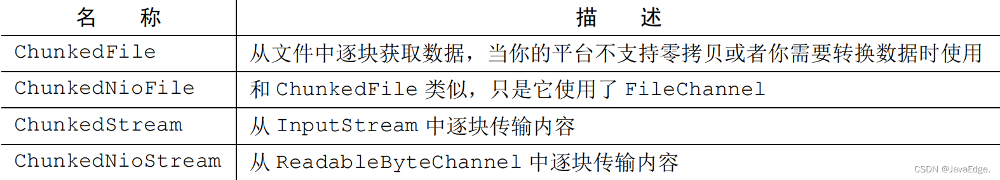

> ChunkedFile和ChunkedNioFile只在你的平台不支持零拷贝的时候使用, 如果支持零拷贝, 请使用`DefaultFileRegion `

下面是写文件时, 通过ChunkedWriteHandler和ChunkedStream, 将文件分为多个小数据包的案例:

~~~java
public class ChunkedWriteHandlerInitializer extends ChannelInitializer<Channel> {

    private final File file;

    public ChunkedWriteHandlerInitializer(File file) {
        this.file = file;
    }
    @Override
    protected void initChannel(Channel ch) throws Exception {
        ChannelPipeline pipeline = ch.pipeline();
        // 添加 ChunkedWriteHandler以处理作为ChunkedInput传入的数据
        pipeline.addLast(new ChunkedWriteHandler());
        // 一旦连接建立，WriteStreamHandler就开始写文件数据
        pipeline.addLast(new ChannelInboundHandlerAdapter() {

        	@Override
        	public void channelActive(ChannelHandlerContext ctx) throws Exception {
           	 	// 当连接建立时，channelActive()将使用ChunkedInput写文件数据
            	super.channelActive(ctx);
            	ctx.writeAndFlush(new ChunkedStream(new FileInputStream(file)));
        	}
    	});
    }
}
~~~


如果你自己有一个大的数据包, 想要拆分开来发送, 那么也可以自己来实现ChunkedInput接口, 然后通过ChunkedWriteHandler来拆分为小块, 发送出去

~~~java
// 拆分后chunk的数据类型为ByteBuf
public static class Message implements ChunkedInput<ByteBuf> {

        private final byte[] value;
        private int readIndex = 0;

        // 将一个超大的String拆开来多次传输
        public Message(String value) {
            this.value = value.getBytes(StandardCharsets.UTF_8);
        }

        // 返回true, 表示消息已经读取完毕, 之后会调用close()来释放资源
        // 返回false, 表示还没有读取完毕, 之后会调用readChunk()来读取数据
        @Override
        public boolean isEndOfInput() throws Exception {
            return readIndex >= value.length;
        }

        // 用于读取结束后, 释放相关的资源
        @Override
        public void close() throws Exception { }

        // 已经过期的方法
        @Override
        public ByteBuf readChunk(ChannelHandlerContext ctx) throws Exception {
            // 直接调用下面的新的方法就好了
            return readChunk(ctx.alloc());
        }

        // 从大的消息中读取一个chunk, 如果返回null, 表示当前消息中没有可以读取的内容
        // 但是这并不意味着消息读取完毕, 对于一些比较慢的Stream来说, 可能还有些chunk还没有到来
        @Override
        public ByteBuf readChunk(ByteBufAllocator allocator) throws Exception {
            int copyLength = Math.min(value.length - readIndex, 8);
            // 每次返回8字节作为一个chunk
            ByteBuf byteBuf = allocator.directBuffer(copyLength);
            byteBuf.writeBytes(value, readIndex, copyLength);
            readIndex += 8;
            return byteBuf;
        }

        // 返回整个消息的长度
        @Override
        public long length() {
            return value.length;
        }

        // 返回当前已经读取的消息的长度
        @Override
        public long progress() {
            return readIndex;
        }
    }
~~~


## 空闲检测

### IdleStateHandler

IdleStateHandler可以用于读写的空闲检测,  一旦检测到了空闲检测, 那么就会触发一个自定义事件

~~~java
public static void main(String[] args) {
        NioEventLoopGroup bossGroup = new NioEventLoopGroup();
        NioEventLoopGroup workerGroup = new NioEventLoopGroup(2);
        try {
            Channel channel = new ServerBootstrap().group(bossGroup, workerGroup).channel(NioServerSocketChannel.class)
                .option(ChannelOption.ALLOCATOR, ByteBufAllocator.DEFAULT).handler(new LoggingHandler())
                .childHandler(new ChannelInitializer<NioSocketChannel>() {
                    @Override
                    protected void initChannel(NioSocketChannel ch) throws Exception {
                        // 添加一个IdleStateHandler, 用于空闲检测
                        // 读空闲4s, 写空闲4s
                        // new IdleStateHandler(0, 0, 4, TimeUnit.SECONDS)也是一样的效果
                        ch.pipeline().addLast(new IdleStateHandler(4, 4, 0, TimeUnit.SECONDS));
                        // 添加一个自定义的处理器, 用于接受读写空闲的事件
                        ch.pipeline().addLast(new ChannelInboundHandlerAdapter() {

                            @Override
                            public void userEventTriggered(ChannelHandlerContext ctx, Object evt) throws Exception {
                                if (evt instanceof IdleStateEvent) {
                                    IdleStateEvent event = (IdleStateEvent) evt;
                                    if (event.equals(IdleStateEvent.FIRST_READER_IDLE_STATE_EVENT)) {
                                        System.out.println("first reader idle");
                                    } else if (event.equals(IdleStateEvent.READER_IDLE_STATE_EVENT)) {
                                        System.out.println("reader idle");
                                    } else if (event.equals(IdleStateEvent.FIRST_WRITER_IDLE_STATE_EVENT)) {
                                        System.out.println("first writer idle");
                                    } else if (event.equals(IdleStateEvent.WRITER_IDLE_STATE_EVENT)) {
                                        System.out.println("writer idle");
                                    } else if (event.equals(IdleStateEvent.FIRST_ALL_IDLE_STATE_EVENT)) {
                                        System.out.println("first all idle");
                                    } else if (event.equals(IdleStateEvent.ALL_IDLE_STATE_EVENT)) {
                                        System.out.println("all idle");
                                    }
                                } else {
                                    super.userEventTriggered(ctx, evt);
                                }
                            }
                        });
                    }
                }).bind(8088).sync().channel();

            channel.closeFuture().sync(); // 等待服务器关闭
        } catch (InterruptedException e) {
            throw new RuntimeException(e);
        } finally {
            bossGroup.shutdownGracefully();
            workerGroup.shutdownGracefully();
        }
    }
~~~


#### 读写事件的说明

IdleStateHandler在检测到了读写空闲的时候, 会根据情况发出6个事件

我们以读空闲距离, 首先要明白的是, 读空闲可能会持续很长的一个时间段, 所以当检测到读空闲的时候, 首先会发出一个`FIRST_READER_IDLE_STATE_EVENT`事件, 表示这是这个事件段内第一次检测到空闲, 之后如果还是空闲, 那么就会发出`READER_IDLE_STATE_EVENT`, 表示这是同一个时间段的空闲事件

一旦我们的channel有数据可以读了, 就会触发`IdleStateHandler.channelRead()`, 此时IdleStateHandler就知道读空闲的这一段时间已经过去了

等下一次又检测到读空闲的时候, 他还是会先发出一个`FIRST_READER_IDLE_STATE_EVENT`事件, 如果后续还是空闲, 那么就会发出`READER_IDLE_STATE_EVENT`了, 依次循环


写空闲也是类似, `FIRST_WRITER_IDLE_STATE_EVENT`表示一段时间的第一个写空闲事件, `WRITER_IDLE_STATE_EVENT`表示后续连续的写空闲事件

~~~java
public class IdleStateEvent {
    public static final IdleStateEvent FIRST_READER_IDLE_STATE_EVENT =
            new DefaultIdleStateEvent(IdleState.READER_IDLE, true);
    public static final IdleStateEvent READER_IDLE_STATE_EVENT =
            new DefaultIdleStateEvent(IdleState.READER_IDLE, false);
    public static final IdleStateEvent FIRST_WRITER_IDLE_STATE_EVENT =
            new DefaultIdleStateEvent(IdleState.WRITER_IDLE, true);
    public static final IdleStateEvent WRITER_IDLE_STATE_EVENT =
            new DefaultIdleStateEvent(IdleState.WRITER_IDLE, false);
    public static final IdleStateEvent FIRST_ALL_IDLE_STATE_EVENT =
            new DefaultIdleStateEvent(IdleState.ALL_IDLE, true);
    public static final IdleStateEvent ALL_IDLE_STATE_EVENT =
            new DefaultIdleStateEvent(IdleState.ALL_IDLE, false);
}
~~~


#### 原理

IdleStateHandler是一个双向的handler

对于读事件

- 当channel开始读取数据的时候, 会频繁的调用`channelRead`方法, 此时Handler就知道这个时候在读取数据, 定时任务在检测的时候会直接跳过, 因为知道还在读取数据
- 等到channel里面没有数据可以读的时候, 会调用`channelReadComplete`方法, 此时Handler就知道数据读取完毕, 并记录下当前时间
- Handler还会向eventloop中提交定时任务, 检测上次`channelReadComplete`的事件到现在的事件有没有超过阈值, 有就出发事件


对于写数据, 

- 当我们调用`channel.write()`的时候, 就会触发`write`方法, 此时IdleStateHandler会在promise中添加一个Listener, 当数据完全flush出去之后, 会回调Listener, 此时IdleStateHandler就会记录下当前的事件
- 同时Handler还会添加一个定时任务到eventLoop中, 用来检测上一次记录的事件, 到当前的事件, 如果超过了阈值就会触发写空闲

> https://cloud.tencent.com/developer/article/1152654
>
> 需要注意的是: 对于写事件, 因为只有数据完全被flush出去的时候, 才会回调Listener记录下时间, 如果你有一个超大的数据包, 那么在原生的SocketChannel上一次write可能还不足以将数据完全写出去, 要经历多次write才可以完全写出去
>
> 尽管此时一直在写数据, 但是只有完全写完了才会被记录下时间, 所以就可能你发送一个大的数据包, 虽然底层一直在write, 但是还是触发了写空闲


### ReadTimeoutHandler

- 专门用于检测读空闲
- 当在指定时间内没有读取到数据时，会抛出 `ReadTimeoutException` 并关闭连接

~~~java
// 在 pipeline 中添加 ReadTimeoutHandler
// 参数：超时时间，时间单位
pipeline.addLast(new ReadTimeoutHandler(30, TimeUnit.SECONDS));
~~~


### WriteTimeoutHandler

- 专门用于检测写空闲
- 当在指定时间内没有写入数据时，会抛出 `WriteTimeoutException` 并关闭连接

~~~java
// 在 pipeline 中添加 WriteTimeoutHandler
// 参数：超时时间，时间单位
pipeline.addLast(new WriteTimeoutHandler(30, TimeUnit.SECONDS));
~~~


## IP黑白名单

在netty中, 提供了RuleBasedIpFilter这个handler来对IP地址进行过滤, 不符合规则的IP的chanel会被关闭


### 使用

要实现这样的功能, 可以按照如下的步骤

1. 创建特定的过滤规则

   方式1: 通过通过IpFilterRule自定义对ip的拦截

   ~~~java
   IpFilterRule ipFilterRule = new IpFilterRule() {
       @Override
       public boolean matches(InetSocketAddress remoteAddress) {
       // 查询黑名单, 判断是否要拦截
           return remoteAddress.getHostString().startsWith("192.1");
        }
   
        @Override
        public IpFilterRuleType ruleType() {
            return IpFilterRuleType.REJECT;
        }
   };
   ~~~

   方式2:  你也可以通过IpFilterRule的实现类`IpSubnetFilterRule`来定义要拦截的网段

   ~~~java
   IpSubnetFilterRule rule = new IpSubnetFilterRule("192.168.1.1", 32, IpFilterRuleType.ACCEPT); // 只接受192.168.1.1这个ip
               IpSubnetFilterRule rule2 = new IpSubnetFilterRule("192.168.1.2", 24, IpFilterRuleType.REJECT); // 拒绝192.168.1这个ip段的所有ip
   ~~~

2. 创建`RuleBasedIpFilter`,  并传入对应的拦截规则

   ~~~java
   // 第一个参数表示如果一个ip不匹配任何rule, 那么是否接受这个ip
   // 如果有多个能够匹配ip的Rule, 那么第一个添加的会生效
   RuleBasedIpFilter filter = new RuleBasedIpFilter(true, ipFilterRule, rule, rule2) {
       // protected方法, 在连接接受的时候会调用, 你也可以不实现
       @Override
       protected void channelAccepted(ChannelHandlerContext ctx, InetSocketAddress remoteAddress) {
           System.out.println("accept: " + remoteAddress.getAddress().getHostAddress());
        }
   
         // protected方法, 在连接被拒绝的时候被调用, 你也可以选择不实现
         @Override
         protected ChannelFuture channelRejected(ChannelHandlerContext ctx, InetSocketAddress remoteAddress) {
             assert ctx.channel().isActive();
             assert ctx.channel().isWritable();
   
             // RuleBasedIpFilter会监听write的Promise, 在消息被写出去的时候, 通过回调函数关闭Channel
             // 如果没有写出内容, 那么可以返回null, 那么会直接关闭连接
             return ctx.writeAndFlush(Unpooled.wrappedBuffer("reject".getBytes(StandardCharsets.UTF_8)));
        }
   };
   ~~~

3. 将RuleBasedIpFilter添加到Handler中

   <font color=red> 请确保RuleBasedIpFilter在handler的第一位,  这样才可以确保拦截</font>

   ~~~java
   public static void main(String[] args) {
           NioEventLoopGroup bossGroup = new NioEventLoopGroup();
           NioEventLoopGroup workerGroup = new NioEventLoopGroup(2);
           try {
               Channel channel = new ServerBootstrap()
                       .group(bossGroup, workerGroup)
                       .channel(NioServerSocketChannel.class)
                       .option(ChannelOption.ALLOCATOR, ByteBufAllocator.DEFAULT)
                       .handler(new LoggingHandler())
                       .childHandler(new MyChannelInitializer())
                   	.bind(8088)
                   	.sync()
                   	.channel();
   
               channel.closeFuture().sync(); // 等待服务器关闭
           } catch (InterruptedException e) {
               throw new RuntimeException(e);
           } finally {
               bossGroup.shutdownGracefully();
               workerGroup.shutdownGracefully();
           }
       }
   public static class MyChannelInitializer extends ChannelInitializer<NioSocketChannel> {
           @Override
           protected void initChannel(NioSocketChannel ch) throws Exception {
               // ...省略
               
               // 必须添加在第一位, 确保能对ip进行过滤
               ch.pipeline().addLast(filter);
           }
       }
   ~~~

   

### 完整代码

~~~java
public class RuleBasedIpFilterTest {

    public static void main(String[] args) {
        NioEventLoopGroup bossGroup = new NioEventLoopGroup();
        NioEventLoopGroup workerGroup = new NioEventLoopGroup(2);
        try {
            Channel channel = new ServerBootstrap()
                    .group(bossGroup, workerGroup)
                    .channel(NioServerSocketChannel.class)
                    .option(ChannelOption.ALLOCATOR, ByteBufAllocator.DEFAULT)
                    .handler(new LoggingHandler())
                    .childHandler(new MyChannelInitializer()).bind(8088).sync().channel();

            channel.closeFuture().sync(); // 等待服务器关闭
        } catch (InterruptedException e) {
            throw new RuntimeException(e);
        } finally {
            bossGroup.shutdownGracefully();
            workerGroup.shutdownGracefully();
        }
    }

    public static class MyChannelInitializer extends ChannelInitializer<NioSocketChannel> {
        @Override
        protected void initChannel(NioSocketChannel ch) throws Exception {

            // 通过IpFilterRule来实现对ip的拦截
            IpFilterRule ipFilterRule = new IpFilterRule() {

                @Override
                public boolean matches(InetSocketAddress remoteAddress) {
                    // 查询黑名单, 判断是否要拦截
                    return remoteAddress.getHostString().startsWith("192.1");
                }

                @Override
                public IpFilterRuleType ruleType() {
                    return IpFilterRuleType.REJECT;
                }
            };

            // 或者你也可以使用现成的实现类, 这个实现类可以实现对IP, 子网掩码, 是否接受
            IpSubnetFilterRule rule = new IpSubnetFilterRule("192.168.1.1", 32, IpFilterRuleType.ACCEPT); // 只接受192.168.1.1这个ip
            IpSubnetFilterRule rule2 = new IpSubnetFilterRule("192.168.1.2", 24, IpFilterRuleType.REJECT); // 拒绝192.168.1这个ip段的所有ip

            // 如果有多个能够匹配ip的Rule, 那么第一个添加的会生效
            RuleBasedIpFilter filter = new RuleBasedIpFilter(true, ipFilterRule, rule, rule2) {
                // protected方法, 在连接接受的时候会调用
                @Override
                protected void channelAccepted(ChannelHandlerContext ctx, InetSocketAddress remoteAddress) {
                    System.out.println("accept: " + remoteAddress.getAddress().getHostAddress());
                }

                // protected方法, 在连接被拒绝的时候被调用
                @Override
                protected ChannelFuture channelRejected(ChannelHandlerContext ctx, InetSocketAddress remoteAddress) {
                    assert ctx.channel().isActive();
                    assert ctx.channel().isWritable();

                    // RuleBasedIpFilter会监听write的Promise, 在消息被写出去的时候, 通过回调函数关闭Channel
                    // 如果没有写出内容, 那么可以返回null, 那么会直接关闭连接
                    return ctx.writeAndFlush(Unpooled.wrappedBuffer("reject".getBytes(StandardCharsets.UTF_8)));
                }
            };

            // 必须添加在第一位, 确保能对ip进行过滤
            ch.pipeline().addLast(filter);
        }
    }
}
~~~


### 原理

`RuleBasedIpFilter`继承了`AbstractRemoteAddressFilter` 这个类,  

这个类会在`channelActive`和`channelRegistered`的时候, 判断是不是要拒绝这个地址的连接

~~~java
public abstract class AbstractRemoteAddressFilter<T extends SocketAddress> extends ChannelInboundHandlerAdapter {

    @Override
    public void channelRegistered(ChannelHandlerContext ctx) throws Exception {
        handleNewChannel(ctx); // 判断要不要拒绝连接
        ctx.fireChannelRegistered();
    }

    @Override
    public void channelActive(ChannelHandlerContext ctx) throws Exception {
        if (!handleNewChannel(ctx)) { // 判断要不要拒绝连接
            throw new IllegalStateException("cannot determine to accept or reject a channel: " + ctx.channel());
        } else {
            ctx.fireChannelActive();
        }
    }

    private boolean handleNewChannel(ChannelHandlerContext ctx) throws Exception {
        
        T remoteAddress = (T) ctx.channel().remoteAddress();
        // ...
        ctx.pipeline().remove(this); // 从pipeline中移除当前handler, 因为这个handler只需要使用一次

        // 调用accept来判断是不是要拒绝连接
        if (accept(ctx, remoteAddress)) {
            channelAccepted(ctx, remoteAddress); // 调用回调函数通知连接被accept了, 我们可以自定义这个回调函数
        } else {
            // 调用回调函数通知channel被拒绝了, 我们可以自定义这个回调函数
            ChannelFuture rejectedFuture = channelRejected(ctx, remoteAddress);
            
            
            if (rejectedFuture != null) {
                // 回调函数可能会往channel中写一些数据, 告知client拒绝连接, 所以我们要等future完成之后再调用channel.close()
                rejectedFuture.addListener(ChannelFutureListener.CLOSE);
            } else {
                // 否则直接关闭channle
                ctx.close();
            }
        }

        return true;
    }
}
~~~

然后在RuleBasedIpFilter中实现了accept方法, 来判断一个ip是不是要拒绝

~~~java
@Override
    protected boolean accept(ChannelHandlerContext ctx, InetSocketAddress remoteAddress) throws Exception {
        for (IpFilterRule rule : rules) {
            if (rule.matches(remoteAddress)) {
                return rule.ruleType() == IpFilterRuleType.ACCEPT;
            }
        }

        return acceptIfNotFound;
    }
~~~


## FileRegion零拷贝传输文件

Netty 传输文件的时候没有使用 ByteBuf 进行向 Channel 中写入数据，而使用的 FileRegion。下面通过示例了解下 FileRegion 的用法，然后深入源码分析 为什么不使用 ByteBuf 而使用 FileRegion。

```javascript
public final class FileServer {

    public static void main(String[] args) throws Exception {
        EventLoopGroup bossGroup = new NioEventLoopGroup(1);
        EventLoopGroup workerGroup = new NioEventLoopGroup();
        try {
            ServerBootstrap b = new ServerBootstrap();
            b.group(bossGroup, workerGroup)
             .channel(NioServerSocketChannel.class)
             .option(ChannelOption.SO_BACKLOG, 100)
             .handler(new LoggingHandler(LogLevel.INFO))
             .childHandler(new ChannelInitializer<SocketChannel>() {
                 @Override
                 public void initChannel(SocketChannel ch) throws Exception {
                     ChannelPipeline p = ch.pipeline();
                     p.addLast(
                             new StringEncoder(CharsetUtil.UTF_8),
                             new LineBasedFrameDecoder(8192),
                             new StringDecoder(CharsetUtil.UTF_8),
                             // 在不支持零拷贝的情况下使用ChunkedWriteHandler
                             new ChunkedWriteHandler(), 
                             // 自定义 Handler
                             new FileServerHandler());
                 }
             });
            ChannelFuture f = b.bind(8080).sync();
            f.channel().closeFuture().sync();
        } finally {
            bossGroup.shutdownGracefully();
            workerGroup.shutdownGracefully();
        }
    }
}
```

从示例中可以看出 ChannelPipeline 中添加了自定义的 FileServerHandler()。 下面看下 FileServerHandler 的源码，其它几个 Handler 的都是 Netty 中自带的，以后会分析这些 Handler 的具体实现原理。

```javascript
public class FileServerHandler extends SimpleChannelInboundHandler<String> {

    @Override
    public void channelRead0(ChannelHandlerContext ctx, String msg) throws Exception {
        RandomAccessFile raf = null;
        long length = -1;
        try {
            // 获取文件, msg是文件的path
            raf = new RandomAccessFile(msg, "r");
            length = raf.length();
        } catch (Exception e) {
            ctx.writeAndFlush("ERR: " + e.getClass().getSimpleName() + ": " + e.getMessage() + '\n');
            return;
        } finally {
            if (length < 0 && raf != null) {
                raf.close();
            }
        }

        ctx.write("OK: " + raf.length() + '\n');
        if (ctx.pipeline().get(SslHandler.class) == null) {
            // 传输文件使用了 DefaultFileRegion 进行写入到 NioSocketChannel 中
            ChannelProgressivePromise promise = channel.newProgressivePromise();
            ctx.write(new DefaultFileRegion(raf.getChannel(), 0, length), promise);
            // 通过progressivePromise来监听传输的进度
            promise.addListener(new ChannelProgressiveFutureListener() {
    			@Override
    			public void operationProgressed(ChannelProgressiveFuture future, long progress, long total) {
        			System.out.printf("进度: %.2f%%\n", 100.0 * progress / total);
    			}

    			@Override
    			public void operationComplete(ChannelProgressiveFuture future) {
        			if (future.isSuccess()) {
            			System.out.println("文件传输成功！");
        			} else {
            			future.cause().printStackTrace();
        			}
    			}
        } else {
            // SSL enabled - cannot use zero-copy file transfer.
            // 在不支持零拷贝的情况下, 使用ChunkedFile来减少内存压力
            ctx.write(new ChunkedFile(raf));
        }
        ctx.writeAndFlush("\n");
    }
}
```

从 FileServerHandler 中可以看出，传输文件使用了 DefaultFileRegion 进行写入到 NioSocketChannel 里。 我们知道向 NioSocketChannel 里写数据，都是使用的 ByteBuf 进行写入。


## 时间轮

### 为什么使用时间轮

在JDK中有如下Timer, DelayQueue, ScheduledThreadPoolExecutor可以用来实现定时任务等功能, 但是他们的实现都是使用的小顶堆, 虽然他们都会sleep直到元素可用, 和时间轮一样.

但是在添加和删除任务的时候, 小顶堆的时间复杂度都是O(logn), 无法满足海量的延时任务的调度


### netty时间轮的运行原理

https://www.cnblogs.com/binlovetech/p/18629491

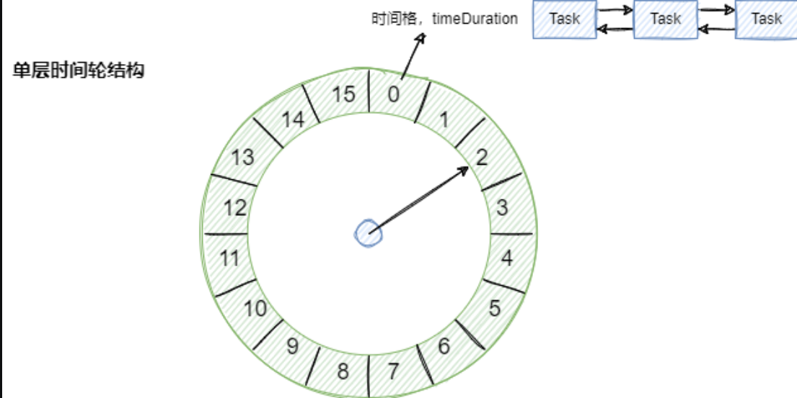

netty的时间轮写的比较简单, 可以直接看源码, 这里只将简单的概述

1. 在netty中, 一个时间轮默认有512个bucket, 每个bucket默认代表100ms
2. bucket内部有一个链表, 保存属于这个bucket的所有任务, 包括本轮和之后几轮的的任务
3. 每个task都有一个`remainningRounds`属性, 表示还有多少轮要执行这个任务
4. 在添加任务的时候, 不是直接将task添加到bucket中, 而是放到一个`timeouts`的队列中
5. 在取消任务的时候, 不是直接去找到task所在的bucket, 然后将他从bucket中移除出去, 而是直接将他放到一个`cancelledTimeouts`的队列中
6. 时间轮内部有一个worker线程, 他会sleep直到下一个tick的时间到来, 然后执行如下的步骤
   1. 计算当前tick使用的bucket
   2. 从`cancelledTimeouts`中取出所有的任务, 将他们从bucket中移除
   3. 从`timeouts`取出所有的任务, 计算所属的bucket, 然后添加到链表尾部
   4. 从当前使用的bucket中, 遍历链表, 如果`remainningRounds`为0, 那么就执行这个任务, 否则就将`remainingRounds--`,  表示过了一轮了


### 使用

在netty中, 提供了HashedTimeWheel来实现时间轮

~~~java
public static void main(String[] args) {

        HashedWheelTimer timer = new HashedWheelTimer(
                Executors.defaultThreadFactory(), // 用于创建驱动时间轮前进的worker线程的线程工程,默认为Executors.defaultThreadFactory()
                100, // 每个bucket表示的时间间隔, 默认为100
                TimeUnit.MILLISECONDS, // 默认为ms
                512, // 时间轮有多少个bucket, 默认为512
                true, // 是否检测资源泄露, 默认为true
                -1, // pending队列中能够保存的最大数量的任务, 默认为-1, 表示不限制
                Executors.newSingleThreadExecutor()); // 用于执行任务的线程池, 默认就是通过worker线程来执行

        // 提交任务, 如果时间轮没有启动, 那么会自动启动
        // 会返回一个Timeout对象, 类似于Future, 可以用来取消任务, 判断任务是否取消
        Timeout newedTimeout = timer.newTimeout((timeout) -> {
            timeout.isCancelled();

            System.out.println("hello");
        }, 0, TimeUnit.SECONDS);

        newedTimeout.isCancelled(); // 任务有没有被取消
        newedTimeout.cancel(); // 取消任务
        newedTimeout.isExpired(); // 任务有没有被执行完毕

        System.out.println(timer.pendingTimeouts()); // 查看pending队列中的任务数量

        timer.stop(); // 停止时间轮

    }
~~~

使用时间轮有以下几个注意点:

1. 一定要设置线程池, 否则默认就是通过Worker线程来执行任务, 会导致Worker线程无法准确的推动时间轮前进
2. 不必调用`timer.start()`方法,  因为在提交任务的时候, 会自动启动时间轮,  如果提前启动了也支持徒增浪费
3. 在不使用时间轮之后, 一定要调用`stop()`方法来停止时间轮
4. 在不使用时间轮之后, 一定要关闭时间轮中的线程池


## 零拷贝

### 传统 IO 问题

传统的 IO 将一个文件通过 socket 写出

```java
File f = new File("helloword/data.txt");
RandomAccessFile file = new RandomAccessFile(file, "r");

byte[] buf = new byte[(int)f.length()];
file.read(buf);

Socket socket = ...;
socket.getOutputStream().write(buf);
```

内部工作流程是这样的：


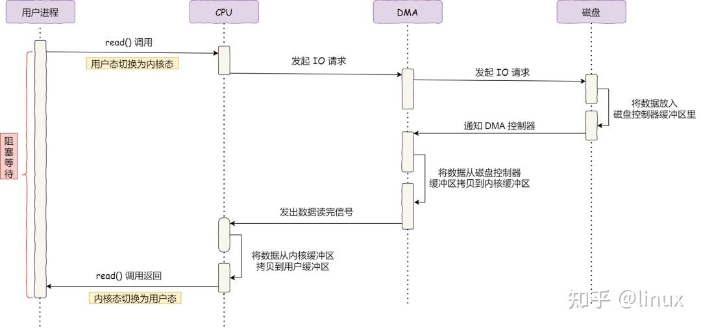

具体过程：

- 用户进程调用 read 方法，向操作系统发出 I/O 请求，请求读取数据到自己的内存缓冲区中，进程进入阻塞状态；
- 操作系统收到请求后，进一步将 I/O 请求发送 DMA，然后让 CPU 执行其他任务；
- DMA将数据从磁盘读取到内核缓冲区中, 然后发出中断
- CPU 收到 DMA 的信号，知道数据已经准备好，于是cpu将数据从内核拷贝到用户空间
- 系统调用返回, 从内核态切换回用户态

在上面的步骤中, 只有第四部需要cpu的配合, 其他步骤都不需要cpu

如果考虑到我们从磁盘读取文件, 然后发送到socket中的话

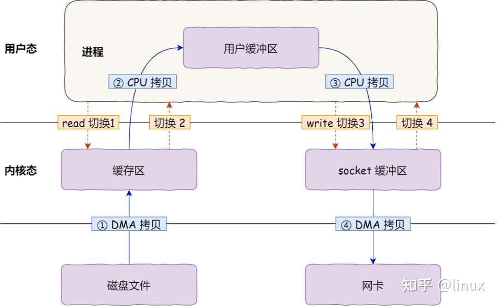

首先，期间共发生了 4 次用户态与内核态的上下文切换，因为发生了两次系统调用，一次是 read() ，一次是 write()，每次系统调用都得先从用户态切换到内核态，等内核完成任务后，再从内核态切换回用户态。

上下文切换到成本并不小，一次切换需要耗时几十纳秒到几微秒，虽然时间看上去很短，但是在高并发的场景下，这类时间容易被累积和放大，从而影响系统的性能。

其次，还发生了 4 次数据拷贝，其中两次是 DMA 的拷贝，另外两次则是通过 CPU 拷贝的，下面说一下这个过程：

- 第一次拷贝，把磁盘上的数据拷贝到操作系统内核的缓冲区里，这个拷贝的过程是通过 DMA 搬运的。
- 第二次拷贝，把内核缓冲区的数据拷贝到用户的缓冲区里，这个拷贝到过程是由 CPU 完成的。
- 第三次拷贝，把刚才拷贝到用户的缓冲区里的数据，再拷贝到内核的 socket 的缓冲区里，这个过程依然还是由 CPU 搬运的。
- 第四次拷贝，把内核的 socket 缓冲区里的数据，拷贝到网卡的缓冲区里，这个过程又是由 DMA 搬运的。

这种简单又传统的文件传输方式，存在冗余的上文切换和数据拷贝，在高并发系统里是非常糟糕的，多了很多不必要的开销，会严重影响系统性能。


### 零拷贝

https://zhuanlan.zhihu.com/p/616105519

https://zhuanlan.zhihu.com/p/467302001

在linux中,零拷贝技术通常可以通过两种方式来实现

1. sendfile
2. mmap + write

#### sendfile

linux 2.1 后提供的 sendFile 方法，java 中对应着两个 channel 调用 transferTo/transferFrom 方法拷贝数据


1. java 调用 transferTo 方法后，要从 java 程序的**用户态**切换至**内核态**，使用 DMA将数据读入**内核缓冲区**，不会使用 cpu
2. 数据从**内核缓冲区**传输到 **socket 缓冲区**，cpu 会参与拷贝
3. 最后使用 DMA 将 **socket 缓冲区**的数据写入网卡，不会使用 cpu

可以看到

* 只发生了一次用户态与内核态的切换
* 数据拷贝了 3 次


在linux2.4之后, 对sendfile函数进行了进一步的优化


1. java 调用 transferTo 方法后，要从 java 程序的**用户态**切换至**内核态**，使用 DMA将数据读入**内核缓冲区**，不会使用 cpu
2. 只会将一些 offset 和 length 信息拷入 **socket 缓冲区**，几乎无消耗
3. 使用 DMA 将 **内核缓冲区**的数据写入网卡，不会使用 cpu

整个过程仅只发生了一次用户态与内核态的切换，数据拷贝了 2 次。所谓的【零拷贝】，并不是真正无拷贝，而是在不会拷贝重复数据到 jvm 内存中，零拷贝的优点有

* 更少的用户态与内核态的切换
* 不利用 cpu 计算，减少 cpu 缓存伪共享
* 零拷贝适合小文件传输


下面是java中sendfile的一个小案例

~~~java
public class SendFileTest {
    public static void main(String[] args) {
        try {
            FileChannel readChannel = FileChannel.open(Paths.get("./jay.txt"), StandardOpenOption.READ);
            long len = readChannel.size();
            long position = readChannel.position();
            
            FileChannel writeChannel = FileChannel.open(Paths.get("./siting.txt"), StandardOpenOption.WRITE, StandardOpenOption.CREATE);
            //数据传输
            readChannel.transferTo(position, len, writeChannel);
            readChannel.close();
            writeChannel.close();
        } catch (Exception e) {
            System.out.println(e.getMessage());
        }
    }
~~~


#### mmap + write

在前面我们知道，read() 系统调用的过程中会把内核缓冲区的数据拷贝到用户的缓冲区里，于是为了减少这一步开销，我们可以用 mmap() 替换 read() 系统调用函数。

mmap() 系统调用函数会直接把内核缓冲区里的数据「映射」到用户空间，这样，操作系统内核与用户空间就不需要再进行任何的数据拷贝操作。

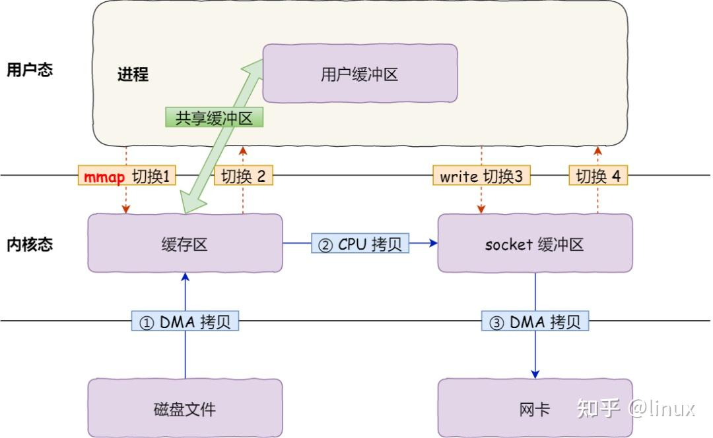

具体过程如下：

- 应用进程调用了 mmap() 后，DMA 会把磁盘的数据拷贝到内核的缓冲区里。接着，应用进程跟操作系统内核「共享」这个缓冲区；
- 应用进程再调用 write()，操作系统直接将内核缓冲区的数据拷贝到 socket 缓冲区中，这一切都发生在内核态，由 CPU 来搬运数据；
- 最后，把内核的 socket 缓冲区里的数据，拷贝到网卡的缓冲区里，这个过程是由 DMA 搬运的。

我们可以得知，通过使用 mmap() 来代替 read()， 可以减少一次数据拷贝的过程。

但这还不是最理想的零拷贝，因为仍然需要通过 CPU 把内核缓冲区的数据拷贝到 socket 缓冲区里，而且仍然需要 4 次上下文切换，因为系统调用还是 2 次。

下面是java中一个mmap的小案例

```java
public class MmapTest {

    public static void main(String[] args) {
        try {
            FileChannel readChannel = FileChannel.open(Paths.get("./jay.txt"), StandardOpenOption.READ);
            MappedByteBuffer data = readChannel.map(FileChannel.MapMode.READ_ONLY, 0, 1024 * 1024 * 40);
            FileChannel writeChannel = FileChannel.open(Paths.get("./siting.txt"), StandardOpenOption.WRITE, StandardOpenOption.CREATE);
            //数据传输
            writeChannel.write(data);
            readChannel.close();
            writeChannel.close();
        }catch (Exception e){
            System.out.println(e.getMessage());
        }
    }
```


### netty中使用到了零拷贝的部分

1. Netty的接收和发送使用的是DirectByteBuf, 他是内核中的一块内存, 然后通过mmap的方式映射到了jvm内存上

   使用直接内存进行Socket读写，不需要进行字节缓冲区的二次拷贝。

   如果使用JVM的堆内存进行Socket读写，JVM会将堆内存Buffer拷贝一份到直接内存中，然后才写入Socket中。

   **因为在进行write的时候, 要求对象的内存地址不变, 而java的gc会修改对象地址, 所以在write的时候, 会将数据从堆内存拷贝到直接内存, 然后再写到socket的内核缓冲区中, 相比于使用直接内存，消息在发送过程中多了一次缓冲区的内存拷贝。**

1. Netty的文件传输调用FileRegion包装的transferTo方法，可以直接将文件缓冲区的数据发送到目标Channel，避免通过循环write方式导致的内存拷贝问题。
2. Netty提供CompositeByteBuf类, 可以将多个ByteBuf合并为一个逻辑上的ByteBuf, 避免了各个ByteBuf之间的拷贝。
3. 通过wrap操作, 我们可以将byte[]数组、ByteBuf、ByteBuffer等包装成一个Netty ByteBuf对象, 进而避免拷贝操作。
4. ByteBuf支持slice操作，可以将ByteBuf分解为多个共享同一个存储区域的ByteBuf, 避免内存的拷贝。


## IO模型

### bio

在nio的时候, 调用read函数从socket中读取数据的话

如果此时数据还没有准备好的话, 那么会堵塞线程, 直到数据到来

然后dma将数据从网卡读取到内核缓冲区, 然后触发中断

然后cpu将数据从内核缓冲区读取到用户空间, 然后程序才返回

缺点:  会堵塞线程, 如果想要处理多个socket的话, 就需要多个线程, 用户多的话会线程爆炸

### nio

在调用read函数从socket中读取数据, 如果数据没有到来的话, 会直接返回

缺点: 用户需要一直调用read函数来判断数据是否到来

### io多路复用

https://zhuanlan.zhihu.com/p/11661880208

在io多路复用中, 一共有三种模型

#### select模型

~~~c
int select (int n, fd_set *readfds, fd_set *writefds, fd_set *exceptfds, struct timeval *timeout);
~~~

fd_set是一个数组, 长度固定为1024

如果你想要监听某个socket, 那么就将socket对应的文件描述符fd作为索引, 将fd_set中的元素设置为1, 比如我想要监听fd为3的socket, 那么就将fd_set[3]设置为1

readfds, writefds, exceptfds分别表示要监听可读事件, 可写事件, 是否异常的socket的fd

n表示readfds, writefds, exceptfds中最大的文件描述符+1, 比如三个fs_set分别是[00101],[1001], [0110], 那么n就是5


在调用select函数之后, 会从用户态切换到内核态, 并且会将readfds, writefds, exceptfds三个数组从用户态拷贝到内核态,  然后cpu在内核态中, 从0到n遍历这些数组, 看看有没有事件触发, 如果没有就sleep一段时间再看看, 直到有事件触发了, 他会将readfds, writefds, exceptfds这三个数组中的元素全部设置为0, 然后将有事件触发的socket的fd设置为了, 假如fd为3的socket触发了写事件, 那么就将writefds[3]设置为1,  之后将三个数组从内核态copy回用户态, 然后返回触发事件的个数

返回之后, 如果触发事件的个数大于0, 那么你需要遍历readfds, writefds, exceptfds三个数组, 看看哪个索引的元素为1, 那么就是索引对应的fd触发了事件

下面是c语音编写的, 通过select来监听socket的代码

~~~c
while(1) {
  connfd = accept(listenfd);
  fcntl(connfd, F_SETFL, O_NONBLOCK);
  fdlist.add(connfd);
}

struct timeval timeout;
int max = 0;  // 用于记录最大的fd，在轮询中时刻更新即可
FD_ZERO(&read_fd); // 初始化read_fd, 将所有元素都设置为0
FD_SET(4, &read_fd) // 将read_fd[4]设置为1, 表示监听fd=4的socket
FD_SET(10, &read_fd) // 将read_fd[4]设置为1, 表示监听fd=4的socket
int max = 11;  // 用于记录最大的fd，在轮询中时刻更新即可
while (1) {
    // 阻塞获取 每次需要把fd_set从用户态拷贝到内核态, 有事件发生的时候, 将fs_set清空并重新置位
    nfds = select(max + 1, &read_fd, &write_fd, NULL, &timeout);
    // 每次需要遍历所有fd，判断有无读写事件发生
    for (int i = 0; i <= max && nfds; ++i) {
        // 只读已就绪的文件描述符，不用过多遍历
        if (i == listenfd) {
            // 这里处理accept事件
            FD_SET(i, &read_fd);//将客户端socket加入到集合中
        }
        if (FD_ISSET(i, &read_fd)) {
            // 这里处理read事件
        }
    }
}
~~~

缺点:

1. 通过select, 会将三个fd_set拷贝到内核态, 等事件触发的时候, 将三个fd_set重新置位, 然后将他们拷贝回用户态, 这个效率是不行的
2. fd_set数组的大小为1024, 也就是最多能监听1024个socket, 显然是不够的
3. 返回之后, 用户需要知道哪个socket触发了事件, 必须遍历整个fs_set数组才知道


#### poll

poll的实现和select非常相似，只是描述fd集合的方式不同。

在poll中, 使用了pollfd的数据结构, 而不是fd_set的数据结构

~~~c
struct pollfd {
　　 int fd;           /*文件描述符*/
　　 short events;     /*监控的事件*/
　　 short revents;    /*监控事件中满足条件返回的事件*/
};
// struct pollfd类型的数组, 存储了待检测的文件描述符
// 描述的是数组 fds 的大小
// 指定poll函数的阻塞时长
int poll(struct pollfd *fds, unsigned long nfds, int timeout);   
~~~

上面通过pollfd来描述需要监听的fd, 和要监听的事件,  在调用poll函数之后, 也会将pollfd数组从用户态拷贝到内核态, 然后循环遍历pollfd中的fd, 看看有没有事件发生, 如果没有的话就sleep一段时间

如果有事件发生的话, 那么就将revents置位, 然后将pollfd数组从用户态拷贝回内核态, 然后返回触发事件的个数

在pollfd返回之后, 用户要想知道哪个fd发生了事件, 需要遍历整个pollfd数组


poll通过pollfd数组解决了select中fd_set大小为1024的文件, 但是还是要将pollfd数组从用户态拷贝到用户态, 然后从用户态拷贝回内核态, 同时要想知道哪个fd发生了事件, 需要遍历这个数组

他只解决了select的缺点2, 没有解决缺点1,3


#### epoll

在epoll中, 提供了三个函数

1. epoll_create函数

   ~~~c
   int epoll_create(int size); // size无作用
   ~~~

   调用这个函数, 会在内核态创建一个event_poll结构体,  他内部有一个红黑树, 用来保存要监听的fd, 同时还有一个链表, 用来保存就绪的socket的fd

   返回值是event_poll结构体的文件描述符fd

2. epoll_ctl

   ~~~c
   int epoll_ctl(int epfd, int op, int fd, struct epoll_event *event); 
   ~~~

   - **功能：**epoll 的事件注册函数，它不同于 select() 是在监听事件时告诉内核要监听什么类型的事件，而是在这里先注册要监听的事件类型。
   - **参数epfd:** epoll 专用的文件描述符，epoll_create()的返回值
   - **参数op:** 表示动作，用三个宏来表示：
     1. EPOLL_CTL_ADD：注册新的 fd 到 epfd 中；
     2. EPOLL_CTL_MOD：修改已经注册的fd的监听事件；
     3. EPOLL_CTL_DEL：从 epfd 中删除一个 fd；

   - **参数fd:** 需要监听的文件描述符
   - **参数event:** 告诉内核要监听什么事件, 他可以是以下几个宏的集合
     - EPOLLIN ：表示对应的文件描述符可以读（包括对端 SOCKET 正常关闭）；
     - EPOLLOUT：表示对应的文件描述符可以写；
     - EPOLLPRI：表示对应的文件描述符有紧急的数据可读（这里应该表示有带外数据到来）；
     - EPOLLERR：表示对应的文件描述符发生错误；
     - EPOLLHUP：表示对应的文件描述符被挂断；
     - EPOLLET ：将 EPOLL 设为边缘触发(Edge Trigger)模式，这是相对于水平触发(Level Trigger)来说的。
     - EPOLLONESHOT：只监听一次事件，当监听完这次事件之后，如果还需要继续监听这个 socket 的话，需要再次把这个 socket 加入到 EPOLL 队列里

3. epoll_wait

   ~~~c
   int epoll_wait(int epfd, struct epoll_event * events, int maxevents, int timeout); 
   ~~~

   功能：等待事件的产生，收集在 epoll 监控的事件中已经发送的事件，类似于 select() 调用。

   - 参数epfd: epoll 专用的文件描述符，epoll_create()的返回值
   - 参数events: 他是一个数组, 用来接受已经就绪事件
   - 参数maxevents: maxevents 告之内核这个 events 有多少个 。
   - 参数timeout: 超时时间，单位为毫秒，为 -1 时，函数为阻塞。


当我们调用epoll_create函数的时候, 首先会在内核态创建一个event_poll结构, 他内部有一个红黑树, 和一个就绪列表

我们可以调用epoll_create函数, 来添加, 删除, 修改需要监听的socket的fd,  这些fd会保存在红黑树中, 新增删除查找的复杂度都是logN

之后我们可以调用event_wait函数, 来等待事件的到来,  这会从用户态切换到内核态, 并堵塞线程, cpu就可以干其他事情了

当网络数据到达网卡后, dma会将数据从网卡拷贝到socket缓冲区中, 然后触发软中断, 然后cpu会在回调函数中, 将就绪的fd拷贝到就绪列表中,  然后将就绪列表拷贝到epoll_wait的events函数中, 然后返回epoll_wait函数

我们可以在后续代码中, 直接遍历events数组, 就可以获取所有就绪的fd了

<video src="https://vdn6.vzuu.com/SD/346e30f4-9119-11eb-bb4a-4a238cf0c417.mp4?pkey=AAXysgBEHgXthexHCE_s62DGXbQrx82HQZ5Kmv4yVffZFAkpqkbukL5yG9Ge2y_rlQoeIYYNC9YPTCzZJpsAMf3L&bu=078babd7&c=avc.0.0&expiration=1749965898&f=mp4&pu=078babd7&v=ks6" controls></video>


- epoll 采用红黑树管理文件描述符
  从上图可以看出，epoll使用红黑树管理文件描述符，红黑树插入和删除的都是时间复杂度 O(logN)，不会随着文件描述符数量增加而改变。
  select、poll采用数组或者链表的形式管理文件描述符，那么在遍历文件描述符时，时间复杂度会随着文件描述的增加而增加。
- epoll 将文件描述符添加和检测分离，减少了文件描述符拷贝的消耗
  


epoll相较于select

- **解决了fd_set大小的限制**
- **我们不需要像select函数一样遍历整个fd_set才能知道哪些fd就绪了**
- **epoll是通过软终端的回调函数来将fd拷贝到就绪列表中的, 而不是像select一样循环遍历**
- epoll采用了红黑树来管理socket的文件描述符fd, 插入和删除的时间复杂度都是logN, 而select和poll都是使用数组或者链表, 在遍历的时候, 事件复杂度为N
- select和poll 调用时会将全部监听的 fd 从用户态空间拷贝至内核态空间并线性扫描一遍找出就绪的 fd 再返回到用户态。下次需要监听时，又需要把之前已经传递过的文件描述符再读传递进去，增加了拷贝文件的无效消耗，当文件描述很多时，性能瓶颈更加明显。
  而epoll只需要使用epoll_ctl添加一次，后续的检查使用epoll_wait，减少了文件拷贝的消耗。


下面是通过epoll来创建socket服务端的代码

~~~c
const int MAX_EVENT_NUMBER = 10000; //最大事件数
// 设置句柄非阻塞
int setnonblocking(int fd)
{
    int old_option = fcntl(fd, F_GETFL);
    int new_option = old_option | O_NONBLOCK;
    fcntl(fd, F_SETFL, new_option);
    return old_option;
}

int main(){

    // 创建套接字
    int nRet=0;
    int m_listenfd = socket(PF_INET, SOCK_STREAM, 0);
    if(m_listenfd<0)
    {
        printf("fail to socket!");
        return -1;
    }
    // 
    struct sockaddr_in address;
    bzero(&address, sizeof(address));
    address.sin_family = AF_INET;
    address.sin_addr.s_addr = htonl(INADDR_ANY);
    address.sin_port = htons(6666);

    int flag = 1;
    // 设置ip可重用
    setsockopt(m_listenfd, SOL_SOCKET, SO_REUSEADDR, &flag, sizeof(flag));
    // 绑定端口号
    int ret = bind(m_listenfd, (struct sockaddr *)&address, sizeof(address));
    if(ret<0)
    {
        printf("fail to bind!,errno :%d",errno);
        return ret;
    }

    // 监听连接fd
    ret = listen(m_listenfd, 200);
    if(ret<0)
    {
        printf("fail to listen!,errno :%d",errno);
        return ret;
    }

    // 初始化红黑树和事件链表结构rdlist结构
    epoll_event events[MAX_EVENT_NUMBER];
    // 创建epoll实例
    int m_epollfd = epoll_create(5);
    if(m_epollfd==-1)
    {
        printf("fail to epoll create!");
        return m_epollfd;
    }


    // 创建节点结构体将监听连接句柄
    epoll_event event;
    event.data.fd = m_listenfd;
    //设置该句柄为边缘触发（数据没处理完后续不会再触发事件，水平触发是不管数据有没有触发都返回事件），
    event.events = EPOLLIN | EPOLLET | EPOLLRDHUP;
    // 添加监听连接句柄作为初始节点进入红黑树结构中，该节点后续处理连接的句柄
    epoll_ctl(m_epollfd, EPOLL_CTL_ADD, m_listenfd, &event);

    //进入服务器循环
    while(1)
    {
        int number = epoll_wait(m_epollfd, events, MAX_EVENT_NUMBER, -1);
        if (number < 0 && errno != EINTR)
        {
            printf( "epoll failure");
            break;
        }
        for (int i = 0; i < number; i++)
        {
            int sockfd = events[i].data.fd;
            // 属于处理新到的客户连接
            if (sockfd == m_listenfd)
            {
                struct sockaddr_in client_address;
                socklen_t client_addrlength = sizeof(client_address);
                int connfd = accept(m_listenfd, (struct sockaddr *)&client_address, &client_addrlength);
                if (connfd < 0)
                {
                    printf("errno is:%d accept error", errno);
                    return false;
                }
                epoll_event event;
                event.data.fd = connfd;
                //设置该句柄为边缘触发（数据没处理完后续不会再触发事件，水平触发是不管数据有没有触发都返回事件），
                event.events = EPOLLIN | EPOLLRDHUP;
                // 添加监听连接句柄作为初始节点进入红黑树结构中，该节点后续处理连接的句柄
                epoll_ctl(m_epollfd, EPOLL_CTL_ADD, connfd, &event);
                setnonblocking(connfd);
            }
            else if (events[i].events & (EPOLLRDHUP | EPOLLHUP | EPOLLERR))
            {
                //服务器端关闭连接，
                epoll_ctl(m_epollfd, EPOLL_CTL_DEL, sockfd, 0);
                close(sockfd);
            }
            //处理客户连接上接收到的数据
            else if (events[i].events & EPOLLIN)
            {
                char buf[1024]={0};
                read(sockfd,buf,1024);
                printf("from client :%s");

                // 将事件设置为写事件返回数据给客户端
                events[i].data.fd = sockfd;
                events[i].events = EPOLLOUT | EPOLLET | EPOLLONESHOT | EPOLLRDHUP;
                epoll_ctl(m_epollfd, EPOLL_CTL_MOD, sockfd, &events[i]);
            }
            else if (events[i].events & EPOLLOUT)
            {
                std::string response = "server response \n";
                write(sockfd,response.c_str(),response.length());

                // 将事件设置为读事件，继续监听客户端
                events[i].data.fd = sockfd;
                events[i].events = EPOLLIN | EPOLLRDHUP;
                epoll_ctl(m_epollfd, EPOLL_CTL_MOD, sockfd, &events[i]);
            }
            //else if 可以加管道，unix套接字等等数据
        }
    }
}
~~~


#### epoll的水平触发和边缘触发

**水平触发(LT)**

关注点是数据是否有无，只要读缓冲区不为空，写缓冲区不满，那么epoll_wait就会一直返回就绪，水平触发是epoll的默认工作方式。

**边缘触发(ET)**

关注点是变化，只要缓冲区的数据有变化，epoll_wait就会返回就绪。
这里的数据变化并不单纯指缓冲区从有数据变为没有数据，或者从没有数据变为有数据，还包括了数据变多或者变少。即当buffer长度有变化时，就会触发。
假设epoll被设置为了边缘触发，当客户端写入了100个字符，由于缓冲区从0变为了100，于是服务端epoll_wait触发一次就绪，服务端读取了2个字节后不再读取。这个时候再去调用epoll_wait会发现不会就绪，只有当客户端再次写入数据后，才会触发就绪。
这就导致如果使用ET模式，那就必须保证要「一次性把数据读取&写入完」，否则会导致数据长期无法读取/写入。

## 