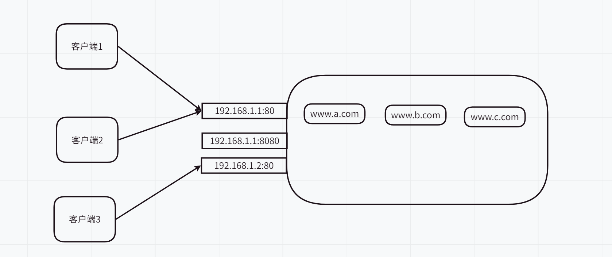

## 安装Nginx

> 安装

Nginx 在默认的 Ubuntu 源仓库中可用。想要安装它，运行下面的命令：

```text
sudo apt update
sudo apt install nginx
```

一旦安装完成，Nginx 将会自动被启动。你可以运行下面的命令来验证它：

```shell
sudo systemctl status nginx
sudo systemctl start nginx
sudo systemctl stop nginx
sudo systemctl enable nginx
sudo systemctl disable nginx
```

输出类似下面这样：

```text
● nginx.service - A high performance web server and a reverse proxy server
     Loaded: loaded (/lib/systemd/system/nginx.service; enabled; vendor preset: enabled)
     Active: active (running) since Sat 2020-05-02 20:25:43 UTC; 13s ago
...
```

>  配置防火墙

现在你已经在你的服务器上安装和运行了 Nginx，你需要确保你的防火墙被配置好，允许流量通过 HTTP（`80`）和 HTTPS（`443`）端口。假设你正在使用`UFW`,你可以做的是启用 ‘Nginx Full’ profile，它包含了这两个端口：

```text
sudo ufw allow 'Nginx Full'
```

想要验证状态，输入：

```text
sudo ufw status
```

输出将会像下面这样：

```text
Status: active

To                         Action      From
--                         ------      ----
22/tcp                     ALLOW       Anywhere
Nginx Full                 ALLOW       Anywhere
22/tcp (v6)                ALLOW       Anywhere (v6)
Nginx Full (v6)            ALLOW       Anywhere (v6)
```

> 测试

想要测试你的新 Nginx 安装，在你的浏览器中打开`http://YOUR_IP`，你应该可以看到默认的 Nginx 加载页面，像下面这样：


## 相关命令

~~~shell
sudo systemctl status nginx
sudo systemctl start nginx
sudo systemctl stop nginx
sudo systemctl enable nginx
sudo systemctl disable nginx
sudo systemctl restart nginx

# 在nginx执行文件的目录下执行,  可以通过which nginx来查找
nginx -v # 查看版本
nginx # 启动
nginx -s reload # 重新加载配置文件
nginx -s stop # 停止nginx
~~~


## 配置文件

- 所有的 Nginx 配置文件都在`/etc/nginx/`目录下。
- 主要的 Nginx 配置文件是`/etc/nginx/nginx.conf`

> 配置文件讲解

- 全局块

  - 从配置文件开始到event块之间的内容
  - 主要影响nginx服务器整体运行的配置指令, 主要包括配置运行nginx服务器的用户(组), 允许生成的worker process数, 进程pid存放路径, 日志存放路径和类型, 配置文件的引入

- event块

  - event块涉及的指令主要影响nginx服务器与用户的网络连接, 常用的设置包括开启对work process下的网络连接进行序列化, 是否允许同时接收多个网络连接, 选取哪种事件驱动模型来处理连接请求, 每个word process可以同时支持的最大连接数等

- http块

  - 代理, 缓存, 日志等功能和第三方模块的配置都在这里

  - http块也包括http全局块, server块

  - http全局块配置包括文件引入, mime-type定义, 日志自定义, 连接超时时间, 单链接请求上线等

  - server块和虚拟主机有密切关系, 虚拟主机从用户角度看, 和一台独立硬件的主机是完全一样的, 该技术的产生是为了节省互联网服务器硬件成本

  - 每个http块可以包含多个server块, 而每个server块就相当于一个虚拟主机

  - 每个server块也分为全局server块, 以及可以同时包含多个location块

  - 全局server块中最常见的配置是本虚拟主机监听的配置和本虚拟主机的名称和ip配置

  - 一个server块可以有多个location块, 这个主要作用是基于nginx服务器接收到的请求字符串(列如server_name/uri-string), 对虚拟主机名称之外的字符串, 对特定的请求的处理.   地址定向, 数据缓存, 应答控制等功能, 还有许多第三方模块的配置也在这里进行

    

~~~conf
# 全局块
user www-data;
worker_processes auto; # 工作线程数, 越大并发处理量越多, 但是也受硬件限制
pid /run/nginx.pid;

# event块
events {
	worker_connections 768; # 支持的最大连接数
	# multi_accept on;
}
# http块
http {
	# http全局块
	##
	# Basic Settings
	##
	# server块
	server {
		listen 			80; # 监听80端口
		server_name		192.168.2.133;
		
		location / {
			# 配置被代理的服务器
			proxy_pass http://49.234.7.219:8080;
		}
		
	}

	sendfile on;
	tcp_nopush on;
	tcp_nodelay on;
	keepalive_timeout 65;
	types_hash_max_size 2048;
	# server_tokens off;

	# server_names_hash_bucket_size 64;
	# server_name_in_redirect off;

	include /etc/nginx/mime.types;
	default_type application/octet-stream;

	##
	# SSL Settings
	##

	ssl_protocols TLSv1 TLSv1.1 TLSv1.2; # Dropping SSLv3, ref: POODLE
	ssl_prefer_server_ciphers on;

	##
	# Logging Settings
	##

	access_log /var/log/nginx/access.log;
	error_log /var/log/nginx/error.log;

	##
	# Gzip Settings
	##

	gzip on;
	gzip_disable "msie6";

	# gzip_vary on;
	# gzip_proxied any;
	# gzip_comp_level 6;
	# gzip_buffers 16 8k;
	# gzip_http_version 1.1;
	# gzip_types text/plain text/css application/json application/javascript text/xml application/xml application/xml+rss text/javascript;

	##
	# Virtual Host Configs
	##

	include /etc/nginx/conf.d/*.conf;
	include /etc/nginx/sites-enabled/*;
}


#mail {
#	# See sample authentication script at:
#	# http://wiki.nginx.org/ImapAuthenticateWithApachePhpScript
# 
#	# auth_http localhost/auth.php;
#	# pop3_capabilities "TOP" "USER";
#	# imap_capabilities "IMAP4rev1" "UIDPLUS";
# 
#	server {
#		listen     localhost:110;
#		protocol   pop3;
#		proxy      on;
#	}
# 
#	server {
#		listen     localhost:143;
#		protocol   imap;
#		proxy      on;
#	}
#}
~~~


## nginx如何处理请求

> http request header中的host字段

我们知道，不同的域名通过 A 记录或者 CNAME 方式可以连接都同一个 IP 下，同一个 IP 也可以设置多个不同站点，那么访问不同的域名都转发到同一 IP ，怎么区分这些不同的站点呢，就是用的 Host 字段。这样每次访问都会根据不同的 Host 的信息请求到不同的站点上面。

比如说有一台 ip 地址为 11.11.11.11 的服务器，在这台服务器上部署着淘宝、京东、拼多多的网站，并且配置了三个虚拟主机：a.com, b.com, c.com, 这三个域名都指向 11.11.11.11。 当我们访问 c.com 的网站时，看到的是拼多多的页面而不是淘宝和京东的页面，原因就是 Host 请求头决定着访问哪个虚拟主机。

> 总结(写在前面)

**一个nginx主机可以有多个域名, 多个ip, 每个ip多个端口,  并且在其上面可以建立多个网站**

**客户端可以通过不同的ip和端口来访问nginx, 也可以使用相同的ip和端口来访问nginx上的不同网站, 只需要他们的http携带的host header字段不同即可.**

比如在一台电脑上架设了www.a.com, www.b.com, www.c.com, 那么他们都可以使用192.168.1.123:80来访问nginx, 只需要通过host header字段来指定他们需要访问的具体的网站即可.

所以在nginx的配置文件中有两个配置listen和server_name

listen用来匹配http请求访问的ip和端口(如果listen上面只有端口号, 比如80, 那么表示匹配任何ip)

server_name用来匹配http请求上的host字段

如果两个都匹配上, 那么就将请求交给该server块来处理

如果只有listen匹配上, 那么就交给默认的server来处理(默认第一个)

交给server后, 然后由location来指定具体的处理规则



还是使用下面配置文件说明:

~~~
server {
    listen      192.168.1.1:80;
    server_name example.org www.example.org;
    ...
}
server {
    listen      192.168.1.1:80 default_server;
    server_name example.net www.example.net;
    ...
}
server {
    listen      192.168.1.2:80 default_server;
    server_name example.com www.example.com;
    ...
}
~~~

访问192.168.1.1:80的http, 如果host为example.org, 那么会给第一个server块处理

访问192.168.1.1:80的http, 如果host为example.net, 那么会给第二个server块处理

如果访问192.168.1.1:80的http, 如果没有host字段, 那么会给默认的server块处理, 默认为第一个listen为192.168.1.1:80的server块, 当前为第二个

所以每个不同的listen都可以有一个default server, 并且是标注在listen上的

> #### Name-based virtual servers

```
server {
    listen      80;
    server_name example.org www.example.org;
    ...
}

server {
    listen      80;
    server_name example.net www.example.net;
    ...
}

server {
    listen      80;
    server_name example.com www.example.com;
    ...
}
```

上面三个虚拟服务器都监听在 *:80,  当我们通过80端口访问到nginx的时候, nginx会获取http request header中的host字段来和server_name进行匹配, 来决定由那个server块来处理请求, 如果host没有匹配任何server_name, 或者没有host字段, 那么就会有默认的server来处理, 默认的server是第一个匹配listen的server, 在该案例中就是第一个server

也可以通过下面手动指定

```
server {
    listen      80 default_server;
    server_name example.net www.example.net;
    ...
}
```

> 没有Host, 请求不处理

如果request header没有host字段, 请求不应该被处理, 那么可以如下配置

```
server {
    listen      80;
    server_name "";
    return      444;
}
```

server_name设置为空字符串会匹配没有host字段的请求, 然后返回一个444的请求码, 然后关闭连接

> #### Mixed name-based and IP-based virtual servers

```
server {
    listen      192.168.1.1:80;
    server_name example.org www.example.org;
    ...
}

server {
    listen      192.168.1.1:80;
    server_name example.net www.example.net;
    ...
}

server {
    listen      192.168.1.2:80;
    server_name example.com www.example.com;
    ...
}
```

在该配置中, nginx首先匹配请求要访问的ip地址和端口是否匹配listen, 然后匹配host字段是否匹配server_name字段, 如果host没有, 或者没有匹配的server_name, 那么会使用默认的server. 

比如如果没有第三个server, 那么一个访问192.168.1.1:80并且host为www.example.com的请求会被第一个server处理

默认server只是listen的一个属性, 说明每个不同的listen都可以指定default server

```
server {
    listen      192.168.1.1:80;
    server_name example.org www.example.org;
    ...
}

server {
    listen      192.168.1.1:80 default_server;
    server_name example.net www.example.net;
    ...
}

server {
    listen      192.168.1.2:80 default_server;
    server_name example.com www.example.com;
    ...
}
```

> nginx如何匹配location

```
server {
    listen      80;
    server_name example.org www.example.org;
    root        /data/www;

    location / {
        index   index.html index.php;
    }

    location ~* \.(gif|jpg|png)$ {
        expires 30d;
    }

    location ~ \.php$ {
        fastcgi_pass  localhost:9000;
        fastcgi_param SCRIPT_FILENAME
                      $document_root$fastcgi_script_name;
        include       fastcgi_params;
    }
}
```

nginx首先搜索精确的前缀匹配, 在上面的匹配中, 只有"/"是精确匹配, 并且由于他匹配任何请求, 所以他会被用作最后的匹配

然后nginx按照顺序查找由正则表达式给出的location, 第一个匹配的location将会被使用, 如果没有匹配的location, 那么nginx会使用"/"

注意nginx只会使用请求中的uri来匹配location中的表达式, querystring不会使用

Now let’s look at how requests would be processed in the configuration above:

- A request “`/logo.gif`” is matched by the prefix location “`/`” first and then by the regular expression “`\.(gif|jpg|png)$`”, therefore, it is handled by the latter location. Using the directive “`root /data/www`” the request is mapped to the file `/data/www/logo.gif`, and the file is sent to the client.
- A request “`/index.php`” is also matched by the prefix location “`/`” first and then by the regular expression “`\.(php)$`”. Therefore, it is handled by the latter location and the request is passed to a FastCGI server listening on localhost:9000. The [fastcgi_param](https://nginx.org/en/docs/http/ngx_http_fastcgi_module.html#fastcgi_param) directive sets the FastCGI parameter `SCRIPT_FILENAME` to “`/data/www/index.php`”, and the FastCGI server executes the file. The variable `$document_root` is equal to the value of the [root](https://nginx.org/en/docs/http/ngx_http_core_module.html#root) directive and the variable `$fastcgi_script_name` is equal to the request URI, i.e. “`/index.php`”.
- A request “`/about.html`” is matched by the prefix location “`/`” only, therefore, it is handled in this location. Using the directive “`root /data/www`” the request is mapped to the file `/data/www/about.html`, and the file is sent to the client.
- Handling a request “`/`” is more complex. It is matched by the prefix location “`/`” only, therefore, it is handled by this location. Then the [index](https://nginx.org/en/docs/http/ngx_http_index_module.html#index) directive tests for the existence of index files according to its parameters and the “`root /data/www`” directive. If the file `/data/www/index.html` does not exist, and the file `/data/www/index.php` exists, then the directive does an internal redirect to “`/index.php`”, and nginx searches the locations again as if the request had been sent by a client. As we saw before, the redirected request will eventually be handled by the FastCGI server.


## location块的说明

https://www.cnblogs.com/54chensongxia/p/12938929.html

location块的主要作用是对uri进行匹配，对特定的请求进行处理。地址定向、数据缓存和应答控制等功能都是在这部分实现。许多第三方模块的配置也是在location块中提供功能。

在Nginx的官方文档中定义的location的语法结构为：

```css
location [ = | ~ | ~* | ^~ ] uri { ... }
```

其中，uri变量是待匹配的请求字符串，**可以是不含正则表达的字符串，如/myserver.php等；也可以是包含有正则表达的字符串，如 .php$（表示以.php结尾的URL）等。**为了下文叙述方便，我们约定，不含正则表达的uri称为“标准uri”，使用正则表达式的uri称为“正则uri”。

其中方括号里的部分，是可选项，用来改变请求字符串与 uri 的匹配方式。在介绍四种标识的含义之前，我们需要先了解不添加此选项时，Nginx服务器是如何在server块中搜索并使用location块的uri和请求字符串匹配的。

在不添加此选项时，Nginx服务器首先在server块的多个location块中搜索是否有标准uri和请求字符串匹配，如果有多个可以匹配，就记录匹配度最高的一个。然后，服务器再用location块中的正则uri和请求字符串匹配，当第一个正则uri匹配成功，结束搜索，并使用这个location块处理此请求；如果正则匹配全部失败，就使用刚才记录的匹配度最高的location块处理此请求。

了解了上面的内容，就可以解释可选项中各个标识的含义了：

- “=”，用于标准uri前，要求请求字符串与uri严格匹配。如果已经匹配成功，就停止继续向下搜索并立即处理此请求。
- “^～”，用于标准uri前，要求Nginx服务器找到标识uri和请求字符串匹配度最高的location后，立即使用此location处理请求，而不再使用location块中的正则uri和请求字符串做匹配。
- “～”，用于表示uri包含正则表达式，并且区分大小写。
- “～`*`”，用于表示uri包含正则表达式，并且不区分大小写。注意如果uri包含正则表达式，就必须要使用“～”或者“～*”标识。

## nginx实现转发

~~~
server {
	listen 80;
	server_name 192.168.17.129;
	
	location / {
		proxy_pass http://127.0.0.1:8080 #将所有请求转发到127.0.0.1的8080端口
		root html;
		index index.html index.htm;
	}
}
~~~

## nginx实现不同路径转发到不同网站

~~~
server {
	listen 9001;
	server_name 192.168.17.129;
	location ~ /edu/ {
		proxy_pass http://127.0.0.1:8080; # 所有以/edu开头的转发到8080端口
	}
	location ~ /vod/ {
		proxy_pass http://127.0.0.1:8081 # 所有以/edu开头的转发到8081端口
	}
~~~

## nginx实现负载均衡

> 轮询(默认)

~~~
upstream myserver {
	server 115.28.52.63:8080
	server 115.28.52.63:8081
}
server {
	...
	location / {
		proxy_pass http://myserver; #轮询转发到myserver, 如果后端服务器down掉, 能自动剔除
	}
}
~~~

> 权重

~~~
upstream myserver {
	server 115.28.52.63:8080 weight=1
	server 115.28.52.63:8081 weight=2
}
server {
	...
	location / {
		proxy_pass http://myserver; #根据权重转发, 权重默认为1
	}
}
~~~

> 根据ip hash

~~~
upstream myserver {
	ip_hash
	server 115.28.52.63:8080 
	server 115.28.52.63:8081 
}
server {
	...
	location / {
		proxy_pass http://myserver; #每个请求按照ip的hash结果分配, 这样每个访客固定访问一个后端服务器, 可以解决session问题
	}
}
~~~

> fair(第三方, 需要额外安装插件)

按后档服务器的响应时间来分配请求, 响应事件最短的优先分配

~~~
upstream myserver {
	fair
	server 115.28.52.63:8080 
	server 115.28.52.63:8081 
}
server {
	...
	location / {
		proxy_pass http://myserver; 
	}
}
~~~

## nginx实现动静分离

~~~
server {
	listen 80;
	server_name 192.168.17.129;
	location /wwww/ {
		root /data/; # 指定对应资源在linux目录下的根目录
		index index.html index.htm;
	}
	location /image/ {
		root /data/;
		autoindex on;
	}
~~~

访问192.168.17.129/www, 会直接返回/data/www/index.html

访问192.168.17.129/image, 会显示出image下的所有资源

访问192.168.17.129/image/a.image, 会返回/data/image/a.image图片

## nginx实现高可用

无所吊谓