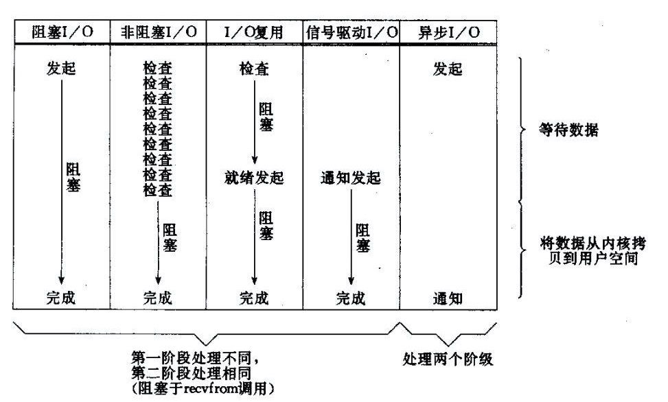

#### 概述

> 常见IO模型

所有的系统I/O都分为两个阶段：等待就绪和操作。举例来说，读函数，分为等待系统可读和真正的读；同理，写函数分为等待网卡可以写和真正的写。

通常情况下，操作系统的一次写操作分为两步：

1. 将数据从用户空间拷贝到系统空间。
2. 从系统空间往网卡写。

同理，读操作也分为两步：
1. 将数据从网卡拷贝到系统空间；
2. 将数据从系统空间拷贝到用户空间。

需要说明的是等待就绪的阻塞是不使用CPU的，是在“空等”；而真正的读写操作的阻塞是使用CPU的，真正在"干活"，而且这个过程非常快，属于memory copy，带宽通常在1GB/s级别以上，可以理解为基本不耗时。

下图是几种常见I/O模型的对比：

以socket.read()为例子：

**传统的BIO里面socket.read()，如果TCP RecvBuffer里没有数据，函数会一直阻塞，直到收到数据并将其从网卡读到系统空间, 从系统空间读到用户空间，才会返回。**

**对于NIO，如果TCP RecvBuffer没有数据，则直接返回0，永远不会阻塞，如果有数据就堵塞住直到数据从网卡读到内存，并且返回给用户。**

最新的AIO(Async I/O)里面会更进一步：不但等待就绪是非阻塞的，就连数据从网卡读到内存的过程也是异步的。

换句话说，BIO里用户最关心“我要读”，NIO里用户最关心"我可以读了"，在AIO模型里用户更需要关注的是“读完了”。

三者对比起来就是：

- bio中， socket读、写和真正的I/O操作是同步阻塞的。
- nio中， socket读、写在等待就绪阶段都是非阻塞的，真正的I/O操作是同步阻塞的（消耗CPU但性能非常高）。
- aio中， 只要告诉系统需要读写就可以， 等系统执行完读写会进行通知

> 传统的BIO模型分析

~~~java
public class BIOServer {

    public static void main(String[] args) throws IOException {
 		ExecutorService executor = Excutors.newFixedThreadPollExecutor(100);//线程池
 		ServerSocket serverSocket = new ServerSocket();
 		serverSocket.bind(8088);
 		while(!Thread.currentThread.isInturrupted()){//主线程死循环等待新连接到来
 			Socket socket = serverSocket.accept();
 			executor.submit(new ConnectIOnHandler(socket));//为新的连接创建新的线程
		}

    }

	class ConnectIOnHandler extends Thread{
    	private Socket socket;
    	public ConnectIOnHandler(Socket socket){
       	this.socket = socket;
    	}
    	public void run(){
      	while(!Thread.currentThread.isInturrupted()&&!socket.isClosed()){死循环处理读写事件
          	String someThing = socket.read()....//读取数据
          	if(someThing!=null){
             	......//处理数据
             	socket.write()....//写数据
          	}

      	}
    	}
	}
}
~~~

这是一个经典的每个连接一个线程的模型，**之所以使用多线程，主要原因在于serverSocket.accept()、socket.read()、socket.write()三个主要函数都是同步阻塞的，当一个连接在处理I/O的时候，系统是阻塞的，如果是单线程的话必然就挂死在那里**；但CPU是被释放出来的，开启多线程，就可以让CPU去处理更多的事情。其实这也是所有使用多线程的本质：

1. 利用多核。
2. 当I/O阻塞系统，但CPU空闲的时候，可以利用多线程使用CPU资源。

现在的多线程一般都使用线程池，可以让线程的创建和回收成本相对较低。在活动连接数不是特别高（小于单机1000）的情况下，这种模型是比较不错的，可以让每一个连接专注于自己的I/O并且编程模型简单，也不用过多考虑系统的过载、限流等问题。线程池本身就是一个天然的漏斗，可以缓冲一些系统处理不了的连接或请求。

不过，这个模型最本质的问题在于，严重依赖于线程。但线程是很"贵"的资源，主要表现在：

1. 线程的创建和销毁成本很高，在Linux这样的操作系统中，线程本质上就是一个进程。创建和销毁都是重量级的系统函数。
2. 线程本身占用较大内存，像Java的线程栈，一般至少分配512K～1M的空间，如果系统中的线程数过千，恐怕整个JVM的内存都会被吃掉一半。
3. 线程的切换成本是很高的。操作系统发生线程切换的时候，需要保留线程的上下文，然后执行系统调用。如果线程数过高，可能执行线程切换的时间甚至会大于线程执行的时间，这时候带来的表现往往是系统load偏高、CPU sy使用率特别高（超过20%以上)，导致系统几乎陷入不可用的状态。
4. 容易造成锯齿状的系统负载。因为系统负载是用活动线程数或CPU核心数，一旦线程数量高但外部网络环境不是很稳定，就很容易造成大量请求的结果同时返回，激活大量阻塞线程从而使系统负载压力过大。

所以，当面对十万甚至百万级连接的时候，传统的BIO模型是无能为力的。随着移动端应用的兴起和各种网络游戏的盛行，百万级长连接日趋普遍，此时，必然需要一种更高效的I/O处理模型。

> NIO模型分析