### 下载PostgreSQL

1. 进入官网

   [直达PostgreSQL下载页面（官网）](https://www.enterprisedb.com/downloads/postgres-postgresql-downloads)

2. 点击“Download the installer”链接，选择合适的安装版本，下载所需版本至本地（此处介绍15.8版本）

   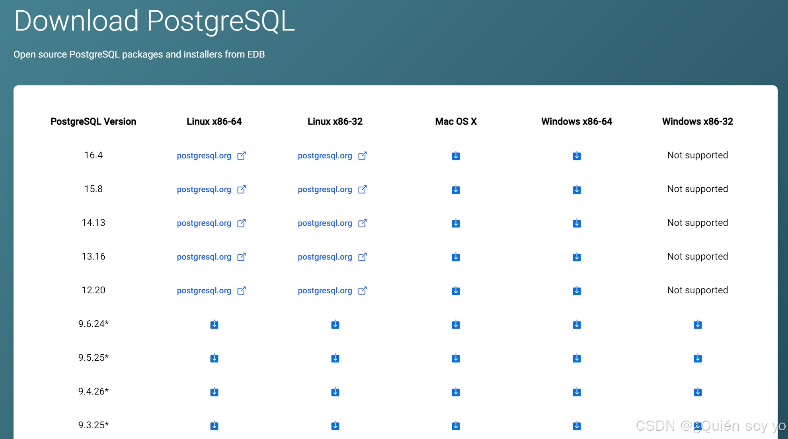

3. 下载完成后，找到[安装程序](https://so.csdn.net/so/search?q=安装程序&spm=1001.2101.3001.7020)并运行
   

4. 点击Next

   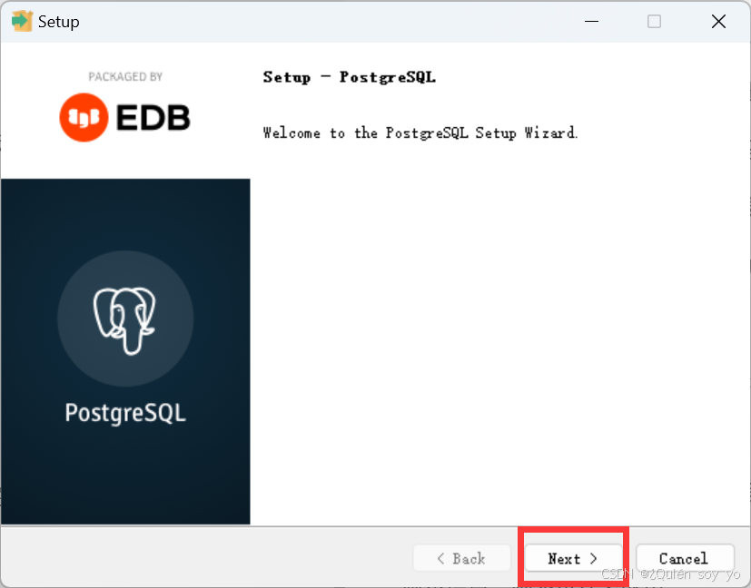

5. 修改安装路径，然后点击Next

   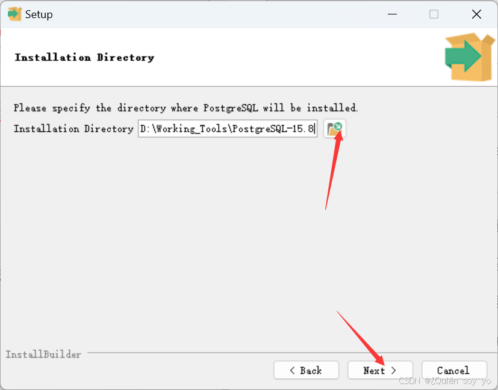

6. 默认全选，点击Next

   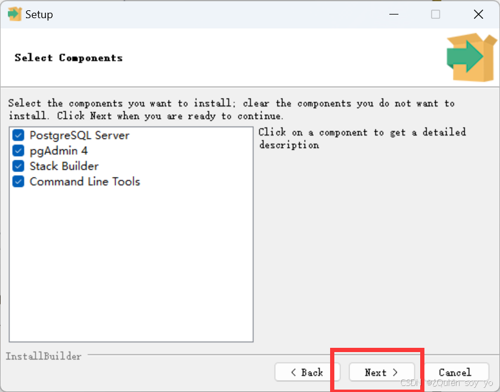

7. 创建[数据存储](https://so.csdn.net/so/search?q=数据存储&spm=1001.2101.3001.7020)目录，建议默认不做修改，点击Next

   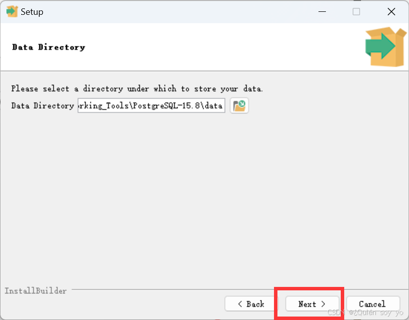

8. 设置root密码，务必记住，点击Next

   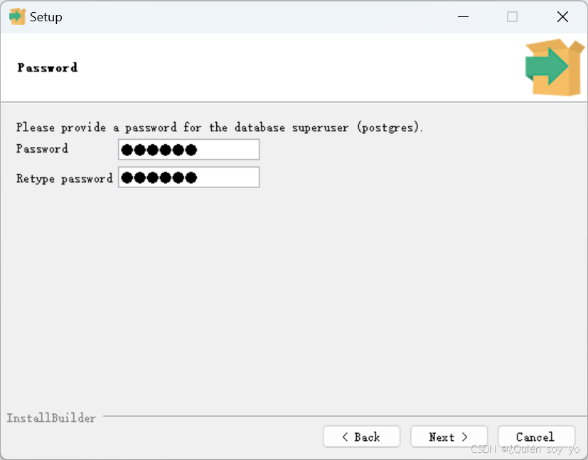

9. 设置端口，建议默认，点击Next

   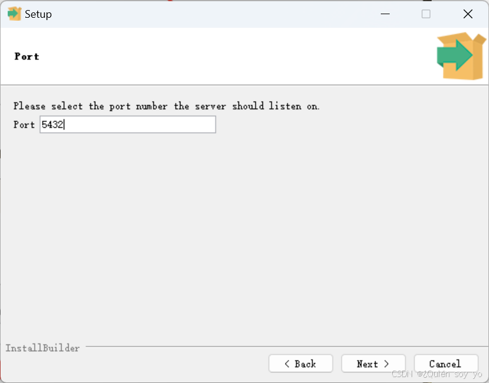

10. 选择语言，推荐中国区，点击Next

    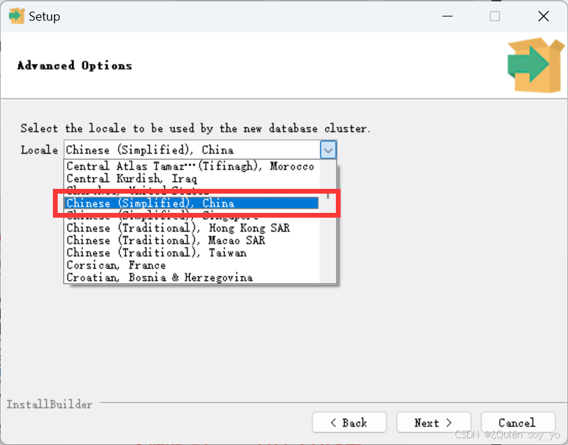

11. 点击Next

    

12. 点击Next

    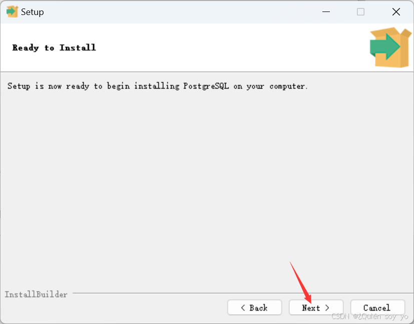

13. 等待安装

    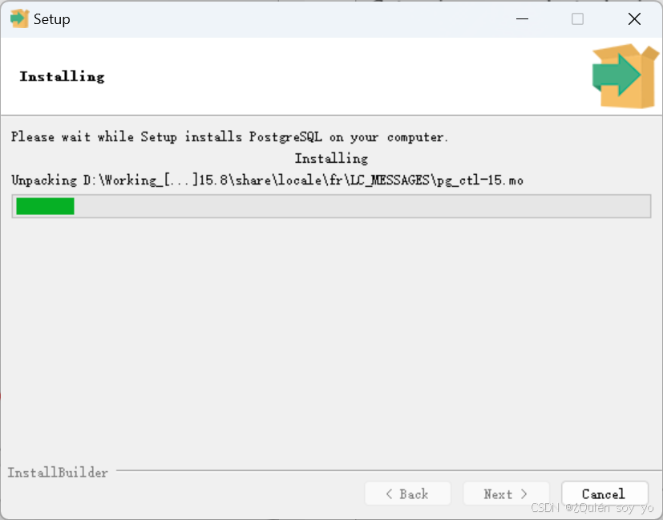

14. 点击Finish，至此安装完成

    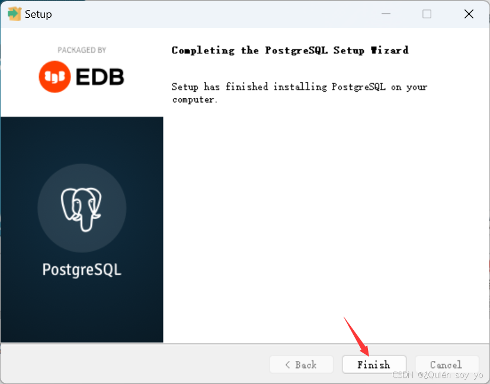

15. 若要验证PostgreSQL是否成功安装，打开命令提示符或PowerShell，输入psql --version，如果返回PostgreSQL的版本信息，则表示安装成功。

## pg的数据备份与恢复

依赖的common.sh

~~~shell
#!/bin/bash

currentDate=`date "+%Y-%m-%d"`
#Pwd="$(pwd)"
#logPath=$Pwd"/log"
mkdir -p /var/lib/ssdata/logcenter/U-Center/ucp/backup_recovery/diag-log
logPath='/var/lib/ssdata/logcenter/U-Center/ucp/backup_recovery/diag-log'

#UCENTER下不同模块的备份日志日志重定向到不同日志文件中
app_name="UC-BASE"

# 4. 将接收的日志输出到指定文件
func_proc_log(){
    currentTime=`date "+%Y/%m/%d %H:%M:%S"`
    log="[$currentTime] $1"
    echo "$log"
    echo "$log" >> $logPath/backup_recovery_${app_name}.${currentDate}.log
}

delete_old_log_file(){
    #清理掉180天前的日志
    find $logPath -name "backup_recovery_*.log" -mtime +180 | xargs rm {} -rvf \;
    find $logPath -name "backup_recovery_*.zip" -mtime +180 | xargs rm {} -rvf \;
    func_proc_log "find $logPath -name "backup_recovery_*.log" -mtime +180 | xargs rm {} -rvf \;"
    func_proc_log "find $logPath -name "backup_recovery_*.zip" -mtime +180 | xargs rm {} -rvf \;"
 
    #查找到当天之前的日志，进行压缩
    file_list=$(find $logPath -name "backup_recovery_*.log" ! -newermt "$(date "+%Y-%m-%d 00:00:00")")
    for file in $file_list
    do
        zip -q ${file}.zip $file
        rm -rf $file
        func_proc_log "zip -q ${file}.zip $file"
        func_proc_log "rm -rf $file"
    done
}  

# 5. 备份完成后,生成备份文件的MD5信息
func_md5_create(){
    file=$1
    md5file=$file'.md5'

    touch $md5file
    md5sum $file > $md5file
}

# 6. 开始恢复前, 检查待恢复文件的MD5信息
func_md5_check(){
    file=$1
    md5file=$file'.md5'

    if [ ! -f "$file" ]; then
        func_proc_log "$file not exist, please check."
        return 1
    fi

    if [ ! -f "$md5file" ]; then
        func_proc_log "$md5file not exist, please check."
        return 1
    fi

    oldmd5=`cat $md5file|awk '{ print $1 }'`
    newmd5=`md5sum $file|awk '{ print $1 }'`

    if [[ $oldmd5 == $newmd5 ]];then
        return 0
    else
        func_proc_log "$file had changed, break data recovery operation.";
        return 1
    fi
}

checkpodnotrunning(){
    podkey=$1
    ret=`kubectl  get pods -n service-software | grep $podkey | grep -v Running | grep -v NAME | wc -l`
    if [ $ret -ne 0 ]
    then
        func_proc_log "error: pod $podkey is not Running"
        exit 1
    fi
}

checksvcexist(){
    svckey=$1
    if [ $# -eq 2 ]; then
        ret=`kubectl get svc -n service-software | grep $svckey | grep -v $2 | grep -v NAME | wc -l`
    else
        ret=`kubectl get svc -n service-software | grep $svckey | grep -v NAME | wc -l`
    fi
    if [ $ret -eq 0 ]
    then
        func_proc_log "error: svc $svckey not exist"
        exit 1
    fi
}

checkpvexist(){
    key=$1
    ret=`kubectl get pv | grep $key | grep Bound | wc -l`
    if [ $ret -eq 0 ]
    then
        func_proc_log "error: pv $key not exist"
        exit 1
    fi
}

checkpvcexist(){
    key=$1
    ret=`kubectl get pvc  -n service-software | grep $key | grep Bound | wc -l`
    if [ $ret -eq 0 ]
    then
        func_proc_log "error: pvc $key not exist"
        exit 1
    fi
}

gocmd1noout(){
    func_proc_log "${1}"
    ${1} > .tmp.log
}
gocmd2noout(){
    func_proc_log "${1}\"${2}\""
    ${1} "${2}"  > .tmp.log
}

gocmd1(){
    func_proc_log "${1}"
    ${1}
}

gocmd2(){
    func_proc_log "${1}\"${2}\""
    ${1} "${2}"
}
~~~

### 整库备份恢复

备份脚本

~~~shell
#!/bin/bash

path=$(dirname $(readlink -f $0))
seasqldatapath=$1 #规定备份文件所在位置
source $(cd $path/..;pwd)/common.sh

# 从k8s中获取pg的username, passwd, host, port等等
username=`kubectl -n service-software  \
get secrets middleware-unified-secrets \
-o json | jq -r .data.SEASQL_USER_BASE | base64 -d`
password=`kubectl -n service-software  \
get secrets middleware-unified-secrets \
-o json | jq -r .data.SEASQL_PWD_BASE | base64 -d`
port=`kubectl -n service-software  \
get configmap  middleware-unified-config \
-o json | jq -r .data.SEASQL_PORT_BASE`
seasql_host=`kubectl get cm -n service-software \
middleware-unified-config -ojsonpath={.data.SEASQL_HOST_BASE}`

# 获取一个Running状态的proxy pod name
pod_list=$(kubectl  get pod -n service-software | \
grep '^seasql-base-proxy' | \
grep 'Running' | awk '{print$1}')
if [ $? -ne 0 ]
then
    func_proc_log "error: backup postgresql file failed: no running pod"
    exit 1
fi

func_proc_log "pg pod_list is: $pod_list"

for pod in $pod_list
do
    status=$(kubectl -n service-software exec \
    -it $pod -- pg_isready -h $seasql_host -p $port)
    if [[ $? == 0 ]]; then
        func_proc_log "======> get pg pod $pod status is: $status"
        POD_NAME=$pod
        break;
    fi
done

func_proc_log "get pg proxy pod: "${POD_NAME}""
if [ -z $POD_NAME ]; then
    func_proc_log "get psql pod failed"
    exit 1
else
    func_proc_log "get psql pod success"
fi

temp_postgre="temppostgre_uc_collectplat"

var_bashcmd="kubectl exec -i "${POD_NAME}" -n service-software -- bash -c "
podcmd(){ 
    gocmd2 "${var_bashcmd}" "$1"
}

# 清理并创建, 保证${temp_postgre}是一个空的目录
podcmd "rm -rf ${temp_postgre}"
podcmd "mkdir -p ${temp_postgre}"

# 指定要备份的书数据库
dbs="ucp"
func_proc_log "要备份的数据库为: $dbs"

# 执行数据库备份操作
for db in $dbs
do

        func_proc_log "kubectl exec -i ${POD_NAME} -n service-software \
        -- bash -c \"pg_dump -h $seasql_host -p $port --inserts -Fp -U ${username} -w \
        -d $db -v > ./${temp_postgre}/$db.sql\""
        
        kubectl exec -i ${POD_NAME} -n service-software -- bash -c \
        "export PGPASSWORD=${password}; \
        pg_dump -h $seasql_host -p $port --attribute-inserts -C \
        -c -Fp -U ${username} -w -d $db --exclude-table=syslog \
        --exclude-table=operlog --exclude-table=diag_file  \
        -v > $temp_postgre/$db.sql"
        
        if [ $? -ne 0 ]; then
        func_proc_log "backup $db failed"
        echo "ERROR_INFO_OUT_TO_USER:backup $db failed."
        exit 1
    else
        func_proc_log "backup $db success"
    fi
done

# 5. 从pod中拷贝备份出来的sql文件到宿主机上到指定目录
gocmd1noout "kubectl cp service-software/${POD_NAME}:${temp_postgre}/ ${seasqldatapath}/"
if [ $? -ne 0 ]
then
    sleep 30
    gocmd1noout "kubectl cp service-software/${POD_NAME}:${temp_postgre}/ ${seasqldatapath}/"
    if [ $? -ne 0 ]
    then
        sleep 60
        gocmd1noout "kubectl cp service-software/${POD_NAME}:${temp_postgre}/ ${seasqldatapath}/"
        if [ $? -ne 0 ]
        then
            func_proc_log "error: copy postgresql dumpFile to the node failed"
            exit 1
        fi
    fi
fi

rm -rf .tmp.log

exit 0
~~~

恢复脚本

~~~shell
#!/bin/bash
path=$(dirname $(readlink -f $0))
source $(cd $path/..;pwd)/common.sh
#source ../../common.sh
fulldatapath=$1     #文件所在位置
seasql_host=`kubectl get cm -n service-software middleware-unified-config -ojsonpath={.data.SEASQL_HOST_BASE}`
seasql_port=`kubectl get cm -n service-software middleware-unified-config -ojsonpath={.data.SEASQL_PORT_BASE}`
username=`kubectl get secret -n service-software middleware-unified-secrets -ojsonpath={.data.SEASQL_USER_BASE}|base64 -d`
password=`kubectl get secret -n service-software middleware-unified-secrets -ojsonpath={.data.SEASQL_PWD_BASE}|base64 -d`

# 1. 获取一个Running状态的proxy pod name
pod_list=$(kubectl  get pod -n service-software | grep '^seasql-base-proxy' | grep 'Running' | awk '{print$1}')
if [ $? -ne 0 ]
then
    func_proc_log "error: backup postgresql file failed: no running pod"
    exit 1
fi

func_proc_log "pg pod_list is: $pod_list"

for pod in $pod_list
do
    status=$(kubectl -n service-software exec -it $pod -- pg_isready -h $seasql_host -p $seasql_port)
    if [[ $? == 0 ]]; then
        func_proc_log "======> get pg pod $pod status is: $status"
        POD_NAME=$pod
        break;
    fi
done

func_proc_log "get pg proxy pod: "${POD_NAME}""
if [ -z $POD_NAME ]; then
    func_proc_log "get psql pod failed"
    exit 1
else
    func_proc_log "get psql pod success"
fi

var_bashcmd="kubectl exec -i "${POD_NAME}" -n service-software -- bash -c "
podcmd(){ 
    gocmd2 "${var_bashcmd}" "$1"
}

temp_postgre="temppostgre_uc_collectplat"
# 4. pod中创建临时恢复数据目录
podcmd "rm -rf ${temp_postgre} && mkdir -p ${temp_postgre}"

# 5. 拷贝数据到pod临时目录中
echo ${fulldatapath}

func_proc_log "+++++++++++++++++++++++++"
file_list=$(ls ${fulldatapath})
func_proc_log "$file_list"
func_proc_log "+++++++++++++++++++++++++"

for file in $file_list
do
    gocmd1 "kubectl cp ${fulldatapath}/${file} service-software/${POD_NAME}:${temp_postgre}"
    if [ $? -ne 0 ]
    then
        sleep 30
        gocmd1 "kubectl cp ${fulldatapath}/${file} service-software/${POD_NAME}:${temp_postgre}"
        if [ $? -ne 0 ]
        then
            sleep 60
            gocmd1 "kubectl cp ${fulldatapath}/${file} service-software/${POD_NAME}:${temp_postgre}"
            if [ $? -ne 0 ]
            then
                func_proc_log "copy postgresql dumpFile  to the pod failed"
                exit 1
            fi
        fi
    fi
done

files=$(kubectl exec -i "${POD_NAME}" -n service-software -- bash -c "ls ${temp_postgre} | grep sql")
func_proc_log "target file list: $files"
files=${files//.sql/}

func_proc_log "target file list: $files"

# 执行数据库恢复操作
for file in $files
do
    dbname=${file//.sql/}
    func_proc_log "=========> start recovery db: $dbname  file: $file"

    func_proc_log "kubectl exec -i ${POD_NAME} -n service-software -- bash -c \"psql -h $seasql_host -p $seasql_port -U ${username} -w -d template1 -e -c \" UPDATE pg_database SET datallowconn = 'false' WHERE datname = '$file'; \" \""
    kubectl exec -i ${POD_NAME} -n service-software -- bash -c "export PGPASSWORD=$password;psql -h $seasql_host -p $seasql_port -U ${username} -w -d template1 -e -c \" UPDATE pg_database SET datallowconn = 'false' WHERE datname = '$file'; \" "
    if [ $? -ne 0 ]
    then
        func_proc_log "lock db $file failed"
    else
        func_proc_log "lock db: $file success"
    fi
    func_proc_log "kubectl exec -i ${POD_NAME} -n service-software -- bash -c \"psql -h $seasql_host -p $seasql_port -U ${username} -w -d template1 -e -c \" SELECT pg_terminate_backend(pid) FROM pg_stat_activity WHERE datname = '$file'; \" "\"
    kubectl exec -i ${POD_NAME} -n service-software -- bash -c "export PGPASSWORD=$password;psql -h $seasql_host -p $seasql_port -U ${username} -w -d template1 -e -c \" SELECT pg_terminate_backend(pid) FROM pg_stat_activity WHERE datname = '$file'; \" "
    if [ $? -ne 0 ]
    then
        func_proc_log "close db $file all session failed"
    else
        func_proc_log "close db: $file all session success"
    fi
    # 恢复新数据库
    func_proc_log "kubectl exec -i ${POD_NAME} -n service-software -- bash -c \"psql -q -h $seasql_host -p $seasql_port -U ${username} -w -d template1  < ./${temp_postgre}/$file.sql\" "
    kubectl exec -i ${POD_NAME} -n service-software -- bash -c "export PGPASSWORD=${password};psql -q -h $seasql_host -p $seasql_port -U ${username} -w -d template1  < ./${temp_postgre}/$file.sql" #>> ../../postgretemp.log 2>&1
    code=$?
    if [ $code -ne 0 ]
    then
        func_proc_log "recovery postgresql db $file failed"
        #梯度等待重试
        func_proc_log "start retry recovery db $file ......"
        for((i=1;i<10;i++))
        do
            wait_times=$(($i*30))
            func_proc_log "$i start retry recovery db $file wait $wait_times"
            sleep $wait_times
            func_proc_log "$i start retry recovery db $file"

            #重新恢复
            kubectl exec -i ${POD_NAME} -n service-software -- bash -c "export PGPASSWORD=${password};psql -q -h $seasql_host -p $seasql_port -U ${username} -w -d template1  < ./${temp_postgre}/$file.sql"
            if [ $? -eq 0 ]; then
                func_proc_log "$i start retry recovery db $file success"
                break
            else
                func_proc_log "$i start retry recovery db $file failed"
                if [ $i -eq 9 ]; then
                    func_proc_log "retry recovery db $file failed, count is max, exit"
                    exit 1
                fi
            fi
        done
    else
        func_proc_log "=========> success recovery db: $file"
    fi

    func_proc_log "kubectl exec -i ${POD_NAME} -n service-software -- bash -c \"psql -h $seasql_host -p $seasql_port -U ${username} -w -d template1 -e -c \" UPDATE pg_database SET datallowconn = 'true' WHERE datname = '$file'; \" \""
    kubectl exec -i ${POD_NAME} -n service-software -- bash -c "export PGPASSWORD=$password;psql -h $seasql_host -p $seasql_port -U ${username} -w -d template1 -e -c \" UPDATE pg_database SET datallowconn = 'true' WHERE datname = '$file'; \" "
    if [ $? -ne 0 ]
    then
        func_proc_log "unlock db $file failed"
    else
        func_proc_log "unlock db: $file success"
    fi
done

# 10. 清除pod内临时目录
podcmd "rm -rf ${temp_postgre}"

# 11.删除恢复时产生的文件
rm -rf postgretemp.log
exit 0
~~~

### 按照schema备份恢复

按照schema备份

~~~shell
#!/bin/bash

path=$(dirname $(readlink -f $0))
seasqldatapath=$1 #规定备份文件所在位置
source $(cd $path/..;pwd)/common.sh
POD_NAME_SPACE="service-software"

username=`kubectl -n "${POD_NAME_SPACE}"  get secrets middleware-unified-secrets -o json | jq -r .data.SEASQL_USER_BASE | base64 -d`
password=`kubectl -n "${POD_NAME_SPACE}"  get secrets middleware-unified-secrets -o json | jq -r .data.SEASQL_PWD_BASE | base64 -d`
port=`kubectl -n "${POD_NAME_SPACE}"  get configmap  middleware-unified-config -o json | jq -r .data.SEASQL_PORT_BASE`
seasql_host=`kubectl get cm -n "${POD_NAME_SPACE}" middleware-unified-config -ojsonpath={.data.SEASQL_HOST_BASE}`
func_proc_log "根据k8s配置, 使用的数据库账号: ${username}, 端口: $port, 地址: $seasql_host"

# 1. 获取一个Running状态的proxy pod name
pod_list=$(kubectl  get pod -n "${POD_NAME_SPACE}" | grep '^seasql-base-proxy' | grep 'Running' | awk '{print$1}')
if [ $? -ne 0 ]
then
    func_proc_log "error: backup postgresql file failed: no running pod"
    exit 1
fi

func_proc_log "pg pod_list is: $pod_list"

for pod in $pod_list
do
    status=$(kubectl -n "${POD_NAME_SPACE}" exec -it $pod -- pg_isready -h $seasql_host -p $port)
    if [[ $? == 0 ]]; then
        func_proc_log "======> get pg pod $pod status is: $status"
        POD_NAME=$pod
        break;
    fi
done

func_proc_log "get pg proxy pod: "${POD_NAME}""
if [ -z $POD_NAME ]; then
    func_proc_log "get psql pod failed"
    exit 1
else
    func_proc_log "get psql pod success"
fi

temp_postgre="temppostgre_uc_collectplat"

var_bashcmd="kubectl exec -i "${POD_NAME}" -n "${POD_NAME_SPACE}" -- bash -c "
podcmd(){ 
    gocmd2 "${var_bashcmd}" "$1"
}

# 2. 清除pod中残留的临时文件
podcmd "rm -rf ${temp_postgre}"

# 3. pod中创建临时恢复数据目录
podcmd "mkdir -p ${temp_postgre}"

dbs="ucp"

func_proc_log "target db list: $dbs"

for dbase in $dbs
do
  # === 确保数据库存在 ===
  # -l表示列出所有的数据库, -q表示执行命令的时候不需要标题和其他额外信息, 只返回结果, -t表示只输出查询结果,不显示列标题,
  # 输出的结果为 database | 其他属性 | 其他属性 | 其他属性
  # cut -d \| -f 表示按照|切分, 只取第一个
  # grep -v '^\s*$' 表示过滤掉空行
  # grep -w 表示完全匹配
  DB_EXISTS=$(
    kubectl exec -i \
    -n "${POD_NAME_SPACE}" "${POD_NAME}" \
    -- bash -c \
    "export PGPASSWORD="${password}"; \
    psql -U "$username" -h "$seasql_host" -p "$port" -lqt -d template1 \
    -w  | cut -d \| -f 1 | grep -v '^\s*$' | grep -w "$dbase""
  )
  if [ -z "$DB_EXISTS" ]; then
    func_proc_log "数据库 $DB 不存在，停止备份"
    exit 1
  else
    func_proc_log "数据库存在, 开始备份"
  fi
done

start_time=$(date +%s%3N)
start_date=$(date "+%Y-%m-%d %H:%M:%S")

# 执行数据库备份操作
for db in $dbs
do
  podcmd "mkdir -p ./"$temp_postgre"/"$db"" # 创建存放dump文件的目录
  start_db_time=$(date +%s%3N)
  start_db_date=$(date "+%Y-%m-%d %H:%M:%S")

  # 按照schema对数据库进行备份, 先查询所有的schema
  # -w 表示从环境变量中读取密码, 如果读取密码失败, 不要询问密码, 而是直接失败
  # -t 不要显示表头, 而是直接显示查询出来的数据
  # -c 表示执行sql语句
  # -d 指定要查询的数据库
  schemas=$(
    kubectl exec -i \
    -n "${POD_NAME_SPACE}" "${POD_NAME}" \
    -- bash -c \
    "export PGPASSWORD="${password}"; \
    psql -U "$username" -h "$seasql_host" -p "$port" -d "$db" -w -t \
    -c \"SELECT schema_name FROM information_schema.schemata WHERE schema_name NOT IN ('pg_catalog', 'information_schema', 'pg_toast', 'pg_temp', 'pg_extension');\""
  )
  func_proc_log "查询出的schemas: $(echo "$schemas" | tr "\n" " ")"

  for schema in $schemas
  do
    start_schema_time=$(date +%s%3N)
    start_schema_date=$(date "+%Y-%m-%d %H:%M:%S")
    # 在默认的情况下, 生成的sql文件中, 会包含create schema, create table(不使用if not exits)等语句,
    # 不会包含create database, drop schema, drop table等语句, 所以这种情况必须保证数据库存在, 并且是一个空的数据库

    # -c/--clean 在生成的sql文件的前面, 添加drop table, drop index, drop sequence, drop schema等语句 (不包含 if exists)
    #            添加这个参数, 只要保存数据库存在就好, 已经存在的资源会自动删除掉
    # -C/--create 表示在生成sql文件的前面, 添加drop database和create database语言, 这个选项会导致-c/--clean选项失效,
    #             因为已经drop database了, 所以没有必要添加drop table等语句了
    # --if-exists 针对-c/--clean, -C/--create添加的drop命令, 使用if exists语法
    # -Fp 表示dump文件的格式是sql
    # -v 启动verbose模式, 显示更多的日志
    # --schema 指定要dump的schema
    # --exclude-table 排除要dump的表
    # --attribute-inserts 表示在生成的insert语句中, 添加列名
    kubectl exec -i \
    -n "${POD_NAME_SPACE}" "${POD_NAME}" \
    -- bash -c \
    "export PGPASSWORD="${password}"; \
    pg_dump -U "$username" -p "$port" -h "$seasql_host" -w -d "$db" --schema=$schema \
    --exclude-table=syslog --exclude-table=operlog --exclude-table=diag_file --attribute-inserts \
    --clean  --if-exists -Fp -v > ./$temp_postgre/${db}/${schema}.sql"

    if [ $? -ne 0 ]; then
      func_proc_log "backup db: ${db}, shcema: ${schema} failed"
      cho "ERROR_INFO_OUT_TO_USER:backup ${db}, shcema: ${schema}  failed."
      exit 1
    else
      func_proc_log "backup ${db}, shcema: ${schema}  success"
    fi

    end_schema_time=$(date +%s%3N)
    end_schema_date=$(date "+%Y-%m-%d %H:%M:%S")
    func_proc_log "备份数据库: ${db}, schema: ${schema}结束, 开始时间: ${start_schema_date}, 结束时间: ${end_schema_date}, 耗时: $(((end_schema_time - start_schema_time)/1000))秒$(((end_schema_time-start_schema_time)%1000))毫秒"
  done

  file_message=$(
      kubectl exec -i \
      -n "${POD_NAME_SPACE}" "${POD_NAME}" \
      -- bash -c \
      "ls -Rlh ./$temp_postgre"
  )

  func_proc_log "生成的文件: ${file_message}"

  end_db_time=$(date +%s%3N)
  end_db_date=start_db_date=$(date "+%Y-%m-%d %H:%M:%S")
  func_proc_log "备份数据库: ${db}结束, 开始时间: ${start_db_date}, 结束时间: ${end_db_date}, 耗时: $(((end_db_time-start_db_time)/1000))秒$(((end_db_time-start_db_time)%1000))"

done

end_time=$(date +%s%3N)
end_date=$(date "+%Y-%m-%d %H:%M:%S")
func_proc_log "备份结束, 开始时间: ${start_date}, 结束时间: ${end_date}, 耗时: $(((end_time-start_time)/1000))秒$(((end_time-start_time)%1000))毫秒"

# 5. 拷贝数据到指定目录

start_copy_time=$(date +%s%3N)
start_copy_date=$(date "+%Y-%m-%d %H:%M:%S")
# 从pod里面将 temppostgre_uc_collectplat 拷贝到 /opt/matrix/app/data/base-service/backupRecovery/uc_collectplat/UC-BASE/backup-data/database
gocmd1noout "kubectl cp "${POD_NAME_SPACE}"/${POD_NAME}:${temp_postgre}/ ${seasqldatapath}/"
if [ $? -ne 0 ]
then
    sleep 30
    gocmd1noout "kubectl cp "${POD_NAME_SPACE}"/${POD_NAME}:${temp_postgre}/ ${seasqldatapath}/"
    if [ $? -ne 0 ]
    then
        sleep 60
        gocmd1noout "kubectl cp "${POD_NAME_SPACE}"/${POD_NAME}:${temp_postgre}/ ${seasqldatapath}/"
        if [ $? -ne 0 ]
        then
            func_proc_log "error: copy postgresql dumpFile to the node failed"
            exit 1
        fi
    fi
fi

end_copy_time=$(date +%s%3N)
end_copy_date=$(date "+%Y-%m-%d %H:%M:%S")
func_proc_log "将dump文件从 ${POD_NAME_SPACE}/${POD_NAME}:${temp_postgre} 拷贝到 ${seasqldatapath} 完成"
func_proc_log "开始时间: ${start_copy_date}, 结束时间: ${end_copy_date}, 耗时: $(((end_copy_time-start_copy_time)/1000))秒$(((end_copy_time-start_copy_time)%1000))毫秒"

rm -rf .tmp.log

exit 0

~~~

恢复脚本

~~~shell
#!/bin/bash

path=$(dirname $(readlink -f $0))
source $(cd $path/..;pwd)/common.sh
#source ../../common.sh

POD_NAME_SPACE="service-software"

fulldatapath=$1     #文件所在位置
seasql_host=`kubectl get cm -n "${POD_NAME_SPACE}" middleware-unified-config -ojsonpath={.data.SEASQL_HOST_BASE}`
port=`kubectl get cm -n "${POD_NAME_SPACE}" middleware-unified-config -ojsonpath={.data.SEASQL_PORT_BASE}`
username=`kubectl get secret -n "${POD_NAME_SPACE}" middleware-unified-secrets -ojsonpath={.data.SEASQL_USER_BASE} | base64 -d`
password=`kubectl get secret -n "${POD_NAME_SPACE}" middleware-unified-secrets -ojsonpath={.data.SEASQL_PWD_BASE} | base64 -d`
func_proc_log "根据k8s配置, 使用的数据库账号: ${username}, 端口: $port, 地址: $seasql_host"

# 1. 获取一个Running状态的proxy pod name
pod_list=$(kubectl  get pod -n "${POD_NAME_SPACE}" | grep '^seasql-base-proxy' | grep 'Running' | awk '{print$1}')
if [ $? -ne 0 ]
then
  func_proc_log "没有查找到seasql-base-proxy相关的pod, namespace: ${POD_NAME_SPACE}"
  exit 1
else
  func_proc_log "在namespace: ${POD_NAME_SPACE} 中查找到seasql-base-proxy相关的pod: $pod_list"
fi

for pod in $pod_list
do
    status=$(kubectl -n "${POD_NAME_SPACE}" exec -it $pod -- pg_isready -h $seasql_host -p $port)
    if [[ $? == 0 ]]; then
        func_proc_log "======> get pg pod $pod status is: $status"
        POD_NAME=$pod
        break;
    fi
done

if [ -z $POD_NAME ]; then
    func_proc_log "没有查找到有效的proxy pod, namespace: ${POD_NAME_SPACE}"
    exit 1
else
    func_proc_log "查找到proxy pod: "${POD_NAME}", namespace: ${POD_NAME_SPACE}"
fi

var_bashcmd="kubectl exec -i "${POD_NAME}" -n "${POD_NAME_SPACE}" -- bash -c "
podcmd(){ 
    gocmd2 "${var_bashcmd}" "$1"
}

temp_postgre="temppostgre_uc_collectplat"
# 4. pod中创建临时恢复数据目录
podcmd "rm -rf ${temp_postgre} && mkdir -p ${temp_postgre}"

# 5. 拷贝数据到pod临时目录中
func_proc_log "fulldatapath: ${fulldatapath}"

file_list=$(ls "${fulldatapath}")

# 打印恢复文件的目录结构, 类似tree命令
func_proc_log "发现如下数据库的备份文件备份文件: "
for directory in ${file_list}
do
  func_proc_log "${directory}"
  schema_file_list=$(ls "${fulldatapath}"/"${directory}")
  for schema_file in ${schema_file_list}
  do
    func_proc_log "|-"${schema_file}""
  done
done

# 拷贝所有的文件到pod中
for file in $file_list
do
  # 拷贝 ${file} 目录到pod中
    gocmd1 "kubectl cp ${fulldatapath}/${file} ${POD_NAME_SPACE}/${POD_NAME}:${temp_postgre}"
    if [ $? -ne 0 ]
    then
        sleep 30
        gocmd1 "kubectl cp ${fulldatapath}/${file} ${POD_NAME_SPACE}/${POD_NAME}:${temp_postgre}"
        if [ $? -ne 0 ]
        then
            sleep 60
            gocmd1 "kubectl cp ${fulldatapath}/${file} ${POD_NAME_SPACE}/${POD_NAME}:${temp_postgre}"
            if [ $? -ne 0 ]
            then
                func_proc_log "copy postgresql dumpFile  to the pod failed"
                exit 1
            fi
        fi
    fi
done

function recovery_db() {

  if [ "$#" -lt 6 ]; then
    func_proc_log "错误: 参数不足"
    func_proc_log "用法: recovery_db user passwd host port db sql_file1 [sql_file2 ...]"
    return 1
  fi

  func_proc_log "接受到参数: $*"
  local db_user="$1"
  local db_password="$2"
  local db_host="$3"
  local db_port="$4"
  local target_db="$5"

  shift 5

  # 这里的eof必须要顶格写, 否则会有问题
  kubectl exec -i \
  -n "${POD_NAME_SPACE}" "${POD_NAME}"  \
  -- bash -c "cat << EOF > recovery_${target_db}.sql
# 切换到template1数据库
\\c template1

-- 1. 禁止新的客户端连接到pg的 ${target_db} 数据库
UPDATE pg_database SET datallowconn = 'false' WHERE datname = '${target_db}';

-- 2. 断开除了当前连接外的其他连接
SELECT pg_terminate_backend(pid)
FROM pg_stat_activity
WHERE datname = '${target_db}' AND pid <> pg_backend_pid();

-- 3. 切换到要恢复的数据库
\\c ${target_db}
EOF"

  for sql_file in "$@"
  do
    func_proc_log "$sql_file"

    kubectl exec -i \
    -n "${POD_NAME_SPACE}" "${POD_NAME}" \
    -- bash -c "cat << EOF >> recovery_${target_db}.sql
-- 执行恢复脚本
\\i ${sql_file}
EOF"

  done

  kubectl exec -i \
  -n "${POD_NAME_SPACE}" "${POD_NAME}"  \
  -- bash -c \
  "cat << EOF >> recovery_${target_db}.sql

# 切换到template1数据库
\\c template1
# 恢复连接
UPDATE pg_database SET datallowconn = 'true' WHERE datname = '${target_db}';
EOF"

  script_content=$(
    kubectl exec -i \
    -n "${POD_NAME_SPACE}" "${POD_NAME}" \
    -- bash -c "cat ./recovery_${target_db}.sql"
  )
  func_proc_log "执行脚本的内容: "
  func_proc_log "$script_content"

  kubectl exec -i \
  -n "${POD_NAME_SPACE}" "${POD_NAME}"  \
  -- bash -c \
  "export PGPASSWORD=${db_password}; \
  psql -q -h ${db_host} -p ${db_port} -U ${db_user} -w -d template1 < recovery_${target_db}.sql"

  # 保存状态码
  code=$?

#  kubectl exec -i \
#  -n "${POD_NAME_SPACE}" "${POD_NAME}"  \
#  -- bash -c "rm -rf recovery_${target_db}.sql"

  return $code

}

# 每个目录表示一个db, 通过find命令来查找目录
dbs=$(
  kubectl exec -i \
  -n "${POD_NAME_SPACE}" "${POD_NAME}" \
  -- bash -c \
  "find ${temp_postgre} -maxdepth 1 -mindepth 1 -type d -printf '%f\n'"
)
func_proc_log "查找到如下数据库的目录: ${dbs}"

start_time=$(date +%s%3N)
start_date=$(date "+%Y-%m-%d %H:%M:%S")

for db in $dbs
do

  start_db_time=$(date +%s%3N)
  start_db_date=$(date "+%Y-%m-%d %H:%M:%S")

  func_proc_log "======> 开始按照schema恢复数据库: ${db}"
  # 查找具体的schema 文件
  files=$(
    kubectl exec -i \
    -n "${POD_NAME_SPACE}" "${POD_NAME}" \
    -- bash -c \
    "ls ${temp_postgre}/${db} | grep sql"
  )

  if [ -z "${files}" ]
  then
    func_proc_log "在目录: ${db} 下没有发现schema的dump文件, 跳过恢复该数据库"
  else
    func_proc_log "========================================"
    func_proc_log "在目录: ${db} 下发现了如下schema的dump文件: "
    for f in $files
    do
      func_proc_log "$f"
    done
    func_proc_log "========================================"
  fi

  full_path_files=()
  for file in $files; do
    full_path_files+=("${temp_postgre}/${db}/${file}")
  done

  # === 确保数据库存在 ===
  # -l表示列出所有的数据库, -q表示执行命令的时候不需要标题和其他额外信息, 只返回结果, -t表示只输出查询结果,不显示列标题,
  # 输出的结果为 database | 其他属性 | 其他属性 | 其他属性
  # cut -d \| -f 表示按照|切分, 只取第一个
  # grep -v '^\s*$' 表示过滤掉空行
  # grep -w 表示完全匹配
  DB_EXISTS=$(
    kubectl exec -i \
    -n "${POD_NAME_SPACE}" "${POD_NAME}" \
    -- bash -c \
    "export PGPASSWORD="${password}"; \
    psql -U "$username" -h "$seasql_host" -p "$port" -lqt -d template1 \
    -w  | cut -d \| -f 1 | grep -v '^\s*$' | grep -w "$db""
  )
  if [ -z "${DB_EXISTS}" ]
  then
    func_proc_log "数据库 $db 不存在，开始创建"

    kubectl exec -i \
    -n "${POD_NAME_SPACE}" "${POD_NAME}" \
    -- bash -c \
    "export PGPASSWORD="${password}"; \
    createdb -U "$username" -h "$seasql_host" -p "$port" -w "$db""

    if [ $? -ne 0 ]
    then
      func_proc_log "创建数据库 $db 失败, 退出"
      exit 1
    else
      func_proc_log "创建数据库 $db 成功"
    fi

  else
    func_proc_log "数据库存在, 无需创建"
  fi
  

  recovery_db "$username" "$password" "$seasql_host" "$port" "$db" "${full_path_files[@]}"
  if [ $? -ne 0 ]; then
    func_proc_log "恢复db: $db 失败, 开始重试"
    for i in {0...10}
    do
      wait_times=$(($i*30))
      func_proc_log "$i 开始重试恢复 db: $db,  wait $wait_times"
      sleep $wait_times
      func_proc_log "$i 开始重试恢复 db: $db "

      recovery_db "$username" "$password" "$seasql_host" "$port" "$db" "${full_path_files[@]}"
      if [ $? -eq 0 ]; then
          func_proc_log "$i 重试恢复 db: $db 成功"
          break
      else
          func_proc_log "$i 重试恢复 db: $db 失败"
          if [ $i -eq 9 ]; then
              func_proc_log "重试恢复 db: $db 失败, 达到了最大次数, 退出"
              exit 1
          fi
      fi

    done

  else
    func_proc_log "成功恢复 db: $db "
  fi

#
#  # 禁止新的客户端连接到pg的$db数据库, 但是已经连接的客户端不受影响
#  func_proc_log "禁止新的客户端连接到pg的 ${db} 数据库"
#  func_proc_log "kubectl exec -i ${POD_NAME} -n "${POD_NAME_SPACE}" -- bash -c \"psql -h $seasql_host -p $port -U ${username} -w -d template1 -e -c \" UPDATE pg_database SET datallowconn = 'false' WHERE datname = '$db'; \" \""
#
#  recovery_db
#
#  if [ $? -ne 0 ]
#  then
#      func_proc_log "lock db $db failed"
#  else
#      func_proc_log "lock db: $db success"
#  fi
#
#  # 断掉已经和 $db 数据库连接的客户端
#  func_proc_log "断开现有数据库: ${db} 的链接"
#  func_proc_log "kubectl exec -i ${POD_NAME} -n "${POD_NAME_SPACE}" -- bash -c \"psql -h $seasql_host -p $port -U ${username} -w -d template1 -e -c \" SELECT pg_terminate_backend(pid) FROM pg_stat_activity WHERE datname = '$db'; \" "\"
#
#  kubectl exec -i  \
#  -n "${POD_NAME_SPACE}" ${POD_NAME} \
#  -- bash -c \
#  "export PGPASSWORD=$password;\
#  psql -h $seasql_host -p $port -U ${username} -w -d template1 -e \
#  -c \" SELECT pg_terminate_backend(pid) FROM pg_stat_activity WHERE datname = '$db'; \" "
#
#  if [ $? -ne 0 ]
#  then
#      func_proc_log "close db $db all session failed"
#  else
#      func_proc_log "close db: $db all session success"
#  fi
#
#  for sql_file in $files
#  do
#
#    start_schema_time=$(date +%s%3N)
#    start_schema_date=$(date "+%Y-%m-%d %H:%M:%S")
#
#    schema=${sql_file//.sql/}
#    func_proc_log "=========> 开始恢复schema, database: ${db}, schema: ${schema}"
## 启动一个长连接，执行所有操作
#psql -h $host -p $port -U $superuser -d template1 <<EOF
#
#EOF
#
#

#    # 恢复schema
#    func_proc_log "kubectl exec -i ${POD_NAME} -n "${POD_NAME_SPACE}" -- bash -c \"psql -q -h $seasql_host -p $port -U ${username} -w -d ${db}  < ./${temp_postgre}/$db/$sql_file\" "
#    kubectl exec -i \
#    -n "${POD_NAME_SPACE}" ${POD_NAME} \
#    -- bash -c \
#    "export PGPASSWORD=${password}; \
#    psql -q -h $seasql_host -p $port -U ${username} -w \
#    -d ${db}  < ./${temp_postgre}/$db/$sql_file"

#    code=$?
#    if [ $code -ne 0 ]
#    then
#        func_proc_log "恢复 db: $db, schema: $schema 失败"
#        #梯度等待重试
#        func_proc_log "开始重试恢复 db: $db, schema: $schema  ......"
#
#        for((i=1;i<10;i++))
#        do
#            wait_times=$(($i*30))
#            func_proc_log "$i 开始重试恢复 db: $db, schema: $schema , wait $wait_times"
#            sleep $wait_times
#            func_proc_log "$i 开始重试恢复 db: $db, schema: $schema "
#
#            #重新恢复
#            kubectl exec -i \
#            -n "${POD_NAME_SPACE}" ${POD_NAME} \
#            -- bash -c \
#            "export PGPASSWORD=${password}; \
#            psql -q -h $seasql_host -p $port -U ${username} -w \
#            -d ${db}  < ./${temp_postgre}/$db/$sql_file"
#
#            if [ $? -eq 0 ]; then
#                func_proc_log "$i 重试恢复 db: $db, schema: $schema 成功"
#                break
#            else
#                func_proc_log "$i 重试恢复 db: $db, schema: $schema  失败"
#                if [ $i -eq 9 ]; then
#                    func_proc_log "重试恢复 db: $db, schema: $schema  失败, 达到了最大次数, 退出"
#                    exit 1
#                fi
#            fi
#        done
#    else
#        func_proc_log "成功恢复 db: $db, schema: $schema "
#    fi
#
#    end_schema_time=$(date +%s%3N)
#    end_schema_date=$(date "+%Y-%m-%d %H:%M:%S")
#    func_proc_log "恢复数据库: ${db}, schema: ${schema}结束, 开始时间: ${start_schema_date}, 结束时间: ${end_schema_date}, 耗时: $(((end_schema_time - start_schema_time)/1000))秒$(((end_schema_time-start_schema_time)%1000))毫秒"
#
#
#  done

#  func_proc_log "恢复数据库 $db 成功"
#
#  # 重新允许新的客户端连接到数据库
#  func_proc_log "允许新的客户端连接到数据库: $db"
#  func_proc_log "kubectl exec -i ${POD_NAME} -n "${POD_NAME_SPACE}" -- bash -c \"psql -h $seasql_host -p $port -U ${username} -w -d template1 -e -c \" UPDATE pg_database SET datallowconn = 'true' WHERE datname = '$db'; \" \""
#  kubectl exec -i \
#  -n "${POD_NAME_SPACE}" ${POD_NAME} \
#  -- bash -c \
#  "export PGPASSWORD=$password; \
#  psql -h $seasql_host -p $port -U ${username} -w -d template1 -e -c \
#  \" UPDATE pg_database SET datallowconn = 'true' WHERE datname = '$db'; \" "
#  if [ $? -ne 0 ]
#  then
#      func_proc_log "unlock db $db failed"
#  else
#      func_proc_log "unlock db: $db success"
#  fi

  end_db_time=$(date +%s%3N)
  end_db_date=start_db_date=$(date "+%Y-%m-%d %H:%M:%S")
  func_proc_log "恢复数据库: ${db}结束, 开始时间: ${start_db_date}, 结束时间: ${end_db_date}, 耗时: $(((end_db_time-start_db_time)/1000))秒$(((end_db_time-start_db_time)%1000))"

done

end_time=$(date +%s%3N)
end_date=$(date "+%Y-%m-%d %H:%M:%S")
func_proc_log "恢复结束, 开始时间: ${start_date}, 结束时间: ${end_date}, 耗时: $(((end_time-start_time)/1000))秒$(((end_time-start_time)%1000))毫秒"

func_proc_log "=================================="

# 10. 清除pod内临时目录
podcmd "rm -rf ${temp_postgre}"

# 11.删除恢复时产生的文件
rm -rf postgretemp.log

exit 0
~~~

