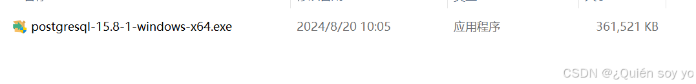
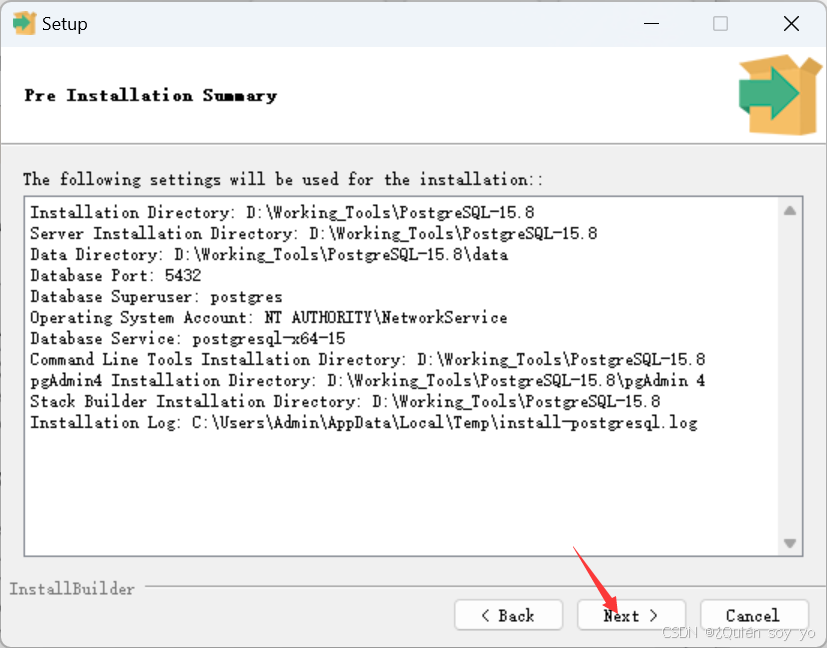

### 下载PostgreSQL

1. 进入官网

   [直达PostgreSQL下载页面（官网）](https://www.enterprisedb.com/downloads/postgres-postgresql-downloads)

2. 点击“Download the installer”链接，选择合适的安装版本，下载所需版本至本地（此处介绍15.8版本）

   

3. 下载完成后，找到[安装程序](https://so.csdn.net/so/search?q=安装程序&spm=1001.2101.3001.7020)并运行
   

4. 点击Next

   

5. 修改安装路径，然后点击Next

   

6. 默认全选，点击Next

   

7. 创建[数据存储](https://so.csdn.net/so/search?q=数据存储&spm=1001.2101.3001.7020)目录，建议默认不做修改，点击Next

   

8. 设置root密码，务必记住，点击Next

   

9. 设置端口，建议默认，点击Next

   

10. 选择语言，推荐中国区，点击Next

    

11. 点击Next

    

12. 点击Next

    

13. 等待安装

    

14. 点击Finish，至此安装完成

    

15. 若要验证PostgreSQL是否成功安装，打开命令提示符或PowerShell，输入psql --version，如果返回PostgreSQL的版本信息，则表示安装成功。