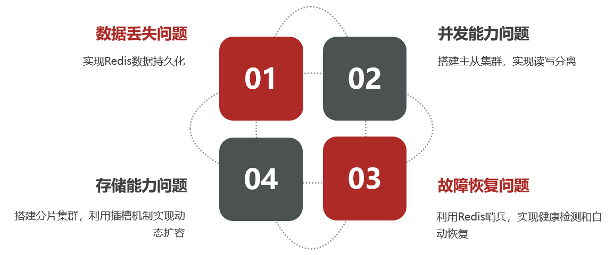
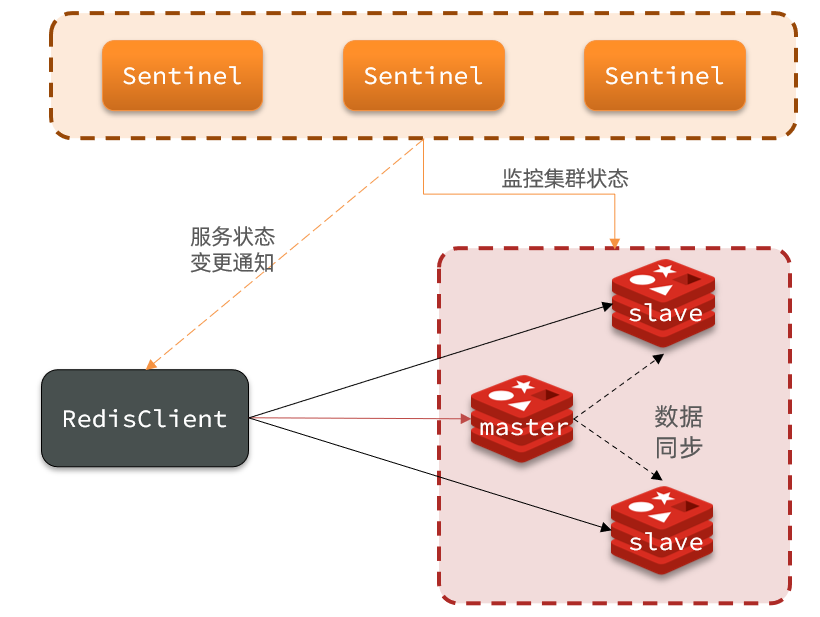
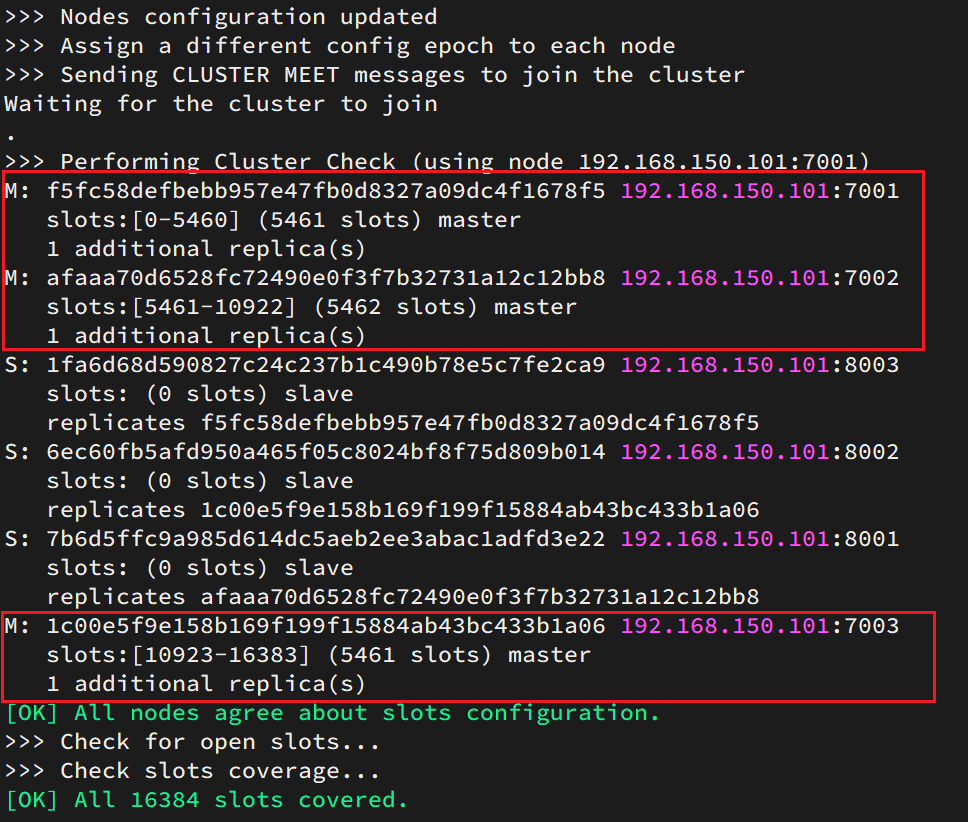
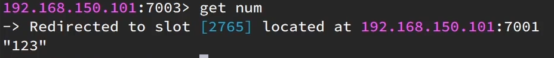

# 分布式缓存

-- 基于Redis集群解决单机Redis存在的问题


单机的Redis存在四大问题：




# 1.Redis持久化

Redis有两种持久化方案：

- RDB持久化
- AOF持久化


## 1.1.RDB持久化

RDB全称Redis Database Backup file（Redis数据备份文件），也被叫做Redis数据快照。简单来说就是把内存中的所有数据都记录到磁盘中。当Redis实例故障重启后，从磁盘读取快照文件，恢复数据。快照文件称为RDB文件，默认是保存在当前运行目录。

### 1.1.1.执行时机

RDB持久化在四种情况下会执行：

- 执行save命令, 会导致主进程执行RDB，这个过程中其它所有命令都会被阻塞。只有在数据迁移时可能用到。

  

- 执行bgsave命令, 开启一个子进程, 异步执行RDB, 主进程可以持续处理用户请求，不受影响。

  

- Redis停机时

  Redis停机时会执行一次save命令，实现RDB持久化。

  

- 触发RDB条件时

  Redis内部有触发RDB的机制，可以在redis.conf文件中找到，格式如下：

  ```properties
  # 900秒内，如果至少有1个key被修改，则执行bgsave ， 如果是save "" 则表示禁用RDB
  save 900 1  
  save 300 10  
  save 60 10000 
  
  # 是否压缩 ,建议不开启，压缩也会消耗cpu，磁盘的话不值钱
  rdbcompression yes
  # RDB文件名称
  dbfilename dump.rdb  
  # 文件保存的路径目录
  dir ./ 
  ```


### 1.1.2.bgsave原理

1. 在linux中, 所有的进程都没有办法操作物理内存, 而是给进程分配一个**专属**的虚拟内存, 进程只能操作虚拟内存, linux会维护物理内存到虚拟内存的映射, 叫做页表
2. 当执行bgsave的时候, 主进程调用fork()函数来复制出子进程, 此时**父进程和子进程的虚拟内存, 页表都一样, 即他们可以读取相同的物理内存**, 同时fork()函数还会将该共享的物理内存设置为read only
3. 此时子进程会遍历内存中的数据, 将数据写入到新的rdb文件中
4. 当子进程完成数据的写入后，它会**将临时文件重命名为新的持久化文件**，并覆盖掉旧的rdb文件


**父子进程数据一致性的问题**

当子进程在生成rdb的时候, 父进程可以正常接受读写操作

当父进程接受写请求, 并需要写虚拟内存的时候, 应为原来的物理内存被设置为了read only

所以操作系统会为该虚拟内存页面生成一个新的物理内存副本, 并将写操作应用在该副本上

这样两个进程就不会相互干扰了.  这个技术也被称为`copy-on-write`

也就是所**子进程能够写到rdb上的内容, 在fork出来之后就决定了, 对于fork过程中的写请求, 没有办法将其保存到rdb中**


**应为在rdb过程中, `copy on write`会分配新的物理内存, 所以需要预留一部分内存, 防止极端的写操作导致内存被打爆**


### 1.1.3. RDB的缺点

- **RDB执行间隔时间长，两次RDB之间写入数据有丢失的风险**
- **fork子进程、压缩、写出RDB文件都比较耗时**


## 1.2.AOF持久化

### 1.2.1.AOF原理

AOF全称为Append Only File（追加文件）。Redis处理的每一个写命令都会记录在AOF文件，可以看做是命令日志文件。


### 1.2.2 AOF格式说明


### 1.2.3 AOF配置

**AOF默认是关闭的**，需要修改redis.conf配置文件来开启AOF：

```properties
# 是否开启AOF功能，默认是no, 关闭
appendonly yes
# AOF文件的名称
appendfilename "appendonly.aof"
```


AOF的命令记录的频率也可以通过redis.conf文件来配：

```properties
# 表示每执行一次写命令，立即刷盘
appendfsync always 
# 写命令执行完先放入AOF缓冲区，然后表示每隔1秒将缓冲区数据刷盘到磁盘上的AOF文件，是默认方案
# !!!!!!!!!!!!!!!!!!!!!最多丢失1s的内容!!!!!!!!!!!!!!!!!!!!!!!!
appendfsync everysec 
# 写命令执行完先放入AOF缓冲区，由操作系统决定何时将缓冲区内容写回磁盘
appendfsync no
```

三种策略对比：


### 1.2.4.AOF文件重写

因为是记录命令，对于相同的内容, AOF文件会比RDB文件大的多。而且AOF会记录对同一个key的多次写操作，但只有最后一次写操作才有意义。**通过执行AOF重写，可以压缩AOF文件，用最少的命令达到相同效果。**

如下是AOF重写的过程


**同时AOF重写还会对生成的aof文件进行重新编码, 以减小其体积**


#### AOF重写的时机

1. 调用`bgrewriteaof`命令

2. 达到阈值的时候, 阈值可以在redis.conf中配置, **两者需要同时满足**

   ~~~properties
   # AOF文件比上次文件 增长超过多少百分比则触发重写
   auto-aof-rewrite-percentage 100
   # AOF文件体积最小多大以上才触发重写 
   auto-aof-rewrite-min-size 64mb 
   ~~~

3. 程序结束时, 会将aof缓冲区进行刷盘, 然后rewriteaof文件

   


#### bgrewriteaof的过程

**和bgsave类似, 只不过bgsave是将数据写到rdb中, 而bgrewriteaof是对数据生成命令, 然后写到aof中**

详细过程如下: 

1. 在linux中, 所有的进程都没有办法操作物理内存, 而是给进程分配一个**专属**的虚拟内存, 进程只能操作虚拟内存, linux会维护物理内存到虚拟内存的映射, 叫做页表
2. 当执行bgsave的时候, 主进程调用fork()函数来复制出子进程, 此时**父进程和子进程的虚拟内存, 页表都一样, 即他们可以读取相同的物理内存**, 同时fork()函数还会将该共享的物理内存设置为read only
3. 此时子进程会遍历内存中的数据, 并生成对应的命令, 然后将命令写入到aof中
4. 当子进程完成数据的写入后，它会**将临时文件重命名为新的持久化文件**，并覆盖掉旧的rdb文件


#### bgrewriteaof过程中的数据一致性问题

当子进程在rewrite的过程中, 父线程依旧是可以正常的读写的, 此时就会出现新的aof文件和实际上的数据是不一致的

为了解决这个问题, 在fork子进程后, 父线程会新建一个AOF 重写缓冲区，当Redis服务器执行一个写命令之后，就会将这个写命令也发送到 AOF 重写缓冲区。当子进程完成 AOF 重写之后，就会给父进程发送一个信号，父进程接收此信号后，就会调用函数将 AOF 重写缓冲区的内容都写到新的 AOF 文件中。

因为**将aof重写缓存区中的内容写到aof新的文件中这个操作, 是在父线程中执行的, 所以会堵塞, 此时不会处理写请求.** 


## 1.3 混合持久化

混合持久化并不是一种全新的持久化方式，**而是在AOF的基础上对其进行了优化。(触发的时机和aof重写一样)**

开启混合持久化，重写后的新 AOF 文件前半段是 RDB 格式的全量数据，后半段是 AOF 格式的增量数据。

整体格式为：`[RDB file] [AOF tail]`


使用`aof-use-rdb-preamble true`来开启混合持久化, 该配置在redis 4中被引入, 默认是`no`, 但是在redis5中默认为`yes`


**混合持久化本质是通过 AOF 后台重写（`bgrewriteaof` 命令）完成的，不同的是当开启混合持久化时，fork 出的子进程先将当前全量数据以 RDB 方式写入新的 AOF 文件，然后退出并通知主进程**

**主进程再然后再将 AOF 重写缓冲区（aof_rewrite_buf_blocks）的增量命令以 AOF 方式写入到文件，写入完成将新的含有 RDB 格式和 AOF 格式的 AOF 文件替换旧的的 AOF 文件。**


## 1.4.RDB与AOF对比

RDB和AOF各有自己的优缺点，如果对数据安全性要求较高，在实际开发中往往会**结合**两者来使用。


# 2.Redis主从

单节点Redis的并发能力是有上限的，要进一步提高Redis的并发能力，就需要搭建主从集群，实现读写分离。


## 2.1.搭建主从架构

### 规划

我们搭建的主从集群结构如图：


共包含三个节点，一个主节点，两个从节点。

这里我们会在同一台虚拟机中开启3个redis实例，模拟主从集群，信息如下：

|       IP        | PORT |  角色  |
| :-------------: | :--: | :----: |
| 192.168.150.101 | 7001 | master |
| 192.168.150.101 | 7002 | slave  |
| 192.168.150.101 | 7003 | slave  |

### 准备实例和配置

要在同一台虚拟机开启3个实例，必须准备三份不同的配置文件和目录，配置文件所在目录也就是工作目录。

1）创建目录

我们创建三个文件夹，名字分别叫7001、7002、7003：

```sh
# 进入/tmp目录
cd /tmp
# 创建目录
mkdir 7001 7002 7003
```

如图：


2）恢复原始配置

修改redis-6.2.4/redis.conf文件，将其中的持久化模式改为默认的RDB模式，AOF保持关闭状态。

```properties
# 开启RDB
# save ""
save 3600 1
save 300 100
save 60 10000

# 关闭AOF
appendonly no
```


3）拷贝配置文件到每个实例目录

然后将redis-6.2.4/redis.conf文件拷贝到三个目录中（在/tmp目录执行下列命令）：

```sh
# 方式一：逐个拷贝
cp redis-6.2.4/redis.conf 7001
cp redis-6.2.4/redis.conf 7002
cp redis-6.2.4/redis.conf 7003

# 方式二：管道组合命令，一键拷贝
echo 7001 7002 7003 | xargs -t -n 1 cp redis-6.2.4/redis.conf
```


4）修改每个实例的端口、工作目录

修改每个文件夹内的配置文件，将端口分别修改为7001、7002、7003，将rdb文件保存位置都修改为自己所在目录（在/tmp目录执行下列命令）：

```sh
sed -i -e 's/6379/7001/g' -e 's/dir .\//dir \/tmp\/7001\//g' 7001/redis.conf
sed -i -e 's/6379/7002/g' -e 's/dir .\//dir \/tmp\/7002\//g' 7002/redis.conf
sed -i -e 's/6379/7003/g' -e 's/dir .\//dir \/tmp\/7003\//g' 7003/redis.conf
```


5）修改每个实例的声明IP

指定 Redis实例用于宣告自身 IP 的地址。这是告诉其他  Redis 服务器如何访问当前Redis

```properties
# redis实例的声明 IP
replica-announce-ip 192.168.150.101
```

每个目录都要改，我们一键完成修改（在/tmp目录执行下列命令）：

```sh
# 逐一执行
# 1a表示在文件的第一行之后插入文本
sed -i '1a replica-announce-ip 192.168.150.101' 7001/redis.conf
sed -i '1a replica-announce-ip 192.168.150.101' 7002/redis.conf
sed -i '1a replica-announce-ip 192.168.150.101' 7003/redis.conf

# 或者一键修改
printf '%s\n' 7001 7002 7003 | xargs -I{} -t sed -i '1a replica-announce-ip 192.168.150.101' {}/redis.conf
```

### 启动

为了方便查看日志，我们打开3个ssh窗口，分别启动3个redis实例，启动命令：

```sh
# 第1个
redis-server 7001/redis.conf
# 第2个
redis-server 7002/redis.conf
# 第3个
redis-server 7003/redis.conf
```


启动后：


如果要一键停止，可以运行下面命令：

```sh
printf '%s\n' 7001 7002 7003 | xargs -I{} -t redis-cli -p {} shutdown
```

### 开启主从关系

现在三个实例还没有任何关系，要配置主从可以使用replicaof 或者slaveof（5.0以前）命令。

有临时和永久两种模式：

- 修改配置文件（永久生效）

  - 在redis.conf中添加一行配置：```slaveof <masterip> <masterport>```

- 使用redis-cli客户端连接到redis服务，执行slaveof命令（重启后失效）：

  ```sh
  slaveof <masterip> <masterport>
  ```


<strong><font color='red'>注意</font></strong>：在5.0以后新增命令replicaof，与salveof效果一致。


这里我们为了演示方便，使用方式二。

通过redis-cli命令连接7002，执行下面命令：

```sh
# 连接 7002
redis-cli -p 7002
# 执行slaveof
slaveof 192.168.150.101 7001
```


通过redis-cli命令连接7003，执行下面命令：

```sh
# 连接 7003
redis-cli -p 7003
# 执行slaveof
slaveof 192.168.150.101 7001
```


然后连接 7001节点，查看集群状态：

```sh
# 连接 7001
redis-cli -p 7001
# 查看状态
info replication
```

结果：


### 测试

执行下列操作以测试：

- 利用redis-cli连接7001，执行```set num 123```

- 利用redis-cli连接7002，执行```get num```，再执行```set num 666```

- 利用redis-cli连接7003，执行```get num```，再执行```set num 888```


可以发现，只有在7001这个master节点上可以执行写操作，7002和7003这两个slave节点只能执行读操作。


## 2.2.主从数据同步过程

首先需要知道的

- 当第一个slave加入的时候, master会生成一个`ReplicationID`, slave会继承master节点的run id.  id一致则说明是同一数据集
- master中有一个环形缓存区, 叫repl_backlog, repl_baklog中会记录Redis处理过的命令日志及offset，包括master当前的offset，和slave已经拷贝到的offset

1. redis接收到`slaveof`命令后, 判断当前自己的角色
   1. 如果是master, 说明当前是第一次执行复制, 那么向master发送一个psync命令, `replication id=?, offset=-1`
   2. 如果是slave, 说明不是第一次执行复制, 那么向master发送一个psync命令, `replication id = <runid>, offset=<offset>`
2. master接受到psync后, 判断replication id和自己的replication id是否相同
   1. 如果不同, 说明这个slave之前不是跟随自己的,  此时需要全量同步, 返回`fullresync {replication } {offset}`,  runid是master当前的runid, offset表示当前主节点的复制偏移量
   2. 如果相同, 那么比较master自己的offset, 和slave的offset
      1. 如果差距不大, 那么执行增量同步
      2. 如果差距过大(查看repl_backlog的原理), 那么执行全量同步, 返回`fullresync {replication } {offset}`,


### 2.2.1.全量同步


完整流程描述：

- slave节点请求增量同步
- master节点判断需要全量备份
- master执行bgsave生成rdb，发送RDB到slave
- slave清空本地数据，加载master的RDB
- master将RDB期间的命令记录在repl_baklog，并持续将log中的命令发送给slave
- slave执行接收到的命令，保持与master之间的同步


### 2.2.2.增量同步

当master判断可以增量同步时, master从repl_backlog中获取差异的数据, 然后发送给slave, slave接受到命令之后执行.


那么master怎么知道slave与自己的数据差异在哪里呢?


### 2.2.3.repl_backlog原理

master怎么知道slave与自己的数据差异在哪里呢?

这就要说到全量同步时的repl_baklog文件了。

这个文件是一个固定大小的数组，只不过数组是环形，也就是说**角标到达数组末尾后，会再次从0开始读写**，这样数组头部的数据就会被覆盖。

repl_baklog中会记录Redis处理过的命令日志及offset，包括master当前的offset，和slave已经拷贝到的offset：

 

slave与master的offset之间的差异，就是salve需要增量拷贝的数据了。

随着不断有数据写入，master的offset逐渐变大，slave也不断的拷贝，追赶master的offset：

 


直到数组被填满：

 

此时，如果有新的数据写入，就会覆盖数组中的旧数据。不过，旧的数据只要是绿色的，说明是已经被同步到slave的数据，即便被覆盖了也没什么影响。因为未同步的仅仅是红色部分。


但是，如果slave出现网络阻塞，导致master的offset远远超过了slave的offset： 

 

如果master继续写入新数据，其offset就会覆盖旧的数据，直到将slave现在的offset也覆盖：

 


棕色框中的红色部分，就是尚未同步，但是却已经被覆盖的数据。此时如果slave恢复，需要同步，却发现自己的offset都没有了，无法完成增量同步了。只能做全量同步。


## 2.3.主从同步优化

主从同步可以保证主从数据的一致性，非常重要。

可以从以下几个方面来优化Redis主从就集群：

- 在master中配置`repl-diskless-sync yes`启用无磁盘复制

  在不开启的情况下, master执行bgsave, 生成rdb到磁盘上, 然后将rdb发送给slave

  开启后, rdb不会生成在磁盘上, 而是子进程直接通过网络发送给slave

- 适当提高repl_baklog的大小，发现slave宕机时尽快实现故障恢复，尽可能避免全量同步

- 限制一个master上的slave节点数量，反正master多次执行bgsave

  如果实在是太多slave，则可以采用主-从-从链式结构，减少master压力

主从从架构图：


## 2.4.小结

简述全量同步和增量同步区别？

- 全量同步：master将完整内存数据生成RDB，发送RDB到slave。后续命令则记录在repl_baklog，逐个发送给slave。
- 增量同步：slave提交自己的offset到master，master获取repl_baklog中从offset之后的命令给slave

什么时候执行全量同步？

- slave节点第一次连接master节点时
- slave节点断开时间太久，repl_baklog中的offset已经被覆盖时

什么时候执行增量同步？

- slave节点断开又恢复，并且在repl_baklog中能找到offset时


# 3.Redis哨兵

Redis提供了哨兵（Sentinel）机制来实现主从集群的自动故障恢复。

## 3.1.哨兵原理

### 3.1.1.集群结构和作用

哨兵的结构如图：



哨兵的作用如下：

- **监控**：Sentinel 会不断检查您的master和slave是否按预期工作
- **自动故障恢复**：如果master故障，Sentinel会将一个slave提升为master。当故障实例恢复后也以新的master为主
- **通知**：Sentinel通知Java客户端, 主从节点变更, 使得Java客户端能够从新的主从架构中进行读写分离


### 3.1.2.集群监控原理

Sentinel基于心跳机制监测服务状态，每隔1秒向集群的每个实例发送`ping`命令：

•主观下线：如果某sentinel节点发现某实例未在规定时间响应，则认为该实例**主观下线**。

•客观下线：若超过指定数量（quorum）的sentinel都认为该实例主观下线，则该实例**客观下线**。quorum一般为 `sentinel num/2 + 1`


### 3.1.3.集群故障恢复原理

一旦发现master故障，sentinel需要在salve中选择一个作为新的master，选择依据是这样的：

- 首先会判断slave节点与master节点断开时间长短，如果超过指定值（down-after-milliseconds * 10）则会排除该slave节点
- 然后判断slave节点的slave-priority值，越小优先级越高，如果是0则永不参与选举
- 如果slave-prority一样，则判断slave节点的offset值，越大说明数据越新，优先级越高
- 最后是判断slave节点的运行id大小，越小优先级越高。


### 3.1.4.主从切换原理

当选出一个新的master后，该如何实现切换呢？

流程如下：

- sentinel给备选的slave1节点发送`slaveof no one`命令，让该节点成为master
- sentinel给所有其它slave发送`slaveof 192.168.150.101 7002` 命令，让这些slave成为新master的从节点，开始从新的master上同步数据。
- 最后，sentinel将故障节点标记为slave，当故障节点恢复后会自动成为新的master的slave节点


### 3.1.5.小结

Sentinel的三个作用是什么？

- 监控
- 故障转移
- 通知

Sentinel如何判断一个redis实例是否健康？

- 每隔1秒发送一次ping命令，如果超过一定时间没有相向则认为是主观下线
- 如果大多数sentinel都认为实例主观下线，则判定服务下线

故障转移步骤有哪些？

- 首先选定一个slave作为新的master，执行slaveof no one
- 然后让所有节点都执行slaveof 新master
- 修改故障节点配置，添加slaveof 新master

## 3.2.搭建哨兵集群

### 规划

这里我们搭建一个三节点形成的Sentinel集群，来监管之前的Redis主从集群。如图：


三个sentinel实例信息如下：

| 节点 |       IP        | PORT  |
| ---- | :-------------: | :---: |
| s1   | 192.168.150.101 | 27001 |
| s2   | 192.168.150.101 | 27002 |
| s3   | 192.168.150.101 | 27003 |

### 准备实例和配置

要在同一台虚拟机开启3个实例，必须准备三份不同的配置文件和目录，配置文件所在目录也就是工作目录。

我们创建三个文件夹，名字分别叫s1、s2、s3：

```sh
# 进入/tmp目录
cd /tmp
# 创建目录
mkdir s1 s2 s3
```

如图：


然后我们在s1目录创建一个sentinel.conf文件，添加下面的内容：

```ini
# 当前sentinel实例的端口
port 27001 
# 指定 Sentinel 实例用于宣告自身 IP 的地址。这是告诉其他 Sentinel 和 Redis 服务器如何访问该 Sentinel 
sentinel announce-ip 192.168.150.101
# 指定master节点的ip, mymaster为主节点名称, 可以任意写, 2表示选举master时的quorum值
sentinel monitor mymaster 192.168.150.101 7001 2
# 判断slave节点与master节点断开时间长短，如果超过指定值（down-after-milliseconds * 10）则会排除该slave节点
sentinel down-after-milliseconds mymaster 5000
# 超过60000ms后认为master宕机
sentinel failover-timeout mymaster 60000
dir "/tmp/s1"
```


然后将s1/sentinel.conf文件拷贝到s2、s3两个目录中（在/tmp目录执行下列命令）：

```sh
# 方式一：逐个拷贝
cp s1/sentinel.conf s2
cp s1/sentinel.conf s3
# 方式二：管道组合命令，一键拷贝
echo s2 s3 | xargs -t -n 1 cp s1/sentinel.conf
```


修改s2、s3两个文件夹内的配置文件，将端口分别修改为27002、27003：

```sh
# 修改端口和数据目录
sed -i -e 's/27001/27002/g' -e 's/s1/s2/g' s2/sentinel.conf
sed -i -e 's/27001/27003/g' -e 's/s1/s3/g' s3/sentinel.conf
```

### 启动

为了方便查看日志，我们打开3个ssh窗口，分别启动3个redis实例，启动命令：

```sh
# 第1个
redis-sentinel s1/sentinel.conf
# 第2个
redis-sentinel s2/sentinel.conf
# 第3个
redis-sentinel s3/sentinel.conf
```


启动后：


### 测试

尝试让master节点7001宕机，查看sentinel日志：


查看7003的日志：


查看7002的日志：


## 3.3.RedisTemplate配置读写分离

在Sentinel集群监管下的Redis主从集群，其节点会因为自动故障转移而发生变化，Redis的客户端必须感知这种变化，及时更新连接信息。Spring的RedisTemplate底层利用lettuce实现了节点的感知和自动切换。

下面，我们通过一个测试来实现RedisTemplate集成哨兵机制。

### 3.3.1.创建SpringBoot项目


### 3.3.2.引入依赖

在项目的pom文件中引入依赖：

```xml
<dependency>
    <groupId>org.springframework.boot</groupId>
    <artifactId>spring-boot-starter-data-redis</artifactId>
</dependency>
```


### 3.3.3.配置Redis地址

然后在配置文件application.yml中指定redis的sentinel相关信息：

```yml
spring:
  redis:
    sentinel:
      master: mymaster
      # 这里配置的是sentinel地址, 客户端根据sentinel来获取redis地址
      nodes:
        - 192.168.150.101:27001
        - 192.168.150.101:27002
        - 192.168.150.101:27003
        
logging:
  level:
    # 配置lettuce, 方便查看底层调用了哪个客户端
    # 如果不需要可以生成这段
    io.lettuce.core: debug
  pattern:
    dateformat: MM-dd HH:mm:ss:SSS
```


### 3.3.4.配置读写分离

在项目的启动类中，添加一个新的bean：

```java
@Bean
public LettuceClientConfigurationBuilderCustomizer clientConfigurationBuilderCustomizer(){
    return clientConfigurationBuilder -> clientConfigurationBuilder.readFrom(ReadFrom.REPLICA_PREFERRED);
}
```


这个bean中配置的就是读写策略，包括四种：

- MASTER：从主节点读取
- MASTER_PREFERRED：优先从master节点读取，master不可用才读取replica
- REPLICA：从slave（replica）节点读取
- REPLICA _PREFERRED：优先从slave（replica）节点读取，所有的slave都不可用才读取master


### 3.3.5 注入RedisTemplate

~~~java
@RestController
public class HelloController {

    @Autowired
    private StringRedisTemplate redisTemplate;

    @GetMapping("/get/{key}")
    public String hi(@PathVariable String key) {
        return redisTemplate.opsForValue().get(key);
    }

    @GetMapping("/set/{key}/{value}")
    public String hi(@PathVariable String key, @PathVariable String value) {
        redisTemplate.opsForValue().set(key, value);
        return "success";
    }
}
~~~


# 4.Redis分片集群

主从和哨兵可以解决高可用、高并发读的问题。但是依然有两个问题没有解决：

- 海量数据存储问题

- 高并发写的问题

使用分片集群可以解决上述问题，如图:


分片集群特征：

- 集群中有多个master，每个master保存不同数据

- 每个master都可以有多个slave节点

- master之间通过ping监测彼此健康状态

- 客户端请求可以访问集群任意节点，最终都会被转发到正确节点


## 4.1.分片集群搭建

### 规划

分片集群需要的节点数量较多，这里我们搭建一个最小的分片集群，包含3个master节点，每个master包含一个slave节点，结构如下：


这里我们会在同一台虚拟机中开启6个redis实例，模拟分片集群，信息如下：

|       IP        | PORT |  角色  |
| :-------------: | :--: | :----: |
| 192.168.150.101 | 7001 | master |
| 192.168.150.101 | 7002 | master |
| 192.168.150.101 | 7003 | master |
| 192.168.150.101 | 8001 | slave  |
| 192.168.150.101 | 8002 | slave  |
| 192.168.150.101 | 8003 | slave  |

### 准备实例和配置

删除之前的7001、7002、7003这几个目录，重新创建出7001、7002、7003、8001、8002、8003目录：

```sh
# 进入/tmp目录
cd /tmp
# 删除旧的，避免配置干扰
rm -rf 7001 7002 7003
# 创建目录
mkdir 7001 7002 7003 8001 8002 8003
```


在/tmp下准备一个新的redis.conf文件，内容如下：

```ini
port 6379
# 开启集群功能
cluster-enabled yes
# 集群的配置文件名称，不需要我们创建，由redis自己维护
cluster-config-file /tmp/6379/nodes.conf
# 节点心跳失败的超时时间
cluster-node-timeout 5000
# 持久化文件存放目录
dir /tmp/6379
# 绑定地址
bind 0.0.0.0
# 让redis后台运行
daemonize yes
# 注册的实例ip
replica-announce-ip 192.168.150.101
# 保护模式
protected-mode no
# 数据库数量
databases 1
# 日志
logfile /tmp/6379/run.log
```

将这个文件拷贝到每个目录下：

```sh
# 进入/tmp目录
cd /tmp
# 执行拷贝
echo 7001 7002 7003 8001 8002 8003 | xargs -t -n 1 cp redis.conf
```


修改每个目录下的redis.conf，将其中的6379修改为与所在目录一致：

```sh
# 进入/tmp目录
cd /tmp
# 修改每个配置文件的端口
printf '%s\n' 7001 7002 7003 8001 8002 8003 | xargs -I{} -t sed -i 's/6379/{}/g' {}/redis.conf
```

### 启动

因为已经配置了后台启动模式，所以可以直接启动服务：

```sh
# 进入/tmp目录
cd /tmp
# 一键启动所有服务
printf '%s\n' 7001 7002 7003 8001 8002 8003 | xargs -I{} -t redis-server {}/redis.conf
```

通过ps查看状态：

```sh
ps -ef | grep redis
```

发现服务都已经正常启动：


如果要关闭所有进程，可以执行命令：

```sh
ps -ef | grep redis | awk '{print $2}' | xargs kill
```

或者（推荐这种方式）：

```sh
printf '%s\n' 7001 7002 7003 8001 8002 8003 | xargs -I{} -t redis-cli -p {} shutdown
```

### 创建集群

虽然服务启动了，但是目前每个服务之间都是独立的，没有任何关联。

我们需要执行命令来创建集群，在Redis5.0之前创建集群比较麻烦，5.0之后集群管理命令都集成到了redis-cli中。


1）Redis5.0之前

Redis5.0之前集群命令都是用redis安装包下的src/redis-trib.rb来实现的。因为redis-trib.rb是有ruby语言编写的所以需要安装ruby环境。

 ```sh
 # 安装依赖
 yum -y install zlib ruby rubygems
 gem install redis
 ```


然后通过命令来管理集群：

```sh
# 进入redis的src目录
cd /tmp/redis-6.2.4/src
# 创建集群
./redis-trib.rb create --replicas 1 192.168.150.101:7001 192.168.150.101:7002 192.168.150.101:7003 192.168.150.101:8001 192.168.150.101:8002 192.168.150.101:8003
```


2）Redis5.0以后

我们使用的是Redis6.2.4版本，集群管理以及集成到了redis-cli中，格式如下：

```sh
redis-cli --cluster create --cluster-replicas 1 192.168.150.101:7001 192.168.150.101:7002 192.168.150.101:7003 192.168.150.101:8001 192.168.150.101:8002 192.168.150.101:8003
```

命令说明：

- `redis-cli --cluster`或者`./redis-trib.rb`：代表集群操作命令
- `create`：代表是创建集群
- `--replicas 1`或者`--cluster-replicas 1` ：指定集群中每个master的副本个数为1，此时`节点总数 ÷ (replicas + 1)` 得到的就是master的数量。因此节点列表中的前n个就是master，其它节点都是slave节点，随机分配到不同master


运行后的样子：


这里输入yes，则集群开始创建：




通过命令可以查看集群状态：

```sh
redis-cli -p 7001 cluster nodes
```


### 测试

尝试连接7001节点，存储一个数据：

```sh
# 连接
redis-cli -p 7001
# 存储数据
set num 123
# 读取数据
get num
# 再次存储
set a 1
```

结果悲剧了：


集群操作时，需要给`redis-cli`加上`-c`参数才可以：

```sh
redis-cli -c -p 7001
```

这次可以了：


## 4.2.散列插槽

### 4.2.1.插槽原理

Redis会把每一个master节点映射到0~16383共16384个插槽（hash slot）上，查看集群信息时就能看到：


数据key不是与节点绑定，而是与插槽绑定。redis会根据key的有效部分计算插槽值，分两种情况：

- key中包含"{}"，且“{}”中至少包含1个字符，“{}”中的部分是有效部分
- key中不包含“{}”，整个key都是有效部分


例如：key是num，那么就根据num计算，如果是{itcast}num，则根据itcast计算。计算方式是利用CRC16算法得到一个hash值，然后对16384取余，得到的结果就是slot值。

 

如图，在7001这个节点执行set a 1时，对a做hash运算，对16384取余，得到的结果是15495，因此要存储到103节点。

到了7003后，执行`get num`时，对num做hash运算，对16384取余，得到的结果是2765，因此需要切换到7001节点


### 4.2.1.小结

Redis如何判断某个key应该在哪个实例？

- 将16384个插槽分配到不同的实例
- 根据key的有效部分计算哈希值，对16384取余
- 余数作为插槽，寻找插槽所在实例即可

如何将同一类数据固定的保存在同一个Redis实例？

- 这一类数据使用相同的有效部分，例如key都以{typeId}为前缀


## 4.3.集群伸缩

redis-cli --cluster提供了很多操作集群的命令，可以通过下面方式查看：


比如，添加节点的命令：


### 4.3.1.需求分析

需求：向集群中添加一个新的master节点，并向其中存储 num = 10

- 启动一个新的redis实例，端口为7004
- 添加7004到之前的集群，并作为一个master节点
- 给7004节点分配插槽，使得num这个key可以存储到7004实例


这里需要两个新的功能：

- 添加一个节点到集群中
- 将部分插槽分配到新插槽


### 4.3.2.创建新的redis实例

创建一个文件夹：

```sh
mkdir 7004
```

拷贝配置文件：

```sh
cp redis.conf /7004
```

修改配置文件：

```sh
sed /s/6379/7004/g 7004/redis.conf
```

启动

```sh
redis-server 7004/redis.conf
```


### 4.3.3.添加新节点到redis

添加节点的语法如下：


执行命令：

```sh
# 192.168.150.101:7004是指定需要加入到集群的节点
# 192.168.150.101:7001是集群中的一个已知节点的地址和端口。
# 新节点会将自己连接到这个已知节点，并加入集群。
redis-cli --cluster add-node  192.168.150.101:7004 192.168.150.101:7001
```


通过命令查看集群状态：

```sh
redis-cli -p 7001 cluster nodes
```


如图，7004加入了集群，并且**默认是一个master节点**：


但是，可以看到7004节点的插槽数量为0，因此没有任何数据可以存储到7004上


### 4.3.4.转移插槽

我们要将num存储到7004节点，因此需要先看看num的插槽是多少：



如上图所示，num的插槽为2765.


我们可以将0~3000的插槽从7001转移到7004，命令格式如下：


具体命令如下：

建立连接, 这里的ip可以是任意master的ip：


得到下面的反馈：


询问要移动多少个插槽，我们计划是3000个：

新的问题来了：


那个node来接收这些插槽？？

显然是7004，那么7004节点的id是多少呢？


复制这个id，然后拷贝到刚才的控制台后：


这里询问，你的插槽是从哪里移动过来的？

- all：代表全部，也就是三个节点各转移一部分
- 具体的id：目标节点的id
- done：没有了


这里我们要从7001获取，因此填写7001的id：


填完后，点击done，这样插槽转移就准备好了：


确认要转移吗？输入yes：

然后，通过命令查看结果：

 

可以看到： 


目的达成。


## 4.4.故障转移

集群初识状态是这样的：


其中7001、7002、7003都是master，我们计划让7002宕机。


### 4.4.1.自动故障转移

当集群中有一个master宕机会发生什么呢？

直接停止一个redis实例，例如7002：

```sh
redis-cli -p 7002 shutdown
```


1）首先是该实例与其它实例失去连接

2）然后是疑似宕机：


3）最后是确定下线，自动提升一个slave为新的master：


4）当7002再次启动，就会变为一个slave节点了：


### 4.4.2.手动故障转移

在某些情况下让master做slave, slave做master

比如替换性能差的master所在的机器, 或者在故障回复后, 重新让原来的master称为master

那么就可以使用`cluster failover`命令, 实现master和slave的切换


**案例需求**：在7002这个slave节点执行手动故障转移，重新夺回master地位

步骤如下：

1）利用redis-cli连接上要成为master的节点, 即7002

2）执行`cluster failover`命令, 此时会让master变为slave, slave变为master

如图：


效果：


**手动故障转移的流程**:


这种failover命令可以指定三种模式：

- 缺省：即执行`cluster failover`命令, 那么会执行上图的步骤1-6
- force：即执行`cluster  failover force`命令, 那么会省略上图的步骤3, 即对offset的一致性校验
- takeover：即执行`cluster failover takeover`命令,   那么直接执行第5歩将自己标记为master并广播，忽略数据一致性、忽略master状态和其它master的意见


## 4.5.RedisTemplate访问分片集群

RedisTemplate底层同样基于lettuce实现了分片集群的支持，而使用的步骤与哨兵模式基本一致：

1）引入redis的starter依赖

2）配置分片集群地址

~~~yaml
spring:
  redis:
    cluster:
      # 配置redis中集群所有节点的ip
      nodes: 
        - 192.168.150.101:7001
        - 192.168.150.101:7002
        - 192.168.150.101:7003
        - 192.168.150.101:8001
        - 192.168.150.101:8002
        - 192.168.150.101:8003
~~~

3）配置读写分离

在项目的启动类中，添加一个新的bean：

```java
@Bean
public LettuceClientConfigurationBuilderCustomizer clientConfigurationBuilderCustomizer(){
    return clientConfigurationBuilder -> clientConfigurationBuilder.readFrom(ReadFrom.REPLICA_PREFERRED);
}
```


这个bean中配置的就是读写策略，包括四种：

- MASTER：从主节点读取
- MASTER_PREFERRED：优先从master节点读取，master不可用才读取replica
- REPLICA：从slave（replica）节点读取
- REPLICA _PREFERRED：优先从slave（replica）节点读取，所有的slave都不可用才读取master


