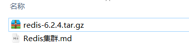
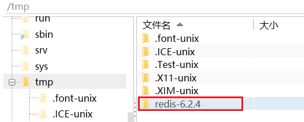

# Redis集群

本章是基于CentOS7下的Redis集群教程，包括：

- 单机安装Redis
- Redis主从
- Redis分片集群


# 1.单机安装Redis

首先需要安装Redis所需要的依赖：

```sh
yum install -y gcc tcl
```


然后将课前资料提供的Redis安装包上传到虚拟机的任意目录：



例如，我放到了/tmp目录：


解压缩：

```sh
tar -xzf redis-6.2.4.tar.gz
```

解压后：



进入redis目录：

```sh
cd redis-6.2.4
```


运行编译命令：

```sh
make && make install
```

如果没有出错，应该就安装成功了。

然后修改redis.conf文件中的一些配置：

```properties
# 绑定地址，默认是127.0.0.1，会导致只能在本地访问。修改为0.0.0.0则可以在任意IP访问
bind 0.0.0.0
# 保护模式，关闭保护模式
protected-mode no
# 数据库数量，设置为1
databases 1
```


启动Redis：

```sh
redis-server redis.conf
```

停止redis服务：

```sh
redis-cli shutdown
```


# 2.Redis主从集群


# 3.搭建哨兵集群


## 3.1.集群结构


# 4.搭建分片集群


