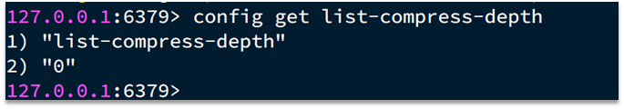

Redis原理篇

## 1、Redis数据结构

### 1.1 Redis数据结构-动态字符串SDS

我们都知道Redis中保存的Key是字符串，value往往是字符串或者字符串的集合。可见字符串是Redis中最常用的一种数据结构。

不过Redis没有直接使用C语言中的字符串，因为C语言字符串存在很多问题：


- 获取字符串长度的需要通过运算

  要么获取数组长度-1,  要么遍历知道找到结束符

- 非二进制安全

  C语音中的字符串最后一位是`\0`, 作为结束符

  这就要求保存的字符串中不能有`\0`, 否则会被当做结束符

- 字符串保存在常量池中, 不可修改


Redis构建了一种新的字符串结构，称为简单动态字符串（Simple Dynamic String），简称SDS。
  例如，我们执行命令：


那么Redis将在底层创建两个SDS，其中一个是包含“name”的SDS，另一个是包含“虎哥”的SDS。

Redis是C语言实现的，其中SDS是一个结构体，源码如下：


sdshdr8使用`uint8`来表示字符串长度, 可以保存长度不超过255(需要减掉最后一个结束符)的字符串

同理还有`sdshdr5`, `sdshdr16`, `sdshdr32`, `sdshd64`


例如，一个包含字符串“name”的sds结构如下：


所以相对于c语音中的字符串, 他可以直接获取长度, 并且按照字符串长度来读取内容, 所以是二进制安全的


SDS之所以叫做动态字符串，是因为它具备动态扩容的能力，例如一个内容为“hi”的SDS：


假如我们要给SDS追加一段字符串“,Amy”，这里首先会申请新内存空间：

- 如果新字符串小于1M，则新空间为`扩展后字符串长度的两倍+1`；

- 如果新字符串大于1M，则新空间为`扩展后字符串长度+1M+1`。称为内存预分配。


### 1.2 Redis数据结构-IntSet

IntSet是Redis中set集合的一种实现方式，基于c语音的整数数组来实现，并且具备长度可变、有序等特征。
结构如下：


其中的encoding包含三种模式，表示存储的整数大小不同：


如果是`INTSET_ENC_INT16`, 那么表示contents中的2个字节组合起来保存一个数字, 元素的范围为`-256~255`

如果是`INTSET_ENC_INT32`, 那么表示contents中的4个字节组合起来保存一个数字, 元素的范围是`-2^16~2^16-1`

如果是`INTSET_ENC_INT64`, 那么表示contents中的8个字节组合起来保存一个数字, 元素的范围是`-2^32~2^32-1`


为了方便查找，Redis会将intset中所有的整数**按照升序依次**保存在contents数组中，结构如图：


当查找第n个的元素时, 那么他的地址就是在`contents数组的地址 + encoding*n`


现在，数组中每个数字都在int16_t的范围内，因此采用的编码方式是INTSET_ENC_INT16，每部分占用的字节大小为：
encoding：4字节
length：4字节
contents：2字节 * 3  = 6字节


我们向该其中添加一个数字：50000，这个数字超出了int16_t的范围，intset会自动升级编码方式到合适的大小。
以当前案例来说流程如下：

* 升级编码为INTSET_ENC_INT32, 每个整数占4字节，并按照新的编码方式及元素个数扩容数组
* 倒序依次将数组中的元素拷贝到扩容后的正确位置
* 将待添加的元素放入数组末尾
* 最后，将inset的encoding属性改为INTSET_ENC_INT32，将length属性改为4


源码如下：


小总结：

Intset可以看做是特殊的整数数组，具备一些特点：

* Redis会确保Intset中的元素唯一、有序
* 具备类型升级机制，可以节省内存空间
* 底层采用二分查找方式来查询


### 1.3 Redis数据结构-Dict

我们知道Redis是一个键值型（Key-Value Pair）的数据库，我们可以根据键实现快速的增删改查。而键与值的映射关系正是通过Dict来实现的。
Dict由三部分组成，分别是：哈希表（DictHashTable）、哈希节点（DictEntry）、字典（Dict）

我们先来看看哈希表和哈希节点

~~~c
typedef struct dictht{
    // 可以理解为一个dictEntry数组
    // 使用拉链法解决hash冲突, 并且是头插法(没有引入红黑树, 只是链表)
    dictEntry **table;
    // 数组长度, 每次扩容都是2倍, 所以固定为2的幂
    unsigned long size;
    // 固定为size - 1, 用来计算entry的位置, h%size = h & (size - 1)
    unsigned long sizemask;
    // entry的个数
    unsigned long used;
} dictht;

typedef struct dictEntry{
    // 指向任意类型的key的指针, 一般都是SDS
    void *key;
    // 联合体, 表示v的类型可以是其中1种
    union {
        void * val; // 指向任意类型的指针, 如果是string, 那么一般都是SDS
        uint64_t u64; // uint64
        int64_t s64; // int64
        double d; // double
    } v; // value
    struct dictEntry *next; // 指向下一个entry
} dictEntry;
~~~


当我们向Dict添加键值对时，Redis首先根据key计算出hash值（h），然后利用 h & sizemask来计算元素应该存储到数组中的哪个索引位置。我们存储k1=v1，假设k1的哈希值h =1，则1&3 =1，因此k1=v1要存储到数组角标1位置。


我们再来看看Dict

~~~c
typedef struct dict {
    dictType *type; // dict的类型, 内置不同的hash函数
    void *privatedata; // 私有数据, 在做特殊hash运算时使用
    dictht ht[2]; // 一个Dict包含两个哈希表, 其中ht[0]是当前数据, ht[1]一般是空, 在rehash的时候使用
    long rehashidx; // rehash的进度, -1表示未进行
    int16_t pauserehash; // rehash是否暂停, 1暂停, 0继续
} dict
~~~


**Dict的扩容**

Dict中的HashTable就是数组结合单向链表的实现，当集合中元素较多时，必然导致哈希冲突增多，链表过长，则查询效率会大大降低。
Dict在每次新增键值对时都会检查负载因子（LoadFactor = used/size） ，满足以下两种情况时会触发哈希表扩容：
哈希表的 LoadFactor >= 1，并且服务器没有执行 BGSAVE 或者 BGREWRITEAOF 等后台进程；
哈希表的 LoadFactor > 5 ；


**Dict的rehash**

不管是扩容还是收缩，必定会创建新的哈希表，导致哈希表的size和sizemask变化，而key的查询与sizemask有关。因此必须对哈希表中的每一个key重新计算索引，插入新的哈希表，这个过程称为rehash。过程是这样的：

* 计算新hash表的realeSize，值取决于当前要做的是扩容还是收缩：
  * 如果是扩容，则新size为第一个大于等于dict.ht[0].used + 1的2^n
  * 如果是收缩，则新size为第一个大于等于dict.ht[0].used的2^n （不得小于4）
* 按照新的realeSize申请内存空间，创建dictht，并赋值给dict.ht[1]
* 设置dict.rehashidx = 0，标示开始rehash
* 将dict.ht[0]中的每一个dictEntry都rehash到dict.ht[1]
* 将dict.ht[1]赋值给dict.ht[0]，给dict.ht[1]初始化为空哈希表，释放原来的dict.ht[0]的内存
* 将rehashidx赋值为-1，代表rehash结束
* 在rehash过程中，新增操作，则直接写入ht[1]
* 查询、修改和删除则会在dict.ht[0]和dict.ht[1]依次查找并执行。这样可以确保ht[0]的数据只减不增，随着rehash最终为空

整个过程可以描述成：


小总结：

Dict的结构：

* 类似java的HashTable，底层是数组加链表来解决哈希冲突
* Dict包含两个哈希表，ht[0]平常用，ht[1]用来rehash

Dict的伸缩：

* 当LoadFactor大于5或者LoadFactor大于1并且没有子进程任务时，Dict扩容
* 当LoadFactor小于0.1时，Dict收缩
* 扩容大小为第一个大于等于used + 1的2^n
* 收缩大小为第一个大于等于used 的2^n
* Dict采用渐进式rehash，每次访问Dict时执行一次rehash
* rehash时ht[0]只减不增，新增操作只在ht[1]执行，其它操作在两个哈希表


### 1.4 Redis数据结构-ZipList

ZipList 是一种特殊的“双端链表” ，他**使用数组来模拟双端队列**。

ZipList解决的问题是:  

- 在双端链表中, 每个entry都要包含pre, next, data. 如果data非常小时,  那么pre和next会占据大部分内存, 并且如果entry过多会导致查找效率偏慢
- 链表查找数据时, 需要不断的根据next进行寻址, 效率慢


**ZipList的结构**


| **属性** | **类型** | **长度** | **用途**                                                     |
| -------- | -------- | -------- | ------------------------------------------------------------ |
| zlbytes  | uint32_t | 4 字节   | 整个ziplist占用的字节数                                      |
| zltail   | uint32_t | 4 字节   | 记录压缩列表表尾节点距离压缩列表的起始地址有多少字节，通过这个偏移量，可以确定表尾节点的地址。<br>用来逆序查找 |
| zllen    | uint16_t | 2 字节   | 记录entry的个数。 最大值为65534，如果超过这个值，此处会记录为65535，但节点的真实数量需要遍历整个压缩列表才能计算得出。 |
| entry    | 列表节点 | 不定     | 压缩列表包含的各个节点，节点的长度由节点保存的内容决定。     |
| zlend    | uint8_t  | 1 字节   | 特殊值 0xFF （十进制 255 ），用于标记压缩列表的末端。        |

**ZipListEntry**

ZipList 中的Entry并不像普通链表那样记录前后节点的指针，因为记录两个指针要占用16个字节，浪费内存。而是采用了下面的结构：


* previous_entry_length：前一节点的长度，占1个或5个字节。**用来逆序查找.**
  * 如果前一节点的长度小于254字节，则采用1个字节来保存这个长度值
  * 如果前一节点的长度大于254字节，则采用5个字节来保存这个长度值，第一个字节为0xfe，后四个字节才是真实长度数据

* encoding：编码属性，记录content的数据类型（字符串还是整数）以及长度，占用1个、2个或5个字节

  | 编码                                                 | encoding占用字节数 | contents类型和长度                                         |
  | ---------------------------------------------------- | ------------------ | ---------------------------------------------------------- |
  | \|00xxxxxx\|                                         | 1 bytes            | 字符串, <= 63 bytes, 低位记录contents长度                  |
  | \|01xxxxxx\|xxxxxxxx\|                               | 2 bytes            | 字符串, <= 16383 bytes, 低位记录contents长度               |
  | \|10xxxxxx\|xxxxxxxx\|xxxxxxxx\|xxxxxxxx\|xxxxxxxx\| | 5 bytes            | 字符串, <= 4294967295 bytes, 低位记录contents长度          |
  | 11000000                                             | 1 bytes            | 整数, int16_t（2 bytes）                                   |
  | 11010000                                             | 1 bytes            | 整数, int32_t（2 bytes）                                   |
  | 11100000                                             | 1 bytes            | 整数, int64_t（8 bytes）                                   |
  | 11110000                                             | 1 bytes            | 24位有符整数(3 bytes)                                      |
  | 11111110                                             | 1 bytes            | 8位有符整数(1 bytes)                                       |
  | 1111xxxx                                             | 1 bytes            | 直接在xxxx位置保存数值，范围从0001~1101，减1后结果为实际值 |

* contents：负责保存节点的数据，可以是字符串或整数

ZipList中所有存储长度的数值均采用小端字节序，即低位字节在前，高位字节在后。例如：数值0x1234，采用小端字节序后实际存储值为：0x3412


**编码案例**

例如，我们要保存字符串：“ab”和 “bc”到ziplist中

如下是ab保存在entry中的结构


如下是bc保存在entry中的结构


如下是整个ziplist的结构


 

假如我们要保存2和5到ziplist中, 那么结构如下:

2和5在entry中的结构如下:


整个ziplist的结构如下:


**Redis数据结构-ZipList的连锁更新问题**

ZipList的每个Entry都包含previous_entry_length来记录上一个节点的大小，长度是1个或5个字节：
如果前一节点的长度小于254字节，则采用1个字节来保存这个长度值
如果前一节点的长度大于等于254字节，则采用5个字节来保存这个长度值，第一个字节为0xfe，后四个字节才是真实长度数据


现在，假设我们有N个连续的、长度为250~253字节之间的entry，因此entry的previous_entry_length属性用1个字节即可表示，如图所示：


ZipList这种特殊情况下产生的连续多次空间扩展操作称之为连锁更新（Cascade Update）。新增、删除都可能导致连锁更新的发生。

**小总结：**

**ZipList特性：**

* 压缩列表的可以看做一种连续内存空间的"双向链表"
* 列表的节点之间不是通过指针连接，而是记录上一节点和本节点长度来寻址，内存占用较低
* 如果列表数据过多，导致链表过长，可能影响查询性能
* 增或删较大数据时有可能发生连续更新问题


### 1.6 Redis数据结构-QuickList

问题1：ZipList虽然节省内存，但申请内存必须是连续空间，如果需要较大的连续内存，申请内存效率很低。怎么办？

​	答：为了缓解这个问题，我们必须限制ZipList的长度和entry大小。

问题2：但是我们要存储大量数据，超出了ZipList最佳的上限该怎么办？

​	答：我们可以创建多个ZipList来分片存储数据。

问题3：数据拆分后比较分散，不方便管理和查找，这多个ZipList如何建立联系？

​	答：Redis在3.2版本引入了新的数据结构QuickList，它是一个双端链表，只不过链表中的每个节点都是一个ZipList。


为了避免QuickList中的每个ZipList中entry过多，Redis提供了一个配置项：list-max-ziplist-size来限制。
如果值为正，则代表ZipList的允许的entry个数的最大值
如果值为负，则代表ZipList的最大内存大小，分5种情况：

* -1：每个ZipList的内存占用不能超过4kb
* -2：每个ZipList的内存占用不能超过8kb
* -3：每个ZipList的内存占用不能超过16kb
* -4：每个ZipList的内存占用不能超过32kb
* -5：每个ZipList的内存占用不能超过64kb

其默认值为 -2：


除了控制ZipList的大小，QuickList还可以对节点的ZipList做压缩。通过配置项list-compress-depth来控制。因为链表一般都是从首尾访问较多，所以首尾是不压缩的。这个参数是控制首尾不压缩的节点个数：

u0：特殊值，代表不压缩

u1：标示QuickList的首尾各有1个节点不压缩，中间节点压缩

u2：标示QuickList的首尾各有2个节点不压缩，中间节点压缩

u以此类推

默认值：0




以下是QuickList的和QuickListNode的结构源码：


我们接下来用一段流程图来描述当前的这个结构


**QuickList对比传统链表的优点**

* 节点采用ZipList，解决了传统链表的内存占用问题
* 控制了ZipList大小，解决连续内存空间申请效率问题
* 中间节点可以压缩，进一步节省了内存
* 查找首尾节点时非常的快


QuickLIst的缺点:

- 和链表一样, 在做随机查找的时候, 非常的慢


### 1.7 Redis数据结构-SkipList

SkipList（跳表）首先是链表，但与传统链表相比有几点差异：
元素按照升序排列存储
节点可能包含多个指针，指针跨度不同。


其结构如下:


源码如下:


SkipList（跳表）首先是链表，但与传统链表相比有几点差异：
元素按照升序排列存储
节点可能包含多个指针，指针跨度不同。


小总结：

SkipList的特点：

* 跳跃表是一个双向链表，每个节点都包含score和ele值
* 节点按照score值排序，score值一样则按照ele字典排序
* 每个节点都可以包含多层指针，层数是1到32之间的随机数
* 不同层指针到下一个节点的跨度不同，层级越高，跨度越大
* 增删改查效率与红黑树基本一致，实现却更简单


### 1.8 Redis数据结构-RedisObject

Redis中的**任意数据类型的键和值**都会被封装为一个RedisObject

为什么要有redisObject?

⽽从Redis内部实现的⾓度来看，database内的这个映射关系是用⼀个dict来维护的。dict的key固定用⼀种数据结构来表达就够了，这就是动态字符串sds。而value则比较复杂, 可以是string, list, hash等等，为了在同⼀个dict内能够存储不同类型的value，这就需要⼀个通⽤的数据结构，这个通用的数据结构就是robj，全名是redisObject。

RedisObject的定义如下:

~~~c
typedef struct redisObject {
    // 表示包装的数据类型, 0String, 1List, 2Set, 3ZSet, 4Hash
    unsigned type:4;
    // 数据类型的底层编码方式, 有11种
    unsigned encoding:4;
    // 该对象之后一次的被访问时间, 用于判断空闲太久的key
    unsigned lru:LRU_BITS;
    // 对象的引用计数器, 计数器为0时表示无人引用, 可以回收
    int refcount;
    // 指向具体存放数据的地址, 占8字节
    void *ptr;
} robj;
~~~


Redis中会根据存储的数据类型不同，选择不同的编码方式，共包含11种不同类型：

| **编号** | **编码方式**            | **说明**               |
| -------- | ----------------------- | ---------------------- |
| 0        | OBJ_ENCODING_RAW        | raw编码动态字符串      |
| 1        | OBJ_ENCODING_INT        | long类型的整数的字符串 |
| 2        | OBJ_ENCODING_HT         | hash表（字典dict）     |
| 3        | OBJ_ENCODING_ZIPMAP     | 已废弃                 |
| 4        | OBJ_ENCODING_LINKEDLIST | 双端链表               |
| 5        | OBJ_ENCODING_ZIPLIST    | 压缩列表               |
| 6        | OBJ_ENCODING_INTSET     | 整数集合               |
| 7        | OBJ_ENCODING_SKIPLIST   | 跳表                   |
| 8        | OBJ_ENCODING_EMBSTR     | embstr的动态字符串     |
| 9        | OBJ_ENCODING_QUICKLIST  | 快速列表               |
| 10       | OBJ_ENCODING_STREAM     | Stream流               |


五种数据结构

Redis中会根据存储的数据类型不同，选择不同的编码方式。每种数据类型的使用的编码方式如下：

| **数据类型** | **编码方式**                                       |
| ------------ | -------------------------------------------------- |
| OBJ_STRING   | int、embstr、raw                                   |
| OBJ_LIST     | LinkedList和ZipList(3.2以前)、QuickList（3.2以后） |
| OBJ_SET      | intset、HT                                         |
| OBJ_ZSET     | ZipList、HT、SkipList                              |
| OBJ_HASH     | ZipList、HT                                        |


### 2.1 Redis数据结构-String

String是Redis中最常见的数据存储类型：其底层有3种编码格式:

1. `INT`

   如果字符串是整型数字, 并且大小在Long.Max的范围内, 那么会使用INT编码, 即直接将数字保存在RedisObject的ptr指针的位置, 因为原本存储一个指针就需要占用8字节, 这8个字节刚好可以存下一个Long

   

2. `EMBSTR`

   当字符串长度 <= 44字节时, 那么会使用`EMBSTR`编码,  此时RedisObject和SDS是一段连续空间.   申请内存时只需要调用一次内存分配函数, 效率更高

   

   为什么是44字节?

   因为RedisObject占16字节, 当字符串长度为44的时候, SDS的len, alloc占1字节, flags占1字节, 结束符1字节.   此时刚好64字节.

   而Redis底层使用的是jmallc, 在分配内存的时候会以2^n字节来做内存分配. 此时刚刚好一次分配, 不会产生内存碎片

3. `RAW`

   使用这种编码, 字符串使用SDS来保存, 存储上线为512M, 然后RedisObject中的ptr指针指向SDS地址

   这种方式需要两次内存分配

   


在对string进行`incr`, `decr`等操作的时候，如果它内部是`INT`编码，那么可以直接行加减操作, 如果它内部是`RAW`或`EMBSTR`编码，那么Redis会先试图把sds存储的字符串转成long型，如果能转成功，再进行加减操作。


如果对String执行`apend`, `setbit`, `getrange`这些命令, 那么不管底层存储的是什么, 都要转为String来操作


### 2.2 Redis数据结构-List

List的底层使用的就是QuickList


### 2.3 Redis数据结构-Set

当存储的数据都是整数, 并且元素个数不超过`set-max-intset-entries(默认为512)`时, 使用IntSet编码, 以节省内存.  同时因为IntSet是有序的, 可以使用二分查找法.

否则使用Dict来编码, key存储元素, value为null.


源码如下: 


### 2.4 Redis数据结构-ZSET

1. Redis在实现ZSet的时候, 同时使用了SkipList和Dict

   使用Dick来存储数据, key为member, value为score, 并且确保member唯一

   使用SkipList来做排序和范围查找

   ~~~c
   typedef struct zset {
       dict *dict;
       zskiplist *zsl;
   } zset;
   ~~~


2. 但是使用SkipList和Dict来实现ZSet也是非常消耗内存的,  里面有非常多的指针, 同时如果key和value不是SDS的话, 还要保存两份数据

   所以在数据量满足下面两个条件的时候,  ZSet会使用ZipList结构来节省内存

   - 元素个数小于`zset_max_ziplist_entries`, 默认128
   - 每个元素都小于`zset_max_ziplist_value`, 默认64

   ziplist本身没有排序功能，而且没有键值对的概念，因此需要有zset通过编码实现：

   * ZipList是连续内存，因此score和element是**紧挨在一起的两个entry**， element在前，score在后
   * score越小越接近队首，score越大越接近队尾，按照score值升序排列

   

   当需要根据member查询score的时候, 遍历全部数据

   当需要根据score做范围查询的时候, 做二分查找


源码如下:


### 2.5 Redis数据结构-Hash

Hash结构与Redis中的Zset非常类似：

1. 当数据量较小的时候, 使用ziplist来保存数据, 节省内存

   ziplist中的相邻的两个entry分别保存field和value

   **此时根据key来找value需要遍历**

   需要满足的条件如下:

   - ZipList中的元素数量小于`hash-max-ziplist-entries` 默认512

   - ZipList中的entry大小小于`hash-max-ziplist-value` 默认64字节

   

2. 当不满足条件时, 会使用Dict来保存数据

   

   

## 2、Redis网络模型

### 2.1 用户空间和内核态空间

服务器大多都采用Linux系统，这里我们以Linux为例来讲解:

ubuntu和Centos 都是Linux的发行版，发行版可以看成对linux包了一层壳，任何Linux发行版，其系统内核都是Linux。我们的应用都需要通过Linux内核与硬件交互


用户的应用，比如redis，mysql等其实是没有办法去执行访问我们操作系统的硬件的，所以我们可以通过发行版的这个壳子去访问内核，再通过内核去访问计算机硬件


计算机硬件包括，如cpu，内存，网卡等等，内核（通过寻址空间）可以操作硬件的，但是内核需要不同设备的驱动，有了这些驱动之后，内核就可以去对计算机硬件去进行 内存管理，文件系统的管理，进程的管理等等


我们想要用户的应用来访问，计算机就必须要通过对外暴露的一些接口，才能访问到，从而简介的实现对内核的操控，但是内核本身上来说也是一个应用，所以他本身也需要一些内存，cpu等设备资源，用户应用本身也在消耗这些资源，如果不加任何限制，用户去操作随意的去操作我们的资源，就有可能导致一些冲突，甚至有可能导致我们的系统出现无法运行的问题，因此我们需要把用户和**内核隔离开**

进程的寻址空间划分成两部分：**内核空间、用户空间**

什么是寻址空间呢？我们的应用程序也好，还是内核空间也好，都是没有办法直接去物理内存的，而是通过分配一些虚拟内存映射到物理内存中，我们的内核和应用程序去访问虚拟内存的时候，就需要一个虚拟地址，这个地址是一个无符号的整数，比如一个32位的操作系统，他的带宽就是32，他的虚拟地址就是2的32次方，也就是说他寻址的范围就是0~2的32次方， 这片寻址空间对应的就是2的32个字节，就是4GB，这个4GB，会有3个GB分给用户空间，会有1GB给内核系统


在linux中，他们权限分成两个等级，0和3，用户空间只能执行受限的命令（Ring3），而且不能直接调用系统资源，必须通过内核提供的接口来访问内核空间可以执行特权命令（Ring0），调用一切系统资源，所以一般情况下，用户的操作是运行在用户空间，而内核运行的数据是在内核空间的，而有的情况下，一个应用程序需要去调用一些特权资源，去调用一些内核空间的操作，所以此时他俩需要在用户态和内核态之间进行切换。

比如：

Linux系统为了提高IO效率，会在用户空间和内核空间都加入缓冲区：

写数据时，要把用户缓冲数据拷贝到内核缓冲区，然后写入设备

读数据时，要从设备读取数据到内核缓冲区，然后拷贝到用户缓冲区

针对这个操作：我们的用户在写读数据时，会去向内核态申请，想要读取内核的数据，而内核数据要去等待驱动程序从硬件上读取数据，当从磁盘上加载到数据之后，内核会将数据写入到内核的缓冲区中，然后再将数据拷贝到用户态的buffer中，然后再返回给应用程序，整体而言，速度慢，就是这个原因，为了加速，我们希望read也好，还是wait for data也最好都不要等待，或者时间尽量的短。


### 2.2.网络模型-阻塞IO

在《UNIX网络编程》一书中，总结归纳了5种IO模型：

* 阻塞IO（Blocking IO）
* 非阻塞IO（Nonblocking IO）
* IO多路复用（IO Multiplexing）
* 信号驱动IO（Signal Driven IO）
* 异步IO（Asynchronous IO）

应用程序想要去读取数据，他是无法直接去读取磁盘数据的，他需要先到内核里边去等待内核操作硬件拿到数据，这个过程就是1，是需要等待的，等到内核从磁盘上把数据加载出来之后，再把这个数据写给用户的缓存区，这个过程是2，如果是阻塞IO，那么整个过程中，用户从发起读请求开始，一直到读取到数据，都是一个阻塞状态。


具体流程如下图：

用户去读取数据时，会去先发起recvform一个命令，去尝试从内核上加载数据，如果内核没有数据，那么用户就会等待，此时内核会去从硬件上读取数据，内核读取数据之后，会把数据拷贝到用户态，并且返回ok，整个过程，都是阻塞等待的，这就是阻塞IO

总结如下：

顾名思义，阻塞IO就是两个阶段都必须阻塞等待：

**阶段一：**

- 用户进程尝试读取数据（比如网卡数据）
- 此时数据尚未到达，内核需要等待数据
- 此时用户进程也处于阻塞状态

阶段二：

* 数据到达并拷贝到内核缓冲区，代表已就绪
* 将内核数据拷贝到用户缓冲区
* 拷贝过程中，用户进程依然阻塞等待
* 拷贝完成，用户进程解除阻塞，处理数据

可以看到，阻塞IO模型中，用户进程在两个阶段都是阻塞状态。


### 2.3 网络模型-非阻塞IO

顾名思义，非阻塞IO的recvfrom操作会立即返回结果而不是阻塞用户进程。

阶段一：

* 用户进程尝试读取数据（比如网卡数据）
* 此时数据尚未到达，内核需要等待数据
* 返回异常给用户进程
* 用户进程拿到error后，再次尝试读取
* 循环往复，直到数据就绪

阶段二：

* 将内核数据拷贝到用户缓冲区
* 拷贝过程中，用户进程依然阻塞等待
* 拷贝完成，用户进程解除阻塞，处理数据
* 可以看到，非阻塞IO模型中，用户进程在第一个阶段是非阻塞，第二个阶段是阻塞状态。虽然是非阻塞，但性能并没有得到提高。而且忙等机制会导致CPU空转，CPU使用率暴增。


### 2.4 网络模型-IO多路复用

无论是阻塞IO还是非阻塞IO，用户应用在一阶段都需要调用recvfrom来获取数据，差别在于无数据时的处理方案：

如果调用recvfrom时，恰好没有数据，阻塞IO会使CPU阻塞，非阻塞IO使CPU空转，都不能充分发挥CPU的作用。
如果调用recvfrom时，恰好有数据，则用户进程可以直接进入第二阶段，读取并处理数据

所以怎么看起来以上两种方式性能都不好

而在单线程情况下，只能依次处理IO事件，如果正在处理的IO事件恰好未就绪（数据不可读或不可写），线程就会被阻塞，所有IO事件都必须等待，性能自然会很差。

就比如服务员给顾客点餐，**分两步**：

* 顾客思考要吃什么（等待数据就绪）
* 顾客想好了，开始点餐（读取数据）

要提高效率有几种办法？

方案一：增加更多服务员（多线程）
方案二：不排队，谁想好了吃什么（数据就绪了），服务员就给谁点餐（用户应用就去读取数据）

那么问题来了：用户进程如何知道内核中数据是否就绪呢？

所以接下来就需要详细的来解决多路复用模型是如何知道到底怎么知道内核数据是否就绪的问题了

这个问题的解决依赖于提出的

文件描述符（File Descriptor）：简称FD，是一个从0 开始的无符号整数，用来关联Linux中的一个文件。在Linux中，一切皆文件，例如常规文件、视频、硬件设备等，当然也包括网络套接字（Socket）。

通过FD，我们的网络模型可以利用一个线程监听多个FD，并在某个FD可读、可写时得到通知，从而避免无效的等待，充分利用CPU资源。

阶段一：

* 用户进程调用select，指定要监听的FD集合
* 核监听FD对应的多个socket
* 任意一个或多个socket数据就绪则返回readable
* 此过程中用户进程阻塞

阶段二：

* 用户进程找到就绪的socket
* 依次调用recvfrom读取数据
* 内核将数据拷贝到用户空间
* 用户进程处理数据

当用户去读取数据的时候，不再去直接调用recvfrom了，而是调用select的函数，select函数会将需要监听的数据交给内核，由内核去检查这些数据是否就绪了，如果说这个数据就绪了，就会通知应用程序数据就绪，然后来读取数据，再从内核中把数据拷贝给用户态，完成数据处理，如果N多个FD一个都没处理完，此时就进行等待。

用IO复用模式，可以确保去读数据的时候，数据是一定存在的，他的效率比原来的阻塞IO和非阻塞IO性能都要高


IO多路复用是利用单个线程来同时监听多个FD，并在某个FD可读、可写时得到通知，从而避免无效的等待，充分利用CPU资源。不过监听FD的方式、通知的方式又有多种实现，常见的有：

- select
- poll
- epoll

其中select和pool相当于是当被监听的数据准备好之后，他会把你监听的FD整个数据都发给你，你需要到整个FD中去找，哪些是处理好了的，需要通过遍历的方式，所以性能也并不是那么好

而epoll，则相当于内核准备好了之后，他会把准备好的数据，直接发给你，咱们就省去了遍历的动作。


### 2.5 网络模型-IO多路复用-select方式

select是Linux最早是由的I/O多路复用技术：

简单说，就是我们把需要处理的数据封装成FD，然后在用户态时创建一个fd的集合（这个集合的大小是要监听的那个FD的最大值+1，但是大小整体是有限制的 ），这个集合的长度大小是有限制的，同时在这个集合中，标明出来我们要控制哪些数据，

比如要监听的数据，是1,2,5三个数据，此时会执行select函数，然后将整个fd发给内核态，内核态会去遍历用户态传递过来的数据，如果发现这里边都数据都没有就绪，就休眠，直到有数据准备好时，就会被唤醒，唤醒之后，再次遍历一遍，看看谁准备好了，然后再将处理掉没有准备好的数据，最后再将这个FD集合写回到用户态中去，此时用户态就知道了，奥，有人准备好了，但是对于用户态而言，并不知道谁处理好了，所以用户态也需要去进行遍历，然后找到对应准备好数据的节点，再去发起读请求，我们会发现，这种模式下他虽然比阻塞IO和非阻塞IO好，但是依然有些麻烦的事情， 比如说频繁的传递fd集合，频繁的去遍历FD等问题


### 2.6 网络模型-IO多路复用模型-poll模式

poll模式对select模式做了简单改进，但性能提升不明显，部分关键代码如下：

IO流程：

* 创建pollfd数组，向其中添加关注的fd信息，数组大小自定义
* 调用poll函数，将pollfd数组拷贝到内核空间，转链表存储，无上限
* 内核遍历fd，判断是否就绪
* 数据就绪或超时后，拷贝pollfd数组到用户空间，返回就绪fd数量n
* 用户进程判断n是否大于0,大于0则遍历pollfd数组，找到就绪的fd

**与select对比：**

* select模式中的fd_set大小固定为1024，而pollfd在内核中采用链表，理论上无上限
* 监听FD越多，每次遍历消耗时间也越久，性能反而会下降


### 2.7 网络模型-IO多路复用模型-epoll函数

epoll模式是对select和poll的改进，它提供了三个函数：

第一个是：eventpoll的函数，他内部包含两个东西

一个是：

1、红黑树-> 记录的事要监听的FD

2、一个是链表->一个链表，记录的是就绪的FD

紧接着调用epoll_ctl操作，将要监听的数据添加到红黑树上去，并且给每个fd设置一个监听函数，这个函数会在fd数据就绪时触发，就是准备好了，现在就把fd把数据添加到list_head中去

3、调用epoll_wait函数

就去等待，在用户态创建一个空的events数组，当就绪之后，我们的回调函数会把数据添加到list_head中去，当调用这个函数的时候，会去检查list_head，当然这个过程需要参考配置的等待时间，可以等一定时间，也可以一直等， 如果在此过程中，检查到了list_head中有数据会将数据添加到链表中，此时将数据放入到events数组中，并且返回对应的操作的数量，用户态的此时收到响应后，从events中拿到对应准备好的数据的节点，再去调用方法去拿数据。

小总结：

select模式存在的三个问题：

* 能监听的FD最大不超过1024
* 每次select都需要把所有要监听的FD都拷贝到内核空间
* 每次都要遍历所有FD来判断就绪状态

poll模式的问题：

* poll利用链表解决了select中监听FD上限的问题，但依然要遍历所有FD，如果监听较多，性能会下降

epoll模式中如何解决这些问题的？

* 基于epoll实例中的红黑树保存要监听的FD，理论上无上限，而且增删改查效率都非常高
* 每个FD只需要执行一次epoll_ctl添加到红黑树，以后每次epol_wait无需传递任何参数，无需重复拷贝FD到内核空间
* 利用ep_poll_callback机制来监听FD状态，无需遍历所有FD，因此性能不会随监听的FD数量增多而下降

### 2.8、网络模型-epoll中的ET和LT

当FD有数据可读时，我们调用epoll_wait（或者select、poll）可以得到通知。但是事件通知的模式有两种：

* LevelTriggered：简称LT，也叫做水平触发。只要某个FD中有数据可读，每次调用epoll_wait都会得到通知。
* EdgeTriggered：简称ET，也叫做边沿触发。只有在某个FD有状态变化时，调用epoll_wait才会被通知。

举个栗子：

* 假设一个客户端socket对应的FD已经注册到了epoll实例中
* 客户端socket发送了2kb的数据
* 服务端调用epoll_wait，得到通知说FD就绪
* 服务端从FD读取了1kb数据回到步骤3（再次调用epoll_wait，形成循环）

结论

如果我们采用LT模式，因为FD中仍有1kb数据，则第⑤步依然会返回结果，并且得到通知
如果我们采用ET模式，因为第③步已经消费了FD可读事件，第⑤步FD状态没有变化，因此epoll_wait不会返回，数据无法读取，客户端响应超时。

### 2.9 网络模型-基于epoll的服务器端流程

我们来梳理一下这张图

服务器启动以后，服务端会去调用epoll_create，创建一个epoll实例，epoll实例中包含两个数据

1、红黑树（为空）：rb_root 用来去记录需要被监听的FD

2、链表（为空）：list_head，用来存放已经就绪的FD

创建好了之后，会去调用epoll_ctl函数，此函数会会将需要监听的数据添加到rb_root中去，并且对当前这些存在于红黑树的节点设置回调函数，当这些被监听的数据一旦准备完成，就会被调用，而调用的结果就是将红黑树的fd添加到list_head中去(但是此时并没有完成)

3、当第二步完成后，就会调用epoll_wait函数，这个函数会去校验是否有数据准备完毕（因为数据一旦准备就绪，就会被回调函数添加到list_head中），在等待了一段时间后(可以进行配置)，如果等够了超时时间，则返回没有数据，如果有，则进一步判断当前是什么事件，如果是建立连接时间，则调用accept() 接受客户端socket，拿到建立连接的socket，然后建立起来连接，如果是其他事件，则把数据进行写出


### 3.0 、网络模型-信号驱动

信号驱动IO是与内核建立SIGIO的信号关联并设置回调，当内核有FD就绪时，会发出SIGIO信号通知用户，期间用户应用可以执行其它业务，无需阻塞等待。

阶段一：

* 用户进程调用sigaction，注册信号处理函数
* 内核返回成功，开始监听FD
* 用户进程不阻塞等待，可以执行其它业务
* 当内核数据就绪后，回调用户进程的SIGIO处理函数

阶段二：

* 收到SIGIO回调信号
* 调用recvfrom，读取
* 内核将数据拷贝到用户空间
* 用户进程处理数据


当有大量IO操作时，信号较多，SIGIO处理函数不能及时处理可能导致信号队列溢出，而且内核空间与用户空间的频繁信号交互性能也较低。

#### 3.0.1 异步IO

这种方式，不仅仅是用户态在试图读取数据后，不阻塞，而且当内核的数据准备完成后，也不会阻塞

他会由内核将所有数据处理完成后，由内核将数据写入到用户态中，然后才算完成，所以性能极高，不会有任何阻塞，全部都由内核完成，可以看到，异步IO模型中，用户进程在两个阶段都是非阻塞状态。


#### 3.0.2 对比

最后用一幅图，来说明他们之间的区别


### 3.1 、网络模型-Redis是单线程的吗？为什么使用单线程

**Redis到底是单线程还是多线程？**

* 如果仅仅聊Redis的核心业务部分（命令处理），答案是单线程
* 如果是聊整个Redis，那么答案就是多线程

在Redis版本迭代过程中，在两个重要的时间节点上引入了多线程的支持：

* Redis v4.0：引入多线程异步处理一些耗时较久的任务，例如异步删除命令unlink
* Redis v6.0：在核心网络模型中引入 多线程，进一步提高对于多核CPU的利用率

因此，对于Redis的核心网络模型，在Redis 6.0之前确实都是单线程。是利用epoll（Linux系统）这样的IO多路复用技术在事件循环中不断处理客户端情况。

**为什么Redis要选择单线程？**

* 抛开持久化不谈，Redis是纯  内存操作，执行速度非常快，它的性能瓶颈是网络延迟而不是执行速度，因此多线程并不会带来巨大的性能提升。
* 多线程会导致过多的上下文切换，带来不必要的开销
* 引入多线程会面临线程安全问题，必然要引入线程锁这样的安全手段，实现复杂度增高，而且性能也会大打折扣

### 3.2 、Redis的单线程模型-Redis单线程和多线程网络模型变更


当我们的客户端想要去连接我们服务器，会去先到IO多路复用模型去进行排队，会有一个连接应答处理器，他会去接受读请求，然后又把读请求注册到具体模型中去，此时这些建立起来的连接，如果是客户端请求处理器去进行执行命令时，他会去把数据读取出来，然后把数据放入到client中， clinet去解析当前的命令转化为redis认识的命令，接下来就开始处理这些命令，从redis中的command中找到这些命令，然后就真正的去操作对应的数据了，当数据操作完成后，会去找到命令回复处理器，再由他将数据写出。


## 3、Redis通信协议-RESP协议

Redis是一个CS架构的软件，通信一般分两步（不包括pipeline和PubSub）：

客户端（client）向服务端（server）发送一条命令

服务端解析并执行命令，返回响应结果给客户端

因此客户端发送命令的格式、服务端响应结果的格式必须有一个规范，这个规范就是通信协议。

而在Redis中采用的是RESP（Redis Serialization Protocol）协议：

Redis 1.2版本引入了RESP协议

Redis 2.0版本中成为与Redis服务端通信的标准，称为RESP2

Redis 6.0版本中，从RESP2升级到了RESP3协议，增加了更多数据类型并且支持6.0的新特性--客户端缓存

但目前，默认使用的依然是RESP2协议，也是我们要学习的协议版本（以下简称RESP）。

在RESP中，通过首字节的字符来区分不同数据类型，常用的数据类型包括5种：

单行字符串：首字节是 ‘+’ ，后面跟上单行字符串，以CRLF（ "\r\n" ）结尾。例如返回"OK"： "+OK\r\n"

错误（Errors）：首字节是 ‘-’ ，与单行字符串格式一样，只是字符串是异常信息，例如："-Error message\r\n"

数值：首字节是 ‘:’ ，后面跟上数字格式的字符串，以CRLF结尾。例如：":10\r\n"

多行字符串：首字节是 ‘$’ ，表示二进制安全的字符串，最大支持512MB：

如果大小为0，则代表空字符串："$0\r\n\r\n"

如果大小为-1，则代表不存在："$-1\r\n"

数组：首字节是 ‘*’，后面跟上数组元素个数，再跟上元素，元素数据类型不限:


### 3.1、Redis通信协议-基于Socket自定义Redis的客户端

Redis支持TCP通信，因此我们可以使用Socket来模拟客户端，与Redis服务端建立连接：

```java
public class Main {

    static Socket s;
    static PrintWriter writer;
    static BufferedReader reader;

    public static void main(String[] args) {
        try {
            // 1.建立连接
            String host = "192.168.150.101";
            int port = 6379;
            s = new Socket(host, port);
            // 2.获取输出流、输入流
            writer = new PrintWriter(new OutputStreamWriter(s.getOutputStream(), StandardCharsets.UTF_8));
            reader = new BufferedReader(new InputStreamReader(s.getInputStream(), StandardCharsets.UTF_8));

            // 3.发出请求
            // 3.1.获取授权 auth 123321
            sendRequest("auth", "123321");
            Object obj = handleResponse();
            System.out.println("obj = " + obj);

            // 3.2.set name 虎哥
            sendRequest("set", "name", "虎哥");
            // 4.解析响应
            obj = handleResponse();
            System.out.println("obj = " + obj);

            // 3.2.set name 虎哥
            sendRequest("get", "name");
            // 4.解析响应
            obj = handleResponse();
            System.out.println("obj = " + obj);

            // 3.2.set name 虎哥
            sendRequest("mget", "name", "num", "msg");
            // 4.解析响应
            obj = handleResponse();
            System.out.println("obj = " + obj);
        } catch (IOException e) {
            e.printStackTrace();
        } finally {
            // 5.释放连接
            try {
                if (reader != null) reader.close();
                if (writer != null) writer.close();
                if (s != null) s.close();
            } catch (IOException e) {
                e.printStackTrace();
            }
        }
    }

    private static Object handleResponse() throws IOException {
        // 读取首字节
        int prefix = reader.read();
        // 判断数据类型标示
        switch (prefix) {
            case '+': // 单行字符串，直接读一行
                return reader.readLine();
            case '-': // 异常，也读一行
                throw new RuntimeException(reader.readLine());
            case ':': // 数字
                return Long.parseLong(reader.readLine());
            case '$': // 多行字符串
                // 先读长度
                int len = Integer.parseInt(reader.readLine());
                if (len == -1) {
                    return null;
                }
                if (len == 0) {
                    return "";
                }
                // 再读数据,读len个字节。我们假设没有特殊字符，所以读一行（简化）
                return reader.readLine();
            case '*':
                return readBulkString();
            default:
                throw new RuntimeException("错误的数据格式！");
        }
    }

    private static Object readBulkString() throws IOException {
        // 获取数组大小
        int len = Integer.parseInt(reader.readLine());
        if (len <= 0) {
            return null;
        }
        // 定义集合，接收多个元素
        List<Object> list = new ArrayList<>(len);
        // 遍历，依次读取每个元素
        for (int i = 0; i < len; i++) {
            list.add(handleResponse());
        }
        return list;
    }

    // set name 虎哥
    private static void sendRequest(String ... args) {
        writer.println("*" + args.length);
        for (String arg : args) {
            writer.println("$" + arg.getBytes(StandardCharsets.UTF_8).length);
            writer.println(arg);
        }
        writer.flush();
    }
}

```

## 4、Redis内存回收


### Redis内存回收-过期key处理

Redis之所以性能强，最主要的原因就是基于内存存储。然而单节点的Redis其内存大小不宜过大，会影响持久化或主从同步性能。
我们可以通过修改配置文件来设置Redis的最大内存：


当内存使用达到上限时，就无法存储更多数据了。为了解决这个问题，Redis提供了一些策略实现内存回收：

内存过期策略

在学习Redis缓存的时候我们说过，可以通过expire命令给Redis的key设置TTL（存活时间）：


可以发现，当key的TTL到期以后，再次访问name返回的是nil，说明这个key已经不存在了，对应的内存也得到释放。从而起到内存回收的目的。

Redis本身是一个典型的key-value内存存储数据库，因此所有的key、value都保存在之前学习过的Dict结构中。不过在其database结构体中，有两个Dict：**一个用来记录key-value；另一个用来记录key-TTL。**


这里有两个问题需要我们思考：
Redis是如何知道一个key是否过期呢？

利用两个Dict分别记录key-value对及key-ttl对

是不是TTL到期就立即删除了呢？

**惰性删除**

惰性删除：顾明思议并不是在TTL到期后就立刻删除，而是在访问一个key的时候，检查该key的存活时间，如果已经过期才执行删除。


**周期抽样删除**

周期删除：顾明思议是通过一个定时任务，周期性的抽样部分过期的key，然后执行删除。执行周期有两种：

- Redis会设置一个定时任务`serverCron`，按照`server.hz`的频率来执行过期key清理，模式为SLOW

- Redis的每个事件循环前会调用`beforeSleep()[redis会在一个循环中不断地处理IO时间, 而每个循环的最开始都会执行beforeSleep()]`函数，执行过期key清理，模式为FAST

伪代码如下: 

~~~java
int nextSlowExecuteTime = ... // 初始化下一次slow清理的时间
while {
    beforeSleep(); // 其中会执行Fast清理
    sleep(); // 随便任意时间
    processIOEvent(); // 处理IO事件
    if (now > nextSlowExecuteTime) {
        nextSlowExecuteTime = serverCron(); // slow清理
    }
}
~~~


SLOW模式规则：

* 执行频率受`server.hz`影响，默认为10，即每秒执行10次，每个执行周期100ms。
* **执行清理耗时不超过一次执行周期的25%.**
* 逐个遍历db，逐个遍历db中的bucket(hashtable数组中的每一个角标)，抽取20个key判断是否过期
* 如果没达到时间上限（25ms）并且全局的过期key比例大于10%，再进行一次抽样，否则结束

FAST模式规则（过期key比例小于10%不执行 ）：

* 执行频率受beforeSleep()调用频率影响，但两次FAST模式间隔不低于2ms
* **执行清理耗时不超过1ms**
* 逐个遍历db，逐个遍历db中的bucket，抽取20个key判断是否过期
  如果没达到时间上限（1ms）并且全局的过期key比例大于10%，再进行一次抽样，否则结束

小总结：

RedisKey的TTL记录方式：

在RedisDB中通过一个Dict记录每个Key的TTL时间

过期key的删除策略：

惰性清理：每次查找key时判断是否过期，如果过期则删除

定期清理：定期抽样部分key，判断是否过期，如果过期则删除。
定期清理的两种模式：

SLOW模式执行频率默认为10，每次不超过25ms

FAST模式执行频率不固定，但两次间隔不低于2ms，每次耗时不超过1ms

### Redis内存回收-内存淘汰策略

内存淘汰：就是当Redis内存使用达到设置的上限时，主动挑选部分key删除以释放更多内存的流程。

Redis会在**任何命令之前**做内存检查：


 淘汰策略

Redis支持8种不同策略来选择要删除的key, 可以通过`maxmemory-policy`来指定

* noeviction： 不淘汰任何key，但是内存满时不允许写入新数据，默认就是这种策略。
* volatile-ttl： 对设置了TTL的key，比较key的剩余TTL值，TTL越小越先被淘汰
* allkeys-random：对全体key ，随机进行淘汰。也就是直接从`db->dict`中随机挑选
* volatile-random：对设置了TTL的key ，随机进行淘汰。也就是从`db->expires`中随机挑选。
* allkeys-lru： 对全体key，基于LRU算法进行淘汰
* volatile-lru： 对设置了TTL的key，基于LRU算法进行淘汰
* allkeys-lfu： 对全体key，基于LFU算法进行淘汰
* volatile-lfu： 对设置了TTL的key，基于LFI算法进行淘汰
  比较容易混淆的有两个：
  * LRU（Least Recently Used），最少最近使用。用当前时间减去最后一次访问时间，这个值越大则淘汰优先级越高。
  * LFU（Least Frequently Used），最少频率使用。会统计每个key的访问频率，值越小淘汰优先级越高。

Redis的数据都会被封装为RedisObject结构：


LFU的访问次数之所以叫做逻辑访问次数，是因为并不是每次key被访问都计数，而是通过运算：

* 生成0~1之间的随机数R
* 计算 (旧次数 * lfu_log_factor + 1)，记录为P
* 如果 R < P ，则计数器 + 1，且最大不超过255
* 访问次数会随时间衰减，距离上一次访问时间每隔 lfu_decay_time 分钟，计数器 -1

最后用一副图来描述当前的这个流程吧


