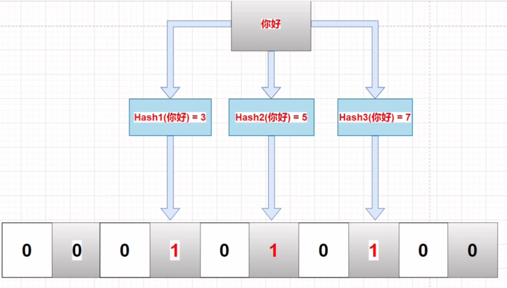
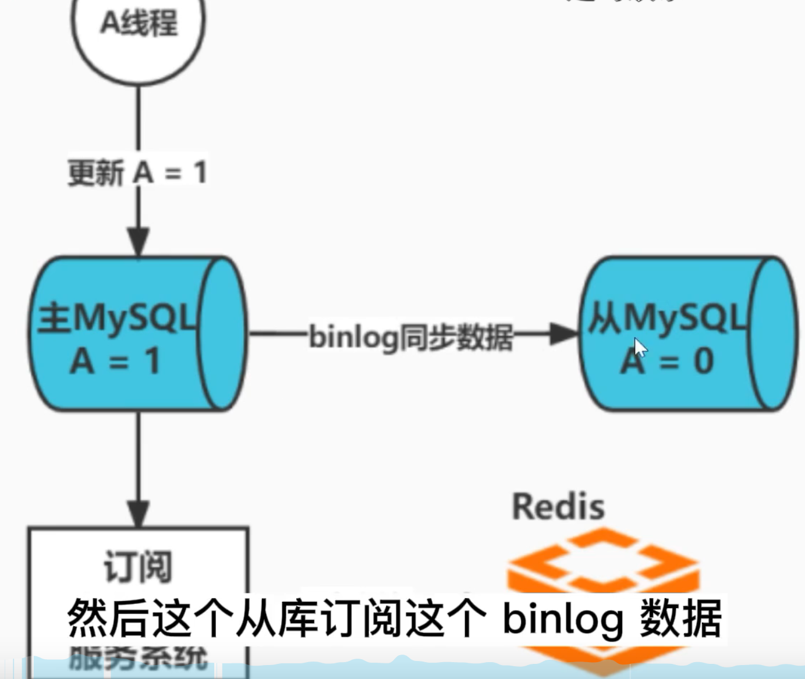
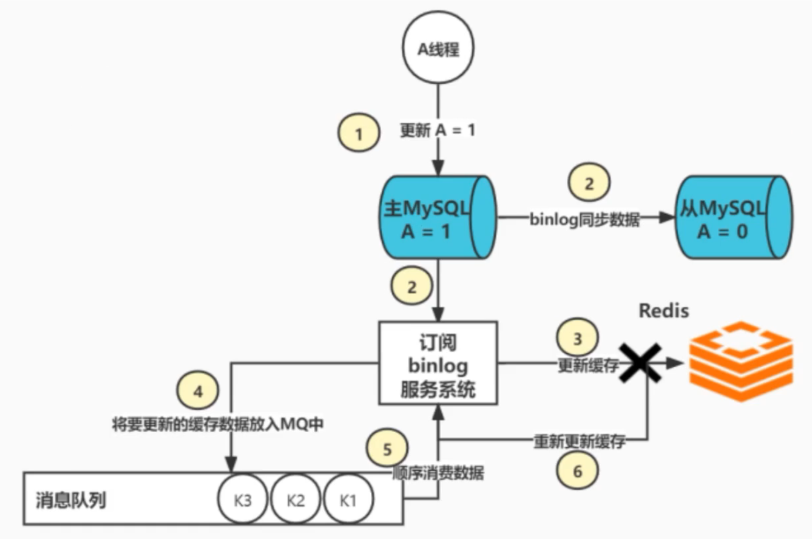
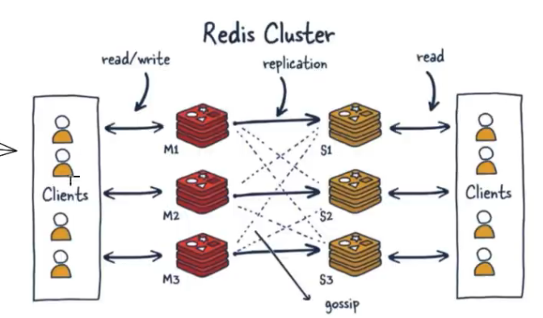
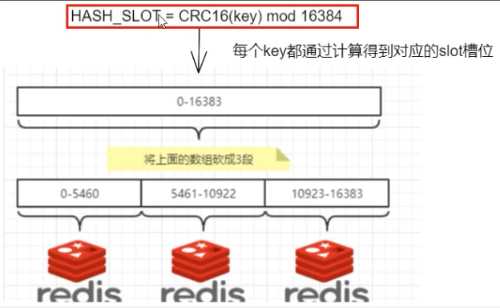
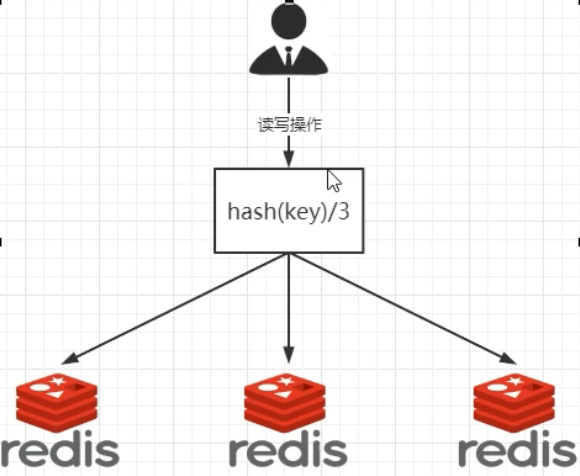
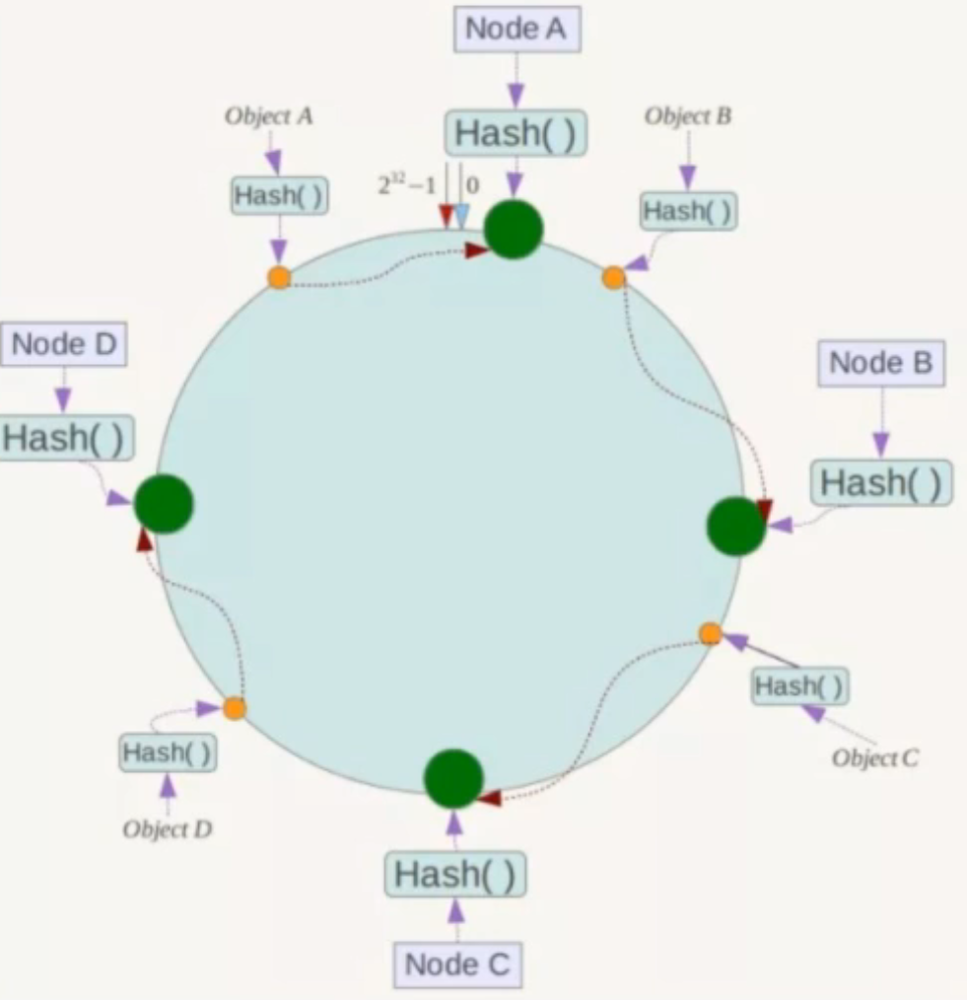
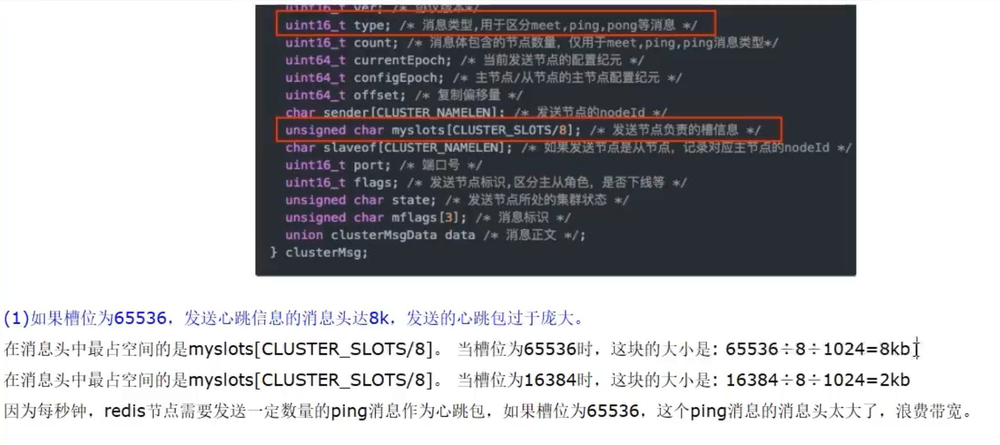

#### redis为什么快

#### redis 缓存雪崩, 穿透, 击穿

> 雪崩

**在同一时间, key大量失效**, 导致请求全部打到数据库上面, 导致数据库挂掉

- 在设置缓存的时候, 随机初始化试下时间, 不让所有缓存在同一时间失效
- 把不同的key放到不同redis节点上去, 让他平均分布在节点上, 减小单个节点压力

> 穿透

常见于黑客攻击, 故意访问不存在的数据(使用负数id来请求), **redis和数据库中都没有这样的数据**, 如果大量请求就会导致数据库挂掉

- 过滤掉非法参数

- 不管数据库查没查到数据, 都要更新到数据库中去, 防止被击穿(但是黑客可能换不同的参数)

- 拉黑ip(但是黑客可能换不同的ip)

- 使用布隆过滤器(bitmap数据结构实现), 需要所有用户id放在布隆过滤器中, 实际上不会很大, 100万的数据才3M差不多

  https://blog.csdn.net/lifetragedy/article/details/103945885

  一个二维数组, 每个key经过多个hash函数生成下标, 然后标为1

  查询时经过同样的hash函数计算下标, 如果下标都为1, 那么有可能存在, 如果有1个不为1, 那么一定不存在

  优点: 占用空间小, 插入和查询速度快, 时间复杂度O(k, k为hash函数个数)

  缺点: 误判, 无法做更新和删除操作

  为了减小误差率, 要设置多个hash函数, 因为不同的key经过越多个hash函数还能生成一样的下标的概率是更低的, 但是越多hash函数, 生成的组合也越多, 所以二维数组越大

  

> 击穿

**某个非常热点的key失效, 导致大量使用该key的请求失效, 直接访问数据库**

- 在访问数据库这一步使用分布式锁, 让其中一个数据查询完并更新到redis中, 其他线程sleep后重新到数据库中查找数据

#### 数据库和缓存一致性解决方案

首先明确, 数据库和缓存的一致性是要强一致性还是最终一致性, 如果是需要强一致性, 那么就要使用分布式锁做互斥, 并且写数据库和写缓存搞成一个事务.或者**直接不使用缓存**

如果是最终一致性, 那么无论如何都会有不一致的情况, 只能尽量减少不一致的概率

> 单点问题(缓存双删)

1. 先更新缓存, 后更新数据库

   完全不行, 数据库更新失败会导致数据不一致

   同时并发也有问题:

   - 线程B更新缓存(x=2)
   - 线程A更新缓存(x=1)
   - 线程A写数据库(x=1)
   - 线程B写数据库(x=2)

2. 先更新数据库, 后更新缓存

   不行, 会导致更新过的数据看不见

   同时并发问题:

   - 线程A更新数据库(x=1)
   - 线程B更新数据库(x=2)
   - 线程B写缓存(x=2)
   - 线程A写缓存(x=1)

3. 先删除缓存, 后更新数据库

   有并发问题

   - 线程 A 要更新 X = 2（原值 X = 1）
   - 线程 A 先删除缓存
   - 线程 B 读缓存，发现不存在，从数据库中读取到旧值（X = 1）
   - 线程 A 将新值写入数据库（X = 2）
   - 线程 B 将旧值写入缓存（X = 1）

4. 先更新数据库, 后删除缓存

   - 缓存中 X 刚过期, 不存在（数据库 X = 1）
   - 线程 A 读取数据库，得到旧值（X = 1）
   - 线程 B 更新数据库（X = 2)
   - 线程 B 删除缓存
   - 线程 A 将旧值写入缓存（X = 1）

   但是上面发生的条件比较苛刻, 需要满足

   1. 缓存刚失效  
   2. 读写请求并发  
   3. 更新数据库+删除缓存时间 < 读取数据库+写缓存时间(很难发生, 因为更新数据库要加锁, 一般比读取数据库时间长)

   **所以要采取先更新数据库, 后删除缓存的步骤**, 同时为了保证上面的场景不再产生, 可以**使用缓存双删的做法, 再异步删除一次, 延迟时间要大于读取数据库+写入缓存的时间, 一般1-5s**(但是在极端情况下依旧有可能发生不一致)

> 主从同步(消息队列)

   

在主从同步的情况下, 依旧有可能发生不一致的情况, 所以这里**就不要采用删除缓存的操作了, 直接搞一个canal订阅binlog, 主动更新数据库**

> 保证redis可用性

上面两种情况, 延迟双删和订阅binlog的方法都有可能发生操作redis失败的情况, 这样还是会造成不一致的情况, 所以为了保证一致性, redis要上集群, 使用下面的架构

**订阅系统直接将更新操作放到mq中, 然后再次通过单线程进行消费, 这样可以保证更新缓存的操作不会丢失, 同时单线程保证缓存的有效性**

#### redis 集群的分片算法

> 哈希槽

一个redis集群包括16834个插槽, 每个键都属于其中的一个插槽, 集群中的每个节点负责处理一部分插槽,

集群使用crc16(key) % 16834 来计算key属于哪个插槽, 其中 CRC16(key) 语句用于计算键 key 的 CRC16 校验和 。

优势: 方便扩容和缩容

如果我想新添加个节点D,我需要从节点 A,B,C中得部槽到D上,如果我想移除节点A,需要将A中的槽移到B和C节点上,然后将没有任何槽的A节点从集群中移除即可.由于从一个节点将哈希槽移动到另一个节点并不会停止服务,所以无论添加删除或者改变某个节点的哈希槽的数量都不会造成集群不可用的状态,

> 哈希取余算法

优点: 简单粗暴

缺点: 扩缩容麻烦, 每次节点变动, 映射关系都需要从新计算,

如果某台机器宕机, 会造成数据混乱

> 一致性哈希算法

1. 通过一致性哈希算法产生的hash值, 所有的hash值可以构成一个空间[0, 2^32-1], 将整个哈希空间构成一个环形

2. 将集群中的各个节点的ip或者主机名进行hash, 这样就确定了每台集群在hash环上的位置

3. 对于给定key的hash, 先确定其在hash环上的位置, 然后其顺时针碰到的第一个节点, 就是其存储的节点

优点: 

1. 如果一台服务器宕机了, 只会影响一部分数据(沿着他逆时针遇到的第一个服务器之间的数据), 其他的不影响

   如果c挂了, 只会影响bc之间的数据, 且这些数据会转移到D进程存储

2. 如果要增加一台节点X, 在ab之间, 那么只需要把a到x之间的数据移动到x上即可, 不用全部洗牌

缺点: 容易造成数据倾斜

> 为什么hash槽是16382

crc16算法的hash值有16bit, 可以产生2^16=65536个值, 也就是说可以分配65536个hash槽, 为什么只使用16384个?

