#### shell交互式与非交互式，登录式与非登录式

> 查看是否交互式

~~~shell
[c.biancheng.net]$ echo $-
himBH

[c.biancheng.net]$ cat test.sh
#!/bin/bash
echo $-
[c.biancheng.net]$ bash ./test.sh
hB
~~~

**如果输出字母中包含i，则为交互式**


或者查看`PS1`的值，如果非空，则为交互式，否则为非交互式，因为非交互式会清空该变量。

~~~shell
[mozhiyan@localhost]$ echo $PS1
[\u@\h \W]\$

[c.biancheng.net]$ cat test.sh
#!/bin/bash
echo $PS1
[c.biancheng.net]$ bash ./test.sh
~~~


> 判断是否为登录式

执行`shopt login_shell`即可，值为`on`表示为登录式，`off`为非登录式。

> 同时判断登录式和交互式

~~~shell
echo $-; shopt login_shell
echo $PS1; shopt login_shell
~~~


> 常见的情况

登录交互式：

- 使用账号密码登录linux
- `ssh user@ip`通过ssh登录linux
- `su - user`切换用户

登录非交互式：

- `bash --login test.sh`选项执行脚本

非登录非交互式：

- `bash test.sh`直接执行脚本, 脚本是以非登录非交互方式执行的
- `ssh localhost a.sh`执行脚本, 脚本是以非登录非交互方式执行的

非登录交互式：

- 桌面环境下打开终端
- 直接在终端执行`bash`进入子进程
- `ssh user@ip "echo $PS1; shopt login_shell"`命令是通过非登录交互式执行的
- `su user`切换用户

这里特别要区分的是ssh执行的方式，

~~~shell
$ cat b.sh
#!/bin/bash
 echo $- && shopt login_shell
 
 # 这里执行b.sh,在脚本里面是非登录非交互式的
$ ssh localhost bash b.sh
hB
login_shell     off

 # 这里直接执行命令,命令时在非登录交互式下执行的
$ ssh localhost echo $- && shopt login_shell
himBHs
login_shell     off
~~~


> 登录式与非登录式区别

不同的运行方式， bash在启动时加载的配置文件不同，这会导致在不同运行方式下，环境变量不同。

#### shell配置文件

无论是否是交互式，是否是登录式，Bash  在启动时总要配置其运行环境，例如初始化环境变量、设置命令提示符、指定系统命令路径等。这个过程是通过加载一系列配置文件完成的，这些配置文件其实就是 Shell 脚本文件。

> 登录式shell

如果是登录式的 Shell首先会读取和执行 /etc/profiles。

接着会以 ~/.bash_profile、~/.bash_login 或者 ~/.profile的顺序**查找并执行第一个存在且可读的文件**。不同的 linux 发行版附带的个人配置文件也不同，有的可能只有其中一个，有的可能三者都有。

注意，/etc/profiles 文件还会嵌套加载 /etc/profile.d/*.sh（不同版本可能不同，具体请查看对应文件），请看下面的代码：

```shell
for i in /etc/profile.d/*.sh ; do
    if [ -r "$i" ]; then
        if [ "${-#*i}" != "$-" ]; then
            . "$i"
        else
            . "$i" >/dev/null
        fi
    fi
done
```


同样，~/.bash_profile 也使用类似的方式加载 ~/.bashrc(不同版本可能不同，具体查看对应文件)：

```shell
if [ -f ~/.bashrc ]; then
. ~/.bashrc
fi
```

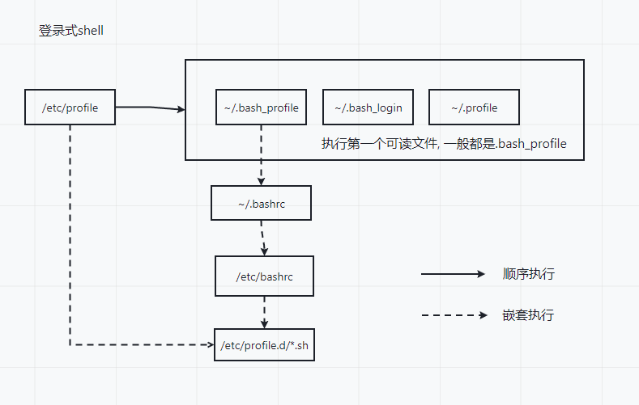

当登录式bash退出时，会执行~/.bash_logout

> 非登录式shell

如果交互非登录式shell（类似`echo $PS1; shopt login_shell`）启动时，

- Ubuntu下, 读取并执行/etc/bash.bashrc和~/.bashrc
- Centos下, 读取并执行~/.bashrc

~/.bashrc 文件还会嵌套加载 /etc/bashrc，请看下面的代码：

```shell
if [ -f /etc/bashrc ]; then
. /etc/bashrc
fi
```

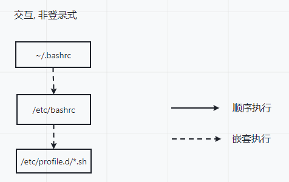

如果是非登录非交互式的话，会获取变量BASH_ENV的值，并将该值当做文件名进行执行。


> ssh网络调用bash

特别需要注意的是，bash会尝试判断他的标准输入是否来自一个网络(`ssh localhost echo $-`)，如果 bash 确定它正在以这种方式运行，它会从 ~/.bashrc读取并执行命令，前提文件存在并且可读。如果作为 sh 调用，它将不会执行此操作。 

特别坑的是，Ubuntu中的~/.bashrc文件的开头有这样一段代码, centos则没有：

~~~shell
# If not running interactively, don't do anything
case $- in
    *i*) ;;
      *) return;;
esac
~~~

也就是说，使用ssh执行脚本，在脚本里面是非登录非交互模式，所以即使当前bash加载了~/.bashrc文件，但是执行到了上述代码判断是非交互式就退出去了，导致和没有执行一样。所以如果希望在ssh网络调用某些脚本时，能够在脚本里面读取到某些环境变量，需要将export语句加在上述代码以前。（说的就是你，hadoop的start-dfs.sh, 老是读取不到java_home）


> sh调用bash

如果使用名称 sh 调用 bash时：

- 当作为登录式调用时，它首先尝试按顺序从 /etc/profile 和 ~/.profile 读取和执行命令。 
- 当作为名为 sh 的交互式 shell 调用时，bash 查找变量 ENV并将其用作要读取和执行的文件的名称。由于作为 sh 调用的 shell 不会尝试从任何其他启动文件读取和执行命令，因此 --rcfile 选项无效。
- 使用名称 sh 调用的非交互式 shell 不会尝试读取任何其他启动文件。

> 选项

`--init-file file`， `--rcfile file`: 如果是交互式shell，可以使用这两个选项指定配置文件，而不是默认的配置文件。

`--noprofile`: 如果是登录式，使用该选项可以禁用默认配置文件。

`--norc`：如果是交互式，使用该选项可以禁用默认配置文件。


#### 查看当前系统支持的shell解释器

~~~shell
cat /etc/shells 
/bin/sh # /bin/dash的软连接
/usr/bin/sh # /usr/bin/dash的软连接
/bin/bash 
/usr/bin/bash 
/bin/dash
/usr/bin/dash 
~~~

同时`/usr/bin/bash`其实就是`/bin/bash`的一个软连接


#### 查看默认的shell解释器

1. 方式1

   ~~~shell
   ll ll /bin/ | grep sh # /bin/sh其实就是/bin/dash的软连接, 所以默认的shell解释器就是dash
   lrwxrwxrwx  1 root root           4 10月 26  2022 sh -> dash
   
   ll /usr/bin | grep sh 
   lrwxrwxrwx  1 root root           4 10月 26  2022 sh -> dash
   ~~~

   通过上面, 我们发现`/bin/sh`是`/bin/dash`的软连接,  `/usr/bin/sh`是`/usr/bin/dash`的软连接

   **所以当前系统的默认shell解释器就是dash**

2. 方式2

   ~~~shell
   echo $SHELL
   /usr/bin/zsh
   ~~~

   `echo $SHELL`输出的是当前用户登录使用的shell环境,  **在默认情况下他与默认的shell解释器相同**,  但是用户也可以修改默认登录的shell解释器


#### 执行shell脚本的几种方式

1. 通过`bash`或者`sh` 和脚本的相对路径和绝对路径来调用脚本

   ~~~shell
   bash hello.sh
   sh /root/helo.sh
   ~~~

   因为bash和sh是在一个子shell中调用的脚本, 所有脚本不需要有`x(执行)`的权限

2. 直接通过`相对路径`和`绝对路径`来调用脚本

   ~~~shell
   /root/hello.sh
   ./hello.sh # 这里必须写./  如果直接写hello.sh, 那么会被当做一个命令, 从path中查找
   ~~~

   因为是在当前窗shell调用的脚本, 所以需要脚本有`x`的权限

   这种方式会根据脚本第一行中指定的shell解释器来执行

   

3. 通过`source`或者`.`来调用脚本

   ~~~shell
   source /root/hello.sh
   . hello.sh
   ~~~

   强制执行脚本, 忽略忽略脚本文件的权限

区别:  

1. 通过`source`或者`.`都是在当前shell调用的脚本, 所以脚本中修改了环境变量, 定义的局部变量在脚本退出后, 都还会再当前的shell中生效
2. 使用方式1, 2的本质都是在当前shell又启动了一个子shell, 然后在子shell中执行脚本, 所以脚本中修改了环境变量, 定义的局部变量在脚本退出后不会继续生效


## 变量

### 定义和使用变量

> 定义变量

~~~shell
variable=value
variable='value'
variable="value"
~~~

`=`左右不能有空格

在shell中，每一个变量的值都是字符串，无论是否使用引号。

如果需要指定类型可以使用`declare`关键字

> 使用变量

~~~shell
a=100
echo $a
echo "haha${a}"
~~~

`{}`是可选的，用于帮助解释器识别变量的边界

> 修改值

~~~shell
url="http://c.biancheng.net"
echo ${url}
url="/d/file/202003/tnqgclnw4zm1221"
echo ${url}
~~~

> 单引号和双引号的区别

单引号不允许插值, 直接输出，双引号会对变量取值

~~~shell
url="http://c.biancheng.net"
website1='C语言中文网：${url}'
website2="C语言中文网：${url}"
echo $website1
C语言中文网：${url}

echo $website2
C语言中文网：http://c.biancheng.net
~~~

> 只读变量

~~~shell
readonly a=100 # 不能被unset
b=200
readonly b 
~~~

> 删除变量

~~~shell
a=100
unset a
~~~

unset不能删除只读变量


### 多行字符串

在shell中是支持多行字符串的, 你可以如下定义

~~~shell
multi_line_string="这是第一行
这是第二行
这是第三行"

echo "$multi_line_string"
这是第一行
这是第二行
这是第三行
~~~

如果你的字符串太长了,  你想要在下一行写他们, 但是又不想他们有换行符, 那么可以使用`\`来连接行

**这个在将shell命令保持到字符串中的时候, 特别有用**

**千万要记住, `\`后面不能有任何的字符了, 包括空格, 否则会有问题**

~~~shell
command="find /path/to/search -type f \
-name \"*.txt\" \
-mtime -7 \
-exec grep -H \"pattern\" {} \; \
-exec cp {} /path/to/destination/ \;"

# 执行命令
eval $command
~~~


使用`\`来连接行的时候, 还需要注意缩进的问题, 你的下一行到行首的所有空白, 都会原样保持到字符串中, 如果你不想有空白字符串的话, 那么需要顶格开始写

~~~shell
for i in $(seq 1 1); do
    command="find /path/to/search -type f \
    -name \"*.txt\" \
-mtime -7 \
    -exec grep -H \"pattern\" {} \; \
-exec cp {} /path/to/destination/ \;"
    echo "$command"
done

# find /path/to/search -type f     -name "*.txt" -mtime -7     -exec grep -H "pattern" {} \; -exec cp {} /path/to/destination/ \;
~~~


### 变量作用域

shell变量的作用域分为三种

- 只能在函数内部使用，这叫做局部变量（local variable）；
- 仅当前 Shell 进程中使用，这叫做全局变量（global variable）；
- 在当前进程和子进程中使用，这叫做环境变量（environment variable）。

需要注意的是，默认情况下在shell 函数里面定义的也是全局变量

~~~shell
function add() {
 	a=99
}
echo $a
~~~

**想要定义局部变量需要加上local关键字, 否则默认为全局变量**

~~~shell
local a=99
~~~

> shell环境变量

全局变量只在当前 Shell 进程中有效，对其它 Shell 进程和子进程都无效。如果使用`export`命令将全局变量导出，那么他就成为了环境变量, 那么它就在所有的子进程中也有效了

**子进程通过`aa=xxx`修改了环境变量, 本质上是创建了一个全局变量, 覆盖了环境变量**

**通过 export 导出的环境变量只对当前 Shell 进程以及所有的子进程有效，如果最顶层的父进程被关闭了，那么环境变量也就随之消失了，其它的进程也就无法使用了，所以说环境变量也是临时的。**

只有将变量写入 Shell 配置文件中才能达到这个目的！Shell 进程每次启动时都会执行配置文件中的代码做一些初始化工作，如果将变量放在配置文件中，那么每次启动进程都会定义这个变量。


### 命令替换

作用是将命令的**输出**结果复制给某个变量

~~~shell
variable=`commands`
variable=$(commands)
~~~

比如

~~~shell
# date是输出当前时间，将输出的时间赋值给time
time=$(date)
~~~


注意，如果被替换的命令的输出内容包括多行（也即有换行符），或者含有多个连续的空白符，那么在输出变量时应该将变量用双引号包围，否则系统会使用默认的空白符来填充，这会导致换行无效，以及连续的空白符被压缩成一个。请看下面的代码：

```shell
#!/bin/bash

LSL=`ls -l`
echo $LSL  #不使用双引号包围
echo "--------------------------"  #输出分隔符
echo "$LSL"  #使用引号包围
```

运行结果：

```
total 8 drwxr-xr-x. 2 root root 21 7月 1 2016 abc -rw-rw-r--. 1 mozhiyan mozhiyan 147 10月 31 10:29 demo.sh -rw-rw-r--. 1 mozhiyan mozhiyan 35 10月 31 10:20 demo.sh~
--------------------------
total 8
drwxr-xr-x. 2 root     root      21 7月   1 2016 abc
-rw-rw-r--. 1 mozhiyan mozhiyan 147 10月 31 10:29 demo.sh
-rw-rw-r--. 1 mozhiyan mozhiyan  35 10月 31 10:20 demo.sh~
```

所以，**为了防止出现格式混乱的情况，我建议在输出变量时加上双引号。**

注意: **通过命令替换获取到的结果是字符串, 而不是数组, 所以在遍历的时候, 使用字符串的变量方式**

> 反引号和$()区别

反引号很像单引号，不易辨别

反引号在多种shell中可用，而$()仅在bash shell中可用

$()支持嵌套，如`$(wc -l $(ls | sed -n '1p'))`


当然, 你也可以在命令替换的时候使用变量, 比如

~~~shell
msg=`ll`
one_line=$(echo "$msg" | tr '\n' ' ')
echo $one_line 
# total 8 drwxr-xr-x 1 sys49482 1049089 0 六月 26 09:52 example4all/ drwxr-xr-x 1 sys49482 1049089 0 七月 14 09:42 note/
~~~


### 位置参数

给shell脚本或者shell函数传递的参数，在内部可以使用$n的形式来接收，如$1表示第一个参数，$2 表示第二个参数，依次类推。如果参数个数太多，达到或者超过了 10 个，那么就得用`${n}`的形式来接收了，例如 ${10}、${23}

并且对于函数，shell没有所谓的形参和实参，所以在定义shell函数时不能带参数，而是直接调用位置参数


### 特殊变量

$0 当前脚本文件名

$n (n>=1) 传递给函数或者脚本的参数

$# 传递给脚本的参数的个数

$* 传递给脚本的所有参数

$@ 传递给脚本的所有参数，当被双引号`" "`包含时，$@ 与 $* 稍有不同

$? 上一个命令的退出状态(exit 0)，或者函数的返回值(return 0)

$$ 当前脚本的PID


### $*和$@

$*和$@都表示当前脚本接收到的参数, 如果你直接echo他们, 你会发现他们没有什么不同, 但是实际上他们是不同的

- $*你可以将他看做是所有参数拼接起来的一个字符串, 他们是不可分割的
- $@你可以将他看做是所有参数组成的数组, 每个参数都是独立的

单独的echo他们, 看不出什么区别

~~~shell
cat <<EOF > echo.sh
#/bin/bash
echo \$*
echo \$@
EOF

./echo.sh a b c d
a b c d
a b c d
~~~

#### $*和$@在for循环中的区别

$*和$@在for循环中需要特别的注意

~~~shell
#!/bin/bash

echo "-----------------"
# 这里$*保持一个整体, 但是for可以按照空格拆分并遍历字符串, 所以会一个一个参数进行遍历
# 同时如果参数中有特殊的空格, 那么这个参数也会被拆分
for word in $*; do 
  echo $word
done
echo "---------------"
# 这里类似for循环遍历数组, 每个元素都是独立的
# 如果参数中有特殊的空格, 那么这个参数会被拆分
for word in $@; do 
  echo $word
done
echo "---------------"
# 这里$*被当做一个整体, 因为加了"", 所以被当做一整个字符串, 循环只会执行一次
for word in "$*"; do 
  echo $word
done
echo "---------------"
# 这里for循环遍历数组, 每个参数都是独立的
# 同时加了"", 所以每个参数都是完整的, 不能被拆分
for word in "$@"; do 
  echo $word
done
~~~

结果是

~~~shell
$ ./test.sh a b "c d"
-----------------
a
b
c
d
---------------
a
b
c
d
---------------
a b c d
---------------
a
b
c d
~~~

在for循环中, 对于字符串的变量, 我们使用这种方式

~~~shell
msg="hello world"
for word in $msg; do
  echo $word
done
~~~

而对于数组的遍历, 我们常常使用这种方式

~~~shell
msg=("hello", "zhangsan lisi")
for word in "$@"; do
  echo $word
done
~~~


#### $*和$@在函数传参的区别

~~~shell
#/bin/bash

function say() {
  echo $1
  echo $2
  echo $3
  echo $4
  echo $5
}

echo "---------------------"
say $* # 这里 $*没有双引号保护, 如果参数中有空格, 参数会被拆分
echo "---------------------"
say "$*" # 这里 $*被双引号保护, 又因为$*将所有的参数作为一个整体, 所以所有的参数被作为一整个整体
echo "---------------------"
say $@ # 这里每个参数都是一个个体, 同时没有""的保护, 如果单独的参数中有空格, 会被拆分为多个参数
echo "---------------------"
say "$@" # 这里每个参数都是一个个体, 同时有""的保护, 即使单独的参数中有空格, 也不能被拆分
echo "---------------------"
~~~

结果如下:

~~~shell
$ ./test1.sh "a b" c "d e"
---------------------
a
b
c
d
e
---------------------
a b c d e


---------------------
a
b
c
d
e
---------------------
a b
c
d e


---------------------

~~~


### 变量的插值

在shell中, 你可以通过变量的插值来生成一个新的字符串, **插值是立即执行的**, 即定义字符串的时候, 就已经插值了

~~~shell
msg="hello world"
echo "say: $msg"
~~~

如果有歧义的话, 那么可以使用`${}`的形式

~~~shell
msg="lisi"
echo "haha ${msg}你好"
~~~


你可以在变量插值的时候, 如果变量没有被设置, 或者为"", 那么直接取默认值

~~~shell
name="Alice"
echo ${name:-"Unknown"}

unset name
ehco ${name:-"Unknown"}

port=""
echo ${port:-8080}
~~~


如果你的变量中包含了空格或者其他的特殊字符, 那么最好将他用引号括起来

~~~shell
msg="hello world"
echo "say: $msg" # say: hello world
echo "say: "$msg"" # say: hello world
~~~

在这里, 双引号不需要转义, 因为他不是作为普通的双引号存在, 他的作用是保证msg中的内容是一个整体, 如果其中有空格, 那么也不会被分开对待

虽然在大部分的情况下, 使不使用引号是一样的

案例1

~~~shell
function say() {
  echo $1
  echo $2
}
msg="hello world"

say $msg
#hello
#world

say "$msg"
#hello world
#
~~~

案例2

~~~shell
msg=("apple" "banana cherry")
for ele in ${msg[@]}
do
  echo $ele
done
#apple
#banana
#cherry

for ele in "${msg[@]}"
do
  echo $ele
done
#apple
#banana cherry
~~~

案例3

~~~shell
a='-server'

set -x # 开启debug, 输出执行的命令

# 下面的两个案例, 如果a中没有特殊字符, 那么命令是一样的
java $a -version # java -server -version
java "$a" -version # java -server -version


a="-Xmx200m -Xms100m"

# 下面这两个案例, 因为a中有空格, "$a"为了保证所有字符串是一个整体, 所以会自动加上单引号, 导致命令报错
java $a -version # java -Xmx200m -Xms100m -version # 命令可以执行
java "$a" -version # java '-Xmx200m -Xms100m' -version # 命令报错, 无法执行
~~~


注意: 在双引号中, 单引号只是作为普通的纯文本, 既没有不允许变量插值, 也没有让变量作为一个整体的作用, 单引号只有在最外层的时候, 才有不允许变量插值的作用

~~~shell
msg="hello world"
echo "say: "$msg"" # say: hello world
echo "say: '$msg'" # say: 'hello world'
~~~


如果你在字符串中, 想要表示一个普通的双引号, 那么你需要进行转义

~~~shell
echo "say:\"$msg\"" # say:"hello world"
~~~


### 字符串遍历

对于空格或者换行分割的字符串, 那么可以直接遍历

~~~shell
msg="hello world zhangsan lisi"
for world in $msg; do
  echo $world
done
#hello
#world
#zhangsan
#lisi
~~~

如果你的字符串是通过命令替换来获得的, 那么也可以直接遍历结果

~~~shell
msg=$(ls)
for line in $msg; do
  echo $line
done
# 360SpeedTest.exe.lnk
# 360安全卫士.lnk
# 70+爬虫脚本项目源码/
# Access.lnk
# atguigu_data.lnk
# awesomeProject/
~~~

**<font color=red>注意: $msg千万不要加双引号,  这样会导致msg变成一个完整的字符串, 导致只会遍历一次, 虽然在echo的时候你看不出</font>**

~~~shell
msg=$(ls)
for line in $msg; do
  ((i++))
done
echo $i # 112
for line in "$msg"; do
  ((j++))
done
echo $j # 1
~~~


### 删除变量

在 Bash 中，unset 是一个内置命令，用于 删除变量、数组元素或函数，释放它们占用的内存空间。它的主要作用是 清理不再需要的变量或数据，避免脚本中出现意外的值残留。

1. 基本用法

  ~~~shell
  name="Alice"
  echo $name  # 输出: Alice
  
  unset name  # 删除变量 name
  echo $name  # 输出: (空)
  ~~~

2. 删除数组元素

   ~~~shell
   fruits=("apple" "banana" "orange")
   echo ${fruits[1]}  # 输出: banana
   
   unset fruits[1]     # 删除索引为 1 的元素（banana）
   echo ${fruits[@]}   # 输出: apple orange
   ~~~

   在删除数组中的元素, 后面的元素不会往前移动, 只是这个索引被删除了

   实际上base中的数组是稀疏的, 而不是连续的

   ~~~shell
   $ fruit=("apple" "banana" "orange")
   
   $ echo ${fruit[@]}
   apple banana orange
   
   $ unset fruit[1]
   
   $ echo ${fruit[@]}
   apple orange
   
   $ echo ${#fruit[@]}
   2
   
   $ echo ${!fruit[@]}
   0 2
   ~~~

   

3. 删除整个数组

   ~~~shell
   colors=("red" "green" "blue")
   unset colors         # 彻底删除数组 colors
   echo ${colors[@]}    # 输出: (空)
   ~~~

4. 删除关联数组的键值对

   ```shell
   declare -A user=(["name"]="Alice" ["age"]=25)
   echo ${user["age"]}  # 输出: 25
   
   unset user["age"]    # 删除键 "age"
   echo ${user["age"]}  # 输出: (空)
   ```

5. 删除函数

   ~~~shell
   greet() { echo "Hello!"; }
   greet  # 输出: Hello!
   
   unset -f greet       # 删除函数 greet
   greet  # 报错: greet: command not found
   ~~~


注意事项:

1. 删除不存在的变量不会报错

   ~~~shell
   unset non_existent_var  # 静默执行，无错误
   ~~~

2. 对只读变量无效

   ~~~shell
   readonly PI=3.14
   unset PI  # 报错: PI: readonly variable
   ~~~

3. 无法删除环境变量

   ~~~shell
   export PATH="/usr/bin"
   unset PATH  # 可以删除，但会影响当前 shell
   export -n PATH  # 更安全的做法：仅移除导出属性，保留变量值
   ~~~

   


## 数学计算

### 整数计算

在默认情况下, 如果你直接定义`a=1+1`, 你会发现shell将`1+1`当做了字符串

~~~shell
a=1+1
echo $a
~~~

如果你想要进行数值运算的话, 可以使用`$((表达式))`或者`$[表达式]`

这种方式的计算只支持整数, 除法也是返回整数

~~~shell
a=$[( 2 + 3 ) * 4]
echo $a # 20

b=$(( (2+3) * 4 ))
echo $b # 20
~~~

需要注意的是: 在$(())中, 或者$[]中, 不需要使用$来取值

~~~shell
x=1
echo $((x+2)) # 3
~~~

如果你是修改变量的值, 而不需要返回算数表达式的结果, 那么可以使用`(( 表达式 ))` 

~~~shell
x=1
a=
((a=x+2))
echo $a # 3

for i in 1 2 3 4; do
 ((i++))
done
echo i # 4
~~~


使用let命令也可以直接进行数学计算, 变量在其中不需要使用$来取值

~~~shell
let "x = 5 + 2"
echo $x
~~~


### 浮点数计算

shell本身不支持浮点数计算, 如果要在shell中进行浮点数计算, 需要使用外部工具

bc命令, 格式为`echo "scale=N; 表达式" | bc`

~~~shell
echo "scale=2; 10/3" | bc # 3.33
~~~


## if判断

### 条件判断的方式

在linux中, 想要判断有两种方式

1. 通过`test condition`来判断, 如果成功返回0, 否则返回1, 我们可以通过`$?`来获取命令的返回值

   ~~~shell
   a=hello
   test $a = hello # !!!!!这里一定要有空格, 不能写成$a=hello
   echo $? # 0
   
   a=hello1
   test $a != hello
   echo $? # 0
   ~~~

2. 通过`[ condition ]`来判断, 如果成功返回0, 否则返回1, 我们可以通过`$?`来获取命令的返回值

   **注意condition前后有空格**

   ~~~shell
   a=hello
   [ $a = hello ] # !!!!!这里一定要有空格, 不能写成$a=hello, 同时表达式前后有空格
   echo $? # 0
   
   a=hello1
   [ $a != hello ]
   echo $? # 0
   ~~~

### if判断的格式

if判断

~~~shell
if [ condition ]; then command1; else command2; fi

# 方式1 这里本质就是把if和then写在了一行, 通过;隔开
if [ condition ]; then 
    # do something
fi

# 方式2
if [ condition ]
then
    # do something
if
~~~

if-elif-else判断

~~~shell
if [ condition ]; then 
    # do something
elif [ condition ]; then
    # do something
elif [ condition ]; then
    # do something
else
    # do something
fi
~~~


还有一种比较其他的判断方法

~~~shell

~~~


### 常用的条件判断

常用的比较

1. 变量是否存在

   **在shell中, 没必要判断一个变量是否存在, 大部分情况下, 未定义的变量和空的字符串都是等效的**
   
2. 数值的比较

   -eq 等于 -ne 不等于 -lt 小于 -gt 大于 -le 小于等于 -ge 大于等于

   ~~~shell
   a=5
   b=5
   if [ "$a" -eq "$b" ]; then
     echo "a 等于 b"
   fi
   ~~~

3. 字符串的比较

   = 相等    != 不相等   -z 判断变量未定义或者字符串长度为0    -n 变量存在并且非空

   ~~~shell
   str1="hello"
   str2="hello"
   if [ "$str1" = "$str2" ]; then
     echo "两个字符串相等"
   fi
   
   var=100
   if [ -n "$var" ]; then
     echo "变量var存在, 并且变量非空"
   fi
   
   if [ -z "$a" ]; then
           echo "变量a为空, 或者变量a不存在"
   fi
   ~~~

4. 文件权限判断

   -r 有读的权限 -w 有写的权限 -x 有执行的权限

   ~~~shell
   file="./testfile"
   
   # -r 有读的权限
   if [ -r "$file" ]; then
     echo "$file 有读权限"
   fi
   ~~~

5. 文件类型判断

   -e 文件存在

   -f 文件存在并且是一个常规文件

   -d 文件存在并且是一个目录

   ~~~shell
   file="./testfile"
   if [ -e "$file" ]; then
     echo "$file 存在"
   fi
   ~~~


6. 取反操作

   取反就是在条件判断之前添加一个`!`

   ~~~shell
   if [[ ! -d "/tmp/testdir" ]]; then
     echo "目录不存在"
   fi
   ~~~

   


### 多条件判断

shell的多条件判断有三种写法

写法1: 使用 `|| && !`来表示与或非

~~~shell
if [ "$a" -lt 3 ] || [ "$b" -lt 3 ]; then
    echo "a 小于 3 或 b 小于 3"
fi

if [ "$a" -lt 10 ] && [ "$b" -gt 5 ]; then
    echo "a 小于 10 且 b 大于 5"
fi
~~~

写法2: 使用`-a -o !` 来表示与或非

~~~shell
a=3
b=7

if [ "$a" -lt 5 -o "$b" -gt 10 ]; then # -o 表示 or
  echo "a 小于 5 或 b 大于 10"
fi

if [ "$a" -lt 5 -a "$b" -lt 10 ]; then # -a 表示 and
  echo "a 小于 5 且 b 小于 10"
fi

num1=5
if [ ! $num1 -gt 10 ]; then
    echo "num1 小于或等于 10"
fi
~~~

写法3: 使用

~~~shell
if [[ "$a" -lt 10 && "$b" -gt 5 ]]; then
    echo "条件都成立"
fi

if [[ "$a" -lt 3 || "$b" -lt 3 ]]; then
    echo "至少一个条件成立"
fi

if [[ ! $a -lt 5 ]]; then
    echo "a 不小于 5，即 a 大于或等于 5"
fi

# 使用括号来合并两个关系
if [[ ( $a -lt 5 || $b -gt 10 ) && ( $c -eq 100 || $d -ne 50 ) ]]; then
    echo "条件成立"
fi
~~~


### 条件判断特别注意的地方

在条件判断的时候, 最好是带上双引号

~~~shell
a=
if [ -n $a ]; then 
    echo 'a非空'
fi
~~~
上面的代码在执行的时候会报格式错误, 因为$a为空, 所以判断变成了` [ -n ]`, 然后报错


~~~shell
a=
if [ -n "$a" ]; then 
    echo 'a非空'
fi
~~~

上面代码不会报错, 即使$a为空, 那么判断也是`[ -n "" ]`, 所以他会返回false, 而不是报错


### 三目运算符

在shell中, 并没有三目运算符, 但是你也可以使用与或非来实现三目运算符

注意: 最好不要这样写, 容易出问题, 使用if else来写

~~~shell
a=5
[ $a -gt 10 ] && result="大于 10" || result="小于等于 10"
echo $result


a=10
[[ $a -gt 10 ]] && result="大于 10" || result="小于等于 10"
echo $result
~~~


## case分支

语法

~~~shell
case $变量名 in
  值1)
      # do something
      ;; # ;;表示break
  值2)
      # do something
      ;;
  *)
      # default
      ;;
esac
~~~


案例

~~~shell
#!/usr/bin/env bash

read -p "请输入操作命令 (start/stop/restart/status): " cmd

case "$cmd" in
  start)
    echo "正在启动服务..."
    ;;
  stop)
    echo "正在停止服务..."
    ;;
  restart)
    echo "正在重启服务..."
    ;;
  status)
    echo "服务正在运行。"
    ;;
  *)
    echo "未知命令：$cmd"
    echo "用法: start | stop | restart | status"
    ;;
esac
~~~


## for循环

### 普通的for循环

语法

~~~shell
for (( 初始条件; 循环控制条件;变量变化)); do
    # do something
done

# 或者
for (( 初始条件; 循环控制条件;变量变化))
do
    # do something
done
~~~

案例

~~~shell
#!/usr/bin/env bash
sum=0
for (( i=1; i<=100; i++ )); do
  sum=$[$sum+$i] # $[]用于计算$sum+$i
done
echo $sum
~~~


### for range语法

~~~shell
sum=0
for {1..100}; do
  sum=$[$sum+$i] # $[]用于计算$sum+$i
done
echo $sum

for i in $(seq 1 3); do # 使用seq来生成一个数列
  echo $i
done
~~~

### for in语法

~~~shell
for name in Alice Bob Charlie; do
  echo "Hello, $name!"
done
~~~

遍历文件

~~~shell
for file in *.txt; do
  echo "找到了文件：$file"
done
~~~

遍历命令行参数

~~~shell
for arg in "$@"; do
  echo "你传入的参数：$arg"
done
~~~


你可以直接对字符串进行for in循环, 他会将字符串按照空格和换行进行拆分

~~~shell
msg="hello world"
for world in $msg
do
  echo $world
done
# 输出
hello
world
~~~

你也可以直接对其他命令的执行结果进行遍历, 即使他们是多行的

~~~shell
$ ll
total 1
-rw-r--r-- 1 sys49482 1049089   0 七月 24 20:27 1.txt
-rw-r--r-- 1 sys49482 1049089   0 七月 24 20:27 2.txt

$ msg=`ll`

# !!!! 这里的msg是变量替换获取到的值, 所以他是字符串而不是数组, 所以要使用字符串的遍历方式, 而且 $msg 千万不要加双引号, 这样会导致 msg变成一个完整的字符串, 只会遍历一次
$ for word in $msg; do echo $word; done;
total
1
-rw-r--r--
1
sys49482
1049089
0
七月
24
20:27
1.txt
-rw-r--r--
1
sys49482
1049089
0
七月
24
20:27
2.txt
~~~


for循环也可以遍历数组

~~~shell
arr=("apple" "banana" "cherry dick")

# ${arr[@]} 表示数组中所有的元素
# 双引号防止有空格的字符串被拆分
# 这就等效于 for element in "apple" "banana" "cherry dick"; do
for element in "${arr[@]}"; do
  echo "$element"
done

# 使用索引遍历数组
arr=("apple" "banana" "cherry")
# ${#arr[@]}表示数组的长度, ${arr[i]} 表示按照下表取值
for ((i=0; i<${#arr[@]}; i++)); do
  echo "${arr[$i]}"
done

# 遍历的时候, 获取下标
arr=("apple" "banana" "cherry")
for index in "${!arr[@]}"; do
  echo "The element at index $index is ${arr[$index]}"
done
~~~


## while循环

语法

~~~shell
while [ condition ]; do
    # do something
done

# 或者
while [ condition ]
do 
    # do something
done
~~~

累加案例

~~~shell
#!/usr/bin/env bash

i=1
sum=0

while [ "$i" -le 100 ]; do
  sum=$((sum + i))
  i=$((i + 1))
done

echo "1 到 100 的总和是：$sum"
~~~


## until循环

语法

~~~shell
until [ 条件 ]; do
  # 循环体（条件为 false 时执行）
  ...
done
~~~

案例

~~~shell
# 等待文件被其他人创建成功
until [ -f /tmp/ready ]; do
  echo "Waiting for /tmp/ready..."
  sleep 1
done

echo "File is ready!"
~~~


## 从控制台读取输入

~~~shell
# -p指定提示信息
# -t表示等待用户10s, 如果10s到了没有输入, 那么直接返回空字符串, 如果不加-t的话会一直等待
# 输入读取到name中
read -p "请输入你的名字: " -t 10 name 
echo "你好，$name！"
~~~


## 数组

### 普通数组

1. 定义数组

   ~~~shell
   # 方式 1：空格分隔的元素列表
   arr=("apple" "banana" "cherry")
   arr=(apple banana cherry)
   arr=() # 空数组
   
   # 方式 2：也可以直接按照下标来定义, 没问题的
   arr[0]="apple"
   arr[1]="banana"
   arr[2]="cherry"
   ~~~

2. 访问数组的元素

   ~~~shell
   echo ${arr[0]}  # 输出 apple
   ~~~

3. 修改数组的元素

   ~~~shell
   arr[0]=hello
   ~~~

4. 追加元素

   ~~~shell
   # 方式1, 直接通过索引追加
   arr[3]="waterlemon"
   
   # 方式2, 使用+=来追加
   arr+=("strawberry") # 追加单个元素
   arr+=("longan" "haha") # 追加多个元素
   
   # 方式3, 两个数组的追加, 如果arr2中有删除元素, 那么会被自动忽略
   arr=(1 2 3)
   arr2=(4 5 6)
   unset arr2[1]
   arr+=("${arr2[@]}")
   echo ${arr[@]} # 1 2 3 4 6
   echo ${!arr[@]} # 0 1 2 3 4
   echo ${#arr[@]} # 5
   
   # 方式4, 合并两个数组, 并创建新的数组, 如果arr2中有删除元素, 那么新的数组是连续的
   arr=(1 2 3)
   arr2=(4 5 6)
   new_array=("${arr[@]}" "${arr2[@]}")
   echo ${new_array[@]}
   ~~~

5. 获取所有的元素

   ~~~shell
   echo ${arr[@]}  # 输出 apple banana cherry
   ~~~

6. 获取数组的长度

   ~~~shell
   echo ${#arr[@]}  # 输出 3
   ~~~

7. 获取数组所有的索引

   ~~~shell
   echo ${!arr[@]} # 输出 0 1 2
   ~~~

8. for循环遍历数组

   ~~~shell
   for element in "${arr[@]}"; do
     echo $element
   done
   
   # 通过下标遍历
   for i in "${!arr[@]}"; do
     echo "Index $i has value: ${arr[$i]}"
   done
   ~~~

   > 遍历数组的时候, 记得带上引号, 保证每个元素作为一个整体

   ~~~shell
   msg=("apple" "banana cherry")
   for ele in ${msg[@]}
   do
     echo $ele
   done
   #apple
   #banana
   #cherry
   
   for ele in "${msg[@]}"
   do
     echo $ele
   done
   #apple
   #banana cherry
   ~~~

9. 数组的切片

   ~~~shell
   arr=(apple banana cherry date elderberry)
   echo ${arr[@]:1:3}  # 从索引1开始，取3个元素，输出 banana cherry date
   ~~~

   

### 关联数组(map)

从Bash4.0开始, 支持关联数组, 即使用字符串作为索引

1. 创建关联数组

   ~~~shell
   # 先创建一个关联数组变量
   declare -A fruits
   fruits["a"]="apple" # 添加元素
   fruits["b"]="banana"
   fruits["c"]=25
   
   # 方式2, 一次性赋值
   declare -A my_array=(
     ["name"]="Alice"
     ["age"]=25
     ["city"]="new york"
   )
   ~~~

2. 获取元素

   ~~~shell
   key=a
   echo ${fruits["a"]}  # 输出 apple
   echo ${fruits["$key"]}  # 输出 apple
   ~~~

3. 获取所有的key

   ~~~shell
   echo ${!my_array[@]} # name age city
   ~~~

4. 获取所有的value

   ~~~shell
   echo ${my_array[@]} # Alice 25 new york
   ~~~

5. 遍历map

   ~~~shell
   # 按照key来遍历
   for key in "${!my_array[@]}"
   do 
     echo "key: $key, value: "${my_array["$key"]}"
   done
   
   # 仅遍历value
   for value in "${my_array[@]}"
   do
     echo "value: $value"
   done
   ~~~

6. 添加元素

   ~~~shell
   # 直接通过key来追加
   my_array["color"]=red # 有就修改, 没有就追加
   
   # 通过+=来添加元素
   my_array+=(["debug"]="true" ["timeout"]="30")
   
   # 关联数组无法像普通数组一样, 通过+=来合并两个数组, 需要手动遍历
   declare -A array1 array2 merged
   array1=(["a"]=1 ["b"]=2)
   array1=(["c"]=3 ["d"]=4)
   for key in "${!array1[@]}" "${!array2[@]}"
   do
     merged+=(["$key"]="${array1["$key"]:-${arrray2["$key"]}}")
   done
   ~~~

7. 修改和添加元素

   ~~~shell
   my_array["age"]=999 # 有就修改, 没有就追加
   ~~~

8. 删除元素

   ~~~shell
   unset my_array["color"] # 删除color和对应的value
   ~~~

9. 清空整个map

   ~~~shell
   unset my_array # 完全删除数组
   ~~~

10. 检查key是否存在

    ~~~shell
    if [[ -v my_array["name"] ]]
    then
      echo "key exists"
    else 
      echo "key not exists"
    fi
    ~~~

关联数组并不支持内部的value还是数组或者关联数组, 如果你希望value还是一个数组, 那么使用带空格的字符串来表示

~~~shell
declare -A map=(
["table1"]="hah1 world1 aa bb"
["table2"]="aa bb cc dd"
)
~~~


案例: word count

~~~shell
declare -A word_count
text="apple banana apple orange banana apple"

for word in $text; do
    ((word_count["$word"]++)) # (())表示数学计算, 在其中不需要使用$取值, ++如果没有这个元素的话, 那么默认是0, 等效于
    ((word_count["$word"] = ${word_count["$word"]:-0} +1 ))
done

for word in "${!word_count[@]}"; do
    echo "$word: ${word_count[$word]}"
done

# 输出
apple: 3
banana: 2
orange: 1
~~~

案例2: 拼接选项

~~~shell
declare -A exclude_map=(
    ["trap_alarm"]="tbl_trap_data_alarm tbl_alarm_historytable_map"
    ["trap_history"]="'tbl_trap_data_history_*' 'tbl_trap_data_history_vb_*'"
    ["trap_data"]="'tbl_trap_data_2*' '*_serial_no_seq'"
)

exclude_patterns=()
# 这是一个 if 判断语句
[[ "$trap_switch" != "true" ]] && exclude_patterns+=(${exclude_map[trap_data]})
[[ "$alarm_switch" != "true" ]] && exclude_patterns+=(${exclude_map[trap_alarm]} ${exclude_map[trap_history]})


table_exclude_options=()
for pattern in "${exclude_patterns[@]}"; do
  table_exclude_options+=(--exclude-table="$pattern")
done
echo ${table_exclude_options[@]} # 获取要拼接的结果
~~~


## 函数


### 常用的系统函数

1. basename

   basename的作用从一个路径中拆分出文件名, 本质上就是一个字符串拆分

   ~~~shell
   # $0获取文件, 会带上路径, 比如./test.sh /root/test.sh
   # basename 从路径中拆分出文件名
   echo `basename $0`  # test.sh
   
   # basename还可以去除掉文件名的后缀
   echo `basename $0 .sh`  # 去除掉.sh后缀, 返回test
   ~~~

2. dirname

   dirname的作用是从一个路径中拆分出路径, 本质上是一个字符串拆分

   ~~~shell
   a=/root/a
   echo `dirname $a` # /root
   
   b=.././.././a
   echo `dirname $b` # .././../.
   ~~~

   dirname也可以用于获取当前脚本所在的文件夹

   ~~~shell
   # 默认情况下可以执行
   # 但是考虑到软连接, $0 是链接路径，不是原脚本路径。
   # 同时如果脚本被 source 执行，$0 不一定是脚本路径，而是当前 shell。
   echo $(cd `dirname $0`; pwd) 
   
   # 推荐
   # ${BASH_SOURCE[0]} 可能包含空格或特殊字符, 使用双引号括起来
   # ${BASH_SOURCE[0]} 是文件的真实路径
   DIR="$(cd "$(dirname "${BASH_SOURCE[0]}")" && pwd)"
   echo "脚本所在目录是：$DIR"
   ~~~


### 自定义函数

语法

~~~shell
# function可以省略, 函数后面的()可以省略, return可以省略
function xxx(){
    # do something
    return int;
}

xxx param1 parma2 # 函数调用
~~~

1. **必须先声明函数, 才可以调用, 因为shell是解释执行的**
2. 函数不需要声明参数, 直接通过 `$1, $2, $3`的形式来获取位置参数
3. **return后面只能跟`0-255`的数值, 表示函数执行的状态码, 而不是函数的结果, 0表示正常**
4. **如果省略return, 那么会将最后一条命令的状态码return回去**
5. 可以通过`$?`获取函数的return的状态码
6. 如果你想要返回一个结果, 那么可以使用echo, 那么在外层使用命令替换

~~~shell
function add(){
    s=$[ $1 + $2 ]
    echo $s
}
read -p "请输入第一个参数: " a
read -p "请输入第二个参数: " b

sum=`add $a $b`
echo 结果是$sum
~~~

- 函数可以定义在任何地方, 比如下面这个函数, 定义在一个for循环中

  ~~~shell
  for (( i=0;i<3;i++ )); do
    function say(){
      echo $i
    }
    say
  done
  
  # 0
  # 1
  # 2
  ~~~

- 同时函数可以直接使用/修改外部的变量, 因为shell中的变量是全局变量

  ~~~shell
  msg="hello world"
  function say() {
    echo $msg # 直接使用外部的变量
    msg="hahah" # 直接修改外部的变量
  }
  say # hello world
  echo $msg # hahah
  ~~~

- 你在函数中直接定义的变量, 也是全局的变量, 在函数结束后, 还是可以使用的

  如果要定义局部的变量, 必须使用local

  ~~~shell
  j=1000
  function say() {
    a=10
    echo $a # 10
    
    local j=20 # 这里会覆盖全局变量中的j
    echo $j # 20
  }
  say
  echo $a # 10
  echo $j # 1000
  ~~~

- **虽然在函数中可以访问函数外的变量, 但是还是推荐通过函数来传参的方式, 并在在函数内部的变量都定义成local变量, 这样不会影响全局**


### 小案例

写一个脚本, 可以对指定的目录进行归档, 归档文件名带上日期

~~~shell
#!/bin/bash

if [ 1 -ne $# ]; then
    echo "必须指定一个参数"
    exit 1
fi

if [ ! -d $1 ]; then
    echo "输入的参数不是一个目录, 或者目录不存在"
    exit 1
fi

DIR_NAME=$( basename $1 ) # 获取要归档的目录
DIR_PATH=$( cd $(dirname $1) && pwd) # 获取归档的目录所在的目录
DATE=$(date +%Y%m%d) # 当前的日期
FILE=archive_${DIR_NAME}_${DATE}.tar.gz # 归档文件的文件名
DEST=/root/archive/$FILE # 归档文件的完整路径

tar -czf $DEST $DIR_PATH/$DIR_NAME # 归档文件
if [ ! $? -ne 0 ]; then
    echo "tar命令执行失败"
    exit 1
else
    echo "归档成功"
    echo "归档文件为: $DEST"
fi
~~~


## 正则表达式

1. `^`匹配开头

2. `$`匹配结尾

3. `.`匹配任意字符

4. `*`匹配任意次数, 0次或者1次或者多次

   ~~~shell
   cat /etc/passwd | grep '^root.*zsh$' # grep也可以使用正则表达式, 必须使用单引号括起来
   root:x:0:0:root:/root:/usr/bin/zsh
   ~~~

5. `[]`表示匹配一个范围

   | 表达式     | 作用                         |
   | ---------- | ---------------------------- |
   | [6, 8]     | 匹配6或者8                   |
   | [0-9]      | 匹配0-9中的任意数字          |
   | [0-9]*     | 匹配任意长度的数字字符串     |
   | [a-z]      | 匹配a到z之间的一个字符       |
   | [a-z]*     | 匹配任意长度的字符字符串     |
   | [a-c, e-f] | 匹配a-c或者e-f之间的任意字符 |

6. `\`表示转移, 比如要匹配$的时候, 就要进行转移

   ~~~shell
   echo '$aaa' | grep '\$'
   ~~~

   


## 文本处理

### cut

cut主要用于处理字符串的拆分

`cut [选项参数] filename`

- `-f` 指定每一行都拆分后, 需要保存第几列的数据
- `-d` 指定分隔符, 默认为制表符, 分隔符只能是一个字符
- `-c` 按照字符进行切割

~~~shell
# 文件为test.txt
hello, world
hello, java

# 按照,拆分文本, 并保留每一行的第二列数据
cut -d "," -f 2 test.txt
 world
 java
~~~

~~~shell
# 匹配/etc/passwd中以zsh结尾的行
# 然后根据:拆分, 保留1,6,7行
# !!!!!如果保留多列, cut会将多列按照分隔符拼接, 然后返回
cat /etc/passwd | grep 'zsh$' | cut -d ":" -f 1,6,7
root:/root:/usr/bin/zsh
tiger:/home/tiger:/usr/bin/zsh

# -2表示前2列, 5-6表示第5列到第6列, 7-表示第7列和以后的所有列
cat /etc/passwd | grep 'zsh$' | cut -d ":" -f -2,3,4,5-6,7
root:x:0:0:root:/root:/usr/bin/zsh
~~~


### awk

awk将文本逐行的读入, 并按照分隔符进行拆分, 拆分后再进行处理

`awk [选项参数] 'BEGIN{action0} /pattern1/{action1} /pattern1/{action2} ... END{actionN} ' filename`

- `-F` 指定分隔符, 默认是空格
- `-v` 赋值一个用户自定义变量, 可以在action中使用

awk的运行原理是:

1. 先执行BEGIN中的action, BEGIN可以省略

2. 将一整行去匹配pattern1, pattern2, pattern3

   pattern可以省略, 表示匹配所有的行

3. 如果匹配成功, 那么拆分字符串, 并将拆分后的内容作为参数, 传递到action1, action2, action3中

4. 最后执行END中的action, END可以省略

~~~shell
# 拆分每一行
# 匹配z结尾的行, 并将拆分的单词作为参数传入到 print $1 中
echo -e "xyz:ha:nz\nzz:al:xz" |  awk -F ":" '/z$/{print $1}'

# 搜索/etc/passed中以root开头的行, 并输出第1列和第7列, 并使用逗号隔开
awk -F ":" '/^root/{print $1","$7}' /etc/passwd

# pattern也可以没有, 表示匹配所有的行
awk -F ":" '{print $1","$7}' /etc/passwd # 输出第一列和第七列, 使用逗号隔开

# 先输出begin, 然后输出每一行的第一列和第7列, 然后输出end
awk -F ":" 'BEGIN{print "begin"} {print $1","$7} END{print "end"}'
~~~


`-v`参数的作用

~~~shell
# 获取每一本书的数量, 并加10
echo -e 'java,1\npython,4' | awk -v i=10 -F "," '{print $2+i}'
11
14
~~~


同时awk中也内置了一些变量

- `FILENAME`:  文件名
- `NR`: 当前的行号
- `NF`: 当前行, 拆分后的个数

~~~shell
# 假设有 test.txt
java, 10
python, 20, 2016
goland, 33, 2017

awk -F "," 'print FILENAME NR NF' test.txt
~~~


### 参数扩展

参数扩展主要用于对变量进行修改, 支持删除, 替换, 提取

1. 去掉前后缀

   1. 去掉最短前缀, 格式: `${var#pattern}`

      ~~~shell
      filename="dir1/dir2/example.sql"
      echo "${filename#*/}"  # 输出：dir2/example.sql
      ~~~

   2. 去掉最长前缀, 格式: `${var##pattern}`

      ~~~shell
      filename="dir1/dir2/example.sql"
      echo "${filename##*/}"  # 输出：dir2/example.sql
      ~~~

   3. 去掉最短后缀, 格式: `${variable%pattern}`

      ~~~shell
      filename="example.sql.sql"
      # 去掉 .sql 后缀
      echo "${filename%.sql}"  # 输出：example.sql
      ~~~

   4. 去掉最长后缀, 格式: `${variable%%pattern}`

      ~~~shell
      filename="example.sql.sql"
      echo "${filename%%.*}"  # 输出：example
      ~~~

2. 替换字符串

   1. 替换第一个匹配的字符串, 格式: `${variable/pattern/replacement}`

      ~~~shell
      text="apple banana apple"
      # 替换第一个 'apple' 为 'orange'
      echo "${text/apple/orange}"  # 输出：orange banana apple
      ~~~

   2. 替换所有匹配的字符串, 格式: `${variable//pattern/replacement}`

      ~~~shell
      text="apple banana apple"
      # 替换所有的 'apple' 为 'orange'
      echo "${text//apple/orange}"  # 输出：orange banana orange
      ~~~

3. 替换默认值

   1. 如果变量未定义或者为空, 那么使用默认值, 格式: `${variable:-default}`

      ~~~shell
      var=""
      # 如果 var 为空，输出 'default'
      echo "${var:-default}"  # 输出：default
      ~~~

   2. 如果变量不为空, 那么使用替换的值, 格式: `${variable:+replacement}`

      ~~~shell
      var="Hello"
      # 如果 var 不为空，输出 var 的值
      echo "${var:+Replacement}"  # 输出：Replacement
      ~~~

4. 获取字符串长度

   ~~~shell
   text="hello world"
   # 获取字符串长度
   echo "${#text}"  # 输出：11
   ~~~

5. 字符串截取

   ~~~shell
   text="Hello, World!"
   # 提取从位置 7 开始，长度为 5 的子字符串
   echo "${text:7:5}"  # 输出：World
   
   echo "${text:7}" # 从位置7开始截取后面所有的字符串
   ~~~

6. 大小写转换, 仅在bash4.0及其以上有效

   - `${variable,,}` 将变量中的所有字母转换为小写。

   - `${variable^^}` 将变量中的所有字母转换为大写。

   ~~~shell
   text="Hello World"
   # 转换为小写
   echo "${text,,}"  # 输出：hello world
   
   # 转换为大写
   echo "${text^^}"  # 输出：HELLO WORLD
   ~~~

   


## 输入输出重定向

在shell中, `>`和`>>`用于输出重定向到文件中

- `>` 表示覆盖

  ~~~shell
  echo "Hello, World!" > output.txt
  echo "11111" > output.txt
  cat output.txt # 11111
  ~~~

- `>>`表示追加

  ~~~shell
  echo "Hello, World!" >> output.txt
  echo "11111" >> output.txt
  cat output.txt
  
  # Hello, World!
  # 11111
  ~~~

在shell中, `<`, `<<`, `<<<`都用于输入重定向

- `<`表示将一个文本中的内容重定向到命令的标准输入中

  他只能重定向一个文本的内容, 不能重定向两个文本

  ~~~shell
  echo "hello world" > output.txt
  cat < output.txt # hello world
  # 这里不能使用echo < output.txt, 因为echo根本就不读取标准输入, 他只负责将他的参数打印到控制台
  ~~~

  你也可以使用这种方式来读取一个文件中的内容, 赋值给一个变量

  ~~~shell
  a=$(< output.txt) 
  b=$(cat output.txt) # 两者是等效的
  ~~~

  

- `<<`这种语法被称为Here Document,  他用于将多行文本重定向到命令的标准输入中

  **在多行文本中, 你可以使用变量插值**

  格式如下:

  ~~~shell
  command << delimiter
  multiline input
  delimiter
  ~~~

  案例

  ~~~shell
  my_var="Hello, world!"
  cat << EOF
  This is a test.
  $my_var
  EOF
  
  # This is a test.
  # Hello, world!
  ~~~

  ~~~shell
  my_var="Hello, world!"
  cat << "EOF"
  This is a test.
  $my_var
  EOF
  
  # This is a test.
  # Hello, world!
  ~~~

  EOF和"EOF"的作用是一样的, 都运行变量插值

  

  如果在多行文本中, 你不想$a进行插值, 而是保持原样, 那么你可以使用`\$a`, 这样`\$`会转换为`$`, 而不是进行插值

  ~~~shell
  my_var="Hello, world!"
  cat << EOF
  This is a test.
  \$my_var
  EOF
  
  # This is a test.
  # $my_var
  ~~~

  如果你想让所有的变量都不插值, 而是按照原本的样子输出, 那么可以给eof添加上单引号

  ~~~shell
  my_var="Hello, world!"
  cat << 'EOF'
  This is a test.
  $my_var
  EOF
  
  # This is a test.
  # $my_var
  ~~~

  特别要注意的是: 最后一个EOF不管是在什么地方, 他都必须顶格写, 并且后面不能有任何的其他的字符

  ~~~shell
  my_var="Hello, world!"
  cat << 'EOF'
  This is a test.
  $my_var
  # 这里的EOF必须顶格, 前后都不能有东西
    EOF
  ~~~

  如果你想要在字符串中使用here document, 那么也是如此

  ~~~shell
  kubect exec -i -n my-namespace -pod \
  -- bash -c "
  cat << eof > hello.txt
  hello world
  eof"
  
  # 最后一个eof必须顶格, 不管你这个代码是不是在for循环还是函数中, 都不需要管缩进, 必须顶格, 并且后面不能有任何的东西
  ~~~

  

- `<<<`这种语法被称为Here String, 他用于将当行文本重定向到命令的标准输入中

  **你也可以在Here String中使用变量插值**

  格式如下:

  ~~~shell
  command <<< "string"
  ~~~

  案例:

  ~~~shell
  my_var="Hello world"
  cat <<< "hahaha, "$my_var""
  # hahaha, Hello world
  ~~~

  特别要主要, 如果你的变量中有特殊字符, 空格等, 记得使用双引号包裹变量


## 其他命令

### wc

wc的意思是"word count", 主要用来获取文件的行数, 单词数, 字节数

~~~shell
# 格式: wc [选项] [文件]
wc hello.txt
10 200 300 hello.txt # 行数, 单词数, 字节数

wc -l hello.txt
10 hello.txt # 查看行数

wc -w hello.txt
200 hello.txt # 查看单词数

wc -c hello.txt
300 hello.txt # 查看字节数

wc -m hello.txt
400 hello.txt # 查看字符数

wc  hello.txt world.txt # 查看多个文件

wc * # 查看当前目录下所有文件的行数, 单词数量, 字节数, 并统计
~~~


### getopts

https://kodekloud.com/blog/bash-getopts/

getopts主要用来解析传入脚本的参数, 格式是: `getopts optstring name`

- optstring主要用来告诉getopts你需要解析什么选项

  比如`:ab`告诉getopts从脚本的参数中解析a,b这两个选项, 并且这两个选项不需要参数

  `:abx:y:`告诉getopts从脚本中解析abxy这四个选项, ab不需要参数, xy需要参数

- name用来接收getopts解析选项后的参数

getopts常常和while-do-done,  case分支一起使用

~~~shell
#!/bin/bash

# getopts解析脚本的abxy四个参数, 并将结果放到opt中
while getopts ":abx:y:" opt; do
  # opt是解析出来的选项
  case ${opt} in
    a)
      # 这里会匹配a选项
      echo "Option -a was triggered."
      ;; # break
    b)
      echo "Option -b was triggered."
      ;;
    x)
      # 这里会匹配x选项, 并将x选项的参数传入到OPTARG中
      echo "Option -x was triggered, Argument: ${OPTARG}"
      ;;
    y)
      echo "Option -y was triggered, Argument: ${OPTARG}"
      ;;
    :)
      # 如果一个选项必须要参数, 但是调用脚本的时候没有传参数, 只是指定了选项, 那么就会匹配:
      # 并且会将选项目名传入到OPTARG中
      echo "Option -${OPTARG} requires an argument."
      exit 1
      ;;
    ?)
      # ?会匹配无效的选项, 并将选项传入到OPTARG中
      # 比如传入了一个 -z选项, 那么就会匹配?, 并将z传入到OPTARG中
      echo "Invalid option: -${OPTARG}."
      exit 1
      ;;
  esac
done
~~~

~~~shell
[root@uc24023 ~]# ./test.sh -a
Option -a was triggered.
[root@uc24023 ~]# ./test.sh -a -b
Option -a was triggered.
Option -b was triggered.
[root@uc24023 ~]# ./test.sh -a -b -x hello -y world
Option -a was triggered.
Option -b was triggered.
Option -x was triggered, Argument: hello
Option -y was triggered, Argument: world
[root@uc24023 ~]# ./test.sh -x
Option -x requires an argument.
[root@uc24023 ~]# ./test.sh -z
Invalid option: -z.
~~~

需要注意的是, getopts只负责解析参数, 他没有办法实现一定要指定某个选项的功能, 如果要实现这个功能, 你可以将参数赋值给某个变量, 然后等while循环结束后, 看看这个参数是否为空, 然后报错

下面是实际脚本中的一段代码

~~~shell
function echoUsage() {
    echo "Usage:"
    echo "  ./package_Common_all.sh -c {SYSTEMNAME} -s {SBOM} -v {VERSION}"
    echo "Options:"
    echo "  -c: cpu enviroment; x86 or arm, default is x86"
    echo "  -s:  build sbom files or not; true or false, default is false;"
    echo "  -v:  version;"
    exit 0
}


while getopts :u:c:s:v: opt
do
    case $opt in
        u) BUILD=$OPTARG;;
        c) SYSTEMNAME=$OPTARG;;
        s) SBOM=${OPTARG};;
        v) VERSION=${OPTARG};;
        ?) echoUsage
        ;;
    esac
done
~~~


### find

find命令用于查找文件, 格式: `find path [args]`

- `-name "filename"`: 按照名称查找
- `-iname "filename"`: 按照名称查找, 并忽略大小写
- `-type [f | d | l]`: 按照文件类型查找, f文件, d目录, l符号链接
- `-size [+-]n[k|M|G|T]`: 按照文件带下来查
- `-delete`: 删除查找到的文件, 常常用在shell中

~~~shell
# 查找名为filename的文件, 忽略大小写, 文件类型为file, 大小超过100G
# 查找到后直接删除掉
find /path/to/search -iname "filename" -type f -size +100G -delete
~~~


### pushd和popd

格式:`pushd /path/to/directory` 和 `popd `

- pushd: cd到指定的目录, 然后将当前目录压入目录栈中
- popd: 从目录栈中pop出一个目录, 然后cd到这个目录

这两个命令常常用在shell中, 切换到一个目录中执行命令, 然后切换回来

~~~shell
popd /root/hello/world # 切换到/root/hello/world目录, 并将目录压入栈
pwd # 执行一系列命令
popd # 将/root/hello/world弹出栈, 并cd到这个目录
~~~

### readlink

readlink用于获取一个文件的真实路径, 这个文件可能是一个软链接, 指向了其他文件

~~~shell
readlink -f file # 如果 link_to_file 指向另一个符号链接，-f 选项会递归解析，直到找到最终的目标路径。
readlink -n file # 输出文件的原始路径，不会解析它指向的目标
~~~

readlink可以用来在脚本中获取当前脚本所在的目录

~~~shell
#!/bin/bash
# 获取脚本的目录路径
basedir=$(dirname "$(readlink -f "$0")")
echo "脚本的真实路径：$basedir"
~~~


### timeout

timeout的作用是: `在指定的时间内运行一个命令，如果超时则终止该命令的执行`

他的格式如下:

~~~shell
# command表示要执行的命令, args表示执行命令的参数
timeout [OPTION] DURATION COMMAND [ARG]...
~~~

1. duration是超时的时间, 可以指定1s, 3m, 4h, 7d这种格式
2. 默认情况下, 如果超时了, 那么timeout会发送SIGTERM(信号15)给这个command, 如果这个command接受到信号后没有退出, 那么也不会强制kill这个命令, 而是继续等待command执行, 直到退出
3. 默认情况下
   - 如果命令在时间内执行完, 那么$?就是command的状态码
   - 如果command超时了, 被timeout发送的信号15终止了, 那么返回码是124
   - 如果command被其他程序发出的信号终止了, 那么返回码是128+信号, 比如137表示command被其他程序kill -9了

~~~shell
timeout 2m ./long_running_script.sh
~~~

参数:

- `--preserve-status`: 告诉timeout, 即使超时了, 也使用command的状态码作为timeout命令的状态码

  ~~~shell
  # example.sh
  #!/bin/bash
  sleep 2
  exit 42
  
  # 不加--preserve-status参数, 那么timeout的状态码是124, 因为超时了
  timeout 1s ./example.sh
  echo $?
  
  # 加--preserve-status参数, 那么timeout的状态码是42, 即使超时了也使用example.sh的状态码作为timeout的状态码
  timeout --preserve-status 1s ./example.sh
  echo $?
  ~~~

- `-s signale`: 指定在超时的时候, 要发送的终止command的信号, 默认是SIGTERM(信号15), 你也可以指定为SIGKILL(信号9)来强制杀死command

  ~~~shell
  timeout -s SIGKILL 5s ./hang_script.sh # 超时强制kill
  timeout  5s ./hang_script.sh # 超时发送SIGTERM
  ~~~

- `--kill-after=5s`: 被 timeout 的命令是在 **子进程中执行**，所以如果该命令再 fork 出子进程，它们可能不会被一并杀掉。解决方案可以用 `--kill-after` 强制终止整个进程组。

  ~~~shell
  timeout --kill-after=5s 10s ./my_script.sh # 10s后超时, 并且在超时的5s后, 杀死整个进程组
  ~~~

- `--foreground`: 用于在交互式环境下（尤其是使用 Ctrl+C 等终端信号时）**让被执行的command接收输入和终端信号**，而不是由 `timeout` 命令本身处理这些信号。

  如果你在脚本中执行timeout命令, 并且希望用户能随时用 `Ctrl+C` 终止的程序，加上 `--foreground` 是非常必要的

  ~~~shell
  # 如果不加--foreground, 我在终端按ctrl+c, 那么实际上终端信号被timeout处理掉了, timeout退出来了, 但是bash命令还在执行
  timeout 10s bash
  
  # 加--foreground, 我在终端按ctrl+c, 那么是bash在处理ctrl+c信号, 那么是bash命令退出了, 然后timeout也退出了
  timeout --foreground 10s bash
  ~~~

  

### trap

trap用于在脚本中, 当**脚本接收到特定信号**或遇到某些事件（如退出、错误、终止）时，**自动执行指定命令**。

语法:

~~~shell
trap '命令' SIGNAL1 SIGNAL2 ...
~~~

案例:

~~~shell
# 无论脚本正常结束还是被 exit、Ctrl+C、kill 等终止，都会执行清理操作
trap 'rm -f /tmp/my_tmp_file' EXIT

# 用户在执行脚本的过程中, 按下ctrl+c, 打印并退出
trap 'echo "你按了 Ctrl+C，脚本被中断"; exit 1' SIGINT

# 捕获SIGTERM信号, 比如timeout发出来的
trap 'echo "收到终止信号，开始清理..."; cleanup; exit 1' SIGTERM

# trap 'echo "发生错误，退出码为 $?"; exit 1' ERR
trap 'echo "发生错误，退出码为 $?"; exit 1' ERR

# 一次性捕获多个信号
trap 'echo "被打断"; exit 1' SIGINT SIGTERM SIGQUIT
~~~

示例:

~~~shell
#!/bin/bash

cleanup() {
  echo "清理临时文件..."
  rm -f /tmp/tmpfile
}

# 脚本退出的时候, 执行cleanup
trap cleanup EXIT
# 接受ctrl+c的型号, 并执行exit 2
trap 'echo "收到 SIGINT，取消操作"; exit 2' SIGINT

echo "创建临时文件"
touch /tmp/tmpfile
sleep 100

# 运行中按下 Ctrl+C，会输出：
收到 SIGINT，取消操作
清理临时文件...
~~~


### jq

jq表示的是json query, 主要用于从json中取值, 格式为

~~~shell
jq <filter> <input file>
~~~

- 直接取值

  ~~~shell
  echo '{"name": "Alice", "age": 30}' | jq . # 输出整个json
  echo '{"name": "Alice", "age": 30}' | jq .name # Alice
  echo '[{"name": "Alice"}, {"name": "Bob"}]' | jq '.[1].name' # Bob
  ~~~

- filter中还可以指定select来对指定的元素进行过滤

  ~~~shell
  # .[]表示取数组中的每一个对象, select(.age > 28)表示对每一个对象, 查询出age>28的对象
  echo '[{"name": "Alice", "age": 30}, {"name": "Bob", "age": 25}]' | jq '.[] | select(.age > 28)'
  
  # 输出
  {
    "name": "Alice",
    "age": 35
  }
  ~~~

- filter还可以用来直接修改json中字段的值

  ~~~shell
  echo '{"name": "Alice", "age": 30}' | jq '.age = 35'
  # 输出
  {
    "name": "Alice",
    "age": 35
  }
  ~~~

- filter还可以提取多个字段

  ~~~shell
  echo '{"name": "Alice", "age": 30, "city": "New York"}' | jq '{name, city}'
  # 输出
  {
    "name": "Alice",
    "city": "New York"
  }
  ~~~

参数:

-   jq默认会格式化json数据, 你也可以通过-c选项来获得紧凑的格式(没有空格和换行)

  ~~~shell
    echo '{"name": "Alice", "age": 30}' | jq -c .
    # {"name":"Alice","age":30}
  ~~~

- 默认情况下, jq会将取到的值原样返回, 你也可以通过-r来指定返回真是的值

  如果你只关心实际上值是什么东西, 那么`-r`参数非常有用

  ~~~shell
  echo '{"name": "Alice"}' | jq .name # "Alice"
  echo '{"name": "Alice"}' | jq -r .name # Alice
  ~~~

jq常常用来获取k8s中secret, deployment的信息, 比如下面的shell获取secret中的配置

~~~shell
# 通过-o json指定输出的格式为json, 然后通过jq取secret中的值, 然后通过base64来解码
kubectl -n service-software  get secrets middleware-unified-secrets -o json | jq -r .data.SEASQL_USER_BASE | base64 -d
kubectl -n service-software  get secrets middleware-unified-secrets -o json | jq -r .data.SEASQL_PWD_BASE | base64 -d
kubectl -n service-software  get configmap  middleware-unified-config -o json | jq -r .data.SEASQL_PORT_BASE

# 当然你也可以直接通过 -ojsonpath来指定, 只是jq可以支持复杂的查询
kubectl get cm -n service-software middleware-unified-config -ojsonpath={.data.SEASQL_HOST_BASE}
~~~


### grep

grep用来查找包含指定内容的字符串, 不过他有几个选项在shell中比较有用

~~~shell
grep -w 'hello' file.txt # 匹配一行中完整的单词, 他不会匹配 hellooo
grep -x 'hello' file.txt # 精确匹配一行, 常常用来判断其他命令的输出是否包含指定的内容, 比如输出的内容中是否包含特定的数据库

grep -i 'hello' file.txt # -i 不区分大小写
grep -v 'hello' file.txt # 反选, 即选择不匹配的行
grep -e "a" -e "b" file.txt # 查找a或者b

grep -rni -e error -e fail . # 递归查找当前目录下所有文件中的error或者fail的行, -n打印行号, 忽略关键字大小写
~~~


### sort

sort命令主要用于对文本进行排序用的, 并输出到控制台, 默认是按照每一行文本的字典序, 并且是升序的

格式:

~~~shell
sort [options] filename
~~~

案例

~~~shell
sort filename

echo "$msg" | sort  # 从别的命令中获取排序的内容

sort -n numbers.txt # 按照数字排序, 比如5和10, 如果按照字母序, 因为10在上面, 如果按照数字, 应该5在上面

sort -r filename # 逆序排序

sort -f filename # 排序的时候忽略大小写

sort -u filename # 输出的时候去重

sort filename | nl # 输出的时候加上行号

sort -b filename # 排序的时候, 忽略行首和行尾的空格

# 如果一行中多个字段用/tab或者空格隔开, 那么可以通过-k来指定按照某个顺序排序
# 如果分隔符是特定的字符, 也可以通过 -t来指定
sort -k 2 filename # 按照第二个字段排序
sort -t ',' -k 2 filename


# 如果你只想排序前一百行, 或者后一百行, 那么可以结合head, tail来实现
head -n 100 filename | sort # 排序前一百行
sort filename | head -n 100 # 输出排序后的前100行


# 输出结果到另外一个文件中
sort file > sorted_filename
~~~


### tr

tr(translate) 主要用于字符替换, 删除的命令, 格式如下:

~~~shell
tr [option] set1 [set2]
~~~

将set1中的字符集替换为set2中的字符集, 如果没有指定set2, 那么就会删除指定的set1中字符集

案例:

~~~shell
echo "hello world" | tr 'a-z' 'A-Z' # 将小写转换为大写

echo -e "hello\nworld" | tr '\n' ' ' # 将换行转换为空格, 用于将多行为本转换为一行

echo -e "hwllo\nworld" | tr -d '\n' # -d表示删除匹配的字符, 这里表示删除换行


~~~


### clear

clear这个命令不是shell中内置的函数, 而是一个外部命令(`/usr/bin/clear`) , 用于清空当前终端显示的内容

他的实现原理是让光标滚动到最上方左侧,  实际上你还是可以通过终端的滚动条 或者 shitf+pageup 来查看之前的内容的

当然如果你是手动想要清理屏幕的话, 那么没必要调用`clear`这个命令, 而是可以直接`ctrl + L` 直接清屏, 这个是shell内置的清屏的方式


clear这个命令主要用在shell脚本中, 比如你想要**在脚本中不断更新屏幕内容，使界面像一个动态刷新面板，而不是不停地往下滚动。**类似top一样的效果, 那么就可以使用clear命令

比如下面通过`clear`实现了实时显示cup使用率的一个功能, 类似top命令

~~~shell
#!/bin/bash

while true
do
    clear  # 每次循环先清屏
    echo "===== System Monitor ====="
    echo "Time: $(date)"
    echo
    echo "CPU usage:"
    top -bn1 | grep "Cpu(s)"
    echo
    echo "Memory usage:"
    free -h
    echo
    echo "Press Ctrl+C to exit..."

    sleep 1
done
~~~

又比如下面实现了一个进度条的功能

~~~shell
#!/bin/bash

for i in {1..10}; do
    clear
    echo "Progress: $i/10"
    sleep 0.5
done
~~~


### du和df

du意思是disk usage, 这个命令主要用于查看目录占用了多少存储

~~~shell
du # 递归显示当前目录下的目录, 显示占用的字节数

du /data -sh # -h表示human-readable, 将占用字节转换为m, g, -s表示summary, 只显示指定的目录, 不要递归

du /data -h --max-depth 1 # --max-depth 1指定只递归一个层级

du -h --max-depth=1 /var | sort -hr # 按照占用倒序排序
~~~

df意思是disk free, 用于查看磁盘还有多少存储

> 这个命令不能查看目录还有多少存储, 因为目录没有存储限制, 他查看的是目录所在的磁盘还有多少存储

~~~shell
du -h  # 查看当前目录所在的磁盘使用情况
Filesystem      Size  Used Avail Use% Mounted on
/dev/sda1        50G   40G   10G  80% /

df -h /var/log # 查看/var/log所在的磁盘使用情况
~~~


## 其他


### shell操作字符串

字符串的三种形式

1) 由单引号`' '`包围的字符串：

- 任何字符都会原样输出，在其中使用变量是无效的。
- 字符串中不能出现单引号，即使对单引号进行转义也不行。

2) 由双引号`" "`包围的字符串：
- 如果其中包含了某个变量，那么该变量会被解析（得到该变量的值），而不是原样输出。
- 字符串中可以出现双引号，只要它被转义了就行。

3) 不被引号包围的字符串
- 不被引号包围的字符串中出现变量时也会被解析，这一点和双引号`" "`包围的字符串一样。
- 字符串中不能出现空格，否则空格后边的字符串会作为其他变量或者命令解析。

> 获取字符串长度

${#stringname}   stringname表示变量名

> 字符串拼接

在shell中，不需要任何操作符就可以拼接字符串

~~~shell
name="hello"
url="world"

str1=$name$url  #中间不能有空格 helloworld
str2="$name $url"  #如果被双引号包围，那么中间可以有空格 hello world
str3=$name": "$url  #中间可以出现别的字符串 hello: world
str4="$name: ${url}aaa"  #这样写也可以 hello: worldaaa
~~~

> 字符串截取

- 从左边开始计数

  ~~~shell
  ${string:start:length} #格式
  ~~~

  ~~~shell
  $ url="c.biancheng.net"
  $ echo ${url:2:9}
  biancheng
  ~~~

  从0开始计数，忽略length表示直到结束

- 从右边开始计数

  ~~~shell
  ${string:0-start:length} #格式
  ~~~

  ~~~shell
  $ url="c.biancheng.net"
  $ echo ${url:0-13:9}
  biancheng
  ~~~

  需要注意的是：

  - 从右边开始计数是从1开始的
  - 不管从那边开始计数，截取方向都是从左到右
  - 忽略length表示直到结束

- 从指定字符串开始截取

  ~~~shell
  ${string#chars} # 匹配左边保留右边
  ${string%chars} # 匹配右边保留左边
  ~~~

  ~~~shell
  url="http://aaa.http"
  $ echo ${url#http}
  ://aaa.http
  $ echo ${url%http}
  http://aaa.
  ~~~

  可以使用通配符*表示任意字符

  ~~~shell
  url="http://aaa/b.html"
  $ echo ${url#*/}  #  */表示以/结尾的任意字符串，#匹配左边，所以匹配到了http:/,保留右边
  /aaa/b.html
  $ echo ${url%/*} # /*表示匹配/开始的任意字符串，%匹配右边，所以匹配到了/b.html，保留左边
  http://aaa
  ~~~

  同时在使用通配符时，#和%都是非贪心模式，只要匹配到了相应字符串即结束。

  可以使用##和%%切换到贪心模式

  ~~~shell
  $ url="http://aaa/b.html"
  $ echo ${url##*/}
  b.html # */使用贪心模式，匹配到了http://aaa/
  $ echo ${url%%/*}
  http: # /*使用贪心模式，匹配到了//aaa/b.html
  ~~~


> 字符串替换

| 命令              | 解释                     | 结果                           |
| ----------------- | ------------------------ | ------------------------------ |
| ${file/dir/path}  | 将第一个 dir 提换为 path | /path1/dir2/dir3/my.file.txt   |
| ${file//dir/path} | 将全部 dir 提换为 path   | /path1/path2/path3/my.file.txt |

使用${file//dir/}可以将file中的dir字符串全部是删除


### shell数组

shell只支持一维数组

~~~shell

~~~


### shell sed

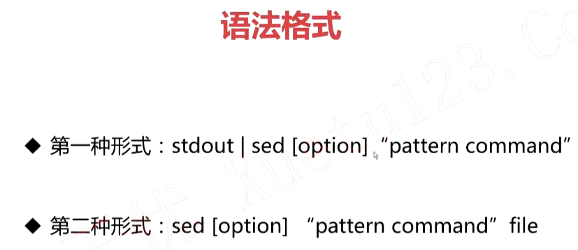

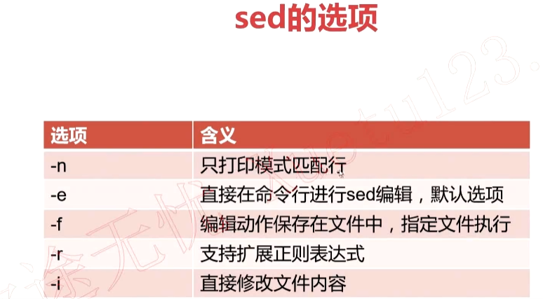


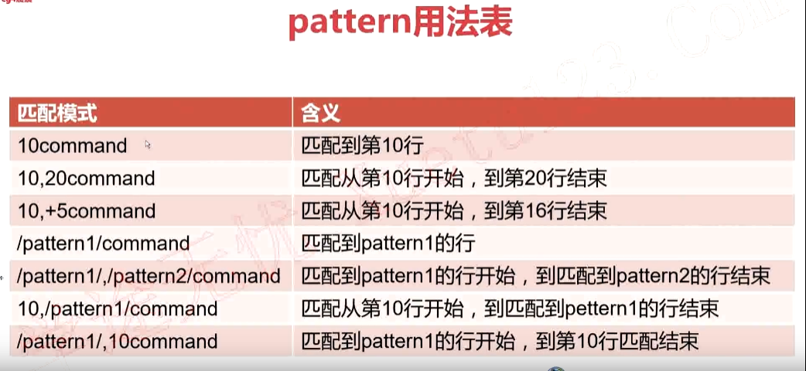

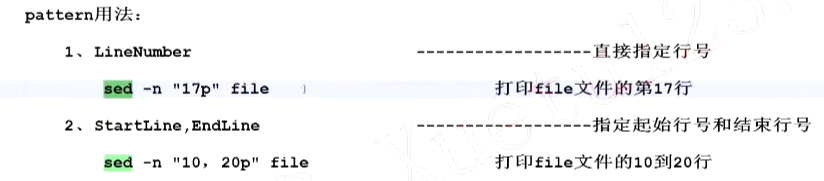

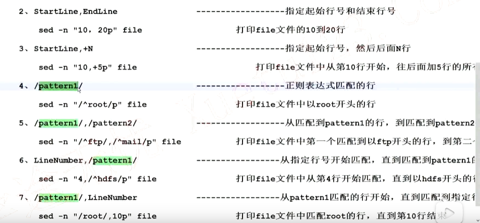


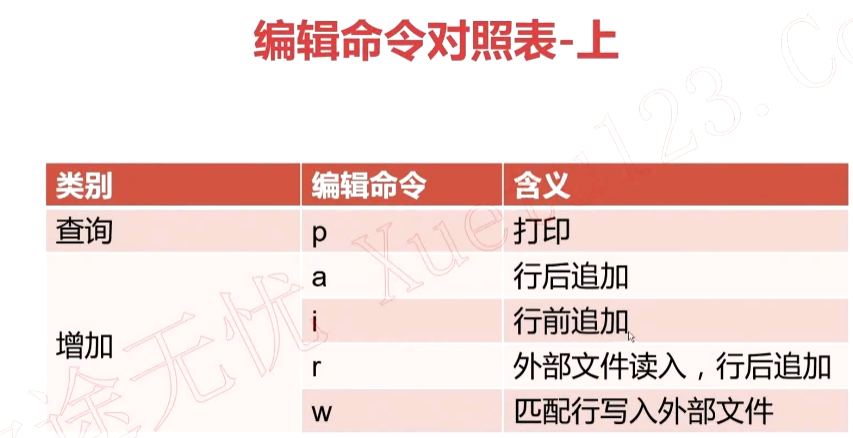

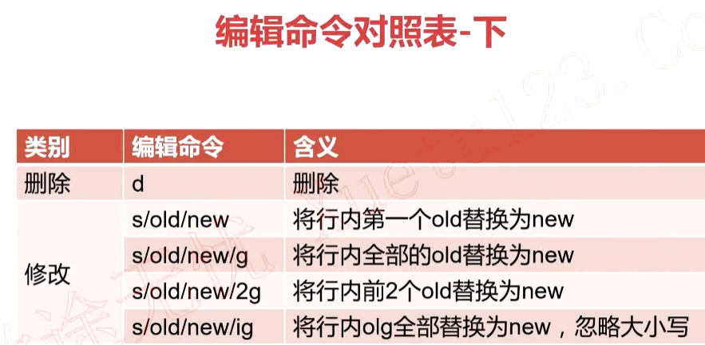

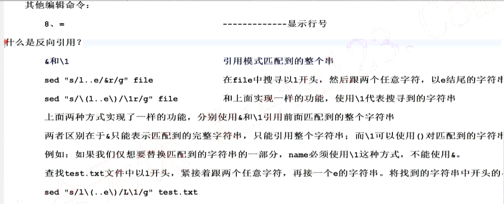

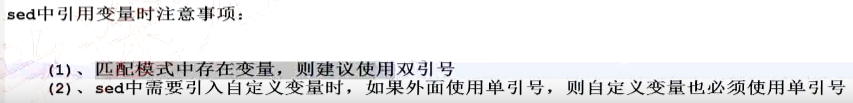


### shell BASH_SOURCE和FUNCNAME变量

参考https://www.cnblogs.com/sunfie/p/5943979.html

> FUNCNAME

在shell脚本中，FUNCNAME是一个数组，里面保存着当前shell的函数调用栈，其中${FUNCNAME[0]}是当前函数，1是外层函数，示例如下

~~~shell
#!/bin/bash

function test_func()
{
    echo "Current $FUNCNAME, \$FUNCNAME => (${FUNCNAME[@]})"
    another_func
    echo "Current $FUNCNAME, \$FUNCNAME => (${FUNCNAME[@]})"
}

function another_func()
{
    echo "Current $FUNCNAME, \$FUNCNAME => (${FUNCNAME[@]})"
}

echo "Out of function, \$FUNCNAME => (${FUNCNAME[@]})"
test_func
echo "Out of function, \$FUNCNAME => (${FUNCNAME[@]})"
~~~

输出

~~~shell
Out of function, $FUNCNAME => ()
Current test_func, $FUNCNAME => (test_func main)
Current another_func, $FUNCNAME => (another_func test_func main)
Current test_func, $FUNCNAME => (test_func main)
Out of function, $FUNCNAME => ()
~~~

> BASH_SOURCE

BASH_SOURCE与FUNCNAME类似，在使用source执行子脚本的时候，在子脚本里面BASH_SOURCE数组中记录着脚本的调用栈，${BASH_SOURCE[0]}表示的是当前脚本，1表示的是父脚本。${BASH_SOURCE[0]}与$BASH_SOURCE相同。

但是在子脚本中，$0依旧是最外层的父脚本。

~~~shell
shen@Wind:~$ cat a.sh
#!/bin/bash
echo ${BASH_SOURCE[*]}
echo $0
. b.sh

shen@Wind:~$ cat b.sh
#!/bin/bash
echo $0
echo ${BASH_SOURCE[*]}

shen@Wind:~$ bash a.sh
a.sh # a.sh中的BASH_SOURCE
a.sh # a.sh中的$0
a.sh # b.sh中的$0依旧是与a.sh不变
b.sh a.sh # 记录当前脚本的调用栈
~~~


### 根据状态为变量赋值

| 命令                 | 解释                                                         | 备注                            |
| -------------------- | ------------------------------------------------------------ | ------------------------------- |
| ${file-my.file.txt}  | 若 $file 没设定,则使用 my.file.txt 作传回值                  | 有设定（ 空值及非空值）不作处理 |
| ${file:-my.file.txt} | 若 $file 没设定或为空值,则使用 my.file.txt 作传回值          | 非空值时不作处理                |
| ${file+my.file.txt}  | 若$file 有设定（空值或非空值）,均使用my.file.txt作传回值     | 没设定时不作处理                |
| ${file:+my.file.txt} | 若 $file 有设定且不为空值（为非空值）,则使用 my.file.txt 作传回值 | 没设定及空值不作处理            |
| ${file=txt}          | 若 $file 没设定,则回传 txt ,并将 $file 赋值为 txt            | 有设定（ 空值及非空值）不作处理 |
| ${file:=txt}         | 若 $file 没设定或空值,则回传 txt ,将 $file 赋值为txt         | 非空值时不作处理                |
| ${file?my.file.txt}  | 若 $file 没设定,则将 my.file.txt 输出至 STDERR               | 有设定（ 空值及非空值）不作处理 |
| ${file:?my.file.txt} | 若 $file没设定或空值,则将my.file.txt输出至STDERR             | 非空值时不作处理                |


### shell eval的用法

格式：eval command

eval用于执行命令，他与直接执行命令不同的是，eval在执行命令之前会对命令进行一遍扫描，并解析其中的变量，解析变量之后才会执行该命令

- 案例1

  ~~~shell
  pipe="|"
  eval ls $pipe grep java # eval会先解析命令成 ls | grep java然后再执行
  ~~~

- 按理2：获取位置参数的最后一个参数

  ~~~shell
  eval echo \$$# #eval会先现将$#解析成位置参数的个数，然后再执行命令
  ~~~

- 按理3

  ~~~shell
  x=100
  ptrx=x
  eval echo \$$prtx # eval先将命令解析成echo $x，然后再执行命令
  ~~~

  

### shell 间接取值

格式： ${!var}

表示的意思是取$var的值，然后再使用$var的值进行再次取值

案列1：

~~~shell
x=100
ptrx=x
# 先回去$ptr的值为x, 然后再获取$x的值, 一共做两次取值
echo ${!ptrx} #100
~~~

案列2: 写一个交换两个变量的值的函数

~~~shell
## @description  exchange `oldvar` and `newvar`
## @param        oldvar
## @param        newvar
function exchange
{
  local a_value=${!1}
  local b_value=${!2}

  eval "$1=$b_value"
  eval "$2=$a_value"
}

a=100
b=200

exchange a b
echo $a,$b #200,100
~~~


### 实验技巧

#### shell获取当前执行文件的绝对路径

~~~shell
# cd -P 和 pwd -P表示使用物理路径，该选项会忽略软连接
# 比如家目录下有test文件夹，testln软连接到test
# cd testln将进入到testln目录下, cd -P testln将进入到test目录下
# 在testln目录下pwd将会获得~/testln, pwd -P 将会获得~/test

# -- 用于区分选项和参数，详细请查看当前笔记的关于--的记录
$(cd -P -- "$(dirname -- "${BASH_SOURCE:-$0}")" >/dev/null && pwd -P)
~~~

#### shell --和-的用法

在shell中使用命令的一般格式为command option args

比如`cd -P ~`，这里的-P表示选项，~表示参数

使用`man bash`可以看到


`--` 的作用是作为option和args的分割符。`--`和`-`的作用是相等的。`--`是可选的。

在一般情况下，加不加`--`都无所谓，但是在一些特殊情况下必须加`--`。

比如想要创建一个名叫`-i`的目录，使用`mkdir -i`时，bash会认为-i是一个选项，但是实际上我们想要表示的是`-i`是一个参数，所以必须使用`mkdir -- -i`才能创建。

cd到一个`-i`目录也是同理，必须使用`cd -- -i`。

所以在shell中，使用从外部接收参数进行命令拼接时，为了防止参数被解析成选项，一般在参数面前加`--`，比如`cd -- $(dirname -- $0)`


#### shell shift的作用

位置参数可以用`shift`命令左移。比如`shift 3`表示原来的`$4`现在变成`$1`，原来的`$5`现在变成`$2`等等，原来的`$1`、`$2`、`$3`丢弃，`$0`不移动。不带参数的`shift`命令相当于`shift 1`。

我们知道，对于位置变量或命令行参数，其个数必须是确定的，或者当 Shell 程序不知道其个数时，可以把所有参数一起赋值给变量$*。若用户要求 Shell 在不知道位置变量个数的情况下，还能逐个的把参数一一处理，也就是在 $1 后为 $2,在 $2 后面为 $3 等。在 shift 命令执行前变量 $1 的值在 shift 命令执行后就不可用了。

示例如下：

\#测试 shift 命令(x_shift.sh)

~~~shell
until [ $# -eq 0 ]
do
echo "第一个参数为: $1 参数个数为: $#"
shift
done
~~~

执行以上程序x_shift.sh：
$./x_shift.sh 1 2 3 4

结果显示如下：

~~~shell
第一个参数为: 1 参数个数为: 4
第一个参数为: 2 参数个数为: 3
第一个参数为: 3 参数个数为: 2
第一个参数为: 4 参数个数为: 1
~~~


