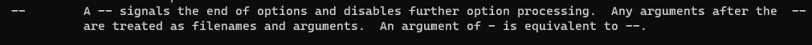

### 运行shell脚本

> 将shell脚本作为程序运行

~~~shell
./test.sh
~~~

`./`表示当前目录，如果不写会从path环境变量下查找test.sh

这种方式需要当前用户对shell脚本有执行权限

这种方式会根据脚本第一行中指定的shell解释器来执行

> 通过bash执行

~~~shell
bash test.sh
~~~

通过这种方式运行脚本，不需要在脚本文件的第一行指定解释器信息，写了也没用。

这种方式会新开一个bash进程来执行shell脚本，可以分别在当前进程中和脚本中执行`echo $$`来获取进程PID

> 在当前进程中执行shell

~~~shell
source test.sh
~~~

简写

~~~shell
. test.sh
~~~

source会在当前进程中强制执行脚本文件中的全部内容而忽略脚本文件的权限


### shell交互式与非交互式，登录式与非登录式

> 查看是否交互式

~~~shell
[c.biancheng.net]$ echo $-
himBH

[c.biancheng.net]$ cat test.sh
#!/bin/bash
echo $-
[c.biancheng.net]$ bash ./test.sh
hB
~~~

**如果输出字母中包含i，则为交互式**


或者查看`PS1`的值，如果非空，则为交互式，否则为非交互式，因为非交互式会清空该变量。

~~~shell
[mozhiyan@localhost]$ echo $PS1
[\u@\h \W]\$

[c.biancheng.net]$ cat test.sh
#!/bin/bash
echo $PS1
[c.biancheng.net]$ bash ./test.sh
~~~


> 判断是否为登录式

执行`shopt login_shell`即可，值为`on`表示为登录式，`off`为非登录式。

> 同时判断登录式和交互式

~~~shell
echo $-; shopt login_shell
echo $PS1; shopt login_shell
~~~


> 常见的情况

登录交互式：

- 使用账号密码登录linux
- `ssh user@ip`通过ssh登录linux
- `su - user`切换用户

登录非交互式：

- `bash --login test.sh`选项执行脚本

非登录非交互式：

- `bash test.sh`直接执行脚本, 脚本是以非登录非交互方式执行的
- `ssh localhost a.sh`执行脚本, 脚本是以非登录非交互方式执行的

非登录交互式：

- 桌面环境下打开终端
- 直接在终端执行`bash`进入子进程
- `ssh user@ip "echo $PS1; shopt login_shell"`命令是通过非登录交互式执行的
- `su user`切换用户

这里特别要区分的是ssh执行的方式，

~~~shell
$ cat b.sh
#!/bin/bash
 echo $- && shopt login_shell
 
 # 这里执行b.sh,在脚本里面是非登录非交互式的
$ ssh localhost bash b.sh
hB
login_shell     off

 # 这里直接执行命令,命令时在非登录交互式下执行的
$ ssh localhost echo $- && shopt login_shell
himBHs
login_shell     off
~~~


> 登录式与非登录式区别

不同的运行方式， bash在启动时加载的配置文件不同，这会导致在不同运行方式下，环境变量不同。


### shell配置文件

无论是否是交互式，是否是登录式，Bash  在启动时总要配置其运行环境，例如初始化环境变量、设置命令提示符、指定系统命令路径等。这个过程是通过加载一系列配置文件完成的，这些配置文件其实就是 Shell 脚本文件。

> 登录式shell

如果是登录式的 Shell首先会读取和执行 /etc/profiles。

接着会以 ~/.bash_profile、~/.bash_login 或者 ~/.profile的顺序**查找并执行第一个存在且可读的文件**。不同的 linux 发行版附带的个人配置文件也不同，有的可能只有其中一个，有的可能三者都有。

注意，/etc/profiles 文件还会嵌套加载 /etc/profile.d/*.sh（不同版本可能不同，具体请查看对应文件），请看下面的代码：

```shell
for i in /etc/profile.d/*.sh ; do
    if [ -r "$i" ]; then
        if [ "${-#*i}" != "$-" ]; then
            . "$i"
        else
            . "$i" >/dev/null
        fi
    fi
done
```


同样，~/.bash_profile 也使用类似的方式加载 ~/.bashrc(不同版本可能不同，具体查看对应文件)：

```shell
if [ -f ~/.bashrc ]; then
. ~/.bashrc
fi
```


当登录式bash退出时，会执行~/.bash_logout

> 非登录式shell

如果交互非登录式shell（类似`echo $PS1; shopt login_shell`）启动时，

- Ubuntu下, 读取并执行/etc/bash.bashrc和~/.bashrc
- Centos下, 读取并执行~/.bashrc

~/.bashrc 文件还会嵌套加载 /etc/bashrc，请看下面的代码：

```shell
if [ -f /etc/bashrc ]; then
. /etc/bashrc
fi
```


如果是非登录非交互式的话，会获取变量BASH_ENV的值，并将该值当做文件名进行执行。


> ssh网络调用bash

特别需要注意的是，bash会尝试判断他的标准输入是否来自一个网络(`ssh localhost echo $-`)，如果 bash 确定它正在以这种方式运行，它会从 ~/.bashrc读取并执行命令，前提文件存在并且可读。如果作为 sh 调用，它将不会执行此操作。 

特别坑的是，Ubuntu中的~/.bashrc文件的开头有这样一段代码, centos则没有：

~~~shell
# If not running interactively, don't do anything
case $- in
    *i*) ;;
      *) return;;
esac
~~~

也就是说，使用ssh执行脚本，在脚本里面是非登录非交互模式，所以即使当前bash加载了~/.bashrc文件，但是执行到了上述代码判断是非交互式就退出去了，导致和没有执行一样。所以如果希望在ssh网络调用某些脚本时，能够在脚本里面读取到某些环境变量，需要将export语句加在上述代码以前。（说的就是你，hadoop的start-dfs.sh, 老是读取不到java_home）


> sh调用bash

如果使用名称 sh 调用 bash时：

- 当作为登录式调用时，它首先尝试按顺序从 /etc/profile 和 ~/.profile 读取和执行命令。 
- 当作为名为 sh 的交互式 shell 调用时，bash 查找变量 ENV并将其用作要读取和执行的文件的名称。由于作为 sh 调用的 shell 不会尝试从任何其他启动文件读取和执行命令，因此 --rcfile 选项无效。
- 使用名称 sh 调用的非交互式 shell 不会尝试读取任何其他启动文件。

> 选项

`--init-file file`， `--rcfile file`: 如果是交互式shell，可以使用这两个选项指定配置文件，而不是默认的配置文件。

`--noprofile`: 如果是登录式，使用该选项可以禁用默认配置文件。

`--norc`：如果是交互式，使用该选项可以禁用默认配置文件。


### shell变量

> 定义变量

~~~shell
variable=value
variable='value'
variable="value"
~~~

`=`左右不能有空格

在shell中，每一个变量的值都是字符串，无论是否使用引号。

如果需要指定类型可以使用declare关键字

> 使用变量

~~~shell
a=100
echo $a
echo "haha${a}"
~~~

`{}`是可选的，用于帮助解释器识别变量的边界

> 修改值

~~~shell
url="http://c.biancheng.net"
echo ${url}
url="/d/file/202003/tnqgclnw4zm1221"
echo ${url}
~~~

> 单引号和双引号的区别

单引号直接输出，双引号会对变量取值

~~~shell
url="http://c.biancheng.net"
website1='C语言中文网：${url}'
website2="C语言中文网：${url}"
echo $website1
C语言中文网：${url}

echo $website2
C语言中文网：http://c.biancheng.net
~~~

> 只读变量

~~~shell
readonly a=100
b=200
readonly b
~~~


> 删除变量

~~~shell
a=100
unset a
~~~

unset不能删除只读变量


### shell变量作用域

shell变量的作用域分为三种

- 只能在函数内部使用，这叫做局部变量（local variable）；
- 仅当前 Shell 进程中使用，这叫做全局变量（global variable）；
- 在当前进程和子进程中使用，这叫做环境变量（environment variable）。

需要注意的是，默认情况下在shell 函数里面定义的也是全局变量

~~~shell
function add() {
 	a=99
}
echo $a
~~~

**想要定义局部变量需要加上local关键字, 否则默认为全局变量**

~~~shell
local a=99
~~~

> shell环境变量

全局变量只在当前 Shell 进程中有效，对其它 Shell 进程和子进程都无效。如果使用`export`命令将全局变量导出，那么它就在所有的子进程中也有效了

通过 export 导出的环境变量只对当前 Shell 进程以及所有的子进程有效，如果最顶层的父进程被关闭了，那么环境变量也就随之消失了，其它的进程也就无法使用了，所以说环境变量也是临时的。

只有将变量写入 Shell 配置文件中才能达到这个目的！Shell 进程每次启动时都会执行配置文件中的代码做一些初始化工作，如果将变量放在配置文件中，那么每次启动进程都会定义这个变量。


### shell命令替换

作用是将命令的**输出**结果复制给某个变量

~~~shell
variable=`commands`
variable=$(commands)
~~~

比如

~~~shell
# date是输出当前时间，将输出的时间赋值给time
time=$(date)
~~~


注意，如果被替换的命令的输出内容包括多行（也即有换行符），或者含有多个连续的空白符，那么在输出变量时应该将变量用双引号包围，否则系统会使用默认的空白符来填充，这会导致换行无效，以及连续的空白符被压缩成一个。请看下面的代码：

```
#!/bin/bash

LSL=`ls -l`
echo $LSL  #不使用双引号包围
echo "--------------------------"  #输出分隔符
echo "$LSL"  #使用引号包围
```

运行结果：

```
total 8 drwxr-xr-x. 2 root root 21 7月 1 2016 abc -rw-rw-r--. 1 mozhiyan mozhiyan 147 10月 31 10:29 demo.sh -rw-rw-r--. 1 mozhiyan mozhiyan 35 10月 31 10:20 demo.sh~
--------------------------
total 8
drwxr-xr-x. 2 root     root      21 7月   1 2016 abc
-rw-rw-r--. 1 mozhiyan mozhiyan 147 10月 31 10:29 demo.sh
-rw-rw-r--. 1 mozhiyan mozhiyan  35 10月 31 10:20 demo.sh~
```

所以，为了防止出现格式混乱的情况，我建议在输出变量时加上双引号。

> 反引号和$()区别

反引号很像单引号，不易辨别

反引号在多种shell中可用，而$()仅在bash shell中可用

$()支持嵌套，如`$(wc -l $(ls | sed -n '1p'))`


### shell位置参数

给shell脚本或者shell函数传递的参数，在内部可以使用$n的形式来接收，如$1表示第一个参数，$2 表示第二个参数，依次类推。如果参数个数太多，达到或者超过了 10 个，那么就得用`${n}`的形式来接收了，例如 ${10}、${23}

并且对于函数，shell没有所谓的形参和实参，所以在定义shell函数时不能带参数，而是直接调用位置参数


### shell特殊变量

$0 当前脚本文件名

$n (n>=1) 传递给函数或者脚本的参数

$# 传递给脚本的参数的个数

$* 传递给脚本的所有参数

$@ 传递给脚本的所有参数，当被双引号`" "`包含时，$@ 与 $* 稍有不同

$? 上一个命令的退出状态(exit 0)，或者函数的返回值(return 0)

$$ 当前脚本的PID、

> $*和$#的区别

当 $* 和 $@ 不被双引号`" "`包围时，它们之间没有任何区别，都是将接收到的**每个参数看做一份数据，彼此之间以空格来分隔。**

但是当它们被双引号`" "`包含时，就会有区别了：

- `"$*"`会将所有的参数从整体上看做一份数据，而不是把每个参数都看做一份数据。

- `"$@"`仍然将每个参数都看作一份数据，彼此之间是独立的。

比如传递了 5 个参数，那么对于`"$*"`来说，这 5 个参数会合并到一起形成一份数据，它们之间是无法分割的；而对于`"$@"`来说，这 5 个参数是相互独立的，它们是 5 份数据。

编写下面的代码，并保存为 test.sh：

```shell
#!/bin/bash

echo "print each param from \"\$*\""
for var in "$*"
do
    echo "$var"
done

echo "print each param from \"\$@\""
for var in "$@"
do
    echo "$var"
done
```

运行 test.sh，并附带参数：

~~~shell
[mozhiyan@localhost demo]$ . ./test.sh a b c
print each param from "$*"
a b c
print each param from "$@"
a
b
c
~~~


### shell操作字符串

字符串的三种形式

1) 由单引号`' '`包围的字符串：

- 任何字符都会原样输出，在其中使用变量是无效的。
- 字符串中不能出现单引号，即使对单引号进行转义也不行。

2) 由双引号`" "`包围的字符串：
- 如果其中包含了某个变量，那么该变量会被解析（得到该变量的值），而不是原样输出。
- 字符串中可以出现双引号，只要它被转义了就行。

3) 不被引号包围的字符串
- 不被引号包围的字符串中出现变量时也会被解析，这一点和双引号`" "`包围的字符串一样。
- 字符串中不能出现空格，否则空格后边的字符串会作为其他变量或者命令解析。

> 获取字符串长度

${#stringname}   stringname表示变量名

> 字符串拼接

在shell中，不需要任何操作符就可以拼接字符串

~~~shell
name="hello"
url="world"

str1=$name$url  #中间不能有空格 helloworld
str2="$name $url"  #如果被双引号包围，那么中间可以有空格 hello world
str3=$name": "$url  #中间可以出现别的字符串 hello: world
str4="$name: ${url}aaa"  #这样写也可以 hello: worldaaa
~~~

> 字符串截取

- 从左边开始计数

  ~~~shell
  ${string:start:length} #格式
  ~~~

  ~~~shell
  $ url="c.biancheng.net"
  $ echo ${url:2:9}
  biancheng
  ~~~

  从0开始计数，忽略length表示直到结束

- 从右边开始计数

  ~~~shell
  ${string:0-start:length} #格式
  ~~~

  ~~~shell
  $ url="c.biancheng.net"
  $ echo ${url:0-13:9}
  biancheng
  ~~~

  需要注意的是：

  - 从右边开始计数是从1开始的
  - 不管从那边开始计数，截取方向都是从左到右
  - 忽略length表示直到结束

- 从指定字符串开始截取

  ~~~shell
  ${string#chars} # 匹配左边保留右边
  ${string%chars} # 匹配右边保留左边
  ~~~

  ~~~shell
  url="http://aaa.http"
  $ echo ${url#http}
  ://aaa.http
  $ echo ${url%http}
  http://aaa.
  ~~~

  可以使用通配符*表示任意字符

  ~~~shell
  url="http://aaa/b.html"
  $ echo ${url#*/}  #  */表示以/结尾的任意字符串，#匹配左边，所以匹配到了http:/,保留右边
  /aaa/b.html
  $ echo ${url%/*} # /*表示匹配/开始的任意字符串，%匹配右边，所以匹配到了/b.html，保留左边
  http://aaa
  ~~~

  同时在使用通配符时，#和%都是非贪心模式，只要匹配到了相应字符串即结束。

  可以使用##和%%切换到贪心模式

  ~~~shell
  $ url="http://aaa/b.html"
  $ echo ${url##*/}
  b.html # */使用贪心模式，匹配到了http://aaa/
  $ echo ${url%%/*}
  http: # /*使用贪心模式，匹配到了//aaa/b.html
  ~~~


> 字符串替换

| 命令              | 解释                     | 结果                           |
| ----------------- | ------------------------ | ------------------------------ |
| ${file/dir/path}  | 将第一个 dir 提换为 path | /path1/dir2/dir3/my.file.txt   |
| ${file//dir/path} | 将全部 dir 提换为 path   | /path1/path2/path3/my.file.txt |

使用${file//dir/}可以将file中的dir字符串全部是删除


### shell数组

shell只支持一维数组

~~~shell

~~~


### shell sed


### shell BASH_SOURCE和FUNCNAME变量

参考https://www.cnblogs.com/sunfie/p/5943979.html

> FUNCNAME

在shell脚本中，FUNCNAME是一个数组，里面保存着当前shell的函数调用栈，其中${FUNCNAME[0]}是当前函数，1是外层函数，示例如下

~~~shell
#!/bin/bash

function test_func()
{
    echo "Current $FUNCNAME, \$FUNCNAME => (${FUNCNAME[@]})"
    another_func
    echo "Current $FUNCNAME, \$FUNCNAME => (${FUNCNAME[@]})"
}

function another_func()
{
    echo "Current $FUNCNAME, \$FUNCNAME => (${FUNCNAME[@]})"
}

echo "Out of function, \$FUNCNAME => (${FUNCNAME[@]})"
test_func
echo "Out of function, \$FUNCNAME => (${FUNCNAME[@]})"
~~~

输出

~~~shell
Out of function, $FUNCNAME => ()
Current test_func, $FUNCNAME => (test_func main)
Current another_func, $FUNCNAME => (another_func test_func main)
Current test_func, $FUNCNAME => (test_func main)
Out of function, $FUNCNAME => ()
~~~

> BASH_SOURCE

BASH_SOURCE与FUNCNAME类似，在使用source执行子脚本的时候，在子脚本里面BASH_SOURCE数组中记录着脚本的调用栈，${BASH_SOURCE[0]}表示的是当前脚本，1表示的是父脚本。${BASH_SOURCE[0]}与$BASH_SOURCE相同。

但是在子脚本中，$0依旧是最外层的父脚本。

~~~shell
shen@Wind:~$ cat a.sh
#!/bin/bash
echo ${BASH_SOURCE[*]}
echo $0
. b.sh

shen@Wind:~$ cat b.sh
#!/bin/bash
echo $0
echo ${BASH_SOURCE[*]}

shen@Wind:~$ bash a.sh
a.sh # a.sh中的BASH_SOURCE
a.sh # a.sh中的$0
a.sh # b.sh中的$0依旧是与a.sh不变
b.sh a.sh # 记录当前脚本的调用栈
~~~


### 根据状态为变量赋值

| 命令                 | 解释                                                         | 备注                            |
| -------------------- | ------------------------------------------------------------ | ------------------------------- |
| ${file-my.file.txt}  | 若 $file 没设定,则使用 my.file.txt 作传回值                  | 有设定（ 空值及非空值）不作处理 |
| ${file:-my.file.txt} | 若 $file 没设定或为空值,则使用 my.file.txt 作传回值          | 非空值时不作处理                |
| ${file+my.file.txt}  | 若$file 有设定（空值或非空值）,均使用my.file.txt作传回值     | 没设定时不作处理                |
| ${file:+my.file.txt} | 若 $file 有设定且不为空值（为非空值）,则使用 my.file.txt 作传回值 | 没设定及空值不作处理            |
| ${file=txt}          | 若 $file 没设定,则回传 txt ,并将 $file 赋值为 txt            | 有设定（ 空值及非空值）不作处理 |
| ${file:=txt}         | 若 $file 没设定或空值,则回传 txt ,将 $file 赋值为txt         | 非空值时不作处理                |
| ${file?my.file.txt}  | 若 $file 没设定,则将 my.file.txt 输出至 STDERR               | 有设定（ 空值及非空值）不作处理 |
| ${file:?my.file.txt} | 若 $file没设定或空值,则将my.file.txt输出至STDERR             | 非空值时不作处理                |


### shell eval的用法

格式：eval command

eval用于执行命令，他与直接执行命令不同的是，eval在执行命令之前会对命令进行一遍扫描，并解析其中的变量，解析变量之后才会执行该命令

- 案例1

  ~~~shell
  pipe="|"
  eval ls $pipe grep java # eval会先解析命令成 ls | grep java然后再执行
  ~~~

- 按理2：获取位置参数的最后一个参数

  ~~~shell
  eval echo \$$# #eval会先现将$#解析成位置参数的个数，然后再执行命令
  ~~~

- 按理3

  ~~~shell
  x=100
  ptrx=x
  eval echo \$$prtx # eval先将命令解析成echo $x，然后再执行命令
  ~~~

  

### shell 间接取值

格式： ${!var}

表示的意思是取$var的值，然后再使用$var的值进行再次取值

案列1：

~~~shell
x=100
ptrx=x
# 先回去$ptr的值为x, 然后再获取$x的值, 一共做两次取值
echo ${!ptrx} #100
~~~

案列2: 写一个交换两个变量的值的函数

~~~shell
## @description  exchange `oldvar` and `newvar`
## @param        oldvar
## @param        newvar
function exchange
{
  local a_value=${!1}
  local b_value=${!2}

  eval "$1=$b_value"
  eval "$2=$a_value"
}

a=100
b=200

exchange a b
echo $a,$b #200,100
~~~


### Linux文件权限管理


### 实验技巧

#### shell获取当前执行文件的绝对路径

~~~shell
# cd -P 和 pwd -P表示使用物理路径，该选项会忽略软连接
# 比如家目录下有test文件夹，testln软连接到test
# cd testln将进入到testln目录下, cd -P testln将进入到test目录下
# 在testln目录下pwd将会获得~/testln, pwd -P 将会获得~/test

# -- 用于区分选项和参数，详细请查看当前笔记的关于--的记录
$(cd -P -- "$(dirname -- "${BASH_SOURCE:-$0}")" >/dev/null && pwd -P)
~~~

#### shell --和-的用法

在shell中使用命令的一般格式为command option args

比如`cd -P ~`，这里的-P表示选项，~表示参数

使用`man bash`可以看到



`--` 的作用是作为option和args的分割符。`--`和`-`的作用是相等的。`--`是可选的。

在一般情况下，加不加`--`都无所谓，但是在一些特殊情况下必须加`--`。

比如想要创建一个名叫`-i`的目录，使用`mkdir -i`时，bash会认为-i是一个选项，但是实际上我们想要表示的是`-i`是一个参数，所以必须使用`mkdir -- -i`才能创建。

cd到一个`-i`目录也是同理，必须使用`cd -- -i`。

所以在shell中，使用从外部接收参数进行命令拼接时，为了防止参数被解析成选项，一般在参数面前加`--`，比如`cd -- $(dirname -- $0)`


#### shell shift的作用

位置参数可以用`shift`命令左移。比如`shift 3`表示原来的`$4`现在变成`$1`，原来的`$5`现在变成`$2`等等，原来的`$1`、`$2`、`$3`丢弃，`$0`不移动。不带参数的`shift`命令相当于`shift 1`。

我们知道，对于位置变量或命令行参数，其个数必须是确定的，或者当 Shell 程序不知道其个数时，可以把所有参数一起赋值给变量$*。若用户要求 Shell 在不知道位置变量个数的情况下，还能逐个的把参数一一处理，也就是在 $1 后为 $2,在 $2 后面为 $3 等。在 shift 命令执行前变量 $1 的值在 shift 命令执行后就不可用了。

示例如下：

\#测试 shift 命令(x_shift.sh)

~~~shell
until [ $# -eq 0 ]
do
echo "第一个参数为: $1 参数个数为: $#"
shift
done
~~~

执行以上程序x_shift.sh：
$./x_shift.sh 1 2 3 4

结果显示如下：

~~~shell
第一个参数为: 1 参数个数为: 4
第一个参数为: 2 参数个数为: 3
第一个参数为: 3 参数个数为: 2
第一个参数为: 4 参数个数为: 1
~~~


