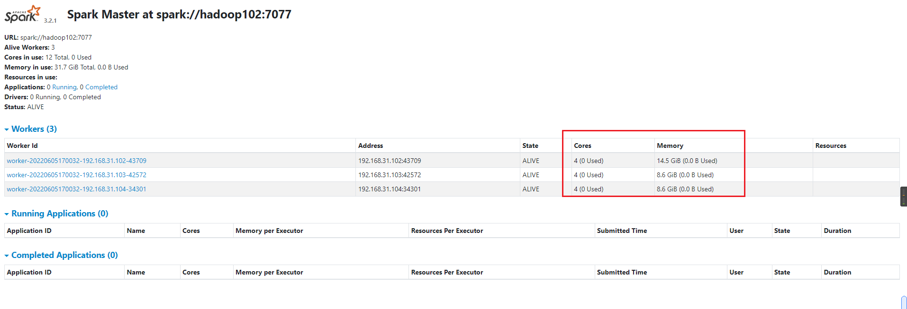

#### spark安装


1. 推荐使用hadoop安装的用户执行以下操作, 防止后续操作因为权限问题而报错, 安装spark之前不需要安装scala, 因为spark中已经有了scala的源码包

2. 修改conf/worker.template为conf/worker, 设置当前worker的域名

   ~~~txt
   hadoop102
   hadoop103
   hadoop104
   ~~~

3. 修改conf/spark-env.sh.template修改为spark-env.sh, 设置当前spark master的地址和rpc通信端口, webUI端口

   ~~~shell
   SPARK_MASTER_HOST=hadoop102
   SPARK_MASTER_PORT=7077
   # 默认为8080
   SPARK_MASTER_WEBUI_PORT=8989 
   ~~~

4. 使用xsync分发内容

5. 在spark目录下执行sbin/start-all.sh启动集群中所有机器

6. 通过spark-submit提交任务

   ~~~shell
   bin/spark-submit \
   --class org.apache.spark.examples.SparkPi \
   --master spark://hadoop102:7077 \
   ./examples/jars/spark-examples_2.13-3.2.1.jar \
   10
   ~~~

7. 访问master webui界面http://hadoop:8989

8. 执行sbin/stop-all.sh停止集群中的所有机器


#### 配置历史服务

历史服务器用于记录spark的application运行时的一些信息, 如果不配做历史服务器, 这些信息在application运行时可以查看, 但是运行结束之后就只能查看一些简单的日志信息了, 不能查看运行时信息

1. 将conf/spark-default.conf.template修改为conf/spark-default.conf, 并修改内容, 历史记录的地址可以配置为本地地址(请配置绝对路径), 也可以配置为hdfs地址: hdfs://linux1:8020/directory

   ~~~shell
   spark.eventLog.enabled true
   spark.eventLog.dir /opt/module/spark-3.2.1-bin-hadoop3.2-scala2.13/history
   ~~~

2. 修改spark-env.sh, 添加日志配置

   ~~~shell
   export SPARK_HISTORY_OPTS="
   -Dspark.history.ui.port=18080
   -Dspark.history.fs.logDirectory=./history
   -Dspark.history.retainedApplications=30"
   ~~~

3. 分发内容

4. 重启spark服务和历史服务

   ~~~shell
   sbin/start-all.sh
   sbin/start-history-server.sh
   ~~~

5. 访问http://hadoop102:18080


#### spark配置高可用

1. 启动zookeeper, 在hadoop102的2181

2. 配置conf/spark-env.sh

   ~~~shell
   #注释如下内容：
   #SPARK_MASTER_HOST=hadoop102
   #SPARK_MASTER_PORT=7077
   
   #添加如下内容:
   #spark.deploy.zookeeper.url表示zookeeper的地址, 如果有多个需要使用逗号分割
   # spark.deploy.zookeeper.dir表示spark的在zk中的数据将保存在/spark目录下
   export SPARK_DAEMON_JAVA_OPTS="
   -Dspark.deploy.recoveryMode=ZOOKEEPER
   -Dspark.deploy.zookeeper.url=hadoop102:2181
   -Dspark.deploy.zookeeper.dir=/spark"
   ~~~

3. 配置zookeeper后, zookeeper中会保存所有master的信息和所有worker的资源使用情况, 以保证故障切换

4. 分发内容

5. 在hadoop102上面启动master和worker

   ~~~shell
   ./sbin/start-all.sh
   ~~~

6. 在hadoop103, hadoop104上面启动备用master

   ~~~sh
   ./sbin/start-master.sh
   ~~~

7. 提交任务到集群中

   ~~~shell
   bin/spark-submit \
   --class org.apache.spark.examples.SparkPi \
   --master spark://hadoop102:7077, spark://hadoop103:7077, spark://hadoop104:7077 \
   ./examples/jars/spark-examples_2.13-3.2.1.jar \
   10
   ~~~

#### 指定worker可以使用的资源大小

在conf/spark-env.sh中配置

~~~shell
export SPARK_WORKER_CORES=4
# 单位还可以有mb
export SPARK_WORKER_MEMORY=8g
~~~




#### 提交任务时指定任务所使用的的资源大小

~~~shell
# 指定所有executor一共使用的核心
# 指定每个executor使用的内存
bin/spark-submit \
--class org.apache.spark.examples.SparkPi \
--master spark://hadoop102:7077 \
--executor-memory 4096mb \
--total-executor-cores 12 \
./examples/jars/spark-examples_2.13-3.2.1.jar \
10
~~~


#### spark运行时组件介绍

在通过spark-submit提交任务之后, 在集群中将会有一下进程:

- maste: 负责资源调度, 即根据提交的任务所需的资源和当前worker的资源使用情况根据一定的策略来决定在哪些worker上启动executor, executor所占用的资源是多少, 有点类似yarn中的ResourceManager, 负责资源的调度
- worker: 
- spark-submit: 简称driver, 用于向master提交任务, 调度任务
- CoarseGrainedExecutorBackend: 简称executor, 用于真正执行任务, 该jvm进程是由worker进程通过shell启动的

#### spark-shell介绍

- spark-shell是可交互式的scala编辑器, 也可以向master提交job

- 执行spark-shell命令之后, 使用jps查看发现他就是一个SparkSubmit进程, 与spark-submit脚本执行的效果一样

- 启动spark-shell时, 可以通过--master指定master的地址, 如果不指定的话默认为local, 也可以使用--executor-memory指定每个executor使用的内存大小, 跟spark-submit一样
- 因为spark-shell本质上是一个spark-submit, 所以spark-shell也具有调度的工能


#### spark启动过程和任务执行过程

1. spark在启动master和worker之后, 

   - 如果是高可用下, worker通过zk来确定master的地址, 
   - 在单个master情况下, worker通过spark-env.sh中的配置来确定master地址

   在确定master地址之后, worker向active master发送心跳(不会向standby master发送心跳), 心跳中包含当前worker可用的内存资源和cpu资源, 默认所有可用资源全部上报, 可以在spark-env.sh中使用SPARK_WORKER_MEMORY, SPARK_WORKER_CORES设置worker的可用资源

2. master接收到worker心跳之后

   - 如果是高可用下, master将worker的资源信息保存在zk中
   - 在单master情况下, master将worker的资源信息保存在本地磁盘中

3. 通过spark-submit向master提交一个job, spark-submit脚本本质上也是启动了一个名为SparkSubmit(driver)的jvm进程来提交job, 可以在spark-submit的参数上指定当前任务需要使用的内存和cpu核数(--executor-memory, --total-executor-cores)

4. master接收到提交的任务之后, 根据提交的任务所需的资源和当前worker的资源使用情况根据一定的策略来决定在哪些worker上启动executor, executor所占用的资源是多少.

   然后通过rpc通信将executor启动的参数等等信息发送给worker

5. worker接收到master发送的启动命令之后按照参数通过shell启动另外一个jvm进程: executor

6. executor启动之后, 通过网络与driver通信(executor通过driver->master->worker->executor进而获取driver地址)

   driver上面保存着真正的计算逻辑, driver会将这些计算逻辑拆分为一个一个的task, 通过网络发送到executor上面执行, 

#### spark读取hdfs文件分区策略

具体的逻辑在org.apache.hadoop.mapred.FileInputFormat#getSplits中

1. 通过context.textFile("input/", 3)指定需要读取的hdfs路径, 以及指定文件**预计**的切片数, 

   如果不指定切片数, 默认为spark.default.parallelism属性指定的值和2中的最小值(math.min(spark.default.parallelism, 2))

2. 确定了预计的切片数之后, 计算所有文件的大小, 除以预计切片个数, 就是切片预计的大小goalSize

   ```java
   long goalSize = totalSize / (long)(numSplits == 0 ? 1 : numSplits);
   ```

3. 确定最小的切片大小minSize, 就是从FileInputFormat的minSplitSize和mapreduce.input.fileinputformat.split.minsize中挑一个最大的

   ~~~java
   long minSize = Math.max(job.getLong("mapreduce.input.fileinputformat.split.minsize", 1L), this.minSplitSize);
   ~~~

4. 获取hdfs文件的块大小blockSize作为最大的切片大小

   ~~~java
   long blockSize = file.getBlockSize();
   ~~~

5. 计算真正的切片大小splitSize, 基本思想就是取一个大于最小切片大小, 小于最大切片大小, 同时靠近目标切片大小的值

   ~~~java
   long splitSize = Math.max(minSize, Math.min(goalSize, blockSize));
   ~~~

6. 获取真正的切片大小splitSize之后, 对每一个文件按照splitSize大小进行切片, 切到最后不能再切时, 判断剩余的部分有没有0.1*splitSize大

   - 如果没有0.1*splitSize大, 和上一个切片合并, 因为太小了
   - 如果比0.1*splitSize大, 单独划分一个切片


#### spark闭包检测与序列化

当在spark的算子操作中使用了外部的变量时, 即产生了闭包

~~~scala
    def main(args: Array[String]): Unit = {
        val sparkConf = new SparkConf().setMaster("local[*]").setAppName("Operator")
        val sc = new SparkContext(sparkConf)

        val rdd = sc.makeRDD(List[Int]())
        val user = new User()

        // RDD算子中传递的函数是会包含闭包操作，那么就会进行检测功能
        // 下面操作保存, 因为使用了user.age, 而且User没有混入Serializable特质
        rdd.foreach( num => { println("age = " + (user.age + num)) } )
        
        // 下面这种方式可以, 因为算子操作中用到的是age, 而age是Int类型的, 可以被序列化
        val age = user.age
        rdd.foreach( num => { println("age = " + (age + num)) } )
        
        // 下面操作可以执行成功, 因为
        rdd.foreach( num => { 
            val age = user.age
            println("age = " + (age + num)) 
        } )
        sc.stop()

    }
    class User { var age : Int = 30 }
~~~

spark会对使用了闭包的对象进行检测, 看闭包变量是否能够序列化, 如果不能的话就会报错

解决的办法有两种

- 混入Serializable

- 使用case class

- 将属性从无法序列化的类中提取出来

  下面方法演示了这种解决方案

  ~~~scala
  def main(args: Array[String]): Unit = {
          val sparConf = new SparkConf().setMaster("local").setAppName("WordCount")
          val sc = new SparkContext(sparConf)
          val rdd: RDD[String] = sc.makeRDD(Array("hello world", "hello spark", "hive", "atguigu"))
  
          val search = new Search("h")
  		// 下面这种方式报错, 因为算子操作中使用到了Search中的query属性, 但是Serach无法序列化
          //search.getMatch1(rdd).collect().foreach(println)
      
      	// 下面这种方式可以, 因为算子操作中使用的是String类型的s, 而且String可以序列化
          search.getMatch2(rdd).collect().foreach(println)
  
          sc.stop()
      }
      // 在方法中使用query会导致query上升为一个属性
      class Search(query:String){
          
          // 函数序列化案例
          def getMatch1 (rdd: RDD[String]): RDD[String] = { 
              rdd.filter(x => x.contains(this.query) ) 
          }
  
          // 属性序列化案例
          def getMatch2(rdd: RDD[String]): RDD[String] = {
              val s = query
              rdd.filter(x => x.contains(s))
          }
      }
  ~~~

  


