#### spark安装


1. 推荐使用hadoop安装的用户执行以下操作, 防止后续操作因为权限问题而报错, 安装spark之前不需要安装scala, 因为spark中已经有了scala的源码包

2. 修改conf/worker.template为conf/worker, 设置当前worker的域名

   ~~~txt
   hadoop102
   hadoop103
   hadoop104
   ~~~

3. 修改conf/spark-env.sh.template修改为spark-env.sh, 设置当前spark master的地址和rpc通信端口, webUI端口

   ~~~shell
   SPARK_MASTER_HOST=hadoop102
   SPARK_MASTER_PORT=7077
   # 默认为8080
   SPARK_MASTER_WEBUI_PORT=8989 
   ~~~

4. 使用xsync分发内容

5. 在spark目录下执行sbin/start-all.sh启动集群中所有机器(没有配置spark_home, 当前机器应该不知道别的机器上面的spark目录, 推测应该是使用的当前shell执行的路径来推测spark目录)

6. 通过spark-submit提交任务

   ~~~shell
   bin/spark-submit \
   --class org.apache.spark.examples.SparkPi \
   --master spark://hadoop102:7077 \
   ./examples/jars/spark-examples_2.13-3.2.1.jar \
   10
   ~~~

7. 访问master webui界面http://hadoop102:8989

8. 执行sbin/stop-all.sh停止集群中的所有机器


#### 配置历史服务

历史服务器用于记录spark的application运行时的一些信息, 如果不配做历史服务器, 这些信息在application运行时可以查看, 但是运行结束之后就只能查看一些简单的日志信息了, 不能查看运行时信息

1. 将conf/spark-default.conf.template修改为conf/spark-default.conf, 并修改内容, 历史记录的地址可以配置为本地地址(请配置绝对路径), 也可以配置为hdfs地址: hdfs://linux1:8020/directory

   ~~~shell
   spark.eventLog.enabled true
   spark.eventLog.dir /opt/module/spark-3.2.1-bin-hadoop3.2-scala2.13/history
   ~~~

2. 修改spark-env.sh, 添加日志配置

   ~~~shell
   export SPARK_HISTORY_OPTS="
   -Dspark.history.ui.port=18080
   -Dspark.history.fs.logDirectory=./history
   -Dspark.history.retainedApplications=30"
   ~~~

3. 分发内容

4. 重启spark服务和历史服务

   ~~~shell
   sbin/start-all.sh
   sbin/start-history-server.sh
   ~~~

5. 访问http://hadoop102:18080


#### spark配置高可用

1. 启动zookeeper, 在hadoop102的2181

2. 配置conf/spark-env.sh

   ~~~shell
   #注释如下内容：
   #SPARK_MASTER_HOST=hadoop102
   #SPARK_MASTER_PORT=7077
   
   #添加如下内容:
   #spark.deploy.zookeeper.url表示zookeeper的地址, 如果有多个需要使用逗号分割
   # spark.deploy.zookeeper.dir表示spark的在zk中的数据将保存在/spark目录下
   export SPARK_DAEMON_JAVA_OPTS="
   -Dspark.deploy.recoveryMode=ZOOKEEPER
   -Dspark.deploy.zookeeper.url=hadoop102:2181
   -Dspark.deploy.zookeeper.dir=/spark"
   ~~~

3. 配置zookeeper后, zookeeper中会保存所有master的信息和所有worker的资源使用情况, 以保证故障切换

4. 分发内容

5. 在hadoop102上面启动master和worker

   ~~~shell
   ./sbin/start-all.sh
   ~~~

6. 在hadoop103, hadoop104上面启动备用master

   ~~~sh
   ./sbin/start-master.sh
   ~~~

7. 提交任务到集群中

   ~~~shell
   bin/spark-submit \
   --class org.apache.spark.examples.SparkPi \
   --master spark://hadoop102:7077, spark://hadoop103:7077, spark://hadoop104:7077 \
   ./examples/jars/spark-examples_2.13-3.2.1.jar \
   10
   ~~~

#### 指定worker可以使用的资源大小

在conf/spark-env.sh中配置

~~~shell
export SPARK_WORKER_CORES=4
# 单位还可以有mb
export SPARK_WORKER_MEMORY=8g
~~~


#### 提交任务时指定任务所使用的的资源大小

~~~shell
# 指定所有executor一共使用的核心
# 指定每个executor使用的内存
bin/spark-submit \
--class org.apache.spark.examples.SparkPi \
--master spark://hadoop102:7077 \
--executor-memory 4096mb \
--total-executor-cores 12 \
./examples/jars/spark-examples_2.13-3.2.1.jar \
10
~~~


#### spark运行时组件介绍

在通过spark-submit提交任务之后, 在集群中将会有一下进程:

- maste: 负责资源调度, 即根据提交的任务所需的资源和当前worker的资源使用情况根据一定的策略来决定在哪些worker上启动executor, executor所占用的资源是多少, 有点类似yarn中的ResourceManager, 负责资源的调度
- worker: 负责节点的资源管理, 启动executor
- spark-submit: 简称driver, 用于向master提交任务, 调度任务
- CoarseGrainedExecutorBackend: 简称executor, 用于真正执行任务, 该jvm进程是由worker进程通过shell启动的

#### spark-shell介绍

- spark-shell是可交互式的scala编辑器, 也可以向master提交job

- 执行spark-shell命令之后, 使用jps查看发现他就是一个SparkSubmit进程, 与spark-submit脚本执行的效果一样

- 启动spark-shell时, 可以通过--master指定master的地址, 如果不指定的话默认为local, 也可以使用--executor-memory指定每个executor使用的内存大小, 跟spark-submit一样
- 因为spark-shell本质上是一个spark-submit, 所以spark-shell也具有调度的工能


#### spark启动过程和任务执行过程

1. spark在启动master和worker之后, 

   - 如果是高可用下, worker通过zk来确定master的地址, 
   - 在单个master情况下, worker通过spark-env.sh中的配置来确定master地址

   在确定master地址之后, worker向active master发送心跳(不会向standby master发送心跳), 心跳中包含当前worker可用的内存资源和cpu资源, 默认所有可用资源全部上报, 可以在spark-env.sh中使用SPARK_WORKER_MEMORY, SPARK_WORKER_CORES设置worker的可用资源

2. master接收到worker心跳之后

   - 如果是高可用下, master将worker的资源信息保存在zk中
   - 在单master情况下, master将worker的资源信息保存在本地磁盘中

3. 通过spark-submit向master提交一个job, spark-submit脚本本质上也是启动了一个名为SparkSubmit(driver)的jvm进程来提交job, 可以在spark-submit的参数上指定当前任务需要使用的内存和cpu核数(--executor-memory, --total-executor-cores)

4. master接收到提交的任务之后, 根据提交的任务所需的资源和当前worker的资源使用情况根据一定的策略来决定在哪些worker上启动executor, executor所占用的资源是多少.

   然后通过rpc通信将executor启动的参数等等信息发送给worker

5. worker接收到master发送的启动命令之后按照参数通过shell启动另外一个jvm进程: executor

6. executor启动之后, 通过网络与driver通信(executor通过driver->master->worker->executor进而获取driver地址)

   driver上面保存着真正的计算逻辑, driver会将这些计算逻辑拆分为一个一个的task, 通过网络发送到executor上面执行, 


#### spark standlone模式和yarn模式

> spark standlone

参考: https://cloud.tencent.com/developer/article/1337395

spark standlone client模式:

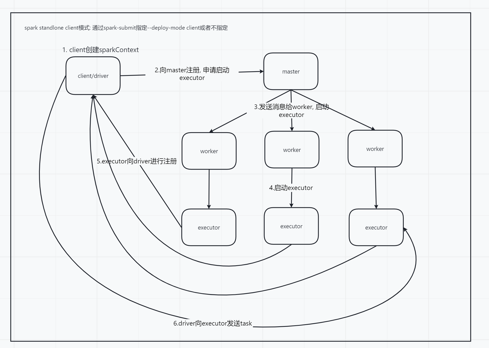

  spark standlone cluster模式:

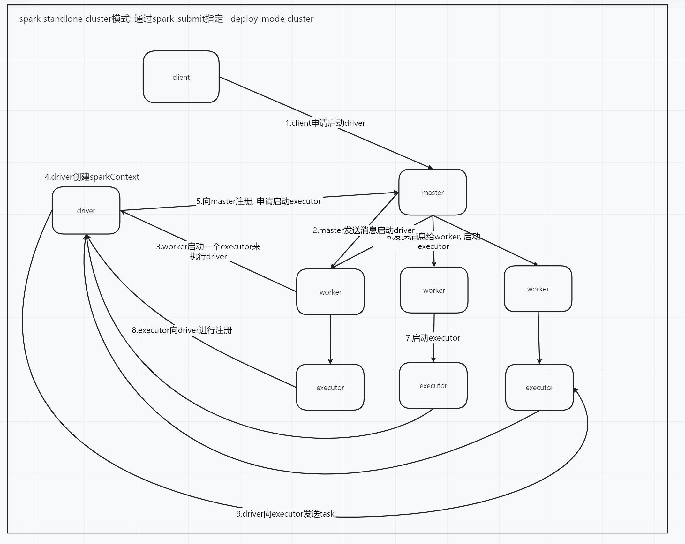

> spark yarn

参考: https://www.cnblogs.com/ITtangtang/p/7967386.html

spark yarn client

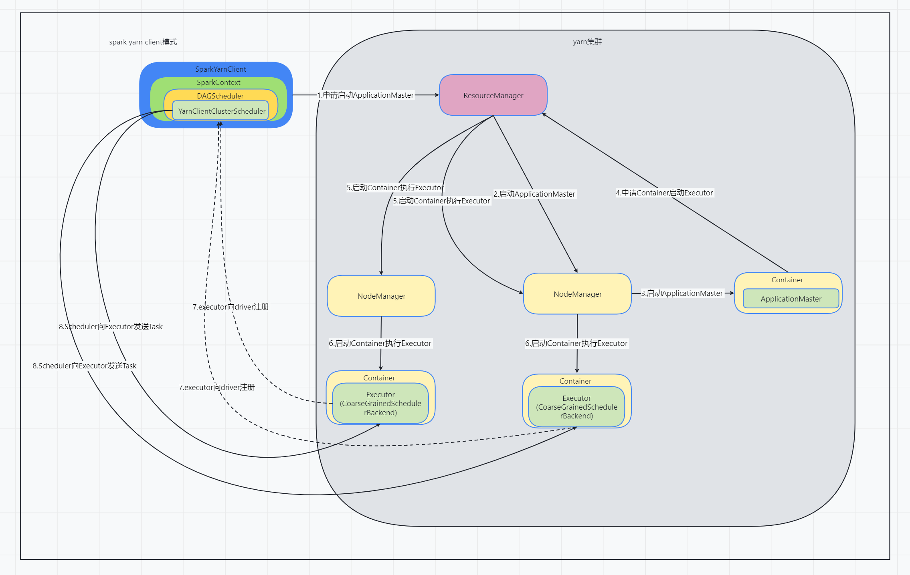

- Spark Yarn Client向YARN的ResourceManager申请启动Application Master。同时在SparkContent初始化中将创建DAGScheduler和TASKScheduler等，由于我们选择的是Yarn-Client模式，程序会选择YarnClientClusterScheduler和YarnClientSchedulerBackend
- ResourceManager收到请求后，在集群中选择一个NodeManager，为该应用程序分配第一个Container，要求它在这个Container中启动应用程序的ApplicationMaster，**与YARN-Cluster区别的是在该ApplicationMaster不运行SparkContext，只与SparkContext进行联系进行资源的分派**
- Client中的SparkContext初始化完毕后，与ApplicationMaster建立通讯，向ResourceManager注册，根据任务信息向ResourceManager申请资源（Container）
- 一旦ApplicationMaster申请到资源（也就是Container）后，便与对应的NodeManager通信，要求它在获得的Container中启动CoarseGrainedExecutorBackend，CoarseGrainedExecutorBackend启动后会向Client中的SparkContext注册
- client中的SparkContext分配Task给CoarseGrainedExecutorBackend执行，CoarseGrainedExecutorBackend运行Task并向Driver汇报运行的状态和进度，以让Client随时掌握各个任务的运行状态，从而可以在任务失败时重新启动任务
- 应用程序运行完成后，Client的SparkContext向ResourceManager申请注销并关闭自己


spark yarn cluster

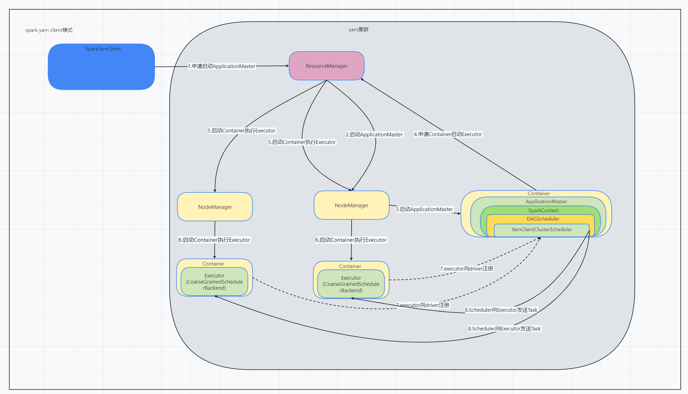

- Spark Yarn Client向YARN中提交应用程序，包括ApplicationMaster程序、启动ApplicationMaster的命令、需要在Executor中运行的程序等
- ResourceManager收到请求后，在集群中选择一个NodeManager，为该应用程序分配第一个Container，要求它在这个Container中启动应用程序的ApplicationMaster，其中ApplicationMaster进行SparkContext等的初始化
- ApplicationMaster向ResourceManager注册，这样用户可以直接通过ResourceManage查看应用程序的运行状态，然后它将采用轮询的方式通过RPC协议为各个任务申请资源，并监控它们的运行状态直到运行结束
- 一旦ApplicationMaster申请到资源（也就是Container）后，便与对应的NodeManager通信，要求它在获得的Container中启动CoarseGrainedExecutorBackend，而Executor对象的创建及维护是由CoarseGrainedExecutorBackend负责的，CoarseGrainedExecutorBackend启动后会向ApplicationMaster中的SparkContext注册并申请Task。这一点和Standalone模式一样，只不过SparkContext在Spark Application中初始化时，使用CoarseGrainedSchedulerBackend配合YarnClusterScheduler进行任务的调度，其中YarnClusterScheduler只是对TaskSchedulerImpl的一个简单包装，增加了对Executor的等待逻辑等
- ApplicationMaster中的SparkContext分配Task给CoarseGrainedExecutorBackend执行，CoarseGrainedExecutorBackend运行Task并向ApplicationMaster汇报运行的状态和进度，以让ApplicationMaster随时掌握各个任务的运行状态，从而可以在任务失败时重新启动任务
- 应用程序运行完成后，ApplicationMaster向ResourceManager申请注销并关闭自己

> yarn-client与yarn-cluster的区别

理解YARN-Client和YARN-Cluster深层次的区别之前先清楚一个概念：Application Master。在YARN中，每个Application实例都有一个ApplicationMaster进程，它是Application启动的第一个容器。它负责和ResourceManager打交道并请求资源，获取资源之后告诉NodeManager为其启动Container。从深层次的含义讲YARN-Cluster和YARN-Client模式的区别其实就是ApplicationMaster进程的区别

- YARN-Cluster模式下，Driver运行在Application Master中，它负责向YARN申请资源，并监督作业的运行状况。当用户提交了作业之后，就可以关掉Client，作业会继续在YARN上运行，因而YARN-Cluster模式不适合运行交互类型的作业
- YARN-Client模式下，Driver运行在Client中, Application Master仅仅向YARN请求Container来运行Executor，Client会和请求的Container通信来调度他们工作，也就是说Client不能离开

 #### spark 容错


#### spark 分区器Partitioner


#### spark 源码调试环境搭建

1. 创建项目, 并在pom.xml中添加如下配置

   ~~~xml
   <properties>
           <scala.version>2.13</scala.version>
   
           <project.build.sourceEncoding>UTF-8</project.build.sourceEncoding>
           <maven.compiler.encoding>UTF-8</maven.compiler.encoding>
           <java.version>8</java.version>
           <maven.compiler.source>8</maven.compiler.source>
           <maven.compiler.target>8</maven.compiler.target>
       </properties>
   
       <dependencies>
           <dependency>
               <groupId>org.apache.spark</groupId>
               <artifactId>spark-core_${scala.version}</artifactId>
               <version>3.2.1</version>
           </dependency>
   
           <dependency>
               <groupId>junit</groupId>
               <artifactId>junit</artifactId>
               <version>4.13.2</version>
           </dependency>
       </dependencies>
   ~~~

2. 直接找到org.apache.spark.deploy.master.Master并启动

   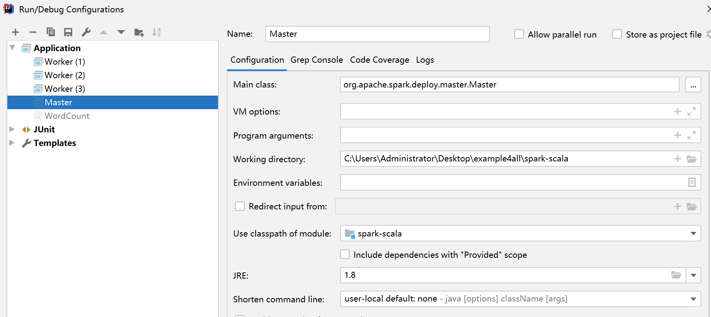

3. 找到org.apache.spark.deploy.worker.Worker, 并设置启动参数  `--webui-port 8081  --webui-port 8081 -c 4 -m 4g spark://192.168.31.8:7077`

   -c表示worker占用的core, -m表示worker占用的内存, spark://192.168.31.8:7077表示刚刚启动的master的地址

   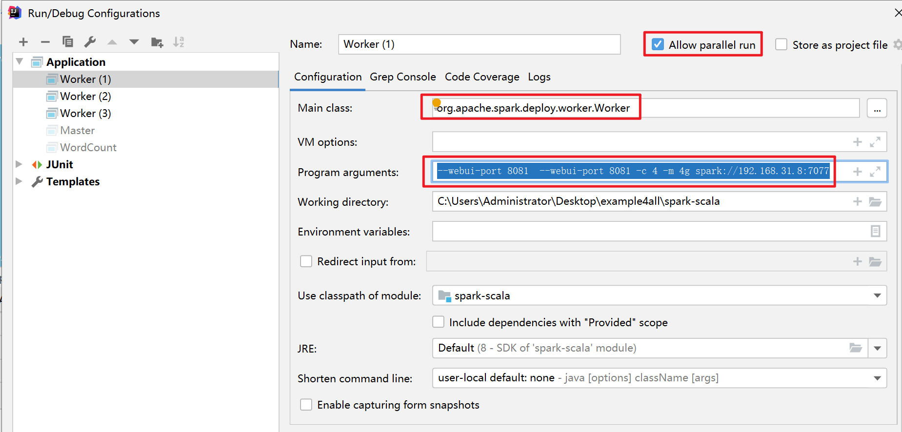

4. 按照上面的方法启动多个worker, 如果在一台机器上启动多个worker, 记得修改--webui-port参数

5. 启动driver调试程序, 指定master的地址, 即可进行调试


#### spark读取hdfs文件分区策略

具体的逻辑在org.apache.hadoop.mapred.FileInputFormat#getSplits中

1. 通过context.textFile("input/", 3)指定需要读取的hdfs路径, 以及指定文件**预计**的切片数, 

   如果不指定切片数, 默认为spark.default.parallelism属性指定的值和2中的最小值(math.min(spark.default.parallelism, 2))

2. 确定了预计的切片数之后, 计算所有文件的大小, 除以预计切片个数, 就是切片预计的大小goalSize

   ```java
   long goalSize = totalSize / (long)(numSplits == 0 ? 1 : numSplits);
   ```

3. 确定最小的切片大小minSize, 就是从FileInputFormat的minSplitSize和mapreduce.input.fileinputformat.split.minsize中挑一个最大的

   ~~~java
   long minSize = Math.max(job.getLong("mapreduce.input.fileinputformat.split.minsize", 1L), this.minSplitSize);
   ~~~

4. 获取hdfs文件的块大小blockSize作为最大的切片大小

   ~~~java
   long blockSize = file.getBlockSize();
   ~~~

5. 计算真正的切片大小splitSize, 基本思想就是取一个大于最小切片大小, 小于最大切片大小, 同时靠近目标切片大小的值

   ~~~java
   long splitSize = Math.max(minSize, Math.min(goalSize, blockSize));
   ~~~

6. 获取真正的切片大小splitSize之后, 对每一个文件按照splitSize大小进行切片, 切到最后不能再切时, 判断剩余的部分有没有0.1*splitSize大

   - 如果没有0.1*splitSize大, 和上一个切片合并, 因为太小了
   - 如果比0.1*splitSize大, 单独划分一个切片


#### spark闭包检测与序列化

当在spark的算子操作中使用了外部的变量时, 即产生了闭包

~~~scala
    def main(args: Array[String]): Unit = {
        val sparkConf = new SparkConf().setMaster("local[*]").setAppName("Operator")
        val sc = new SparkContext(sparkConf)

        val rdd = sc.makeRDD(List[Int]())
        val user = new User()

        // RDD算子中传递的函数是会包含闭包操作，那么就会进行检测功能
        // 下面操作保存, 因为使用了user.age, 而且User没有混入Serializable特质
        rdd.foreach( num => { println("age = " + (user.age + num)) } )
        
        // 下面这种方式可以, 因为算子操作中用到的是age, 而age是Int类型的, 可以被序列化
        val age = user.age
        rdd.foreach( num => { println("age = " + (age + num)) } )
        
        // 下面操作可以执行成功, 因为
        rdd.foreach( num => { 
            val age = user.age
            println("age = " + (age + num)) 
        } )
        sc.stop()

    }
    class User { var age : Int = 30 }
~~~

spark会对使用了闭包的对象进行检测, 看闭包变量是否能够序列化, 如果不能的话就会报错

解决的办法有两种

- 混入Serializable

- 使用case class

- 将属性从无法序列化的类中提取出来

  下面方法演示了这种解决方案

  ~~~scala
  def main(args: Array[String]): Unit = {
          val sparConf = new SparkConf().setMaster("local").setAppName("WordCount")
          val sc = new SparkContext(sparConf)
          val rdd: RDD[String] = sc.makeRDD(Array("hello world", "hello spark", "hive", "atguigu"))
  
          val search = new Search("h")
  		// 下面这种方式报错, 因为算子操作中使用到了Search中的query属性, 但是Serach无法序列化
          //search.getMatch1(rdd).collect().foreach(println)
      
      	// 下面这种方式可以, 因为算子操作中使用的是String类型的s, 而且String可以序列化
          search.getMatch2(rdd).collect().foreach(println)
  
          sc.stop()
      }
      // 在方法中使用query会导致query上升为一个属性
      class Search(query:String){
          
          // 函数序列化案例
          def getMatch1 (rdd: RDD[String]): RDD[String] = { 
              rdd.filter(x => x.contains(this.query) ) 
          }
  
          // 属性序列化案例
          def getMatch2(rdd: RDD[String]): RDD[String] = {
              val s = query
              rdd.filter(x => x.contains(s))
          }
      }
  ~~~


#### spark stage的划分, 宽依赖和窄依赖

> WorkCount逻辑查询计划

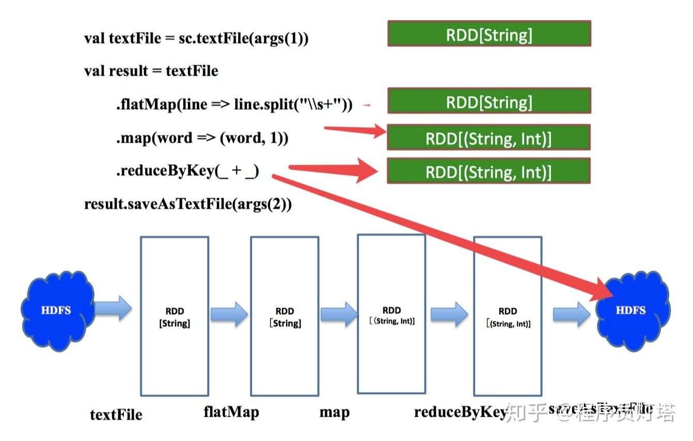


上图右侧绿框代表每一步算子计算之后的结果

1. `sc.textFile`取hdfs路径生成rdd
2. `textFile.flatMap`把rdd中的一行数据按照`\s+`(匹配任何空白字符，包括空格、制表符、换页符等等)拆成多行
3. `work=>(work, 1)`把每条数据x 转换成`(x, 1)` 这样 `key-value`对的元组
4. `.reduceByKey(_ + _)`按照每个key聚合,取value的总和(每个单词出现的次数)
5. `saveAsTextFile`这是一个action操作,把最终结果写到hdfs

上图的下半部分是workcount作业的逻辑查询计划.

> 物理查询计划

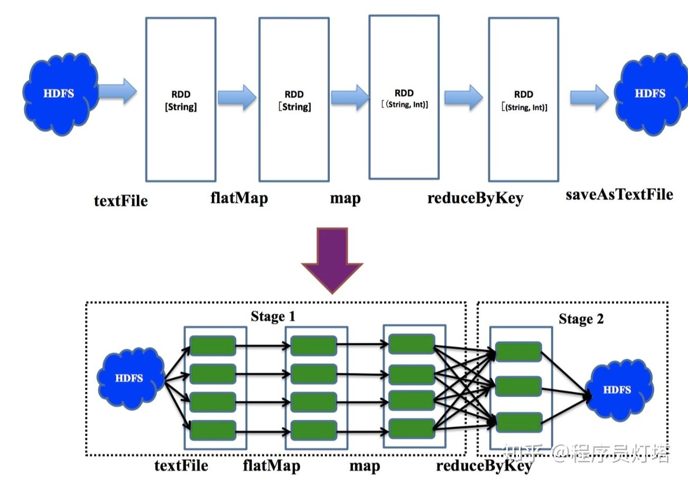



上图上半部分展示了各级算子值键的依赖关系(逻辑查询计划)
下半部分的每个绿块代表一个partition的数据,多个partition值键并行计算, 遇到会产生`shuffle`的`reduceByKey`操作时划分stage.

窄依赖：指父RDD的每个分区只被子RDD的一个分区所使用，子RDD分区通常对应常数个父RDD分区
宽依赖：是指父RDD的每个分区都可能被多个子RDD分区所使用，子RDD分区通常对应所有的父RDD分区
stage内部是窄依赖,stage间是宽依赖.


#### spark 根据rdd划分stage的源码说明

每个rdd都有一个deps属性, 用来保存当前rdd依赖的rdd, 以及依赖的类型(宽依赖, 窄依赖), 

一个rdd依赖可以是多个, 因为例如cogroup这样的操作是有多个rdd依赖的. 

**每个dependency对象中都包含了当前rdd依赖的上一个rdd, 这样就会变成rdd中包含dependency, dependency中又包含rdd, 最终会一直递归到最初始的那个没有依赖的rdd**

该deps属性需要在创建rdd的时候传入

dependency的类型有ShuffleDependency和NarrowDependency(子类OnceToOnceDependency) 两种类型

调用rdd的不同算子方法会生成不同类型的Dependency(列如调用rdd.map方法会生成一个OnceToOnceDependency依赖), **还有些rdd的dependency会被传入nil, 同时重写父类的getDependency方法, 所以需要调用getDependency方法获取具体的依赖**

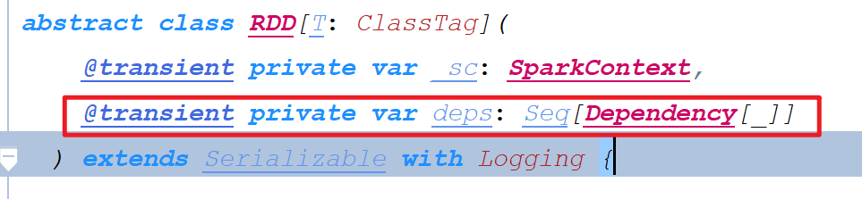

当调用rdd的action算子的时候, 会调用sparkcontext的runJob方法, 并且在其中调用dagScheduler.runJob方法

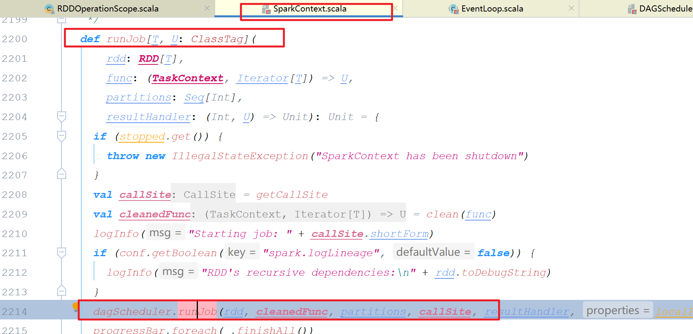

在dagScheduler.runJob方法中会eventProcessLoop中提交一个JobSubmitted的消息, 并且该消息会被eventProcessLoop中的一个线程消费并处理

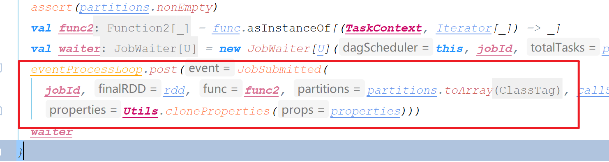

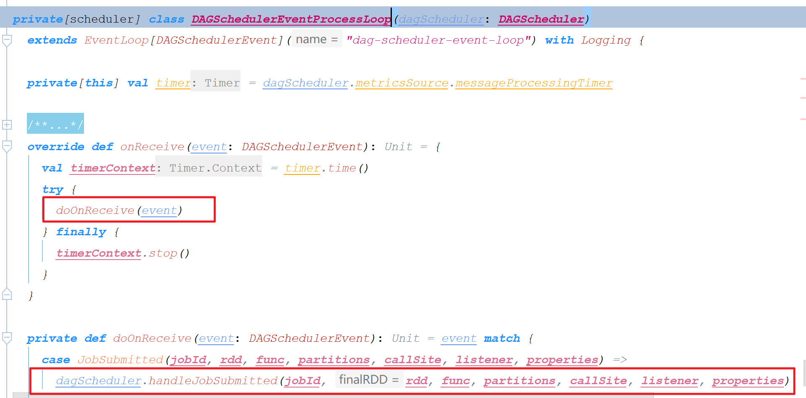

消息消费之后还是嗲用dagScheduler.handlerJobSubmitted方法进行处理, 在该方法中会通过调用action算子的rdd创建一个ResultStage, 在创建ResultStage的时候, 还会根据rdd->dependency -> rdd -> dependency的链路找到当前rdd依赖的上一层的ShuffleDependency, 并根据该ShuffleDependency创建ShuffleMapStage, 同时在创建ShuffleMapStage的时候, 也会根据该ShuffleDependency的rdd去查找他依赖的上一层的ShuffleDependency, 这样就在创建ResultStage的时候递归创建了所有ShuffleMapStage

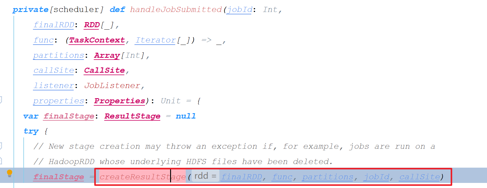

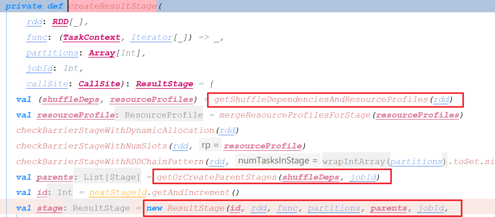

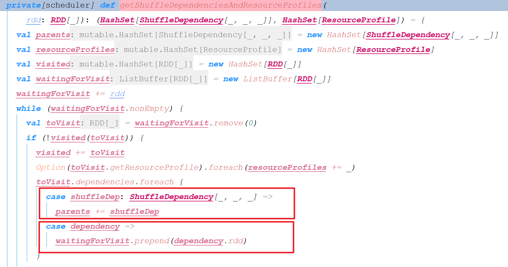

总的来说就是根据调用action的rdd创建一个ResultStage, 在创建ResultStage的时候根据rdd的依赖关系找到ShuffleDependency, 然后创建ShuffleMapStage, 在创建ShuffleMapStage的时候又根据当前rdd的依赖关系找到上层的ShuffleDependency并创建ShuffleMapStage, 直到创建完所有的Stage. 

在创建完ResultStage后, ResultStage中就包含了他依赖的ShuffleMapStage, 而ShuffleMapStage有包含了他所依赖的ShuffleMapStage

#### spark 根据stage转换为task的源码说明

在创建完ResultStage的时候, 会将ResultStage进行提交, 提交ResultStage的时候需要先递归stage依赖的stage找到最开始的stage进行提交

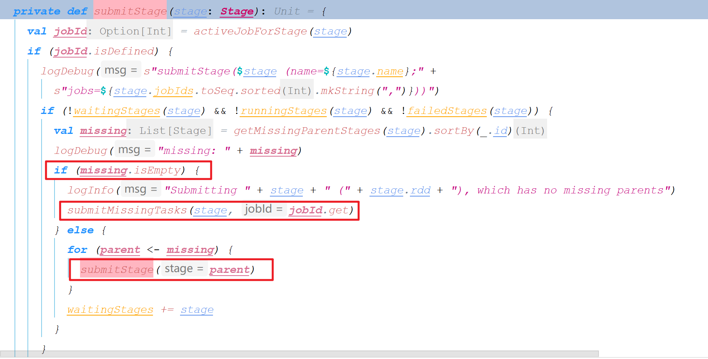

在提交stage的时候, 会调用stage的findMissingPartitions获取该stage有多少个分区, 一般就是rdd的分区个数, 

然后该stage的每个分区转换为一个Task

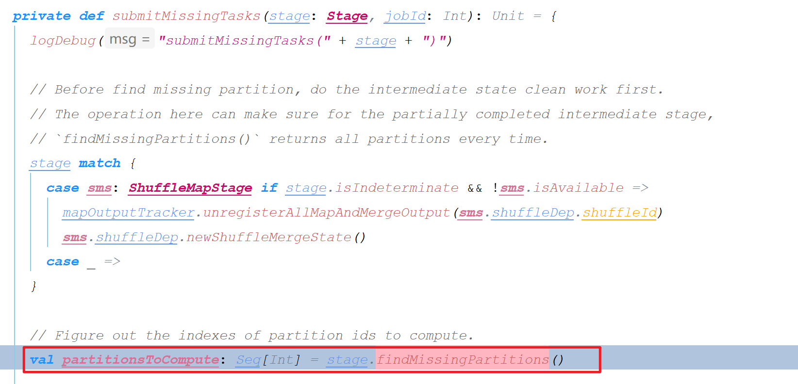

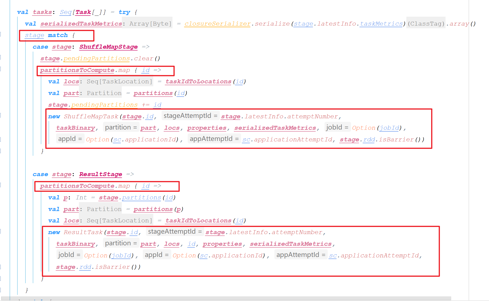


#### spark代码注意事项

```
val sparkConf: SparkConf = new SparkConf()
  .setMaster("local") // 这里别硬编码设置master地址, 应该在提交的时候来指定, 硬编码会导致提交的时候设置无效
  .setAppName("WordCount")
```


### spark executor相关

#### spark executor的分配策略

> yarn模式

通过`spark.executor.memory/--executor-memory`指定每个executor的内存, 默认为1g

通过`spark.executor.cores/--executor-cores`来指定每个executor占用的core

通过`spark.executor.instances/--num-executors`来指定executor的数量

> standlone模式

通过`spark.executor.memory/--executor-memory`指定每个executor的内存, 默认为1g

通过`spark.executor.cores/--executor-cores`来指定每个executor占用的core

通过`spark.cores.max/--total-executor-cores`来指定每个application总共可以占用的最大core数量


#### spark standone下 executor的分配策略源码解析

driver在创建sparkContext的时候, 将会使用调用StandaloneAppClient.DriverClient#onStart()方法向Master进行注册, Master将会在org.apache.spark.deploy.master.Master#receive()方法中接收到来自driver的注册

~~~scala
override def receive: PartialFunction[Any, Unit] = {
    // driver注册application
    case RegisterApplication(description, driver) =>
      // 如果当前master是standby, 忽略掉来自driver的注册请求
      if (state == RecoveryState.STANDBY) {
        // ignore, don't send response
      } else {
        logInfo("Registering app " + description.name)
        val app = createApplication(description, driver)
          // 保存Application的相关信息
        registerApplication(app)
        logInfo("Registered app " + description.name + " with ID " + app.id)
          // 持久化application的相关信息, 用以容错
        persistenceEngine.addApplication(app)
          // 向driver回复消息
        driver.send(RegisteredApplication(app.id, self))
          // 进行资源的调度
        schedule()
      }
    // ... 
  }
~~~

schedule方法的作用主要有两个:

(1) 对于waitingDrivers数组中的 等待创建的Driver , 将其发送到满足运行条件的 Worker 上运行；
(2) 在满足条件的 Worker 结点上为 Application启动 Executor。 

```scala
private def schedule(): Unit = {
  // Master状态不为Alive直接返回
    if (state != RecoveryState.ALIVE) {
      return
    }
    //随机打乱works，防止在同一个works上启动太多的app，与此同时过滤出Alive状态的works
    val shuffledAliveWorkers = Random.shuffle(workers.toSeq.filter(_.state == WorkerState.ALIVE))
    val numWorkersAlive = shuffledAliveWorkers.size
    /**
        轮询查找所有alive的worker, 直到找到一个可以启动driver的worker为止
        下一个需要启动的driver接着上次启动driver的worker继续轮询
        */
    // 用以保存当前轮询到的worker的下标
    var curPos = 0
    for (driver <- waitingDrivers.toList) { 
     
      var launched = false
      var isClusterIdle = true
      var numWorkersVisited = 0
      while (numWorkersVisited < numWorkersAlive && !launched) {//遍历所有的work，直到driver启动
        val worker = shuffledAliveWorkers(curPos)
        //该work上没有启动driver和executor
        isClusterIdle = worker.drivers.isEmpty && worker.executors.isEmpty
        numWorkersVisited += 1
        //判断当前work资源能否启动该driver
        if (canLaunchDriver(worker, driver.desc)) {
          //向该work请求driver启动需要的资源
          val allocated = worker.acquireResources(driver.desc.resourceReqs)
          //给driver分配申请好的资源
          driver.withResources(allocated)
          //启动driver
          launchDriver(worker, driver)
          //从等待队列中删除该driver
          waitingDrivers -= driver
          //标识启动成功
          launched = true
        }
        //更新下标，如同一个循环列表
        curPos = (curPos + 1) % numWorkersAlive
      }
      if (!launched && isClusterIdle) {
        logWarning(s"Driver ${driver.id} requires more resource than any of Workers could have.")
      }
    }
    // 为application在Worker上启动Excutor
  startExecutorsOnWorkers()
}
```


```scala
private def startExecutorsOnWorkers(): Unit = {
  // 轮询所有需要启动executor的application, 相当于FIFO
  for (app <- waitingApps) {
      // 获取每个executor占用的core数量, 通过spark.executor.cores/--executor-cores进行设置
    val coresPerExecutor = app.desc.coresPerExecutor.getOrElse(1)
    // coresLeft表示当前app剩余需要的core数量, 通过spark.cores.max或者spark.deploy.defaultCores减去已经分配的core数量, spark.deploy.defaultCores这个值默认为Int.Max
      // 如果剩余需要的core小于spark.executor.cores将不会启动executor, 比如设置spark.cores.max=8, spark.executor.cores=3, 那么将会启动两个executor,每个executor占用3个core
    if (app.coresLeft >= coresPerExecutor) {
      // 过滤掉所有没有足够资源启动executor的worker, 即worker上的可用的cpu和内存小于spark.executor.cores和spark.executor.memory
      val usableWorkers = workers.toArray.filter(_.state == WorkerState.ALIVE)
        .filter(canLaunchExecutor(_, app.desc))
        .sortBy(_.coresFree).reverse
      val appMayHang = waitingApps.length == 1 &&
        waitingApps.head.executors.isEmpty && usableWorkers.isEmpty
      if (appMayHang) {
        logWarning(s"App ${app.id} requires more resource than any of Workers could have.")
      }
        // 计算当前application在每个worker上总共分配的core数量(可能在一个worker上面启动多个executor), 返回一个数组, 与usableWorkers数组相对应
        // spreadOutApps这个参数表示不同的executor分配策略, true表示尽可能在多个worker上启动executor, 即executor均匀分散在worker上, fasle表示在尽可能少的worker上启动executor, 即executor集中在少数几台worker上. 默认为true, executor尽可能分散有利于spark计算数据的本地化
      val assignedCores = scheduleExecutorsOnWorkers(app, usableWorkers, spreadOutApps)
        
      // 计算出具体在每个worker启动的executor数量, 并启动
      for (pos <- 0 until usableWorkers.length if assignedCores(pos) > 0) {
        allocateWorkerResourceToExecutors(
          app, assignedCores(pos), app.desc.coresPerExecutor, usableWorkers(pos))
      }
    }
  }
}

private def scheduleExecutorsOnWorkers(
      app: ApplicationInfo,
      usableWorkers: Array[WorkerInfo],
      spreadOutApps: Boolean): Array[Int] = {
    // 获取指定的spark.executor.cores, 如果不指定的话为None
    val coresPerExecutor = app.desc.coresPerExecutor
    // 每个executor需要的最小core数量
    val minCoresPerExecutor = coresPerExecutor.getOrElse(1)
    // 如果不指定spark.executor.cores的话, 只会在一个worker上启动一个executor, 这个executor占用所有分配的core. 这个如果指定了的话, 可以在一个worker启动多个executor, 每个executor占用spark.executor.cores数量的core
    val oneExecutorPerWorker = coresPerExecutor.isEmpty
    // 获取指定的spark.executor.memory, 如果不指定的话这里默认为1024m
    val memoryPerExecutor = app.desc.memoryPerExecutorMB
    // application需要的除cpu和内存外的其他资源, 这里可以忽略这个
    val resourceReqsPerExecutor = app.desc.resourceReqsPerExecutor
    // 可用worker的数量
    val numUsable = usableWorkers.length
    // 用以保存每个worker上已经分配给application的core数量
    val assignedCores = new Array[Int](numUsable) 
    // 用以保存每个worker上一个分配给application的executor数量
    val assignedExecutors = new Array[Int](numUsable) 
    // 当前application需要分配的core数量, 在app.coresLeft和所有可用的core中去最小值, 这里可以看出spark是想application占用所有资源
    var coresToAssign = math.min(app.coresLeft, usableWorkers.map(_.coresFree).sum)

    // 判断是否可以分配executor
    def canLaunchExecutorForApp(pos: Int): Boolean = {
        // 当前application剩余需要占用的core是否大于minCoresPerExecutor
      val keepScheduling = coresToAssign >= minCoresPerExecutor
        // 当前worker上可用的core减去已经分配出去的core是否大于minCoresPerExecutor
      val enoughCores = usableWorkers(pos).coresFree - assignedCores(pos) >= minCoresPerExecutor
      val assignedExecutorNum = assignedExecutors(pos)

      // 判断是否可以在该worker上启动一个新的executor, 可以启动的条件是已经启动的executor为0或者在该worker上可以启动多个worker
      val launchingNewExecutor = !oneExecutorPerWorker || assignedExecutorNum == 0
      if (launchingNewExecutor) {
          // 判断该worker是否有足够资源启动一个新的executor
        val assignedMemory = assignedExecutorNum * memoryPerExecutor
        val enoughMemory = usableWorkers(pos).memoryFree - assignedMemory >= memoryPerExecutor
        val assignedResources = resourceReqsPerExecutor.map {
          req => req.resourceName -> req.amount * assignedExecutorNum
        }.toMap
        val resourcesFree = usableWorkers(pos).resourcesAmountFree.map {
          case (rName, free) => rName -> (free - assignedResources.getOrElse(rName, 0))
        }
        val enoughResources = ResourceUtils.resourcesMeetRequirements(
          resourcesFree, resourceReqsPerExecutor)
        val underLimit = assignedExecutors.sum + app.executors.size < app.executorLimit
        keepScheduling && enoughCores && enoughMemory && enoughResources && underLimit
      } else {
        // We're adding cores to an existing executor, so no need
        // to check memory and executor limits
        keepScheduling && enoughCores
      }
    }
    // Keep launching executors until no more workers can accommodate any
    // more executors, or if we have reached this application's limits
    // 通过canLaunchExecutorForApp过滤出所有资源足够的executor
    var freeWorkers = (0 until numUsable).filter(canLaunchExecutorForApp)
    while (freeWorkers.nonEmpty) {
      freeWorkers.foreach { pos =>
        var keepScheduling = true
        while (keepScheduling && canLaunchExecutorForApp(pos)) {
            // 需要分配的core数量减去minCoresPerExecutor
          coresToAssign -= minCoresPerExecutor
            // 对应worker上的占用的core加minCoresPerExecutor
          assignedCores(pos) += minCoresPerExecutor

          if (oneExecutorPerWorker) {
              // 如果在一个worker上只能启动一个worker, 将对应worker上的executor数量设置为1
            assignedExecutors(pos) = 1
          } else {
              // 对应的worker上的executor数量+1
            assignedExecutors(pos) += 1
          }

          // Spreading out an application means spreading out its executors across as
          // many workers as possible. If we are not spreading out, then we should keep
          // scheduling executors on this worker until we use all of its resources.
          // Otherwise, just move on to the next worker.
            // 如果为true,表示executor尽可能均匀分散在worker上, 所以这个时候keepScheduling = false, 轮询到下一个worker上判断释放有足够资源
            // 如果为false表示executor尽可能集中在worker上, 这个时候keepScheduling = true, 一直在当前worker上判断是否有足够资源启动executor直到资源不足
          if (spreadOutApps) {
            keepScheduling = false
          }
        }
      }
      // 进行一轮资源分配后, 可能有些worker资源不足够下一轮资源分配了, 所以需要进行再次过滤
      freeWorkers = freeWorkers.filter(canLaunchExecutorForApp)
    }
    // 返回在每个worker上分配的core数量
    assignedCores
  }

private def allocateWorkerResourceToExecutors(
      app: ApplicationInfo,
      assignedCores: Int,
      coresPerExecutor: Option[Int],
      worker: WorkerInfo): Unit = {
    // 如果指定了spark.executor.cores, 那么每个executor的core就是spark.executor.cores, executor的数量就是分配的core除以spark.executor.cores
    // 如果没有指定的话, 那么executor的数量就是1, 该executor占用全部分配的executor
    val numExecutors = coresPerExecutor.map { assignedCores / _ }.getOrElse(1)
    val coresToAssign = coresPerExecutor.getOrElse(assignedCores)
    for (i <- 1 to numExecutors) {
      val allocated = worker.acquireResources(app.desc.resourceReqsPerExecutor)
      val exec = app.addExecutor(worker, coresToAssign, allocated)
      launchExecutor(worker, exec)
      app.state = ApplicationState.RUNNING
    }
  }

private def launchExecutor(worker: WorkerInfo, exec: ExecutorDesc): Unit = {
    logInfo("Launching executor " + exec.fullId + " on worker " + worker.id)
    worker.addExecutor(exec)
    // 向worker发送LaunchExecutor的消息
    worker.endpoint.send(LaunchExecutor(masterUrl, exec.application.id, exec.id,
      exec.application.desc, exec.cores, exec.memory, exec.resources))
    exec.application.driver.send(
      ExecutorAdded(exec.id, worker.id, worker.hostPort, exec.cores, exec.memory))
  }
```

master发送启动executor的消息给worker后, worker将在org.apache.spark.deploy.worker.Worker#receive方法中接收到消息并启动executor


