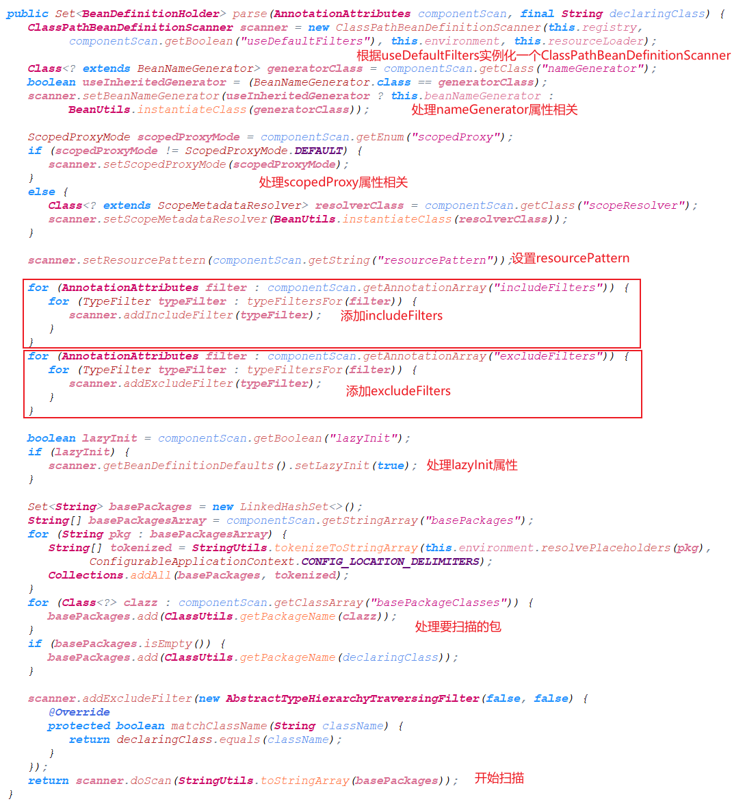
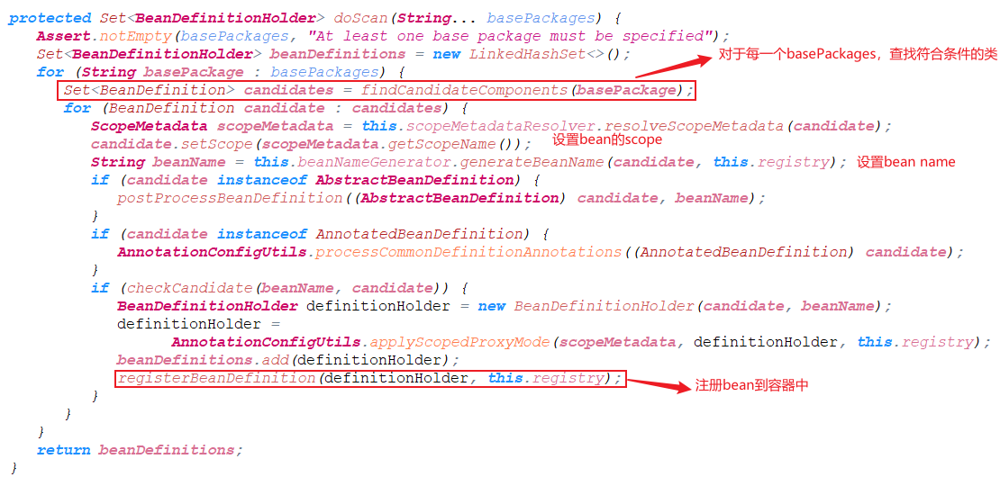
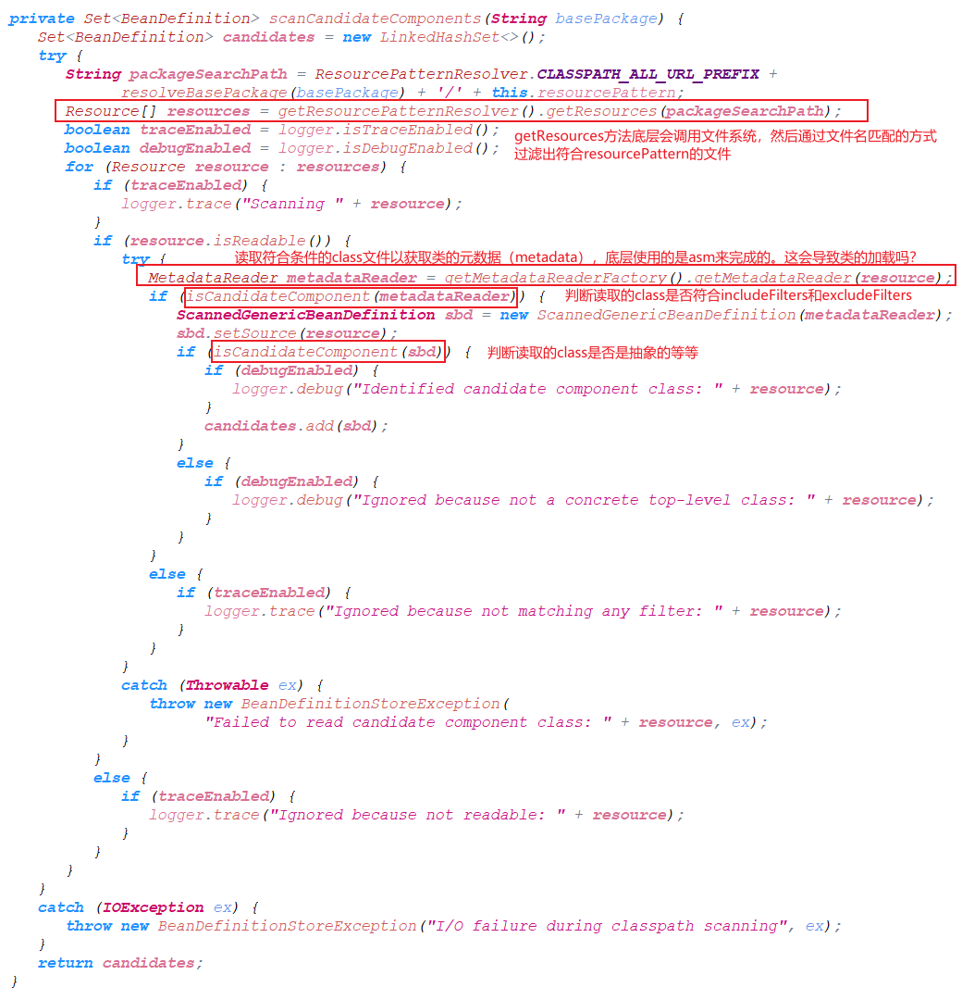
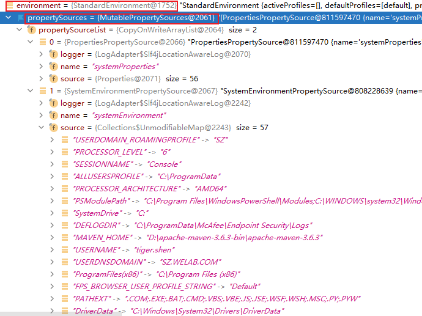
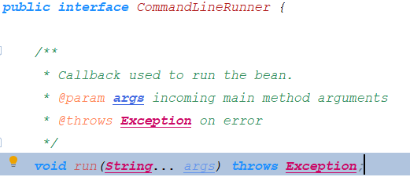
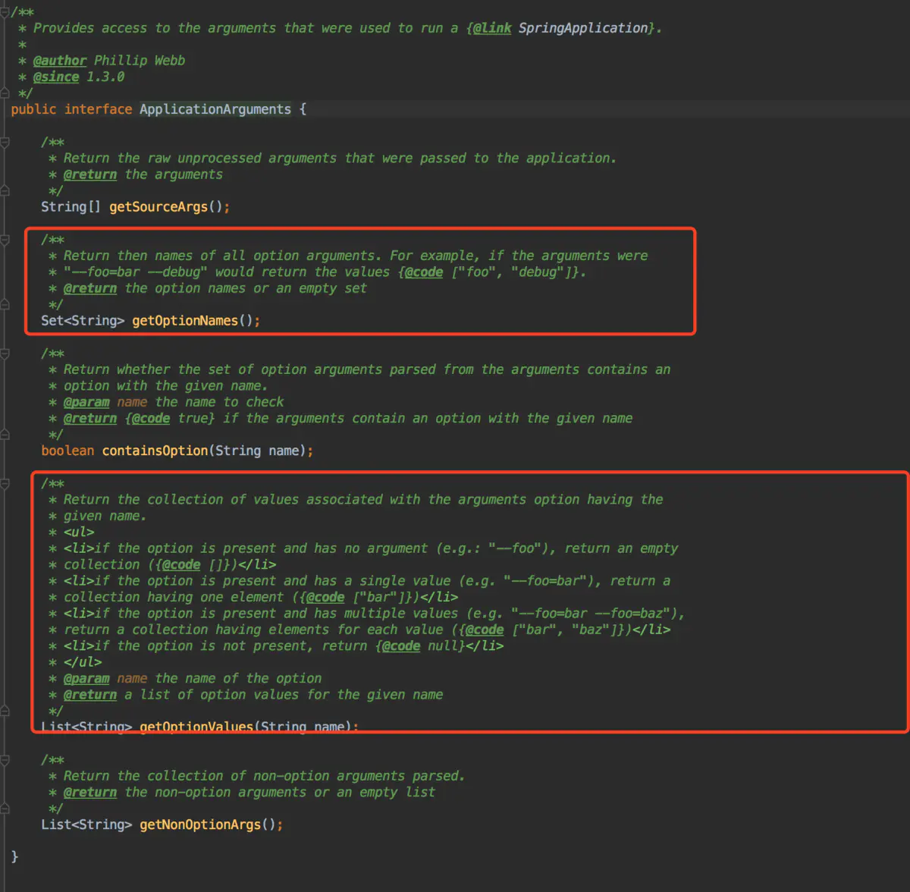

# Spring

## IOC

### Bean的生命周期

1. bean的无参构造
2. 自动注入bean的属性
3. 将bean传入BeanPostProcessor的postProcessBeforeInitialization方法中
4. Bean的@PostConstruct方法
5. 如果bean实现了InitializingBean, 调用afterPropertiesSet()
6. 将bean传入BeanPostProcessor的postProcessAfterInitialization方法中
7. bean就绪
8. bean的@PreDestory方法  
9. 如果实现了DisposableBean, 那么会调用destory() / 如果实现了AutoCloseable接口, 会调用close方法  / 如果实现了ApplicationListener<ContextClosedEvent\>接口, 调用onApplicationEvent()方法
10. IOC容器关闭

### @Autowired和 @Resource

@AutoWired:

1. 按照type找
2. 如果有多个bean, 按照name进行匹配
   1. 如果有@Qualifier, 按照@Qualifier指定的name找
   2. 如果没有@Qualifier, 按照变量名进行匹配
3. 如果还找不到, 根据@Autowired(required=false/true), 来判断是否报错, 默认为true

@Resource:

Resource有两个属性String name, Class type

1. 如果指定了name, 根据name匹配, 如果没有根据变量名匹配
2. 如果找不到时, 按照Class进行匹配


### BeanPostProcessor接口

~~~java
public interface BeanPostProcessor {
    @Nullable
    default Object postProcessBeforeInitialization(Object bean, String beanName) throws BeansException {
        return bean;
    };
    @Nullable
    default Object postProcessAfterInitialization(Object bean, String beanName) throws BeansException {
        return bean;
    }
}
~~~

这个接口的主要功能有:

1. 对class上有特定注释的bean做代理, 比如@Async, @Validated, @Transactional都是使用这个注解来实现功能的
2. 对一些特定接口的bean做一些属性的注入
   - ApplicationContextAwareProcessor: 对实现了EnvironmentAware, EmbeddedValueResolverAware, ResourceLoaderAware, ApplicationEventPublisherAware, MessageSourceAware, ApplicationContextAware这些接口的bean进入注入
   - InitDestroyAnnotationBeanPostProcessor: 在bean销毁前调用@PreDestory注解的方法, 在bean初始化时调用@PostConstruct注解的方法

下面是一些主要的可以使用的子类:

1. InstantiationAwareBeanPostProcessor


### InitializingBean接口和DisposableBean

afterPropertiesSet方法在@PostConstruct注解的方法调用后执行, 其效果和@PostConstruct差不多

destroy方法在@PreDestory注解的方法调用后执行, 其效果和@PreDestory差不多


但是@PostConstruct和@PreDestory方法是给普通的bean使用的, 让他们能够进行初始化

InitializingBean和DisposableBean通常会用在BeanPostProcessor中, 因为涉及到BeanPostProcessor, 如果功能复杂的话, 会涉及到多层父子关系

使用InitializingBean的话, afterPropertiesSet可以被重写, 在重写的方法里调用super.afterPropertiesSet, 这样所以父子类都可以在这个方法中做一些初始化

~~~java
public interface InitializingBean {
	void afterPropertiesSet() throws Exception;
}
public interface DisposableBean {
	void destroy() throws Exception;
}
~~~


### Scope和自定义Scope

#### 内置的Scope

在spring中, 有内置了两种scope

1. singleton

   整个spring容器中只会存在一个bean实例，通过容器多次查找bean的时候（调用BeanFactory的getBean方法或者bean之间注入依赖的bean对象的时候），返回的都是同一个bean对象，singleton是scope的默认值

2. prototype

   如果scope被设置为prototype类型的了，通过容器多次查找bean的时候（调用BeanFactory的getBean方法或者bean之间注入依赖的bean对象的时候），每次获取都会重新创建一个bean实例对象。

在spring mvc环境中, 新增了三个scope, 分别是

1. request

   表示在一次http请求中，一个bean对应一个实例；对每个http请求都会创建一个bean实例，request结束的时候，这个bean也就结束了

2. session

   这个和request类似，也是用在web环境中，session级别共享的bean，每个会话会对应一个bean实例，不同的session对应不同的bean实例

3. application

   每个ServletContext下, 每个bean是单独的


#### 自定义Scope

自定义Scope有如下几个步骤:

1. 实现Scope接口
2. 实现BeanFactoryPostProcessor接口, 并在postProcessBeanFactory方法中添加Scope
3. 将BeanFactoryPostProcessor注入到ioc容器中

下面我们自己来实现下每个线程下的bean是单例的, 不同线程获取到的bean不同

~~~java
public class SimpleThreadScope implements Scope {

	private static final Log logger = LogFactory.getLog(SimpleThreadScope.class);

	private final ThreadLocal<Map<String, Object>> threadScope =
			new NamedThreadLocal<Map<String, Object>>("SimpleThreadScope") {
				@Override
				protected Map<String, Object> initialValue() {
					return new HashMap<>();
				}
			};


	@Override
	public Object get(String name, ObjectFactory<?> objectFactory) {
        // 冲ThreadLocal中拿
        // 如果拿不到就通过objectFactory来创建bean
        // 并将新建的bean放入到objectFactory
		Map<String, Object> scope = this.threadScope.get();
		Object scopedObject = scope.get(name);
		if (scopedObject == null) {
			scopedObject = objectFactory.getObject();
			scope.put(name, scopedObject);
		}
		return scopedObject;
	}

	@Override
	@Nullable
	public Object remove(String name) {
		Map<String, Object> scope = this.threadScope.get();
		return scope.remove(name);
	}

	@Override
	public void registerDestructionCallback(String name, Runnable callback) {
		logger.warn("SimpleThreadScope does not support destruction callbacks. " +
				"Consider using RequestScope in a web environment.");
	}

	@Override
	@Nullable
	public Object resolveContextualObject(String key) {
		return null;
	}

	@Override
	public String getConversationId() {
		return Thread.currentThread().getName();
	}
}
~~~

~~~java
@Configuration
public class ScopeConfig {

    @Bean
    public BeanFactoryPostProcessor scopeBeanFactoryPostProcessor() {
        return new BeanFactoryPostProcessor() {
            @Override
            public void postProcessBeanFactory(ConfigurableListableBeanFactory beanFactory) throws BeansException {
                // 添加scope, 名字为thread
                beanFactory.registerScope("thread", new SimpleThreadScope());
            }
        };
    }
}
~~~

```java
@Component
@Scope(value = "thread") // 指定scope
public class UserBean  {
    public void say() {
        System.out.println(this)
    }
}
```

~~~java
@SpringBootApplication
public class MvcApplication {

    public static void main(String[] args) {
        ConfigurableApplicationContext context = SpringApplication.run(MvcApplication.class, args);
        context.getBean(UserBean.class).say();
        new Thread(() -> {
            context.getBean(UserBean.class).say();
        }).start();
    }

}
~~~

**Spring会在每次getBean(), 或者是需要依赖注入的时候, 都会判断bean的scope是什么类型**

<font color=red>如果是singleton, 那么会直接从singletonObjects, 即一级缓存中中获取</font>

<font color=red>如果是prototype, 那么直接创建bean并返回</font>

<font color=red>如果是自定义scope, 那么就获取对应的scope实例, 然后调用他的get方法</font>


这样我们在不同线程中, 调用context.getBean()获取到的UserBean就是不同的了


#### Scope的proxyMode属性

在@Scope注解上还有一个属性proxyMode, 用于指定bean是否应该进行代理

可选值有: DEFAULT, NO, INTERFACES, TARGET_CLASS

~~~java
public @interface Scope {
    
	@AliasFor("scopeName")
	String value() default "";
    
	@AliasFor("value")
	String scopeName() default "";
	ScopedProxyMode proxyMode() default ScopedProxyMode.DEFAULT;
}
~~~

DEFAULT/NO: 两个的效果是一样的, 不对bean进行代理, 也是最常用的

INTERFACES: 对bean使用jdk动态代理 进行代理

TARGET_CLASS: 对bean使用cglib进行代理


那么这几个属性设置和不设置分别有什么不同呢? 我们显然看看以下的几个场景对TARGET_CLASS和INTERFACES的应用:

1. https://blog.csdn.net/qq_32077121/article/details/107805007

   对于购物场景, 我们希望有一个bean代表购物车

   如果购物车是**单例**，那么将会导致所有的用户都往一个购物车中添加商品。
   如果购物车是**原型**作用域的，那么在应用中某个地方往购物车中添加商品，然后到应用中的另外一个地方可能就没法使用了，因为在这里被注入了另外一个原型作用域的的购物车。

   购物车bean而言，**Session**作用域是最合适的，因为他与给定用户的关联性最大。

   ```less
   @Component
   @Scope(value = WebApplicationContext.SCOPE_SESSION)
   public class ShippingCart {
       	//todo: dosomething
   }
   @Component
   public class StoreService {
       @Autowired private ShippingCart shippingCart;
   }
   ```

   这里我们将value设置成了`WebApplicationContext.SCOPE_SESSION`常量。这会告诉Spring 为Web应用的每个会话创建一个`ShippingCart`。

   此时就会遇到问题:

   - 因为`StoreService` 是个**单例**bean，会在Spring应用上下文加载的时候创建。当它创建的时候，Spring会试图将`ShippingCart bean`注入到`setShoppingCart()`方法中。但是`ShippingCart bean`是会话作用域，此时并不存在。直到用户进入系统创建会话后才会出现`ShippingCart`实例。
   - 系统中会有多个`ShippingCart` 实例，每个用户一个。我们并不希望注入固定的`ShippingCart`实例，而是希望当`StoreService` 处理购物车时，它所使用的是当前会话的`ShippingCart`实例。

   此时, 我们可以在@Scope上添加`proxyMode =ScopedProxyMode.INTERFACES`

   ~~~java
   @Component
   @Scope(value = WebApplicationContext.SCOPE_SESSION, 
       	proxyMode =ScopedProxyMode.INTERFACES)
   public class ShippingCart {
       	//todo: dosomething
   }
   ~~~

   **设置了proxyMode后, Spring将会为所有的ShippingCart类型的bean产生一个共用的代理对象, 然后在依赖注入和getBean的时候, 返回该代理对象**

   所以, Spring并不会将实际的`ShippingCart bean`注入到`StoreService`，Spring只会注入`ShippingCart bean`的代理。这个代理会暴露与`ShippingCart`相同的方法，所以`StoreService`会认为它就是一个购物车。但是，当`StoreService`调用`ShippingCart`的方法时，代理会对其进行懒解析并将调用委任给会话作用域内真正的`ShippingCart bean`。

   在上面的配置中，`proxyMode`属性，被设置成了`ScopedProxyMode.INTERFACES`，这表明这个代理要使用JDK动态代理的方式去实现`ShippingCart`接口，并将调用委托给实现bean。
   但如果`ShippingCart`是一个具体的类而不是接口的话，Spring就没法创建基于接口的代理了。此时，它必须使用CGLib来生成基于类的代理。所以，如果bean类型是具体类的话我们必须要将`proxyMode`属性，设置成`ScopedProxyMode.TARGET_CLASS`，以此来表明要以生成目标类扩展的方式创建代理。
   **request作用域的bean应该也以作用域代理的方式进行注入。**

2. 对于我们自定义的SimpleThreadScope, 虽然我们已经能够在不同线程中通过getBean来获取到不同的Bean

   ~~~java
   public static void main(String[] args) {
           ConfigurableApplicationContext context = SpringApplication.run(MvcApplication.class, args);
           context.getBean(UserBean.class).say();
           new Thread(() -> {
               context.getBean(UserBean.class).say();
           }).start();
       }
   ~~~

   但是如果我们将UserBean注入到其他的Bean中的时候, 我们实际上注入的是注入时的线程的对应的bean, 而不是我们使用userBean时对应线程对应的bean

   ~~~java
   @Component
   public class UserService {
       @Autowired private UserBean userBean;
   }
   ~~~

   此时我们就可以给@Scope添加上proxyMode属性

   ~~~java
   @Component
   @Scope(value = "thread", proxyMode =ScopedProxyMode.TARGET_CLASS) // 指定scope
   public class UserBean  {
       public void say() {
           System.out.println(this)
       }
   }
   ~~~

   此时spring将会为我们的UserBean类型的bean通过cglib产生一个共用的代理对象, 然后在调用getBean和依赖注入时, 都返回该代理

   **当我们使用userBean的时候, 其实使用的是代理, 当我们调用userBean的对应方法的时候, 代理会调用SimpleThreadScope的get方法来获取对应的bean来执行对应的逻辑, 而在SimpleThreadScope的get方法中, 会根据当前的线程来返回对应的bean从而执行对应的逻辑** 

   所以此时我们在不同线程中使用userBean, 实际上使用的是不同线程中的userBean

### SpringCloud中@RefreshScope的原理

https://mp.weixin.qq.com/s?__biz=MzA5MTkxMDQ4MQ==&mid=2648934401&idx=1&sn=98e726ec9adda6d40663f624705ba2e4&chksm=8862103fbf15992981183abef03b4774ab1dfd990a203a183efb8d118455ee4b477dc6cba50d&token=636643900&lang=zh_CN&scene=21#wechat_redirect

   在springcloud环境中, 我们的从配置中心读取到配置, 然后注入到Environment中, 然后再将配置赋值到有@Value注解的字段上, 但是当配置中心的配置有修改之后, 我们如何修改后的配置重新赋值到具有@Value注解的字段上呢

   我们同样可以使用@Scope注解的proxyMode属性, 针对具有@Value注解的字段的bean, 对他进行代理

   这样不管是getBean还是依赖注入, 使用的都是代理, 当我们调用代理的方法的时候, spring会通过Scope的get方法来获取具体的bean来执行对应的逻辑, 此时我们可以生成一个bean, 并根据当前的配置为@Value注解的字段赋值, 并将其放到缓存中.

   只要配置不变, 我们就一直返回缓存中的bean , 只要配置有变动, 我们就清除缓存中的bean, 这样下次我们调用方法的时候, 又会根据当前配置生成一个bean

   具体做法如下:

   1. 自定义一个Scope

      ~~~java
      public class BeanRefreshScope implements Scope {
      
          public static final String SCOPE_REFRESH = "refresh";
      
          private static final BeanRefreshScope INSTANCE = new BeanRefreshScope();
      
          //来个map用来缓存bean
          private ConcurrentHashMap<String, Object> beanMap = new ConcurrentHashMap<>(); //@1
      
          private BeanRefreshScope() { }
      
          public static BeanRefreshScope getInstance() {
              return INSTANCE;
          }
      
          // 清理当前缓存
          public static void clean() {
              INSTANCE.beanMap.clear();
          }
      
          @Override
          public Object get(String name, ObjectFactory<?> objectFactory) {
              Object bean = beanMap.get(name);
              if (bean == null) {
                  bean = objectFactory.getObject();
                  beanMap.put(name, bean);
              }
              return bean;
          }
      }
      ~~~

   2. 注册一个BeanFactoryPostProcessor, 用来支持当前的scope

      ~~~java
      @Configuration
      public class ScopeConfig {
      
          @Bean
          public BeanFactoryPostProcessor scopeBeanFactoryPostProcessor() {
              return new BeanFactoryPostProcessor() {
                  @Override
                  public void postProcessBeanFactory(ConfigurableListableBeanFactory beanFactory) throws BeansException {
       beanFactory.registerScope(BeanRefreshScope.SCOPE_REFRESH, BeanRefreshScope.getInstance());
                  }
              };
          }
      }
      ~~~

   3. 定义一个注解, 来表示bean需要使用我们自定义的Scope

      ~~~java
      @Target({ElementType.TYPE, ElementType.METHOD})
      @Retention(RetentionPolicy.RUNTIME)
      //// 指定scope, 必须指定proxyMode
      @Scope(BeanRefreshScope.SCOPE_REFRESH, proxyMode = ScopedProxyMode.TARGET_CLASS) 
      @Documented
      public @interface RefreshScope {
          @AliasFor(annotation = Scope.class, attribute = "scopeName")
          ScopedProxyMode proxyMode() default ScopedProxyMode.TARGET_CLASS; // 指定proxyMode
      }
      ~~~

   4. 编写一个工具类, 当配置变更的时候, 清除我们Scope中的缓存

      ~~~java
      public class RefreshConfigUtil {
          /**
           * 模拟改变数据库中都配置信息
           */
          public static void updateDbConfig(AbstractApplicationContext context) {
              // 模拟配置变更
              refreshMailPropertySource(context);
              //清空BeanRefreshScope中所有bean的缓存
              BeanRefreshScope.getInstance().clean();
          }
      
          public static void refreshMailPropertySource(AbstractApplicationContext context) {
              Map<String, Object> mailInfoFromDb =  new HashMap<>();
              result.put("mail.username", UUID.randomUUID().toString());
              
              //将其丢在MapPropertySource中（MapPropertySource类是spring提供的一个类，是PropertySource的子类）
              MapPropertySource mailPropertySource = new MapPropertySource("mail", mailInfoFromDb);
              context.getEnvironment().getPropertySources().addFirst(mailPropertySource);
          }
      }
      ~~~

      当我们进行配置变更的时候, BeanRefreshScope.getInstance().clean()用来清除BeanRefreshScope中所有已经缓存的bean

      那么当我们从controller中调用service的时候, 应为我们设置了`@Scope(proxyMode = ScopedProxyMode.TARGET_CLASS)`, 所以这个service是代理类, 他会从scope中去获得实际上要执行的被代理类service
      
      这个时候应为我们已经删除掉了老的被代理类, 所以这个时候会新建一个bean来作为被代理类
      
      spring容器重新创建bean的时候，会重新解析@Value的信息，此时容器中的邮件配置信息是新的，所以@Value注入的信息也是新的。
      
      这也是springcloud中@RefreshScope的原理


### @Import注释

https://mp.weixin.qq.com/s?__biz=MzA5MTkxMDQ4MQ==&mid=2648934173&idx=1&sn=60bb7d58fd408db985a785bfed6e1eb2&chksm=88621f23bf15963589f06b7ce4e521a7c8d615b1675788f383cbb0bcbb05b117365327e1941a&token=704646761&lang=zh_CN&scene=21#wechat_redirect

**@Import可以用来批量导入需要注册的各种类，如普通的类、配置类，完后完成普通类和配置类中所有bean的注册。**

**@Import注解是被下面这个类处理的**

```
org.springframework.context.annotation.ConfigurationClassPostProcessor
```

前面介绍的@Configuration、@Bean、@CompontentScan、@CompontentScans都是被这个类处理的，这个类是高手必经之路，建议花点时间研究研究。


@Import源码如下:

~~~java
@Target(ElementType.TYPE)
@Retention(RetentionPolicy.RUNTIME)
@Documented
public @interface Import {

    /**
     * {@link Configuration @Configuration}, {@link ImportSelector},
     * {@link ImportBeanDefinitionRegistrar}, or regular component classes to import.
     */
    Class<?>[] value();
}
~~~

@Import中value常见的五种用法:

1. **value为普通的类**

   将指定的类注册成bean

   ~~~java
   public class Service1 {} 
   
   @Import({Service1.class})
   public class MainConfig1 {} // Service1被注册为bean
   ~~~

2. **value为@Configuration标注的类**

   将指定的类注册为bean, 并扫描其上的注解

   ~~~java
   @Configuration
   public class ConfigModule1 {
       @Bean
       public String module1() {
           return "我是模块1配置类！";
       }
   }
   
   @Import({ConfigModule1.class}) // ConfigModule1和module1注册为bean
   public class MainConfig2 {}
   ~~~

   

3. **value为@CompontentScan标注的类**

   使ComponentScan生效

   ~~~java
   @ComponentScan
   public class CompontentScanModule1 {}
   
   @Component
   public class Module1Service2 {}
   
   @Import({CompontentScanModule1.class}) // 使ComponentScan生效
   public class MainConfig3 {}
   ~~~

   

4. **value为ImportBeanDefinitionRegistrar接口类型**

   ImportBeanDefinitionRegistrar源码如下

   ~~~java
   public interface ImportBeanDefinitionRegistrar {
       /**
       AnnotationMetadata: 可以通过这个类型来获取被@Import标注的类的所有信息
       BeanDefinitionRegistry: 可以使用他来注册, 移除, 获取, 修改beanDefinition
       BeanNameGenerator: 给定的beanDefinition, 生成一个bean name
       */
       default void registerBeanDefinitions(AnnotationMetadata importingClassMetadata, BeanDefinitionRegistry registry, BeanNameGenerator importBeanNameGenerator) {
           registerBeanDefinitions(importingClassMetadata, registry);
       }
   
       default void registerBeanDefinitions(AnnotationMetadata importingClassMetadata, BeanDefinitionRegistry registry) {
       }
   }
   ~~~

   我们来实现我们自己的

   ~~~java
   public class MyImportBeanDefinitionRegistrar implements ImportBeanDefinitionRegistrar {
       @Override
       public void registerBeanDefinitions(AnnotationMetadata importingClassMetadata, BeanDefinitionRegistry registry) {
           // 注册service1
           BeanDefinition service1BeanDinition = BeanDefinitionBuilder.genericBeanDefinition(Service1.class).getBeanDefinition();
           registry.registerBeanDefinition("service1", service1BeanDinition);
   
           //定义一个bean：Service2，通过addPropertyReference注入service1
           BeanDefinition service2BeanDinition = BeanDefinitionBuilder.genericBeanDefinition(Service2.class).
                   addPropertyReference("service1", "service1").
                   getBeanDefinition();
           //注册bean
           registry.registerBeanDefinition("service2", service2BeanDinition);
       }
   }
   
   public class Service1 {}
   public class Service2 {
       private Service1 service1;
   
       public Service1 getService1() { return service1; }
   
       public void setService1(Service1 service1) {
           this.service1 = service1;
       }
   }
   
   @Import(MyImportBeanDefinitionRegistrar.class)
   public class MyConfig{}
   ~~~

   

5. **value为ImportSelector接口类型**

   ImportSelector接口如下, 通过selectImports返回类的全限定名, 将该类注册为bean

   ~~~java
   public interface ImportSelector {
   
       /**
        * 返回需要导入的类名的数组，可以是任何普通类，配置类（@Configuration、@Bean、@CompontentScan等标注的类）
        * @importingClassMetadata：用来获取被@Import标注的类上面所有的注解信息
        */
       String[] selectImports(AnnotationMetadata importingClassMetadata);
   }
   ~~~

   我们来实现以下:

   ~~~java
   public class MyImportSelector implements ImportSelector {
       @Override
       public String[] selectImports(AnnotationMetadata importingClassMetadata) {
           return new String[]{
                   Service1.class.getName(), // Service1注册为bean
                   Module1Config.class.getName() // Module1Config注册为bean
           };
       }
   }
   
   @Import({MyImportSelector.class})
   public class MainConfig5 {}
   
   @Configuration
   public class Module1Config {
       @Bean
       public String name() { return "公众号：路人甲java"; }
       @Bean
       public String address() { return "上海市"; }
   }
   public class Service1 { }
   ~~~

   

6. **value为DeferredImportSelector接口类型**

   与ImportSelector类似, 但是DeferredImportSelector返回的bean会在最后被创建

   ~~~java
   public interface DeferredImportSelector {
   
       /**
        * 返回需要导入的类名的数组，可以是任何普通类，配置类（@Configuration、@Bean、@CompontentScan等标注的类）
        * @importingClassMetadata：用来获取被@Import标注的类上面所有的注解信息
        */
       String[] selectImports(AnnotationMetadata importingClassMetadata);
   }
   ~~~

   举例:

   ~~~java
   @Configuration
   @Import({
           DeferredImportSelector1.class,
           Service1.class,
   }) // bean的创建顺序是: Service1, Configuration2, name2, Service2
   // 如果@Import中有多个DeferredImportSelector1, 他们之间可以通过实现Ordered接口来指定顺序
   public class Configuration2 {
       @Bean
       public String name2() {
           System.out.println("name2");
           return "name2";
       }
   }
   public class Service1{}
   public class Service2{}
   
   public class DeferredImportSelector1 implements DeferredImportSelector {
       @Override
       public String[] selectImports(AnnotationMetadata importingClassMetadata) {
           return new String[]{Service2.class.getName()};
       }
   }
   ~~~

   


### BeanFactoryPostProcessor接口


## AOP

### 实现aop

~~~java
@Aspect
@Component
public class TestAspect{
    @Pointcut("@execution(* * com.tiger.manager.controller..*.*(..)")
    public void pointcut(){}
    
    @Before("pointcut()")
    public void beforeMethod(JoinPoint joinPoint){
        // 假如joinPoint是public String com.tiger.manager.controller.RestController.get(1, 2)
        System.out.println("目标方法名为:" + joinPoint.getSignature().getName()); //get
        System.out.println("目标方法所属类的简单类名:" +        joinPoint.getSignature().getDeclaringType().getSimpleName()); //RestController
        System.out.println("目标方法所属类的类名:" + joinPoint.getSignature().getDeclaringTypeName()); //com.tiger.manager.RestController
        System.out.println("目标方法声明类型:" + Modifier.toString(joinPoint.getSignature().getModifiers())); //public
        //获取传入目标方法的参数
        Object[] args = joinPoint.getArgs();
        for (int i = 0; i < args.length; i++) {
            System.out.println("第" + (i+1) + "个参数为:" + args[i]); //1,2
        }
        System.out.println("被代理的对象:" + joinPoint.getTarget());
        System.out.println("代理对象自己:" + joinPoint.getThis());
    }
    @Around("pointcut()")
    public void around(ProceedingJoinPoint pjd){
         Object result = null;

        try {
            //前置通知
            System.out.println("目标方法执行前...");
            //执行目标方法
            //result = pjd.proeed();
            //用新的参数值执行目标方法
            result = pjd.proceed(new Object[]{"newSpring","newAop"});
            //返回通知
            System.out.println("目标方法返回结果后...");
        } catch (Throwable e) {
            //异常通知
            System.out.println("执行目标方法异常后...");
            throw new RuntimeException(e);
        }
        //后置通知
        System.out.println("目标方法执行后...");

        return result;
    }
    
    @AfterReturning(value = "within(com.gorge4j.user.controller.*)", returning = "retVal")
    public void after(JoinPoint joinPoint, Object retVal) {
        // 获取封装了署名信息的对象,在该对象中可以获取到目标方法名,所属类的Class等信息
        MethodSignature methodSignature = (MethodSignature) joinPoint.getSignature();
        // 获取方法对象
        Method method = methodSignature.getMethod();
        // 将返回对象转换成 Json 字符串，项目的返回如果不是 Json 的数据格式，那么返回参数就只有 URL
        String strRes = JSONUtils.toJSONString(res);
        log.info("{}.{} - 返回结果: {}", method.getDeclaringClass().getName(), method.getName(), strRes);
    }
}
~~~

ProceedingJoinPoint是JoinPoint的子类, 只有环绕通知的方法可以传入该类型参数, 其他只能传入JointPoint类型

### 切点表达式

1. execution表达式

   格式:

   ~~~java
   execution(modifiers-pattern? ret-type-pattern declaring-type-pattern?name-pattern(param-pattern) throws-pattern?)
   ~~~

   - modifiers-pattern：方法的可见性，如public，protected；可以省略
   - ret-type-pattern：方法的返回值类型，如int，void等；
   - declaring-type-pattern：方法所在类的全路径名，如com.spring.Aspect；
   - name-pattern：方法名类型，如buisinessService()；
   - param-pattern：方法的参数类型，如java.lang.String；
   - throws-pattern：方法抛出的异常类型，如java.lang.Exception；可以省略

   下面是使用execution的例子

   ~~~java
   // 匹配public修饰符, com.spring.BusinessObject类中名称为businessService的方法，方法可以有多个参数，但是第一个参数必须是java.lang.String类型的方法。
   execution(public * com.spring.service.BusinessObject.businessService(java.lang.String,..))
   ~~~

   `*`通配符的作用

   ~~~java
   // 可见性和异常类型被省略, 表示任意
   // 第一个*表示任意返回值
   // 第三个*表示任意一层路径, 只匹配一层
   // 第四个*表示任意0个或者任意多个字符
   // 第五个*表示任意方法
   // 第六个*表示任意一个类型的参数
   // 综上: 匹配任意可见性, 任意返回类型, com.*包中的User开头的任意类中的任意名称的方法, 并且方法有一个String参数和第二个任意类型的函数
   execution(* * com.*.User*.*(java.lang.String, *))
   ~~~

   `..`通配符的作用

   ~~~java
   // 第一个..表示任意多层路径
   // 第二个..表示任意个数和类型的参数
   // 重伤: 匹配任意可见性, 任意返回值, com.spring..Business类中的get方法, 并且任意类型和个数的方法参数
   execution(* com.spring..Business.get(..))
   ~~~

2.  @annotation表达式

@annotation匹配使用**@annotation指定注解标注的方法**，其使用语法如下：

   ```java
   @annotation(annotation-type)
   ```

​    如下示例表示匹配使用com.spring.annotation.BusinessAspect注解标注的方法：

   ```java
   @annotation(com.spring.annotation.BusinessAspect)
   ```

3. @within表达式
   @within表示**匹配带有指定注解的类**，其使用语法如下所示：

   ```java
   @within(annotation-type)
   ```

   如下所示示例表示匹配使用com.spring.annotation.BusinessAspect注解标注的类：

   ```java
   @within(com.spring.annotation.BusinessAspect)
   ```

4. within表达式

   within表达式的粒度为类，其参数为全路径的类名（可使用通配符），表示**匹配当前表达式的所有类的所有方法**都将被当前方法环绕。

   如下是within表达式的语法：

   ```java
   within(declaring-type-pattern)
   ```

   ​    within表达式只能指定到类级别，如下示例表示匹配com.spring.service.BusinessObject中的所有方法：

   ```java
   within(com.spring.service.BusinessObject)
   ```

   ​    within表达式路径和类名都可以使用通配符进行匹配，比如如下表达式将匹配com.spring.service包下的所有类，不包括子包中的类：

   ```java
   within(com.spring.service.*)
   ```

   ​    如下表达式表示匹配com.spring.service包及子包下的所有类：

   ```java
   within(com.spring.service..*)
   ```

5. args表达式

   args表达式匹配**指定参数类型和指定参数数量的方法，无论其类路径或者是方法名是什么**。args指定的参数必须是全路径的。如下是args表达式的语法：

   ```java
   args(param-pattern)
   ```

   ​    如下示例表示匹配所有只有一个参数，并且参数类型是java.lang.String类型的方法：

   ```java
   args(java.lang.String)
   ```

   ​    也可以使用通配符，但这里通配符只能使用..，而不能使用*。如下是使用通配符的实例，该切点表达式将匹配第一个参数为java.lang.String，最后一个参数为java.lang.Integer，并且中间可以有任意个数和类型参数的方法：

   ```java
   args(java.lang.String,..,java.lang.Integer)
   ```

6. @args表达式

   @args则表示**使用指定注解标注的类作为某个方法的参数时该方法将会被匹配**。如下是@args注解的语法：

   ```java
   @args(annotation-type)
   ```

   如下示例表示匹配使用了com.spring.annotation.FruitAspect注解标注的类作为参数的方法：

   ```java
   // @args(chapter7.eg6.FruitAspect)将会匹配putIntoBucket方法
   // 因为该方法使用到了Apple作为参数
   // 而Apple类被@FruitAspect注解标注了
   
   @FruitAspect
   public class Apple {}
   
   public class FruitBucket {
     public void putIntoBucket(Apple apple) {
       System.out.println("put apple into bucket.");
     }
   }
   
   @Aspect
   public class MyAspect {
     @Around("@args(chapter7.eg6.FruitAspect)")
     public Object around(ProceedingJoinPoint pjp) throws Throwable {
       System.out.println("this is before around advice");
       Object result = pjp.proceed();
       System.out.println("this is after around advice");
       return result;
     }
   }
   ```


### 切面的顺序

使用@Order注解可以控制切面的优先级：

- @Order(较小的数)：优先级高
- @Order(较大的数)：优先级低

### 通知的执行顺序

spring4 或者spring1.x

1. Around
2. Before
3. 执行逻辑
4. Around
5. After
6. AfterReturning/AfterThrowing

Spring 5或 Spring Boot 2.x,    更像try catch了, Around是整个try catch, After是finally

1. Around
2. Before
3. 执行逻辑
4. AfterReturning/AfterThrowing
5. After
6. Around


## 事务

### JdbcTemplate

1. 使用JdbcTemplate进行增删改

   ~~~java
   @Configuration
   public class JDBCTemplateTest {
       @Autowired
       private JdbcTemplate jdbcTemplate;
       
       @Test
   	//测试增删改功能
   	public void testUpdate(){
       //添加功能
   	String sql = "insert into t_emp values(null,?,?,?)";
   	int result = jdbcTemplate.update(sql, "张三", 23, "男");
       
       //修改功能
   	String sql = "update t_emp set name=? where id=?";
       int result = jdbcTemplate.update(sql, "张三atguigu", 1);
   
       //删除功能
   	String sql = "delete from t_emp where id=?";
   	int result = jdbcTemplate.update(sql, 1);
   	}
   }
   ~~~

2. 查询返回对象

   ~~~java
   //查询：返回对象
   @Test
   public void testSelectObject() {
       //写法一
   //        String sql = "select * from t_emp where id=?";
   //        Emp empResult = jdbcTemplate.queryForObject(sql,
   //                (rs, rowNum) -> {
   //                    Emp emp = new Emp();
   //                    emp.setId(rs.getInt("id"));
   //                    emp.setName(rs.getString("name"));
   //                    emp.setAge(rs.getInt("age"));
   //                    emp.setSex(rs.getString("sex"));
   //                    return emp;
   //                }, 1);
   //        System.out.println(empResult);
   
       //写法二
       String sql = "select * from t_emp where id=?";
       Emp emp = jdbcTemplate.queryForObject(sql,
                     new BeanPropertyRowMapper<>(Emp.class),1);
       System.out.println(emp);
   }
   ~~~

3. 查询返回list

   ~~~java
   @Test
   //查询多条数据为一个list集合
   public void testSelectList(){
       String sql = "select * from t_emp";
       List<Emp> list = jdbcTemplate.query(sql, new BeanPropertyRowMapper<>(Emp.class));
       System.out.println(list);
   }
   ~~~

4. 查询返回单个值

   ~~~java
   @Test
   //查询单行单列的值
   public void selectCount(){
       String sql = "select count(id) from t_emp";
       Integer count = jdbcTemplate.queryForObject(sql, Integer.class);
       System.out.println(count);
   }
   ~~~

   


### 事务的基本原理

Spring事务的本质其实就是数据库对事务的支持，使用JDBC的事务管理机制,就是利用java.sql.Connection对象完成对事务的提交，那在没有Spring帮我们管理事务之前，我们要怎么做。

```java
Connection conn = DriverManager.getConnection();
try {  
    conn.setAutoCommit(false);  //将自动提交设置为false                         
    执行CRUD操作 
    conn.commit();      //当两个操作成功后手动提交  
} catch (Exception e) {  
    conn.rollback();    //一旦其中一个操作出错都将回滚，所有操作都不成功
    e.printStackTrace();  
} finally {
    conn.colse();
}
```

事务是一系列的动作，一旦其中有一个动作出现错误，必须全部回滚，系统将事务中对数据库的所有已完成的操作全部撤消，滚回到事务开始的状态，避免出现由于数据不一致而导致的接下来一系列的错误。事务的出现是为了确保数据的完整性和一致性，在目前企业级应用开发中，事务管理是必不可少的。


### 与事务相关的理论知识

众所周知，事务有四大特性（ACID）

1.原子性（Atomicity）事务是一个原子操作，由一系列动作组成。事务的原子性确保动作要么全部完成，要么完全不起作用。

2.一致性（Consistency）事务在完成时，必须是所有的数据都保持一致状态。

3.隔离性（Isolation）并发事务执行之间无影响，在一个事务内部的操作对其他事务是不产生影响，这需要事务隔离级别来指定隔离性。

4.持久性（Durability）一旦事务完成，数据库的改变必须是持久化的。

在企业级应用中，多用户访问数据库是常见的场景，这就是所谓的事务的并发。事务并发所可能存在的问题： 
1.脏读：一个事务读到另一个事务未提交的更新数据。 
2.不可重复读：一个事务两次读同一行数据，可是这两次读到的数据不一样。 
3.幻读：一个事务执行两次查询，但第二次查询比第一次查询多出了一些数据行。 
4.丢失更新：撤消一个事务时，把其它事务已提交的更新的数据覆盖了。

我们可以在java.sql.Connection中看到**JDBC定义了五种事务隔离级别**来解决这些并发导致的问题：

TRANSACTION_NONE JDBC 驱动不支持事务 
TRANSACTION_READ_UNCOMMITTED 读未提交
TRANSACTION_READ_COMMITTED 读已提交
TRANSACTION_REPEATABLE_READ 可重复读
TRANSACTION_SERIALIZABLE 顺序

**隔离级别越高，意味着数据库事务并发执行性能越差，能处理的操作就越少**。你可以通过conn.setTransactionLevel去设置你需要的隔离级别。 
JDBC规范虽然定义了事务的以上支持行为，但是各个JDBC驱动，数据库厂商对事务的支持程度可能各不相同。 
**出于性能的考虑我们一般设置TRANSACTION_READ_COMMITTED就差不多了，剩下的通过使用数据库的锁来帮我们处理别的，关于数据库的锁这个之后再说。**

了解了基本的JDBC事务，那有了Spring，在事务管理上会有什么新的改变呢？ 
有了Spring，我们再也无需要去处理获得连接、关闭连接、事务提交和回滚等这些操作，使得我们把更多的精力放在处理业务上。事实上Spring并不直接管理事务，而是提供了多种事务管理器。他们将事务管理的职责委托给Hibernate或者JTA等持久化机制所提供的相关平台框架的事务来实现。


### 事务管理方式

spring支持**编程式**事务管理和**声明式**事务管理两种方式。

编程式事务管理使用TransactionTemplate或者直接使用底层的PlatformTransactionManager。对于编程式事务管理，spring推荐使用TransactionTemplate。

声明式事务管理建立在AOP之上的。其本质是对方法前后进行拦截，然后在目标方法开始之前创建或者加入一个事务，在执行完目标方法之后根据执行情况提交或者回滚事务。

声明式事务最大的优点就是不需要通过编程的方式管理事务，这样就不需要在业务逻辑代码中掺杂事务管理的代码，只需在配置文件中做相关的事务规则声明(或通过基于@Transactional注解的方式)，便可以将事务规则应用到业务逻辑中。

显然**声明式事务管理要优于编程式事务管理，这正是spring倡导的非侵入式的开发方式**。声明式事务管理使业务代码不受污染，一个普通的POJO对象，只要加上注解就可以获得完全的事务支持。

和编程式事务相比，声明式事务唯一不足地方是，后者的最细粒度只能作用到方法级别，无法做到像编程式事务那样可以作用到代码块级别。但是即便有这样的需求，也存在很多变通的方法，比如，可以将需要进行事务管理的代码块独立为方法等等。

**声明式事务管理也有两种常用的方式，一种是基于tx和aop名字空间的xml配置文件，另一种就是基于@Transactional注解。显然基于注解的方式更简单易用，更清爽**。

有了Spring，我们**再也无需要去处理获得连接、关闭连接、事务提交和回滚等这些操作**，使得我们把更多的精力放在处理业务上。事实上Spring并不直接管理事务，而是提供了多种事务管理器。他们将事务管理的职责委托给Hibernate或者JTA等持久化机制所提供的相关平台框架的事务来实现。


### Spring事务管理

Spring事务管理的核心接口是**PlatformTransactionManager** 


事务管理器接口通过getTransaction(TransactionDefinition definition)方法**根据指定的传播行为返回当前活动的事务或创建一个新的事务**，这个方法里面的参数是TransactionDefinition类，这个类就定义了一些基本的事务属性。 
在TransactionDefinition接口中定义了它自己的传播行为和隔离级别 


除去常量，主要的方法有：

```java
int getIsolationLevel();// 返回事务的隔离级别
String getName();// 返回事务的名称
int getPropagationBehavior();// 返回事务的传播行为
int getTimeout();  // 返回事务必须在多少秒内完成
boolean isReadOnly(); // 事务是否只读，事务管理器能够根据这个返回值进行优化，确保事务是只读的
```

### Spring事务的传播属性

由上图可知，Spring定义了7个以PROPAGATION_开头的常量表示它的传播属性。

| 名称                      | 值   | 说明                                                         |
| ------------------------- | ---- | ------------------------------------------------------------ |
| PROPAGATION_REQUIRED      | 0    | 支持当前事务，如果当前没有事务，就新建一个事务。这是最常见的选择，也是**Spring默认的事务的传播。** |
| PROPAGATION_SUPPORTS      | 1    | 支持当前事务，如果当前没有事务，就以非事务方式执行。         |
| PROPAGATION_MANDATORY     | 2    | 支持当前事务，如果当前没有事务，就抛出异常。                 |
| PROPAGATION_REQUIRES_NEW  | 3    | 新建事务，如果当前存在事务，把当前事务挂起。                 |
| PROPAGATION_NOT_SUPPORTED | 4    | 以非事务方式执行操作，如果当前存在事务，就把当前事务挂起。   |
| PROPAGATION_NEVER         | 5    | 以非事务方式执行，如果当前存在事务，则抛出异常。             |
| PROPAGATION_NESTED        | 6    | 如果当前存在事务，则在嵌套事务内执行。如果当前没有事务，则进行与PROPAGATION_REQUIRED类似的操作。 |

### Spring事务的隔离级别

| 名称                       | 值   | 解释                                                         |
| -------------------------- | ---- | ------------------------------------------------------------ |
| ISOLATION_DEFAULT          | -1   | 这是一个PlatfromTransactionManager默认的隔离级别，使用数据库默认的事务隔离级别。另外四个与JDBC的隔离级别相对应 |
| ISOLATION_READ_UNCOMMITTED | 1    | 这是事务最低的隔离级别，它充许另外一个事务可以看到这个事务未提交的数据。这种隔离级别会产生脏读，不可重复读和幻读。 |
| ISOLATION_READ_COMMITTED   | 2    | 保证一个事务修改的数据提交后才能被另外一个事务读取。另外一个事务不能读取该事务未提交的数据。 |
| ISOLATION_REPEATABLE_READ  | 4    | 这种事务隔离级别可以防止脏读，不可重复读。但是可能出现幻读。 |
| ISOLATION_SERIALIZABLE     | 8    | 这是花费最高代价但是最可靠的事务隔离级别。事务被处理为顺序执行。除了防止脏读，不可重复读外，还避免了幻读。 |

调用PlatformTransactionManager接口的getTransaction()的方法得到的是TransactionStatus接口的一个实现 
TransactionStatus接口 


主要的方法有：

```java
void flush();//如果适用的话，这个方法用于刷新底层会话中的修改到数据库，例如，所有受影响的Hibernate/JPA会话。
boolean hasSavepoint(); // 是否有恢复点
boolean isCompleted();// 是否已完成
boolean isNewTransaction(); // 是否是新的事务
boolean isRollbackOnly(); // 是否为只回滚
void setRollbackOnly();  // 设置为只回滚
```

可以看出返回的结果是一些事务的状态，可用来检索事务的状态信息。

### 事务超时

所谓事务超时，就是指一个事务所允许执行的最长时间，如果超过该时间限制但事务还没有完成，则自动回滚事务。在 TransactionDefinition 中以 int 的值来表示超时时间，其单位是秒。

默认设置为底层事务系统的超时值，如果底层数据库事务系统没有设置超时值，那么就是none，没有超时限制。

### 事务只读属性

只读事务用于客户代码只读但不修改数据的情形，只读事务用于特定情景下的优化，比如使用Hibernate的时候。
默认为读写事务。


### spring事务回滚规则

指示spring事务管理器回滚一个事务的推荐方法是在当前事务的上下文内抛出异常。spring事务管理器会捕捉任何未处理的异常，然后依据规则决定是否回滚抛出异常的事务。

默认配置下，spring只有在抛出的异常为运行时unchecked异常时才回滚该事务，也就是抛出的异常为RuntimeException的子类(Errors也会导致事务回滚)，而抛出checked异常则不会导致事务回滚。
可以明确的配置在抛出那些异常时回滚事务，包括checked异常。也可以明确定义那些异常抛出时不回滚事务。

还可以编程性的通过setRollbackOnly()方法来指示一个事务必须回滚，在调用完setRollbackOnly()后你所能执行的唯一操作就是回滚。


### 使用声明式事务中的@Transactional注解

| 属性                   | 类型                               | 描述                                                         |
| :--------------------- | ---------------------------------- | ------------------------------------------------------------ |
| value                  | String                             | 可选的限定描述符，指定使用的事务管理器                       |
| propagation            | enum: Propagation                  | 可选的事务传播行为设置, **默认为PROPAGATION_REQUIRED**       |
| isolation              | enum: Isolation                    | 可选的事务隔离级别设置,**默认为ISOLATION_DEFAULT**           |
| readOnly               | boolean                            | 读写或只读事务，**默认读写**                                 |
| timeout                | int (in seconds granularity)       | 事务的超时时间，**默认值为-1**。如果超过该时间限制但事务还没有完成，则自动回滚事务。 |
| rollbackFor            | Class对象数组，必须继承自Throwable | 导致事务回滚的异常类数组                                     |
| rollbackForClassName   | 类名数组，必须继承自Throwable      | 导致事务回滚的异常类名字数组                                 |
| noRollbackFor          | Class对象数组，必须继承自Throwable | 不会导致事务回滚的异常类数组                                 |
| noRollbackForClassName | 类名数组，必须继承自Throwable      | 不会导致事务回滚的异常类名字数组                             |

- @Transactional 可以作用于接口、接口方法、类以及类方法上。**当作用于类上时，该类的所有 public 方法将都具有该类型的事务属性，同时，我们也可以在方法级别使用该标注来覆盖类级别的定义。**
- 虽然 @Transactional 注解可以作用于接口、接口方法、类以及类方法上，但是 **Spring 建议不要在接口或者接口方法上使用该注解，因为这只有在使用基于接口的代理时它才会生效。另外， @Transactional 注解应该只被应用到 public 方法上，这是由 Spring AOP 的本质决定的。**如果你在 protected、private 或者默认可见性的方法上使用 @Transactional 注解，这将被忽略，也不会抛出任何异常。
- 默认情况下，**只有来自外部的方法调用才会被AOP代理捕获，也就是，类内部方法调用本类内部的其他方法并不会引起事务行为**，即使被调用方法使用@Transactional注解进行修饰。


### 使用编程式事务

Spring框架提供了两种编程式事务方式：

- 使用TransactionTemplate
- 使用PlatformTransactionManager

Spring团队通常建议使用TransactionTemplate进行程序化事务管理。

#### 使用PlatformTransactionManager

~~~java
@Test
public void test1() throws Exception {
    //定义一个数据源
    org.apache.tomcat.jdbc.pool.DataSource dataSource = new org.apache.tomcat.jdbc.pool.DataSource();
    dataSource.setDriverClassName("com.mysql.jdbc.Driver");
    dataSource.setUrl("jdbc:mysql://localhost:3306/javacode2018?characterEncoding=UTF-8");
    dataSource.setUsername("root");
    dataSource.setPassword("root123");
    dataSource.setInitialSize(5);
    //定义一个JdbcTemplate，用来方便执行数据库增删改查
    JdbcTemplate jdbcTemplate = new JdbcTemplate(dataSource);
    //1.定义事务管理器，给其指定一个数据源（可以把事务管理器想象为一个人，这个人来负责事务的控制操作）
    PlatformTransactionManager platformTransactionManager = new DataSourceTransactionManager(dataSource);
    //2.定义事务属性：TransactionDefinition，TransactionDefinition可以用来配置事务的属性信息，比如事务隔离级别、事务超时时间、事务传播方式、是否是只读事务等等。
    TransactionDefinition transactionDefinition = new DefaultTransactionDefinition();
    //3.开启事务：调用platformTransactionManager.getTransaction开启事务操作，得到事务状态(TransactionStatus)对象
    TransactionStatus transactionStatus = platformTransactionManager.getTransaction(transactionDefinition);
    //4.执行业务操作，下面就执行2个插入操作
    try {
        System.out.println("before:" + jdbcTemplate.queryForList("SELECT * from t_user"));
        jdbcTemplate.update("insert into t_user (name) values (?)", "test1-1");
        jdbcTemplate.update("insert into t_user (name) values (?)", "test1-2");
        //5.提交事务：platformTransactionManager.commit
        platformTransactionManager.commit(transactionStatus);
    } catch (Exception e) {
        //6.回滚事务：platformTransactionManager.rollback
        platformTransactionManager.rollback(transactionStatus);
    }
    System.out.println("after:" + jdbcTemplate.queryForList("SELECT * from t_user"));
}
~~~

代码解析, 主要步骤如下:

1. **定义事务管理器PlatformTransactionManager**

   事务管理器相当于一个管理员，这个管理员就是用来帮你控制事务的，比如开启事务，提交事务，回滚事务等等。

   spring中使用PlatformTransactionManager这个接口来表示事务管理器

   ```java
   public interface PlatformTransactionManager {
    //获取一个事务（开启事务）
    TransactionStatus getTransaction(@Nullable TransactionDefinition definition) throws TransactionException;
    //提交事务
    void commit(TransactionStatus status) throws TransactionException;
    //回滚事务
    void rollback(TransactionStatus status) throws TransactionException;
   }
   ```

   PlatformTransactionManager多个实现类，用来应对不同的环境

   **JpaTransactionManager**：如果你用jpa来操作db，那么需要用这个管理器来帮你控制事务。

   **DataSourceTransactionManager**：如果你用是指定数据源的方式，比如操作数据库用的是：JdbcTemplate、mybatis、ibatis，那么需要用这个管理器来帮你控制事务。

   **HibernateTransactionManager**：如果你用hibernate来操作db，那么需要用这个管理器来帮你控制事务。

   **JtaTransactionManager**：如果你用的是java中的jta来操作db，这种通常是分布式事务，此时需要用这种管理器来控制事务。

   上面案例代码中我们使用的是JdbcTemplate来操作db，所以用的是`DataSourceTransactionManager`这个管理器。

2. **定义事务属性TransactionDefinition**

   定义事务属性，比如事务隔离级别、事务超时时间、事务传播方式、是否是只读事务等等。

   spring中使用TransactionDefinition接口来表示事务的定义信息，有个子类比较常用：DefaultTransactionDefinition。

3. **开启事务**

   调用事务管理器的`getTransaction`方法，即可以开启一个事务

   ```java
TransactionStatus transactionStatus =  platformTransactionManager.getTransaction(transactionDefinition);
   ```
   
   这个方法会返回一个`TransactionStatus`表示事务状态的一个对象，通过`TransactionStatus`提供的一些方法可以用来控制事务的一些状态，比如事务最终是需要回滚还是需要提交。执行了`getTransaction`后，spring内部会执行一些操作，为了方便大家理解，咱们看看伪代码：
   
   ```java
      //有一个全局共享的threadLocal对象 resources
   static final ThreadLocal<Map<Object, Object>> resources = new NamedThreadLocal<>("Transactional resources");
      //获取一个db的连接
      DataSource datasource = platformTransactionManager.getDataSource();
      Connection connection = datasource.getConnection();
      //设置手动提交事务
      connection.setAutoCommit(false);
      Map<Object, Object> map = new HashMap<>();
      map.put(datasource,connection);
      resources.set(map);
   ```
   
   上面代码，将数据源datasource和connection映射起来放在了ThreadLocal中，后面我们可以通过这个ThreadLocal获取datasource其对应的 connection对象。

4. **执行业务操作**

   我们使用jdbcTemplate插入了2条记录。

   ```java
   jdbcTemplate.update("insert into t_user (name) values (?)", "test1-1");
   jdbcTemplate.update("insert into t_user (name) values (?)", "test1-2");
   ```

   大家看一下创建JdbcTemplate的代码，需要指定一个datasource

   ```ini
   JdbcTemplate jdbcTemplate = new JdbcTemplate(dataSource);
   ```

   再来看看创建事务管理器的代码

   ```ini
   PlatformTransactionManager platformTransactionManager = new DataSourceTransactionManager(dataSource);
   ```

   **两者用到的是同一个dataSource，而事务管理器开启事务的时候，会创建一个连接，将datasource和connection映射之后丢在了ThreadLocal中，而JdbcTemplate内部执行db操作的时候，也需要获取连接，JdbcTemplate会以自己内部的datasource去上面的threadlocal中找有没有关联的连接，如果有直接拿来用，若没找到将重新创建一个连接，而此时是可以找到的，那么JdbcTemplate就参与到spring的事务中了。**

5. **提交/回滚**

   ~~~java
   platformTransactionManager.commit(transactionStatus);
   
   platformTransactionManager.rollback(transactionStatus);
   ~~~

#### 使用TransactionTemplate

~~~java
@Test
public void test1() throws Exception {
    //定义一个数据源
    org.apache.tomcat.jdbc.pool.DataSource dataSource = new org.apache.tomcat.jdbc.pool.DataSource();
    dataSource.setDriverClassName("com.mysql.jdbc.Driver");
    dataSource.setUrl("jdbc:mysql://localhost:3306/javacode2018?characterEncoding=UTF-8");
    dataSource.setUsername("root");
    dataSource.setPassword("root123");
    dataSource.setInitialSize(5);
    //定义一个JdbcTemplate，用来方便执行数据库增删改查
    JdbcTemplate jdbcTemplate = new JdbcTemplate(dataSource);
    //1.定义事务管理器，给其指定一个数据源（可以把事务管理器想象为一个人，这个人来负责事务的控制操作）
    PlatformTransactionManager platformTransactionManager = new DataSourceTransactionManager(dataSource);
    //2.定义事务属性：TransactionDefinition，TransactionDefinition可以用来配置事务的属性信息，比如事务隔离级别、事务超时时间、事务传播方式、是否是只读事务等等。
    DefaultTransactionDefinition transactionDefinition = new DefaultTransactionDefinition();
    transactionDefinition.setTimeout(10);//如：设置超时时间10s
    //3.创建TransactionTemplate对象
    TransactionTemplate transactionTemplate = new TransactionTemplate(platformTransactionManager, transactionDefinition);
    /**
     * 4.通过TransactionTemplate提供的方法执行业务操作
     * 主要有2个方法：
     * （1）.executeWithoutResult(Consumer<TransactionStatus> action)：没有返回值的，需传递一个Consumer对象，在accept方法中做业务操作
     * （2）.<T> T execute(TransactionCallback<T> action)：有返回值的，需要传递一个TransactionCallback对象，在doInTransaction方法中做业务操作
     * 调用execute方法或者executeWithoutResult方法执行完毕之后，事务管理器会自动提交事务或者回滚事务。
     * 那么什么时候事务会回滚，有2种方式：
     * （1）transactionStatus.setRollbackOnly();将事务状态标注为回滚状态
     * （2）execute方法或者executeWithoutResult方法内部抛出异常
     * 什么时候事务会提交？
     * 方法没有异常 && 未调用过transactionStatus.setRollbackOnly();
     */
    transactionTemplate.executeWithoutResult(new Consumer<TransactionStatus>() {
        @Override
        public void accept(TransactionStatus transactionStatus) {
            jdbcTemplate.update("insert into t_user (name) values (?)", "transactionTemplate-1");
            jdbcTemplate.update("insert into t_user (name) values (?)", "transactionTemplate-2");

        }
    });
    Integer result = transactionTemplate.execute(new TransactionCallback<Integer>() {
    @Override
    public Integer doInTransaction(TransactionStatus status) {
        return jdbcTemplate.update("insert into t_user (name) values (?)", "executeWithoutResult-3");
    }
});
    System.out.println("after:" + jdbcTemplate.queryForList("SELECT * from t_user"));
}
~~~

#### 编程式事务与Spring整合

~~~java
@Configuration
public class MainConfig3 {
    @Bean
    public DataSource dataSource() {
        org.apache.tomcat.jdbc.pool.DataSource dataSource = new org.apache.tomcat.jdbc.pool.DataSource();
        dataSource.setDriverClassName("com.mysql.jdbc.Driver");
        dataSource.setUrl("jdbc:mysql://localhost:3306/javacode2018?characterEncoding=UTF-8");
        dataSource.setUsername("root");
        dataSource.setPassword("root123");
        dataSource.setInitialSize(5);
        return dataSource;
    }
    @Bean
    public JdbcTemplate jdbcTemplate(DataSource dataSource) {
        return new JdbcTemplate(dataSource);
    }
    @Bean
    public PlatformTransactionManager transactionManager(DataSource dataSource) {
        return new DataSourceTransactionManager(dataSource);
    }
    @Bean
    public TransactionTemplate transactionTemplate(PlatformTransactionManager transactionManager) {
        return new TransactionTemplate(transactionManager);
    }
}

@Component
public class UserService {
    @Autowired
    private JdbcTemplate jdbcTemplate;
    @Autowired
    private TransactionTemplate transactionTemplate;

    //模拟业务操作1
    public void bus1() {
        this.transactionTemplate.executeWithoutResult(transactionStatus -> {
            //先删除表数据
            this.jdbcTemplate.update("delete from t_user");
            //调用bus2
            this.bus2();
        });
    }

    //模拟业务操作2
    public void bus2() {
        this.transactionTemplate.executeWithoutResult(transactionStatus -> {
            this.jdbcTemplate.update("insert into t_user (name) VALUE (?)", "java");
            this.jdbcTemplate.update("insert into t_user (name) VALUE (?)", "spring");
            this.jdbcTemplate.update("insert into t_user (name) VALUE (?)", "mybatis");
        });
    }
}
~~~


### @Transactional注解的原理

todo


#### 


# SpringEL表达式

## 基本使用

spring el表达式用以根据上下文来解析表达式的值

~~~java
	@Test
    public void test1() {
        // 创建一个解析器
        ExpressionParser parser = new SpelExpressionParser();
        // 解析表达式并获取值
        String value = parser.parseExpression("'Hello World'").getValue(String.class);
        System.out.println(value); // "Hello World"
    }
~~~

在spring el表达式中, 比较重要的几个点就是

1. 你可以通过设置一个EvaluationContext, 用来帮助解析器解析变量, 方法, 属性等等

   ~~~java
   	@Data
       @AllArgsConstructor
       @NoArgsConstructor
       public static class Person {
           public String name;
           public Integer age;
       }
   ~~~

   ~~~java
   @Test
       public void test2() throws NoSuchMethodException {
           ExpressionParser parser = new SpelExpressionParser();
           // ParseContext有两个实现类: SimpleEvaluationContext和StandardEvaluationContext
           // 我们通常使用StandardEvaluationContext, 他实现的功能更加强大
           // 至于他们的区别, 查看: https://docs.spring.io/spring-framework/docs/5.2.25.RELEASE/spring-framework-reference/core.html#expressions-evaluation-context
           StandardEvaluationContext context = new StandardEvaluationContext();
   
           // 通过StandardEvaluationContext, 你可以设置变量, 这样就可以在表达式中获取, 也可以获取POJO的属性
           context.setVariable("array", new Integer[] {1, 2, 3});
           System.out.println(parser.parseExpression("#array[1]").getValue(context));
   
           context.setVariable("person", new Person("zahngsan", 19));
           System.out.println(parser.parseExpression("#person.age + 1").getValue(context, String.class));
   
           // 同时还可以StandardEvaluationContext中注册函数, 这样可以在表达式中调用
           context.registerFunction("random", Math.class.getMethod("random"));
           System.out.println(parser.parseExpression("#random()").getValue(context, Double.class));
       }
   ~~~

2. 你还可以在解析表达式的时候, 给定一个rootObject, 帮助解析表达式

   ~~~java
   @Test
       public void test3() {
           ExpressionParser parser = new SpelExpressionParser();
           StandardEvaluationContext context = new StandardEvaluationContext();
           // rootObject可以设置到context中
           context.setRootObject(new Person("zhangsan", 23));
           System.out.println(parser.parseExpression("name + 'wanwu'").getValue(context, String.class));
           System.out.println(parser.parseExpression("age + 1").getValue(context, String.class));
   
           // rootObject也可以在getValue()的时候设置
           System.out.println(parser.parseExpression("age + 1").getValue(new Person("zhangsan", 123), String.class));
       }
   ~~~

   > 设置context.setRootObject()和context.setVariable()比较类似,  但是rootObject中的属性和方法你可以直接访问, 比如上面的name, 而通过setVariable()设置的变量, 你需要通过#{}来访问, 比如上面的#person.age

3. 你还可以通过表达式来给一个属性设置值, 有两种反射

   ~~~java
   @Test
       public void test4() {
           ExpressionParser parser = new SpelExpressionParser();
           StandardEvaluationContext context = new StandardEvaluationContext();
           Person person = new Person("zhangsan", 128);
           context.setVariable("person", person);
           // 可以通过setValue来根据表达式设置值
           parser.parseExpression("#person.name").setValue(context, "lisi");
           System.out.println(person.name); // lisi
           
           // 通过 = 赋值运算符和getValue()来设置属性
           System.out.println(parser.parseExpression("#person.age = #person.age + 1")
               .getValue(context, String.class)); // 129
       }
   ~~~

   


## 具体语法

https://docs.spring.io/spring-framework/docs/5.2.25.RELEASE/spring-framework-reference/core.html#expressions-language-ref

1. 字面量

   ~~~java
   ExpressionParser parser = new SpelExpressionParser();
   String helloWorld = (String) parser.parseExpression("'Hello World'").getValue();
   double avogadrosNumber = (Double) parser.parseExpression("6.0221415E+23").getValue();
   int maxValue = (Integer) parser.parseExpression("0x7FFFFFFF").getValue();
   boolean trueValue = (Boolean) parser.parseExpression("true").getValue();
   Object nullValue = parser.parseExpression("null").getValue();
   ~~~

2. List

   您可以使用 `{}` 直接在表达式中表达列表

   ~~~java
   List numbers = (List) parser.parseExpression("{1,2,3,4}").getValue(context);
   List listOfLists = (List) parser.parseExpression("{{'a','b'},{'x','y'}}").getValue(context);
   ~~~

3. Map

   您还可以使用 `{key:value}` 表示法直接在表达式中表达映射。

   ~~~java
   Map inventorInfo = (Map) parser.parseExpression("{name:'Nikola',dob:'10-July-1856'}").getValue(context);
   
   Map mapOfMaps = (Map) parser.parseExpression("{name:{first:'Nikola',last:'Tesla'}, dob:{day:10,month:'July',year:1856}}").getValue(context);
   ~~~

4. Array

   ~~~java
   int[] numbers1 = (int[]) parser.parseExpression("new int[4]").getValue(context);
   int[] numbers2 = (int[]) parser.parseExpression("new int[]{1,2,3}").getValue(context);
   int[][] numbers3 = (int[][]) parser.parseExpression("new int[4][5]").getValue(context);
   ~~~

5. 你可以通过`.`来调用变量的属性和方法,  设置可以直接在`字面量`上调用方法和属性

   也可以使用`[]`来访问List和数组中的元素

   使用`[]`来访问Map中的元素

   ~~~java
   // 调用变量的属性
   String city = (String) parser.parseExpression("placeOfBirth.City").getValue(context);
   // 直接在字面量上调用方法
   String bc = parser.parseExpression("'abc'.substring(1, 3)").getValue(String.class);
   // 获取List中的元素
   String invention = parser.parseExpression("inventions[3]").getValue(
           context,  String.class);
   // 获取map中的元素
   parser.parseExpression("Officers['president']").getValue(
           societyContext, Inventor.class);
   ~~~

6. 操作符

   Spring EL表达式支持 关系运算符, 赋值运算符, 数学运算符, 逻辑运算符(通过`and, or, not`来表示`&&, ||, !`, 而不是java风格的)

   同时还支持`instanceof` , 基于正则表达式的 `matches` 运算符

   ~~~java
   // 关系运算符
   boolean trueValue = parser.parseExpression("2 == 2").getValue(Boolean.class);
   boolean falseValue = parser.parseExpression("2 < -5.0").getValue(Boolean.class);
   boolean trueValue = parser.parseExpression("'black' < 'block'").getValue(Boolean.class);
   
   // 逻辑运算符
   boolean falseValue = parser.parseExpression("true and false").getValue(Boolean.class);
   
   // 算术运算符
   int two = parser.parseExpression("1 + 1").getValue(Integer.class);  // 2
   String testString = parser.parseExpression(
           "'test' + ' ' + 'string'").getValue(String.class);  // 'test string'
   int four = parser.parseExpression("1 - -3").getValue(Integer.class);  // 4
   double d = parser.parseExpression("1000.00 - 1e4").getValue(Double.class)
       
   // instanceof运算符
   boolean falseValue = parser.parseExpression(
           "'xyz' instanceof T(Integer)").getValue(Boolean.class);
   
   // matches运算符
   boolean trueValue = parser.parseExpression(
           "'5.00' matches '^-?\\d+(\\.\\d{2})?$'").getValue(Boolean.class); // trie
   boolean falseValue = parser.parseExpression(
           "'5.0067' matches '^-?\\d+(\\.\\d{2})?$'").getValue(Boolean.class); // false
   ~~~

   设置属性，请使用赋值运算符 ( `=` )。这通常在对 `setValue` 的调用中完成，但也可以在对 `getValue` 的调用中完成。以下清单显示了使用赋值运算符的两种方法：

   ~~~java
   Inventor inventor = new Inventor();
   EvaluationContext context = SimpleEvaluationContext.forReadWriteDataBinding().build();
   
   parser.parseExpression("Name").setValue(context, inventor, "Aleksandar Seovic");
   
   // alternatively
   String aleks = parser.parseExpression(
           "Name = 'Aleksandar Seovic'").getValue(context, inventor, String.class);
   ~~~

7. 类型

   如果想要表示`XXX.class`,  可以使用`T()`

   ~~~java
   Class dateClass = parser.parseExpression("T(java.util.Date)").getValue(Class.class);
   Class stringClass = parser.parseExpression("T(String)").getValue(Class.class);
   boolean trueValue = parser.parseExpression(
           "T(java.math.RoundingMode).CEILING < T(java.math.RoundingMode).FLOOR")
           .getValue(Boolean.class);
   ~~~

8. 构造函数

   可以使用 `new` 运算符调用构造函数, 必须使用全类名

   ~~~java
   Inventor einstein = p.parseExpression(
           "new org.spring.samples.spel.inventor.Inventor('Albert Einstein', 'German')")
           .getValue(Inventor.class);
   
   //create new inventor instance within add method of List
   p.parseExpression(
           "Members.add(new org.spring.samples.spel.inventor.Inventor(
               'Albert Einstein', 'German'))").getValue(societyContext);
   ~~~

9. 变量

   可以使用 `#variableName` 语法引用表达式中的变量。变量是通过在 `EvaluationContext` 实现上使用 `setVariable` 方法来设置的。

   ~~~java
   StandardEvaluationContext context = new StandardEvaluationContext();
   context.setVariable("newName", "Mike Tesla");
   
   parser.parseExpression("Name = #newName").getValue(context, tesla);
   System.out.println(tesla.getName())  // "Mike Tesla"
   ~~~

10. #this和#root变量

    https://docs.spring.io/spring-framework/docs/5.2.25.RELEASE/spring-framework-reference/core.html#expressions-this-root

11. 函数

    可以向 `EvaluationContext` 中注册函数, 来扩展SpEL

    ~~~java
    Method method = ...;
    
    EvaluationContext context = SimpleEvaluationContext.forReadOnlyDataBinding().build();
    context.setVariable("myFunction", method);
    ~~~

    比如我们有一个字符串反转的函数, 然后我们可以将其注册到context中, 然后就可以在el表达式中进行调用

    ~~~java
    public abstract class StringUtils {
        public static String reverseString(String input) {
            StringBuilder backwards = new StringBuilder(input.length());
            for (int i = 0; i < input.length(); i++) {
                backwards.append(input.charAt(input.length() - 1 - i));
            }
            return backwards.toString();
        }
    }
    ~~~

    ~~~java
    ExpressionParser parser = new SpelExpressionParser();
    
    StandardEvaluationContext context = new StandardEvaluationContext();
    context.setVariable("reverseString",
            StringUtils.class.getDeclaredMethod("reverseString", String.class));
    
    String helloWorldReversed = parser.parseExpression(
            "#reverseString('hello')").getValue(context, String.class);
    ~~~

12. 引用Bean

    如果在context中设置了Bean解析器, 则可以使用 `@` 符号从表达式中查找 Bean。

    ~~~java
    ExpressionParser parser = new SpelExpressionParser();
    StandardEvaluationContext context = new StandardEvaluationContext();
    context.setBeanResolver(new MyBeanResolver());
    
    // This will end up calling resolve(context,"something") on MyBeanResolver during evaluation
    Object bean = parser.parseExpression("@something").getValue(context);
    ~~~

    要访问工厂 bean 本身，您应该在 bean 名称前加上 `&` 符号作为前缀

    ~~~java
    ExpressionParser parser = new SpelExpressionParser();
    StandardEvaluationContext context = new StandardEvaluationContext();
    context.setBeanResolver(new MyBeanResolver());
    
    // This will end up calling resolve(context,"&foo") on MyBeanResolver during evaluation
    Object bean = parser.parseExpression("&foo").getValue(context);
    ~~~

13. if-then-else

    可以使用三元运算符在表达式内执行 if-then-else 条件逻辑

    ~~~java
    String falseString = parser.parseExpression(
            "false ? 'trueExp' : 'falseExp'").getValue(String.class);
    ~~~

14. elvis操作符

    elvis运算符使用`?:`表示,  等效于`xxx != null ? xxx : bb`

    ~~~java
    // 等效于 name != null ? name : 'Unknown'
    String name = parser.parseExpression("name?:'Unknown'").getValue(new Inventor(), String.class);
    ~~~

15. 安全导航运算符

    ~~~java
    // 当PlaceOfBirth为null时, 会直接返回null
    // 当PlaceOfBirth不为null时, 才会返回PlaceOfBirth.City
    String city = parser.parseExpression("PlaceOfBirth?.City").getValue(context, tesla, String.class);
    ~~~

16. 表达式模板

    表达式模板`#{}`允许将文字文本与一个或多个计算块混合, 类似于Groovy中的GString中的`${}`占位符

    ~~~java
    String randomPhrase = parser.parseExpression(
            "random number is #{T(java.lang.Math).random()}",
            new TemplateParserContext()).getValue(String.class);
    ~~~

    


# SpringMVC

### Controller异常处理

1. 只处理当前controller中的异常

   ~~~java
   @RestController
   public class UserInfoController {
       
       @RequestMapping("test")
       public String test(){
           throw new RuntimeException("baocuola");
       }
       // 这个exception方法会处理当前controller中抛出的所有RuntimeException
       @ExceptionHandler(RuntimeException.class)
   	@ResponseStatus(HttpStatus.BAD_REQUEST)
       public String exception(RuntimeException ex){
           Map<String, String> map = new HashMap<>();
           map.put("code", "400");
           map.put("message", ex.getMessage());
           return new Gson().toJson(map);
       }
   }
   ~~~

2. 处理全局的controller中的异常

   ~~~java
   @RestControllerAdvice
   public class AdviceController {
   
       @ResponseBody // 返回的json数据
       @@ResponseStatus(HttpStatus.BAD_REQUEST) // 定义response的http code
       @ExceptionHandler(RuntimeException.class) // 定义要拦截的异常类型
       public String exception(RuntimeException ex){
           Map<String, String> map = new HashMap<>();
           map.put("code", "300");
           map.put("message", ex.getMessage());
           return new Gson().toJson(map);
       }
   }
   ~~~


### ResponseBodyAdvice

todo

### RequestBodyAdvice

todo


### HandlerInterceptor, HandlerInterceptorAdapter

todo

# SpringBoot

## SpringBoot配置文件


### 加载配置文件的位置

在SpringBoot启动的时候, 默认情况下, 他会加载

- `spring.config.import`

  默认值为空

- `spring.config.additional-location`

  默认为空

- `spring.config.location`

  默认值为

  `optional:classpath:/;optional:classpath:/config/;optional:file:./;optional:file:./config/;optional:file:./config/*/`

  

1. 这三个值可以指定为路径, 比如: `optional:file:./config`, 这样会加载jar包平级目录config下的所有`application.properties/yml/yaml`文件

   也可以指定为文件, 比如: `application-test.yml`, 这样会加载jar包平级的application-test.yml

   也可以配置为`optional:/etc/config/application.properties`, 这样会根据绝对路径来查找application.properties


2. 这三个值都可以配置多个路径或者文件, 通过分号间隔

   比如`optional:file./config;optional:/etc/config/dev.yaml;application-test.yml`

   

3. optional表示可选的, 即没有找到对应的文件/路径就直接忽略掉, 否则会报错


4. 上面三个参数都可以通过`java -Dspring.config.location=xxx -jar xxx.jar`的形式来指定

   `spring.config.import`还可以配置在`application.yaml`中, 用来指定需要额外加载的配置文件


5. 上面三个参数的优先级: 

   `spirng.config.import` > `spring.config.additional-location`  >  `spring.config.location`

   如果一个配置指定了多个路径/文件,  那么后面的优先于前面的

   如果同一个路径下有application.properties和application.yaml,   那么properties大于yaml


### 特定环境下激活的配置文件

我们可以通过`spring.profiles.active`来指定当前激活的环境

- 可以在properties中指定, 比如`spirng.profiles.active=test`
- 也可以在命令行指定, 比如`--spring.profiles.active=test`

如果没有指定, 那么会启用一个名为`default`的环境,  当然也可以通过`spirng.profiels.default`来指定默认启用的环境


当激活了环境之后, 那么springboot除了会加载`application.yaml/properties`文件, 还会加载`application-${env}.yaml/properties`配置文件


### 配置文件-多文档块

在`properties`配置文件中, 我们可以配置多个配置段, 每个配置段使用`#---`来分割

在`yaml/yml`配置文件中, 我们可以使用`---`来表示多文档块

~~~yaml
# 这个配置段默认生效

spring.profiles.active=prod # 激活prod环境

# include用于激活一些公共的配置
spring.profiles.include[0]=common # 激活common环境
spring.profiles.include[1]=local # 激活local环境

#---
# 这个配置段只在prod环境下生效
spring.config.activate.on-profile=prod
aa=prod

#---
# 这个配置段只在test环境下生效
spring.config.activate.on-profile=test
aa=test

#--- 
# 这个配置段默认生效
cc=hello
~~~

**写在下面的配置会覆盖写在上面的配置**


注意: `spring.profiles.active=prod`和`spring.profiles.include`都只能放在默认激活的代码片段中, 而不能和`spring.config.activate.on-profile`一起使用


### 环境组

我们可以定义一个环境组, 这样只要激活一个组, 就可以激活多个环境

~~~yml
spring:
  profiles:
    active: prod
    groups:
      prod: # 定义一个prod环境, 只要激活这个环境, 就会同时激活mysql, redis
        - mysql
        - redis
~~~


## SpringBoot自定义starter

按照一般的模式, 我们创建一个启动器, 但是该启动器只用来做依赖导入

然后创建另外一个自动配置模块, 用来定义自动配置

启动器依赖自动配置, 别人只需要引入启动器


我们可以看到, 在`mybatis-spring-boot-starter`中没有任何java代码,只是在pom文件中定义了依赖, 而自动配置的代码都在`mybatis-spring-boot-autoconfiguration`中

### 1. 创建自动配置模块

我们来创建一个springboot项目, pom.xml如下

```xml
<?xml version="1.0" encoding="UTF-8"?>
<project xmlns="http://maven.apache.org/POM/4.0.0" xmlns:xsi="http://www.w3.org/2001/XMLSchema-instance"
         xsi:schemaLocation="http://maven.apache.org/POM/4.0.0 http://maven.apache.org/xsd/maven-4.0.0.xsd">
    <modelVersion>4.0.0</modelVersion>
    <parent>
        <groupId>org.springframework.boot</groupId>
        <artifactId>spring-boot-starter-parent</artifactId>
        <version>2.1.6.RELEASE</version>
        <relativePath/> <!-- lookup parent from repository -->
    </parent>

    <groupId>com.sqt.starter</groupId>
    <artifactId>sqt-spring-boot-autoconfigurer</artifactId>
    <version>0.0.1-SNAPSHOT</version>

    <properties>
        <java.version>1.8</java.version>
    </properties>

    <dependencies>
        <dependency>
            <groupId>org.springframework.boot</groupId>
            <artifactId>spring-boot-starter</artifactId>
        </dependency>
    </dependencies>
</project>
```

我们只需要在其中引入spring-boot-starter依赖, 其他可以删除

在其中创建HelloProperties.java

````java
package com.sqt.starter;

import org.springframework.boot.context.properties.ConfigurationProperties;

@ConfigurationProperties("sqt.hello")
public class HelloProperties {

    private String suffix;

    private String prefix;

    public String getSuffix() {
        return suffix;
    }

    public void setSuffix(String suffix) {
        this.suffix = suffix;
    }

    public String getPrefix() {
        return prefix;
    }

    public void setPrefix(String prefix) {
        this.prefix = prefix;
    }
}
````

创建HelloService.java

````java
public class HelloService {

    HelloProperties helloProperties;

    public HelloProperties getHelloProperties() {
        return helloProperties;
    }

    public void setHelloProperties(HelloProperties helloProperties) {
        this.helloProperties = helloProperties;
    }

    public String sayHello(String name){
        return helloProperties.getPrefix() + "-" + name + "-" + helloProperties.getSuffix();
    }
}
````

创建自动配置类

```java
@Configuration
@ConditionalOnWebApplication  //只在web环境中起作用
// 启用HelloProperties
@EnableConfigurationProperties({HelloProperties.class})
public class HelloServiceAutoConfiguraion {

    @Autowired
    HelloProperties helloProperties;

    @Bean
    public HelloService helloService(){
        HelloService helloService = new HelloService();
        helloService.setHelloProperties(helloProperties);
        return helloService;

    }
}
```

在resources目录下创建META-INF/spring.factories

```properties
#定义自动配置类
org.springframework.boot.autoconfigure.EnableAutoConfiguration=\
  com.sqt.starter.HelloServiceAutoConfiguraion
```

目录如下:


其他没用的东西可以删掉


### 二、创建starter工程

我们创建一个starter工程, 因为这个工程只用来做依赖管理和导入, 所以我们可以创建一个空的maven工程


在pom.xml文件中引入我们的自动配置工程

```xml
<?xml version="1.0" encoding="UTF-8"?>
<project xmlns="http://maven.apache.org/POM/4.0.0"
         xmlns:xsi="http://www.w3.org/2001/XMLSchema-instance"
         xsi:schemaLocation="http://maven.apache.org/POM/4.0.0 http://maven.apache.org/xsd/maven-4.0.0.xsd">
    <modelVersion>4.0.0</modelVersion>

    <groupId>com.sqt.starter</groupId>
    <artifactId>sqt-spring-boot-starter</artifactId>
    <version>1.0-SNAPSHOT</version>


    <dependencies>
        <dependency>
            <groupId>com.sqt.starter</groupId>
            <artifactId>sqt-spring-boot-autoconfigurer</artifactId>
            <version>0.0.1-SNAPSHOT</version>
        </dependency>
    </dependencies>
</project>
```

然后分别将我们的autoConfiguration模块和starter模块install到本地仓库


### 三、编写测试

我们创建一个springboot项目, 在其中引入我们的starter项目

```xml
<dependency>
        <groupId>com.sqt.starter</groupId>
        <artifactId>sqt-spring-boot-starter</artifactId>
        <version>1.0-SNAPSHOT</version>
</dependency>
```

在application.properties配置文件中编写配置

这个配置是在我们autoConfiguration工程中定义的

```properties
sqt.hello.suffix = hello world
sqt.hello.prefix = zhangsan
```

我们来创建一个测试类

```java
@Controller
@ResponseBody
public class LoginController {

    @Autowired
    HelloService helloService;

    @GetMapping("/login")
    public String login(){
        String s = helloService.sayHello("张三");
        return s;
    }
}
```

启动项目


可以看到, 我们在autoConfiguration工程中配置的HelloService被@Autowired了进来, 而不需要我们自动配置.


## springboot自动装配原理, SPI机制

https://blog.csdn.net/weixin_42556307/article/details/108405009 自动装配原理

`@SpringBootApplication`是一个符合注解, 它是由如下注解组成的:


- @Configuration的作用是让配置类注入到IOC中,  作为整个SpringBoot扫描的起点

- @ComponentScan的作用是扫描当前配置类所在的包, 注册其中的bean

- @Import(AutoConfigurationPackages.Registrar.class)

  获取主配置类所在的包, 包装为BasePackage, 并注册到IOC容器中, id为`org.springframework.boot.autoconfigure.AutoConfigurationPackages`

  他的作用主要是告诉其他第三方包当前主配置类所在的包, 比如:

  1. MybatisPlusAutoConfiguration会根据id获取这个bean, 然后去主配置类包下面查找所有@Mapper
  2. JPA的EntityScanner也会根据id获取这个bean, 然后去主配置类包下面扫描特定的bean

  

- @Import(AutoConfigurationSelector)

  其中AutoConfigurationImportSelector类中有一个`getCandidateConfigurations()`方法，该方法通过`SpringFactoriesLoader.loadFactoryNames()`方法查找位于`META-INF/spring.factories`文件中的所有自动配置类，并加载这些类。

  主要的步骤如下:

  1. 从spring.factories中获取EnableAutoConfiguration对应的所有类
  2. 通过在注解@EnableAutoConfiguration设置的exclude的相关属性, 可以排除指定的自动配置类
  3. 根据@Conditional来判断是否需要排除某些自动配置类
  4. 触发AutoConfiguration导入的相关事件

  


## Springboot Actuator

###  1. 启用springboot actuator

```xml
<dependency>
        <groupId>org.springframework.boot</groupId>
        <artifactId>spring-boot-starter-actuator</artifactId>
</dependency>
```

### 2. endpoint

endpoint可以帮助你监控应用的信息, 例如，health endpoint提供基本的应用程序运行状况信息

为了远程调用endpoint, 你必须通过http或者jmx去暴露该endpoint

默认情况下, 你可以使用http去访问/actuator/endpoint-id来获取该endpoint所提供的信息

例如: 你可以访问/actuator/health来获取应用的基本进行状况

#### 内置的endpoint

| ID                 | Description                                                  |
| :----------------- | :----------------------------------------------------------- |
| `auditevents`      | Exposes audit events information for the current application. Requires an `AuditEventRepository` bean. |
| `beans`            | Displays a complete list of all the Spring beans in your application. |
| `caches`           | Exposes available caches.                                    |
| `conditions`       | Shows the conditions that were evaluated on configuration and auto-configuration classes and the reasons why they did or did not match. |
| `configprops`      | Displays a collated list of all `@ConfigurationProperties`.  |
| `env`              | Exposes properties from Spring’s `ConfigurableEnvironment`.  |
| `flyway`           | Shows any Flyway database migrations that have been applied. Requires one or more `Flyway` beans. |
| `health`           | Shows application health information.                        |
| `httptrace`        | Displays HTTP trace information (by default, the last 100 HTTP request-response exchanges). Requires an `HttpTraceRepository` bean. |
| `info`             | Displays arbitrary application info.                         |
| `integrationgraph` | Shows the Spring Integration graph. Requires a dependency on `spring-integration-core`. |
| `loggers`          | Shows and modifies the configuration of loggers in the application. |
| `liquibase`        | Shows any Liquibase database migrations that have been applied. Requires one or more `Liquibase` beans. |
| `metrics`          | Shows ‘metrics’ information for the current application.     |
| `mappings`         | Displays a collated list of all `@RequestMapping` paths.     |
| `scheduledtasks`   | Displays the scheduled tasks in your application.            |
| `sessions`         | Allows retrieval and deletion of user sessions from a Spring Session-backed session store. Requires a Servlet-based web application using Spring Session. |
| `shutdown`         | Lets the application be gracefully shutdown. Disabled by default. |
| `threaddump`       | Performs a thread dump.                                      |

如果你的应用是web application (Spring MVC, Spring WebFlux, or Jersey), 以下endpoint也是可用的:

| ID           | Description                                                  |
| :----------- | :----------------------------------------------------------- |
| `heapdump`   | Returns an `hprof` heap dump file.                           |
| `jolokia`    | Exposes JMX beans over HTTP (when Jolokia is on the classpath, not available for WebFlux). Requires a dependency on `jolokia-core`. |
| `logfile`    | Returns the contents of the logfile (if `logging.file.name` or `logging.file.path` properties have been set). Supports the use of the HTTP `Range` header to retrieve part of the log file’s content. |
| `prometheus` | Exposes metrics in a format that can be scraped by a Prometheus server. Requires a dependency on `micrometer-registry-prometheus`. |

#### 2.1 启用endpoints

默认的, 除了shutdown以外的endpoint都是默认启用的, 使用如下配置关闭默认启用的endpoints, 然后为单独的endpoint配置是否启用

```yml
management:
  endpoints:
    enable-by-default: false
  endpoint:
    info:
      enabled: true
```

`enabled`选项控制着该endpoint是否被创建, 他的相关bean是否存在上下文中.

#### 2.2 暴露endpoints

一些endpoints将会暴露敏感的信息, 下表显示了默认情况下内置的endpoints的暴露情况

| ID                 | JMX  | Web  |
| :----------------- | :--- | :--- |
| `auditevents`      | Yes  | No   |
| `beans`            | Yes  | No   |
| `caches`           | Yes  | No   |
| `conditions`       | Yes  | No   |
| `configprops`      | Yes  | No   |
| `env`              | Yes  | No   |
| `flyway`           | Yes  | No   |
| `health`           | Yes  | Yes  |
| `heapdump`         | N/A  | No   |
| `httptrace`        | Yes  | No   |
| `info`             | Yes  | Yes  |
| `integrationgraph` | Yes  | No   |
| `jolokia`          | N/A  | No   |
| `logfile`          | N/A  | No   |
| `loggers`          | Yes  | No   |
| `liquibase`        | Yes  | No   |
| `metrics`          | Yes  | No   |
| `mappings`         | Yes  | No   |
| `prometheus`       | N/A  | No   |
| `scheduledtasks`   | Yes  | No   |
| `sessions`         | Yes  | No   |
| `shutdown`         | Yes  | No   |
| `threaddump`       | Yes  | No   |

你可以使用如下配置去选择endpoint是否暴露http端口或者jmx:

| Property                                    | Default        |
| :------------------------------------------ | :------------- |
| `management.endpoints.jmx.exposure.exclude` |                |
| `management.endpoints.jmx.exposure.include` | `*`            |
| `management.endpoints.web.exposure.exclude` |                |
| `management.endpoints.web.exposure.include` | `info, health` |

`include`表示需要暴露的endpoint, exclude表示不用暴露的, exclude选项优先于include选项, exclude和include都是list, *表示所有endpoint, 在yml中\*表示特殊用法, 使用"\*"代替

for example:

```yml
# 只暴露health, info的jxm
management:
  endpoints:
   jmx:
     exposure:
       include: info, health
# 暴露所有除了info, health的web端口
    web:
      exposure:
        include: "*"
        exclude: info, health
```

## Springboot 部署在外部tomcat

使用外部tomcat后, application.yml中的server配置将无效, 应该该配置仅针对内置的tomcat)

1. **继承继承SpringBootServletInitializer**

   - 外部容器部署的话，就不能依赖于Application的main函数了，而是要以类似于web.xml文件配置的方式来启动Spring应用上下文，此时我们需要在启动类中继承SpringBootServletInitializer并实现configure方法：

     ```java
     import org.springframework.boot.SpringApplication;
     import org.springframework.boot.autoconfigure.SpringBootApplication;
     import org.springframework.boot.builder.SpringApplicationBuilder;
     import org.springframework.boot.web.support.SpringBootServletInitializer;
     
     //类似于@MapperScan要注解在这个类上面, 而不是启动类
     @SpringBootApplication
     public class MainApplication extends SpringBootServletInitializer {
     
         @Override
         protected SpringApplicationBuilder configure(SpringApplicationBuilder application) {
             return application.sources(MainApplication.class);
         }
     
         public static void main(String[] args) {
             SpringApplication.run(MainApplication.class, args);
         }
     
     }
     ```

2. **pom.xml修改相关配置**

   *首先介绍下maven中scope依赖范围的概念，因为后续涉及到这个会有问题。*

   *依赖范围就是用来控制依赖和三种classpath(编译classpath，测试classpath、运行classpath)的关系，Maven有如下几种依赖范围：*

   - *compile:编译依赖范围。如果没有指定，就会默认使用该依赖范围。使用此依赖范围的Maven依赖，对于编译、测试、运行三种classpath都有效。典型的例子是spring-code,在编译、测试和运行的时候都需要使用该依赖。*
   - *test: 测试依赖范围。使用次依赖范围的Maven依赖，只对于测试classpath有效，在编译主代码或者运行项目的使用时将无法使用此依赖。典型的例子是Jnuit,它只有在编译测试代码及运行测试的时候才需要。*
   - *provided:已提供依赖范围。使用此依赖范围的Maven依赖，对于编译和测试classpath有效，但在运行时候无效。典型的例子是servlet-api,编译和测试项目的时候需要该依赖，但在运行项目的时候，由于容器以及提供，就不需要Maven重复地引入一遍。*

   如果要将最终的打包形式改为war的话，还需要对pom.xml文件进行修改，因为spring-boot-starter-web中包含内嵌的tomcat容器，所以直接部署在外部容器会冲突报错。这里有两种方法可以解决，如下

   - 排除内嵌的tomcat

     ```xml
         <dependency>
           <groupId>org.springframework.boot</groupId>
           <artifactId>spring-boot-starter-web</artifactId>
           <!-- 排除内嵌的tomcat, 这样打出的war包中，在lib目录下才不会包含Tomcat相关的jar包，否则将会出现启动错误。 -->
           <exclusions>
             <exclusion>
               <groupId>org.springframework.boot</groupId>
               <artifactId>spring-boot-starter-tomcat</artifactId>
             </exclusion>
           </exclusions>
         </dependency>
         <!-- tomcat-embed-jasper中scope必须是provided。 因为SpringBootServletInitializer需要依赖 javax.servlet，而tomcat-embed-jasper下面的tomcat-embed-core中就有这个javax.servlet，如果没用provided，最终打好的war里面会有servlet-api这个jar，这样就会跟tomcat本身的冲突了。这个关键点同样适应于下面说的第二种方法。
     -->
         <dependency>
           <groupId>org.apache.tomcat.embed</groupId>
           <artifactId>tomcat-embed-jasper</artifactId>
           <scope>provided</scope>
         </dependency>
     
     
     ```

   - 直接添加如下配置

     ```xml
      <dependency>
             <groupId>org.springframework.boot</groupId>
             <artifactId>spring-boot-starter-tomcat</artifactId>
             <scope>provided</scope>
         </dependency>
         <dependency>
             <groupId>org.apache.tomcat.embed</groupId>
             <artifactId>tomcat-embed-jasper</artifactId>
             <scope>provided</scope>
         </dependency>
     ```

3. **由jar变成war**

   ```xml
   <packaging>war</packaging>
   ```

4. **设置war包名字**

   ```xml
   <build>
       <finalName>java-springboot-tiger</finalName>
   </build>
   ```

5. **打包**

   设置maven打包时跳过test, 选择test点击如下按钮,    然后选择clean, package

   

6. **访问**

   将该war包放在tomcat/webapps中,启动tomcat

7. **在idea中配置tomcat运行该项目**

   

   


## SpringBoot配置文件绑定到Maven打包


### Maven resources标签

构建Maven项目的时候，如果没有进行特殊的配置，Maven会按照标准的目录结构查找和处理各种类型文件。

1. **src/main/java和src/test/java**

   这两个目录中的所有*.java文件会分别在comile和test-comiple阶段被编译，编译结果分别放到了target/classes和targe/test-classes目录中，但是这**两个目录中的其他文件都会被忽略掉**。

2. **src/main/resouces和src/test/resources**

   这两个目录中的文件也会分别被复制到target/classes和target/test-classes目录中。

当我们有一个文件src/config/config.properties时, 我们希望将该文件打包到target/classes中可以使用

```xml
<resource>
   <directory>src/config</directory>
</resource>
```

当我们想把src/config/打包进来, 但是不想打包application.yml时

```xml
<resource>
   <directory>src/config</directory>
    <excludes>
        <exclude>application.yml</exclude>
    </excludes>
</resource>
```

**使用如下命令只会打包config.properties**

```xml
<resource>
   <directory>src/config</directory>
    <includes>
        <include>application.yml</include>
    </includes>
</resource>
```


### 在properties和yml中引用maven变量

使用插件:

```xml
<plugin>
    <groupId>org.apache.maven.plugins</groupId>
    <artifactId>maven-resources-plugin</artifactId>
</plugin>
```

指定需要解析的文件或者文件夹

```xml
<resource>
  <directory>src/main/resources</directory>
    <!-- 开启过滤解析 -->
  <filtering>true</filtering>              
</resource>
```

在properties中引用

```properties
#使用 ${XXX}
spring.application.name=${project.name}
```

在yml中引用

```yml
# 使用 '@XXX@'
spring:
  application:
    name: '@project.name@'
```

### 使用Maven配置文件激活Spring Boot配置文件


转载自<http://dolszewski.com/spring/spring-boot-properties-per-maven-profile/>

1. 创建各个环境的配置文件和主配置文件


2. 在maven中添加对应环境的profile和properties

   ~~~xml
   <profile>
       <id>dev</id>
       <properties>
           <!-- 每个环境都要有一个属性, 属性名无所谓, 但是值必须是application配置的后缀 -->
           <activatedProperties>dev</activatedProperties>
       </properties>
       <activation>
           <activeByDefault>true</activeByDefault>
       </activation>
   </profile>
   <profile>
       <id>release</id>
       <properties>
           <activatedProperties>release</activatedProperties>
       </properties>
   </profile>
   ~~~

3. 使用Maven Resource插件来过滤配置文件中的占位符

   如果使用*spring-boot-starter-parent*作为*pom.xml*的父级，则可以跳过此步骤。

   ~~~xml
   <build>
       <resources>
           <resource>
               <directory>src/main/resources</directory>
               <filtering>true</filtering>
           </resource>
       </resources>
       …
   </build>
   ~~~

4. 在springboot主配置文件中应用激活的maven属性

   ~~~Properties
   spring.profiles.active=@activatedProperties@
   ~~~

5. 使用maven打包

   

   


## SpringBoot异步调用

### 开启异步调用

**默认情况下, @EnableAsync的mode=AdviceMode.PROXY, 同一个类内部没有使用@Async注解修饰的方法调用@Async注解修饰的方法，是不会异步执行的**

**如果想实现类内部自调用也可以异步，则需要切换@EnableAsync注解的mode=AdviceMode.ASPECTJ**

```java
@SpringBootApplication
@EnableAsync(mode=AdviceMode.PROXY)
public class SpringBootApplication {
    public static void main(String[] args) {
        SpringApplication.run(SpringBootApplication.class, args);
    }
}
```

### 使用@Async标注方法

**任意参数类型都是支持的，但是方法返回值必须是void或者Future类型。**

**当使用Future时，你可以使用 实现了Future接口的ListenableFuture接口或者CompletableFuture类与异步任务做更好的交互。**

**如果异步方法有返回值，没有使用Future<V>类型的话，调用方获取不到返回值。**

```java
// 无返回值的方法
@Async 
public void asyncLog() throws Exception { ... } 

	// 有返回值的方法
    @Async
    public CompletableFuture<String> test() {
        System.out.println(Thread.currentThread().getName());
        return CompletableFuture.completedFuture("result");
    }

// 判断异步方法是否完成
public void finish()  throws InterruptedException, ExecutionException {  
    Future<String> future = asyncAnnotationExample.asyncMethodWithReturnType();  
    while (true) {  ///这里使用了循环判断，等待获取结果信息  
        if (future.isDone()) {  //判断是否执行完毕  
            System.out.println("Result from asynchronous process - " + future.get()); 
            break;  
        }
    }  
}
```

### @Async中的异常处理机制

如果不配置异常处理机制的话, 默认会使用如下的处理机制:

~~~java
public class SimpleAsyncUncaughtExceptionHandler implements AsyncUncaughtExceptionHandler {
	private static final Log logger = LogFactory.getLog(SimpleAsyncUncaughtExceptionHandler.class);
    
	@Override
	public void handleUncaughtException(Throwable ex, Method method, Object... params) {
        // 只是打印错误
		if (logger.isErrorEnabled()) {
			logger.error("Unexpected exception occurred invoking async method: " + method, ex);
		}
	}

}
~~~

如果要自己来处理异常错误的话, 可以配置

~~~java
    @Bean
    public AsyncConfigurer asyncConfigurer() {
        // 配置Async使用的默认线程池
        return new AsyncConfigurer() {
            @Override
            public Executor getAsyncExecutor() {
                return new ThreadPoolExecutor(4, 4, 5, TimeUnit.SECONDS, new LinkedBlockingDeque<>(),
                    new ThreadPoolExecutor.CallerRunsPolicy());
            }
			// 配置async的异常处理逻辑
            @Override
            public AsyncUncaughtExceptionHandler getAsyncUncaughtExceptionHandler() {
                return new AsyncUncaughtExceptionHandler() {
                    @Override
                    public void handleUncaughtException(Throwable ex, Method method, Object... params) {
                        System.out.printf("%s 方法发生了异常, 异常信息: %s%n", method.getName(), ex.getMessage());
                    }
                };
            }
        };
    }
~~~

### @Async异步调用使用的线程池

1. 会判断@Async的value属性上有没有设置使用的线程池, 

   value属性可以设置Executor或者TaskExecutor类的Bean的名称, 也可以设置为SpEL表达式

2. 如果@Async没有设置value属性, 那么会查看有没有配置AsyncConfigurer类型的Bean, 如果配置了, 那么会调用这个Bean的getAsyncExecutor来拿到线程池

3. 如果也没有配置AsyncConfigurer, 那么会从beanFactory从获取TaskExecutor类型的bean, 如果有多个这个类型的bean的话, 那么就获取名字为taskExecutor的

4. 如果beanFactory中也没有的话, 那么就使用

### @Async调用中的事务处理机制

在`@Async`标注的方法，同时也使用`@Transactional`进行标注；在其调用数据库操作之时，将无法产生事务管理的控制，原因就在于其是基于异步处理的操作。

那该如何给这些操作添加事务管理呢？

可以将需要事务管理操作的方法放置到异步方法内部，在内部被调用的方法上添加`@Transactional`

~~~~java
@Async
public void A() {
    B();
    C();
}

@Transactional
public void B(){}

@Transactional
public void C(){}
~~~~


### @Async注解的原理

todo

## SpringBoot 定时任务

#### 开启定时任务

```java
@SpringBootApplication
@EnableScheduling
public class Application {

	public static void main(String[] args) {
		SpringApplication.run(Application.class, args);
	}
}
```

#### 使用注解配置定时任务

```java
@Component
public class Scheduler2Task {

    private static final SimpleDateFormat dateFormat = new SimpleDateFormat("HH:mm:ss");

    @Scheduled(cron="*/6 * * * * ?")
    public void reportCurrentTime() {
        System.out.println("现在时间：" + dateFormat.format(new Date()));
    }
}

//参数说明
//@Scheduled 参数可以接受两种定时的设置，一种是我们常用的cron="*/6 * * * * ?",一种是 fixedRate = 6000，两种都表示每隔六秒打印一下内容。

//fixedRate 说明

@Scheduled(fixedRate = 6000) //上一次开始执行时间点之后6秒再执行
@Scheduled(fixedDelay = 6000) //上一次执行完毕时间点之后6秒再执行
@Scheduled(initialDelay=1000, fixedRate=6000) //第一次延迟1秒后执行，之后按 fixedRate 的规则每6秒执行一次
```

#### 定时任务设置规则

| 序号 | 说明 | 是否必填 | 允许填写的值      | 允许的通配符      |
| ---- | ---- | -------- | ----------------- | ----------------- |
| 1    | 秒   | 是       | 0-59              | , - * /           |
| 2    | 分   | 是       | 0-59              | , - * /           |
| 3    | 时   | 是       | 0-23              | , - * /           |
| 4    | 日   | 是       | 1-31              | , - * ? / L W C   |
| 5    | 月   | 是       | 1-12或JAN-DEC     | , - * /           |
| 6    | 周   | 是       | 1-7或SUN-SAT      | , - * ? / L W C # |
| 7    | 年   | 否       | empty 或1970-2099 | , - * /           |

通配符说明:

\* 表示所有值. 例如:在分的字段上设置 "*",表示每一分钟都会触发

? 表示不指定值。使用的场景为不需要关心当前设置这个字段的值。

例如:要在每月的10号触发一个操作，但不关心是周几，所以需要周位置的那个字段设置为"?" 具体设置为 0 0 0 10 * ?

\- 表示区间。例如 在小时上设置 "10-12",表示 10,11,12点都会触发。

, 表示指定多个值，例如在周字段上设置 "MON,WED,FRI" 表示周一，周三和周五触发

/ 用于递增触发。如在秒上面设置"5/15" 表示从5秒开始，每增15秒触发(5,20,35,50)。 在月字段上设置'1/3'所示每月1号开始，每隔三天触发一次。

L 表示最后的意思。在日字段设置上，表示当月的最后一天(依据当前月份，如果是二月还会依据是否是润年[leap])。**在周字段上表示星期六，相当于"7"或"SAT"。**如果在周字段上，在"L"前加上数字，则表示该数据的最后一个，"6L"这样的格式,则表示“本月最后一个星期五"

W 表示离指定日期的最近那个工作日(周一至周五). 例如在日字段上设置"15W"，表示离每月15号最近的那个工作日触发。如果15号正好是周六，则找最近的周五(14号)触发, 如果15号是周未，则找最近的下周一(16号)触发.如果15号正好在工作日(周一至周五)，则就在该天触发。如果指定格式为 "1W",它则表示每月1号往后最近的工作日触发。如果1号正是周六，则将在3号下周一触发。(注，"W"前只能设置具体的数字,不允许区间"-").

\# 序号(表示每月的第几个周几)，例如在周字段上设置"6#3"表示在每月的第三个周日.注意如果指定"6#5",正好第五周没有周日，则不会触发该配置(用在母亲节和父亲节再合适不过了) ；

小提示：
'L'和 'W'可以组合使用。如果在日字段上设置"LW",则表示在本月的最后一个工作日触发；
周字段的设置，若使用英文字母是不区分大小写的，即MON 与mon相同；

```text
CronTrigger配置完整格式为： [秒] [分] [小时] [日] [月] [周] [年]
示例：
没有年份的默认为empty, 即表示每年

0 0 10,14,16 * * ? 每天上午10点，下午2点，4点
0 0/30 9-17 * * ?   朝九晚五工作时间内每半小时
0 0 12 ? * WED 表示每个星期三中午12点 
"0 0 12 * * ?" 每天中午12点触发 
"0 15 10 ? * *" 每天上午10:15触发 
"0 15 10 * * ?" 每天上午10:15触发 
"0 15 10 * * ? *" 每天上午10:15触发 
"0 15 10 * * ? 2005" 2005年的每天上午10:15触发 
"0 * 14 * * ?" 在每天下午2点到下午2:59期间的每1分钟触发 
"0 0/5 14 * * ?" 在每天下午2点到下午2:55期间的每5分钟触发 
"0 0/5 14,18 * * ?" 在每天下午2点到2:55期间和下午6点到6:55期间的每5分钟触发 
"0 0-5 14 * * ?" 在每天下午2点到下午2:05期间的每1分钟触发 
"0 10,44 14 ? 3 WED" 每年三月的星期三的下午2:10和2:44触发 
"0 15 10 ? * MON-FRI" 周一至周五的上午10:15触发 
"0 15 10 15 * ?" 每月15日上午10:15触发 
"0 15 10 L * ?" 每月最后一日的上午10:15触发 
"0 15 10 ? * 6L" 每月的最后一个星期五上午10:15触发 
"0 15 10 ? * 6L 2002-2005" 2002年至2005年的每月的最后一个星期五上午10:15触发 
"0 15 10 ? * 6#3" 每月的第三个星期五上午10:15触发 
```


#### 定时任务使用的线程池

```java

```


### 定时任务的原理

todo


## IDEA SpringBoot Mybatis代码自动生成

1. 添加依赖

   ```xml
           <!-- mybatis springboot starter -->
           <dependency>
               <groupId>org.mybatis.spring.boot</groupId>
               <artifactId>mybatis-spring-boot-starter</artifactId>
               <version>1.3.2</version>
           </dependency>
   
   		<!-- 逆向工程jar包 -->
           <dependency>
               <groupId>org.mybatis.generator</groupId>
               <artifactId>mybatis-generator-core</artifactId>
               <version>1.3.6</version>
           </dependency>
   ```

2. 添加插件

   ````xml
       <build>
           <plugins>
               <plugin>
                   <groupId>org.springframework.boot</groupId>
                   <artifactId>spring-boot-maven-plugin</artifactId>
               </plugin>
               <!-- mybatis-generator自动生成代码插件 -->
               <plugin>
                   <groupId>org.mybatis.generator</groupId>
                   <artifactId>mybatis-generator-maven-plugin</artifactId>
                   <version>1.3.6</version>
                   <dependencies>
                       <dependency>
                           <groupId>mysql</groupId>
                           <artifactId>mysql-connector-java</artifactId>
                           <!--<scope>runtime</scope>-->
                           <version>8.0.13</version>
                       </dependency>
                       
                       <dependency>
                           <groupId>tk.mybatis</groupId>
                           <artifactId>mapper</artifactId>
                           <version>LATEST</version>
                       </dependency>
                   </dependencies>
               </plugin>
           </plugins>
       </build>
   ````

3. 在src/main/resources下添加generatorConfig.xml文件, 内容如下:

   ````xml
   <?xml version='1.0' encoding='UTF-8'?>
   <!DOCTYPE generatorConfiguration
           PUBLIC "-//mybatis.org//DTD MyBatis Generator Configuration 1.0//EN"
           "http://mybatis.org/dtd/mybatis-generator-config_1_0.dtd">
   
   <generatorConfiguration>
       <!-- *************************************** -->
       <!-- 导入属性配置, 之后的driverClass, connectionURL, userId, password, targetPackage, targetProject可以使用列如driverClass="${driver}"来代替 -->
       <!-- <properties resource="generator.properties"></properties> -->
       <!-- ************************************** -->
       
       <context id="mybatisGenerator" targetRuntime="MyBatis3">
           
           <!-- 使用通用mapper插件
            https://github.com/abel533/Mapper/wiki/4.1.mappergenerator  -->
           <plugin type="tk.mybatis.mapper.generator.MapperPlugin">
               <!-- 生成的mapper类会自动继承tk.mybatis.mapper.common.Mapper-->
               <property name="mappers" value="tk.mybatis.mapper.common.Mapper"/>
               <!-- caseSensitive 是否区分大小写，默认值 false。如果数据库区分大小写，
               这里就需要配置为 true，这样当表名为 USER 时，会生成 @Table(name = "USER") 注解
               ，否则使用小写 user 时会找不到表。 -->
               <property name="caseSensitive" value="false"/>
               <!-- forceAnnotation 是否强制生成注解，默认 false，如果设置为 true，
               不管数据库名和字段名是否一致，都会生成注解（包含 @Table 和 @Column）-->
               <property name="forceAnnotation" value="true"/>
               <!-- beginningDelimiter 和 endingDelimiter 开始和结束分隔符，
               对于有关键字的情况下适用 -->
               <property name="beginningDelimiter" value="`"/>
               <property name="endingDelimiter" value="`"/>
               <!-- 在生成的pojo类上加上@Data的lombok注解
                Getter,Setter,ToString,Accessors也是可选的 -->
               <property name="lombok" value="Data"/>
           </plugin>
           
           
           <commentGenerator>
               <!-- 是否去除自动生成的注释 true：是 ： false:否 -->
               <property name="suppressAllComments" value="true" />
           </commentGenerator>
           <!--数据库连接的信息：驱动类、连接地址、用户名、密码 -->
           <jdbcConnection driverClass="com.mysql.cj.jdbc.Driver"
                           connectionURL="jdbc:mysql://localhost:3306/shiro_csdn_demo?serverTimezone=UTC&amp;useUnicode=true&amp;characterEncoding=utf-8"
                           userId="root"
                           password="871403165">
           </jdbcConnection>
   
           <!-- 默认false，把JDBC DECIMAL 和 NUMERIC 类型解析为 Integer，为 true时把JDBC DECIMAL 和
               NUMERIC 类型解析为java.math.BigDecimal -->
           <javaTypeResolver>
               <property name="forceBigDecimals" value="false" />
           </javaTypeResolver>
   
           <!-- targetProject:生成PO类的位置 -->
           <javaModelGenerator targetPackage="com.sqt.generator.bean"
                               targetProject="src/main/java">
               <!-- enableSubPackages:是否让schema作为包的后缀 -->
               <property name="enableSubPackages" value="false" />
               <!-- 从数据库返回的值被清理前后的空格 -->
               <property name="trimStrings" value="true" />
           </javaModelGenerator>
           <!-- targetProject:mapper映射文件生成的位置 -->
           <sqlMapGenerator targetPackage="mapper"
                            targetProject="src/main/resources">
               <!-- enableSubPackages:是否让schema作为包的后缀 -->
               <property name="enableSubPackages" value="false" />
           </sqlMapGenerator>
           <!-- targetPackage：mapper接口生成的位置 -->
           <javaClientGenerator type="XMLMAPPER"
                                targetPackage="com.sqt.generator.mapper"
                                targetProject="src/main/java">
               <!-- enableSubPackages:是否让schema作为包的后缀 -->
               <property name="enableSubPackages" value="false" />
           </javaClientGenerator>
           <!-- 指定数据库表 -->
           <table tableName="user_info" domainObjectName="UserInfo" enableCountByExample="false"
                  enableUpdateByExample="false" enableDeleteByExample="false" enableSelectByExample="false"
                  selectByExampleQueryId="false" />
           <table tableName="user_info"></table>
           <table tableName="sys_role"></table>
           <table tableName="sys_role_permission"></table>
           <table tableName="sys_user_role"></table>
   
           <!-- 有些表的字段需要指定java类型
            <table schema="" tableName="">
               <columnOverride column="" javaType="" />
           </table> -->
       </context>
   </generatorConfiguration>
   ````

   注意字节在xml中写&,会因为未转义而报错要将&写成& amp;

   ````xml
    connectionURL="jdbc:mysql://localhost:3306/shiro_csdn_demo?serverTimezone=UTC&amp;useUnicode=true&amp;characterEncoding=utf-8"
   ````

4. 使用插件生成代码


5. 如果使用的是java类而不是plugin来生成代码需要添加依赖, 但是可以将build中的plugin删除掉

   ```xml
   <dependency>
         <groupId>mysql</groupId>
       <artifactId>mysql-connector-java</artifactId>
          <version>8.0.16</version>
   </dependency>
   ```

   在java包中添加java代码, 执行该代码可以生成, 达到plugin同样的效果

   ```java
   public class Generator {
       public void generator() throws Exception{
           List<String> warnings = new ArrayList<String>();
           boolean overwrite = true;
           /**指向逆向工程配置文件*/
           File configFile = new File("src/main/resources/generatorConfig.xml");
           ConfigurationParser parser = new ConfigurationParser(warnings);
           Configuration config = parser.parseConfiguration(configFile);
           DefaultShellCallback callback = new DefaultShellCallback(overwrite);
           MyBatisGenerator myBatisGenerator = new MyBatisGenerator(config,
                   callback, warnings);
           myBatisGenerator.generate(null);
       }
       public static void main(String[] args) throws Exception {
           try {
               Generator generatorSqlmap = new Generator();
               generatorSqlmap.generator();
           } catch (Exception e) {
               e.printStackTrace();
           }
       }
   }
   ```


## SpringBoot Mybatis PageHelper 分页查询

#### 添加依赖

```xml
<dependency>
    <!-- mybatis -->
    <groupId>org.mybatis.spring.boot</groupId>
    <artifactId>mybatis-spring-boot-starter</artifactId>
    <version>1.3.2</version>
</dependency>
<!--pagehelper -->
<dependency>
    <groupId>com.github.pagehelper</groupId>
    <artifactId>pagehelper-spring-boot-starter</artifactId>
    <version>1.2.5</version>
</dependency>
```

#### 添加配置

```yml
#pagehelper分页插件配置
pagehelper:
  helperDialect=mysql
  
spring:
  datasource:
    druid:
      # 数据库访问配置, 使用druid数据源
      db-type: com.alibaba.druid.pool.DruidDataSource
      driverClassName: com.mysql.cj.jdbc.Driver
      url: jdbc:mysql://localhost:3306/xxx?useUnicode=true&characterEncoding=UTF-8&useJDBCCompliantTimezoneShift=true&useLegacyDatetimeCode=false&serverTimezone=UTC
      username: root
      password: xxx
```

#### 实体类

```java
public class UserInfo {
    private Integer uid;

    private String username;

    private String password;

    private String name;

    private String idCardNum;

    private String state;
}
```

#### Mapper

```java
Page<UserInfo> selectAll();
```

```xml
<select id="selectAll" resultType="UserInfo">
    select * from user_info
</select>
```

#### 测试代码

```java
PageHelper.startPage(2, 3);
Page<UserInfo> page = userInfoMapper.selectAll();
PageInfo<UserInfo> pageInfo = new PageInfo<>(page);

//获取当前页个数
pageInfo.getSize()
    
//获取总个数
pageInfo.getTotal()
```

#### 结果


#### 参数说明

1. reasonable: 分页合理化参数，默认值为`false`。当该参数设置为 `true` 时，`pageNum<=0` 时会查询第一页， `pageNum>pages`（超过总数时），会查询最后一页。默认`false` 时，直接根据参数进行查询。

   查询-1页, reasonable分别为true和false的区别, list没有变, 但是其他参数字段都变了, 设置为true比较好

   

2. `pageSizeZero`：默认值为 `false`，当该参数设置为 `true` 时，如果 `pageSize=0` 或者 `RowBounds.limit = 0` 就会查询出全部的结果（相当于没有执行分页查询，但是返回结果仍然是 `Page` 类型

3. `helperDialect`：分页插件会自动检测当前的数据库链接，自动选择合适的分页方式。 你可以配置`helperDialect`属性来指定分页插件使用哪种方言。配置时，可以使用下面的缩写值：
   `oracle`,`mysql`,`mariadb`,`sqlite`,`hsqldb`,`postgresql`,`db2`,`sqlserver`,`informix`,`h2`,`sqlserver2012`,`derby`
   **特别注意：**使用 SqlServer2012 数据库时，需要手动指定为 `sqlserver2012`，否则会使用 SqlServer2005 的方式进行分页。
   你也可以实现 `AbstractHelperDialect`，然后配置该属性为实现类的全限定名称即可使用自定义的实现方法。

4. `offsetAsPageNum`：默认值为 `false`，该参数对使用 `RowBounds` 作为分页参数时有效。 当该参数设置为 `true` 时，会将 `RowBounds` 中的 `offset` 参数当成 `pageNum` 使用，可以用页码和页面大小两个参数进行分页。

5. `rowBoundsWithCount`：默认值为`false`，该参数对使用 `RowBounds` 作为分页参数时有效。 当该参数设置为`true`时，使用 `RowBounds` 分页会进行 count 查询。

6. `params`：为了支持`startPage(Object params)`方法，增加了该参数来配置参数映射，用于从对象中根据属性名取值， 可以配置 `pageNum,pageSize,count,pageSizeZero,reasonable`，不配置映射的用默认值， 默认值为`pageNum=pageNum;pageSize=pageSize;count=countSql;reasonable=reasonable;pageSizeZero=pageSizeZero`。

7. `supportMethodsArguments`：支持通过 Mapper 接口参数来传递分页参数，默认值`false`，分页插件会从查询方法的参数值中，自动根据上面 `params` 配置的字段中取值，查找到合适的值时就会自动分页。 使用方法可以参考测试代码中的 `com.github.pagehelper.test.basic` 包下的 `ArgumentsMapTest` 和 `ArgumentsObjTest`。

8. `autoRuntimeDialect`：默认值为 `false`。设置为 `true` 时，允许在运行时根据多数据源自动识别对应方言的分页 （不支持自动选择`sqlserver2012`，只能使用`sqlserver`），用法和注意事项参考下面的**场景五**。

9. `closeConn`：默认值为 `true`。当使用运行时动态数据源或没有设置 `helperDialect` 属性自动获取数据库类型时，会自动获取一个数据库连接， 通过该属性来设置是否关闭获取的这个连接，默认`true`关闭，设置为 `false` 后，不会关闭获取的连接，这个参数的设置要根据自己选择的数据源来决定。

#### 关于PageInfo

其实个人感觉不麻烦的情况下可以直接使用Page类而不是用PageInfo类, 但是PageInfo类比Page类强大

可以但是没必要

```java
public class PageInfo<T> extends PageSerializable<T> {
 
    private int pageNum;  //当前页页码

    private int pageSize; //每页页面大小

    private int size;  //当前页页面大小, 因为当前页可能填不满整页, 所以与pageSize区分开

    //由于startRow和endRow不常用，这里说个具体的用法
    //可以在页面中"显示startRow到endRow 共size条数据"

    //当前页面第一个元素在数据库中的行号
    private int startRow;
    //当前页面最后一个元素在数据库中的行号
    private int endRow;
    //总页数
    private int pages;

    //前一页页码
    private int prePage;
    //下一页页码
    private int nextPage;

    //是否为第一页
    private boolean isFirstPage = false;
    //是否为最后一页
    private boolean isLastPage = false;
    //是否有前一页
    private boolean hasPreviousPage = false;
    //是否有下一页
    private boolean hasNextPage = false;
    //导航页码数
    private int navigatePages;
    //所有导航页号, 注意这是一个数组, 就是所有页码的集合, 不理解的可以看上面的结果图片理解
    private int[] navigatepageNums;
    //导航条上的第一页
    private int navigateFirstPage;
    //导航条上的最后一页
    private int navigateLastPage;
```


#### 关于Page类

Page继承了ArrayList, 只需要把他当做ArrayList的增强就好了

```java
public class Page<E> extends ArrayList<E> implements Closeable {
    private static final long serialVersionUID = 1L;

    private int pageNum; //当前页页码

    private int pageSize; //每一页的页面大小

    private int startRow; //第一行在所有结果中的行数

    private int endRow;  //最后一行在所有结果中的行数

    private long total; //所有结果总行数
 
    private int pages;  //总页数

    private boolean count = true; //包含count查询

    private Boolean reasonable;  //分页合理化

    private Boolean pageSizeZero;  //当设置为true的时候，如果pagesize设置为0（或RowBounds的limit=0），就不执行分页，返回全部结果

    private String countColumn;  //进行count查询的列名

    private String orderBy;  //排序

    private boolean orderByOnly;  //只增加排序
}
```


## SpringBoot 特定环境才生效的Bean

比方说我们在dev, test环境下需要使用Swagger, 但是在prod环境下不使用Swagger

```java
@Configuration
@Profile({"dev", "test"})
@EnableSwagger2
public class Swagger2Config { }
```

@Profile将会匹配`spring.profiles.active`参数, 上面代码的意思是只用在dev或者test环境被激活的时候才配置Swagger2Config

~~~yml
spring:
  profiles:
    active: dev
~~~


**@Profile可以使用的地方**

- @component或@Configuration修饰的类上
- 作为元注解修饰自定义注解
- 任何@Bean修饰的方法上

**@Profile取反**

```java
@Configuration
@Profile("!prod")
@EnableSwagger2
public class Swagger2Config { }
// 上面代码意思是在非prod环境下配置Swagger2Config, 即该bean在dev和prod环境中都会生效
```

需要注意的是

```Properties
spring.profiles.include=database
```

意味着不管是在什么环境中, 都会去加载application-database.yml中的**独有的配置**, 非独有配置将不会生效

## SpringBoot 文件上传 通过Content-Type和文件头判断文件类型

#### 一、关于MIME

**MIME**的全称是Multipurpose Internet Mail Extensions，即多用途互联网邮件扩展，尽管读起来有些拗口，但大多数人可能都知道，
这是HTTP协议中用来定义文档性质及格式的标准。[IETF RFC 6838](https://tools.ietf.org/html/rfc6838)，对HTTP传输内容类型进行了全面定义。
而**IANA**(互联网号码分配机构)是负责管理所有标准MIME类型的官方机构。可以[在这里](https://www.iana.org/assignments/media-types/media-types.xhtml))找到所有的标准MIME

**服务器通过MIME告知响应内容类型，而浏览器则通过MIME类型来确定如何处理文档；**
**因此为传输内容(文档、图片等)设置正确的MIME非常重要**。

通常Server会在HTTP响应中设置**Content-Type**，如下面的响应：

```
HTTP/1.1 200 OK
Server: Golfe2    
Content-Length: 233
Content-Type: application/html
Date: Sun, 28 Dec 2018 02:55:19 GMT
```

这表示服务端将返回html格式的文档，而同样客户端也可以在HTTP请求中设置**Content-Type**以告知服务器当前所发送内容的格式。
如下面的请求体：

```
POST / HTTP/1.1
Host: localhost:8000
User-Agent: Mozilla/5.0 (Macintosh; Intel Mac OS X 10.9; rv:50.0) Gecko/20100101 Firefox/50.0
Accept: text/html,application/xhtml+xml,application/xml;q=0.9,*/*;q=0.8
Connection: keep-alive
Content-Type: application/json
Content-Length: 465
```

这表示客户端会发送application/json格式的数据到服务端，同时应该注意到**Accept**请求头，这个选项用于告知服务器应该返回什么样的数据格式(由客户端接收并完成解析)。

**MIME的格式**

```
type/subtype
```

这是一个两级的分类，比较容易理解，第一级分类通常包含：

| 类型        | 描述         |
| :---------- | :----------- |
| text        | 普通文本     |
| image       | 某种图像     |
| audio       | 某种音频文件 |
| video       | 某种视频文件 |
| application | 应用数据     |
| multi-part  | 复合内容     |

而二级类型则非常多，以下是一些常用的MIME：

| MIME                              | 描述                         |
| :-------------------------------- | :--------------------------- |
| audio/wav                         | wave音频流媒体文件           |
| audio/webm                        | webm 音频文件格式            |
| audio/ogg                         | ogg多媒体文件格式的音频文件  |
| audio/mpeg                        | mpeg多媒体文件格式的音频文件 |
| image/gif                         | gif图片                      |
| image/jpeg                        | jpeg图片                     |
| image/png                         | png图片                      |
| image/svg+xml                     | svg矢量图片                  |
| application/json                  | json格式                     |
| application/xml                   | xml格式                      |
| application/xhtml+xml             | 扩展html格式                 |
| application/x-www-form-urlencoded | 表单url内容编码              |
| application/octet-stream          | 二进制格式                   |
| application/pdf                   | pdf文档                      |
| application/atom+xml              | atom订阅feed流               |
| multipart/form-data               | 多文档格式                   |
| text/plain                        | 普通文本                     |
| text/html                         | html文档                     |
| text/css                          | css文件                      |
| text/javascript                   | javascript文件               |
| text/markdown                     | markdown文档                 |
| video/mpeg                        | mpeg多媒体视频文件           |
| video/quicktime                   | mov多媒体视频文件            |

#### MIME Type 与 Content-Type 的关系

首先看看tomcat服务器中默认的web.xml中的描述：

```java
<!-- ===================== Default MIME Type Mappings =================== -->
<!-- When serving static resources, Tomcat will automatically generate    -->
<!-- a "Content-Type" header based on the resource's filename extension, -->
<!-- based on these mappings. Additional mappings can be added here (to -->
<!-- apply to all web applications), or in your own application's web.xml -->
<!-- deployment descriptor.   -->
```

再看看apache服务器中mime.types的描述：

```
This file controls what Internet media types are sent to the client for
given file extension(s). Sending the correct media type to the client
is important so they know how to handle the content of the file.
Extra types can either be added here or by using an AddType directive
in your config files. For more information about Internet media types,
please read RFC 2045, 2046, 2047, 2048, and 2077. The Internet media type registry is at http://www.iana.org/assignments/media-types/.
```

**当web服务器收到静态的资源文件请求时，依据请求文件的后缀名在服务器的MIME配置文件中找到对应的MIME Type，再根据MIME Type设置HTTP Response的Content-Type，然后浏览器根据Content-Type的值处理文件。**

也就是说, **文件扩展名=>MIME Type=>Content-Type**


####  通过文件头识别文件

不同的文件类型有不同的文件头, 而文件头部的几个字节被称为Magic Number, 通常用十六进制表示, 可用来判断文件类型.

比如png文件的文件头Magic Number是0x89504E开始的, java class文件Magic Number为Oxcafebabe

我们可以通过判断文件的文件头信息来判断文件的类型, 而且**即使改变文件扩展名文件头信息也是不改变的**.


通过java代码判断文件类型:

```java
public class FileType {

    //默认判断文件头前三个字节内容
    public static int CHECK_BYTES_NUMBER = 3;

    public final static Map<String, String> FILE_TYPE_MAP = new HashMap<String, String>();

    private FileType(){}
    static{
        getAllFileType(); //初始化文件类型信息
    }

    /**
     * Discription:[getAllFileType,常见文件头信息]
     */
    private static void getAllFileType()
    {
        FILE_TYPE_MAP.put("ffd8ffe000104a464946", "jpg"); //JPEG (jpg)
        FILE_TYPE_MAP.put("89504e470d0a1a0a0000", "png"); //PNG (png)
        FILE_TYPE_MAP.put("47494638396126026f01", "gif"); //GIF (gif)
        FILE_TYPE_MAP.put("49492a00227105008037", "tif"); //TIFF (tif)
        FILE_TYPE_MAP.put("424d228c010000000000", "bmp"); //16色位图(bmp)
        FILE_TYPE_MAP.put("424d8240090000000000", "bmp"); //24位位图(bmp)
        FILE_TYPE_MAP.put("424d8e1b030000000000", "bmp"); //256色位图(bmp)
        FILE_TYPE_MAP.put("41433130313500000000", "dwg"); //CAD (dwg)
        FILE_TYPE_MAP.put("3c21444f435459504520", "html"); //HTML (html)
        FILE_TYPE_MAP.put("3c21646f637479706520", "htm"); //HTM (htm)
        FILE_TYPE_MAP.put("48544d4c207b0d0a0942", "css"); //css
        FILE_TYPE_MAP.put("696b2e71623d696b2e71", "js"); //js
        FILE_TYPE_MAP.put("7b5c727466315c616e73", "rtf"); //Rich Text Format (rtf)
        FILE_TYPE_MAP.put("38425053000100000000", "psd"); //Photoshop (psd)
        FILE_TYPE_MAP.put("46726f6d3a203d3f6762", "eml"); //Email [Outlook Express 6] (eml)
        FILE_TYPE_MAP.put("d0cf11e0a1b11ae10000", "doc"); //MS Excel 注意：word、msi 和 excel的文件头一样
        FILE_TYPE_MAP.put("d0cf11e0a1b11ae10000", "vsd"); //Visio 绘图
        FILE_TYPE_MAP.put("5374616E64617264204A", "mdb"); //MS Access (mdb)
        FILE_TYPE_MAP.put("252150532D41646F6265", "ps");
        FILE_TYPE_MAP.put("255044462d312e350d0a", "pdf"); //Adobe Acrobat (pdf)
        FILE_TYPE_MAP.put("2e524d46000000120001", "rmvb"); //rmvb/rm相同
        FILE_TYPE_MAP.put("464c5601050000000900", "flv"); //flv与f4v相同
        FILE_TYPE_MAP.put("00000020667479706d70", "mp4");
        FILE_TYPE_MAP.put("49443303000000002176", "mp3");
        FILE_TYPE_MAP.put("000001ba210001000180", "mpg"); //
        FILE_TYPE_MAP.put("3026b2758e66cf11a6d9", "wmv"); //wmv与asf相同
        FILE_TYPE_MAP.put("52494646e27807005741", "wav"); //Wave (wav)
        FILE_TYPE_MAP.put("52494646d07d60074156", "avi");
        FILE_TYPE_MAP.put("4d546864000000060001", "mid"); //MIDI (mid)
        FILE_TYPE_MAP.put("504b0304140000000800", "zip");
        FILE_TYPE_MAP.put("526172211a0700cf9073", "rar");
        FILE_TYPE_MAP.put("235468697320636f6e66", "ini");
        FILE_TYPE_MAP.put("504b03040a0000000000", "jar");
        FILE_TYPE_MAP.put("4d5a9000030000000400", "exe");//可执行文件
        FILE_TYPE_MAP.put("3c25402070616765206c", "jsp");//jsp文件
        FILE_TYPE_MAP.put("4d616e69666573742d56", "mf");//MF文件
        FILE_TYPE_MAP.put("3c3f786d6c2076657273", "xml");//xml文件
        FILE_TYPE_MAP.put("494e5345525420494e54", "sql");//xml文件
        FILE_TYPE_MAP.put("7061636b616765207765", "java");//java文件
        FILE_TYPE_MAP.put("406563686f206f66660d", "bat");//bat文件
        FILE_TYPE_MAP.put("1f8b0800000000000000", "gz");//gz文件
        FILE_TYPE_MAP.put("6c6f67346a2e726f6f74", "properties");//bat文件
        FILE_TYPE_MAP.put("cafebabe0000002e0041", "class");//bat文件
        FILE_TYPE_MAP.put("49545346030000006000", "chm");//bat文件
        FILE_TYPE_MAP.put("04000000010000001300", "mxp");//bat文件
        FILE_TYPE_MAP.put("504b0304140006000800", "docx");//docx文件
        FILE_TYPE_MAP.put("d0cf11e0a1b11ae10000", "wps");//WPS文字wps、表格et、演示dps都是一样的
        FILE_TYPE_MAP.put("6431303a637265617465", "torrent");


        FILE_TYPE_MAP.put("6D6F6F76", "mov"); //Quicktime (mov)
        FILE_TYPE_MAP.put("FF575043", "wpd"); //WordPerfect (wpd)
        FILE_TYPE_MAP.put("CFAD12FEC5FD746F", "dbx"); //Outlook Express (dbx)
        FILE_TYPE_MAP.put("2142444E", "pst"); //Outlook (pst)
        FILE_TYPE_MAP.put("AC9EBD8F", "qdf"); //Quicken (qdf)
        FILE_TYPE_MAP.put("E3828596", "pwl"); //Windows Password (pwl)
        FILE_TYPE_MAP.put("2E7261FD", "ram"); //Real Audio (ram)
    }


    /**
     * 根据制定文件的文件头判断其文件类型
     * @param filePaht
     * @return
     */
    public static String getFileType(String filePaht){
        String res = null;

        try {
            FileInputStream is = new FileInputStream(filePaht);
            getFileType(is);
        } catch (FileNotFoundException e) {
            e.printStackTrace();
        }
        return res;
    }
    public static String getFileType(InputStream in){
        String res = null;
        try {

            byte[] b = new byte[CHECK_BYTES_NUMBER];
            in.read(b, 0, b.length);
            String fileCode = bytesToHexString(b);

//            System.out.println(fileCode);


            //这种方法在字典的头代码不够位数的时候可以用但是速度相对慢一点
            Iterator<String> keyIter = FILE_TYPE_MAP.keySet().iterator();
            while(keyIter.hasNext()){
                String key = keyIter.next();
                if(key.toLowerCase().startsWith(fileCode.toLowerCase()) || fileCode.toLowerCase().startsWith(key.toLowerCase())){
                    res = FILE_TYPE_MAP.get(key);
                    break;
                }
            }
        } catch (FileNotFoundException e) {
            e.printStackTrace();
        } catch (IOException e) {
            e.printStackTrace();
        }
        return res;
    }

    /**
     * 得到上传文件的文件头
     * @param src
     * @return
     */
    public static String bytesToHexString(byte[] src) {
        StringBuilder stringBuilder = new StringBuilder();
        if (src == null || src.length <= 0) {
            return null;
        }
        for (int i = 0; i < src.length; i++) {
            int v = src[i] & 0xFF;
            String hv = Integer.toHexString(v);
            if (hv.length() < 2) {
                stringBuilder.append(0);
            }
            stringBuilder.append(hv);
        }
        return stringBuilder.toString();
    }

    public static int getCheckBytesNumber() {
        return CHECK_BYTES_NUMBER;
    }

    public static void setCheckBytesNumber(int checkBytesNumber) {
        CHECK_BYTES_NUMBER = checkBytesNumber;
    }
}
```


常见文件头表示如下:

255044PDF 
526563 EML 
D0CF11 PPT 
4D5AEE COM 
E93B03 COM 
4D5A90 EXE 
424D3E BMP 
49492A TIF 
384250 PSD 
C5D0D3 EPS 
0A0501 PCS 
89504E PNG 
060500 RAW 
000002 TGA 
60EA27 ARJ 
526172 RAR 
504B03 ZIP 
495363 CAB 
1F9D8C Z 
524946 WAV 
435753 SWF 
3026B2 WMV 
3026B2 WMA 
2E524D RM 
00000F MOV 
000077 MOV 
000001 MPA 
FFFB50 MP3 
234558 m3u 
3C2144 HTM 
FFFE3C XSL 
3C3F78 XML 
3C3F78 MSC 
4C0000 LNK 
495453 CHM 
805343 scm 
D0CF11 XLS 
31BE00 WRI 
00FFFF MDF 
4D4544 MDS 
5B436C CCD 
00FFFF IMG 
FFFFFF SUB 
17A150 PCB 
2A5052 ECO 
526563 PPC 
000100 DDB 
42494C LDB 
2A7665 SCH 
2A2420 LIB 
434841 FNT 
7B5C72 RTF 
7B5072 GTD 
234445 PRG 
000007 PJT 
202020 BAS 
000002 TAG 
4D5A90 dll 
4D5A90 OCX 
4D5A50 DPL 
3F5F03 HLP 
4D5A90 OLB 
4D5A90 IMM 
4D5A90 IME 
3F5F03 LHP 
C22020 NLS 
5B5769 CPX 
4D5A16 DRV 
5B4144 PBK 
24536F PLL 
4E4553 NES 
87F53E GBC 
00FFFF SMD 
584245 XBE 
005001 XMV 
000100 TTF 
484802 PDG 
000100 TST
414331 dwg 
D0CF11 max

  另外还有一些重要的文件，**没有固定的文件头**，如下： 

**TXT 没固定文件头定义** 
TMP 没固定文件头定义 
INI 没固定文件头定义 
BIN 没固定文件头定义 
DBF 没固定文件头定义 
C 没没固定文件头定义 
CPP 没固定文件头定义 
H 没固定文件头定义 
BAT 没固定文件头定义 

还有一些不同的文件有相同的文件头，最典型的就是下面： 

4D5A90 EXE 
4D5A90 dll 
4D5A90 OCX 
4D5A90 OLB 
4D5A90 IMM 
4D5A90 IME  

#### 文件上传

当我们需要实现上传文件的时候, 为了安全起见, 我们需要判断上传文件的格式, 防止将病毒木马等有害的文件上传到服务器上. 

判断文件类型的三种方式

- 通过文件后缀名

  这个方法只要修改后缀名就可以了

- 通过Content-Type判断

  但是Content-Type取决于文件类型, 文件类型取决于文件扩展名, 所以改变了文件扩展名就改变了Content-Type

- 通过文件头判断文件, 即使文件扩展名改变了文件头也不会改变

文件上传的思路:  先判断Content-Type, Content-Type符合条件的再判断文件头信息


## SpringBoot文件上传

~~~java
@Controller
public class FileUploadController {
    
    // 单文件上传
    @PostMapping("/upload-single")
    @ResponseBody
    public Object upload(String name, MultipartFile photo) throws Exception {
        Map<String, Object> map = new HashMap<String, Object>();
        if (photo != null) {    // 现在有文件上传
            //姓名
            map.put("name-param", name);
            //文件名
            map.put("photo-name", photo.getName());
            //文件类型 content-type: "image/png",
            map.put("content-type", photo.getContentType());
            //文件大小
            map.put("photo-size", photo.getSize());
            //eg: UUID + . + png
            String fileName = UUID.randomUUID() + "."
                + photo.getContentType().substring(
                photo.getContentType().lastIndexOf("/") + 1);    // 创建文件名称
            //文件路径  位置 + 文件名
            String filePath = ((ServletRequestAttributes) RequestContextHolder.getRequestAttributes())
                .getRequest().getServletContext().getRealPath("/") + fileName;
            //文件路径
            map.put("photo-path", filePath);
            File saveFile = new File(filePath);
            photo.transferTo(saveFile);        // 文件保存
            return map;
        } else {
            return "nothing";
        }
    }

    // 多文件上传
    @PostMapping("/upload")
    @ResponseBody
    public Object upload(String name, HttpServletRequest request) {
        List<String> result = new ArrayList<String>() ;
        // 多个文件上传  就只是简单的多文件上传保存在本地的磁盘
        if (request instanceof MultipartHttpServletRequest) {
            MultipartHttpServletRequest mrequest = (MultipartHttpServletRequest) request;
            //<input type="file" name="photo"/>
            List<MultipartFile> files = mrequest.getFiles("photo");
            Iterator<MultipartFile> iter = files.iterator();
            while (iter.hasNext()) {
                MultipartFile photo = iter.next() ;		// 取出每一个上传文件
                try {
                    result.add(this.saveFile(photo)) ;		// 保存上传信息
                } catch (Exception e) {
                    e.printStackTrace();
                }
            }
        }
        return result ;
    }
    // 文件保存处理
    public String saveFile(MultipartFile file) throws Exception {
        String path = "nothing" ;
        if (file != null) {					// 有文件上传
            if (file.getSize() > 0) {
                String fileName = UUID.randomUUID() + "."
                    + file.getContentType().substring(
                    file.getContentType().lastIndexOf("/") + 1);	// 创建文件名称
                path = ((ServletRequestAttributes) RequestContextHolder.getRequestAttributes())
                    .getRequest().getServletContext().getRealPath("/") + fileName;
                File saveFile = new File(path) ;
                file.transferTo(saveFile);		// 文件保存
            }
        }
        return path ;
    }
}
~~~

限制文件上传的大小
~~~yml
spring:
  http:
    multipart:
      enabled: true           # 启用http上传
      max-file-size: 10MB     # 设置支持的单个上传文件的大小限制
      max-request-size: 20MB  # 设置最大的请求的文件大小，设置总体大小请求
      file-size-threshold: 512KB   # 当上传文件达到指定配置量的时候会将文件内容写入磁盘
      location: /             # 设置上传的临时目录
~~~


## SpringBoot中Tomcat处理请求模型

当有请求来的时候, 会判断当前请求是否大于max-connections, 如果小于, 那么就会建立连接

当连接数达到最大值maxConnections后，系统会继续接收连接，但不会超过acceptCount的值。

如果还有请求过来, 那么会一直等待连接, 直到连接超时.


对于已经建立连接的请求, 会把请求丢掉线程池中去处理.

线程池最小线程为min-spare, 最大线程为max

~~~yml
server:
  tomcat:
    threads:
      # 最大线程数, 默认200
      max: 200
      # 最小线程数, 默认10
      min-spare: 10
    # 连接超时时间: 默认20000ms。
    connection-timeout: 5000
    # 最大连接数，可以适应 APR 模式
    max-connections: 8192
    accept-count: 100
~~~


## SpringBoot 链路追踪TraceID

https://www.bilibili.com/video/BV1T94y1J7L5/?spm_id_from=333.788&vd_source=f79519d2285c777c4e2b2513f5ef101a

https://www.bilibili.com/video/BV1rT411U7x2/?spm_id_from=333.788.recommend_more_video.1&vd_source=f79519d2285c777c4e2b2513f5ef101a

1. 定义一个拦截器, 拦截所有请求, 判断request头上有没有traceid, 如果有就设置到mdc中

   如果没有traceid, 就自动生成一个traceid并设置到mdc中

   ~~~java
   public class LogInterceptor implements HandlerInterceptor {
           private static final String TRACE_ID = "TRACE_ID";
   
           @Override
           public boolean preHandle(HttpServletRequest request, HttpServletResponse response, Object handler) {
               String traceID = request.getHeader(TRACE_ID);
               // 如果当前request上有trace id, 那么就把他设置到MDC中
               // 如果没有就新建
               // MDC底层是ThreadLocal
               if (StringUtils.isEmpty(traceID)) {
                   traceID = UUID.randomUUID().toString().replace("-", "");
               }
               MDC.put(TRACE_ID, traceID);
               return true;
           }
   
           @Override
           public void afterCompletion(HttpServletRequest request, HttpServletResponse response, Object handler,
               @Nullable Exception ex) {
               // 一定要在这个方法中remove, 而不能在postHandle方法中remove
               // 因为如果Controller报错, 那么postHandler方法是不会被执行的
               MDC.remove(TRACE_ID);
           }
       }
   ~~~

2. 定义一个WebMvcConfigurer, 注册拦截器

   ~~~java
   @Configuration
       public class WebConfigurerAdapter implements WebMvcConfigurer {
           @Bean
           public HandlerInterceptor logInterceptor() {
               return new LogInterceptor();
           }
   
           @Override
           public void addInterceptors(InterceptorRegistry registry) {
               // 添加Interceptor并拦截所有路径
               registry.addInterceptor(logInterceptor()).addPathPatterns("/**");
           }
       }
   ~~~

3. 在日志中打印MDC中的TraceID

   ~~~xml
   <appender name="CONSOLE" class="ch.qos.logback.core.ConsoleAppender"> 
     <layout>
         <!--  %X表示从MDC中取TRACE_ID的值 -->
       <Pattern>%X{TRACE_ID}  - %m%n</Pattern>
     </layout> 
   </appender>
   ~~~

4. 注意, 因为MDC底层使用的是ThreadLocal, 所有切换线程就不是原来的MDC了, 所以如果使用了异步任务, 需要将父线程的MDC复制到子线程中, 具体做法如下: 

   1. 如果使用了@Async异步任务, 需要配置自定义的线程池, 并且设置任务的装饰器

      ~~~java
      @Configuration
          public class AsyncConfig extends AsyncConfigurerSupport {
      
              @Override
              public Executor getAsyncExecutor() {
                  ThreadPoolTaskExecutor taskExecutor = new ThreadPoolTaskExecutor();
                  taskExecutor.setCorePoolSize(16);
                  taskExecutor.setMaxPoolSize(48);
                  taskExecutor.setQueueCapacity(16);
                  // 线程装饰: 针对每个任务, 在开始和结束的时候进行MDC增强
                  taskExecutor.setTaskDecorator(runnable -> TaskMDCWrapper.wrap(runnable));
                  taskExecutor.setThreadNamePrefix("Async");
                  return taskExecutor;
              }
          }
      
      public class TaskMDCWrapper{
              public static Runnable wrap(Runnable runnable) {
                  // 必须在这里获取MDC, 因为这里是父线程
                  Map<String, String> contextMap = MDC.getCopyOfContextMap();
                  return () -> {
                      try {
                          // 执行到这里的时候是在子线程里面
                          MDC.setContextMap(contextMap);
                          runnable.run();
                      } finally {
                          MDC.clear();
                      }
                  };
              }
          }
      ~~~

   2. 如果使用的是自己创建的线程池来执行异步任务, 那么需要对任务进行增强

      ~~~java
      ExecutorService executor = Executors.newFixedThreadPool(5);
      Runnable runnable = () -> {
                  System.out.println("hello world");
              };
      // 使用TaskMDCWrapper对task进行增强
      executor.submit(TaskMDCWrapper.wrap(runnable));
      ~~~


## SpringBoot事件监听机制

https://mp.weixin.qq.com/s?__biz=MzA5MTkxMDQ4MQ==&mid=2648934522&idx=1&sn=7653141d01b260875797bbf1305dd196&chksm=88621044bf15995257129e33068f66fc5e39291e159e5e0de367a14e0195595c866b3aaa1972&token=1081910573&lang=zh_CN&scene=21#wechat_redirect

**总结**

在spring中, 关于事件的有这么几个类:

1. ApplicationEvent: 表示一个事件的接口
2. ApplicationListener: 表示一个监听器的接口
3. ApplicationEventMulticaster: 事件广播器的接口, 用于注册, 移除监听器, 发布事件
4. SimpleApplicationEventMulticaster: 事件广播器的简单实现

AbstractApplicationContext实现了ApplicationEventPublisher接口
其内部有个ApplicationEventMulticaster applicationEventMulticaster的字段, 负责具体的监听器功能的实现

initApplicationEventMulticaster()方法负责对该字段的初始化, 集体逻辑如下:

1. 从BeanFactory中查找name为`AbstractApplicationContext.APPLICATION_EVENT_MULTICASTER_BEAN_NAME`的bean

   如果有的话赋值给applicationEventMulticaster

2. 如果没有这个bean的话就new SimpleApplicationEventMulticaster()


所以我们实际上使用的就是SimpleApplicationEventMulticaster来作为广播器, 他的广播逻辑是:

1. **如果设置了TaskExecutor, 那么就把任务交给TaskExecutor去异步执行**
2. **如果没有设置TaskExecutor, 那么就直接在当前线程中依次调用各个Listener**

还要注意的点是:

1. Listener支持通过Ordered接口, 或者@Order注解来设置Listener的顺序
2. 如果在SimpleApplicationEventMulticaster设置了ErrorHandler, 那么执行Listener报错会把错误交给ErrorHandler, 否则直接抛出异常

**Listener的两种实现方式** 

1. 通过实现ApplicationListener接口

   ~~~java
   @Component
   @Order(1)
   public class SendEmailListener implements ApplicationListener<UserRegisterEvent> {
       @Override
       public void onApplicationEvent(UserRegisterEvent event) { }
   }
   ~~~

2. 通过在方法上添加@EventListener注解来实现

   ~~~java
   @EventListener
   @Order(1)
   public void sendMail(UserRegisterEvent event) {
       System.out.println(String.format("给用户【%s】发送注册成功邮件!", event.getUserName()));
   }
   ~~~

**spring 容器如何扫描所有的监听器**

1. 对于ApplicationListener的实现方式, 其处理逻辑在`ApplicationListenerDetector`

   该类是实现了`BeanPostProcessor`接口, 并且实现了其`postProcessAfterInitialization`, 该方法会在bean初始化之后执行

   在该方法中, 会判断该bean是否实现了`ApplicationListener`接口, 如果实现了, 那么调用`this.applicationContext.addApplicationListener((ApplicationListener<?>) bean);`将其添加到`SimpleApplicationEventMulticaster`中

2. 对于使用@EventListener的方式, 其处理逻辑在`EventListenerMethodProcessor`

   该类实现了`SmartInitializingSingleton`接口, 并实现了其`afterSingletonsInstantiated`方法, 该方法会在所有的singleton bean都初始化之后执行

   在该方法的逻辑中, 会循环遍历所有的bean, 然后拿到bean对应的class, 然后判断class上是否有被@EventListener标注的方法

   如果有的话, 那么就根据该方法创建一个ApplicationListener, 然后通过`this.applicationContext.addApplicationListener((ApplicationListener<?>) bean);`将其添加到`SimpleApplicationEventMulticaster`中


**如何实现Listener的异步执行和异常处理**

~~~java
// ioc通过这个beanname来查找注册的广播器
// bean name必须是这个, 才会被使用
    @Bean(name = AbstractApplicationContext.APPLICATION_EVENT_MULTICASTER_BEAN_NAME)
    public ApplicationEventMulticaster applicationEventMulticaster() {
        SimpleApplicationEventMulticaster multicaster = new SimpleApplicationEventMulticaster();
        // 设置线程池
        multicaster.setTaskExecutor(new ThreadPoolTaskExecutor());
        // 设置异常处理机制
        multicaster.setErrorHandler(new ErrorHandler() {
            @Override
            public void handleError(Throwable t) { }
        });
        return multicaster;
    }
~~~


## 通过AOP实现注解式分布式锁, 并支持SpEl

https://www.bilibili.com/video/BV1r642137NJ/?spm_id_from=333.1245.recommend_more_video.0&vd_source=f79519d2285c777c4e2b2513f5ef101a

1. 定义一个注解

   ~~~java
   // 标注在方法上, 会在获取到分布式锁之后执行方法
   public @interface DistributedLock {
   
       // 获取锁的超时时间
       long time() default 0;
       // 超时单位
       TimeUnit timeUnit() default TimeUnit.MILLISECONDS;
       // 获取锁路径的spring el表达式, 使用方法的参数来解析
       String key() default "";
   }
   ~~~

2. 定义一个分布式锁的接口

   ~~~java
   public interface LockService {
       <T> T execut(String key, long time, TimeUnit timeUnit, Supplier<T> supplier) throws Throwable;
   
       @FunctionalInterface
       public static interface Supplier<T> {
           T get() throws Throwable;
       }
   }
   ~~~

3. 创建redis分布式锁的实现类, 也可以通过zookeeper来实现

   ~~~gradle
   // 导入Redisson依赖
   implementation 'org.redisson:redisson-spring-boot-starter:3.25.2'
   ~~~

   ~~~java
   @Service
   public class RedissonLockService implements LockService{
   
       @Autowired
       private RedissonClient redissonClient;
   
       @Override
       public <T> T execut(String key, long time, TimeUnit timeUnit, Supplier<T> supplier) throws Throwable {
           RLock lock = redissonClient.getLock(key);
           boolean locked = false;
           try {
               locked = lock.tryLock(time, timeUnit);
               if (!locked) {
                   throw new RuntimeException("获取锁超时");
               }
               try {
                   return supplier.get();
               } finally {
                   lock.unlock();
               }
           } catch (InterruptedException e) {
               throw new RuntimeException(e);
           }
       }
   }
   ~~~

4. 创建一个aop, 用来拦截有注解的方法

   ~~~java
   @EnableAspectJAutoProxy
   @Aspect
   public class RedissonLockAop {
   
       @Autowired
       private LockService lockService;
       private static final ExpressionParser expressionParser = new SpelExpressionParser();
   
       // 通过该变量来获取方法的形参
       private static final DefaultParameterNameDiscoverer PARAMETER_NAME_DISCOVERER = new DefaultParameterNameDiscoverer();
   
       @Getter
       @Setter
       private String namespace = "com.xxx.lock";
   
       /**
        * 通过SpEl解析key, 方法的args作为context
        */
       @Around(value = "@annotation(distributedLock)", argNames = "joinPoint, distributedLock")
       public Object around(ProceedingJoinPoint joinPoint, DistributedLock distributedLock) {
           MethodSignature signature = (MethodSignature)joinPoint.getSignature();
           Method method = signature.getMethod();
           Object[] args = joinPoint.getArgs();
           String key = parse(distributedLock.key(), method, args);
           try {
               return lockService.execut(key, distributedLock.time(), distributedLock.timeUnit(), joinPoint::proceed);
           } catch (Throwable e) {
               throw new RuntimeException(e);
           }
       }
   
       private String parse(String key, Method method, Object[] args) {
           // 获取形参
           String[] params = Optional.ofNullable(PARAMETER_NAME_DISCOVERER.getParameterNames(method)).orElse(new String[]{});
           StandardEvaluationContext context = new StandardEvaluationContext();
           for (int i = 0; i < params.length; i++) {
               if (args[i] instanceof HttpServletRequest) {
                   continue; // 过滤掉HttpServletRequest
               }
               context.setVariable(params[i], args[i]);
           }
           return namespace + "." + expressionParser.parseExpression(key).getValue(context, String.class);
       }
   }
   ~~~


## SpringBoot 数据校验

### 相关注解

**空检查**

- @Null       通过 `== null`来判断是否为null
- @NotNull    通过`!= null`来判断不为null
- @NotBlank 通过`obj != null && obj.strim().length != 0`来判断
- @NotEmpty 判断一个`字符串/集合`是否为空
- @Pattern    验证 String 对象是否符合正则表达式的规则

**Booelan检查**

- @AssertTrue     验证 Boolean 对象是否为 true  
- @AssertFalse    验证 Boolean 对象是否为 false  

**长度检查**

- @Size(min=, max=) 验证对象（Array,Collection,Map,String）长度是否在给定的范围之内  
- @Length(min=, max=) 校验字符串长度必须在min, max之间

**日期检查**

- @Past           验证 Date 和 Calendar 对象是否在当前时间之前  
- @Future     验证 Date 和 Calendar 对象是否在当前时间之后  

**数值检查**

**建议使用在Stirng,Integer类型，不建议使用在int类型上，因为表单值为“”时无法转换为int，但可以转换为Stirng为"",Integer为null**

- @Min            验证 Number 和 String 对象是否大等于指定的值  

- @Max            验证 Number 和 String 对象是否小等于指定的值  

- @DecimalMax 验证BigDecimal的最大值

  ~~~java
  @DecimalMax(value = "100.00", inclusive = true, message = "Value must be less than or equal to 100.00") // inclusive表示是否包括100.00
  private BigDecimal amount;
  ~~~

- @DecimalMin 验证BigDecimal的最小值

  ~~~java
  @DecimalMin(value = "0.00", inclusive = false, message = "Value must be greater than 0.00")
  private BigDecimal amount;
  ~~~

- @Digits     校验数字元素的整数部分和小数部分的位数, 作用于`BigDecimal`，`BigInteger`，字符串，以及`byte`, `short`,`int`, `long`以及它们的包装类型。

  ~~~java
  @Digits(integer = 5, fraction = 2, message = "Number must have up to 5 integer digits and 2 fraction digits")
  private BigDecimal amount;
  ~~~

- @Range(min=, max=) 检查数字是否介于min和max之间.

- @Range(min=10000,max=50000,message="range.bean.wage")
  private BigDecimal wage;

**其他检测**

- @CreditCardNumber信用卡验证
- @Email  验证是否是邮件地址，如果为null,不进行验证，算通过验证。
- @ScriptAssert(lang= ,script=, alias=)
- @URL(protocol=,host=, port=,regexp=, flags=)

### 基础模型包导入依赖

如果我们有一个基础的model包, 他只保存数据库表对应的POJO, 他上面有一些校验的注解, 但是他并不需要校验的功能, 而是由上层包来实现具体的功能, 那么我们可以只导入相关注解的包即可

~~~xml
<dependency>
    <groupId>javax.validation</groupId>
    <artifactId>validation-api</artifactId>
    <version>2.0.1.Final</version>
</dependency>
<dependency>
    <groupId>org.hibernate.validator</groupId>
    <artifactId>hibernate-validator</artifactId>
    <version>6.0.13.Final</version>
</dependency>
~~~


### 使用原生方式进行验证

1. 导入maven

   ~~~xml
   <!-- 根据 JSR 380 规范，validation-api依赖项包含标准验证 API -->
   <dependency>
       <groupId>javax.validation</groupId>
       <artifactId>validation-api</artifactId>
       <version>2.0.1.Final</version>
   </dependency>
   
   <!-- Hibernate Validator 是验证 API 的参考实现 -->
   <dependency>
       <groupId>org.hibernate.validator</groupId>
       <artifactId>hibernate-validator</artifactId>
       <version>6.0.13.Final</version>
   </dependency>
   ~~~

2. Bean添加验证注解

   ~~~java
   @Data
   public class User {
       @NotNull(message = "名字不能为空")
       private String name;
   
       @AssertTrue
       private boolean working;
   
       @Size(min = 10, max = 200, message = "字符数应介于10和200之间（含10和200）")
       private String aboutMe;
   
       @Min(value = 18, message = "年龄不应少于18岁")
       @Max(value = 150, message = "年龄不应超过150岁")
       private int age;
   
       @Email(message = "电子邮件应该是有效的")
       private String email;
   
       private List<@NotBlank(message = "备注说明不能为空") String> preferences;
   
       @Past(message = "出生年月必须是一个过去的时间")
       private LocalDate dateOfBirth;
   
       @DecimalMin(value = "0.0", inclusive = false, message = "付款金额不能小于0")
       @Digits(integer = 4, fraction = 2, message = "付款金额必须小于{integer}位数且不能超过{fraction}位小数")
       private BigDecimal price;
       
   }
   ~~~

3. 验证程序

   ~~~java
   public class ValidationTest {
   
       private Validator validator;
   
       @Before
       public void setup() {
           ValidatorFactory factory = Validation.buildDefaultValidatorFactory();
           validator = factory.getValidator();
       }
   
       @Test
       public void ifNameIsNull() {
           User user = new User();
           user.setWorking(true);
           user.setAboutMe("me");
           user.setAge(50);
           
           // validate方法来验证我们的 UserBean User对象中定义的约束都将作为Set返回
           Set<ConstraintViolation<User>> violations = validator.validate(user);
           for (ConstraintViolation<User> violation : violations) {
               // getMessage方法获取所有违规消息
               System.out.println(violation.getMessage());
           }
       }
   }
   ~~~

   

### springboot中使用参数校验

引入依赖

~~~xml
<dependency>
  <groupid>org.springframework.boot</groupid>
  <artifactid>spring-boot-starter-web</artifactid>
</dependency>
<!-- Boot 2.3 开始，我们还需要显式添加spring-boot-starter-validation依赖项, 之前不需要-->
<dependency>
  <groupid>org.springframework.boot</groupid>
  <artifactid>spring-boot-starter-validation</artifactid>
</dependency>
~~~

#### controller层校验DTO

在controller层, 可以使用@Valid和@Validated标注在方法参数上, 进行校验DTO

**如果校验失败, 如果controller参数后面跟了BindingResult, 那么会把错误放在BindingResult中, ** 不推荐这种方式, 直接在全局异常处理中     

**如果没有这个参数, 那么会直接抛出MethodArgumentNotValidException异常, 这样就必须在全局异常处理中进行处理**

@Valid和@Validated他们的区别在于


~~~java
@Data
public class User {
    // 每一个注解都包含了message字段，用于校验失败时作为提示信息。不写message将使用默认的错误提示信息。
    @Size(min = 5, max = 10, message = "请输入5-10个字符的用户名")
    private String username;
}


@RestController
@RequestMapping("/a/user")
public class AUserController {
    // 使用@Validated, 支持分组校验, 不支持递归校验
    @PostMapping
    public Object addUser(@Validated User user, BindingResult bindingResult) {
        if (bindingResult.hasErrors()) 
            return "fail";
        return "success";
    }
    
    // 需要校验多个参数, 直接在参数后面跟一个BindingResult
    @PostMapping
    public Object addUser(@Validated Foo foo, BindingResult fooBindingResult, @Validated Bar bar, BindingResult barBindingResult) {
        if (bindingResult.hasErrors()) 
            return "fail";
        return "success";
    }
    
    // 使用@Valid, 不支持分组, 支持递归校验
    // 后面跟BindingResult, 保存错误信息
    @PutMapping("/fun1")
    public Object updateUser1(@Valid User user, BindingResult bindingResult) {
        if (bindingResult.hasErrors()) 
            return "fail";
        return "success";
    }
    // 这种写法会直接抛出MethodArgumentNotValidException异常
    @PutMapping("/fun3")
    public Object updateUser3(@Valid User user) {
        return null;
    }
}
~~~

#### controller层中校验普通参数

~~~java
// 校验失败会抛出 ConstraintViolationException 异常。
// 这个时候不能添加BindingResult
@GetMapping("/fun3")
public Object fun3(@Length(min = 5, max = 10) @NotNull String username, @PathVariable @Min(1000L) Long userId) {
    // 校验通过才会执行业务逻辑
    return "ok";
}
~~~

#### 异常处理

只处理当前controller中的校验异常

~~~java
@RestController
@RequestMapping("/a/user")
public class AUserController {
    // 使用@Validated, 支持分组校验, 不支持递归校验
    @PostMapping
    public Object addUser(@Validated User user, BindingResult bindingResult) {
        if (bindingResult.hasErrors()) 
            return "fail";
        return "success";
    }
    // 这个exception方法会处理当前controller中抛出的所有RuntimeException
    @ExceptionHandler(RuntimeException.class)
	@ResponseStatus(HttpStatus.BAD_REQUEST)
    public String exception(RuntimeException ex){
        Map<String, String> map = new HashMap<>();
        map.put("code", "400");
        map.put("message", ex.getMessage());
        return new Gson().toJson(map);
    }
}
~~~

全局的异常处理

~~~java
@RestControllerAdvice
public class AdviceController {

    @ResponseBody // 返回的json数据
    @@ResponseStatus(HttpStatus.BAD_REQUEST) // 定义response的http code
    @ExceptionHandler({ConstraintViolationException.class, MethodArgumentNotValidException}) // 定义要拦截的异常类型
    public String exception(RuntimeException ex){
        Map<String, String> map = new HashMap<>();
        map.put("code", "300");
        map.put("message", ex.getMessage());
        return new Gson().toJson(map);
    }
}
~~~


#### controller层中的分组校验

~~~java
@Data
public class User {
    // groups：标识此校验规则属于哪个分组，可以指定多个分组
    @NotNull(groups = Update.class)
    @Min(value = 10000L, groups = Update.class)
    private Long userId;

    @NotNull(groups = {Save.class, Update.class})
    @Length(min = 2, max = 10, groups = {Save.class, Update.class})
    private String userName;

    @NotNull(groups = {Save.class, Update.class})
    @Length(min = 6, max = 20, groups = {Save.class, Update.class})
    private String account;

    @NotNull(groups = {Save.class, Update.class})
    @Length(min = 6, max = 20, groups = {Save.class, Update.class})
    private String password;

    // 校验分组中不需要定义任何方法，该接口仅仅是为了区分不同的校验规则
    public interface Save { }
    public interface Update { }
}

@RestController
@RequestMapping("/user")
public class UserController {
    // 通过@Validate指定分组
    @PostMapping
    public Object saveUser(@RequestBody @Validated(User.Save.class) User user) { }
}
~~~

#### 递归校验

~~~java
@Data
public class User {

    @Min(value = 1L, groups = Update.class)
    private Long userId;
    
    @Valid  // 添加上@Valid, 表示需要递归校验
    @NotNull
    private Job job;

    @Data
    public static class Job {
        @Length(min = 2, max = 10)
        private String jobName;
    }
}
@RestController
@RequestMapping("/user")
public class UserController {

    @PostMapping
    // 这里使用@Valid或者@Validated都可以
    public Object saveUser(@RequestBody @Validated User user) {
        // 校验通过，才会执行业务逻辑处理
        return "ok";
    }
}
~~~


#### 自定义注解校验

定义一个注解, 修饰的字符串长度在6-12之间

~~~java
@Retention(RetentionPolicy.RUNTIME)
// 指定当前注解可以添加的位置
@Target({ElementType.FIELD, ElementType.PARAMETER, ElementType.ANNOTATION_TYPE})
// 指定当前注解的校验器
@Constraint(validatedBy = {Password.PasswordValidator.class})
public @interface Password {

    public String message() default "密码格式不合法";

    Class<?>[] groups() default {};

    Class<? extends Payload>[] payload() default {};

    // 自定义校验器
    // 第一个泛型是当前校验器支持的注解
    // 第二个泛型是需要校验的值的目标类型
    public static class PasswordValidator implements ConstraintValidator<Password, String> {

        @Override
        public void initialize(Password constraintAnnotation) {
            // 这里可以获取注解的配置
        }

        @Override
        public boolean isValid(String value, ConstraintValidatorContext constraintValidatorContext) {
            int length = StringUtils.length(value);
            if (length >= 6 && length <= 12) {
                return true;
            }
            return false;
        }
    }
}
~~~

#### service层校验

~~~~java
@Service
// 添加这个注解后, spring会进行切面, 拦截所有方法, 看上面有没有需要校验的参数
// 如果无效, 记得导包spring-boot-starter-validation
@Validated 
public class MyService {
    public String testParams(@NotNull @Valid User user, @Min(10) Integer id, @NotBlank String name) {
        return user.toString();
    }
}
~~~~

#### @Validated校验方法参数的原理

# SpringCloud


# 相关源码


### 关于BeanFactory的说明


用于访问Spring bean容器的根接口。是bean容器的基本客户端视图；

该接口的实现对象应该持有多个bean difinition。  每个bean difinition均由String名称唯一标识。

取决于bean的定义，*工厂将返回一个包含对象的独立实例*（原型设计模式），或者返回一个共享实例（Singleton设计模式）。

如果该接口的实现了是HierarchicalBeanFactory，此接口中的所有*操作还将检查父工厂。如果在此工厂实例中未找到bean，则*将询问直接的父工厂。该工厂实例中的Bean应该覆盖任何父工厂中同名的Bean。

BeanFactory实现应尽可能支持标准Bean生命周期接口。全套初始化方法及其标准顺序为：

```shell
# void setBeanName(String name); 让并可以知道自己的bean id。
# Spring 自动调用，并且会在完成Bean属性装配之后，且在调用任何Bean生命周期回调（初始化或者销毁）方法之前就调用这个方法
BeanNameAware's {@code setBeanName}

# void setBeanClassLoader(ClassLoader classLoader);
# 将当前 bean 对象相应的 ClassLoader 注入到当前对象实例中
BeanClassLoaderAware's {@code setBeanClassLoader}

# void setBeanFactory(BeanFactory beanFactory) throws BeansException;
# BeanFactory 容器会将自身注入到当前对象实例中，这样当前对象就会拥有一个 BeanFactory 容器的引用
BeanFactoryAware's {@code setBeanFactory}

EnvironmentAware's {@code setEnvironment}

EmbeddedValueResolverAware's {@code setEmbeddedValueResolver}

ResourceLoaderAware's {@code setResourceLoader}
(only applicable when running in an application context)

ApplicationEventPublisherAware's {@code setApplicationEventPublisher}
(only applicable when running in an application context)

MessageSourceAware's {@code setMessageSource}
(only applicable when running in an application context)

ApplicationContextAware's {@code setApplicationContext}
(only applicable when running in an application context)

ServletContextAware's {@code setServletContext}
(only applicable when running in a web application context)

# 后置处理器postProcessBeforeInitialization，通过实现BeanPostProcessors实现
{@code postProcessBeforeInitialization} methods of BeanPostProcessors

# bean 生命周期的初始化方法， 通过继承InitializingBean实现
InitializingBean's {@code afterPropertiesSet}

# bean 生命周期的初始化方法， 通过@Bean的initMethod属性实现
a custom init-method definition

# 后置处理器postProcessAfterInitialization，通过实现BeanPostProcessors实现
{@code postProcessAfterInitialization} methods of BeanPostProcessors
```

在关闭BeanFactory时，以下生命周期方法适用:


```
{@code postProcessBeforeDestruction} methods of DestructionAwareBeanPostProcessors

DisposableBean's {@code destroy}

a custom destroy-method definition
```

### 关于BeanDefinition的说明


### 关于spring的注解编程模型和@AliasFor注解的说明

https://github.com/spring-projects/spring-framework/wiki/Spring-Annotation-Programming-Model

https://github.com/spring-projects/spring-framework/wiki/MergedAnnotation-API-internals

https://docs.spring.io/spring-framework/docs/current/javadoc-api/ api文档搜索AliasFor的说明

https://www.jianshu.com/p/d6bba708100d

@see MergedAnnotations

@see AttributeMethods

@see AnnotationTypeMappings

@see AnnotationUtils

@see AnnotatedElementUtils

https://studyidea.cn/spring-stereotype-annotations

https://studyidea.cn/articles/2019/07/05/1562314284729.html

https://studyidea.cn/articles/2019/07/10/1562768280760.html

https://studyidea.cn/articles/2019/06/15/1560598141405.html↓↓↓


> Meta-Annotations（元注解）

**A *meta-annotation* is an annotation that is declared on another annotation**. An annotation is therefore *meta-annotated* if it is annotated with another annotation. For example, any annotation that is declared to be *documented* is meta-annotated with `@Documented` from the `java.lang.annotation` package.

标注在注解上的注解，类似于@Documented，@Target。包括@Component也是元注解，因为他可以标注在其他注解上。


> Stereotype Annotations（模式注解）

**A *stereotype annotation* is an annotation that is used to declare the role that a component plays within the application**. For example, the `@Repository` annotation in the Spring Framework is a marker for any class that fulfills the role or *stereotype* of a repository (also known as Data Access Object or DAO).

**`@Component` is a generic stereotype for any Spring-managed component**. Any component annotated with `@Component` is a candidate for component scanning. Similarly, any component annotated with an annotation that is itself meta-annotated with `@Component` is also a candidate for component scanning. For example, `@Service` is meta-annotated with `@Component`.

Core Spring provides several stereotype annotations out of the box, including but not limited to: `@Component`, `@Service`, `@Repository`, `@Controller`, `@RestController`, and `@Configuration`. `@Repository`, `@Service`, etc. are specializations of `@Component`.

模式注解：只要在相应的类上标注这些注解，就能成为 Spring 中组件(Bean)。@Component是spring中通用的模式注解。任何被@Component注解标注的注解都是模式注解（例如@Controller）。任何被@Component标注的注解标注的注解都是模式注解（例如@RestController被@Controller标注，而@Controller被@Component标注，所以@RestController也是模式注解）。


> Composed Annotations（复合注解）

**A *composed annotation* is an annotation that is *meta-annotated* with one or more annotations with the intent of combining the behavior associated with those meta-annotations into a single custom annotation**. For example, an annotation named `@TransactionalService` that is meta-annotated with Spring's `@Transactional` and `@Service` annotations is a composed annotation that combines the semantics of `@Transactional` and `@Service`. `@TransactionalService` is technically also a custom *stereotype annotation*.

复合注解：被一个或者多个元注解标注以结合这些元注解的特性到一个注解上。例如@RestController被@Controller和@ResponseBody标注以结合两者的特性。


> Attribute Overrides（属性覆写）

An ***attribute override*** is an annotation attribute that *overrides* (or *shadows*) an annotation attribute in a meta-annotation. Attribute overrides can be categorized as follows.

1. **Implicit Overrides**: given attribute `A` in annotation `@One` and attribute `A` in annotation `@Two`, if `@One` is meta-annotated with `@Two`, then attribute `A` in annotation `@One` is an *implicit override* for attribute `A` in annotation `@Two` based solely on a naming convention (i.e., both attributes are named `A`).

   ~~~java
   // HelloComponent的value属性隐式覆写Component的value属性
   @Component
   public @interface HelloComponent {
       String value() default "";
   }
   ~~~

2. **Explicit Overrides**: if attribute `A` is declared as an alias for attribute `B` in a meta-annotation via `@AliasFor`, then `A` is an *explicit override* for `B`.

   ~~~java
    @ContextConfiguration
    public @interface XmlTestConfig {
       @AliasFor(annotation = ContextConfiguration.class, attribute = "locations")
       String[] xmlFiles();
    }
   ~~~

3. **Transitive Explicit Overrides**: if attribute `A` in annotation `@One` is an explicit override for attribute `B` in annotation `@Two` and `B` is an explicit override for attribute `C` in annotation `@Three`, then `A` is a *transitive explicit override* for `C` following the [law of transitivity](https://en.wikipedia.org/wiki/Transitive_relation).

   ~~~java
   @RequestMapping
   public @interface CoolMapping{
       @AliasFor(annotation = RequestMapping.class, attribute = "path")
       String requestPath() default "";
   }
   
   @CoolMapping
   public @interface HotMapping{
       @AliasFor(annotation = CoolMapping.class, attribute = "requestPath")
       String hotRequestPath() default "";
   }
   ~~~


> Attribute Aliases属性别名

An ***attribute alias*** is an alias from one annotation attribute to another annotation attribute. Attributes within a set of aliases can be used interchangeably and are treated as equivalent. Attribute aliases can be categorized as follows.

1. **Explicit aliases within an annotation**: if two attributes in one annotation are declared as aliases for each other via `@AliasFor`, they are *explicit aliases*.

   In `@ContextConfiguration`, `value` and `locations` are explicit aliases for each other.

   ```java
    public @interface ContextConfiguration {
   
       @AliasFor("locations")
       String[] value() default {};
   
       @AliasFor("value")
       String[] locations() default {};
   
       // ...
    }
   ```

2. **Explicit alias for attribute in meta-annotation**: if the [`annotation()`](https://docs.spring.io/spring-framework/docs/current/javadoc-api/org/springframework/core/annotation/AliasFor.html#annotation--) attribute of `@AliasFor` is set to a different annotation than the one that declares it, the [`attribute()`](https://docs.spring.io/spring-framework/docs/current/javadoc-api/org/springframework/core/annotation/AliasFor.html#attribute--) is interpreted as an alias for an attribute in a meta-annotation (i.e., an explicit meta-annotation attribute override). This enables fine-grained control over exactly which attributes are overridden within an annotation hierarchy. In fact, with `@AliasFor` it is even possible to declare an alias for the `value` attribute of a meta-annotation.

   In `@XmlTestConfig`, `xmlFiles` is an explicit alias for `locations` in `@ContextConfiguration`. In other words, `xmlFiles` overrides the `locations` attribute in `@ContextConfiguration`.

   ```java
    @ContextConfiguration
    public @interface XmlTestConfig {
   
       @AliasFor(annotation = ContextConfiguration.class, attribute = "locations")
       String[] xmlFiles();
    }
   ```

3. **Implicit Aliases**: if two or more attributes in one annotation are declared as explicit overrides for the same attribute in a meta-annotation via `@AliasFor`, they are *implicit aliases*.

   In `@MyTestConfig`, `value`, `groovyScripts`, and `xmlFiles` are all explicit meta-annotation attribute overrides for the `locations` attribute in `@ContextConfiguration`. These three attributes are therefore also implicit aliases for each other.

   ~~~java
    @ContextConfiguration
    public @interface MyTestConfig {
   
       @AliasFor(annotation = ContextConfiguration.class, attribute = "locations")
       String[] value() default {};
   
       @AliasFor(annotation = ContextConfiguration.class, attribute = "locations")
       String[] groovyScripts() default {};
   
       @AliasFor(annotation = ContextConfiguration.class, attribute = "locations")
       String[] xmlFiles() default {};
    }
   ~~~

   

4. **Transitive Implicit Aliases**: given two or more attributes in one annotation that are declared as explicit overrides for attributes in meta-annotations via `@AliasFor`, if the attributes *effectively* override the same attribute in a meta-annotation following the [law of transitivity](https://en.wikipedia.org/wiki/Transitive_relation), they are *transitive implicit aliases*.

   In `@GroovyOrXmlTestConfig`, `groovy` is an explicit override for the `groovyScripts` attribute in `@MyTestConfig`; whereas, `xml` is an explicit override for the `locations` attribute in `@ContextConfiguration`. Furthermore, `groovy` and `xml` are transitive implicit aliases for each other, since **they both effectively override the `locations` attribute in `@ContextConfiguration`.（<font color=red>有效覆写即可传递，不管是显式覆写还是隐式覆写</font>）**

   ```java
    @MyTestConfig
    public @interface GroovyOrXmlTestConfig {
   
       @AliasFor(annotation = MyTestConfig.class, attribute = "groovyScripts")
       String[] groovy() default {};
   
       @AliasFor(annotation = ContextConfiguration.class, attribute = "locations")
       String[] xml() default {};
    }
   ```


> 属性覆写和属性别名的要求

- 覆写和别名的两个属性必须要有默认值，并且默认值一样
- 覆写和别名的两个属性类型必须一样
- AliasFor注解的annotation属性必须引用合适的注解，并且该注解必须标注在原来的注解上
- attribute不写的话表示引用同名的属性

~~~java
// requestPath和RequestMapping的path属性类型一样，必须要有默认值切默认值一样
// annotation必须引用RequestMapping注解，且@RequestMapping需要标注在CoolMapping上
// attribute不写的话表示引用同名的属性
@RequestMapping
public @interface CoolMapping{
    @AliasFor(annotation = RequestMapping.class, attribute = "path")
    String requestPath() default "";
}
~~~

>  Can `@AliasFor` be used with the `value` attributes for `@Component` and `@Qualifier`?

The short answer is: no.

The `value` attributes in `@Qualifier` and in *stereotype* annotations (e.g., `@Component`, `@Repository`, `@Controller`, and any custom stereotype annotations) *cannot* be influenced by `@AliasFor`. The reason is that the special handling of these `value` attributes was in place years before `@AliasFor` was invented. Consequently, due to backward compatibility issues it is simply not possible to use `@AliasFor` with such `value` attributes.

~~~java
// 这样设置的别名是无效的，beanName并不能设置bean的id
@Controller
public @interface BeautifulController{
    @AliasFor(annotation = Controller.class, attribute = "value")
    String beanName() default "";
}

// 这样是可以的，value属性可以设置bean的id，这属于隐式覆写
@Controller
public @interface BeautifulController{
    @AliasFor(annotation = Controller.class)
    String value() default "";
}
~~~


### 关于@ComponentScan的说明

- ComponentScan默认扫描当前类所在的包及其子包

- ComponentScan默认会将@Component及其衍生注解注册成bean

- **在同一个ComponentScan中，excludeFilters的优先级大于includeFilters**

  ~~~java
  // 在同一个@ComponentScan中，同一个类即被include又被exclude， exclude是优先include的，因为源码先处理exclude，所以以下结果为exclude掉了SimpleScopeMetadataResolver
  @ComponentScan(includeFilters = {
          @Filter(type = FilterType.ASSIGNABLE_TYPE, value = {SimpleScopeMetadataResolver.class}, excludeFilters = {
          @Filter(type = FilterType.ASSIGNABLE_TYPE, value = {SimpleScopeMetadataResolver.class})
  })
  public class SpringTestApplication{}
  ~~~

- **若存在多个ComponentScan，每个ComponentScan之间是单独扫描的，不存在联系**，即：

  ~~~java
  // 第一个ComponentScan exclude掉了SimpleScopeMetadataResolver， 但是第二个注解include了SimpleScopeMetadataResolver， 两者之间并无联系，所以整体的结果还是include了SimpleScopeMetadataResolver
  @ComponentScan(excludeFilters = {
          @Filter(type = FilterType.ASSIGNABLE_TYPE, value = {SimpleScopeMetadataResolver.class})
  })
  @ComponentScan(includeFilters = {
          @Filter(type = FilterType.ASSIGNABLE_TYPE, value = {SimpleScopeMetadataResolver.class})
  })
  public class SpringTestApplication{}
  ~~~

  **推荐一个@ComponentScan只进行一个包的包扫描处理。**

- useDefaultFilters等效于@ComponentScan(includeFilters = {@Filter(type = FilterType.ANNOTATION, value = {Component.class})})， 源码也是添加了一个includeFilters

- 对于@ComponentScan，@ComponentScan(excludeFilters = {
      @Filter(type = FilterType.ANNOTATION, value = {Component.class})
  })相当于把Component，Controller，Service，Repository及他们的衍生注解都排除了。

> 关于@Component的includeFilters和excludeFilters的说明

```java
@Retention(RetentionPolicy.RUNTIME)
@Target(ElementType.TYPE)
@Documented
@Repeatable(ComponentScans.class)
public @interface ComponentScan {

   // 通过字符串指定需要扫描的包，@ComponentScan("com.example")
   @AliasFor("basePackages")
   String[] value() default {};

   // see value
   @AliasFor("value")
   String[] basePackages() default {};

   /**
    通过class指定需要扫描的包，若存在com.example.SimpleScan类，则@ComponentScan(basePackageClasses = SimpleScan)表示需要扫描SimpleScan所在的包，即com.example包。
    推荐写一个类似于Serializable一样的无任何属性的接口，并通过basePackageClasses属性进行引用。
    该属性相比较于basePackages更加的安全，因为字符串可能出错。
    */
   Class<?>[] basePackageClasses() default {};

   // 使用该属性可以自定义检测到的Component的bean id
   Class<? extends BeanNameGenerator> nameGenerator() default BeanNameGenerator.class;

   // 使用该属性可以自定义检测到的Component的Scope
   Class<? extends ScopeMetadataResolver> scopeResolver() default AnnotationScopeMetadataResolver.class;

   /**
    * Indicates whether proxies should be generated for detected components, which may be
    * necessary when using scopes in a proxy-style fashion.
    * <p>The default is defer to the default behavior of the component scanner used to
    * execute the actual scan.
    * <p>Note that setting this attribute overrides any value set for {@link #scopeResolver}.
    * @see ClassPathBeanDefinitionScanner#setScopedProxyMode(ScopedProxyMode)
    */
   ScopedProxyMode scopedProxy() default ScopedProxyMode.DEFAULT;

   // 通过该属性可以使只有匹配该pattern的class文件才进行扫描, 默认为"**/*.class"
   String resourcePattern() default ClassPathScanningCandidateComponentProvider.DEFAULT_RESOURCE_PATTERN;

   // 开启该选项的话，会将扫描到的带有@Component及其衍生注解（@Controller,@Service,@Repository）的类自动注册成bean。关闭的话就不会将这些有注解的类注册成bean了，需要自己通过includeFilters属性进行添加。
    // 该属性相当于@ComponentScan(includeFilters = {
        @Filter(type = FilterType.ANNOTATION, value = {Component.class})
})
   boolean useDefaultFilters() default true;

   
   /**
   指定哪些类型适合进行组件扫描。
   进一步将候选组件的范围从basePackages中的所有内容basePackages到与给定过滤器匹配的基本包中的所有内容。
   默认过滤器也将应用指定的includeFilters 
   即使不匹配默认过滤器（即未使用@Component注释），也将    包括与指定过滤器匹配的指定基本软件包下的任何类型
   */
   Filter[] includeFilters() default {};

   Filter[] excludeFilters() default {};

   // 设置检测到的Component是否进行懒加载
   boolean lazyInit() default false;

   /**
    * Declares the type filter to be used as an {@linkplain ComponentScan#includeFilters
    * include filter} or {@linkplain ComponentScan#excludeFilters exclude filter}.
    */
   @Retention(RetentionPolicy.RUNTIME)
   @Target({})
   @interface Filter {

      /**
       * The type of filter to use.
       * <p>Default is {@link FilterType#ANNOTATION}.
       */
      FilterType type() default FilterType.ANNOTATION;

      @AliasFor("classes")
      Class<?>[] value() default {};

      /**
       如果type被设置为FilterType#ANNOTATION，classes请填写注解，spring将会对标有该注解的类进行处理（exclude或者include）
       @ComponentScan(excludeFilters = {@Filter(type = FilterType.ANNOTATION, value = {Component.class})})表示排除被Component及其衍生注解标注的类
       
       如果type被设置为FilterType#ASSINGABLE_TYPE，classes请填写类或者接口，spring将会对该类及其子类进行处理（exclude or include）
       @ComponentScan(includeFilters = {@Filter(type = FilterType.ASSIGNABLE_TYPE, value = {SimpleScopeMetadataResolver.class})})表示要将SimpleScopeMetadataResolver及其子类注册成bean（即使他没有被@Component标注）
       
       如果type被设置为FilterType#CUSTOM，classes请填写自定义的过滤器，该过滤器需要继承TypeFilter接口，自定义TypeFilter可以选择实现以下任何Aware接口，并且将在匹配之前调用它们各自的方法：
       EnvironmentAware
       BeanFactoryAware
       BeanClassLoaderAware
       ResourceLoaderAware
       
       */
      @AliasFor("value")
      Class<?>[] classes() default {};

      /**
       如果type被设置为FilterType#ASPECTJ, pattern被解析为AspectJ表达式
       如果type被设置为FilterType#REGEX, pattern被解析为正则表达式
       */
      String[] pattern() default {};

   }

}
```

> @Component的源码解析

处理@Configuration的代码从ConfigurationClassParser#doProcessConfigurationClass()开始


从上面可以看出来，因为每一个@ComponentScan是在for循环中处理的，所以也就验证了上面所说的：**若存在多个ComponentScan，每个ComponentScan之间是单独扫描的，不存在联系**

下面进入this.componentScanPaser.paser()方法中



下面来开下useDefaultFilters的作用：

进入到ClassPathBeanDefinitionScanner的构造方法里面


从上面可以看出来,useDefaultFilters会导致注册一个默认的AnnotationTypeFilter类型的includeFilters, 这就相当于

```java
@ComponentScan(includeFilters = {
        @Filter(type = FilterType.ANNOTATION, value = {Component.class})
})
```

下面进入doScan()方法来看下



进入findCandidateComponents()


进入到ClassPathScanningCandidateComponentProvider#scanCandidateComponents()方法



下面进入到第一个isCandidateComponent()方法，从下面验证：**在同一个ComponentScan中，excludeFilters的优先级大于includeFilters**


我们上面还记得，如果@ComponentScan的useDefaultFilters = true的话，会向includeFilters中注册一个Filter，debug图片如下，可以看到，这是一个AnnotationTypeFilter，扫描的注解是Component。


下面进入到AnnotationTypeFilter的match()方法，该方法定义在TypeFilter接口中。

### 关于spring Environment的说明

spring中的Environment是一个集成了properties和profile两个方面的集合。

其中properties就是引用的各种配置了，包括配置中心的配置，系统配置，各种框架的配置，数据库的配置。

而profile翻译成中文就是配置文件，很容易让人怀疑他表示的是类似于一系列配置的集合。而事实上他仅仅就是一个字符串而已，这个profile主要是配合@Profile功能使用。与配置没有什么关系。

> PropertySource

对于应用的各种的配置来说，其对应的接口是PropertySource, 这个PropertySource接口不是表示单个配置，而是表示一类配置的集合。**他有一个name属性和一个T类型的source属性，这个T类型中存储的就是具体的配置了。**


这个接口有众多的子类，表示不同种类的配置，如EnumerablePropertySource（可枚举的PropertySource，即通过getPropertyNames()方法可以获取所有的keyName），MapPropertySource，CommandLinePropertySource等等子类，但是查看他们的方法你会发现，**绝大多数的PropertySource只允许在创建的时候通过构造函数传入具体的配置，而不允许创建完之后改变配置**。


> PropertySources

PropertySources接口对应的就是多个PropertySource的集合了，一般一个应用的所有的配置都放在这里面。

PropertySources有一个重要的实现：**MutablePropertySources，意为可变的PropertySources，但是这里的可变并不是配置可变。而是提供了操控PropertySource优先级的能力。**

一个应用中那么多配置，重要有个优先级吧，查看MutablePropertySources你会发现他有个List<PropertySource<?>>的属性，这里面保存的就是各种PropertySource了，**在List里面排在前面的即index小的优先级最高**。（apollo设置spring配置的时候会调用它的addFirst方法把配置放在最前面，即index=0的位置，这样就保证了配置中心的配置优先级最高）。

这是调试的截图：



可以看到一个PropertySources中保存了非常多的PropertySource对象，而一个PropertySource对象中又保存了非常多的配置。

**并且可以发现他同样没有提供修改配置的方法，只提供了修改PropertySource优先级的方法以及一个replace方法。**


> PropertyResolver与ConfigurablePropertyResolver

有了PropertySources保存各种配置项，可以通过其获得配置。但是如果我们需要将配置项解析为不同类型呢？比如需要的配置项是Int，而需要的配置项的类型是String类型。如果我们需要解析一个字符串中的占位符（${prop.name:defaultVale}）并把它替换为对应的配置项呢？如果我们需要验证某个必要的配置项在PropertySources中是否存在呢？这时候PropertyResolver接口就来了。

但是呢，其子类AbstractPropertyResolver并不自己解析属性，而是依赖PropertyPlaceholderHelper和DefaultConversionService这两个类来进行解析属性（单一责任原则？）


### 关于CommandLineRunner和ApplicationRunner接口的说明

https://cloud.tencent.com/developer/article/1524264

https://www.jianshu.com/p/5d4ffe267596




> 主要功能（总结现在前面）

- Spring boot的`CommandLineRunner`和`ApplicationRunner`接口主要用于实现在应用初始化后，去执行一段代码块逻辑，这段初始化代码在整个应用生命周期内**只会执行一次**。

- 只需要实现这两个接口并实现其中的方法，然后像普通的bean一样注册到spring容器里面即可。

- **可以在这两个接口的实现类内autowired依赖**，因为接口调用的时候context已经创建出来了。

- **在这两个接口中抛出异常将会导致spring容器启动失败**
- 通过标注@Order注解或者实现Order，PriorityOrdered接口来控制执行顺序，**PriorityOrdered整体优先Order**，**顺序的数字越低优先级越高，未实现Order，PriorityOrdered接口或者标注@Order默认最低优先级**（看源码可以知道，这两个类是放在一个list里面比较顺序，这就**导致了这两个接口的实现类根据顺序交替执行，而不是先全部执行完某一类接口的实现类在执行另一个接口的实现类**）

> 两者区别


发现二者的官方javadoc一样，区别在于接收的参数不一样。**CommandLineRunner的参数是最原始的参数，没有做任何处理。ApplicationRunner的参数是ApplicationArguments，是对原始参数做了进一步的封装。**

ApplicationArguments是对参数（main方法）做了进一步的处理，可以解析--name=value的，我们就可以通过name来获取value（而CommandLineRunner只是获取--name=value）



**--getOptionNames()方法可以得到foo这样的key的集合。**
 **--getOptionValues(String name)方法可以得到bar这样的集合的value。**

```java
@Component
public class MyApplicationRunner implements ApplicationRunner{

    @Override
    public void run(ApplicationArguments args) throws Exception {
        System.out.println("===MyApplicationRunner==="+                           Arrays.asList(args.getSourceArgs()));
        System.out.println("===getOptionNames========"+args.getOptionNames());
        System.out.println("===getOptionValues======="+args.getOptionValues("foo"));
System.out.println("==getOptionValues========"+args.getOptionValues("developer.name"));
    }
}
// 启动类
@SpringBootApplication
public class Application {
    public static void main(String[] args) {
        SpringApplication.run(Application.class,args);
    }
}
```


打印结果：


> 顺序控制

可以通过标注@Order注解或者实现Order，PriorityOrdered接口来控制CommandLineRunner和ApplicationRunner的顺序，**PriorityOrdered默认比Order优先**，**顺序的数字越低优先级越高，未实现Order接口或者标注@Order默认最低优先级**（看源码可以知道，这两个类是放在一个list里面比较顺序，这就导致了这两个类会交替执行，而不是先全部执行完某一类接口的实现类在执行另一个接口的实现类）

> 源码解析

在spring-boot1.5.22.release版本中，这两个接口的实现执行的时机在于SpringApplication初始化之后，调用的run方法中被调用的。

~~~java
public ConfigurableApplicationContext run(String... args) {
		// 创建 StopWatch 对象，用于统计 run 方法启动时长。
		StopWatch stopWatch = new StopWatch();
		// 启动统计。
		stopWatch.start();
		ConfigurableApplicationContext context = null;
		FailureAnalyzers analyzers = null;
		// 配置 headless 属性。
		configureHeadlessProperty();
		// 获得 SpringApplicationRunListener 数组，
		// 该数组封装于 SpringApplicationRunListeners 对象的 listeners 中。
		SpringApplicationRunListeners listeners = getRunListeners(args);
		// 启动监听，遍历 SpringApplicationRunListener 数组每个元素，并执行。
		listeners.starting();
		try {
			//创建 ApplicationArguments 对象
			ApplicationArguments applicationArguments = new DefaultApplicationArguments(
					args);
			// 加载属性配置，包括所有的配置属性（如：application.properties 中和外部的属性配置）
			ConfigurableEnvironment environment = prepareEnvironment(listeners,
					applicationArguments);
			// 打印 Banner
			Banner printedBanner = printBanner(environment);
			// 创建容器
			context = createApplicationContext();
            analyzers = new FailureAnalyzers(context);
			// 准备容器，组件对象之间进行关联
			prepareContext(context, environment, listeners, applicationArguments,
					printedBanner);
			// 初始化容器
			refreshContext(context);
			// 初始化操作之后执行。
			afterRefresh(context, applicationArguments);
            // 调用监听器的完成动作
            listeners.finished(context, null);
			// 停止时长统计
			stopWatch.stop();
			// 打印启动日志
			if (this.logStartupInfo) {
				new StartupInfoLogger(this.mainApplicationClass)
						.logStarted(getApplicationLog(), stopWatch);
			}
            return context;
		}catch (Throwable ex) {
			// 异常处理
			handleRunFailure(context, listeners, analyzers, ex);
			throw new IllegalStateException(ex);
		}
		
	}
~~~

其中在afterRefresh方法中， 因为是在afterRefresh中调用这两个接口，所以其他的bean都已经被实例化好了（懒加载除外），所以可以在这两个类里面使用自动注入。

~~~java
protected void afterRefresh(ConfigurableApplicationContext context, ApplicationArguments args) {
        // 调用CommandLineRunner和ApplicationRunner
		callRunners(context, args);
	}
~~~

~~~java
	private void callRunners(ApplicationContext context, ApplicationArguments args) {
		List<Object> runners = new ArrayList<Object>();
        
       // 获取容器中所有实现了ApplicationRunner接口的类
		runners.addAll(context.getBeansOfType(ApplicationRunner.class).values());
        // 获取容器中所有实现了ApplicationRunner接口的类
		runners.addAll(context.getBeansOfType(CommandLineRunner.class).values());
        // 通过Order接口，@Order注解，PriorityOrdered接口来排序
		AnnotationAwareOrderComparator.sort(runners);
		for (Object runner : new LinkedHashSet<Object>(runners)) {
            // 调用两个类的run方法
			if (runner instanceof ApplicationRunner) {
				callRunner((ApplicationRunner) runner, args);
			}
			if (runner instanceof CommandLineRunner) {
				callRunner((CommandLineRunner) runner, args);
			}
		}
	}

	private void callRunner(ApplicationRunner runner, ApplicationArguments args) {
		try {
			(runner).run(args);
		}
		catch (Exception ex) {
			throw new IllegalStateException("Failed to execute ApplicationRunner", ex);
		}
	}

	private void callRunner(CommandLineRunner runner, ApplicationArguments args) {
		try {
            // 这里可以看到调用CommandLineRunner传入的参数其实就是ApplicationArguments.getSourceArgs()
			(runner).run(args.getSourceArgs());
		}
		catch (Exception ex) {
			throw new IllegalStateException("Failed to execute CommandLineRunner", ex);
		}
	}
~~~

下面来看下AnnotationAwareOrderComparator如何对两个接口排序的呢？一路追踪下去可以到实现了Comparator<Object>接口的OrderComparator类的doCompare方法，

~~~java
    private int doCompare(Object o1, Object o2, OrderSourceProvider sourceProvider) {
        // 判断两者是否是实现的同一个接口，PriorityOrdered接口整体优先Order接口
        // 这里没有对@Order注释做处理，不知道为什么，但是文档写着@Order接口是有用的。。。。
		boolean p1 = (o1 instanceof PriorityOrdered);
		boolean p2 = (o2 instanceof PriorityOrdered);
		if (p1 && !p2) {
			return -1;
		}
		else if (p2 && !p1) {
			return 1;
		}
        // 不是实现同一个接口的话，上面就return出去了，所以这里比较实现同一个接口的类的顺序
		int i1 = getOrder(o1, sourceProvider);
		int i2 = getOrder(o2, sourceProvider);
		return (i1 < i2) ? -1 : (i1 > i2) ? 1 : 0;
	}

	protected int getOrder(Object obj) {
		Integer order = findOrder(obj);
        // 这里如果不是Order的实现类的话就是最低的优先级了
		return (order != null ? order : Ordered.LOWEST_PRECEDENCE);
	}

	private int getOrder(Object obj, OrderSourceProvider sourceProvider) {
		Integer order = null;
		if (sourceProvider != null) {
			Object orderSource = sourceProvider.getOrderSource(obj);
			if (orderSource != null && orderSource.getClass().isArray()) {
				Object[] sources = ObjectUtils.toObjectArray(orderSource);
				for (Object source : sources) {
					order = findOrder(source);
					if (order != null) {
						break;
					}
				}
			}
			else {
				order = findOrder(orderSource);
			}
		}
		return (order != null ? order : getOrder(obj));
        
    protected Integer findOrder(Object obj) {
		return (obj instanceof Ordered ? ((Ordered) obj).getOrder() : null);
	}
~~~

### 关于ResolvableType的说明

参看https://blog.csdn.net/u012881904/article/details/80813294

[关于java Type的说明](#关于java.lang.reflect.Type的说明)

该类主要用于解析字段，方法返回值和入参，类定义的类型，包括泛型。

如果使用原生的解析方法，类和字段，还有方法上的解析方法都不一样，麻烦。

ResolvableType封装了上述的解析方法，统一了api，使用该类可以轻松解析类型。

创建ResolvableType的方法主要是使用forXXX来创建的

~~~java
public static ResolvableType forClass(@Nullable Class<?> clazz)
public static ResolvableType forRawClass(@Nullable Class<?> clazz)
public static ResolvableType forClassWithGenerics(Class<?> clazz, Class<?>... generics)
public static ResolvableType forConstructorParameter(Constructor<?> constructor, int parameterIndex)
public static ResolvableType forField(Field field)
public static ResolvableType forInstance(Object instance) 

// 这里的implementationClass表示实现类，因为有些类是带有泛型的
// 比如直接forClass(List.class), 那么list上面的泛型是K，给定一个实现类MyList exends List<String>
// 那么forClass(List.class, MyList.class)获得的list上面的泛型是string
public static ResolvableType forClass(Class<?> baseType, Class<?> implementationClass)
// 字段与上面同理，因为字段上面的泛型有可能需要根据实现类来具体决定
public static ResolvableType forField(Field field, Class<?> implementationClass)
~~~

解析字段上面的泛型

~~~java
    public class Three<K,V,F> {}

    public interface Two<K,V> {}

    public class MySimple extends Three<List<String>, Map<String, Number>, Integer[]> implements Two<ArrayList<Double>, AbstractMap<Long, Character>>{}

    public MySimple mySimple = new MySimple();

    @Test
    @SneakyThrows
    public void test(){
        ResolvableType resolvableType =
            ResolvableType.forField(ReflectionUtils.findField(ResolvableTypeTest.class, "mySimple"));
        ResolvableType three = resolvableType.getSuperType();
        ResolvableType number = three.getGeneric(1, 1); // 等同于three.getGeneric(1).getGeneric(1)，下标从0开始。找不到返回NONE
        System.out.println(number);

        Class<?> resolve = number.resolve(); // 返回对应的class类，无法解析返回null
        System.out.println(resolve);

        Arrays.stream(three.getGeneric(1).getGenerics()).forEach(System.out::println); //获取Map上所有的泛型

        System.out.println(three.getGeneric(2).isArray()); // 判断当前代表的类型是否为数组
        System.out.println(three.getGeneric(2).getComponentType()); // 获得数组的元素类型

        ResolvableType two = resolvableType.getInterfaces()[0];
        System.out.println(ResolvableType.forRawClass(two.getGeneric(0).resolve())); // rawClass, 同forClass但是消除了泛型

        System.out.println(two.getGeneric(0).as(AbstractList.class)); // as,类似于强转，将ArrayList<Double>转换为AbstractList<Double>

        System.out.println(two.resolveGeneric(1, 0)); // 同getGeneric(1，0).resolve();
    }
~~~


### 关于TypeDescriptor的所用

与ResolvableType使用类似， ResolvableType主要用于解析类型，而该类主要用于描述一个类型。

~~~java
public class Three<K,V,F> {}

    public interface Two<K,V> {}

    public class MySimple extends Three<List<String>, Map<String, Number>, Integer[]>
        implements Two<ArrayList<Double>, AbstractMap<Long, Character>> {}

    public MySimple mySimple = new MySimple();

    @Test
    @SneakyThrows
    public void test(){
        TypeDescriptor typeDescriptor = TypeDescriptor.valueOf(MySimple.class);
        TypeDescriptor object = TypeDescriptor.forObject(mySimple);
        ResolvableType resolvableType = typeDescriptor.getResolvableType(); // 获取ResolvableType
        typeDescriptor.getType(); // 获取具体的Type类型
        typeDescriptor.getObjectType(); // 同getType，但是会把基础类型转为包装类型

        TypeDescriptor abstractList = TypeDescriptor.collection(AbstractList.class, TypeDescriptor.valueOf(String.class)); //AbstractList<String>
        TypeDescriptor list = abstractList.upcast(List.class); // 向上强转为List<String>
        TypeDescriptor arrayList = abstractList.narrow(Lists.newArrayList()); // 向下强转为ArrayList<String>
        abstractList.getElementTypeDescriptor(); // 获取集合的元素类型

        TypeDescriptor map =
            TypeDescriptor.map(Map.class, TypeDescriptor.valueOf(String.class), TypeDescriptor.valueOf(Integer.class));
        map.isMap();
        map.getMapKeyTypeDescriptor();
        map.getMapValueTypeDescriptor();

        TypeDescriptor array = TypeDescriptor.array(TypeDescriptor.valueOf(String.class));
        array.getElementTypeDescriptor(); //获取数组元素的类型
    }
~~~


### 关于DefaultConversionService的说明

这个类是Spring用来进行数据转换用的，比如有些数据需要从set转换到list，从string到datatime。这是所有数据转换的一个入口。

所有负责具体的转换功能的转换器都注册到这里面来，然后转换时指定数据源，源类型，目的类型就行了，DefaultConversionService会根据源类型和目的类型自动选择转换器来进行转换。所以这里涉及到两个概念：负责具体转换工作的转换器（converter），集合这些转换器的转换服务（conversion service）

> 转换器基本接口


Converter表示1:1的转换器，只能只能将一种类型转换为另一种类型

~~~java
// S,T表示源类型和目的类型
public interface Converter<S, T> {
	T convert(S source);
}
~~~

ConverterFactory表示1：N的转换器，能将一种类型转换为多种类型的数据

```java
// S,R表示源类型和目的类型
public interface ConverterFactory<S, R> {
   <T extends R> Converter<S, T> getConverter(Class<T> targetType);
}
```

GenericConverter表示N：N的转换器

~~~java
// getConvertibleTypes返回的ConvertiblePair中的sourceType和targetType表示源类型和目的类型
// 因为GenericConverter表示N：N所以返回的是一个Set。
public interface GenericConverter {
	Set<ConvertiblePair> getConvertibleTypes();
    
	Object convert(@Nullable Object source, TypeDescriptor sourceType, TypeDescriptor targetType);
    
    class ConvertiblePair {
		private final Class<?> sourceType;
		private final Class<?> targetType;
    }
}
~~~

ConditionalConverter表示有条件的转换器。这个接口常常与上面三个接口一同被其他类继承，表示继承类是在特定条件下才能完成上面三个类的转换功能的。**常常用来处理泛型**

~~~java
public interface ConditionalConverter {
	boolean matches(TypeDescriptor sourceType, TypeDescriptor targetType);
}
~~~

设计原则是：<font color=red>**只在Converter<S, T>，ConverterFactory<S, R>，GenericConverter的ConvertiblePair做类型的限制，而对泛型的限制放在ConditionalConverter上面。**</font>

比如Converter<Map, List>和Converter<Map<String,Integer>, List\<String>>都会让spring认为这个转换器能够将所有的Map转换为List而不管泛型（至于为什么源码里面会讲到）。如果想表达这个转换器只能从Map<String,Integer>转换到List\<String>，请继承Converter<Map,List>和ConditionalConverter，只在Converter<Map,List>上面做Map到List类型的限制，然后在ConditionalConverter的matches方法里面进行泛型的判断。

> 转换服务基本接口


ConversionService表示一个转换服务，能够进行数据转换

~~~java
public interface ConversionService {
	boolean canConvert(@Nullable Class<?> sourceType, Class<?> targetType);

	boolean canConvert(@Nullable TypeDescriptor sourceType, TypeDescriptor targetType);

	<T> T convert(@Nullable Object source, Class<T> targetType);
    
	Object convert(@Nullable Object source, @Nullable TypeDescriptor sourceType, TypeDescriptor targetType);
}
~~~

ConverterRegistry表示对Converter的增删功能

~~~java
public interface ConverterRegistry {
    
	void addConverter(Converter<?, ?> converter);

	<S, T> void addConverter(Class<S> sourceType, Class<T> targetType, Converter<? super S, ? extends T> converter);

	void addConverter(GenericConverter converter);

	void addConverterFactory(ConverterFactory<?, ?> factory);

	void removeConvertible(Class<?> sourceType, Class<?> targetType);
}
~~~

ConfigurableConversionService是上面两个接口的结合，GenericConversionService实现了上面两个接口的所有方法，而DefaultConversionService只是在构造方法里面添加了许多默认的转换器，所以这里只讲GenericConversionSerivce

> GenericConversionSerivce源码

基本逻辑就是对于添加到GenericConversionService里面的Converter和ConverterFactory分别包装成ConditionalGenericConverter类型的ConverterAdapter和ConverterFactoryAdapter，然后获取到对应的ConvertiblePair，保存在一个内部类Converters的Map里面。在转换的时候，将源类型和目的类型包装成ConvertiblePair，然后从Map里面获取对应的转换器。

> 添加Converter源码

~~~java
	public void addConverter(Converter<?, ?> converter) {
        // 这里获取到实现类的Converter接口上的泛型
		ResolvableType[] typeInfo = getRequiredTypeInfo(converter.getClass(), Converter.class);
		if (typeInfo == null && converter instanceof DecoratingProxy) {
			typeInfo = getRequiredTypeInfo(((DecoratingProxy) converter).getDecoratedClass(), Converter.class);
		}
		if (typeInfo == null) {
			throw new IllegalArgumentException("Unable to determine source type <S> and target type <T> for your " +
					"Converter [" + converter.getClass().getName() + "]; does the class parameterize those types?");
		}
        // 包装成一个ConditionalGenericConverter到converter里面
		addConverter(new ConverterAdapter(converter, typeInfo[0], typeInfo[1]));
	}

	private ResolvableType[] getRequiredTypeInfo(Class<?> converterClass, Class<?> genericIfc) {
        // 这里获取到forClass获取到Converter的实现类的类型，然后as方法强转为Converter，不同可以查看ResolvableType的说明
		ResolvableType resolvableType = ResolvableType.forClass(converterClass).as(genericIfc);
        // 获取Converter接口上的两个泛型
		ResolvableType[] generics = resolvableType.getGenerics();
		if (generics.length < 2) {
			return null;
		}
		Class<?> sourceType = generics[0].resolve();
		Class<?> targetType = generics[1].resolve();
		if (sourceType == null || targetType == null) {
			return null;
		}
		return generics;
	}
~~~

上面基本上就是获取实现类的Converter接口上的两个泛型，然后包装成ConverterAdapter，下面看看这个包装类

~~~java
private final class ConverterAdapter implements ConditionalGenericConverter {

		private final Converter<Object, Object> converter;

    	// 这个类保存了源类型和目的类型的Class，并且重写的equals方法
		private final ConvertiblePair typeInfo;

		private final ResolvableType targetType;

		public ConverterAdapter(Converter<?, ?> converter, ResolvableType sourceType, ResolvableType targetType) {
			this.converter = (Converter<Object, Object>) converter;
            // 注意这里的toClass，因为ConvertiblePair里面保存的是Class，这里toClass也就意味着丢掉了sourceType和targetType上面的泛型。
			this.typeInfo = new ConvertiblePair(sourceType.toClass(), targetType.toClass());
			this.targetType = targetType;
		}

		@Override
		public Set<ConvertiblePair> getConvertibleTypes() {
			return Collections.singleton(this.typeInfo);
		}

		@Override
		public boolean matches(TypeDescriptor sourceType, TypeDescriptor targetType) {
			// Check raw type first...
			if (this.typeInfo.getTargetType() != targetType.getObjectType()) {
				return false;
			}
			// Full check for complex generic type match required?
			ResolvableType rt = targetType.getResolvableType();
			if (!(rt.getType() instanceof Class) && !rt.isAssignableFrom(this.targetType) &&
					!this.targetType.hasUnresolvableGenerics()) {
				return false;
			}
			return !(this.converter instanceof ConditionalConverter) ||
					((ConditionalConverter) this.converter).matches(sourceType, targetType);
		}

		@Override
		@Nullable
		public Object convert(@Nullable Object source, TypeDescriptor sourceType, TypeDescriptor targetType) {
			if (source == null) {
				return convertNullSource(sourceType, targetType);
			}
			return this.converter.convert(source);
		}

		@Override
		public String toString() {省略}
	}
~~~


### 关于ConfigurationPropertySources.attach的说明


这个函数在SpringApplication中使用了两次，其实这两个方法用处不打，不是说明很重要的作用。

个人觉得是和Spring Boot的relaxed bind（松散绑定）有关系，即在application.property中定义一个my-property，通过environment.getProperty("myproperty")也能够获取。可以不用严格指定。


其实现原理大概就是将environment中的MutablePropertySource中的PropertySource包装起来，变成一个ConfigurationPropertySourcesPropertySource，然后加入MutablePropertySource中并且优先级设置高一点，取变量的时候先从ConfigurationPropertySourcesPropertySource中取，他会将my-property映射成各种格式的属性进行获取。源码如下

~~~java
public static void attach(Environment environment) {
		public static void attach(Environment environment) {
		Assert.isInstanceOf(ConfigurableEnvironment.class, environment);
		MutablePropertySources sources = ((ConfigurableEnvironment) environment).getPropertySources();
		PropertySource<?> attached = sources.get(ATTACHED_PROPERTY_SOURCE_NAME);
		if (attached != null && attached.getSource() != sources) {
			sources.remove(ATTACHED_PROPERTY_SOURCE_NAME);
			attached = null;
		}
		if (attached == null) {
            // 将MutablePropertySources包装起来变成ConfigurationPropertySourcesPropertySource，还包装了两层，并且还是调用的addFirst添加到优先级第一的位置
			sources.addFirst(new ConfigurationPropertySourcesPropertySource(ATTACHED_PROPERTY_SOURCE_NAME,
					new SpringConfigurationPropertySources(sources)));
		}
	}
~~~

既然ConfigurationPropertySourcesPropertySource继承了PropertySource<Iterable<ConfigurationPropertySource>>，直接看他的getProperty方法

~~~java
	@Override
	public Object getProperty(String name) {
		ConfigurationProperty configurationProperty = findConfigurationProperty(name);
		return (configurationProperty != null) ? configurationProperty.getValue() : null;
	}

	private ConfigurationProperty findConfigurationProperty(String name) {
		try {
            // 注意这里的ConfigurationPropertyName.of
			return findConfigurationProperty(ConfigurationPropertyName.of(name, true));
		}
		catch (Exception ex) {
			return null;
		}
	}

	private ConfigurationProperty findConfigurationProperty(ConfigurationPropertyName name) {
		if (name == null) {
			return null;
		}
        // 注意看这里的for，getSource返回的就是SpringConfigurationPropertySources
		for (ConfigurationPropertySource configurationPropertySource : getSource()) {
			ConfigurationProperty configurationProperty = configurationPropertySource.getConfigurationProperty(name);
			if (configurationProperty != null) {
				return configurationProperty;
			}
		}
		return null;
	}
~~~

上面的getSource返回的是attach方法里面new的SpringConfigurationPropertySources，并且是for循环这个对象，那么这个对象就应该实现迭代器的接口

~~~java
class SpringConfigurationPropertySources implements Iterable<ConfigurationPropertySource> {
    	@Override
	public Iterator<ConfigurationPropertySource> iterator() {
        // 这里的iterator是MutablePropertySource的迭代器
		return new SourcesIterator(this.sources.iterator(), this::adapt);
	}
    private static class SourcesIterator implements Iterator<ConfigurationPropertySource> {
        		@Override
		public boolean hasNext() {
			return fetchNext() != null;
		}
        private ConfigurationPropertySource fetchNext() {
            if (this.next == null) {
                if (this.iterators.isEmpty()) {
                    return null;
                }
                if (!this.iterators.peek().hasNext()) {
                    this.iterators.pop();
                    return fetchNext();
                }
                // 这里调用MutablePropertySource的迭代器，迭代他里面的PropertySource
                // 但是这里就会有个问题就是，MutablePropertySource.getProperty会调用ConfigurationPropertySourcesPropertySource，继而调用上面的for，然后调用到这里，这个迭代器的next还是ConfigurationPropertySourcesPropertySource，就变成了递归调用了
                PropertySource<?> candidate = this.iterators.peek().next();
                if (candidate.getSource() instanceof ConfigurableEnvironment) {
                    push((ConfigurableEnvironment) candidate.getSource());
                    return fetchNext();
                }
                // 这里调用了ignore，会忽略ConfigurationPropertySourcesPropertySource，StubPropertySource，RandomValuePropertySource，继而解决掉了递归调用
                if (isIgnored(candidate)) {
                    return fetchNext();
                }
                // 这里调用adapter的apply方法，将PropertySource适配成ConfigurationPropertySource
                // 这里的adapter就是SpringConfigurationPropertySources::adapter
                this.next = this.adapter.apply(candidate);
            }
            return this.next;
        }
        private boolean isIgnored(PropertySource<?> candidate) {
			return (isRandomPropertySource(candidate) || candidate instanceof StubPropertySource
					|| candidate instanceof ConfigurationPropertySourcesPropertySource);
		}
        
    }
    
}
~~~

上面SpringConfigurationPropertySources的iterator返回了一个SourcesIterator，那么直接看这个迭代器的hasNext方法，hasNext方法也是调用fetchNext。看fetchNext，这个方法将MutablePropertySource中的PropertySource拿出来，然后将ConfigurationPropertySourcesPropertySource，StubPropertySource，RandomValuePropertySource（这里暂时就知道这一个PropertySource符合isRandomPropertySource方法）三种类型过滤掉。剩下的PropertySoruce通过SpringConfigurationPropertySources::adapter变成ConfigurationPropertySource。

adapter方法也还是调用的SpringConfigurationPropertySource的from方法

~~~java
	static SpringConfigurationPropertySource from(PropertySource<?> source) {
		Assert.notNull(source, "Source must not be null");
		PropertyMapper[] mappers = getPropertyMappers(source);
		if (isFullEnumerable(source)) {
			return new SpringIterableConfigurationPropertySource((EnumerablePropertySource<?>) source, mappers);
		}
		return new SpringConfigurationPropertySource(source, mappers);
	}
~~~

上面的getPropertyMappers(source)返回的就是属性名的映射器，能够将name映射成别的格式。

直接看SpringConfigurationPropertySource，他既然实现了ConfigurationPropertySource接口，就有getConfigurationProperty这个方法

```java
public ConfigurationProperty getConfigurationProperty(ConfigurationPropertyName name) {
   if (name == null) {
      return null;
   }
   for (PropertyMapper mapper : this.mappers) {
      try {
         for (String candidate : mapper.map(name)) {
            Object value = getPropertySource().getProperty(candidate);
            if (value != null) {
               Origin origin = PropertySourceOrigin.get(getPropertySource(), candidate);
               return ConfigurationProperty.of(name, value, origin);
            }
         }
      }
      catch (Exception ex) {
      }
   }
   return null;
}
```

上面调用构造方法里面传入进来的mapper，调用map返回一个list，这个list就是mapper映射出来的其他格式的属性名。然后通过getPropertySource().getProperty(candidate)，这里getPropertySource()返回的就是被包装的PropertySource。

解析到这里就算玩了，没怎么仔细看到底是怎么解析出来的，里面的代码蛮复杂的。点到为止算了。

~~~~java
	
private ConfigurableEnvironment prepareEnvironment(SpringApplicationRunListeners listeners,
			DefaultBootstrapContext bootstrapContext, ApplicationArguments applicationArguments) {
		// Create and configure the environment
		ConfigurableEnvironment environment = getOrCreateEnvironment();
		configureEnvironment(environment, applicationArguments.getSourceArgs());
		ConfigurationPropertySources.attach(environment);
		listeners.environmentPrepared(bootstrapContext, environment);
		DefaultPropertiesPropertySource.moveToEnd(environment);
		configureAdditionalProfiles(environment);
		bindToSpringApplication(environment);
		if (!this.isCustomEnvironment) {
			environment = new EnvironmentConverter(getClassLoader()).convertEnvironmentIfNecessary(environment,
					deduceEnvironmentClass());
		}
		ConfigurationPropertySources.attach(environment);
		return environment;
	}
~~~~

最后在prepareEnvironment的最后有调用了一次attach方法应该是为了保证ConfigurationPropertySourcesPropertySource的优先级吧。


### MutablePropertySources

在spring中属性与配置的来源多种多样，比如系统属性，电脑的环境变量，application.yml，application.property，命令行参数，jdni。该类就是主要用于存放Spring中各种配置与属性，其内部是一个List的PropertySource，所以在List中顺序也就决定了属性的优先级。

先从PropertySource说起，PropertySource表示一个具体的数据源，内部保存了具体的属性与属性值。每个数据源都有一个名称。

需要注意的是，大多数的PropertySource没有提供对属性的add方法，只有get方法，所以一般认为PropertySource是只读的，只有在创建的时候可以设置属性值。又或者这个PropertySource是自己创建的，能够拿到内部保存数据的source引用，通过修改这个source达到修改PropertySource的目的

~~~java
public abstract class PropertySource<T> {

	protected final String name;
	protected final T source;
    
	public PropertySource(String name, T source) {
		this.name = name;
		this.source = source;
	}
	public boolean containsProperty(String name) {
		return (getProperty(name) != null);
	}
    public abstract Object getProperty(String name);
}
~~~

PropertySource有一个子类EnumerablePropertySource，在该方法中添加了一个getPropertyNames方法，很多类都继承了这个类

~~~java
public abstract class EnumerablePropertySource<T> extends PropertySource<T> {
    public abstract String[] getPropertyNames();
}
~~~

下面讲下几个常用的继承类，MapPropertySource和CompositePropertySource

MapPropertySource就是一个map类型的数据源，通过传入name和Map类型的source来创建，这个source保存着内部的所有属性。

~~~java
public class MapPropertySource extends EnumerablePropertySource<Map<String, Object>> {

	public MapPropertySource(String name, Map<String, Object> source) {
		super(name, source);
	}

	@Override
	public Object getProperty(String name) {
		return this.source.get(name);
	}

	@Override
	public boolean containsProperty(String name) {
		return this.source.containsKey(name);
	}

	@Override
	public String[] getPropertyNames() {
		return StringUtils.toStringArray(this.source.keySet());
	}

}
~~~

CompositePropertySource表示一个复合的数据源，即可以将多个数据源组合成一个数据源。

已知的一个使用场景是，如果spring内部定义了一个名为aaa的数据源，而你自己也定义了一个aaa的数据源，那么你可以将这两个数据源组合成一个数据源然后放入spring中。

~~~java
public class CompositePropertySource extends EnumerablePropertySource<Object> {
	// 通过一个LinkedHashSet来保存添加进来的所有的PropertySource
	private final Set<PropertySource<?>> propertySources = new LinkedHashSet<>();

	@Override
	public Object getProperty(String name) {
		// 遍历所有的propertySources获取属性值，否则null
	}

	@Override
	public boolean containsProperty(String name) {
		// 遍历所有的propertySources判断是否contain
	}

	@Override
	public String[] getPropertyNames() {
		// 遍历所有的propertySources获取所有的name
	}
    
	public void addPropertySource(PropertySource<?> propertySource) {
		this.propertySources.add(propertySource);
	}
	public void addFirstPropertySource(PropertySource<?> propertySource) {
		List<PropertySource<?>> existing = new ArrayList<>(this.propertySources);
		this.propertySources.clear();
		this.propertySources.add(propertySource);
		this.propertySources.addAll(existing);
	}
    
	public Collection<PropertySource<?>> getPropertySources() {
		return this.propertySources;
	}
}
~~~

下面再回到MutablePropertySource

~~~java
public class MutablePropertySources implements PropertySources {

	private final List<PropertySource<?>> propertySourceList = new CopyOnWriteArrayList<>();
	public MutablePropertySources() { }

	public MutablePropertySources(PropertySources propertySources) {
		this();
		for (PropertySource<?> propertySource : propertySources) {
			addLast(propertySource);
		}
	}
	@Override
	public boolean contains(String name) {
		for (PropertySource<?> propertySource : this.propertySourceList) {
			if (propertySource.getName().equals(name)) {
				return true;
			}
		}
		return false;
	}

	@Override
	@Nullable
	public PropertySource<?> get(String name) {
		for (PropertySource<?> propertySource : this.propertySourceList) {
			if (propertySource.getName().equals(name)) {
				return propertySource;
			}
		}
		return null;
	}
    // 添加一个PropertySource到第一位，也就是最大优先级
	public void addFirst(PropertySource<?> propertySource) {
		synchronized (this.propertySourceList) {
			removeIfPresent(propertySource);
			this.propertySourceList.add(0, propertySource);
		}
	}
	// 添加到最后
	public void addLast(PropertySource<?> propertySource) {
		synchronized (this.propertySourceList) {
			removeIfPresent(propertySource);
			this.propertySourceList.add(propertySource);
		}
	}
	// 添加到某某数据源前面
	public void addBefore(String relativePropertySourceName, PropertySource<?> propertySource) {
		assertLegalRelativeAddition(relativePropertySourceName, propertySource);
		synchronized (this.propertySourceList) {
			removeIfPresent(propertySource);
			int index = assertPresentAndGetIndex(relativePropertySourceName);
			addAtIndex(index, propertySource);
		}
	}
	// 添加到某某数据源前面
	public void addAfter(String relativePropertySourceName, PropertySource<?> propertySource) {
		assertLegalRelativeAddition(relativePropertySourceName, propertySource);
		synchronized (this.propertySourceList) {
			removeIfPresent(propertySource);
			int index = assertPresentAndGetIndex(relativePropertySourceName);
			addAtIndex(index + 1, propertySource);
		}
	}
	// 防护某某数据源的下标，也就是优先级
	public int precedenceOf(PropertySource<?> propertySource) {
		return this.propertySourceList.indexOf(propertySource);
	}
	// 删除某某数据源
	public PropertySource<?> remove(String name) {
		synchronized (this.propertySourceList) {
			int index = this.propertySourceList.indexOf(PropertySource.named(name));
			return (index != -1 ? this.propertySourceList.remove(index) : null);
		}
	}
	// 替换
	public void replace(String name, PropertySource<?> propertySource) {
		synchronized (this.propertySourceList) {
			int index = assertPresentAndGetIndex(name);
			this.propertySourceList.set(index, propertySource);
		}
	}
}
~~~

上面可以看到，MutablePropertySource就是对PropertySource的一个集合，并且添加了对优先级的控制以及具体属性的调用。


### PropertySourcesPropertyResolver

这个类在Spring的AbstractEnvironment中使用到了，AbstractEnvironment实现了ConfugurablePropertyResolver接口，而其实现就是调用也实现了ConfugurablePropertyResolver的PropertySourcesPropertyResolver的相同方法来实现的。换句话说就是AbstractEnvironment把ConfugurablePropertyResolver这个接口的实现委托给了PropertySourcesPropertyResolver去实现。

上面说到了MutablePropertySources，这个类管理着各种数据源中的属性，提供了对数据源优先级的控制和具体属性的调用。也讲到了ConversionService转换服务，这个接口负责保存各种Converter，然后通过调用Converter将一个类型的变量转换为另一个类型的变量。

那么现在这个类就是集成上面的两个功能以及一个PropertyPlaceholderHelper的功能。PropertyPlaceHolderHelper主要用于解析占位符。

**这样PropertySourcesPropertyResolver这个类就可以先从MutablePropertySources中获取指定的属性，然后通过PropertyPlaceHolderHelper解析其中的占位符，解析完之后通过ConversionService将其转换为指定的类型返回。**

下面先看接口，顶层接口是PropertyResolver，表示属性的解析器

~~~java
public interface PropertyResolver {
	boolean containsProperty(String key);

	String getProperty(String key);

	String getProperty(String key, String defaultValue);

	<T> T getProperty(String key, Class<T> targetType);

	<T> T getProperty(String key, Class<T> targetType, T defaultValue);

	String getRequiredProperty(String key) throws IllegalStateException;

	<T> T getRequiredProperty(String key, Class<T> targetType) throws IllegalStateException;
	// 解析属性，无法解析原样返回
	String resolvePlaceholders(String text);
	// 解析属性，无法解析报错
	String resolveRequiredPlaceholders(String text) throws IllegalArgumentException;
}
~~~

这个接口中定义了两类方法，一类是getProperty获取解析后的属性，一类是resolvePlaceholders解析指定的属性

下面看看他的子接口ConfugurablePropertyResolver

~~~java
public interface ConfigurablePropertyResolver extends PropertyResolver {
	ConfigurableConversionService getConversionService();
	void setConversionService(ConfigurableConversionService conversionService);
    
	void setPlaceholderPrefix(String placeholderPrefix);
	void setPlaceholderSuffix(String placeholderSuffix);

	void setValueSeparator(@Nullable String valueSeparator);

	void setIgnoreUnresolvableNestedPlaceholders(boolean ignoreUnresolvableNestedPlaceholders);

	void setRequiredProperties(String... requiredProperties);
	void validateRequiredProperties() throws MissingRequiredPropertiesException;
}
~~~

这个接口提供了更为具体的抽象方法，如ConversionService的getter/setter，占位符前后缀的setter，占位符中变量名和默认值的分隔符，是否忽略无法解析的占位符，设置与验证必要的属性。

下面看看他的抽象实现类AbstractPropertyResolver和实现类PropertySourcesPropertyResolver，ConfugurablePropertyResolver中添加的接口都是些getter/setter，没啥好看的，直接看重要的public \<T> T getProperty(String key, Class\<T> targetValueType)这个方法的实现，这个实现在PropertySourcesPropertyResolver中

~~~java
	public <T> T getProperty(String key, Class<T> targetValueType) {
		return getProperty(key, targetValueType, true);
	}
	// resolveNestedPlaceholders表示是否解析占位符
	protected <T> T getProperty(String key, Class<T> targetValueType, boolean resolveNestedPlaceholders) {
		if (this.propertySources != null) {
			for (PropertySource<?> propertySource : this.propertySources) {
                // 从MutablePropertySources中获取属性值
				Object value = propertySource.getProperty(key);
				if (value != null) {
                    // 如果是String并且需要解析占位符，调用resolveNestedPlaceholders
					if (resolveNestedPlaceholders && value instanceof String) {
						value = resolveNestedPlaceholders((String) value);
					}
                    // 调用ConversionService转换为指定的类
					return convertValueIfNecessary(value, targetValueType);
				}
			}
		}
		return null;
	}
~~~

上面两个重要的方法resolveNestedPlaceholders和convertValueIfNecessary都是在AbstractPropertyResolver类中，先看resolveNestedPlaceholders

~~~java
	// 根据ignoreUnresolvableNestedPlaceholders判断是否忽略不能解析的占位符调用不同的方法
	protected String resolveNestedPlaceholders(String value) {
		if (value.isEmpty()) {
			return value;
		}
		return (this.ignoreUnresolvableNestedPlaceholders ?
				resolvePlaceholders(value) : resolveRequiredPlaceholders(value));
	}
	// 下面两个方法都是一样的，就是创建的PlaceholderHelper不一样
	public String resolvePlaceholders(String text) {
		if (this.nonStrictHelper == null) {
			this.nonStrictHelper = createPlaceholderHelper(true);
		}
		return doResolvePlaceholders(text, this.nonStrictHelper);
	}
	public String resolveRequiredPlaceholders(String text) throws IllegalArgumentException {
		if (this.strictHelper == null) {
			this.strictHelper = createPlaceholderHelper(false);
		}
		return doResolvePlaceholders(text, this.strictHelper);
	}
		// 创建PlaceholderHelper
		private PropertyPlaceholderHelper createPlaceholderHelper(boolean ignoreUnresolvablePlaceholders) {
          // 这里这几个参数很好理解，技术占位符前缀后缀等待
		return new PropertyPlaceholderHelper(this.placeholderPrefix, this.placeholderSuffix,
				this.valueSeparator, ignoreUnresolvablePlaceholders);
	}
	// 调用helper真正解析占位符，this::getPropertyAsRawString这个方法表示发现了占位符怎么来获取占位符中变量对应的值，也就是通过key获取value
	// 可以看到调用了getPropertyAsRawString，顾名思义就是直接冲MutablePropertySources中直接获取对应变量的值，不再解析
	private String doResolvePlaceholders(String text, PropertyPlaceholderHelper helper) {
		return helper.replacePlaceholders(text, this::getPropertyAsRawString);
	}
	// 这个方法在AbstractPropertyResolver中是抽象方法，由PropertySourcesPropertyResolver实现的
	protected String getPropertyAsRawString(String key) {
        // false表示不再解析占位符
		return getProperty(key, String.class, false);
	}
~~~

看到这里就很好理解了，根据ignoreUnresolvableNestedPlaceholders创建了两个不一样的PropertyPlaceholderHelper，然后在让这个类去解析对应的属性。

在看看convertValueIfNecessary，因为解析出来的属性是String类型的，需要将他转换为指定的T类型

~~~java
	protected <T> T convertValueIfNecessary(Object value, @Nullable Class<T> targetType) {
		if (targetType == null) {
			return (T) value;
		}
		ConversionService conversionServiceToUse = this.conversionService;
		if (conversionServiceToUse == null) {
			if (ClassUtils.isAssignableValue(targetType, value)) {
				return (T) value;
			}
            // 单例模式，获取了DefaultConversionService
			conversionServiceToUse = DefaultConversionService.getSharedInstance();
		}
		return conversionServiceToUse.convert(value, targetType);
	}
~~~

如果this.conversionService为null，直接调用DefaultConversionService转换，在ConfigurablePropertyResolver中有conversionService的getter/setter的喔，可以通过这个来设置不使用默认的DefaultConversionService。


### 关于Binder的说明

这个类的作用主要用于从ConfigurationPropertySource或者Environment中获取指定的属性，然后转换为指定的类返回。与Environment的属性获取，转换的功能相同。

除了可以绑定Environment还可以绑定ConfigurationPropertySource

~~~java
    public void test() {
        StandardEnvironment environment = new StandardEnvironment();
        // 获取Binder对象
        Binder binder = Binder.get(environment);
        
        // 转换以及默认值
        // 与Environment.getProperty(String name, Class<?> target)类型，但是更高级
        String datestr = binder.bind("kaka.cream.date", Bindable.of(String.class))
            // 映射为大写
            .map(String::toUpperCase)
            // 默认值
            .orElse("bad date string");

        // 绑定对象, 指定绑定的属性名，与返回的对象类型
        Student propertiesC = binder.bind("kaka.cream.mail-c", Bindable.of(Student.class)).get();
        
        // 绑定Map
        Map<String, Object> propMap =
            binder.bind("fish.jdbc.datasource", Bindable.mapOf(String.class, Object.class)).get();
        // 绑定List
        List<String> list = binder.bind("kaka.cream.list", Bindable.listOf(String.class)).get();


        // 绑定过程回调函数，高度定制
        // BindHandler是处理绑定过程的事件的回调函数
        LocalDate str =
            binder.bind("kaka.cream.date", Bindable.of(LocalDate.class), new BindHandler() {
                @Override
                public <T> Bindable<T> onStart(ConfigurationPropertyName name, Bindable<T> target,
                    BindContext context) {
                    // name为指定属性名的ConfigurationPropertyName
                    // target为指定的需要绑定的类
                    System.out.println("绑定开始");
                    return target;
                }
                @Override
                public Object onSuccess(ConfigurationPropertyName name, Bindable<?> target, BindContext context,
                    Object result) {
                    System.out.println("绑定成功");
                    return result;
                }
                @Override
                public Object onFailure(ConfigurationPropertyName name, Bindable<?> target, BindContext context,
                    Exception error) throws Exception {
                    System.out.println("绑定失败");
                    return "没有找到匹配的属性";
                }

                @Override
                public void onFinish(ConfigurationPropertyName name, Bindable<?> target, BindContext context,
                    Object result) throws Exception {
                    System.out.println("绑定结束");
                }
            }).get();
    }
~~~


## 关于SpringBoot读取配置文件的说明

参考https://www.cnblogs.com/coderacademy/p/18023165

https://developer.aliyun.com/article/1462749


加载配置文件大致流程如下：


### 调用时机

1. 在执行SpringBoot的时候, 首先我们需要new一个SpringApplication, 在构造函数中会读取spring.factories中所有的`ApplicationListener`

   ~~~java
   public SpringApplication(ResourceLoader resourceLoader, Class<?>... primarySources) {
   		this.resourceLoader = resourceLoader;
   
   		// ...
   
   		// 设置ApplicationListener，getSpringFactoriesInstances：从 META-INF/spring.factories 中获取配置
   		// 在SpringBoot中会自动配置一个EventPublishingRunListener, 他是一个SpringApplicationListener
   		// 在调用SpringApplicationListener的回调的时候, 就会转而调用ApplicationListener的回调方法
   		setListeners((Collection) getSpringFactoriesInstances(ApplicationListener.class));
   
   		// ...
   	}
   ~~~

   

2. 在SpringBoot启动的时候, 首先会执行run方法, 在该方法中会调用getRunListeners来从spring.factories中获取所有的SpringApplicationRunListener, 然后再执行到各个步骤的时候, 调用对应的回调函数

   ~~~java
   public ConfigurableApplicationContext run(String... args) {
   		// ...
   
   		/**
   		 * 从 META-INF/spring.factories 中获取指定的所有SpringApplicationRunListener, 并封装到SpringApplicationRunListeners中
   		 * 在SpringBoot中会自动配置一个EventPublishingRunListener, 他是一个SpringApplicationListener
   		 * 在调用SpringApplicationListener的回调的时候, 就会转而调用 this.listeners 的回调方法
   		 */
   		SpringApplicationRunListeners listeners = getRunListeners(args);
   
       // ...
   			// 处理Enviroment
   			ConfigurableEnvironment environment = prepareEnvironment(listeners, bootstrapContext, applicationArguments);
   
   			// ...
   		return context;
   	}
   ~~~

3. 然后再prepareEnvironment的方法中, 会对创建一个ConfigurableEnvironment并对他进行一些配置

   然后回调用所有`SpringApplicationRunListener`的`environmentPrepared`方法

   ~~~java
   private ConfigurableEnvironment prepareEnvironment(SpringApplicationRunListeners listeners,
   			DefaultBootstrapContext bootstrapContext, ApplicationArguments applicationArguments) {
   		// 根据webApplicationType创建对应的StandardEnvironment, StandardServletEnvironment, StandardReactiveWebEnvironment
   		ConfigurableEnvironment environment = getOrCreateEnvironment();
   
   		// 配置Environment
   		configureEnvironment(environment, applicationArguments.getSourceArgs());
   
   		ConfigurationPropertySources.attach(environment);
   
   		// 【回调】SpringApplicationRunListener 的 environmentPrepared 方法
   		// （Environment构建完成，但在创建ApplicationContext之前）
   		listeners.environmentPrepared(bootstrapContext, environment);
       
       // ...
   	}
   ~~~

4. 其中就有一个名为`EventPublishingRunListener`的实现类, 他是一个`SpringApplicationRunListener`, 所以当springboot执行的每个步骤, 都会调用对应的回调函数

   而他的作用就是在回调函数中, 将回调包装为事件, 通过一个`SimpleApplicationEventMulticaster`事件发布器, 发送给所有监听`ApplicationEnvironmentPreparedEvent`的`ApplicationListener`

   这里的`ApplicationListener`就是步骤1中获取到的

   ~~~java
   	public void environmentPrepared(ConfigurableBootstrapContext bootstrapContext,
   			ConfigurableEnvironment environment) {
   		this.initialMulticaster.multicastEvent(
   				new ApplicationEnvironmentPreparedEvent(bootstrapContext, this.application, this.args, environment));
   	}
   ~~~

5. 这些ApplicationListener中, 有一个实现类`EnvironmentPostProcessorApplicationListener`, 他会监听`ApplicationEnvironmentPreparedEvent`这个事件, 所以此时会回调他的`onApplicationEvent`方法

   `EnvironmentPostProcessorApplicationListener`这个类在构造函数中会从spring.factories中获取所有的`EnvironmentPostProcessor`, 并且在`onApplicationEvent`中回调`EnvironmentPostProcessor.postProcessEnvironment`方法

   ~~~java
   @Override
   	public void onApplicationEvent(ApplicationEvent event) {
   		if (event instanceof ApplicationEnvironmentPreparedEvent) {
   			onApplicationEnvironmentPreparedEvent((ApplicationEnvironmentPreparedEvent) event);
   		}
   		if (event instanceof ApplicationPreparedEvent) {
   			onApplicationPreparedEvent();
   		}
   		if (event instanceof ApplicationFailedEvent) {
   			onApplicationFailedEvent();
   		}
   	}
   
   	private void onApplicationEnvironmentPreparedEvent(ApplicationEnvironmentPreparedEvent event) {
   		ConfigurableEnvironment environment = event.getEnvironment();
   		SpringApplication application = event.getSpringApplication();
   		// 从 spring.factories 中加载的 EnvironmentPostProcessor 类
   		for (EnvironmentPostProcessor postProcessor : getEnvironmentPostProcessors(application.getResourceLoader(),
   				event.getBootstrapContext())) {
   			/**
   			     默认情况下会有7个实现类:
   			     
   			 */
   			postProcessor.postProcessEnvironment(environment, application);
   		}
   	}
   ~~~

6. 步骤5中提到的`EnvironmentPostProcessor`一共有7个实现类, 分别是:

   1. RandomValuePropertySourceEnvironmentPostProcessor
         用于向 Environment 中添加一个特殊的 PropertySource
         它允许你在配置文件中使用 ${random} 占位符来生成随机值
         这些值可以是随机的整数、long、UUID、或字符串等。

   2. **SystemEnvironmentPropertySourceEnvironmentPostProcessor**
         负责将系统环境变量（如操作系统环境变量）加载到 Spring Environment 中。

   3. SpringApplicationJsonEnvironmentPostProcessor
         它处理通过 SPRING_APPLICATION_JSON 环境变量提供的 JSON 数据,将其加载到Environment中

   4. CloudFoundryVcapEnvironmentPostProcessor
         专门用于 Cloud Foundry 平台，处理 Cloud Foundry 提供的 VCAP 配置数据

   5. **ConfigDataEnvironmentPostProcessor**: 从配置文件中读取配置信息
         在 Spring Boot 2.4+ 版本中，替代了传统的 application.properties 加载方式。
         它用于从配置文件（如 application.properties 或 application.yml）
         或其他外部配置源（如远程配置、Kubernetes ConfigMap 等）加载配置信息，
         并将其添加到应用程序的 Environment 中。

   6. IntegrationPropertiesEnvironmentPostProcessor
         负责加载与 Spring Integration 框架相关的属性。Spring Integration 是用于构建消息驱动的微服务系统的框架。
         这个处理器会将与集成相关的默认配置加载到 Environment 中。

   7.  DebugAgentEnvironmentPostProcessor
   
         主要用于在调试模式下增强应用的环境配置。
         它允许在启动应用时使用一些调试代理功能来调整环境变量，比如提供更详细的日志信息或启用调试工具

7. 其中**SystemEnvironmentPropertySourceEnvironmentPostProcessor**会加载系统的环境变量

   **ConfigDataEnvironmentPostProcessor**用于加载配置文件中的配置

8. 在**ConfigDataEnvironmentPostProcessor**的`postProcessEnvironment`方法中, 会创建一个ConfigDataEnvironment, 调用调用其processAndApply来加载配置


### 概念解读


**在进行概念解读之前, 一定要提前了解springboot如何激活profile, 如何从一个配置文件中导入另外一个配置文件等等**

可以看上面写的`SpringBoot配置文件`这个文章了解!!!!


上面我们说到, 在**ConfigDataEnvironmentPostProcessor**的`postProcessEnvironment`方法中, 会创建一个ConfigDataEnvironment, 调用调用其processAndApply来加载配置

那么我们先来了解一下ConfigDataEnvironment中的一些概念

1. ConfigDataLocation

   本质上是一个字符串, 表示一个需要加载配置的路径或者文件的字符串

   比如`file:./config/`, `classpath:/config/`, `optional:file:./test.yaml`, `option:file:/etc/config/test.yaml`

   如果有多个需要加载的, 可以使用分号进行间隔

   比如`file:./config/;classpath:/config/;optional:file:./test.yaml;option:file:/etc/config/test.yaml`

   optional表示这个路径可以不存在

2. ConfigDataResource

   表示一个扫描出来的需要加载的配置文件的具体路径

   比如file:./application.yaml, classpath:/config/test.yaml, classpath:/config/application.properties

3. ConfigData

   表示一个配置文件加载出来的配置, 里面是一个List\<PropertySource>, 因为一个配置文件可以配置多个文档块(properties文件使用#---分割, yaml使用---分割), 所以一个配置文件加载出来可以有多个PropertySource

4. ConfigDataLocationResolver

   就是负责将ConfigDataLocation解析为具体需要读取的配置文件的路径

   比如ConfigDataLocation表示的路径是`classpath:/config/`, 那么ConfigDataLocationResolver的作用就是扫描这个路径, 找到可以读取的配置文件, 然后将其转换为ConfigDataResource

   一个ConfigDataLocation, 可以转换出多个ConfigDataResource, 因为一个路径下可以扫描出多个可以读取的配置文件

   

   他有两个实现类:

   - ConfigTreeConfigDataLocationResolver:
     主要用于解析Config Tree 类型的配置数据位置, 主要用于K8S的ConfigMap

     ConfigTree的详细情况查看https://developer.aliyun.com/article/1462749

   - StandardConfigDataLocationResolver:
        解析ConfigDataLocation时
        
        如果是一个路径, 那么他会查找路径下的application.properties/yaml/yml/xml文件, 作为配置文件, 并转换为ConfigDataResource
        
        如果是一个文件, 那么他会判断这个文件是否存在, 然后转换为ConfigDataResource
   
5. ConfigDataLoader

   负责根据ConfigDataResource, 读取指定位置的文件, 然后将其解析为ConfigData
   他有两个实现类:

   - ConfigTreeConfigDataLoader: 用于加载Config Tree类型的配置数据
   - StandardConfigDataLoader: 内部会调用YamlPropertySourceLoader和PropertiesPropertySourceLoader来加载yaml,yml,properties文件

6. ConfigDataEnvironmentContributor:

   - **这个类表示的是能够向Environment对象提供配置的一个元素，他可以表示一个可能存在配置文件的路径（如file:/config），也可以表示一个配置文件（如application.yml），还可以表示yml中的一段代码块（代码块通过---分隔），也可以表示一个已经存在Environment中已经存在的PropertySource。根据Contributor的kind属性决定**
   - **ConfigDataEnvironmentContributor是不可变的，与String类似，所以修改其中的某个属性都是重新创建一个。**
   - **ConfigDataEnvironmentContributor有一个Map<ImportPhase, List\<ConfigDataEnvironmentContributor>>类型的children成员变量，<font color=red>这意味着ConfigDataEnvironmentContributor整体是一个树形结构。</font>其实也好理解，当Contributer表示的是一个目录时，他的children就是这个解析出来的配置文件或者代码段。**

   - 上面说到ConfigDataEnvironmentContributor整体是一个树结构, 同时ConfigDataEnvironmentContributor还是不可变的, 所有每次需要修改ConfigDataEnvironmentContributor的时候, 都是创建一个新的ConfigDataEnvironmentContributor, 然后替换掉**数结构**中原来的ConfigDataEnvironmentContributor

   - ImportPhase是一个枚举

     BEFORE_PROFILE_ACTIVATION表示当前这个ConfigDataEnvironmentContributor是在profile激活之前加载的

     AFTER_PROFILE_ACTIVATION表示当前这个ConfigDataEnvironmentContributor是在profile激活之后加载的

   - **如果Contributor表示的是文件或者代码段时，resource表示的是对应配置文件的Resource。propertySource表示读取到的配置，configurationPropertySource表示propertySource对应的ConfigurationPropertySource类型的包装类**

   - **每个Contributor都有Kind类型**

     如果是ROOT类型, 说明这个Contributor是所有Contributor的根节点, 仅此而已

     如果是INITAL_IMPORT类似, 表示这个Contributor是一个需要扫描的路径或者文件, 基本可以等同于ConfigDataLocation数组

     如果是EXISTING, 说明这个Contributor是创建自Environment中一个已有的PropertySource

     如果是UNBOUND_IMPORT, 说明这个Contributor是根据另外一个Contributor的配置扫描出来的, 并且此时还没有对这个Contributor做一些特殊的处理

     如果是BOUND_IMPORT, kind为UNBOUND_IMPORT

     

     这里所说的特殊处理是:   当ConfigDataLoader从一个配置文件读取出一个ConfigData(内部包含多个PropertySource)时, 每一个PropertySource都会转换为Contributor, 并且kind为UNBOUND_IMPORT

     然后会从这些Contributor的PropertySource中提取出一些特殊的配置, 比如`spring.profiles.active`和`spring.profiles.include`等等保存起来

     然后就将这个kind为UNBOUND_IMPORT的Contributor转换为kind为BOUND_IMPORT的Contributor, 表示已经处理完毕

     

   - **ConfigDataEnvironmentContributor实现了Iterable接口，调用for的时候会深度优先递归children中ImportPhase.AFTER_PROFILE_ACTIVATION对应的List，然后深度优先递归Import.BEFORE_PROFILE_ACTIVATION对应的List，最后返回他自己。**

   - 因为ConfigDataEnvironmentContributor实现了Iterable接口, 所以迭代的顺序实际上就是配置的优先级

     越先迭代的ConfigDataEnvironmentContributor中包含的配置的优先级是越高的

     

### 基本步骤

初始化:

1. 从spring.factories中加载所有的ConfigDataLocationResolvers

   ConfigTreeConfigDataLocationResolver和StandardConfigDataLocationResolver

2. 从spring.factories中加载所有的ConfigDataLoader

   ConfigTreeConfigDataLoader和StandardConfigDataLoader

3. 根据Environment中现有的PropertySource创建Contributors, kind为EXISTING

4. 从Environment中读取`spring.config.import`, `spring.config.additional-location`, `spring.config.location`三个配置, 并转换为ConfigDataLocation

   根据这些ConfigDataLocation创建Contributor, kind为INITAL_IMPORT

初始化扫描:

1. 获取默认激活的contributor, 如果他们内部有未处理的imports(ConfigDataLocation), 获取他们的内部的ConfigDataLocation

2. 使用ConfigDataLocationResolver去查找ConfigDataLocation路径下的`application.xml/properties/yaml/yml`, 并转换为多个ConfigDataResouce

3. 使用ConfigDataLoader读取ConfigDataResource, 并转换为多个ConfigData

4. 将ConfigData中的PropertySource转换为Contributor, kind为UMBOUND_IMPORT

5. 获取类型为UMBOUND_IMPORT的contributor, 从他们的PropertySource中提取特殊的属性, 放到ConfigDataProperties中, 并创建一个新的kind为BOUND_IMPORT的contributor替换这个contributor


激活Profile:

1. 经过上面的扫描之后, 我们已经获得了application.xml等配置文件的信息了
2. 此时遍历所有的contributor, 获取`spring.profiles.active`和`spring.profiles.include`这两个配置, 表示激活的profile


根据激活的profile扫描

1. 这一步的步骤和初始化扫描的步骤相同
2. 只不过这里已经获取了激活的profile, 所以会查找各个ConfigDataLocation下的application-${profile}.yaml/yml/xml/properties


将Contributor中扫描到的配置添加到Environment:

1. 这一步的目的是遍历所有的Contributor, 从中获取PropertySource, 然后将其添加到Environment

2. 所以这里遍历Contributor的顺序决定了PropertySource加入到Environment中的属性

   即越先遍历的Contributor越先将PropertySource加入到Environment中

### 源码解析

具体的源码解析查看源码代码

> 创建ConfigDataEnvironment

~~~java
public class ConfigDataEnvironmentPostProcessor implements EnvironmentPostProcessor, Ordered {
    
	void postProcessEnvironment(ConfigurableEnvironment environment, ResourceLoader resourceLoader,
			Collection<String> additionalProfiles) {
		try {
			this.logger.trace("Post-processing environment to add config data");
			resourceLoader = (resourceLoader != null) ? resourceLoader : new DefaultResourceLoader();
            // getConfigDataEnvironment获取ConfigDataEnvironment对象
            // 然后调用processAndApply加载对象
			getConfigDataEnvironment(environment, resourceLoader, additionalProfiles).processAndApply();
		}
        // 当environment中有spring.config.use-legacy-processing属性为true时，会报错
        // 回退到2.4.之前的处理逻辑进行加载配置文件
		catch (UseLegacyConfigProcessingException ex) {
			this.logger.debug(LogMessage.format("Switching to legacy config file processing [%s]",
					ex.getConfigurationProperty()));
			postProcessUsingLegacyApplicationListener(environment, resourceLoader);
		}
	}
}
~~~

~~~java
	ConfigDataEnvironment(DeferredLogFactory logFactory, ConfigurableBootstrapContext bootstrapContext,
			ConfigurableEnvironment environment, ResourceLoader resourceLoader, Collection<String> additionalProfiles) {
        // 获取Binder，之前已经说过Binder的作用了
		Binder binder = Binder.get(environment);
        // 通过binder获取environment中的spring.config.use-legacy-processing属性，如果为true报错
        // 被上层catch，并按照之前的2.4之前的版本逻辑加载配置文件
		UseLegacyConfigProcessingException.throwIfRequested(binder);
		this.logFactory = logFactory;
		this.logger = logFactory.getLog(getClass());
		this.notFoundAction = binder.bind(ON_NOT_FOUND_PROPERTY, ConfigDataNotFoundAction.class)
				.orElse(ConfigDataNotFoundAction.FAIL);
		this.bootstrapContext = bootstrapContext;
		this.environment = environment;
        // 加载ConfigDataLocationResolvers，这里也是通过读取spring.factories文件读取ConfigDataLocationResolver然后包装成ConfigDataLocationResolvers
        // ConfigDataLocationResolver在spring.factories中指定了两个，分别是StandardConfigDataLocationResolver，ConfigTreeConfigDataLocationResolver
        // ConfigDataLocationResolver的作用是解析配置文件
        // StandardConfigDataLocationResolver用于解析本地的配置文件
        // ConfigTreeConfigDataLocationResolver貌似（不确定，至少和云有关系）解析云服务器上的配置文件，类型k8s
		this.resolvers = createConfigDataLocationResolvers(logFactory, bootstrapContext, binder, resourceLoader);
		this.additionalProfiles = additionalProfiles;
        // 加载ConfigDataLoaders，与上面类型，从spring.factories中读取ConfigDataLoader接口然后包装成ConfigDataLoaders
        // ConfigDataLoaders在spring.factories中指定的实现类有两个ConfigTreeConfigDataLoader， StandardConfigDataLoader
        // StandardConfigDataLoader用于加载本地的配置文件
        // ConfigTreeConfigDataLoader用于加载云上的配置文件
		this.loaders = new ConfigDataLoaders(logFactory, bootstrapContext);
        // 创建ConfigDataEnvironmentContributors
		this.contributors = createContributors(binder);
	}
~~~

上面比较重要的方法就是创建ConfigDataLocationResolvers，ConfigDataLoaders和ConfigDataEnvironmentContributors，下面着重讲ConfigDataEnvironmentContributors这个核心类。

> 核心类概念

首先来理解下ConfigDataEnvironmentContributor这个核心类


~~~java
class ConfigDataEnvironmentContributor implements Iterable<ConfigDataEnvironmentContributor> {

	private final ConfigDataResource resource;

	private final PropertySource<?> propertySource;

	private final ConfigurationPropertySource configurationPropertySource;

	private final ConfigDataProperties properties;

	private final boolean ignoreImports;

	private final Map<ImportPhase, List<ConfigDataEnvironmentContributor>> children;

	private final Kind kind;
}
~~~


ConfigDataEnvironmentContributors表示的是一组ConfigDataEnvironmentContributor的集合，里面封装了一个ConfigDataEnvironmentContributor root对象。**上面说过Contributor是一个树结构，那么这个root就是最终的根节点，所有的其他的Contributor都是他的子节点**

并且Contributors实现了Iterable接口，对Contributors的for循环会转换为root对象的for循环。

~~~java
class ConfigDataEnvironmentContributors implements Iterable<ConfigDataEnvironmentContributor> {

	private final Log logger;
	private final ConfigDataEnvironmentContributor root;
	private final ConfigurableBootstrapContext bootstrapContext;
    	@Override
	public Iterator<ConfigDataEnvironmentContributor> iterator() {
		return this.root.iterator();
	}
}
~~~


> 创建ConfigDataEnvironmentContributors

下面回到Contributos的创建

~~~java
	private ConfigDataEnvironmentContributors createContributors(Binder binder) {
		this.logger.trace("Building config data environment contributors");
		MutablePropertySources propertySources = this.environment.getPropertySources();
		List<ConfigDataEnvironmentContributor> contributors = new ArrayList<>(propertySources.size() + 10);
		PropertySource<?> defaultPropertySource = null;
		for (PropertySource<?> propertySource : propertySources) {
			if (DefaultPropertiesPropertySource.hasMatchingName(propertySource)) {
				defaultPropertySource = propertySource;
			}
			else {
				this.logger.trace(LogMessage.format("Creating wrapped config data contributor for '%s'",
						propertySource.getName()));
                // 对于所有已经存在在environment中的PropertySource，创建Contributor，kind为EXISTING
		contributors.add(ConfigDataEnvironmentContributor.ofExisting(propertySource));
			}
		}
        // 添加需要初始化的Contributor，kind为INITIAL_IMPORT
		contributors.addAll(getInitialImportContributors(binder));
		if (defaultPropertySource != null) {
			this.logger.trace("Creating wrapped config data contributor for default property source");
            // defaultPropertySource添加到最后，类型为EXISTING
	contributors.add(ConfigDataEnvironmentContributor.ofExisting(defaultPropertySource));
		}
        // 创建Contributors，传入上面构建的List类型的contributors
		return new ConfigDataEnvironmentContributors(this.logFactory, this.bootstrapContext, contributors);
	}

	private List<ConfigDataEnvironmentContributor> getInitialImportContributors(Binder binder) {
		List<ConfigDataEnvironmentContributor> initialContributors = new ArrayList<>();
        // 从environment中获取spring.config.location，找不到默认为空，并构建Contributor
		addInitialImportContributors(initialContributors, bindLocations(binder, IMPORT_PROPERTY, EMPTY_LOCATIONS));
        // 从environment中获取spring.config.additional-location，找不到默认为空，并构建Contributor
		addInitialImportContributors(initialContributors,
				bindLocations(binder, ADDITIONAL_LOCATION_PROPERTY, EMPTY_LOCATIONS));
        // 从environment中获取spring.config.location，找不到默认为DEFAULT_SEARCH_LOCATIONS，并构建Contributor
        // DEFAULT_SEARCH_LOCATIONS也定义了SpringBoot加载配置文件的优先级，优先级由低到高
        // optional:classpath:/, optional:classpath:/config/, optional:file:./, optional:file:./config/*/, optional:file:./config/
        // optional表示指定的目录可以不存在
		addInitialImportContributors(initialContributors,
				bindLocations(binder, LOCATION_PROPERTY, DEFAULT_SEARCH_LOCATIONS));
		return initialContributors;
	}

	private void addInitialImportContributors(List<ConfigDataEnvironmentContributor> initialContributors,
			ConfigDataLocation[] locations) {
        // 注意这里是从后往前循环，所以ConfigDataLocation的优先级是有低到高！！！
		for (int i = locations.length - 1; i >= 0; i--) {
            // 创建Contributor， kind类型为INITIAL_IMPORT
			initialContributors.add(createInitialImportContributor(locations[i]));
		}
	}
	// Contributors的构造函数，root为新建一个Contributor，Kind为ROOT类型。上面创建的各种类型的Contributor作为子节点都保存在root对象的children变量里面
	ConfigDataEnvironmentContributors(DeferredLogFactory logFactory, ConfigurableBootstrapContext bootstrapContext,
			List<ConfigDataEnvironmentContributor> contributors) {
		this.logger = logFactory.getLog(getClass());
		this.bootstrapContext = bootstrapContext;
		this.root = ConfigDataEnvironmentContributor.of(contributors);
	}
~~~

**<font color=red>创建Contributors的过程其实就是将已经存在在Environment中的PropertySource创建为Kind为EXISTING类型为Contributor。</font>**

**<font color=red>然后获取Environment中的spring.config.location, spring.config.additional-location, spring.config.import创建为Kind为INITIAL_IMPORT类型的Contributor。这三个属性的顺序决定了加载配置文件的优先级。同时对于这三个属性，"/"结尾被认为是目录，否则被认为是文件。上面三个数据都可以通过环境变量，命令行参数，SpringApplication.defaultProperties来设置。</font>**

**<font color=red>创建完上面的Contributor后，创建Contributors，其root对象一个Kind类型为ROOT的Contributor。上面创建的Contributor都作为root的子节点保存在root对象children变量里面。</font>**

创建完之后的ConfigDataEnvironment


> 配置文件如下


~~~yml
# application.property
aaa=100

# appliation-mysql.yml
xx: 111

# application-zk.yml
cc: bb

# application.yml
spring:
  profiles:
    include: mysql, zk
    active: dev, test
    group:
      dev: dev-mysql, dev-zk

---
test: test
spring:
  config:
    activate:
      on-profile: test
---
spring:
  config:
    activate:
      on-profile: dev-mysql
bb: 222

---
spring:
  config:
    activate:
      on-profile: dev-zk
cc: 333

---
spring:
  config:
    activate:
      on-profile: dev-zk
cc: 333
~~~


> processAndApply方法

创建完ConfigDataEnvironment, 调用它的processAndApply方法

processAndApply可以分为process（加载解析配置文件，设置active的profile），apply（将配置文件中属性加载到Environment中），process又可以分为三个阶段

- processInitial，此时未创建ConfigDataActivationContext，使用ConfigDataImport处理Contributor中properties的imports
- processWithoutProfiles，此时创建了ConfigDataActivationContext但是为设置active的profile。貌似用于处理云平台相关配置（k8s）
- processWithProfiles，此时设置了active的profile。

~~~java
	void processAndApply() {
        // 结合ConfigDataLoaders和ConfigDataLocationResolvers的功能，加载并解析配置文件
		ConfigDataImporter importer = new ConfigDataImporter(this.logFactory, this.notFoundAction, this.resolvers,
				this.loaders);
        // 不清楚，不重要貌似
		this.bootstrapContext.register(Binder.class, InstanceSupplier
				.from(() -> this.contributors.getBinder(null, BinderOption.FAIL_ON_BIND_TO_INACTIVE_SOURCE)));
        // 第一阶段
		ConfigDataEnvironmentContributors contributors = processInitial(this.contributors, importer);
		Binder initialBinder = contributors.getBinder(null, BinderOption.FAIL_ON_BIND_TO_INACTIVE_SOURCE);
        // 不清楚，不重要貌似
		this.bootstrapContext.register(Binder.class, InstanceSupplier.of(initialBinder));
		ConfigDataActivationContext activationContext = createActivationContext(initialBinder);
        // 第二阶段，创建了ConfigDataActivationContext，但是没有设置active的profile
		contributors = processWithoutProfiles(contributors, importer, activationContext);
        // 设置active的profile
		activationContext = withProfiles(contributors, activationContext);
        // 第三阶段
		contributors = processWithProfiles(contributors, importer, activationContext);
        // 将加载到的配置文件放入Environment中
		applyToEnvironment(contributors, activationContext);
	}
~~~

> 第一阶段

下面看看第一阶段processInitial

~~~java
	ConfigDataEnvironmentContributors withProcessedImports(ConfigDataImporter importer,
			ConfigDataActivationContext activationContext) {
        // activationContext为null
        // 前两个阶段ImportPhase为BEFORE_PROFILE_ACTIVATION，第三阶段为AFTER_PROFILE_ACTIVATION
		ImportPhase importPhase = ImportPhase.get(activationContext);
		this.logger.trace(LogMessage.format("Processing imports for phase %s. %s", importPhase,
				(activationContext != null) ? activationContext : "no activation context"));
		ConfigDataEnvironmentContributors result = this;
		int processed = 0;
		while (true) {
            // for循环递归root查找需要处理的Contributor
			ConfigDataEnvironmentContributor contributor = getNextToProcess(result, activationContext, importPhase);
			if (contributor == null) {
				this.logger.trace(LogMessage.format("Processed imports for of %d contributors", processed));
				return result;
			}
            // 处理Kind为UNBOUND_IMPORT类型的Contributor，第一阶段不用管这里
			if (contributor.getKind() == Kind.UNBOUND_IMPORT) {
				Iterable<ConfigurationPropertySource> sources = Collections
						.singleton(contributor.getConfigurationPropertySource());
				PlaceholdersResolver placeholdersResolver = new ConfigDataEnvironmentContributorPlaceholdersResolver(
						result, activationContext, true);
				Binder binder = new Binder(sources, placeholdersResolver, null, null, null);
				ConfigDataEnvironmentContributor bound = contributor.withBoundProperties(binder);
				result = new ConfigDataEnvironmentContributors(this.logger, this.bootstrapContext,
						result.getRoot().withReplacement(contributor, bound));
				continue;
			}
			ConfigDataLocationResolverContext locationResolverContext = new ContributorConfigDataLocationResolverContext(
					result, contributor, activationContext);
			ConfigDataLoaderContext loaderContext = new ContributorDataLoaderContext(this);
            // 获取Contributior.properties.imports, 这个imports表示需要加载的资源路径或者资源名称
			List<ConfigDataLocation> imports = contributor.getImports();
			this.logger.trace(LogMessage.format("Processing imports %s", imports));
            // importer处理这组ConfigDataLocation，扫描指定路径ConfigDataResource表示加载到的文件的Resource，ConfigData表示加载到的属性，如何加载的下面将
			Map<ConfigDataResource, ConfigData> imported = importer.resolveAndLoad(activationContext,
					locationResolverContext, loaderContext, imports);
			this.logger.trace(LogMessage.of(() -> imported.isEmpty() ? "Nothing imported" : "Imported "
					+ imported.size() + " resource " + ((imported.size() != 1) ? "s" : "") + imported.keySet()));
            // 之前说过Contributor是不可变的，与String类型
            // asContributors将imported转换为单个或者多个类型为UNBOND_IMPORT的Contributor
            // withChildren表示创建一个与contributor一样的对象，但是children设置为imported转换出来的List<Contributor>
			ConfigDataEnvironmentContributor contributorAndChildren = contributor.withChildren(importPhase,
					asContributors(imported));
            // 使用contributorAndChildren替换掉contributor，但是是以新建的方式
            // 其实这里的作用就是将imported转换出来的Contributor设置为contributor的children，但是因为Contributors是不可变的，所以搞得这么麻烦！！！！！不知道为啥要设置他为不可变的。
			result = new ConfigDataEnvironmentContributors(this.logger, this.bootstrapContext,
					result.getRoot().withReplacement(contributor, contributorAndChildren));
			processed++;
		}
       
        	private ConfigDataEnvironmentContributor getNextToProcess(ConfigDataEnvironmentContributors contributors,
			ConfigDataActivationContext activationContext, ImportPhase importPhase) {
                // for循环递归root。之前说过，root是树形结构的根节点，深度优先查找子节点，最后返回自己。
		for (ConfigDataEnvironmentContributor contributor : contributors.getRoot()) {
            // 判断是否需要处理的Contributor
            // 这个if真的奇妙，三个阶段总是能够找到符合条件的Contributor，不知道顶层怎么设计的。
			if (contributor.getKind() == Kind.UNBOUND_IMPORT
					|| isActiveWithUnprocessedImports(activationContext, importPhase, contributor)) {
				return contributor;
			}
		}
		return null;
	}
~~~

根据当前配置，处理的imports依次为"optional:file:./config/"  "optional:file:./config/*/"  "optional:file:./" "optional:classpath:/config/" "optional:classpath:/"，**optional表示该路径或者资源可以不存在**。只有当imports为"optional:classpath:/"加载到数据：

其中application.yml对应的ConfigData包含五个PropertySource，分别对应yml文件的五个代码段

application.property对应的ConfigData包含一个PropertySource。


调用contributor.withChildren(importPhase, asContributors(imported))创建contributorAndChildren，可以看到asContributor将imported转换为了六个Kind=UNBOUND_IMPORT类型的Contributor，然后设置为了contributorAndChildren的children变量中。


最后将root中的contributor替换成contributorAndChildren


### 自定义配置解析

如果想要指定自定义配置的解析,  比如我们我们想要加载zk中的配置, 或者将配置放在redis中, 

那么我们要做的就是实现ConfigDataLocationResolver, ConfigDataResource, ConfigDataLoader, ConfigDataProperty这几个类


这里可以推荐两个案例: 

1. NacosConfigDataLocationResolver

   只需要配置如下的代码, 既可以加载nacos中的配置到env中

   ~~~yml
   spring:
     application:
       name: demo1
     config:
       import:
         - optional:nacos:local-gateway-server.yaml
   server:
     port: 8380
   ~~~

   

2. ConfigTreeConfigDataLocationResolver

   参考https://developer.aliyun.com/article/1462749

   只需要在springboot中配置如下代码, 就会去/etc/app/config下加载对应的配置, 一般用来加载k8s的configmap

   ~~~yml
   spring:
     config:
       import:
         - configtree:/etc/app/config/
   ~~~

   


# Hook

## Spring


## SpringMvc


## SpringBoot

