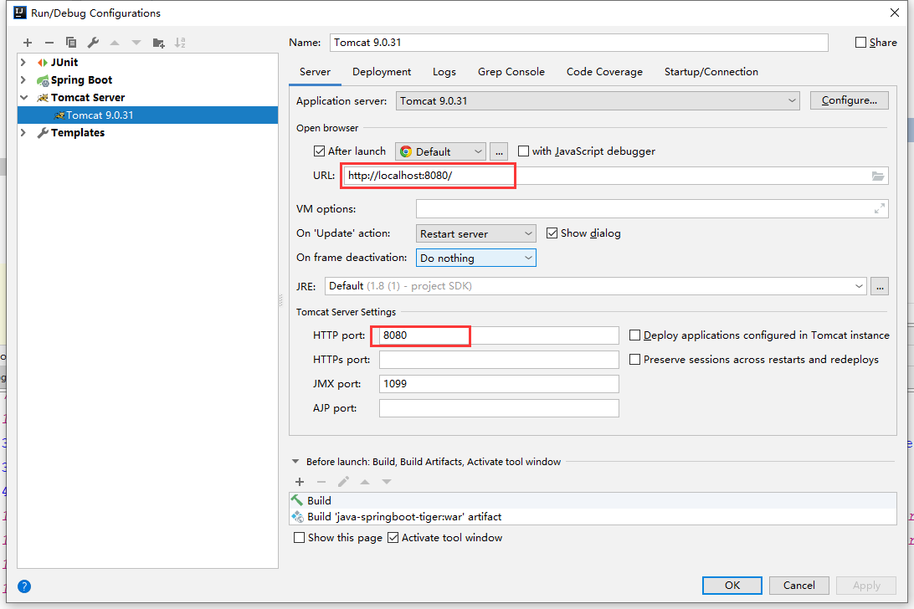
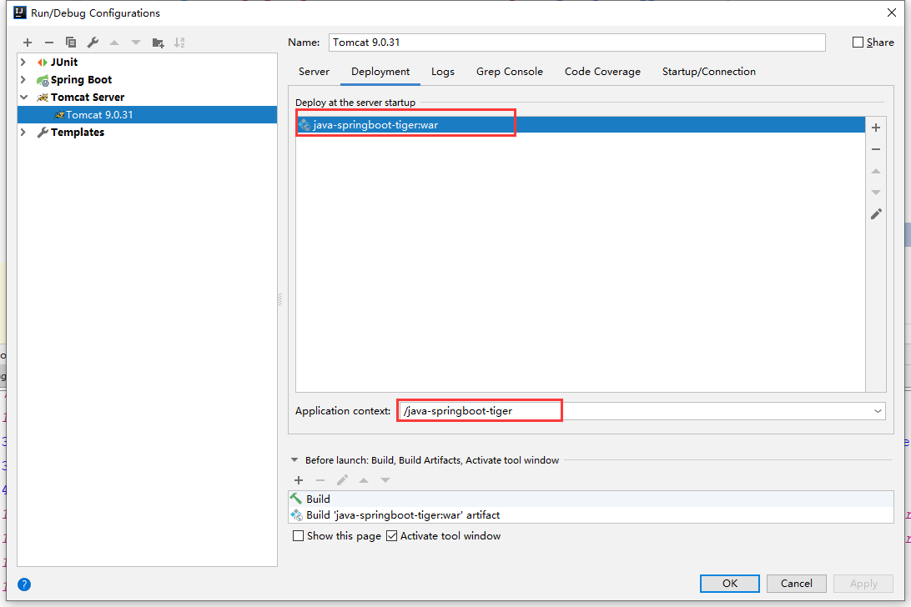
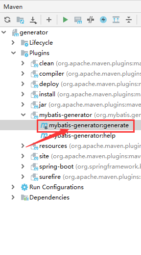
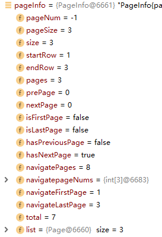

# Spring

## IOC

### Bean的生命周期

1. bean的无参构造
2. 自动注入bean的属性
3. 将bean传入BeanPostProcessor的postProcessBeforeInitialization方法中
4. Bean的@PostConstruct方法
5. 如果bean实现了InitializingBean, 调用afterPropertiesSet()
6. 将bean传入BeanPostProcessor的postProcessAfterInitialization方法中
7. bean就绪
8. bean的@PreDestory方法  
9. 如果实现了DisposableBean, 那么会调用destory() / 如果实现了AutoCloseable接口, 会调用close方法  / 如果实现了ApplicationListener<ContextClosedEvent\>接口, 调用onApplicationEvent()方法
10. IOC容器关闭

### @Autowired和 @Resource

@AutoWired:

1. 按照type找
2. 如果有多个bean, 按照name进行匹配
   1. 如果有@Qualifier, 按照@Qualifier指定的name找
   2. 如果没有@Qualifier, 按照变量名进行匹配
3. 如果还找不到, 根据@Autowired(required=false/true), 来判断是否报错, 默认为true

@Resource:

Resource有两个属性String name, Class type

1. 如果指定了name, 根据name匹配, 如果没有根据变量名匹配
2. 如果找不到时, 按照Class进行匹配


### BeanPostProcessor接口

~~~java
public interface BeanPostProcessor {
    @Nullable
    default Object postProcessBeforeInitialization(Object bean, String beanName) throws BeansException {
        return bean;
    };
    @Nullable
    default Object postProcessAfterInitialization(Object bean, String beanName) throws BeansException {
        return bean;
    }
}
~~~

这个接口的主要功能有:

1. 对class上有特定注释的bean做代理, 比如@Async, @Validated, @Transactional都是使用这个注解来实现功能的
2. 对一些特定接口的bean做一些属性的注入
   - ApplicationContextAwareProcessor: 对实现了EnvironmentAware, EmbeddedValueResolverAware, ResourceLoaderAware, ApplicationEventPublisherAware, MessageSourceAware, ApplicationContextAware这些接口的bean进入注入
   - InitDestroyAnnotationBeanPostProcessor: 在bean销毁前调用@PreDestory注解的方法, 在bean初始化时调用@PostConstruct注解的方法

下面是一些主要的可以使用的子类:

1. InstantiationAwareBeanPostProcessor


### InitializingBean接口和DisposableBean

afterPropertiesSet方法在@PostConstruct注解的方法调用后执行, 其效果和@PostConstruct差不多

destroy方法在@PreDestory注解的方法调用后执行, 其效果和@PreDestory差不多


但是@PostConstruct和@PreDestory方法是给普通的bean使用的, 让他们能够进行初始化

InitializingBean和DisposableBean通常会用在BeanPostProcessor中, 因为涉及到BeanPostProcessor, 如果功能复杂的话, 会涉及到多层父子关系

使用InitializingBean的话, afterPropertiesSet可以被重写, 在重写的方法里调用super.afterPropertiesSet, 这样所以父子类都可以在这个方法中做一些初始化

~~~java
public interface InitializingBean {
	void afterPropertiesSet() throws Exception;
}
public interface DisposableBean {
	void destroy() throws Exception;
}
~~~


### Scope和自定义Scope

#### 内置的Scope

在spring中, 有内置了两种scope

1. singleton

   整个spring容器中只会存在一个bean实例，通过容器多次查找bean的时候（调用BeanFactory的getBean方法或者bean之间注入依赖的bean对象的时候），返回的都是同一个bean对象，singleton是scope的默认值

2. prototype

   如果scope被设置为prototype类型的了，通过容器多次查找bean的时候（调用BeanFactory的getBean方法或者bean之间注入依赖的bean对象的时候），每次获取都会重新创建一个bean实例对象。

在spring mvc环境中, 新增了三个scope, 分别是

1. request

   表示在一次http请求中，一个bean对应一个实例；对每个http请求都会创建一个bean实例，request结束的时候，这个bean也就结束了

2. session

   这个和request类似，也是用在web环境中，session级别共享的bean，每个会话会对应一个bean实例，不同的session对应不同的bean实例

3. application

   每个ServletContext下, 每个bean是单独的


#### 自定义Scope

自定义Scope有如下几个步骤:

1. 实现Scope接口
2. 实现BeanFactoryPostProcessor接口, 并在postProcessBeanFactory方法中添加Scope
3. 将BeanFactoryPostProcessor注入到ioc容器中

下面我们自己来实现下每个线程下的bean是单例的, 不同线程获取到的bean不同

~~~java
public class SimpleThreadScope implements Scope {

	private static final Log logger = LogFactory.getLog(SimpleThreadScope.class);

	private final ThreadLocal<Map<String, Object>> threadScope =
			new NamedThreadLocal<Map<String, Object>>("SimpleThreadScope") {
				@Override
				protected Map<String, Object> initialValue() {
					return new HashMap<>();
				}
			};


	@Override
	public Object get(String name, ObjectFactory<?> objectFactory) {
        // 冲ThreadLocal中拿
        // 如果拿不到就通过objectFactory来创建bean
        // 并将新建的bean放入到objectFactory
		Map<String, Object> scope = this.threadScope.get();
		Object scopedObject = scope.get(name);
		if (scopedObject == null) {
			scopedObject = objectFactory.getObject();
			scope.put(name, scopedObject);
		}
		return scopedObject;
	}

	@Override
	@Nullable
	public Object remove(String name) {
		Map<String, Object> scope = this.threadScope.get();
		return scope.remove(name);
	}

	@Override
	public void registerDestructionCallback(String name, Runnable callback) {
		logger.warn("SimpleThreadScope does not support destruction callbacks. " +
				"Consider using RequestScope in a web environment.");
	}

	@Override
	@Nullable
	public Object resolveContextualObject(String key) {
		return null;
	}

	@Override
	public String getConversationId() {
		return Thread.currentThread().getName();
	}
}
~~~

~~~java
@Configuration
public class ScopeConfig {

    @Bean
    public BeanFactoryPostProcessor scopeBeanFactoryPostProcessor() {
        return new BeanFactoryPostProcessor() {
            @Override
            public void postProcessBeanFactory(ConfigurableListableBeanFactory beanFactory) throws BeansException {
                // 添加scope, 名字为thread
                beanFactory.registerScope("thread", new SimpleThreadScope());
            }
        };
    }
}
~~~

```java
@Component
@Scope(value = "thread") // 指定scope
public class UserBean  {
    public void say() {
        System.out.println(this)
    }
}
```

~~~java
@SpringBootApplication
public class MvcApplication {

    public static void main(String[] args) {
        ConfigurableApplicationContext context = SpringApplication.run(MvcApplication.class, args);
        context.getBean(UserBean.class).say();
        new Thread(() -> {
            context.getBean(UserBean.class).say();
        }).start();
    }

}
~~~

**Spring会在每次getBean(), 或者是需要依赖注入的时候, 通过Scope.get()来获取到bean**

这样我们在不同线程中, 调用context.getBean()获取到的UserBean就是不同的了


#### Scope的proxyMode属性

在@Scope注解上还有一个属性proxyMode, 用于指定bean是否应该进行代理

可选值有: DEFAULT, NO, INTERFACES, TARGET_CLASS

~~~java
public @interface Scope {
    
	@AliasFor("scopeName")
	String value() default "";
    
	@AliasFor("value")
	String scopeName() default "";
	ScopedProxyMode proxyMode() default ScopedProxyMode.DEFAULT;
}
~~~

DEFAULT/NO: 两个的效果是一样的, 不对bean进行代理, 也是最常用的

INTERFACES: 对bean使用jdk动态代理 进行代理

TARGET_CLASS: 对bean使用cglib进行代理


那么这几个属性设置和不设置分别有什么不同呢? 我们显然看看以下的几个场景对TARGET_CLASS和INTERFACES的应用:

1. https://blog.csdn.net/qq_32077121/article/details/107805007

   对于购物场景, 我们希望有一个bean代表购物车

   如果购物车是**单例**，那么将会导致所有的用户都往一个购物车中添加商品。
   如果购物车是**原型**作用域的，那么在应用中某个地方往购物车中添加商品，然后到应用中的另外一个地方可能就没法使用了，因为在这里被注入了另外一个原型作用域的的购物车。

   购物车bean而言，**Session**作用域是最合适的，因为他与给定用户的关联性最大。

   ```less
   @Component
   @Scope(value = WebApplicationContext.SCOPE_SESSION)
   public class ShippingCart {
       	//todo: dosomething
   }
   @Component
   public class StoreService {
       @Autowired private ShippingCart shippingCart;
   }
   ```

   这里我们将value设置成了`WebApplicationContext.SCOPE_SESSION`常量。这会告诉Spring 为Web应用的每个会话创建一个`ShippingCart`。

   此时就会遇到问题:

   - 因为`StoreService` 是个**单例**bean，会在Spring应用上下文加载的时候创建。当它创建的时候，Spring会试图将`ShippingCart bean`注入到`setShoppingCart()`方法中。但是`ShippingCart bean`是会话作用域，此时并不存在。直到用户进入系统创建会话后才会出现`ShippingCart`实例。
   - 系统中会有多个`ShippingCart` 实例，每个用户一个。我们并不希望注入固定的`ShippingCart`实例，而是希望当`StoreService` 处理购物车时，它所使用的是当前会话的`ShippingCart`实例。

   此时, 我们可以在@Scope上添加`proxyMode =ScopedProxyMode.INTERFACES`

   ~~~java
   @Component
   @Scope(value = WebApplicationContext.SCOPE_SESSION, 
       	proxyMode =ScopedProxyMode.INTERFACES)
   public class ShippingCart {
       	//todo: dosomething
   }
   ~~~

   **设置了proxyMode后, Spring将会为所有的ShippingCart类型的bean产生一个共用的代理对象, 然后在依赖注入和getBean的时候, 返回该代理对象**

   所以, Spring并不会将实际的`ShippingCart bean`注入到`StoreService`，Spring只会注入`ShippingCart bean`的代理。这个代理会暴露与`ShippingCart`相同的方法，所以`StoreService`会认为它就是一个购物车。但是，当`StoreService`调用`ShippingCart`的方法时，代理会对其进行懒解析并将调用委任给会话作用域内真正的`ShippingCart bean`。

   在上面的配置中，`proxyMode`属性，被设置成了`ScopedProxyMode.INTERFACES`，这表明这个代理要使用JDK动态代理的方式去实现`ShippingCart`接口，并将调用委托给实现bean。
   但如果`ShippingCart`是一个具体的类而不是接口的话，Spring就没法创建基于接口的代理了。此时，它必须使用CGLib来生成基于类的代理。所以，如果bean类型是具体类的话我们必须要将`proxyMode`属性，设置成`ScopedProxyMode.TARGET_CLASS`，以此来表明要以生成目标类扩展的方式创建代理。
   **request作用域的bean应该也以作用域代理的方式进行注入。**

2. 对于我们自定义的SimpleThreadScope, 虽然我们已经能够在不同线程中通过getBean来获取到不同的Bean

   ~~~java
   public static void main(String[] args) {
           ConfigurableApplicationContext context = SpringApplication.run(MvcApplication.class, args);
           context.getBean(UserBean.class).say();
           new Thread(() -> {
               context.getBean(UserBean.class).say();
           }).start();
       }
   ~~~

   但是如果我们将UserBean注入到其他的Bean中的时候, 我们实际上注入的是注入时的线程的对应的bean, 而不是我们使用userBean时对应线程对应的bean

   ~~~java
   @Component
   public class UserService {
       @Autowired private UserBean userBean;
   }
   ~~~

   此时我们就可以给@Scope添加上proxyMode属性

   ~~~java
   @Component
   @Scope(value = "thread", proxyMode =ScopedProxyMode.TARGET_CLASS) // 指定scope
   public class UserBean  {
       public void say() {
           System.out.println(this)
       }
   }
   ~~~

   此时spring将会为我们的UserBean类型的bean通过cglib产生一个共用的代理对象, 然后在调用getBean和依赖注入时, 都返回该代理

   **当我们使用userBean的时候, 其实使用的是代理, 当我们调用userBean的对应方法的时候, 代理会调用SimpleThreadScope的get方法来获取对应的bean来执行对应的逻辑, 而在SimpleThreadScope的get方法中, 会根据当前的线程来返回对应的bean从而执行对应的逻辑** 

   所以此时我们在不同线程中使用userBean, 实际上使用的是不同线程中的userBean

### SpringCloud中@RefreshScope的原理

https://mp.weixin.qq.com/s?__biz=MzA5MTkxMDQ4MQ==&mid=2648934401&idx=1&sn=98e726ec9adda6d40663f624705ba2e4&chksm=8862103fbf15992981183abef03b4774ab1dfd990a203a183efb8d118455ee4b477dc6cba50d&token=636643900&lang=zh_CN&scene=21#wechat_redirect

   在springcloud环境中, 我们的从配置中心读取到配置, 然后注入到Environment中, 然后再将配置赋值到有@Value注解的字段上, 但是当配置中心的配置有修改之后, 我们如何修改后的配置重新赋值到具有@Value注解的字段上呢

   我们同样可以使用@Scope注解的proxyMode属性, 针对具有@Value注解的字段的bean, 对他进行代理

   这样不管是getBean还是依赖注入, 使用的都是代理, 当我们调用代理的方法的时候, spring会通过Scope的get方法来获取具体的bean来执行对应的逻辑, 此时我们可以生成一个bean, 并根据当前的配置为@Value注解的字段赋值, 并将其放到缓存中.

   只要配置不变, 我们就一直返回缓存中的bean , 只要配置有变动, 我们就清除缓存中的bean, 这样下次我们调用方法的时候, 又会根据当前配置生成一个bean

   具体做法如下:

   1. 自定义一个Scope

      ~~~java
      public class BeanRefreshScope implements Scope {
      
          public static final String SCOPE_REFRESH = "refresh";
      
          private static final BeanRefreshScope INSTANCE = new BeanRefreshScope();
      
          //来个map用来缓存bean
          private ConcurrentHashMap<String, Object> beanMap = new ConcurrentHashMap<>(); //@1
      
          private BeanRefreshScope() { }
      
          public static BeanRefreshScope getInstance() {
              return INSTANCE;
          }
      
          // 清理当前缓存
          public static void clean() {
              INSTANCE.beanMap.clear();
          }
      
          @Override
          public Object get(String name, ObjectFactory<?> objectFactory) {
              Object bean = beanMap.get(name);
              if (bean == null) {
                  bean = objectFactory.getObject();
                  beanMap.put(name, bean);
              }
              return bean;
          }
      }
      ~~~

   2. 注册一个BeanFactoryPostProcessor, 用来支持当前的scope

      ~~~java
      @Configuration
      public class ScopeConfig {
      
          @Bean
          public BeanFactoryPostProcessor scopeBeanFactoryPostProcessor() {
              return new BeanFactoryPostProcessor() {
                  @Override
                  public void postProcessBeanFactory(ConfigurableListableBeanFactory beanFactory) throws BeansException {
       beanFactory.registerScope(BeanRefreshScope.SCOPE_REFRESH, BeanRefreshScope.getInstance());
                  }
              };
          }
      }
      ~~~

   3. 定义一个注解, 来表示bean需要使用我们自定义的Scope

      ~~~java
      @Target({ElementType.TYPE, ElementType.METHOD})
      @Retention(RetentionPolicy.RUNTIME)
      @Scope(BeanRefreshScope.SCOPE_REFRESH) // 指定scope
      @Documented
      public @interface RefreshScope {
          @AliasFor(annotation = Scope.class, attribute = "scopeName")
          ScopedProxyMode proxyMode() default ScopedProxyMode.TARGET_CLASS; // 指定proxyMode
      }
      ~~~

   4. 编写一个工具类, 当配置变更的时候, 清除我们Scope中的缓存

      ~~~java
      public class RefreshConfigUtil {
          /**
           * 模拟改变数据库中都配置信息
           */
          public static void updateDbConfig(AbstractApplicationContext context) {
              // 模拟配置变更
              refreshMailPropertySource(context);
              //清空BeanRefreshScope中所有bean的缓存
              BeanRefreshScope.getInstance().clean();
          }
      
          public static void refreshMailPropertySource(AbstractApplicationContext context) {
              Map<String, Object> mailInfoFromDb =  new HashMap<>();
              result.put("mail.username", UUID.randomUUID().toString());
              
              //将其丢在MapPropertySource中（MapPropertySource类是spring提供的一个类，是PropertySource的子类）
              MapPropertySource mailPropertySource = new MapPropertySource("mail", mailInfoFromDb);
              context.getEnvironment().getPropertySources().addFirst(mailPropertySource);
          }
      }
      ~~~

      当我们进行配置变更的时候, BeanRefreshScope.getInstance().clean()用来清除BeanRefreshScope中所有已经缓存的bean，那么调用bean的任意方法的时候，会重新出发spring容器来创建bean，spring容器重新创建bean的时候，会重新解析@Value的信息，此时容器中的邮件配置信息是新的，所以@Value注入的信息也是新的。

      这也是springcloud中@RefreshScope的原理


### @Import注释

https://mp.weixin.qq.com/s?__biz=MzA5MTkxMDQ4MQ==&mid=2648934173&idx=1&sn=60bb7d58fd408db985a785bfed6e1eb2&chksm=88621f23bf15963589f06b7ce4e521a7c8d615b1675788f383cbb0bcbb05b117365327e1941a&token=704646761&lang=zh_CN&scene=21#wechat_redirect

**@Import可以用来批量导入需要注册的各种类，如普通的类、配置类，完后完成普通类和配置类中所有bean的注册。**

**@Import注解是被下面这个类处理的**

```
org.springframework.context.annotation.ConfigurationClassPostProcessor
```

前面介绍的@Configuration、@Bean、@CompontentScan、@CompontentScans都是被这个类处理的，这个类是高手必经之路，建议花点时间研究研究。


@Import源码如下:

~~~java
@Target(ElementType.TYPE)
@Retention(RetentionPolicy.RUNTIME)
@Documented
public @interface Import {

    /**
     * {@link Configuration @Configuration}, {@link ImportSelector},
     * {@link ImportBeanDefinitionRegistrar}, or regular component classes to import.
     */
    Class<?>[] value();
}
~~~

@Import中value常见的五种用法:

1. **value为普通的类**

   将指定的类注册成bean

   ~~~java
   public class Service1 {} 
   
   @Import({Service1.class})
   public class MainConfig1 {} // Service1被注册为bean
   ~~~

2. **value为@Configuration标注的类**

   将指定的类注册为bean, 并扫描其上的注解

   ~~~java
   @Configuration
   public class ConfigModule1 {
       @Bean
       public String module1() {
           return "我是模块1配置类！";
       }
   }
   
   @Import({ConfigModule1.class}) // ConfigModule1和module1注册为bean
   public class MainConfig2 {}
   ~~~

   

3. **value为@CompontentScan标注的类**

   使ComponentScan生效

   ~~~java
   @ComponentScan
   public class CompontentScanModule1 {}
   
   @Component
   public class Module1Service2 {}
   
   @Import({CompontentScanModule1.class}) // 使ComponentScan生效
   public class MainConfig3 {}
   ~~~

   

4. **value为ImportBeanDefinitionRegistrar接口类型**

   ImportBeanDefinitionRegistrar源码如下

   ~~~java
   public interface ImportBeanDefinitionRegistrar {
       /**
       AnnotationMetadata: 可以通过这个类型来获取被@Import标注的类的所有信息
       BeanDefinitionRegistry: 可以使用他来注册, 移除, 获取, 修改beanDefinition
       BeanNameGenerator: 给定的beanDefinition, 生成一个bean name
       */
       default void registerBeanDefinitions(AnnotationMetadata importingClassMetadata, BeanDefinitionRegistry registry, BeanNameGenerator importBeanNameGenerator) {
           registerBeanDefinitions(importingClassMetadata, registry);
       }
   
       default void registerBeanDefinitions(AnnotationMetadata importingClassMetadata, BeanDefinitionRegistry registry) {
       }
   }
   ~~~

   我们来实现我们自己的

   ~~~java
   public class MyImportBeanDefinitionRegistrar implements ImportBeanDefinitionRegistrar {
       @Override
       public void registerBeanDefinitions(AnnotationMetadata importingClassMetadata, BeanDefinitionRegistry registry) {
           // 注册service1
           BeanDefinition service1BeanDinition = BeanDefinitionBuilder.genericBeanDefinition(Service1.class).getBeanDefinition();
           registry.registerBeanDefinition("service1", service1BeanDinition);
   
           //定义一个bean：Service2，通过addPropertyReference注入service1
           BeanDefinition service2BeanDinition = BeanDefinitionBuilder.genericBeanDefinition(Service2.class).
                   addPropertyReference("service1", "service1").
                   getBeanDefinition();
           //注册bean
           registry.registerBeanDefinition("service2", service2BeanDinition);
       }
   }
   
   public class Service1 {}
   public class Service2 {
       private Service1 service1;
   
       public Service1 getService1() { return service1; }
   
       public void setService1(Service1 service1) {
           this.service1 = service1;
       }
   }
   
   @Import(MyImportBeanDefinitionRegistrar.class)
   public class MyConfig{}
   ~~~

   

5. **value为ImportSelector接口类型**

   ImportSelector接口如下, 通过selectImports返回类的全限定名, 将该类注册为bean

   ~~~java
   public interface ImportSelector {
   
       /**
        * 返回需要导入的类名的数组，可以是任何普通类，配置类（@Configuration、@Bean、@CompontentScan等标注的类）
        * @importingClassMetadata：用来获取被@Import标注的类上面所有的注解信息
        */
       String[] selectImports(AnnotationMetadata importingClassMetadata);
   }
   ~~~

   我们来实现以下:

   ~~~java
   public class MyImportSelector implements ImportSelector {
       @Override
       public String[] selectImports(AnnotationMetadata importingClassMetadata) {
           return new String[]{
                   Service1.class.getName(), // Service1注册为bean
                   Module1Config.class.getName() // Module1Config注册为bean
           };
       }
   }
   
   @Import({MyImportSelector.class})
   public class MainConfig5 {}
   
   @Configuration
   public class Module1Config {
       @Bean
       public String name() { return "公众号：路人甲java"; }
       @Bean
       public String address() { return "上海市"; }
   }
   public class Service1 { }
   ~~~

   

6. **value为DeferredImportSelector接口类型**

   与ImportSelector类似, 但是DeferredImportSelector返回的bean会在最后被创建

   ~~~java
   public interface DeferredImportSelector {
   
       /**
        * 返回需要导入的类名的数组，可以是任何普通类，配置类（@Configuration、@Bean、@CompontentScan等标注的类）
        * @importingClassMetadata：用来获取被@Import标注的类上面所有的注解信息
        */
       String[] selectImports(AnnotationMetadata importingClassMetadata);
   }
   ~~~

   举例:

   ~~~java
   @Configuration
   @Import({
           DeferredImportSelector1.class,
           Service1.class,
   }) // bean的创建顺序是: Service1, Configuration2, name2, Service2
   // 如果@Import中有多个DeferredImportSelector1, 他们之间可以通过实现Ordered接口来指定顺序
   public class Configuration2 {
       @Bean
       public String name2() {
           System.out.println("name2");
           return "name2";
       }
   }
   public class Service1{}
   public class Service2{}
   
   public class DeferredImportSelector1 implements DeferredImportSelector {
       @Override
       public String[] selectImports(AnnotationMetadata importingClassMetadata) {
           return new String[]{Service2.class.getName()};
       }
   }
   ~~~

   


### BeanFactoryPostProcessor接口


## AOP

### 实现aop

~~~java
@Aspect
@Component
public class TestAspect{
    @Pointcut("@execution(* * com.tiger.manager.controller..*.*(..)")
    public void pointcut(){}
    
    @Before("pointcut()")
    public void beforeMethod(JoinPoint joinPoint){
        // 假如joinPoint是public String com.tiger.manager.controller.RestController.get(1, 2)
        System.out.println("目标方法名为:" + joinPoint.getSignature().getName()); //get
        System.out.println("目标方法所属类的简单类名:" +        joinPoint.getSignature().getDeclaringType().getSimpleName()); //RestController
        System.out.println("目标方法所属类的类名:" + joinPoint.getSignature().getDeclaringTypeName()); //com.tiger.manager.RestController
        System.out.println("目标方法声明类型:" + Modifier.toString(joinPoint.getSignature().getModifiers())); //public
        //获取传入目标方法的参数
        Object[] args = joinPoint.getArgs();
        for (int i = 0; i < args.length; i++) {
            System.out.println("第" + (i+1) + "个参数为:" + args[i]); //1,2
        }
        System.out.println("被代理的对象:" + joinPoint.getTarget());
        System.out.println("代理对象自己:" + joinPoint.getThis());
    }
    @Around("pointcut()")
    public void around(ProceedingJoinPoint pjd){
         Object result = null;

        try {
            //前置通知
            System.out.println("目标方法执行前...");
            //执行目标方法
            //result = pjd.proeed();
            //用新的参数值执行目标方法
            result = pjd.proceed(new Object[]{"newSpring","newAop"});
            //返回通知
            System.out.println("目标方法返回结果后...");
        } catch (Throwable e) {
            //异常通知
            System.out.println("执行目标方法异常后...");
            throw new RuntimeException(e);
        }
        //后置通知
        System.out.println("目标方法执行后...");

        return result;
    }
    
    @AfterReturning(value = "within(com.gorge4j.user.controller.*)", returning = "retVal")
    public void after(JoinPoint joinPoint, Object retVal) {
        // 获取封装了署名信息的对象,在该对象中可以获取到目标方法名,所属类的Class等信息
        MethodSignature methodSignature = (MethodSignature) joinPoint.getSignature();
        // 获取方法对象
        Method method = methodSignature.getMethod();
        // 将返回对象转换成 Json 字符串，项目的返回如果不是 Json 的数据格式，那么返回参数就只有 URL
        String strRes = JSONUtils.toJSONString(res);
        log.info("{}.{} - 返回结果: {}", method.getDeclaringClass().getName(), method.getName(), strRes);
    }
}
~~~

ProceedingJoinPoint是JoinPoint的子类, 只有环绕通知的方法可以传入该类型参数, 其他只能传入JointPoint类型

### 切点表达式

1. execution表达式

   格式:

   ~~~java
   execution(modifiers-pattern? ret-type-pattern declaring-type-pattern?name-pattern(param-pattern) throws-pattern?)
   ~~~

   - modifiers-pattern：方法的可见性，如public，protected；可以省略
   - ret-type-pattern：方法的返回值类型，如int，void等；
   - declaring-type-pattern：方法所在类的全路径名，如com.spring.Aspect；
   - name-pattern：方法名类型，如buisinessService()；
   - param-pattern：方法的参数类型，如java.lang.String；
   - throws-pattern：方法抛出的异常类型，如java.lang.Exception；可以省略

   下面是使用execution的例子

   ~~~java
   // 匹配public修饰符, com.spring.BusinessObject类中名称为businessService的方法，方法可以有多个参数，但是第一个参数必须是java.lang.String类型的方法。
   execution(public * com.spring.service.BusinessObject.businessService(java.lang.String,..))
   ~~~

   `*`通配符的作用

   ~~~java
   // 可见性和异常类型被省略, 表示任意
   // 第一个*表示任意返回值
   // 第三个*表示任意一层路径, 只匹配一层
   // 第四个*表示任意0个或者任意多个字符
   // 第五个*表示任意方法
   // 第六个*表示任意一个类型的参数
   // 综上: 匹配任意可见性, 任意返回类型, com.*包中的User开头的任意类中的任意名称的方法, 并且方法有一个String参数和第二个任意类型的函数
   execution(* * com.*.User*.*(java.lang.String, *))
   ~~~

   `..`通配符的作用

   ~~~java
   // 第一个..表示任意多层路径
   // 第二个..表示任意个数和类型的参数
   // 重伤: 匹配任意可见性, 任意返回值, com.spring..Business类中的get方法, 并且任意类型和个数的方法参数
   execution(* com.spring..Business.get(..))
   ~~~

2.  @annotation表达式

@annotation匹配使用**@annotation指定注解标注的方法**，其使用语法如下：

   ```java
   @annotation(annotation-type)
   ```

​    如下示例表示匹配使用com.spring.annotation.BusinessAspect注解标注的方法：

   ```java
   @annotation(com.spring.annotation.BusinessAspect)
   ```

3. @within表达式
   @within表示**匹配带有指定注解的类**，其使用语法如下所示：

   ```java
   @within(annotation-type)
   ```

   如下所示示例表示匹配使用com.spring.annotation.BusinessAspect注解标注的类：

   ```java
   @within(com.spring.annotation.BusinessAspect)
   ```

4. within表达式

   within表达式的粒度为类，其参数为全路径的类名（可使用通配符），表示**匹配当前表达式的所有类的所有方法**都将被当前方法环绕。

   如下是within表达式的语法：

   ```java
   within(declaring-type-pattern)
   ```

   ​    within表达式只能指定到类级别，如下示例表示匹配com.spring.service.BusinessObject中的所有方法：

   ```java
   within(com.spring.service.BusinessObject)
   ```

   ​    within表达式路径和类名都可以使用通配符进行匹配，比如如下表达式将匹配com.spring.service包下的所有类，不包括子包中的类：

   ```java
   within(com.spring.service.*)
   ```

   ​    如下表达式表示匹配com.spring.service包及子包下的所有类：

   ```java
   within(com.spring.service..*)
   ```

5. args表达式

   args表达式匹配**指定参数类型和指定参数数量的方法，无论其类路径或者是方法名是什么**。args指定的参数必须是全路径的。如下是args表达式的语法：

   ```java
   args(param-pattern)
   ```

   ​    如下示例表示匹配所有只有一个参数，并且参数类型是java.lang.String类型的方法：

   ```java
   args(java.lang.String)
   ```

   ​    也可以使用通配符，但这里通配符只能使用..，而不能使用*。如下是使用通配符的实例，该切点表达式将匹配第一个参数为java.lang.String，最后一个参数为java.lang.Integer，并且中间可以有任意个数和类型参数的方法：

   ```java
   args(java.lang.String,..,java.lang.Integer)
   ```

6. @args表达式

   @args则表示**使用指定注解标注的类作为某个方法的参数时该方法将会被匹配**。如下是@args注解的语法：

   ```java
   @args(annotation-type)
   ```

   如下示例表示匹配使用了com.spring.annotation.FruitAspect注解标注的类作为参数的方法：

   ```java
   // @args(chapter7.eg6.FruitAspect)将会匹配putIntoBucket方法
   // 因为该方法使用到了Apple作为参数
   // 而Apple类被@FruitAspect注解标注了
   
   @FruitAspect
   public class Apple {}
   
   public class FruitBucket {
     public void putIntoBucket(Apple apple) {
       System.out.println("put apple into bucket.");
     }
   }
   
   @Aspect
   public class MyAspect {
     @Around("@args(chapter7.eg6.FruitAspect)")
     public Object around(ProceedingJoinPoint pjp) throws Throwable {
       System.out.println("this is before around advice");
       Object result = pjp.proceed();
       System.out.println("this is after around advice");
       return result;
     }
   }
   ```


### 切面的顺序

使用@Order注解可以控制切面的优先级：

- @Order(较小的数)：优先级高
- @Order(较大的数)：优先级低

### 通知的执行顺序

spring4 或者spring1.x

1. Around
2. Before
3. 执行逻辑
4. Around
5. After
6. AfterReturning/AfterThrowing

Spring 5或 Spring Boot 2.x,    更像try catch了, Around是整个try catch, After是finally

1. Around
2. Before
3. 执行逻辑
4. AfterReturning/AfterThrowing
5. After
6. Around


## 事务

### JdbcTemplate

1. 使用JdbcTemplate进行增删改

   ~~~java
   @Configuration
   public class JDBCTemplateTest {
       @Autowired
       private JdbcTemplate jdbcTemplate;
       
       @Test
   	//测试增删改功能
   	public void testUpdate(){
       //添加功能
   	String sql = "insert into t_emp values(null,?,?,?)";
   	int result = jdbcTemplate.update(sql, "张三", 23, "男");
       
       //修改功能
   	String sql = "update t_emp set name=? where id=?";
       int result = jdbcTemplate.update(sql, "张三atguigu", 1);
   
       //删除功能
   	String sql = "delete from t_emp where id=?";
   	int result = jdbcTemplate.update(sql, 1);
   	}
   }
   ~~~

2. 查询返回对象

   ~~~java
   //查询：返回对象
   @Test
   public void testSelectObject() {
       //写法一
   //        String sql = "select * from t_emp where id=?";
   //        Emp empResult = jdbcTemplate.queryForObject(sql,
   //                (rs, rowNum) -> {
   //                    Emp emp = new Emp();
   //                    emp.setId(rs.getInt("id"));
   //                    emp.setName(rs.getString("name"));
   //                    emp.setAge(rs.getInt("age"));
   //                    emp.setSex(rs.getString("sex"));
   //                    return emp;
   //                }, 1);
   //        System.out.println(empResult);
   
       //写法二
       String sql = "select * from t_emp where id=?";
       Emp emp = jdbcTemplate.queryForObject(sql,
                     new BeanPropertyRowMapper<>(Emp.class),1);
       System.out.println(emp);
   }
   ~~~

3. 查询返回list

   ~~~java
   @Test
   //查询多条数据为一个list集合
   public void testSelectList(){
       String sql = "select * from t_emp";
       List<Emp> list = jdbcTemplate.query(sql, new BeanPropertyRowMapper<>(Emp.class));
       System.out.println(list);
   }
   ~~~

4. 查询返回单个值

   ~~~java
   @Test
   //查询单行单列的值
   public void selectCount(){
       String sql = "select count(id) from t_emp";
       Integer count = jdbcTemplate.queryForObject(sql, Integer.class);
       System.out.println(count);
   }
   ~~~

   


### 事务的基本原理

Spring事务的本质其实就是数据库对事务的支持，使用JDBC的事务管理机制,就是利用java.sql.Connection对象完成对事务的提交，那在没有Spring帮我们管理事务之前，我们要怎么做。

```java
Connection conn = DriverManager.getConnection();
try {  
    conn.setAutoCommit(false);  //将自动提交设置为false                         
    执行CRUD操作 
    conn.commit();      //当两个操作成功后手动提交  
} catch (Exception e) {  
    conn.rollback();    //一旦其中一个操作出错都将回滚，所有操作都不成功
    e.printStackTrace();  
} finally {
    conn.colse();
}
```

事务是一系列的动作，一旦其中有一个动作出现错误，必须全部回滚，系统将事务中对数据库的所有已完成的操作全部撤消，滚回到事务开始的状态，避免出现由于数据不一致而导致的接下来一系列的错误。事务的出现是为了确保数据的完整性和一致性，在目前企业级应用开发中，事务管理是必不可少的。


### 与事务相关的理论知识

众所周知，事务有四大特性（ACID）

1.原子性（Atomicity）事务是一个原子操作，由一系列动作组成。事务的原子性确保动作要么全部完成，要么完全不起作用。

2.一致性（Consistency）事务在完成时，必须是所有的数据都保持一致状态。

3.隔离性（Isolation）并发事务执行之间无影响，在一个事务内部的操作对其他事务是不产生影响，这需要事务隔离级别来指定隔离性。

4.持久性（Durability）一旦事务完成，数据库的改变必须是持久化的。

在企业级应用中，多用户访问数据库是常见的场景，这就是所谓的事务的并发。事务并发所可能存在的问题： 
1.脏读：一个事务读到另一个事务未提交的更新数据。 
2.不可重复读：一个事务两次读同一行数据，可是这两次读到的数据不一样。 
3.幻读：一个事务执行两次查询，但第二次查询比第一次查询多出了一些数据行。 
4.丢失更新：撤消一个事务时，把其它事务已提交的更新的数据覆盖了。

我们可以在java.sql.Connection中看到**JDBC定义了五种事务隔离级别**来解决这些并发导致的问题：

TRANSACTION_NONE JDBC 驱动不支持事务 
TRANSACTION_READ_UNCOMMITTED 读未提交
TRANSACTION_READ_COMMITTED 读已提交
TRANSACTION_REPEATABLE_READ 可重复读
TRANSACTION_SERIALIZABLE 顺序

**隔离级别越高，意味着数据库事务并发执行性能越差，能处理的操作就越少**。你可以通过conn.setTransactionLevel去设置你需要的隔离级别。 
JDBC规范虽然定义了事务的以上支持行为，但是各个JDBC驱动，数据库厂商对事务的支持程度可能各不相同。 
**出于性能的考虑我们一般设置TRANSACTION_READ_COMMITTED就差不多了，剩下的通过使用数据库的锁来帮我们处理别的，关于数据库的锁这个之后再说。**

了解了基本的JDBC事务，那有了Spring，在事务管理上会有什么新的改变呢？ 
有了Spring，我们再也无需要去处理获得连接、关闭连接、事务提交和回滚等这些操作，使得我们把更多的精力放在处理业务上。事实上Spring并不直接管理事务，而是提供了多种事务管理器。他们将事务管理的职责委托给Hibernate或者JTA等持久化机制所提供的相关平台框架的事务来实现。


### 事务管理方式

spring支持**编程式**事务管理和**声明式**事务管理两种方式。

编程式事务管理使用TransactionTemplate或者直接使用底层的PlatformTransactionManager。对于编程式事务管理，spring推荐使用TransactionTemplate。

声明式事务管理建立在AOP之上的。其本质是对方法前后进行拦截，然后在目标方法开始之前创建或者加入一个事务，在执行完目标方法之后根据执行情况提交或者回滚事务。

声明式事务最大的优点就是不需要通过编程的方式管理事务，这样就不需要在业务逻辑代码中掺杂事务管理的代码，只需在配置文件中做相关的事务规则声明(或通过基于@Transactional注解的方式)，便可以将事务规则应用到业务逻辑中。

显然**声明式事务管理要优于编程式事务管理，这正是spring倡导的非侵入式的开发方式**。声明式事务管理使业务代码不受污染，一个普通的POJO对象，只要加上注解就可以获得完全的事务支持。

和编程式事务相比，声明式事务唯一不足地方是，后者的最细粒度只能作用到方法级别，无法做到像编程式事务那样可以作用到代码块级别。但是即便有这样的需求，也存在很多变通的方法，比如，可以将需要进行事务管理的代码块独立为方法等等。

**声明式事务管理也有两种常用的方式，一种是基于tx和aop名字空间的xml配置文件，另一种就是基于@Transactional注解。显然基于注解的方式更简单易用，更清爽**。

有了Spring，我们**再也无需要去处理获得连接、关闭连接、事务提交和回滚等这些操作**，使得我们把更多的精力放在处理业务上。事实上Spring并不直接管理事务，而是提供了多种事务管理器。他们将事务管理的职责委托给Hibernate或者JTA等持久化机制所提供的相关平台框架的事务来实现。


### Spring事务管理

Spring事务管理的核心接口是**PlatformTransactionManager** 


事务管理器接口通过getTransaction(TransactionDefinition definition)方法**根据指定的传播行为返回当前活动的事务或创建一个新的事务**，这个方法里面的参数是TransactionDefinition类，这个类就定义了一些基本的事务属性。 
在TransactionDefinition接口中定义了它自己的传播行为和隔离级别 


除去常量，主要的方法有：

```java
int getIsolationLevel();// 返回事务的隔离级别
String getName();// 返回事务的名称
int getPropagationBehavior();// 返回事务的传播行为
int getTimeout();  // 返回事务必须在多少秒内完成
boolean isReadOnly(); // 事务是否只读，事务管理器能够根据这个返回值进行优化，确保事务是只读的
```

### Spring事务的传播属性

由上图可知，Spring定义了7个以PROPAGATION_开头的常量表示它的传播属性。

| 名称                      | 值   | 说明                                                         |
| ------------------------- | ---- | ------------------------------------------------------------ |
| PROPAGATION_REQUIRED      | 0    | 支持当前事务，如果当前没有事务，就新建一个事务。这是最常见的选择，也是**Spring默认的事务的传播。** |
| PROPAGATION_SUPPORTS      | 1    | 支持当前事务，如果当前没有事务，就以非事务方式执行。         |
| PROPAGATION_MANDATORY     | 2    | 支持当前事务，如果当前没有事务，就抛出异常。                 |
| PROPAGATION_REQUIRES_NEW  | 3    | 新建事务，如果当前存在事务，把当前事务挂起。                 |
| PROPAGATION_NOT_SUPPORTED | 4    | 以非事务方式执行操作，如果当前存在事务，就把当前事务挂起。   |
| PROPAGATION_NEVER         | 5    | 以非事务方式执行，如果当前存在事务，则抛出异常。             |
| PROPAGATION_NESTED        | 6    | 如果当前存在事务，则在嵌套事务内执行。如果当前没有事务，则进行与PROPAGATION_REQUIRED类似的操作。 |

### Spring事务的隔离级别

| 名称                       | 值   | 解释                                                         |
| -------------------------- | ---- | ------------------------------------------------------------ |
| ISOLATION_DEFAULT          | -1   | 这是一个PlatfromTransactionManager默认的隔离级别，使用数据库默认的事务隔离级别。另外四个与JDBC的隔离级别相对应 |
| ISOLATION_READ_UNCOMMITTED | 1    | 这是事务最低的隔离级别，它充许另外一个事务可以看到这个事务未提交的数据。这种隔离级别会产生脏读，不可重复读和幻读。 |
| ISOLATION_READ_COMMITTED   | 2    | 保证一个事务修改的数据提交后才能被另外一个事务读取。另外一个事务不能读取该事务未提交的数据。 |
| ISOLATION_REPEATABLE_READ  | 4    | 这种事务隔离级别可以防止脏读，不可重复读。但是可能出现幻读。 |
| ISOLATION_SERIALIZABLE     | 8    | 这是花费最高代价但是最可靠的事务隔离级别。事务被处理为顺序执行。除了防止脏读，不可重复读外，还避免了幻读。 |

调用PlatformTransactionManager接口的getTransaction()的方法得到的是TransactionStatus接口的一个实现 
TransactionStatus接口 


主要的方法有：

```java
void flush();//如果适用的话，这个方法用于刷新底层会话中的修改到数据库，例如，所有受影响的Hibernate/JPA会话。
boolean hasSavepoint(); // 是否有恢复点
boolean isCompleted();// 是否已完成
boolean isNewTransaction(); // 是否是新的事务
boolean isRollbackOnly(); // 是否为只回滚
void setRollbackOnly();  // 设置为只回滚
```

可以看出返回的结果是一些事务的状态，可用来检索事务的状态信息。

### 事务超时

所谓事务超时，就是指一个事务所允许执行的最长时间，如果超过该时间限制但事务还没有完成，则自动回滚事务。在 TransactionDefinition 中以 int 的值来表示超时时间，其单位是秒。

默认设置为底层事务系统的超时值，如果底层数据库事务系统没有设置超时值，那么就是none，没有超时限制。

### 事务只读属性

只读事务用于客户代码只读但不修改数据的情形，只读事务用于特定情景下的优化，比如使用Hibernate的时候。
默认为读写事务。


### spring事务回滚规则

指示spring事务管理器回滚一个事务的推荐方法是在当前事务的上下文内抛出异常。spring事务管理器会捕捉任何未处理的异常，然后依据规则决定是否回滚抛出异常的事务。

默认配置下，spring只有在抛出的异常为运行时unchecked异常时才回滚该事务，也就是抛出的异常为RuntimeException的子类(Errors也会导致事务回滚)，而抛出checked异常则不会导致事务回滚。
可以明确的配置在抛出那些异常时回滚事务，包括checked异常。也可以明确定义那些异常抛出时不回滚事务。

还可以编程性的通过setRollbackOnly()方法来指示一个事务必须回滚，在调用完setRollbackOnly()后你所能执行的唯一操作就是回滚。


### 使用声明式事务中的@Transactional注解

| 属性                   | 类型                               | 描述                                                         |
| :--------------------- | ---------------------------------- | ------------------------------------------------------------ |
| value                  | String                             | 可选的限定描述符，指定使用的事务管理器                       |
| propagation            | enum: Propagation                  | 可选的事务传播行为设置, **默认为PROPAGATION_REQUIRED**       |
| isolation              | enum: Isolation                    | 可选的事务隔离级别设置,**默认为ISOLATION_DEFAULT**           |
| readOnly               | boolean                            | 读写或只读事务，**默认读写**                                 |
| timeout                | int (in seconds granularity)       | 事务的超时时间，**默认值为-1**。如果超过该时间限制但事务还没有完成，则自动回滚事务。 |
| rollbackFor            | Class对象数组，必须继承自Throwable | 导致事务回滚的异常类数组                                     |
| rollbackForClassName   | 类名数组，必须继承自Throwable      | 导致事务回滚的异常类名字数组                                 |
| noRollbackFor          | Class对象数组，必须继承自Throwable | 不会导致事务回滚的异常类数组                                 |
| noRollbackForClassName | 类名数组，必须继承自Throwable      | 不会导致事务回滚的异常类名字数组                             |

- @Transactional 可以作用于接口、接口方法、类以及类方法上。**当作用于类上时，该类的所有 public 方法将都具有该类型的事务属性，同时，我们也可以在方法级别使用该标注来覆盖类级别的定义。**
- 虽然 @Transactional 注解可以作用于接口、接口方法、类以及类方法上，但是 **Spring 建议不要在接口或者接口方法上使用该注解，因为这只有在使用基于接口的代理时它才会生效。另外， @Transactional 注解应该只被应用到 public 方法上，这是由 Spring AOP 的本质决定的。**如果你在 protected、private 或者默认可见性的方法上使用 @Transactional 注解，这将被忽略，也不会抛出任何异常。
- 默认情况下，**只有来自外部的方法调用才会被AOP代理捕获，也就是，类内部方法调用本类内部的其他方法并不会引起事务行为**，即使被调用方法使用@Transactional注解进行修饰。


### 使用编程式事务

Spring框架提供了两种编程式事务方式：

- 使用TransactionTemplate
- 使用PlatformTransactionManager

Spring团队通常建议使用TransactionTemplate进行程序化事务管理。

#### 使用PlatformTransactionManager

~~~java
@Test
public void test1() throws Exception {
    //定义一个数据源
    org.apache.tomcat.jdbc.pool.DataSource dataSource = new org.apache.tomcat.jdbc.pool.DataSource();
    dataSource.setDriverClassName("com.mysql.jdbc.Driver");
    dataSource.setUrl("jdbc:mysql://localhost:3306/javacode2018?characterEncoding=UTF-8");
    dataSource.setUsername("root");
    dataSource.setPassword("root123");
    dataSource.setInitialSize(5);
    //定义一个JdbcTemplate，用来方便执行数据库增删改查
    JdbcTemplate jdbcTemplate = new JdbcTemplate(dataSource);
    //1.定义事务管理器，给其指定一个数据源（可以把事务管理器想象为一个人，这个人来负责事务的控制操作）
    PlatformTransactionManager platformTransactionManager = new DataSourceTransactionManager(dataSource);
    //2.定义事务属性：TransactionDefinition，TransactionDefinition可以用来配置事务的属性信息，比如事务隔离级别、事务超时时间、事务传播方式、是否是只读事务等等。
    TransactionDefinition transactionDefinition = new DefaultTransactionDefinition();
    //3.开启事务：调用platformTransactionManager.getTransaction开启事务操作，得到事务状态(TransactionStatus)对象
    TransactionStatus transactionStatus = platformTransactionManager.getTransaction(transactionDefinition);
    //4.执行业务操作，下面就执行2个插入操作
    try {
        System.out.println("before:" + jdbcTemplate.queryForList("SELECT * from t_user"));
        jdbcTemplate.update("insert into t_user (name) values (?)", "test1-1");
        jdbcTemplate.update("insert into t_user (name) values (?)", "test1-2");
        //5.提交事务：platformTransactionManager.commit
        platformTransactionManager.commit(transactionStatus);
    } catch (Exception e) {
        //6.回滚事务：platformTransactionManager.rollback
        platformTransactionManager.rollback(transactionStatus);
    }
    System.out.println("after:" + jdbcTemplate.queryForList("SELECT * from t_user"));
}
~~~

代码解析, 主要步骤如下:

1. **定义事务管理器PlatformTransactionManager**

   事务管理器相当于一个管理员，这个管理员就是用来帮你控制事务的，比如开启事务，提交事务，回滚事务等等。

   spring中使用PlatformTransactionManager这个接口来表示事务管理器

   ```java
   public interface PlatformTransactionManager {
    //获取一个事务（开启事务）
    TransactionStatus getTransaction(@Nullable TransactionDefinition definition) throws TransactionException;
    //提交事务
    void commit(TransactionStatus status) throws TransactionException;
    //回滚事务
    void rollback(TransactionStatus status) throws TransactionException;
   }
   ```

   PlatformTransactionManager多个实现类，用来应对不同的环境

   **JpaTransactionManager**：如果你用jpa来操作db，那么需要用这个管理器来帮你控制事务。

   **DataSourceTransactionManager**：如果你用是指定数据源的方式，比如操作数据库用的是：JdbcTemplate、mybatis、ibatis，那么需要用这个管理器来帮你控制事务。

   **HibernateTransactionManager**：如果你用hibernate来操作db，那么需要用这个管理器来帮你控制事务。

   **JtaTransactionManager**：如果你用的是java中的jta来操作db，这种通常是分布式事务，此时需要用这种管理器来控制事务。

   上面案例代码中我们使用的是JdbcTemplate来操作db，所以用的是`DataSourceTransactionManager`这个管理器。

2. **定义事务属性TransactionDefinition**

   定义事务属性，比如事务隔离级别、事务超时时间、事务传播方式、是否是只读事务等等。

   spring中使用TransactionDefinition接口来表示事务的定义信息，有个子类比较常用：DefaultTransactionDefinition。

3. **开启事务**

   调用事务管理器的`getTransaction`方法，即可以开启一个事务

   ```java
TransactionStatus transactionStatus =  platformTransactionManager.getTransaction(transactionDefinition);
   ```
   
   这个方法会返回一个`TransactionStatus`表示事务状态的一个对象，通过`TransactionStatus`提供的一些方法可以用来控制事务的一些状态，比如事务最终是需要回滚还是需要提交。执行了`getTransaction`后，spring内部会执行一些操作，为了方便大家理解，咱们看看伪代码：
   
   ```java
      //有一个全局共享的threadLocal对象 resources
   static final ThreadLocal<Map<Object, Object>> resources = new NamedThreadLocal<>("Transactional resources");
      //获取一个db的连接
      DataSource datasource = platformTransactionManager.getDataSource();
      Connection connection = datasource.getConnection();
      //设置手动提交事务
      connection.setAutoCommit(false);
      Map<Object, Object> map = new HashMap<>();
      map.put(datasource,connection);
      resources.set(map);
   ```
   
   上面代码，将数据源datasource和connection映射起来放在了ThreadLocal中，后面我们可以通过这个ThreadLocal获取datasource其对应的 connection对象。

4. **执行业务操作**

   我们使用jdbcTemplate插入了2条记录。

   ```java
   jdbcTemplate.update("insert into t_user (name) values (?)", "test1-1");
   jdbcTemplate.update("insert into t_user (name) values (?)", "test1-2");
   ```

   大家看一下创建JdbcTemplate的代码，需要指定一个datasource

   ```ini
   JdbcTemplate jdbcTemplate = new JdbcTemplate(dataSource);
   ```

   再来看看创建事务管理器的代码

   ```ini
   PlatformTransactionManager platformTransactionManager = new DataSourceTransactionManager(dataSource);
   ```

   **两者用到的是同一个dataSource，而事务管理器开启事务的时候，会创建一个连接，将datasource和connection映射之后丢在了ThreadLocal中，而JdbcTemplate内部执行db操作的时候，也需要获取连接，JdbcTemplate会以自己内部的datasource去上面的threadlocal中找有没有关联的连接，如果有直接拿来用，若没找到将重新创建一个连接，而此时是可以找到的，那么JdbcTemplate就参与到spring的事务中了。**

5. **提交/回滚**

   ~~~java
   platformTransactionManager.commit(transactionStatus);
   
   platformTransactionManager.rollback(transactionStatus);
   ~~~

#### 使用TransactionTemplate

~~~java
@Test
public void test1() throws Exception {
    //定义一个数据源
    org.apache.tomcat.jdbc.pool.DataSource dataSource = new org.apache.tomcat.jdbc.pool.DataSource();
    dataSource.setDriverClassName("com.mysql.jdbc.Driver");
    dataSource.setUrl("jdbc:mysql://localhost:3306/javacode2018?characterEncoding=UTF-8");
    dataSource.setUsername("root");
    dataSource.setPassword("root123");
    dataSource.setInitialSize(5);
    //定义一个JdbcTemplate，用来方便执行数据库增删改查
    JdbcTemplate jdbcTemplate = new JdbcTemplate(dataSource);
    //1.定义事务管理器，给其指定一个数据源（可以把事务管理器想象为一个人，这个人来负责事务的控制操作）
    PlatformTransactionManager platformTransactionManager = new DataSourceTransactionManager(dataSource);
    //2.定义事务属性：TransactionDefinition，TransactionDefinition可以用来配置事务的属性信息，比如事务隔离级别、事务超时时间、事务传播方式、是否是只读事务等等。
    DefaultTransactionDefinition transactionDefinition = new DefaultTransactionDefinition();
    transactionDefinition.setTimeout(10);//如：设置超时时间10s
    //3.创建TransactionTemplate对象
    TransactionTemplate transactionTemplate = new TransactionTemplate(platformTransactionManager, transactionDefinition);
    /**
     * 4.通过TransactionTemplate提供的方法执行业务操作
     * 主要有2个方法：
     * （1）.executeWithoutResult(Consumer<TransactionStatus> action)：没有返回值的，需传递一个Consumer对象，在accept方法中做业务操作
     * （2）.<T> T execute(TransactionCallback<T> action)：有返回值的，需要传递一个TransactionCallback对象，在doInTransaction方法中做业务操作
     * 调用execute方法或者executeWithoutResult方法执行完毕之后，事务管理器会自动提交事务或者回滚事务。
     * 那么什么时候事务会回滚，有2种方式：
     * （1）transactionStatus.setRollbackOnly();将事务状态标注为回滚状态
     * （2）execute方法或者executeWithoutResult方法内部抛出异常
     * 什么时候事务会提交？
     * 方法没有异常 && 未调用过transactionStatus.setRollbackOnly();
     */
    transactionTemplate.executeWithoutResult(new Consumer<TransactionStatus>() {
        @Override
        public void accept(TransactionStatus transactionStatus) {
            jdbcTemplate.update("insert into t_user (name) values (?)", "transactionTemplate-1");
            jdbcTemplate.update("insert into t_user (name) values (?)", "transactionTemplate-2");

        }
    });
    Integer result = transactionTemplate.execute(new TransactionCallback<Integer>() {
    @Override
    public Integer doInTransaction(TransactionStatus status) {
        return jdbcTemplate.update("insert into t_user (name) values (?)", "executeWithoutResult-3");
    }
});
    System.out.println("after:" + jdbcTemplate.queryForList("SELECT * from t_user"));
}
~~~

#### 编程式事务与Spring整合

~~~java
@Configuration
public class MainConfig3 {
    @Bean
    public DataSource dataSource() {
        org.apache.tomcat.jdbc.pool.DataSource dataSource = new org.apache.tomcat.jdbc.pool.DataSource();
        dataSource.setDriverClassName("com.mysql.jdbc.Driver");
        dataSource.setUrl("jdbc:mysql://localhost:3306/javacode2018?characterEncoding=UTF-8");
        dataSource.setUsername("root");
        dataSource.setPassword("root123");
        dataSource.setInitialSize(5);
        return dataSource;
    }
    @Bean
    public JdbcTemplate jdbcTemplate(DataSource dataSource) {
        return new JdbcTemplate(dataSource);
    }
    @Bean
    public PlatformTransactionManager transactionManager(DataSource dataSource) {
        return new DataSourceTransactionManager(dataSource);
    }
    @Bean
    public TransactionTemplate transactionTemplate(PlatformTransactionManager transactionManager) {
        return new TransactionTemplate(transactionManager);
    }
}

@Component
public class UserService {
    @Autowired
    private JdbcTemplate jdbcTemplate;
    @Autowired
    private TransactionTemplate transactionTemplate;

    //模拟业务操作1
    public void bus1() {
        this.transactionTemplate.executeWithoutResult(transactionStatus -> {
            //先删除表数据
            this.jdbcTemplate.update("delete from t_user");
            //调用bus2
            this.bus2();
        });
    }

    //模拟业务操作2
    public void bus2() {
        this.transactionTemplate.executeWithoutResult(transactionStatus -> {
            this.jdbcTemplate.update("insert into t_user (name) VALUE (?)", "java");
            this.jdbcTemplate.update("insert into t_user (name) VALUE (?)", "spring");
            this.jdbcTemplate.update("insert into t_user (name) VALUE (?)", "mybatis");
        });
    }
}
~~~


### @Transactional注解的原理

todo

## 数据校验: Validation

### 相关注解

**空检查**

- @Null       验证对象是否为null

- @NotNull    验证对象是否不为null, 无法查检长度为0的字符串

- @NotBlank 检查约束字符串是不是Null还有被Trim的长度是否大于0,只对字符串,且会去掉前后空格

- @NotEmpty 检查约束元素是否为NULL或者是EMPTY.

==@NotNull是通过 ==null来判断==

==@NotEmpty是通过 .size()= =0和.length()= =0判断==

==@NotBlank是通过 .trim().length()= =0判断 按照实际的需求来使用==

**Booelan检查**

- @AssertTrue     验证 Boolean 对象是否为 true  
- @AssertFalse    验证 Boolean 对象是否为 false  

**长度检查**

- @Size(min=, max=) 验证对象（Array,Collection,Map,String）长度是否在给定的范围之内  
- @Length(min=, max=) Validates that the annotated string is between min and max included.

**日期检查**

- @Past           验证 Date 和 Calendar 对象是否在当前时间之前  
- @Future     验证 Date 和 Calendar 对象是否在当前时间之后  
- @Pattern    验证 String 对象是否符合正则表达式的规则

**数值检查**

**建议使用在Stirng,Integer类型，不建议使用在int类型上，因为表单值为“”时无法转换为int，但可以转换为Stirng为"",Integer为null**

- @Min            验证 Number 和 String 对象是否大等于指定的值  
- @Max            验证 Number 和 String 对象是否小等于指定的值  
- @DecimalMax 被标注的值必须不大于约束中指定的最大值. 这个约束的参数是一个通过BigDecimal定义的最大值的字符串表示.小数存在精度
- @DecimalMin 被标注的值必须不小于约束中指定的最小值. 这个约束的参数是一个通过BigDecimal定义的最小值的字符串表示.小数存在精度
- @Digits     验证 Number 和 String 的构成是否合法  
- @Digits(integer=,fraction=) 验证字符串是否是符合指定格式的数字，interger指定整数精度，fraction指定小数精度。
- @Range(min=, max=) 检查数字是否介于min和max之间.
- @Range(min=10000,max=50000,message="range.bean.wage")
  private BigDecimal wage;

**其他检测**

- @CreditCardNumber信用卡验证
- @Email  验证是否是邮件地址，如果为null,不进行验证，算通过验证。
- @ScriptAssert(lang= ,script=, alias=)
- @URL(protocol=,host=, port=,regexp=, flags=)


### 使用原生方式进行验证

1. 导入maven

   ~~~xml
   <!-- 根据 JSR 380 规范，validation-api依赖项包含标准验证 API -->
   <dependency>
       <groupId>javax.validation</groupId>
       <artifactId>validation-api</artifactId>
       <version>2.0.1.Final</version>
   </dependency>
   
   <!-- Hibernate Validator 是验证 API 的参考实现 -->
   <dependency>
       <groupId>org.hibernate.validator</groupId>
       <artifactId>hibernate-validator</artifactId>
       <version>6.0.13.Final</version>
   </dependency>
   ~~~

2. Bean添加验证注解

   ~~~java
   @Data
   public class User {
       @NotNull(message = "名字不能为空")
       private String name;
   
       @AssertTrue
       private boolean working;
   
       @Size(min = 10, max = 200, message = "字符数应介于10和200之间（含10和200）")
       private String aboutMe;
   
       @Min(value = 18, message = "年龄不应少于18岁")
       @Max(value = 150, message = "年龄不应超过150岁")
       private int age;
   
       @Email(message = "电子邮件应该是有效的")
       private String email;
   
       private List<@NotBlank(message = "备注说明不能为空") String> preferences;
   
       @Past(message = "出生年月必须是一个过去的时间")
       private LocalDate dateOfBirth;
   
       @DecimalMin(value = "0.0", inclusive = false, message = "付款金额不能小于0")
       @Digits(integer = 4, fraction = 2, message = "付款金额必须小于{integer}位数且不能超过{fraction}位小数")
       private BigDecimal price;
       
   }
   ~~~

3. 验证程序

   ~~~java
   public class ValidationTest {
   
       private Validator validator;
   
       @Before
       public void setup() {
           ValidatorFactory factory = Validation.buildDefaultValidatorFactory();
           validator = factory.getValidator();
       }
   
       @Test
       public void ifNameIsNull() {
           User user = new User();
           user.setWorking(true);
           user.setAboutMe("me");
           user.setAge(50);
           
           // validate方法来验证我们的 UserBean User对象中定义的约束都将作为Set返回
           Set<ConstraintViolation<User>> violations = validator.validate(user);
           for (ConstraintViolation<User> violation : violations) {
               // getMessage方法获取所有违规消息
               System.out.println(violation.getMessage());
           }
       }
   }
   ~~~

   

### springboot中使用参数校验

引入依赖

~~~xml
<dependency>
  <groupid>org.springframework.boot</groupid>
  <artifactid>spring-boot-starter-web</artifactid>
</dependency>
<!-- Boot 2.3 开始，我们还需要显式添加spring-boot-starter-validation依赖项, 之前不需要-->
<dependency>
  <groupid>org.springframework.boot</groupid>
  <artifactid>spring-boot-starter-validation</artifactid>
</dependency>
~~~

#### controller层校验DTO

在controller层, 可以使用@Valid和@Validated标注在方法参数上, 进行校验DTO

**如果校验失败, 如果controller参数后面跟了BindingResult, 那么会把错误放在BindingResult中, ** 不推荐这种方式, 直接在全局异常处理中     

**如果没有这个参数, 那么会直接抛出MethodArgumentNotValidException异常, 这样就必须在全局异常处理中进行处理**

如果要校验的参数有多个，入参写法：(@Validated Foo foo, BindingResult fooBindingResult, @Validated Bar bar, BindingResult barBindingResult);

@Valid和@Validated他们的区别在于


~~~java
@Data
public class User {
    // 每一个注解都包含了message字段，用于校验失败时作为提示信息。不写message将使用默认的错误提示信息。
    @Size(min = 5, max = 10, message = "请输入5-10个字符的用户名")
    private String username;
}


@RestController
@RequestMapping("/a/user")
public class AUserController {
    // 使用@Validated, 支持分组校验, 不支持递归校验
    @PostMapping
    public Object addUser(@Validated User user, BindingResult bindingResult) {
        if (bindingResult.hasErrors()) 
            return "fail";
        return "success";
    }
    // 使用@Valid, 不支持分组, 支持递归校验
    // 后面跟BindingResult, 保存错误信息
    @PutMapping("/fun1")
    public Object updateUser1(@Valid User user, BindingResult bindingResult) {
        if (bindingResult.hasErrors()) 
            return "fail";
        return "success";
    }
    // 不推荐这种写法, 这种写法会直接抛出MethodArgumentNotValidException异常
    @PutMapping("/fun3")
    public Object updateUser3(@Valid User user) {
        return null;
    }
}
~~~

#### controller层中校验普通参数

~~~java
// 校验失败会抛出 ConstraintViolationException 异常。
// 这个时候不能添加BindingResult
@GetMapping("/fun3")
public Object fun3(@Length(min = 5, max = 10) @NotNull String username, @PathVariable @Min(1000L) Long userId) {
    // 校验通过才会执行业务逻辑
    return "ok";
}
~~~

#### controller层中的分组校验

~~~java
@Data
public class User {
    // groups：标识此校验规则属于哪个分组，可以指定多个分组
    @NotNull(groups = Update.class)
    @Min(value = 10000L, groups = Update.class)
    private Long userId;

    @NotNull(groups = {Save.class, Update.class})
    @Length(min = 2, max = 10, groups = {Save.class, Update.class})
    private String userName;

    @NotNull(groups = {Save.class, Update.class})
    @Length(min = 6, max = 20, groups = {Save.class, Update.class})
    private String account;

    @NotNull(groups = {Save.class, Update.class})
    @Length(min = 6, max = 20, groups = {Save.class, Update.class})
    private String password;

    // 校验分组中不需要定义任何方法，该接口仅仅是为了区分不同的校验规则
    public interface Save { }
    public interface Update { }
}

@RestController
@RequestMapping("/user")
public class UserController {
    // 通过@Validate指定分组
    @PostMapping
    public Object saveUser(@RequestBody @Validated(User.Save.class) User user) { }
}
~~~

#### 递归校验

~~~java
@Data
public class User {

    @Min(value = 1L, groups = Update.class)
    private Long userId;
    
    @Valid  // 添加上@Valid, 表示需要递归校验
    @NotNull
    private Job job;

    @Data
    public static class Job {
        @Length(min = 2, max = 10)
        private String jobName;
    }
}
@RestController
@RequestMapping("/user")
public class UserController {

    @PostMapping
    // 这里使用@Valid或者@Validated都可以
    public Object saveUser(@RequestBody @Validated User user) {
        // 校验通过，才会执行业务逻辑处理
        return "ok";
    }
}
~~~


#### 


#### 自定义注解校验

定义一个注解, 修饰的字符串长度在6-12之间

~~~java
@Retention(RetentionPolicy.RUNTIME)
// 指定当前注解可以添加的位置
@Target({ElementType.FIELD, ElementType.PARAMETER, ElementType.ANNOTATION_TYPE})
// 指定当前注解的校验器
@Constraint(validatedBy = {Password.PasswordValidator.class})
public @interface Password {

    public String message() default "密码格式不合法";

    Class<?>[] groups() default {};

    Class<? extends Payload>[] payload() default {};

    // 自定义校验器
    // 第一个泛型是当前校验器支持的注解
    // 第二个泛型是需要校验的值的目标类型
    public static class PasswordValidator implements ConstraintValidator<Password, String> {

        @Override
        public void initialize(Password constraintAnnotation) {

        }

        @Override
        public boolean isValid(String value, ConstraintValidatorContext constraintValidatorContext) {
            int length = StringUtils.length(value);
            if (length >= 6 && length <= 12) {
                return true;
            }
            return false;
        }
    }
}
~~~

#### service层校验

~~~~java
@Service
// 添加这个注解后, spring会进行切面, 拦截所有方法, 看上面有没有需要校验的参数
// 如果无效, 记得导包spring-boot-starter-validation
@Validated 
public class MyService {
    public String testParams(@NotNull @Valid User user, @Min(10) Integer id, @NotBlank String name) {
        return user.toString();
    }
}
~~~~

#### @Validated校验方法参数的原理


# SpringMVC

### Controller异常处理

1. 只处理当前controller中的异常

   ~~~java
   @RestController
   public class UserInfoController {
       
       @RequestMapping("test")
       public String test(){
           throw new RuntimeException("baocuola");
       }
       // 这个exception方法会处理当前controller中抛出的所有RuntimeException
       @ExceptionHandler(RuntimeException.class)
   	@ResponseStatus(HttpStatus.BAD_REQUEST)
       public String exception(RuntimeException ex){
           Map<String, String> map = new HashMap<>();
           map.put("code", "400");
           map.put("message", ex.getMessage());
           return new Gson().toJson(map);
       }
   }
   ~~~

2. 处理全局的controller中的异常

   ~~~java
   @RestControllerAdvice
   public class AdviceController {
   
       @ResponseBody
       @@ResponseStatus(HttpStatus.BAD_REQUEST)
       @ExceptionHandler(RuntimeException.class)
       public String exception(RuntimeException ex){
           Map<String, String> map = new HashMap<>();
           map.put("code", "300");
           map.put("message", ex.getMessage());
           return new Gson().toJson(map);
       }
   }
   ~~~


### ResponseBodyAdvice

todo

### RequestBodyAdvice

todo


### HandlerInterceptor, HandlerInterceptorAdapter

todo

# SpringBoot

## SpringBoot自定义starter

按照一般的模式, 我们创建一个启动器, 但是该启动器只用来做依赖导入

然后创建另外一个自动配置模块, 用来定义自动配置

启动器依赖自动配置, 别人只需要引入启动器


我们可以看到, 在mybatis-spring-boot-starter中没有任何java代码,只是在pom文件中定义了依赖, 而自动配置的代码都在mybatis-spring-boot-autoconfiguration中

### 1. 创建自动配置模块

我们来创建一个springboot项目, pom.xml如下

```xml
<?xml version="1.0" encoding="UTF-8"?>
<project xmlns="http://maven.apache.org/POM/4.0.0" xmlns:xsi="http://www.w3.org/2001/XMLSchema-instance"
         xsi:schemaLocation="http://maven.apache.org/POM/4.0.0 http://maven.apache.org/xsd/maven-4.0.0.xsd">
    <modelVersion>4.0.0</modelVersion>
    <parent>
        <groupId>org.springframework.boot</groupId>
        <artifactId>spring-boot-starter-parent</artifactId>
        <version>2.1.6.RELEASE</version>
        <relativePath/> <!-- lookup parent from repository -->
    </parent>

    <groupId>com.sqt.starter</groupId>
    <artifactId>sqt-spring-boot-autoconfigurer</artifactId>
    <version>0.0.1-SNAPSHOT</version>

    <properties>
        <java.version>1.8</java.version>
    </properties>

    <dependencies>
        <dependency>
            <groupId>org.springframework.boot</groupId>
            <artifactId>spring-boot-starter</artifactId>
        </dependency>
    </dependencies>
</project>
```

我们只需要在其中引入spring-boot-starter依赖, 其他可以删除

在其中创建HelloProperties.java

````java
package com.sqt.starter;

import org.springframework.boot.context.properties.ConfigurationProperties;

@ConfigurationProperties("sqt.hello")
public class HelloProperties {

    private String suffix;

    private String prefix;

    public String getSuffix() {
        return suffix;
    }

    public void setSuffix(String suffix) {
        this.suffix = suffix;
    }

    public String getPrefix() {
        return prefix;
    }

    public void setPrefix(String prefix) {
        this.prefix = prefix;
    }
}
````

创建HelloService.java

````java
public class HelloService {

    HelloProperties helloProperties;

    public HelloProperties getHelloProperties() {
        return helloProperties;
    }

    public void setHelloProperties(HelloProperties helloProperties) {
        this.helloProperties = helloProperties;
    }

    public String sayHello(String name){
        return helloProperties.getPrefix() + "-" + name + "-" + helloProperties.getSuffix();
    }
}
````

创建自动配置类

```java
@Configuration
@ConditionalOnWebApplication  //只在web环境中起作用
// 启用HelloProperties
@EnableConfigurationProperties({HelloProperties.class})
public class HelloServiceAutoConfiguraion {

    @Autowired
    HelloProperties helloProperties;

    @Bean
    public HelloService helloService(){
        HelloService helloService = new HelloService();
        helloService.setHelloProperties(helloProperties);
        return helloService;

    }
}
```

在resources目录下创建META-INF/spring.factories

```properties
#定义自动配置类
org.springframework.boot.autoconfigure.EnableAutoConfiguration=\
  com.sqt.starter.HelloServiceAutoConfiguraion
```

目录如下:


其他没用的东西可以删掉


### 二、创建starter工程

我们创建一个starter工程, 因为这个工程只用来做依赖管理和导入, 所以我们可以创建一个空的maven工程


在pom.xml文件中引入我们的自动配置工程

```xml
<?xml version="1.0" encoding="UTF-8"?>
<project xmlns="http://maven.apache.org/POM/4.0.0"
         xmlns:xsi="http://www.w3.org/2001/XMLSchema-instance"
         xsi:schemaLocation="http://maven.apache.org/POM/4.0.0 http://maven.apache.org/xsd/maven-4.0.0.xsd">
    <modelVersion>4.0.0</modelVersion>

    <groupId>com.sqt.starter</groupId>
    <artifactId>sqt-spring-boot-starter</artifactId>
    <version>1.0-SNAPSHOT</version>


    <dependencies>
        <dependency>
            <groupId>com.sqt.starter</groupId>
            <artifactId>sqt-spring-boot-autoconfigurer</artifactId>
            <version>0.0.1-SNAPSHOT</version>
        </dependency>
    </dependencies>
</project>
```

然后分别将我们的autoConfiguration模块和starter模块install到本地仓库


### 三、编写测试

我们创建一个springboot项目, 在其中引入我们的starter项目

```xml
<dependency>
        <groupId>com.sqt.starter</groupId>
        <artifactId>sqt-spring-boot-starter</artifactId>
        <version>1.0-SNAPSHOT</version>
</dependency>
```

在application.properties配置文件中编写配置

这个配置是在我们autoConfiguration工程中定义的

```properties
sqt.hello.suffix = hello world
sqt.hello.prefix = zhangsan
```

我们来创建一个测试类

```java
@Controller
@ResponseBody
public class LoginController {

    @Autowired
    HelloService helloService;

    @GetMapping("/login")
    public String login(){
        String s = helloService.sayHello("张三");
        return s;
    }
}
```

启动项目


可以看到, 我们在autoConfiguration工程中配置的HelloService被@Autowired了进来, 而不需要我们自动配置.


## Springboot Actuator

###  1. 启用springboot actuator

```xml
<dependency>
        <groupId>org.springframework.boot</groupId>
        <artifactId>spring-boot-starter-actuator</artifactId>
</dependency>
```

### 2. endpoint

endpoint可以帮助你监控应用的信息, 例如，health endpoint提供基本的应用程序运行状况信息

为了远程调用endpoint, 你必须通过http或者jmx去暴露该endpoint

默认情况下, 你可以使用http去访问/actuator/endpoint-id来获取该endpoint所提供的信息

例如: 你可以访问/actuator/health来获取应用的基本进行状况

#### 内置的endpoint

| ID                 | Description                                                  |
| :----------------- | :----------------------------------------------------------- |
| `auditevents`      | Exposes audit events information for the current application. Requires an `AuditEventRepository` bean. |
| `beans`            | Displays a complete list of all the Spring beans in your application. |
| `caches`           | Exposes available caches.                                    |
| `conditions`       | Shows the conditions that were evaluated on configuration and auto-configuration classes and the reasons why they did or did not match. |
| `configprops`      | Displays a collated list of all `@ConfigurationProperties`.  |
| `env`              | Exposes properties from Spring’s `ConfigurableEnvironment`.  |
| `flyway`           | Shows any Flyway database migrations that have been applied. Requires one or more `Flyway` beans. |
| `health`           | Shows application health information.                        |
| `httptrace`        | Displays HTTP trace information (by default, the last 100 HTTP request-response exchanges). Requires an `HttpTraceRepository` bean. |
| `info`             | Displays arbitrary application info.                         |
| `integrationgraph` | Shows the Spring Integration graph. Requires a dependency on `spring-integration-core`. |
| `loggers`          | Shows and modifies the configuration of loggers in the application. |
| `liquibase`        | Shows any Liquibase database migrations that have been applied. Requires one or more `Liquibase` beans. |
| `metrics`          | Shows ‘metrics’ information for the current application.     |
| `mappings`         | Displays a collated list of all `@RequestMapping` paths.     |
| `scheduledtasks`   | Displays the scheduled tasks in your application.            |
| `sessions`         | Allows retrieval and deletion of user sessions from a Spring Session-backed session store. Requires a Servlet-based web application using Spring Session. |
| `shutdown`         | Lets the application be gracefully shutdown. Disabled by default. |
| `threaddump`       | Performs a thread dump.                                      |

如果你的应用是web application (Spring MVC, Spring WebFlux, or Jersey), 以下endpoint也是可用的:

| ID           | Description                                                  |
| :----------- | :----------------------------------------------------------- |
| `heapdump`   | Returns an `hprof` heap dump file.                           |
| `jolokia`    | Exposes JMX beans over HTTP (when Jolokia is on the classpath, not available for WebFlux). Requires a dependency on `jolokia-core`. |
| `logfile`    | Returns the contents of the logfile (if `logging.file.name` or `logging.file.path` properties have been set). Supports the use of the HTTP `Range` header to retrieve part of the log file’s content. |
| `prometheus` | Exposes metrics in a format that can be scraped by a Prometheus server. Requires a dependency on `micrometer-registry-prometheus`. |

#### 2.1 启用endpoints

默认的, 除了shutdown以外的endpoint都是默认启用的, 使用如下配置关闭默认启用的endpoints, 然后为单独的endpoint配置是否启用

```yml
management:
  endpoints:
    enable-by-default: false
  endpoint:
    info:
      enabled: true
```

`enabled`选项控制着该endpoint是否被创建, 他的相关bean是否存在上下文中.

#### 2.2 暴露endpoints

一些endpoints将会暴露敏感的信息, 下表显示了默认情况下内置的endpoints的暴露情况

| ID                 | JMX  | Web  |
| :----------------- | :--- | :--- |
| `auditevents`      | Yes  | No   |
| `beans`            | Yes  | No   |
| `caches`           | Yes  | No   |
| `conditions`       | Yes  | No   |
| `configprops`      | Yes  | No   |
| `env`              | Yes  | No   |
| `flyway`           | Yes  | No   |
| `health`           | Yes  | Yes  |
| `heapdump`         | N/A  | No   |
| `httptrace`        | Yes  | No   |
| `info`             | Yes  | Yes  |
| `integrationgraph` | Yes  | No   |
| `jolokia`          | N/A  | No   |
| `logfile`          | N/A  | No   |
| `loggers`          | Yes  | No   |
| `liquibase`        | Yes  | No   |
| `metrics`          | Yes  | No   |
| `mappings`         | Yes  | No   |
| `prometheus`       | N/A  | No   |
| `scheduledtasks`   | Yes  | No   |
| `sessions`         | Yes  | No   |
| `shutdown`         | Yes  | No   |
| `threaddump`       | Yes  | No   |

你可以使用如下配置去选择endpoint是否暴露http端口或者jmx:

| Property                                    | Default        |
| :------------------------------------------ | :------------- |
| `management.endpoints.jmx.exposure.exclude` |                |
| `management.endpoints.jmx.exposure.include` | `*`            |
| `management.endpoints.web.exposure.exclude` |                |
| `management.endpoints.web.exposure.include` | `info, health` |

`include`表示需要暴露的endpoint, exclude表示不用暴露的, exclude选项优先于include选项, exclude和include都是list, *表示所有endpoint, 在yml中\*表示特殊用法, 使用"\*"代替

for example:

```yml
# 只暴露health, info的jxm
management:
  endpoints:
   jmx:
     exposure:
       include: info, health
# 暴露所有除了info, health的web端口
    web:
      exposure:
        include: "*"
        exclude: info, health
```

## Springboot 部署在外部tomcat

使用外部tomcat后, application.yml中的server配置将无效, 应该该配置仅针对内置的tomcat)

1. **继承继承SpringBootServletInitializer**

   - 外部容器部署的话，就不能依赖于Application的main函数了，而是要以类似于web.xml文件配置的方式来启动Spring应用上下文，此时我们需要在启动类中继承SpringBootServletInitializer并实现configure方法：

     ```java
     import org.springframework.boot.SpringApplication;
     import org.springframework.boot.autoconfigure.SpringBootApplication;
     import org.springframework.boot.builder.SpringApplicationBuilder;
     import org.springframework.boot.web.support.SpringBootServletInitializer;
     
     //类似于@MapperScan要注解在这个类上面, 而不是启动类
     @SpringBootApplication
     public class MainApplication extends SpringBootServletInitializer {
     
         @Override
         protected SpringApplicationBuilder configure(SpringApplicationBuilder application) {
             return application.sources(MainApplication.class);
         }
     
         public static void main(String[] args) {
             SpringApplication.run(MainApplication.class, args);
         }
     
     }
     ```

2. **pom.xml修改相关配置**

   *首先介绍下maven中scope依赖范围的概念，因为后续涉及到这个会有问题。*

   *依赖范围就是用来控制依赖和三种classpath(编译classpath，测试classpath、运行classpath)的关系，Maven有如下几种依赖范围：*

   - *compile:编译依赖范围。如果没有指定，就会默认使用该依赖范围。使用此依赖范围的Maven依赖，对于编译、测试、运行三种classpath都有效。典型的例子是spring-code,在编译、测试和运行的时候都需要使用该依赖。*
   - *test: 测试依赖范围。使用次依赖范围的Maven依赖，只对于测试classpath有效，在编译主代码或者运行项目的使用时将无法使用此依赖。典型的例子是Jnuit,它只有在编译测试代码及运行测试的时候才需要。*
   - *provided:已提供依赖范围。使用此依赖范围的Maven依赖，对于编译和测试classpath有效，但在运行时候无效。典型的例子是servlet-api,编译和测试项目的时候需要该依赖，但在运行项目的时候，由于容器以及提供，就不需要Maven重复地引入一遍。*

   如果要将最终的打包形式改为war的话，还需要对pom.xml文件进行修改，因为spring-boot-starter-web中包含内嵌的tomcat容器，所以直接部署在外部容器会冲突报错。这里有两种方法可以解决，如下

   - 排除内嵌的tomcat

     ```xml
         <dependency>
           <groupId>org.springframework.boot</groupId>
           <artifactId>spring-boot-starter-web</artifactId>
           <!-- 排除内嵌的tomcat, 这样打出的war包中，在lib目录下才不会包含Tomcat相关的jar包，否则将会出现启动错误。 -->
           <exclusions>
             <exclusion>
               <groupId>org.springframework.boot</groupId>
               <artifactId>spring-boot-starter-tomcat</artifactId>
             </exclusion>
           </exclusions>
         </dependency>
         <!-- tomcat-embed-jasper中scope必须是provided。 因为SpringBootServletInitializer需要依赖 javax.servlet，而tomcat-embed-jasper下面的tomcat-embed-core中就有这个javax.servlet，如果没用provided，最终打好的war里面会有servlet-api这个jar，这样就会跟tomcat本身的冲突了。这个关键点同样适应于下面说的第二种方法。
     -->
         <dependency>
           <groupId>org.apache.tomcat.embed</groupId>
           <artifactId>tomcat-embed-jasper</artifactId>
           <scope>provided</scope>
         </dependency>
     
     
     ```

   - 直接添加如下配置

     ```xml
      <dependency>
             <groupId>org.springframework.boot</groupId>
             <artifactId>spring-boot-starter-tomcat</artifactId>
             <scope>provided</scope>
         </dependency>
         <dependency>
             <groupId>org.apache.tomcat.embed</groupId>
             <artifactId>tomcat-embed-jasper</artifactId>
             <scope>provided</scope>
         </dependency>
     ```

3. **由jar变成war**

   ```xml
   <packaging>war</packaging>
   ```

4. **设置war包名字**

   ```xml
   <build>
       <finalName>java-springboot-tiger</finalName>
   </build>
   ```

5. **打包**

   设置maven打包时跳过test, 选择test点击如下按钮,    然后选择clean, package

   

6. **访问**

   将该war包放在tomcat/webapps中,启动tomcat

7. **在idea中配置tomcat运行该项目**

   

   


## SpringBoot配置文件绑定到Maven打包


### Maven resources标签

构建Maven项目的时候，如果没有进行特殊的配置，Maven会按照标准的目录结构查找和处理各种类型文件。

1. **src/main/java和src/test/java**

   这两个目录中的所有*.java文件会分别在comile和test-comiple阶段被编译，编译结果分别放到了target/classes和targe/test-classes目录中，但是这**两个目录中的其他文件都会被忽略掉**。

2. **src/main/resouces和src/test/resources**

   这两个目录中的文件也会分别被复制到target/classes和target/test-classes目录中。

当我们有一个文件src/config/config.properties时, 我们希望将该文件打包到target/classes中可以使用

```xml
<resource>
   <directory>src/config</directory>
</resource>
```

当我们想把src/config/打包进来, 但是不想打包application.yml时

```xml
<resource>
   <directory>src/config</directory>
    <excludes>
        <exclude>application.yml</exclude>
    </excludes>
</resource>
```

**使用如下命令只会打包config.properties**

```xml
<resource>
   <directory>src/config</directory>
    <includes>
        <include>application.yml</include>
    </includes>
</resource>
```


### 在properties和yml中引用maven变量

使用插件:

```xml
<plugin>
    <groupId>org.apache.maven.plugins</groupId>
    <artifactId>maven-resources-plugin</artifactId>
</plugin>
```

指定需要解析的文件或者文件夹

```xml
<resource>
  <directory>src/main/resources</directory>
    <!-- 开启过滤解析 -->
  <filtering>true</filtering>              
</resource>
```

在properties中引用

```properties
#使用 ${XXX}
spring.application.name=${project.name}
```

在yml中引用

```yml
# 使用 '@XXX@'
spring:
  application:
    name: '@project.name@'
```

### 使用Maven配置文件激活Spring Boot配置文件


转载自<http://dolszewski.com/spring/spring-boot-properties-per-maven-profile/>

1. 创建各个环境的配置文件和主配置文件


2. 在maven中添加对应环境的profile和properties

   ~~~xml
   <profile>
       <id>dev</id>
       <properties>
           <!-- 每个环境都要有一个属性, 属性名无所谓, 但是值必须是application配置的后缀 -->
           <activatedProperties>dev</activatedProperties>
       </properties>
       <activation>
           <activeByDefault>true</activeByDefault>
       </activation>
   </profile>
   <profile>
       <id>release</id>
       <properties>
           <activatedProperties>release</activatedProperties>
       </properties>
   </profile>
   ~~~

3. 使用Maven Resource插件来过滤配置文件中的占位符

   如果使用*spring-boot-starter-parent*作为*pom.xml*的父级，则可以跳过此步骤。

   ~~~xml
   <build>
       <resources>
           <resource>
               <directory>src/main/resources</directory>
               <filtering>true</filtering>
           </resource>
       </resources>
       …
   </build>
   ~~~

4. 在springboot主配置文件中应用激活的maven属性

   ~~~Properties
   spring.profiles.active=@activatedProperties@
   ~~~

5. 使用maven打包

   

   


## SpringBoot异步调用

### 开启异步调用

**默认情况下, @EnableAsync的mode=AdviceMode.PROXY, 同一个类内部没有使用@Async注解修饰的方法调用@Async注解修饰的方法，是不会异步执行的**

**如果想实现类内部自调用也可以异步，则需要切换@EnableAsync注解的mode=AdviceMode.ASPECTJ**

```java
@SpringBootApplication
@EnableAsync(mode=AdviceMode.PROXY)
public class SpringBootApplication {
    public static void main(String[] args) {
        SpringApplication.run(SpringBootApplication.class, args);
    }
}
```

### 使用@Async标注方法

**任意参数类型都是支持的，但是方法返回值必须是void或者Future类型。**

**当使用Future时，你可以使用 实现了Future接口的ListenableFuture接口或者CompletableFuture类与异步任务做更好的交互。**

**如果异步方法有返回值，没有使用Future<V>类型的话，调用方获取不到返回值。**

```java
// 无返回值的方法
@Async 
public void asyncLog() throws Exception { ... } 

	// 有返回值的方法
    @Async
    public CompletableFuture<String> test() {
        System.out.println(Thread.currentThread().getName());
        return CompletableFuture.completedFuture("result");
    }

// 判断异步方法是否完成
public void finish()  throws InterruptedException, ExecutionException {  
    Future<String> future = asyncAnnotationExample.asyncMethodWithReturnType();  
    while (true) {  ///这里使用了循环判断，等待获取结果信息  
        if (future.isDone()) {  //判断是否执行完毕  
            System.out.println("Result from asynchronous process - " + future.get()); 
            break;  
        }
    }  
}
```

### @Async中的异常处理机制

如果不配置异常处理机制的话, 默认会使用如下的处理机制:

~~~java
public class SimpleAsyncUncaughtExceptionHandler implements AsyncUncaughtExceptionHandler {
	private static final Log logger = LogFactory.getLog(SimpleAsyncUncaughtExceptionHandler.class);
    
	@Override
	public void handleUncaughtException(Throwable ex, Method method, Object... params) {
        // 只是打印错误
		if (logger.isErrorEnabled()) {
			logger.error("Unexpected exception occurred invoking async method: " + method, ex);
		}
	}

}
~~~

如果要自己来处理异常错误的话, 可以配置

~~~java
    @Bean
    public AsyncConfigurer asyncConfigurer() {
        // 配置Async使用的默认线程池
        return new AsyncConfigurer() {
            @Override
            public Executor getAsyncExecutor() {
                return new ThreadPoolExecutor(4, 4, 5, TimeUnit.SECONDS, new LinkedBlockingDeque<>(),
                    new ThreadPoolExecutor.CallerRunsPolicy());
            }
			// 配置async的异常处理逻辑
            @Override
            public AsyncUncaughtExceptionHandler getAsyncUncaughtExceptionHandler() {
                return new AsyncUncaughtExceptionHandler() {
                    @Override
                    public void handleUncaughtException(Throwable ex, Method method, Object... params) {
                        System.out.printf("%s 方法发生了异常, 异常信息: %s%n", method.getName(), ex.getMessage());
                    }
                };
            }
        };
    }
~~~

### @Async异步调用使用的线程池

1. 会判断@Async的value属性上有没有设置使用的线程池, 

   value属性可以设置Executor或者TaskExecutor类的Bean的名称, 也可以设置为SpEL表达式

2. 如果@Async没有设置value属性, 那么会查看有没有配置AsyncConfigurer类型的Bean, 如果配置了, 那么会调用这个Bean的getAsyncExecutor来拿到线程池

3. 如果也没有配置AsyncConfigurer, 那么会从beanFactory从获取TaskExecutor类型的bean, 如果有多个这个类型的bean的话, 那么就获取名字为taskExecutor的

4. 如果beanFactory中也没有的话, 那么就使用

### @Async调用中的事务处理机制

在`@Async`标注的方法，同时也使用`@Transactional`进行标注；在其调用数据库操作之时，将无法产生事务管理的控制，原因就在于其是基于异步处理的操作。

那该如何给这些操作添加事务管理呢？

可以将需要事务管理操作的方法放置到异步方法内部，在内部被调用的方法上添加`@Transactional`

~~~~java
@Async
public void A() {
    B();
    C();
}

@Transactional
public void B(){}

@Transactional
public void C(){}
~~~~


### @Async注解的原理

todo

## SpringBoot 定时任务

#### 开启定时任务

```java
@SpringBootApplication
@EnableScheduling
public class Application {

	public static void main(String[] args) {
		SpringApplication.run(Application.class, args);
	}
}
```

#### 使用注解配置定时任务

```java
@Component
public class Scheduler2Task {

    private static final SimpleDateFormat dateFormat = new SimpleDateFormat("HH:mm:ss");

    @Scheduled(cron="*/6 * * * * ?")
    public void reportCurrentTime() {
        System.out.println("现在时间：" + dateFormat.format(new Date()));
    }
}

//参数说明
//@Scheduled 参数可以接受两种定时的设置，一种是我们常用的cron="*/6 * * * * ?",一种是 fixedRate = 6000，两种都表示每隔六秒打印一下内容。

//fixedRate 说明

@Scheduled(fixedRate = 6000) //上一次开始执行时间点之后6秒再执行
@Scheduled(fixedDelay = 6000) //上一次执行完毕时间点之后6秒再执行
@Scheduled(initialDelay=1000, fixedRate=6000) //第一次延迟1秒后执行，之后按 fixedRate 的规则每6秒执行一次
```

#### 定时任务设置规则

| 序号 | 说明 | 是否必填 | 允许填写的值      | 允许的通配符      |
| ---- | ---- | -------- | ----------------- | ----------------- |
| 1    | 秒   | 是       | 0-59              | , - * /           |
| 2    | 分   | 是       | 0-59              | , - * /           |
| 3    | 时   | 是       | 0-23              | , - * /           |
| 4    | 日   | 是       | 1-31              | , - * ? / L W C   |
| 5    | 月   | 是       | 1-12或JAN-DEC     | , - * /           |
| 6    | 周   | 是       | 1-7或SUN-SAT      | , - * ? / L W C # |
| 7    | 年   | 否       | empty 或1970-2099 | , - * /           |

通配符说明:

\* 表示所有值. 例如:在分的字段上设置 "*",表示每一分钟都会触发

? 表示不指定值。使用的场景为不需要关心当前设置这个字段的值。

例如:要在每月的10号触发一个操作，但不关心是周几，所以需要周位置的那个字段设置为"?" 具体设置为 0 0 0 10 * ?

\- 表示区间。例如 在小时上设置 "10-12",表示 10,11,12点都会触发。

, 表示指定多个值，例如在周字段上设置 "MON,WED,FRI" 表示周一，周三和周五触发

/ 用于递增触发。如在秒上面设置"5/15" 表示从5秒开始，每增15秒触发(5,20,35,50)。 在月字段上设置'1/3'所示每月1号开始，每隔三天触发一次。

L 表示最后的意思。在日字段设置上，表示当月的最后一天(依据当前月份，如果是二月还会依据是否是润年[leap])。**在周字段上表示星期六，相当于"7"或"SAT"。**如果在周字段上，在"L"前加上数字，则表示该数据的最后一个，"6L"这样的格式,则表示“本月最后一个星期五"

W 表示离指定日期的最近那个工作日(周一至周五). 例如在日字段上设置"15W"，表示离每月15号最近的那个工作日触发。如果15号正好是周六，则找最近的周五(14号)触发, 如果15号是周未，则找最近的下周一(16号)触发.如果15号正好在工作日(周一至周五)，则就在该天触发。如果指定格式为 "1W",它则表示每月1号往后最近的工作日触发。如果1号正是周六，则将在3号下周一触发。(注，"W"前只能设置具体的数字,不允许区间"-").

\# 序号(表示每月的第几个周几)，例如在周字段上设置"6#3"表示在每月的第三个周日.注意如果指定"6#5",正好第五周没有周日，则不会触发该配置(用在母亲节和父亲节再合适不过了) ；

小提示：
'L'和 'W'可以组合使用。如果在日字段上设置"LW",则表示在本月的最后一个工作日触发；
周字段的设置，若使用英文字母是不区分大小写的，即MON 与mon相同；

```text
CronTrigger配置完整格式为： [秒] [分] [小时] [日] [月] [周] [年]
示例：
没有年份的默认为empty, 即表示每年

0 0 10,14,16 * * ? 每天上午10点，下午2点，4点
0 0/30 9-17 * * ?   朝九晚五工作时间内每半小时
0 0 12 ? * WED 表示每个星期三中午12点 
"0 0 12 * * ?" 每天中午12点触发 
"0 15 10 ? * *" 每天上午10:15触发 
"0 15 10 * * ?" 每天上午10:15触发 
"0 15 10 * * ? *" 每天上午10:15触发 
"0 15 10 * * ? 2005" 2005年的每天上午10:15触发 
"0 * 14 * * ?" 在每天下午2点到下午2:59期间的每1分钟触发 
"0 0/5 14 * * ?" 在每天下午2点到下午2:55期间的每5分钟触发 
"0 0/5 14,18 * * ?" 在每天下午2点到2:55期间和下午6点到6:55期间的每5分钟触发 
"0 0-5 14 * * ?" 在每天下午2点到下午2:05期间的每1分钟触发 
"0 10,44 14 ? 3 WED" 每年三月的星期三的下午2:10和2:44触发 
"0 15 10 ? * MON-FRI" 周一至周五的上午10:15触发 
"0 15 10 15 * ?" 每月15日上午10:15触发 
"0 15 10 L * ?" 每月最后一日的上午10:15触发 
"0 15 10 ? * 6L" 每月的最后一个星期五上午10:15触发 
"0 15 10 ? * 6L 2002-2005" 2002年至2005年的每月的最后一个星期五上午10:15触发 
"0 15 10 ? * 6#3" 每月的第三个星期五上午10:15触发 
```


#### 定时任务使用的线程池

```java

```


### 定时任务的原理

todo


## IDEA SpringBoot Mybatis代码自动生成

1. 添加依赖

   ```xml
           <!-- mybatis springboot starter -->
           <dependency>
               <groupId>org.mybatis.spring.boot</groupId>
               <artifactId>mybatis-spring-boot-starter</artifactId>
               <version>1.3.2</version>
           </dependency>
   
   		<!-- 逆向工程jar包 -->
           <dependency>
               <groupId>org.mybatis.generator</groupId>
               <artifactId>mybatis-generator-core</artifactId>
               <version>1.3.6</version>
           </dependency>
   ```

2. 添加插件

   ````xml
       <build>
           <plugins>
               <plugin>
                   <groupId>org.springframework.boot</groupId>
                   <artifactId>spring-boot-maven-plugin</artifactId>
               </plugin>
               <!-- mybatis-generator自动生成代码插件 -->
               <plugin>
                   <groupId>org.mybatis.generator</groupId>
                   <artifactId>mybatis-generator-maven-plugin</artifactId>
                   <version>1.3.6</version>
                   <dependencies>
                       <dependency>
                           <groupId>mysql</groupId>
                           <artifactId>mysql-connector-java</artifactId>
                           <!--<scope>runtime</scope>-->
                           <version>8.0.13</version>
                       </dependency>
                       
                       <dependency>
                           <groupId>tk.mybatis</groupId>
                           <artifactId>mapper</artifactId>
                           <version>LATEST</version>
                       </dependency>
                   </dependencies>
               </plugin>
           </plugins>
       </build>
   ````

3. 在src/main/resources下添加generatorConfig.xml文件, 内容如下:

   ````xml
   <?xml version='1.0' encoding='UTF-8'?>
   <!DOCTYPE generatorConfiguration
           PUBLIC "-//mybatis.org//DTD MyBatis Generator Configuration 1.0//EN"
           "http://mybatis.org/dtd/mybatis-generator-config_1_0.dtd">
   
   <generatorConfiguration>
       <!-- *************************************** -->
       <!-- 导入属性配置, 之后的driverClass, connectionURL, userId, password, targetPackage, targetProject可以使用列如driverClass="${driver}"来代替 -->
       <!-- <properties resource="generator.properties"></properties> -->
       <!-- ************************************** -->
       
       <context id="mybatisGenerator" targetRuntime="MyBatis3">
           
           <!-- 使用通用mapper插件
            https://github.com/abel533/Mapper/wiki/4.1.mappergenerator  -->
           <plugin type="tk.mybatis.mapper.generator.MapperPlugin">
               <!-- 生成的mapper类会自动继承tk.mybatis.mapper.common.Mapper-->
               <property name="mappers" value="tk.mybatis.mapper.common.Mapper"/>
               <!-- caseSensitive 是否区分大小写，默认值 false。如果数据库区分大小写，
               这里就需要配置为 true，这样当表名为 USER 时，会生成 @Table(name = "USER") 注解
               ，否则使用小写 user 时会找不到表。 -->
               <property name="caseSensitive" value="false"/>
               <!-- forceAnnotation 是否强制生成注解，默认 false，如果设置为 true，
               不管数据库名和字段名是否一致，都会生成注解（包含 @Table 和 @Column）-->
               <property name="forceAnnotation" value="true"/>
               <!-- beginningDelimiter 和 endingDelimiter 开始和结束分隔符，
               对于有关键字的情况下适用 -->
               <property name="beginningDelimiter" value="`"/>
               <property name="endingDelimiter" value="`"/>
               <!-- 在生成的pojo类上加上@Data的lombok注解
                Getter,Setter,ToString,Accessors也是可选的 -->
               <property name="lombok" value="Data"/>
           </plugin>
           
           
           <commentGenerator>
               <!-- 是否去除自动生成的注释 true：是 ： false:否 -->
               <property name="suppressAllComments" value="true" />
           </commentGenerator>
           <!--数据库连接的信息：驱动类、连接地址、用户名、密码 -->
           <jdbcConnection driverClass="com.mysql.cj.jdbc.Driver"
                           connectionURL="jdbc:mysql://localhost:3306/shiro_csdn_demo?serverTimezone=UTC&amp;useUnicode=true&amp;characterEncoding=utf-8"
                           userId="root"
                           password="871403165">
           </jdbcConnection>
   
           <!-- 默认false，把JDBC DECIMAL 和 NUMERIC 类型解析为 Integer，为 true时把JDBC DECIMAL 和
               NUMERIC 类型解析为java.math.BigDecimal -->
           <javaTypeResolver>
               <property name="forceBigDecimals" value="false" />
           </javaTypeResolver>
   
           <!-- targetProject:生成PO类的位置 -->
           <javaModelGenerator targetPackage="com.sqt.generator.bean"
                               targetProject="src/main/java">
               <!-- enableSubPackages:是否让schema作为包的后缀 -->
               <property name="enableSubPackages" value="false" />
               <!-- 从数据库返回的值被清理前后的空格 -->
               <property name="trimStrings" value="true" />
           </javaModelGenerator>
           <!-- targetProject:mapper映射文件生成的位置 -->
           <sqlMapGenerator targetPackage="mapper"
                            targetProject="src/main/resources">
               <!-- enableSubPackages:是否让schema作为包的后缀 -->
               <property name="enableSubPackages" value="false" />
           </sqlMapGenerator>
           <!-- targetPackage：mapper接口生成的位置 -->
           <javaClientGenerator type="XMLMAPPER"
                                targetPackage="com.sqt.generator.mapper"
                                targetProject="src/main/java">
               <!-- enableSubPackages:是否让schema作为包的后缀 -->
               <property name="enableSubPackages" value="false" />
           </javaClientGenerator>
           <!-- 指定数据库表 -->
           <table tableName="user_info" domainObjectName="UserInfo" enableCountByExample="false"
                  enableUpdateByExample="false" enableDeleteByExample="false" enableSelectByExample="false"
                  selectByExampleQueryId="false" />
           <table tableName="user_info"></table>
           <table tableName="sys_role"></table>
           <table tableName="sys_role_permission"></table>
           <table tableName="sys_user_role"></table>
   
           <!-- 有些表的字段需要指定java类型
            <table schema="" tableName="">
               <columnOverride column="" javaType="" />
           </table> -->
       </context>
   </generatorConfiguration>
   ````

   注意字节在xml中写&,会因为未转义而报错要将&写成& amp;

   ````xml
    connectionURL="jdbc:mysql://localhost:3306/shiro_csdn_demo?serverTimezone=UTC&amp;useUnicode=true&amp;characterEncoding=utf-8"
   ````

4. 使用插件生成代码




5. 如果使用的是java类而不是plugin来生成代码需要添加依赖, 但是可以将build中的plugin删除掉

   ```xml
   <dependency>
         <groupId>mysql</groupId>
       <artifactId>mysql-connector-java</artifactId>
          <version>8.0.16</version>
   </dependency>
   ```

   在java包中添加java代码, 执行该代码可以生成, 达到plugin同样的效果

   ```java
   public class Generator {
       public void generator() throws Exception{
           List<String> warnings = new ArrayList<String>();
           boolean overwrite = true;
           /**指向逆向工程配置文件*/
           File configFile = new File("src/main/resources/generatorConfig.xml");
           ConfigurationParser parser = new ConfigurationParser(warnings);
           Configuration config = parser.parseConfiguration(configFile);
           DefaultShellCallback callback = new DefaultShellCallback(overwrite);
           MyBatisGenerator myBatisGenerator = new MyBatisGenerator(config,
                   callback, warnings);
           myBatisGenerator.generate(null);
       }
       public static void main(String[] args) throws Exception {
           try {
               Generator generatorSqlmap = new Generator();
               generatorSqlmap.generator();
           } catch (Exception e) {
               e.printStackTrace();
           }
       }
   }
   ```


## SpringBoot Mybatis PageHelper 分页查询

#### 添加依赖

```xml
<dependency>
    <!-- mybatis -->
    <groupId>org.mybatis.spring.boot</groupId>
    <artifactId>mybatis-spring-boot-starter</artifactId>
    <version>1.3.2</version>
</dependency>
<!--pagehelper -->
<dependency>
    <groupId>com.github.pagehelper</groupId>
    <artifactId>pagehelper-spring-boot-starter</artifactId>
    <version>1.2.5</version>
</dependency>
```

#### 添加配置

```yml
#pagehelper分页插件配置
pagehelper:
  helperDialect=mysql
  
spring:
  datasource:
    druid:
      # 数据库访问配置, 使用druid数据源
      db-type: com.alibaba.druid.pool.DruidDataSource
      driverClassName: com.mysql.cj.jdbc.Driver
      url: jdbc:mysql://localhost:3306/xxx?useUnicode=true&characterEncoding=UTF-8&useJDBCCompliantTimezoneShift=true&useLegacyDatetimeCode=false&serverTimezone=UTC
      username: root
      password: xxx
```

#### 实体类

```java
public class UserInfo {
    private Integer uid;

    private String username;

    private String password;

    private String name;

    private String idCardNum;

    private String state;
}
```

#### Mapper

```java
Page<UserInfo> selectAll();
```

```xml
<select id="selectAll" resultType="UserInfo">
    select * from user_info
</select>
```

#### 测试代码

```java
PageHelper.startPage(2, 3);
Page<UserInfo> page = userInfoMapper.selectAll();
PageInfo<UserInfo> pageInfo = new PageInfo<>(page);

//获取当前页个数
pageInfo.getSize()
    
//获取总个数
pageInfo.getTotal()
```

#### 结果


#### 参数说明

1. reasonable: 分页合理化参数，默认值为`false`。当该参数设置为 `true` 时，`pageNum<=0` 时会查询第一页， `pageNum>pages`（超过总数时），会查询最后一页。默认`false` 时，直接根据参数进行查询。

   查询-1页, reasonable分别为true和false的区别, list没有变, 但是其他参数字段都变了, 设置为true比较好

   

2. `pageSizeZero`：默认值为 `false`，当该参数设置为 `true` 时，如果 `pageSize=0` 或者 `RowBounds.limit = 0` 就会查询出全部的结果（相当于没有执行分页查询，但是返回结果仍然是 `Page` 类型

3. `helperDialect`：分页插件会自动检测当前的数据库链接，自动选择合适的分页方式。 你可以配置`helperDialect`属性来指定分页插件使用哪种方言。配置时，可以使用下面的缩写值：
   `oracle`,`mysql`,`mariadb`,`sqlite`,`hsqldb`,`postgresql`,`db2`,`sqlserver`,`informix`,`h2`,`sqlserver2012`,`derby`
   **特别注意：**使用 SqlServer2012 数据库时，需要手动指定为 `sqlserver2012`，否则会使用 SqlServer2005 的方式进行分页。
   你也可以实现 `AbstractHelperDialect`，然后配置该属性为实现类的全限定名称即可使用自定义的实现方法。

4. `offsetAsPageNum`：默认值为 `false`，该参数对使用 `RowBounds` 作为分页参数时有效。 当该参数设置为 `true` 时，会将 `RowBounds` 中的 `offset` 参数当成 `pageNum` 使用，可以用页码和页面大小两个参数进行分页。

5. `rowBoundsWithCount`：默认值为`false`，该参数对使用 `RowBounds` 作为分页参数时有效。 当该参数设置为`true`时，使用 `RowBounds` 分页会进行 count 查询。

6. `params`：为了支持`startPage(Object params)`方法，增加了该参数来配置参数映射，用于从对象中根据属性名取值， 可以配置 `pageNum,pageSize,count,pageSizeZero,reasonable`，不配置映射的用默认值， 默认值为`pageNum=pageNum;pageSize=pageSize;count=countSql;reasonable=reasonable;pageSizeZero=pageSizeZero`。

7. `supportMethodsArguments`：支持通过 Mapper 接口参数来传递分页参数，默认值`false`，分页插件会从查询方法的参数值中，自动根据上面 `params` 配置的字段中取值，查找到合适的值时就会自动分页。 使用方法可以参考测试代码中的 `com.github.pagehelper.test.basic` 包下的 `ArgumentsMapTest` 和 `ArgumentsObjTest`。

8. `autoRuntimeDialect`：默认值为 `false`。设置为 `true` 时，允许在运行时根据多数据源自动识别对应方言的分页 （不支持自动选择`sqlserver2012`，只能使用`sqlserver`），用法和注意事项参考下面的**场景五**。

9. `closeConn`：默认值为 `true`。当使用运行时动态数据源或没有设置 `helperDialect` 属性自动获取数据库类型时，会自动获取一个数据库连接， 通过该属性来设置是否关闭获取的这个连接，默认`true`关闭，设置为 `false` 后，不会关闭获取的连接，这个参数的设置要根据自己选择的数据源来决定。

#### 关于PageInfo

其实个人感觉不麻烦的情况下可以直接使用Page类而不是用PageInfo类, 但是PageInfo类比Page类强大

可以但是没必要

```java
public class PageInfo<T> extends PageSerializable<T> {
 
    private int pageNum;  //当前页页码

    private int pageSize; //每页页面大小

    private int size;  //当前页页面大小, 因为当前页可能填不满整页, 所以与pageSize区分开

    //由于startRow和endRow不常用，这里说个具体的用法
    //可以在页面中"显示startRow到endRow 共size条数据"

    //当前页面第一个元素在数据库中的行号
    private int startRow;
    //当前页面最后一个元素在数据库中的行号
    private int endRow;
    //总页数
    private int pages;

    //前一页页码
    private int prePage;
    //下一页页码
    private int nextPage;

    //是否为第一页
    private boolean isFirstPage = false;
    //是否为最后一页
    private boolean isLastPage = false;
    //是否有前一页
    private boolean hasPreviousPage = false;
    //是否有下一页
    private boolean hasNextPage = false;
    //导航页码数
    private int navigatePages;
    //所有导航页号, 注意这是一个数组, 就是所有页码的集合, 不理解的可以看上面的结果图片理解
    private int[] navigatepageNums;
    //导航条上的第一页
    private int navigateFirstPage;
    //导航条上的最后一页
    private int navigateLastPage;
```


#### 关于Page类

Page继承了ArrayList, 只需要把他当做ArrayList的增强就好了

```java
public class Page<E> extends ArrayList<E> implements Closeable {
    private static final long serialVersionUID = 1L;

    private int pageNum; //当前页页码

    private int pageSize; //每一页的页面大小

    private int startRow; //第一行在所有结果中的行数

    private int endRow;  //最后一行在所有结果中的行数

    private long total; //所有结果总行数
 
    private int pages;  //总页数

    private boolean count = true; //包含count查询

    private Boolean reasonable;  //分页合理化

    private Boolean pageSizeZero;  //当设置为true的时候，如果pagesize设置为0（或RowBounds的limit=0），就不执行分页，返回全部结果

    private String countColumn;  //进行count查询的列名

    private String orderBy;  //排序

    private boolean orderByOnly;  //只增加排序
}
```


## SpringBoot 特定环境才生效的Bean

比方说我们在dev, test环境下需要使用Swagger, 但是在prod环境下不使用Swagger

```java
@Configuration
@Profile({"dev", "test"})
@EnableSwagger2
public class Swagger2Config { }
```

@Profile将会匹配`spring.profiles.active`参数, 上面代码的意思是只用在dev或者test环境被激活的时候才配置Swagger2Config

~~~yml
spring:
  profiles:
    active: dev
~~~


**@Profile可以使用的地方**

- @component或@Configuration修饰的类上
- 作为元注解修饰自定义注解
- 任何@Bean修饰的方法上

**@Profile取反**

```java
@Configuration
@Profile("!prod")
@EnableSwagger2
public class Swagger2Config { }
// 上面代码意思是在非prod环境下配置Swagger2Config, 即该bean在dev和prod环境中都会生效
```

需要注意的是

```Properties
spring.profiles.include=database
```

意味着不管是在什么环境中, 都会去加载application-database.yml中的**独有的配置**, 非独有配置将不会生效

## SpringBoot 文件上传 通过Content-Type和文件头判断文件类型

#### 一、关于MIME

**MIME**的全称是Multipurpose Internet Mail Extensions，即多用途互联网邮件扩展，尽管读起来有些拗口，但大多数人可能都知道，
这是HTTP协议中用来定义文档性质及格式的标准。[IETF RFC 6838](https://tools.ietf.org/html/rfc6838)，对HTTP传输内容类型进行了全面定义。
而**IANA**(互联网号码分配机构)是负责管理所有标准MIME类型的官方机构。可以[在这里](https://www.iana.org/assignments/media-types/media-types.xhtml))找到所有的标准MIME

**服务器通过MIME告知响应内容类型，而浏览器则通过MIME类型来确定如何处理文档；**
**因此为传输内容(文档、图片等)设置正确的MIME非常重要**。

通常Server会在HTTP响应中设置**Content-Type**，如下面的响应：

```
HTTP/1.1 200 OK
Server: Golfe2    
Content-Length: 233
Content-Type: application/html
Date: Sun, 28 Dec 2018 02:55:19 GMT
```

这表示服务端将返回html格式的文档，而同样客户端也可以在HTTP请求中设置**Content-Type**以告知服务器当前所发送内容的格式。
如下面的请求体：

```
POST / HTTP/1.1
Host: localhost:8000
User-Agent: Mozilla/5.0 (Macintosh; Intel Mac OS X 10.9; rv:50.0) Gecko/20100101 Firefox/50.0
Accept: text/html,application/xhtml+xml,application/xml;q=0.9,*/*;q=0.8
Connection: keep-alive
Content-Type: application/json
Content-Length: 465
```

这表示客户端会发送application/json格式的数据到服务端，同时应该注意到**Accept**请求头，这个选项用于告知服务器应该返回什么样的数据格式(由客户端接收并完成解析)。

**MIME的格式**

```
type/subtype
```

这是一个两级的分类，比较容易理解，第一级分类通常包含：

| 类型        | 描述         |
| :---------- | :----------- |
| text        | 普通文本     |
| image       | 某种图像     |
| audio       | 某种音频文件 |
| video       | 某种视频文件 |
| application | 应用数据     |
| multi-part  | 复合内容     |

而二级类型则非常多，以下是一些常用的MIME：

| MIME                              | 描述                         |
| :-------------------------------- | :--------------------------- |
| audio/wav                         | wave音频流媒体文件           |
| audio/webm                        | webm 音频文件格式            |
| audio/ogg                         | ogg多媒体文件格式的音频文件  |
| audio/mpeg                        | mpeg多媒体文件格式的音频文件 |
| image/gif                         | gif图片                      |
| image/jpeg                        | jpeg图片                     |
| image/png                         | png图片                      |
| image/svg+xml                     | svg矢量图片                  |
| application/json                  | json格式                     |
| application/xml                   | xml格式                      |
| application/xhtml+xml             | 扩展html格式                 |
| application/x-www-form-urlencoded | 表单url内容编码              |
| application/octet-stream          | 二进制格式                   |
| application/pdf                   | pdf文档                      |
| application/atom+xml              | atom订阅feed流               |
| multipart/form-data               | 多文档格式                   |
| text/plain                        | 普通文本                     |
| text/html                         | html文档                     |
| text/css                          | css文件                      |
| text/javascript                   | javascript文件               |
| text/markdown                     | markdown文档                 |
| video/mpeg                        | mpeg多媒体视频文件           |
| video/quicktime                   | mov多媒体视频文件            |

#### MIME Type 与 Content-Type 的关系

首先看看tomcat服务器中默认的web.xml中的描述：

```java
<!-- ===================== Default MIME Type Mappings =================== -->
<!-- When serving static resources, Tomcat will automatically generate    -->
<!-- a "Content-Type" header based on the resource's filename extension, -->
<!-- based on these mappings. Additional mappings can be added here (to -->
<!-- apply to all web applications), or in your own application's web.xml -->
<!-- deployment descriptor.   -->
```

再看看apache服务器中mime.types的描述：

```
This file controls what Internet media types are sent to the client for
given file extension(s). Sending the correct media type to the client
is important so they know how to handle the content of the file.
Extra types can either be added here or by using an AddType directive
in your config files. For more information about Internet media types,
please read RFC 2045, 2046, 2047, 2048, and 2077. The Internet media type registry is at http://www.iana.org/assignments/media-types/.
```

**当web服务器收到静态的资源文件请求时，依据请求文件的后缀名在服务器的MIME配置文件中找到对应的MIME Type，再根据MIME Type设置HTTP Response的Content-Type，然后浏览器根据Content-Type的值处理文件。**

也就是说, **文件扩展名=>MIME Type=>Content-Type**


####  通过文件头识别文件

不同的文件类型有不同的文件头, 而文件头部的几个字节被称为Magic Number, 通常用十六进制表示, 可用来判断文件类型.

比如png文件的文件头Magic Number是0x89504E开始的, java class文件Magic Number为Oxcafebabe

我们可以通过判断文件的文件头信息来判断文件的类型, 而且**即使改变文件扩展名文件头信息也是不改变的**.


通过java代码判断文件类型:

```java
public class FileType {

    //默认判断文件头前三个字节内容
    public static int CHECK_BYTES_NUMBER = 3;

    public final static Map<String, String> FILE_TYPE_MAP = new HashMap<String, String>();

    private FileType(){}
    static{
        getAllFileType(); //初始化文件类型信息
    }

    /**
     * Discription:[getAllFileType,常见文件头信息]
     */
    private static void getAllFileType()
    {
        FILE_TYPE_MAP.put("ffd8ffe000104a464946", "jpg"); //JPEG (jpg)
        FILE_TYPE_MAP.put("89504e470d0a1a0a0000", "png"); //PNG (png)
        FILE_TYPE_MAP.put("47494638396126026f01", "gif"); //GIF (gif)
        FILE_TYPE_MAP.put("49492a00227105008037", "tif"); //TIFF (tif)
        FILE_TYPE_MAP.put("424d228c010000000000", "bmp"); //16色位图(bmp)
        FILE_TYPE_MAP.put("424d8240090000000000", "bmp"); //24位位图(bmp)
        FILE_TYPE_MAP.put("424d8e1b030000000000", "bmp"); //256色位图(bmp)
        FILE_TYPE_MAP.put("41433130313500000000", "dwg"); //CAD (dwg)
        FILE_TYPE_MAP.put("3c21444f435459504520", "html"); //HTML (html)
        FILE_TYPE_MAP.put("3c21646f637479706520", "htm"); //HTM (htm)
        FILE_TYPE_MAP.put("48544d4c207b0d0a0942", "css"); //css
        FILE_TYPE_MAP.put("696b2e71623d696b2e71", "js"); //js
        FILE_TYPE_MAP.put("7b5c727466315c616e73", "rtf"); //Rich Text Format (rtf)
        FILE_TYPE_MAP.put("38425053000100000000", "psd"); //Photoshop (psd)
        FILE_TYPE_MAP.put("46726f6d3a203d3f6762", "eml"); //Email [Outlook Express 6] (eml)
        FILE_TYPE_MAP.put("d0cf11e0a1b11ae10000", "doc"); //MS Excel 注意：word、msi 和 excel的文件头一样
        FILE_TYPE_MAP.put("d0cf11e0a1b11ae10000", "vsd"); //Visio 绘图
        FILE_TYPE_MAP.put("5374616E64617264204A", "mdb"); //MS Access (mdb)
        FILE_TYPE_MAP.put("252150532D41646F6265", "ps");
        FILE_TYPE_MAP.put("255044462d312e350d0a", "pdf"); //Adobe Acrobat (pdf)
        FILE_TYPE_MAP.put("2e524d46000000120001", "rmvb"); //rmvb/rm相同
        FILE_TYPE_MAP.put("464c5601050000000900", "flv"); //flv与f4v相同
        FILE_TYPE_MAP.put("00000020667479706d70", "mp4");
        FILE_TYPE_MAP.put("49443303000000002176", "mp3");
        FILE_TYPE_MAP.put("000001ba210001000180", "mpg"); //
        FILE_TYPE_MAP.put("3026b2758e66cf11a6d9", "wmv"); //wmv与asf相同
        FILE_TYPE_MAP.put("52494646e27807005741", "wav"); //Wave (wav)
        FILE_TYPE_MAP.put("52494646d07d60074156", "avi");
        FILE_TYPE_MAP.put("4d546864000000060001", "mid"); //MIDI (mid)
        FILE_TYPE_MAP.put("504b0304140000000800", "zip");
        FILE_TYPE_MAP.put("526172211a0700cf9073", "rar");
        FILE_TYPE_MAP.put("235468697320636f6e66", "ini");
        FILE_TYPE_MAP.put("504b03040a0000000000", "jar");
        FILE_TYPE_MAP.put("4d5a9000030000000400", "exe");//可执行文件
        FILE_TYPE_MAP.put("3c25402070616765206c", "jsp");//jsp文件
        FILE_TYPE_MAP.put("4d616e69666573742d56", "mf");//MF文件
        FILE_TYPE_MAP.put("3c3f786d6c2076657273", "xml");//xml文件
        FILE_TYPE_MAP.put("494e5345525420494e54", "sql");//xml文件
        FILE_TYPE_MAP.put("7061636b616765207765", "java");//java文件
        FILE_TYPE_MAP.put("406563686f206f66660d", "bat");//bat文件
        FILE_TYPE_MAP.put("1f8b0800000000000000", "gz");//gz文件
        FILE_TYPE_MAP.put("6c6f67346a2e726f6f74", "properties");//bat文件
        FILE_TYPE_MAP.put("cafebabe0000002e0041", "class");//bat文件
        FILE_TYPE_MAP.put("49545346030000006000", "chm");//bat文件
        FILE_TYPE_MAP.put("04000000010000001300", "mxp");//bat文件
        FILE_TYPE_MAP.put("504b0304140006000800", "docx");//docx文件
        FILE_TYPE_MAP.put("d0cf11e0a1b11ae10000", "wps");//WPS文字wps、表格et、演示dps都是一样的
        FILE_TYPE_MAP.put("6431303a637265617465", "torrent");


        FILE_TYPE_MAP.put("6D6F6F76", "mov"); //Quicktime (mov)
        FILE_TYPE_MAP.put("FF575043", "wpd"); //WordPerfect (wpd)
        FILE_TYPE_MAP.put("CFAD12FEC5FD746F", "dbx"); //Outlook Express (dbx)
        FILE_TYPE_MAP.put("2142444E", "pst"); //Outlook (pst)
        FILE_TYPE_MAP.put("AC9EBD8F", "qdf"); //Quicken (qdf)
        FILE_TYPE_MAP.put("E3828596", "pwl"); //Windows Password (pwl)
        FILE_TYPE_MAP.put("2E7261FD", "ram"); //Real Audio (ram)
    }


    /**
     * 根据制定文件的文件头判断其文件类型
     * @param filePaht
     * @return
     */
    public static String getFileType(String filePaht){
        String res = null;

        try {
            FileInputStream is = new FileInputStream(filePaht);
            getFileType(is);
        } catch (FileNotFoundException e) {
            e.printStackTrace();
        }
        return res;
    }
    public static String getFileType(InputStream in){
        String res = null;
        try {

            byte[] b = new byte[CHECK_BYTES_NUMBER];
            in.read(b, 0, b.length);
            String fileCode = bytesToHexString(b);

//            System.out.println(fileCode);


            //这种方法在字典的头代码不够位数的时候可以用但是速度相对慢一点
            Iterator<String> keyIter = FILE_TYPE_MAP.keySet().iterator();
            while(keyIter.hasNext()){
                String key = keyIter.next();
                if(key.toLowerCase().startsWith(fileCode.toLowerCase()) || fileCode.toLowerCase().startsWith(key.toLowerCase())){
                    res = FILE_TYPE_MAP.get(key);
                    break;
                }
            }
        } catch (FileNotFoundException e) {
            e.printStackTrace();
        } catch (IOException e) {
            e.printStackTrace();
        }
        return res;
    }

    /**
     * 得到上传文件的文件头
     * @param src
     * @return
     */
    public static String bytesToHexString(byte[] src) {
        StringBuilder stringBuilder = new StringBuilder();
        if (src == null || src.length <= 0) {
            return null;
        }
        for (int i = 0; i < src.length; i++) {
            int v = src[i] & 0xFF;
            String hv = Integer.toHexString(v);
            if (hv.length() < 2) {
                stringBuilder.append(0);
            }
            stringBuilder.append(hv);
        }
        return stringBuilder.toString();
    }

    public static int getCheckBytesNumber() {
        return CHECK_BYTES_NUMBER;
    }

    public static void setCheckBytesNumber(int checkBytesNumber) {
        CHECK_BYTES_NUMBER = checkBytesNumber;
    }
}
```


常见文件头表示如下:

255044PDF 
526563 EML 
D0CF11 PPT 
4D5AEE COM 
E93B03 COM 
4D5A90 EXE 
424D3E BMP 
49492A TIF 
384250 PSD 
C5D0D3 EPS 
0A0501 PCS 
89504E PNG 
060500 RAW 
000002 TGA 
60EA27 ARJ 
526172 RAR 
504B03 ZIP 
495363 CAB 
1F9D8C Z 
524946 WAV 
435753 SWF 
3026B2 WMV 
3026B2 WMA 
2E524D RM 
00000F MOV 
000077 MOV 
000001 MPA 
FFFB50 MP3 
234558 m3u 
3C2144 HTM 
FFFE3C XSL 
3C3F78 XML 
3C3F78 MSC 
4C0000 LNK 
495453 CHM 
805343 scm 
D0CF11 XLS 
31BE00 WRI 
00FFFF MDF 
4D4544 MDS 
5B436C CCD 
00FFFF IMG 
FFFFFF SUB 
17A150 PCB 
2A5052 ECO 
526563 PPC 
000100 DDB 
42494C LDB 
2A7665 SCH 
2A2420 LIB 
434841 FNT 
7B5C72 RTF 
7B5072 GTD 
234445 PRG 
000007 PJT 
202020 BAS 
000002 TAG 
4D5A90 dll 
4D5A90 OCX 
4D5A50 DPL 
3F5F03 HLP 
4D5A90 OLB 
4D5A90 IMM 
4D5A90 IME 
3F5F03 LHP 
C22020 NLS 
5B5769 CPX 
4D5A16 DRV 
5B4144 PBK 
24536F PLL 
4E4553 NES 
87F53E GBC 
00FFFF SMD 
584245 XBE 
005001 XMV 
000100 TTF 
484802 PDG 
000100 TST
414331 dwg 
D0CF11 max

  另外还有一些重要的文件，**没有固定的文件头**，如下： 

**TXT 没固定文件头定义** 
TMP 没固定文件头定义 
INI 没固定文件头定义 
BIN 没固定文件头定义 
DBF 没固定文件头定义 
C 没没固定文件头定义 
CPP 没固定文件头定义 
H 没固定文件头定义 
BAT 没固定文件头定义 

还有一些不同的文件有相同的文件头，最典型的就是下面： 

4D5A90 EXE 
4D5A90 dll 
4D5A90 OCX 
4D5A90 OLB 
4D5A90 IMM 
4D5A90 IME  

#### 文件上传

当我们需要实现上传文件的时候, 为了安全起见, 我们需要判断上传文件的格式, 防止将病毒木马等有害的文件上传到服务器上. 

判断文件类型的三种方式

- 通过文件后缀名

  这个方法只要修改后缀名就可以了

- 通过Content-Type判断

  但是Content-Type取决于文件类型, 文件类型取决于文件扩展名, 所以改变了文件扩展名就改变了Content-Type

- 通过文件头判断文件, 即使文件扩展名改变了文件头也不会改变

文件上传的思路:  先判断Content-Type, Content-Type符合条件的再判断文件头信息


## SpringBoot文件上传

~~~java
@Controller
public class FileUploadController {
    
    // 单文件上传
    @PostMapping("/upload-single")
    @ResponseBody
    public Object upload(String name, MultipartFile photo) throws Exception {
        Map<String, Object> map = new HashMap<String, Object>();
        if (photo != null) {    // 现在有文件上传
            //姓名
            map.put("name-param", name);
            //文件名
            map.put("photo-name", photo.getName());
            //文件类型 content-type: "image/png",
            map.put("content-type", photo.getContentType());
            //文件大小
            map.put("photo-size", photo.getSize());
            //eg: UUID + . + png
            String fileName = UUID.randomUUID() + "."
                + photo.getContentType().substring(
                photo.getContentType().lastIndexOf("/") + 1);    // 创建文件名称
            //文件路径  位置 + 文件名
            String filePath = ((ServletRequestAttributes) RequestContextHolder.getRequestAttributes())
                .getRequest().getServletContext().getRealPath("/") + fileName;
            //文件路径
            map.put("photo-path", filePath);
            File saveFile = new File(filePath);
            photo.transferTo(saveFile);        // 文件保存
            return map;
        } else {
            return "nothing";
        }
    }

    // 多文件上传
    @PostMapping("/upload")
    @ResponseBody
    public Object upload(String name, HttpServletRequest request) {
        List<String> result = new ArrayList<String>() ;
        // 多个文件上传  就只是简单的多文件上传保存在本地的磁盘
        if (request instanceof MultipartHttpServletRequest) {
            MultipartHttpServletRequest mrequest = (MultipartHttpServletRequest) request;
            //<input type="file" name="photo"/>
            List<MultipartFile> files = mrequest.getFiles("photo");
            Iterator<MultipartFile> iter = files.iterator();
            while (iter.hasNext()) {
                MultipartFile photo = iter.next() ;		// 取出每一个上传文件
                try {
                    result.add(this.saveFile(photo)) ;		// 保存上传信息
                } catch (Exception e) {
                    e.printStackTrace();
                }
            }
        }
        return result ;
    }
    // 文件保存处理
    public String saveFile(MultipartFile file) throws Exception {
        String path = "nothing" ;
        if (file != null) {					// 有文件上传
            if (file.getSize() > 0) {
                String fileName = UUID.randomUUID() + "."
                    + file.getContentType().substring(
                    file.getContentType().lastIndexOf("/") + 1);	// 创建文件名称
                path = ((ServletRequestAttributes) RequestContextHolder.getRequestAttributes())
                    .getRequest().getServletContext().getRealPath("/") + fileName;
                File saveFile = new File(path) ;
                file.transferTo(saveFile);		// 文件保存
            }
        }
        return path ;
    }
}
~~~

限制文件上传的大小
~~~yml
spring:
  http:
    multipart:
      enabled: true           # 启用http上传
      max-file-size: 10MB     # 设置支持的单个上传文件的大小限制
      max-request-size: 20MB  # 设置最大的请求的文件大小，设置总体大小请求
      file-size-threshold: 512KB   # 当上传文件达到指定配置量的时候会将文件内容写入磁盘
      location: /             # 设置上传的临时目录
~~~


## SpringBoot中Tomcat处理请求模型

当有请求来的时候, 会判断当前请求是否大于max-connections, 如果小于, 那么就会建立连接

当连接数达到最大值maxConnections后，系统会继续接收连接，但不会超过acceptCount的值。

如果还有请求过来, 那么会一直等待连接, 直到连接超时.


对于已经建立连接的请求, 会把请求丢掉线程池中去处理.

线程池最小线程为min-spare, 最大线程为max

~~~yml
server:
  tomcat:
    threads:
      # 最大线程数, 默认200
      max: 200
      # 最小线程数, 默认10
      min-spare: 10
    # 连接超时时间: 默认20000ms。
    connection-timeout: 5000
    # 最大连接数，可以适应 APR 模式
    max-connections: 8192
    accept-count: 100
~~~


## SpringBoot 链路追踪TraceID

https://www.bilibili.com/video/BV1T94y1J7L5/?spm_id_from=333.788&vd_source=f79519d2285c777c4e2b2513f5ef101a

https://www.bilibili.com/video/BV1rT411U7x2/?spm_id_from=333.788.recommend_more_video.1&vd_source=f79519d2285c777c4e2b2513f5ef101a

1. 定义一个拦截器, 拦截所有请求, 判断request头上有没有traceid, 如果有就设置到mdc中

   如果没有traceid, 就自动生成一个traceid并设置到mdc中

   ~~~java
   public class LogInterceptor implements HandlerInterceptor {
           private static final String TRACE_ID = "TRACE_ID";
   
           @Override
           public boolean preHandle(HttpServletRequest request, HttpServletResponse response, Object handler) {
               String traceID = request.getHeader(TRACE_ID);
               // 如果当前request上有trace id, 那么就把他设置到MDC中
               // 如果没有就新建
               // MDC底层是ThreadLocal
               if (StringUtils.isEmpty(traceID)) {
                   traceID = UUID.randomUUID().toString().replace("-", "");
               }
               MDC.put(TRACE_ID, traceID);
               return true;
           }
   
           @Override
           public void afterCompletion(HttpServletRequest request, HttpServletResponse response, Object handler,
               @Nullable Exception ex) {
               MDC.remove(TRACE_ID);
           }
       }
   ~~~

2. 定义一个WebMvcConfigurer, 注册拦截器

   ~~~java
   @Configuration
       public class WebConfigurerAdapter implements WebMvcConfigurer {
           @Bean
           public HandlerInterceptor logInterceptor() {
               return new LogInterceptor();
           }
   
           @Override
           public void addInterceptors(InterceptorRegistry registry) {
               // 添加Interceptor并拦截所有路径
               registry.addInterceptor(logInterceptor()).addPathPatterns("/**");
           }
       }
   ~~~

3. 在日志中打印MDC中的TraceID

   ~~~xml
   <appender name="CONSOLE" class="ch.qos.logback.core.ConsoleAppender"> 
     <layout>
         <!--  %X表示从MDC中取TRACE_ID的值 -->
       <Pattern>%X{TRACE_ID}  - %m%n</Pattern>
     </layout> 
   </appender>
   ~~~

4. 注意, 因为MDC底层使用的是ThreadLocal, 所有切换线程就不是原来的MDC了, 所以如果使用了异步任务, 需要将父线程的MDC复制到子线程中, 具体做法如下: 

   1. 如果使用了@Async异步任务, 需要配置自定义的线程池, 并且设置任务的装饰器

      ~~~java
      @Configuration
          public class AsyncConfig extends AsyncConfigurerSupport {
      
              @Override
              public Executor getAsyncExecutor() {
                  ThreadPoolTaskExecutor taskExecutor = new ThreadPoolTaskExecutor();
                  taskExecutor.setCorePoolSize(16);
                  taskExecutor.setMaxPoolSize(48);
                  taskExecutor.setQueueCapacity(16);
                  // 线程装饰: 针对每个任务, 在开始和结束的时候进行MDC增强
                  taskExecutor.setTaskDecorator(runnable -> TaskMDCWrapper.wrap(runnable));
                  taskExecutor.setThreadNamePrefix("Async");
                  return taskExecutor;
              }
          }
      
      public class TaskMDCWrapper{
              public static Runnable wrap(Runnable runnable) {
                  // 必须在这里获取MDC, 因为这里是父线程
                  Map<String, String> contextMap = MDC.getCopyOfContextMap();
                  return () -> {
                      try {
                          // 执行到这里的时候是在子线程里面
                          MDC.setContextMap(contextMap);
                          runnable.run();
                      } finally {
                          MDC.clear();
                      }
                  };
              }
          }
      ~~~

   2. 如果使用的是自己创建的线程池来执行异步任务, 那么需要对任务进行增强

      ~~~java
      ExecutorService executor = Executors.newFixedThreadPool(5);
      Runnable runnable = () -> {
                  System.out.println("hello world");
              };
      // 使用TaskMDCWrapper对task进行增强
      executor.submit(TaskMDCWrapper.wrap(runnable));
      ~~~


## SpringBoot事件监听机制

https://mp.weixin.qq.com/s?__biz=MzA5MTkxMDQ4MQ==&mid=2648934522&idx=1&sn=7653141d01b260875797bbf1305dd196&chksm=88621044bf15995257129e33068f66fc5e39291e159e5e0de367a14e0195595c866b3aaa1972&token=1081910573&lang=zh_CN&scene=21#wechat_redirect

**总结**

在spring中, 关于事件的有这么几个类:

1. ApplicationEvent: 表示一个事件的接口
2. ApplicationListener: 表示一个监听器的接口
3. ApplicationEventMulticaster: 事件广播器的接口, 用于注册, 移除监听器, 发布事件
4. SimpleApplicationEventMulticaster: 事件广播器的简单实现

AbstractApplicationContext实现了ApplicationEventPublisher接口
其内部有个ApplicationEventMulticaster applicationEventMulticaster的字段, 负责具体的监听器功能的实现

initApplicationEventMulticaster()方法负责对该字段的初始化, 集体逻辑如下:

1. 从BeanFactory中查找name为`AbstractApplicationContext.APPLICATION_EVENT_MULTICASTER_BEAN_NAME`的bean

   如果有的话赋值给applicationEventMulticaster

2. 如果没有这个bean的话就new SimpleApplicationEventMulticaster()


所以我们实际上使用的就是SimpleApplicationEventMulticaster来作为广播器, 他的广播逻辑是:

1. **如果设置了TaskExecutor, 那么就把任务交给TaskExecutor去异步执行**
2. **如果没有设置TaskExecutor, 那么就直接在当前线程中依次调用各个Listener**

还要注意的点是:

1. Listener支持通过Ordered接口, 或者@Order注解来设置Listener的顺序
2. 如果在SimpleApplicationEventMulticaster设置了ErrorHandler, 那么执行Listener报错会把错误交给ErrorHandler, 否则直接抛出异常

Listener的实现方式有两种: 

1. 通过实现ApplicationListener接口

   ~~~java
   @Component
   @Order(1)
   public class SendEmailListener implements ApplicationListener<UserRegisterEvent> {
       @Override
       public void onApplicationEvent(UserRegisterEvent event) { }
   }
   ~~~

2. 通过在方法上添加@EventListener注解来实现

   ~~~java
   @EventListener
   @Order(1)
   public void sendMail(UserRegisterEvent event) {
       System.out.println(String.format("给用户【%s】发送注册成功邮件!", event.getUserName()));
   }
   ~~~

**如何实现Listener的异步执行和异常处理**

~~~java
// ioc通过这个beanname来查找注册的广播器
// bean name必须是这个, 才会被使用
    @Bean(name = AbstractApplicationContext.APPLICATION_EVENT_MULTICASTER_BEAN_NAME)
    public ApplicationEventMulticaster applicationEventMulticaster() {
        SimpleApplicationEventMulticaster multicaster = new SimpleApplicationEventMulticaster();
        // 设置线程池
        multicaster.setTaskExecutor(new ThreadPoolTaskExecutor());
        // 设置异常处理机制
        multicaster.setErrorHandler(new ErrorHandler() {
            @Override
            public void handleError(Throwable t) { }
        });
        return multicaster;
    }
~~~

