## 缓存

### JSR107中的缓存规则

在JSR107中, 定义了5个与缓存相关的接口, 分别是

1. CachingProvider

   可以从CachingProvider中获取多个CacheManager

2. CacheManager

   CacheManager表示不同实现的缓存， 比如基于CurrentHashMap的， 基于Redis的， 基于EhCache的

   他是一个key-value结构， 内部保存了多个Cache

3. Cache

   Cache表示同一个实现的不同类别的缓存， 比如针对每个方法， 都有一个Cache用来缓存这个方法的结果

   Cache有唯一的一个名字， 可以通过这个名字从CacheManager中获得他

   Cache也是一个key-value的结构， 可以根据key来获取具体的缓存value

4. Entry

   是一个存储在Cache中的key-value对。

5. Expiry 

   每一个存储在Cache中的Entry有一个定义的有效期。一旦超过这个时间，条目为过期的状态。一旦过期，条目将不可访问、更新和删除。缓存有效期可以通过ExpiryPolicy设置。

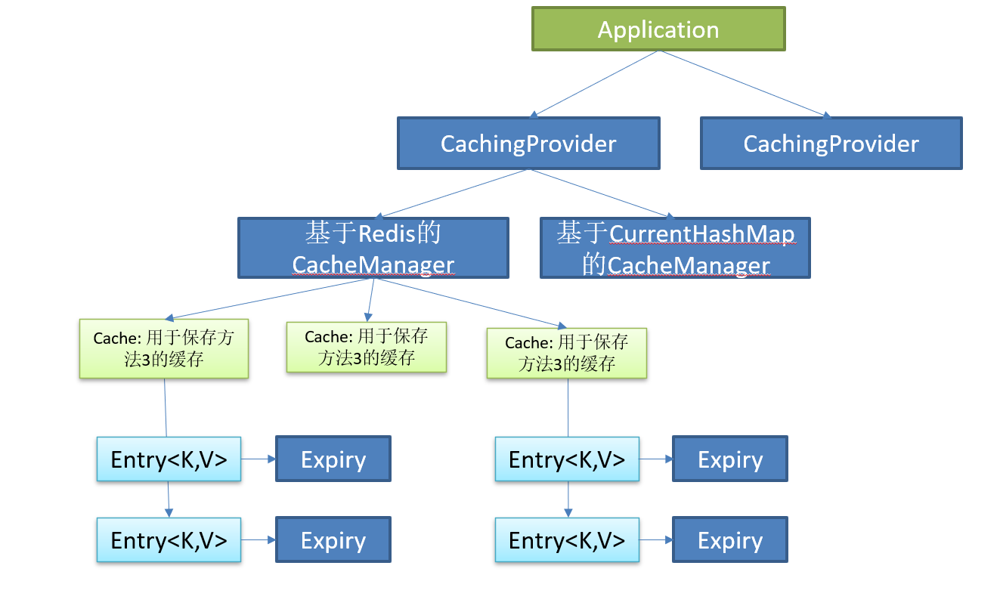

如果要使用JSR107， 那么你需要导入如下的依赖

~~~xml
<dependency>
    <groupId>javax.cache</groupId>
    <artifactId>cache-api</artifactId>
</dependency>
~~~


### Spring中的缓存抽象

要使用JSR107来开发缓存的话, 还是有一定的复杂度的, 所以Spring并没有全部采纳JSR107的全部内容, 

而是从3.1开始定义了`org.springframework.cache.Cache`

和`org.springframework.cache.CacheManager`接口,  他和JSR107中的Cache, CacheManager表示的含义是一样的


每次调用需要缓存功能的方法时，Spring会检查检查指定参数的指定的目标方法是否已经被调用过；如果有就直接从缓存中获取方法调用后的结果，如果没有就调用方法并缓存结果后返回给用户。下次调用直接从缓存中获取。

•使用Spring缓存抽象时我们需要关注以下两点；

1、确定方法需要被缓存以及他们的缓存策略

2、从缓存中读取之前缓存存储的数据


### 在Spring中使用缓存

1. 导入依赖

   ~~~groovy
           <dependency>
               <groupId>org.springframework</groupId>
               <artifactId>spring-context</artifactId>
               <version>6.2.6</version>
           </dependency>
   ~~~

2. 启用缓存

   ~~~java
   @Configuration
   @EnableCaching // 启用缓存的功能
   public class CacheConfiguration {}
   ~~~

3. 定义一个CacheManager

   ~~~java
       @Bean
       ConcurrentMapCacheManager cacheManager() {
           return new ConcurrentMapCacheManager();
       }
   ~~~
   
4. 使用缓存

   ~~~java
   @Configuration
   public class StudentService {
   
       public static record Student(int id, String name) {}
   
       // 先根据参数生成key, 然后看看能不能从Cache中获取对应的缓存, 如果不能获取到, 那么就执行方法, 然后将方法的返回值缓存到Cache中
       @Cacheable(cacheNames = {"student", "studentName"}, key = "#id + '[' + #student.name + ']'")
       public Student getStudentById(int id, Student student) {
           System.out.println("StudentService.getStudentById被调用");
           return new Student(student.id(), student.name());
       }
   ~~~

   Cacheable有如下几个属性

      1. `String[] cacheNames`

         指定当前Cache对象的名称，如果你想将缓存保存到多个Cache中, 那么可以定义多个cacheNames

      2. `String key`

         key的生成策略, 默认是使用方法的参数来作为key, 你也可以通过SpEl表达式来指定
         在SpEl表达式中可以使用如下几个对象
         
         | 对象              | 说明                                                         |
         | ----------------- | ------------------------------------------------------------ |
         | #root.method      | 当前方法的Method对象                                         |
         | #root.method.name | 当前方法的方法名                                             |
         | #root.methodName  | 当前方法的方法名                                             |
         | #root.target      | 当前被调用方法的对象                                         |
         | #root.targetClass | 当前被调用方法的类的Class对象                                |
         | #root.args        | 当前方法的参数数组, 你可以通过#root.args[0]来获取第一个参数  |
         | #root.caches      | 当前方法上的@Cacheable注解的数组, 可以有多个@Cahceable注解, 你可以通过#root.caches[0].name来获取第一个@Cacheable注解的cacheNames属性的值 |
         | #result           | 方法的返回值, 仅在方法执行成功后才可用                       |
         | #exception        | 方法抛出的异常, 仅在方法执行失败后才可用                     |
   | #arg              | 方法的参数, 比如#id, #name, #student.id, #student.name等     |
       
      3. `String keyGenerator`

            指定一个keyGenerator的bean的id, 该bean必须实现`org.springframework.cache.interceptor.KeyGenerator`接口
            keyGenerator和key二选一就好

            ~~~java
            @Component
            public static class MyKeyGenerator implements org.springframework.cache.interceptor.KeyGenerator {
            
                    @Override
                    public Object generate(Object target, Method method, Object... params) {
                        return method.getName() + "[" + Arrays.asList(params).toString()  + "]";
                    }
                }
            
                @Cacheable(cacheNames = {"student", "studentName"}, keyGenerator = "myKeyGenerator")
                public Student getStudentById(int id, Student student) {
                    System.out.println("StudentService.getStudentById被调用");
                    return new Student(student.id(), student.name());
                }
            ~~~

            

      4. `String cacheManager`

            指定从哪个CacheManager来获取当前的Cache对象, 指定bean的id

   5. `String cacheResolver`:

         指定从哪个CacheResolver来获取当前的Cache对象, 指定bean的id

         如果你想使用自定义的CacheResolver, 那么可以实现`org.springframework.cache.interceptor.CacheResolver`接口, 然后将其注册为bean

   6. `String condition`

         只有当condition为true的时候才缓存, 可以使用SpEl表达式来指定, 比如`#id > 10 and #result != null`等

   7. `String unless`

         当满足unless的时候, 不会缓存, 可以使用SpEl表达式来指定, 比如`#student.name eq 'zhangsan' and #result == null`等

   8. `boolean sync`: 是否使用异步模式

5. 更新缓存

   ~~~java
   // 直接调用方法, 然后用返回值更新缓存
       @CachePut(cacheNames = {"student", "studentName"})
       public Student updateStudentById(int id, Student student) {
           System.out.println("StudentService.updateStudentById被调用");
           return new Student(student.id(), student.name());
       }
   ~~~

   CachePut的属性和Cacheable的属性是一样的

6. 删除缓存

   ~~~java
       // 会直接调用方法, 然后根据参数和返回值生成key, 然后根据key删除掉缓存
       @CacheEvict(cacheNames = {"student", "studentName"})
       public void deleteStudentById(int id, Student student) {
   
       }
   ~~~

   CacheEvict比Cacheable多个几个属性:
   1. allEntries: 是否清空所有的缓存, 默认是false

   2. beforeInvocation: 是否在方法执行前清空缓存, 默认是false

      区别在于

      - 如果是在方法执行之前清空缓存, 那么不管方法是否执行成功, 都会清空缓存
      - 如果是在方法执行之后清空缓存, 那么只有方法执行成功的时候才会清空缓存, 如果报错了就不会删除缓存了

#### CacheConfig注解

@CachePut, @Cacheable, @CacheEvict注解都有重复的属性, 如果我们每个方法都定义一遍的话, 会很麻烦

所以我们可以定义在@CacheConfig中, 然后将@CacheConfig标注在类上

这样后续的方法就不用再写这些重复的属性了

   ~~~java
   @Service
   @CacheConfig(cacheNames = {"student", "studentName"},
               key = "#id + '[' + #student.name + ']'")
   public class StudentService {
   
       public static record Student(int id, String name) {}
   
       // 先根据参数生成key, 然后看看能不能从Cache中获取对应的缓存, 如果不能获取到, 那么就执行方法, 然后将方法的返回值缓存到Cache中
       @Cacheable
       public Student getStudentById(int id, Student student) {
           System.out.println("StudentService.getStudentById被调用");
           return new Student(student.id(), student.name());
       }
   
       // 直接调用方法, 然后用返回值更新缓存
       @CachePut
       public Student updateStudentById(int id, Student student) {
           System.out.println("StudentService.updateStudentById被调用");
           return new Student(student.id(), student.name());
       }
   
       // 会直接调用方法, 然后根据参数和返回值生成key, 然后根据key删除掉缓存
       @CacheEvict
       public void deleteStudentById(int id, Student student) {
   
       }
   }
   ~~~

   

#### @Caching注解

这个注解可以组合使用多个@Cacheable, @CachePut, @CacheEvict注解

如果你有多个缓存规则的时候, 那么就可以使用他

~~~java
    @Caching( cacheable = {
                    // 只要命中一个缓存, 那么直接返回, 如果两个缓存都没有命中, 那么会执行方法, 并且将方法的返回值缓存到两个缓存中
                    @Cacheable(cacheNames = {"student"}, key = "#result.id"),
                    @Cacheable(cacheNames = {"studentName"}, key = "#result.name") }
    )
	public Student getStudentById(int id, Student student) { }

    @Caching( evict = {
                    // 同时删除两个缓存
                    @CacheEvict(cacheNames = {"student"}, key = "#result.id"),
                    @CacheEvict(cacheNames = {"studentName"}, key = "#result.name") }
    )
	public void deleteStudentById(int id, Student student) { }

    @Caching( put = {
                    // 同时更新两个缓存
                    @CachePut(cacheNames = {"student"}, key = "#result.id"),
                    @CachePut(cacheNames = {"studentName"}, key = "#result.name") }
    )
	public Student updateStudentById(int id, Student student) { }
~~~


### Spring中缓存的原理

在spring中, 我们添加了@EnableCaching注解时候, 他会通过CachingConfigurationSelector帮我们导入一个配置类ProxyCachingConfiguration

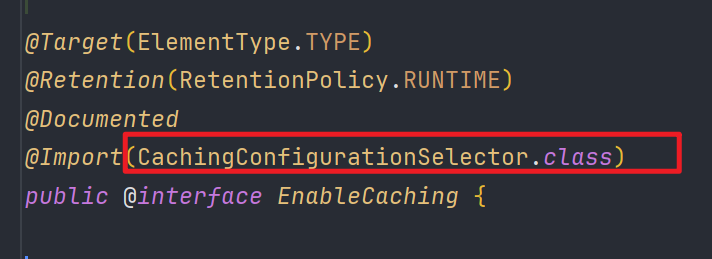

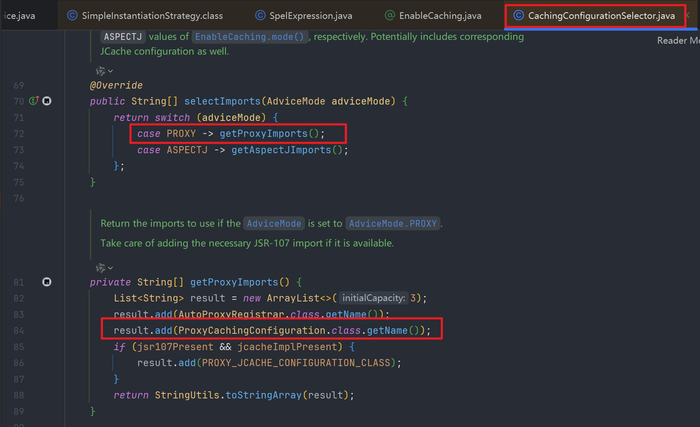

而在ProxyCachingConfiguration中又定义了三个Bean, 分别是BeanFactoryCacheOperationSourceAdvisor, CacheOperationSource, CacheInterceptor

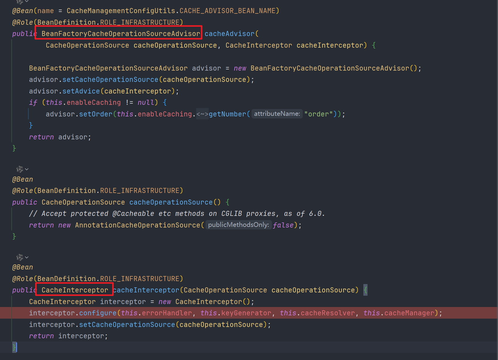

其中BeanFactoryCacheOperationSourceAdvisor表示一个切面, 通过他会拦截所有带@Cacheable, @CachePut, @CacheEvict注解的方法

而CacheInterceptor是真正拦截之后, 要进行的逻辑

如果我们调用了一个带有@Cacheable, @CachePut, @CacheEvict注解的方法, 那么他会调用到CacheInterceptor的invoke方法,  来进行代理, 在里面实现缓存相关的动作


#### CachingConfigurer

上面说到, 通过CachingConfigurationSelector会创建一个ProxyCachingConfiguration的Bean

而ProxyCachingConfiguration在创建的时候, 在父类AbstractCachingConfiguration的会自动获取到所有类型为CachingConfigurer类型的bean

通过CachingConfigurer来获取默认要使用的errorHandler, cacheResolver, cacheManger, keyGenerator

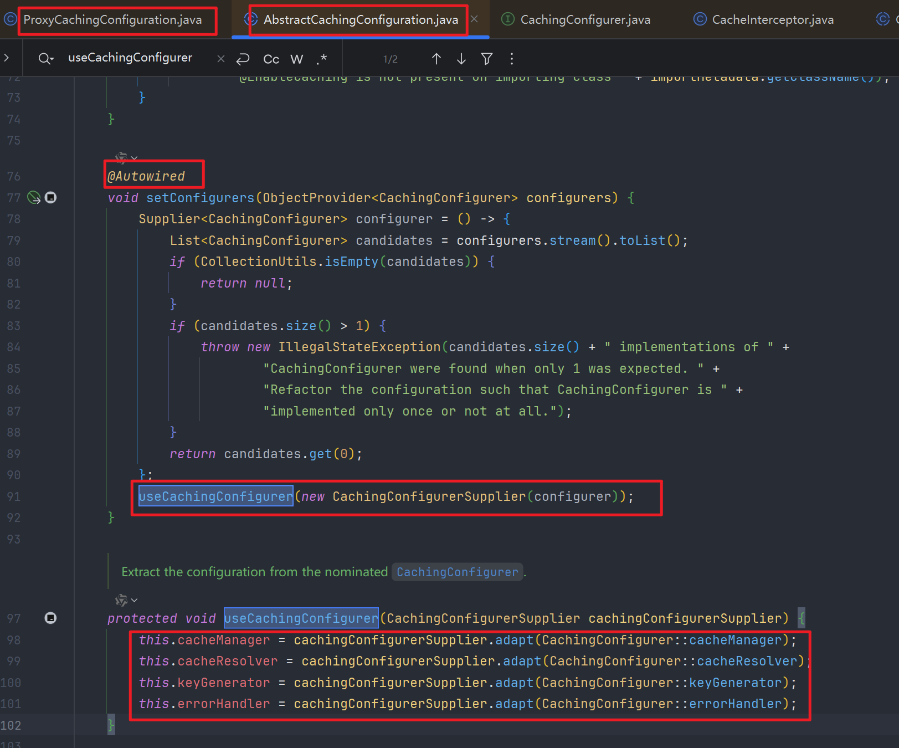

然后在创建CacheInterceptor的时候, 将这几个值传给CacheInterceptor

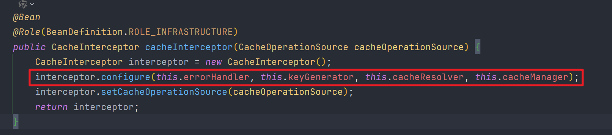

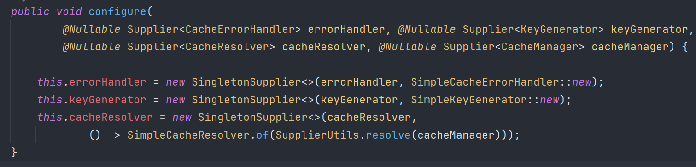


所以我们可以通过配置一个类型为CachingConfigurer的bean, 来设置我们要使用的errorHandler, cacheResolver, cacheManger, keyGenerator

~~~java
    @Bean
    public CachingConfigurer cachingConfigurer() {
        return new CachingConfigurer() {
            @Override
            public CacheManager cacheManager() {
                return CachingConfigurer.super.cacheManager();
            }

            @Override
            public CacheResolver cacheResolver() {
                return CachingConfigurer.super.cacheResolver();
            }

            @Override
            public KeyGenerator keyGenerator() {
                return CachingConfigurer.super.keyGenerator();
            }

            @Override
            public CacheErrorHandler errorHandler() {
                return CachingConfigurer.super.errorHandler();
            }
        };
    }
~~~


我们看到, 在创建CacheInterceptor的时候, 将ProxyCachingConfiguration中的errorHandler, keyGenerator, cacheResolver, cacheManager属性传递给了CacheInterceptor

如果你不设置的话, 默认情况下,  使用的就是SimpleCacheErrorHandler, SimpleCacheResolver, SimpleKeyGenerator

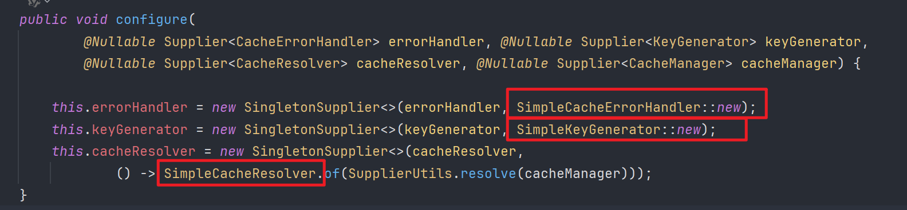

而对于CacheManager, 如果你不通过CacheConfigurer来设置的, 那么在CacheInterceptor的`afterPropertiesSet`方法中, 他会从IOC容器中自动获取一个CacheManager, 来作为默认的CacheManager

如果IOC容器中没有CacheManager类型的bean的话, 那么会报错

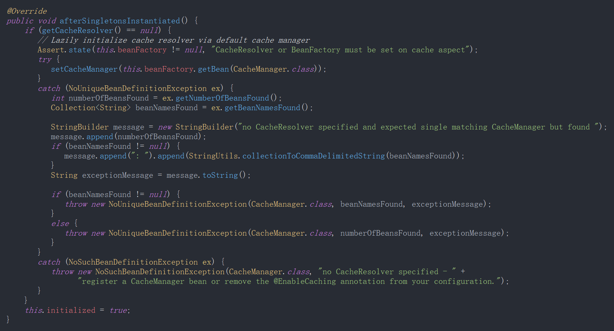

所以你要么通过CacheConfigurer来配置一个CacheManager, 要么通过@Bean来配置一个CacheManager


### 在springboot中使用缓存

在springboto中使用缓存, 你无需导入其他的starter, 因为缓存是spring提供的功能, 你只需要保存**你的项目是springboot项目即可直接使用**


使用的办法和在SpringBoot中使用没有什么不同, 只是不在需要自动手动定义一个CacheManager了, 因为springboot会自动配置

~~~java
@Configuration(proxyBeanMethods = false)
@ConditionalOnMissingBean(CacheManager.class) // 如果我们没有自动配置CacheManager, 那么就自动配置一个
@Conditional(CacheCondition.class) 
class SimpleCacheConfiguration {

    // CacheProperties和CacheManagerCustomizers是两个可以扩展的点
	@Bean
	ConcurrentMapCacheManager cacheManager(CacheProperties cacheProperties,
			CacheManagerCustomizers cacheManagerCustomizers) {
		ConcurrentMapCacheManager cacheManager = new ConcurrentMapCacheManager();
		List<String> cacheNames = cacheProperties.getCacheNames();
		if (!cacheNames.isEmpty()) {
			cacheManager.setCacheNames(cacheNames);
		}
		return cacheManagerCustomizers.customize(cacheManager);
	}
}
~~~


### Cache与其他框架整合

整合的原理非常简单, 在spring-boot-autoconfiguration这个包中有一个类: CacheAutoConfiguration

他会通过CacheConfigurationImprotSelector自动帮我们配置几个类

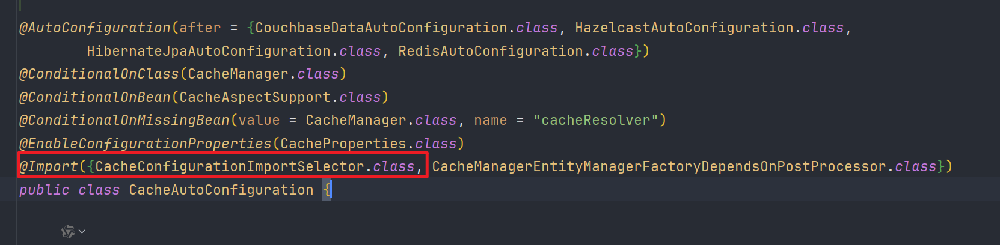

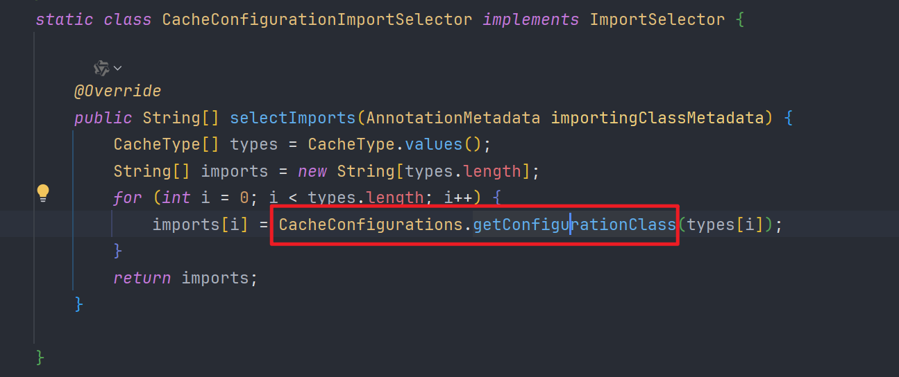

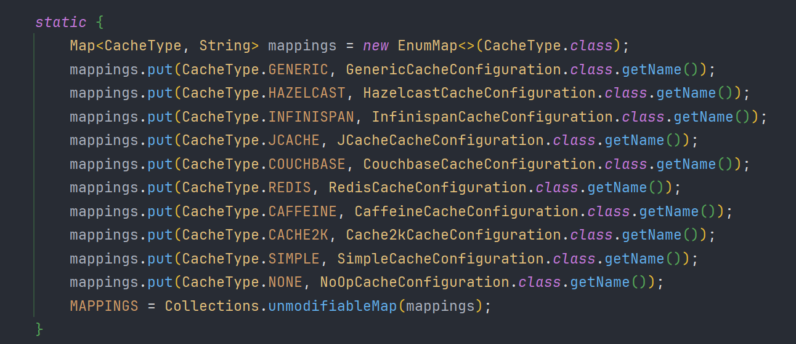

在上面的10个CacheConfiguration中, 也并不是所有的都会生效, 比如我们来看RedisCacheConfiguration

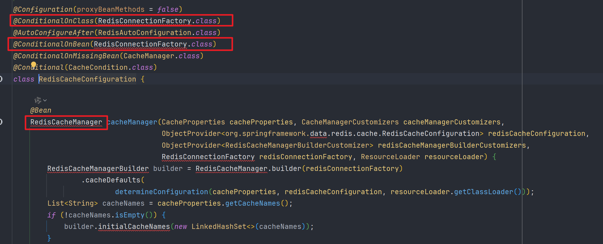

也就是说, 你只有在导入`spring-boot-starter-data-redis`的时候, RedisCacheConfiguration才会生效, 然后帮你配置一个RedisCacheManager

如果你什么也不配置, 那么SimpleCacheConfiguration就会生效, 帮你配置一个ConcurrentMapCacheManager


**所以你想要使用什么类型的缓存, 直接导入对应的starter即可**


#### 与Redis整合

按照上面说的, 我们只需要导入redis的依赖即可

~~~xml
<dependency>
   <groupId>org.springframework.boot</groupId>
   <artifactId>spring-boot-starter-data-redis</artifactId>
   <version>3.4.5</version>
</dependency>
~~~

那么RedisCacheConfiguration就会自动帮我们配置一个RedisCacheManager, 所以你直接的缓存就保存到了Redis上面了


默认情况下, RedisCacheManager操作redis使用的是自动配置的RedisTemplate<Object, Object>

**而RedisTemplate<Object, Object>在默认情况下, 使用的是JDK的序列化机制**, 会导致内存偏大, 并且查看redis的时候也不明显, 如果你想要自定义序列化的的方式, 可以定义一个RedisCacheManagerBuilderCustomizer的bean来制定这个自动配置的RedisCacheManager

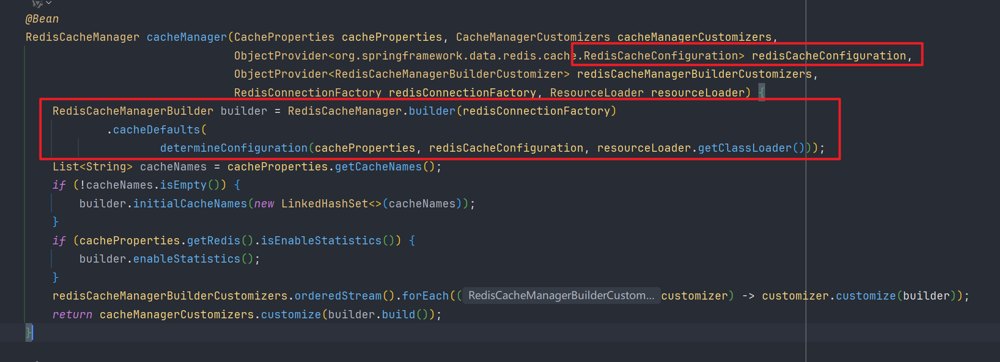

~~~java
    @Bean
    public RedisCacheConfiguration redisCacheConfiguration() {
        RedisCacheConfiguration redisCacheConfiguration = RedisCacheConfiguration.defaultCacheConfig();
        // key直接通过getBytes()序列化, 默认也是如此
        redisCacheConfiguration.serializeKeysWith(RedisSerializationContext.SerializationPair.fromSerializer(RedisSerializer.string()));
        // value通过GenericJackson2JsonRedisSerializer序列化, 默认是JdkSerializationRedisSerializer, 通过java序列化
        redisCacheConfiguration.serializeValuesWith(RedisSerializationContext.SerializationPair.fromSerializer(RedisSerializer.json()));


        redisCacheConfiguration.entryTtl(Duration.ofMinutes(10)); // 设置缓存的过期时间, 默认是0, 不过期
        
        return redisCacheConfiguration;
    }
~~~


## 监控(Springboot Actuator)

###  1. 启用springboot actuator

```xml
<dependency>
        <groupId>org.springframework.boot</groupId>
        <artifactId>spring-boot-starter-actuator</artifactId>
</dependency>
```

### 2. endpoint

endpoint可以帮助你监控应用的信息, 例如，health endpoint提供基本的应用程序运行状况信息

为了远程调用endpoint, 你必须通过http或者jmx去暴露该endpoint

默认情况下, 你可以使用http去访问/actuator/endpoint-id来获取该endpoint所提供的信息

例如: 你可以访问/actuator/health来获取应用的基本进行状况

#### 内置的endpoint

| ID                 | Description                                                  |
| :----------------- | :----------------------------------------------------------- |
| `auditevents`      | Exposes audit events information for the current application. Requires an `AuditEventRepository` bean. |
| `beans`            | Displays a complete list of all the Spring beans in your application. |
| `caches`           | Exposes available caches.                                    |
| `conditions`       | Shows the conditions that were evaluated on configuration and auto-configuration classes and the reasons why they did or did not match. |
| `configprops`      | Displays a collated list of all `@ConfigurationProperties`.  |
| `env`              | Exposes properties from Spring’s `ConfigurableEnvironment`.  |
| `flyway`           | Shows any Flyway database migrations that have been applied. Requires one or more `Flyway` beans. |
| `health`           | Shows application health information.                        |
| `httptrace`        | Displays HTTP trace information (by default, the last 100 HTTP request-response exchanges). Requires an `HttpTraceRepository` bean. |
| `info`             | Displays arbitrary application info.                         |
| `integrationgraph` | Shows the Spring Integration graph. Requires a dependency on `spring-integration-core`. |
| `loggers`          | Shows and modifies the configuration of loggers in the application. |
| `liquibase`        | Shows any Liquibase database migrations that have been applied. Requires one or more `Liquibase` beans. |
| `metrics`          | Shows ‘metrics’ information for the current application.     |
| `mappings`         | Displays a collated list of all `@RequestMapping` paths.     |
| `scheduledtasks`   | Displays the scheduled tasks in your application.            |
| `sessions`         | Allows retrieval and deletion of user sessions from a Spring Session-backed session store. Requires a Servlet-based web application using Spring Session. |
| `shutdown`         | Lets the application be gracefully shutdown. Disabled by default. |
| `threaddump`       | Performs a thread dump.                                      |

如果你的应用是web application (Spring MVC, Spring WebFlux, or Jersey), 以下endpoint也是可用的:

| ID           | Description                                                  |
| :----------- | :----------------------------------------------------------- |
| `heapdump`   | Returns an `hprof` heap dump file.                           |
| `jolokia`    | Exposes JMX beans over HTTP (when Jolokia is on the classpath, not available for WebFlux). Requires a dependency on `jolokia-core`. |
| `logfile`    | Returns the contents of the logfile (if `logging.file.name` or `logging.file.path` properties have been set). Supports the use of the HTTP `Range` header to retrieve part of the log file’s content. |
| `prometheus` | Exposes metrics in a format that can be scraped by a Prometheus server. Requires a dependency on `micrometer-registry-prometheus`. |

#### 2.1 启用endpoints

默认的, 除了shutdown以外的endpoint都是默认启用的, 使用如下配置关闭默认启用的endpoints, 然后为单独的endpoint配置是否启用

```yml
management:
  endpoints:
    enable-by-default: false
  endpoint:
    info:
      enabled: true
```

`enabled`选项控制着该endpoint是否被创建, 他的相关bean是否存在上下文中.

#### 2.2 暴露endpoints

一些endpoints将会暴露敏感的信息, 下表显示了默认情况下内置的endpoints的暴露情况

| ID                 | JMX  | Web  |
| :----------------- | :--- | :--- |
| `auditevents`      | Yes  | No   |
| `beans`            | Yes  | No   |
| `caches`           | Yes  | No   |
| `conditions`       | Yes  | No   |
| `configprops`      | Yes  | No   |
| `env`              | Yes  | No   |
| `flyway`           | Yes  | No   |
| `health`           | Yes  | Yes  |
| `heapdump`         | N/A  | No   |
| `httptrace`        | Yes  | No   |
| `info`             | Yes  | Yes  |
| `integrationgraph` | Yes  | No   |
| `jolokia`          | N/A  | No   |
| `logfile`          | N/A  | No   |
| `loggers`          | Yes  | No   |
| `liquibase`        | Yes  | No   |
| `metrics`          | Yes  | No   |
| `mappings`         | Yes  | No   |
| `prometheus`       | N/A  | No   |
| `scheduledtasks`   | Yes  | No   |
| `sessions`         | Yes  | No   |
| `shutdown`         | Yes  | No   |
| `threaddump`       | Yes  | No   |

你可以使用如下配置去选择endpoint是否暴露http端口或者jmx:

| Property                                    | Default        |
| :------------------------------------------ | :------------- |
| `management.endpoints.jmx.exposure.exclude` |                |
| `management.endpoints.jmx.exposure.include` | `*`            |
| `management.endpoints.web.exposure.exclude` |                |
| `management.endpoints.web.exposure.include` | `info, health` |

`include`表示需要暴露的endpoint, exclude表示不用暴露的, exclude选项优先于include选项, exclude和include都是list, *表示所有endpoint, 在yml中\*表示特殊用法, 使用"\*"代替

for example:

```yml
# 只暴露health, info的jxm
management:
  endpoints:
   jmx:
     exposure:
       include: info, health
# 暴露所有除了info, health的web端口
    web:
      exposure:
        include: "*"
        exclude: info, health
```


## SpringBoot异步调用

### 开启异步调用

**默认情况下, @EnableAsync的mode=AdviceMode.PROXY, 同一个类内部没有使用@Async注解修饰的方法调用@Async注解修饰的方法，是不会异步执行的**

**如果想实现类内部自调用也可以异步，则需要切换@EnableAsync注解的mode=AdviceMode.ASPECTJ**

```java
@SpringBootApplication
@EnableAsync(mode=AdviceMode.PROXY)
public class SpringBootApplication {
    public static void main(String[] args) {
        SpringApplication.run(SpringBootApplication.class, args);
    }
}
```

### 使用@Async标注方法

**任意参数类型都是支持的，但是方法返回值必须是void或者Future类型。**

**当使用Future时，你可以使用 实现了Future接口的ListenableFuture接口或者CompletableFuture类与异步任务做更好的交互。**

**如果异步方法有返回值，没有使用Future<V>类型的话，调用方获取不到返回值。**

```java
// 无返回值的方法
@Async 
public void asyncLog() throws Exception { ... } 

	// 有返回值的方法
    @Async
    public CompletableFuture<String> test() {
        System.out.println(Thread.currentThread().getName());
        return CompletableFuture.completedFuture("result");
    }

// 判断异步方法是否完成
public void finish()  throws InterruptedException, ExecutionException {  
    Future<String> future = asyncAnnotationExample.asyncMethodWithReturnType();  
    while (true) {  ///这里使用了循环判断，等待获取结果信息  
        if (future.isDone()) {  //判断是否执行完毕  
            System.out.println("Result from asynchronous process - " + future.get()); 
            break;  
        }
    }  
}
```

### @Async中的异常处理机制

如果不配置异常处理机制的话, 默认会使用如下的处理机制:

~~~java
public class SimpleAsyncUncaughtExceptionHandler implements AsyncUncaughtExceptionHandler {
	private static final Log logger = LogFactory.getLog(SimpleAsyncUncaughtExceptionHandler.class);
    
	@Override
	public void handleUncaughtException(Throwable ex, Method method, Object... params) {
        // 只是打印错误
		if (logger.isErrorEnabled()) {
			logger.error("Unexpected exception occurred invoking async method: " + method, ex);
		}
	}

}
~~~

如果要自己来处理异常错误的话, 可以配置

~~~java
    @Bean
    public AsyncConfigurer asyncConfigurer() {
        // 配置Async使用的默认线程池
        return new AsyncConfigurer() {
            @Override
            public Executor getAsyncExecutor() {
                return new ThreadPoolExecutor(4, 4, 5, TimeUnit.SECONDS, new LinkedBlockingDeque<>(),
                    new ThreadPoolExecutor.CallerRunsPolicy());
            }
			// 配置async的异常处理逻辑
            @Override
            public AsyncUncaughtExceptionHandler getAsyncUncaughtExceptionHandler() {
                return new AsyncUncaughtExceptionHandler() {
                    @Override
                    public void handleUncaughtException(Throwable ex, Method method, Object... params) {
                        System.out.printf("%s 方法发生了异常, 异常信息: %s%n", method.getName(), ex.getMessage());
                    }
                };
            }
        };
    }
~~~

### @Async异步调用使用的线程池

1. 会判断@Async的value属性上有没有设置使用的线程池, 

   value属性可以设置Executor或者TaskExecutor类的Bean的名称, 也可以设置为SpEL表达式

2. 如果@Async没有设置value属性, 那么会查看有没有配置AsyncConfigurer类型的Bean, 如果配置了, 那么会调用这个Bean的getAsyncExecutor来拿到线程池

3. 如果也没有配置AsyncConfigurer, 那么会从beanFactory从获取TaskExecutor类型的bean, 如果有多个这个类型的bean的话, 那么就获取名字为taskExecutor的

4. 如果beanFactory中也没有的话, 那么就使用

### @Async调用中的事务处理机制

在`@Async`标注的方法，同时也使用`@Transactional`进行标注；在其调用数据库操作之时，将无法产生事务管理的控制，原因就在于其是基于异步处理的操作。

那该如何给这些操作添加事务管理呢？

可以将需要事务管理操作的方法放置到异步方法内部，在内部被调用的方法上添加`@Transactional`

~~~~java
@Async
public void A() {
    B();
    C();
}

@Transactional
public void B(){}

@Transactional
public void C(){}
~~~~


### @Async注解的原理

todo


## 定时任务

定时任务这个功能是spring提供的功能, 而不是springboot提供的功能, 所以在spring中也可以使用


#### 开启定时任务

```java
@SpringBootApplication
@EnableScheduling
public class Application {

	public static void main(String[] args) {
		SpringApplication.run(Application.class, args);
	}
}
```

#### 使用注解配置定时任务

```java
@Component
public class Scheduler2Task {

    private static final SimpleDateFormat dateFormat = new SimpleDateFormat("HH:mm:ss");

    @Scheduled(cron="*/6 * * * * ?")
    public void reportCurrentTime() {
        System.out.println("现在时间：" + dateFormat.format(new Date()));
    }
}

//参数说明
//@Scheduled 参数可以接受两种定时的设置，一种是我们常用的cron="*/6 * * * * ?",一种是 fixedRate = 6000，两种都表示每隔六秒打印一下内容。

//fixedRate 说明

@Scheduled(fixedRate = 6000) //上一次开始执行时间点之后6秒再执行
@Scheduled(fixedDelay = 6000) //上一次执行完毕时间点之后6秒再执行
@Scheduled(initialDelay=1000, fixedRate=6000) //第一次延迟1秒后执行，之后按 fixedRate 的规则每6秒执行一次
```

#### 定时任务设置规则

| 序号 | 说明 | 是否必填 | 允许填写的值      | 允许的通配符      |
| ---- | ---- | -------- | ----------------- | ----------------- |
| 1    | 秒   | 是       | 0-59              | , - * /           |
| 2    | 分   | 是       | 0-59              | , - * /           |
| 3    | 时   | 是       | 0-23              | , - * /           |
| 4    | 日   | 是       | 1-31              | , - * ? / L W C   |
| 5    | 月   | 是       | 1-12或JAN-DEC     | , - * /           |
| 6    | 周   | 是       | 1-7或SUN-SAT      | , - * ? / L W C # |
| 7    | 年   | 否       | empty 或1970-2099 | , - * /           |

通配符说明:

\* 表示所有值. 例如:在分的字段上设置 "*",表示每一分钟都会触发

? 表示不指定值。使用的场景为不需要关心当前设置这个字段的值。

例如:要在每月的10号触发一个操作，但不关心是周几，所以需要周位置的那个字段设置为"?" 具体设置为 0 0 0 10 * ?

\- 表示区间。例如 在小时上设置 "10-12",表示 10,11,12点都会触发。

, 表示指定多个值，例如在周字段上设置 "MON,WED,FRI" 表示周一，周三和周五触发

/ 用于递增触发。如在秒上面设置"5/15" 表示从5秒开始，每增15秒触发(5,20,35,50)。 在月字段上设置'1/3'所示每月1号开始，每隔三天触发一次。

L 表示最后的意思。在日字段设置上，表示当月的最后一天(依据当前月份，如果是二月还会依据是否是润年[leap])。**在周字段上表示星期六，相当于"7"或"SAT"。**如果在周字段上，在"L"前加上数字，则表示该数据的最后一个，"6L"这样的格式,则表示“本月最后一个星期五"

W 表示离指定日期的最近那个工作日(周一至周五). 例如在日字段上设置"15W"，表示离每月15号最近的那个工作日触发。如果15号正好是周六，则找最近的周五(14号)触发, 如果15号是周未，则找最近的下周一(16号)触发.如果15号正好在工作日(周一至周五)，则就在该天触发。如果指定格式为 "1W",它则表示每月1号往后最近的工作日触发。如果1号正是周六，则将在3号下周一触发。(注，"W"前只能设置具体的数字,不允许区间"-").

\# 序号(表示每月的第几个周几)，例如在周字段上设置"6#3"表示在每月的第三个周日.注意如果指定"6#5",正好第五周没有周日，则不会触发该配置(用在母亲节和父亲节再合适不过了) ；

小提示：
'L'和 'W'可以组合使用。如果在日字段上设置"LW",则表示在本月的最后一个工作日触发；
周字段的设置，若使用英文字母是不区分大小写的，即MON 与mon相同；

```text
CronTrigger配置完整格式为： [秒] [分] [小时] [日] [月] [周] [年]
示例：
没有年份的默认为empty, 即表示每年

0 0 10,14,16 * * ? 每天上午10点，下午2点，4点
0 0/30 9-17 * * ?   朝九晚五工作时间内每半小时
0 0 12 ? * WED 表示每个星期三中午12点 
"0 0 12 * * ?" 每天中午12点触发 
"0 15 10 ? * *" 每天上午10:15触发 
"0 15 10 * * ?" 每天上午10:15触发 
"0 15 10 * * ? *" 每天上午10:15触发 
"0 15 10 * * ? 2005" 2005年的每天上午10:15触发 
"0 * 14 * * ?" 在每天下午2点到下午2:59期间的每1分钟触发 
"0 0/5 14 * * ?" 在每天下午2点到下午2:55期间的每5分钟触发 
"0 0/5 14,18 * * ?" 在每天下午2点到2:55期间和下午6点到6:55期间的每5分钟触发 
"0 0-5 14 * * ?" 在每天下午2点到下午2:05期间的每1分钟触发 
"0 10,44 14 ? 3 WED" 每年三月的星期三的下午2:10和2:44触发 
"0 15 10 ? * MON-FRI" 周一至周五的上午10:15触发 
"0 15 10 15 * ?" 每月15日上午10:15触发 
"0 15 10 L * ?" 每月最后一日的上午10:15触发 
"0 15 10 ? * 6L" 每月的最后一个星期五上午10:15触发 
"0 15 10 ? * 6L 2002-2005" 2002年至2005年的每月的最后一个星期五上午10:15触发 
"0 15 10 ? * 6#3" 每月的第三个星期五上午10:15触发 
```


#### 定时任务使用的线程池

```java

```


### 定时任务的原理

todo


## SpringBoot 数据校验

### 相关注解

**空检查**

- @Null       通过 `== null`来判断是否为null
- @NotNull    通过`!= null`来判断不为null
- @NotBlank 通过`obj != null && obj.strim().length != 0`来判断
- @NotEmpty 判断一个`字符串/集合`是否为空
- @Pattern    验证 String 对象是否符合正则表达式的规则

**Booelan检查**

- @AssertTrue     验证 Boolean 对象是否为 true  
- @AssertFalse    验证 Boolean 对象是否为 false  

**长度检查**

- @Size(min=, max=) 验证对象（Array,Collection,Map,String）长度是否在给定的范围之内  
- @Length(min=, max=) 校验字符串长度必须在min, max之间

**日期检查**

- @Past           验证 Date 和 Calendar 对象是否在当前时间之前  
- @Future     验证 Date 和 Calendar 对象是否在当前时间之后  

**数值检查**

**建议使用在Stirng,Integer类型，不建议使用在int类型上，因为表单值为“”时无法转换为int，但可以转换为Stirng为"",Integer为null**

- @Min            验证 Number 和 String 对象是否大等于指定的值  

- @Max            验证 Number 和 String 对象是否小等于指定的值  

- @DecimalMax 验证BigDecimal的最大值

  ~~~java
  @DecimalMax(value = "100.00", inclusive = true, message = "Value must be less than or equal to 100.00") // inclusive表示是否包括100.00
  private BigDecimal amount;
  ~~~

- @DecimalMin 验证BigDecimal的最小值

  ~~~java
  @DecimalMin(value = "0.00", inclusive = false, message = "Value must be greater than 0.00")
  private BigDecimal amount;
  ~~~

- @Digits     校验数字元素的整数部分和小数部分的位数, 作用于`BigDecimal`，`BigInteger`，字符串，以及`byte`, `short`,`int`, `long`以及它们的包装类型。

  ~~~java
  @Digits(integer = 5, fraction = 2, message = "Number must have up to 5 integer digits and 2 fraction digits")
  private BigDecimal amount;
  ~~~

- @Range(min=, max=) 检查数字是否介于min和max之间.

- @Range(min=10000,max=50000,message="range.bean.wage")
  private BigDecimal wage;

**其他检测**

- @CreditCardNumber信用卡验证
- @Email  验证是否是邮件地址，如果为null,不进行验证，算通过验证。
- @ScriptAssert(lang= ,script=, alias=)
- @URL(protocol=,host=, port=,regexp=, flags=)

### 基础模型包导入依赖

如果我们有一个基础的model包, 他只保存数据库表对应的POJO, 他上面有一些校验的注解, 但是他并不需要校验的功能, 而是由上层包来实现具体的功能, 那么我们可以只导入相关注解的包即可

~~~xml
<dependency>
    <groupId>javax.validation</groupId>
    <artifactId>validation-api</artifactId>
    <version>2.0.1.Final</version>
</dependency>
<dependency>
    <groupId>org.hibernate.validator</groupId>
    <artifactId>hibernate-validator</artifactId>
    <version>6.0.13.Final</version>
</dependency>
~~~


### 使用原生方式进行验证

1. 导入maven

   ~~~xml
   <!-- 根据 JSR 380 规范，validation-api依赖项包含标准验证 API -->
   <dependency>
       <groupId>javax.validation</groupId>
       <artifactId>validation-api</artifactId>
       <version>2.0.1.Final</version>
   </dependency>
   
   <!-- Hibernate Validator 是验证 API 的参考实现 -->
   <dependency>
       <groupId>org.hibernate.validator</groupId>
       <artifactId>hibernate-validator</artifactId>
       <version>6.0.13.Final</version>
   </dependency>
   ~~~

2. Bean添加验证注解

   ~~~java
   @Data
   public class User {
       @NotNull(message = "名字不能为空")
       private String name;
   
       @AssertTrue
       private boolean working;
   
       @Size(min = 10, max = 200, message = "字符数应介于10和200之间（含10和200）")
       private String aboutMe;
   
       @Min(value = 18, message = "年龄不应少于18岁")
       @Max(value = 150, message = "年龄不应超过150岁")
       private int age;
   
       @Email(message = "电子邮件应该是有效的")
       private String email;
   
       private List<@NotBlank(message = "备注说明不能为空") String> preferences;
   
       @Past(message = "出生年月必须是一个过去的时间")
       private LocalDate dateOfBirth;
   
       @DecimalMin(value = "0.0", inclusive = false, message = "付款金额不能小于0")
       @Digits(integer = 4, fraction = 2, message = "付款金额必须小于{integer}位数且不能超过{fraction}位小数")
       private BigDecimal price;
       
   }
   ~~~

3. 验证程序

   ~~~java
   public class ValidationTest {
   
       private Validator validator;
   
       @Before
       public void setup() {
           ValidatorFactory factory = Validation.buildDefaultValidatorFactory();
           validator = factory.getValidator();
       }
   
       @Test
       public void ifNameIsNull() {
           User user = new User();
           user.setWorking(true);
           user.setAboutMe("me");
           user.setAge(50);
           
           // validate方法来验证我们的 UserBean User对象中定义的约束都将作为Set返回
           Set<ConstraintViolation<User>> violations = validator.validate(user);
           for (ConstraintViolation<User> violation : violations) {
               // getMessage方法获取所有违规消息
               System.out.println(violation.getMessage());
           }
       }
   }
   ~~~

   

### springboot中使用参数校验

引入依赖

~~~xml
<dependency>
  <groupid>org.springframework.boot</groupid>
  <artifactid>spring-boot-starter-web</artifactid>
</dependency>
<!-- Boot 2.3 开始，我们还需要显式添加spring-boot-starter-validation依赖项, 之前不需要-->
<dependency>
  <groupid>org.springframework.boot</groupid>
  <artifactid>spring-boot-starter-validation</artifactid>
</dependency>
~~~

#### controller层校验DTO

在controller层, 可以使用@Valid和@Validated标注在方法参数上, 进行校验DTO

**如果校验失败, 如果controller参数后面跟了BindingResult, 那么会把错误放在BindingResult中, ** 不推荐这种方式, 直接在全局异常处理中     

**如果没有这个参数, 那么会直接抛出MethodArgumentNotValidException异常, 这样就必须在全局异常处理中进行处理**

@Valid和@Validated他们的区别在于

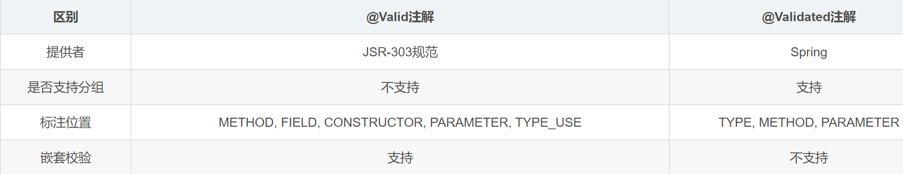

~~~java
@Data
public class User {
    // 每一个注解都包含了message字段，用于校验失败时作为提示信息。不写message将使用默认的错误提示信息。
    @Size(min = 5, max = 10, message = "请输入5-10个字符的用户名")
    private String username;
}


@RestController
@RequestMapping("/a/user")
public class AUserController {
    // 使用@Validated, 支持分组校验, 不支持递归校验
    @PostMapping
    public Object addUser(@Validated User user, BindingResult bindingResult) {
        if (bindingResult.hasErrors()) 
            return "fail";
        return "success";
    }
    
    // 需要校验多个参数, 直接在参数后面跟一个BindingResult
    @PostMapping
    public Object addUser(@Validated Foo foo, BindingResult fooBindingResult, @Validated Bar bar, BindingResult barBindingResult) {
        if (bindingResult.hasErrors()) 
            return "fail";
        return "success";
    }
    
    // 使用@Valid, 不支持分组, 支持递归校验
    // 后面跟BindingResult, 保存错误信息
    @PutMapping("/fun1")
    public Object updateUser1(@Valid User user, BindingResult bindingResult) {
        if (bindingResult.hasErrors()) 
            return "fail";
        return "success";
    }
    // 这种写法会直接抛出MethodArgumentNotValidException异常
    @PutMapping("/fun3")
    public Object updateUser3(@Valid User user) {
        return null;
    }
}
~~~

#### controller层中校验普通参数

~~~java
// 校验失败会抛出 ConstraintViolationException 异常。
// 这个时候不能添加BindingResult
@GetMapping("/fun3")
public Object fun3(@Length(min = 5, max = 10) @NotNull String username, @PathVariable @Min(1000L) Long userId) {
    // 校验通过才会执行业务逻辑
    return "ok";
}
~~~

#### 异常处理

只处理当前controller中的校验异常

~~~java
@RestController
@RequestMapping("/a/user")
public class AUserController {
    // 使用@Validated, 支持分组校验, 不支持递归校验
    @PostMapping
    public Object addUser(@Validated User user, BindingResult bindingResult) {
        if (bindingResult.hasErrors()) 
            return "fail";
        return "success";
    }
    // 这个exception方法会处理当前controller中抛出的所有RuntimeException
    @ExceptionHandler(RuntimeException.class)
	@ResponseStatus(HttpStatus.BAD_REQUEST)
    public String exception(RuntimeException ex){
        Map<String, String> map = new HashMap<>();
        map.put("code", "400");
        map.put("message", ex.getMessage());
        return new Gson().toJson(map);
    }
}
~~~

全局的异常处理

~~~java
@RestControllerAdvice
public class AdviceController {

    @ResponseBody // 返回的json数据
    @@ResponseStatus(HttpStatus.BAD_REQUEST) // 定义response的http code
    @ExceptionHandler({ConstraintViolationException.class, MethodArgumentNotValidException}) // 定义要拦截的异常类型
    public String exception(RuntimeException ex){
        Map<String, String> map = new HashMap<>();
        map.put("code", "300");
        map.put("message", ex.getMessage());
        return new Gson().toJson(map);
    }
}
~~~


#### controller层中的分组校验

~~~java
@Data
public class User {
    // groups：标识此校验规则属于哪个分组，可以指定多个分组
    @NotNull(groups = Update.class)
    @Min(value = 10000L, groups = Update.class)
    private Long userId;

    @NotNull(groups = {Save.class, Update.class})
    @Length(min = 2, max = 10, groups = {Save.class, Update.class})
    private String userName;

    @NotNull(groups = {Save.class, Update.class})
    @Length(min = 6, max = 20, groups = {Save.class, Update.class})
    private String account;

    @NotNull(groups = {Save.class, Update.class})
    @Length(min = 6, max = 20, groups = {Save.class, Update.class})
    private String password;

    // 校验分组中不需要定义任何方法，该接口仅仅是为了区分不同的校验规则
    public interface Save { }
    public interface Update { }
}

@RestController
@RequestMapping("/user")
public class UserController {
    // 通过@Validate指定分组
    @PostMapping
    public Object saveUser(@RequestBody @Validated(User.Save.class) User user) { }
}
~~~

#### 递归校验

~~~java
@Data
public class User {

    @Min(value = 1L, groups = Update.class)
    private Long userId;
    
    @Valid  // 添加上@Valid, 表示需要递归校验
    @NotNull
    private Job job;

    @Data
    public static class Job {
        @Length(min = 2, max = 10)
        private String jobName;
    }
}
@RestController
@RequestMapping("/user")
public class UserController {

    @PostMapping
    // 这里使用@Valid或者@Validated都可以
    public Object saveUser(@RequestBody @Validated User user) {
        // 校验通过，才会执行业务逻辑处理
        return "ok";
    }
}
~~~


#### 自定义注解校验

定义一个注解, 修饰的字符串长度在6-12之间

~~~java
@Retention(RetentionPolicy.RUNTIME)
// 指定当前注解可以添加的位置
@Target({ElementType.FIELD, ElementType.PARAMETER, ElementType.ANNOTATION_TYPE})
// 指定当前注解的校验器
@Constraint(validatedBy = {Password.PasswordValidator.class})
public @interface Password {

    public String message() default "密码格式不合法";

    Class<?>[] groups() default {};

    Class<? extends Payload>[] payload() default {};

    // 自定义校验器
    // 第一个泛型是当前校验器支持的注解
    // 第二个泛型是需要校验的值的目标类型
    public static class PasswordValidator implements ConstraintValidator<Password, String> {

        @Override
        public void initialize(Password constraintAnnotation) {
            // 这里可以获取注解的配置
        }

        @Override
        public boolean isValid(String value, ConstraintValidatorContext constraintValidatorContext) {
            int length = StringUtils.length(value);
            if (length >= 6 && length <= 12) {
                return true;
            }
            return false;
        }
    }
}
~~~

#### service层校验

~~~~java
@Service
// 添加这个注解后, spring会进行切面, 拦截所有方法, 看上面有没有需要校验的参数
// 如果无效, 记得导包spring-boot-starter-validation
@Validated 
public class MyService {
    public String testParams(@NotNull @Valid User user, @Min(10) Integer id, @NotBlank String name) {
        return user.toString();
    }
}
~~~~

#### @Validated校验方法参数的原理


## Springboot 日志系统

### 各种日志系统

首先说说市面上的日志系统吧

日志门面

1. JCL(Jakarta Commons Logging)

   JCL最初是由Apache软件基金会的Jakarta 项目组开发的，当时它是 Apache Jakarta 项目的一部分。在2011年，Jakarta 项目组重新组织并成为 Apache Commons 项目。因此，JCL 目前被称为 Apache Commons Logging。

2. slf4j

日志实现

1. log4j

   Log4j 开始出现，并成为一个流行的 Java 日志记录包，后来贡献给 Apache 基金会，但在 2015 年宣布不在维护了。

2. reload4j

   reload4j 是 Apache log4j 版本 1.2.17 的一个分支，旨在解决 log4j 的安全问题。Reload4j 是log4j 版本 1.2.17 的直接替代品，所以想继续使用 log4j 1.x 的框架，推荐使用 slf4j-reload4j 进行替代。

3. JUL

   2002 年 Java 1.4 发布，同时推出自己的日志库 JUL（Java Util Logging）。Apache 曾建议 sun 公司 将 Log4j 引入到 jdk 中，但被拒绝了，sun 公司仿照 Log4j，实现一套自己的日志实现框架，即 JUL。

4. logback

5. log4j2

综上: 日志门面就选slf4j,  日志实现就在logback和log4j2中间里面选一个


### slf4j整合日志实现

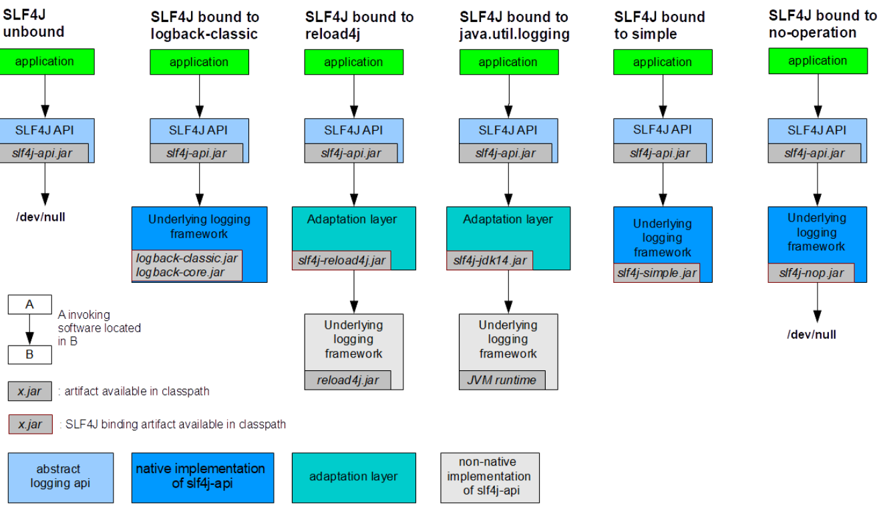

参考这个图片:

1. 如果你只导入一个slf4j-api.jar的话,  那么没有日志门面, 所有的日志都会被丢弃
2. 导入`slf4j-api.jar 和 logback-classic.jar`, 那么就整合了logback
3. 导入`slf4j-api.jar, slfj-reload4j.jar` 那么就整合了reload4j
4. 导入`slf4j-api.jar, slf4j-jdk14.jar`, 那么就整合了JUL
5. 导入`slf4j-api.jar, log4j-slf4j-impl`那么就整合了log4j2 (没错, 就是log4j-slf4j-impl)


### 切换不同框架的日志

当我们系统引入了不同的框架的时候, 框架内部使用的也不是同一套日志系统, 比如Hibernate使用的是jboss-logging, spring使用的是jcl, mybatis使用的又是别的日志系统

如果我的项目中只想使用slf4j + logback, 应该怎么切换这些框架内部的日志系统呢?

我们可以参考如下的图片

1. 如果你的应用要使用`slf4j-api.jar, logback-classic.jar`, 并且其他的框架中使用了JCL, log4j, jul这些框架, 比如spring使用的jcl框架

   那么你在使用导入spring的时候, 要exclude掉jcl依赖, 然后导入一个`jcl-over-slf4j.jar`

   这个包就是一个偷天换日包, 他里面有jcl的所有类, 但是在输出日志的时候却是调用了slf4j的接口

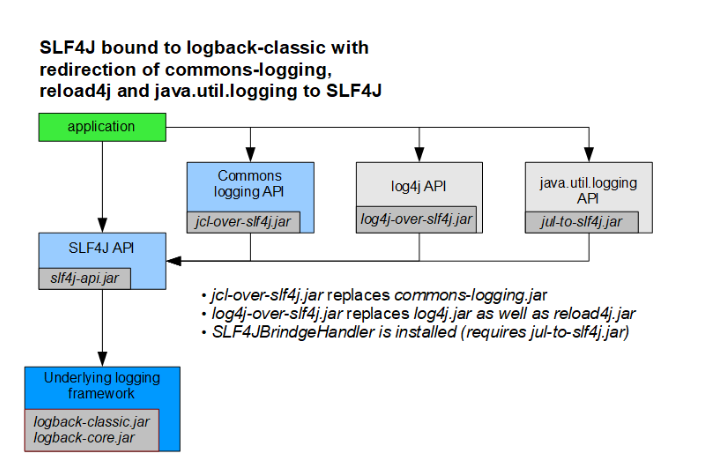


2. 如果你的应用使用的是`slf4j-api.jar, slf4j-reload.jar`, 也是同样的方式, 排除掉框架中使用的jcl和jul依赖, 并添加jcl-over-slf4j.jar 或者 jul-to-slf4j.jar

   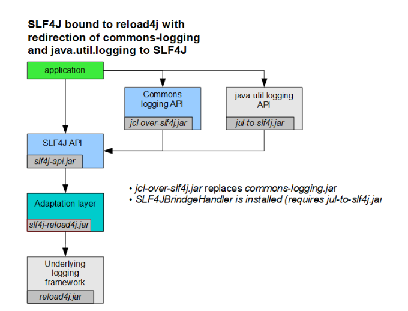


**包括springboot也是这么做的, springboot使用的是slf4j+logback, 而spring使用的是jcl框架, 所以在springboot引入spring的时候, 要排除掉jcl的依赖, 然后导入jcl-over-slf4j的依赖**

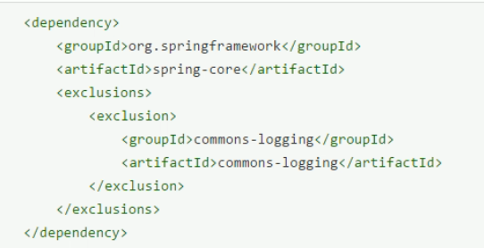

### slf4j如何查找日志门面

#### 总结

使用slf4j的时候, 我们通过如下代码来获取Logger

~~~java
Logger logger = LoggerFactory.getLogger(getClass())
~~~

他会一路调用到`StaticLoggerBuilder.getSingleton().getLoggerFactory`

而`StaticLoggerBuilder`这个类并不是由slf4j提供了, 而是由具体的日志门面提供的, 比如logback

由具体的实现来提供`StaticLoggerBuilder`然后创建LoggerFactory, 然后创建Logger


如果我们自己要实现一套日志系统的话, 也要提供StaticLoggerBuilder这个类来适配slf4j


#### 如果有多个日志实现怎么办

如果你有多个日志实现的话, 也就意味着classpath下有多个StaticLoggerBuilder.class, 那么slf4j能够通过`ClassLoader.getSystemResources`检测到并打印日志

具体使用哪一个StaticLoggerBuilder的话, 其实是由ClassLoader决定的, 一般ClassLoader在加载类的时候, 如果有多个同包同名的类, 只会加载第一个, 也就是slf4j会使用第一个查找到的StaticLoggerBuilder


#### 具体实现过程

我们通过如下代码来获取Logger

~~~java
Logger logger = LoggerFactory.getLogger(getClass())
~~~

他的执行过程如下:

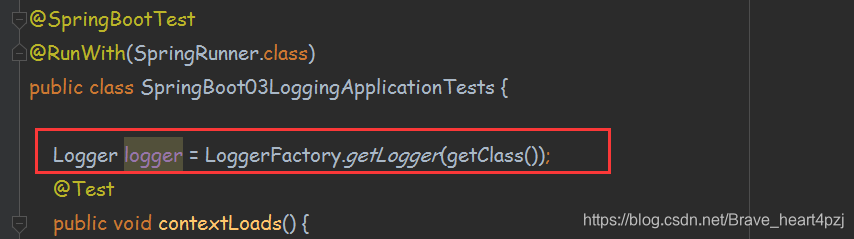

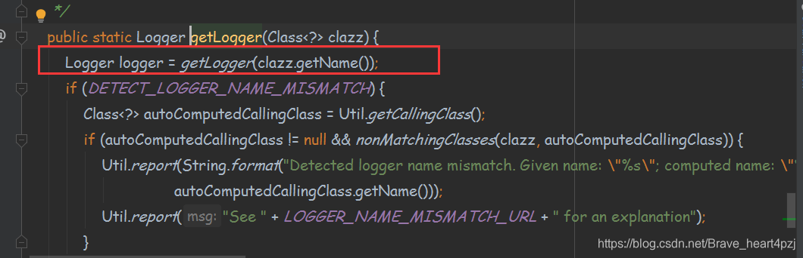

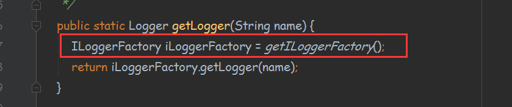

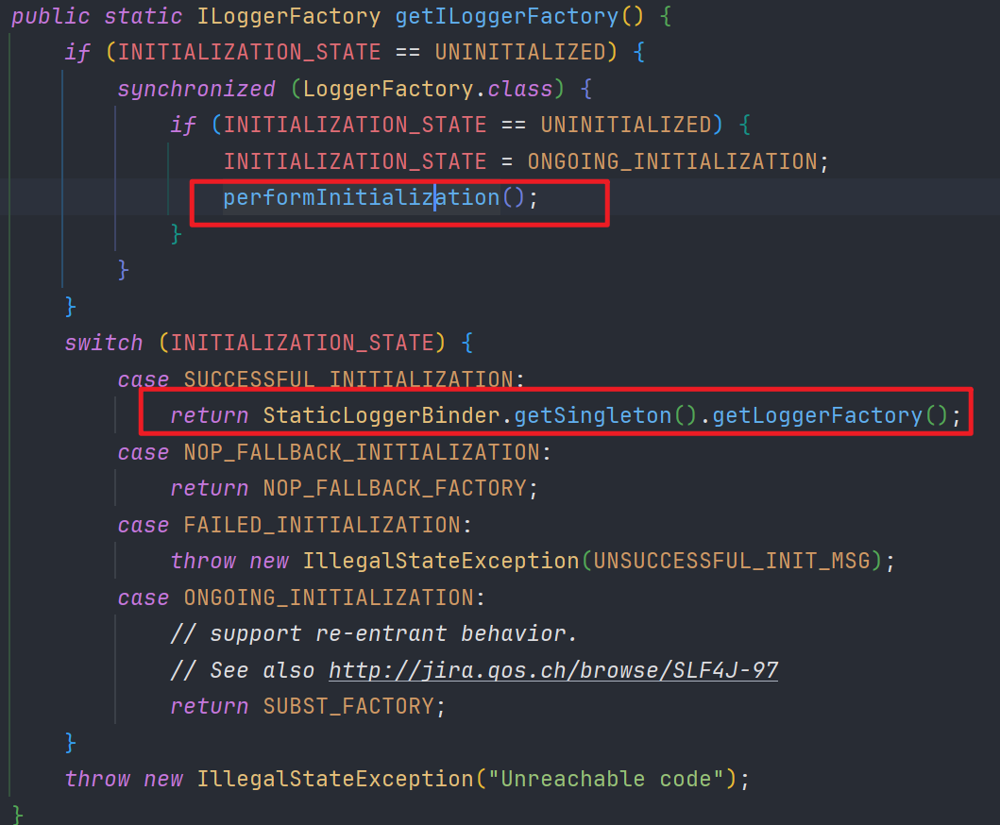

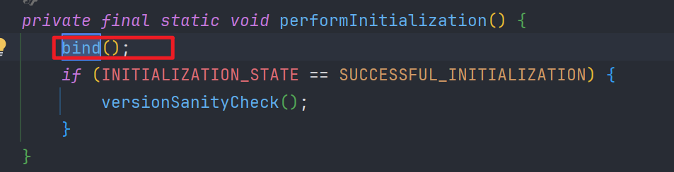

在`performInitialization`方法里面, 会调用bind方法

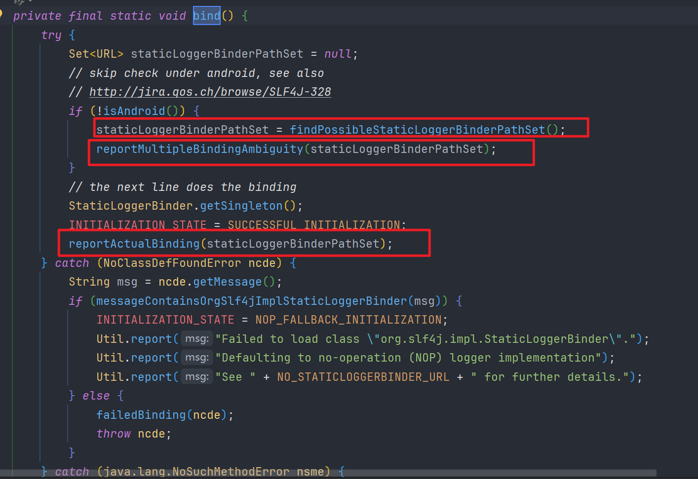

在bind方法里面, 调用`findPossibleStaticLoggerBindPathSet`, 他会通过classloader来查找classpath下的`org/slf4j/impl/StaticLoggerBuilder.class`

注意这里使用的是`ClassLoader.getSystemResources`这个方法, 而不是`ClassLoader.getClass`, 有两个原因

1. 因为getClass会直接加载类, 如果有多个一样的, 就加载第一个, 而是用`getSystemResources`的话, 他只是加载资源并返回所有的路径, 只不过这里的资源是class文件
2. getClass会导致类加载

这样我们就获得了classpath下所有StaticLoggerBinder.class的路径

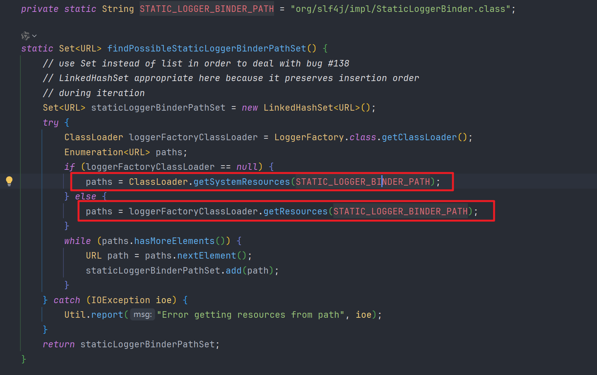

之后会调用`reportMultipleBindingAmbiguity`来打印查找到的StaticLoggerBinder

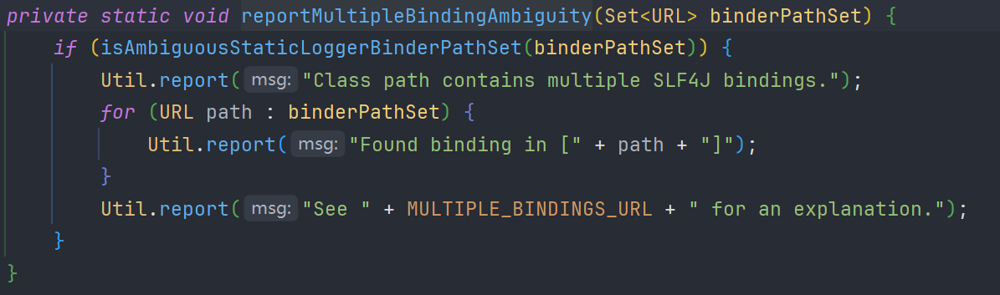

~~~txt
SLF4J: Class path contains multiple SLF4J bindings.
SLF4J: Found binding in [jar:file:/E:/apache-maven/apache-maven-repository/ch/qos/logback/logback-classic/1.2.11/logback-classic-1.2.11.jar!/org/slf4j/impl/StaticLoggerBinder.class]
SLF4J: Found binding in [jar:file:/E:/apache-maven/apache-maven-repository/org/apache/logging/log4j/log4j-slf4j-impl/2.19.0/log4j-slf4j-impl-2.19.0.jar!/org/slf4j/impl/StaticLoggerBinder.class]
SLF4J: Found binding in [jar:file:/E:/apache-maven/apache-maven-repository/org/slf4j/slf4j-reload4j/1.7.36/slf4j-reload4j-1.7.36.jar!/org/slf4j/impl/StaticLoggerBinder.class]
SLF4J: See http://www.slf4j.org/codes.html#multiple_bindings for an explanation.
~~~

之后调用`reportActualBinding`来打印具体使用的哪个实现类

注意这里调用了StaticLoggerBinder, 会导致ClassLoader去加载StaticLoggerBinder, 如果有多个同名的StaticLoggerBinder, 会直接使用第一个, 这样就在一堆实现类中, 找到了具体要使用的日志门面

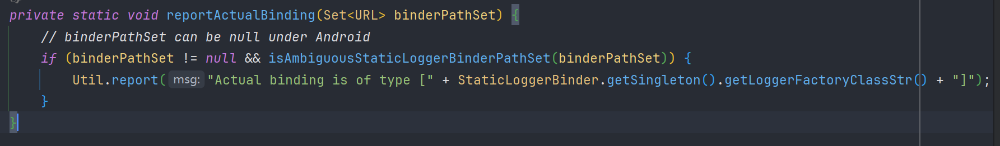

之后就可以调用StaticLoggerBinder来获取到不同日志实现的LoggerFactory, 然后创建Logger


#### slf4j没有StaticLoggerBinder, 怎么编译通过的

我们上面说到StaticLoggerBinder这个类是由其他的日志门面提供的, 也就是说他在`slf4j-api.jar`里面是没有的, 但是他又确实在代码里面调用了StaticLoggerBinder, 那么他是怎么编译通过的

经过研究，发现在`slf4j-api.jar`的pom.xml文件中配置了如下两个插件

```xml
	<plugin>
        <groupId>org.apache.maven.plugins</groupId>
        <artifactId>maven-antrun-plugin</artifactId>
        <executions>
          <execution>
            <phase>process-classes</phase>
            <goals>
             <goal>run</goal>
            </goals>
          </execution>
        </executions>
        <configuration>
          <tasks>
            <echo>Removing slf4j-api's dummy StaticLoggerBinder and StaticMarkerBinder</echo>
              <!-- 在编译完之后, 删除掉target/classes/org/slf4j/impl下的StaticLoggerBinder和StaticMarkerBinder这两个类 -->
            <delete dir="target/classes/org/slf4j/impl"/>
          </tasks>
        </configuration>
      </plugin>
```

于是，我再次检查了下slf4j-api.jar的结构
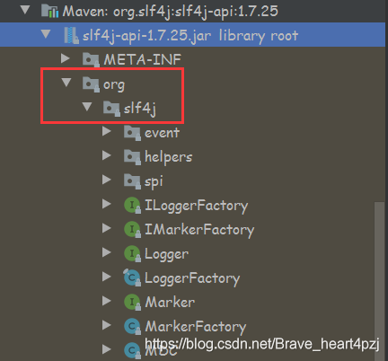
它内部是有这个/org/slf4j目录的，但是没有 impl 层级，和我测试的打包结果是一样的


### spring-boot-starter-logging

不管我们引入什么starter, 实际上都会引入spring-boot-starter, 然后引入spring-boot-stater-logging

也就是说我们只要是springboot项目, 就会自动引入spring-boot-stater-logging这个模块

而这个模块中, 帮我们引入了`logback`, `logback`又自动引入了`slf4j`

**同时他还帮我们引入了`jul-to-slf4j, log4j-to-slf4j`这两个偷梁换柱包, 这样的话如果有哪个框架使用到了jul和log4j2, 实际上底层都是使用的logback**

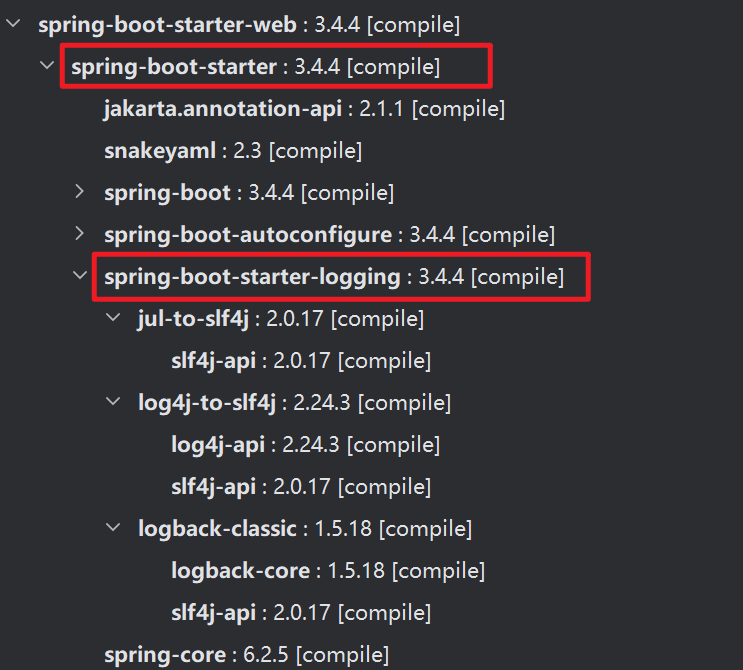

