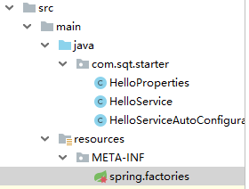

# SpringBoot

## SpringBoot配置文件


### 加载配置文件的位置

在SpringBoot启动的时候, 默认情况下, 他会加载

- `spring.config.import`

  默认值为空

- `spring.config.additional-location`

  默认为空

- `spring.config.location`

  默认值为

  `optional:classpath:/;optional:classpath:/config/;optional:file:./;optional:file:./config/;optional:file:./config/*/`

  

1. 这三个值可以指定为路径, 比如: `optional:file:./config`, 这样会加载jar包平级目录config下的所有`application.properties/yml/yaml`文件

   也可以指定为文件, 比如: `application-test.yml`, 这样会加载jar包平级的application-test.yml

   也可以配置为`optional:/etc/config/application.properties`, 这样会根据绝对路径来查找application.properties


2. 这三个值都可以配置多个路径或者文件, 通过分号间隔

   比如`optional:file./config;optional:/etc/config/dev.yaml;application-test.yml`

   

3. optional表示可选的, 即没有找到对应的文件/路径就直接忽略掉, 否则会报错


4. 上面三个参数都可以通过`java -Dspring.config.location=xxx -jar xxx.jar`的形式来指定

   `spring.config.import`还可以配置在`application.yaml`中, 用来指定需要额外加载的配置文件


5. 上面三个参数的优先级: 

   `spirng.config.import` > `spring.config.additional-location`  >  `spring.config.location`

   如果一个配置指定了多个路径/文件,  那么后面的优先于前面的

   如果同一个路径下有application.properties和application.yaml,   那么properties大于yaml


### 特定环境下激活的配置文件

我们可以通过`spring.profiles.active`来指定当前激活的环境

- 可以在properties中指定, 比如`spirng.profiles.active=test`
- 也可以在命令行指定, 比如`--spring.profiles.active=test`

如果没有指定, 那么会启用一个名为`default`的环境,  当然也可以通过`spirng.profiels.default`来指定默认启用的环境


当激活了环境之后, 那么springboot除了会加载`application.yaml/properties`文件, 还会加载`application-${env}.yaml/properties`配置文件


### 配置文件-多文档块

在`properties`配置文件中, 我们可以配置多个配置段, 每个配置段使用`#---`来分割

在`yaml/yml`配置文件中, 我们可以使用`---`来表示多文档块

~~~yaml
# 这个配置段默认生效

spring.profiles.active=prod # 激活prod环境

# include用于激活一些公共的配置
spring.profiles.include[0]=common # 激活common环境
spring.profiles.include[1]=local # 激活local环境

#---
# 这个配置段只在prod环境下生效
spring.config.activate.on-profile=prod
aa=prod

#---
# 这个配置段只在test环境下生效
spring.config.activate.on-profile=test
aa=test

#--- 
# 这个配置段默认生效
cc=hello
~~~

**写在下面的配置会覆盖写在上面的配置**


注意: `spring.profiles.active=prod`和`spring.profiles.include`都只能放在默认激活的代码片段中, 而不能和`spring.config.activate.on-profile`一起使用


### 环境组

我们可以定义一个环境组, 这样只要激活一个组, 就可以激活多个环境

~~~yml
spring:
  profiles:
    active: prod
    groups:
      prod: # 定义一个prod环境, 只要激活这个环境, 就会同时激活mysql, redis
        - mysql
        - redis
~~~


## SpringBoot自定义starter

按照一般的模式, 我们创建一个启动器, 但是该启动器只用来做依赖导入

然后创建另外一个自动配置模块, 用来定义自动配置

启动器依赖自动配置, 别人只需要引入启动器


我们可以看到, 在`mybatis-spring-boot-starter`中没有任何java代码,只是在pom文件中定义了依赖, 而自动配置的代码都在`mybatis-spring-boot-autoconfiguration`中

### 1. 创建自动配置模块

我们来创建一个springboot项目, pom.xml如下

```xml
<?xml version="1.0" encoding="UTF-8"?>
<project xmlns="http://maven.apache.org/POM/4.0.0" xmlns:xsi="http://www.w3.org/2001/XMLSchema-instance"
         xsi:schemaLocation="http://maven.apache.org/POM/4.0.0 http://maven.apache.org/xsd/maven-4.0.0.xsd">
    <modelVersion>4.0.0</modelVersion>
    <parent>
        <groupId>org.springframework.boot</groupId>
        <artifactId>spring-boot-starter-parent</artifactId>
        <version>2.1.6.RELEASE</version>
        <relativePath/> <!-- lookup parent from repository -->
    </parent>

    <groupId>com.sqt.starter</groupId>
    <artifactId>sqt-spring-boot-autoconfigurer</artifactId>
    <version>0.0.1-SNAPSHOT</version>

    <properties>
        <java.version>1.8</java.version>
    </properties>

    <dependencies>
        <dependency>
            <groupId>org.springframework.boot</groupId>
            <artifactId>spring-boot-starter</artifactId>
        </dependency>
    </dependencies>
</project>
```

我们只需要在其中引入spring-boot-starter依赖, 其他可以删除

在其中创建HelloProperties.java

````java
package com.sqt.starter;

import org.springframework.boot.context.properties.ConfigurationProperties;

@ConfigurationProperties("sqt.hello")
public class HelloProperties {

    private String suffix;

    private String prefix;

    public String getSuffix() {
        return suffix;
    }

    public void setSuffix(String suffix) {
        this.suffix = suffix;
    }

    public String getPrefix() {
        return prefix;
    }

    public void setPrefix(String prefix) {
        this.prefix = prefix;
    }
}
````

创建HelloService.java

````java
public class HelloService {

    HelloProperties helloProperties;

    public HelloProperties getHelloProperties() {
        return helloProperties;
    }

    public void setHelloProperties(HelloProperties helloProperties) {
        this.helloProperties = helloProperties;
    }

    public String sayHello(String name){
        return helloProperties.getPrefix() + "-" + name + "-" + helloProperties.getSuffix();
    }
}
````

创建自动配置类

```java
@Configuration
@ConditionalOnWebApplication  //只在web环境中起作用
// 启用HelloProperties
@EnableConfigurationProperties({HelloProperties.class})
public class HelloServiceAutoConfiguraion {

    @Autowired
    HelloProperties helloProperties;

    @Bean
    public HelloService helloService(){
        HelloService helloService = new HelloService();
        helloService.setHelloProperties(helloProperties);
        return helloService;

    }
}
```

在resources目录下创建META-INF/spring.factories

```properties
#定义自动配置类
org.springframework.boot.autoconfigure.EnableAutoConfiguration=\
  com.sqt.starter.HelloServiceAutoConfiguraion
```

目录如下:



其他没用的东西可以删掉


### 二、创建starter工程

我们创建一个starter工程, 因为这个工程只用来做依赖管理和导入, 所以我们可以创建一个空的maven工程


在pom.xml文件中引入我们的自动配置工程

```xml
<?xml version="1.0" encoding="UTF-8"?>
<project xmlns="http://maven.apache.org/POM/4.0.0"
         xmlns:xsi="http://www.w3.org/2001/XMLSchema-instance"
         xsi:schemaLocation="http://maven.apache.org/POM/4.0.0 http://maven.apache.org/xsd/maven-4.0.0.xsd">
    <modelVersion>4.0.0</modelVersion>

    <groupId>com.sqt.starter</groupId>
    <artifactId>sqt-spring-boot-starter</artifactId>
    <version>1.0-SNAPSHOT</version>


    <dependencies>
        <dependency>
            <groupId>com.sqt.starter</groupId>
            <artifactId>sqt-spring-boot-autoconfigurer</artifactId>
            <version>0.0.1-SNAPSHOT</version>
        </dependency>
    </dependencies>
</project>
```

然后分别将我们的autoConfiguration模块和starter模块install到本地仓库


### 三、编写测试

我们创建一个springboot项目, 在其中引入我们的starter项目

```xml
<dependency>
        <groupId>com.sqt.starter</groupId>
        <artifactId>sqt-spring-boot-starter</artifactId>
        <version>1.0-SNAPSHOT</version>
</dependency>
```

在application.properties配置文件中编写配置

这个配置是在我们autoConfiguration工程中定义的

```properties
sqt.hello.suffix = hello world
sqt.hello.prefix = zhangsan
```

我们来创建一个测试类

```java
@Controller
@ResponseBody
public class LoginController {

    @Autowired
    HelloService helloService;

    @GetMapping("/login")
    public String login(){
        String s = helloService.sayHello("张三");
        return s;
    }
}
```

启动项目


可以看到, 我们在autoConfiguration工程中配置的HelloService被@Autowired了进来, 而不需要我们自动配置.


## springboot自动装配原理, SPI机制

https://blog.csdn.net/weixin_42556307/article/details/108405009 自动装配原理

`@SpringBootApplication`是一个符合注解, 它是由如下注解组成的:


- @Configuration的作用是让配置类注入到IOC中,  作为整个SpringBoot扫描的起点

- @ComponentScan的作用是扫描当前配置类所在的包, 注册其中的bean

- @Import(AutoConfigurationPackages.Registrar.class)

  获取主配置类所在的包, 包装为BasePackage, 并注册到IOC容器中, id为`org.springframework.boot.autoconfigure.AutoConfigurationPackages`

  他的作用主要是告诉其他第三方包当前主配置类所在的包, 比如:

  1. MybatisPlusAutoConfiguration会根据id获取这个bean, 然后去主配置类包下面查找所有@Mapper
  2. JPA的EntityScanner也会根据id获取这个bean, 然后去主配置类包下面扫描特定的bean

  

- @Import(AutoConfigurationSelector)

  其中AutoConfigurationImportSelector类中有一个`getCandidateConfigurations()`方法，该方法通过`SpringFactoriesLoader.loadFactoryNames()`方法查找位于`META-INF/spring.factories`文件中的所有自动配置类，并加载这些类。

  主要的步骤如下:

  1. 从spring.factories中获取EnableAutoConfiguration对应的所有类
  2. 通过在注解@EnableAutoConfiguration设置的exclude的相关属性, 可以排除指定的自动配置类
  3. 根据@Conditional来判断是否需要排除某些自动配置类
  4. 触发AutoConfiguration导入的相关事件

  


## Springboot 部署在外部tomcat

使用外部tomcat后, application.yml中的server配置将无效, 应该该配置仅针对内置的tomcat)

1. **继承继承SpringBootServletInitializer**

   - 外部容器部署的话，就不能依赖于Application的main函数了，而是要以类似于web.xml文件配置的方式来启动Spring应用上下文，此时我们需要在启动类中继承SpringBootServletInitializer并实现configure方法：

     ```java
     import org.springframework.boot.SpringApplication;
     import org.springframework.boot.autoconfigure.SpringBootApplication;
     import org.springframework.boot.builder.SpringApplicationBuilder;
     import org.springframework.boot.web.support.SpringBootServletInitializer;
     
     //类似于@MapperScan要注解在这个类上面, 而不是启动类
     @SpringBootApplication
     public class MainApplication extends SpringBootServletInitializer {
     
         @Override
         protected SpringApplicationBuilder configure(SpringApplicationBuilder application) {
             return application.sources(MainApplication.class);
         }
     
         public static void main(String[] args) {
             SpringApplication.run(MainApplication.class, args);
         }
     
     }
     ```

2. **pom.xml修改相关配置**

   *首先介绍下maven中scope依赖范围的概念，因为后续涉及到这个会有问题。*

   *依赖范围就是用来控制依赖和三种classpath(编译classpath，测试classpath、运行classpath)的关系，Maven有如下几种依赖范围：*

   - *compile:编译依赖范围。如果没有指定，就会默认使用该依赖范围。使用此依赖范围的Maven依赖，对于编译、测试、运行三种classpath都有效。典型的例子是spring-code,在编译、测试和运行的时候都需要使用该依赖。*
   - *test: 测试依赖范围。使用次依赖范围的Maven依赖，只对于测试classpath有效，在编译主代码或者运行项目的使用时将无法使用此依赖。典型的例子是Jnuit,它只有在编译测试代码及运行测试的时候才需要。*
   - *provided:已提供依赖范围。使用此依赖范围的Maven依赖，对于编译和测试classpath有效，但在运行时候无效。典型的例子是servlet-api,编译和测试项目的时候需要该依赖，但在运行项目的时候，由于容器以及提供，就不需要Maven重复地引入一遍。*

   如果要将最终的打包形式改为war的话，还需要对pom.xml文件进行修改，因为spring-boot-starter-web中包含内嵌的tomcat容器，所以直接部署在外部容器会冲突报错。这里有两种方法可以解决，如下

   - 排除内嵌的tomcat

     ```xml
         <dependency>
           <groupId>org.springframework.boot</groupId>
           <artifactId>spring-boot-starter-web</artifactId>
           <!-- 排除内嵌的tomcat, 这样打出的war包中，在lib目录下才不会包含Tomcat相关的jar包，否则将会出现启动错误。 -->
           <exclusions>
             <exclusion>
               <groupId>org.springframework.boot</groupId>
               <artifactId>spring-boot-starter-tomcat</artifactId>
             </exclusion>
           </exclusions>
         </dependency>
         <!-- tomcat-embed-jasper中scope必须是provided。 因为SpringBootServletInitializer需要依赖 javax.servlet，而tomcat-embed-jasper下面的tomcat-embed-core中就有这个javax.servlet，如果没用provided，最终打好的war里面会有servlet-api这个jar，这样就会跟tomcat本身的冲突了。这个关键点同样适应于下面说的第二种方法。
     -->
         <dependency>
           <groupId>org.apache.tomcat.embed</groupId>
           <artifactId>tomcat-embed-jasper</artifactId>
           <scope>provided</scope>
         </dependency>
     
     
     ```

   - 直接添加如下配置

     ```xml
      <dependency>
             <groupId>org.springframework.boot</groupId>
             <artifactId>spring-boot-starter-tomcat</artifactId>
             <scope>provided</scope>
         </dependency>
         <dependency>
             <groupId>org.apache.tomcat.embed</groupId>
             <artifactId>tomcat-embed-jasper</artifactId>
             <scope>provided</scope>
         </dependency>
     ```

3. **由jar变成war**

   ```xml
   <packaging>war</packaging>
   ```

4. **设置war包名字**

   ```xml
   <build>
       <finalName>java-springboot-tiger</finalName>
   </build>
   ```

5. **打包**

   设置maven打包时跳过test, 选择test点击如下按钮,    然后选择clean, package

   

6. **访问**

   将该war包放在tomcat/webapps中,启动tomcat

7. **在idea中配置tomcat运行该项目**

   

   


## SpringBoot配置文件绑定到Maven打包


### Maven resources标签

构建Maven项目的时候，如果没有进行特殊的配置，Maven会按照标准的目录结构查找和处理各种类型文件。

1. **src/main/java和src/test/java**

   这两个目录中的所有*.java文件会分别在comile和test-comiple阶段被编译，编译结果分别放到了target/classes和targe/test-classes目录中，但是这**两个目录中的其他文件都会被忽略掉**。

2. **src/main/resouces和src/test/resources**

   这两个目录中的文件也会分别被复制到target/classes和target/test-classes目录中。

当我们有一个文件src/config/config.properties时, 我们希望将该文件打包到target/classes中可以使用

```xml
<resource>
   <directory>src/config</directory>
</resource>
```

当我们想把src/config/打包进来, 但是不想打包application.yml时

```xml
<resource>
   <directory>src/config</directory>
    <excludes>
        <exclude>application.yml</exclude>
    </excludes>
</resource>
```

**使用如下命令只会打包config.properties**

```xml
<resource>
   <directory>src/config</directory>
    <includes>
        <include>application.yml</include>
    </includes>
</resource>
```


### 在properties和yml中引用maven变量

使用插件:

```xml
<plugin>
    <groupId>org.apache.maven.plugins</groupId>
    <artifactId>maven-resources-plugin</artifactId>
</plugin>
```

指定需要解析的文件或者文件夹

```xml
<resource>
  <directory>src/main/resources</directory>
    <!-- 开启过滤解析 -->
  <filtering>true</filtering>              
</resource>
```

在properties中引用

```properties
#使用 ${XXX}
spring.application.name=${project.name}
```

在yml中引用

```yml
# 使用 '@XXX@'
spring:
  application:
    name: '@project.name@'
```

### 使用Maven配置文件激活Spring Boot配置文件


转载自<http://dolszewski.com/spring/spring-boot-properties-per-maven-profile/>

1. 创建各个环境的配置文件和主配置文件


2. 在maven中添加对应环境的profile和properties

   ~~~xml
   <profile>
       <id>dev</id>
       <properties>
           <!-- 每个环境都要有一个属性, 属性名无所谓, 但是值必须是application配置的后缀 -->
           <activatedProperties>dev</activatedProperties>
       </properties>
       <activation>
           <activeByDefault>true</activeByDefault>
       </activation>
   </profile>
   <profile>
       <id>release</id>
       <properties>
           <activatedProperties>release</activatedProperties>
       </properties>
   </profile>
   ~~~

3. 使用Maven Resource插件来过滤配置文件中的占位符

   如果使用*spring-boot-starter-parent*作为*pom.xml*的父级，则可以跳过此步骤。

   ~~~xml
   <build>
       <resources>
           <resource>
               <directory>src/main/resources</directory>
               <filtering>true</filtering>
           </resource>
       </resources>
       …
   </build>
   ~~~

4. 在springboot主配置文件中应用激活的maven属性

   ~~~Properties
   spring.profiles.active=@activatedProperties@
   ~~~

5. 使用maven打包

   

   

   


## IDEA SpringBoot Mybatis代码自动生成

1. 添加依赖

   ```xml
           <!-- mybatis springboot starter -->
           <dependency>
               <groupId>org.mybatis.spring.boot</groupId>
               <artifactId>mybatis-spring-boot-starter</artifactId>
               <version>1.3.2</version>
           </dependency>
   
   		<!-- 逆向工程jar包 -->
           <dependency>
               <groupId>org.mybatis.generator</groupId>
               <artifactId>mybatis-generator-core</artifactId>
               <version>1.3.6</version>
           </dependency>
   ```

2. 添加插件

   ````xml
       <build>
           <plugins>
               <plugin>
                   <groupId>org.springframework.boot</groupId>
                   <artifactId>spring-boot-maven-plugin</artifactId>
               </plugin>
               <!-- mybatis-generator自动生成代码插件 -->
               <plugin>
                   <groupId>org.mybatis.generator</groupId>
                   <artifactId>mybatis-generator-maven-plugin</artifactId>
                   <version>1.3.6</version>
                   <dependencies>
                       <dependency>
                           <groupId>mysql</groupId>
                           <artifactId>mysql-connector-java</artifactId>
                           <!--<scope>runtime</scope>-->
                           <version>8.0.13</version>
                       </dependency>
                       
                       <dependency>
                           <groupId>tk.mybatis</groupId>
                           <artifactId>mapper</artifactId>
                           <version>LATEST</version>
                       </dependency>
                   </dependencies>
               </plugin>
           </plugins>
       </build>
   ````

3. 在src/main/resources下添加generatorConfig.xml文件, 内容如下:

   ````xml
   <?xml version='1.0' encoding='UTF-8'?>
   <!DOCTYPE generatorConfiguration
           PUBLIC "-//mybatis.org//DTD MyBatis Generator Configuration 1.0//EN"
           "http://mybatis.org/dtd/mybatis-generator-config_1_0.dtd">
   
   <generatorConfiguration>
       <!-- *************************************** -->
       <!-- 导入属性配置, 之后的driverClass, connectionURL, userId, password, targetPackage, targetProject可以使用列如driverClass="${driver}"来代替 -->
       <!-- <properties resource="generator.properties"></properties> -->
       <!-- ************************************** -->
       
       <context id="mybatisGenerator" targetRuntime="MyBatis3">
           
           <!-- 使用通用mapper插件
            https://github.com/abel533/Mapper/wiki/4.1.mappergenerator  -->
           <plugin type="tk.mybatis.mapper.generator.MapperPlugin">
               <!-- 生成的mapper类会自动继承tk.mybatis.mapper.common.Mapper-->
               <property name="mappers" value="tk.mybatis.mapper.common.Mapper"/>
               <!-- caseSensitive 是否区分大小写，默认值 false。如果数据库区分大小写，
               这里就需要配置为 true，这样当表名为 USER 时，会生成 @Table(name = "USER") 注解
               ，否则使用小写 user 时会找不到表。 -->
               <property name="caseSensitive" value="false"/>
               <!-- forceAnnotation 是否强制生成注解，默认 false，如果设置为 true，
               不管数据库名和字段名是否一致，都会生成注解（包含 @Table 和 @Column）-->
               <property name="forceAnnotation" value="true"/>
               <!-- beginningDelimiter 和 endingDelimiter 开始和结束分隔符，
               对于有关键字的情况下适用 -->
               <property name="beginningDelimiter" value="`"/>
               <property name="endingDelimiter" value="`"/>
               <!-- 在生成的pojo类上加上@Data的lombok注解
                Getter,Setter,ToString,Accessors也是可选的 -->
               <property name="lombok" value="Data"/>
           </plugin>
           
           
           <commentGenerator>
               <!-- 是否去除自动生成的注释 true：是 ： false:否 -->
               <property name="suppressAllComments" value="true" />
           </commentGenerator>
           <!--数据库连接的信息：驱动类、连接地址、用户名、密码 -->
           <jdbcConnection driverClass="com.mysql.cj.jdbc.Driver"
                           connectionURL="jdbc:mysql://localhost:3306/shiro_csdn_demo?serverTimezone=UTC&amp;useUnicode=true&amp;characterEncoding=utf-8"
                           userId="root"
                           password="871403165">
           </jdbcConnection>
   
           <!-- 默认false，把JDBC DECIMAL 和 NUMERIC 类型解析为 Integer，为 true时把JDBC DECIMAL 和
               NUMERIC 类型解析为java.math.BigDecimal -->
           <javaTypeResolver>
               <property name="forceBigDecimals" value="false" />
           </javaTypeResolver>
   
           <!-- targetProject:生成PO类的位置 -->
           <javaModelGenerator targetPackage="com.sqt.generator.bean"
                               targetProject="src/main/java">
               <!-- enableSubPackages:是否让schema作为包的后缀 -->
               <property name="enableSubPackages" value="false" />
               <!-- 从数据库返回的值被清理前后的空格 -->
               <property name="trimStrings" value="true" />
           </javaModelGenerator>
           <!-- targetProject:mapper映射文件生成的位置 -->
           <sqlMapGenerator targetPackage="mapper"
                            targetProject="src/main/resources">
               <!-- enableSubPackages:是否让schema作为包的后缀 -->
               <property name="enableSubPackages" value="false" />
           </sqlMapGenerator>
           <!-- targetPackage：mapper接口生成的位置 -->
           <javaClientGenerator type="XMLMAPPER"
                                targetPackage="com.sqt.generator.mapper"
                                targetProject="src/main/java">
               <!-- enableSubPackages:是否让schema作为包的后缀 -->
               <property name="enableSubPackages" value="false" />
           </javaClientGenerator>
           <!-- 指定数据库表 -->
           <table tableName="user_info" domainObjectName="UserInfo" enableCountByExample="false"
                  enableUpdateByExample="false" enableDeleteByExample="false" enableSelectByExample="false"
                  selectByExampleQueryId="false" />
           <table tableName="user_info"></table>
           <table tableName="sys_role"></table>
           <table tableName="sys_role_permission"></table>
           <table tableName="sys_user_role"></table>
   
           <!-- 有些表的字段需要指定java类型
            <table schema="" tableName="">
               <columnOverride column="" javaType="" />
           </table> -->
       </context>
   </generatorConfiguration>
   ````

   注意字节在xml中写&,会因为未转义而报错要将&写成& amp;

   ````xml
    connectionURL="jdbc:mysql://localhost:3306/shiro_csdn_demo?serverTimezone=UTC&amp;useUnicode=true&amp;characterEncoding=utf-8"
   ````

4. 使用插件生成代码


5. 如果使用的是java类而不是plugin来生成代码需要添加依赖, 但是可以将build中的plugin删除掉

   ```xml
   <dependency>
         <groupId>mysql</groupId>
       <artifactId>mysql-connector-java</artifactId>
          <version>8.0.16</version>
   </dependency>
   ```

   在java包中添加java代码, 执行该代码可以生成, 达到plugin同样的效果

   ```java
   public class Generator {
       public void generator() throws Exception{
           List<String> warnings = new ArrayList<String>();
           boolean overwrite = true;
           /**指向逆向工程配置文件*/
           File configFile = new File("src/main/resources/generatorConfig.xml");
           ConfigurationParser parser = new ConfigurationParser(warnings);
           Configuration config = parser.parseConfiguration(configFile);
           DefaultShellCallback callback = new DefaultShellCallback(overwrite);
           MyBatisGenerator myBatisGenerator = new MyBatisGenerator(config,
                   callback, warnings);
           myBatisGenerator.generate(null);
       }
       public static void main(String[] args) throws Exception {
           try {
               Generator generatorSqlmap = new Generator();
               generatorSqlmap.generator();
           } catch (Exception e) {
               e.printStackTrace();
           }
       }
   }
   ```


## SpringBoot Mybatis PageHelper 分页查询

#### 添加依赖

```xml
<dependency>
    <!-- mybatis -->
    <groupId>org.mybatis.spring.boot</groupId>
    <artifactId>mybatis-spring-boot-starter</artifactId>
    <version>1.3.2</version>
</dependency>
<!--pagehelper -->
<dependency>
    <groupId>com.github.pagehelper</groupId>
    <artifactId>pagehelper-spring-boot-starter</artifactId>
    <version>1.2.5</version>
</dependency>
```

#### 添加配置

```yml
#pagehelper分页插件配置
pagehelper:
  helperDialect=mysql
  
spring:
  datasource:
    druid:
      # 数据库访问配置, 使用druid数据源
      db-type: com.alibaba.druid.pool.DruidDataSource
      driverClassName: com.mysql.cj.jdbc.Driver
      url: jdbc:mysql://localhost:3306/xxx?useUnicode=true&characterEncoding=UTF-8&useJDBCCompliantTimezoneShift=true&useLegacyDatetimeCode=false&serverTimezone=UTC
      username: root
      password: xxx
```

#### 实体类

```java
public class UserInfo {
    private Integer uid;

    private String username;

    private String password;

    private String name;

    private String idCardNum;

    private String state;
}
```

#### Mapper

```java
Page<UserInfo> selectAll();
```

```xml
<select id="selectAll" resultType="UserInfo">
    select * from user_info
</select>
```

#### 测试代码

```java
PageHelper.startPage(2, 3);
Page<UserInfo> page = userInfoMapper.selectAll();
PageInfo<UserInfo> pageInfo = new PageInfo<>(page);

//获取当前页个数
pageInfo.getSize()
    
//获取总个数
pageInfo.getTotal()
```

#### 结果


#### 参数说明

1. reasonable: 分页合理化参数，默认值为`false`。当该参数设置为 `true` 时，`pageNum<=0` 时会查询第一页， `pageNum>pages`（超过总数时），会查询最后一页。默认`false` 时，直接根据参数进行查询。

   查询-1页, reasonable分别为true和false的区别, list没有变, 但是其他参数字段都变了, 设置为true比较好

   

2. `pageSizeZero`：默认值为 `false`，当该参数设置为 `true` 时，如果 `pageSize=0` 或者 `RowBounds.limit = 0` 就会查询出全部的结果（相当于没有执行分页查询，但是返回结果仍然是 `Page` 类型

3. `helperDialect`：分页插件会自动检测当前的数据库链接，自动选择合适的分页方式。 你可以配置`helperDialect`属性来指定分页插件使用哪种方言。配置时，可以使用下面的缩写值：
   `oracle`,`mysql`,`mariadb`,`sqlite`,`hsqldb`,`postgresql`,`db2`,`sqlserver`,`informix`,`h2`,`sqlserver2012`,`derby`
   **特别注意：**使用 SqlServer2012 数据库时，需要手动指定为 `sqlserver2012`，否则会使用 SqlServer2005 的方式进行分页。
   你也可以实现 `AbstractHelperDialect`，然后配置该属性为实现类的全限定名称即可使用自定义的实现方法。

4. `offsetAsPageNum`：默认值为 `false`，该参数对使用 `RowBounds` 作为分页参数时有效。 当该参数设置为 `true` 时，会将 `RowBounds` 中的 `offset` 参数当成 `pageNum` 使用，可以用页码和页面大小两个参数进行分页。

5. `rowBoundsWithCount`：默认值为`false`，该参数对使用 `RowBounds` 作为分页参数时有效。 当该参数设置为`true`时，使用 `RowBounds` 分页会进行 count 查询。

6. `params`：为了支持`startPage(Object params)`方法，增加了该参数来配置参数映射，用于从对象中根据属性名取值， 可以配置 `pageNum,pageSize,count,pageSizeZero,reasonable`，不配置映射的用默认值， 默认值为`pageNum=pageNum;pageSize=pageSize;count=countSql;reasonable=reasonable;pageSizeZero=pageSizeZero`。

7. `supportMethodsArguments`：支持通过 Mapper 接口参数来传递分页参数，默认值`false`，分页插件会从查询方法的参数值中，自动根据上面 `params` 配置的字段中取值，查找到合适的值时就会自动分页。 使用方法可以参考测试代码中的 `com.github.pagehelper.test.basic` 包下的 `ArgumentsMapTest` 和 `ArgumentsObjTest`。

8. `autoRuntimeDialect`：默认值为 `false`。设置为 `true` 时，允许在运行时根据多数据源自动识别对应方言的分页 （不支持自动选择`sqlserver2012`，只能使用`sqlserver`），用法和注意事项参考下面的**场景五**。

9. `closeConn`：默认值为 `true`。当使用运行时动态数据源或没有设置 `helperDialect` 属性自动获取数据库类型时，会自动获取一个数据库连接， 通过该属性来设置是否关闭获取的这个连接，默认`true`关闭，设置为 `false` 后，不会关闭获取的连接，这个参数的设置要根据自己选择的数据源来决定。

#### 关于PageInfo

其实个人感觉不麻烦的情况下可以直接使用Page类而不是用PageInfo类, 但是PageInfo类比Page类强大

可以但是没必要

```java
public class PageInfo<T> extends PageSerializable<T> {
 
    private int pageNum;  //当前页页码

    private int pageSize; //每页页面大小

    private int size;  //当前页页面大小, 因为当前页可能填不满整页, 所以与pageSize区分开

    //由于startRow和endRow不常用，这里说个具体的用法
    //可以在页面中"显示startRow到endRow 共size条数据"

    //当前页面第一个元素在数据库中的行号
    private int startRow;
    //当前页面最后一个元素在数据库中的行号
    private int endRow;
    //总页数
    private int pages;

    //前一页页码
    private int prePage;
    //下一页页码
    private int nextPage;

    //是否为第一页
    private boolean isFirstPage = false;
    //是否为最后一页
    private boolean isLastPage = false;
    //是否有前一页
    private boolean hasPreviousPage = false;
    //是否有下一页
    private boolean hasNextPage = false;
    //导航页码数
    private int navigatePages;
    //所有导航页号, 注意这是一个数组, 就是所有页码的集合, 不理解的可以看上面的结果图片理解
    private int[] navigatepageNums;
    //导航条上的第一页
    private int navigateFirstPage;
    //导航条上的最后一页
    private int navigateLastPage;
```


#### 关于Page类

Page继承了ArrayList, 只需要把他当做ArrayList的增强就好了

```java
public class Page<E> extends ArrayList<E> implements Closeable {
    private static final long serialVersionUID = 1L;

    private int pageNum; //当前页页码

    private int pageSize; //每一页的页面大小

    private int startRow; //第一行在所有结果中的行数

    private int endRow;  //最后一行在所有结果中的行数

    private long total; //所有结果总行数
 
    private int pages;  //总页数

    private boolean count = true; //包含count查询

    private Boolean reasonable;  //分页合理化

    private Boolean pageSizeZero;  //当设置为true的时候，如果pagesize设置为0（或RowBounds的limit=0），就不执行分页，返回全部结果

    private String countColumn;  //进行count查询的列名

    private String orderBy;  //排序

    private boolean orderByOnly;  //只增加排序
}
```


## SpringBoot 特定环境才生效的Bean

比方说我们在dev, test环境下需要使用Swagger, 但是在prod环境下不使用Swagger

```java
@Configuration
@Profile({"dev", "test"})
@EnableSwagger2
public class Swagger2Config { }
```

@Profile将会匹配`spring.profiles.active`参数, 上面代码的意思是只用在dev或者test环境被激活的时候才配置Swagger2Config

~~~yml
spring:
  profiles:
    active: dev
~~~


**@Profile可以使用的地方**

- @component或@Configuration修饰的类上
- 作为元注解修饰自定义注解
- 任何@Bean修饰的方法上

**@Profile取反**

```java
@Configuration
@Profile("!prod")
@EnableSwagger2
public class Swagger2Config { }
// 上面代码意思是在非prod环境下配置Swagger2Config, 即该bean在dev和prod环境中都会生效
```

需要注意的是

```Properties
spring.profiles.include=database
```

意味着不管是在什么环境中, 都会去加载application-database.yml中的**独有的配置**, 非独有配置将不会生效

## SpringBoot 文件上传 通过Content-Type和文件头判断文件类型

#### 一、关于MIME

**MIME**的全称是Multipurpose Internet Mail Extensions，即多用途互联网邮件扩展，尽管读起来有些拗口，但大多数人可能都知道，
这是HTTP协议中用来定义文档性质及格式的标准。[IETF RFC 6838](https://tools.ietf.org/html/rfc6838)，对HTTP传输内容类型进行了全面定义。
而**IANA**(互联网号码分配机构)是负责管理所有标准MIME类型的官方机构。可以[在这里](https://www.iana.org/assignments/media-types/media-types.xhtml))找到所有的标准MIME

**服务器通过MIME告知响应内容类型，而浏览器则通过MIME类型来确定如何处理文档；**
**因此为传输内容(文档、图片等)设置正确的MIME非常重要**。

通常Server会在HTTP响应中设置**Content-Type**，如下面的响应：

```
HTTP/1.1 200 OK
Server: Golfe2    
Content-Length: 233
Content-Type: application/html
Date: Sun, 28 Dec 2018 02:55:19 GMT
```

这表示服务端将返回html格式的文档，而同样客户端也可以在HTTP请求中设置**Content-Type**以告知服务器当前所发送内容的格式。
如下面的请求体：

```
POST / HTTP/1.1
Host: localhost:8000
User-Agent: Mozilla/5.0 (Macintosh; Intel Mac OS X 10.9; rv:50.0) Gecko/20100101 Firefox/50.0
Accept: text/html,application/xhtml+xml,application/xml;q=0.9,*/*;q=0.8
Connection: keep-alive
Content-Type: application/json
Content-Length: 465
```

这表示客户端会发送application/json格式的数据到服务端，同时应该注意到**Accept**请求头，这个选项用于告知服务器应该返回什么样的数据格式(由客户端接收并完成解析)。

**MIME的格式**

```
type/subtype
```

这是一个两级的分类，比较容易理解，第一级分类通常包含：

| 类型        | 描述         |
| :---------- | :----------- |
| text        | 普通文本     |
| image       | 某种图像     |
| audio       | 某种音频文件 |
| video       | 某种视频文件 |
| application | 应用数据     |
| multi-part  | 复合内容     |

而二级类型则非常多，以下是一些常用的MIME：

| MIME                              | 描述                         |
| :-------------------------------- | :--------------------------- |
| audio/wav                         | wave音频流媒体文件           |
| audio/webm                        | webm 音频文件格式            |
| audio/ogg                         | ogg多媒体文件格式的音频文件  |
| audio/mpeg                        | mpeg多媒体文件格式的音频文件 |
| image/gif                         | gif图片                      |
| image/jpeg                        | jpeg图片                     |
| image/png                         | png图片                      |
| image/svg+xml                     | svg矢量图片                  |
| application/json                  | json格式                     |
| application/xml                   | xml格式                      |
| application/xhtml+xml             | 扩展html格式                 |
| application/x-www-form-urlencoded | 表单url内容编码              |
| application/octet-stream          | 二进制格式                   |
| application/pdf                   | pdf文档                      |
| application/atom+xml              | atom订阅feed流               |
| multipart/form-data               | 多文档格式                   |
| text/plain                        | 普通文本                     |
| text/html                         | html文档                     |
| text/css                          | css文件                      |
| text/javascript                   | javascript文件               |
| text/markdown                     | markdown文档                 |
| video/mpeg                        | mpeg多媒体视频文件           |
| video/quicktime                   | mov多媒体视频文件            |

#### MIME Type 与 Content-Type 的关系

首先看看tomcat服务器中默认的web.xml中的描述：

```java
<!-- ===================== Default MIME Type Mappings =================== -->
<!-- When serving static resources, Tomcat will automatically generate    -->
<!-- a "Content-Type" header based on the resource's filename extension, -->
<!-- based on these mappings. Additional mappings can be added here (to -->
<!-- apply to all web applications), or in your own application's web.xml -->
<!-- deployment descriptor.   -->
```

再看看apache服务器中mime.types的描述：

```
This file controls what Internet media types are sent to the client for
given file extension(s). Sending the correct media type to the client
is important so they know how to handle the content of the file.
Extra types can either be added here or by using an AddType directive
in your config files. For more information about Internet media types,
please read RFC 2045, 2046, 2047, 2048, and 2077. The Internet media type registry is at http://www.iana.org/assignments/media-types/.
```

**当web服务器收到静态的资源文件请求时，依据请求文件的后缀名在服务器的MIME配置文件中找到对应的MIME Type，再根据MIME Type设置HTTP Response的Content-Type，然后浏览器根据Content-Type的值处理文件。**

也就是说, **文件扩展名=>MIME Type=>Content-Type**


####  通过文件头识别文件

不同的文件类型有不同的文件头, 而文件头部的几个字节被称为Magic Number, 通常用十六进制表示, 可用来判断文件类型.

比如png文件的文件头Magic Number是0x89504E开始的, java class文件Magic Number为Oxcafebabe

我们可以通过判断文件的文件头信息来判断文件的类型, 而且**即使改变文件扩展名文件头信息也是不改变的**.


通过java代码判断文件类型:

```java
public class FileType {

    //默认判断文件头前三个字节内容
    public static int CHECK_BYTES_NUMBER = 3;

    public final static Map<String, String> FILE_TYPE_MAP = new HashMap<String, String>();

    private FileType(){}
    static{
        getAllFileType(); //初始化文件类型信息
    }

    /**
     * Discription:[getAllFileType,常见文件头信息]
     */
    private static void getAllFileType()
    {
        FILE_TYPE_MAP.put("ffd8ffe000104a464946", "jpg"); //JPEG (jpg)
        FILE_TYPE_MAP.put("89504e470d0a1a0a0000", "png"); //PNG (png)
        FILE_TYPE_MAP.put("47494638396126026f01", "gif"); //GIF (gif)
        FILE_TYPE_MAP.put("49492a00227105008037", "tif"); //TIFF (tif)
        FILE_TYPE_MAP.put("424d228c010000000000", "bmp"); //16色位图(bmp)
        FILE_TYPE_MAP.put("424d8240090000000000", "bmp"); //24位位图(bmp)
        FILE_TYPE_MAP.put("424d8e1b030000000000", "bmp"); //256色位图(bmp)
        FILE_TYPE_MAP.put("41433130313500000000", "dwg"); //CAD (dwg)
        FILE_TYPE_MAP.put("3c21444f435459504520", "html"); //HTML (html)
        FILE_TYPE_MAP.put("3c21646f637479706520", "htm"); //HTM (htm)
        FILE_TYPE_MAP.put("48544d4c207b0d0a0942", "css"); //css
        FILE_TYPE_MAP.put("696b2e71623d696b2e71", "js"); //js
        FILE_TYPE_MAP.put("7b5c727466315c616e73", "rtf"); //Rich Text Format (rtf)
        FILE_TYPE_MAP.put("38425053000100000000", "psd"); //Photoshop (psd)
        FILE_TYPE_MAP.put("46726f6d3a203d3f6762", "eml"); //Email [Outlook Express 6] (eml)
        FILE_TYPE_MAP.put("d0cf11e0a1b11ae10000", "doc"); //MS Excel 注意：word、msi 和 excel的文件头一样
        FILE_TYPE_MAP.put("d0cf11e0a1b11ae10000", "vsd"); //Visio 绘图
        FILE_TYPE_MAP.put("5374616E64617264204A", "mdb"); //MS Access (mdb)
        FILE_TYPE_MAP.put("252150532D41646F6265", "ps");
        FILE_TYPE_MAP.put("255044462d312e350d0a", "pdf"); //Adobe Acrobat (pdf)
        FILE_TYPE_MAP.put("2e524d46000000120001", "rmvb"); //rmvb/rm相同
        FILE_TYPE_MAP.put("464c5601050000000900", "flv"); //flv与f4v相同
        FILE_TYPE_MAP.put("00000020667479706d70", "mp4");
        FILE_TYPE_MAP.put("49443303000000002176", "mp3");
        FILE_TYPE_MAP.put("000001ba210001000180", "mpg"); //
        FILE_TYPE_MAP.put("3026b2758e66cf11a6d9", "wmv"); //wmv与asf相同
        FILE_TYPE_MAP.put("52494646e27807005741", "wav"); //Wave (wav)
        FILE_TYPE_MAP.put("52494646d07d60074156", "avi");
        FILE_TYPE_MAP.put("4d546864000000060001", "mid"); //MIDI (mid)
        FILE_TYPE_MAP.put("504b0304140000000800", "zip");
        FILE_TYPE_MAP.put("526172211a0700cf9073", "rar");
        FILE_TYPE_MAP.put("235468697320636f6e66", "ini");
        FILE_TYPE_MAP.put("504b03040a0000000000", "jar");
        FILE_TYPE_MAP.put("4d5a9000030000000400", "exe");//可执行文件
        FILE_TYPE_MAP.put("3c25402070616765206c", "jsp");//jsp文件
        FILE_TYPE_MAP.put("4d616e69666573742d56", "mf");//MF文件
        FILE_TYPE_MAP.put("3c3f786d6c2076657273", "xml");//xml文件
        FILE_TYPE_MAP.put("494e5345525420494e54", "sql");//xml文件
        FILE_TYPE_MAP.put("7061636b616765207765", "java");//java文件
        FILE_TYPE_MAP.put("406563686f206f66660d", "bat");//bat文件
        FILE_TYPE_MAP.put("1f8b0800000000000000", "gz");//gz文件
        FILE_TYPE_MAP.put("6c6f67346a2e726f6f74", "properties");//bat文件
        FILE_TYPE_MAP.put("cafebabe0000002e0041", "class");//bat文件
        FILE_TYPE_MAP.put("49545346030000006000", "chm");//bat文件
        FILE_TYPE_MAP.put("04000000010000001300", "mxp");//bat文件
        FILE_TYPE_MAP.put("504b0304140006000800", "docx");//docx文件
        FILE_TYPE_MAP.put("d0cf11e0a1b11ae10000", "wps");//WPS文字wps、表格et、演示dps都是一样的
        FILE_TYPE_MAP.put("6431303a637265617465", "torrent");


        FILE_TYPE_MAP.put("6D6F6F76", "mov"); //Quicktime (mov)
        FILE_TYPE_MAP.put("FF575043", "wpd"); //WordPerfect (wpd)
        FILE_TYPE_MAP.put("CFAD12FEC5FD746F", "dbx"); //Outlook Express (dbx)
        FILE_TYPE_MAP.put("2142444E", "pst"); //Outlook (pst)
        FILE_TYPE_MAP.put("AC9EBD8F", "qdf"); //Quicken (qdf)
        FILE_TYPE_MAP.put("E3828596", "pwl"); //Windows Password (pwl)
        FILE_TYPE_MAP.put("2E7261FD", "ram"); //Real Audio (ram)
    }


    /**
     * 根据制定文件的文件头判断其文件类型
     * @param filePaht
     * @return
     */
    public static String getFileType(String filePaht){
        String res = null;

        try {
            FileInputStream is = new FileInputStream(filePaht);
            getFileType(is);
        } catch (FileNotFoundException e) {
            e.printStackTrace();
        }
        return res;
    }
    public static String getFileType(InputStream in){
        String res = null;
        try {

            byte[] b = new byte[CHECK_BYTES_NUMBER];
            in.read(b, 0, b.length);
            String fileCode = bytesToHexString(b);

//            System.out.println(fileCode);


            //这种方法在字典的头代码不够位数的时候可以用但是速度相对慢一点
            Iterator<String> keyIter = FILE_TYPE_MAP.keySet().iterator();
            while(keyIter.hasNext()){
                String key = keyIter.next();
                if(key.toLowerCase().startsWith(fileCode.toLowerCase()) || fileCode.toLowerCase().startsWith(key.toLowerCase())){
                    res = FILE_TYPE_MAP.get(key);
                    break;
                }
            }
        } catch (FileNotFoundException e) {
            e.printStackTrace();
        } catch (IOException e) {
            e.printStackTrace();
        }
        return res;
    }

    /**
     * 得到上传文件的文件头
     * @param src
     * @return
     */
    public static String bytesToHexString(byte[] src) {
        StringBuilder stringBuilder = new StringBuilder();
        if (src == null || src.length <= 0) {
            return null;
        }
        for (int i = 0; i < src.length; i++) {
            int v = src[i] & 0xFF;
            String hv = Integer.toHexString(v);
            if (hv.length() < 2) {
                stringBuilder.append(0);
            }
            stringBuilder.append(hv);
        }
        return stringBuilder.toString();
    }

    public static int getCheckBytesNumber() {
        return CHECK_BYTES_NUMBER;
    }

    public static void setCheckBytesNumber(int checkBytesNumber) {
        CHECK_BYTES_NUMBER = checkBytesNumber;
    }
}
```


常见文件头表示如下:

255044PDF 
526563 EML 
D0CF11 PPT 
4D5AEE COM 
E93B03 COM 
4D5A90 EXE 
424D3E BMP 
49492A TIF 
384250 PSD 
C5D0D3 EPS 
0A0501 PCS 
89504E PNG 
060500 RAW 
000002 TGA 
60EA27 ARJ 
526172 RAR 
504B03 ZIP 
495363 CAB 
1F9D8C Z 
524946 WAV 
435753 SWF 
3026B2 WMV 
3026B2 WMA 
2E524D RM 
00000F MOV 
000077 MOV 
000001 MPA 
FFFB50 MP3 
234558 m3u 
3C2144 HTM 
FFFE3C XSL 
3C3F78 XML 
3C3F78 MSC 
4C0000 LNK 
495453 CHM 
805343 scm 
D0CF11 XLS 
31BE00 WRI 
00FFFF MDF 
4D4544 MDS 
5B436C CCD 
00FFFF IMG 
FFFFFF SUB 
17A150 PCB 
2A5052 ECO 
526563 PPC 
000100 DDB 
42494C LDB 
2A7665 SCH 
2A2420 LIB 
434841 FNT 
7B5C72 RTF 
7B5072 GTD 
234445 PRG 
000007 PJT 
202020 BAS 
000002 TAG 
4D5A90 dll 
4D5A90 OCX 
4D5A50 DPL 
3F5F03 HLP 
4D5A90 OLB 
4D5A90 IMM 
4D5A90 IME 
3F5F03 LHP 
C22020 NLS 
5B5769 CPX 
4D5A16 DRV 
5B4144 PBK 
24536F PLL 
4E4553 NES 
87F53E GBC 
00FFFF SMD 
584245 XBE 
005001 XMV 
000100 TTF 
484802 PDG 
000100 TST
414331 dwg 
D0CF11 max

  另外还有一些重要的文件，**没有固定的文件头**，如下： 

**TXT 没固定文件头定义** 
TMP 没固定文件头定义 
INI 没固定文件头定义 
BIN 没固定文件头定义 
DBF 没固定文件头定义 
C 没没固定文件头定义 
CPP 没固定文件头定义 
H 没固定文件头定义 
BAT 没固定文件头定义 

还有一些不同的文件有相同的文件头，最典型的就是下面： 

4D5A90 EXE 
4D5A90 dll 
4D5A90 OCX 
4D5A90 OLB 
4D5A90 IMM 
4D5A90 IME  

#### 文件上传

当我们需要实现上传文件的时候, 为了安全起见, 我们需要判断上传文件的格式, 防止将病毒木马等有害的文件上传到服务器上. 

判断文件类型的三种方式

- 通过文件后缀名

  这个方法只要修改后缀名就可以了

- 通过Content-Type判断

  但是Content-Type取决于文件类型, 文件类型取决于文件扩展名, 所以改变了文件扩展名就改变了Content-Type

- 通过文件头判断文件, 即使文件扩展名改变了文件头也不会改变

文件上传的思路:  先判断Content-Type, Content-Type符合条件的再判断文件头信息


## SpringBoot文件上传

~~~java
@Controller
public class FileUploadController {
    
    // 单文件上传
    @PostMapping("/upload-single")
    @ResponseBody
    public Object upload(String name, MultipartFile photo) throws Exception {
        Map<String, Object> map = new HashMap<String, Object>();
        if (photo != null) {    // 现在有文件上传
            //姓名
            map.put("name-param", name);
            //文件名
            map.put("photo-name", photo.getName());
            //文件类型 content-type: "image/png",
            map.put("content-type", photo.getContentType());
            //文件大小
            map.put("photo-size", photo.getSize());
            //eg: UUID + . + png
            String fileName = UUID.randomUUID() + "."
                + photo.getContentType().substring(
                photo.getContentType().lastIndexOf("/") + 1);    // 创建文件名称
            //文件路径  位置 + 文件名
            String filePath = ((ServletRequestAttributes) RequestContextHolder.getRequestAttributes())
                .getRequest().getServletContext().getRealPath("/") + fileName;
            //文件路径
            map.put("photo-path", filePath);
            File saveFile = new File(filePath);
            photo.transferTo(saveFile);        // 文件保存
            return map;
        } else {
            return "nothing";
        }
    }

    // 多文件上传
    @PostMapping("/upload")
    @ResponseBody
    public Object upload(String name, HttpServletRequest request) {
        List<String> result = new ArrayList<String>() ;
        // 多个文件上传  就只是简单的多文件上传保存在本地的磁盘
        if (request instanceof MultipartHttpServletRequest) {
            MultipartHttpServletRequest mrequest = (MultipartHttpServletRequest) request;
            //<input type="file" name="photo"/>
            List<MultipartFile> files = mrequest.getFiles("photo");
            Iterator<MultipartFile> iter = files.iterator();
            while (iter.hasNext()) {
                MultipartFile photo = iter.next() ;		// 取出每一个上传文件
                try {
                    result.add(this.saveFile(photo)) ;		// 保存上传信息
                } catch (Exception e) {
                    e.printStackTrace();
                }
            }
        }
        return result ;
    }
    // 文件保存处理
    public String saveFile(MultipartFile file) throws Exception {
        String path = "nothing" ;
        if (file != null) {					// 有文件上传
            if (file.getSize() > 0) {
                String fileName = UUID.randomUUID() + "."
                    + file.getContentType().substring(
                    file.getContentType().lastIndexOf("/") + 1);	// 创建文件名称
                path = ((ServletRequestAttributes) RequestContextHolder.getRequestAttributes())
                    .getRequest().getServletContext().getRealPath("/") + fileName;
                File saveFile = new File(path) ;
                file.transferTo(saveFile);		// 文件保存
            }
        }
        return path ;
    }
}
~~~

限制文件上传的大小

~~~yml
spring:
  http:
    multipart:
      enabled: true           # 启用http上传
      max-file-size: 10MB     # 设置支持的单个上传文件的大小限制
      max-request-size: 20MB  # 设置最大的请求的文件大小，设置总体大小请求
      file-size-threshold: 512KB   # 当上传文件达到指定配置量的时候会将文件内容写入磁盘
      location: /             # 设置上传的临时目录
~~~


## SpringBoot中Tomcat处理请求模型

当有请求来的时候, 会判断当前请求是否大于max-connections, 如果小于, 那么就会建立连接

当连接数达到最大值maxConnections后，系统会继续接收连接，但不会超过acceptCount的值。

如果还有请求过来, 那么会一直等待连接, 直到连接超时.


对于已经建立连接的请求, 会把请求丢掉线程池中去处理.

线程池最小线程为min-spare, 最大线程为max

~~~yml
server:
  tomcat:
    threads:
      # 最大线程数, 默认200
      max: 200
      # 最小线程数, 默认10
      min-spare: 10
    # 连接超时时间: 默认20000ms。
    connection-timeout: 5000
    # 最大连接数，可以适应 APR 模式
    max-connections: 8192
    accept-count: 100
~~~


## SpringBoot 链路追踪TraceID

https://www.bilibili.com/video/BV1T94y1J7L5/?spm_id_from=333.788&vd_source=f79519d2285c777c4e2b2513f5ef101a

https://www.bilibili.com/video/BV1rT411U7x2/?spm_id_from=333.788.recommend_more_video.1&vd_source=f79519d2285c777c4e2b2513f5ef101a

1. 定义一个拦截器, 拦截所有请求, 判断request头上有没有traceid, 如果有就设置到mdc中

   如果没有traceid, 就自动生成一个traceid并设置到mdc中

   ~~~java
   public class LogInterceptor implements HandlerInterceptor {
           private static final String TRACE_ID = "TRACE_ID";
   
           @Override
           public boolean preHandle(HttpServletRequest request, HttpServletResponse response, Object handler) {
               String traceID = request.getHeader(TRACE_ID);
               // 如果当前request上有trace id, 那么就把他设置到MDC中
               // 如果没有就新建
               // MDC底层是ThreadLocal
               if (StringUtils.isEmpty(traceID)) {
                   traceID = UUID.randomUUID().toString().replace("-", "");
               }
               MDC.put(TRACE_ID, traceID);
               return true;
           }
   
           @Override
           public void afterCompletion(HttpServletRequest request, HttpServletResponse response, Object handler,
               @Nullable Exception ex) {
               // 一定要在这个方法中remove, 而不能在postHandle方法中remove
               // 因为如果Controller报错, 那么postHandler方法是不会被执行的
               MDC.remove(TRACE_ID);
           }
       }
   ~~~

2. 定义一个WebMvcConfigurer, 注册拦截器

   ~~~java
   @Configuration
       public class WebConfigurerAdapter implements WebMvcConfigurer {
           @Bean
           public HandlerInterceptor logInterceptor() {
               return new LogInterceptor();
           }
   
           @Override
           public void addInterceptors(InterceptorRegistry registry) {
               // 添加Interceptor并拦截所有路径
               registry.addInterceptor(logInterceptor()).addPathPatterns("/**");
           }
       }
   ~~~

3. 在日志中打印MDC中的TraceID

   ~~~xml
   <appender name="CONSOLE" class="ch.qos.logback.core.ConsoleAppender"> 
     <layout>
         <!--  %X表示从MDC中取TRACE_ID的值 -->
       <Pattern>%X{TRACE_ID}  - %m%n</Pattern>
     </layout> 
   </appender>
   ~~~

4. 注意, 因为MDC底层使用的是ThreadLocal, 所有切换线程就不是原来的MDC了, 所以如果使用了异步任务, 需要将父线程的MDC复制到子线程中, 具体做法如下: 

   1. 如果使用了@Async异步任务, 需要配置自定义的线程池, 并且设置任务的装饰器

      ~~~java
      @Configuration
          public class AsyncConfig extends AsyncConfigurerSupport {
      
              @Override
              public Executor getAsyncExecutor() {
                  ThreadPoolTaskExecutor taskExecutor = new ThreadPoolTaskExecutor();
                  taskExecutor.setCorePoolSize(16);
                  taskExecutor.setMaxPoolSize(48);
                  taskExecutor.setQueueCapacity(16);
                  // 线程装饰: 针对每个任务, 在开始和结束的时候进行MDC增强
                  taskExecutor.setTaskDecorator(runnable -> TaskMDCWrapper.wrap(runnable));
                  taskExecutor.setThreadNamePrefix("Async");
                  return taskExecutor;
              }
          }
      
      public class TaskMDCWrapper{
              public static Runnable wrap(Runnable runnable) {
                  // 必须在这里获取MDC, 因为这里是父线程
                  Map<String, String> contextMap = MDC.getCopyOfContextMap();
                  return () -> {
                      try {
                          // 执行到这里的时候是在子线程里面
                          MDC.setContextMap(contextMap);
                          runnable.run();
                      } finally {
                          MDC.clear();
                      }
                  };
              }
          }
      ~~~

   2. 如果使用的是自己创建的线程池来执行异步任务, 那么需要对任务进行增强

      ~~~java
      ExecutorService executor = Executors.newFixedThreadPool(5);
      Runnable runnable = () -> {
                  System.out.println("hello world");
              };
      // 使用TaskMDCWrapper对task进行增强
      executor.submit(TaskMDCWrapper.wrap(runnable));
      ~~~


## SpringBoot事件监听机制

https://mp.weixin.qq.com/s?__biz=MzA5MTkxMDQ4MQ==&mid=2648934522&idx=1&sn=7653141d01b260875797bbf1305dd196&chksm=88621044bf15995257129e33068f66fc5e39291e159e5e0de367a14e0195595c866b3aaa1972&token=1081910573&lang=zh_CN&scene=21#wechat_redirect

**总结**

在spring中, 关于事件的有这么几个类:

1. ApplicationEvent: 表示一个事件的接口
2. ApplicationListener: 表示一个监听器的接口
3. ApplicationEventMulticaster: 事件广播器的接口, 用于注册, 移除监听器, 发布事件
4. SimpleApplicationEventMulticaster: 事件广播器的简单实现

AbstractApplicationContext实现了ApplicationEventPublisher接口
其内部有个ApplicationEventMulticaster applicationEventMulticaster的字段, 负责具体的监听器功能的实现

initApplicationEventMulticaster()方法负责对该字段的初始化, 集体逻辑如下:

1. 从BeanFactory中查找name为`AbstractApplicationContext.APPLICATION_EVENT_MULTICASTER_BEAN_NAME`的bean

   如果有的话赋值给applicationEventMulticaster

2. 如果没有这个bean的话就new SimpleApplicationEventMulticaster()


所以我们实际上使用的就是SimpleApplicationEventMulticaster来作为广播器, 他的广播逻辑是:

1. **如果设置了TaskExecutor, 那么就把任务交给TaskExecutor去异步执行**
2. **如果没有设置TaskExecutor, 那么就直接在当前线程中依次调用各个Listener**

还要注意的点是:

1. Listener支持通过Ordered接口, 或者@Order注解来设置Listener的顺序
2. 如果在SimpleApplicationEventMulticaster设置了ErrorHandler, 那么执行Listener报错会把错误交给ErrorHandler, 否则直接抛出异常

**Listener的两种实现方式** 

1. 通过实现ApplicationListener接口

   ~~~java
   @Component
   @Order(1)
   public class SendEmailListener implements ApplicationListener<UserRegisterEvent> {
       @Override
       public void onApplicationEvent(UserRegisterEvent event) { }
   }
   ~~~

2. 通过在方法上添加@EventListener注解来实现

   ~~~java
   @EventListener
   @Order(1)
   public void sendMail(UserRegisterEvent event) {
       System.out.println(String.format("给用户【%s】发送注册成功邮件!", event.getUserName()));
   }
   ~~~

**spring 容器如何扫描所有的监听器**

1. 对于ApplicationListener的实现方式, 其处理逻辑在`ApplicationListenerDetector`

   该类是实现了`BeanPostProcessor`接口, 并且实现了其`postProcessAfterInitialization`, 该方法会在bean初始化之后执行

   在该方法中, 会判断该bean是否实现了`ApplicationListener`接口, 如果实现了, 那么调用`this.applicationContext.addApplicationListener((ApplicationListener<?>) bean);`将其添加到`SimpleApplicationEventMulticaster`中

2. 对于使用@EventListener的方式, 其处理逻辑在`EventListenerMethodProcessor`

   该类实现了`SmartInitializingSingleton`接口, 并实现了其`afterSingletonsInstantiated`方法, 该方法会在所有的singleton bean都初始化之后执行

   在该方法的逻辑中, 会循环遍历所有的bean, 然后拿到bean对应的class, 然后判断class上是否有被@EventListener标注的方法

   如果有的话, 那么就根据该方法创建一个ApplicationListener, 然后通过`this.applicationContext.addApplicationListener((ApplicationListener<?>) bean);`将其添加到`SimpleApplicationEventMulticaster`中


**如何实现Listener的异步执行和异常处理**

~~~java
// ioc通过这个beanname来查找注册的广播器
// bean name必须是这个, 才会被使用
    @Bean(name = AbstractApplicationContext.APPLICATION_EVENT_MULTICASTER_BEAN_NAME)
    public ApplicationEventMulticaster applicationEventMulticaster() {
        SimpleApplicationEventMulticaster multicaster = new SimpleApplicationEventMulticaster();
        // 设置线程池
        multicaster.setTaskExecutor(new ThreadPoolTaskExecutor());
        // 设置异常处理机制
        multicaster.setErrorHandler(new ErrorHandler() {
            @Override
            public void handleError(Throwable t) { }
        });
        return multicaster;
    }
~~~


## 通过AOP实现注解式分布式锁, 并支持SpEl

https://www.bilibili.com/video/BV1r642137NJ/?spm_id_from=333.1245.recommend_more_video.0&vd_source=f79519d2285c777c4e2b2513f5ef101a

1. 定义一个注解

   ~~~java
   // 标注在方法上, 会在获取到分布式锁之后执行方法
   public @interface DistributedLock {
   
       // 获取锁的超时时间
       long time() default 0;
       // 超时单位
       TimeUnit timeUnit() default TimeUnit.MILLISECONDS;
       // 获取锁路径的spring el表达式, 使用方法的参数来解析
       String key() default "";
   }
   ~~~

2. 定义一个分布式锁的接口

   ~~~java
   public interface LockService {
       <T> T execut(String key, long time, TimeUnit timeUnit, Supplier<T> supplier) throws Throwable;
   
       @FunctionalInterface
       public static interface Supplier<T> {
           T get() throws Throwable;
       }
   }
   ~~~

3. 创建redis分布式锁的实现类, 也可以通过zookeeper来实现

   ~~~gradle
   // 导入Redisson依赖
   implementation 'org.redisson:redisson-spring-boot-starter:3.25.2'
   ~~~

   ~~~java
   @Service
   public class RedissonLockService implements LockService{
   
       @Autowired
       private RedissonClient redissonClient;
   
       @Override
       public <T> T execut(String key, long time, TimeUnit timeUnit, Supplier<T> supplier) throws Throwable {
           RLock lock = redissonClient.getLock(key);
           boolean locked = false;
           try {
               locked = lock.tryLock(time, timeUnit);
               if (!locked) {
                   throw new RuntimeException("获取锁超时");
               }
               try {
                   return supplier.get();
               } finally {
                   lock.unlock();
               }
           } catch (InterruptedException e) {
               throw new RuntimeException(e);
           }
       }
   }
   ~~~

4. 创建一个aop, 用来拦截有注解的方法

   ~~~java
   @EnableAspectJAutoProxy
   @Aspect
   public class RedissonLockAop {
   
       @Autowired
       private LockService lockService;
       private static final ExpressionParser expressionParser = new SpelExpressionParser();
   
       // 通过该变量来获取方法的形参
       private static final DefaultParameterNameDiscoverer PARAMETER_NAME_DISCOVERER = new DefaultParameterNameDiscoverer();
   
       @Getter
       @Setter
       private String namespace = "com.xxx.lock";
   
       /**
        * 通过SpEl解析key, 方法的args作为context
        */
       @Around(value = "@annotation(distributedLock)", argNames = "joinPoint, distributedLock")
       public Object around(ProceedingJoinPoint joinPoint, DistributedLock distributedLock) {
           MethodSignature signature = (MethodSignature)joinPoint.getSignature();
           Method method = signature.getMethod();
           Object[] args = joinPoint.getArgs();
           String key = parse(distributedLock.key(), method, args);
           try {
               return lockService.execut(key, distributedLock.time(), distributedLock.timeUnit(), joinPoint::proceed);
           } catch (Throwable e) {
               throw new RuntimeException(e);
           }
       }
   
       private String parse(String key, Method method, Object[] args) {
           // 获取形参
           String[] params = Optional.ofNullable(PARAMETER_NAME_DISCOVERER.getParameterNames(method)).orElse(new String[]{});
           StandardEvaluationContext context = new StandardEvaluationContext();
           for (int i = 0; i < params.length; i++) {
               if (args[i] instanceof HttpServletRequest) {
                   continue; // 过滤掉HttpServletRequest
               }
               context.setVariable(params[i], args[i]);
           }
           return namespace + "." + expressionParser.parseExpression(key).getValue(context, String.class);
       }
   }
   ~~~


## springboot 类chatgpt流式返回

~~~java
@RestController
public class ChatTestController {

    @GetMapping("/chat")
    public SseEmitter chat(String msg) {
        // 设置超时时间, 默认30秒, 0表示不超时
        SseEmitter emitter = new SseEmitter(30L * 1000);

        // 使用另外一个线程来发送数据
        ExecutorService executorService = Executors.newSingleThreadExecutor();
        executorService.execute(() -> {
            try {
                for (int i = 0; i < 10; i++) {
                    // 向客户端发送数据库
                    emitter.send("GPT-like response chunk" + i);
                    // 模拟延迟
                    Thread.sleep(1000);
                }
                emitter.complete();
            } catch (IOException | InterruptedException e) {
                // 通知客户端异常
                emitter.completeWithError(e);
            }
        });
        return emitter;
    }
}
~~~

只要通过get请求接口, 就可以得到流式的返回了, 并且response的Content-Type: text/event-stream, 表示流式返回

