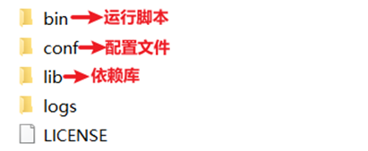
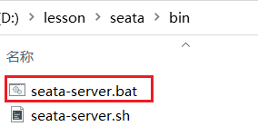
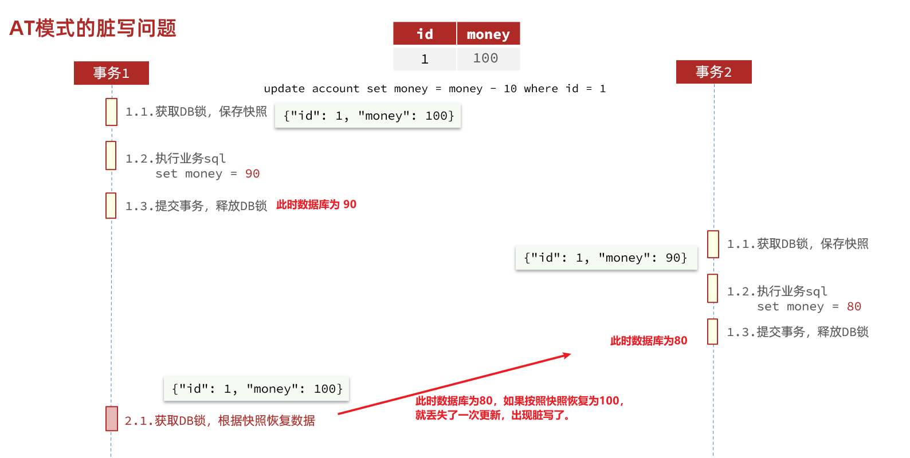
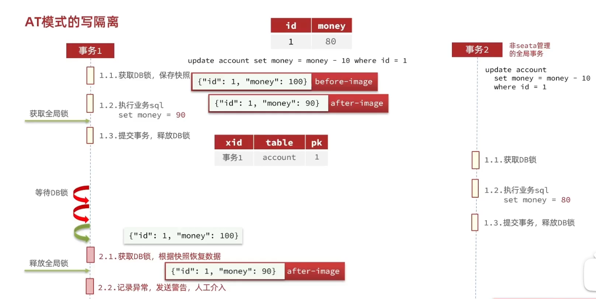
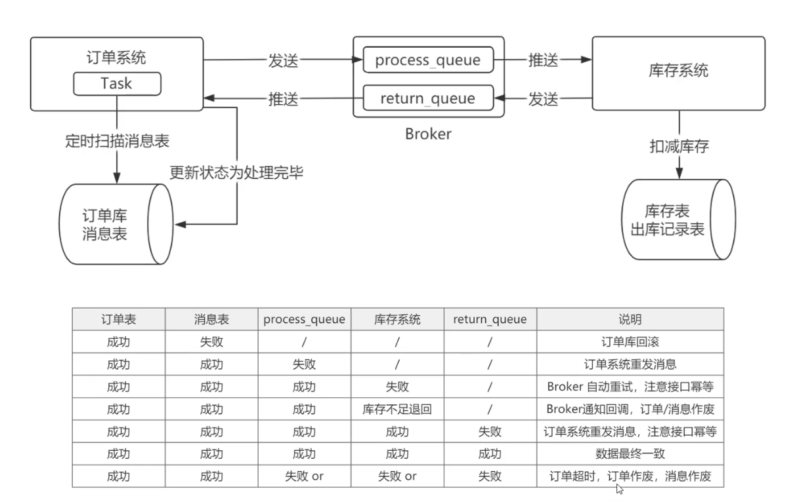

# 1.分布式事务问题


## 1.1.本地事务

本地事务，也就是传统的**单机事务**。在传统数据库事务中，必须要满足四个原则：


## 1.2.分布式事务

**分布式事务**，就是指不是在单个服务或单个数据库架构下，产生的事务，例如：

- 跨数据源的分布式事务
- 跨服务的分布式事务
- 综合情况


在数据库水平拆分、服务垂直拆分之后，一个业务操作通常要跨多个数据库、服务才能完成。例如电商行业中比较常见的下单付款案例，包括下面几个行为：

- 创建新订单
- 扣减商品库存
- 从用户账户余额扣除金额


完成上面的操作需要访问三个不同的微服务和三个不同的数据库。


订单的创建、库存的扣减、账户扣款在每一个服务和数据库内是一个本地事务，可以保证ACID原则。

但是当我们把三件事情看做一个"业务"，要满足保证“业务”的原子性，要么所有操作全部成功，要么全部失败，不允许出现部分成功部分失败的现象，这就是**分布式系统下的事务**了。

此时ACID难以满足，这是分布式事务要解决的问题


## 1.3.演示分布式事务问题

我们通过一个案例来演示分布式事务的问题：

1）**创建数据库，名为seata_demo，然后导入课前资料提供的SQL文件：**

 

2）**导入课前资料提供的微服务：**

 

微服务结构如下：

 

其中：

seata-demo：父工程，负责管理项目依赖

- account-service：账户服务，负责管理用户的资金账户。提供扣减余额的接口
- storage-service：库存服务，负责管理商品库存。提供扣减库存的接口
- order-service：订单服务，负责管理订单。创建订单时，需要调用account-service和storage-service


**3）启动nacos、所有微服务**

**4）测试下单功能，发出Post请求：**

请求如下：

```sh
curl --location --request POST 'http://localhost:8082/order?userId=user202103032042012&commodityCode=100202003032041&count=20&money=200'
```

如图：


测试发现，当库存不足时，如果余额已经扣减，并不会回滚，出现了分布式事务问题。


# 2.理论基础

解决分布式事务问题，需要一些分布式系统的基础知识作为理论指导。

## 2.1.CAP定理

1998年，加州大学的计算机科学家 Eric Brewer 提出，分布式系统有三个指标。

> - Consistency（一致性）
> - Availability（可用性）
> - Partition tolerance （分区容错性）


它们的第一个字母分别是 C、A、P。

Eric Brewer 说，这三个指标不可能同时做到。这个结论就叫做 CAP 定理。


### 2.1.1.一致性

Consistency（一致性）：用户访问分布式系统中的任意节点，得到的数据必须一致。

比如现在包含两个节点，其中的初始数据是一致的：


当我们修改其中一个节点的数据时，两者的数据产生了差异：


要想保住一致性，就必须实现node01 到 node02的数据 同步：


### 2.1.2.可用性

Availability （可用性）：用户访问集群中的任意健康节点，必须能得到响应，而不是超时或拒绝。

如图，有三个节点的集群，访问任何一个都可以及时得到响应：


当有部分节点因为网络故障或其它原因无法访问时，代表节点不可用：


### 2.1.3.分区容错

**Partition（分区）**：因为网络故障或其它原因导致分布式系统中的部分节点与其它节点失去连接，形成独立分区。


**Tolerance（容错）**：在集群出现分区时，整个系统也要持续对外提供服务


### 2.1.4.矛盾

在分布式系统中，系统间的网络不能100%保证健康，一定会有故障的时候，而服务有必须对外保证服务。因此Partition Tolerance不可避免。

当节点接收到新的数据变更时，就会出现问题了：


如果此时要保证**一致性**，就必须等待网络恢复，完成数据同步后，整个集群才对外提供服务，服务处于阻塞状态，不可用。

如果此时要保证**可用性**，就不能等待网络恢复，那node01、node02与node03之间就会出现数据不一致。


也就是说，在P一定会出现的情况下，A和C之间只能实现一个。


## 2.2.BASE理论

BASE理论是对CAP的一种解决思路，包含三个思想：

- **Basically Available** **（基本可用）**：分布式系统在出现故障时，允许损失部分可用性，即保证核心可用。
- **Soft State（软状态）：**在一定时间内，允许出现中间状态，比如临时的不一致状态。
- **Eventually Consistent（最终一致性）**：虽然无法保证强一致性，但是在软状态结束后，最终达到数据一致。


## 2.3.解决分布式事务的思路

分布式事务最大的问题是各个子事务的一致性问题，因此可以借鉴CAP定理和BASE理论，有两种解决思路：

- AP模式：各子事务分别执行和提交，允许出现结果不一致，然后采用弥补措施恢复数据即可，实现最终一致。

- CP模式：各个子事务执行后互相等待，同时提交，同时回滚，达成强一致。但事务等待过程中，处于弱可用状态。


但不管是哪一种模式，都需要在子系统事务之间互相通讯，协调事务状态，也就是需要一个**事务协调者(TC)**：


这里的子系统事务，称为**分支事务**；有关联的各个分支事务在一起称为**全局事务**。


# 3.初识Seata

Seata是 2019 年 1 月份蚂蚁金服和阿里巴巴共同开源的分布式事务解决方案。致力于提供高性能和简单易用的分布式事务服务，为用户打造一站式的分布式解决方案。

官网地址：http://seata.io/，其中的文档、播客中提供了大量的使用说明、源码分析。


## 3.1.Seata的架构


名称解析:

- 全局事务: 即一整个大的分布式事务
- 分支事务: 即一整个大的分布式事务中, 属于单个微服务的那一部分

架构:

- TC(Transaction Coordinator) 事务协调者

  记录全局和各微服务上分支事务的状态, 负责全局事务的提交或回滚

- TM(Transaction Manager) - 事务管理器

  在每个微服务上, 定义全局事务的范围, 与transaction coordinator通信, 告诉transaction coordinator开启/提交/回滚一个全局事务

- RM(Resource Manager) - 资源管理器

  在每个微服务上, 与transaction coordinator通信以注册分支事务, 开启/提交/回滚一个分支事务, 报告分支事务的状态 


本文通过流程图将AT模式下的基本交互流程梳理一下，为我们以后的解析打下基础。
假设有三个微服务，分别是服务A、B、C，其中服务A中调用了服务B和服务C，TM、TC、RM三者之间的交互流程如下图：


1、服务A启动时，GlobalTransactionScanner会对有@GlobalTransaction注解的方法进行AOP增强，并生成代理，增强的代码位于GlobalTransactionalInterceptor类中，当调用@GlobalTransaction注解的方法时，增强代码首先向TC注册全局事务，表示全局事务的开始，同时TC生成XID，并返回给TM；
2、服务A中调用服务B时，将XID传递给服务B；
3、服务B得到XID后，访问TC，注册分支事务，并从TC获得分支事务ID，TC根据XID将分支事务与全局事务关联；
4、接下来服务B开始执行SQL语句，在执行前将表中对应的数据保存一份，执行后在保存一份，将这两份记录作为回滚记录写入到数据库中，如果执行过程中没有异常，服务B最后将事务提交，并通知TC分支事务成功；
5、服务A访问完服务B后，访问服务C；
6、服务C与TC之间的交互与服务B完全一致；
7、服务B和服务C都成功后，服务A通过TM通知TC全局事务成功，如果失败了，服务A也会通知TC全局事务失败；
8、TC记录了全局事务下的每个分支事务，TC收到全局事务的结果后，如果结果成功，则通知RM成功，RM收到通知后清理之前在数据库中保存的回滚记录，如果失败了，则RM要查询出之前在数据库保存的回滚记录，对之前的SQL操作进行回滚。

因为TM、RM、TC之间的交互都是通过网络完成的，很容易出现网络断开的情况，因此TC提供了四个定时线程池，定时检测系统中是否有超时事务、异步提交事务、回滚重试事务、重试提交事务，如果发现了有这四类事务，则从全局事务中获取所有的分支事务，分别调用各个分支事务完成对应的操作，依次来确保事务的一致性。

原文链接：https://blog.csdn.net/weixin_38308374/article/details/108329792


## 3.2.部署TC服务

### 1.下载

首先我们要下载seata-server包，地址在[http](http://seata.io/zh-cn/blog/download.html)[://seata.io/zh-cn/blog/download](http://seata.io/zh-cn/blog/download.html)[.](http://seata.io/zh-cn/blog/download.html)[html](http://seata.io/zh-cn/blog/download.html) 

当然，课前资料也准备好了：


### 2.解压

在非中文目录解压缩这个zip包，其目录结构如下：



### 3.修改配置

修改conf目录下的registry.conf文件：


内容如下：

```properties
registry {
  # tc服务的注册中心类，这里选择nacos，也可以是eureka、zookeeper等
  type = "nacos"

  nacos {
    # seata tc 服务注册到 nacos的服务名称，可以自定义
    application = "seata-tc-server"
    serverAddr = "127.0.0.1:8848"
    group = "DEFAULT_GROUP"
    namespace = ""
    cluster = "SH"
    username = "nacos"
    password = "nacos"
  }
}

config {
  # 读取tc服务端的配置文件的方式，这里是从nacos配置中心读取，这样如果tc是集群，可以共享配置
  type = "nacos"
  # 配置nacos地址等信息
  nacos {
    serverAddr = "127.0.0.1:8848"
    namespace = ""
    group = "SEATA_GROUP"
    username = "nacos"
    password = "nacos"
    dataId = "seataServer.properties"
  }
}
```


### 4.在nacos添加配置

特别注意，为了让tc服务的集群可以共享配置，我们选择了nacos作为统一配置中心。因此服务端配置文件seataServer.properties文件需要在nacos中配好。

格式如下：


配置内容如下：

```properties
# 数据存储方式，db代表数据库
store.mode=db
store.db.datasource=druid
store.db.dbType=mysql
store.db.driverClassName=com.mysql.jdbc.Driver
store.db.url=jdbc:mysql://127.0.0.1:3306/seata?useUnicode=true&rewriteBatchedStatements=true
store.db.user=root
store.db.password=123
store.db.minConn=5
store.db.maxConn=30
store.db.globalTable=global_table
store.db.branchTable=branch_table
store.db.queryLimit=100
store.db.lockTable=lock_table
store.db.maxWait=5000
# 事务、日志等配置
server.recovery.committingRetryPeriod=1000
server.recovery.asynCommittingRetryPeriod=1000
server.recovery.rollbackingRetryPeriod=1000
server.recovery.timeoutRetryPeriod=1000
server.maxCommitRetryTimeout=-1
server.maxRollbackRetryTimeout=-1
server.rollbackRetryTimeoutUnlockEnable=false
server.undo.logSaveDays=7
server.undo.logDeletePeriod=86400000

# 客户端与服务端传输方式
transport.serialization=seata
transport.compressor=none
# 关闭metrics功能，提高性能
metrics.enabled=false
metrics.registryType=compact
metrics.exporterList=prometheus
metrics.exporterPrometheusPort=9898
```


==其中的数据库地址、用户名、密码都需要修改成你自己的数据库信息。==


### 5.创建数据库表

特别注意：tc服务在管理分布式事务时，需要记录事务相关数据到数据库中，你需要提前创建好这些表。

新建一个名为seata的数据库，运行课前资料提供的sql文件：


这些表主要记录全局事务、分支事务、全局锁信息：

```mysql
SET NAMES utf8mb4;
SET FOREIGN_KEY_CHECKS = 0;

-- ----------------------------
-- 分支事务表
-- ----------------------------
DROP TABLE IF EXISTS `branch_table`;
CREATE TABLE `branch_table`  (
  `branch_id` bigint(20) NOT NULL,
  `xid` varchar(128) CHARACTER SET utf8 COLLATE utf8_general_ci NOT NULL,
  `transaction_id` bigint(20) NULL DEFAULT NULL,
  `resource_group_id` varchar(32) CHARACTER SET utf8 COLLATE utf8_general_ci NULL DEFAULT NULL,
  `resource_id` varchar(256) CHARACTER SET utf8 COLLATE utf8_general_ci NULL DEFAULT NULL,
  `branch_type` varchar(8) CHARACTER SET utf8 COLLATE utf8_general_ci NULL DEFAULT NULL,
  `status` tinyint(4) NULL DEFAULT NULL,
  `client_id` varchar(64) CHARACTER SET utf8 COLLATE utf8_general_ci NULL DEFAULT NULL,
  `application_data` varchar(2000) CHARACTER SET utf8 COLLATE utf8_general_ci NULL DEFAULT NULL,
  `gmt_create` datetime(6) NULL DEFAULT NULL,
  `gmt_modified` datetime(6) NULL DEFAULT NULL,
  PRIMARY KEY (`branch_id`) USING BTREE,
  INDEX `idx_xid`(`xid`) USING BTREE
) ENGINE = InnoDB CHARACTER SET = utf8 COLLATE = utf8_general_ci ROW_FORMAT = Compact;

-- ----------------------------
-- 全局事务表
-- ----------------------------
DROP TABLE IF EXISTS `global_table`;
CREATE TABLE `global_table`  (
  `xid` varchar(128) CHARACTER SET utf8 COLLATE utf8_general_ci NOT NULL,
  `transaction_id` bigint(20) NULL DEFAULT NULL,
  `status` tinyint(4) NOT NULL,
  `application_id` varchar(32) CHARACTER SET utf8 COLLATE utf8_general_ci NULL DEFAULT NULL,
  `transaction_service_group` varchar(32) CHARACTER SET utf8 COLLATE utf8_general_ci NULL DEFAULT NULL,
  `transaction_name` varchar(128) CHARACTER SET utf8 COLLATE utf8_general_ci NULL DEFAULT NULL,
  `timeout` int(11) NULL DEFAULT NULL,
  `begin_time` bigint(20) NULL DEFAULT NULL,
  `application_data` varchar(2000) CHARACTER SET utf8 COLLATE utf8_general_ci NULL DEFAULT NULL,
  `gmt_create` datetime NULL DEFAULT NULL,
  `gmt_modified` datetime NULL DEFAULT NULL,
  PRIMARY KEY (`xid`) USING BTREE,
  INDEX `idx_gmt_modified_status`(`gmt_modified`, `status`) USING BTREE,
  INDEX `idx_transaction_id`(`transaction_id`) USING BTREE
) ENGINE = InnoDB CHARACTER SET = utf8 COLLATE = utf8_general_ci ROW_FORMAT = Compact;

SET FOREIGN_KEY_CHECKS = 1;
```


### 6.启动TC服务

进入bin目录，运行其中的seata-server.bat即可：



启动成功后，seata-server应该已经注册到nacos注册中心了。


打开浏览器，访问nacos地址：http://localhost:8848，然后进入服务列表页面，可以看到seata-tc-server的信息：


## 3.3.微服务集成Seata

我们以order-service为例来演示。

### 3.3.1.引入依赖

首先，在order-service中引入依赖：

```xml
<!--seata-->
<dependency>
    <groupId>com.alibaba.cloud</groupId>
    <artifactId>spring-cloud-starter-alibaba-seata</artifactId>
    <exclusions>
        <!--版本较低，1.3.0，因此排除--> 
        <exclusion>
            <artifactId>seata-spring-boot-starter</artifactId>
            <groupId>io.seata</groupId>
        </exclusion>
    </exclusions>
</dependency>
<dependency>
    <groupId>io.seata</groupId>
    <artifactId>seata-spring-boot-starter</artifactId>
    <!--seata starter 采用1.4.2版本-->
    <version>${seata.version}</version>
</dependency>
```


### 3.3.2.配置TC地址

在order-service中的application.yml中，配置TC服务信息，通过注册中心nacos，结合服务名称获取TC地址：

```yaml
seata:
  registry: # TC服务注册中心的配置，微服务根据这些信息去注册中心获取tc服务地址
    type: nacos # 注册中心类型 nacos
    nacos:
      server-addr: 127.0.0.1:8848 # nacos地址
      namespace: "" # namespace，默认为空
      group: DEFAULT_GROUP # 分组，默认是DEFAULT_GROUP
      application: seata-tc-server # seata服务名称
      username: nacos
      password: nacos
  tx-service-group: seata-demo # 事务组名称
  service:
    vgroup-mapping: # 事务组与cluster的映射关系
      seata-demo: SH
```


微服务如何根据这些配置寻找TC的地址呢？

我们知道注册到Nacos中的微服务，确定一个具体实例需要四个信息：

- namespace：命名空间
- group：分组
- application：服务名
- cluster：集群名


以上四个信息，在刚才的yaml文件中都能找到：


namespace为空，就是默认的public

结合起来，TC服务的信息就是：public@DEFAULT_GROUP@seata-tc-server@SH，这样就能确定TC服务集群了。然后就可以去Nacos拉取对应的实例信息了。


### 3.3.3.其它服务

其它两个微服务也都参考order-service的步骤来做，完全一样。


## 3.4.TC服务高可用

### 1.模拟异地容灾的TC集群

计划启动两台seata的tc服务节点：

| 节点名称 | ip地址    | 端口号 | 集群名称 |
| -------- | --------- | ------ | -------- |
| seata    | 127.0.0.1 | 8091   | SH       |
| seata2   | 127.0.0.1 | 8092   | HZ       |

之前我们已经启动了一台seata服务，端口是8091，集群名为SH。

现在，将seata目录复制一份，起名为seata2

修改seata2/conf/registry.conf内容如下：

```nginx
registry {
  # tc服务的注册中心类，这里选择nacos，也可以是eureka、zookeeper等
  type = "nacos"

  nacos {
    # seata tc 服务注册到 nacos的服务名称，可以自定义
    application = "seata-tc-server"
    serverAddr = "127.0.0.1:8848"
    group = "DEFAULT_GROUP"
    namespace = ""
    cluster = "HZ"
    username = "nacos"
    password = "nacos"
  }
}

config {
  # 读取tc服务端的配置文件的方式，这里是从nacos配置中心读取，这样如果tc是集群，可以共享配置
  type = "nacos"
  # 配置nacos地址等信息
  nacos {
    serverAddr = "127.0.0.1:8848"
    namespace = ""
    group = "SEATA_GROUP"
    username = "nacos"
    password = "nacos"
    dataId = "seataServer.properties"
  }
}
```


进入seata2/bin目录，然后运行命令：

```powershell
seata-server.bat -p 8092
```


打开nacos控制台，查看服务列表：


点进详情查看：


### 2.将事务组映射配置到nacos

接下来，我们需要将tx-service-group与cluster的映射关系都配置到nacos配置中心。

新建一个配置：


配置的内容如下：

```properties
# 事务组映射关系
service.vgroupMapping.seata-demo=SH

service.enableDegrade=false
service.disableGlobalTransaction=false
# 与TC服务的通信配置
transport.type=TCP
transport.server=NIO
transport.heartbeat=true
transport.enableClientBatchSendRequest=false
transport.threadFactory.bossThreadPrefix=NettyBoss
transport.threadFactory.workerThreadPrefix=NettyServerNIOWorker
transport.threadFactory.serverExecutorThreadPrefix=NettyServerBizHandler
transport.threadFactory.shareBossWorker=false
transport.threadFactory.clientSelectorThreadPrefix=NettyClientSelector
transport.threadFactory.clientSelectorThreadSize=1
transport.threadFactory.clientWorkerThreadPrefix=NettyClientWorkerThread
transport.threadFactory.bossThreadSize=1
transport.threadFactory.workerThreadSize=default
transport.shutdown.wait=3
# RM配置
client.rm.asyncCommitBufferLimit=10000
client.rm.lock.retryInterval=10
client.rm.lock.retryTimes=30
client.rm.lock.retryPolicyBranchRollbackOnConflict=true
client.rm.reportRetryCount=5
client.rm.tableMetaCheckEnable=false
client.rm.tableMetaCheckerInterval=60000
client.rm.sqlParserType=druid
client.rm.reportSuccessEnable=false
client.rm.sagaBranchRegisterEnable=false
# TM配置
client.tm.commitRetryCount=5
client.tm.rollbackRetryCount=5
client.tm.defaultGlobalTransactionTimeout=60000
client.tm.degradeCheck=false
client.tm.degradeCheckAllowTimes=10
client.tm.degradeCheckPeriod=2000

# undo日志配置
client.undo.dataValidation=true
client.undo.logSerialization=jackson
client.undo.onlyCareUpdateColumns=true
client.undo.logTable=undo_log
client.undo.compress.enable=true
client.undo.compress.type=zip
client.undo.compress.threshold=64k
client.log.exceptionRate=100
```

### 3.微服务读取nacos配置

接下来，需要修改每一个微服务的application.yml文件，让微服务读取nacos中的client.properties文件：

```yaml
seata:
  config:
    type: nacos
    nacos:
      server-addr: 127.0.0.1:8848
      username: nacos
      password: nacos
      group: SEATA_GROUP
      data-id: client.properties
```


重启微服务，现在微服务到底是连接tc的SH集群，还是tc的HZ集群，都统一由nacos的client.properties来决定了。

# 4.分布式事务模式

下面我们就一起学习下Seata中的四种不同的事务模式。


## 4.1.XA模式

XA 规范 是 X/Open 组织定义的分布式事务处理（DTP，Distributed Transaction Processing）标准，XA 规范 描述了全局的TM与局部的RM之间的接口，几乎所有主流的数据库都对 XA 规范 提供了支持。


### 4.1.1.Seata的XA模型

Seata对原始的XA模式做了简单的封装和改造，以适应自己的事务模型，基本架构如图：


工作流程如下:

1. TM向TC通信, 要求开启全局事务, 并返回全局事务ID
2. TM携带上全局事务ID调用RM中的接口
3. RM根据全局事务ID向TM注册分支事务, 并执行业务sql(执行sql时开启事务, 并且不提交)
4. 执行完业务sql后, 向TC报告分支事务的状态
5. TM中的业务的执行成功让TC commit/rollback
6. TC让所有的RM commit/rollback 分支事务

TM如何知道所有分支事务的状态?

在调用分支事务的时候, 如果没报错就说明分支事务执行成功

否则执行失败


### 4.1.2.优缺点

XA模式的优点是什么？

- 事务的强一致性，满足ACID原则。
- 常用数据库都支持，实现简单，并且没有代码侵入

XA模式的缺点是什么？

- 因为一阶段需要锁定数据库资源，等待二阶段结束才释放，**性能较差**
- 必须依赖数据库的事务功能, 并且数据库要实现XA协议
- 不支持nosql


### 4.1.3.实现XA模式

Seata的starter已经完成了XA模式的自动装配，实现非常简单，步骤如下：

1）修改application.yml文件（每个参与事务的微服务），开启XA模式：

```yaml
seata:
  data-source-proxy-mode: XA
```


2）给发起全局事务的入口方法添加@GlobalTransactional注解:

本例中是OrderServiceImpl中的create方法.


3）重启服务并测试

重启order-service，再次测试，发现无论怎样，三个微服务都能成功回滚。


## 4.2.AT模式

AT模式同样是分阶段提交的事务模型，不过缺弥补了XA模型中资源锁定周期过长的缺陷。

### 4.2.1.Seata的AT模型

基本流程图：


- TM向TC通信, 要求开启全局事务, 并返回全局事务ID
- TM携带上全局事务ID调用RM中的接口
- RM根据全局事务ID向TM注册分支事务, 拦截业务sql, 记录执行sql执行前的快照, 执行sql, 记录执行sql后的快照
- 执行完业务sql后, 向TC报告分支事务的状态
- TM根据业务的执行成功与否让TC commit/rollback
- TC让所有的RM commit/rollback 分支事务,  commit就是删除记录的两个快照, rollback就是用执行前的快照覆盖执行后的记录


### 4.2.2.详细流程

我们用一个真实的业务来梳理下AT模式的原理。

比如，现在又一个数据库表，记录用户余额：

| **id** | **money** |
| ------ | --------- |
| 1      | 100       |

其中一个分支业务要执行的SQL为：

```sql
update tb_account set money = money - 10 where id = 1
```


AT模式下，当前分支事务执行流程如下：

一阶段：

1）TM发起并注册全局事务到TC

2）TM调用分支事务

3）分支事务准备执行业务SQL

4）RM拦截业务SQL，根据where条件生成一个对应的select语句, 查询原始数据，形成执行前快照, 称为`before image`

~~~sql
select * from tb_account where id = 1
~~~

```json
{
    "id": 1, "money": 100
}
```

5）RM执行业务SQL，提交本地事务，释放数据库锁。此时 `money = 90`

6)  RM再次执行select语句, 查询执行业务sql后, 这些记录的结果, 称为`after image`

~~~json
{
    "id": 1, "money": 90
}
~~~

6）RM报告本地事务状态给TC


二阶段：

1）TM通知TC事务结束

2）TC检查分支事务状态

​	 a）如果都成功，则立即删除两个快照

​	 b）如果有分支事务失败，需要回滚。读取执行前的快照数据（`{"id": 1, "money": 100}`），将快照恢复到数据库。此时数据库再次恢复为100

流程图：


### 4.2.3.AT与XA的区别

简述AT模式与XA模式最大的区别是什么？

- XA模式一阶段不提交事务，锁定资源；AT模式一阶段直接提交，不锁定资源。
- XA模式依赖数据库机制实现回滚；AT模式利用数据快照实现数据回滚。
- XA模式强一致；AT模式最终一致


### 4.2.4.脏写问题

在多线程并发访问AT模式的分布式事务时，有可能出现脏写问题，如图：



事务1在执行分支事务时, 将money从100扣减为90, 并提交事务

事务2在执行分支事务时, 将money从90扣减为10, 并提交事务

此时事务1要回滚事务, 并通过`after-image`发现此时的数据不在是90而是80了, 数据被其他事务修改了, 此时就会无法回滚


解决思路就是引入了全局锁的概念。在提交分支事务之前，先拿到全局锁。避免同一时刻有另外一个事务来操作当前数据。


流程如下:

事务1执行分支事务, 将money从100扣减为90, 此时必须向TC申请全局锁才能提交分支事务

TC接受到全局事务锁的申请后, 记录全局事务id, 分支事务修改的表, 分支事务修改的记录的主键


事务1获取到全局事务之后, 提交事务, 但是不释放全局事务锁

此时事务2开启事务, 并执行sql, 想要将money从90改为80, 此时必须向Tc申请全局事务锁

TC发现事务1和事务2 修改的都是同一张表的同一条数据(id=1), 所以事务2无法获取全局锁, 也就无法提交分支事务

此时事务2默认会重试30次, 间隔10ms, 如果在此期间事务1提交了全局事务, 或者回滚了全局事务, 都会释放全局锁

那么事务2就可以获取全局锁, 然后提交事务

否则事务2会获取全局锁超时, 然后回滚本地事务


### 4.2.5 无法回滚的问题



在刚刚的问题中, 我们使用全局锁, 即一个本地事务想要提交必须获得全局锁, 这样就可以保证不会回滚失败

因此这两个事务都必须交由seata来管理, 变成分布式事务. 如果事务2是非seata管理的事务, 那么他就没有没有这个限制

即不用获取全局锁就可以提交事务, 由此会发生无法回滚的问题

过程如下:

1. 事务1在执行分支事务时, 将money从100扣减为90, 获取全局锁, 并提交事务1
2. 此时一个不由seata管理的事务2执行sql, 并将id为1的money修改为了80
3. 此时事务1要回滚事务, 并通过`after-image`发现此时的数据不在是90而是80了, 数据被其他事务修改了, 此时就会无法回滚
4. 此时seata会记录异常, 发送警告, 此时必须人工介入


### 4.2.5.优缺点

AT模式的优点：

- 一阶段完成直接提交事务，释放数据库资源，性能比较好
- 利用全局锁实现读写隔离
- 没有代码侵入，框架自动完成回滚和提交

AT模式的缺点：

- 两阶段之间属于软状态，属于最终一致
- 框架的快照功能会影响性能，但比XA模式要好很多


### 4.2.6.实现AT模式

AT模式中的快照生成、回滚等动作都是由框架自动完成，没有任何代码侵入，因此实现非常简单。

只不过，AT模式需要一个表来记录全局锁、另一张表来记录数据快照undo_log。


1）导入数据库表，记录全局锁

导入课前资料提供的Sql文件：seata-at.sql，其中lock_table导入到TC服务关联的数据库，undo_log表导入到微服务关联的数据库：


2）修改application.yml文件，将事务模式修改为AT模式即可：

```yaml
seata:
  data-source-proxy-mode: AT # 默认就是AT
```


3）重启服务并测试


## 4.3.TCC模式

TCC模式与AT模式非常相似，每阶段都是独立事务，不同的是TCC通过人工编码来实现数据恢复。需要实现三个方法：

- Try：资源的检测和预留； 

- Confirm：完成资源操作业务；要求 Try 成功 Confirm 一定要能成功。

- Cancel：预留资源释放，可以理解为try的反向操作。


### 4.3.1.流程分析

举例，一个扣减用户余额的业务。假设账户A原来余额是100，需要余额扣减30元。

- **阶段一（ Try ）**：检查余额是否充足，如果充足则冻结金额增加30元，可用余额扣除30

初识余额：


余额充足，可以冻结：


此时，总金额 = 冻结金额 + 可用金额，数量依然是100不变。事务直接提交无需等待其它事务。


- **阶段二（Confirm)**：假如要提交（Confirm），则冻结金额扣减30

确认可以提交，不过之前可用金额已经扣减过了，这里只要清除冻结金额就好了：


此时，总金额 = 冻结金额 + 可用金额 = 0 + 70  = 70元


- **阶段二(Canncel)**：如果要回滚（Cancel），则冻结金额扣减30，可用余额增加30

需要回滚，那么就要释放冻结金额，恢复可用金额：


### 4.3.2.Seata的TCC模型

Seata中的TCC模型依然延续之前的事务架构，如图：


### 4.3.3.优缺点

TCC模式的每个阶段是做什么的？

- Try：资源检查和预留
- Confirm：业务执行和提交
- Cancel：预留资源的释放

TCC的优点是什么？

- 一阶段完成直接提交事务，释放数据库资源，性能好
- 相比AT模型，无需生成快照，无需使用全局锁，性能最强
- 不依赖数据库事务，而是依赖补偿操作，可以用于非事务型数据库

TCC的缺点是什么？

- 有代码侵入，需要人为编写try、Confirm和Cancel接口，太麻烦
- 软状态，事务是最终一致
- 需要考虑Confirm和Cancel的失败情况，做好幂等处理


### 4.3.4.事务悬挂和空回滚

#### 1）空回滚

当某分支事务的try阶段**阻塞**时，可能导致全局事务超时而触发二阶段的cancel操作。在未执行try操作时先执行了cancel操作，这时cancel不能做回滚，就是**空回滚**。

如图：


解决方案:  执行cancel操作时，应当判断try是否已经执行，如果尚未执行，那么不做任何处理。


#### 2）业务悬挂

对于已经空回滚的业务，之前被阻塞的try操作恢复，继续执行try，就永远不可能confirm或cancel ，事务一直处于中间状态，这就是**业务悬挂**。

解决方案: 

- 在执行cancel操作的时候, 应该记录下一个cancel了

- 在执行try的时候, 应当判断cancel是否已经执行过了，如果已经执行，不做任何操作


### 4.3.5.实现TCC模式

解决空回滚和业务悬挂问题，必须要记录当前事务状态，是在try、还是cancel？


#### 1）思路分析

这里我们定义一张表：

```sql
CREATE TABLE `account_freeze_tbl` (
  `xid` varchar(128) NOT NULL,
  `user_id` varchar(255) DEFAULT NULL COMMENT '用户id',
  `freeze_money` int(11) unsigned DEFAULT '0' COMMENT '冻结金额',
  `state` int(1) DEFAULT NULL COMMENT '事务状态，0:try，1:confirm，2:cancel',
  PRIMARY KEY (`xid`) USING BTREE
) ENGINE=InnoDB DEFAULT CHARSET=utf8 ROW_FORMAT=COMPACT;
```

其中：

- xid：是全局事务id
- freeze_money：用来记录用户冻结金额
- state：用来记录事务状态


那此时，我们的业务开怎么做呢？

- Try业务：
  - 记录冻结金额和事务状态到account_freeze表
  - 扣减account表可用金额
- Confirm业务
  - 根据xid删除account_freeze表的冻结记录
- Cancel业务
  - 修改account_freeze表，冻结金额为0，state为2
  - 修改account表，恢复可用金额
- 如何判断是否空回滚？
  - cancel业务中，根据xid查询account_freeze，如果为null则说明try还没做，需要空回滚
- 如何避免业务悬挂？
  - try业务中，根据xid查询account_freeze ，如果已经存在则证明Cancel已经执行，拒绝执行try业务


接下来，我们改造account-service，利用TCC实现余额扣减功能。


#### 2）声明TCC接口

TCC的Try、Confirm、Cancel方法都需要在接口中基于注解来声明，

我们在account-service项目中的`cn.itcast.account.service`包中新建一个接口，声明TCC三个接口：

```java
package cn.itcast.account.service;

import io.seata.rm.tcc.api.BusinessActionContext;
import io.seata.rm.tcc.api.BusinessActionContextParameter;
import io.seata.rm.tcc.api.LocalTCC;
import io.seata.rm.tcc.api.TwoPhaseBusinessAction;

@LocalTCC // 指定这是一个tcc接口
public interface AccountTCCService {

    // 指定try, commit, rollback对应的三个方法
    @TwoPhaseBusinessAction(name = "deduct", commitMethod = "confirm", rollbackMethod = "cancel")
    void deduct(@BusinessActionContextParameter(paramName = "userId") String userId,
                @BusinessActionContextParameter(paramName = "money")int money);

    boolean confirm(BusinessActionContext ctx);

    boolean cancel(BusinessActionContext ctx);
}
```


#### 3）编写实现类

在account-service服务中的`cn.itcast.account.service.impl`包下新建一个类，实现TCC业务：

```java
package cn.itcast.account.service.impl;

import cn.itcast.account.entity.AccountFreeze;
import cn.itcast.account.mapper.AccountFreezeMapper;
import cn.itcast.account.mapper.AccountMapper;
import cn.itcast.account.service.AccountTCCService;
import io.seata.core.context.RootContext;
import io.seata.rm.tcc.api.BusinessActionContext;
import lombok.extern.slf4j.Slf4j;
import org.springframework.beans.factory.annotation.Autowired;
import org.springframework.stereotype.Service;
import org.springframework.transaction.annotation.Transactional;

@Service
@Slf4j
public class AccountTCCServiceImpl implements AccountTCCService {

    @Autowired
    private AccountMapper accountMapper;
    @Autowired
    private AccountFreezeMapper freezeMapper;

    @Override
    @Transactional // 声明在事务中
    public void deduct(String userId, int money) {
        // 0.获取事务id
        String xid = RootContext.getXID();
        
        // 判断业务悬挂
        AccountFreeze oldFreeze = freezeMapper.selectById(xid);
        if (oldFreeze != null) {
            // 已经执行过了, 无需在此执行
            return;
        }
        
        // 1.扣减可用余额
        accountMapper.deduct(userId, money);
        // 2.记录冻结金额，事务状态
        AccountFreeze freeze = new AccountFreeze();
        freeze.setUserId(userId);
        freeze.setFreezeMoney(money);
        freeze.setState(AccountFreeze.State.TRY);
        freeze.setXid(xid);
        freezeMapper.insert(freeze);
    }

    @Override
    public boolean confirm(BusinessActionContext ctx) {
        // 1.获取事务id
        String xid = ctx.getXid();
        // 2.根据id删除冻结记录
        int count = freezeMapper.deleteById(xid);
        return count == 1;
        
        // confirm是删除操作, 天生幂等
    }

    @Override
    public boolean cancel(BusinessActionContext ctx) {
        // 0.查询冻结记录
        String xid = ctx.getXid();
        AccountFreeze freeze = freezeMapper.selectById(xid);
        
        // 空回滚判断
        if (freeze == null) {
            // 没有try, 记录回滚状态
            freeze = new AccountFreeze();
        	freeze.setUserId(userId);
        	freeze.setFreezeMoney(money);
        	freeze.setState(AccountFreeze.State.CANCEL);
        	freeze.setXid(xid);
        	freezeMapper.insert(freeze);
            return true;
        }
        
        // 幂等处理
        if (freeze.getState() == AccountFreeze.State.CANCEL) {
            // 已经回滚了, 无需再回滚
            return true;
        }

        // 1.恢复可用余额
        accountMapper.refund(freeze.getUserId(), freeze.getFreezeMoney());
        // 2.将冻结金额清零，状态改为CANCEL
        freeze.setFreezeMoney(0);
        freeze.setState(AccountFreeze.State.CANCEL);
        int count = freezeMapper.updateById(freeze);
        return count == 1;
    }
}
```

#### 4) 修改实现

在AccountControlleer中, 将原来的AccountService修改为AccountTCCService

~~~java
@RestController
@RequestMapping("account")
public class AccountController {
    @Autowired
    private AccountTCCService accountService;
    
    @PutMapping("/{userId}/{money}")
    public ResponseEntity<Void> deduct (@PathVariable("userId") String userId, @PathVariable("money") String money) {
        accountService.deduct(userId, money);
        return ResponseEntiry.noContent().build();
    }
}
~~~


## 4.4.SAGA模式

Saga 模式是 Seata 即将开源的长事务解决方案，将由蚂蚁金服主要贡献。

其理论基础是Hector & Kenneth  在1987年发表的论文[Sagas](https://microservices.io/patterns/data/saga.html)。

Seata官网对于Saga的指南：https://seata.io/zh-cn/docs/user/saga.html

### 4.4.1.原理

在 Saga 模式下，分布式事务内有多个参与者，每一个参与者都是一个冲正补偿服务，需要用户根据业务场景实现其正向操作和逆向回滚操作。

分布式事务执行过程中，依次执行各参与者的正向操作，如果所有正向操作均执行成功，那么分布式事务提交。如果任何一个正向操作执行失败，那么分布式事务会去退回去执行前面各参与者的逆向回滚操作，回滚已提交的参与者，使分布式事务回到初始状态。


使用场景:  

- 第三方支持功能

  我们调用支付宝的扣款功能, 然后调用我们自己的扣库存功能, 

  如果我们的扣库存功能调用失败,  那么就调用支付宝的退款功能, 实现对冲


Saga也分为两个阶段：

- 一阶段：直接提交本地事务
- 二阶段：成功则什么都不做；失败则通过编写补偿业务来回滚


### 4.4.2.优缺点


优点：

- 事务参与者可以基于事件驱动实现异步调用，吞吐高
- 一阶段直接提交事务，无锁，性能好
- 不用编写TCC中的三个阶段，实现简单

缺点：

- 软状态持续时间不确定，时效性差
- 没有锁，没有事务隔离，会有脏写


## 4.5 本地消息表

### 本地消息表



假设上面有两个组件, 一个订单系统, 一个库存系统

我们需要针对下订单和扣库存是最终一致性的, 需要如下步骤

1. 在订单系统中创建一个消息表, 表字段如下

   

   如果订单组件有多个分布式事务, 那么可以添加一个消息类型字段区分

2. 创建订单的操作和插入消息表的操作要在一个失误中, 来保证要么成功要么失败

3. 在订单系统中创建一个定时任务, 每个30s或者1min去消息表中查询所有正在处理的状态的消息

4. 把这些消息发送到mq中, 推送给库存系统

5. 库存系统扣完库存之后(**扣库存一定要是幂等的, 应为有可能收到一个订单的多个消息**), 通过mq给订单系统发送消息

6. 订单系统接受到库存系统的消息之后, 根据扣库存的结果来更新订单的状态

使用本地消息表会有如下几种异常:

1. 插入订单表和消息表成功, 发送消息到mq失败, 那么定时任务会重新推送
2. 库存系统异常(比如宕机了), 那么定时任务会不停地推送消息
3. 扣库存失败了(库存不够), 那么订单系统接受到mq的消息, 会将订单作废
4. 库存系统扣库存成功了, 但是发送消息给mq失败了, 此时订单系统通过定时任务会一直发送mq给库存系统, 库存系统查看之前的结果后, 重新发消息给mq


变种:

1. 如果下游无法对接mq(不想增加组件),   那么可以将订单系统发送mq, 和库存系统发送mq这两个步骤

   修改为订单系统通过http调用库存系统的的接口(接口要幂等)

   应为本制度不管发送mq还是http, 都是通知下游去执行一段逻辑

2. 如果mq支持事务消息, 那么就可以无需使用定时任务来驱动

   事务消息可以保证插入本地消息表之后, 该消息一定发送到了mq

   所以下游的消费者开启手动ack, 并且扣库存进行幂等操作(防止消费者多次消费多次扣减)

   一旦库存表扣库存成功后, 也通过事务消息来保证消息一定会发送到mq中

   如果库存服务发送结果到mq中成功, 那么就执行ack

   

   同时订单服务在消费库存服务的消息时, 也需要开启mq

   

3. 根据业务, 可以在订单系统中添加一个逻辑, 就是消息如果处理太久了, 那么可以让订单表超时作废.

   如果要做订单超时作废, 那么就需要在确认超时之前, 再发送一条消息给下游来确认有没有进行库存扣减

   如果没有, 那么就将订单作废, 如果有的话, 那么就执行之后的操作


特点:

​    **使用本地消息表的本质就是不同的通过定时任务去重试, 直到成功,** 

​	**所以他不支持回滚, 或者说一旦升级到回滚, 代码复杂度就上来了**


## 4.5.四种模式对比

我们从以下几个方面来对比四种实现：

- 一致性：能否保证事务的一致性？强一致还是最终一致？
- 隔离性：事务之间的隔离性如何？
- 代码侵入：是否需要对业务代码改造？
- 性能：有无性能损耗？
- 场景：常见的业务场景

## 


如图：


