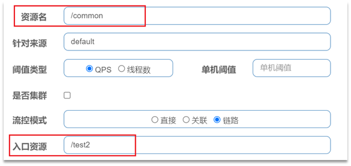
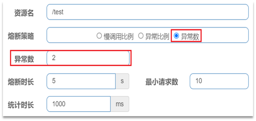
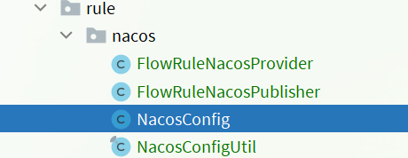
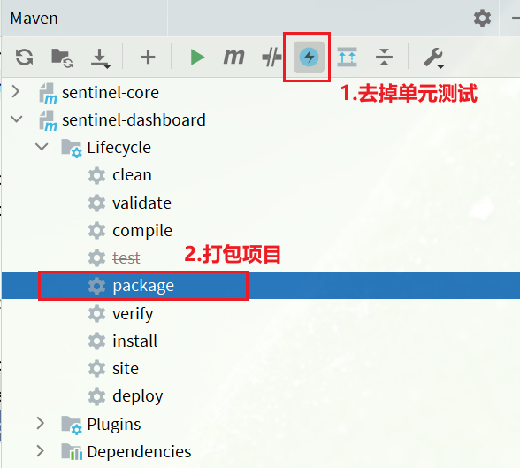

## Sentinel1.8.6

### 降级

降级的意思就是说, 如果要执行的方法报错了, 那么就快速失败, 调用一个备用的方法来返回一个结果


添加配置文件:


#### 对方法进行降级

todo


#### 对OpenFeign降级

todo


### 实时监控界面


在实时监控界面, 我们可以看到`sentinel-circuitbreaking-8080`, 这个是`spring.application.name`中获取的, 即服务名.  如果我们有多个服务的话, 那么会在左侧栏的`服务2`的位置来显示


图片上的(2/2)表示该service有两个实例, 并且健康的有两个,  **这个功能不需要配置中心来实现, 而是通过每个instance发送心跳到dashboard来实现**


右侧的实时监控显示了 Sentinel中每一个资源的调用情况, 通过的qps, 失败的qps

需要注意的时候, 我们当前有两个instance, 而**这里的qps表示的是两个instance的总和**, 比如对于资源`/get/{id}`, instance1的qps为1, instance2的qps为2, 那么这里就会显示qps为3


还需要注意的是, **sentinel只会在内存中保存一段时间的qps指标, 所以实时监控界面只有在调用之后才能看到, 如果在一段时间内没有调用对应的资源, 那么这个位置就是一片空白**


### 机器列表界面


在机器列表界面, 我们可以看到当前service的所有instance的情况


### 簇点链路界面


簇点链路会显示资源与资源之间的调用情况

**sentinel会把所有的Controller中的RequestMapping方法都当做sentinel资源来对待, 并且名字就是他们对应的url**

可以看到/get/{id}在被调用的过程中, 调用了SchoolController.getId()方法


**如果想要设置某个方法作为sentinel监控的资源, 那么只要给方法添加上@SentinelResource即可**


**上面的ip地址可以切换当前service的不同instance**


### 流控规则

流控规则就是对sentinel中的资源进行限流, 如果我们想要给某个资源进行限流, 那么我们可以在流控规则界面添加, 也可以在簇点链路界面中添加

需要注意的是, **添加流控规则只是对当前ip地址对应的instance添加, 而不是对同一个service的所有instance添加, sentinel没有给所有instance添加统一流控的功能**


添加流控规则界面如下:


1. 资源名:  即我们需要进行限量的资源

2. 来源:

   即**需要流控的请求的来源, 默认为default, 即对所有请求的进行流控**

   我们可以在我们的应用中实现`RequestOriginParser`这个接口, 该接口接受一个request, 并返回一个string类型的来源

   

   在我们的应用中, 我们从queryString中获取origin

   当我们指定的流控规则的来源为`serviceA`的时候, 那么只会对解析出来的来源为serviceA的请求做流控, 对于其他来源的request不做流控

   **多个来源用逗号分割**

3. 阈值类型和单机阈值: 

   即通过什么方式来做流控

   - qps: **即所有的请求都使用一个线程池, 但是使用信号量来控制每个资源能够并发的数量**
   - 并发线程数: 即每个不同的资源都有其独立的线程池, 通过线程池中的线程数量来控制并发的数量
   - 单机阈值表示信号量的个数或者线程池中线程的个数

4. 流控效果

   即当资源不足时, 应该怎么处理到来的请求

   - 快速失败: 即资源不足时, 对到来的请求直接返回一个`flow limiting`

   - 排队等待: 即让资源进行等待, 直到超时,  才进行失败

     

   - warm up

     https://blog.csdn.net/qq_41712271/article/details/118336309

     即预热模式, 在最开始的时候阈值为设置的1/3

     当过多的请求到来的时候, 慢慢的将阈值提升到设置的阈值,  这个慢慢的时间就是我们设置的预热时长

     打个比方, 我们设置的阈值是10, 预热时间为5s

     那么在一开始的时候, 阈值就是3, 当很多请求到来的时候, 会在5s内将阈值提升到10

     即**稳步提升我们的处理能力**

     

5. 流控模式

   - 直接: 就是当我们指定的资源名发生资源不是时, 就对指定的资源进行限制

   - 关联:

     统计与当前资源相关的另一个资源，触发阈值时，对当前资源限制

     配置规则：

     

     **语法说明**：当/write资源访问量触发阈值时，就会对/read资源限流，避免影响/write资源。

     **使用场景**：比如用户支付时需要修改订单状态，同时用户要查询订单。查询和修改操作会争抢数据库锁，产生竞争。业务需求是优先支付和更新订单的业务，因此当修改订单业务触发阈值时，需要对查询订单业务限流。

   - 链路:

     只针对从指定链路访问到本资源的请求做统计，判断是否超过阈值。

     **配置示例**：

     例如有两条请求链路：

     - /test1 --> /common

     - /test2 --> /common

     如果只希望控制从/test2进入到/common的请求，则可以这样配置：

     


在添加完之后, 我们可以在流控规则界面看到当前instance的规则

**需要注意的是, 该流控规则只针对当前ip对应的应用**


### 熔断规则

断路器控制熔断和放行是通过状态机来完成的：


状态机包括三个状态：

- closed：关闭状态，断路器放行所有请求，并开始统计异常比例、慢请求比例。超过阈值则切换到open状态
- open：打开状态，服务调用被**熔断**，访问被熔断服务的请求会被拒绝，快速失败，直接走降级逻辑。Open状态5秒后会进入half-open状态
- half-open：半开状态，放行一次请求，根据执行结果来判断接下来的操作。
  - 请求成功：则切换到closed状态
  - 请求失败：则切换到open状态


断路器熔断策略有三种：慢调用、异常比例、异常数

#### 慢调用

**慢调用**：业务的响应时长（RT）大于指定时长的请求认定为慢调用请求。在指定时间内，如果请求数量超过设定的最小数量，并且慢调用比例大于设定的阈值，则触发熔断。

例如：


解读：RT超过500ms的调用是慢调用，统计最近10000ms内的请求，如果请求量超过10次，并且慢调用比例不低于0.5，则触发熔断，熔断时长为5秒。然后进入half-open状态，放行一次请求做测试。

即对资源的调用请求进行统计, 如果达到了阈值, 那么就直接快速失败


#### 异常比例和异常数

**异常比例或异常数**：统计指定时间内的调用，如果调用次数超过指定请求数，并且出现异常的比例达到设定的比例阈值（或超过指定异常数），则触发熔断。

例如，异常比例设置：


解读：统计最近1000ms内的请求，如果请求量超过10次，并且异常比例不低于0.4，则触发熔断。

异常数设置：



解读：统计最近1000ms内的请求，如果请求量超过10次，并且异常比例不低于2次，则触发熔断。


### 热点规则

**分别统计参数值相同的请求**，判断是否超过QPS阈值。


#### 对所有参数进行限制

配置示例：


代表的含义是：对资源的0号参数（第一个参数）做统计，每1秒**相同参数值**的请求数不能超过5


#### 对热点参数进行限制

刚才的配置中，对查询商品这个接口的所有商品一视同仁，QPS都限定为5.

而在实际开发中，可能部分商品是热点商品，例如秒杀商品，我们希望这部分商品的QPS限制与其它商品不一样，高一些。那就需要配置热点参数限流的高级选项了


结合上一个配置，这里的含义是对0号的long类型参数限流，每1秒相同参数的QPS不能超过5，有两个例外：

•如果参数值是100，则每1秒允许的QPS为10

•如果参数值是101，则每1秒允许的QPS为15


### 授权规则

授权规则可以对调用方的来源做控制，有白名单和黑名单两种方式。

- 白名单：来源（origin）在白名单内的调用者允许访问

- 黑名单：来源（origin）在黑名单内的调用者不允许访问

点击左侧菜单的授权，可以看到授权规则：


- 资源名：就是受保护的资源，例如/order/{orderId}

- 流控应用：是来源者的名单，
  - 如果是勾选白名单，则名单中的来源被许可访问。
  - 如果是勾选黑名单，则名单中的来源被禁止访问。

比如：


我们允许请求从gateway到order-service，不允许浏览器访问order-service，那么白名单中就要填写**网关的来源名称（origin）**。

#### 如何获取来源

Sentinel是通过RequestOriginParser这个接口的parseOrigin来获取请求的来源的。

```java
public interface RequestOriginParser {
    /**
     * 从请求request对象中获取origin，获取方式自定义
     */
    String parseOrigin(HttpServletRequest request);
}
```

这个方法的作用就是从request对象中，获取请求者的origin值并返回。

默认情况下，sentinel不管请求者从哪里来，返回值永远是default，也就是说一切请求的来源都被认为是一样的值default。


因此，我们需要自定义这个接口的实现，让**不同的请求，返回不同的origin**。


例如order-service服务中，我们定义一个RequestOriginParser的实现类：

```java
package cn.itcast.order.sentinel;

import com.alibaba.csp.sentinel.adapter.spring.webmvc.callback.RequestOriginParser;
import org.springframework.stereotype.Component;
import org.springframework.util.StringUtils;

import javax.servlet.http.HttpServletRequest;

@Component
public class HeaderOriginParser implements RequestOriginParser {
    @Override
    public String parseOrigin(HttpServletRequest request) {
        // 1.获取请求头
        String origin = request.getHeader("origin");
        // 2.非空判断
        if (StringUtils.isEmpty(origin)) {
            origin = "blank";
        }
        return origin;
    }
}
```

我们会尝试从request-header中获取origin值。

#### 给网关添加请求头

既然获取请求origin的方式是从reques-header中获取origin值，我们必须让**所有从gateway路由到微服务的请求都带上origin头**。

这个需要利用之前学习的一个GatewayFilter来实现，AddRequestHeaderGatewayFilter。

修改gateway服务中的application.yml，添加一个defaultFilter：

```yaml
spring:
  cloud:
    gateway:
      default-filters:
        - AddRequestHeader=origin,gateway
      routes:
       # ...略
```

这样，从gateway路由的所有请求都会带上origin头，值为gateway。而从其它地方到达微服务的请求则没有这个头。


### 自定义异常结果

默认情况下，发生限流、降级、授权拦截时，都会抛出异常到调用方。异常结果都是flow limmiting（限流）。这样不够友好，无法得知是限流还是降级还是授权拦截。

而如果要自定义异常时的返回结果，需要实现BlockExceptionHandler接口：

```java
public interface BlockExceptionHandler {
    /**
     * 处理请求被限流、降级、授权拦截时抛出的异常：BlockException
     */
    void handle(HttpServletRequest request, HttpServletResponse response, BlockException e) throws Exception;
}
```

这里的BlockException包含多个不同的子类：

| **异常**             | **说明**           |
| -------------------- | ------------------ |
| FlowException        | 限流异常           |
| ParamFlowException   | 热点参数限流的异常 |
| DegradeException     | 降级异常           |
| AuthorityException   | 授权规则异常       |
| SystemBlockException | 系统规则异常       |

**自定义异常处理**

下面，我们就自定义异常处理类：

```java
package cn.itcast.order.sentinel;

import com.alibaba.csp.sentinel.adapter.spring.webmvc.callback.BlockExceptionHandler;
import com.alibaba.csp.sentinel.slots.block.BlockException;
import com.alibaba.csp.sentinel.slots.block.authority.AuthorityException;
import com.alibaba.csp.sentinel.slots.block.degrade.DegradeException;
import com.alibaba.csp.sentinel.slots.block.flow.FlowException;
import com.alibaba.csp.sentinel.slots.block.flow.param.ParamFlowException;
import org.springframework.stereotype.Component;

import javax.servlet.http.HttpServletRequest;
import javax.servlet.http.HttpServletResponse;

@Component
public class SentinelExceptionHandler implements BlockExceptionHandler {
    @Override
    public void handle(HttpServletRequest request, HttpServletResponse response, BlockException e) throws Exception {
        String msg = "未知异常";
        int status = 429;

        if (e instanceof FlowException) {
            msg = "请求被限流了";
        } else if (e instanceof ParamFlowException) {
            msg = "请求被热点参数限流";
        } else if (e instanceof DegradeException) {
            msg = "请求被降级了";
        } else if (e instanceof AuthorityException) {
            msg = "没有权限访问";
            status = 401;
        }

        response.setContentType("application/json;charset=utf-8");
        response.setStatus(status);
        response.getWriter().println("{\"msg\": " + msg + ", \"status\": " + status + "}");
    }
}
```


### 规则持久化

现在，sentinel的所有规则都是内存存储，重启后所有规则都会丢失。在生产环境下，我们必须确保这些规则的持久化，避免丢失。

#### 规则管理模式

规则是否能持久化，取决于规则管理模式，sentinel支持三种规则管理模式：

- 原始模式：Sentinel的默认模式，将规则保存在内存，重启服务会丢失。
- pull模式
- push模式

#### pull模式

pull模式：控制台将配置的规则推送到Sentinel客户端，而客户端会将配置规则保存在本地文件或数据库中。以后会定时去本地文件或数据库中查询，更新本地规则。


#### push模式

push模式：控制台将配置规则推送到远程配置中心，例如Nacos。Sentinel客户端监听Nacos，获取配置变更的推送消息，完成本地配置更新。


#### 实现push模式

1. 修改OrderService，让其监听Nacos中的sentinel规则配置。

   具体步骤如下：

   1. 在order-service中引入sentinel监听nacos的依赖：

      ~~~xml
      <dependency>
          <groupId>com.alibaba.csp</groupId>
          <artifactId>sentinel-datasource-nacos</artifactId>
      </dependency>
      ~~~

   2. 配置nacos地址

      在order-service中的application.yml文件配置nacos地址及监听的配置信息：

      ~~~java
      spring:
        cloud:
          sentinel:
            datasource:
              flow:
                nacos:
                  server-addr: localhost:8848 # nacos地址
                  dataId: orderservice-flow-rules
                  groupId: SENTINEL_GROUP
                  rule-type: flow # 还可以是：degrade、authority、param-flow
      ~~~

      

2. 修改sentinel-dashboard源码

   SentinelDashboard默认不支持nacos的持久化，需要修改源码。步骤如下:

   1. 下载sentinel源码包, 并使用idea打开

      

      

   2. 在sentinel-dashboard源码的pom文件中，nacos的依赖默认的scope是test，只能在测试时使用，这里要去除：

      

      将sentinel-datasource-nacos依赖的scope去掉：

      ~~~java
      <dependency>
          <groupId>com.alibaba.csp</groupId>
          <artifactId>sentinel-datasource-nacos</artifactId>
      </dependency>
      ~~~

   3. 添加nacos支持

      在sentinel-dashboard的test包下，已经编写了对nacos的支持，我们需要将其拷贝到main下。

      

   4. 设置nacos地址

      然后，还需要修改测试代码中的NacosConfig类：

      

      修改其中的nacos地址，让其读取application.properties中的配置：

      

      在sentinel-dashboard的application.properties中添加nacos地址配置：

      ```properties
      nacos.addr=localhost:8848
      ```

   5. 配置nacos数据源

      另外，还需要修改com.alibaba.csp.sentinel.dashboard.controller.v2包下的FlowControllerV2类：

      

      让我们添加的Nacos数据源生效：

      

   6. 修改前端页面

      接下来，还要修改前端页面，添加一个支持nacos的菜单。

      修改src/main/webapp/resources/app/scripts/directives/sidebar/目录下的sidebar.html文件：

      

      

      将其中的这部分注释打开：

      

      

      修改其中的文本：

      

   7. 重新编译、打包项目

      运行IDEA中的maven插件，编译和打包修改好的Sentinel-Dashboard：

      

      

      8.启动

      启动方式跟官方一样：

      ```sh
      java -jar sentinel-dashboard.jar
      ```

      如果要修改nacos地址，需要添加参数：

      ```sh
      java -jar -Dnacos.addr=localhost:8848 sentinel-dashboard.jar
      ```

      