# 第一章 Spring Security快速入门

**官方文档：**

https://docs.spring.io/spring-security/reference/index.html


**功能：**

- 身份认证（authentication）
- 授权（authorization）
- 防御常见攻击（protection against common attacks）


**身份认证：**

- 身份认证是验证`谁正在访问系统资源`，判断用户是否为合法用户。认证用户的常见方式是要求用户输入用户名和密码。


**授权：**

- 用户进行身份认证后，系统会控制`谁能访问哪些资源`，这个过程叫做授权。用户无法访问没有权限的资源。


**防御常见攻击：**

- CSRF
- HTTP Headers
- HTTP Requests


## 1、身份认证（authentication）

**官方代码示例：**[GitHub - spring-projects/spring-security-samples](https://github.com/spring-projects/spring-security-samples/tree/main)

### 1.1、创建Spring Boot项目

项目名：security-demo

JDK：17

SpringBoot：3.2.0（依赖了Spring Security 6.2.0）

Dependencies：Spring Web、Spring Security、Thymeleaf


### 1.2、创建IndexController

```java
package com.atguigu.securitydemo.controller;

@Controller
public class IndexController {

    @GetMapping("/")
    public String index() {
        return "index";
    }
}
```


### 1.3、创建index.html

在路径resources/templates中创建index.html

```html
<html xmlns:th="https://www.thymeleaf.org">
<head>
  <title>Hello Security!</title>
</head>
<body>
<h1>Hello Security</h1>
<!--通过使用@{/logout}，Thymeleaf将自动处理生成正确的URL，以适应当前的上下文路径。
这样，无论应用程序部署在哪个上下文路径下，生成的URL都能正确地指向注销功能。-->
<a th:href="@{/logout}">Log Out</a>
</body>
</html>
```


### 1.4、启动项目测试Controller

浏览器中访问：http://localhost:8080/

**浏览器自动跳转到登录页面：**http://localhost:8080/login

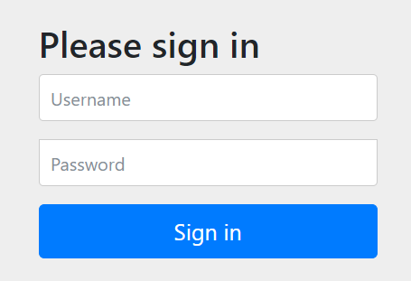


输入用户名：user

输入密码：在控制台的启动日志中查找初始的默认密码

点击"Sign in"进行登录，浏览器就跳转到了index页面


### 1.5、注意事项

#### 1.5.1、@{/logout}的作用

通过使用@{/logout}，Thymeleaf将自动处理生成正确的URL，以适应当前的上下文路径。这样，无论应用程序部署在哪个上下文路径下，生成的URL都能正确地指向注销功能。

例如：如果我们在配置文件中添加如下内容

```yaml
server.servlet.context-path=/demo
```

那么@{/logout}可以自动处理url为正确的相对路径

但是如果是普通的/logout，路径就会不正确


#### 1.5.2、页面样式无法加载的问题

页面样式bootstrap.min.css是一个CDN地址，需要通过科学上网的方式访问


否则你的登录页会加载很久，并且看到的页面是这样的（登录按钮没有样式文件渲染，但是不影响登录功能的执行）


### 1.6、Spring Security默认做了什么

- 保护应用程序URL，要求对应用程序的任何交互进行身份验证。
- 程序启动时生成一个默认用户“user”。
- 生成一个默认的随机密码，并将此密码记录在控制台上。
- 生成默认的登录表单和注销页面。
- 提供基于表单的登录和注销流程。
- 对于Web请求，重定向到登录页面；
- 对于服务请求，返回401未经授权。
- 处理跨站请求伪造（CSRF）攻击。
- 处理会话劫持攻击。
- 写入Strict-Transport-Security以确保HTTPS。
- 写入X-Content-Type-Options以处理嗅探攻击。
- 写入Cache Control头来保护经过身份验证的资源。
- 写入X-Frame-Options以处理点击劫持攻击。


## 2、Spring Security 的底层原理

**官方文档：**[Spring Security的底层原理](https://docs.spring.io/spring-security/reference/servlet/architecture.html)

Spring Security之所以默认帮助我们做了那么多事情，它的底层原理是传统的`Servlet过滤器`


### 2.1、Filter

下图展示了处理一个Http请求时，过滤器和Servlet的工作流程：


因此我们可以在过滤器中对请求进行修改或增强。


### 2.2、DelegatingFilterProxy

DelegatingFilterProxy 是 Spring Security 提供的一个 Filter 实现，可以在 Servlet 容器和 Spring 容器之间建立桥梁。通过使用 DelegatingFilterProxy，这样就可以将Servlet容器中的 Filter 实例放在 Spring 容器中管理。


### 2.3、FilterChainProxy

复杂的业务中不可能只有一个过滤器。因此FilterChainProxy是Spring Security提供的一个特殊的Filter，它允许通过SecurityFilterChain将过滤器的工作委托给多个Bean Filter实例。

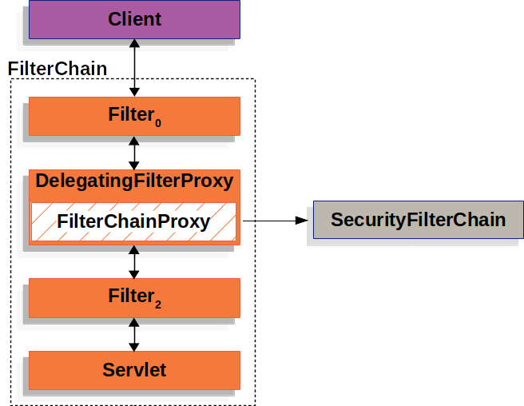


### 2.4、SecurityFilterChain

SecurityFilterChain 被 FilterChainProxy 使用，负责查找当前的请求需要执行的Security Filter列表。


### 2.5、Multiple SecurityFilterChain

可以有多个SecurityFilterChain的配置，FilterChainProxy决定使用哪个SecurityFilterChain。如果请求的URL是/api/messages/，它首先匹配SecurityFilterChain0的模式/api/\*\*，因此只调用SecurityFilterChain 0。假设没有其他SecurityFilterChain实例匹配，那么将调用SecurityFilterChain n。


## 3、程序的启动和运行

### 3.1、DefaultSecurityFilterChain

SecurityFilterChain接口的实现，加载了默认的16个Filter


### 3.2、SecurityProperties

默认情况下Spring Security将初始的用户名和密码存在了SecurityProperties类中。这个类中有一个静态内部类User，配置了默认的用户名（name = "user"）和密码（password = uuid）


我们也可以将用户名、密码配置在SpringBoot的配置文件中：在application.properties中配置自定义用户名和密码

```properties
spring.security.user.name=user
spring.security.user.password=123
```


# 第二章 Spring Security自定义配置

## 1、基于内存的用户认证

### 1.1、创建自定义配置

实际开发的过程中，我们需要应用程序更加灵活，可以在SpringSecurity中创建自定义配置文件

**官方文档：**[Java自定义配置](https://docs.spring.io/spring-security/reference/servlet/configuration/java.html)

**UserDetailsService**用来管理用户信息，**InMemoryUserDetailsManager**是UserDetailsService的一个实现，用来管理基于内存的用户信息。


创建一个WebSecurityConfig文件：

定义一个@Bean，类型是UserDetailsService，实现是InMemoryUserDetailsManager

```java
package com.atguigu.securitydemo.config;

@Configuration
@EnableWebSecurity//Spring项目总需要添加此注解，SpringBoot项目中不需要
public class WebSecurityConfig {

    @Bean
    public UserDetailsService userDetailsService() {
        InMemoryUserDetailsManager manager = new InMemoryUserDetailsManager();
        manager.createUser( //此行设置断点可以查看创建的user对象
            User
            .withDefaultPasswordEncoder()
            .username("huan") //自定义用户名
            .password("password") //自定义密码
            .roles("USER") //自定义角色
            .build()
        );
        return manager;
    }
}
```


**测试：**使用用户名huan，密码password登录


### 1.2、基于内存的用户认证流程

- 程序启动时：
  - 创建`InMemoryUserDetailsManager`对象
  - 创建`User`对象，封装用户名密码
  - 使用InMemoryUserDetailsManager`将User存入内存`
- 校验用户时：
  - SpringSecurity自动使用`InMemoryUserDetailsManager`的`loadUserByUsername`方法从`内存中`获取User对象
  - 在`UsernamePasswordAuthenticationFilter`过滤器中的`attemptAuthentication`方法中将用户输入的用户名密码和从内存中获取到的用户信息进行比较，进行用户认证


## 2、基于数据库的数据源

### 2.1、SQL

创建三个数据库表并插入测试数据

```sql
-- 创建数据库
CREATE DATABASE `security-demo`;
USE `security-demo`;

-- 创建用户表
CREATE TABLE `user`(
	`id` INT NOT NULL AUTO_INCREMENT PRIMARY KEY,
	`username` VARCHAR(50) DEFAULT NULL ,
	`password` VARCHAR(500) DEFAULT NULL,
	`enabled` BOOLEAN NOT NULL
);
-- 唯一索引
CREATE UNIQUE INDEX `user_username_uindex` ON `user`(`username`); 

-- 插入用户数据(密码是 "abc" )
INSERT INTO `user` (`username`, `password`, `enabled`) VALUES
('admin', '{bcrypt}$2a$10$GRLdNijSQMUvl/au9ofL.eDwmoohzzS7.rmNSJZ.0FxO/BTk76klW', TRUE),
('Helen', '{bcrypt}$2a$10$GRLdNijSQMUvl/au9ofL.eDwmoohzzS7.rmNSJZ.0FxO/BTk76klW', TRUE),
('Tom', '{bcrypt}$2a$10$GRLdNijSQMUvl/au9ofL.eDwmoohzzS7.rmNSJZ.0FxO/BTk76klW', TRUE);
```


### 2.2、引入依赖

```xml
<dependency>
    <groupId>mysql</groupId>
    <artifactId>mysql-connector-java</artifactId>
    <version>8.0.30</version>
</dependency>

<dependency>
    <groupId>com.baomidou</groupId>
    <artifactId>mybatis-plus-boot-starter</artifactId>
    <version>3.5.4.1</version>
    <exclusions>
        <exclusion>
            <groupId>org.mybatis</groupId>
            <artifactId>mybatis-spring</artifactId>
        </exclusion>
    </exclusions>
</dependency>

<dependency>
    <groupId>org.mybatis</groupId>
    <artifactId>mybatis-spring</artifactId>
    <version>3.0.3</version>
</dependency>

<dependency>
    <groupId>org.projectlombok</groupId>
    <artifactId>lombok</artifactId>
</dependency>
```


### 2.3、配置数据源

```properties
#MySQL数据源
spring.datasource.driver-class-name=com.mysql.cj.jdbc.Driver
spring.datasource.url=jdbc:mysql://localhost:3306/security-demo
spring.datasource.username=root
spring.datasource.password=123456
#SQL日志
mybatis-plus.configuration.log-impl=org.apache.ibatis.logging.stdout.StdOutImpl
```


### 2.4、实体类

```java
package com.atguigu.securitydemo.entity;

@Data
public class User {

    @TableId(value = "id", type = IdType.AUTO)
    private Integer id;

    private String username;

    private String password;

    private Boolean enabled;

}
```


### 2.5、Mapper

接口

```java
package com.atguigu.securitydemo.mapper;

@Mapper
public interface UserMapper extends BaseMapper<User> {
}
```


xml

resources/mapper/UserMapper.xml

```xml
<?xml version="1.0" encoding="UTF-8"?>
<!DOCTYPE mapper PUBLIC "-//mybatis.org//DTD Mapper 3.0//EN" "http://mybatis.org/dtd/mybatis-3-mapper.dtd">
<mapper namespace="com.atguigu.securitydemo.mapper.UserMapper">

</mapper>
```


### 2.6、Service

接口

```java
package com.atguigu.securitydemo.service;

public interface UserService extends IService<User> {
}
```

实现

```java
package com.atguigu.securitydemo.service.impl;

@Service
public class UserServiceImpl extends ServiceImpl<UserMapper, User> implements UserService {
}
```


### 2.7、Controller

```java
package com.atguigu.securitydemo.controller;

@RestController
@RequestMapping("/user")
public class UserController {

    @Resource
    public UserService userService;

    @GetMapping("/list")
    public List<User> getList(){
        return userService.list();
    }
}
```


**测试：**[localhost:8080/demo/user/list](http://localhost:8080/demo/user/list)


## 3、基于数据库的用户认证

### 3.1、基于数据库的用户认证流程

- 程序启动时：
  - 创建`DBUserDetailsManager`类，实现接口 UserDetailsManager, UserDetailsPasswordService
  - 在应用程序中初始化这个类的对象
- 校验用户时：
  - SpringSecurity自动使用`DBUserDetailsManager`的`loadUserByUsername`方法从`数据库中`获取User对象
  - 在`UsernamePasswordAuthenticationFilter`过滤器中的`attemptAuthentication`方法中将用户输入的用户名密码和从数据库中获取到的用户信息进行比较，进行用户认证


### 3.2、定义DBUserDetailsManager

```java
package com.atguigu.securitydemo.config;

public class DBUserDetailsManager implements UserDetailsManager, UserDetailsPasswordService {
    
    @Resource
    private UserMapper userMapper;

    @Override
    public UserDetails loadUserByUsername(String username) throws UsernameNotFoundException {

        QueryWrapper<User> queryWrapper = new QueryWrapper<>();
        queryWrapper.eq("username", username);
        User user = userMapper.selectOne(queryWrapper);
        if (user == null) {
            throw new UsernameNotFoundException(username);
        } else {
            Collection<GrantedAuthority> authorities = new ArrayList<>();
            return new org.springframework.security.core.userdetails.User(
                    user.getUsername(),
                    user.getPassword(),
                    user.getEnabled(),
                    true, //用户账号是否过期
                    true, //用户凭证是否过期
                    true, //用户是否未被锁定
                    authorities); //权限列表
        }
    }

    @Override
    public UserDetails updatePassword(UserDetails user, String newPassword) {
        return null;
    }

    @Override
    public void createUser(UserDetails user) {

    }

    @Override
    public void updateUser(UserDetails user) {

    }

    @Override
    public void deleteUser(String username) {

    }

    @Override
    public void changePassword(String oldPassword, String newPassword) {

    }

    @Override
    public boolean userExists(String username) {
        return false;
    }
}

```


### 3.3、初始化UserDetailsService

修改WebSecurityConfig中的userDetailsService方法如下

```java
@Bean
public UserDetailsService userDetailsService() {
    DBUserDetailsManager manager = new DBUserDetailsManager();
    return manager;
}
```

**或者直接在DBUserDetailsManager类上添加@Component注解**


**测试：**使用数据库中配置的用户名和密码进行登录


## 4、SpringSecurity的默认配置

在WebSecurityConfig中添加如下配置

```java
@Bean
public SecurityFilterChain filterChain(HttpSecurity http) throws Exception {
    //authorizeRequests()：开启授权保护
    //anyRequest()：对所有请求开启授权保护
    //authenticated()：已认证请求会自动被授权
    http
        .authorizeRequests(authorize -> authorize.anyRequest().authenticated())
        .formLogin(withDefaults())//表单授权方式
        .httpBasic(withDefaults());//基本授权方式

    return http.build();
}
```


## 5、添加用户功能

### 5.1、Controller

UserController中添加方法

```java
@PostMapping("/add")
public void add(@RequestBody User user){
    userService.saveUserDetails(user);
}
```


### 5.2、Service

UserService接口中添加方法

```java
void saveUserDetails(User user);
```

UserServiceImpl实现中添加方法

```java
@Resource
private DBUserDetailsManager dbUserDetailsManager;

@Override
public void saveUserDetails(User user) {

    UserDetails userDetails = org.springframework.security.core.userdetails.User
            .withDefaultPasswordEncoder()
            .username(user.getUsername()) //自定义用户名
            .password(user.getPassword()) //自定义密码
            .build();
    dbUserDetailsManager.createUser(userDetails);

}
```


### 5.3、修改配置

DBUserDetailsManager中添加方法

```java
@Override
public void createUser(UserDetails userDetails) {

    User user = new User();
    user.setUsername(userDetails.getUsername());
    user.setPassword(userDetails.getPassword());
    user.setEnabled(true);
    userMapper.insert(user);
}
```


### 5.4、使用Swagger测试

pom中添加配置用于测试

```xml
<!--swagger测试-->
<dependency>
    <groupId>com.github.xiaoymin</groupId>
    <artifactId>knife4j-openapi3-jakarta-spring-boot-starter</artifactId>
    <version>4.1.0</version>
</dependency>
```


**Swagger测试地址：**http://localhost:8080/demo/doc.html


### 5.5、关闭csrf攻击防御

默认情况下SpringSecurity开启了csrf攻击防御的功能，这要求请求参数中必须有一个隐藏的**_csrf**字段，如下：


在filterChain方法中添加如下代码，关闭csrf攻击防御

```java
//关闭csrf攻击防御
http.csrf((csrf) -> {
    csrf.disable();
});
```


## 6、密码加密算法

**参考文档：**[Password Storage :: Spring Security](https://docs.spring.io/spring-security/reference/features/authentication/password-storage.html)


### 6.1、密码加密方式

**明文密码：**

最初，密码以明文形式存储在数据库中。但是恶意用户可能会通过SQL注入等手段获取到明文密码，或者程序员将数据库数据泄露的情况也可能发生。


**Hash算法：**

Spring Security的`PasswordEncoder`接口用于对密码进行`单向转换`，从而将密码安全地存储。对密码单向转换需要用到`哈希算法`，例如MD5、SHA-256、SHA-512等，哈希算法是单向的，`只能加密，不能解密`。

因此，`数据库中存储的是单向转换后的密码`，Spring Security在进行用户身份验证时需要将用户输入的密码进行单向转换，然后与数据库的密码进行比较。

因此，如果发生数据泄露，只有密码的单向哈希会被暴露。由于哈希是单向的，并且在给定哈希的情况下只能通过`暴力破解的方式猜测密码`。


**彩虹表：**

恶意用户创建称为`彩虹表`的查找表。

```
彩虹表就是一个庞大的、针对各种可能的字母组合预先生成的哈希值集合，有了它可以快速破解各类密码。越是复杂的密码，需要的彩虹表就越大，主流的彩虹表都是100G以上，目前主要的算法有LM, NTLM, MD5, SHA1, MYSQLSHA1, HALFLMCHALL, NTLMCHALL, ORACLE-SYSTEM, MD5-HALF。
```


**加盐密码：**

为了减轻彩虹表的效果，开发人员开始使用加盐密码。不再只使用密码作为哈希函数的输入，而是为每个用户的密码生成随机字节（称为盐）。盐和用户的密码将一起经过哈希函数运算，生成一个唯一的哈希。盐将以明文形式与用户的密码一起存储。然后，当用户尝试进行身份验证时，盐和用户输入的密码一起经过哈希函数运算，再与存储的密码进行比较。唯一的盐意味着彩虹表不再有效，因为对于每个盐和密码的组合，哈希都是不同的。


**自适应单向函数：**

随着硬件的不断发展，加盐哈希也不再安全。原因是，计算机可以每秒执行数十亿次哈希计算。这意味着我们可以轻松地破解每个密码。

现在，开发人员开始使用自适应单向函数来存储密码。使用自适应单向函数验证密码时，`故意占用资源（故意使用大量的CPU、内存或其他资源）`。自适应单向函数允许配置一个`“工作因子”`，随着硬件的改进而增加。我们建议将“工作因子”调整到系统中验证密码需要约一秒钟的时间。这种权衡是为了`让攻击者难以破解密码`。

自适应单向函数包括`bcrypt、PBKDF2、scrypt和argon2`。


### 6.2、PasswordEncoder

**BCryptPasswordEncoder**

使用广泛支持的bcrypt算法来对密码进行哈希。为了增加对密码破解的抵抗力，bcrypt故意设计得较慢。和其他自适应单向函数一样，应该调整其参数，使其在您的系统上验证一个密码大约需要1秒的时间。BCryptPasswordEncoder的默认实现使用强度10。建议您在自己的系统上调整和测试强度参数，以便验证密码时大约需要1秒的时间。


**Argon2PasswordEncoder**

使用Argon2算法对密码进行哈希处理。Argon2是密码哈希比赛的获胜者。为了防止在自定义硬件上进行密码破解，Argon2是一种故意缓慢的算法，需要大量内存。与其他自适应单向函数一样，它应该在您的系统上调整为大约1秒来验证一个密码。当前的Argon2PasswordEncoder实现需要使用BouncyCastle库。


**Pbkdf2PasswordEncoder**

使用PBKDF2算法对密码进行哈希处理。为了防止密码破解，PBKDF2是一种故意缓慢的算法。与其他自适应单向函数一样，它应该在您的系统上调整为大约1秒来验证一个密码。当需要FIPS认证时，这种算法是一个很好的选择。


**SCryptPasswordEncoder** 

使用scrypt算法对密码进行哈希处理。为了防止在自定义硬件上进行密码破解，scrypt是一种故意缓慢的算法，需要大量内存。与其他自适应单向函数一样，它应该在您的系统上调整为大约1秒来验证一个密码。


### 6.3、密码加密测试

在测试类中编写一个测试方法

```java
@Test
void testPassword() {

    // 工作因子，默认值是10，最小值是4，最大值是31，值越大运算速度越慢
    PasswordEncoder encoder = new BCryptPasswordEncoder(4);
    //明文："password"
    //密文：result，即使明文密码相同，每次生成的密文也不一致
    String result = encoder.encode("password");
    System.out.println(result);

    //密码校验
    Assert.isTrue(encoder.matches("password", result), "密码不一致");
}
```


### 6.4、DelegatingPasswordEncoder

- 表中存储的密码形式：`{bcrypt}`$2a$10$GRLdNijSQMUvl/au9ofL.eDwmoohzzS7.rmNSJZ.0FxO/BTk76klW
- 通过如下源码可以知道：可以通过`{bcrypt}`前缀动态获取和密码的形式类型一致的PasswordEncoder对象
- 目的：方便随时做密码策略的升级，兼容数据库中的老版本密码策略生成的密码

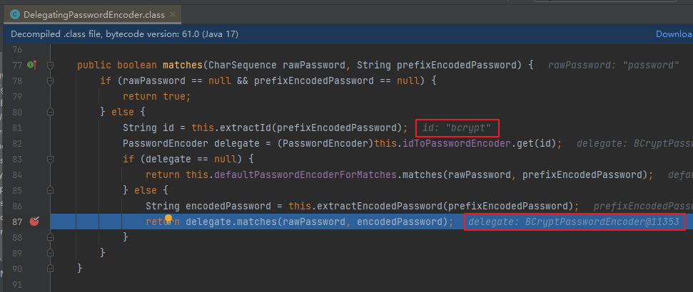


## 7、自定义登录页面

### 7.1、创建登录Controller

```java
package com.atguigu.securitydemo.controller;

@Controller
public class LoginController {

    @GetMapping("/login")
    public String login() {
        return "login";
    }
}
```


### 7.2、创建登录页面

resources/templates/login.html

```html
<!DOCTYPE html>
<html xmlns:th="https://www.thymeleaf.org">
<head>
    <title>登录</title>
</head>
<body>
<h1>登录</h1>
<div th:if="${param.error}">
    错误的用户名和密码.</div>

<!--method必须为"post"-->
<!--th:action="@{/login}" ，
使用动态参数，表单中会自动生成_csrf隐藏字段，用于防止csrf攻击
login: 和登录页面保持一致即可，SpringSecurity自动进行登录认证-->
<form th:action="@{/login}" method="post">
    <div>
        <!--name必须为"username"-->
        <input type="text" name="username" placeholder="用户名"/>
    </div>
    <div>
        <!--name必须为"password"-->
        <input type="password" name="password" placeholder="密码"/>
    </div>
    <input type="submit" value="登录" />
</form>
</body>
</html>
```


### 7.3、配置SecurityFilterChain

SecurityConfiguration：

```java
.formLogin( form -> {
    form
        .loginPage("/login").permitAll() //登录页面无需授权即可访问
        .usernameParameter("username") //自定义表单用户名参数，默认是username
        .passwordParameter("password") //自定义表单密码参数，默认是password
        .failureUrl("/login?error") //登录失败的返回地址
        ;
}); //使用表单授权方式
```


# 第三章 前后端分离

## 1、用户认证流程

- 登录成功后调用：AuthenticationSuccessHandler
- 登录失败后调用：AuthenticationFailureHandler


## 2、引入fastjson

```xml
<dependency>
    <groupId>com.alibaba.fastjson2</groupId>
    <artifactId>fastjson2</artifactId>
    <version>2.0.37</version>
</dependency>
```


## 3、认证成功的响应

### 3.1、成功结果处理

```java
package com.atguigu.securitydemo.config;

public class MyAuthenticationSuccessHandler implements AuthenticationSuccessHandler {
    @Override
    public void onAuthenticationSuccess(HttpServletRequest request, HttpServletResponse response, Authentication authentication) throws IOException, ServletException {

        //获取用户身份信息
        Object principal = authentication.getPrincipal();

        //创建结果对象
        HashMap result = new HashMap();
        result.put("code", 0);
        result.put("message", "登录成功");
        result.put("data", principal);

        //转换成json字符串
        String json = JSON.toJSONString(result);

        //返回响应
        response.setContentType("application/json;charset=UTF-8");
        response.getWriter().println(json);
    }
}
```

### 3.2、SecurityFilterChain配置

```java
form.successHandler(new MyAuthenticationSuccessHandler()) //认证成功时的处理
```


## 4、认证失败响应

### 4.1、失败结果处理

```java
package com.atguigu.securitydemo.config;

public class MyAuthenticationFailureHandler implements AuthenticationFailureHandler {

    @Override
    public void onAuthenticationFailure(HttpServletRequest request, HttpServletResponse response, AuthenticationException exception) throws IOException, ServletException {

        //获取错误信息
        String localizedMessage = exception.getLocalizedMessage();

        //创建结果对象
        HashMap result = new HashMap();
        result.put("code", -1);
        result.put("message", localizedMessage);

        //转换成json字符串
        String json = JSON.toJSONString(result);

        //返回响应
        response.setContentType("application/json;charset=UTF-8");
        response.getWriter().println(json);
    }
}
```

### 4.2SecurityFilterChain配置

```java
form.failureHandler(new MyAuthenticationFailureHandler()) //认证失败时的处理
```


## 5、注销响应

### 5.1、注销结果处理

```java
package com.atguigu.securitydemo.config;

public class MyLogoutSuccessHandler implements LogoutSuccessHandler {

    @Override
    public void onLogoutSuccess(HttpServletRequest request, HttpServletResponse response, Authentication authentication) throws IOException, ServletException {

        //创建结果对象
        HashMap result = new HashMap();
        result.put("code", 0);
        result.put("message", "注销成功");

        //转换成json字符串
        String json = JSON.toJSONString(result);

        //返回响应
        response.setContentType("application/json;charset=UTF-8");
        response.getWriter().println(json);
    }
}
```


### 5.2、SecurityFilterChain配置

```java
http.logout(logout -> {
    logout.logoutSuccessHandler(new MyLogoutSuccessHandler()); //注销成功时的处理
});
```


## 6、请求未认证的接口

### 6.1、实现AuthenticationEntryPoint接口

[Servlet Authentication Architecture :: Spring Security](https://docs.spring.io/spring-security/reference/servlet/authentication/architecture.html)

当访问一个需要认证之后才能访问的接口的时候，Spring Security会使用`AuthenticationEntryPoint`将用户请求跳转到登录页面，要求用户提供登录凭证。

这里我们也希望系统`返回json结果`，因此我们定义类`实现AuthenticationEntryPoint接口`

```java
package com.atguigu.securitydemo.config;

public class MyAuthenticationEntryPoint implements AuthenticationEntryPoint {
    @Override
    public void commence(HttpServletRequest request, HttpServletResponse response, AuthenticationException authException) throws IOException, ServletException {

        //获取错误信息
        //String localizedMessage = authException.getLocalizedMessage();

        //创建结果对象
        HashMap result = new HashMap();
        result.put("code", -1);
        result.put("message", "需要登录");

        //转换成json字符串
        String json = JSON.toJSONString(result);

        //返回响应
        response.setContentType("application/json;charset=UTF-8");
        response.getWriter().println(json);
    }
}
```


### 6.2、SecurityFilterChain配置

```java
//错误处理
http.exceptionHandling(exception  -> {
    exception.authenticationEntryPoint(new MyAuthenticationEntryPoint());//请求未认证的接口
});
```


## 7、跨域

跨域全称是跨域资源共享(Cross-Origin Resources Sharing,CORS)，它是浏览器的保护机制，只允许网页请求统一域名下的服务，同一域名指=>协议、域名、端口号都要保持一致，如果有一项不同，那么就是跨域请求。在前后端分离的项目中，需要解决跨域的问题。


在SpringSecurity中解决跨域很简单，在配置文件中添加如下配置即可

```java
//跨域
http.cors(withDefaults());
```


# 第四章 身份认证

## 1、用户认证信息

### 1.1、基本概念


在Spring Security框架中，SecurityContextHolder、SecurityContext、Authentication、Principal和Credential是一些与身份验证和授权相关的重要概念。它们之间的关系如下：


1. SecurityContextHolder：SecurityContextHolder 是 Spring Security 存储已认证用户详细信息的地方。
2. SecurityContext：SecurityContext 是从 SecurityContextHolder 获取的内容，包含当前已认证用户的 Authentication 信息。
3. Authentication：Authentication 表示用户的身份认证信息。它包含了用户的Principal、Credential和Authority信息。
4. Principal：表示用户的身份标识。它通常是一个表示用户的实体对象，例如用户名。Principal可以通过Authentication对象的getPrincipal()方法获取。
5. Credentials：表示用户的凭证信息，例如密码、证书或其他认证凭据。Credential可以通过Authentication对象的getCredentials()方法获取。
6. GrantedAuthority：表示用户被授予的权限

总结起来，SecurityContextHolder用于管理当前线程的安全上下文，存储已认证用户的详细信息，其中包含了SecurityContext对象，该对象包含了Authentication对象，后者表示用户的身份验证信息，包括Principal（用户的身份标识）和Credential（用户的凭证信息）。


### 1.2、在Controller中获取用户信息

IndexController：

```java
package com.atguigu.securitydemo.controller;

@RestController
public class IndexController {

    @GetMapping("/")
    public Map index(){

        System.out.println("index controller");

        SecurityContext context = SecurityContextHolder.getContext();//存储认证对象的上下文
        Authentication authentication = context.getAuthentication();//认证对象
        String username = authentication.getName();//用户名
        Object principal =authentication.getPrincipal();//身份
        Object credentials = authentication.getCredentials();//凭证(脱敏)
        Collection<? extends GrantedAuthority> authorities = authentication.getAuthorities();//权限

        System.out.println(username);
        System.out.println(principal);
        System.out.println(credentials);
        System.out.println(authorities);

        //创建结果对象
        HashMap result = new HashMap();
        result.put("code", 0);
        result.put("data", username);

        return result;
    }
}
```


## 2、会话并发处理

后登录的账号会使先登录的账号失效

### 2.1、实现处理器接口

实现接口SessionInformationExpiredStrategy

```java
package com.atguigu.securitydemo.config;

public class MySessionInformationExpiredStrategy implements SessionInformationExpiredStrategy {
    @Override
    public void onExpiredSessionDetected(SessionInformationExpiredEvent event) throws IOException, ServletException {

        //创建结果对象
        HashMap result = new HashMap();
        result.put("code", -1);
        result.put("message", "该账号已从其他设备登录");

        //转换成json字符串
        String json = JSON.toJSONString(result);

        HttpServletResponse response = event.getResponse();
        //返回响应
        response.setContentType("application/json;charset=UTF-8");
        response.getWriter().println(json);
    }
}
```


### 2.2、SecurityFilterChain配置

```java
//会话管理
http.sessionManagement(session -> {
    session
        .maximumSessions(1)
        .expiredSessionStrategy(new MySessionInformationExpiredStrategy());
});
```


# 第五章 授权

授权管理的实现在SpringSecurity中非常灵活，可以帮助应用程序实现以下两种常见的授权需求：

- 用户-权限-资源：例如张三的权限是添加用户、查看用户列表，李四的权限是查看用户列表

- 用户-角色-权限-资源：例如 张三是角色是管理员、李四的角色是普通用户，管理员能做所有操作，普通用户只能查看信息

  

## 1、基于request的授权

### 1.1、用户-权限-资源

**需求：**

- 具有USER_LIST权限的用户可以访问/user/list接口
- 具有USER_ADD权限的用户可以访问/user/add接口

#### 配置权限

SecurityFilterChain

```java
//开启授权保护
http.authorizeRequests(
        authorize -> authorize
    			//具有USER_LIST权限的用户可以访问/user/list
                .requestMatchers("/user/list").hasAuthority("USER_LIST")
    			//具有USER_ADD权限的用户可以访问/user/add
    			.requestMatchers("/user/add").hasAuthority("USER_ADD")
                //对所有请求开启授权保护
                .anyRequest()
                //已认证的请求会被自动授权
                .authenticated()
        );
```

#### 授予权限

DBUserDetailsManager中的loadUserByUsername方法：

```java
Collection<GrantedAuthority> authorities = new ArrayList<>();
authorities.add(()->"USER_LIST");
authorities.add(()->"USER_ADD");

/*authorities.add(new GrantedAuthority() {
    @Override
    public String getAuthority() {
        return "USER_LIST";
    }
});
authorities.add(new GrantedAuthority() {
    @Override
    public String getAuthority() {
        return "USER_ADD";
    }
});*/
```

#### 请求未授权的接口

SecurityFilterChain

```java
//错误处理
http.exceptionHandling(exception  -> {
    exception.authenticationEntryPoint(new MyAuthenticationEntryPoint());//请求未认证的接口
    exception.accessDeniedHandler((request, response, e)->{ //请求未授权的接口

        //创建结果对象
        HashMap result = new HashMap();
        result.put("code", -1);
        result.put("message", "没有权限");

        //转换成json字符串
        String json = JSON.toJSONString(result);

        //返回响应
        response.setContentType("application/json;charset=UTF-8");
        response.getWriter().println(json);
    });
});
```


**更多的例子：**[Authorize HttpServletRequests :: Spring Security](https://docs.spring.io/spring-security/reference/servlet/authorization/authorize-http-requests.html)


### 1.2、用户-角色-资源

**需求：**角色为ADMIN的用户才可以访问/user/**路径下的资源

#### 配置角色

SecurityFilterChain

```java
//开启授权保护
http.authorizeRequests(
        authorize -> authorize
                //具有管理员角色的用户可以访问/user/**
                .requestMatchers("/user/**").hasRole("ADMIN")
                //对所有请求开启授权保护
                .anyRequest()
                //已认证的请求会被自动授权
                .authenticated()
);
```

#### 授予角色

DBUserDetailsManager中的loadUserByUsername方法：

```java
return org.springframework.security.core.userdetails.User
        .withUsername(user.getUsername())
        .password(user.getPassword())
        .roles("ADMIN")
        .build();
```


### 1.3、用户-角色-权限-资源

RBAC（Role-Based Access Control，基于角色的访问控制）是一种常用的数据库设计方案，它将用户的权限分配和管理与角色相关联。以下是一个基本的RBAC数据库设计方案的示例：

1. 用户表（User table）：包含用户的基本信息，例如用户名、密码和其他身份验证信息。

| 列名     | 数据类型 | 描述         |
| -------- | -------- | ------------ |
| user_id  | int      | 用户ID       |
| username | varchar  | 用户名       |
| password | varchar  | 密码         |
| email    | varchar  | 电子邮件地址 |
| ...      | ...      | ...          |

2. 角色表（Role table）：存储所有可能的角色及其描述。

| 列名        | 数据类型 | 描述     |
| ----------- | -------- | -------- |
| role_id     | int      | 角色ID   |
| role_name   | varchar  | 角色名称 |
| description | varchar  | 角色描述 |
| ...         | ...      | ...      |

3. 权限表（Permission table）：定义系统中所有可能的权限。

| 列名            | 数据类型 | 描述     |
| --------------- | -------- | -------- |
| permission_id   | int      | 权限ID   |
| permission_name | varchar  | 权限名称 |
| description     | varchar  | 权限描述 |
| ...             | ...      | ...      |

4. 用户角色关联表（User-Role table）：将用户与角色关联起来。

| 列名         | 数据类型 | 描述           |
| ------------ | -------- | -------------- |
| user_role_id | int      | 用户角色关联ID |
| user_id      | int      | 用户ID         |
| role_id      | int      | 角色ID         |
| ...          | ...      | ...            |

5. 角色权限关联表（Role-Permission table）：将角色与权限关联起来。

| 列名               | 数据类型 | 描述           |
| ------------------ | -------- | -------------- |
| role_permission_id | int      | 角色权限关联ID |
| role_id            | int      | 角色ID         |
| permission_id      | int      | 权限ID         |
| ...                | ...      | ...            |

在这个设计方案中，用户可以被分配一个或多个角色，而每个角色又可以具有一个或多个权限。通过对用户角色关联和角色权限关联表进行操作，可以实现灵活的权限管理和访问控制。

当用户尝试访问系统资源时，系统可以根据用户的角色和权限决定是否允许访问。这样的设计方案使得权限管理更加简单和可维护，因为只需调整角色和权限的分配即可，而不需要针对每个用户进行单独的设置。


## 2、基于方法的授权

### 2.1、开启方法授权

在配置文件中添加如下注解

```java
@EnableMethodSecurity
```


### 2.2、给用户授予角色和权限

DBUserDetailsManager中的loadUserByUsername方法：

```java
return org.springframework.security.core.userdetails.User
        .withUsername(user.getUsername())
        .password(user.getPassword())
        .roles("ADMIN")
        .authorities("USER_ADD", "USER_UPDATE")
        .build();
```


### 2.2、常用授权注解

```java
//用户必须有 ADMIN 角色 并且 用户名是 admin 才能访问此方法
@PreAuthorize("hasRole('ADMIN') and authentication.name == 'admim'")
@GetMapping("/list")
public List<User> getList(){
    return userService.list();
}

//用户必须有 USER_ADD 权限 才能访问此方法
@PreAuthorize("hasAuthority('USER_ADD')")
@PostMapping("/add")
public void add(@RequestBody User user){
    userService.saveUserDetails(user);
}
```


**更多的例子：**[Method Security :: Spring Security](https://docs.spring.io/spring-security/reference/servlet/authorization/method-security.html)


# 第六章 OAuth2

## 1. OAuth2简介

### 1.1、OAuth2是什么

“Auth” 表示 “授权” Authorization

 “O” 是 Open 的简称，表示 “开放”

连在一起就表示 **“开放授权”**，OAuth2是一种开放授权协议。


**OAuth2最简向导：**[The Simplest Guide To OAuth 2.0](https://darutk.medium.com/the-simplest-guide-to-oauth-2-0-8c71bd9a15bb)


### 1.2、OAuth2的使用场景

#### 开放系统间授权

##### 社交登录

在传统的身份验证中，用户需要提供用户名和密码，还有很多网站登录时，允许使用第三方网站的身份，这称为"第三方登录"。所谓第三方登录，实质就是 OAuth 授权。用户想要登录 A 网站，A 网站让用户提供第三方网站的数据，证明自己的身份。获取第三方网站的身份数据，就需要 OAuth 授权。


##### 开放API

例如云冲印服务的实现


#### 现代微服务安全

##### 单块应用安全

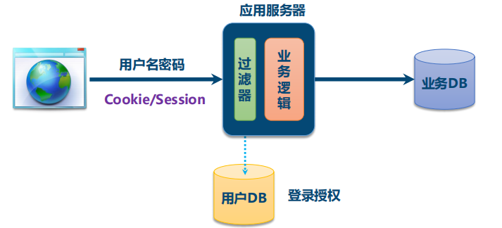


##### 微服务安全


### 1.3、OAuth2的角色

OAuth 2协议包含以下角色：

1. 资源所有者（Resource Owner）：即用户，资源的拥有人，想要通过客户应用访问资源服务器上的资源。
2. 客户应用（Client）：通常是一个Web或者无线应用，它需要访问用户的受保护资源。
3. 资源服务器（Resource Server）：存储受保护资源的服务器或定义了可以访问到资源的API，接收并验证客户端的访问令牌，以决定是否授权访问资源。
4. 授权服务器（Authorization Server）：负责验证资源所有者的身份并向客户端颁发访问令牌。


### 1.4、OAuth2的基本流程

1. 客户应用向授权服务器注册,  生成一个`clientid `和 `client secret`
2. 用户访问我们的登录页面, 并选择第三方登录
3. 跳转到授权服务器上的授权页面
4. 用户在授权页面上授权
5. 授权服务器生成一个access token, 返回给我们前端的登录页面, 此时前端的登录页面会使用js跳转到我们指定的后端接口
6. 我们的后端接口接受到access token, 使用该access token获取用户的信息, 然后生成一个jwt, 返回给前端并跳转回登录前的页面


### 1.5、OAuth2的四种授权模式

- 授权码（authorization-code）
- 隐藏式（implicit）
- 密码式（password）
- 客户端凭证（client credentials）


#### 第一种方式：授权码

授权码与基本流程不同的地方在于:

1. 授权服务器并不会生成access token并携带上他去回调我们的接口, 而是生成一个code, 并回调接口, 我们的后端接口需要根据该code去调用授权服务器, 才能获取access token, 然后使用access token获取用户信息

   这样的好处是, 如果直接带上access token回到接口, 实际上用户都可以看到这个access token
   
   

#### 第二种方式：隐藏式

**有些 Web 应用是纯前端应用，没有后端。这时就不能用上面的方式了，必须将令牌储存在前端。**

他的基本流程如下:

1. 客户应用向授权服务器注册,  生成一个`clientid `和 `client secret`
2. 用户访问我们的登录页面, 并选择第三方登录
3. 跳转到授权服务器上的授权页面
4. 用户在授权页面上授权
5. 授权服务器生成一个access token,  会将access token放在锚点中, 控制js跳转到我们指定的接口, 比如`https://a.com/callback#token=ACCESS_TOKEN` 
6. 应为我们没有后端服务器, 所以这个链接是一个nginx链接, 并且应为token放在锚点中, 他是不会随请求发送给出去的, 所以我们的nginx获取不到access token, 减少了泄漏令牌的风险。
7. 我们的nginx返回一个前端页面, 并在浏览器中通过js来解析当前页面的链接, 获取access token
8. 前端页面中的js获取access token后, 访问资源服务器获取用户信息, 并展示


#### 第三种方式：密码式

**密码式（Resource Owner Password Credentials）：如果你高度信任某个应用，RFC 6749 也允许用户把用户名和密码，直接告诉该应用。该应用就使用你的密码，申请令牌。**

基本步骤如下: 

1. 用户等我们我们的网站, 选择第三方登录
2. 用户在我们的网站上输入第三方的账号密码
3. 我们的前端获取到账号密码后, 发送给后端, 然后后端带上账号密码请求授权服务器
4. 授权服务器校验账号密码后, 返回access token给我们
5. 我们的后端使用access token向资源服务器请求用户信息


#### 第四种方式：凭证式

**凭证式（client credentials）：也叫客户端模式，适用于没有前端的命令行应用，即在命令行下请求令牌。**

他的基本步骤如下:

1. 用户输入authentication给命令行,  或者直接将authentication保存到程序指定的位置
2. 命令行根据这个token请求授权服务器, 并返回access token
3. 程序获取到access token后, 向资源服务器申请资源

**貌似git推送代码给github就是这种模式**,  之前在推送代码到github时, 需要输入账号密码,  但是现在使用账号密码已经无法推送了

需要用户生成登录github网页, 生成一个access token, 然后保存到本地git仓库的url上

之后推送代码时带上这个token才可以推送代码


包括docker client去私有仓库中拉取镜像也是这种模式?


### 1.5、授权类型的选择

如果有后端就选授权码模式

如果access token是给程序使用的, 就使用凭证式

如果没有后端就使用隐藏式

如果是自己的系统, 就使用密码式


## 2. 使用OAuth2接入Github

1. 将我们自己的应用注册到github中

   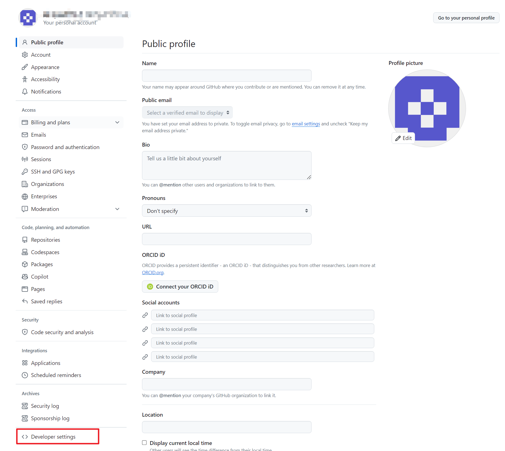

   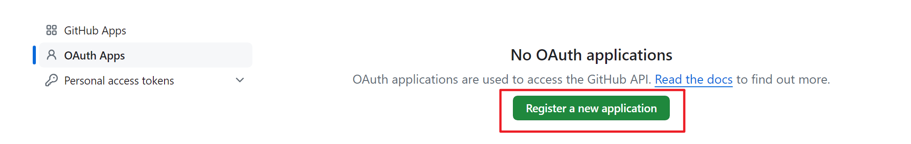

   Application name是应用的名称,  homepage是我们项目的主页, callback url是授权成功后github回调我们的地址

   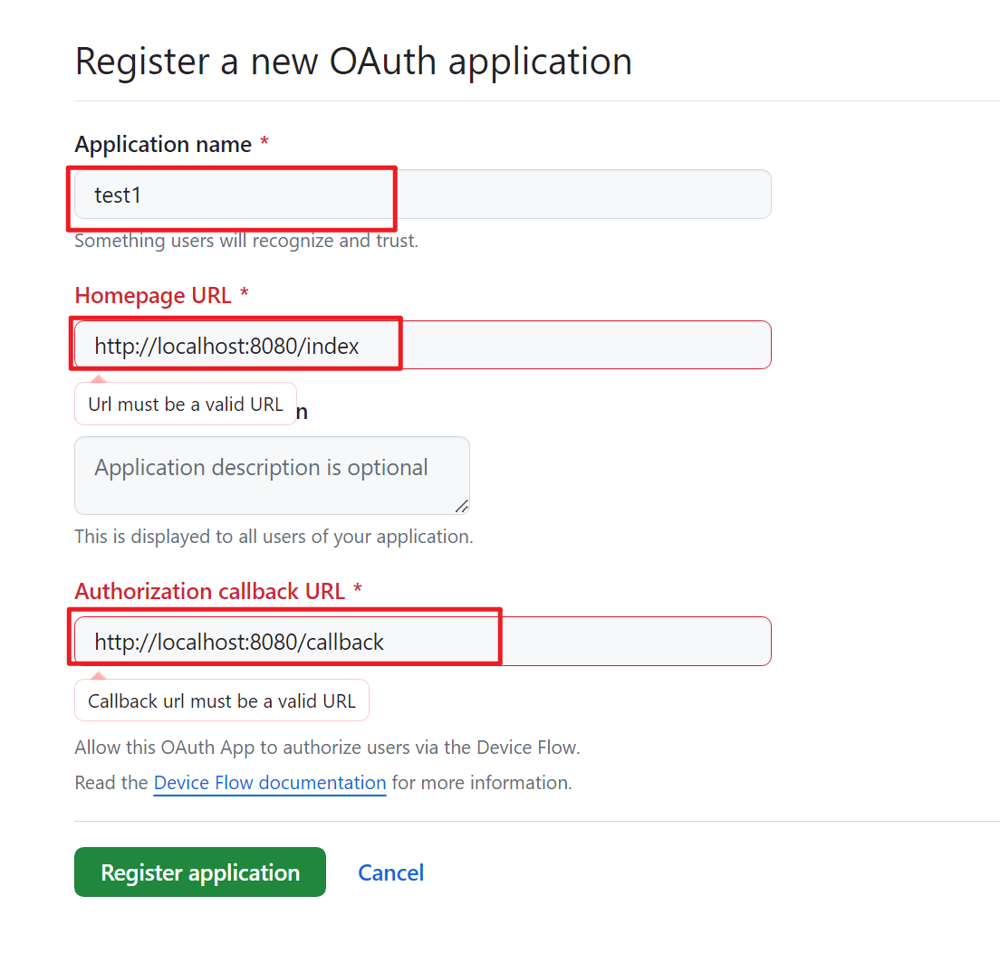

   创建应用成功后, 我们会获得一个Client ID,  此时我们需要点击按钮去生成一个Client Secret, 这个Secret必须保存下来,  github不会帮我们保存

   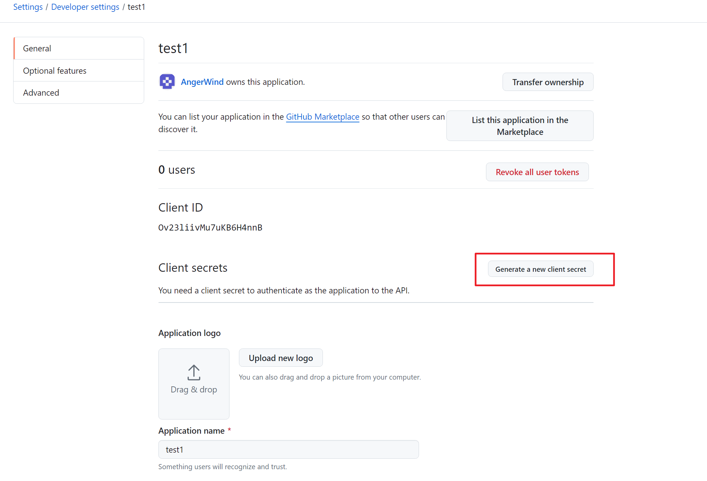

   给我们的应用添加一个Logo, 这个Logo会在授权的时候展示

   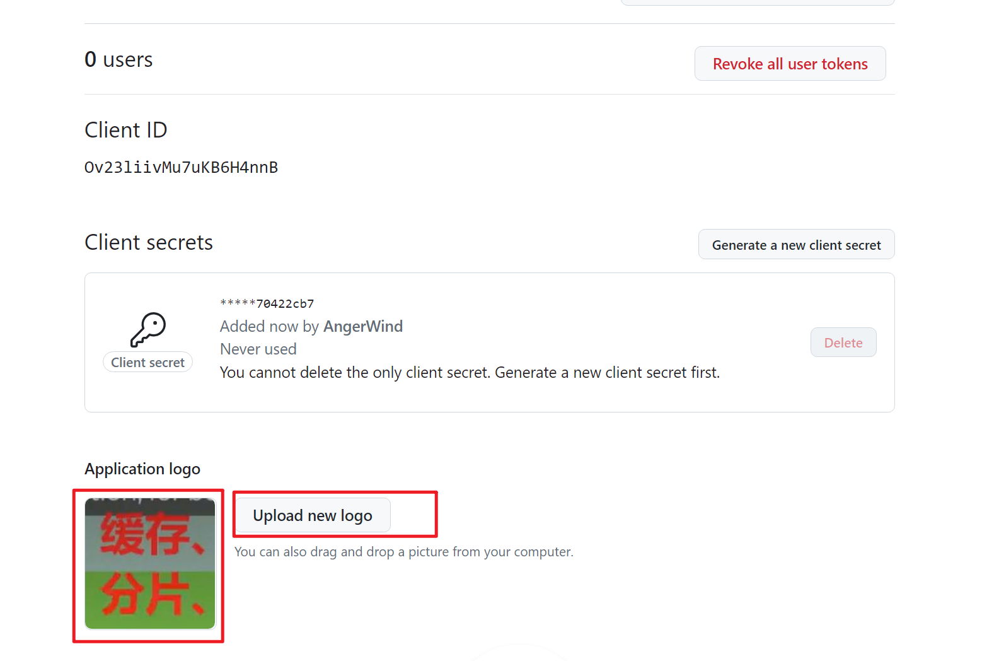

   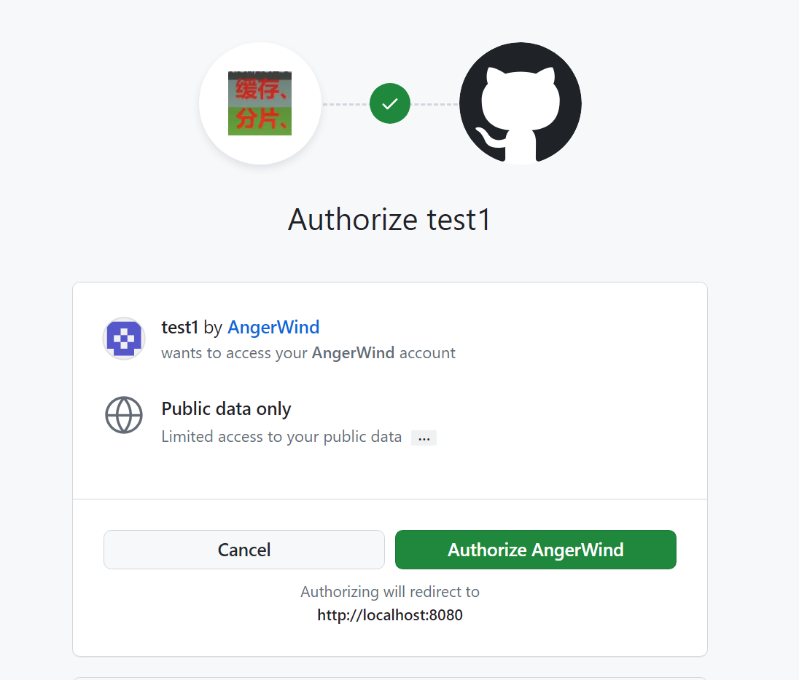

2. 创建一个Spring项目,  只需要添加SpringMVC相关依赖包

3. 在`resource/static`下创建一个`main.html`, 用来模拟一些不需要授权集合访问的页面, 内容如下:

   ~~~html
   <!DOCTYPE html>
   <html lang="en">
   <head>
     <meta charset="UTF-8">
     <title>Title</title>
   </head>
   <body>
   <h3>一些其他内容</h3><br>
   <button id="btn">点击</button>
   <script>
     var btn = document.getElementById('btn');
     // 登录成功之后要跳转回当前页面, 所以需要将当前页面的url传过去到login页面中
     btn.addEventListener('click', function () {
       location.href = "http://localhost:8080/login.html?redirect_to=" + location.href;
     })
   </script>
   </body>
   </html>
   ~~~

   

4. 在`resource/static`下创建一个`login.html`, 内容如下

   ~~~html
   <!DOCTYPE html>
   <html lang="en">
   <head>
     <meta charset="UTF-8">
     <title>Title</title>
   </head>
   <body>
   <svg id="github" height="32" viewBox="0 0 16 16" version="1.1" width="32" aria-hidden="true">
     <path fill-rule="evenodd"
           d="M8 0C3.58 0 0 3.58 0 8c0 3.54 2.29 6.53 5.47 7.59.4.07.55-.17.55-.38 0-.19-.01-.82-.01-1.49-2.01.37-2.53-.49-2.69-.94-.09-.23-.48-.94-.82-1.13-.28-.15-.68-.52-.01-.53.63-.01 1.08.58 1.23.82.72 1.21 1.87.87 2.33.66.07-.52.28-.87.51-1.07-1.78-.2-3.64-.89-3.64-3.95 0-.87.31-1.59.82-2.15-.08-.2-.36-1.02.08-2.12 0 0 .67-.21 2.2.82.64-.18 1.32-.27 2-.27.68 0 1.36.09 2 .27 1.53-1.04 2.2-.82 2.2-.82.44 1.1.16 1.92.08 2.12.51.56.82 1.27.82 2.15 0 3.07-1.87 3.75-3.65 3.95.29.25.54.73.54 1.48 0 1.07-.01 1.93-.01 2.2 0 .21.15.46.55.38A8.013 8.013 0 0 0 16 8c0-4.42-3.58-8-8-8z"></path>
   </svg>
   <script>
     var github = document.getElementById('github');
       // 用户点击按钮后, 要跳转到github的授权页面
     github.addEventListener('click', function () {
       let redirect_to; // 从哪个页面跳转到login页面的
       let params = new URLSearchParams(location.search);
       if (params.has("redirect_to")) {
         redirect_to = params.get("redirect_to");
       } else {
         redirect_to = "http://localhost:8080/index";
       }
         // 这里的redirect_uri必须是我们注册应用的时候填的链接, 不能修改
         // 但是我们给这个链接添加各种queryString
         // 比如这里我们就添加了一个参数redirectPage用来表示授权之后要跳转的页面
       location.href = "https://github.com/login/oauth/authorize?client_id=Ov23liivMu7uKB6H4nnB&redirect_uri=http://localhost:8080/callback?redirectPage=" + redirect_to;
     });
   </script>
   </body>
   </html>
   ~~~

5. 当用户点击授权时, github会生成一个code,  然后控制js携带该属性, 跳转到我们刚刚`redirect_uri`参数指定的链接上

   ~~~text
   http://localhost:8080/callback?redirectPage=http://localhost:8080/main.html&code=xxxxxx
   ~~~

6. 创建一个Controller来接收这个请求, 并在Controller中, 使用这个code去访问github, 来获取access token, 然后使用access token去获取用户信息

   ~~~java
   @Controller
   public class OAuthController {
   
       private String clientId= "Ov23liivMu7uKB6H4nnB";
       private String clientSecret = "0a78500b7d76f51f61dea3498c45a91170422cb7";
       // 这个链接必须是注册应用时填写的回调地址, 否则会报错
       private String redirectUri = "http://localhost:8080/callback";
   
       // 获取access token的github地址
       public static final String accessTokenUrl = "https://github.com/login/oauth/access_token";
       public static final HttpMethod accessTokenMethod =  HttpMethod.POST;
   
       // 获取用户信息的github地址
       public static final String userInfoUrl = "https://api.github.com/user";
       public static final HttpMethod userInfoMethod = HttpMethod.GET;
   
       RestTemplate restTemplate;
   
       @PostConstruct
       public void init() {
           SimpleClientHttpRequestFactory requestFactory = new SimpleClientHttpRequestFactory();
           // 配置代理服务器, 否则连接不上github
           Proxy proxy = new Proxy(Proxy.Type.HTTP, new InetSocketAddress("127.0.0.1", 7890));
           requestFactory.setProxy(proxy);
           restTemplate = new RestTemplate(requestFactory);
       }
   
   
       @GetMapping("/callback")
       public String githubCallback(@RequestParam("code") String code, @RequestParam("redirectPage") String redirectTo)
           throws  JsonProcessingException {
   
           ResponseEntity<Map> response = requestForAccessToken(code);
           if (response.getStatusCode() == HttpStatus.OK && response.getBody() != null) {
               Map body = response.getBody();
               // todo accessToken需要保存到数据库
               String accessToken = (String)body.get("access_token");
               String scope = (String)body.get("scope");
               String tokenType = (String) body.get("token_type");
   
               // 使用access token获取用户信息
               ResponseEntity<Map<String, Object>> userResponse = requestForUserInfo(accessToken);
               if (userResponse.getStatusCode() == HttpStatus.OK && userResponse.getBody() != null) {
                   Map<String, Object> userInfo = userResponse.getBody();
                   userInfo.forEach((key, value) -> System.out.println(key + ":" + value));
                   
                   // todo  设置jwt, cookie等, 使得之后的请求带上用户信息
                   
                   // 跳转回原来的页面
                   return "redirect:" + redirectTo;
               } else {
                   throw new RuntimeException("获取用户信息失败");
               }
           } else {
               throw new RuntimeException("获取access token失败");
           }
   
       }
       
       private ResponseEntity<Map> requestForAccessToken(String code) {
           // 需要在url上设置这四个queryString
           UriComponentsBuilder builder = UriComponentsBuilder.fromHttpUrl(accessTokenUrl)
               .queryParam("client_id", clientId)
               .queryParam("client_secret", clientSecret)
               .queryParam("code", code)
               .queryParam("redirect_uri", redirectUri);
   
           // 告诉github返回json格式的数据
           HttpHeaders headers = new HttpHeaders();
           headers.setAccept(List.of(MediaType.APPLICATION_JSON));
           HttpEntity<String> entity = new HttpEntity<>(headers);
   
           // 发送请求
           return restTemplate.exchange(builder.toUriString(), accessTokenMethod, entity, Map.class);
       }
   
       private ResponseEntity<Map<String, Object>> requestForUserInfo(String accessToken) {
           UriComponentsBuilder builder = UriComponentsBuilder.fromHttpUrl(userInfoUrl);
   
           // 告诉github返回json格式的数据
           HttpHeaders headers = new HttpHeaders();
           // 将access token 放在请求头中
           headers.add("Authorization", "Bearer " + accessToken);
           HttpEntity<String> entity = new HttpEntity<>(headers);
   
           // 发送请求
           return restTemplate.exchange(builder.toUriString(), userInfoMethod, entity, new ParameterizedTypeReference<Map<String, Object>>() {});
       }
   }
   
   ~~~


## 5. SSO单点登录

其实sso单点登录和前面的oauth2登录github的原理是类似的,  不同的是授权中心是我们自己的内部系统

1. 用户访问app1的http://app1.com/aa的前端页面
2. http://app1.com/aa前端页面发现此时没有登录, 通过js控制跳转到http://sso.com/login?returnPage=http://app1.com/aa
3. 用户在sso页面上登录,  登录成功后生成一个jwt和一个token, 后续对sso的请求都带上这个jwt就可以了
4. 前端的登录页面接受到这个token后, 通过js访问app1系统的指定后端接口
5. 在app1系统的指定后端接口中,  我们使用这个token去sso中校验, 校验成功就生成jwt, 后续访问app1系统都会带上这个jwt
6. 前端接受到这个jwt之后, 跳转回一开始的那个页面
7. 当用户访问app2时, 前端页面发现没有登录, 跳转到http://sso.com/login?returnPage=http://app2.com/aa
8. 此时sso也会生成一个token, 并访问app2系统的指定后端接口
9. 在app2系统的指定后端接口中, 也会使用token去访问sso系统, 校验成功同样生成jwt, 然后跳转回原来的系统


## 3. Spring中的OAuth2

在OAuth2中的四种角色: 资源拥有者, 客户应用, 资源服务器, 授权服务器

在spring security的子项目中已经帮我们实现了客户应用, 资源服务器所需要的代码

如果我们需要实现一个接入oauth2的客户应用, 那么需要导入:

~~~xml
<!-- 客户应用 -->
<dependency>
	<groupId>org.springframework.boot</groupId>
	<artifactId>spring-boot-starter-oauth2-client</artifactId>
</dependency>
~~~

如果我们想要实现一个资源服务器, 那么需要导入

~~~xml
<!-- 资源服务器 -->
<dependency>
	<groupId>org.springframework.boot</groupId>
	<artifactId>spring-boot-starter-oauth2-resource-server</artifactId>
</dependency>
~~~

而如果我们想要实现授权服务器, 那么我看可以使用Spring Authorization Server, 它是在Spring Security之上的一个单独的项目。

~~~xml
<!-- 授权服务器 -->
<dependency>
    <groupId>org.springframework.boot</groupId>
    <artifactId>spring-boot-starter-oauth2-authorization-server</artifactId>
</dependency>
~~~


## 4. 使用Spring OAuth2接入GitHub

### 3.1、创建应用

**注册客户应用：**

登录GitHub，在开发者设置中找到OAuth Apps，创建一个application，为客户应用创建访问GitHub的凭据：

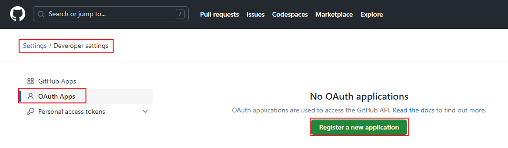


填写应用信息：`默认的重定向URI模板为{baseUrl}/login/oauth2/code/{registrationId}`。registrationId是ClientRegistration的唯一标识符。


获取应用程序id，生成应用程序密钥：


### 3.2、创建测试项目

创建一个springboot项目oauth2-login-demo，创建时引入如下依赖


示例代码参考：[spring-security-samples/servlet/spring-boot/java/oauth2/login at 6.2.x · spring-projects/spring-security-samples (github.com)](https://github.com/spring-projects/spring-security-samples/tree/6.2.x/servlet/spring-boot/java/oauth2/login)


### 3.3、配置OAuth客户端属性

application.yml：

```properties
spring:
  security:
    oauth2:
      client:
        registration:
          github:
            client-id: 7807cc3bb1534abce9f2
            client-secret: 008dc141879134433f4db7f62b693c4a5361771b
#            redirectUri: http://localhost:8200/login/oauth2/code/github
```


### 3.4、创建Controller

```java
package com.atguigu.oauthdemo.controller;

@Controller
public class IndexController {

    @GetMapping("/")
    public String index(
            Model model,
            @RegisteredOAuth2AuthorizedClient OAuth2AuthorizedClient authorizedClient,
            @AuthenticationPrincipal OAuth2User oauth2User) {
        model.addAttribute("userName", oauth2User.getName());
        model.addAttribute("clientName", authorizedClient.getClientRegistration().getClientName());
        model.addAttribute("userAttributes", oauth2User.getAttributes());
        return "index";
    }
}
```


### 3.5、创建html页面

resources/templates/index.html

```html
<!DOCTYPE html>
<html xmlns="http://www.w3.org/1999/xhtml" xmlns:th="https://www.thymeleaf.org" xmlns:sec="https://www.thymeleaf.org/thymeleaf-extras-springsecurity5">
<head>
    <title>Spring Security - OAuth 2.0 Login</title>
    <meta charset="utf-8" />
</head>
<body>
<div style="float: right" th:fragment="logout" sec:authorize="isAuthenticated()">
    <div style="float:left">
        <span style="font-weight:bold">User: </span><span sec:authentication="name"></span>
    </div>
    <div style="float:none">&nbsp;</div>
    <div style="float:right">
        <form action="#" th:action="@{/logout}" method="post">
            <input type="submit" value="Logout" />
        </form>
    </div>
</div>
<h1>OAuth 2.0 Login with Spring Security</h1>
<div>
    You are successfully logged in <span style="font-weight:bold" th:text="${userName}"></span>
    via the OAuth 2.0 Client <span style="font-weight:bold" th:text="${clientName}"></span>
</div>
<div>&nbsp;</div>
<div>
    <span style="font-weight:bold">User Attributes:</span>
    <ul>
        <li th:each="userAttribute : ${userAttributes}">
            <span style="font-weight:bold" th:text="${userAttribute.key}"></span>: <span th:text="${userAttribute.value}"></span>
        </li>
    </ul>
</div>
</body>
</html>
```


### 3.6、启动应用程序

- 启动程序并访问localhost:8080。浏览器将被重定向到默认的自动生成的登录页面，该页面显示了一个用于GitHub登录的链接。
- 点击GitHub链接，浏览器将被重定向到GitHub进行身份验证。
- 使用GitHub账户凭据进行身份验证后，用户会看到授权页面，询问用户是否允许或拒绝客户应用访问GitHub上的用户数据。点击允许以授权OAuth客户端访问用户的基本个人资料信息。
- 此时，OAuth客户端访问GitHub的获取用户信息的接口获取基本个人资料信息，并建立一个已认证的会话。


## 6. 案例分析

### 6.1、登录流程

1. **A 网站让用户跳转到 GitHub，并携带参数ClientID 以及 Redirection URI。**
2. GitHub 要求用户登录，然后询问用户"A 网站要求获取用户信息的权限，你是否同意？"
3. 用户同意，GitHub 就会重定向回 A 网站，同时发回一个授权码。
4. **A 网站使用授权码，向 GitHub 请求令牌。**
5. GitHub 返回令牌.
6. **A 网站使用令牌，向 GitHub 请求用户数据。**
7. GitHub返回用户数据
8. **A 网站使用 GitHub用户数据登录**

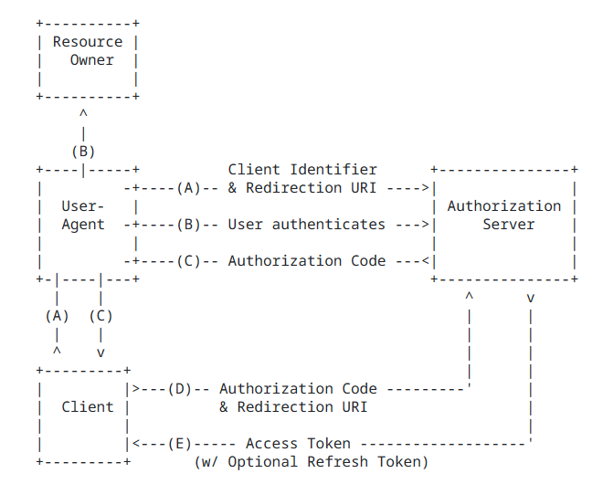

### 6.2、CommonOAuth2Provider

CommonOAuth2Provider是一个预定义的通用OAuth2Provider，为一些知名资源服务API提供商（如Google、GitHub、Facebook）预定义了一组默认的属性。

例如，**授权URI、令牌URI和用户信息URI**通常不经常变化。因此，提供默认值以减少所需的配置。

因此，当我们配置GitHub客户端时，只需要提供client-id和client-secret属性。

```java
GITHUB {
    public ClientRegistration.Builder getBuilder(String registrationId) {
        ClientRegistration.Builder builder = this.getBuilder(
        registrationId, 
        ClientAuthenticationMethod.CLIENT_SECRET_BASIC, 
        
        //授权回调地址(GitHub向客户应用发送回调请求，并携带授权码)   
		"{baseUrl}/{action}/oauth2/code/{registrationId}");
        builder.scope(new String[]{"read:user"});
        //授权页面
        builder.authorizationUri("https://github.com/login/oauth/authorize");
        //客户应用使用授权码，向 GitHub 请求令牌
        builder.tokenUri("https://github.com/login/oauth/access_token");
        //客户应用使用令牌向GitHub请求用户数据
        builder.userInfoUri("https://api.github.com/user");
        //username属性显示GitHub中获取的哪个属性的信息
        builder.userNameAttributeName("id");
        //登录页面超链接的文本
        builder.clientName("GitHub");
        return builder;
    }
},
```


